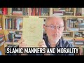

# Islamic manners and morality (2022-03-22)

## Description

You Can Support My Work on Patreon:
https://www.patreon.com/Bloggingtheology
My Paypal Link: 
https://www.paypal.com/paypalme/bloggingtheology?locale.x=en_GB

## Summary of [Islamic manners and morality](https://www.youtube.com/watch?v=HWzf359ROjw)

*This summary is AI generated - there may be inaccuracies. *

### [00:00:00](https://www.youtube.com/watch?v=HWzf359ROjw&t=0) - [00:10:00](https://www.youtube.com/watch?v=HWzf359ROjw&t=600)

This video discusses the importance of respecting and caring for elderly people in Islamic societies. It points out that this is typically done with patience and hope for reward from God. In the west, however, it is often shameful for families to take care of their elderly members and they are often sent away to special homes. This is contrasted with the way elderly people are treated in Islamic societies, where they are typically cared for by their families with patience and hope for reward from God.

**[00:00:00](https://www.youtube.com/watch?v=HWzf359ROjw&t=0)** This book, Imam al-Bukhari's al-Adab al-Mufrad, is a compilation of hadiths on good manners, etiquette, and morality. It is considered very reliable by Muslims, and includes hadiths on topics such as compassion for young and old, respect for elders, and honoring those who know the Quran well. There is much to learn from these hadiths, and they provide insight into the Muslim view of respecting and caring for the elderly.
* **[00:05:00](https://www.youtube.com/watch?v=HWzf359ROjw&t=300)** The video discusses the importance of respecting and caring for elderly people in Islamic societies. It points out that this is typically done with patience and hope for reward from God. In the west, however, it is often shameful for families to take care of their elderly members and they are often sent away to special homes. This is contrasted with the way elderly people are treated in Islamic societies, where they are typically cared for by their families with patience and hope for reward from God.
* **[00:10:00](https://www.youtube.com/watch?v=HWzf359ROjw&t=600)** This video discusses Islamic morals and manners, which are different from Western morals. The elderly are respected in Islam, and family values are based on providing care for them within the home. Elderly care is cut off from any theocentric understanding in the West, which is focused on seeking pleasure and money. Elderly care in the West is often divorced from any sense of rewards in God.

<h2>Full transcript with timestamps: CLICK TO EXPAND</h2>

[0:00:01](https://youtu.be/HWzf359ROjw?t=1) i find the whole subject of islamic  
[0:00:04](https://youtu.be/HWzf359ROjw?t=4) etiquette manners and morality to be  
[0:00:06](https://youtu.be/HWzf359ROjw?t=6) absolutely fascinating and i wanted to  
[0:00:08](https://youtu.be/HWzf359ROjw?t=8) share with you an extract from this  
[0:00:10](https://youtu.be/HWzf359ROjw?t=10) wonderful book  
[0:00:12](https://youtu.be/HWzf359ROjw?t=12) it's called imam al-bukhari's al-adab  
[0:00:15](https://youtu.be/HWzf359ROjw?t=15) al-mufrad with full commentary it's a  
[0:00:19](https://youtu.be/HWzf359ROjw?t=19) perfect code for manners and morality  
[0:00:22](https://youtu.be/HWzf359ROjw?t=22) and this is a really thick book and it's  
[0:00:24](https://youtu.be/HWzf359ROjw?t=24) actually quite cheap to get these days  
[0:00:26](https://youtu.be/HWzf359ROjw?t=26) as well and on the back it says this  
[0:00:28](https://youtu.be/HWzf359ROjw?t=28) imam al-bukhari is best known for being  
[0:00:32](https://youtu.be/HWzf359ROjw?t=32) the author of the rigorously  
[0:00:34](https://youtu.be/HWzf359ROjw?t=34) authenticated collection of hadiths  
[0:00:37](https://youtu.be/HWzf359ROjw?t=37) known as the sahih  
[0:00:39](https://youtu.be/HWzf359ROjw?t=39) this islamic work is deemed by muslims  
[0:00:41](https://youtu.be/HWzf359ROjw?t=41) to be the most authentically transmitted  
[0:00:44](https://youtu.be/HWzf359ROjw?t=44) work after the quran and while it  
[0:00:47](https://youtu.be/HWzf359ROjw?t=47) includes roughly  
[0:00:49](https://youtu.be/HWzf359ROjw?t=49) 250 hadiths on adab this word meaning  
[0:00:53](https://youtu.be/HWzf359ROjw?t=53) good manners etiquette moral values  
[0:00:56](https://youtu.be/HWzf359ROjw?t=56) al-bukhari also dedicated a larger  
[0:00:59](https://youtu.be/HWzf359ROjw?t=59) separate work  
[0:01:00](https://youtu.be/HWzf359ROjw?t=60) to these very important areas that are  
[0:01:03](https://youtu.be/HWzf359ROjw?t=63) relevant to the muslims daily lives and  
[0:01:05](https://youtu.be/HWzf359ROjw?t=65) this separate work is known as this  
[0:01:09](https://youtu.be/HWzf359ROjw?t=69) al-adab al-mufrad and the present volume  
[0:01:13](https://youtu.be/HWzf359ROjw?t=73) presents the work in translation with a  
[0:01:16](https://youtu.be/HWzf359ROjw?t=76) complete commentary so this is an  
[0:01:18](https://youtu.be/HWzf359ROjw?t=78) absolute treasure if you want to  
[0:01:20](https://youtu.be/HWzf359ROjw?t=80) focus on  
[0:01:22](https://youtu.be/HWzf359ROjw?t=82) rigorously authenticated hadiths on a  
[0:01:24](https://youtu.be/HWzf359ROjw?t=84) dab  
[0:01:25](https://youtu.be/HWzf359ROjw?t=85) now chapter 19 of this i just really  
[0:01:28](https://youtu.be/HWzf359ROjw?t=88) like it's entitled young and old young  
[0:01:31](https://youtu.be/HWzf359ROjw?t=91) and old i'm going to read um several  
[0:01:33](https://youtu.be/HWzf359ROjw?t=93) hadiths from this selected by bukhari  
[0:01:36](https://youtu.be/HWzf359ROjw?t=96) obviously  
[0:01:37](https://youtu.be/HWzf359ROjw?t=97) and some of the commentary which i think  
[0:01:39](https://youtu.be/HWzf359ROjw?t=99) is really helpful when it comes to  
[0:01:41](https://youtu.be/HWzf359ROjw?t=101) etiquette manners  
[0:01:43](https://youtu.be/HWzf359ROjw?t=103) how we should view young and old  
[0:01:47](https://youtu.be/HWzf359ROjw?t=107) and the chapter begins with some  
[0:01:49](https://youtu.be/HWzf359ROjw?t=109) comments  
[0:01:50](https://youtu.be/HWzf359ROjw?t=110) some hadiths were reported by different  
[0:01:53](https://youtu.be/HWzf359ROjw?t=113) companions of the prophet and in  
[0:01:54](https://youtu.be/HWzf359ROjw?t=114) different chains of transmission  
[0:01:57](https://youtu.be/HWzf359ROjw?t=117) this indicates that the prophet might  
[0:02:00](https://youtu.be/HWzf359ROjw?t=120) have said the hadith on different  
[0:02:01](https://youtu.be/HWzf359ROjw?t=121) occasions to different people or that he  
[0:02:04](https://youtu.be/HWzf359ROjw?t=124) might have said it on an occasion when  
[0:02:06](https://youtu.be/HWzf359ROjw?t=126) he had a large audience  
[0:02:09](https://youtu.be/HWzf359ROjw?t=129) and then uh  
[0:02:11](https://youtu.be/HWzf359ROjw?t=131) several hadith quoted and i'll just  
[0:02:13](https://youtu.be/HWzf359ROjw?t=133) mention a few of them number three five  
[0:02:15](https://youtu.be/HWzf359ROjw?t=135) five  
[0:02:16](https://youtu.be/HWzf359ROjw?t=136) abu herrera reports that the prophet  
[0:02:19](https://youtu.be/HWzf359ROjw?t=139) said  
[0:02:20](https://youtu.be/HWzf359ROjw?t=140) a person who is not compassionate to our  
[0:02:23](https://youtu.be/HWzf359ROjw?t=143) young  
[0:02:24](https://youtu.be/HWzf359ROjw?t=144) and does not respect the rights of our  
[0:02:27](https://youtu.be/HWzf359ROjw?t=147) old people  
[0:02:28](https://youtu.be/HWzf359ROjw?t=148) does not belong to us  
[0:02:31](https://youtu.be/HWzf359ROjw?t=151) okay that's one another one  
[0:02:34](https://youtu.be/HWzf359ROjw?t=154) uh hadith number 357  
[0:02:37](https://youtu.be/HWzf359ROjw?t=157) abdullah ibn amma reports that the  
[0:02:39](https://youtu.be/HWzf359ROjw?t=159) prophet said  
[0:02:41](https://youtu.be/HWzf359ROjw?t=161) he does not belong to us who does not  
[0:02:44](https://youtu.be/HWzf359ROjw?t=164) show due respect to our elderly and is  
[0:02:47](https://youtu.be/HWzf359ROjw?t=167) not compassionate to our young  
[0:02:51](https://youtu.be/HWzf359ROjw?t=171) and the last hadith i'm going to quote  
[0:02:53](https://youtu.be/HWzf359ROjw?t=173) here 359  
[0:02:56](https://youtu.be/HWzf359ROjw?t=176) al-ashari said  
[0:02:58](https://youtu.be/HWzf359ROjw?t=178) it is a mark of glorifying god to honor  
[0:03:02](https://youtu.be/HWzf359ROjw?t=182) muslims who have gone grey to respect a  
[0:03:05](https://youtu.be/HWzf359ROjw?t=185) person who knows a quran by heart  
[0:03:08](https://youtu.be/HWzf359ROjw?t=188) provided that he neither goes to excess  
[0:03:11](https://youtu.be/HWzf359ROjw?t=191) nor is negligent of it  
[0:03:13](https://youtu.be/HWzf359ROjw?t=193) and to honor a ruler who maintains  
[0:03:16](https://youtu.be/HWzf359ROjw?t=196) justice  
[0:03:18](https://youtu.be/HWzf359ROjw?t=198) now there's some commentary on me it's  
[0:03:20](https://youtu.be/HWzf359ROjw?t=200) very interesting and it shows really  
[0:03:22](https://youtu.be/HWzf359ROjw?t=202) also the differences between the muslim  
[0:03:24](https://youtu.be/HWzf359ROjw?t=204) view of the elderly and the young and  
[0:03:27](https://youtu.be/HWzf359ROjw?t=207) the prevalent western view of the same  
[0:03:30](https://youtu.be/HWzf359ROjw?t=210) and the differences i think are striking  
[0:03:33](https://youtu.be/HWzf359ROjw?t=213) and there's much to learn and much food  
[0:03:35](https://youtu.be/HWzf359ROjw?t=215) for thought here  
[0:03:37](https://youtu.be/HWzf359ROjw?t=217) so um our author says in these hadiths  
[0:03:39](https://youtu.be/HWzf359ROjw?t=219) the prophet mentions two groups for  
[0:03:42](https://youtu.be/HWzf359ROjw?t=222) special treatment  
[0:03:44](https://youtu.be/HWzf359ROjw?t=224) the young who need compassion more than  
[0:03:47](https://youtu.be/HWzf359ROjw?t=227) anything else in the way we treat them  
[0:03:50](https://youtu.be/HWzf359ROjw?t=230) and the old who need respect  
[0:03:53](https://youtu.be/HWzf359ROjw?t=233) people may love the young and  
[0:03:55](https://youtu.be/HWzf359ROjw?t=235) instinctively be kind to them  
[0:03:58](https://youtu.be/HWzf359ROjw?t=238) but they may also feel them to be a  
[0:04:00](https://youtu.be/HWzf359ROjw?t=240) burden particularly when a child is  
[0:04:03](https://youtu.be/HWzf359ROjw?t=243) rebellious  
[0:04:04](https://youtu.be/HWzf359ROjw?t=244) ill or unable to express its needs  
[0:04:09](https://youtu.be/HWzf359ROjw?t=249) compassion eases any difficulty that a  
[0:04:13](https://youtu.be/HWzf359ROjw?t=253) child may cause  
[0:04:15](https://youtu.be/HWzf359ROjw?t=255) it motivates the adult to try to  
[0:04:18](https://youtu.be/HWzf359ROjw?t=258) understand the child and identify the  
[0:04:21](https://youtu.be/HWzf359ROjw?t=261) causes of its unhappiness or irritation  
[0:04:25](https://youtu.be/HWzf359ROjw?t=265) enhancing the first and dealing with the  
[0:04:28](https://youtu.be/HWzf359ROjw?t=268) second  
[0:04:29](https://youtu.be/HWzf359ROjw?t=269) therefore  
[0:04:30](https://youtu.be/HWzf359ROjw?t=270) the prophet stresses the need to be  
[0:04:32](https://youtu.be/HWzf359ROjw?t=272) compassionate to children in all these  
[0:04:36](https://youtu.be/HWzf359ROjw?t=276) hadiths  
[0:04:38](https://youtu.be/HWzf359ROjw?t=278) on the other hand these hadiths focus on  
[0:04:41](https://youtu.be/HWzf359ROjw?t=281) the treatment that should be given to  
[0:04:43](https://youtu.be/HWzf359ROjw?t=283) elderly people  
[0:04:45](https://youtu.be/HWzf359ROjw?t=285) it goes without saying that when one  
[0:04:47](https://youtu.be/HWzf359ROjw?t=287) grows old one's strength declines  
[0:04:52](https://youtu.be/HWzf359ROjw?t=292) several faculties weaken including  
[0:04:55](https://youtu.be/HWzf359ROjw?t=295) memory  
[0:04:56](https://youtu.be/HWzf359ROjw?t=296) hearing and eyesight  
[0:04:59](https://youtu.be/HWzf359ROjw?t=299) some elderly people may become unable to  
[0:05:02](https://youtu.be/HWzf359ROjw?t=302) express themselves as well as they used  
[0:05:05](https://youtu.be/HWzf359ROjw?t=305) to  
[0:05:06](https://youtu.be/HWzf359ROjw?t=306) the problem is that there is little hope  
[0:05:08](https://youtu.be/HWzf359ROjw?t=308) of recovery indeed the reverse is true  
[0:05:11](https://youtu.be/HWzf359ROjw?t=311) and the weakness is increased as time  
[0:05:14](https://youtu.be/HWzf359ROjw?t=314) goes by otherwise it just gets worse  
[0:05:17](https://youtu.be/HWzf359ROjw?t=317) progressively and worse  
[0:05:19](https://youtu.be/HWzf359ROjw?t=319) hence some people may treat treat an  
[0:05:22](https://youtu.be/HWzf359ROjw?t=322) elderly person with condemcension  
[0:05:25](https://youtu.be/HWzf359ROjw?t=325) which may hurt their feelings  
[0:05:29](https://youtu.be/HWzf359ROjw?t=329) to be kind to an elderly person showing  
[0:05:32](https://youtu.be/HWzf359ROjw?t=332) respect and understanding and  
[0:05:34](https://youtu.be/HWzf359ROjw?t=334) overlooking that they may be slow in one  
[0:05:38](https://youtu.be/HWzf359ROjw?t=338) thing or another are all easy for anyone  
[0:05:41](https://youtu.be/HWzf359ROjw?t=341) who has a clear sense of social values  
[0:05:45](https://youtu.be/HWzf359ROjw?t=345) and this is what the hadith brings he  
[0:05:47](https://youtu.be/HWzf359ROjw?t=347) brings these social values we can learn  
[0:05:50](https://youtu.be/HWzf359ROjw?t=350) much from the wisdom and experience of  
[0:05:53](https://youtu.be/HWzf359ROjw?t=353) older people  
[0:05:54](https://youtu.be/HWzf359ROjw?t=354) to dismiss any elderly person as someone  
[0:05:57](https://youtu.be/HWzf359ROjw?t=357) who is past usefulness is particularly  
[0:06:00](https://youtu.be/HWzf359ROjw?t=360) cruel and this happens unfortunately a  
[0:06:03](https://youtu.be/HWzf359ROjw?t=363) lot in the west these days  
[0:06:05](https://youtu.be/HWzf359ROjw?t=365) because it is easy to fall into this  
[0:06:07](https://youtu.be/HWzf359ROjw?t=367) trap the prophet repeatedly stressed the  
[0:06:10](https://youtu.be/HWzf359ROjw?t=370) importance of showing respect and  
[0:06:13](https://youtu.be/HWzf359ROjw?t=373) kindness to our elderly  
[0:06:16](https://youtu.be/HWzf359ROjw?t=376) they are people we should honor  
[0:06:20](https://youtu.be/HWzf359ROjw?t=380) hadith number  
[0:06:22](https://youtu.be/HWzf359ROjw?t=382) 359 already quoted provides a good  
[0:06:25](https://youtu.be/HWzf359ROjw?t=385) example of how the prophet combined the  
[0:06:28](https://youtu.be/HWzf359ROjw?t=388) treatment of three different categories  
[0:06:30](https://youtu.be/HWzf359ROjw?t=390) of people under one heading  
[0:06:33](https://youtu.be/HWzf359ROjw?t=393) the hadith says just to remind us it is  
[0:06:36](https://youtu.be/HWzf359ROjw?t=396) a mark of glorifying god to honor  
[0:06:39](https://youtu.be/HWzf359ROjw?t=399) muslims who have gone gray to respect a  
[0:06:42](https://youtu.be/HWzf359ROjw?t=402) person who knows the quran by heart  
[0:06:46](https://youtu.be/HWzf359ROjw?t=406) provided that he neither goes to excess  
[0:06:49](https://youtu.be/HWzf359ROjw?t=409) nor is negligent of it  
[0:06:51](https://youtu.be/HWzf359ROjw?t=411) and to honor a ruler who maintains  
[0:06:54](https://youtu.be/HWzf359ROjw?t=414) justice  
[0:06:56](https://youtu.be/HWzf359ROjw?t=416) an elderly person who has gone gray may  
[0:06:59](https://youtu.be/HWzf359ROjw?t=419) be only an ordinary person who never  
[0:07:02](https://youtu.be/HWzf359ROjw?t=422) aspired to high position  
[0:07:04](https://youtu.be/HWzf359ROjw?t=424) he may be far removed from the person in  
[0:07:08](https://youtu.be/HWzf359ROjw?t=428) power whom the hadith tells us to honor  
[0:07:11](https://youtu.be/HWzf359ROjw?t=431) if he maintains justice  
[0:07:14](https://youtu.be/HWzf359ROjw?t=434) both may have little in common with a  
[0:07:16](https://youtu.be/HWzf359ROjw?t=436) person who has learned the quran by  
[0:07:19](https://youtu.be/HWzf359ROjw?t=439) heart the latter may only be a youth in  
[0:07:22](https://youtu.be/HWzf359ROjw?t=442) his teens or even younger much younger  
[0:07:25](https://youtu.be/HWzf359ROjw?t=445) people these days remember the quran in  
[0:07:27](https://youtu.be/HWzf359ROjw?t=447) its entirety it's remarkable  
[0:07:29](https://youtu.be/HWzf359ROjw?t=449) nevertheless the prophet tells us that  
[0:07:31](https://youtu.be/HWzf359ROjw?t=451) to honor all these people is a mark of  
[0:07:35](https://youtu.be/HWzf359ROjw?t=455) proper glorification of god  
[0:07:38](https://youtu.be/HWzf359ROjw?t=458) it goes without saying that to glorify  
[0:07:41](https://youtu.be/HWzf359ROjw?t=461) god is an act of worship which is  
[0:07:43](https://youtu.be/HWzf359ROjw?t=463) required by a muslim throughout his life  
[0:07:48](https://youtu.be/HWzf359ROjw?t=468) this is indeed the mark of true faith  
[0:07:51](https://youtu.be/HWzf359ROjw?t=471) therefore when the prophet defines a  
[0:07:54](https://youtu.be/HWzf359ROjw?t=474) certain type of behavior in society  
[0:07:56](https://youtu.be/HWzf359ROjw?t=476) relating it to the glorification of god  
[0:08:00](https://youtu.be/HWzf359ROjw?t=480) he emphasizes its importance as a proper  
[0:08:04](https://youtu.be/HWzf359ROjw?t=484) islamic attitude consequently muslims  
[0:08:07](https://youtu.be/HWzf359ROjw?t=487) acquire this as part of their social  
[0:08:10](https://youtu.be/HWzf359ROjw?t=490) values  
[0:08:12](https://youtu.be/HWzf359ROjw?t=492) this is the reason why the elderly have  
[0:08:16](https://youtu.be/HWzf359ROjw?t=496) always enjoyed a position of respect in  
[0:08:19](https://youtu.be/HWzf359ROjw?t=499) muslim societies now this next paragraph  
[0:08:22](https://youtu.be/HWzf359ROjw?t=502) i find is so  
[0:08:24](https://youtu.be/HWzf359ROjw?t=504) heart rendering and striking as a  
[0:08:26](https://youtu.be/HWzf359ROjw?t=506) westerner living in the west obviously  
[0:08:29](https://youtu.be/HWzf359ROjw?t=509) um the situation is so different from  
[0:08:31](https://youtu.be/HWzf359ROjw?t=511) the way it's described here so i'll just  
[0:08:34](https://youtu.be/HWzf359ROjw?t=514) perhaps make some comments after reading  
[0:08:36](https://youtu.be/HWzf359ROjw?t=516) the paragraph  
[0:08:37](https://youtu.be/HWzf359ROjw?t=517) this is the reason to repeat why the  
[0:08:40](https://youtu.be/HWzf359ROjw?t=520) elderly have always enjoyed a position  
[0:08:42](https://youtu.be/HWzf359ROjw?t=522) of respect  
[0:08:44](https://youtu.be/HWzf359ROjw?t=524) in muslim societies  
[0:08:46](https://youtu.be/HWzf359ROjw?t=526) wherever we may go in the muslim world  
[0:08:49](https://youtu.be/HWzf359ROjw?t=529) we find families taking care of their  
[0:08:52](https://youtu.be/HWzf359ROjw?t=532) elders even when providing such care  
[0:08:55](https://youtu.be/HWzf359ROjw?t=535) involves putting in much effort and  
[0:08:58](https://youtu.be/HWzf359ROjw?t=538) represents a heavy burden  
[0:09:01](https://youtu.be/HWzf359ROjw?t=541) looking after a senile or inva  
[0:09:05](https://youtu.be/HWzf359ROjw?t=545) invalid person  
[0:09:07](https://youtu.be/HWzf359ROjw?t=547) may be very hard and tiring  
[0:09:11](https://youtu.be/HWzf359ROjw?t=551) muslim families undertake these tasks  
[0:09:13](https://youtu.be/HWzf359ROjw?t=553) with patience hoping to receive god's  
[0:09:16](https://youtu.be/HWzf359ROjw?t=556) reward  
[0:09:18](https://youtu.be/HWzf359ROjw?t=558) in fact old people's homes are scarce in  
[0:09:22](https://youtu.be/HWzf359ROjw?t=562) muslim societies to repeat that old  
[0:09:25](https://youtu.be/HWzf359ROjw?t=565) people's homes are scarce in muslim  
[0:09:28](https://youtu.be/HWzf359ROjw?t=568) societies because society makes it  
[0:09:30](https://youtu.be/HWzf359ROjw?t=570) shameful  
[0:09:32](https://youtu.be/HWzf359ROjw?t=572) for a family to relinquish its duty of  
[0:09:35](https://youtu.be/HWzf359ROjw?t=575) providing proper care for its elderly  
[0:09:40](https://youtu.be/HWzf359ROjw?t=580) i this is this is so heart-rending uh in  
[0:09:43](https://youtu.be/HWzf359ROjw?t=583) in britain and i know it's true in many  
[0:09:44](https://youtu.be/HWzf359ROjw?t=584) other places in the west when a person  
[0:09:47](https://youtu.be/HWzf359ROjw?t=587) reaches a very advanced age they are  
[0:09:49](https://youtu.be/HWzf359ROjw?t=589) basically sent to special homes away  
[0:09:52](https://youtu.be/HWzf359ROjw?t=592) from the family where they are looked  
[0:09:54](https://youtu.be/HWzf359ROjw?t=594) after by professional nurses or support  
[0:09:57](https://youtu.be/HWzf359ROjw?t=597) workers  
[0:09:59](https://youtu.be/HWzf359ROjw?t=599) and they all live together and they just  
[0:10:01](https://youtu.be/HWzf359ROjw?t=601) watch television all day and they're  
[0:10:02](https://youtu.be/HWzf359ROjw?t=602) looked after guys by it's very very  
[0:10:05](https://youtu.be/HWzf359ROjw?t=605) different they're taking it taken away  
[0:10:07](https://youtu.be/HWzf359ROjw?t=607) from their families nearly always and  
[0:10:09](https://youtu.be/HWzf359ROjw?t=609) putting special homes away from their  
[0:10:12](https://youtu.be/HWzf359ROjw?t=612) loved ones and there they live out days  
[0:10:15](https://youtu.be/HWzf359ROjw?t=615) often without much love or care from  
[0:10:18](https://youtu.be/HWzf359ROjw?t=618) their family and it's just awful and i'm  
[0:10:20](https://youtu.be/HWzf359ROjw?t=620) not blaming anyone it's just the way  
[0:10:22](https://youtu.be/HWzf359ROjw?t=622) what the west is set up like this  
[0:10:24](https://youtu.be/HWzf359ROjw?t=624) uh and basically the elderly are not  
[0:10:26](https://youtu.be/HWzf359ROjw?t=626) respected they're seen as to be  
[0:10:28](https://youtu.be/HWzf359ROjw?t=628) marginalized and put away somewhere so  
[0:10:30](https://youtu.be/HWzf359ROjw?t=630) that we in our work working lives and  
[0:10:33](https://youtu.be/HWzf359ROjw?t=633) our professional lives don't have to  
[0:10:34](https://youtu.be/HWzf359ROjw?t=634) deal with the responsibilities of caring  
[0:10:37](https://youtu.be/HWzf359ROjw?t=637) for them and looking after them  
[0:10:39](https://youtu.be/HWzf359ROjw?t=639) but islamic social values are very  
[0:10:41](https://youtu.be/HWzf359ROjw?t=641) different and their family values based  
[0:10:43](https://youtu.be/HWzf359ROjw?t=643) on  
[0:10:44](https://youtu.be/HWzf359ROjw?t=644) providing proper care for its elderly  
[0:10:47](https://youtu.be/HWzf359ROjw?t=647) within the home within the family and i  
[0:10:49](https://youtu.be/HWzf359ROjw?t=649) think that is something the west can  
[0:10:51](https://youtu.be/HWzf359ROjw?t=651) learn from and look to to improve the  
[0:10:54](https://youtu.be/HWzf359ROjw?t=654) quality of life of everyone  
[0:10:56](https://youtu.be/HWzf359ROjw?t=656) and of course in the west it's it's  
[0:10:57](https://youtu.be/HWzf359ROjw?t=657) divorced from any sense of the rewards  
[0:10:59](https://youtu.be/HWzf359ROjw?t=659) of god and god's providing fat the  
[0:11:02](https://youtu.be/HWzf359ROjw?t=662) elderly uh support in families is  
[0:11:05](https://youtu.be/HWzf359ROjw?t=665) completely cut off from any theocentric  
[0:11:07](https://youtu.be/HWzf359ROjw?t=667) understanding of  
[0:11:09](https://youtu.be/HWzf359ROjw?t=669) our  
[0:11:10](https://youtu.be/HWzf359ROjw?t=670) our lives on earth which are basically  
[0:11:13](https://youtu.be/HWzf359ROjw?t=673) centered around seeking advancement and  
[0:11:16](https://youtu.be/HWzf359ROjw?t=676) pleasure and money and so on um  
[0:11:19](https://youtu.be/HWzf359ROjw?t=679) completely cut off from a larger  
[0:11:22](https://youtu.be/HWzf359ROjw?t=682) theological understanding theocentric  
[0:11:24](https://youtu.be/HWzf359ROjw?t=684) understanding of our purpose in life  
[0:11:27](https://youtu.be/HWzf359ROjw?t=687) anyway i just wanted to share um those  
[0:11:29](https://youtu.be/HWzf359ROjw?t=689) lovely hadith uh from chapter 19 young  
[0:11:32](https://youtu.be/HWzf359ROjw?t=692) and old and this book uh which i do  
[0:11:35](https://youtu.be/HWzf359ROjw?t=695) recommend is really thick you can see i  
[0:11:38](https://youtu.be/HWzf359ROjw?t=698) mean there's literally thousands of  
[0:11:40](https://youtu.be/HWzf359ROjw?t=700) hadith just on  
[0:11:42](https://youtu.be/HWzf359ROjw?t=702) manners and morality is a perfect code  
[0:11:45](https://youtu.be/HWzf359ROjw?t=705) it says for of manners and morality  
[0:11:48](https://youtu.be/HWzf359ROjw?t=708) compiled by imam al-bukhari so they're  
[0:11:50](https://youtu.be/HWzf359ROjw?t=710) all authentic and it's a marvelous  
[0:11:52](https://youtu.be/HWzf359ROjw?t=712) treasure to to own and god willing i  
[0:11:56](https://youtu.be/HWzf359ROjw?t=716) will  
[0:11:57](https://youtu.be/HWzf359ROjw?t=717) record other perhaps videos talking  
[0:12:00](https://youtu.be/HWzf359ROjw?t=720) about other hadiths as well till next  
[0:12:02](https://youtu.be/HWzf359ROjw?t=722) time  

