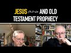

# Jesus عليه السلام  and Old Testament prophecy with Professor John J. Collins (2022-02-24 16:55:39+00:00)

## Description

You Can Support My Work on Patreon:
https://www.patreon.com/Bloggingtheology

My Paypal Link: 
https://www.paypal.com/paypalme/bloggingtheology?locale.x=en_GB

## Full transcript with timestamps

[0:00:02](https://youtu.be/VEGbGICJwBo?t=2) well hello everyone and welcome to  
[0:00:05](https://youtu.be/VEGbGICJwBo?t=5) blogging theology today i am delighted  
[0:00:07](https://youtu.be/VEGbGICJwBo?t=7) to talk to professor john j collins you  
[0:00:10](https://youtu.be/VEGbGICJwBo?t=10) are most welcome sir  
[0:00:14](https://youtu.be/VEGbGICJwBo?t=14) thank you  
[0:00:15](https://youtu.be/VEGbGICJwBo?t=15) um john is the holmes professor of old  
[0:00:18](https://youtu.be/VEGbGICJwBo?t=18) testament criticism and interpretation  
[0:00:20](https://youtu.be/VEGbGICJwBo?t=20) at yale divinity school he has noted for  
[0:00:23](https://youtu.be/VEGbGICJwBo?t=23) his research in the hebrew bible and the  
[0:00:26](https://youtu.be/VEGbGICJwBo?t=26) dead sea scrolls and their relation to  
[0:00:29](https://youtu.be/VEGbGICJwBo?t=29) christian origins  
[0:00:31](https://youtu.be/VEGbGICJwBo?t=31) john is married to professor adela  
[0:00:33](https://youtu.be/VEGbGICJwBo?t=33) yarbro collins professor of new  
[0:00:36](https://youtu.be/VEGbGICJwBo?t=36) testament at yale divinity school with  
[0:00:39](https://youtu.be/VEGbGICJwBo?t=39) whom he has co-authored the excellent  
[0:00:41](https://youtu.be/VEGbGICJwBo?t=41) book this is it here king and messiah  
[0:00:44](https://youtu.be/VEGbGICJwBo?t=44) as son of god divine human and angelic  
[0:00:47](https://youtu.be/VEGbGICJwBo?t=47) messianic figures in biblical and  
[0:00:49](https://youtu.be/VEGbGICJwBo?t=49) related literature um this is a  
[0:00:52](https://youtu.be/VEGbGICJwBo?t=52) heavyweight book and i really recommend  
[0:00:53](https://youtu.be/VEGbGICJwBo?t=53) it if you're interested in the academic  
[0:00:55](https://youtu.be/VEGbGICJwBo?t=55) side of this discussion  
[0:00:57](https://youtu.be/VEGbGICJwBo?t=57) uh also  
[0:00:58](https://youtu.be/VEGbGICJwBo?t=58) um he is editor of the newly published  
[0:01:00](https://youtu.be/VEGbGICJwBo?t=60) work the jerome biblical commentary for  
[0:01:04](https://youtu.be/VEGbGICJwBo?t=64) the 21st century this is a weighty tome  
[0:01:07](https://youtu.be/VEGbGICJwBo?t=67) um  
[0:01:08](https://youtu.be/VEGbGICJwBo?t=68) third fully revised edition which has an  
[0:01:10](https://youtu.be/VEGbGICJwBo?t=70) introduction by pope francis no less um  
[0:01:14](https://youtu.be/VEGbGICJwBo?t=74) and i'm sure it will be a central  
[0:01:15](https://youtu.be/VEGbGICJwBo?t=75) reading for the student of the bible and  
[0:01:17](https://youtu.be/VEGbGICJwBo?t=77) i as an undergraduate had an earlier  
[0:01:19](https://youtu.be/VEGbGICJwBo?t=79) edition of the work which was um very  
[0:01:21](https://youtu.be/VEGbGICJwBo?t=81) good indeed now today john has very  
[0:01:24](https://youtu.be/VEGbGICJwBo?t=84) kindly agreed to talk to us about the  
[0:01:26](https://youtu.be/VEGbGICJwBo?t=86) jewish scriptures and early christianity  
[0:01:30](https://youtu.be/VEGbGICJwBo?t=90) so if i may perhaps begin by asking the  
[0:01:34](https://youtu.be/VEGbGICJwBo?t=94) following question  
[0:01:35](https://youtu.be/VEGbGICJwBo?t=95) and it concerns the famous and often  
[0:01:37](https://youtu.be/VEGbGICJwBo?t=97) quoted passage in the book of isaiah  
[0:01:40](https://youtu.be/VEGbGICJwBo?t=100) usually known  
[0:01:41](https://youtu.be/VEGbGICJwBo?t=101) as isaiah 53.  
[0:01:44](https://youtu.be/VEGbGICJwBo?t=104) is it correct to say that the famous  
[0:01:46](https://youtu.be/VEGbGICJwBo?t=106) servant song of isaiah to be precise  
[0:01:49](https://youtu.be/VEGbGICJwBo?t=109) isaiah 52 11 to 53 12. appears to have  
[0:01:54](https://youtu.be/VEGbGICJwBo?t=114) played no role in pre-christian judaism  
[0:01:57](https://youtu.be/VEGbGICJwBo?t=117) as as a text for telling the coming of a  
[0:02:00](https://youtu.be/VEGbGICJwBo?t=120) messiah and if so would it be christians  
[0:02:04](https://youtu.be/VEGbGICJwBo?t=124) who seem to be the first ones to  
[0:02:06](https://youtu.be/VEGbGICJwBo?t=126) identify this as a proof text after the  
[0:02:10](https://youtu.be/VEGbGICJwBo?t=130) crucifixion of jesus  
[0:02:13](https://youtu.be/VEGbGICJwBo?t=133) yes  
[0:02:14](https://youtu.be/VEGbGICJwBo?t=134) and by coincidence i was doing this text  
[0:02:17](https://youtu.be/VEGbGICJwBo?t=137) in class yesterday oh my goodness and  
[0:02:20](https://youtu.be/VEGbGICJwBo?t=140) teaching of course and the messiah  
[0:02:22](https://youtu.be/VEGbGICJwBo?t=142) although i am now officially retired  
[0:02:25](https://youtu.be/VEGbGICJwBo?t=145) i'm doing a kind of encore  
[0:02:27](https://youtu.be/VEGbGICJwBo?t=147) course  
[0:02:28](https://youtu.be/VEGbGICJwBo?t=148) on this  
[0:02:29](https://youtu.be/VEGbGICJwBo?t=149) so and now it's a very interesting text  
[0:02:33](https://youtu.be/VEGbGICJwBo?t=153) and you know if you grow up christian  
[0:02:36](https://youtu.be/VEGbGICJwBo?t=156) it's hard not to think of it as  
[0:02:38](https://youtu.be/VEGbGICJwBo?t=158) messianic  
[0:02:40](https://youtu.be/VEGbGICJwBo?t=160) because  
[0:02:41](https://youtu.be/VEGbGICJwBo?t=161) this is how the messiah came to be  
[0:02:43](https://youtu.be/VEGbGICJwBo?t=163) understood eventually in christianity  
[0:02:46](https://youtu.be/VEGbGICJwBo?t=166) and what was different about it in its  
[0:02:49](https://youtu.be/VEGbGICJwBo?t=169) time  
[0:02:51](https://youtu.be/VEGbGICJwBo?t=171) is that what what would it mean to be  
[0:02:53](https://youtu.be/VEGbGICJwBo?t=173) saved  
[0:02:54](https://youtu.be/VEGbGICJwBo?t=174) so what do you need to be saved from  
[0:02:58](https://youtu.be/VEGbGICJwBo?t=178) now i'd say the typical answer to that  
[0:03:01](https://youtu.be/VEGbGICJwBo?t=181) in the ancient world not just in judaism  
[0:03:04](https://youtu.be/VEGbGICJwBo?t=184) is you need to be saved from  
[0:03:06](https://youtu.be/VEGbGICJwBo?t=186) foreign occupation  
[0:03:09](https://youtu.be/VEGbGICJwBo?t=189) hunger  
[0:03:10](https://youtu.be/VEGbGICJwBo?t=190) uh plagues  
[0:03:12](https://youtu.be/VEGbGICJwBo?t=192) you know various kinds of misfortune  
[0:03:15](https://youtu.be/VEGbGICJwBo?t=195) and  
[0:03:16](https://youtu.be/VEGbGICJwBo?t=196) therefore in many places  
[0:03:18](https://youtu.be/VEGbGICJwBo?t=198) the world has not changed too much in  
[0:03:20](https://youtu.be/VEGbGICJwBo?t=200) this regard in many places people think  
[0:03:24](https://youtu.be/VEGbGICJwBo?t=204) you need a strong  
[0:03:26](https://youtu.be/VEGbGICJwBo?t=206) central figure a ruler you know the  
[0:03:29](https://youtu.be/VEGbGICJwBo?t=209) enumerage the  
[0:03:34](https://youtu.be/VEGbGICJwBo?t=214) in babylon is typical in this regard if  
[0:03:36](https://youtu.be/VEGbGICJwBo?t=216) you want to be safe from chaos  
[0:03:38](https://youtu.be/VEGbGICJwBo?t=218) rally round your strong central leader  
[0:03:43](https://youtu.be/VEGbGICJwBo?t=223) and as  
[0:03:44](https://youtu.be/VEGbGICJwBo?t=224) you don't have to belabor the point that  
[0:03:46](https://youtu.be/VEGbGICJwBo?t=226) this team is very much with us  
[0:03:48](https://youtu.be/VEGbGICJwBo?t=228) to the present day okay  
[0:03:51](https://youtu.be/VEGbGICJwBo?t=231) in the  
[0:03:52](https://youtu.be/VEGbGICJwBo?t=232) what you get in the servant song of  
[0:03:54](https://youtu.be/VEGbGICJwBo?t=234) isaiah which i think was quite novel at  
[0:03:57](https://youtu.be/VEGbGICJwBo?t=237) the time  
[0:03:58](https://youtu.be/VEGbGICJwBo?t=238) is that what you really need to be saved  
[0:04:01](https://youtu.be/VEGbGICJwBo?t=241) from is sin  
[0:04:04](https://youtu.be/VEGbGICJwBo?t=244) and the whole world needs to be saved  
[0:04:06](https://youtu.be/VEGbGICJwBo?t=246) from sin now again  
[0:04:08](https://youtu.be/VEGbGICJwBo?t=248) this idea all right was around you'll  
[0:04:11](https://youtu.be/VEGbGICJwBo?t=251) get us in in the cult typically in  
[0:04:13](https://youtu.be/VEGbGICJwBo?t=253) leviticus or whatever but you know  
[0:04:16](https://youtu.be/VEGbGICJwBo?t=256) applied to the whole political situation  
[0:04:19](https://youtu.be/VEGbGICJwBo?t=259) you know the problem confronting the  
[0:04:20](https://youtu.be/VEGbGICJwBo?t=260) prophet here is that the babylonian  
[0:04:23](https://youtu.be/VEGbGICJwBo?t=263) exile  
[0:04:24](https://youtu.be/VEGbGICJwBo?t=264) you know when israel was almost wiped  
[0:04:27](https://youtu.be/VEGbGICJwBo?t=267) off the map  
[0:04:28](https://youtu.be/VEGbGICJwBo?t=268) indeed what many people would have  
[0:04:30](https://youtu.be/VEGbGICJwBo?t=270) assumed that it had been wiped off the  
[0:04:32](https://youtu.be/VEGbGICJwBo?t=272) map  
[0:04:33](https://youtu.be/VEGbGICJwBo?t=273) and then  
[0:04:34](https://youtu.be/VEGbGICJwBo?t=274) it has what he saw as a miraculous  
[0:04:37](https://youtu.be/VEGbGICJwBo?t=277) comeback when cyrus the persian took  
[0:04:39](https://youtu.be/VEGbGICJwBo?t=279) over  
[0:04:40](https://youtu.be/VEGbGICJwBo?t=280) now but the explanation then is the  
[0:04:43](https://youtu.be/VEGbGICJwBo?t=283) question then is uh if god wanted to  
[0:04:46](https://youtu.be/VEGbGICJwBo?t=286) restore jerusalem and glorify it  
[0:04:49](https://youtu.be/VEGbGICJwBo?t=289) why did he put it through this whole  
[0:04:51](https://youtu.be/VEGbGICJwBo?t=291) misery of the babylonian exile  
[0:04:54](https://youtu.be/VEGbGICJwBo?t=294) and the idea in second isaiah is that  
[0:04:58](https://youtu.be/VEGbGICJwBo?t=298) the suffering itself  
[0:05:01](https://youtu.be/VEGbGICJwBo?t=301) was redemptive  
[0:05:03](https://youtu.be/VEGbGICJwBo?t=303) and as i understand the passage i'm  
[0:05:05](https://youtu.be/VEGbGICJwBo?t=305) giving you a highly simplified version  
[0:05:07](https://youtu.be/VEGbGICJwBo?t=307) of it here  
[0:05:08](https://youtu.be/VEGbGICJwBo?t=308) and  
[0:05:09](https://youtu.be/VEGbGICJwBo?t=309) the the idea was that the turnaround  
[0:05:12](https://youtu.be/VEGbGICJwBo?t=312) would be so spectacular  
[0:05:14](https://youtu.be/VEGbGICJwBo?t=314) that the fate of judah had been so  
[0:05:17](https://youtu.be/VEGbGICJwBo?t=317) terrible it had been so given up for  
[0:05:19](https://youtu.be/VEGbGICJwBo?t=319) dead  
[0:05:20](https://youtu.be/VEGbGICJwBo?t=320) uh that nobody expected to come back  
[0:05:24](https://youtu.be/VEGbGICJwBo?t=324) and then when it is restored this would  
[0:05:27](https://youtu.be/VEGbGICJwBo?t=327) astonish all the nations and they would  
[0:05:29](https://youtu.be/VEGbGICJwBo?t=329) think  
[0:05:30](https://youtu.be/VEGbGICJwBo?t=330) it their god must be the real god we  
[0:05:32](https://youtu.be/VEGbGICJwBo?t=332) should all go worship him  
[0:05:34](https://youtu.be/VEGbGICJwBo?t=334) but that of course didn't quite happen  
[0:05:37](https://youtu.be/VEGbGICJwBo?t=337) but that i would say was what that poem  
[0:05:40](https://youtu.be/VEGbGICJwBo?t=340) meant in its original time  
[0:05:42](https://youtu.be/VEGbGICJwBo?t=342) right now when you read it  
[0:05:45](https://youtu.be/VEGbGICJwBo?t=345) and there are still many scholars who  
[0:05:47](https://youtu.be/VEGbGICJwBo?t=347) think that it's actually talking about  
[0:05:50](https://youtu.be/VEGbGICJwBo?t=350) an individual  
[0:05:51](https://youtu.be/VEGbGICJwBo?t=351) perhaps the king who died in exile or  
[0:05:55](https://youtu.be/VEGbGICJwBo?t=355) perhaps the prophet  
[0:05:58](https://youtu.be/VEGbGICJwBo?t=358) i don't subscribe to that because in  
[0:06:00](https://youtu.be/VEGbGICJwBo?t=360) order to subscribe to it you have to  
[0:06:03](https://youtu.be/VEGbGICJwBo?t=363) deposit a lot of history for which we  
[0:06:06](https://youtu.be/VEGbGICJwBo?t=366) have no other evidence  
[0:06:09](https://youtu.be/VEGbGICJwBo?t=369) and i think it's simpler to just apply  
[0:06:12](https://youtu.be/VEGbGICJwBo?t=372) it to the jewish people  
[0:06:15](https://youtu.be/VEGbGICJwBo?t=375) but at the same time you know it was  
[0:06:17](https://youtu.be/VEGbGICJwBo?t=377) language that could easily be applied to  
[0:06:19](https://youtu.be/VEGbGICJwBo?t=379) an individual  
[0:06:20](https://youtu.be/VEGbGICJwBo?t=380) and so many texts in the hebrew bible  
[0:06:23](https://youtu.be/VEGbGICJwBo?t=383) were applied to future individuals and  
[0:06:26](https://youtu.be/VEGbGICJwBo?t=386) treated as messianic prophecies  
[0:06:29](https://youtu.be/VEGbGICJwBo?t=389) and this one as far as i can see was not  
[0:06:32](https://youtu.be/VEGbGICJwBo?t=392) now you will get allusions to some of  
[0:06:35](https://youtu.be/VEGbGICJwBo?t=395) the servant poems in isaiah  
[0:06:38](https://youtu.be/VEGbGICJwBo?t=398) and now it's a very interesting text in  
[0:06:41](https://youtu.be/VEGbGICJwBo?t=401) the book of enoch the liturd's of enoch  
[0:06:44](https://youtu.be/VEGbGICJwBo?t=404) where there's a figure called that son  
[0:06:45](https://youtu.be/VEGbGICJwBo?t=405) of man  
[0:06:46](https://youtu.be/VEGbGICJwBo?t=406) and that son of man is said to be a  
[0:06:48](https://youtu.be/VEGbGICJwBo?t=408) light to the gentiles or a light to the  
[0:06:50](https://youtu.be/VEGbGICJwBo?t=410) nations and that's a motif picked up  
[0:06:52](https://youtu.be/VEGbGICJwBo?t=412) from those uh poems in isaiah  
[0:06:56](https://youtu.be/VEGbGICJwBo?t=416) but  
[0:06:56](https://youtu.be/VEGbGICJwBo?t=416) he is not said  
[0:06:59](https://youtu.be/VEGbGICJwBo?t=419) to save people by his suffering right  
[0:07:02](https://youtu.be/VEGbGICJwBo?t=422) you know the motif of  
[0:07:05](https://youtu.be/VEGbGICJwBo?t=425) redemptive suffering is not picked up  
[0:07:08](https://youtu.be/VEGbGICJwBo?t=428) there right in the dead sea scrolls we  
[0:07:11](https://youtu.be/VEGbGICJwBo?t=431) have the figure called the teacher of  
[0:07:12](https://youtu.be/VEGbGICJwBo?t=432) righteousness  
[0:07:14](https://youtu.be/VEGbGICJwBo?t=434) many of us think he wrote some of the  
[0:07:16](https://youtu.be/VEGbGICJwBo?t=436) thanksgiving hymns in any case whoever  
[0:07:19](https://youtu.be/VEGbGICJwBo?t=439) wrote the thanksgiving hibs had what you  
[0:07:22](https://youtu.be/VEGbGICJwBo?t=442) might call a servant complex  
[0:07:25](https://youtu.be/VEGbGICJwBo?t=445) he saw himself as the servant  
[0:07:28](https://youtu.be/VEGbGICJwBo?t=448) who was being abused by everybody for  
[0:07:31](https://youtu.be/VEGbGICJwBo?t=451) whom nobody had any respect but god  
[0:07:33](https://youtu.be/VEGbGICJwBo?t=453) would rescue him and glorify him  
[0:07:36](https://youtu.be/VEGbGICJwBo?t=456) but it's never suggested that his  
[0:07:39](https://youtu.be/VEGbGICJwBo?t=459) suffering would save anybody else  
[0:07:43](https://youtu.be/VEGbGICJwBo?t=463) right so in the book  
[0:07:45](https://youtu.be/VEGbGICJwBo?t=465) yeah at the end of the book of daniel  
[0:07:46](https://youtu.be/VEGbGICJwBo?t=466) you have the people who are called the  
[0:07:48](https://youtu.be/VEGbGICJwBo?t=468) wives in hebrew it's mass killing and  
[0:07:51](https://youtu.be/VEGbGICJwBo?t=471) the term is picked up from this fourth  
[0:07:53](https://youtu.be/VEGbGICJwBo?t=473) servant song  
[0:07:55](https://youtu.be/VEGbGICJwBo?t=475) which says  
[0:07:56](https://youtu.be/VEGbGICJwBo?t=476) you know  
[0:07:58](https://youtu.be/VEGbGICJwBo?t=478) uh behold my servant will prosper and  
[0:08:02](https://youtu.be/VEGbGICJwBo?t=482) that that's the verb and it's  
[0:08:04](https://youtu.be/VEGbGICJwBo?t=484) the then these are the the wise  
[0:08:06](https://youtu.be/VEGbGICJwBo?t=486) and they  
[0:08:08](https://youtu.be/VEGbGICJwBo?t=488) apparently are put to death  
[0:08:10](https://youtu.be/VEGbGICJwBo?t=490) but then they're raised up and lifted up  
[0:08:12](https://youtu.be/VEGbGICJwBo?t=492) to the stars  
[0:08:14](https://youtu.be/VEGbGICJwBo?t=494) but it's never suggested that by doing  
[0:08:17](https://youtu.be/VEGbGICJwBo?t=497) that they were saving anybody else  
[0:08:21](https://youtu.be/VEGbGICJwBo?t=501) so as i understand that the first uh  
[0:08:24](https://youtu.be/VEGbGICJwBo?t=504) interpretation of that poem  
[0:08:28](https://youtu.be/VEGbGICJwBo?t=508) in terms of a savior figure  
[0:08:30](https://youtu.be/VEGbGICJwBo?t=510) was in the case of jesus  
[0:08:33](https://youtu.be/VEGbGICJwBo?t=513) yeah  
[0:08:33](https://youtu.be/VEGbGICJwBo?t=513) and in a way you might say that  
[0:08:36](https://youtu.be/VEGbGICJwBo?t=516) interpretation was almost forced upon  
[0:08:38](https://youtu.be/VEGbGICJwBo?t=518) the followers of jesus  
[0:08:40](https://youtu.be/VEGbGICJwBo?t=520) because  
[0:08:42](https://youtu.be/VEGbGICJwBo?t=522) i think they had already decided that he  
[0:08:45](https://youtu.be/VEGbGICJwBo?t=525) was the messiah  
[0:08:47](https://youtu.be/VEGbGICJwBo?t=527) and the messiah was not supposed to be  
[0:08:48](https://youtu.be/VEGbGICJwBo?t=528) crucified  
[0:08:50](https://youtu.be/VEGbGICJwBo?t=530) but this is the thing john isn't it  
[0:08:52](https://youtu.be/VEGbGICJwBo?t=532) because there seems to be no firm  
[0:08:53](https://youtu.be/VEGbGICJwBo?t=533) evidence to suggest expectations of a  
[0:08:56](https://youtu.be/VEGbGICJwBo?t=536) suffering messiah in pre-christian  
[0:08:59](https://youtu.be/VEGbGICJwBo?t=539) judaism would you agree that is that is  
[0:09:01](https://youtu.be/VEGbGICJwBo?t=541) absolutely right  
[0:09:03](https://youtu.be/VEGbGICJwBo?t=543) yeah  
[0:09:04](https://youtu.be/VEGbGICJwBo?t=544) the the typical expectation of a messiah  
[0:09:08](https://youtu.be/VEGbGICJwBo?t=548) is  
[0:09:09](https://youtu.be/VEGbGICJwBo?t=549) somebody who would smash heads  
[0:09:12](https://youtu.be/VEGbGICJwBo?t=552) but he'd be a violent figure who would  
[0:09:14](https://youtu.be/VEGbGICJwBo?t=554) drive out the romans  
[0:09:16](https://youtu.be/VEGbGICJwBo?t=556) you know a hundred years after jesus a  
[0:09:19](https://youtu.be/VEGbGICJwBo?t=559) man named barcok came along who led a  
[0:09:23](https://youtu.be/VEGbGICJwBo?t=563) revolt against rome one of the stories  
[0:09:25](https://youtu.be/VEGbGICJwBo?t=565) about bark cockpit is that he kicked a  
[0:09:28](https://youtu.be/VEGbGICJwBo?t=568) rabbi to death  
[0:09:29](https://youtu.be/VEGbGICJwBo?t=569) gosh  
[0:09:30](https://youtu.be/VEGbGICJwBo?t=570) you know he got into an argument with  
[0:09:32](https://youtu.be/VEGbGICJwBo?t=572) him  
[0:09:33](https://youtu.be/VEGbGICJwBo?t=573) so  
[0:09:33](https://youtu.be/VEGbGICJwBo?t=573) he had a temper  
[0:09:36](https://youtu.be/VEGbGICJwBo?t=576) but no if you want to lead a rebellion  
[0:09:38](https://youtu.be/VEGbGICJwBo?t=578) against the romans  
[0:09:40](https://youtu.be/VEGbGICJwBo?t=580) you know that's the kind of person you  
[0:09:41](https://youtu.be/VEGbGICJwBo?t=581) want  
[0:09:44](https://youtu.be/VEGbGICJwBo?t=584) and i think that is what most people  
[0:09:47](https://youtu.be/VEGbGICJwBo?t=587) would have thought  
[0:09:48](https://youtu.be/VEGbGICJwBo?t=588) that's what a messiah is supposed to do  
[0:09:51](https://youtu.be/VEGbGICJwBo?t=591) there's a pretty standard job  
[0:09:53](https://youtu.be/VEGbGICJwBo?t=593) description for the messiah that you get  
[0:09:55](https://youtu.be/VEGbGICJwBo?t=595) now in the dead sea scrolls we have  
[0:09:57](https://youtu.be/VEGbGICJwBo?t=597) several brief passages and  
[0:10:01](https://youtu.be/VEGbGICJwBo?t=601) not a whole lot of other texts actually  
[0:10:03](https://youtu.be/VEGbGICJwBo?t=603) outside of the dead sea scrolls but we  
[0:10:05](https://youtu.be/VEGbGICJwBo?t=605) have some but they're quite consistent  
[0:10:08](https://youtu.be/VEGbGICJwBo?t=608) that  
[0:10:09](https://youtu.be/VEGbGICJwBo?t=609) what he should do is destroy the wicked  
[0:10:13](https://youtu.be/VEGbGICJwBo?t=613) now in the book of isaiah it says he  
[0:10:16](https://youtu.be/VEGbGICJwBo?t=616) will kill the wicked with the breath of  
[0:10:17](https://youtu.be/VEGbGICJwBo?t=617) his lips  
[0:10:19](https://youtu.be/VEGbGICJwBo?t=619) that's fine you know he does maybe  
[0:10:21](https://youtu.be/VEGbGICJwBo?t=621) doesn't need a sword  
[0:10:23](https://youtu.be/VEGbGICJwBo?t=623) but he kills them  
[0:10:25](https://youtu.be/VEGbGICJwBo?t=625) yeah  
[0:10:26](https://youtu.be/VEGbGICJwBo?t=626) that's what the expectation was and then  
[0:10:28](https://youtu.be/VEGbGICJwBo?t=628) you see what happened in the case of  
[0:10:30](https://youtu.be/VEGbGICJwBo?t=630) jesus really didn't fit that at all  
[0:10:34](https://youtu.be/VEGbGICJwBo?t=634) and that's why they go back to the  
[0:10:36](https://youtu.be/VEGbGICJwBo?t=636) scriptures  
[0:10:38](https://youtu.be/VEGbGICJwBo?t=638) and look say is there anything here that  
[0:10:40](https://youtu.be/VEGbGICJwBo?t=640) does fit  
[0:10:42](https://youtu.be/VEGbGICJwBo?t=642) and then isaiah 53 seemed to be a  
[0:10:45](https://youtu.be/VEGbGICJwBo?t=645) godsend  
[0:10:48](https://youtu.be/VEGbGICJwBo?t=648) in that regard that and then the  
[0:10:50](https://youtu.be/VEGbGICJwBo?t=650) combination of that with daniel chapter  
[0:10:52](https://youtu.be/VEGbGICJwBo?t=652) 7  
[0:10:53](https://youtu.be/VEGbGICJwBo?t=653) yeah we'll come to that but just  
[0:10:56](https://youtu.be/VEGbGICJwBo?t=656) the next question would be  
[0:10:57](https://youtu.be/VEGbGICJwBo?t=657) um in judaism before christianity was it  
[0:11:01](https://youtu.be/VEGbGICJwBo?t=661) the case that not only was there no  
[0:11:03](https://youtu.be/VEGbGICJwBo?t=663) strong obsession with the messianic  
[0:11:05](https://youtu.be/VEGbGICJwBo?t=665) expectations but in a few places where  
[0:11:08](https://youtu.be/VEGbGICJwBo?t=668) there is a mention of a future messiah  
[0:11:10](https://youtu.be/VEGbGICJwBo?t=670) or an eschatological figure we encounter  
[0:11:13](https://youtu.be/VEGbGICJwBo?t=673) a diversity of views different  
[0:11:16](https://youtu.be/VEGbGICJwBo?t=676) understandings so we've got texts you've  
[0:11:18](https://youtu.be/VEGbGICJwBo?t=678) already mentioned some of them  
[0:11:19](https://youtu.be/VEGbGICJwBo?t=679) mentioning a davidic messiah a priestly  
[0:11:22](https://youtu.be/VEGbGICJwBo?t=682) messiah a prophet messiah and even a few  
[0:11:24](https://youtu.be/VEGbGICJwBo?t=684) mentioning a divine perhaps angelic  
[0:11:27](https://youtu.be/VEGbGICJwBo?t=687) messiah  
[0:11:28](https://youtu.be/VEGbGICJwBo?t=688) figure  
[0:11:29](https://youtu.be/VEGbGICJwBo?t=689) then there's also which you made already  
[0:11:31](https://youtu.be/VEGbGICJwBo?t=691) a mention of a heavenly messiah in one  
[0:11:33](https://youtu.be/VEGbGICJwBo?t=693) enoch  
[0:11:35](https://youtu.be/VEGbGICJwBo?t=695) whose activity seems to be confined to  
[0:11:38](https://youtu.be/VEGbGICJwBo?t=698) the heavens so can you shed some light  
[0:11:40](https://youtu.be/VEGbGICJwBo?t=700) on the diversity of pre-christian  
[0:11:43](https://youtu.be/VEGbGICJwBo?t=703) jewish expectations of a future messiah  
[0:11:47](https://youtu.be/VEGbGICJwBo?t=707) or an eschatological figure and you've  
[0:11:49](https://youtu.be/VEGbGICJwBo?t=709) covered this some ground already on this  
[0:11:51](https://youtu.be/VEGbGICJwBo?t=711) but there is this diversity of viewpoint  
[0:11:53](https://youtu.be/VEGbGICJwBo?t=713) i think isn't it  
[0:11:55](https://youtu.be/VEGbGICJwBo?t=715) well i'd say you know if you  
[0:11:57](https://youtu.be/VEGbGICJwBo?t=717) spoke simply of the messiah  
[0:12:01](https://youtu.be/VEGbGICJwBo?t=721) anybody in first and this would be the  
[0:12:04](https://youtu.be/VEGbGICJwBo?t=724) mashiach the anointed one  
[0:12:08](https://youtu.be/VEGbGICJwBo?t=728) most people would take that to refer to  
[0:12:11](https://youtu.be/VEGbGICJwBo?t=731) the king  
[0:12:12](https://youtu.be/VEGbGICJwBo?t=732) right and  
[0:12:14](https://youtu.be/VEGbGICJwBo?t=734) the expectation in that case was that  
[0:12:17](https://youtu.be/VEGbGICJwBo?t=737) somebody would restore the davidic  
[0:12:20](https://youtu.be/VEGbGICJwBo?t=740) monarchy  
[0:12:21](https://youtu.be/VEGbGICJwBo?t=741) yes  
[0:12:22](https://youtu.be/VEGbGICJwBo?t=742) now this was on the books so to speak  
[0:12:26](https://youtu.be/VEGbGICJwBo?t=746) there's the promise to david in 2nd  
[0:12:28](https://youtu.be/VEGbGICJwBo?t=748) samuel chapter 7 that somebody from your  
[0:12:32](https://youtu.be/VEGbGICJwBo?t=752) line will always sit on the throne  
[0:12:35](https://youtu.be/VEGbGICJwBo?t=755) then after the babylonian exile they  
[0:12:37](https://youtu.be/VEGbGICJwBo?t=757) didn't have any descendant of david and  
[0:12:39](https://youtu.be/VEGbGICJwBo?t=759) they didn't have a king  
[0:12:41](https://youtu.be/VEGbGICJwBo?t=761) and so every now and then  
[0:12:43](https://youtu.be/VEGbGICJwBo?t=763) somebody sticks in a passage in one of  
[0:12:46](https://youtu.be/VEGbGICJwBo?t=766) the prophetic books  
[0:12:47](https://youtu.be/VEGbGICJwBo?t=767) saying but the days are surely coming  
[0:12:50](https://youtu.be/VEGbGICJwBo?t=770) when god would raise up for david a  
[0:12:53](https://youtu.be/VEGbGICJwBo?t=773) righteous branch  
[0:12:54](https://youtu.be/VEGbGICJwBo?t=774) and then  
[0:12:55](https://youtu.be/VEGbGICJwBo?t=775) ten chapters later in jeremiah you read  
[0:12:59](https://youtu.be/VEGbGICJwBo?t=779) in those days and at that time god would  
[0:13:02](https://youtu.be/VEGbGICJwBo?t=782) raise up for david a righteous branch in  
[0:13:05](https://youtu.be/VEGbGICJwBo?t=785) other words  
[0:13:07](https://youtu.be/VEGbGICJwBo?t=787) don't sit around waiting for it  
[0:13:10](https://youtu.be/VEGbGICJwBo?t=790) you know i think many people would have  
[0:13:12](https://youtu.be/VEGbGICJwBo?t=792) thought of this the way many christians  
[0:13:14](https://youtu.be/VEGbGICJwBo?t=794) now think about the second coming  
[0:13:17](https://youtu.be/VEGbGICJwBo?t=797) that it's something  
[0:13:18](https://youtu.be/VEGbGICJwBo?t=798) you affirm in principle  
[0:13:21](https://youtu.be/VEGbGICJwBo?t=801) but you don't really expect it to happen  
[0:13:23](https://youtu.be/VEGbGICJwBo?t=803) in your life fam  
[0:13:25](https://youtu.be/VEGbGICJwBo?t=805) and i think that the mess that kind of  
[0:13:28](https://youtu.be/VEGbGICJwBo?t=808) messianic expectation  
[0:13:30](https://youtu.be/VEGbGICJwBo?t=810) generally faded into the background  
[0:13:33](https://youtu.be/VEGbGICJwBo?t=813) right and you get very little of it if  
[0:13:35](https://youtu.be/VEGbGICJwBo?t=815) any between about 500 i think there was  
[0:13:39](https://youtu.be/VEGbGICJwBo?t=819) a little flurry when they came back to  
[0:13:41](https://youtu.be/VEGbGICJwBo?t=821) jerusalem with the figure of zerubbabel  
[0:13:44](https://youtu.be/VEGbGICJwBo?t=824) that they thought he would do it and  
[0:13:46](https://youtu.be/VEGbGICJwBo?t=826) really what they were looking for was  
[0:13:47](https://youtu.be/VEGbGICJwBo?t=827) somebody who would restore the monarchy  
[0:13:50](https://youtu.be/VEGbGICJwBo?t=830) yes  
[0:13:51](https://youtu.be/VEGbGICJwBo?t=831) not somebody who would bring history to  
[0:13:53](https://youtu.be/VEGbGICJwBo?t=833) an end invent for a thousand years but  
[0:13:55](https://youtu.be/VEGbGICJwBo?t=835) somebody who would restore the monarchy  
[0:13:57](https://youtu.be/VEGbGICJwBo?t=837) and be get a son who would continue it  
[0:14:00](https://youtu.be/VEGbGICJwBo?t=840) and so forth but i think that they  
[0:14:03](https://youtu.be/VEGbGICJwBo?t=843) pretty well gave up on that  
[0:14:05](https://youtu.be/VEGbGICJwBo?t=845) and the dominant figure in judaism in  
[0:14:08](https://youtu.be/VEGbGICJwBo?t=848) the second temple period  
[0:14:10](https://youtu.be/VEGbGICJwBo?t=850) was the high priest  
[0:14:12](https://youtu.be/VEGbGICJwBo?t=852) and so when you get to the dead sea  
[0:14:14](https://youtu.be/VEGbGICJwBo?t=854) scrolls they talk about two messiahs yes  
[0:14:17](https://youtu.be/VEGbGICJwBo?t=857) the messiah of aaron and the messiah of  
[0:14:19](https://youtu.be/VEGbGICJwBo?t=859) israel yeah and uh in some cases the  
[0:14:23](https://youtu.be/VEGbGICJwBo?t=863) messiah of aeron takes precedence  
[0:14:26](https://youtu.be/VEGbGICJwBo?t=866) and that i think was  
[0:14:28](https://youtu.be/VEGbGICJwBo?t=868) what they were expecting  
[0:14:30](https://youtu.be/VEGbGICJwBo?t=870) now  
[0:14:31](https://youtu.be/VEGbGICJwBo?t=871) when does any of this messianic  
[0:14:34](https://youtu.be/VEGbGICJwBo?t=874) expectation pick up again  
[0:14:36](https://youtu.be/VEGbGICJwBo?t=876) i would say um  
[0:14:38](https://youtu.be/VEGbGICJwBo?t=878) the two things contributed to it  
[0:14:41](https://youtu.be/VEGbGICJwBo?t=881) first of all after the maccabean revolt  
[0:14:44](https://youtu.be/VEGbGICJwBo?t=884) the descendants of the maccabees set  
[0:14:46](https://youtu.be/VEGbGICJwBo?t=886) themselves up as kings  
[0:14:48](https://youtu.be/VEGbGICJwBo?t=888) yeah  
[0:14:49](https://youtu.be/VEGbGICJwBo?t=889) now some people didn't like that at all  
[0:14:53](https://youtu.be/VEGbGICJwBo?t=893) and especially when things went bad  
[0:14:56](https://youtu.be/VEGbGICJwBo?t=896) and they did go bad and you had a civil  
[0:14:58](https://youtu.be/VEGbGICJwBo?t=898) war between two of the brothers and then  
[0:15:00](https://youtu.be/VEGbGICJwBo?t=900) pompe the roman general came in  
[0:15:03](https://youtu.be/VEGbGICJwBo?t=903) and uh around that time somebody wrote a  
[0:15:06](https://youtu.be/VEGbGICJwBo?t=906) text called the psalms of solomon  
[0:15:09](https://youtu.be/VEGbGICJwBo?t=909) and one of them is praying to god to  
[0:15:11](https://youtu.be/VEGbGICJwBo?t=911) raise up for us a you know a real king  
[0:15:14](https://youtu.be/VEGbGICJwBo?t=914) from david  
[0:15:16](https://youtu.be/VEGbGICJwBo?t=916) so it's having a monarchy that is not  
[0:15:19](https://youtu.be/VEGbGICJwBo?t=919) davidic  
[0:15:21](https://youtu.be/VEGbGICJwBo?t=921) is what makes some people  
[0:15:23](https://youtu.be/VEGbGICJwBo?t=923) anxious to get a davidic monarchy again  
[0:15:27](https://youtu.be/VEGbGICJwBo?t=927) and then that was amplified i think when  
[0:15:29](https://youtu.be/VEGbGICJwBo?t=929) the romans took over  
[0:15:31](https://youtu.be/VEGbGICJwBo?t=931) because then you have a foreign you know  
[0:15:34](https://youtu.be/VEGbGICJwBo?t=934) they had lived under greeks and persians  
[0:15:38](https://youtu.be/VEGbGICJwBo?t=938) and lived fairly peacefully under them  
[0:15:40](https://youtu.be/VEGbGICJwBo?t=940) but they did not live peacefully under  
[0:15:42](https://youtu.be/VEGbGICJwBo?t=942) the romans  
[0:15:44](https://youtu.be/VEGbGICJwBo?t=944) you know that the roman hand was too  
[0:15:46](https://youtu.be/VEGbGICJwBo?t=946) heavy  
[0:15:47](https://youtu.be/VEGbGICJwBo?t=947) or so it would seem and so i think then  
[0:15:51](https://youtu.be/VEGbGICJwBo?t=951) again it doesn't mean that everybody was  
[0:15:53](https://youtu.be/VEGbGICJwBo?t=953) sitting around waiting for a messiah but  
[0:15:56](https://youtu.be/VEGbGICJwBo?t=956) that every now and then  
[0:15:58](https://youtu.be/VEGbGICJwBo?t=958) somebody would come along  
[0:16:01](https://youtu.be/VEGbGICJwBo?t=961) and  
[0:16:02](https://youtu.be/VEGbGICJwBo?t=962) would excite a group of foreigners  
[0:16:05](https://youtu.be/VEGbGICJwBo?t=965) now we hear of a couple of people  
[0:16:08](https://youtu.be/VEGbGICJwBo?t=968) maybe a little bit before jesus  
[0:16:11](https://youtu.be/VEGbGICJwBo?t=971) uh there was this a man named simon and  
[0:16:13](https://youtu.be/VEGbGICJwBo?t=973) another man named throng gaze these are  
[0:16:15](https://youtu.be/VEGbGICJwBo?t=975) only mentioned briefly in the historian  
[0:16:17](https://youtu.be/VEGbGICJwBo?t=977) josephus but they got a following  
[0:16:21](https://youtu.be/VEGbGICJwBo?t=981) and evidently some people got excited  
[0:16:23](https://youtu.be/VEGbGICJwBo?t=983) about jesus also and we'll talk more i  
[0:16:27](https://youtu.be/VEGbGICJwBo?t=987) guess about that as to why they got  
[0:16:29](https://youtu.be/VEGbGICJwBo?t=989) excited about him  
[0:16:31](https://youtu.be/VEGbGICJwBo?t=991) and but i take seriously the story of  
[0:16:34](https://youtu.be/VEGbGICJwBo?t=994) jesus entry into jerusalem  
[0:16:36](https://youtu.be/VEGbGICJwBo?t=996) you know writing on a donkey which was  
[0:16:39](https://youtu.be/VEGbGICJwBo?t=999) fulfilling a prophecy from zechariah  
[0:16:41](https://youtu.be/VEGbGICJwBo?t=1001) chapter 9 and with people shouting  
[0:16:44](https://youtu.be/VEGbGICJwBo?t=1004) hosanna to the son of david  
[0:16:47](https://youtu.be/VEGbGICJwBo?t=1007) but jesus thought of that who knows  
[0:16:50](https://youtu.be/VEGbGICJwBo?t=1010) but at least a number of his followers  
[0:16:53](https://youtu.be/VEGbGICJwBo?t=1013) thought that this was it  
[0:16:55](https://youtu.be/VEGbGICJwBo?t=1015) and what the romans did to the case like  
[0:16:56](https://youtu.be/VEGbGICJwBo?t=1016) that  
[0:16:57](https://youtu.be/VEGbGICJwBo?t=1017) is crucify first  
[0:17:00](https://youtu.be/VEGbGICJwBo?t=1020) and have your inquiry later  
[0:17:02](https://youtu.be/VEGbGICJwBo?t=1022) yes that was settled that  
[0:17:05](https://youtu.be/VEGbGICJwBo?t=1025) and now where then do you get the idea  
[0:17:07](https://youtu.be/VEGbGICJwBo?t=1027) of a heavenly messiah  
[0:17:09](https://youtu.be/VEGbGICJwBo?t=1029) well what you get first of all in the  
[0:17:11](https://youtu.be/VEGbGICJwBo?t=1031) book of daniel is the idea of a heavenly  
[0:17:14](https://youtu.be/VEGbGICJwBo?t=1034) patron  
[0:17:16](https://youtu.be/VEGbGICJwBo?t=1036) archangel michael  
[0:17:17](https://youtu.be/VEGbGICJwBo?t=1037) quite explicitly in the later part of  
[0:17:19](https://youtu.be/VEGbGICJwBo?t=1039) the book  
[0:17:21](https://youtu.be/VEGbGICJwBo?t=1041) and i think that he is the figure who is  
[0:17:23](https://youtu.be/VEGbGICJwBo?t=1043) described as one like a son of man  
[0:17:25](https://youtu.be/VEGbGICJwBo?t=1045) coming on the clouds of heaven oh right  
[0:17:28](https://youtu.be/VEGbGICJwBo?t=1048) right in the later chapters of the book  
[0:17:31](https://youtu.be/VEGbGICJwBo?t=1051) they're fairly clear that there is a  
[0:17:34](https://youtu.be/VEGbGICJwBo?t=1054) battle in heaven between the angel  
[0:17:36](https://youtu.be/VEGbGICJwBo?t=1056) gabriel and michael on the one hand and  
[0:17:39](https://youtu.be/VEGbGICJwBo?t=1059) the princes of persia greece and the  
[0:17:41](https://youtu.be/VEGbGICJwBo?t=1061) other  
[0:17:42](https://youtu.be/VEGbGICJwBo?t=1062) and so then michael is the one who is to  
[0:17:45](https://youtu.be/VEGbGICJwBo?t=1065) win the battle  
[0:17:47](https://youtu.be/VEGbGICJwBo?t=1067) and you get that also in the dead sea  
[0:17:48](https://youtu.be/VEGbGICJwBo?t=1068) scrolls and the war scroll  
[0:17:50](https://youtu.be/VEGbGICJwBo?t=1070) that god will raise up the leadership of  
[0:17:53](https://youtu.be/VEGbGICJwBo?t=1073) michaels among the gods and the dominion  
[0:17:56](https://youtu.be/VEGbGICJwBo?t=1076) of israel among all flesh  
[0:17:59](https://youtu.be/VEGbGICJwBo?t=1079) so  
[0:18:00](https://youtu.be/VEGbGICJwBo?t=1080) that now these figures weren't  
[0:18:02](https://youtu.be/VEGbGICJwBo?t=1082) necessarily called messiahs  
[0:18:05](https://youtu.be/VEGbGICJwBo?t=1085) the first takes that does call you refer  
[0:18:08](https://youtu.be/VEGbGICJwBo?t=1088) to daniel 7 and that son of man and also  
[0:18:12](https://youtu.be/VEGbGICJwBo?t=1092) call him a messiah is the similitudes of  
[0:18:15](https://youtu.be/VEGbGICJwBo?t=1095) enoch  
[0:18:17](https://youtu.be/VEGbGICJwBo?t=1097) and you also get it in an apocalypse  
[0:18:20](https://youtu.be/VEGbGICJwBo?t=1100) called fourth ezra  
[0:18:22](https://youtu.be/VEGbGICJwBo?t=1102) at the end of the first century yeah but  
[0:18:24](https://youtu.be/VEGbGICJwBo?t=1104) now i think one of your questions here  
[0:18:27](https://youtu.be/VEGbGICJwBo?t=1107) was uh you know was um son of man  
[0:18:31](https://youtu.be/VEGbGICJwBo?t=1111) uh a standard expectation  
[0:18:34](https://youtu.be/VEGbGICJwBo?t=1114) but yeah  
[0:18:35](https://youtu.be/VEGbGICJwBo?t=1115) exactly yeah but was it was it the  
[0:18:37](https://youtu.be/VEGbGICJwBo?t=1117) question was is there any evidence in  
[0:18:38](https://youtu.be/VEGbGICJwBo?t=1118) any pre-christian text uh we were  
[0:18:41](https://youtu.be/VEGbGICJwBo?t=1121) mentioning daniel of course regarding a  
[0:18:42](https://youtu.be/VEGbGICJwBo?t=1122) future the son of man as a title did the  
[0:18:46](https://youtu.be/VEGbGICJwBo?t=1126) son of man act as a title for a  
[0:18:48](https://youtu.be/VEGbGICJwBo?t=1128) particular future figure in  
[0:18:50](https://youtu.be/VEGbGICJwBo?t=1130) pre-christian judeos in other words in  
[0:18:52](https://youtu.be/VEGbGICJwBo?t=1132) judea's before christianity  
[0:18:55](https://youtu.be/VEGbGICJwBo?t=1135) and no it wasn't a title yeah but you  
[0:18:58](https://youtu.be/VEGbGICJwBo?t=1138) could have you know the text of daniel  
[0:19:00](https://youtu.be/VEGbGICJwBo?t=1140) was known  
[0:19:02](https://youtu.be/VEGbGICJwBo?t=1142) and people could refer to it  
[0:19:05](https://youtu.be/VEGbGICJwBo?t=1145) and so in the civility of enoch what you  
[0:19:07](https://youtu.be/VEGbGICJwBo?t=1147) get is  
[0:19:08](https://youtu.be/VEGbGICJwBo?t=1148) that son of man  
[0:19:10](https://youtu.be/VEGbGICJwBo?t=1150) right  
[0:19:11](https://youtu.be/VEGbGICJwBo?t=1151) now you know that's not  
[0:19:13](https://youtu.be/VEGbGICJwBo?t=1153) quite the same thing as the son of man  
[0:19:16](https://youtu.be/VEGbGICJwBo?t=1156) it's that son of man son of man just  
[0:19:18](https://youtu.be/VEGbGICJwBo?t=1158) means human being you're right  
[0:19:21](https://youtu.be/VEGbGICJwBo?t=1161) or somebody who looks like a would be  
[0:19:24](https://youtu.be/VEGbGICJwBo?t=1164) in visionary literature  
[0:19:27](https://youtu.be/VEGbGICJwBo?t=1167) in fourth ezra they don't actually use  
[0:19:29](https://youtu.be/VEGbGICJwBo?t=1169) that terminology they talk about a man  
[0:19:32](https://youtu.be/VEGbGICJwBo?t=1172) riding on a cloud coming up from the sea  
[0:19:35](https://youtu.be/VEGbGICJwBo?t=1175) but you know if you know the book of  
[0:19:37](https://youtu.be/VEGbGICJwBo?t=1177) daniel you know who they're talking  
[0:19:38](https://youtu.be/VEGbGICJwBo?t=1178) about  
[0:19:40](https://youtu.be/VEGbGICJwBo?t=1180) but that this is  
[0:19:42](https://youtu.be/VEGbGICJwBo?t=1182) presumably the figure foretold by daniel  
[0:19:45](https://youtu.be/VEGbGICJwBo?t=1185) but it was really the early christians i  
[0:19:47](https://youtu.be/VEGbGICJwBo?t=1187) think who made a title out of it  
[0:19:50](https://youtu.be/VEGbGICJwBo?t=1190) right right so i think larry hurtado was  
[0:19:52](https://youtu.be/VEGbGICJwBo?t=1192) right on that point  
[0:19:54](https://youtu.be/VEGbGICJwBo?t=1194) yes yes i was i asked him the question  
[0:19:56](https://youtu.be/VEGbGICJwBo?t=1196) um that according to the late larry uh  
[0:19:59](https://youtu.be/VEGbGICJwBo?t=1199) her to do who um  
[0:20:00](https://youtu.be/VEGbGICJwBo?t=1200) uh was american but i think he was in  
[0:20:02](https://youtu.be/VEGbGICJwBo?t=1202) scotland for some consideration that's  
[0:20:03](https://youtu.be/VEGbGICJwBo?t=1203) right  
[0:20:04](https://youtu.be/VEGbGICJwBo?t=1204) um  
[0:20:05](https://youtu.be/VEGbGICJwBo?t=1205) he said there was no evidence of son of  
[0:20:08](https://youtu.be/VEGbGICJwBo?t=1208) man inverted commas acting as a  
[0:20:10](https://youtu.be/VEGbGICJwBo?t=1210) definitive title for a particular figure  
[0:20:13](https://youtu.be/VEGbGICJwBo?t=1213) escological figure and i asked if you  
[0:20:15](https://youtu.be/VEGbGICJwBo?t=1215) agree with that assessment and obviously  
[0:20:17](https://youtu.be/VEGbGICJwBo?t=1217) you do um and this is interesting uh but  
[0:20:20](https://youtu.be/VEGbGICJwBo?t=1220) the question is about the historical  
[0:20:22](https://youtu.be/VEGbGICJwBo?t=1222) jesus then  
[0:20:23](https://youtu.be/VEGbGICJwBo?t=1223) um  
[0:20:24](https://youtu.be/VEGbGICJwBo?t=1224) if one can speak of this uh is he best  
[0:20:26](https://youtu.be/VEGbGICJwBo?t=1226) viewed as a claimant to be a prophetic  
[0:20:29](https://youtu.be/VEGbGICJwBo?t=1229) messiah or a divine messiah because in  
[0:20:33](https://youtu.be/VEGbGICJwBo?t=1233) later christianity he certainly was seen  
[0:20:35](https://youtu.be/VEGbGICJwBo?t=1235) as a divine figure  
[0:20:37](https://youtu.be/VEGbGICJwBo?t=1237) well to back up one step there  
[0:20:40](https://youtu.be/VEGbGICJwBo?t=1240) was there such a thing as a prophetic  
[0:20:42](https://youtu.be/VEGbGICJwBo?t=1242) messiah  
[0:20:44](https://youtu.be/VEGbGICJwBo?t=1244) well there are a couple of cases in the  
[0:20:47](https://youtu.be/VEGbGICJwBo?t=1247) hebrew bible where prophets are said to  
[0:20:49](https://youtu.be/VEGbGICJwBo?t=1249) be anointed  
[0:20:51](https://youtu.be/VEGbGICJwBo?t=1251) and you know i think elisha  
[0:20:54](https://youtu.be/VEGbGICJwBo?t=1254) is supposed to be anointed at one point  
[0:20:57](https://youtu.be/VEGbGICJwBo?t=1257) in isaiah 61 a prophet says therefore  
[0:21:01](https://youtu.be/VEGbGICJwBo?t=1261) god has anointed me  
[0:21:03](https://youtu.be/VEGbGICJwBo?t=1263) and you know it basically means  
[0:21:05](https://youtu.be/VEGbGICJwBo?t=1265) appointed  
[0:21:07](https://youtu.be/VEGbGICJwBo?t=1267) me  
[0:21:08](https://youtu.be/VEGbGICJwBo?t=1268) but the word is used  
[0:21:10](https://youtu.be/VEGbGICJwBo?t=1270) and in the dead sea scrolls they  
[0:21:12](https://youtu.be/VEGbGICJwBo?t=1272) sometimes refer to the prophets as the  
[0:21:15](https://youtu.be/VEGbGICJwBo?t=1275) anointed ones  
[0:21:17](https://youtu.be/VEGbGICJwBo?t=1277) which is interesting enough and then  
[0:21:20](https://youtu.be/VEGbGICJwBo?t=1280) there is a very interesting and  
[0:21:23](https://youtu.be/VEGbGICJwBo?t=1283) controversial text in the dead sea  
[0:21:25](https://youtu.be/VEGbGICJwBo?t=1285) scrolls sometimes referred to as the  
[0:21:27](https://youtu.be/VEGbGICJwBo?t=1287) messiah of heaven and earth  
[0:21:30](https://youtu.be/VEGbGICJwBo?t=1290) because it starts out heaven and earth  
[0:21:32](https://youtu.be/VEGbGICJwBo?t=1292) will obey his messiah  
[0:21:35](https://youtu.be/VEGbGICJwBo?t=1295) and it goes on then to talk about uh  
[0:21:39](https://youtu.be/VEGbGICJwBo?t=1299) preach  
[0:21:40](https://youtu.be/VEGbGICJwBo?t=1300) raising the dead healing the sick and  
[0:21:42](https://youtu.be/VEGbGICJwBo?t=1302) preaching good news to the poor  
[0:21:44](https://youtu.be/VEGbGICJwBo?t=1304) and even though it's god who does it  
[0:21:49](https://youtu.be/VEGbGICJwBo?t=1309) you figure god doesn't do his own  
[0:21:51](https://youtu.be/VEGbGICJwBo?t=1311) preaching  
[0:21:52](https://youtu.be/VEGbGICJwBo?t=1312) you know that's the job of herald  
[0:21:55](https://youtu.be/VEGbGICJwBo?t=1315) and if you look for  
[0:21:57](https://youtu.be/VEGbGICJwBo?t=1317) a messiah whom heaven and earth obey  
[0:22:01](https://youtu.be/VEGbGICJwBo?t=1321) the figures who come to mind are elijah  
[0:22:03](https://youtu.be/VEGbGICJwBo?t=1323) and elijah  
[0:22:04](https://youtu.be/VEGbGICJwBo?t=1324) actually especially elijah  
[0:22:07](https://youtu.be/VEGbGICJwBo?t=1327) and so i think you know it also in the  
[0:22:10](https://youtu.be/VEGbGICJwBo?t=1330) the community rule from qumran they talk  
[0:22:12](https://youtu.be/VEGbGICJwBo?t=1332) about  
[0:22:13](https://youtu.be/VEGbGICJwBo?t=1333) this will last until the coming of a  
[0:22:16](https://youtu.be/VEGbGICJwBo?t=1336) prophet and the messiah severion in  
[0:22:18](https://youtu.be/VEGbGICJwBo?t=1338) israel  
[0:22:19](https://youtu.be/VEGbGICJwBo?t=1339) so they were expecting an eschatological  
[0:22:22](https://youtu.be/VEGbGICJwBo?t=1342) prophet  
[0:22:24](https://youtu.be/VEGbGICJwBo?t=1344) meaning a prophet who would uh kind of  
[0:22:27](https://youtu.be/VEGbGICJwBo?t=1347) bring in the change of the  
[0:22:30](https://youtu.be/VEGbGICJwBo?t=1350) world  
[0:22:31](https://youtu.be/VEGbGICJwBo?t=1351) and  
[0:22:32](https://youtu.be/VEGbGICJwBo?t=1352) who might or might not be called a  
[0:22:35](https://youtu.be/VEGbGICJwBo?t=1355) messiah  
[0:22:37](https://youtu.be/VEGbGICJwBo?t=1357) so now when you look then at the  
[0:22:39](https://youtu.be/VEGbGICJwBo?t=1359) synoptic gospels and they think  
[0:22:42](https://youtu.be/VEGbGICJwBo?t=1362) that's  
[0:22:42](https://youtu.be/VEGbGICJwBo?t=1362) that's the evidence we have problematic  
[0:22:45](https://youtu.be/VEGbGICJwBo?t=1365) as it may be  
[0:22:46](https://youtu.be/VEGbGICJwBo?t=1366) for the historical jesus the gospel of  
[0:22:49](https://youtu.be/VEGbGICJwBo?t=1369) john is  
[0:22:52](https://youtu.be/VEGbGICJwBo?t=1372) doesn't sound the same let's say you  
[0:22:54](https://youtu.be/VEGbGICJwBo?t=1374) know it doesn't seem like the same idiom  
[0:22:58](https://youtu.be/VEGbGICJwBo?t=1378) that jesus is speaking  
[0:23:00](https://youtu.be/VEGbGICJwBo?t=1380) but in the synoptics jesus is described  
[0:23:05](https://youtu.be/VEGbGICJwBo?t=1385) as going around  
[0:23:06](https://youtu.be/VEGbGICJwBo?t=1386) working miracles  
[0:23:09](https://youtu.be/VEGbGICJwBo?t=1389) raising the dead healing the sick  
[0:23:11](https://youtu.be/VEGbGICJwBo?t=1391) preaching good news to the poor  
[0:23:14](https://youtu.be/VEGbGICJwBo?t=1394) and in fact in the gospel of luke he  
[0:23:16](https://youtu.be/VEGbGICJwBo?t=1396) reads that passage from isaiah 61 as  
[0:23:19](https://youtu.be/VEGbGICJwBo?t=1399) kind of the the program yeah or for what  
[0:23:22](https://youtu.be/VEGbGICJwBo?t=1402) he's doing yeah and in fact at one point  
[0:23:25](https://youtu.be/VEGbGICJwBo?t=1405) in the gospel of mark uh he says to his  
[0:23:28](https://youtu.be/VEGbGICJwBo?t=1408) followers who do people say that i am  
[0:23:32](https://youtu.be/VEGbGICJwBo?t=1412) and one of the answers is elijah or one  
[0:23:35](https://youtu.be/VEGbGICJwBo?t=1415) of the prophets yes yes very interesting  
[0:23:38](https://youtu.be/VEGbGICJwBo?t=1418) no why then  
[0:23:40](https://youtu.be/VEGbGICJwBo?t=1420) does the  
[0:23:41](https://youtu.be/VEGbGICJwBo?t=1421) the tag of messiah  
[0:23:44](https://youtu.be/VEGbGICJwBo?t=1424) get stuck on him well i think it's  
[0:23:46](https://youtu.be/VEGbGICJwBo?t=1426) largely because he was going around  
[0:23:49](https://youtu.be/VEGbGICJwBo?t=1429) saying the kingdom of god is at hand  
[0:23:53](https://youtu.be/VEGbGICJwBo?t=1433) now we could sit here for a month  
[0:23:55](https://youtu.be/VEGbGICJwBo?t=1435) discussing what the kingdom of god might  
[0:23:57](https://youtu.be/VEGbGICJwBo?t=1437) mean okay but it it evidently does  
[0:24:01](https://youtu.be/VEGbGICJwBo?t=1441) something for for jesus uh what and i  
[0:24:05](https://youtu.be/VEGbGICJwBo?t=1445) think it surely meant something  
[0:24:07](https://youtu.be/VEGbGICJwBo?t=1447) different from the world as it now is  
[0:24:10](https://youtu.be/VEGbGICJwBo?t=1450) you know it's it's uh the world  
[0:24:13](https://youtu.be/VEGbGICJwBo?t=1453) transformed  
[0:24:15](https://youtu.be/VEGbGICJwBo?t=1455) but it's still this world though isn't  
[0:24:16](https://youtu.be/VEGbGICJwBo?t=1456) it johnny we're not talking about a  
[0:24:18](https://youtu.be/VEGbGICJwBo?t=1458) supernatural heavenly realm and we're  
[0:24:20](https://youtu.be/VEGbGICJwBo?t=1460) talking about it right that's right yes  
[0:24:23](https://youtu.be/VEGbGICJwBo?t=1463) it's talking about the transformation of  
[0:24:26](https://youtu.be/VEGbGICJwBo?t=1466) this world  
[0:24:27](https://youtu.be/VEGbGICJwBo?t=1467) and now people might hear that in  
[0:24:29](https://youtu.be/VEGbGICJwBo?t=1469) different ways  
[0:24:31](https://youtu.be/VEGbGICJwBo?t=1471) and i think  
[0:24:32](https://youtu.be/VEGbGICJwBo?t=1472) many people would probably have figured  
[0:24:35](https://youtu.be/VEGbGICJwBo?t=1475) if you get the kingdom of god that means  
[0:24:37](https://youtu.be/VEGbGICJwBo?t=1477) you get a davidic messiah  
[0:24:39](https://youtu.be/VEGbGICJwBo?t=1479) coming back hmm  
[0:24:41](https://youtu.be/VEGbGICJwBo?t=1481) you know that the kingdom of god means  
[0:24:43](https://youtu.be/VEGbGICJwBo?t=1483) the kingdom of judah  
[0:24:46](https://youtu.be/VEGbGICJwBo?t=1486) or entails a kingdom of judah  
[0:24:50](https://youtu.be/VEGbGICJwBo?t=1490) and they think  
[0:24:51](https://youtu.be/VEGbGICJwBo?t=1491) that for  
[0:24:52](https://youtu.be/VEGbGICJwBo?t=1492) through the people  
[0:24:54](https://youtu.be/VEGbGICJwBo?t=1494) who heard jesus say this  
[0:24:57](https://youtu.be/VEGbGICJwBo?t=1497) they came to believe that well he must  
[0:24:59](https://youtu.be/VEGbGICJwBo?t=1499) be the one who is going to bring it  
[0:25:03](https://youtu.be/VEGbGICJwBo?t=1503) and jesus himself seems to have been  
[0:25:05](https://youtu.be/VEGbGICJwBo?t=1505) very evasive  
[0:25:09](https://youtu.be/VEGbGICJwBo?t=1509) you know people scholars talk about the  
[0:25:11](https://youtu.be/VEGbGICJwBo?t=1511) messianic secret  
[0:25:13](https://youtu.be/VEGbGICJwBo?t=1513) because you have just a couple of cases  
[0:25:15](https://youtu.be/VEGbGICJwBo?t=1515) in the gospel where he breaks down and  
[0:25:18](https://youtu.be/VEGbGICJwBo?t=1518) tells people  
[0:25:20](https://youtu.be/VEGbGICJwBo?t=1520) uh you know with with peter  
[0:25:22](https://youtu.be/VEGbGICJwBo?t=1522) when  
[0:25:25](https://youtu.be/VEGbGICJwBo?t=1525) supposedly he  
[0:25:27](https://youtu.be/VEGbGICJwBo?t=1527) prophesies how he's going to referring  
[0:25:29](https://youtu.be/VEGbGICJwBo?t=1529) to himself as the son of man  
[0:25:31](https://youtu.be/VEGbGICJwBo?t=1531) and how he has to go up to jerusalem and  
[0:25:34](https://youtu.be/VEGbGICJwBo?t=1534) suffer and die  
[0:25:36](https://youtu.be/VEGbGICJwBo?t=1536) and then  
[0:25:37](https://youtu.be/VEGbGICJwBo?t=1537) peter says no and he says get behind me  
[0:25:39](https://youtu.be/VEGbGICJwBo?t=1539) satan  
[0:25:41](https://youtu.be/VEGbGICJwBo?t=1541) but i think it's pretty clear from the  
[0:25:43](https://youtu.be/VEGbGICJwBo?t=1543) gospels that he did not go around  
[0:25:47](https://youtu.be/VEGbGICJwBo?t=1547) saying publicly  
[0:25:49](https://youtu.be/VEGbGICJwBo?t=1549) i am the messiah i am the one  
[0:25:52](https://youtu.be/VEGbGICJwBo?t=1552) you're waiting for  
[0:25:54](https://youtu.be/VEGbGICJwBo?t=1554) and so i think this is something i think  
[0:25:58](https://youtu.be/VEGbGICJwBo?t=1558) maybe his followers already believe that  
[0:26:00](https://youtu.be/VEGbGICJwBo?t=1560) he was  
[0:26:01](https://youtu.be/VEGbGICJwBo?t=1561) but i think what they expected of him  
[0:26:03](https://youtu.be/VEGbGICJwBo?t=1563) when he went up to jerusalem  
[0:26:05](https://youtu.be/VEGbGICJwBo?t=1565) was totally different from what happened  
[0:26:09](https://youtu.be/VEGbGICJwBo?t=1569) and it must have been  
[0:26:11](https://youtu.be/VEGbGICJwBo?t=1571) a huge shock  
[0:26:14](https://youtu.be/VEGbGICJwBo?t=1574) you know if you go into jerusalem saying  
[0:26:16](https://youtu.be/VEGbGICJwBo?t=1576) hosanna to the son of david  
[0:26:19](https://youtu.be/VEGbGICJwBo?t=1579) and you think that this man can  
[0:26:21](https://youtu.be/VEGbGICJwBo?t=1581) you know perform miracles  
[0:26:25](https://youtu.be/VEGbGICJwBo?t=1585) and then no he's captured and crucified  
[0:26:29](https://youtu.be/VEGbGICJwBo?t=1589) and he wasn't actually the only person  
[0:26:31](https://youtu.be/VEGbGICJwBo?t=1591) that that happened to  
[0:26:33](https://youtu.be/VEGbGICJwBo?t=1593) we have a series of figures  
[0:26:35](https://youtu.be/VEGbGICJwBo?t=1595) uh josephus the jewish historian who  
[0:26:38](https://youtu.be/VEGbGICJwBo?t=1598) wrote the story of the jewish war  
[0:26:40](https://youtu.be/VEGbGICJwBo?t=1600) against rome  
[0:26:42](https://youtu.be/VEGbGICJwBo?t=1602) in the warm up so to speak to the  
[0:26:44](https://youtu.be/VEGbGICJwBo?t=1604) rebellion  
[0:26:45](https://youtu.be/VEGbGICJwBo?t=1605) there were several figures who came  
[0:26:47](https://youtu.be/VEGbGICJwBo?t=1607) along  
[0:26:48](https://youtu.be/VEGbGICJwBo?t=1608) one of them took the crowd of people up  
[0:26:50](https://youtu.be/VEGbGICJwBo?t=1610) on the mount of olives and told them  
[0:26:52](https://youtu.be/VEGbGICJwBo?t=1612) that at his word the walls of jerusalem  
[0:26:54](https://youtu.be/VEGbGICJwBo?t=1614) would fall down  
[0:26:57](https://youtu.be/VEGbGICJwBo?t=1617) well they didn't  
[0:27:00](https://youtu.be/VEGbGICJwBo?t=1620) or the romans got there first  
[0:27:02](https://youtu.be/VEGbGICJwBo?t=1622) and somebody else told them that the  
[0:27:04](https://youtu.be/VEGbGICJwBo?t=1624) walters of the jordan would part before  
[0:27:06](https://youtu.be/VEGbGICJwBo?t=1626) him i mean these people you know thought  
[0:27:10](https://youtu.be/VEGbGICJwBo?t=1630) they were  
[0:27:11](https://youtu.be/VEGbGICJwBo?t=1631) um reenacting  
[0:27:13](https://youtu.be/VEGbGICJwBo?t=1633) biblical scenes  
[0:27:15](https://youtu.be/VEGbGICJwBo?t=1635) and i don't doubt that some of the  
[0:27:17](https://youtu.be/VEGbGICJwBo?t=1637) followers of jesus expected that he  
[0:27:20](https://youtu.be/VEGbGICJwBo?t=1640) would do something like that too  
[0:27:23](https://youtu.be/VEGbGICJwBo?t=1643) although i don't see any indication that  
[0:27:26](https://youtu.be/VEGbGICJwBo?t=1646) he himself said so  
[0:27:29](https://youtu.be/VEGbGICJwBo?t=1649) so then what happened was  
[0:27:32](https://youtu.be/VEGbGICJwBo?t=1652) he was  
[0:27:33](https://youtu.be/VEGbGICJwBo?t=1653) arrested  
[0:27:34](https://youtu.be/VEGbGICJwBo?t=1654) crucified  
[0:27:35](https://youtu.be/VEGbGICJwBo?t=1655) and normally speaking you would expect  
[0:27:38](https://youtu.be/VEGbGICJwBo?t=1658) that to be the end of the story  
[0:27:41](https://youtu.be/VEGbGICJwBo?t=1661) but then  
[0:27:42](https://youtu.be/VEGbGICJwBo?t=1662) evidently a few days later  
[0:27:46](https://youtu.be/VEGbGICJwBo?t=1666) people started saying that they had seen  
[0:27:48](https://youtu.be/VEGbGICJwBo?t=1668) him alive  
[0:27:50](https://youtu.be/VEGbGICJwBo?t=1670) and the evidence really was  
[0:27:53](https://youtu.be/VEGbGICJwBo?t=1673) visions  
[0:27:55](https://youtu.be/VEGbGICJwBo?t=1675) visions right you know an empty tomb  
[0:27:57](https://youtu.be/VEGbGICJwBo?t=1677) doesn't prove anything  
[0:28:00](https://youtu.be/VEGbGICJwBo?t=1680) charlie chaplin's tomb was found empty  
[0:28:03](https://youtu.be/VEGbGICJwBo?t=1683) at one point  
[0:28:04](https://youtu.be/VEGbGICJwBo?t=1684) nobody figured he wasn't  
[0:28:07](https://youtu.be/VEGbGICJwBo?t=1687) uh  
[0:28:08](https://youtu.be/VEGbGICJwBo?t=1688) you know and and the counter story then  
[0:28:10](https://youtu.be/VEGbGICJwBo?t=1690) was that somebody stole the body  
[0:28:12](https://youtu.be/VEGbGICJwBo?t=1692) yeah which is you know what you would  
[0:28:14](https://youtu.be/VEGbGICJwBo?t=1694) normally think if a tomb were found  
[0:28:16](https://youtu.be/VEGbGICJwBo?t=1696) empty  
[0:28:18](https://youtu.be/VEGbGICJwBo?t=1698) but enough people claimed to have  
[0:28:22](https://youtu.be/VEGbGICJwBo?t=1702) seen him experienced him  
[0:28:25](https://youtu.be/VEGbGICJwBo?t=1705) and now it's very hard you know to  
[0:28:27](https://youtu.be/VEGbGICJwBo?t=1707) pronounce on the reality of something  
[0:28:29](https://youtu.be/VEGbGICJwBo?t=1709) like that  
[0:28:32](https://youtu.be/VEGbGICJwBo?t=1712) i remember in my early years teaching  
[0:28:36](https://youtu.be/VEGbGICJwBo?t=1716) a couple came along to an evening class  
[0:28:39](https://youtu.be/VEGbGICJwBo?t=1719) and after class they came up to me and  
[0:28:42](https://youtu.be/VEGbGICJwBo?t=1722) said that their son had been killed in  
[0:28:45](https://youtu.be/VEGbGICJwBo?t=1725) an accident  
[0:28:46](https://youtu.be/VEGbGICJwBo?t=1726) and they were really upset about this  
[0:28:49](https://youtu.be/VEGbGICJwBo?t=1729) and then one evening when they were in  
[0:28:51](https://youtu.be/VEGbGICJwBo?t=1731) bed  
[0:28:52](https://youtu.be/VEGbGICJwBo?t=1732) he came in and stood at the foot of the  
[0:28:55](https://youtu.be/VEGbGICJwBo?t=1735) bed and said it's all right  
[0:28:59](https://youtu.be/VEGbGICJwBo?t=1739) now  
[0:29:01](https://youtu.be/VEGbGICJwBo?t=1741) what do you say if somebody tells you a  
[0:29:03](https://youtu.be/VEGbGICJwBo?t=1743) story like that  
[0:29:05](https://youtu.be/VEGbGICJwBo?t=1745) i i think i think your point that this  
[0:29:07](https://youtu.be/VEGbGICJwBo?t=1747) is actually uh in the literature is  
[0:29:09](https://youtu.be/VEGbGICJwBo?t=1749) actually a surprisingly  
[0:29:12](https://youtu.be/VEGbGICJwBo?t=1752) common almost experience um it's not  
[0:29:15](https://youtu.be/VEGbGICJwBo?t=1755) unique um at all  
[0:29:18](https://youtu.be/VEGbGICJwBo?t=1758) i remember a story i read years ago the  
[0:29:20](https://youtu.be/VEGbGICJwBo?t=1760) famous english translator of the new  
[0:29:22](https://youtu.be/VEGbGICJwBo?t=1762) testament jb phillips which is a very  
[0:29:24](https://youtu.be/VEGbGICJwBo?t=1764) readable kind of colloquial translation  
[0:29:27](https://youtu.be/VEGbGICJwBo?t=1767) wasn't very literal at all anyway um he  
[0:29:30](https://youtu.be/VEGbGICJwBo?t=1770) um he knew cs lewis the great christian  
[0:29:33](https://youtu.be/VEGbGICJwBo?t=1773) apologist author of the you know the  
[0:29:35](https://youtu.be/VEGbGICJwBo?t=1775) line of which in the wardrobe and all  
[0:29:36](https://youtu.be/VEGbGICJwBo?t=1776) that um he knew him  
[0:29:39](https://youtu.be/VEGbGICJwBo?t=1779) in oxford or cambridge i forget which  
[0:29:40](https://youtu.be/VEGbGICJwBo?t=1780) anyway c.s lewis died jb phillips didn't  
[0:29:43](https://youtu.be/VEGbGICJwBo?t=1783) know jb phillips was sitting there in  
[0:29:45](https://youtu.be/VEGbGICJwBo?t=1785) his study at oxford i think it was  
[0:29:47](https://youtu.be/VEGbGICJwBo?t=1787) and c.s lewis just sat  
[0:29:50](https://youtu.be/VEGbGICJwBo?t=1790) actually appeared apparently in a chair  
[0:29:52](https://youtu.be/VEGbGICJwBo?t=1792) opposite jb phillips  
[0:29:54](https://youtu.be/VEGbGICJwBo?t=1794) bright as day 3d there was cs lewis had  
[0:29:58](https://youtu.be/VEGbGICJwBo?t=1798) a conversation with him now c.s lewis  
[0:30:00](https://youtu.be/VEGbGICJwBo?t=1800) had died i mean he was dead  
[0:30:03](https://youtu.be/VEGbGICJwBo?t=1803) and um now jb phillips is an otherwise  
[0:30:05](https://youtu.be/VEGbGICJwBo?t=1805) was an otherwise sane person i'm not i'm  
[0:30:07](https://youtu.be/VEGbGICJwBo?t=1807) not parting judgment on this experience  
[0:30:09](https://youtu.be/VEGbGICJwBo?t=1809) i really am not and that's not my point  
[0:30:12](https://youtu.be/VEGbGICJwBo?t=1812) my point is that it happens  
[0:30:14](https://youtu.be/VEGbGICJwBo?t=1814) that these kind of things happen to  
[0:30:16](https://youtu.be/VEGbGICJwBo?t=1816) grieving parents terrible story you've  
[0:30:19](https://youtu.be/VEGbGICJwBo?t=1819) mentioned there plus two slightly more  
[0:30:21](https://youtu.be/VEGbGICJwBo?t=1821) um you know everyday things or a  
[0:30:23](https://youtu.be/VEGbGICJwBo?t=1823) colleague has passed away it happens so  
[0:30:26](https://youtu.be/VEGbGICJwBo?t=1826) when you have people saying well this  
[0:30:28](https://youtu.be/VEGbGICJwBo?t=1828) this  
[0:30:29](https://youtu.be/VEGbGICJwBo?t=1829) person jesus of nazareth he has such a  
[0:30:30](https://youtu.be/VEGbGICJwBo?t=1830) huge impact on our lives and you know we  
[0:30:33](https://youtu.be/VEGbGICJwBo?t=1833) he's perhaps passed away in his tomb is  
[0:30:35](https://youtu.be/VEGbGICJwBo?t=1835) empty did he go to the did he go to the  
[0:30:37](https://youtu.be/VEGbGICJwBo?t=1837) right to him by the way anyway and he  
[0:30:39](https://youtu.be/VEGbGICJwBo?t=1839) appears to us  
[0:30:40](https://youtu.be/VEGbGICJwBo?t=1840) yeah  
[0:30:42](https://youtu.be/VEGbGICJwBo?t=1842) i can believe that because it kind of  
[0:30:44](https://youtu.be/VEGbGICJwBo?t=1844) happens it happens to people at oxford  
[0:30:47](https://youtu.be/VEGbGICJwBo?t=1847) it happens to people you you've met it  
[0:30:49](https://youtu.be/VEGbGICJwBo?t=1849) happens to grieving parents it happens  
[0:30:51](https://youtu.be/VEGbGICJwBo?t=1851) um i don't know why it happens i don't  
[0:30:53](https://youtu.be/VEGbGICJwBo?t=1853) know if it's objectively real it could  
[0:30:55](https://youtu.be/VEGbGICJwBo?t=1855) be it might not be i don't know it's  
[0:30:57](https://youtu.be/VEGbGICJwBo?t=1857) above my pay grade but it happens for  
[0:31:00](https://youtu.be/VEGbGICJwBo?t=1860) sure yeah  
[0:31:01](https://youtu.be/VEGbGICJwBo?t=1861) i mean there there is some real  
[0:31:04](https://youtu.be/VEGbGICJwBo?t=1864) experience  
[0:31:05](https://youtu.be/VEGbGICJwBo?t=1865) underlying it  
[0:31:07](https://youtu.be/VEGbGICJwBo?t=1867) now  
[0:31:08](https://youtu.be/VEGbGICJwBo?t=1868) at the same time you know it's not the  
[0:31:10](https://youtu.be/VEGbGICJwBo?t=1870) same kind of reality  
[0:31:13](https://youtu.be/VEGbGICJwBo?t=1873) that we have most of the time  
[0:31:18](https://youtu.be/VEGbGICJwBo?t=1878) know you can't necessarily call the  
[0:31:20](https://youtu.be/VEGbGICJwBo?t=1880) person back  
[0:31:21](https://youtu.be/VEGbGICJwBo?t=1881) get the person to appear on demand  
[0:31:24](https://youtu.be/VEGbGICJwBo?t=1884) uh or know what becomes of them  
[0:31:27](https://youtu.be/VEGbGICJwBo?t=1887) otherwise yes  
[0:31:29](https://youtu.be/VEGbGICJwBo?t=1889) but i think from the viewpoint of the  
[0:31:31](https://youtu.be/VEGbGICJwBo?t=1891) people having the experience it is very  
[0:31:33](https://youtu.be/VEGbGICJwBo?t=1893) real and  
[0:31:35](https://youtu.be/VEGbGICJwBo?t=1895) deserves respect  
[0:31:37](https://youtu.be/VEGbGICJwBo?t=1897) oh absolutely yeah  
[0:31:39](https://youtu.be/VEGbGICJwBo?t=1899) okay  
[0:31:40](https://youtu.be/VEGbGICJwBo?t=1900) um i don't want to uh in your uh  
[0:31:43](https://youtu.be/VEGbGICJwBo?t=1903) marvel's book  
[0:31:44](https://youtu.be/VEGbGICJwBo?t=1904) king and messiah as son of god i i read  
[0:31:47](https://youtu.be/VEGbGICJwBo?t=1907) a fascinating comment on um the apostle  
[0:31:51](https://youtu.be/VEGbGICJwBo?t=1911) thomas's acclamation  
[0:31:54](https://youtu.be/VEGbGICJwBo?t=1914) uh  
[0:31:55](https://youtu.be/VEGbGICJwBo?t=1915) in the gospel of john john 20 28 where  
[0:31:57](https://youtu.be/VEGbGICJwBo?t=1917) thomas says to jesus my lord and my god  
[0:32:01](https://youtu.be/VEGbGICJwBo?t=1921) and um in chapter eight there's a title  
[0:32:04](https://youtu.be/VEGbGICJwBo?t=1924) footnote here which i thought was really  
[0:32:05](https://youtu.be/VEGbGICJwBo?t=1925) really interesting um you uh you were  
[0:32:08](https://youtu.be/VEGbGICJwBo?t=1928) citing another scholar  
[0:32:10](https://youtu.be/VEGbGICJwBo?t=1930) um who i won't mention his name but he  
[0:32:12](https://youtu.be/VEGbGICJwBo?t=1932) said that  
[0:32:13](https://youtu.be/VEGbGICJwBo?t=1933) this verse where thomas says to jesus my  
[0:32:16](https://youtu.be/VEGbGICJwBo?t=1936) lord my god john 20 28 is the one verse  
[0:32:19](https://youtu.be/VEGbGICJwBo?t=1939) in the new testament which does  
[0:32:21](https://youtu.be/VEGbGICJwBo?t=1941) unquestionably describe christ as god  
[0:32:25](https://youtu.be/VEGbGICJwBo?t=1945) okay  
[0:32:26](https://youtu.be/VEGbGICJwBo?t=1946) now you're quite critical of that  
[0:32:28](https://youtu.be/VEGbGICJwBo?t=1948) because you go on to say this view fails  
[0:32:30](https://youtu.be/VEGbGICJwBo?t=1950) to recognize however  
[0:32:32](https://youtu.be/VEGbGICJwBo?t=1952) that the phrase dominus edeus and  
[0:32:36](https://youtu.be/VEGbGICJwBo?t=1956) presumably its greek equivalent in the  
[0:32:38](https://youtu.be/VEGbGICJwBo?t=1958) gospel of john  
[0:32:39](https://youtu.be/VEGbGICJwBo?t=1959) is an honorific acclamation used for  
[0:32:42](https://youtu.be/VEGbGICJwBo?t=1962) example by those who wish to flatter  
[0:32:45](https://youtu.be/VEGbGICJwBo?t=1965) domitian the mission of course was the  
[0:32:47](https://youtu.be/VEGbGICJwBo?t=1967) roman empire towards the end of the  
[0:32:49](https://youtu.be/VEGbGICJwBo?t=1969) first century when the gospel of john  
[0:32:51](https://youtu.be/VEGbGICJwBo?t=1971) presumably was written  
[0:32:53](https://youtu.be/VEGbGICJwBo?t=1973) um now could you elaborate on that  
[0:32:55](https://youtu.be/VEGbGICJwBo?t=1975) because surely people will say  
[0:32:58](https://youtu.be/VEGbGICJwBo?t=1978) thomas is just calling jesus god  
[0:33:01](https://youtu.be/VEGbGICJwBo?t=1981) i mean god is a very equivocal term  
[0:33:06](https://youtu.be/VEGbGICJwBo?t=1986) in that period  
[0:33:08](https://youtu.be/VEGbGICJwBo?t=1988) now uh either in the hebrew bible there  
[0:33:12](https://youtu.be/VEGbGICJwBo?t=1992) really isn't monotheism  
[0:33:16](https://youtu.be/VEGbGICJwBo?t=1996) if by that you mean the idea that only  
[0:33:18](https://youtu.be/VEGbGICJwBo?t=1998) one god exists  
[0:33:22](https://youtu.be/VEGbGICJwBo?t=2002) what has happened in christianity  
[0:33:24](https://youtu.be/VEGbGICJwBo?t=2004) certainly and probably in judaism and  
[0:33:27](https://youtu.be/VEGbGICJwBo?t=2007) islam too  
[0:33:28](https://youtu.be/VEGbGICJwBo?t=2008) is that the beings  
[0:33:31](https://youtu.be/VEGbGICJwBo?t=2011) that used to be called gods  
[0:33:33](https://youtu.be/VEGbGICJwBo?t=2013) got to be downgraded  
[0:33:36](https://youtu.be/VEGbGICJwBo?t=2016) and so people call them angels  
[0:33:38](https://youtu.be/VEGbGICJwBo?t=2018) or demons or whatever but in the first  
[0:33:42](https://youtu.be/VEGbGICJwBo?t=2022) century  
[0:33:44](https://youtu.be/VEGbGICJwBo?t=2024) many people would still refer to them as  
[0:33:46](https://youtu.be/VEGbGICJwBo?t=2026) gods  
[0:33:48](https://youtu.be/VEGbGICJwBo?t=2028) so so a god  
[0:33:50](https://youtu.be/VEGbGICJwBo?t=2030) is not  
[0:33:51](https://youtu.be/VEGbGICJwBo?t=2031) human although you get some humans  
[0:33:54](https://youtu.be/VEGbGICJwBo?t=2034) who are also gods  
[0:33:56](https://youtu.be/VEGbGICJwBo?t=2036) including i might add the king  
[0:33:59](https://youtu.be/VEGbGICJwBo?t=2039) in ancient israel yeah i mean is it  
[0:34:01](https://youtu.be/VEGbGICJwBo?t=2041) psalm 45 the psalm 45 king is actually  
[0:34:04](https://youtu.be/VEGbGICJwBo?t=2044) called god directly in an extraordinary  
[0:34:07](https://youtu.be/VEGbGICJwBo?t=2047) passage in isaiah nine you get another  
[0:34:10](https://youtu.be/VEGbGICJwBo?t=2050) human figure called god and jesus quotes  
[0:34:12](https://youtu.be/VEGbGICJwBo?t=2052) psalm 82 he doesn't hear john's gospel  
[0:34:14](https://youtu.be/VEGbGICJwBo?t=2054) ye shall be as gods referring to  
[0:34:17](https://youtu.be/VEGbGICJwBo?t=2057) judges of israel so this language is  
[0:34:19](https://youtu.be/VEGbGICJwBo?t=2059) used very elastically  
[0:34:22](https://youtu.be/VEGbGICJwBo?t=2062) uh around the place  
[0:34:24](https://youtu.be/VEGbGICJwBo?t=2064) so i think you know to say my lord and  
[0:34:27](https://youtu.be/VEGbGICJwBo?t=2067) my god  
[0:34:28](https://youtu.be/VEGbGICJwBo?t=2068) is like saying  
[0:34:30](https://youtu.be/VEGbGICJwBo?t=2070) my master  
[0:34:31](https://youtu.be/VEGbGICJwBo?t=2071) ah  
[0:34:32](https://youtu.be/VEGbGICJwBo?t=2072) your majesty  
[0:34:34](https://youtu.be/VEGbGICJwBo?t=2074) right  
[0:34:36](https://youtu.be/VEGbGICJwBo?t=2076) it's something like that  
[0:34:38](https://youtu.be/VEGbGICJwBo?t=2078) although i do think that that chapter  
[0:34:41](https://youtu.be/VEGbGICJwBo?t=2081) was written by adela rather than by me  
[0:34:59](https://youtu.be/VEGbGICJwBo?t=2099) so you're saying that this is not to be  
[0:35:00](https://youtu.be/VEGbGICJwBo?t=2100) pressed in a literal sense in in  
[0:35:03](https://youtu.be/VEGbGICJwBo?t=2103) accordance with the beliefs of later  
[0:35:05](https://youtu.be/VEGbGICJwBo?t=2105) times when strict monotheism was the  
[0:35:07](https://youtu.be/VEGbGICJwBo?t=2107) kind of norm everywhere  
[0:35:08](https://youtu.be/VEGbGICJwBo?t=2108) that's right  
[0:35:10](https://youtu.be/VEGbGICJwBo?t=2110) yeah but there is monotheism in jewish  
[0:35:11](https://youtu.be/VEGbGICJwBo?t=2111) scriptures i mean isaiah famously you  
[0:35:13](https://youtu.be/VEGbGICJwBo?t=2113) know as i have 40 armors you get these  
[0:35:15](https://youtu.be/VEGbGICJwBo?t=2115) great monotheistic  
[0:35:17](https://youtu.be/VEGbGICJwBo?t=2117) statements  
[0:35:20](https://youtu.be/VEGbGICJwBo?t=2120) even there i would say not  
[0:35:22](https://youtu.be/VEGbGICJwBo?t=2122) really i think you know he will still  
[0:35:24](https://youtu.be/VEGbGICJwBo?t=2124) talk about bale and nebo being bowed  
[0:35:27](https://youtu.be/VEGbGICJwBo?t=2127) down  
[0:35:28](https://youtu.be/VEGbGICJwBo?t=2128) so i think you know the pointed issue  
[0:35:30](https://youtu.be/VEGbGICJwBo?t=2130) there is  
[0:35:31](https://youtu.be/VEGbGICJwBo?t=2131) who's the boss  
[0:35:32](https://youtu.be/VEGbGICJwBo?t=2132) who's the real god  
[0:35:35](https://youtu.be/VEGbGICJwBo?t=2135) but it's not questioning that there are  
[0:35:38](https://youtu.be/VEGbGICJwBo?t=2138) you know that the gods of the other  
[0:35:40](https://youtu.be/VEGbGICJwBo?t=2140) nations do exist  
[0:35:42](https://youtu.be/VEGbGICJwBo?t=2142) they're just not any good  
[0:35:45](https://youtu.be/VEGbGICJwBo?t=2145) they don't have any real power  
[0:35:47](https://youtu.be/VEGbGICJwBo?t=2147) so i think actually the idea of  
[0:35:49](https://youtu.be/VEGbGICJwBo?t=2149) monotheism really only comes in with  
[0:35:51](https://youtu.be/VEGbGICJwBo?t=2151) greek philosophy  
[0:35:52](https://youtu.be/VEGbGICJwBo?t=2152) right where you begin to get the idea of  
[0:35:56](https://youtu.be/VEGbGICJwBo?t=2156) the exclusion of opposites  
[0:35:59](https://youtu.be/VEGbGICJwBo?t=2159) right because you know in mythological  
[0:36:01](https://youtu.be/VEGbGICJwBo?t=2161) thinking you can maintain contradictory  
[0:36:03](https://youtu.be/VEGbGICJwBo?t=2163) things  
[0:36:06](https://youtu.be/VEGbGICJwBo?t=2166) cheerfully  
[0:36:09](https://youtu.be/VEGbGICJwBo?t=2169) okay so  
[0:36:10](https://youtu.be/VEGbGICJwBo?t=2170) but even in the the uh hellenistic  
[0:36:13](https://youtu.be/VEGbGICJwBo?t=2173) jewish literature written in greek a  
[0:36:16](https://youtu.be/VEGbGICJwBo?t=2176) text that comes to mind is one called  
[0:36:18](https://youtu.be/VEGbGICJwBo?t=2178) pseudofocalities  
[0:36:20](https://youtu.be/VEGbGICJwBo?t=2180) it's like a wisdom text composed in the  
[0:36:22](https://youtu.be/VEGbGICJwBo?t=2182) name of the greek poet for  
[0:36:24](https://youtu.be/VEGbGICJwBo?t=2184) killities but you know fairly  
[0:36:27](https://youtu.be/VEGbGICJwBo?t=2187) transparently jewish for all of that  
[0:36:30](https://youtu.be/VEGbGICJwBo?t=2190) and one of the things it says  
[0:36:32](https://youtu.be/VEGbGICJwBo?t=2192) is that when good people die they become  
[0:36:36](https://youtu.be/VEGbGICJwBo?t=2196) gods  
[0:36:39](https://youtu.be/VEGbGICJwBo?t=2199) in greek right  
[0:36:40](https://youtu.be/VEGbGICJwBo?t=2200) now you know that i think all he meant  
[0:36:43](https://youtu.be/VEGbGICJwBo?t=2203) by that is what we would say  
[0:36:46](https://youtu.be/VEGbGICJwBo?t=2206) they go to heaven  
[0:36:49](https://youtu.be/VEGbGICJwBo?t=2209) but you know that's passed over to a  
[0:36:51](https://youtu.be/VEGbGICJwBo?t=2211) different mode of existence from the  
[0:36:53](https://youtu.be/VEGbGICJwBo?t=2213) normal human one  
[0:36:55](https://youtu.be/VEGbGICJwBo?t=2215) okay  
[0:36:56](https://youtu.be/VEGbGICJwBo?t=2216) um which is a final question if i may is  
[0:36:58](https://youtu.be/VEGbGICJwBo?t=2218) a complete change of subject and coming  
[0:37:00](https://youtu.be/VEGbGICJwBo?t=2220) back to your um specialism as an old  
[0:37:03](https://youtu.be/VEGbGICJwBo?t=2223) testament scholar and it's an academic  
[0:37:05](https://youtu.be/VEGbGICJwBo?t=2225) question so apologies to viewers who uh  
[0:37:08](https://youtu.be/VEGbGICJwBo?t=2228) this may not be terribly of terrible  
[0:37:10](https://youtu.be/VEGbGICJwBo?t=2230) relevance but  
[0:37:11](https://youtu.be/VEGbGICJwBo?t=2231) um it's about the uh the documentary  
[0:37:13](https://youtu.be/VEGbGICJwBo?t=2233) hypothesis uh this is obviously the the  
[0:37:15](https://youtu.be/VEGbGICJwBo?t=2235) authorship of the pentateuch um  
[0:37:19](https://youtu.be/VEGbGICJwBo?t=2239) aura um now the question is what is the  
[0:37:21](https://youtu.be/VEGbGICJwBo?t=2241) current scholarly consensus concerning  
[0:37:24](https://youtu.be/VEGbGICJwBo?t=2244) the documentary hypothesis would it be  
[0:37:26](https://youtu.be/VEGbGICJwBo?t=2246) fair to say that modern scholars tend to  
[0:37:28](https://youtu.be/VEGbGICJwBo?t=2248) agree that while the pentateuch is the  
[0:37:31](https://youtu.be/VEGbGICJwBo?t=2251) first five books of moses so-called  
[0:37:34](https://youtu.be/VEGbGICJwBo?t=2254) probably consists of earlier multiple  
[0:37:37](https://youtu.be/VEGbGICJwBo?t=2257) independent sources which were combined  
[0:37:40](https://youtu.be/VEGbGICJwBo?t=2260) to give us the pentateuch  
[0:37:42](https://youtu.be/VEGbGICJwBo?t=2262) we cannot confidently identify these  
[0:37:44](https://youtu.be/VEGbGICJwBo?t=2264) once independent sources in a scientific  
[0:37:48](https://youtu.be/VEGbGICJwBo?t=2268) manner our modern scholars  
[0:37:50](https://youtu.be/VEGbGICJwBo?t=2270) less confident these days in their  
[0:37:52](https://youtu.be/VEGbGICJwBo?t=2272) ability to identify possible sources and  
[0:37:56](https://youtu.be/VEGbGICJwBo?t=2276) interpolations in the pentateuch what is  
[0:37:58](https://youtu.be/VEGbGICJwBo?t=2278) the status of the documentary hypothesis  
[0:38:00](https://youtu.be/VEGbGICJwBo?t=2280) then in modern biblical scholarship  
[0:38:03](https://youtu.be/VEGbGICJwBo?t=2283) like all great academic issues  
[0:38:07](https://youtu.be/VEGbGICJwBo?t=2287) opinion is divided into at least two  
[0:38:10](https://youtu.be/VEGbGICJwBo?t=2290) camps right  
[0:38:12](https://youtu.be/VEGbGICJwBo?t=2292) now  
[0:38:13](https://youtu.be/VEGbGICJwBo?t=2293) if you  
[0:38:15](https://youtu.be/VEGbGICJwBo?t=2295) go to germany  
[0:38:16](https://youtu.be/VEGbGICJwBo?t=2296) and ask that question  
[0:38:19](https://youtu.be/VEGbGICJwBo?t=2299) i think almost everyone would agree that  
[0:38:22](https://youtu.be/VEGbGICJwBo?t=2302) no you can't identify  
[0:38:25](https://youtu.be/VEGbGICJwBo?t=2305) you can everyone would probably grant  
[0:38:27](https://youtu.be/VEGbGICJwBo?t=2307) that there is a priestly source  
[0:38:30](https://youtu.be/VEGbGICJwBo?t=2310) right  
[0:38:31](https://youtu.be/VEGbGICJwBo?t=2311) and a deuteron the deuteronomy  
[0:38:34](https://youtu.be/VEGbGICJwBo?t=2314) is different although they may disagree  
[0:38:36](https://youtu.be/VEGbGICJwBo?t=2316) as to whether  
[0:38:37](https://youtu.be/VEGbGICJwBo?t=2317) uh you have bits of deuteronomy in the  
[0:38:40](https://youtu.be/VEGbGICJwBo?t=2320) other books  
[0:38:42](https://youtu.be/VEGbGICJwBo?t=2322) but the old hypothesis was four sources  
[0:38:46](https://youtu.be/VEGbGICJwBo?t=2326) yahwest elohist deuteronomist and  
[0:38:49](https://youtu.be/VEGbGICJwBo?t=2329) priestly writer  
[0:38:51](https://youtu.be/VEGbGICJwBo?t=2331) and the europeans by and large  
[0:38:54](https://youtu.be/VEGbGICJwBo?t=2334) have  
[0:38:55](https://youtu.be/VEGbGICJwBo?t=2335) now opted for  
[0:38:58](https://youtu.be/VEGbGICJwBo?t=2338) what what they call in german for  
[0:39:00](https://youtu.be/VEGbGICJwBo?t=2340) tribune  
[0:39:02](https://youtu.be/VEGbGICJwBo?t=2342) and that is to say a kind of roland  
[0:39:05](https://youtu.be/VEGbGICJwBo?t=2345) corpus  
[0:39:06](https://youtu.be/VEGbGICJwBo?t=2346) where by scribes  
[0:39:08](https://youtu.be/VEGbGICJwBo?t=2348) modify verses here and there and but  
[0:39:11](https://youtu.be/VEGbGICJwBo?t=2351) it's very hard to pin down stages  
[0:39:15](https://youtu.be/VEGbGICJwBo?t=2355) against that my colleague here at jail  
[0:39:18](https://youtu.be/VEGbGICJwBo?t=2358) joel baden is a staunch defender of the  
[0:39:22](https://youtu.be/VEGbGICJwBo?t=2362) four  
[0:39:24](https://youtu.be/VEGbGICJwBo?t=2364) for documentary hypothesis  
[0:39:27](https://youtu.be/VEGbGICJwBo?t=2367) he  
[0:39:29](https://youtu.be/VEGbGICJwBo?t=2369) learned that from a man in beluke  
[0:39:31](https://youtu.be/VEGbGICJwBo?t=2371) schwartz a jewish scholar  
[0:39:33](https://youtu.be/VEGbGICJwBo?t=2373) at hebrew university  
[0:39:36](https://youtu.be/VEGbGICJwBo?t=2376) at jeffrey stackert in chicago is  
[0:39:39](https://youtu.be/VEGbGICJwBo?t=2379) another member of the neo documentarian  
[0:39:42](https://youtu.be/VEGbGICJwBo?t=2382) school  
[0:39:44](https://youtu.be/VEGbGICJwBo?t=2384) and i think they make a very good case  
[0:39:46](https://youtu.be/VEGbGICJwBo?t=2386) right  
[0:39:47](https://youtu.be/VEGbGICJwBo?t=2387) i think  
[0:39:48](https://youtu.be/VEGbGICJwBo?t=2388) you know and  
[0:39:50](https://youtu.be/VEGbGICJwBo?t=2390) you won't probably get any two scholars  
[0:39:52](https://youtu.be/VEGbGICJwBo?t=2392) will agree exactly  
[0:39:55](https://youtu.be/VEGbGICJwBo?t=2395) on every verse  
[0:39:58](https://youtu.be/VEGbGICJwBo?t=2398) but i think most people have a pretty  
[0:40:00](https://youtu.be/VEGbGICJwBo?t=2400) good idea of what we call the yahwest  
[0:40:04](https://youtu.be/VEGbGICJwBo?t=2404) what we call the yellowist  
[0:40:07](https://youtu.be/VEGbGICJwBo?t=2407) and  
[0:40:08](https://youtu.be/VEGbGICJwBo?t=2408) you know i think uh some of the um  
[0:40:11](https://youtu.be/VEGbGICJwBo?t=2411) some some of the german scholarship is a  
[0:40:13](https://youtu.be/VEGbGICJwBo?t=2413) little bit overdone  
[0:40:16](https://youtu.be/VEGbGICJwBo?t=2416) that  
[0:40:17](https://youtu.be/VEGbGICJwBo?t=2417) it's uh it's making too many fine  
[0:40:19](https://youtu.be/VEGbGICJwBo?t=2419) distinctions  
[0:40:20](https://youtu.be/VEGbGICJwBo?t=2420) yes yes yes i know so  
[0:40:23](https://youtu.be/VEGbGICJwBo?t=2423) i have an introductory textbook to the  
[0:40:25](https://youtu.be/VEGbGICJwBo?t=2425) hebrew bible and i  
[0:40:27](https://youtu.be/VEGbGICJwBo?t=2427) opt for  
[0:40:29](https://youtu.be/VEGbGICJwBo?t=2429) the documentary hypothesis  
[0:40:32](https://youtu.be/VEGbGICJwBo?t=2432) now my reason for doing that in large  
[0:40:35](https://youtu.be/VEGbGICJwBo?t=2435) part  
[0:40:36](https://youtu.be/VEGbGICJwBo?t=2436) is that i think it gives you a readable  
[0:40:38](https://youtu.be/VEGbGICJwBo?t=2438) text  
[0:40:38](https://youtu.be/VEGbGICJwBo?t=2438) yeah  
[0:40:39](https://youtu.be/VEGbGICJwBo?t=2439) and if you're trying to explain the text  
[0:40:41](https://youtu.be/VEGbGICJwBo?t=2441) to students  
[0:40:43](https://youtu.be/VEGbGICJwBo?t=2443) you've got to be able to show some  
[0:40:45](https://youtu.be/VEGbGICJwBo?t=2445) coherence in it  
[0:40:47](https://youtu.be/VEGbGICJwBo?t=2447) and the german approach tends to  
[0:40:50](https://youtu.be/VEGbGICJwBo?t=2450) undermine the coherence  
[0:40:53](https://youtu.be/VEGbGICJwBo?t=2453) and people spend an awful lot of time  
[0:40:55](https://youtu.be/VEGbGICJwBo?t=2455) saying this verse reflects that first  
[0:40:57](https://youtu.be/VEGbGICJwBo?t=2457) yeah it doesn't matter to anybody yeah  
[0:41:00](https://youtu.be/VEGbGICJwBo?t=2460) it's very speculative earlier there's a  
[0:41:01](https://youtu.be/VEGbGICJwBo?t=2461) strike speech it's quite speculative  
[0:41:02](https://youtu.be/VEGbGICJwBo?t=2462) something yeah  
[0:41:04](https://youtu.be/VEGbGICJwBo?t=2464) so that's the state you know the the i  
[0:41:06](https://youtu.be/VEGbGICJwBo?t=2466) think in north america and israel  
[0:41:10](https://youtu.be/VEGbGICJwBo?t=2470) the  
[0:41:11](https://youtu.be/VEGbGICJwBo?t=2471) all the documentary hypothesis is alive  
[0:41:14](https://youtu.be/VEGbGICJwBo?t=2474) and well right  
[0:41:16](https://youtu.be/VEGbGICJwBo?t=2476) and in europe  
[0:41:17](https://youtu.be/VEGbGICJwBo?t=2477) it's  
[0:41:19](https://youtu.be/VEGbGICJwBo?t=2479) but it hasn't already expired  
[0:41:23](https://youtu.be/VEGbGICJwBo?t=2483) okay well that's fascinating so yeah  
[0:41:26](https://youtu.be/VEGbGICJwBo?t=2486) it's clearly two two views here um  
[0:41:28](https://youtu.be/VEGbGICJwBo?t=2488) simultaneously held globally i think in  
[0:41:30](https://youtu.be/VEGbGICJwBo?t=2490) britain uh they might be a little more  
[0:41:33](https://youtu.be/VEGbGICJwBo?t=2493) inclined to go with the american  
[0:41:36](https://youtu.be/VEGbGICJwBo?t=2496) approach  
[0:41:38](https://youtu.be/VEGbGICJwBo?t=2498) you'll find exceptions to everything of  
[0:41:40](https://youtu.be/VEGbGICJwBo?t=2500) course but  
[0:41:41](https://youtu.be/VEGbGICJwBo?t=2501) okay well that's first thing thank you  
[0:41:42](https://youtu.be/VEGbGICJwBo?t=2502) for that um uh very interesting uh  
[0:41:44](https://youtu.be/VEGbGICJwBo?t=2504) summary and uh well just inclusion  
[0:41:47](https://youtu.be/VEGbGICJwBo?t=2507) you say you're just retiring well i do  
[0:41:48](https://youtu.be/VEGbGICJwBo?t=2508) wish you well in your in your  
[0:41:50](https://youtu.be/VEGbGICJwBo?t=2510) well-deserved retirement what you said  
[0:41:52](https://youtu.be/VEGbGICJwBo?t=2512) before we said before we went uh live so  
[0:41:55](https://youtu.be/VEGbGICJwBo?t=2515) to speak that i was just remarking that  
[0:41:57](https://youtu.be/VEGbGICJwBo?t=2517) you you're an irishman  
[0:41:59](https://youtu.be/VEGbGICJwBo?t=2519) originally and you've kept your irish  
[0:42:01](https://youtu.be/VEGbGICJwBo?t=2521) accent pretty much and but you said  
[0:42:03](https://youtu.be/VEGbGICJwBo?t=2523) you've been in the states about 50 years  
[0:42:05](https://youtu.be/VEGbGICJwBo?t=2525) was that what you said to me yes  
[0:42:06](https://youtu.be/VEGbGICJwBo?t=2526) probably a little more now i first came  
[0:42:08](https://youtu.be/VEGbGICJwBo?t=2528) to the states in fall of 1969  
[0:42:12](https://youtu.be/VEGbGICJwBo?t=2532) and i taught for one year in dublin in  
[0:42:15](https://youtu.be/VEGbGICJwBo?t=2535) 72 to 73  
[0:42:18](https://youtu.be/VEGbGICJwBo?t=2538) then i came back to the states and  
[0:42:20](https://youtu.be/VEGbGICJwBo?t=2540) they've been here since  
[0:42:21](https://youtu.be/VEGbGICJwBo?t=2541) [Laughter]  
[0:42:22](https://youtu.be/VEGbGICJwBo?t=2542) so that would be out of the last what 53  
[0:42:26](https://youtu.be/VEGbGICJwBo?t=2546) years  
[0:42:28](https://youtu.be/VEGbGICJwBo?t=2548) i've spent 52 of them  
[0:42:30](https://youtu.be/VEGbGICJwBo?t=2550) here i think amazing gosh well that's  
[0:42:32](https://youtu.be/VEGbGICJwBo?t=2552) extraordinary uh korea um  
[0:42:34](https://youtu.be/VEGbGICJwBo?t=2554) as a problem the problem the challenge i  
[0:42:36](https://youtu.be/VEGbGICJwBo?t=2556) had in introducing you looking at your  
[0:42:38](https://youtu.be/VEGbGICJwBo?t=2558) uh your cv your bibliography and so on  
[0:42:40](https://youtu.be/VEGbGICJwBo?t=2560) it's so vast and i can see why you've  
[0:42:43](https://youtu.be/VEGbGICJwBo?t=2563) been at it for over half a century so to  
[0:42:45](https://youtu.be/VEGbGICJwBo?t=2565) speak uh and um but anyway there's a  
[0:42:48](https://youtu.be/VEGbGICJwBo?t=2568) whole wikipedia page folks if you want  
[0:42:50](https://youtu.be/VEGbGICJwBo?t=2570) to see uh more of your incredible never  
[0:42:52](https://youtu.be/VEGbGICJwBo?t=2572) look at that stuff  
[0:42:55](https://youtu.be/VEGbGICJwBo?t=2575) no there's nothing i look up i look up  
[0:42:57](https://youtu.be/VEGbGICJwBo?t=2577) other people oh yeah  
[0:42:59](https://youtu.be/VEGbGICJwBo?t=2579) but i figure it's just as well not to  
[0:43:01](https://youtu.be/VEGbGICJwBo?t=2581) know you know  
[0:43:02](https://youtu.be/VEGbGICJwBo?t=2582) i don't want to know who did not say  
[0:43:04](https://youtu.be/VEGbGICJwBo?t=2584) that i am  
[0:43:06](https://youtu.be/VEGbGICJwBo?t=2586) no no no it it's all right  
[0:43:08](https://youtu.be/VEGbGICJwBo?t=2588) and everything no it's very nice stuff  
[0:43:10](https://youtu.be/VEGbGICJwBo?t=2590) there's nothing horrible about you why  
[0:43:11](https://youtu.be/VEGbGICJwBo?t=2591) would they do that  
[0:43:12](https://youtu.be/VEGbGICJwBo?t=2592) i mean do you have any  
[0:43:14](https://youtu.be/VEGbGICJwBo?t=2594) in your in your retirement in terms of  
[0:43:15](https://youtu.be/VEGbGICJwBo?t=2595) academic work are you thinking of  
[0:43:17](https://youtu.be/VEGbGICJwBo?t=2597) producing any further work or is that it  
[0:43:19](https://youtu.be/VEGbGICJwBo?t=2599) for for the position well you know i  
[0:43:21](https://youtu.be/VEGbGICJwBo?t=2601) have a couple of unfinished projects  
[0:43:23](https://youtu.be/VEGbGICJwBo?t=2603) right uh one of which is the commentary  
[0:43:26](https://youtu.be/VEGbGICJwBo?t=2606) and the community rule from qamran  
[0:43:28](https://youtu.be/VEGbGICJwBo?t=2608) wow and  
[0:43:30](https://youtu.be/VEGbGICJwBo?t=2610) uh that a lot of that is done but i have  
[0:43:33](https://youtu.be/VEGbGICJwBo?t=2613) a collaborator on it and then who's my  
[0:43:35](https://youtu.be/VEGbGICJwBo?t=2615) student  
[0:43:36](https://youtu.be/VEGbGICJwBo?t=2616) and um  
[0:43:38](https://youtu.be/VEGbGICJwBo?t=2618) he's a little bit behind he is a young  
[0:43:40](https://youtu.be/VEGbGICJwBo?t=2620) child and his more complicated life at  
[0:43:43](https://youtu.be/VEGbGICJwBo?t=2623) this stage  
[0:43:44](https://youtu.be/VEGbGICJwBo?t=2624) and then we're doing a new edition of uh  
[0:43:48](https://youtu.be/VEGbGICJwBo?t=2628) apocalyptic texts uh in english  
[0:43:51](https://youtu.be/VEGbGICJwBo?t=2631) absolutely and most of those will be due  
[0:43:53](https://youtu.be/VEGbGICJwBo?t=2633) to come in this coming summer right and  
[0:43:56](https://youtu.be/VEGbGICJwBo?t=2636) right now i had contributed to the old  
[0:43:59](https://youtu.be/VEGbGICJwBo?t=2639) one  
[0:44:00](https://youtu.be/VEGbGICJwBo?t=2640) uh the the treatment of the sibling  
[0:44:02](https://youtu.be/VEGbGICJwBo?t=2642) oracles  
[0:44:04](https://youtu.be/VEGbGICJwBo?t=2644) and i'm revising that right now that's  
[0:44:06](https://youtu.be/VEGbGICJwBo?t=2646) what's open in my desk here  
[0:44:08](https://youtu.be/VEGbGICJwBo?t=2648) wonderful and then i just  
[0:44:11](https://youtu.be/VEGbGICJwBo?t=2651) might i did the the last  
[0:44:14](https://youtu.be/VEGbGICJwBo?t=2654) authored book that i had was called what  
[0:44:16](https://youtu.be/VEGbGICJwBo?t=2656) are biblical values  
[0:44:18](https://youtu.be/VEGbGICJwBo?t=2658) it's a very different kind of book yeah  
[0:44:21](https://youtu.be/VEGbGICJwBo?t=2661) and what i might yet do is something on  
[0:44:25](https://youtu.be/VEGbGICJwBo?t=2665) the bible in human rights  
[0:44:27](https://youtu.be/VEGbGICJwBo?t=2667) right yes indeed i have a lecture on  
[0:44:30](https://youtu.be/VEGbGICJwBo?t=2670) that that i gave last fall and will give  
[0:44:32](https://youtu.be/VEGbGICJwBo?t=2672) again now as a  
[0:44:34](https://youtu.be/VEGbGICJwBo?t=2674) conference in a month or so  
[0:44:37](https://youtu.be/VEGbGICJwBo?t=2677) and um  
[0:44:38](https://youtu.be/VEGbGICJwBo?t=2678) i have been encouraged by a publisher to  
[0:44:41](https://youtu.be/VEGbGICJwBo?t=2681) follow up on it but i need to get the  
[0:44:43](https://youtu.be/VEGbGICJwBo?t=2683) other things put to bed first yeah  
[0:44:46](https://youtu.be/VEGbGICJwBo?t=2686) well i'm i'm very pleased you're you're  
[0:44:48](https://youtu.be/VEGbGICJwBo?t=2688) continuing a very active life  
[0:44:50](https://youtu.be/VEGbGICJwBo?t=2690) as a  
[0:44:51](https://youtu.be/VEGbGICJwBo?t=2691)  i use the word retired inverted  
[0:44:53](https://youtu.be/VEGbGICJwBo?t=2693) confidence  
[0:44:54](https://youtu.be/VEGbGICJwBo?t=2694) so  
[0:44:55](https://youtu.be/VEGbGICJwBo?t=2695) you're not retired uh no you you've left  
[0:44:57](https://youtu.be/VEGbGICJwBo?t=2697) you've retired from your teaching duties  
[0:44:59](https://youtu.be/VEGbGICJwBo?t=2699) yeah uh yell of course perhaps um that's  
[0:45:01](https://youtu.be/VEGbGICJwBo?t=2701) how it goes  
[0:45:02](https://youtu.be/VEGbGICJwBo?t=2702) that's how it goes well i do wish you  
[0:45:04](https://youtu.be/VEGbGICJwBo?t=2704) all the very best with that and uh and  
[0:45:06](https://youtu.be/VEGbGICJwBo?t=2706) thank you uh very much indeed professor  
[0:45:08](https://youtu.be/VEGbGICJwBo?t=2708) john j  
[0:45:09](https://youtu.be/VEGbGICJwBo?t=2709) collins i've been absolutely fascinating  
[0:45:11](https://youtu.be/VEGbGICJwBo?t=2711) um uh hearing you speak about all these  
[0:45:13](https://youtu.be/VEGbGICJwBo?t=2713) various issues and uh and thank you very  
[0:45:15](https://youtu.be/VEGbGICJwBo?t=2715) much indeed for your time and thank you  
[0:45:18](https://youtu.be/VEGbGICJwBo?t=2718) it's been a pleasure  
