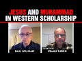

# Jesus and Muhammad in Western Scholarship (2021-10-15)

## Description

Usman Sheikh discusses the historical Jesus and the historical Muhammad in western scholarship, and the subject of Quranic intertextuality. I will be making 3 smaller videos out of this blockbuster! Visit Usman's academia page: https://oxford.academia.edu/UsmanShaikh (biblical studies papers).

## Summary of [Jesus and Muhammad in Western Scholarship](https://www.youtube.com/watch?v=gC7r8WifrbM)

*This summary is AI generated - there may be inaccuracies. *

### [00:00:00](https://www.youtube.com/watch?v=gC7r8WifrbM&t=0) - [01:00:00](https://www.youtube.com/watch?v=gC7r8WifrbM&t=3600)

This video discusses how Western scholarship has traditionally treated Jesus and Muhammad differently, with more emphasis placed on Muhammad. argues that this is due in part to the fact that the Quran provides direct access to Muhammad's preaching, while the historical evidence for Jesus is more scattered. The video discusses some of the ways in which scholars can learn about the historical Muhammad, including the use of hadith collections.

**[00:00:00](https://www.youtube.com/watch?v=gC7r8WifrbM&t=0)** discusses some of the reasons why scholars believe that the gospel of Mark was the first gospel and was used by the authors of Matthew and Luke.
* **[00:05:00](https://www.youtube.com/watch?v=gC7r8WifrbM&t=300)** The synoptic problem is the difficulty scholars have in understanding the similarities and differences between the three canonical gospels, specifically Matthew, Mark, and Luke. The hypothesis of Markan priority is largely based on the assumption that Matthew was written by an eyewitness disciple of Jesus, and that most of the material in Mark is also found in Matthew. However, some conservative scholars are reluctant to accept this hypothesis, citing the presence of 90% of Mark in the Gospel of Luke as evidence that the gospel may have been composed by a follower of Matthew rather than an eyewitness disciple of Jesus.
* **[00:10:00](https://www.youtube.com/watch?v=gC7r8WifrbM&t=600)** discusses how Western scholarship has treated Jesus and Muhammad differently. points out that the grammar and syntax of Arabic is much better than Greek, but Greek grammar can be difficult to understand. also notes that the disciples of Jesus from Palestine were almost certainly illiterate and from the lower classes. Therefore, it is difficult to believe that they would be able to understand the more rhetorical language of John's gospel. However, given the lack of overlap between John's gospel and the synoptic gospels, it is difficult to say for certain that what Jesus taught was restricted to a specific time period or that his teachings were remembered in a haphazard way.
* **[00:15:00](https://www.youtube.com/watch?v=gC7r8WifrbM&t=900)**  a scholar discusses how scholars recognize a gap between the historical Jesus and the presentations found in the New Testament Gospels. He also discusses how Matthew changed the wording of a passage in Mark to make it more in line with first century understandings of who Jesus was.
* **[00:20:00](https://www.youtube.com/watch?v=gC7r8WifrbM&t=1200)** This video discusses the differences between Jesus and Muhammad in Western scholarship, highlighting how scholars disagree on some aspects of Jesus' life and ministry.
* **[00:25:00](https://www.youtube.com/watch?v=gC7r8WifrbM&t=1500)** discusses how the portrait of Jesus that is presented in Western scholarship bears a strong resemblance to the teachings of Islam's prophet, Muhammad. Western scholars generally acknowledge that Jesus was a human being and a prophet, but they believe he was also God incarnate. The Quran disagrees with this view, claiming that Jesus is not God and that his teachings are attributed to other prophets.
* **[00:30:00](https://www.youtube.com/watch?v=gC7r8WifrbM&t=1800)** The video discusses the various difficulties Western scholars have in understanding the historical Jesus and Muhammad, and provides two recommendations: first, read Sanders' "The Historical Jew" which provides a concise overview of the different scholarly positions on Jesus; and second, watch a discussion between Dr. Sidke and Sanders about the historical evidence for the Quran.
* **[00:35:00](https://www.youtube.com/watch?v=gC7r8WifrbM&t=2100)** The video discusses how the Quran, which provides direct access to the preaching of Prophet Muhammad, can be used to study his life and teachings. also mentions scholar Waleed Saleh, who believes that we can obtain information about the historical Muhammad from the Quran itself. There is disagreement among scholars on how to utilize hadith, but at least some of it can be used to learn about the prophet and his community.
* **[00:40:00](https://www.youtube.com/watch?v=gC7r8WifrbM&t=2400)** discusses how some scholars believe that the hadith material was not fabricated, but instead was transmitted orally and compiled over a long period of time. This is a view that is gaining traction in the modern academic world.
* **[00:45:00](https://www.youtube.com/watch?v=gC7r8WifrbM&t=2700)** This video discusses how Western scholarship has largely neglected Muhammad's successor, Jesus, while focusing on Muhammad himself. Some of the historical evidence for Jesus's existence comes from hadith collections compiled by Muslims.
* **[00:50:00](https://www.youtube.com/watch?v=gC7r8WifrbM&t=3000)** Professor Jonathan Brown at Leiden University has identified at least 130,000 Hadiths which are securely dated to the first century of the Islamic era. In his essay, Monsieur discusses the methodology he used to arrive at this number. He also discusses the reliability of sources, specifically Hadiths attributed to orwa and nil zubair.
* **[00:55:00](https://www.youtube.com/watch?v=gC7r8WifrbM&t=3300)** This video discusses the letters attributed to Jesus and Muhammad, and how some scholars defend their authenticity. Sean Anthony summarizes the material in his book, Uh, which is published by the University of California Press. Krona says that we probably know more about Muhammad than about Jesus or Moses, and that we need more sophisticated methods to investigate the sources.
### [01:00:00](https://www.youtube.com/watch?v=gC7r8WifrbM&t=3600) - [01:30:00](https://www.youtube.com/watch?v=gC7r8WifrbM&t=5400)

This video discusses differences in historical views of Jesus between Muslims and Christians. The consensus among historians is that Jesus did not come to establish a new religion called Christianity, but was a jew preaching judaism to jews. The video also discusses other points of contrast between various biblical traditions, such as the miracle of Moses' staff turning into a serpent. Muslims believe that this miracle was performed by God, while Christians believe it was a sign from God. Muslims also believe that the control of God was shown through Moses' hand becoming white without disease or defect.

**[01:00:00](https://www.youtube.com/watch?v=gC7r8WifrbM&t=3600)** The video discusses the difference between the historical Jesus and the historical Muhammad, discussing how the former is viewed in a discontinuous way while the latter is universally understood as a prophet. The video also discusses the possibility of a prophet Muhammad presenting himself historically as a prophet of God.
* **[01:05:00](https://www.youtube.com/watch?v=gC7r8WifrbM&t=3900)** discusses the similarities and differences between the stories of Muhammad and Jesus in the Quran and Bible. He argues that the Quran intentionally passed along stories which are found in the Bible and other stories, and that it has its own perspective and is polemically engaging with the stories found in the scriptures. He concludes that the Quran is the true understanding of what happened in those stories, and that the polemic against it has diminished.
* **[01:10:00](https://www.youtube.com/watch?v=gC7r8WifrbM&t=4200)** Scholars of the Quran have noted many parallels between the quran and the gospel of Luke, which supports the idea that the quran is the product of copying from the bible. This view is not commonly championed by scholars because of the difficulty in sustaining the polemical paradigms found in the quran.
* **[01:15:00](https://www.youtube.com/watch?v=gC7r8WifrbM&t=4500)** discusses differences in historical views of Jesus between Muslims and Christians. The consensus among historians is that Jesus did not come to establish a new religion called Christianity, but was a jew preaching judaism to jews. The video also discusses other points of contrast between various biblical traditions, such as the miracle of Moses' staff turning into a serpent. Muslims believe that this miracle was performed by God, while Christians believe it was a sign from God. Muslims also believe that the control of God was shown through Moses' hand becoming white without disease or defect.
* **[01:20:00](https://www.youtube.com/watch?v=gC7r8WifrbM&t=4800)** The video discusses how some scholars believe that some of the miracles of Muhammad, such as the turning of water into blood, were replicated by magicians. The Quran disagrees with Exodus in the order of events, and notes that Moses became afraid when he saw the miracles being performed. This caused him to prevail over the magicians with his God-given abilities.
* **[01:25:00](https://www.youtube.com/watch?v=gC7r8WifrbM&t=5100)** The video discusses how some scholars believe that Muhammad equivalents to the Hebrew word "aho" which means "one." The video also compares the Shema and Nicean Creed statements about God. The Nicean Creed declares that there is only one God who has not begun nor was begotten. The Shema, on the other hand, declares that Israel is one with God.
* **[01:30:00](https://www.youtube.com/watch?v=gC7r8WifrbM&t=5400)** discusses how Jesus and Muhammad are treated in Western scholarship, noting that while both prophets have their supporters and detractors, their beliefs are categorical and absolute. recommends further study of these topics to provide a deeper understanding of religious truth.

<h2>Full transcript with timestamps: CLICK TO EXPAND</h2>

[0:00:00](https://youtu.be/gC7r8WifrbM?t=0) good afternoon everyone and welcome to  
[0:00:02](https://youtu.be/gC7r8WifrbM?t=2) blogging theology  
[0:00:04](https://youtu.be/gC7r8WifrbM?t=4) and today i welcome back usman sheikh uh  
[0:00:08](https://youtu.be/gC7r8WifrbM?t=8) who was last a guest on blogging  
[0:00:10](https://youtu.be/gC7r8WifrbM?t=10) theology on the 8th of september uh  
[0:00:13](https://youtu.be/gC7r8WifrbM?t=13) where he refuted certain christian  
[0:00:15](https://youtu.be/gC7r8WifrbM?t=15) scholars claims about god in the qurans  
[0:00:18](https://youtu.be/gC7r8WifrbM?t=18) and if you haven't  
[0:00:20](https://youtu.be/gC7r8WifrbM?t=20) watched that video please do go and  
[0:00:21](https://youtu.be/gC7r8WifrbM?t=21) watch this because it's a superb uh talk  
[0:00:24](https://youtu.be/gC7r8WifrbM?t=24) to you guys so welcome to blogging  
[0:00:26](https://youtu.be/gC7r8WifrbM?t=26) theology usman thank you so much it's  
[0:00:28](https://youtu.be/gC7r8WifrbM?t=28) great to be here again  
[0:00:30](https://youtu.be/gC7r8WifrbM?t=30) uh and just to uh remind us uh usman um  
[0:00:34](https://youtu.be/gC7r8WifrbM?t=34) has completed uh postgraduate research  
[0:00:36](https://youtu.be/gC7r8WifrbM?t=36) at heathrop college uh which is part of  
[0:00:38](https://youtu.be/gC7r8WifrbM?t=38) the university of london um and he  
[0:00:41](https://youtu.be/gC7r8WifrbM?t=41) completed that on the historical jesus  
[0:00:43](https://youtu.be/gC7r8WifrbM?t=43) biblical studies the whole thing new  
[0:00:45](https://youtu.be/gC7r8WifrbM?t=45) testament studies um and also he has uh  
[0:00:48](https://youtu.be/gC7r8WifrbM?t=48) just completed uh  
[0:00:50](https://youtu.be/gC7r8WifrbM?t=50) postgraduate research at the university  
[0:00:53](https://youtu.be/gC7r8WifrbM?t=53) of oxford on uh islamic studies the  
[0:00:56](https://youtu.be/gC7r8WifrbM?t=56) historical muhammad and the quran and so  
[0:00:58](https://youtu.be/gC7r8WifrbM?t=58) on  
[0:00:59](https://youtu.be/gC7r8WifrbM?t=59) so today uh we're very happy that you  
[0:01:02](https://youtu.be/gC7r8WifrbM?t=62) can come back on to talk about three  
[0:01:04](https://youtu.be/gC7r8WifrbM?t=64) things really the historical jesus the  
[0:01:07](https://youtu.be/gC7r8WifrbM?t=67) historical muhammad and this issue of  
[0:01:10](https://youtu.be/gC7r8WifrbM?t=70) intertextuality  
[0:01:12](https://youtu.be/gC7r8WifrbM?t=72) which um you'll perhaps explain later on  
[0:01:14](https://youtu.be/gC7r8WifrbM?t=74) that's actually a really important  
[0:01:16](https://youtu.be/gC7r8WifrbM?t=76) subject so  
[0:01:17](https://youtu.be/gC7r8WifrbM?t=77) um if you're okay could you just perhaps  
[0:01:19](https://youtu.be/gC7r8WifrbM?t=79) introduce us to um  
[0:01:21](https://youtu.be/gC7r8WifrbM?t=81) the your studies the what you discover  
[0:01:24](https://youtu.be/gC7r8WifrbM?t=84) the methodology the kind of issues that  
[0:01:26](https://youtu.be/gC7r8WifrbM?t=86) surround the whole study of the  
[0:01:28](https://youtu.be/gC7r8WifrbM?t=88) historical jesus in a western academic  
[0:01:32](https://youtu.be/gC7r8WifrbM?t=92) uh setting that's right  
[0:01:34](https://youtu.be/gC7r8WifrbM?t=94) uh yeah absolutely so even before i  
[0:01:37](https://youtu.be/gC7r8WifrbM?t=97) began my studies at heathrow college i  
[0:01:40](https://youtu.be/gC7r8WifrbM?t=100) had been reading up on the topic of  
[0:01:42](https://youtu.be/gC7r8WifrbM?t=102) historical jesus for  
[0:01:45](https://youtu.be/gC7r8WifrbM?t=105) at least  
[0:01:46](https://youtu.be/gC7r8WifrbM?t=106) well i would say 15 years  
[0:01:48](https://youtu.be/gC7r8WifrbM?t=108) reading scholarly books journal articles  
[0:01:50](https://youtu.be/gC7r8WifrbM?t=110) so i was you know very passionate about  
[0:01:52](https://youtu.be/gC7r8WifrbM?t=112) the subject and i wanted to learn more  
[0:01:55](https://youtu.be/gC7r8WifrbM?t=115) and  
[0:01:56](https://youtu.be/gC7r8WifrbM?t=116) there was a terrific opportunity for me  
[0:01:58](https://youtu.be/gC7r8WifrbM?t=118) to pursue this subject at heathrow  
[0:02:00](https://youtu.be/gC7r8WifrbM?t=120) college which was not that far away you  
[0:02:02](https://youtu.be/gC7r8WifrbM?t=122) know from my uh  
[0:02:03](https://youtu.be/gC7r8WifrbM?t=123) location  
[0:02:05](https://youtu.be/gC7r8WifrbM?t=125) and so i took the opportunity and i  
[0:02:09](https://youtu.be/gC7r8WifrbM?t=129) focused  
[0:02:10](https://youtu.be/gC7r8WifrbM?t=130) mainly upon this subject  
[0:02:13](https://youtu.be/gC7r8WifrbM?t=133) and in my thesis  
[0:02:16](https://youtu.be/gC7r8WifrbM?t=136) i was looking at the topic of the  
[0:02:18](https://youtu.be/gC7r8WifrbM?t=138) methodologies we can use in order to get  
[0:02:21](https://youtu.be/gC7r8WifrbM?t=141) behind the gospels  
[0:02:24](https://youtu.be/gC7r8WifrbM?t=144) it was a critical discussion of two very  
[0:02:28](https://youtu.be/gC7r8WifrbM?t=148) commonly applied methods upon the new  
[0:02:31](https://youtu.be/gC7r8WifrbM?t=151) testament writings  
[0:02:33](https://youtu.be/gC7r8WifrbM?t=153) mainly the synoptic gospels when it  
[0:02:36](https://youtu.be/gC7r8WifrbM?t=156) comes to the historical jesus subject  
[0:02:37](https://youtu.be/gC7r8WifrbM?t=157) primarily scholars respect restrict  
[0:02:39](https://youtu.be/gC7r8WifrbM?t=159) themselves to the synoptic gospels they  
[0:02:42](https://youtu.be/gC7r8WifrbM?t=162) might have a look at maybe you know some  
[0:02:43](https://youtu.be/gC7r8WifrbM?t=163) bits and pieces in the authentic uh  
[0:02:45](https://youtu.be/gC7r8WifrbM?t=165) pauline corpus  
[0:02:47](https://youtu.be/gC7r8WifrbM?t=167) and uh some scholars may uh have a look  
[0:02:51](https://youtu.be/gC7r8WifrbM?t=171) at the gospel of john uh many don't um i  
[0:02:55](https://youtu.be/gC7r8WifrbM?t=175) was looking at the message  
[0:02:57](https://youtu.be/gC7r8WifrbM?t=177) what do you mean by the synoptic gospels  
[0:02:59](https://youtu.be/gC7r8WifrbM?t=179) what what are they  
[0:03:01](https://youtu.be/gC7r8WifrbM?t=181) so  
[0:03:02](https://youtu.be/gC7r8WifrbM?t=182) the gospels of matthew mark and and luke  
[0:03:05](https://youtu.be/gC7r8WifrbM?t=185) they are collectively known as the  
[0:03:07](https://youtu.be/gC7r8WifrbM?t=187) synoptic gospels and uh  
[0:03:10](https://youtu.be/gC7r8WifrbM?t=190) scholars have been very much interested  
[0:03:12](https://youtu.be/gC7r8WifrbM?t=192) you know in the  
[0:03:14](https://youtu.be/gC7r8WifrbM?t=194) interconnections between  
[0:03:16](https://youtu.be/gC7r8WifrbM?t=196) these gospels and uh the majority  
[0:03:19](https://youtu.be/gC7r8WifrbM?t=199) opinion at the moment is that probably  
[0:03:21](https://youtu.be/gC7r8WifrbM?t=201) mark is the earliest gospel which was  
[0:03:24](https://youtu.be/gC7r8WifrbM?t=204) subsequently utilized by the authors of  
[0:03:26](https://youtu.be/gC7r8WifrbM?t=206) the gospels of matthew and luke  
[0:03:29](https://youtu.be/gC7r8WifrbM?t=209) i looked at this particular issue in  
[0:03:31](https://youtu.be/gC7r8WifrbM?t=211) detail also uh i mean uh when you have a  
[0:03:34](https://youtu.be/gC7r8WifrbM?t=214) look at the popular level books on the  
[0:03:37](https://youtu.be/gC7r8WifrbM?t=217) uh  
[0:03:38](https://youtu.be/gC7r8WifrbM?t=218) uh you know like introductions to the to  
[0:03:40](https://youtu.be/gC7r8WifrbM?t=220) the new testament it may seem as if the  
[0:03:42](https://youtu.be/gC7r8WifrbM?t=222) synoptic problem  
[0:03:44](https://youtu.be/gC7r8WifrbM?t=224) is a problem which is resolved what is  
[0:03:46](https://youtu.be/gC7r8WifrbM?t=226) the synoptic problem it is ascertaining  
[0:03:49](https://youtu.be/gC7r8WifrbM?t=229) why are these three gospels so similar  
[0:03:52](https://youtu.be/gC7r8WifrbM?t=232) and what are the possible you know  
[0:03:53](https://youtu.be/gC7r8WifrbM?t=233) connections between them if if any uh  
[0:03:56](https://youtu.be/gC7r8WifrbM?t=236) who is copying who who is depending who  
[0:03:59](https://youtu.be/gC7r8WifrbM?t=239) is dependent upon you know which uh  
[0:04:01](https://youtu.be/gC7r8WifrbM?t=241) particular gospel and so the majority  
[0:04:03](https://youtu.be/gC7r8WifrbM?t=243) opinion at the moment is that the gospel  
[0:04:05](https://youtu.be/gC7r8WifrbM?t=245) of mark is the earliest gospel and which  
[0:04:08](https://youtu.be/gC7r8WifrbM?t=248) was used by the authors of matthew and  
[0:04:10](https://youtu.be/gC7r8WifrbM?t=250) luke  
[0:04:11](https://youtu.be/gC7r8WifrbM?t=251) but scholars have continued to have  
[0:04:13](https://youtu.be/gC7r8WifrbM?t=253) disagreements over other bits and pieces  
[0:04:16](https://youtu.be/gC7r8WifrbM?t=256) but as far as the majority of the data  
[0:04:19](https://youtu.be/gC7r8WifrbM?t=259) is concerned  
[0:04:20](https://youtu.be/gC7r8WifrbM?t=260) most scholars feel that uh most of the  
[0:04:23](https://youtu.be/gC7r8WifrbM?t=263) similarities and differences at the very  
[0:04:25](https://youtu.be/gC7r8WifrbM?t=265) least are  
[0:04:27](https://youtu.be/gC7r8WifrbM?t=267) are better explained  
[0:04:28](https://youtu.be/gC7r8WifrbM?t=268) upon the hypothesis of morgan priority  
[0:04:32](https://youtu.be/gC7r8WifrbM?t=272) that is to say that mark was composed  
[0:04:34](https://youtu.be/gC7r8WifrbM?t=274) first and was then used by matthew and  
[0:04:38](https://youtu.be/gC7r8WifrbM?t=278) luke  
[0:04:38](https://youtu.be/gC7r8WifrbM?t=278) um let's clarify why do scholars think  
[0:04:41](https://youtu.be/gC7r8WifrbM?t=281) that one gospel writes a copy from  
[0:04:43](https://youtu.be/gC7r8WifrbM?t=283) another in the first place what evidence  
[0:04:45](https://youtu.be/gC7r8WifrbM?t=285) is there that there was because  
[0:04:46](https://youtu.be/gC7r8WifrbM?t=286) traditionally because we think that the  
[0:04:48](https://youtu.be/gC7r8WifrbM?t=288) gospel writers were eyewitnesses at  
[0:04:50](https://youtu.be/gC7r8WifrbM?t=290) least in the case of matthew and john uh  
[0:04:53](https://youtu.be/gC7r8WifrbM?t=293) and the eyewitness testimony presumably  
[0:04:55](https://youtu.be/gC7r8WifrbM?t=295) is behind  
[0:04:56](https://youtu.be/gC7r8WifrbM?t=296) luke and mark so what why why is this  
[0:04:59](https://youtu.be/gC7r8WifrbM?t=299) idea that there's copying going on and  
[0:05:01](https://youtu.be/gC7r8WifrbM?t=301) why is it called a synoptic problem  
[0:05:03](https://youtu.be/gC7r8WifrbM?t=303) obviously you mentioned you know who is  
[0:05:05](https://youtu.be/gC7r8WifrbM?t=305) copying whom that's the maybe the  
[0:05:06](https://youtu.be/gC7r8WifrbM?t=306) problem  
[0:05:07](https://youtu.be/gC7r8WifrbM?t=307) why do we think they're copying in the  
[0:05:09](https://youtu.be/gC7r8WifrbM?t=309) first place so the reason is because of  
[0:05:11](https://youtu.be/gC7r8WifrbM?t=311) the similarities between the three  
[0:05:13](https://youtu.be/gC7r8WifrbM?t=313) gospels which extends to the level of  
[0:05:16](https://youtu.be/gC7r8WifrbM?t=316) the wording  
[0:05:17](https://youtu.be/gC7r8WifrbM?t=317) uh  
[0:05:18](https://youtu.be/gC7r8WifrbM?t=318) it even extends to the level of the  
[0:05:20](https://youtu.be/gC7r8WifrbM?t=320) uh sequence of the worrying and and you  
[0:05:23](https://youtu.be/gC7r8WifrbM?t=323) know sometimes the ordering of the  
[0:05:25](https://youtu.be/gC7r8WifrbM?t=325) events i mean uh  
[0:05:27](https://youtu.be/gC7r8WifrbM?t=327) once you look at these gospels you will  
[0:05:28](https://youtu.be/gC7r8WifrbM?t=328) see that certain episodes are happening  
[0:05:32](https://youtu.be/gC7r8WifrbM?t=332) at you know different times in the  
[0:05:33](https://youtu.be/gC7r8WifrbM?t=333) various gospels but they also happen you  
[0:05:36](https://youtu.be/gC7r8WifrbM?t=336) know sometimes uh um  
[0:05:38](https://youtu.be/gC7r8WifrbM?t=338) at the same time and apart from that i  
[0:05:40](https://youtu.be/gC7r8WifrbM?t=340) mean just at the level of the wording uh  
[0:05:43](https://youtu.be/gC7r8WifrbM?t=343) you can see the  
[0:05:44](https://youtu.be/gC7r8WifrbM?t=344) exactitudes in in several places um  
[0:05:48](https://youtu.be/gC7r8WifrbM?t=348) and so you know there has to be a  
[0:05:50](https://youtu.be/gC7r8WifrbM?t=350) literary  
[0:05:51](https://youtu.be/gC7r8WifrbM?t=351) connection between these gospels and so  
[0:05:53](https://youtu.be/gC7r8WifrbM?t=353) the problem is uh what is the direction  
[0:05:56](https://youtu.be/gC7r8WifrbM?t=356) of the literary dependency uh we think  
[0:05:59](https://youtu.be/gC7r8WifrbM?t=359) that copying has taken place not copying  
[0:06:03](https://youtu.be/gC7r8WifrbM?t=363) in the sense that you know someone is  
[0:06:05](https://youtu.be/gC7r8WifrbM?t=365) just blindly copying a document these  
[0:06:07](https://youtu.be/gC7r8WifrbM?t=367) are creative authors also so when they  
[0:06:09](https://youtu.be/gC7r8WifrbM?t=369) are copying the source they are uh  
[0:06:12](https://youtu.be/gC7r8WifrbM?t=372) many times you know copying it  
[0:06:14](https://youtu.be/gC7r8WifrbM?t=374) uh  
[0:06:15](https://youtu.be/gC7r8WifrbM?t=375) well sometimes they are copying it  
[0:06:17](https://youtu.be/gC7r8WifrbM?t=377) verbatim sometimes they are copying it  
[0:06:19](https://youtu.be/gC7r8WifrbM?t=379) somewhat loosely  
[0:06:20](https://youtu.be/gC7r8WifrbM?t=380) um  
[0:06:22](https://youtu.be/gC7r8WifrbM?t=382) and so you have similarities and  
[0:06:23](https://youtu.be/gC7r8WifrbM?t=383) differences uh between them and so the  
[0:06:26](https://youtu.be/gC7r8WifrbM?t=386) question is how do you best explain uh  
[0:06:28](https://youtu.be/gC7r8WifrbM?t=388) these similarities and differences and  
[0:06:30](https://youtu.be/gC7r8WifrbM?t=390) the fact that over the past um well uh a  
[0:06:33](https://youtu.be/gC7r8WifrbM?t=393) hundred if you just have a look over the  
[0:06:35](https://youtu.be/gC7r8WifrbM?t=395) past hundred years for example  
[0:06:37](https://youtu.be/gC7r8WifrbM?t=397) the hundreds and hundreds of  
[0:06:38](https://youtu.be/gC7r8WifrbM?t=398) commentaries that have been written  
[0:06:41](https://youtu.be/gC7r8WifrbM?t=401) um  
[0:06:42](https://youtu.be/gC7r8WifrbM?t=402) upon the hypothesis of mark and priority  
[0:06:45](https://youtu.be/gC7r8WifrbM?t=405) is a testimony as to how you know  
[0:06:49](https://youtu.be/gC7r8WifrbM?t=409) widely accepted this hypothesis is that  
[0:06:52](https://youtu.be/gC7r8WifrbM?t=412) mark was written first because most  
[0:06:53](https://youtu.be/gC7r8WifrbM?t=413) scholars feel that  
[0:06:55](https://youtu.be/gC7r8WifrbM?t=415) most of the data is best explained  
[0:06:58](https://youtu.be/gC7r8WifrbM?t=418) if you suppose that mark was composed  
[0:07:01](https://youtu.be/gC7r8WifrbM?t=421) first and you would like these authors  
[0:07:03](https://youtu.be/gC7r8WifrbM?t=423) okay is it the case though that scholars  
[0:07:05](https://youtu.be/gC7r8WifrbM?t=425) today think that the uh say matthew's  
[0:07:07](https://youtu.be/gC7r8WifrbM?t=427) gospel is an eyewitness account after  
[0:07:09](https://youtu.be/gC7r8WifrbM?t=429) all it says the gospel according to  
[0:07:12](https://youtu.be/gC7r8WifrbM?t=432) saint matthew uh what what does scholars  
[0:07:14](https://youtu.be/gC7r8WifrbM?t=434) uh it would get at the historical jesus  
[0:07:16](https://youtu.be/gC7r8WifrbM?t=436) is the whole point  
[0:07:18](https://youtu.be/gC7r8WifrbM?t=438) why can't we just read matthew's gospel  
[0:07:20](https://youtu.be/gC7r8WifrbM?t=440) uh written by the apostle matthew  
[0:07:22](https://youtu.be/gC7r8WifrbM?t=442) himself the famous tax collector  
[0:07:25](https://youtu.be/gC7r8WifrbM?t=445) and just say well that's that's what  
[0:07:26](https://youtu.be/gC7r8WifrbM?t=446) happened because matthew tells us why  
[0:07:28](https://youtu.be/gC7r8WifrbM?t=448) don't scholars take that easy route why  
[0:07:30](https://youtu.be/gC7r8WifrbM?t=450) do they go into this complicated copying  
[0:07:33](https://youtu.be/gC7r8WifrbM?t=453) hypothesis and market priority  
[0:07:35](https://youtu.be/gC7r8WifrbM?t=455) so 90  
[0:07:37](https://youtu.be/gC7r8WifrbM?t=457) of the gospel of mark  
[0:07:39](https://youtu.be/gC7r8WifrbM?t=459) makes an appearance in the gospel of  
[0:07:41](https://youtu.be/gC7r8WifrbM?t=461) matthew  
[0:07:42](https://youtu.be/gC7r8WifrbM?t=462) and i think 60  
[0:07:44](https://youtu.be/gC7r8WifrbM?t=464) of the gospel of mark approximately 60  
[0:07:47](https://youtu.be/gC7r8WifrbM?t=467) or 63 percent is present in the gospel  
[0:07:49](https://youtu.be/gC7r8WifrbM?t=469) of luke  
[0:07:51](https://youtu.be/gC7r8WifrbM?t=471) uh so if uh the finished product the  
[0:07:54](https://youtu.be/gC7r8WifrbM?t=474) gospel of matthew was the work of an  
[0:07:57](https://youtu.be/gC7r8WifrbM?t=477) eyewitness a disciple of jesus who  
[0:07:59](https://youtu.be/gC7r8WifrbM?t=479) personally knew jesus then firstly i  
[0:08:01](https://youtu.be/gC7r8WifrbM?t=481) mean the question is why is he dependent  
[0:08:04](https://youtu.be/gC7r8WifrbM?t=484) uh so heavily upon the work of a  
[0:08:07](https://youtu.be/gC7r8WifrbM?t=487) non-eyewitness mark is said to be  
[0:08:09](https://youtu.be/gC7r8WifrbM?t=489) according to the traditions a  
[0:08:12](https://youtu.be/gC7r8WifrbM?t=492) follower of a disciple of jesus namely  
[0:08:14](https://youtu.be/gC7r8WifrbM?t=494) peter  
[0:08:17](https://youtu.be/gC7r8WifrbM?t=497) so uh why is it that matthew is not you  
[0:08:20](https://youtu.be/gC7r8WifrbM?t=500) know presenting  
[0:08:21](https://youtu.be/gC7r8WifrbM?t=501) first-hand information telling us about  
[0:08:24](https://youtu.be/gC7r8WifrbM?t=504) his own direct experiences with the  
[0:08:26](https://youtu.be/gC7r8WifrbM?t=506) historical jesus why is he using someone  
[0:08:29](https://youtu.be/gC7r8WifrbM?t=509) else's material i mean 90 percent uh  
[0:08:32](https://youtu.be/gC7r8WifrbM?t=512) that that can't be you know so so uh  
[0:08:34](https://youtu.be/gC7r8WifrbM?t=514) easily ignored so i think that it is  
[0:08:36](https://youtu.be/gC7r8WifrbM?t=516) therefore most scholars including  
[0:08:39](https://youtu.be/gC7r8WifrbM?t=519) uh many conservative scholars um  
[0:08:41](https://youtu.be/gC7r8WifrbM?t=521) they find it you know very difficult to  
[0:08:44](https://youtu.be/gC7r8WifrbM?t=524) accept that  
[0:08:45](https://youtu.be/gC7r8WifrbM?t=525) that the gospel of matthew  
[0:08:47](https://youtu.be/gC7r8WifrbM?t=527) emanates in its finished form from a  
[0:08:50](https://youtu.be/gC7r8WifrbM?t=530) disciple of jesus now it could be  
[0:08:52](https://youtu.be/gC7r8WifrbM?t=532) possible that the gospel of matthew  
[0:08:54](https://youtu.be/gC7r8WifrbM?t=534) contains bits and pieces  
[0:08:56](https://youtu.be/gC7r8WifrbM?t=536) which may you know go back to someone  
[0:08:59](https://youtu.be/gC7r8WifrbM?t=539) who knew jesus say a disciple by the  
[0:09:02](https://youtu.be/gC7r8WifrbM?t=542) name of matthew  
[0:09:04](https://youtu.be/gC7r8WifrbM?t=544) that is possible there is no way to  
[0:09:07](https://youtu.be/gC7r8WifrbM?t=547) demonstrate that definitively or to a  
[0:09:09](https://youtu.be/gC7r8WifrbM?t=549) high degree of probability i am open to  
[0:09:12](https://youtu.be/gC7r8WifrbM?t=552) that suggestion personally i think that  
[0:09:15](https://youtu.be/gC7r8WifrbM?t=555) it's quite possible that there is some  
[0:09:17](https://youtu.be/gC7r8WifrbM?t=557) element of truth in the traditional  
[0:09:20](https://youtu.be/gC7r8WifrbM?t=560) authorship claims not in the sense that  
[0:09:22](https://youtu.be/gC7r8WifrbM?t=562) the finnish products are the works of  
[0:09:25](https://youtu.be/gC7r8WifrbM?t=565) you know matthew mark luke and john but  
[0:09:28](https://youtu.be/gC7r8WifrbM?t=568) that it could be that uh ancient  
[0:09:30](https://youtu.be/gC7r8WifrbM?t=570) christians believed either rightly or  
[0:09:32](https://youtu.be/gC7r8WifrbM?t=572) wrongly uh that you know there are  
[0:09:34](https://youtu.be/gC7r8WifrbM?t=574) traditions uh which emanate from matthew  
[0:09:37](https://youtu.be/gC7r8WifrbM?t=577) from luke from uh from john and from  
[0:09:40](https://youtu.be/gC7r8WifrbM?t=580) mark and that maybe you know these came  
[0:09:43](https://youtu.be/gC7r8WifrbM?t=583) to be  
[0:09:44](https://youtu.be/gC7r8WifrbM?t=584) uh included  
[0:09:46](https://youtu.be/gC7r8WifrbM?t=586) in the gospels as we now know them so  
[0:09:49](https://youtu.be/gC7r8WifrbM?t=589) why i'm i'm open to that sort of a  
[0:09:51](https://youtu.be/gC7r8WifrbM?t=591) suggestion but that that's as far as the  
[0:09:53](https://youtu.be/gC7r8WifrbM?t=593) finished products are concerned and  
[0:09:54](https://youtu.be/gC7r8WifrbM?t=594) given the fact that they were originally  
[0:09:56](https://youtu.be/gC7r8WifrbM?t=596) composed in greek  
[0:09:58](https://youtu.be/gC7r8WifrbM?t=598) right uh i i did some greek uh when i  
[0:10:01](https://youtu.be/gC7r8WifrbM?t=601) was at heathrop and i can tell you that  
[0:10:03](https://youtu.be/gC7r8WifrbM?t=603) it's a far more difficult language than  
[0:10:05](https://youtu.be/gC7r8WifrbM?t=605) than arabic  
[0:10:07](https://youtu.be/gC7r8WifrbM?t=607) arabic grammar is much best  
[0:10:09](https://youtu.be/gC7r8WifrbM?t=609) but greek grammar i actually found very  
[0:10:12](https://youtu.be/gC7r8WifrbM?t=612) difficult and it's it's not the case  
[0:10:15](https://youtu.be/gC7r8WifrbM?t=615) that that you know the disciples of  
[0:10:17](https://youtu.be/gC7r8WifrbM?t=617) jesus who were probably you know uh  
[0:10:20](https://youtu.be/gC7r8WifrbM?t=620) from the  
[0:10:22](https://youtu.be/gC7r8WifrbM?t=622) lower classes in you know uh uh  
[0:10:24](https://youtu.be/gC7r8WifrbM?t=624) palestine uh almost certainly uh  
[0:10:27](https://youtu.be/gC7r8WifrbM?t=627) illiterate individuals or even let's say  
[0:10:29](https://youtu.be/gC7r8WifrbM?t=629) we suppose that they had  
[0:10:31](https://youtu.be/gC7r8WifrbM?t=631) some of them might have had you know  
[0:10:33](https://youtu.be/gC7r8WifrbM?t=633) some familiarity with let's say  
[0:10:36](https://youtu.be/gC7r8WifrbM?t=636) business greek so that you know they  
[0:10:38](https://youtu.be/gC7r8WifrbM?t=638) might be able to utter a few phrases or  
[0:10:41](https://youtu.be/gC7r8WifrbM?t=641) words here and there you know just to  
[0:10:42](https://youtu.be/gC7r8WifrbM?t=642) get by and to you know get their  
[0:10:44](https://youtu.be/gC7r8WifrbM?t=644) business done  
[0:10:45](https://youtu.be/gC7r8WifrbM?t=645) um to suppose that they  
[0:10:48](https://youtu.be/gC7r8WifrbM?t=648) after the resurrection that you know  
[0:10:49](https://youtu.be/gC7r8WifrbM?t=649) they went on to devote  
[0:10:52](https://youtu.be/gC7r8WifrbM?t=652) uh some time to learn greek and were  
[0:10:54](https://youtu.be/gC7r8WifrbM?t=654) then able to write  
[0:10:57](https://youtu.be/gC7r8WifrbM?t=657) such rhetorically rich material  
[0:11:00](https://youtu.be/gC7r8WifrbM?t=660) i mean that justifies common sense i  
[0:11:02](https://youtu.be/gC7r8WifrbM?t=662) don't think that you know many scholars  
[0:11:04](https://youtu.be/gC7r8WifrbM?t=664) would be able to uh would be willing to  
[0:11:06](https://youtu.be/gC7r8WifrbM?t=666) grant that  
[0:11:08](https://youtu.be/gC7r8WifrbM?t=668) okay going on to perhaps the gospel of  
[0:11:09](https://youtu.be/gC7r8WifrbM?t=669) john traditionally the last one to be  
[0:11:11](https://youtu.be/gC7r8WifrbM?t=671) written  
[0:11:12](https://youtu.be/gC7r8WifrbM?t=672) it strikes me and many readers this  
[0:11:14](https://youtu.be/gC7r8WifrbM?t=674) seems quite a different kind of gospel  
[0:11:16](https://youtu.be/gC7r8WifrbM?t=676) from matthew mark and luke uh the whole  
[0:11:19](https://youtu.be/gC7r8WifrbM?t=679) the whole feel of it the the the long  
[0:11:21](https://youtu.be/gC7r8WifrbM?t=681) speeches you see in john and  
[0:11:23](https://youtu.be/gC7r8WifrbM?t=683) marvelous claims on the lips of jesus i  
[0:11:25](https://youtu.be/gC7r8WifrbM?t=685) am the way that you know i'm the way the  
[0:11:27](https://youtu.be/gC7r8WifrbM?t=687) truth in my life and what abraham was i  
[0:11:30](https://youtu.be/gC7r8WifrbM?t=690) am and so on um so what what what what  
[0:11:34](https://youtu.be/gC7r8WifrbM?t=694) did we learn about uh john's gospel  
[0:11:37](https://youtu.be/gC7r8WifrbM?t=697) academically uh how are historians  
[0:11:39](https://youtu.be/gC7r8WifrbM?t=699) seeing the gospel of john these days so  
[0:11:42](https://youtu.be/gC7r8WifrbM?t=702) uh  
[0:11:43](https://youtu.be/gC7r8WifrbM?t=703) by large i think academics do not  
[0:11:47](https://youtu.be/gC7r8WifrbM?t=707) really  
[0:11:48](https://youtu.be/gC7r8WifrbM?t=708) put the gospel of john at the same level  
[0:11:50](https://youtu.be/gC7r8WifrbM?t=710) as the synoptic gospels there are  
[0:11:52](https://youtu.be/gC7r8WifrbM?t=712) problems with the synoptic gospels they  
[0:11:54](https://youtu.be/gC7r8WifrbM?t=714) don't say that you know you can simply  
[0:11:55](https://youtu.be/gC7r8WifrbM?t=715) read them and and you know you are  
[0:11:58](https://youtu.be/gC7r8WifrbM?t=718) gaining an access to the historical  
[0:11:59](https://youtu.be/gC7r8WifrbM?t=719) jesus  
[0:12:00](https://youtu.be/gC7r8WifrbM?t=720) but there are far more problems when it  
[0:12:02](https://youtu.be/gC7r8WifrbM?t=722) comes to the gospel of john firstly the  
[0:12:05](https://youtu.be/gC7r8WifrbM?t=725) content of the preaching of jesus  
[0:12:07](https://youtu.be/gC7r8WifrbM?t=727) seems seems to not overlap with the  
[0:12:10](https://youtu.be/gC7r8WifrbM?t=730) gospel of uh  
[0:12:12](https://youtu.be/gC7r8WifrbM?t=732) well with the snap the gospels  
[0:12:14](https://youtu.be/gC7r8WifrbM?t=734) um secondly the style of jesus's  
[0:12:17](https://youtu.be/gC7r8WifrbM?t=737) presentation  
[0:12:18](https://youtu.be/gC7r8WifrbM?t=738) even that seems markedly different so  
[0:12:21](https://youtu.be/gC7r8WifrbM?t=741) just to you know vaguely paraphrase  
[0:12:23](https://youtu.be/gC7r8WifrbM?t=743) the great  
[0:12:24](https://youtu.be/gC7r8WifrbM?t=744) new testament scholar e.p saunders  
[0:12:27](https://youtu.be/gC7r8WifrbM?t=747) it is very difficult to suppose that  
[0:12:29](https://youtu.be/gC7r8WifrbM?t=749) jesus went about in his historical  
[0:12:31](https://youtu.be/gC7r8WifrbM?t=751) ministry  
[0:12:33](https://youtu.be/gC7r8WifrbM?t=753) um presenting his teachings and  
[0:12:36](https://youtu.be/gC7r8WifrbM?t=756) preaching you know uh in two very  
[0:12:39](https://youtu.be/gC7r8WifrbM?t=759) different ways so the authors of the  
[0:12:40](https://youtu.be/gC7r8WifrbM?t=760) synoptic gospels captured only 50  
[0:12:43](https://youtu.be/gC7r8WifrbM?t=763) and the remaining 50 with no almost no  
[0:12:46](https://youtu.be/gC7r8WifrbM?t=766) overlap was captured by the author of  
[0:12:48](https://youtu.be/gC7r8WifrbM?t=768) the gospel of john so you know that  
[0:12:50](https://youtu.be/gC7r8WifrbM?t=770) seems uh highly unlikely uh now it's  
[0:12:53](https://youtu.be/gC7r8WifrbM?t=773) also possible that you know  
[0:12:56](https://youtu.be/gC7r8WifrbM?t=776) uh that uh  
[0:12:57](https://youtu.be/gC7r8WifrbM?t=777) the gospel of john could contain uh  
[0:13:00](https://youtu.be/gC7r8WifrbM?t=780) elements  
[0:13:01](https://youtu.be/gC7r8WifrbM?t=781) from another stream of the historical  
[0:13:03](https://youtu.be/gC7r8WifrbM?t=783) jesus tradition uh um so uh  
[0:13:07](https://youtu.be/gC7r8WifrbM?t=787) yeah i mean that cannot be denied by uh  
[0:13:11](https://youtu.be/gC7r8WifrbM?t=791) by default i don't think that it's it's  
[0:13:14](https://youtu.be/gC7r8WifrbM?t=794) the case that what jesus taught what he  
[0:13:16](https://youtu.be/gC7r8WifrbM?t=796) said and how people remembered him that  
[0:13:19](https://youtu.be/gC7r8WifrbM?t=799) you know that was very restricted i  
[0:13:20](https://youtu.be/gC7r8WifrbM?t=800) think it was a very haphazard thing  
[0:13:23](https://youtu.be/gC7r8WifrbM?t=803) and uh different people were you know  
[0:13:25](https://youtu.be/gC7r8WifrbM?t=805) recalling  
[0:13:27](https://youtu.be/gC7r8WifrbM?t=807) or you know remembering as best as they  
[0:13:29](https://youtu.be/gC7r8WifrbM?t=809) could different elements of jesus's  
[0:13:31](https://youtu.be/gC7r8WifrbM?t=811) teachings so it's quite possible that  
[0:13:33](https://youtu.be/gC7r8WifrbM?t=813) for example you know in the gospel of  
[0:13:35](https://youtu.be/gC7r8WifrbM?t=815) john jesus this historical ministry  
[0:13:36](https://youtu.be/gC7r8WifrbM?t=816) seems to last for a  
[0:13:39](https://youtu.be/gC7r8WifrbM?t=819) longer duration of time it could be  
[0:13:41](https://youtu.be/gC7r8WifrbM?t=821) possible that you know the gospel of  
[0:13:42](https://youtu.be/gC7r8WifrbM?t=822) john is historically accurate  
[0:13:44](https://youtu.be/gC7r8WifrbM?t=824) uh as far as you know this element is  
[0:13:47](https://youtu.be/gC7r8WifrbM?t=827) concerned but now the question is one of  
[0:13:49](https://youtu.be/gC7r8WifrbM?t=829) methodology  
[0:13:50](https://youtu.be/gC7r8WifrbM?t=830) what is the objective methodology  
[0:13:52](https://youtu.be/gC7r8WifrbM?t=832) whereby you can argue that you know  
[0:13:54](https://youtu.be/gC7r8WifrbM?t=834) certain things in the gospel of john  
[0:13:56](https://youtu.be/gC7r8WifrbM?t=836) uh are probably a bit more historical  
[0:13:59](https://youtu.be/gC7r8WifrbM?t=839) than you know what you come across in  
[0:14:00](https://youtu.be/gC7r8WifrbM?t=840) the  
[0:14:01](https://youtu.be/gC7r8WifrbM?t=841) in the synoptic gospels uh  
[0:14:04](https://youtu.be/gC7r8WifrbM?t=844) no one has you know really a very good  
[0:14:06](https://youtu.be/gC7r8WifrbM?t=846) answer but be that as it may overall as  
[0:14:09](https://youtu.be/gC7r8WifrbM?t=849) far as the  
[0:14:11](https://youtu.be/gC7r8WifrbM?t=851) style of jesus's preaching is concerned  
[0:14:13](https://youtu.be/gC7r8WifrbM?t=853) as far as the content of his preaching  
[0:14:15](https://youtu.be/gC7r8WifrbM?t=855) is concerned in the gospel of john jesus  
[0:14:17](https://youtu.be/gC7r8WifrbM?t=857) for example is more obvious you know  
[0:14:19](https://youtu.be/gC7r8WifrbM?t=859) regarding himself  
[0:14:21](https://youtu.be/gC7r8WifrbM?t=861) um  
[0:14:22](https://youtu.be/gC7r8WifrbM?t=862) parables i think uh find no presence in  
[0:14:26](https://youtu.be/gC7r8WifrbM?t=866) the  
[0:14:26](https://youtu.be/gC7r8WifrbM?t=866) gospel of john so these things are very  
[0:14:29](https://youtu.be/gC7r8WifrbM?t=869) difficult to explain and even a scholar  
[0:14:32](https://youtu.be/gC7r8WifrbM?t=872) such as richard bocam uh i think you're  
[0:14:35](https://youtu.be/gC7r8WifrbM?t=875) familiar with this work i'm forgetting  
[0:14:37](https://youtu.be/gC7r8WifrbM?t=877) the name i think it's called jesus and  
[0:14:38](https://youtu.be/gC7r8WifrbM?t=878) the eyewitnesses  
[0:14:40](https://youtu.be/gC7r8WifrbM?t=880) the second volume is very massive i  
[0:14:42](https://youtu.be/gC7r8WifrbM?t=882) think something like 700 pages 600 pages  
[0:14:45](https://youtu.be/gC7r8WifrbM?t=885) long  
[0:14:46](https://youtu.be/gC7r8WifrbM?t=886) even he is inclined to conclude that in  
[0:14:48](https://youtu.be/gC7r8WifrbM?t=888) the gospel of john  
[0:14:50](https://youtu.be/gC7r8WifrbM?t=890) uh we have more of an interpretation of  
[0:14:52](https://youtu.be/gC7r8WifrbM?t=892) the preaching of jesus it's more of an  
[0:14:55](https://youtu.be/gC7r8WifrbM?t=895) uh  
[0:14:56](https://youtu.be/gC7r8WifrbM?t=896) um more of a exegetical sort of work and  
[0:15:00](https://youtu.be/gC7r8WifrbM?t=900) interpretive work on the  
[0:15:02](https://youtu.be/gC7r8WifrbM?t=902) ministry of jesus so when scholars say  
[0:15:05](https://youtu.be/gC7r8WifrbM?t=905) that when they talk about the fourth  
[0:15:07](https://youtu.be/gC7r8WifrbM?t=907) gospel the gospel john being a highly  
[0:15:09](https://youtu.be/gC7r8WifrbM?t=909) interpreted account of the life of jesus  
[0:15:12](https://youtu.be/gC7r8WifrbM?t=912) uh some of them liking it to a sermon  
[0:15:14](https://youtu.be/gC7r8WifrbM?t=914) it's a sermon on the significance of the  
[0:15:17](https://youtu.be/gC7r8WifrbM?t=917) life of jesus for the author of that  
[0:15:18](https://youtu.be/gC7r8WifrbM?t=918) gospel  
[0:15:20](https://youtu.be/gC7r8WifrbM?t=920) what what does that mean for uh our  
[0:15:22](https://youtu.be/gC7r8WifrbM?t=922) understanding of the historical jesus  
[0:15:25](https://youtu.be/gC7r8WifrbM?t=925) does that mean there's a gap when it  
[0:15:27](https://youtu.be/gC7r8WifrbM?t=927) comes to the historical jesus and the  
[0:15:30](https://youtu.be/gC7r8WifrbM?t=930) presentation of jesus and john  
[0:15:32](https://youtu.be/gC7r8WifrbM?t=932) i think virtually everyone believes that  
[0:15:34](https://youtu.be/gC7r8WifrbM?t=934) maybe with the exception of you know the  
[0:15:36](https://youtu.be/gC7r8WifrbM?t=936) very hardcore uh fundamentalist and the  
[0:15:38](https://youtu.be/gC7r8WifrbM?t=938) various christian denominations i think  
[0:15:41](https://youtu.be/gC7r8WifrbM?t=941) uh the mainstream opinion including the  
[0:15:43](https://youtu.be/gC7r8WifrbM?t=943) views of uh  
[0:15:44](https://youtu.be/gC7r8WifrbM?t=944) evangelical scholars conservative  
[0:15:46](https://youtu.be/gC7r8WifrbM?t=946) scholars is indeed to accept that there  
[0:15:50](https://youtu.be/gC7r8WifrbM?t=950) is a gap  
[0:15:51](https://youtu.be/gC7r8WifrbM?t=951) they may disagree over the uh length of  
[0:15:54](https://youtu.be/gC7r8WifrbM?t=954) the gap  
[0:15:56](https://youtu.be/gC7r8WifrbM?t=956) but a gap there is  
[0:15:58](https://youtu.be/gC7r8WifrbM?t=958) right so we can't just read the surface  
[0:16:00](https://youtu.be/gC7r8WifrbM?t=960) of john's gospel if you like and say aha  
[0:16:02](https://youtu.be/gC7r8WifrbM?t=962) this is what jesus said so  
[0:16:05](https://youtu.be/gC7r8WifrbM?t=965) it's a very familiar um the same holds  
[0:16:08](https://youtu.be/gC7r8WifrbM?t=968) true for the gospel of uh matthew mark  
[0:16:10](https://youtu.be/gC7r8WifrbM?t=970) and luke you can't just read them and  
[0:16:12](https://youtu.be/gC7r8WifrbM?t=972) you can say that you know uh this is  
[0:16:14](https://youtu.be/gC7r8WifrbM?t=974) what uh jesus said and did and  
[0:16:16](https://youtu.be/gC7r8WifrbM?t=976) christopher tucker whom you had you know  
[0:16:18](https://youtu.be/gC7r8WifrbM?t=978) on your show several months ago he has  
[0:16:20](https://youtu.be/gC7r8WifrbM?t=980) written a very interesting book it's on  
[0:16:23](https://youtu.be/gC7r8WifrbM?t=983) the  
[0:16:24](https://youtu.be/gC7r8WifrbM?t=984) various methodologies which scholars  
[0:16:25](https://youtu.be/gC7r8WifrbM?t=985) apply upon the new testament  
[0:16:28](https://youtu.be/gC7r8WifrbM?t=988) writings i'm forgetting the name of the  
[0:16:30](https://youtu.be/gC7r8WifrbM?t=990) title um  
[0:16:32](https://youtu.be/gC7r8WifrbM?t=992) but  
[0:16:33](https://youtu.be/gC7r8WifrbM?t=993) he has a very good discussion on the  
[0:16:35](https://youtu.be/gC7r8WifrbM?t=995) historical jesus subject also and this  
[0:16:37](https://youtu.be/gC7r8WifrbM?t=997) is what he says just to you know  
[0:16:40](https://youtu.be/gC7r8WifrbM?t=1000) loosely paraphrase him you can't simply  
[0:16:43](https://youtu.be/gC7r8WifrbM?t=1003) read the gospels send out the gospels  
[0:16:45](https://youtu.be/gC7r8WifrbM?t=1005) and just assume  
[0:16:47](https://youtu.be/gC7r8WifrbM?t=1007) that this is what really happened there  
[0:16:49](https://youtu.be/gC7r8WifrbM?t=1009) is a gap here too maybe not as great a  
[0:16:52](https://youtu.be/gC7r8WifrbM?t=1012) gap as the gap between the finished  
[0:16:54](https://youtu.be/gC7r8WifrbM?t=1014) product the gospel of john and the  
[0:16:55](https://youtu.be/gC7r8WifrbM?t=1015) historical jesus  
[0:16:57](https://youtu.be/gC7r8WifrbM?t=1017) but nonetheless scholars do recognize  
[0:16:59](https://youtu.be/gC7r8WifrbM?t=1019) that there is a gap i mean how do we  
[0:17:01](https://youtu.be/gC7r8WifrbM?t=1021) know that there is a gap when we look at  
[0:17:03](https://youtu.be/gC7r8WifrbM?t=1023) the material in the synoptic gospels we  
[0:17:05](https://youtu.be/gC7r8WifrbM?t=1025) notice that there are similarities and  
[0:17:07](https://youtu.be/gC7r8WifrbM?t=1027) differences we can see at least two  
[0:17:10](https://youtu.be/gC7r8WifrbM?t=1030) authors  
[0:17:12](https://youtu.be/gC7r8WifrbM?t=1032) are changing the material  
[0:17:15](https://youtu.be/gC7r8WifrbM?t=1035) so matthew and luke when they are  
[0:17:17](https://youtu.be/gC7r8WifrbM?t=1037) copying the gospel of mark  
[0:17:19](https://youtu.be/gC7r8WifrbM?t=1039) they are also making changes uh one very  
[0:17:22](https://youtu.be/gC7r8WifrbM?t=1042) famous example just from the top of my  
[0:17:24](https://youtu.be/gC7r8WifrbM?t=1044) head you know jesus in the gospel of  
[0:17:26](https://youtu.be/gC7r8WifrbM?t=1046) mark says why do you call me good there  
[0:17:28](https://youtu.be/gC7r8WifrbM?t=1048) is none good but god you look at the  
[0:17:30](https://youtu.be/gC7r8WifrbM?t=1050) parallel in the gospel of matthew why do  
[0:17:32](https://youtu.be/gC7r8WifrbM?t=1052) you ask me about that which is good uh  
[0:17:34](https://youtu.be/gC7r8WifrbM?t=1054) uh so you know matthew has made a change  
[0:17:37](https://youtu.be/gC7r8WifrbM?t=1057) uh to the gospel of mark and he's gonna  
[0:17:39](https://youtu.be/gC7r8WifrbM?t=1059) be multiplied indeed the example you  
[0:17:42](https://youtu.be/gC7r8WifrbM?t=1062) give i mentioned to professor john  
[0:17:43](https://youtu.be/gC7r8WifrbM?t=1063) barton who's the author of uh this book  
[0:17:46](https://youtu.be/gC7r8WifrbM?t=1066) uh history of the bible uh the book and  
[0:17:48](https://youtu.be/gC7r8WifrbM?t=1068) its face and uh he said on on this very  
[0:17:52](https://youtu.be/gC7r8WifrbM?t=1072) channel that matthew in his view is  
[0:17:54](https://youtu.be/gC7r8WifrbM?t=1074) dishonest to change  
[0:17:55](https://youtu.be/gC7r8WifrbM?t=1075) jesus words in mark to remove this  
[0:17:58](https://youtu.be/gC7r8WifrbM?t=1078) denial that jesus is god uh  
[0:18:01](https://youtu.be/gC7r8WifrbM?t=1081) so that uh matthew's jesus conforms much  
[0:18:04](https://youtu.be/gC7r8WifrbM?t=1084) better to late first century uh  
[0:18:06](https://youtu.be/gC7r8WifrbM?t=1086) understandings of who jesus was at that  
[0:18:08](https://youtu.be/gC7r8WifrbM?t=1088) time and uh but  
[0:18:10](https://youtu.be/gC7r8WifrbM?t=1090) a john barton professor at oxford in the  
[0:18:13](https://youtu.be/gC7r8WifrbM?t=1093) bible there's a very senior scholar  
[0:18:15](https://youtu.be/gC7r8WifrbM?t=1095) saying that publicly it's quite shocking  
[0:18:17](https://youtu.be/gC7r8WifrbM?t=1097) and he is actually not playing clergyman  
[0:18:19](https://youtu.be/gC7r8WifrbM?t=1099) in the church of england himself and now  
[0:18:20](https://youtu.be/gC7r8WifrbM?t=1100) the issue is this if we can see  
[0:18:23](https://youtu.be/gC7r8WifrbM?t=1103) matthew and luke making all types of  
[0:18:25](https://youtu.be/gC7r8WifrbM?t=1105) changes to mark you know many times  
[0:18:27](https://youtu.be/gC7r8WifrbM?t=1107) minor changes small changes changes to  
[0:18:29](https://youtu.be/gC7r8WifrbM?t=1109) the level of the grammar but on  
[0:18:31](https://youtu.be/gC7r8WifrbM?t=1111) occasions also you know rather serious  
[0:18:33](https://youtu.be/gC7r8WifrbM?t=1113) changes yeah to their source material  
[0:18:36](https://youtu.be/gC7r8WifrbM?t=1116) then the question which i have is this  
[0:18:39](https://youtu.be/gC7r8WifrbM?t=1119) uh was this an innovation or uh  
[0:18:42](https://youtu.be/gC7r8WifrbM?t=1122) were other christians prior to the  
[0:18:44](https://youtu.be/gC7r8WifrbM?t=1124) composition of these gospels were they  
[0:18:47](https://youtu.be/gC7r8WifrbM?t=1127) handling the jesus tradition in a in  
[0:18:49](https://youtu.be/gC7r8WifrbM?t=1129) similar sort of ways that you know um  
[0:18:52](https://youtu.be/gC7r8WifrbM?t=1132) they were not  
[0:18:53](https://youtu.be/gC7r8WifrbM?t=1133) it was not like exact verbatim passing  
[0:18:56](https://youtu.be/gC7r8WifrbM?t=1136) on of the teachings of jesus but it was  
[0:18:59](https://youtu.be/gC7r8WifrbM?t=1139) you know rather deuce  
[0:19:01](https://youtu.be/gC7r8WifrbM?t=1141) so uh at times you know certain  
[0:19:03](https://youtu.be/gC7r8WifrbM?t=1143) teachings of jesus you know would be  
[0:19:05](https://youtu.be/gC7r8WifrbM?t=1145) more or less accurately circulated but  
[0:19:07](https://youtu.be/gC7r8WifrbM?t=1147) there would also be times when uh things  
[0:19:10](https://youtu.be/gC7r8WifrbM?t=1150) would be changed or even invented at  
[0:19:12](https://youtu.be/gC7r8WifrbM?t=1152) times  
[0:19:16](https://youtu.be/gC7r8WifrbM?t=1156) of a saying in the gospels which  
[0:19:17](https://youtu.be/gC7r8WifrbM?t=1157) historians think was invented by the so  
[0:19:20](https://youtu.be/gC7r8WifrbM?t=1160) uh in the gospel of matthew for example  
[0:19:22](https://youtu.be/gC7r8WifrbM?t=1162) the material which is commonly commonly  
[0:19:25](https://youtu.be/gC7r8WifrbM?t=1165) uh labeled m  
[0:19:27](https://youtu.be/gC7r8WifrbM?t=1167) so that is the special material in the  
[0:19:30](https://youtu.be/gC7r8WifrbM?t=1170) gospel of matthew  
[0:19:31](https://youtu.be/gC7r8WifrbM?t=1171) uh so many times scholars you know  
[0:19:33](https://youtu.be/gC7r8WifrbM?t=1173) believe that okay there is another  
[0:19:36](https://youtu.be/gC7r8WifrbM?t=1176) source let's call it m and matthew  
[0:19:38](https://youtu.be/gC7r8WifrbM?t=1178) acquired his information from there but  
[0:19:40](https://youtu.be/gC7r8WifrbM?t=1180) there are also uh a number of scholars  
[0:19:43](https://youtu.be/gC7r8WifrbM?t=1183) uh who have argued that you know um  
[0:19:46](https://youtu.be/gC7r8WifrbM?t=1186) m could also be the reduction of the  
[0:19:48](https://youtu.be/gC7r8WifrbM?t=1188) gospel of the author of matthew that is  
[0:19:51](https://youtu.be/gC7r8WifrbM?t=1191) to say that you know it could consist of  
[0:19:53](https://youtu.be/gC7r8WifrbM?t=1193) material which basically he also made up  
[0:19:56](https://youtu.be/gC7r8WifrbM?t=1196) and one of these items could be uh you  
[0:19:58](https://youtu.be/gC7r8WifrbM?t=1198) know uh the saints uh coming out from  
[0:20:02](https://youtu.be/gC7r8WifrbM?t=1202) the jew from the tomb upon the  
[0:20:04](https://youtu.be/gC7r8WifrbM?t=1204) crucifixion of jesus and walking in the  
[0:20:06](https://youtu.be/gC7r8WifrbM?t=1206) streets of jerusalem which is an account  
[0:20:09](https://youtu.be/gC7r8WifrbM?t=1209) which you find in the gospel of matthew  
[0:20:12](https://youtu.be/gC7r8WifrbM?t=1212) it's only found in matthew i think and  
[0:20:14](https://youtu.be/gC7r8WifrbM?t=1214) not in gospel or any other historical  
[0:20:17](https://youtu.be/gC7r8WifrbM?t=1217) source known to history and this amazing  
[0:20:20](https://youtu.be/gC7r8WifrbM?t=1220) public event where many uh people  
[0:20:23](https://youtu.be/gC7r8WifrbM?t=1223) believers came out of their graves their  
[0:20:24](https://youtu.be/gC7r8WifrbM?t=1224) tombs walked around in jerusalem in  
[0:20:26](https://youtu.be/gC7r8WifrbM?t=1226) broad daylight and it is curious that no  
[0:20:29](https://youtu.be/gC7r8WifrbM?t=1229) other historical source josephus he was  
[0:20:31](https://youtu.be/gC7r8WifrbM?t=1231) a a jewish historian from jerusalem  
[0:20:34](https://youtu.be/gC7r8WifrbM?t=1234) roughly contemporaneous with that uh no  
[0:20:36](https://youtu.be/gC7r8WifrbM?t=1236) makes no mention of it in his history uh  
[0:20:39](https://youtu.be/gC7r8WifrbM?t=1239) either so you're saying that's an  
[0:20:40](https://youtu.be/gC7r8WifrbM?t=1240) example of perhaps a made-up story that  
[0:20:43](https://youtu.be/gC7r8WifrbM?t=1243) uh matthew included in his gospel  
[0:20:45](https://youtu.be/gC7r8WifrbM?t=1245) exactly and to think of it even the  
[0:20:47](https://youtu.be/gC7r8WifrbM?t=1247) story of why do you ask me about that  
[0:20:49](https://youtu.be/gC7r8WifrbM?t=1249) which is good that is actually we can  
[0:20:52](https://youtu.be/gC7r8WifrbM?t=1252) also say that you know it is made up  
[0:20:54](https://youtu.be/gC7r8WifrbM?t=1254) made up in the sense that that probably  
[0:20:56](https://youtu.be/gC7r8WifrbM?t=1256) did not happen uh what probably happened  
[0:20:59](https://youtu.be/gC7r8WifrbM?t=1259) is more similar to you know what you  
[0:21:01](https://youtu.be/gC7r8WifrbM?t=1261) find in mark why do you ask me about  
[0:21:03](https://youtu.be/gC7r8WifrbM?t=1263) that which is uh uh  
[0:21:04](https://youtu.be/gC7r8WifrbM?t=1264) why do you call me good there is none  
[0:21:06](https://youtu.be/gC7r8WifrbM?t=1266) good but god exactly exactly yeah uh so  
[0:21:09](https://youtu.be/gC7r8WifrbM?t=1269) so so again i mean uh one can think of a  
[0:21:12](https://youtu.be/gC7r8WifrbM?t=1272) few other examples uh but you know  
[0:21:15](https://youtu.be/gC7r8WifrbM?t=1275) scholars disagree  
[0:21:16](https://youtu.be/gC7r8WifrbM?t=1276) they would agree generally speaking that  
[0:21:18](https://youtu.be/gC7r8WifrbM?t=1278) the there is material in the gospel you  
[0:21:20](https://youtu.be/gC7r8WifrbM?t=1280) know which uh underwent various sort of  
[0:21:22](https://youtu.be/gC7r8WifrbM?t=1282) changes minor changes sometimes you know  
[0:21:25](https://youtu.be/gC7r8WifrbM?t=1285) major changes some material you know  
[0:21:26](https://youtu.be/gC7r8WifrbM?t=1286) could probably be made up also so they  
[0:21:29](https://youtu.be/gC7r8WifrbM?t=1289) would say that the i am statements in  
[0:21:31](https://youtu.be/gC7r8WifrbM?t=1291) the gospel of john for example probably  
[0:21:33](https://youtu.be/gC7r8WifrbM?t=1293) they are the creations if not the author  
[0:21:35](https://youtu.be/gC7r8WifrbM?t=1295) of the finished product then at the very  
[0:21:37](https://youtu.be/gC7r8WifrbM?t=1297) least maybe of his community that he  
[0:21:39](https://youtu.be/gC7r8WifrbM?t=1299) inherited these traditions from his  
[0:21:41](https://youtu.be/gC7r8WifrbM?t=1301) community and it is this genre and  
[0:21:43](https://youtu.be/gC7r8WifrbM?t=1303) community uh which um gave rise to these  
[0:21:47](https://youtu.be/gC7r8WifrbM?t=1307) traditions rather than acquiring them  
[0:21:49](https://youtu.be/gC7r8WifrbM?t=1309) you know uh from people maybe who who  
[0:21:52](https://youtu.be/gC7r8WifrbM?t=1312) knew jesus um  
[0:21:55](https://youtu.be/gC7r8WifrbM?t=1315) i've come across is the  
[0:21:57](https://youtu.be/gC7r8WifrbM?t=1317) uh the two gospels that have extended  
[0:21:59](https://youtu.be/gC7r8WifrbM?t=1319) nativity stories the the birth uh the  
[0:22:01](https://youtu.be/gC7r8WifrbM?t=1321) the events surrounding the birth of  
[0:22:03](https://youtu.be/gC7r8WifrbM?t=1323) jesus and matthew and luke is the only  
[0:22:04](https://youtu.be/gC7r8WifrbM?t=1324) two places that have yeah uh stories  
[0:22:06](https://youtu.be/gC7r8WifrbM?t=1326) about uh the birth of jesus agree that  
[0:22:10](https://youtu.be/gC7r8WifrbM?t=1330) jesus was born of the virgin mary but  
[0:22:12](https://youtu.be/gC7r8WifrbM?t=1332) virtually everything else exactly yeah  
[0:22:15](https://youtu.be/gC7r8WifrbM?t=1335) is completely different yeah extremely  
[0:22:17](https://youtu.be/gC7r8WifrbM?t=1337) hard to recognize you have to uh you  
[0:22:19](https://youtu.be/gC7r8WifrbM?t=1339) know have some pretty amazing  
[0:22:20](https://youtu.be/gC7r8WifrbM?t=1340) intellectual and gymnastic gymnastics to  
[0:22:23](https://youtu.be/gC7r8WifrbM?t=1343) make these things cohere in any way at  
[0:22:25](https://youtu.be/gC7r8WifrbM?t=1345) all so scholars i think tend to see most  
[0:22:28](https://youtu.be/gC7r8WifrbM?t=1348) of the information in those two  
[0:22:30](https://youtu.be/gC7r8WifrbM?t=1350) as just made up because it's so  
[0:22:33](https://youtu.be/gC7r8WifrbM?t=1353) different  
[0:22:34](https://youtu.be/gC7r8WifrbM?t=1354) and uh and for other reasons as well  
[0:22:36](https://youtu.be/gC7r8WifrbM?t=1356) they think it's fictionalized  
[0:22:38](https://youtu.be/gC7r8WifrbM?t=1358) absolutely i mean so in the gospel of  
[0:22:40](https://youtu.be/gC7r8WifrbM?t=1360) luke when you come  
[0:22:42](https://youtu.be/gC7r8WifrbM?t=1362) when you look at the at its infancy  
[0:22:44](https://youtu.be/gC7r8WifrbM?t=1364) narrative the you know the famous census  
[0:22:47](https://youtu.be/gC7r8WifrbM?t=1367) at that time that has uh um  
[0:22:50](https://youtu.be/gC7r8WifrbM?t=1370) something you know raymond brown has a  
[0:22:52](https://youtu.be/gC7r8WifrbM?t=1372) very detailed discussion on that and he  
[0:22:54](https://youtu.be/gC7r8WifrbM?t=1374) says that you know that is probably just  
[0:22:56](https://youtu.be/gC7r8WifrbM?t=1376) a not historically accurate  
[0:22:58](https://youtu.be/gC7r8WifrbM?t=1378) and apart from that when it comes to the  
[0:23:00](https://youtu.be/gC7r8WifrbM?t=1380) gospel of matthew and its infancy story  
[0:23:03](https://youtu.be/gC7r8WifrbM?t=1383) you can see that it's very very heavily  
[0:23:05](https://youtu.be/gC7r8WifrbM?t=1385) influenced by a typological reading of  
[0:23:08](https://youtu.be/gC7r8WifrbM?t=1388) the jewish bible of different elements  
[0:23:10](https://youtu.be/gC7r8WifrbM?t=1390) in the jewish bible and that is what is  
[0:23:12](https://youtu.be/gC7r8WifrbM?t=1392) causing him to shape his account so it  
[0:23:16](https://youtu.be/gC7r8WifrbM?t=1396) could be so you know how do you speak of  
[0:23:18](https://youtu.be/gC7r8WifrbM?t=1398) historicity here maybe you can say that  
[0:23:20](https://youtu.be/gC7r8WifrbM?t=1400) you know um matthew and luke are agreed  
[0:23:24](https://youtu.be/gC7r8WifrbM?t=1404) upon the virgin birth of jesus so  
[0:23:27](https://youtu.be/gC7r8WifrbM?t=1407) this story predates them  
[0:23:30](https://youtu.be/gC7r8WifrbM?t=1410) all the other bits and pieces uh we  
[0:23:32](https://youtu.be/gC7r8WifrbM?t=1412) don't know we can't you know really say  
[0:23:34](https://youtu.be/gC7r8WifrbM?t=1414) much more no okay  
[0:23:36](https://youtu.be/gC7r8WifrbM?t=1416) before we move uh sorry i must ask  
[0:23:38](https://youtu.be/gC7r8WifrbM?t=1418) before we move on to the historical  
[0:23:40](https://youtu.be/gC7r8WifrbM?t=1420) mohammed  
[0:23:41](https://youtu.be/gC7r8WifrbM?t=1421) is there i have scholars generally  
[0:23:44](https://youtu.be/gC7r8WifrbM?t=1424) reached any conclusions about who the  
[0:23:46](https://youtu.be/gC7r8WifrbM?t=1426) historical jesus was in terms of his own  
[0:23:49](https://youtu.be/gC7r8WifrbM?t=1429) self-understanding i mean or yeah  
[0:23:52](https://youtu.be/gC7r8WifrbM?t=1432) we can see how other people understood  
[0:23:54](https://youtu.be/gC7r8WifrbM?t=1434) him we have four gospels and we have  
[0:23:55](https://youtu.be/gC7r8WifrbM?t=1435) other sources other gospels and so on  
[0:23:57](https://youtu.be/gC7r8WifrbM?t=1437) but do we have any sense of what jesus  
[0:23:59](https://youtu.be/gC7r8WifrbM?t=1439) understood his ministry and his identity  
[0:24:02](https://youtu.be/gC7r8WifrbM?t=1442) to be  
[0:24:04](https://youtu.be/gC7r8WifrbM?t=1444) um  
[0:24:05](https://youtu.be/gC7r8WifrbM?t=1445) so uh once again uh there is a very  
[0:24:08](https://youtu.be/gC7r8WifrbM?t=1448) broad general-ish sort of agreement  
[0:24:11](https://youtu.be/gC7r8WifrbM?t=1451) among scholars that you know jesus in  
[0:24:13](https://youtu.be/gC7r8WifrbM?t=1453) his historical ministry  
[0:24:15](https://youtu.be/gC7r8WifrbM?t=1455) is best looked upon  
[0:24:17](https://youtu.be/gC7r8WifrbM?t=1457) as a  
[0:24:19](https://youtu.be/gC7r8WifrbM?t=1459) prophet  
[0:24:20](https://youtu.be/gC7r8WifrbM?t=1460) of god as a messiah as a jewish teacher  
[0:24:25](https://youtu.be/gC7r8WifrbM?t=1465) messiah not in the sense of a divine  
[0:24:27](https://youtu.be/gC7r8WifrbM?t=1467) sort of being if you look at the concept  
[0:24:29](https://youtu.be/gC7r8WifrbM?t=1469) of the messiah in the second temple  
[0:24:31](https://youtu.be/gC7r8WifrbM?t=1471) writings  
[0:24:32](https://youtu.be/gC7r8WifrbM?t=1472) you know you come across a lot of  
[0:24:33](https://youtu.be/gC7r8WifrbM?t=1473) diversity there  
[0:24:37](https://youtu.be/gC7r8WifrbM?t=1477) and  
[0:24:38](https://youtu.be/gC7r8WifrbM?t=1478) when it comes to the material in the  
[0:24:40](https://youtu.be/gC7r8WifrbM?t=1480) synoptic gospels in particular you don't  
[0:24:42](https://youtu.be/gC7r8WifrbM?t=1482) really find any strong evidence for you  
[0:24:44](https://youtu.be/gC7r8WifrbM?t=1484) know jesus proclaiming himself as a  
[0:24:46](https://youtu.be/gC7r8WifrbM?t=1486) divine sort of a messiah but but maybe  
[0:24:49](https://youtu.be/gC7r8WifrbM?t=1489) as a you know prophet slash messiah uh  
[0:24:52](https://youtu.be/gC7r8WifrbM?t=1492) uh um  
[0:24:53](https://youtu.be/gC7r8WifrbM?t=1493) as that sort of a person who is  
[0:24:56](https://youtu.be/gC7r8WifrbM?t=1496) upholding the laws and the commandments  
[0:24:58](https://youtu.be/gC7r8WifrbM?t=1498) maybe intensifying certain elements  
[0:25:01](https://youtu.be/gC7r8WifrbM?t=1501) therein  
[0:25:02](https://youtu.be/gC7r8WifrbM?t=1502) but not like you know overriding them  
[0:25:04](https://youtu.be/gC7r8WifrbM?t=1504) and and they look at him in the first  
[0:25:06](https://youtu.be/gC7r8WifrbM?t=1506) century jewish context  
[0:25:11](https://youtu.be/gC7r8WifrbM?t=1511) and  
[0:25:11](https://youtu.be/gC7r8WifrbM?t=1511) i think that most scholars even if they  
[0:25:14](https://youtu.be/gC7r8WifrbM?t=1514) believe personally if they confess  
[0:25:16](https://youtu.be/gC7r8WifrbM?t=1516) uh that you know jesus is god the second  
[0:25:19](https://youtu.be/gC7r8WifrbM?t=1519) person of the trinity when they put on  
[0:25:21](https://youtu.be/gC7r8WifrbM?t=1521) their historian's hat  
[0:25:23](https://youtu.be/gC7r8WifrbM?t=1523) uh they they do tend to acknowledge that  
[0:25:26](https://youtu.be/gC7r8WifrbM?t=1526) at least in his historical ministry it  
[0:25:28](https://youtu.be/gC7r8WifrbM?t=1528) is highly highly unlikely at the very  
[0:25:30](https://youtu.be/gC7r8WifrbM?t=1530) least that you know jesus claimed to be  
[0:25:32](https://youtu.be/gC7r8WifrbM?t=1532) uh the second person of the trinity god  
[0:25:34](https://youtu.be/gC7r8WifrbM?t=1534) uh more than a man or you know a divine  
[0:25:36](https://youtu.be/gC7r8WifrbM?t=1536) sort of a being there there isn't really  
[0:25:38](https://youtu.be/gC7r8WifrbM?t=1538) any strong  
[0:25:40](https://youtu.be/gC7r8WifrbM?t=1540) evidence for that i see  
[0:25:43](https://youtu.be/gC7r8WifrbM?t=1543) so before we come on to the historical  
[0:25:45](https://youtu.be/gC7r8WifrbM?t=1545) mohammed i i just have to point out i'm  
[0:25:47](https://youtu.be/gC7r8WifrbM?t=1547) sure it's obvious to to everyone that  
[0:25:49](https://youtu.be/gC7r8WifrbM?t=1549) the picture you have just  
[0:25:50](https://youtu.be/gC7r8WifrbM?t=1550) given us of the historical jesus bears a  
[0:25:52](https://youtu.be/gC7r8WifrbM?t=1552) remarkable similarity to the quran's own  
[0:25:56](https://youtu.be/gC7r8WifrbM?t=1556) presentation of  
[0:25:57](https://youtu.be/gC7r8WifrbM?t=1557) jesus as he really was namely a prophet  
[0:26:00](https://youtu.be/gC7r8WifrbM?t=1560) uh someone who was known as the messiah  
[0:26:02](https://youtu.be/gC7r8WifrbM?t=1562) born  
[0:26:03](https://youtu.be/gC7r8WifrbM?t=1563) born of a virgin a teacher but someone  
[0:26:06](https://youtu.be/gC7r8WifrbM?t=1566) who disavows uh being god himself in any  
[0:26:09](https://youtu.be/gC7r8WifrbM?t=1569) shape or form in the quran so i just  
[0:26:11](https://youtu.be/gC7r8WifrbM?t=1571) note that extraordinary convergence  
[0:26:13](https://youtu.be/gC7r8WifrbM?t=1573) indeed and uh that really is the main  
[0:26:16](https://youtu.be/gC7r8WifrbM?t=1576) point of contention that the quran has  
[0:26:18](https://youtu.be/gC7r8WifrbM?t=1578) uh uh with the christians that um it  
[0:26:21](https://youtu.be/gC7r8WifrbM?t=1581) disagrees with the review that jesus is  
[0:26:24](https://youtu.be/gC7r8WifrbM?t=1584) god that elevation of jesus is  
[0:26:26](https://youtu.be/gC7r8WifrbM?t=1586) completely denied in the quran  
[0:26:28](https://youtu.be/gC7r8WifrbM?t=1588) in in you know rather clear-cut terms  
[0:26:31](https://youtu.be/gC7r8WifrbM?t=1591) and he is basically presented as a  
[0:26:34](https://youtu.be/gC7r8WifrbM?t=1594) prophet who was sent to the jewish  
[0:26:37](https://youtu.be/gC7r8WifrbM?t=1597) people and that a party of the jewish  
[0:26:40](https://youtu.be/gC7r8WifrbM?t=1600) people believed in him a party  
[0:26:42](https://youtu.be/gC7r8WifrbM?t=1602) disbelieved in him that he is someone  
[0:26:44](https://youtu.be/gC7r8WifrbM?t=1604) who upheld the laws and the commandments  
[0:26:47](https://youtu.be/gC7r8WifrbM?t=1607) um  
[0:26:48](https://youtu.be/gC7r8WifrbM?t=1608) and that um  
[0:26:50](https://youtu.be/gC7r8WifrbM?t=1610) there is typology in the quran also in  
[0:26:53](https://youtu.be/gC7r8WifrbM?t=1613) the sense that the quran presents the  
[0:26:55](https://youtu.be/gC7r8WifrbM?t=1615) prophets as alike so they're all  
[0:26:58](https://youtu.be/gC7r8WifrbM?t=1618) preaching about the same one god their  
[0:27:02](https://youtu.be/gC7r8WifrbM?t=1622) essential message is the same  
[0:27:04](https://youtu.be/gC7r8WifrbM?t=1624) and um uh and so by extension the  
[0:27:08](https://youtu.be/gC7r8WifrbM?t=1628) teachings of the quran uh in terms of  
[0:27:11](https://youtu.be/gC7r8WifrbM?t=1631) you know what one needs to believe about  
[0:27:13](https://youtu.be/gC7r8WifrbM?t=1633) god about the  
[0:27:15](https://youtu.be/gC7r8WifrbM?t=1635) hereafter  
[0:27:16](https://youtu.be/gC7r8WifrbM?t=1636) about you know what one needs to do to  
[0:27:18](https://youtu.be/gC7r8WifrbM?t=1638) to attain salvation and to live a good  
[0:27:21](https://youtu.be/gC7r8WifrbM?t=1641) godly life  
[0:27:23](https://youtu.be/gC7r8WifrbM?t=1643) this by extension is also the teaching  
[0:27:26](https://youtu.be/gC7r8WifrbM?t=1646) according to the quran of jesus and in  
[0:27:28](https://youtu.be/gC7r8WifrbM?t=1648) fact all other prophets so the quran  
[0:27:31](https://youtu.be/gC7r8WifrbM?t=1651) mentions that you know jesus is not god  
[0:27:33](https://youtu.be/gC7r8WifrbM?t=1653) um and  
[0:27:35](https://youtu.be/gC7r8WifrbM?t=1655) and you know provides a few details  
[0:27:36](https://youtu.be/gC7r8WifrbM?t=1656) about uh  
[0:27:38](https://youtu.be/gC7r8WifrbM?t=1658) about his mission  
[0:27:40](https://youtu.be/gC7r8WifrbM?t=1660) and then by extension it attributes its  
[0:27:43](https://youtu.be/gC7r8WifrbM?t=1663) teaching  
[0:27:44](https://youtu.be/gC7r8WifrbM?t=1664) through uh through the quran  
[0:27:47](https://youtu.be/gC7r8WifrbM?t=1667) to the other prophets this includes  
[0:27:48](https://youtu.be/gC7r8WifrbM?t=1668) jesus also  
[0:27:50](https://youtu.be/gC7r8WifrbM?t=1670) it's very interesting um and just uh  
[0:27:52](https://youtu.be/gC7r8WifrbM?t=1672) finally before we move on to the  
[0:27:53](https://youtu.be/gC7r8WifrbM?t=1673) historical muhammad just a few books i i  
[0:27:56](https://youtu.be/gC7r8WifrbM?t=1676) recommend and uh what one is this one  
[0:27:58](https://youtu.be/gC7r8WifrbM?t=1678) christian beginnings from nice uh  
[0:28:00](https://youtu.be/gC7r8WifrbM?t=1680) nazareth to nicaea ad30 to 8325 by giza  
[0:28:04](https://youtu.be/gC7r8WifrbM?t=1684) vermesh who uh until his uh untimely  
[0:28:07](https://youtu.be/gC7r8WifrbM?t=1687) death recently professor at oxford uh  
[0:28:10](https://youtu.be/gC7r8WifrbM?t=1690) specialist in judaism and historical  
[0:28:13](https://youtu.be/gC7r8WifrbM?t=1693) jesus uh this is a marvelous book very  
[0:28:15](https://youtu.be/gC7r8WifrbM?t=1695) readable uh roman williams the former  
[0:28:17](https://youtu.be/gC7r8WifrbM?t=1697) archbishop of canterbury calls a  
[0:28:19](https://youtu.be/gC7r8WifrbM?t=1699) beautiful and magisterial book um even  
[0:28:21](https://youtu.be/gC7r8WifrbM?t=1701) though basically uh  
[0:28:23](https://youtu.be/gC7r8WifrbM?t=1703) it doesn't present jesus as a divine  
[0:28:26](https://youtu.be/gC7r8WifrbM?t=1706) figure very much a human figure a  
[0:28:27](https://youtu.be/gC7r8WifrbM?t=1707) prophet  
[0:28:28](https://youtu.be/gC7r8WifrbM?t=1708) a teacher as well  
[0:28:31](https://youtu.be/gC7r8WifrbM?t=1711) another book  
[0:28:32](https://youtu.be/gC7r8WifrbM?t=1712) which i recommend uh is by  
[0:28:35](https://youtu.be/gC7r8WifrbM?t=1715) this one by dale martin  
[0:28:38](https://youtu.be/gC7r8WifrbM?t=1718) called new testament history and  
[0:28:39](https://youtu.be/gC7r8WifrbM?t=1719) literature  
[0:28:41](https://youtu.be/gC7r8WifrbM?t=1721) this is based on his lectures at yale  
[0:28:43](https://youtu.be/gC7r8WifrbM?t=1723) university to undergraduates on the new  
[0:28:45](https://youtu.be/gC7r8WifrbM?t=1725) testament includes a lot of material on  
[0:28:48](https://youtu.be/gC7r8WifrbM?t=1728) all of the gospels the historical jesus  
[0:28:50](https://youtu.be/gC7r8WifrbM?t=1730) and the different methodologies that  
[0:28:53](https://youtu.be/gC7r8WifrbM?t=1733) scholars use as well as other material  
[0:28:55](https://youtu.be/gC7r8WifrbM?t=1735) on the gospel of thomas which is  
[0:28:58](https://youtu.be/gC7r8WifrbM?t=1738) fascinating and finally there's so many  
[0:29:00](https://youtu.be/gC7r8WifrbM?t=1740) but um  
[0:29:01](https://youtu.be/gC7r8WifrbM?t=1741) one of my favorites this book by bart  
[0:29:03](https://youtu.be/gC7r8WifrbM?t=1743) ehrman this is a reference work  
[0:29:06](https://youtu.be/gC7r8WifrbM?t=1746) it's come in many editions it's the  
[0:29:07](https://youtu.be/gC7r8WifrbM?t=1747) latest edition a historical introduction  
[0:29:10](https://youtu.be/gC7r8WifrbM?t=1750) to early christian writings published by  
[0:29:13](https://youtu.be/gC7r8WifrbM?t=1753) oxford university press  
[0:29:15](https://youtu.be/gC7r8WifrbM?t=1755) this is full of lovely photographs it's  
[0:29:17](https://youtu.be/gC7r8WifrbM?t=1757) very very readable  
[0:29:19](https://youtu.be/gC7r8WifrbM?t=1759) again  
[0:29:20](https://youtu.be/gC7r8WifrbM?t=1760) undergraduate text  
[0:29:22](https://youtu.be/gC7r8WifrbM?t=1762) as a must-have if you want to look at  
[0:29:25](https://youtu.be/gC7r8WifrbM?t=1765) this in more depth uh would you  
[0:29:28](https://youtu.be/gC7r8WifrbM?t=1768) there is one book which i would like to  
[0:29:29](https://youtu.be/gC7r8WifrbM?t=1769) recommend also and that is by e.p  
[0:29:32](https://youtu.be/gC7r8WifrbM?t=1772) saunders the historical figure of jesus  
[0:29:35](https://youtu.be/gC7r8WifrbM?t=1775) i think 1993 penguin publishers uh  
[0:29:38](https://youtu.be/gC7r8WifrbM?t=1778) obviously it's it's it's uh dated but  
[0:29:40](https://youtu.be/gC7r8WifrbM?t=1780) it's it remains relevant and so i think  
[0:29:43](https://youtu.be/gC7r8WifrbM?t=1783) that you know uh if you must read just  
[0:29:46](https://youtu.be/gC7r8WifrbM?t=1786) one book if you have the time uh to do  
[0:29:48](https://youtu.be/gC7r8WifrbM?t=1788) that you know on the historical jesus  
[0:29:49](https://youtu.be/gC7r8WifrbM?t=1789) subject then get hold of that start with  
[0:29:51](https://youtu.be/gC7r8WifrbM?t=1791) that book because i think even though  
[0:29:54](https://youtu.be/gC7r8WifrbM?t=1794) published in 1993 it still remains  
[0:29:56](https://youtu.be/gC7r8WifrbM?t=1796) relevant and uh  
[0:29:58](https://youtu.be/gC7r8WifrbM?t=1798) my copy is in my home in london so i  
[0:30:00](https://youtu.be/gC7r8WifrbM?t=1800) don't have it here otherwise i would  
[0:30:01](https://youtu.be/gC7r8WifrbM?t=1801) have held a copy of it out but it's the  
[0:30:03](https://youtu.be/gC7r8WifrbM?t=1803) historical jews by ep sanders uh the  
[0:30:06](https://youtu.be/gC7r8WifrbM?t=1806) american new testament scholar he's  
[0:30:07](https://youtu.be/gC7r8WifrbM?t=1807) quite elderly now but yeah it's highly  
[0:30:09](https://youtu.be/gC7r8WifrbM?t=1809) recommended as the kind of the best  
[0:30:11](https://youtu.be/gC7r8WifrbM?t=1811) single volume introduction to the  
[0:30:12](https://youtu.be/gC7r8WifrbM?t=1812) historical exactly  
[0:30:14](https://youtu.be/gC7r8WifrbM?t=1814) jesus as opposed to the crisis  
[0:30:17](https://youtu.be/gC7r8WifrbM?t=1817) and i would also mention  
[0:30:19](https://youtu.be/gC7r8WifrbM?t=1819) john meyer  
[0:30:22](https://youtu.be/gC7r8WifrbM?t=1822) yeah so uh he has produced uh i think  
[0:30:25](https://youtu.be/gC7r8WifrbM?t=1825) probably the most detailed work in the  
[0:30:27](https://youtu.be/gC7r8WifrbM?t=1827) english language on the historical jesus  
[0:30:30](https://youtu.be/gC7r8WifrbM?t=1830) it's under the uh  
[0:30:32](https://youtu.be/gC7r8WifrbM?t=1832) the title of the marginal jew i think  
[0:30:34](https://youtu.be/gC7r8WifrbM?t=1834) there are four volumes already out if  
[0:30:37](https://youtu.be/gC7r8WifrbM?t=1837) i'm correct he is working on the fifth  
[0:30:39](https://youtu.be/gC7r8WifrbM?t=1839) volume or maybe it's out i'm not sure  
[0:30:41](https://youtu.be/gC7r8WifrbM?t=1841) but but it's a multi-volume work it goes  
[0:30:44](https://youtu.be/gC7r8WifrbM?t=1844) in the first volume he explains the  
[0:30:46](https://youtu.be/gC7r8WifrbM?t=1846) methodology of doing historical jesus  
[0:30:49](https://youtu.be/gC7r8WifrbM?t=1849) the language of jesus he goes through  
[0:30:51](https://youtu.be/gC7r8WifrbM?t=1851) the infancy narratives all the basic  
[0:30:53](https://youtu.be/gC7r8WifrbM?t=1853) stuff and the good thing about him is  
[0:30:55](https://youtu.be/gC7r8WifrbM?t=1855) that if you know nothing about the  
[0:30:56](https://youtu.be/gC7r8WifrbM?t=1856) subject uh  
[0:30:58](https://youtu.be/gC7r8WifrbM?t=1858) you know you'll be able to still very  
[0:31:00](https://youtu.be/gC7r8WifrbM?t=1860) easily follow his discussion he doesn't  
[0:31:02](https://youtu.be/gC7r8WifrbM?t=1862) like you know dumb things down but his  
[0:31:04](https://youtu.be/gC7r8WifrbM?t=1864) writing style is really superb and he  
[0:31:06](https://youtu.be/gC7r8WifrbM?t=1866) engages with a wide range of scholarship  
[0:31:09](https://youtu.be/gC7r8WifrbM?t=1869) critically so uh just by reading his  
[0:31:12](https://youtu.be/gC7r8WifrbM?t=1872) book you will get a very quick general  
[0:31:15](https://youtu.be/gC7r8WifrbM?t=1875) overview of the various you know  
[0:31:17](https://youtu.be/gC7r8WifrbM?t=1877) scholarly positions back and forth on  
[0:31:19](https://youtu.be/gC7r8WifrbM?t=1879) the various topics so that would be my  
[0:31:22](https://youtu.be/gC7r8WifrbM?t=1882) second recommendation no i certainly  
[0:31:24](https://youtu.be/gC7r8WifrbM?t=1884) recommend that so moving on then to our  
[0:31:26](https://youtu.be/gC7r8WifrbM?t=1886) next uh  
[0:31:28](https://youtu.be/gC7r8WifrbM?t=1888) uh section of this uh the historical  
[0:31:31](https://youtu.be/gC7r8WifrbM?t=1891) mohammed  
[0:31:33](https://youtu.be/gC7r8WifrbM?t=1893) so  
[0:31:34](https://youtu.be/gC7r8WifrbM?t=1894) which of course subject you studied at  
[0:31:35](https://youtu.be/gC7r8WifrbM?t=1895) oxford recently could you just give us a  
[0:31:38](https://youtu.be/gC7r8WifrbM?t=1898) very uh accessible uh overview of uh the  
[0:31:41](https://youtu.be/gC7r8WifrbM?t=1901) issues uh in western academic circles to  
[0:31:44](https://youtu.be/gC7r8WifrbM?t=1904) do with the historical mohammed  
[0:31:47](https://youtu.be/gC7r8WifrbM?t=1907) yes so when it comes to  
[0:31:49](https://youtu.be/gC7r8WifrbM?t=1909) the historical muhammad subject  
[0:31:51](https://youtu.be/gC7r8WifrbM?t=1911) there will be some issues and  
[0:31:53](https://youtu.be/gC7r8WifrbM?t=1913) difficulties  
[0:31:57](https://youtu.be/gC7r8WifrbM?t=1917) you know that we encountered in the  
[0:31:58](https://youtu.be/gC7r8WifrbM?t=1918) historical jesus subject which we would  
[0:32:00](https://youtu.be/gC7r8WifrbM?t=1920) actually encounter here also so we have  
[0:32:03](https://youtu.be/gC7r8WifrbM?t=1923) various sources at our disposal and so  
[0:32:06](https://youtu.be/gC7r8WifrbM?t=1926) now the question is how do we learn  
[0:32:07](https://youtu.be/gC7r8WifrbM?t=1927) about the historical muhammad uh there  
[0:32:10](https://youtu.be/gC7r8WifrbM?t=1930) is first first and foremost the quran  
[0:32:12](https://youtu.be/gC7r8WifrbM?t=1932) and so uh many times  
[0:32:15](https://youtu.be/gC7r8WifrbM?t=1935) you'll frequently come across scholars  
[0:32:17](https://youtu.be/gC7r8WifrbM?t=1937) who say that you know the quran does not  
[0:32:19](https://youtu.be/gC7r8WifrbM?t=1939) say much about the historical muhammad  
[0:32:21](https://youtu.be/gC7r8WifrbM?t=1941) and so you know we  
[0:32:23](https://youtu.be/gC7r8WifrbM?t=1943) we cannot really  
[0:32:24](https://youtu.be/gC7r8WifrbM?t=1944) say much about him on the basis of the  
[0:32:27](https://youtu.be/gC7r8WifrbM?t=1947) quran and and you will also come across  
[0:32:29](https://youtu.be/gC7r8WifrbM?t=1949) various scholars who  
[0:32:31](https://youtu.be/gC7r8WifrbM?t=1951) actually uh deny  
[0:32:33](https://youtu.be/gC7r8WifrbM?t=1953) uh uh who actually give the quran who  
[0:32:36](https://youtu.be/gC7r8WifrbM?t=1956) plays the quran at a rather late date so  
[0:32:38](https://youtu.be/gC7r8WifrbM?t=1958) they would you know uh view the quran as  
[0:32:41](https://youtu.be/gC7r8WifrbM?t=1961) sort of like a composite document  
[0:32:43](https://youtu.be/gC7r8WifrbM?t=1963) written by different people uh and at  
[0:32:46](https://youtu.be/gC7r8WifrbM?t=1966) you know different times and places  
[0:32:48](https://youtu.be/gC7r8WifrbM?t=1968) ultimately reaching its final form  
[0:32:50](https://youtu.be/gC7r8WifrbM?t=1970) sometime you know in the omega period uh  
[0:32:53](https://youtu.be/gC7r8WifrbM?t=1973) these days scholars  
[0:32:55](https://youtu.be/gC7r8WifrbM?t=1975) are generally  
[0:32:57](https://youtu.be/gC7r8WifrbM?t=1977) not convinced by such constructions and  
[0:33:00](https://youtu.be/gC7r8WifrbM?t=1980) the reason is uh firstly because you've  
[0:33:03](https://youtu.be/gC7r8WifrbM?t=1983) got now manuscripts many of them have  
[0:33:05](https://youtu.be/gC7r8WifrbM?t=1985) been carbonated  
[0:33:07](https://youtu.be/gC7r8WifrbM?t=1987) which go all the way back to the first  
[0:33:09](https://youtu.be/gC7r8WifrbM?t=1989) islamic century uh the earliest one  
[0:33:11](https://youtu.be/gC7r8WifrbM?t=1991) being i think the son of palm sist in  
[0:33:14](https://youtu.be/gC7r8WifrbM?t=1994) the first half of the first islamic  
[0:33:15](https://youtu.be/gC7r8WifrbM?t=1995) century so that is you know from the  
[0:33:17](https://youtu.be/gC7r8WifrbM?t=1997) time of the sahaba  
[0:33:20](https://youtu.be/gC7r8WifrbM?t=2000) and so you know we can safely therefore  
[0:33:22](https://youtu.be/gC7r8WifrbM?t=2002) say or simply on the basis of the  
[0:33:23](https://youtu.be/gC7r8WifrbM?t=2003) manuscripts that the  
[0:33:25](https://youtu.be/gC7r8WifrbM?t=2005) the quran uh immersed at a very early  
[0:33:28](https://youtu.be/gC7r8WifrbM?t=2008) point in time uh uh  
[0:33:30](https://youtu.be/gC7r8WifrbM?t=2010) you know uh during the time of the  
[0:33:32](https://youtu.be/gC7r8WifrbM?t=2012) sahaba themselves that you know we can  
[0:33:34](https://youtu.be/gC7r8WifrbM?t=2014) simply be on the base on the basis of  
[0:33:36](https://youtu.be/gC7r8WifrbM?t=2016) the material evidence we can trace it uh  
[0:33:38](https://youtu.be/gC7r8WifrbM?t=2018) uh very close or all the way back uh at  
[0:33:41](https://youtu.be/gC7r8WifrbM?t=2021) least to uh the the third caleb  
[0:33:44](https://youtu.be/gC7r8WifrbM?t=2024) when he left his copies and i just want  
[0:33:46](https://youtu.be/gC7r8WifrbM?t=2026) to obviously mention that people can  
[0:33:47](https://youtu.be/gC7r8WifrbM?t=2027) watch a discussion i have with uh dr  
[0:33:50](https://youtu.be/gC7r8WifrbM?t=2030) sidke uh just a week ago he's an expert  
[0:33:53](https://youtu.be/gC7r8WifrbM?t=2033) on the chronic manuscripts he's the new  
[0:33:55](https://youtu.be/gC7r8WifrbM?t=2035) executive director of the international  
[0:33:57](https://youtu.be/gC7r8WifrbM?t=2037) chronic studies association and uh he he  
[0:34:00](https://youtu.be/gC7r8WifrbM?t=2040) talks us through uh the historical  
[0:34:02](https://youtu.be/gC7r8WifrbM?t=2042) evidence and indeed is showing that the  
[0:34:04](https://youtu.be/gC7r8WifrbM?t=2044) uh the crime essentially we have today  
[0:34:06](https://youtu.be/gC7r8WifrbM?t=2046) that the same quran is found uh in the  
[0:34:08](https://youtu.be/gC7r8WifrbM?t=2048) earliest manuscripts there's been no uh  
[0:34:11](https://youtu.be/gC7r8WifrbM?t=2051) uh significant changes at all in the  
[0:34:13](https://youtu.be/gC7r8WifrbM?t=2053) transmission of that but but still how  
[0:34:15](https://youtu.be/gC7r8WifrbM?t=2055) much does the quran tell us about  
[0:34:16](https://youtu.be/gC7r8WifrbM?t=2056) muhammad and what other sources are  
[0:34:18](https://youtu.be/gC7r8WifrbM?t=2058) about  
[0:34:20](https://youtu.be/gC7r8WifrbM?t=2060) indeed so uh a few words need to need to  
[0:34:23](https://youtu.be/gC7r8WifrbM?t=2063) be said about the quran so now that we  
[0:34:24](https://youtu.be/gC7r8WifrbM?t=2064) can situate the quran at a rather early  
[0:34:28](https://youtu.be/gC7r8WifrbM?t=2068) date as a completed corpus uh then the  
[0:34:32](https://youtu.be/gC7r8WifrbM?t=2072) question is you know how do we utilize  
[0:34:34](https://youtu.be/gC7r8WifrbM?t=2074) it and what can we  
[0:34:36](https://youtu.be/gC7r8WifrbM?t=2076) know about the historical muhammad  
[0:34:39](https://youtu.be/gC7r8WifrbM?t=2079) now one point which the late patricia  
[0:34:42](https://youtu.be/gC7r8WifrbM?t=2082) crona pointed out in one of her essays  
[0:34:45](https://youtu.be/gC7r8WifrbM?t=2085) which is available still on the open  
[0:34:46](https://youtu.be/gC7r8WifrbM?t=2086) democracy website was this that you know  
[0:34:49](https://youtu.be/gC7r8WifrbM?t=2089) while we may not be able to construct a  
[0:34:51](https://youtu.be/gC7r8WifrbM?t=2091) biography of the prophet on the basis of  
[0:34:54](https://youtu.be/gC7r8WifrbM?t=2094) the quran that is to say that you know  
[0:34:56](https://youtu.be/gC7r8WifrbM?t=2096) day one he went to this location then he  
[0:34:58](https://youtu.be/gC7r8WifrbM?t=2098) went to that application then he said  
[0:35:00](https://youtu.be/gC7r8WifrbM?t=2100) this someone else said that you know you  
[0:35:02](https://youtu.be/gC7r8WifrbM?t=2102) can't do that with the uh with the quran  
[0:35:04](https://youtu.be/gC7r8WifrbM?t=2104) but it gives you access to his preaching  
[0:35:08](https://youtu.be/gC7r8WifrbM?t=2108) so what he believed were revelations  
[0:35:10](https://youtu.be/gC7r8WifrbM?t=2110) from god and and you know he is uh  
[0:35:12](https://youtu.be/gC7r8WifrbM?t=2112) preaching that to the people so if you  
[0:35:14](https://youtu.be/gC7r8WifrbM?t=2114) want to ask questions such as  
[0:35:17](https://youtu.be/gC7r8WifrbM?t=2117) what did the prophet believe about god  
[0:35:19](https://youtu.be/gC7r8WifrbM?t=2119) what did he believe about the prophets  
[0:35:21](https://youtu.be/gC7r8WifrbM?t=2121) what did he believe about good deeds  
[0:35:23](https://youtu.be/gC7r8WifrbM?t=2123) about the afterlife about heaven and  
[0:35:25](https://youtu.be/gC7r8WifrbM?t=2125) hell the angels etc  
[0:35:28](https://youtu.be/gC7r8WifrbM?t=2128) then you know uh the quran is then a  
[0:35:30](https://youtu.be/gC7r8WifrbM?t=2130) very useful source uh because it gives  
[0:35:33](https://youtu.be/gC7r8WifrbM?t=2133) you you know direct access  
[0:35:35](https://youtu.be/gC7r8WifrbM?t=2135) to his preaching so so that you know um  
[0:35:39](https://youtu.be/gC7r8WifrbM?t=2139) uh while we cannot construct his  
[0:35:41](https://youtu.be/gC7r8WifrbM?t=2141) biography  
[0:35:42](https://youtu.be/gC7r8WifrbM?t=2142) to know his preaching what he stood for  
[0:35:44](https://youtu.be/gC7r8WifrbM?t=2144) uh that is no less significant and and  
[0:35:47](https://youtu.be/gC7r8WifrbM?t=2147) in fact you know would be very  
[0:35:48](https://youtu.be/gC7r8WifrbM?t=2148) significant i mean just to very quickly  
[0:35:50](https://youtu.be/gC7r8WifrbM?t=2150) compare this with the historical jesus  
[0:35:52](https://youtu.be/gC7r8WifrbM?t=2152) subject if you want to know about what  
[0:35:54](https://youtu.be/gC7r8WifrbM?t=2154) jesus preached  
[0:35:55](https://youtu.be/gC7r8WifrbM?t=2155) uh specifically um  
[0:35:58](https://youtu.be/gC7r8WifrbM?t=2158) okay you can say a few things uh but not  
[0:36:01](https://youtu.be/gC7r8WifrbM?t=2161) uh  
[0:36:02](https://youtu.be/gC7r8WifrbM?t=2162) that much you know you can't like you  
[0:36:04](https://youtu.be/gC7r8WifrbM?t=2164) know um  
[0:36:05](https://youtu.be/gC7r8WifrbM?t=2165) say a lot about his preaching on a  
[0:36:08](https://youtu.be/gC7r8WifrbM?t=2168) variety of subjects you can say okay he  
[0:36:10](https://youtu.be/gC7r8WifrbM?t=2170) talked about the kingdom of god he um uh  
[0:36:13](https://youtu.be/gC7r8WifrbM?t=2173) talked about you know having the strong  
[0:36:15](https://youtu.be/gC7r8WifrbM?t=2175) belief in god and a few other items uh  
[0:36:17](https://youtu.be/gC7r8WifrbM?t=2177) comparative compared to this the quran  
[0:36:21](https://youtu.be/gC7r8WifrbM?t=2181) contains  
[0:36:22](https://youtu.be/gC7r8WifrbM?t=2182) more details about the preaching of the  
[0:36:24](https://youtu.be/gC7r8WifrbM?t=2184) prophet now this doesn't mean that okay  
[0:36:27](https://youtu.be/gC7r8WifrbM?t=2187) we can simply you know read the quran  
[0:36:29](https://youtu.be/gC7r8WifrbM?t=2189) and that's it one still has to overcome  
[0:36:32](https://youtu.be/gC7r8WifrbM?t=2192) the hurdle of  
[0:36:33](https://youtu.be/gC7r8WifrbM?t=2193) interpretation because it's it's it's  
[0:36:35](https://youtu.be/gC7r8WifrbM?t=2195) absolutely possible that people can  
[0:36:38](https://youtu.be/gC7r8WifrbM?t=2198) disagree over the interpretation of uh  
[0:36:41](https://youtu.be/gC7r8WifrbM?t=2201) of some passages or many passages in the  
[0:36:44](https://youtu.be/gC7r8WifrbM?t=2204) quran so um be that as it may  
[0:36:47](https://youtu.be/gC7r8WifrbM?t=2207) nonetheless if one wants to know about  
[0:36:49](https://youtu.be/gC7r8WifrbM?t=2209) the preaching of the prophet  
[0:36:51](https://youtu.be/gC7r8WifrbM?t=2211) the quran is there uh so uh um uh that's  
[0:36:55](https://youtu.be/gC7r8WifrbM?t=2215) the main use of the quran and more  
[0:36:57](https://youtu.be/gC7r8WifrbM?t=2217) recently i would like to mention a  
[0:36:58](https://youtu.be/gC7r8WifrbM?t=2218) scholar by the name of  
[0:37:00](https://youtu.be/gC7r8WifrbM?t=2220) waleed saleh who is i think in the  
[0:37:02](https://youtu.be/gC7r8WifrbM?t=2222) university of toronto so he he wrote a  
[0:37:05](https://youtu.be/gC7r8WifrbM?t=2225) very interesting uh article it's a two  
[0:37:09](https://youtu.be/gC7r8WifrbM?t=2229) two volume article so the first volume  
[0:37:11](https://youtu.be/gC7r8WifrbM?t=2231) is the preacher of the meccan quran  
[0:37:14](https://youtu.be/gC7r8WifrbM?t=2234) deuterono  
[0:37:15](https://youtu.be/gC7r8WifrbM?t=2235) mystic history and confessionalism in  
[0:37:17](https://youtu.be/gC7r8WifrbM?t=2237) muhammad's early preaching  
[0:37:20](https://youtu.be/gC7r8WifrbM?t=2240) in the journal of quranic studies  
[0:37:22](https://youtu.be/gC7r8WifrbM?t=2242) and uh he believes that we can actually  
[0:37:24](https://youtu.be/gC7r8WifrbM?t=2244) from the quran itself uh know certain  
[0:37:27](https://youtu.be/gC7r8WifrbM?t=2247) things about the historical muhammad so  
[0:37:30](https://youtu.be/gC7r8WifrbM?t=2250) just to quote him very briefly he says  
[0:37:32](https://youtu.be/gC7r8WifrbM?t=2252) that the quran is packed with  
[0:37:34](https://youtu.be/gC7r8WifrbM?t=2254) information about muhammad  
[0:37:36](https://youtu.be/gC7r8WifrbM?t=2256) and he believes that  
[0:37:39](https://youtu.be/gC7r8WifrbM?t=2259) the most important details about  
[0:37:41](https://youtu.be/gC7r8WifrbM?t=2261) muhammad in the makkan quran  
[0:37:45](https://youtu.be/gC7r8WifrbM?t=2265) sorry  
[0:37:46](https://youtu.be/gC7r8WifrbM?t=2266) let me just quote him again he says that  
[0:37:48](https://youtu.be/gC7r8WifrbM?t=2268) we can obtain historical information  
[0:37:49](https://youtu.be/gC7r8WifrbM?t=2269) about muhammad his community and their  
[0:37:52](https://youtu.be/gC7r8WifrbM?t=2272) respective ideas and just to give you a  
[0:37:55](https://youtu.be/gC7r8WifrbM?t=2275) few  
[0:37:56](https://youtu.be/gC7r8WifrbM?t=2276) very quick summarized example he says  
[0:37:58](https://youtu.be/gC7r8WifrbM?t=2278) that you know prior to his ministry  
[0:38:00](https://youtu.be/gC7r8WifrbM?t=2280) muhammad was not active as a soothsayer  
[0:38:02](https://youtu.be/gC7r8WifrbM?t=2282) uh that he was acting on his own with no  
[0:38:04](https://youtu.be/gC7r8WifrbM?t=2284) group or cult behind his mission the  
[0:38:07](https://youtu.be/gC7r8WifrbM?t=2287) unbelievers uh were worshipers of an  
[0:38:09](https://youtu.be/gC7r8WifrbM?t=2289) ancestral cult  
[0:38:11](https://youtu.be/gC7r8WifrbM?t=2291) and they did not uphold the notion of  
[0:38:13](https://youtu.be/gC7r8WifrbM?t=2293) one universal fruit and they admitted  
[0:38:15](https://youtu.be/gC7r8WifrbM?t=2295) that religion was not scripturally based  
[0:38:17](https://youtu.be/gC7r8WifrbM?t=2297) and  
[0:38:18](https://youtu.be/gC7r8WifrbM?t=2298) there is also the insistence in the  
[0:38:19](https://youtu.be/gC7r8WifrbM?t=2299) quran upon muhammad's humanity and his  
[0:38:22](https://youtu.be/gC7r8WifrbM?t=2302) physical nature  
[0:38:23](https://youtu.be/gC7r8WifrbM?t=2303) and uh you know it defines his  
[0:38:25](https://youtu.be/gC7r8WifrbM?t=2305) messengership where human messengers  
[0:38:27](https://youtu.be/gC7r8WifrbM?t=2307) merely convey god's message so this is  
[0:38:29](https://youtu.be/gC7r8WifrbM?t=2309) just quickly summarizing what wali  
[0:38:31](https://youtu.be/gC7r8WifrbM?t=2311) tsales says so he says that we can  
[0:38:33](https://youtu.be/gC7r8WifrbM?t=2313) actually you know say a few things about  
[0:38:35](https://youtu.be/gC7r8WifrbM?t=2315) the historical muhammad and about his  
[0:38:37](https://youtu.be/gC7r8WifrbM?t=2317) his community but even if that is the  
[0:38:40](https://youtu.be/gC7r8WifrbM?t=2320) case it would mean that we would have  
[0:38:42](https://youtu.be/gC7r8WifrbM?t=2322) and we would gain an  
[0:38:43](https://youtu.be/gC7r8WifrbM?t=2323) atomistic uh look into the uh  
[0:38:47](https://youtu.be/gC7r8WifrbM?t=2327) into the historical muhammad that we  
[0:38:49](https://youtu.be/gC7r8WifrbM?t=2329) won't be able to construct a biography  
[0:38:52](https://youtu.be/gC7r8WifrbM?t=2332) so the main utilization of the quran  
[0:38:54](https://youtu.be/gC7r8WifrbM?t=2334) would be to understand the preaching of  
[0:38:57](https://youtu.be/gC7r8WifrbM?t=2337) the uh prophet muhammad um besides the  
[0:39:01](https://youtu.be/gC7r8WifrbM?t=2341) quran itself  
[0:39:02](https://youtu.be/gC7r8WifrbM?t=2342) there is a large pile of material which  
[0:39:05](https://youtu.be/gC7r8WifrbM?t=2345) you know goes in there under the heading  
[0:39:07](https://youtu.be/gC7r8WifrbM?t=2347) of tradition or a hadith  
[0:39:10](https://youtu.be/gC7r8WifrbM?t=2350) and here there are  
[0:39:12](https://youtu.be/gC7r8WifrbM?t=2352) several disagreements among among  
[0:39:14](https://youtu.be/gC7r8WifrbM?t=2354) scholars so uh had these basically you  
[0:39:17](https://youtu.be/gC7r8WifrbM?t=2357) know uh sayings attributed to the  
[0:39:19](https://youtu.be/gC7r8WifrbM?t=2359) prophet or you know things attributed to  
[0:39:22](https://youtu.be/gC7r8WifrbM?t=2362) his companions  
[0:39:23](https://youtu.be/gC7r8WifrbM?t=2363) um  
[0:39:25](https://youtu.be/gC7r8WifrbM?t=2365) not all of the hadiths necessarily  
[0:39:27](https://youtu.be/gC7r8WifrbM?t=2367) present um information about the prophet  
[0:39:30](https://youtu.be/gC7r8WifrbM?t=2370) himself or you know uh something he said  
[0:39:32](https://youtu.be/gC7r8WifrbM?t=2372) so at least we can view you know sort of  
[0:39:33](https://youtu.be/gC7r8WifrbM?t=2373) like a report which can be either  
[0:39:36](https://youtu.be/gC7r8WifrbM?t=2376) conveying something about the prophet  
[0:39:38](https://youtu.be/gC7r8WifrbM?t=2378) himself about something which he  
[0:39:39](https://youtu.be/gC7r8WifrbM?t=2379) allegedly said and did or you know uh  
[0:39:42](https://youtu.be/gC7r8WifrbM?t=2382) maybe some information which uh a sahaba  
[0:39:46](https://youtu.be/gC7r8WifrbM?t=2386) said  
[0:39:47](https://youtu.be/gC7r8WifrbM?t=2387) uh about about various matters so uh  
[0:39:51](https://youtu.be/gC7r8WifrbM?t=2391) there is a lot of disagreement still  
[0:39:53](https://youtu.be/gC7r8WifrbM?t=2393) among scholars on  
[0:39:55](https://youtu.be/gC7r8WifrbM?t=2395) the way we should utilize the hadith  
[0:39:57](https://youtu.be/gC7r8WifrbM?t=2397) material or and if it can be utilized at  
[0:40:01](https://youtu.be/gC7r8WifrbM?t=2401) all so you'll come across some scholars  
[0:40:02](https://youtu.be/gC7r8WifrbM?t=2402) who simply make no use of the hadith  
[0:40:05](https://youtu.be/gC7r8WifrbM?t=2405) some scholars who would say okay that  
[0:40:06](https://youtu.be/gC7r8WifrbM?t=2406) there is an authentic core here  
[0:40:09](https://youtu.be/gC7r8WifrbM?t=2409) um  
[0:40:10](https://youtu.be/gC7r8WifrbM?t=2410) but uh we can't say much more than that  
[0:40:13](https://youtu.be/gC7r8WifrbM?t=2413) some would say okay you know there are  
[0:40:15](https://youtu.be/gC7r8WifrbM?t=2415) some nuggets of historical information  
[0:40:17](https://youtu.be/gC7r8WifrbM?t=2417) but there are other scholars in the  
[0:40:19](https://youtu.be/gC7r8WifrbM?t=2419) recent years who have  
[0:40:22](https://youtu.be/gC7r8WifrbM?t=2422) given the pushback you know against such  
[0:40:24](https://youtu.be/gC7r8WifrbM?t=2424) sort of views and opinions and their  
[0:40:26](https://youtu.be/gC7r8WifrbM?t=2426) stance is that this material really  
[0:40:29](https://youtu.be/gC7r8WifrbM?t=2429) needs to be taken much more seriously  
[0:40:31](https://youtu.be/gC7r8WifrbM?t=2431) and you have to look at the material on  
[0:40:33](https://youtu.be/gC7r8WifrbM?t=2433) a case-by-case basis and then draw a  
[0:40:35](https://youtu.be/gC7r8WifrbM?t=2435) conclusion and whatever conclusion you  
[0:40:37](https://youtu.be/gC7r8WifrbM?t=2437) draw  
[0:40:38](https://youtu.be/gC7r8WifrbM?t=2438) upon your analysis of let's say a  
[0:40:40](https://youtu.be/gC7r8WifrbM?t=2440) particular tradition  
[0:40:42](https://youtu.be/gC7r8WifrbM?t=2442) that cannot be  
[0:40:44](https://youtu.be/gC7r8WifrbM?t=2444) like uh you know generalized upon the  
[0:40:46](https://youtu.be/gC7r8WifrbM?t=2446) entirety of the hadith material  
[0:40:48](https://youtu.be/gC7r8WifrbM?t=2448) it could be that you look at another  
[0:40:50](https://youtu.be/gC7r8WifrbM?t=2450) tradition in detail and your conclusion  
[0:40:52](https://youtu.be/gC7r8WifrbM?t=2452) would be very different about that  
[0:40:53](https://youtu.be/gC7r8WifrbM?t=2453) tradition so so they're advocating a  
[0:40:55](https://youtu.be/gC7r8WifrbM?t=2455) case-by-case approach they're not saying  
[0:40:57](https://youtu.be/gC7r8WifrbM?t=2457) that all of this material is authentic  
[0:40:59](https://youtu.be/gC7r8WifrbM?t=2459) they're not saying that all of this  
[0:41:00](https://youtu.be/gC7r8WifrbM?t=2460) material is inauthentic uh what they're  
[0:41:03](https://youtu.be/gC7r8WifrbM?t=2463) advocating is that let's look at it on a  
[0:41:05](https://youtu.be/gC7r8WifrbM?t=2465) case-by-case basis  
[0:41:07](https://youtu.be/gC7r8WifrbM?t=2467) associated with uh very distinguished  
[0:41:09](https://youtu.be/gC7r8WifrbM?t=2469) scholars like harold motsky uh for  
[0:41:11](https://youtu.be/gC7r8WifrbM?t=2471) example  
[0:41:12](https://youtu.be/gC7r8WifrbM?t=2472) indeed  
[0:41:14](https://youtu.be/gC7r8WifrbM?t=2474) yeah because he's a very key figure who  
[0:41:17](https://youtu.be/gC7r8WifrbM?t=2477) challenged this uh prevailing skepticism  
[0:41:19](https://youtu.be/gC7r8WifrbM?t=2479) towards the hadith corpus  
[0:41:21](https://youtu.be/gC7r8WifrbM?t=2481) in recent years  
[0:41:23](https://youtu.be/gC7r8WifrbM?t=2483) precisely on the grounds that you've  
[0:41:24](https://youtu.be/gC7r8WifrbM?t=2484) just yes  
[0:41:26](https://youtu.be/gC7r8WifrbM?t=2486) exactly so just before i get to harold  
[0:41:28](https://youtu.be/gC7r8WifrbM?t=2488) mosky uh there is one scholar uh  
[0:41:30](https://youtu.be/gC7r8WifrbM?t=2490) dr uh najam iftahar  
[0:41:33](https://youtu.be/gC7r8WifrbM?t=2493) his article in the publication der islam  
[0:41:36](https://youtu.be/gC7r8WifrbM?t=2496) 2013 let me just quote one bit just just  
[0:41:39](https://youtu.be/gC7r8WifrbM?t=2499) uh so you get a sense of where  
[0:41:42](https://youtu.be/gC7r8WifrbM?t=2502) modern scholarship stands at the moment  
[0:41:45](https://youtu.be/gC7r8WifrbM?t=2505) uh so this is what he says that there is  
[0:41:47](https://youtu.be/gC7r8WifrbM?t=2507) a growing scholarly view that traditions  
[0:41:49](https://youtu.be/gC7r8WifrbM?t=2509) were being recorded without wholesale  
[0:41:52](https://youtu.be/gC7r8WifrbM?t=2512) fabrication in the early second or or  
[0:41:56](https://youtu.be/gC7r8WifrbM?t=2516) the eighth century uh muslim world  
[0:41:59](https://youtu.be/gC7r8WifrbM?t=2519) um  
[0:42:00](https://youtu.be/gC7r8WifrbM?t=2520) and uh likewise uh gregor scholler and  
[0:42:04](https://youtu.be/gC7r8WifrbM?t=2524) i'm quoting this from his work uh  
[0:42:06](https://youtu.be/gC7r8WifrbM?t=2526) english translation of his work the  
[0:42:07](https://youtu.be/gC7r8WifrbM?t=2527) biography of muhammad nature and  
[0:42:09](https://youtu.be/gC7r8WifrbM?t=2529) authenticity  
[0:42:11](https://youtu.be/gC7r8WifrbM?t=2531) 2011.  
[0:42:12](https://youtu.be/gC7r8WifrbM?t=2532) he writes  
[0:42:14](https://youtu.be/gC7r8WifrbM?t=2534) we could reconstruct on the basis of the  
[0:42:17](https://youtu.be/gC7r8WifrbM?t=2537) sources available reports which go back  
[0:42:19](https://youtu.be/gC7r8WifrbM?t=2539) to persons in very close contact with  
[0:42:22](https://youtu.be/gC7r8WifrbM?t=2542) muhammad sometimes even to eyewitnesses  
[0:42:24](https://youtu.be/gC7r8WifrbM?t=2544) of the events in the in the intervening  
[0:42:27](https://youtu.be/gC7r8WifrbM?t=2547) period between the appearance of that  
[0:42:30](https://youtu.be/gC7r8WifrbM?t=2550) book so he is referring to his earlier  
[0:42:32](https://youtu.be/gC7r8WifrbM?t=2552) german study and this uh what i'm  
[0:42:35](https://youtu.be/gC7r8WifrbM?t=2555) quoting from further studies have  
[0:42:37](https://youtu.be/gC7r8WifrbM?t=2557) exemplified and confirmed my thesis so  
[0:42:40](https://youtu.be/gC7r8WifrbM?t=2560) as uh you know some of these scholars  
[0:42:42](https://youtu.be/gC7r8WifrbM?t=2562) and this includes harold motsky have  
[0:42:44](https://youtu.be/gC7r8WifrbM?t=2564) looked  
[0:42:45](https://youtu.be/gC7r8WifrbM?t=2565) into this material in more detail uh  
[0:42:48](https://youtu.be/gC7r8WifrbM?t=2568) they have come to the conclusion that  
[0:42:50](https://youtu.be/gC7r8WifrbM?t=2570) firstly you know the uh tradition uh the  
[0:42:53](https://youtu.be/gC7r8WifrbM?t=2573) the is not it's not are the chains of  
[0:42:55](https://youtu.be/gC7r8WifrbM?t=2575) transmission that it's not the case that  
[0:42:57](https://youtu.be/gC7r8WifrbM?t=2577) you know in the early second century  
[0:42:59](https://youtu.be/gC7r8WifrbM?t=2579) people were just you know  
[0:43:01](https://youtu.be/gC7r8WifrbM?t=2581) making it  
[0:43:02](https://youtu.be/gC7r8WifrbM?t=2582) making it all up and just fabricating  
[0:43:04](https://youtu.be/gC7r8WifrbM?t=2584) this  
[0:43:04](https://youtu.be/gC7r8WifrbM?t=2584) uh as dr header uh mentions  
[0:43:07](https://youtu.be/gC7r8WifrbM?t=2587) and at the very least more scholars are  
[0:43:10](https://youtu.be/gC7r8WifrbM?t=2590) now willing to grant that um  
[0:43:13](https://youtu.be/gC7r8WifrbM?t=2593) in this large pile of material we do  
[0:43:15](https://youtu.be/gC7r8WifrbM?t=2595) have early material which at the very  
[0:43:17](https://youtu.be/gC7r8WifrbM?t=2597) least you know goes back to the second  
[0:43:18](https://youtu.be/gC7r8WifrbM?t=2598) century and then increasingly scholars  
[0:43:21](https://youtu.be/gC7r8WifrbM?t=2601) are arguing that once you look at the  
[0:43:22](https://youtu.be/gC7r8WifrbM?t=2602) material in more detail you can come  
[0:43:25](https://youtu.be/gC7r8WifrbM?t=2605) across information which was already  
[0:43:27](https://youtu.be/gC7r8WifrbM?t=2607) circulating in the first islamic century  
[0:43:29](https://youtu.be/gC7r8WifrbM?t=2609) also so it's not like that you know  
[0:43:31](https://youtu.be/gC7r8WifrbM?t=2611) buhari and muslim who appear later were  
[0:43:34](https://youtu.be/gC7r8WifrbM?t=2614) you know just when they sitting down and  
[0:43:36](https://youtu.be/gC7r8WifrbM?t=2616) just you know just me  
[0:43:38](https://youtu.be/gC7r8WifrbM?t=2618) they are uh they are  
[0:43:41](https://youtu.be/gC7r8WifrbM?t=2621) collecting the information that they  
[0:43:43](https://youtu.be/gC7r8WifrbM?t=2623) were familiar with which was already  
[0:43:45](https://youtu.be/gC7r8WifrbM?t=2625) long circulating they were not like  
[0:43:47](https://youtu.be/gC7r8WifrbM?t=2627) making it up can i just give you  
[0:43:49](https://youtu.be/gC7r8WifrbM?t=2629) precisely example of that drawing on  
[0:43:51](https://youtu.be/gC7r8WifrbM?t=2631) this work  
[0:43:52](https://youtu.be/gC7r8WifrbM?t=2632) i know you you haven't read uh hadith  
[0:43:54](https://youtu.be/gC7r8WifrbM?t=2634) muhammad's legacy in the medieval and  
[0:43:56](https://youtu.be/gC7r8WifrbM?t=2636) modern world by professor jonathan a c  
[0:43:58](https://youtu.be/gC7r8WifrbM?t=2638) brown uh it's recommended highly by  
[0:44:01](https://youtu.be/gC7r8WifrbM?t=2641) christopher melcher professor of arabic  
[0:44:03](https://youtu.be/gC7r8WifrbM?t=2643) islamic studies at oxford university as  
[0:44:04](https://youtu.be/gC7r8WifrbM?t=2644) well as jake hamza youssef at zay tuna  
[0:44:07](https://youtu.be/gC7r8WifrbM?t=2647) college and i was referring just a tiny  
[0:44:09](https://youtu.be/gC7r8WifrbM?t=2649) little fragment of a a point here on  
[0:44:11](https://youtu.be/gC7r8WifrbM?t=2651) page 21 22 uh where dr um  
[0:44:15](https://youtu.be/gC7r8WifrbM?t=2655) brown writes about um  
[0:44:18](https://youtu.be/gC7r8WifrbM?t=2658) something called a sahifa  
[0:44:20](https://youtu.be/gC7r8WifrbM?t=2660) uh which he uh defines where are we uh  
[0:44:25](https://youtu.be/gC7r8WifrbM?t=2665) sahifas these are collections of they're  
[0:44:27](https://youtu.be/gC7r8WifrbM?t=2667) like small notebooks he says um  
[0:44:30](https://youtu.be/gC7r8WifrbM?t=2670) uh before printer sorry before paper um  
[0:44:33](https://youtu.be/gC7r8WifrbM?t=2673) was uh discovered or made available i  
[0:44:36](https://youtu.be/gC7r8WifrbM?t=2676) should say in the arabian peninsula um  
[0:44:39](https://youtu.be/gC7r8WifrbM?t=2679) that came later from china uh there were  
[0:44:42](https://youtu.be/gC7r8WifrbM?t=2682) these things called sahifas these small  
[0:44:44](https://youtu.be/gC7r8WifrbM?t=2684) notebooks compiled uh uh and written on  
[0:44:46](https://youtu.be/gC7r8WifrbM?t=2686) papyrus and the parchment and so on  
[0:44:49](https://youtu.be/gC7r8WifrbM?t=2689) anyway he says on page 22 jonathan brown  
[0:44:51](https://youtu.be/gC7r8WifrbM?t=2691) says an example of a sahifa that has  
[0:44:55](https://youtu.be/gC7r8WifrbM?t=2695) survived intact today  
[0:44:57](https://youtu.be/gC7r8WifrbM?t=2697) that's the writing of this book in the  
[0:44:59](https://youtu.be/gC7r8WifrbM?t=2699) 21st century is the sahiva of the  
[0:45:02](https://youtu.be/gC7r8WifrbM?t=2702) successor this is someone who came after  
[0:45:04](https://youtu.be/gC7r8WifrbM?t=2704) the sahaba the companions of the prophet  
[0:45:05](https://youtu.be/gC7r8WifrbM?t=2705) his successor  
[0:45:09](https://youtu.be/gC7r8WifrbM?t=2709) and he uh died approximately 747 of the  
[0:45:12](https://youtu.be/gC7r8WifrbM?t=2712) common era or 130  
[0:45:14](https://youtu.be/gC7r8WifrbM?t=2714) after hajj this contains  
[0:45:17](https://youtu.be/gC7r8WifrbM?t=2717) 138 hadiths  
[0:45:20](https://youtu.be/gC7r8WifrbM?t=2720) from the prophet via abu huraira abu  
[0:45:22](https://youtu.be/gC7r8WifrbM?t=2722) hara was probably the most prolific  
[0:45:24](https://youtu.be/gC7r8WifrbM?t=2724) transmitter of the prophet's own um  
[0:45:26](https://youtu.be/gC7r8WifrbM?t=2726) hadith i think it's about 5 300  
[0:45:29](https://youtu.be/gC7r8WifrbM?t=2729) according to dr brown  
[0:45:31](https://youtu.be/gC7r8WifrbM?t=2731) so we actually have uh physically  
[0:45:34](https://youtu.be/gC7r8WifrbM?t=2734) the actual sahifa of the successor  
[0:45:37](https://youtu.be/gC7r8WifrbM?t=2737) hammond who was the direct uh  
[0:45:40](https://youtu.be/gC7r8WifrbM?t=2740) i don't know pupil or disciple  
[0:45:42](https://youtu.be/gC7r8WifrbM?t=2742) of abu huraira himself he was obviously  
[0:45:44](https://youtu.be/gC7r8WifrbM?t=2744) a companion of the prophet so that that  
[0:45:46](https://youtu.be/gC7r8WifrbM?t=2746) goes back right to the time of muhammad  
[0:45:48](https://youtu.be/gC7r8WifrbM?t=2748) now bukhari and muslim also use the  
[0:45:51](https://youtu.be/gC7r8WifrbM?t=2751) these these hadiths in their sahih  
[0:45:54](https://youtu.be/gC7r8WifrbM?t=2754) collections these authentic collections  
[0:45:56](https://youtu.be/gC7r8WifrbM?t=2756) of hadith that they compiled a little  
[0:45:58](https://youtu.be/gC7r8WifrbM?t=2758) little later so there's just a just one  
[0:46:00](https://youtu.be/gC7r8WifrbM?t=2760) example of historical evidence shall we  
[0:46:02](https://youtu.be/gC7r8WifrbM?t=2762) say that goes back to the prophet  
[0:46:04](https://youtu.be/gC7r8WifrbM?t=2764) containing you know hundreds of hadith  
[0:46:06](https://youtu.be/gC7r8WifrbM?t=2766) so and i'll just mention uh one more uh  
[0:46:10](https://youtu.be/gC7r8WifrbM?t=2770) examples oh so i'm just uh i i won't go  
[0:46:13](https://youtu.be/gC7r8WifrbM?t=2773) into too much details otherwise it may  
[0:46:15](https://youtu.be/gC7r8WifrbM?t=2775) become a bit complicated but i'll just  
[0:46:17](https://youtu.be/gC7r8WifrbM?t=2777) briefly mention one study by harold  
[0:46:19](https://youtu.be/gC7r8WifrbM?t=2779) motsky who passed away i think a couple  
[0:46:21](https://youtu.be/gC7r8WifrbM?t=2781) of years ago or three years ago so this  
[0:46:23](https://youtu.be/gC7r8WifrbM?t=2783) is uh just a summary of his analysis of  
[0:46:27](https://youtu.be/gC7r8WifrbM?t=2787) um of the musa of abdul razak asanani so  
[0:46:31](https://youtu.be/gC7r8WifrbM?t=2791) abdul razaka  
[0:46:32](https://youtu.be/gC7r8WifrbM?t=2792) he died 211 after hitler so that would  
[0:46:35](https://youtu.be/gC7r8WifrbM?t=2795) be 827  
[0:46:37](https://youtu.be/gC7r8WifrbM?t=2797) ce he was a student of malik who died in  
[0:46:40](https://youtu.be/gC7r8WifrbM?t=2800) 796 uh ce and he lived in yemen so  
[0:46:45](https://youtu.be/gC7r8WifrbM?t=2805) here's musanov so firstly muslim is uh  
[0:46:48](https://youtu.be/gC7r8WifrbM?t=2808) muslim of our books which are organized  
[0:46:51](https://youtu.be/gC7r8WifrbM?t=2811) topically so under various topics  
[0:46:53](https://youtu.be/gC7r8WifrbM?t=2813) you have the relevant material so it  
[0:46:56](https://youtu.be/gC7r8WifrbM?t=2816) contains around i believe 18 000 reports  
[0:47:00](https://youtu.be/gC7r8WifrbM?t=2820) and harold monsky in a study looks at a  
[0:47:03](https://youtu.be/gC7r8WifrbM?t=2823) representative sample so that is 21 of  
[0:47:07](https://youtu.be/gC7r8WifrbM?t=2827) the material he subjects that to intent  
[0:47:10](https://youtu.be/gC7r8WifrbM?t=2830) study so that's uh  
[0:47:12](https://youtu.be/gC7r8WifrbM?t=2832) 3810 reports  
[0:47:15](https://youtu.be/gC7r8WifrbM?t=2835) and um  
[0:47:16](https://youtu.be/gC7r8WifrbM?t=2836) he uses the methodology so you know we  
[0:47:18](https://youtu.be/gC7r8WifrbM?t=2838) would call it source criticism and what  
[0:47:20](https://youtu.be/gC7r8WifrbM?t=2840) he does is this it's a very intuitive  
[0:47:23](https://youtu.be/gC7r8WifrbM?t=2843) exercise and it's a very logical  
[0:47:25](https://youtu.be/gC7r8WifrbM?t=2845) exercise he looks at the  
[0:47:27](https://youtu.be/gC7r8WifrbM?t=2847) immediate informants of uh abdul razak  
[0:47:31](https://youtu.be/gC7r8WifrbM?t=2851) and he looks at the distribution of the  
[0:47:33](https://youtu.be/gC7r8WifrbM?t=2853) material among his informants just to  
[0:47:36](https://youtu.be/gC7r8WifrbM?t=2856) give you an idea informant one so  
[0:47:39](https://youtu.be/gC7r8WifrbM?t=2859) someone whom abdul razak is claiming to  
[0:47:41](https://youtu.be/gC7r8WifrbM?t=2861) have received his information directly  
[0:47:44](https://youtu.be/gC7r8WifrbM?t=2864) informant one uh uh 32 percent of the  
[0:47:47](https://youtu.be/gC7r8WifrbM?t=2867) total material is attributed to  
[0:47:49](https://youtu.be/gC7r8WifrbM?t=2869) informant one 29 percent to inform and 2  
[0:47:53](https://youtu.be/gC7r8WifrbM?t=2873) 22 percent to inform and three and only  
[0:47:55](https://youtu.be/gC7r8WifrbM?t=2875) four percent to informant number four i  
[0:47:57](https://youtu.be/gC7r8WifrbM?t=2877) won't be naming them uh and he's uh uh  
[0:48:01](https://youtu.be/gC7r8WifrbM?t=2881) attributes 13 of the material  
[0:48:04](https://youtu.be/gC7r8WifrbM?t=2884) to 90 different informants among them  
[0:48:07](https://youtu.be/gC7r8WifrbM?t=2887) famous scholars so 0.7 material  
[0:48:10](https://youtu.be/gC7r8WifrbM?t=2890) approximately is attributed to abu  
[0:48:12](https://youtu.be/gC7r8WifrbM?t=2892) hanifa and only 0.6 to malik and he then  
[0:48:16](https://youtu.be/gC7r8WifrbM?t=2896) asked logical question he he looks at  
[0:48:18](https://youtu.be/gC7r8WifrbM?t=2898) all of these informants one by one  
[0:48:21](https://youtu.be/gC7r8WifrbM?t=2901) he looks at the informants of the  
[0:48:23](https://youtu.be/gC7r8WifrbM?t=2903) informants  
[0:48:25](https://youtu.be/gC7r8WifrbM?t=2905) and looks at the distribution of the  
[0:48:26](https://youtu.be/gC7r8WifrbM?t=2906) material there  
[0:48:28](https://youtu.be/gC7r8WifrbM?t=2908) and he says that you know these uh  
[0:48:30](https://youtu.be/gC7r8WifrbM?t=2910) these are very  
[0:48:32](https://youtu.be/gC7r8WifrbM?t=2912) this is very idiosyncratic  
[0:48:35](https://youtu.be/gC7r8WifrbM?t=2915) um  
[0:48:36](https://youtu.be/gC7r8WifrbM?t=2916) and uh the point that he's making is  
[0:48:38](https://youtu.be/gC7r8WifrbM?t=2918) that we would have expected the  
[0:48:40](https://youtu.be/gC7r8WifrbM?t=2920) transmission structure of the sources to  
[0:48:43](https://youtu.be/gC7r8WifrbM?t=2923) be similar  
[0:48:44](https://youtu.be/gC7r8WifrbM?t=2924) if this was assuming it was being forced  
[0:48:47](https://youtu.be/gC7r8WifrbM?t=2927) but that is not the case why is it that  
[0:48:49](https://youtu.be/gC7r8WifrbM?t=2929) the material is distributed in you know  
[0:48:52](https://youtu.be/gC7r8WifrbM?t=2932) highly divergent ways in idiosyncratic  
[0:48:54](https://youtu.be/gC7r8WifrbM?t=2934) ways would forgery have produced highly  
[0:48:57](https://youtu.be/gC7r8WifrbM?t=2937) divergent collections or would it have  
[0:48:59](https://youtu.be/gC7r8WifrbM?t=2939) likely produced more uniform and  
[0:49:01](https://youtu.be/gC7r8WifrbM?t=2941) consistent distribution of material he  
[0:49:04](https://youtu.be/gC7r8WifrbM?t=2944) also looks at you know uh uh some um  
[0:49:10](https://youtu.be/gC7r8WifrbM?t=2950) at the statements of the various  
[0:49:11](https://youtu.be/gC7r8WifrbM?t=2951) informants sometimes the informant they  
[0:49:14](https://youtu.be/gC7r8WifrbM?t=2954) quote  
[0:49:15](https://youtu.be/gC7r8WifrbM?t=2955) sometimes abdul razak for example quote  
[0:49:17](https://youtu.be/gC7r8WifrbM?t=2957) someone anonymous and he says if abdul  
[0:49:20](https://youtu.be/gC7r8WifrbM?t=2960) razak was making it up why is he quoting  
[0:49:22](https://youtu.be/gC7r8WifrbM?t=2962) an anonymous individual  
[0:49:24](https://youtu.be/gC7r8WifrbM?t=2964) uh why is he not attributing his  
[0:49:26](https://youtu.be/gC7r8WifrbM?t=2966) material to a you know a heavyweight  
[0:49:28](https://youtu.be/gC7r8WifrbM?t=2968) source  
[0:49:29](https://youtu.be/gC7r8WifrbM?t=2969) likewise  
[0:49:30](https://youtu.be/gC7r8WifrbM?t=2970) sometimes abdul razak and his informants  
[0:49:33](https://youtu.be/gC7r8WifrbM?t=2973) and the informants of the informants  
[0:49:36](https://youtu.be/gC7r8WifrbM?t=2976) they quote material and then they say  
[0:49:38](https://youtu.be/gC7r8WifrbM?t=2978) uh  
[0:49:39](https://youtu.be/gC7r8WifrbM?t=2979) that you know  
[0:49:41](https://youtu.be/gC7r8WifrbM?t=2981) maybe he said this or he said that  
[0:49:44](https://youtu.be/gC7r8WifrbM?t=2984) they're not sure about the wording  
[0:49:47](https://youtu.be/gC7r8WifrbM?t=2987) would the forger likely do this  
[0:49:49](https://youtu.be/gC7r8WifrbM?t=2989) or would a forger be likely more you  
[0:49:51](https://youtu.be/gC7r8WifrbM?t=2991) know certain about the wording  
[0:49:54](https://youtu.be/gC7r8WifrbM?t=2994) there are times when uh abdul razak  
[0:49:56](https://youtu.be/gC7r8WifrbM?t=2996) indirectly quotes his direct informants  
[0:49:59](https://youtu.be/gC7r8WifrbM?t=2999) so you know there is a guy who he quotes  
[0:50:02](https://youtu.be/gC7r8WifrbM?t=3002) uh directly regularly and then you come  
[0:50:04](https://youtu.be/gC7r8WifrbM?t=3004) across certain reports where he quotes  
[0:50:06](https://youtu.be/gC7r8WifrbM?t=3006) someone else who quotes this person  
[0:50:09](https://youtu.be/gC7r8WifrbM?t=3009) and the question is why is this  
[0:50:10](https://youtu.be/gC7r8WifrbM?t=3010) happening um then you also come across  
[0:50:14](https://youtu.be/gC7r8WifrbM?t=3014) cases where abdel razak and his  
[0:50:16](https://youtu.be/gC7r8WifrbM?t=3016) informants and the informants of the  
[0:50:17](https://youtu.be/gC7r8WifrbM?t=3017) informants so moemotsuki is looking at  
[0:50:19](https://youtu.be/gC7r8WifrbM?t=3019) you know all of these various levels and  
[0:50:21](https://youtu.be/gC7r8WifrbM?t=3021) uh what's what happens is that they  
[0:50:23](https://youtu.be/gC7r8WifrbM?t=3023) might quote someone and then they would  
[0:50:26](https://youtu.be/gC7r8WifrbM?t=3026) express their disagreement with their  
[0:50:28](https://youtu.be/gC7r8WifrbM?t=3028) uh with that cited opinion  
[0:50:30](https://youtu.be/gC7r8WifrbM?t=3030) and they say but i think  
[0:50:32](https://youtu.be/gC7r8WifrbM?t=3032) uh  
[0:50:34](https://youtu.be/gC7r8WifrbM?t=3034) this is likely the case and again the  
[0:50:36](https://youtu.be/gC7r8WifrbM?t=3036) question is once you look at you know  
[0:50:38](https://youtu.be/gC7r8WifrbM?t=3038) all of these various bits and pieces  
[0:50:40](https://youtu.be/gC7r8WifrbM?t=3040) uh marty gives many examples of these  
[0:50:43](https://youtu.be/gC7r8WifrbM?t=3043) that why is this happening and the  
[0:50:45](https://youtu.be/gC7r8WifrbM?t=3045) question is is this likely the work of a  
[0:50:48](https://youtu.be/gC7r8WifrbM?t=3048) forger  
[0:50:49](https://youtu.be/gC7r8WifrbM?t=3049) or is it more likely that you know  
[0:50:52](https://youtu.be/gC7r8WifrbM?t=3052) this is authentically being cited and  
[0:50:54](https://youtu.be/gC7r8WifrbM?t=3054) the people are really many times not  
[0:50:56](https://youtu.be/gC7r8WifrbM?t=3056) sure about the wording sometimes they  
[0:50:58](https://youtu.be/gC7r8WifrbM?t=3058) are quoting people anonymously also and  
[0:51:00](https://youtu.be/gC7r8WifrbM?t=3060) there are times  
[0:51:02](https://youtu.be/gC7r8WifrbM?t=3062) and and why is it that they're not  
[0:51:03](https://youtu.be/gC7r8WifrbM?t=3063) attributing their material to the  
[0:51:05](https://youtu.be/gC7r8WifrbM?t=3065) heavyweights of the time let's say if  
[0:51:07](https://youtu.be/gC7r8WifrbM?t=3067) you know you and i  
[0:51:09](https://youtu.be/gC7r8WifrbM?t=3069) happen to be um  
[0:51:10](https://youtu.be/gC7r8WifrbM?t=3070) christian forges of material uh it would  
[0:51:13](https://youtu.be/gC7r8WifrbM?t=3073) make sense if we are attributing our  
[0:51:15](https://youtu.be/gC7r8WifrbM?t=3075) material to let's say the apostle peter  
[0:51:17](https://youtu.be/gC7r8WifrbM?t=3077) uh  
[0:51:18](https://youtu.be/gC7r8WifrbM?t=3078) and to you know to john and to other  
[0:51:21](https://youtu.be/gC7r8WifrbM?t=3081) people  
[0:51:22](https://youtu.be/gC7r8WifrbM?t=3082) that is not the sort of thing which is  
[0:51:24](https://youtu.be/gC7r8WifrbM?t=3084) taking place here  
[0:51:25](https://youtu.be/gC7r8WifrbM?t=3085) so so so monsieur's conclusion at the  
[0:51:28](https://youtu.be/gC7r8WifrbM?t=3088) end is that  
[0:51:30](https://youtu.be/gC7r8WifrbM?t=3090) this material can be viewed at least the  
[0:51:32](https://youtu.be/gC7r8WifrbM?t=3092) material which he is examined he's not  
[0:51:34](https://youtu.be/gC7r8WifrbM?t=3094) making a generalized comment about the  
[0:51:35](https://youtu.be/gC7r8WifrbM?t=3095) entirety of the muslim but he's saying  
[0:51:38](https://youtu.be/gC7r8WifrbM?t=3098) that this material can be  
[0:51:40](https://youtu.be/gC7r8WifrbM?t=3100) accepted as a source of first century  
[0:51:42](https://youtu.be/gC7r8WifrbM?t=3102) hades  
[0:51:44](https://youtu.be/gC7r8WifrbM?t=3104) that you can so  
[0:51:46](https://youtu.be/gC7r8WifrbM?t=3106) that this material can be taken as a  
[0:51:49](https://youtu.be/gC7r8WifrbM?t=3109) source of first century hades that you  
[0:51:51](https://youtu.be/gC7r8WifrbM?t=3111) can glean information from here which  
[0:51:53](https://youtu.be/gC7r8WifrbM?t=3113) was already circulating in the first  
[0:51:55](https://youtu.be/gC7r8WifrbM?t=3115) century and subsequently in his essay he  
[0:51:57](https://youtu.be/gC7r8WifrbM?t=3117) gives a few examples of you know where  
[0:52:00](https://youtu.be/gC7r8WifrbM?t=3120) we may be able to acquire information  
[0:52:01](https://youtu.be/gC7r8WifrbM?t=3121) about the historical muhammad also from  
[0:52:04](https://youtu.be/gC7r8WifrbM?t=3124) certain hadees not all of the hadiths  
[0:52:06](https://youtu.be/gC7r8WifrbM?t=3126) quote the teachings of muhammad or or  
[0:52:08](https://youtu.be/gC7r8WifrbM?t=3128) his statements but when they do  
[0:52:12](https://youtu.be/gC7r8WifrbM?t=3132) at least the examples which he  
[0:52:14](https://youtu.be/gC7r8WifrbM?t=3134) investigates he says that you know  
[0:52:16](https://youtu.be/gC7r8WifrbM?t=3136) we can actually at times even go back to  
[0:52:19](https://youtu.be/gC7r8WifrbM?t=3139) the historical muhammad nonetheless  
[0:52:21](https://youtu.be/gC7r8WifrbM?t=3141) overall he's saying that this is not  
[0:52:22](https://youtu.be/gC7r8WifrbM?t=3142) stuff that is made up this was already  
[0:52:24](https://youtu.be/gC7r8WifrbM?t=3144) circulating in the first islamic century  
[0:52:27](https://youtu.be/gC7r8WifrbM?t=3147) wow and so that's how many so what the  
[0:52:29](https://youtu.be/gC7r8WifrbM?t=3149) 21 you say over total so i haven't so  
[0:52:32](https://youtu.be/gC7r8WifrbM?t=3152) the total number of reports are 18 000.  
[0:52:35](https://youtu.be/gC7r8WifrbM?t=3155) he examines 21  
[0:52:38](https://youtu.be/gC7r8WifrbM?t=3158) 3810 reports so he's not saying that the  
[0:52:41](https://youtu.be/gC7r8WifrbM?t=3161) material which he hasn't examined that  
[0:52:44](https://youtu.be/gC7r8WifrbM?t=3164) you know his findings would would hold  
[0:52:46](https://youtu.be/gC7r8WifrbM?t=3166) through there also would be applicable  
[0:52:48](https://youtu.be/gC7r8WifrbM?t=3168) upon all of it uh he is very careful to  
[0:52:50](https://youtu.be/gC7r8WifrbM?t=3170) say that look the material which i've  
[0:52:52](https://youtu.be/gC7r8WifrbM?t=3172) examined uh  
[0:52:54](https://youtu.be/gC7r8WifrbM?t=3174) uh these are the reasons for supposing  
[0:52:56](https://youtu.be/gC7r8WifrbM?t=3176) that this is not just forced stuff that  
[0:52:58](https://youtu.be/gC7r8WifrbM?t=3178) this was regulating in the first century  
[0:53:00](https://youtu.be/gC7r8WifrbM?t=3180) and these are actual informants that  
[0:53:02](https://youtu.be/gC7r8WifrbM?t=3182) when abdul razak is claiming to receive  
[0:53:04](https://youtu.be/gC7r8WifrbM?t=3184) information from particular individuals  
[0:53:06](https://youtu.be/gC7r8WifrbM?t=3186) that we should accept that and likewise  
[0:53:09](https://youtu.be/gC7r8WifrbM?t=3189) we should accept the same for his  
[0:53:10](https://youtu.be/gC7r8WifrbM?t=3190) informants and the informants of the  
[0:53:12](https://youtu.be/gC7r8WifrbM?t=3192) informants and and so on  
[0:53:15](https://youtu.be/gC7r8WifrbM?t=3195) so this summarize  
[0:53:17](https://youtu.be/gC7r8WifrbM?t=3197) just for me in a very simple way we have  
[0:53:19](https://youtu.be/gC7r8WifrbM?t=3199) the quran now which is securely dated  
[0:53:22](https://youtu.be/gC7r8WifrbM?t=3202) according to what you're saying and also  
[0:53:24](https://youtu.be/gC7r8WifrbM?t=3204) dr sidki to me also before purely dated  
[0:53:27](https://youtu.be/gC7r8WifrbM?t=3207) now to the first century  
[0:53:30](https://youtu.be/gC7r8WifrbM?t=3210) of the islamic era we i have a sahiba  
[0:53:33](https://youtu.be/gC7r8WifrbM?t=3213) according to professor jonathan brown at  
[0:53:35](https://youtu.be/gC7r8WifrbM?t=3215) least those uh 130-yard uh hadees are  
[0:53:38](https://youtu.be/gC7r8WifrbM?t=3218) securely dated now back to abraham  
[0:53:41](https://youtu.be/gC7r8WifrbM?t=3221) a very senior companion of the prophet  
[0:53:44](https://youtu.be/gC7r8WifrbM?t=3224) and now harold  
[0:53:45](https://youtu.be/gC7r8WifrbM?t=3225) motsky a very senior western uh german  
[0:53:50](https://youtu.be/gC7r8WifrbM?t=3230) hadith expert saying that these uh  
[0:53:52](https://youtu.be/gC7r8WifrbM?t=3232) several thousand hadees could well go  
[0:53:54](https://youtu.be/gC7r8WifrbM?t=3234) back to the first century so we haven't  
[0:53:56](https://youtu.be/gC7r8WifrbM?t=3236) just have a body of um historical  
[0:54:00](https://youtu.be/gC7r8WifrbM?t=3240) possibilities when it comes to and just  
[0:54:01](https://youtu.be/gC7r8WifrbM?t=3241) one more research which i'll just very  
[0:54:03](https://youtu.be/gC7r8WifrbM?t=3243) quickly mention  
[0:54:05](https://youtu.be/gC7r8WifrbM?t=3245) um that is the work of  
[0:54:07](https://youtu.be/gC7r8WifrbM?t=3247) gregor scholler and um andreas gorky at  
[0:54:10](https://youtu.be/gC7r8WifrbM?t=3250) the university of edinburgh that's where  
[0:54:12](https://youtu.be/gC7r8WifrbM?t=3252) andrea's work is so um  
[0:54:15](https://youtu.be/gC7r8WifrbM?t=3255) they examined the letters which are  
[0:54:17](https://youtu.be/gC7r8WifrbM?t=3257) attributed to orwa and nil zubair so  
[0:54:19](https://youtu.be/gC7r8WifrbM?t=3259) there are nine letters which are  
[0:54:20](https://youtu.be/gC7r8WifrbM?t=3260) attributed to him he died in 93. 294  
[0:54:24](https://youtu.be/gC7r8WifrbM?t=3264) after hijra that's 711 713 ce uh he is  
[0:54:28](https://youtu.be/gC7r8WifrbM?t=3268) the younger brother of abdullah ibn  
[0:54:30](https://youtu.be/gC7r8WifrbM?t=3270) zubair and uh he is the son of the  
[0:54:34](https://youtu.be/gC7r8WifrbM?t=3274) companion al-zubair ibn awam who died in  
[0:54:38](https://youtu.be/gC7r8WifrbM?t=3278) 36 after hijra and he is the grandson of  
[0:54:41](https://youtu.be/gC7r8WifrbM?t=3281) the first caliph abu bakr  
[0:54:43](https://youtu.be/gC7r8WifrbM?t=3283) his mother  
[0:54:45](https://youtu.be/gC7r8WifrbM?t=3285) his  
[0:54:45](https://youtu.be/gC7r8WifrbM?t=3285) his mother is asma and his auntie is the  
[0:54:49](https://youtu.be/gC7r8WifrbM?t=3289) wife of the prophet aisha so this is the  
[0:54:51](https://youtu.be/gC7r8WifrbM?t=3291) nephew of aisha uh orwa even zubair  
[0:54:55](https://youtu.be/gC7r8WifrbM?t=3295) so um gregor's shoulder  
[0:54:59](https://youtu.be/gC7r8WifrbM?t=3299) they and and andreas gorky they look at  
[0:55:02](https://youtu.be/gC7r8WifrbM?t=3302) the letters there are nine letters  
[0:55:05](https://youtu.be/gC7r8WifrbM?t=3305) which they believe are  
[0:55:07](https://youtu.be/gC7r8WifrbM?t=3307) authentically from him that a lot of  
[0:55:09](https://youtu.be/gC7r8WifrbM?t=3309) information here does go back to him and  
[0:55:12](https://youtu.be/gC7r8WifrbM?t=3312) it's you know absolutely reasonable to  
[0:55:14](https://youtu.be/gC7r8WifrbM?t=3314) suppose that orba acquired his  
[0:55:16](https://youtu.be/gC7r8WifrbM?t=3316) information from from his auntie and and  
[0:55:19](https://youtu.be/gC7r8WifrbM?t=3319) and from other people who who knew the  
[0:55:21](https://youtu.be/gC7r8WifrbM?t=3321) sahaba and who knew the prophet also and  
[0:55:23](https://youtu.be/gC7r8WifrbM?t=3323) so the letters are  
[0:55:25](https://youtu.be/gC7r8WifrbM?t=3325) cited in in in later works  
[0:55:28](https://youtu.be/gC7r8WifrbM?t=3328) and as i said it's their general  
[0:55:30](https://youtu.be/gC7r8WifrbM?t=3330) authenticity is defended by these two  
[0:55:32](https://youtu.be/gC7r8WifrbM?t=3332) scholars now sean anthony summarizes  
[0:55:35](https://youtu.be/gC7r8WifrbM?t=3335) this material in his book  
[0:55:38](https://youtu.be/gC7r8WifrbM?t=3338) uh which is  
[0:55:39](https://youtu.be/gC7r8WifrbM?t=3339) what do these letters tell us oh here we  
[0:55:41](https://youtu.be/gC7r8WifrbM?t=3341) go yeah so this is the book  
[0:55:45](https://youtu.be/gC7r8WifrbM?t=3345) of faith the making of the prophet of  
[0:55:47](https://youtu.be/gC7r8WifrbM?t=3347) islam by sean w anthony  
[0:55:50](https://youtu.be/gC7r8WifrbM?t=3350) who's the publisher  
[0:55:52](https://youtu.be/gC7r8WifrbM?t=3352) so the publisher university of  
[0:55:54](https://youtu.be/gC7r8WifrbM?t=3354) california press  
[0:55:56](https://youtu.be/gC7r8WifrbM?t=3356) okay  
[0:55:57](https://youtu.be/gC7r8WifrbM?t=3357) yeah so it's a recent book came out in  
[0:56:00](https://youtu.be/gC7r8WifrbM?t=3360) 2020 and so let me just quote uh uh what  
[0:56:03](https://youtu.be/gC7r8WifrbM?t=3363) he says he says  
[0:56:05](https://youtu.be/gC7r8WifrbM?t=3365) i must confess that the very process of  
[0:56:07](https://youtu.be/gC7r8WifrbM?t=3367) translating and gathering these texts  
[0:56:10](https://youtu.be/gC7r8WifrbM?t=3370) has mitigated much of my own skepticism  
[0:56:13](https://youtu.be/gC7r8WifrbM?t=3373) about the authenticity of this corpus or  
[0:56:16](https://youtu.be/gC7r8WifrbM?t=3376) rather what remains thereof  
[0:56:19](https://youtu.be/gC7r8WifrbM?t=3379) page 103  
[0:56:21](https://youtu.be/gC7r8WifrbM?t=3381) so um  
[0:56:22](https://youtu.be/gC7r8WifrbM?t=3382) uh these are you know just a few  
[0:56:24](https://youtu.be/gC7r8WifrbM?t=3384) examples which i've given you again this  
[0:56:26](https://youtu.be/gC7r8WifrbM?t=3386) is not to say that the hadith material  
[0:56:28](https://youtu.be/gC7r8WifrbM?t=3388) you know all pedophilic this isn't even  
[0:56:30](https://youtu.be/gC7r8WifrbM?t=3390) the traditional muslim view their view  
[0:56:32](https://youtu.be/gC7r8WifrbM?t=3392) was that you know look at it on a  
[0:56:33](https://youtu.be/gC7r8WifrbM?t=3393) case-by-case basis and then we decide  
[0:56:36](https://youtu.be/gC7r8WifrbM?t=3396) and then you know we will rate the  
[0:56:37](https://youtu.be/gC7r8WifrbM?t=3397) hadith some some would be authentic some  
[0:56:39](https://youtu.be/gC7r8WifrbM?t=3399) would be naive weak uh somebody  
[0:56:43](https://youtu.be/gC7r8WifrbM?t=3403) has always acknowledged uh exactly  
[0:56:45](https://youtu.be/gC7r8WifrbM?t=3405) a major preoccupation the problem of  
[0:56:48](https://youtu.be/gC7r8WifrbM?t=3408) forge to death and so  
[0:56:49](https://youtu.be/gC7r8WifrbM?t=3409) and you know that's why you have the the  
[0:56:51](https://youtu.be/gC7r8WifrbM?t=3411) great canonical collections but  
[0:56:52](https://youtu.be/gC7r8WifrbM?t=3412) particularly the sahih collections of  
[0:56:54](https://youtu.be/gC7r8WifrbM?t=3414) muslim and uh bukhari uh yeah  
[0:56:58](https://youtu.be/gC7r8WifrbM?t=3418) develop quite sophisticated science  
[0:57:01](https://youtu.be/gC7r8WifrbM?t=3421) discrimination those uh which are you  
[0:57:03](https://youtu.be/gC7r8WifrbM?t=3423) know reliable those are aren't those uh  
[0:57:05](https://youtu.be/gC7r8WifrbM?t=3425) uh forged and so on so it's not as if  
[0:57:07](https://youtu.be/gC7r8WifrbM?t=3427) this is a surprise to anyone yeah  
[0:57:10](https://youtu.be/gC7r8WifrbM?t=3430) but so  
[0:57:11](https://youtu.be/gC7r8WifrbM?t=3431) and i will simply end this uh just to  
[0:57:13](https://youtu.be/gC7r8WifrbM?t=3433) where we just uh quickly conclude uh i  
[0:57:16](https://youtu.be/gC7r8WifrbM?t=3436) would say uh well the best conclusion  
[0:57:18](https://youtu.be/gC7r8WifrbM?t=3438) that's offered by again patricia krona  
[0:57:20](https://youtu.be/gC7r8WifrbM?t=3440) she says and i'm quoting her we probably  
[0:57:22](https://youtu.be/gC7r8WifrbM?t=3442) know more about muhammad than we do  
[0:57:24](https://youtu.be/gC7r8WifrbM?t=3444) about jesus let alone moses or the  
[0:57:27](https://youtu.be/gC7r8WifrbM?t=3447) buddha and we certainly have the  
[0:57:29](https://youtu.be/gC7r8WifrbM?t=3449) potential to know a great deal more this  
[0:57:32](https://youtu.be/gC7r8WifrbM?t=3452) is quoted from what do we actually know  
[0:57:34](https://youtu.be/gC7r8WifrbM?t=3454) about muhammad from the open democracy  
[0:57:36](https://youtu.be/gC7r8WifrbM?t=3456) website so  
[0:57:38](https://youtu.be/gC7r8WifrbM?t=3458) what i would say is that um  
[0:57:40](https://youtu.be/gC7r8WifrbM?t=3460) as far as the historical jesus and the  
[0:57:43](https://youtu.be/gC7r8WifrbM?t=3463) historical muhammad projects are  
[0:57:44](https://youtu.be/gC7r8WifrbM?t=3464) concerned i think that the historical  
[0:57:46](https://youtu.be/gC7r8WifrbM?t=3466) muhammad project is actually a more  
[0:57:49](https://youtu.be/gC7r8WifrbM?t=3469) difficult project than the historical  
[0:57:50](https://youtu.be/gC7r8WifrbM?t=3470) jesus one and the reason for that is  
[0:57:53](https://youtu.be/gC7r8WifrbM?t=3473) that um you know we're not just dealing  
[0:57:55](https://youtu.be/gC7r8WifrbM?t=3475) with three documents we are dealing with  
[0:57:58](https://youtu.be/gC7r8WifrbM?t=3478) a larger pile of material and it's  
[0:58:01](https://youtu.be/gC7r8WifrbM?t=3481) extremely extremely time consuming to  
[0:58:03](https://youtu.be/gC7r8WifrbM?t=3483) work your way uh through this material  
[0:58:06](https://youtu.be/gC7r8WifrbM?t=3486) no one scholar can you know just  
[0:58:08](https://youtu.be/gC7r8WifrbM?t=3488) exhausted exhaustively look at this  
[0:58:10](https://youtu.be/gC7r8WifrbM?t=3490) material on his own this has to be a  
[0:58:12](https://youtu.be/gC7r8WifrbM?t=3492) group effort uh and uh  
[0:58:15](https://youtu.be/gC7r8WifrbM?t=3495) just to give you an example uh  
[0:58:18](https://youtu.be/gC7r8WifrbM?t=3498) when i began my research at oxford i was  
[0:58:20](https://youtu.be/gC7r8WifrbM?t=3500) investigating one hadis  
[0:58:22](https://youtu.be/gC7r8WifrbM?t=3502) um and uh that hadis has something like  
[0:58:26](https://youtu.be/gC7r8WifrbM?t=3506) 350 versions my aim was to examine all  
[0:58:30](https://youtu.be/gC7r8WifrbM?t=3510) of these versions of the hades's and  
[0:58:32](https://youtu.be/gC7r8WifrbM?t=3512) then do my analysis and you know then  
[0:58:34](https://youtu.be/gC7r8WifrbM?t=3514) reach a conclusion after six months i  
[0:58:36](https://youtu.be/gC7r8WifrbM?t=3516) had to give up because i had to  
[0:58:38](https://youtu.be/gC7r8WifrbM?t=3518) concentrate upon other things  
[0:58:40](https://youtu.be/gC7r8WifrbM?t=3520) and i thought that fine i'll look at  
[0:58:42](https://youtu.be/gC7r8WifrbM?t=3522) this i'll continue with this project  
[0:58:44](https://youtu.be/gC7r8WifrbM?t=3524) later on but that just shows you how  
[0:58:46](https://youtu.be/gC7r8WifrbM?t=3526) time time how time consuming this is  
[0:58:49](https://youtu.be/gC7r8WifrbM?t=3529) that you have to look at well i was  
[0:58:51](https://youtu.be/gC7r8WifrbM?t=3531) looking at something like  
[0:58:53](https://youtu.be/gC7r8WifrbM?t=3533) 30 35 collections of hades's uh  
[0:58:57](https://youtu.be/gC7r8WifrbM?t=3537) the task becomes easier because now  
[0:58:59](https://youtu.be/gC7r8WifrbM?t=3539) there are databases available so you can  
[0:59:01](https://youtu.be/gC7r8WifrbM?t=3541) do a search and you know you can gather  
[0:59:02](https://youtu.be/gC7r8WifrbM?t=3542) the material quickly but to analyze so  
[0:59:05](https://youtu.be/gC7r8WifrbM?t=3545) many versions of a report uh that that  
[0:59:08](https://youtu.be/gC7r8WifrbM?t=3548) just takes too long so that's why it's a  
[0:59:10](https://youtu.be/gC7r8WifrbM?t=3550) more difficult uh process because there  
[0:59:12](https://youtu.be/gC7r8WifrbM?t=3552) is a lot more uh available out there but  
[0:59:15](https://youtu.be/gC7r8WifrbM?t=3555) secondly  
[0:59:16](https://youtu.be/gC7r8WifrbM?t=3556) uh you can't simply  
[0:59:18](https://youtu.be/gC7r8WifrbM?t=3558) uh apply biblical methods upon these  
[0:59:22](https://youtu.be/gC7r8WifrbM?t=3562) sources if you look at the methods  
[0:59:24](https://youtu.be/gC7r8WifrbM?t=3564) applied upon um the synoptic gospels for  
[0:59:27](https://youtu.be/gC7r8WifrbM?t=3567) example  
[0:59:28](https://youtu.be/gC7r8WifrbM?t=3568) uh i would say that they that they would  
[0:59:30](https://youtu.be/gC7r8WifrbM?t=3570) not be adequate to deal with the hadees  
[0:59:33](https://youtu.be/gC7r8WifrbM?t=3573) material simply because you know fine  
[0:59:35](https://youtu.be/gC7r8WifrbM?t=3575) you can apply a few methods to look at  
[0:59:37](https://youtu.be/gC7r8WifrbM?t=3577) three documents matthew mark and luke  
[0:59:39](https://youtu.be/gC7r8WifrbM?t=3579) you can even you know add to the pile  
[0:59:41](https://youtu.be/gC7r8WifrbM?t=3581) the gospel of john  
[0:59:43](https://youtu.be/gC7r8WifrbM?t=3583) but we are dealing with  
[0:59:44](https://youtu.be/gC7r8WifrbM?t=3584) with a lot more material with many more  
[0:59:47](https://youtu.be/gC7r8WifrbM?t=3587) sources so we need probably more  
[0:59:48](https://youtu.be/gC7r8WifrbM?t=3588) sophisticated methods multiple methods  
[0:59:51](https://youtu.be/gC7r8WifrbM?t=3591) to investigate you know uh different uh  
[0:59:55](https://youtu.be/gC7r8WifrbM?t=3595) different items uh so but finally the  
[0:59:59](https://youtu.be/gC7r8WifrbM?t=3599) historical muhammad  
[1:00:01](https://youtu.be/gC7r8WifrbM?t=3601) project would be much more promising for  
[1:00:04](https://youtu.be/gC7r8WifrbM?t=3604) the reasons mentioned by patricia crona  
[1:00:06](https://youtu.be/gC7r8WifrbM?t=3606) because we can make more discoveries we  
[1:00:09](https://youtu.be/gC7r8WifrbM?t=3609) can learn more things because there is a  
[1:00:12](https://youtu.be/gC7r8WifrbM?t=3612) lot of material out there which is yet  
[1:00:14](https://youtu.be/gC7r8WifrbM?t=3614) to be explored  
[1:00:16](https://youtu.be/gC7r8WifrbM?t=3616) it's not likely that you would learn  
[1:00:17](https://youtu.be/gC7r8WifrbM?t=3617) anything new about the historical jesus  
[1:00:19](https://youtu.be/gC7r8WifrbM?t=3619) based on your reading of the new  
[1:00:21](https://youtu.be/gC7r8WifrbM?t=3621) testament writings  
[1:00:23](https://youtu.be/gC7r8WifrbM?t=3623) unless you discover new sources unless  
[1:00:25](https://youtu.be/gC7r8WifrbM?t=3625) you know  
[1:00:27](https://youtu.be/gC7r8WifrbM?t=3627) you come across  
[1:00:28](https://youtu.be/gC7r8WifrbM?t=3628) i don't know any  
[1:00:30](https://youtu.be/gC7r8WifrbM?t=3630) uh manuscript of a document which is not  
[1:00:33](https://youtu.be/gC7r8WifrbM?t=3633) part of the new testament canon then  
[1:00:35](https://youtu.be/gC7r8WifrbM?t=3635) fine if it goes back to the first  
[1:00:37](https://youtu.be/gC7r8WifrbM?t=3637) century  
[1:00:39](https://youtu.be/gC7r8WifrbM?t=3639) but as far as you're stuck with the new  
[1:00:40](https://youtu.be/gC7r8WifrbM?t=3640) testament writings i don't think that  
[1:00:42](https://youtu.be/gC7r8WifrbM?t=3642) you'll make any marvelous new  
[1:00:44](https://youtu.be/gC7r8WifrbM?t=3644) discoveries  
[1:00:45](https://youtu.be/gC7r8WifrbM?t=3645) so a field of the historical muhammad  
[1:00:48](https://youtu.be/gC7r8WifrbM?t=3648) project is actually a more exciting one  
[1:00:51](https://youtu.be/gC7r8WifrbM?t=3651) simply because there is the realistic  
[1:00:53](https://youtu.be/gC7r8WifrbM?t=3653) potential to learn so much more but it's  
[1:00:55](https://youtu.be/gC7r8WifrbM?t=3655) more difficult  
[1:00:57](https://youtu.be/gC7r8WifrbM?t=3657) that's very interesting so what i  
[1:00:59](https://youtu.be/gC7r8WifrbM?t=3659) conclude from that and just a very  
[1:01:00](https://youtu.be/gC7r8WifrbM?t=3660) preserved point that you know the idea  
[1:01:02](https://youtu.be/gC7r8WifrbM?t=3662) of the lone scholar the biblical scholar  
[1:01:04](https://youtu.be/gC7r8WifrbM?t=3664) analyzing in his ivory tower the gospel  
[1:01:06](https://youtu.be/gC7r8WifrbM?t=3666) of mark hospital yeah you could but with  
[1:01:09](https://youtu.be/gC7r8WifrbM?t=3669) the the in islam with the historical  
[1:01:11](https://youtu.be/gC7r8WifrbM?t=3671) muhammad you need a collaboration you  
[1:01:14](https://youtu.be/gC7r8WifrbM?t=3674) need a team effort  
[1:01:15](https://youtu.be/gC7r8WifrbM?t=3675) simply because of the uh the  
[1:01:17](https://youtu.be/gC7r8WifrbM?t=3677) interdisciplinary nature of the material  
[1:01:19](https://youtu.be/gC7r8WifrbM?t=3679) uh the diversity of it but also the  
[1:01:21](https://youtu.be/gC7r8WifrbM?t=3681) sheer quantity of it as well uh and this  
[1:01:24](https://youtu.be/gC7r8WifrbM?t=3684) is still to be discovered but also  
[1:01:27](https://youtu.be/gC7r8WifrbM?t=3687) thinking of dr sidke actually who is the  
[1:01:30](https://youtu.be/gC7r8WifrbM?t=3690) new executive director of the  
[1:01:31](https://youtu.be/gC7r8WifrbM?t=3691) international clinic studies uh  
[1:01:33](https://youtu.be/gC7r8WifrbM?t=3693) organization um he's a an expert on  
[1:01:35](https://youtu.be/gC7r8WifrbM?t=3695) chronic manuscripts his background  
[1:01:38](https://youtu.be/gC7r8WifrbM?t=3698) before he became a a crown scholar is as  
[1:01:40](https://youtu.be/gC7r8WifrbM?t=3700) a scientist he's a a microbiologist at  
[1:01:43](https://youtu.be/gC7r8WifrbM?t=3703) the university of chicago and i  
[1:01:45](https://youtu.be/gC7r8WifrbM?t=3705) mentioned that because there's a  
[1:01:47](https://youtu.be/gC7r8WifrbM?t=3707) cross-disciplinary benefit there someone  
[1:01:49](https://youtu.be/gC7r8WifrbM?t=3709) who is an expert in science scientific  
[1:01:51](https://youtu.be/gC7r8WifrbM?t=3711) methodology and statistics which he is  
[1:01:54](https://youtu.be/gC7r8WifrbM?t=3714) as well can bring a statistical analysis  
[1:01:56](https://youtu.be/gC7r8WifrbM?t=3716) and a rigor to to the the the sheer vast  
[1:02:00](https://youtu.be/gC7r8WifrbM?t=3720) corpus of material there you mentioned  
[1:02:03](https://youtu.be/gC7r8WifrbM?t=3723) you know 21 of that of that hadith  
[1:02:06](https://youtu.be/gC7r8WifrbM?t=3726) corpus you know he can do statistical  
[1:02:07](https://youtu.be/gC7r8WifrbM?t=3727) analyses uh bringing that discipline  
[1:02:10](https://youtu.be/gC7r8WifrbM?t=3730) into this study  
[1:02:12](https://youtu.be/gC7r8WifrbM?t=3732) an exciting uh is collaborative it can  
[1:02:14](https://youtu.be/gC7r8WifrbM?t=3734) you know it can move beyond the the  
[1:02:16](https://youtu.be/gC7r8WifrbM?t=3736) solitary uh dusty old scholar and and  
[1:02:19](https://youtu.be/gC7r8WifrbM?t=3739) you can bring in uh other disciplines to  
[1:02:21](https://youtu.be/gC7r8WifrbM?t=3741) benefit and expedite this so that's  
[1:02:24](https://youtu.be/gC7r8WifrbM?t=3744) really exciting but also what strikes me  
[1:02:26](https://youtu.be/gC7r8WifrbM?t=3746) is that  
[1:02:27](https://youtu.be/gC7r8WifrbM?t=3747) so to conclude really um  
[1:02:30](https://youtu.be/gC7r8WifrbM?t=3750) when we look at the historical jesus  
[1:02:32](https://youtu.be/gC7r8WifrbM?t=3752) there is seemingly a big gap between  
[1:02:36](https://youtu.be/gC7r8WifrbM?t=3756) later  
[1:02:37](https://youtu.be/gC7r8WifrbM?t=3757) orthodox christian belief about who  
[1:02:39](https://youtu.be/gC7r8WifrbM?t=3759) jesus was as the second person of the  
[1:02:41](https://youtu.be/gC7r8WifrbM?t=3761) trinity god become man a man who claimed  
[1:02:44](https://youtu.be/gC7r8WifrbM?t=3764) to be god on the one hand  
[1:02:47](https://youtu.be/gC7r8WifrbM?t=3767) and the fruit of the historical research  
[1:02:50](https://youtu.be/gC7r8WifrbM?t=3770) into the historical jesus who is  
[1:02:53](https://youtu.be/gC7r8WifrbM?t=3773) a just a man albeit a great man a  
[1:02:56](https://youtu.be/gC7r8WifrbM?t=3776) prophet a teacher a messiah but a  
[1:02:58](https://youtu.be/gC7r8WifrbM?t=3778) messiah understood in a jewish sense not  
[1:03:00](https://youtu.be/gC7r8WifrbM?t=3780) in a later christian understanding of  
[1:03:02](https://youtu.be/gC7r8WifrbM?t=3782) messiah as a divine savior figure uh in  
[1:03:05](https://youtu.be/gC7r8WifrbM?t=3785) the sense that um  
[1:03:07](https://youtu.be/gC7r8WifrbM?t=3787) later christians understood  
[1:03:09](https://youtu.be/gC7r8WifrbM?t=3789) so you have this gap but when we come to  
[1:03:11](https://youtu.be/gC7r8WifrbM?t=3791) the islamic um  
[1:03:14](https://youtu.be/gC7r8WifrbM?t=3794) and western understandings historical  
[1:03:16](https://youtu.be/gC7r8WifrbM?t=3796) muhammad there doesn't seem to be any  
[1:03:18](https://youtu.be/gC7r8WifrbM?t=3798) disagreement by anyone that mohammed  
[1:03:21](https://youtu.be/gC7r8WifrbM?t=3801) not thought he was  
[1:03:23](https://youtu.be/gC7r8WifrbM?t=3803) a prophet understood himself to be a  
[1:03:25](https://youtu.be/gC7r8WifrbM?t=3805) prophet in the in the  
[1:03:27](https://youtu.be/gC7r8WifrbM?t=3807) tradition of moses and the jewish  
[1:03:30](https://youtu.be/gC7r8WifrbM?t=3810) prophets i say that because if the quran  
[1:03:32](https://youtu.be/gC7r8WifrbM?t=3812) represents and reflects his own  
[1:03:34](https://youtu.be/gC7r8WifrbM?t=3814) preaching which we now that does then  
[1:03:37](https://youtu.be/gC7r8WifrbM?t=3817) that is what he would have believed  
[1:03:38](https://youtu.be/gC7r8WifrbM?t=3818) because he's preaching  
[1:03:40](https://youtu.be/gC7r8WifrbM?t=3820) that message obviously so we know that  
[1:03:42](https://youtu.be/gC7r8WifrbM?t=3822) he understood himself to be a prophet in  
[1:03:45](https://youtu.be/gC7r8WifrbM?t=3825) in the same way that jesus and moses was  
[1:03:47](https://youtu.be/gC7r8WifrbM?t=3827) because the quran says that  
[1:03:49](https://youtu.be/gC7r8WifrbM?t=3829) but also the all the evidence of his  
[1:03:51](https://youtu.be/gC7r8WifrbM?t=3831) followers and other hadith also suggests  
[1:03:54](https://youtu.be/gC7r8WifrbM?t=3834) that he was understood to be a prophet  
[1:03:56](https://youtu.be/gC7r8WifrbM?t=3836) as well by others and no more than a  
[1:03:58](https://youtu.be/gC7r8WifrbM?t=3838) prophet  
[1:03:59](https://youtu.be/gC7r8WifrbM?t=3839) and so there seems to be an anonymity  
[1:04:02](https://youtu.be/gC7r8WifrbM?t=3842) and  
[1:04:02](https://youtu.be/gC7r8WifrbM?t=3842) a universal understanding from the man  
[1:04:05](https://youtu.be/gC7r8WifrbM?t=3845) himself to his followers  
[1:04:07](https://youtu.be/gC7r8WifrbM?t=3847) uh contemporary with him and subsequent  
[1:04:09](https://youtu.be/gC7r8WifrbM?t=3849) to him that he was just one thing or or  
[1:04:12](https://youtu.be/gC7r8WifrbM?t=3852) multifaceted but one multifaceted  
[1:04:14](https://youtu.be/gC7r8WifrbM?t=3854) reality but with the historical jesus we  
[1:04:16](https://youtu.be/gC7r8WifrbM?t=3856) don't get that we get discontinuity as  
[1:04:19](https://youtu.be/gC7r8WifrbM?t=3859) i'm trying to say radical discontinuity  
[1:04:22](https://youtu.be/gC7r8WifrbM?t=3862) between the history and the later faith  
[1:04:24](https://youtu.be/gC7r8WifrbM?t=3864) which we don't have in the islamic  
[1:04:26](https://youtu.be/gC7r8WifrbM?t=3866) tradition and that strikes me as the  
[1:04:28](https://youtu.be/gC7r8WifrbM?t=3868) most fundamental difference between  
[1:04:30](https://youtu.be/gC7r8WifrbM?t=3870) the historical jesus and the historical  
[1:04:33](https://youtu.be/gC7r8WifrbM?t=3873) muhammad in terms of how they were  
[1:04:34](https://youtu.be/gC7r8WifrbM?t=3874) viewed in their respective faith  
[1:04:36](https://youtu.be/gC7r8WifrbM?t=3876) traditions  
[1:04:37](https://youtu.be/gC7r8WifrbM?t=3877) uh yes so i would generally agree with  
[1:04:39](https://youtu.be/gC7r8WifrbM?t=3879) this and i would say that you know um  
[1:04:41](https://youtu.be/gC7r8WifrbM?t=3881) [Music]  
[1:04:43](https://youtu.be/gC7r8WifrbM?t=3883) my feeling is that most scholars would  
[1:04:45](https://youtu.be/gC7r8WifrbM?t=3885) not have an objection to the notion of  
[1:04:47](https://youtu.be/gC7r8WifrbM?t=3887) the prophet muhammad  
[1:04:49](https://youtu.be/gC7r8WifrbM?t=3889) having presented himself historically as  
[1:04:51](https://youtu.be/gC7r8WifrbM?t=3891) a prophet of god as um  
[1:04:55](https://youtu.be/gC7r8WifrbM?t=3895) sort of like a viceroy of god you know  
[1:04:56](https://youtu.be/gC7r8WifrbM?t=3896) presenting god's message and you know  
[1:04:59](https://youtu.be/gC7r8WifrbM?t=3899) that we have access to his preaching uh  
[1:05:01](https://youtu.be/gC7r8WifrbM?t=3901) of course uh scholars would disagree  
[1:05:04](https://youtu.be/gC7r8WifrbM?t=3904) over various particular episodes which  
[1:05:07](https://youtu.be/gC7r8WifrbM?t=3907) allegedly took place in this light  
[1:05:10](https://youtu.be/gC7r8WifrbM?t=3910) even muslims disagree uh over that but  
[1:05:12](https://youtu.be/gC7r8WifrbM?t=3912) as far as the core matter is concerned  
[1:05:14](https://youtu.be/gC7r8WifrbM?t=3914) that you know he is uh  
[1:05:17](https://youtu.be/gC7r8WifrbM?t=3917) believed to be god's prophet a human  
[1:05:19](https://youtu.be/gC7r8WifrbM?t=3919) being that this is what the prophet  
[1:05:22](https://youtu.be/gC7r8WifrbM?t=3922) almost certainly also preached and and  
[1:05:24](https://youtu.be/gC7r8WifrbM?t=3924) you know that seems to be very  
[1:05:25](https://youtu.be/gC7r8WifrbM?t=3925) straightforward from the quran itself um  
[1:05:29](https://youtu.be/gC7r8WifrbM?t=3929) so uh so yeah uh  
[1:05:31](https://youtu.be/gC7r8WifrbM?t=3931) there isn't much of a gap here as far as  
[1:05:33](https://youtu.be/gC7r8WifrbM?t=3933) this particular element is concerned  
[1:05:36](https://youtu.be/gC7r8WifrbM?t=3936) which is that which is a key point you  
[1:05:38](https://youtu.be/gC7r8WifrbM?t=3938) know who was who was muhammad in terms  
[1:05:40](https://youtu.be/gC7r8WifrbM?t=3940) of their own self-understanding and how  
[1:05:42](https://youtu.be/gC7r8WifrbM?t=3942) that was made perceived by their  
[1:05:43](https://youtu.be/gC7r8WifrbM?t=3943) followers um okay well perhaps we can  
[1:05:46](https://youtu.be/gC7r8WifrbM?t=3946) move on to the last uh segment of uh our  
[1:05:50](https://youtu.be/gC7r8WifrbM?t=3950) discussion which is this um obscurely  
[1:05:53](https://youtu.be/gC7r8WifrbM?t=3953) entitled intertextuality  
[1:05:55](https://youtu.be/gC7r8WifrbM?t=3955) um which doesn't reveal much of what's  
[1:05:57](https://youtu.be/gC7r8WifrbM?t=3957) going on  
[1:05:59](https://youtu.be/gC7r8WifrbM?t=3959) what are these texts and what is going  
[1:06:01](https://youtu.be/gC7r8WifrbM?t=3961) on here why is this such an important  
[1:06:02](https://youtu.be/gC7r8WifrbM?t=3962) subject that obviously you uh  
[1:06:06](https://youtu.be/gC7r8WifrbM?t=3966) explored in your recent postgraduate  
[1:06:08](https://youtu.be/gC7r8WifrbM?t=3968) studies at the university of oxford  
[1:06:11](https://youtu.be/gC7r8WifrbM?t=3971) indeed so i was always interested in the  
[1:06:13](https://youtu.be/gC7r8WifrbM?t=3973) similarities and the differences between  
[1:06:16](https://youtu.be/gC7r8WifrbM?t=3976) stories in the quran and the parallels  
[1:06:18](https://youtu.be/gC7r8WifrbM?t=3978) in biblical tradition by biblical  
[1:06:20](https://youtu.be/gC7r8WifrbM?t=3980) tradition i mean not only the canonical  
[1:06:23](https://youtu.be/gC7r8WifrbM?t=3983) uh  
[1:06:24](https://youtu.be/gC7r8WifrbM?t=3984) biblical writings but post canonical  
[1:06:26](https://youtu.be/gC7r8WifrbM?t=3986) writings also so you know the writings  
[1:06:28](https://youtu.be/gC7r8WifrbM?t=3988) of the church fathers the talmud and  
[1:06:31](https://youtu.be/gC7r8WifrbM?t=3991) jewish traditions second temple writings  
[1:06:33](https://youtu.be/gC7r8WifrbM?t=3993) etc  
[1:06:34](https://youtu.be/gC7r8WifrbM?t=3994) um  
[1:06:35](https://youtu.be/gC7r8WifrbM?t=3995) and so you know uh how do we explain the  
[1:06:38](https://youtu.be/gC7r8WifrbM?t=3998) similarities and the differences and  
[1:06:41](https://youtu.be/gC7r8WifrbM?t=4001) over the past two decades at the very  
[1:06:42](https://youtu.be/gC7r8WifrbM?t=4002) least uh a lot  
[1:06:45](https://youtu.be/gC7r8WifrbM?t=4005) a lot more scholarly  
[1:06:47](https://youtu.be/gC7r8WifrbM?t=4007) material has come out  
[1:06:49](https://youtu.be/gC7r8WifrbM?t=4009) uh which is uh looking at the  
[1:06:52](https://youtu.be/gC7r8WifrbM?t=4012) similarities and the differences of you  
[1:06:54](https://youtu.be/gC7r8WifrbM?t=4014) know various  
[1:06:56](https://youtu.be/gC7r8WifrbM?t=4016) chronic accounts uh  
[1:06:58](https://youtu.be/gC7r8WifrbM?t=4018) against the biblical backdrop and so um  
[1:07:02](https://youtu.be/gC7r8WifrbM?t=4022) i've been interested in this topic also  
[1:07:04](https://youtu.be/gC7r8WifrbM?t=4024) um  
[1:07:05](https://youtu.be/gC7r8WifrbM?t=4025) and and i've looked specifically at a  
[1:07:07](https://youtu.be/gC7r8WifrbM?t=4027) few accounts so this would be the story  
[1:07:09](https://youtu.be/gC7r8WifrbM?t=4029) of uh moses in the quran uh the story of  
[1:07:12](https://youtu.be/gC7r8WifrbM?t=4032) jesus in my pieces i focused upon the  
[1:07:15](https://youtu.be/gC7r8WifrbM?t=4035) story of zechariah  
[1:07:18](https://youtu.be/gC7r8WifrbM?t=4038) and uh also one element of the story of  
[1:07:21](https://youtu.be/gC7r8WifrbM?t=4041) moses that would be moses's  
[1:07:25](https://youtu.be/gC7r8WifrbM?t=4045) separation and his reunion with his  
[1:07:27](https://youtu.be/gC7r8WifrbM?t=4047) mother so when he is you know uh still a  
[1:07:30](https://youtu.be/gC7r8WifrbM?t=4050) baby  
[1:07:31](https://youtu.be/gC7r8WifrbM?t=4051) um and my personal conclusion on my  
[1:07:35](https://youtu.be/gC7r8WifrbM?t=4055) examination thus far is that it seems  
[1:07:37](https://youtu.be/gC7r8WifrbM?t=4057) that the quran um intentionally passed  
[1:07:40](https://youtu.be/gC7r8WifrbM?t=4060) ways  
[1:07:42](https://youtu.be/gC7r8WifrbM?t=4062) with commonly known stories stories  
[1:07:45](https://youtu.be/gC7r8WifrbM?t=4065) which are to be found in the bible which  
[1:07:46](https://youtu.be/gC7r8WifrbM?t=4066) are to be found in biblical tradition  
[1:07:48](https://youtu.be/gC7r8WifrbM?t=4068) also and that the quran has its own  
[1:07:50](https://youtu.be/gC7r8WifrbM?t=4070) perspective and it  
[1:07:53](https://youtu.be/gC7r8WifrbM?t=4073) really you know  
[1:07:54](https://youtu.be/gC7r8WifrbM?t=4074) doesn't care what someone else is saying  
[1:07:58](https://youtu.be/gC7r8WifrbM?t=4078) it is just putting forth its own view  
[1:08:01](https://youtu.be/gC7r8WifrbM?t=4081) and it wants people to accept that as  
[1:08:03](https://youtu.be/gC7r8WifrbM?t=4083) the correct view  
[1:08:06](https://youtu.be/gC7r8WifrbM?t=4086) at the very least the stories which i've  
[1:08:07](https://youtu.be/gC7r8WifrbM?t=4087) examined uh that would seem to be the  
[1:08:10](https://youtu.be/gC7r8WifrbM?t=4090) case and yeah the tradition used to be  
[1:08:13](https://youtu.be/gC7r8WifrbM?t=4093) uh and you still get some christian  
[1:08:15](https://youtu.be/gC7r8WifrbM?t=4095) missionaries who say this that the the  
[1:08:16](https://youtu.be/gC7r8WifrbM?t=4096) quran is a crude cut and paste job of of  
[1:08:19](https://youtu.be/gC7r8WifrbM?t=4099) the bible basically and uh it gets it  
[1:08:22](https://youtu.be/gC7r8WifrbM?t=4102) gets it wrong makes mistakes but there  
[1:08:23](https://youtu.be/gC7r8WifrbM?t=4103) are differences between the bible and  
[1:08:25](https://youtu.be/gC7r8WifrbM?t=4105) the quran uh the bible being the default  
[1:08:27](https://youtu.be/gC7r8WifrbM?t=4107) position of course which is true and  
[1:08:29](https://youtu.be/gC7r8WifrbM?t=4109) right uh the quran just makes mistakes  
[1:08:31](https://youtu.be/gC7r8WifrbM?t=4111) when it differs from the quran um so but  
[1:08:34](https://youtu.be/gC7r8WifrbM?t=4114) you're saying that that whole crude  
[1:08:36](https://youtu.be/gC7r8WifrbM?t=4116) paradigm is just gone and i know um  
[1:08:39](https://youtu.be/gC7r8WifrbM?t=4119) your supervisor at oxford nikolai sinai  
[1:08:42](https://youtu.be/gC7r8WifrbM?t=4122) has or in his most recent work called uh  
[1:08:45](https://youtu.be/gC7r8WifrbM?t=4125) the quran a historical critical  
[1:08:46](https://youtu.be/gC7r8WifrbM?t=4126) introduction also says that in the  
[1:08:48](https://youtu.be/gC7r8WifrbM?t=4128) introduction uh to that book um that  
[1:08:51](https://youtu.be/gC7r8WifrbM?t=4131) that paradigm is now gone in in western  
[1:08:54](https://youtu.be/gC7r8WifrbM?t=4134) scholarship and now as you are  
[1:08:56](https://youtu.be/gC7r8WifrbM?t=4136) explaining of course that um the quran  
[1:08:58](https://youtu.be/gC7r8WifrbM?t=4138) has its own view and is polemically  
[1:09:00](https://youtu.be/gC7r8WifrbM?t=4140) engaging with the stories uh uh uh  
[1:09:04](https://youtu.be/gC7r8WifrbM?t=4144) the in the scriptures the people of the  
[1:09:06](https://youtu.be/gC7r8WifrbM?t=4146) book uh other stories and and telling  
[1:09:09](https://youtu.be/gC7r8WifrbM?t=4149) them and correcting them perhaps or  
[1:09:11](https://youtu.be/gC7r8WifrbM?t=4151) giving his own version of these stories  
[1:09:14](https://youtu.be/gC7r8WifrbM?t=4154) with an understanding of course what the  
[1:09:16](https://youtu.be/gC7r8WifrbM?t=4156) quran is saying is the true  
[1:09:17](https://youtu.be/gC7r8WifrbM?t=4157) understanding it's not just a different  
[1:09:19](https://youtu.be/gC7r8WifrbM?t=4159) view it's the view the truth about what  
[1:09:22](https://youtu.be/gC7r8WifrbM?t=4162) really happened uh in those stories but  
[1:09:24](https://youtu.be/gC7r8WifrbM?t=4164) the the quran is is asserting itself  
[1:09:26](https://youtu.be/gC7r8WifrbM?t=4166) over  
[1:09:27](https://youtu.be/gC7r8WifrbM?t=4167) these other stories uh and giving its  
[1:09:30](https://youtu.be/gC7r8WifrbM?t=4170) own giving the truth the capital t uh  
[1:09:33](https://youtu.be/gC7r8WifrbM?t=4173) yes indeed and so my intertextual  
[1:09:36](https://youtu.be/gC7r8WifrbM?t=4176) reading uh has has definitely you know  
[1:09:38](https://youtu.be/gC7r8WifrbM?t=4178) led me to that uh conclusion and uh as  
[1:09:41](https://youtu.be/gC7r8WifrbM?t=4181) far as the polemical view is concerned i  
[1:09:43](https://youtu.be/gC7r8WifrbM?t=4183) wouldn't say that it's completely gone  
[1:09:45](https://youtu.be/gC7r8WifrbM?t=4185) uh  
[1:09:46](https://youtu.be/gC7r8WifrbM?t=4186) but but it has received a very  
[1:09:49](https://youtu.be/gC7r8WifrbM?t=4189) significant dent and and and it has been  
[1:09:52](https://youtu.be/gC7r8WifrbM?t=4192) it is rather uh diminished so you will  
[1:09:54](https://youtu.be/gC7r8WifrbM?t=4194) come across obviously you know uh purely  
[1:09:56](https://youtu.be/gC7r8WifrbM?t=4196) polemical circles where you know uh such  
[1:09:59](https://youtu.be/gC7r8WifrbM?t=4199) views are still circulating according to  
[1:10:01](https://youtu.be/gC7r8WifrbM?t=4201) which you know the quran simply you know  
[1:10:03](https://youtu.be/gC7r8WifrbM?t=4203) is the product of copying from the bible  
[1:10:06](https://youtu.be/gC7r8WifrbM?t=4206) when it comes to the  
[1:10:08](https://youtu.be/gC7r8WifrbM?t=4208) scholarship on the other hand so uh  
[1:10:11](https://youtu.be/gC7r8WifrbM?t=4211) a critical uh  
[1:10:13](https://youtu.be/gC7r8WifrbM?t=4213) academic scholarship of the quran  
[1:10:15](https://youtu.be/gC7r8WifrbM?t=4215) this view is seldom championed by by  
[1:10:18](https://youtu.be/gC7r8WifrbM?t=4218) scholars there might be you know a few  
[1:10:20](https://youtu.be/gC7r8WifrbM?t=4220) individuals here uh here and there um  
[1:10:24](https://youtu.be/gC7r8WifrbM?t=4224) who may say you know something along  
[1:10:25](https://youtu.be/gC7r8WifrbM?t=4225) these lines  
[1:10:27](https://youtu.be/gC7r8WifrbM?t=4227) but really it's it's not at all a  
[1:10:29](https://youtu.be/gC7r8WifrbM?t=4229) mainstream or a common view and the  
[1:10:31](https://youtu.be/gC7r8WifrbM?t=4231) reason is not because you know uh  
[1:10:32](https://youtu.be/gC7r8WifrbM?t=4232) scholars suddenly developed this need to  
[1:10:35](https://youtu.be/gC7r8WifrbM?t=4235) be  
[1:10:36](https://youtu.be/gC7r8WifrbM?t=4236) nice to muslim and to respect the quran  
[1:10:38](https://youtu.be/gC7r8WifrbM?t=4238) it's just that you know  
[1:10:40](https://youtu.be/gC7r8WifrbM?t=4240) um  
[1:10:41](https://youtu.be/gC7r8WifrbM?t=4241) as many scholars began  
[1:10:43](https://youtu.be/gC7r8WifrbM?t=4243) examining the parallels in more detail  
[1:10:47](https://youtu.be/gC7r8WifrbM?t=4247) they realized that you know some of  
[1:10:48](https://youtu.be/gC7r8WifrbM?t=4248) these  
[1:10:49](https://youtu.be/gC7r8WifrbM?t=4249) in fact a lot of these polemical  
[1:10:51](https://youtu.be/gC7r8WifrbM?t=4251) paradigms they are really very difficult  
[1:10:54](https://youtu.be/gC7r8WifrbM?t=4254) to sustain and i can give you like  
[1:10:56](https://youtu.be/gC7r8WifrbM?t=4256) one example of this so  
[1:11:00](https://youtu.be/gC7r8WifrbM?t=4260) in the quran there is the story of the  
[1:11:01](https://youtu.be/gC7r8WifrbM?t=4261) annunciation uh to zechariah zechariah  
[1:11:05](https://youtu.be/gC7r8WifrbM?t=4265) is praying for an offspring  
[1:11:08](https://youtu.be/gC7r8WifrbM?t=4268) and  
[1:11:09](https://youtu.be/gC7r8WifrbM?t=4269) god accepts his prayer and then  
[1:11:12](https://youtu.be/gC7r8WifrbM?t=4272) zechariah asks for a sign  
[1:11:15](https://youtu.be/gC7r8WifrbM?t=4275) and  
[1:11:16](https://youtu.be/gC7r8WifrbM?t=4276) a sign is given to him that he will not  
[1:11:18](https://youtu.be/gC7r8WifrbM?t=4278) speak for three days and three nights  
[1:11:20](https://youtu.be/gC7r8WifrbM?t=4280) and uh you know it's a very happy  
[1:11:22](https://youtu.be/gC7r8WifrbM?t=4282) occasion and uh it's a very positive  
[1:11:25](https://youtu.be/gC7r8WifrbM?t=4285) account uh if you look at the parallel  
[1:11:28](https://youtu.be/gC7r8WifrbM?t=4288) in the gospel of luke  
[1:11:30](https://youtu.be/gC7r8WifrbM?t=4290) zechariah is informed about the son he  
[1:11:33](https://youtu.be/gC7r8WifrbM?t=4293) is given details about uh  
[1:11:36](https://youtu.be/gC7r8WifrbM?t=4296) this son to be  
[1:11:38](https://youtu.be/gC7r8WifrbM?t=4298) and then zechariah like the quran  
[1:11:40](https://youtu.be/gC7r8WifrbM?t=4300) requests a sign  
[1:11:43](https://youtu.be/gC7r8WifrbM?t=4303) the angel becomes angry and says i am  
[1:11:46](https://youtu.be/gC7r8WifrbM?t=4306) gabriel i just gave you this news and  
[1:11:48](https://youtu.be/gC7r8WifrbM?t=4308) you know you you are still asking for a  
[1:11:51](https://youtu.be/gC7r8WifrbM?t=4311) sign and i'm just very loosely  
[1:11:52](https://youtu.be/gC7r8WifrbM?t=4312) paraphrasing and then the angel says  
[1:11:55](https://youtu.be/gC7r8WifrbM?t=4315) that you know for your uh disbelief you  
[1:11:58](https://youtu.be/gC7r8WifrbM?t=4318) will not be able to speak  
[1:12:01](https://youtu.be/gC7r8WifrbM?t=4321) and and he is basically his punishment  
[1:12:03](https://youtu.be/gC7r8WifrbM?t=4323) is that he is struck mute  
[1:12:05](https://youtu.be/gC7r8WifrbM?t=4325) so it's a very very different story uh  
[1:12:08](https://youtu.be/gC7r8WifrbM?t=4328) i mean you can see the sharp contrast  
[1:12:11](https://youtu.be/gC7r8WifrbM?t=4331) with the quranic account in in the quran  
[1:12:13](https://youtu.be/gC7r8WifrbM?t=4333) zechariah asked for a sign he is gladly  
[1:12:15](https://youtu.be/gC7r8WifrbM?t=4335) given the sign  
[1:12:17](https://youtu.be/gC7r8WifrbM?t=4337) and  
[1:12:18](https://youtu.be/gC7r8WifrbM?t=4338) but uh the sign the punishment  
[1:12:20](https://youtu.be/gC7r8WifrbM?t=4340) in  
[1:12:22](https://youtu.be/gC7r8WifrbM?t=4342) and if you look at the subsequent uh  
[1:12:25](https://youtu.be/gC7r8WifrbM?t=4345) church fathers in my pieces i had a look  
[1:12:28](https://youtu.be/gC7r8WifrbM?t=4348) at maybe  
[1:12:29](https://youtu.be/gC7r8WifrbM?t=4349) around um  
[1:12:31](https://youtu.be/gC7r8WifrbM?t=4351) close to a dozen i think fathers uh this  
[1:12:34](https://youtu.be/gC7r8WifrbM?t=4354) includes uh you know the syriac uh  
[1:12:37](https://youtu.be/gC7r8WifrbM?t=4357) church father saint abram and various  
[1:12:40](https://youtu.be/gC7r8WifrbM?t=4360) others uh origin  
[1:12:42](https://youtu.be/gC7r8WifrbM?t=4362) um  
[1:12:43](https://youtu.be/gC7r8WifrbM?t=4363) yeah  
[1:12:44](https://youtu.be/gC7r8WifrbM?t=4364) and so i mean they consistently carry  
[1:12:46](https://youtu.be/gC7r8WifrbM?t=4366) forward the story of the gospel of luth  
[1:12:49](https://youtu.be/gC7r8WifrbM?t=4369) and they simply add some complementary  
[1:12:52](https://youtu.be/gC7r8WifrbM?t=4372) details to it they expanded in a  
[1:12:54](https://youtu.be/gC7r8WifrbM?t=4374) complementary fashion  
[1:12:56](https://youtu.be/gC7r8WifrbM?t=4376) and in some of these fathers and saint  
[1:12:58](https://youtu.be/gC7r8WifrbM?t=4378) ephraim for example  
[1:13:00](https://youtu.be/gC7r8WifrbM?t=4380) origen and a few others  
[1:13:03](https://youtu.be/gC7r8WifrbM?t=4383) the punishment of muteness that is uh  
[1:13:07](https://youtu.be/gC7r8WifrbM?t=4387) uh  
[1:13:08](https://youtu.be/gC7r8WifrbM?t=4388) that is you know basically uh inflicted  
[1:13:10](https://youtu.be/gC7r8WifrbM?t=4390) upon zechariah is taken as a  
[1:13:13](https://youtu.be/gC7r8WifrbM?t=4393) uh as a symbolic separation between  
[1:13:16](https://youtu.be/gC7r8WifrbM?t=4396) christianity and judaism  
[1:13:19](https://youtu.be/gC7r8WifrbM?t=4399) so uh it is almost as if you know that  
[1:13:23](https://youtu.be/gC7r8WifrbM?t=4403) the punishment of zechariah  
[1:13:26](https://youtu.be/gC7r8WifrbM?t=4406) is a symbol of the replacement of the  
[1:13:29](https://youtu.be/gC7r8WifrbM?t=4409) jewish temple or the jewish system of  
[1:13:31](https://youtu.be/gC7r8WifrbM?t=4411) worship  
[1:13:33](https://youtu.be/gC7r8WifrbM?t=4413) by something new i.e jesus  
[1:13:38](https://youtu.be/gC7r8WifrbM?t=4418) and the new you know system ushered in  
[1:13:39](https://youtu.be/gC7r8WifrbM?t=4419) by uh jesus  
[1:13:41](https://youtu.be/gC7r8WifrbM?t=4421) um  
[1:13:43](https://youtu.be/gC7r8WifrbM?t=4423) now when you look at the koran against  
[1:13:46](https://youtu.be/gC7r8WifrbM?t=4426) all of these various parallels not only  
[1:13:48](https://youtu.be/gC7r8WifrbM?t=4428) do you notice a sharp contrast  
[1:13:51](https://youtu.be/gC7r8WifrbM?t=4431) uh between the  
[1:13:54](https://youtu.be/gC7r8WifrbM?t=4434) the main story that you know  
[1:13:56](https://youtu.be/gC7r8WifrbM?t=4436) punishment of zechariah there is no  
[1:13:58](https://youtu.be/gC7r8WifrbM?t=4438) punishment in the quran in fact it's a  
[1:14:00](https://youtu.be/gC7r8WifrbM?t=4440) blessing it's a sign it's a positive  
[1:14:02](https://youtu.be/gC7r8WifrbM?t=4442) thing  
[1:14:03](https://youtu.be/gC7r8WifrbM?t=4443) uh that is granted to zechariah  
[1:14:05](https://youtu.be/gC7r8WifrbM?t=4445) but also in the quran  
[1:14:10](https://youtu.be/gC7r8WifrbM?t=4450) zechariah's son  
[1:14:11](https://youtu.be/gC7r8WifrbM?t=4451) yahya or john the baptist is introduced  
[1:14:14](https://youtu.be/gC7r8WifrbM?t=4454) as the heir of the house of jacob  
[1:14:19](https://youtu.be/gC7r8WifrbM?t=4459) so the continuation of their inherited  
[1:14:22](https://youtu.be/gC7r8WifrbM?t=4462) religious tradition  
[1:14:24](https://youtu.be/gC7r8WifrbM?t=4464) is is  
[1:14:26](https://youtu.be/gC7r8WifrbM?t=4466) very clearly implied in the account uh  
[1:14:29](https://youtu.be/gC7r8WifrbM?t=4469) zechariah and  
[1:14:31](https://youtu.be/gC7r8WifrbM?t=4471) um um  
[1:14:33](https://youtu.be/gC7r8WifrbM?t=4473) john the baptist are  
[1:14:35](https://youtu.be/gC7r8WifrbM?t=4475) legitimate heirs of the house of jacob  
[1:14:37](https://youtu.be/gC7r8WifrbM?t=4477) and of their inherited religious  
[1:14:39](https://youtu.be/gC7r8WifrbM?t=4479) tradition jesus does not replace that  
[1:14:42](https://youtu.be/gC7r8WifrbM?t=4482) uh jesus does not end that so  
[1:14:44](https://youtu.be/gC7r8WifrbM?t=4484) continuation  
[1:14:46](https://youtu.be/gC7r8WifrbM?t=4486) versus a discontinuity that you come  
[1:14:48](https://youtu.be/gC7r8WifrbM?t=4488) across in the writings of the various uh  
[1:14:51](https://youtu.be/gC7r8WifrbM?t=4491) church fathers  
[1:14:52](https://youtu.be/gC7r8WifrbM?t=4492) and you have a word  
[1:14:54](https://youtu.be/gC7r8WifrbM?t=4494) for me is that you get the sense uh very  
[1:14:56](https://youtu.be/gC7r8WifrbM?t=4496) much from contemporary historians of the  
[1:14:59](https://youtu.be/gC7r8WifrbM?t=4499) new testament and christianity and  
[1:15:01](https://youtu.be/gC7r8WifrbM?t=4501) historical jesus  
[1:15:03](https://youtu.be/gC7r8WifrbM?t=4503) uh the consensus appears to be that  
[1:15:05](https://youtu.be/gC7r8WifrbM?t=4505) jesus didn't come to establish a new  
[1:15:07](https://youtu.be/gC7r8WifrbM?t=4507) religion called christianity  
[1:15:10](https://youtu.be/gC7r8WifrbM?t=4510) um that he was a jew preaching judaism  
[1:15:12](https://youtu.be/gC7r8WifrbM?t=4512) to jews yes he had his own particular  
[1:15:14](https://youtu.be/gC7r8WifrbM?t=4514) take on torah observance and perhaps an  
[1:15:16](https://youtu.be/gC7r8WifrbM?t=4516) intensification  
[1:15:18](https://youtu.be/gC7r8WifrbM?t=4518) of observance and terrorization perhaps  
[1:15:20](https://youtu.be/gC7r8WifrbM?t=4520) a great emphasis on love mercy and faith  
[1:15:23](https://youtu.be/gC7r8WifrbM?t=4523) and so on but certainly not establishing  
[1:15:25](https://youtu.be/gC7r8WifrbM?t=4525) this new religion called christianity  
[1:15:26](https://youtu.be/gC7r8WifrbM?t=4526) which pretty quickly came on the scene  
[1:15:28](https://youtu.be/gC7r8WifrbM?t=4528) towards the end of the first century for  
[1:15:30](https://youtu.be/gC7r8WifrbM?t=4530) sure with people like the conventions of  
[1:15:32](https://youtu.be/gC7r8WifrbM?t=4532) antioch who actually explicitly referred  
[1:15:34](https://youtu.be/gC7r8WifrbM?t=4534) to uh that um so it seems that the quran  
[1:15:37](https://youtu.be/gC7r8WifrbM?t=4537) is uh in agreement with that view in as  
[1:15:40](https://youtu.be/gC7r8WifrbM?t=4540) much as jesus is seen and john the  
[1:15:42](https://youtu.be/gC7r8WifrbM?t=4542) baptist of course is yes and seen as  
[1:15:44](https://youtu.be/gC7r8WifrbM?t=4544) people who were very much within the  
[1:15:46](https://youtu.be/gC7r8WifrbM?t=4546) second temple judaism  
[1:15:48](https://youtu.be/gC7r8WifrbM?t=4548) and operating and teaching uh  
[1:15:49](https://youtu.be/gC7r8WifrbM?t=4549) accordingly um as opposed to the idea of  
[1:15:52](https://youtu.be/gC7r8WifrbM?t=4552) a new religion being born which is  
[1:15:55](https://youtu.be/gC7r8WifrbM?t=4555) arguably understood by the early fathers  
[1:15:57](https://youtu.be/gC7r8WifrbM?t=4557) under uh exegesis or  
[1:15:59](https://youtu.be/gC7r8WifrbM?t=4559) luke chapter one so that that's  
[1:16:00](https://youtu.be/gC7r8WifrbM?t=4560) interesting  
[1:16:01](https://youtu.be/gC7r8WifrbM?t=4561) um multi-faceted way looking at it yeah  
[1:16:04](https://youtu.be/gC7r8WifrbM?t=4564) absolutely and uh you come across you  
[1:16:07](https://youtu.be/gC7r8WifrbM?t=4567) know uh other points of contrast and  
[1:16:09](https://youtu.be/gC7r8WifrbM?t=4569) differences uh in this quranic account  
[1:16:12](https://youtu.be/gC7r8WifrbM?t=4572) of zechariah uh which is mentioned in  
[1:16:14](https://youtu.be/gC7r8WifrbM?t=4574) q19 and q3 surah al-imran and  
[1:16:18](https://youtu.be/gC7r8WifrbM?t=4578) surah maryam and you know  
[1:16:21](https://youtu.be/gC7r8WifrbM?t=4581) these various biblical traditions but  
[1:16:22](https://youtu.be/gC7r8WifrbM?t=4582) you come across the same thing in  
[1:16:25](https://youtu.be/gC7r8WifrbM?t=4585) uh different stories different prophetic  
[1:16:27](https://youtu.be/gC7r8WifrbM?t=4587) stories that you examine i mean just  
[1:16:29](https://youtu.be/gC7r8WifrbM?t=4589) looking at the story of moses there is  
[1:16:31](https://youtu.be/gC7r8WifrbM?t=4591) one interesting example that i was  
[1:16:33](https://youtu.be/gC7r8WifrbM?t=4593) actually not familiar with up until my  
[1:16:35](https://youtu.be/gC7r8WifrbM?t=4595) studies at oxford uh so you'll notice  
[1:16:37](https://youtu.be/gC7r8WifrbM?t=4597) that you know the sign given to  
[1:16:40](https://youtu.be/gC7r8WifrbM?t=4600) the miracle given to moses one is that  
[1:16:42](https://youtu.be/gC7r8WifrbM?t=4602) you know his staff transforms into a  
[1:16:44](https://youtu.be/gC7r8WifrbM?t=4604) serpent and the other one is that his  
[1:16:46](https://youtu.be/gC7r8WifrbM?t=4606) hand becomes leprous  
[1:16:49](https://youtu.be/gC7r8WifrbM?t=4609) uh  
[1:16:50](https://youtu.be/gC7r8WifrbM?t=4610) the hebrew term in exodus i'm forgetting  
[1:16:53](https://youtu.be/gC7r8WifrbM?t=4613) what term it is but you look at the  
[1:16:55](https://youtu.be/gC7r8WifrbM?t=4615) meaning and it has a negative  
[1:16:57](https://youtu.be/gC7r8WifrbM?t=4617) connotation that his hand becomes you  
[1:17:00](https://youtu.be/gC7r8WifrbM?t=4620) know like a diseased or uh infected uh  
[1:17:04](https://youtu.be/gC7r8WifrbM?t=4624) when he pulls it out  
[1:17:05](https://youtu.be/gC7r8WifrbM?t=4625) uh and when he uh puts it you know in  
[1:17:08](https://youtu.be/gC7r8WifrbM?t=4628) his bosom and takes it out again it  
[1:17:10](https://youtu.be/gC7r8WifrbM?t=4630) becomes normal so you know that's a uh  
[1:17:13](https://youtu.be/gC7r8WifrbM?t=4633) miracle which is uh given to moses  
[1:17:16](https://youtu.be/gC7r8WifrbM?t=4636) interestingly enough when the quran  
[1:17:17](https://youtu.be/gC7r8WifrbM?t=4637) mentions uh this particular miracle  
[1:17:21](https://youtu.be/gC7r8WifrbM?t=4641) the hand miracle  
[1:17:22](https://youtu.be/gC7r8WifrbM?t=4642) the quran refers to it five times  
[1:17:25](https://youtu.be/gC7r8WifrbM?t=4645) and on three occasions the quran says  
[1:17:28](https://youtu.be/gC7r8WifrbM?t=4648) that  
[1:17:29](https://youtu.be/gC7r8WifrbM?t=4649) his hand was uh  
[1:17:32](https://youtu.be/gC7r8WifrbM?t=4652) white without disease without defect  
[1:17:36](https://youtu.be/gC7r8WifrbM?t=4656) so you see you know again the contrast  
[1:17:38](https://youtu.be/gC7r8WifrbM?t=4658) you know with that uh detail in the  
[1:17:41](https://youtu.be/gC7r8WifrbM?t=4661) bible because that word if you look in  
[1:17:43](https://youtu.be/gC7r8WifrbM?t=4663) it if you look at the concordances and  
[1:17:45](https://youtu.be/gC7r8WifrbM?t=4665) the dictionaries  
[1:17:46](https://youtu.be/gC7r8WifrbM?t=4666) uh it's a negative word i mean the  
[1:17:48](https://youtu.be/gC7r8WifrbM?t=4668) translation uh oftentimes is diseased  
[1:17:52](https://youtu.be/gC7r8WifrbM?t=4672) the difference but why why is the quran  
[1:17:54](https://youtu.be/gC7r8WifrbM?t=4674) making that point  
[1:17:56](https://youtu.be/gC7r8WifrbM?t=4676) yeah so it's not a random point oh  
[1:17:59](https://youtu.be/gC7r8WifrbM?t=4679) instantly you just have a diseased hand  
[1:18:01](https://youtu.be/gC7r8WifrbM?t=4681) well why is it saying this  
[1:18:04](https://youtu.be/gC7r8WifrbM?t=4684) yeah so so again the question is why uh  
[1:18:06](https://youtu.be/gC7r8WifrbM?t=4686) as you said the quran says this now if  
[1:18:08](https://youtu.be/gC7r8WifrbM?t=4688) you look at the  
[1:18:10](https://youtu.be/gC7r8WifrbM?t=4690) uh post canonical you know uh uh jewish  
[1:18:13](https://youtu.be/gC7r8WifrbM?t=4693) writings uh  
[1:18:14](https://youtu.be/gC7r8WifrbM?t=4694) you  
[1:18:15](https://youtu.be/gC7r8WifrbM?t=4695) uh you may be able to glean maybe you  
[1:18:17](https://youtu.be/gC7r8WifrbM?t=4697) know some uh difficulty with this nature  
[1:18:20](https://youtu.be/gC7r8WifrbM?t=4700) of the miracle so uh the  
[1:18:23](https://youtu.be/gC7r8WifrbM?t=4703) uh in exodus 4 6 in the uh  
[1:18:26](https://youtu.be/gC7r8WifrbM?t=4706) septuagint for example it simply states  
[1:18:29](https://youtu.be/gC7r8WifrbM?t=4709) his hand  
[1:18:31](https://youtu.be/gC7r8WifrbM?t=4711) became as snow  
[1:18:33](https://youtu.be/gC7r8WifrbM?t=4713) and josephus mentions for example his  
[1:18:35](https://youtu.be/gC7r8WifrbM?t=4715) hand became white of a color resembling  
[1:18:39](https://youtu.be/gC7r8WifrbM?t=4719) chalk  
[1:18:40](https://youtu.be/gC7r8WifrbM?t=4720) now they they're not disagreeing with  
[1:18:42](https://youtu.be/gC7r8WifrbM?t=4722) what is there  
[1:18:44](https://youtu.be/gC7r8WifrbM?t=4724) in the canonical uh uh exodus  
[1:18:47](https://youtu.be/gC7r8WifrbM?t=4727) uh they're simply emphasizing the  
[1:18:49](https://youtu.be/gC7r8WifrbM?t=4729) whiteness of the hand uh and they're  
[1:18:51](https://youtu.be/gC7r8WifrbM?t=4731) just leaving out the bit about the  
[1:18:52](https://youtu.be/gC7r8WifrbM?t=4732) disease we may guess that okay they were  
[1:18:55](https://youtu.be/gC7r8WifrbM?t=4735) uncomfortable with that although you can  
[1:18:57](https://youtu.be/gC7r8WifrbM?t=4737) give it a positive spin also that you  
[1:18:59](https://youtu.be/gC7r8WifrbM?t=4739) know his hand became very leprous very  
[1:19:02](https://youtu.be/gC7r8WifrbM?t=4742) diseased and you know uh then  
[1:19:05](https://youtu.be/gC7r8WifrbM?t=4745) in an instant it is healed and you know  
[1:19:07](https://youtu.be/gC7r8WifrbM?t=4747) that is a miracle uh and it shows that  
[1:19:10](https://youtu.be/gC7r8WifrbM?t=4750) uh i was reading somewhere that you know  
[1:19:12](https://youtu.be/gC7r8WifrbM?t=4752) that uh the control of god over uh moses  
[1:19:16](https://youtu.be/gC7r8WifrbM?t=4756) and that you know um  
[1:19:18](https://youtu.be/gC7r8WifrbM?t=4758) some people are trying to show the  
[1:19:19](https://youtu.be/gC7r8WifrbM?t=4759) superiority of jesus uh compared to  
[1:19:23](https://youtu.be/gC7r8WifrbM?t=4763) moses  
[1:19:25](https://youtu.be/gC7r8WifrbM?t=4765) i'm just vaguely recording some things  
[1:19:27](https://youtu.be/gC7r8WifrbM?t=4767) which which i read quite some time ago  
[1:19:30](https://youtu.be/gC7r8WifrbM?t=4770) but nonetheless uh in these jewish  
[1:19:32](https://youtu.be/gC7r8WifrbM?t=4772) writers you can see that you know there  
[1:19:34](https://youtu.be/gC7r8WifrbM?t=4774) is simply an emphasis in some of them  
[1:19:37](https://youtu.be/gC7r8WifrbM?t=4777) upon the whiteness of the hand and the  
[1:19:38](https://youtu.be/gC7r8WifrbM?t=4778) hand becoming resembling choke as  
[1:19:40](https://youtu.be/gC7r8WifrbM?t=4780) josephus but the quran goes out of its  
[1:19:42](https://youtu.be/gC7r8WifrbM?t=4782) way to mention in three places it was  
[1:19:44](https://youtu.be/gC7r8WifrbM?t=4784) without defect without disease what is  
[1:19:46](https://youtu.be/gC7r8WifrbM?t=4786) the reason for that  
[1:19:48](https://youtu.be/gC7r8WifrbM?t=4788) maybe the quran just disagrees with that  
[1:19:50](https://youtu.be/gC7r8WifrbM?t=4790) and thinks that you know uh uh it was  
[1:19:53](https://youtu.be/gC7r8WifrbM?t=4793) white it was  
[1:19:54](https://youtu.be/gC7r8WifrbM?t=4794) not diseased not defected and that is  
[1:19:56](https://youtu.be/gC7r8WifrbM?t=4796) wrong  
[1:19:58](https://youtu.be/gC7r8WifrbM?t=4798) because it is wrong  
[1:20:00](https://youtu.be/gC7r8WifrbM?t=4800) i can't think of any other reason at  
[1:20:01](https://youtu.be/gC7r8WifrbM?t=4801) this stage as to why that is the case  
[1:20:03](https://youtu.be/gC7r8WifrbM?t=4803) but there is something else also again  
[1:20:05](https://youtu.be/gC7r8WifrbM?t=4805) in the story of uh moses uh in exodus we  
[1:20:09](https://youtu.be/gC7r8WifrbM?t=4809) read about the famous dew which moses  
[1:20:12](https://youtu.be/gC7r8WifrbM?t=4812) has with the magicians  
[1:20:15](https://youtu.be/gC7r8WifrbM?t=4815) and you know the magicians are able to  
[1:20:17](https://youtu.be/gC7r8WifrbM?t=4817) replicate a  
[1:20:18](https://youtu.be/gC7r8WifrbM?t=4818) miracle of  
[1:20:20](https://youtu.be/gC7r8WifrbM?t=4820) moses but moses prevails his serpent  
[1:20:23](https://youtu.be/gC7r8WifrbM?t=4823) i think gobbles up or swallows the  
[1:20:26](https://youtu.be/gC7r8WifrbM?t=4826) other snakes now the same story is  
[1:20:28](https://youtu.be/gC7r8WifrbM?t=4828) mentioned uh in the quran  
[1:20:30](https://youtu.be/gC7r8WifrbM?t=4830) now there is a the quran disagrees with  
[1:20:34](https://youtu.be/gC7r8WifrbM?t=4834) exodus in the order  
[1:20:35](https://youtu.be/gC7r8WifrbM?t=4835) of it in the sequence of what happened  
[1:20:38](https://youtu.be/gC7r8WifrbM?t=4838) so according to etc if i remember  
[1:20:40](https://youtu.be/gC7r8WifrbM?t=4840) correctly  
[1:20:41](https://youtu.be/gC7r8WifrbM?t=4841) it is moses who first  
[1:20:43](https://youtu.be/gC7r8WifrbM?t=4843) throws his staff and it converts into a  
[1:20:45](https://youtu.be/gC7r8WifrbM?t=4845) snake and then the magicians are able to  
[1:20:48](https://youtu.be/gC7r8WifrbM?t=4848) replicate that  
[1:20:50](https://youtu.be/gC7r8WifrbM?t=4850) in the quran  
[1:20:53](https://youtu.be/gC7r8WifrbM?t=4853) moses invites the uh magicians  
[1:20:56](https://youtu.be/gC7r8WifrbM?t=4856) to cast their  
[1:20:58](https://youtu.be/gC7r8WifrbM?t=4858) staff or you know whatever they had  
[1:21:00](https://youtu.be/gC7r8WifrbM?t=4860) first so they did it first  
[1:21:03](https://youtu.be/gC7r8WifrbM?t=4863) and something happens  
[1:21:05](https://youtu.be/gC7r8WifrbM?t=4865) the quran calls it trickery or you know  
[1:21:08](https://youtu.be/gC7r8WifrbM?t=4868) somehow they fool the people but it  
[1:21:09](https://youtu.be/gC7r8WifrbM?t=4869) seemed real  
[1:21:11](https://youtu.be/gC7r8WifrbM?t=4871) and the quran mentions that moses became  
[1:21:13](https://youtu.be/gC7r8WifrbM?t=4873) afraid  
[1:21:14](https://youtu.be/gC7r8WifrbM?t=4874) that within himself you know like he was  
[1:21:17](https://youtu.be/gC7r8WifrbM?t=4877) concerned that he was not expecting this  
[1:21:19](https://youtu.be/gC7r8WifrbM?t=4879) at all  
[1:21:20](https://youtu.be/gC7r8WifrbM?t=4880) and at that very moment  
[1:21:22](https://youtu.be/gC7r8WifrbM?t=4882) god tells moses don't be afraid you will  
[1:21:26](https://youtu.be/gC7r8WifrbM?t=4886) prevail cast your stuff  
[1:21:28](https://youtu.be/gC7r8WifrbM?t=4888) moses does that and immediately what  
[1:21:30](https://youtu.be/gC7r8WifrbM?t=4890) happens  
[1:21:31](https://youtu.be/gC7r8WifrbM?t=4891) when the magicians see the miracle  
[1:21:34](https://youtu.be/gC7r8WifrbM?t=4894) they just fall in frustration they know  
[1:21:36](https://youtu.be/gC7r8WifrbM?t=4896) that this is the real thing this is not  
[1:21:39](https://youtu.be/gC7r8WifrbM?t=4899) you know akin to what they did look at  
[1:21:42](https://youtu.be/gC7r8WifrbM?t=4902) the contrast with the biblical story  
[1:21:45](https://youtu.be/gC7r8WifrbM?t=4905) after the deal with the magicians the  
[1:21:47](https://youtu.be/gC7r8WifrbM?t=4907) magicians are able to then they don't  
[1:21:50](https://youtu.be/gC7r8WifrbM?t=4910) give up they continue to be on the side  
[1:21:53](https://youtu.be/gC7r8WifrbM?t=4913) of the pharaoh and they are able to  
[1:21:54](https://youtu.be/gC7r8WifrbM?t=4914) replicate i think two or three miracles  
[1:21:57](https://youtu.be/gC7r8WifrbM?t=4917) of moses uh uh uh the miracle i think of  
[1:22:00](https://youtu.be/gC7r8WifrbM?t=4920) the frogs or maybe the uh turning uh uh  
[1:22:04](https://youtu.be/gC7r8WifrbM?t=4924) water into blood i can't remember  
[1:22:06](https://youtu.be/gC7r8WifrbM?t=4926) correctly uh uh precisely at the moment  
[1:22:08](https://youtu.be/gC7r8WifrbM?t=4928) but they are able to replicate it  
[1:22:10](https://youtu.be/gC7r8WifrbM?t=4930) according to exodus some of the miracles  
[1:22:12](https://youtu.be/gC7r8WifrbM?t=4932) of of moses even though what they're  
[1:22:15](https://youtu.be/gC7r8WifrbM?t=4935) doing is not miracles it's trickery  
[1:22:17](https://youtu.be/gC7r8WifrbM?t=4937) trickery but they are able to you know  
[1:22:19](https://youtu.be/gC7r8WifrbM?t=4939) match moses at least to some extent not  
[1:22:22](https://youtu.be/gC7r8WifrbM?t=4942) so in the quran immediately game over  
[1:22:24](https://youtu.be/gC7r8WifrbM?t=4944) the magicians it has such a huge impact  
[1:22:27](https://youtu.be/gC7r8WifrbM?t=4947) upon them they are on their knees  
[1:22:30](https://youtu.be/gC7r8WifrbM?t=4950) they  
[1:22:31](https://youtu.be/gC7r8WifrbM?t=4951) immediately you know ask god forgiveness  
[1:22:34](https://youtu.be/gC7r8WifrbM?t=4954) and when the pharaoh screams at them  
[1:22:36](https://youtu.be/gC7r8WifrbM?t=4956) that you know i'll punish you i'll  
[1:22:37](https://youtu.be/gC7r8WifrbM?t=4957) crucify you what not they say we don't  
[1:22:39](https://youtu.be/gC7r8WifrbM?t=4959) care to what you like that is the impact  
[1:22:42](https://youtu.be/gC7r8WifrbM?t=4962) moses miracle has upon them  
[1:22:44](https://youtu.be/gC7r8WifrbM?t=4964) now if you look at the um  
[1:22:47](https://youtu.be/gC7r8WifrbM?t=4967) subsequent jewish uh commentaries on uh  
[1:22:52](https://youtu.be/gC7r8WifrbM?t=4972) on you know this episode in exodus  
[1:22:55](https://youtu.be/gC7r8WifrbM?t=4975) um  
[1:22:55](https://youtu.be/gC7r8WifrbM?t=4975) you can see that some authors are  
[1:22:58](https://youtu.be/gC7r8WifrbM?t=4978) troubled by the fact that the magicians  
[1:23:00](https://youtu.be/gC7r8WifrbM?t=4980) are able to replicate a few of the  
[1:23:02](https://youtu.be/gC7r8WifrbM?t=4982) miracles of moses  
[1:23:04](https://youtu.be/gC7r8WifrbM?t=4984) and  
[1:23:05](https://youtu.be/gC7r8WifrbM?t=4985) different explanations are used to  
[1:23:06](https://youtu.be/gC7r8WifrbM?t=4986) justify this so you know uh i won't go  
[1:23:09](https://youtu.be/gC7r8WifrbM?t=4989) into the explanations in detail i have  
[1:23:10](https://youtu.be/gC7r8WifrbM?t=4990) them written down somewhere but i'll get  
[1:23:12](https://youtu.be/gC7r8WifrbM?t=4992) lost if i start reading them uh uh but  
[1:23:15](https://youtu.be/gC7r8WifrbM?t=4995) anyway they give various explanations  
[1:23:17](https://youtu.be/gC7r8WifrbM?t=4997) and you know some people say that well  
[1:23:18](https://youtu.be/gC7r8WifrbM?t=4998) even though they are able to replicate  
[1:23:20](https://youtu.be/gC7r8WifrbM?t=5000) what moses did but you know moses the  
[1:23:23](https://youtu.be/gC7r8WifrbM?t=5003) serpent it was more ferocious and it was  
[1:23:26](https://youtu.be/gC7r8WifrbM?t=5006) able to you know swallow up  
[1:23:28](https://youtu.be/gC7r8WifrbM?t=5008) uh their snakes but notice again how the  
[1:23:30](https://youtu.be/gC7r8WifrbM?t=5010) quran  
[1:23:32](https://youtu.be/gC7r8WifrbM?t=5012) pathways  
[1:23:33](https://youtu.be/gC7r8WifrbM?t=5013) with the biblical story in a more  
[1:23:35](https://youtu.be/gC7r8WifrbM?t=5015) drastic way  
[1:23:37](https://youtu.be/gC7r8WifrbM?t=5017) according to the quran no  
[1:23:39](https://youtu.be/gC7r8WifrbM?t=5019) they were defeated  
[1:23:41](https://youtu.be/gC7r8WifrbM?t=5021) in that very instance  
[1:23:43](https://youtu.be/gC7r8WifrbM?t=5023) and that was end of story for them  
[1:23:45](https://youtu.be/gC7r8WifrbM?t=5025) when you come across these bits and  
[1:23:47](https://youtu.be/gC7r8WifrbM?t=5027) pieces and so many other places in the  
[1:23:49](https://youtu.be/gC7r8WifrbM?t=5029) story of jesus i've already mentioned  
[1:23:51](https://youtu.be/gC7r8WifrbM?t=5031) the story of zechariah you look at the  
[1:23:53](https://youtu.be/gC7r8WifrbM?t=5033) story of joseph and you know compare  
[1:23:55](https://youtu.be/gC7r8WifrbM?t=5035) that with the parables in in the bible  
[1:23:58](https://youtu.be/gC7r8WifrbM?t=5038) that again and again at least you know  
[1:24:00](https://youtu.be/gC7r8WifrbM?t=5040) i've come across these uh  
[1:24:03](https://youtu.be/gC7r8WifrbM?t=5043) these instances which leads me to  
[1:24:05](https://youtu.be/gC7r8WifrbM?t=5045) conclude that you know it's not correct  
[1:24:06](https://youtu.be/gC7r8WifrbM?t=5046) to say that the quran just  
[1:24:08](https://youtu.be/gC7r8WifrbM?t=5048) endorses the bible i think the quran has  
[1:24:11](https://youtu.be/gC7r8WifrbM?t=5051) an adversarial attitude towards biblical  
[1:24:14](https://youtu.be/gC7r8WifrbM?t=5054) traditions both canonical and  
[1:24:16](https://youtu.be/gC7r8WifrbM?t=5056) non-canonicals there are times when it  
[1:24:18](https://youtu.be/gC7r8WifrbM?t=5058) agrees with what is there in the bible  
[1:24:20](https://youtu.be/gC7r8WifrbM?t=5060) and in biblical tradition  
[1:24:22](https://youtu.be/gC7r8WifrbM?t=5062) and it's time to disagree with them  
[1:24:24](https://youtu.be/gC7r8WifrbM?t=5064) rather drastically yeah i mean this is  
[1:24:25](https://youtu.be/gC7r8WifrbM?t=5065) extremely what you're saying you give  
[1:24:27](https://youtu.be/gC7r8WifrbM?t=5067) them detailed evidence that still many  
[1:24:29](https://youtu.be/gC7r8WifrbM?t=5069) uh christian apologists polemicists  
[1:24:31](https://youtu.be/gC7r8WifrbM?t=5071) particularly insist that the quran  
[1:24:33](https://youtu.be/gC7r8WifrbM?t=5073) endorses uh the bible when it patently  
[1:24:36](https://youtu.be/gC7r8WifrbM?t=5076) obviously doesn't uh in when you really  
[1:24:39](https://youtu.be/gC7r8WifrbM?t=5079) look at the detail and comparatively the  
[1:24:41](https://youtu.be/gC7r8WifrbM?t=5081) intertextual analysis you you see a as  
[1:24:44](https://youtu.be/gC7r8WifrbM?t=5084) you say an adversary or polemical  
[1:24:46](https://youtu.be/gC7r8WifrbM?t=5086) attitude a correction a change um but my  
[1:24:49](https://youtu.be/gC7r8WifrbM?t=5089) own personal uh favorite uh which i know  
[1:24:52](https://youtu.be/gC7r8WifrbM?t=5092) you deal with in your thesis is so  
[1:24:55](https://youtu.be/gC7r8WifrbM?t=5095) uh surah al iclas 112  
[1:24:58](https://youtu.be/gC7r8WifrbM?t=5098) and uh my own favorite translation is  
[1:25:00](https://youtu.be/gC7r8WifrbM?t=5100) muhammad assad's a great jewish uh  
[1:25:03](https://youtu.be/gC7r8WifrbM?t=5103) convert to islam in the 20th century his  
[1:25:06](https://youtu.be/gC7r8WifrbM?t=5106) uh commentary on the translation of the  
[1:25:09](https://youtu.be/gC7r8WifrbM?t=5109) quran and uh he  
[1:25:11](https://youtu.be/gC7r8WifrbM?t=5111) uh it's very very brief this  
[1:25:12](https://youtu.be/gC7r8WifrbM?t=5112) in his translation it says say he is the  
[1:25:16](https://youtu.be/gC7r8WifrbM?t=5116) one god  
[1:25:17](https://youtu.be/gC7r8WifrbM?t=5117) god the eternal the uncaused cause of  
[1:25:21](https://youtu.be/gC7r8WifrbM?t=5121) all being he begets not and neither is  
[1:25:24](https://youtu.be/gC7r8WifrbM?t=5124) he begotten and there is nothing that  
[1:25:26](https://youtu.be/gC7r8WifrbM?t=5126) could be compared with him so in four  
[1:25:29](https://youtu.be/gC7r8WifrbM?t=5129) short  
[1:25:31](https://youtu.be/gC7r8WifrbM?t=5131) for sure ayah we have  
[1:25:33](https://youtu.be/gC7r8WifrbM?t=5133) what you've you have turned precision  
[1:25:36](https://youtu.be/gC7r8WifrbM?t=5136) theology but both in terms of confirming  
[1:25:38](https://youtu.be/gC7r8WifrbM?t=5138) the shema in the first verse which is  
[1:25:41](https://youtu.be/gC7r8WifrbM?t=5141) you know here is where the lord our god  
[1:25:42](https://youtu.be/gC7r8WifrbM?t=5142) is one lord universalizing it dropping  
[1:25:44](https://youtu.be/gC7r8WifrbM?t=5144) as you put it uh the reference to israel  
[1:25:48](https://youtu.be/gC7r8WifrbM?t=5148) and and then also  
[1:25:50](https://youtu.be/gC7r8WifrbM?t=5150) in the third verse uh he begets not  
[1:25:52](https://youtu.be/gC7r8WifrbM?t=5152) neither is begotten there's got to be a  
[1:25:54](https://youtu.be/gC7r8WifrbM?t=5154) specific reference there to the council  
[1:25:56](https://youtu.be/gC7r8WifrbM?t=5156) of nicaea the idea of the begotten of  
[1:25:58](https://youtu.be/gC7r8WifrbM?t=5158) the father um  
[1:26:00](https://youtu.be/gC7r8WifrbM?t=5160) so you have on the one hand the quran  
[1:26:03](https://youtu.be/gC7r8WifrbM?t=5163) affirming the shema which is in  
[1:26:04](https://youtu.be/gC7r8WifrbM?t=5164) deuteronomy of course  
[1:26:06](https://youtu.be/gC7r8WifrbM?t=5166) the creed of israel still resides today  
[1:26:08](https://youtu.be/gC7r8WifrbM?t=5168) by pious jews of course also reaffirmed  
[1:26:11](https://youtu.be/gC7r8WifrbM?t=5171) by jesus in the christian gospels in the  
[1:26:14](https://youtu.be/gC7r8WifrbM?t=5174) gospel of mark  
[1:26:15](https://youtu.be/gC7r8WifrbM?t=5175) uh and the quran takes the side of jesus  
[1:26:17](https://youtu.be/gC7r8WifrbM?t=5177) and moses will put it that way over  
[1:26:19](https://youtu.be/gC7r8WifrbM?t=5179) against  
[1:26:21](https://youtu.be/gC7r8WifrbM?t=5181) later christian tradition which would  
[1:26:23](https://youtu.be/gC7r8WifrbM?t=5183) have jesus as uh begotten of god  
[1:26:28](https://youtu.be/gC7r8WifrbM?t=5188) um and so for me is a very not just  
[1:26:31](https://youtu.be/gC7r8WifrbM?t=5191) precision theology is incredibly rich  
[1:26:33](https://youtu.be/gC7r8WifrbM?t=5193) theology um which centers the quran the  
[1:26:36](https://youtu.be/gC7r8WifrbM?t=5196) chronicles perspective very much in the  
[1:26:38](https://youtu.be/gC7r8WifrbM?t=5198) jewish  
[1:26:40](https://youtu.be/gC7r8WifrbM?t=5200) um mosaic tradition which jesus  
[1:26:42](https://youtu.be/gC7r8WifrbM?t=5202) identifies with uh according to mark  
[1:26:46](https://youtu.be/gC7r8WifrbM?t=5206) um over against another religion uh  
[1:26:48](https://youtu.be/gC7r8WifrbM?t=5208) which was not established by jesus as  
[1:26:50](https://youtu.be/gC7r8WifrbM?t=5210) scholars now know in the west he didn't  
[1:26:51](https://youtu.be/gC7r8WifrbM?t=5211) come to establish christianity this  
[1:26:53](https://youtu.be/gC7r8WifrbM?t=5213) later catholic tradition uh of the  
[1:26:56](https://youtu.be/gC7r8WifrbM?t=5216) creeds and the councils of the church  
[1:26:58](https://youtu.be/gC7r8WifrbM?t=5218) which are accepted by all mainstream  
[1:26:59](https://youtu.be/gC7r8WifrbM?t=5219) catholics and africans and the orthodox  
[1:27:02](https://youtu.be/gC7r8WifrbM?t=5222) and methodists and so on we all accept  
[1:27:03](https://youtu.be/gC7r8WifrbM?t=5223) these creeds as authoritative at least  
[1:27:06](https://youtu.be/gC7r8WifrbM?t=5226) the nicene creed anyway  
[1:27:07](https://youtu.be/gC7r8WifrbM?t=5227) um  
[1:27:08](https://youtu.be/gC7r8WifrbM?t=5228) that is uh discontinuous from the mosaic  
[1:27:12](https://youtu.be/gC7r8WifrbM?t=5232) jesus muhammadan quranic tradition  
[1:27:16](https://youtu.be/gC7r8WifrbM?t=5236) so for me this is incredibly rich surah  
[1:27:18](https://youtu.be/gC7r8WifrbM?t=5238) which speaks volumes on many levels uh  
[1:27:21](https://youtu.be/gC7r8WifrbM?t=5241) um about this and i know you've written  
[1:27:23](https://youtu.be/gC7r8WifrbM?t=5243) in your pieces let me just work there  
[1:27:26](https://youtu.be/gC7r8WifrbM?t=5246) yeah just wanted to highlight that no  
[1:27:28](https://youtu.be/gC7r8WifrbM?t=5248) absolutely and i have just one  
[1:27:29](https://youtu.be/gC7r8WifrbM?t=5249) confession to make the term which i used  
[1:27:31](https://youtu.be/gC7r8WifrbM?t=5251) precis uh precision strike i borrowed  
[1:27:34](https://youtu.be/gC7r8WifrbM?t=5254) that from a scholar i can't remember her  
[1:27:36](https://youtu.be/gC7r8WifrbM?t=5256) name but she was giving a presentation  
[1:27:37](https://youtu.be/gC7r8WifrbM?t=5257) and it stuck in my mind so uh if i  
[1:27:40](https://youtu.be/gC7r8WifrbM?t=5260) remember her name later on i'll i'll  
[1:27:42](https://youtu.be/gC7r8WifrbM?t=5262) definitely mention it to you  
[1:27:50](https://youtu.be/gC7r8WifrbM?t=5270) because that's what i read it in your  
[1:27:52](https://youtu.be/gC7r8WifrbM?t=5272) thesis at oxford so yeah  
[1:27:54](https://youtu.be/gC7r8WifrbM?t=5274) yeah  
[1:27:56](https://youtu.be/gC7r8WifrbM?t=5276) that for me is you know a really weighty  
[1:27:58](https://youtu.be/gC7r8WifrbM?t=5278) matter i mean the detail of moses hand  
[1:28:00](https://youtu.be/gC7r8WifrbM?t=5280) coming out white disease yeah that  
[1:28:02](https://youtu.be/gC7r8WifrbM?t=5282) that's there and tells us  
[1:28:04](https://youtu.be/gC7r8WifrbM?t=5284) but this sure is is the bombshell of all  
[1:28:07](https://youtu.be/gC7r8WifrbM?t=5287) bombshells i mean it really absolutely  
[1:28:09](https://youtu.be/gC7r8WifrbM?t=5289) yeah amazing  
[1:28:10](https://youtu.be/gC7r8WifrbM?t=5290) i have a like a you know a comparison  
[1:28:13](https://youtu.be/gC7r8WifrbM?t=5293) with an ic and creed which you might be  
[1:28:15](https://youtu.be/gC7r8WifrbM?t=5295) able to well you won't be able to see so  
[1:28:17](https://youtu.be/gC7r8WifrbM?t=5297) yeah like you mentioned  
[1:28:19](https://youtu.be/gC7r8WifrbM?t=5299) say he is god one now the word uh ahadi  
[1:28:23](https://youtu.be/gC7r8WifrbM?t=5303) here  
[1:28:24](https://youtu.be/gC7r8WifrbM?t=5304) is a hypox uh legomenon so it occurs  
[1:28:27](https://youtu.be/gC7r8WifrbM?t=5307) only once in the entire quranic corpus  
[1:28:30](https://youtu.be/gC7r8WifrbM?t=5310) only here  
[1:28:31](https://youtu.be/gC7r8WifrbM?t=5311) otherwise the word for one is why which  
[1:28:33](https://youtu.be/gC7r8WifrbM?t=5313) the quran uses but ahad is used here and  
[1:28:36](https://youtu.be/gC7r8WifrbM?t=5316) then if you compare that you know with  
[1:28:38](https://youtu.be/gC7r8WifrbM?t=5318) the shema here where israel the lord our  
[1:28:40](https://youtu.be/gC7r8WifrbM?t=5320) god is one the word is ah  
[1:28:44](https://youtu.be/gC7r8WifrbM?t=5324) so so so you know you can immediately  
[1:28:46](https://youtu.be/gC7r8WifrbM?t=5326) you know when you are  
[1:28:47](https://youtu.be/gC7r8WifrbM?t=5327) reading  
[1:28:49](https://youtu.be/gC7r8WifrbM?t=5329) uh if you know hebrew  
[1:28:51](https://youtu.be/gC7r8WifrbM?t=5331) ahad will remind you of the shema uh  
[1:28:54](https://youtu.be/gC7r8WifrbM?t=5334) hebrew israel  
[1:28:58](https://youtu.be/gC7r8WifrbM?t=5338) and also  
[1:28:59](https://youtu.be/gC7r8WifrbM?t=5339) notice that the uh biblical statement uh  
[1:29:02](https://youtu.be/gC7r8WifrbM?t=5342) here oh  
[1:29:03](https://youtu.be/gC7r8WifrbM?t=5343) here o israel can be looked upon as a  
[1:29:06](https://youtu.be/gC7r8WifrbM?t=5346) passive whereas the quran says  
[1:29:12](https://youtu.be/gC7r8WifrbM?t=5352) he is god the one  
[1:29:13](https://youtu.be/gC7r8WifrbM?t=5353) so you can see that the shema is  
[1:29:16](https://youtu.be/gC7r8WifrbM?t=5356) actually intensified  
[1:29:18](https://youtu.be/gC7r8WifrbM?t=5358) here uh it's no longer about hearing  
[1:29:21](https://youtu.be/gC7r8WifrbM?t=5361) it's about declaring it's about saying  
[1:29:23](https://youtu.be/gC7r8WifrbM?t=5363) uh it's about asserting uh and then  
[1:29:25](https://youtu.be/gC7r8WifrbM?t=5365) allah  
[1:29:27](https://youtu.be/gC7r8WifrbM?t=5367) which can be translated as you know god  
[1:29:29](https://youtu.be/gC7r8WifrbM?t=5369) the internal uh now you compare this  
[1:29:32](https://youtu.be/gC7r8WifrbM?t=5372) with the nicean creed uh the father  
[1:29:35](https://youtu.be/gC7r8WifrbM?t=5375) almighty maker of heaven and earth and  
[1:29:37](https://youtu.be/gC7r8WifrbM?t=5377) of all things visible and invisible okay  
[1:29:41](https://youtu.be/gC7r8WifrbM?t=5381) so we can say that you know this would  
[1:29:42](https://youtu.be/gC7r8WifrbM?t=5382) match with god the eternal but the next  
[1:29:46](https://youtu.be/gC7r8WifrbM?t=5386) crucial bit who has not begun nor has  
[1:29:49](https://youtu.be/gC7r8WifrbM?t=5389) has been begotten  
[1:29:51](https://youtu.be/gC7r8WifrbM?t=5391) now this stands in contrast specifically  
[1:29:54](https://youtu.be/gC7r8WifrbM?t=5394) you know uh very very strongly with the  
[1:29:55](https://youtu.be/gC7r8WifrbM?t=5395) nicene creed where we read and in one  
[1:29:58](https://youtu.be/gC7r8WifrbM?t=5398) lord jesus christ the only begotten son  
[1:30:01](https://youtu.be/gC7r8WifrbM?t=5401) of god begone of the father before all  
[1:30:03](https://youtu.be/gC7r8WifrbM?t=5403) worlds or eons  
[1:30:05](https://youtu.be/gC7r8WifrbM?t=5405) light of light very god of very god  
[1:30:08](https://youtu.be/gC7r8WifrbM?t=5408) begotten not made  
[1:30:10](https://youtu.be/gC7r8WifrbM?t=5410) so there is a very  
[1:30:12](https://youtu.be/gC7r8WifrbM?t=5412) precise  
[1:30:13](https://youtu.be/gC7r8WifrbM?t=5413) reputation of this in a few words in the  
[1:30:16](https://youtu.be/gC7r8WifrbM?t=5416) quran  
[1:30:17](https://youtu.be/gC7r8WifrbM?t=5417) and there is no equal to him  
[1:30:20](https://youtu.be/gC7r8WifrbM?t=5420) uh  
[1:30:21](https://youtu.be/gC7r8WifrbM?t=5421) and the relevant bit in the nicer creed  
[1:30:24](https://youtu.be/gC7r8WifrbM?t=5424) being of one substance with the father  
[1:30:26](https://youtu.be/gC7r8WifrbM?t=5426) so the quran is you know uh  
[1:30:32](https://youtu.be/gC7r8WifrbM?t=5432) uh who has not been begotten nor has  
[1:30:34](https://youtu.be/gC7r8WifrbM?t=5434) been  
[1:30:35](https://youtu.be/gC7r8WifrbM?t=5435) begotten there is no equal to him how  
[1:30:38](https://youtu.be/gC7r8WifrbM?t=5438) precisely the quran  
[1:30:40](https://youtu.be/gC7r8WifrbM?t=5440) like you know refutes the  
[1:30:41](https://youtu.be/gC7r8WifrbM?t=5441) notions to be found in the nicean creed  
[1:30:44](https://youtu.be/gC7r8WifrbM?t=5444) and like you said at the same time  
[1:30:46](https://youtu.be/gC7r8WifrbM?t=5446) affirming or intensifying the shaman  
[1:30:49](https://youtu.be/gC7r8WifrbM?t=5449) and that this is this is bad news though  
[1:30:51](https://youtu.be/gC7r8WifrbM?t=5451) surely for some people who  
[1:30:53](https://youtu.be/gC7r8WifrbM?t=5453) um in a misguided sense perhaps of uh  
[1:30:55](https://youtu.be/gC7r8WifrbM?t=5455) interfaith let's get along together  
[1:30:58](https://youtu.be/gC7r8WifrbM?t=5458) all religions lead equally to god  
[1:31:01](https://youtu.be/gC7r8WifrbM?t=5461) we all have our own partial view of the  
[1:31:03](https://youtu.be/gC7r8WifrbM?t=5463) truth karani here is asserting  
[1:31:05](https://youtu.be/gC7r8WifrbM?t=5465) absolutely uh the categorical um  
[1:31:09](https://youtu.be/gC7r8WifrbM?t=5469) absoluteness of god uh that he's not  
[1:31:11](https://youtu.be/gC7r8WifrbM?t=5471) forgotten but made  
[1:31:13](https://youtu.be/gC7r8WifrbM?t=5473) and the nun can be compared to him so it  
[1:31:15](https://youtu.be/gC7r8WifrbM?t=5475) really is it's laying down the line here  
[1:31:17](https://youtu.be/gC7r8WifrbM?t=5477) and saying no  
[1:31:18](https://youtu.be/gC7r8WifrbM?t=5478) this is the truth  
[1:31:20](https://youtu.be/gC7r8WifrbM?t=5480) uh and this is the truth that moses  
[1:31:21](https://youtu.be/gC7r8WifrbM?t=5481) taught that jesus affirmed as well over  
[1:31:24](https://youtu.be/gC7r8WifrbM?t=5484) against other formulations which do have  
[1:31:26](https://youtu.be/gC7r8WifrbM?t=5486) uh god begetting or making other beings  
[1:31:30](https://youtu.be/gC7r8WifrbM?t=5490) um you know in that fashion  
[1:31:33](https://youtu.be/gC7r8WifrbM?t=5493) ultimately is not going to be joining  
[1:31:35](https://youtu.be/gC7r8WifrbM?t=5495) hands singing kumbaya  
[1:31:37](https://youtu.be/gC7r8WifrbM?t=5497) in a kind of um you know a way that's  
[1:31:39](https://youtu.be/gC7r8WifrbM?t=5499) very fashionable in many religious  
[1:31:40](https://youtu.be/gC7r8WifrbM?t=5500) circles in the west it is  
[1:31:44](https://youtu.be/gC7r8WifrbM?t=5504) in a very uncompromising way as you say  
[1:31:46](https://youtu.be/gC7r8WifrbM?t=5506) in the first surah cool  
[1:31:48](https://youtu.be/gC7r8WifrbM?t=5508) as you fascinatingly said it's an  
[1:31:50](https://youtu.be/gC7r8WifrbM?t=5510) imperative to say what does here  
[1:31:53](https://youtu.be/gC7r8WifrbM?t=5513) proclaim  
[1:31:54](https://youtu.be/gC7r8WifrbM?t=5514) that he is the one god the shema uh so  
[1:31:57](https://youtu.be/gC7r8WifrbM?t=5517) it's uncompromising so i'm trying to say  
[1:32:00](https://youtu.be/gC7r8WifrbM?t=5520) and it just that is just the nature of  
[1:32:02](https://youtu.be/gC7r8WifrbM?t=5522) truth metaphysical truth  
[1:32:04](https://youtu.be/gC7r8WifrbM?t=5524) uh is absolute um for the crime and um  
[1:32:08](https://youtu.be/gC7r8WifrbM?t=5528) it can't be negotiated with it it's  
[1:32:10](https://youtu.be/gC7r8WifrbM?t=5530) asserting itself without any compromise  
[1:32:13](https://youtu.be/gC7r8WifrbM?t=5533) yeah i tend to agree with that i mean i  
[1:32:16](https://youtu.be/gC7r8WifrbM?t=5536) am all in support of you know uh  
[1:32:17](https://youtu.be/gC7r8WifrbM?t=5537) interreligious uh uh dialogues uh but  
[1:32:21](https://youtu.be/gC7r8WifrbM?t=5541) there is no doubt that the quran has its  
[1:32:23](https://youtu.be/gC7r8WifrbM?t=5543) uh true claims  
[1:32:24](https://youtu.be/gC7r8WifrbM?t=5544) and it has taken very precise positions  
[1:32:27](https://youtu.be/gC7r8WifrbM?t=5547) on particular issues and you know one  
[1:32:30](https://youtu.be/gC7r8WifrbM?t=5550) has to uh deal with that um  
[1:32:32](https://youtu.be/gC7r8WifrbM?t=5552) yeah  
[1:32:33](https://youtu.be/gC7r8WifrbM?t=5553) yeah i mean i i don't mean to yes  
[1:32:35](https://youtu.be/gC7r8WifrbM?t=5555) i do think that dialogue is very good  
[1:32:37](https://youtu.be/gC7r8WifrbM?t=5557) but this kind of facile sense of there  
[1:32:39](https://youtu.be/gC7r8WifrbM?t=5559) are there are certain groups i i'm aware  
[1:32:41](https://youtu.be/gC7r8WifrbM?t=5561) what mentioned by name you do have this  
[1:32:42](https://youtu.be/gC7r8WifrbM?t=5562) kind of uh you know uh where you kind of  
[1:32:45](https://youtu.be/gC7r8WifrbM?t=5565) overlook these issues and we'll pretend  
[1:32:47](https://youtu.be/gC7r8WifrbM?t=5567) basically we'll all uh believe the same  
[1:32:49](https://youtu.be/gC7r8WifrbM?t=5569) thing and that the quran is clear that  
[1:32:52](https://youtu.be/gC7r8WifrbM?t=5572) it stakes the truth very clearly  
[1:32:54](https://youtu.be/gC7r8WifrbM?t=5574) um  
[1:32:55](https://youtu.be/gC7r8WifrbM?t=5575) okay well uh we we've uh we've been on  
[1:32:58](https://youtu.be/gC7r8WifrbM?t=5578) air for uh just over one and a half  
[1:33:00](https://youtu.be/gC7r8WifrbM?t=5580) hours yeah  
[1:33:02](https://youtu.be/gC7r8WifrbM?t=5582) and and i'm also very conscious that  
[1:33:03](https://youtu.be/gC7r8WifrbM?t=5583) you've hardly scratched the surface and  
[1:33:06](https://youtu.be/gC7r8WifrbM?t=5586) um because so much more you could have  
[1:33:07](https://youtu.be/gC7r8WifrbM?t=5587) said and can be said about any of these  
[1:33:10](https://youtu.be/gC7r8WifrbM?t=5590) objects uh the historical jesus the  
[1:33:12](https://youtu.be/gC7r8WifrbM?t=5592) historical muhammad and intertextuality  
[1:33:15](https://youtu.be/gC7r8WifrbM?t=5595) is a new bit of jargon there we're gonna  
[1:33:16](https://youtu.be/gC7r8WifrbM?t=5596) have to learn i suppose um if we're  
[1:33:19](https://youtu.be/gC7r8WifrbM?t=5599) gonna appear knowledgeable about these  
[1:33:20](https://youtu.be/gC7r8WifrbM?t=5600) things um so um  
[1:33:23](https://youtu.be/gC7r8WifrbM?t=5603) just to conclude then usman if you have  
[1:33:25](https://youtu.be/gC7r8WifrbM?t=5605) something you want to share with us and  
[1:33:26](https://youtu.be/gC7r8WifrbM?t=5606) and and then we'll we'll perhaps call it  
[1:33:28](https://youtu.be/gC7r8WifrbM?t=5608) a day  
[1:33:29](https://youtu.be/gC7r8WifrbM?t=5609) uh no no further thoughts uh i can just  
[1:33:32](https://youtu.be/gC7r8WifrbM?t=5612) thank you for having me here again and i  
[1:33:34](https://youtu.be/gC7r8WifrbM?t=5614) look forward to our next discussion  
[1:33:37](https://youtu.be/gC7r8WifrbM?t=5617) thank you  
[1:33:39](https://youtu.be/gC7r8WifrbM?t=5619) there's a promise there for further  
[1:33:40](https://youtu.be/gC7r8WifrbM?t=5620) installments  
[1:33:42](https://youtu.be/gC7r8WifrbM?t=5622) i think what will happen we're going to  
[1:33:43](https://youtu.be/gC7r8WifrbM?t=5623) have to do is chop up this video i don't  
[1:33:45](https://youtu.be/gC7r8WifrbM?t=5625) mean you know this video will go out  
[1:33:46](https://youtu.be/gC7r8WifrbM?t=5626) unedited uh but i will think actually i  
[1:33:49](https://youtu.be/gC7r8WifrbM?t=5629) will create three separate videos uh  
[1:33:52](https://youtu.be/gC7r8WifrbM?t=5632) because there are three subjects that  
[1:33:53](https://youtu.be/gC7r8WifrbM?t=5633) can be more easily digested in  
[1:33:56](https://youtu.be/gC7r8WifrbM?t=5636) bite-sized uh proportion kind of thing  
[1:33:58](https://youtu.be/gC7r8WifrbM?t=5638) so um but what we'll have four videos  
[1:34:01](https://youtu.be/gC7r8WifrbM?t=5641) from this book and people i know from  
[1:34:03](https://youtu.be/gC7r8WifrbM?t=5643) tiktok tend to grab extracts as well  
[1:34:06](https://youtu.be/gC7r8WifrbM?t=5646) which is great um because it's uh you  
[1:34:08](https://youtu.be/gC7r8WifrbM?t=5648) know  
[1:34:09](https://youtu.be/gC7r8WifrbM?t=5649) spread the knowledge spread the truth  
[1:34:10](https://youtu.be/gC7r8WifrbM?t=5650) yeah anyway osman sheikh thank you uh  
[1:34:13](https://youtu.be/gC7r8WifrbM?t=5653) very much thank you  
[1:34:15](https://youtu.be/gC7r8WifrbM?t=5655) and i look forward to your going on  
[1:34:16](https://youtu.be/gC7r8WifrbM?t=5656) presumably to do your phd uh hopefully  
[1:34:18](https://youtu.be/gC7r8WifrbM?t=5658) at oxford  
[1:34:20](https://youtu.be/gC7r8WifrbM?t=5660) uh hopefully fingers crossed i need to  
[1:34:22](https://youtu.be/gC7r8WifrbM?t=5662) send out my application and look into a  
[1:34:24](https://youtu.be/gC7r8WifrbM?t=5664) few things but uh after getting my  
[1:34:26](https://youtu.be/gC7r8WifrbM?t=5666) results i'm very motivated to proceed  
[1:34:29](https://youtu.be/gC7r8WifrbM?t=5669) with it  
[1:34:30](https://youtu.be/gC7r8WifrbM?t=5670) absolutely and i look forward to perhaps  
[1:34:32](https://youtu.be/gC7r8WifrbM?t=5672) seeing you again on blogging theology to  
[1:34:34](https://youtu.be/gC7r8WifrbM?t=5674) share thank you with the viewers so  
[1:34:35](https://youtu.be/gC7r8WifrbM?t=5675) thank you very much until you're more  
[1:34:37](https://youtu.be/gC7r8WifrbM?t=5677) focused  
[1:34:38](https://youtu.be/gC7r8WifrbM?t=5678) thank you absolutely see you bye  

