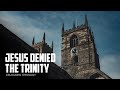

# Jesus denied the Trinity (2022-08-15)

## Description

You Can Support My Work on Patreon:
https://www.patreon.com/Bloggingtheology

My Paypal Link: 
https://www.paypal.com/paypalme/bloggingtheology?locale.x=en_GB

## Summary of [Jesus denied the Trinity](https://www.youtube.com/watch?v=p0gz1CSZbtA)

*This summary is AI generated - there may be inaccuracies. *

### [00:00:00](https://www.youtube.com/watch?v=p0gz1CSZbtA&t=0) - [00:00:00](https://www.youtube.com/watch?v=p0gz1CSZbtA&t=0)

claims that Christians who believe in the Trinity have fallen into disbelief, and quotes Jesus as saying that anyone who associates others with God in worship will be forbidden from Paradise. He also says that those who believe in the Trinity have fallen into disbelief, and that only one God exists. If they do not stop saying this, they will be afflicted with a painful punishment.

**[00:00:00](https://www.youtube.com/watch?v=p0gz1CSZbtA&t=0)** discusses how Christians who believe in the Trinity have fallen into disbelief, and quotes Jesus as saying that anyone who associates others with God in worship will be forbidden from Paradise. He also says that those who believe in the Trinity have fallen into disbelief, and that only one God exists. If they do not stop saying this, they will be afflicted with a painful punishment.

## Full transcript with timestamps

[0:00:00](https://youtu.be/p0gz1CSZbtA?t=0) here i am back in london at speaker's  
[0:00:02](https://youtu.be/p0gz1CSZbtA?t=2) corner  
[0:00:04](https://youtu.be/p0gz1CSZbtA?t=4) those who say god is the messiah son of  
[0:00:07](https://youtu.be/p0gz1CSZbtA?t=7) mary have certainly fallen into  
[0:00:09](https://youtu.be/p0gz1CSZbtA?t=9) disbelief  
[0:00:11](https://youtu.be/p0gz1CSZbtA?t=11) the messiah himself said o children of  
[0:00:14](https://youtu.be/p0gz1CSZbtA?t=14) israel worship god my lord and your lord  
[0:00:18](https://youtu.be/p0gz1CSZbtA?t=18) whoever associates others with god in  
[0:00:21](https://youtu.be/p0gz1CSZbtA?t=21) worship will surely be forbidden  
[0:00:23](https://youtu.be/p0gz1CSZbtA?t=23) paradise by god  
[0:00:25](https://youtu.be/p0gz1CSZbtA?t=25) their home will be the fire and the  
[0:00:27](https://youtu.be/p0gz1CSZbtA?t=27) wrongdoers will have no helpers  
[0:00:31](https://youtu.be/p0gz1CSZbtA?t=31) those who say god is one in a trinity  
[0:00:33](https://youtu.be/p0gz1CSZbtA?t=33) have certainly fallen into disbelief  
[0:00:36](https://youtu.be/p0gz1CSZbtA?t=36) there is only one god  
[0:00:38](https://youtu.be/p0gz1CSZbtA?t=38) if they do not stop saying this those  
[0:00:40](https://youtu.be/p0gz1CSZbtA?t=40) who disbelieve among them would be  
[0:00:42](https://youtu.be/p0gz1CSZbtA?t=42) afflicted with a painful punishment  
[0:00:45](https://youtu.be/p0gz1CSZbtA?t=45) will they not turn to god in repentance  
[0:00:48](https://youtu.be/p0gz1CSZbtA?t=48) and seek his forgiveness  
[0:00:50](https://youtu.be/p0gz1CSZbtA?t=50) and god is all forgiving most merciful  
