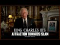

# King Charles III's attraction towards Islam (2022-09-09 23:36:12+00:00)

## Description

A speech by HRH The Prince of Wales titled 'Islam and the West' at the Oxford Centre for Islamic Studies, Oxford: https://www.princeofwales.gov.uk/speech/speech-hrh-prince-wales-titled-islam-and-west-oxford-centre-islamic-studies-sheldonian

You Can Support My Work on Patreon:
https://www.patreon.com/Bloggingtheology

My Paypal Link: 
https://www.paypal.com/paypalme/bloggingtheology?locale.x=en_GB

## Full transcript with timestamps

[0:00:03](https://youtu.be/1JE0WCVJbNg?t=3) On the 8th of September 2022 on the death of his 
mother Elizabeth II queen of the United Kingdom    
[0:00:13](https://youtu.be/1JE0WCVJbNg?t=13) prince Charles became king Charles III.   
[0:00:19](https://youtu.be/1JE0WCVJbNg?t=19) I want to do a video discussing the remarkable 
appreciation king Charles has for Islam. I am    
[0:00:28](https://youtu.be/1JE0WCVJbNg?t=28) not here to endorse or criticize the monarchy, I 
am just highlighting the refreshingly positive    
[0:00:36](https://youtu.be/1JE0WCVJbNg?t=36) writings and statements about Islam made 
by the new king when he was prince of Wales.    
[0:00:45](https://youtu.be/1JE0WCVJbNg?t=45) I think it is a matter of considerable 
public interest to know these facts.    
[0:00:52](https://youtu.be/1JE0WCVJbNg?t=52) in a speech entitled Islam and the West given 
at the Oxford Center for Islamic Studies    
[0:00:59](https://youtu.be/1JE0WCVJbNg?t=59) he said and I quote "it is odd in many ways that 
misunderstandings between Islam and the West    
[0:01:08](https://youtu.be/1JE0WCVJbNg?t=68) should persist for what binds our two worlds 
together is so much more powerful than that    
[0:01:16](https://youtu.be/1JE0WCVJbNg?t=76) which divides us Muslims, Christians, and Jews are 
all peoples of the Book and here Charles uses a    
[0:01:25](https://youtu.be/1JE0WCVJbNg?t=85) Quranic expression Islam and Christianity share 
a common monotheistic vision a belief in one God.    
[0:01:34](https://youtu.be/1JE0WCVJbNg?t=94) In the transients of our earthly life 
in our accountability for our actions    
[0:01:41](https://youtu.be/1JE0WCVJbNg?t=101) and in the assurance of life to come we share 
many key values in common respect for knowledge,    
[0:01:49](https://youtu.be/1JE0WCVJbNg?t=109) for justice, compassion towards the poor and 
underprivileged, the importance of family life,    
[0:01:57](https://youtu.be/1JE0WCVJbNg?t=117) respect for parents, honor the father and mother is 
a Quranic precept too ladies and gentlemen. Charles    
[0:02:07](https://youtu.be/1JE0WCVJbNg?t=127) continues if there is much misunderstanding in the 
West about the nature of Islam there is also much    
[0:02:16](https://youtu.be/1JE0WCVJbNg?t=136) ignorance about the debt our own culture 
and civilization owe to the Muslim world.    
[0:02:24](https://youtu.be/1JE0WCVJbNg?t=144) It is a failure which stems I think from the 
strait jacket of history we have inherited.    
[0:02:32](https://youtu.be/1JE0WCVJbNg?t=152) The medieval Islamic world from Central Asia 
to the shores of the Atlantic was a world    
[0:02:38](https://youtu.be/1JE0WCVJbNg?t=158) where scholars and men of learning flourished, 
but because we have tended to see Islam as the    
[0:02:46](https://youtu.be/1JE0WCVJbNg?t=166) enemy of the West, as an alien culture society,
and system of belief we have tended to ignore    
[0:02:55](https://youtu.be/1JE0WCVJbNg?t=175) or erase its great relevance to our own history. 
For example, we have underestimated the importance    
[0:03:04](https://youtu.be/1JE0WCVJbNg?t=184) of 800 years of Islamic society and culture in 
Spain between the 8th and the 15th centuries.    
[0:03:13](https://youtu.be/1JE0WCVJbNg?t=193) The contribution of Muslim Spain to the 
preservation of classical learning during    
[0:03:20](https://youtu.be/1JE0WCVJbNg?t=200) the dark ages that time of intellectual and 
cultural decline in the West and to the first    
[0:03:26](https://youtu.be/1JE0WCVJbNg?t=206) flowerings of the renaissance has long been 
recognized. but Islamic Spain said Charles was    
[0:03:34](https://youtu.be/1JE0WCVJbNg?t=214) much more than a mere larder where Hellenistic 
knowledge was kept for later consumption    
[0:03:40](https://youtu.be/1JE0WCVJbNg?t=220) by the emerging western world. Not only did Muslim 
Spain gather and preserve the intellectual content    
[0:03:49](https://youtu.be/1JE0WCVJbNg?t=229) of ancient Greek and Roman civilization, it also 
interpreted and expanded upon that civilization    
[0:03:58](https://youtu.be/1JE0WCVJbNg?t=238) and made a vital contribution of its own in 
so many fields of human endeavor in Science,  
[0:04:08](https://youtu.be/1JE0WCVJbNg?t=248) Astronomy, Mathematics, Algebra itself is an Arabic word, Law, History, Medicine, Pharmacology, Optics,   
[0:04:18](https://youtu.be/1JE0WCVJbNg?t=258) Agriculture, Architecture, Theology, and Music. Islam 
nurtured and preserved the quest for learning in    
[0:04:28](https://youtu.be/1JE0WCVJbNg?t=268) the words of the tradition the ink of the scholar 
is more sacred than the blood of the martyr.    
[0:04:36](https://youtu.be/1JE0WCVJbNg?t=276) Córdoba in the 10th century was by 
far the most civilized city of Europe.    
[0:04:44](https://youtu.be/1JE0WCVJbNg?t=284) We know of lending libraries in Spain at the time. 
king Alfred was making terrible blunders with the    
[0:04:51](https://youtu.be/1JE0WCVJbNg?t=291) culinary arts in this country, it is said that the 
400, 000 volumes in its rulers library amounted to    
[0:05:00](https://youtu.be/1JE0WCVJbNg?t=300) more books than all the libraries of the rest of 
Europe put together that was made possible because    
[0:05:09](https://youtu.be/1JE0WCVJbNg?t=309) the Muslim world acquired from China the skill of 
making paper more than 400 years before the rest    
[0:05:18](https://youtu.be/1JE0WCVJbNg?t=318) of non-Muslim Europe. Many of the traits on which 
Modern Europe prides it itself came to it from    
[0:05:27](https://youtu.be/1JE0WCVJbNg?t=327) Muslim Spain diplomacy, free trade, open borders, the 
techniques of academic research of anthropology,   
[0:05:36](https://youtu.be/1JE0WCVJbNg?t=336) etiquette, fashion, alternative medicine, hospitals, 
all came from this great city of cities.   
[0:05:46](https://youtu.be/1JE0WCVJbNg?t=346) Medieval Islam was a religion of remarkable 
tolerance for its time, now this is an insight    
[0:05:53](https://youtu.be/1JE0WCVJbNg?t=353) that Charles makes which is rarely appreciated in 
the West and I'm glad he is aware of it. medieval    
[0:06:00](https://youtu.be/1JE0WCVJbNg?t=360) Islam was a religion of remarkable tolerance for 
its time he says allowing Jews and Christians the    
[0:06:07](https://youtu.be/1JE0WCVJbNg?t=367) right to practice their inherited beliefs and 
setting an example which was not unfortunately    
[0:06:14](https://youtu.be/1JE0WCVJbNg?t=374) copied for many centuries in the West the surprise 
ladies and gentlemen is the extent to which Islam    
[0:06:22](https://youtu.be/1JE0WCVJbNg?t=382) has been a part of Europe for so long so Charles 
here is saying how crucial is we understand    
[0:06:29](https://youtu.be/1JE0WCVJbNg?t=389) Islam is a part of European history, it's not kind 
of an alien other from immigrants it's part of    
[0:06:36](https://youtu.be/1JE0WCVJbNg?t=396) the intrinsic history of Europe itself, first in 
Spain he says then in the Balkans and the extent    
[0:06:45](https://youtu.be/1JE0WCVJbNg?t=405) to which it has contributed so much towards the 
civilization which we all to think of wrongly as    
[0:06:53](https://youtu.be/1JE0WCVJbNg?t=413) entirely Western (non-Muslim). Islam is part of our 
past and present in all fields of human endeavor    
[0:07:05](https://youtu.be/1JE0WCVJbNg?t=425) it has helped create modern Europe, it is part of 
our own inheritance not a thing apart more than    
[0:07:16](https://youtu.be/1JE0WCVJbNg?t=436) this said Charles Islam can teach us today so he 
said this is the future king saying what Islam can    
[0:07:22](https://youtu.be/1JE0WCVJbNg?t=442) teach us as a non-Muslim country England Britain. 
Islam can teach us today a way of understanding    
[0:07:31](https://youtu.be/1JE0WCVJbNg?t=451) and living in the world which Christianity itself 
is poorer for having lost at the heart of Islam    
[0:07:39](https://youtu.be/1JE0WCVJbNg?t=459) and this is a great insight that Charles is making 
I think at the heart of Islam is its preservation    
[0:07:45](https://youtu.be/1JE0WCVJbNg?t=465) of an integral view of the universe, Islam refuses 
to separate man and nature, religion and science,    
[0:07:55](https://youtu.be/1JE0WCVJbNg?t=475) mind and matter, and has preserved a metaphysical 
and unified view of ourselves and the world around    
[0:08:04](https://youtu.be/1JE0WCVJbNg?t=484) us" end quote. That's just a fraction of the speech 
by the way I'll link to it in the description    
[0:08:10](https://youtu.be/1JE0WCVJbNg?t=490) below. In another speech at the sacred web 
conference now this is a Sufi Islamic kind of    
[0:08:18](https://youtu.be/1JE0WCVJbNg?t=498) conference which you can read online interestingly 
he praised a book by  René Guénon "The Reign of    
[0:08:27](https://youtu.be/1JE0WCVJbNg?t=507) Quantity" and here is the book itself I do 
recommend it. Now he said about this book    
[0:08:36](https://youtu.be/1JE0WCVJbNg?t=516) intriguingly many find this teaching difficult the 
teaching of religion not least because he asks us    
[0:08:43](https://youtu.be/1JE0WCVJbNg?t=523) to question our very mode of being and perhaps 
because he asks us to question an ideology    
[0:08:51](https://youtu.be/1JE0WCVJbNg?t=531) in the form of modernism that has become so set 
in our minds that any other way of being seems    
[0:08:59](https://youtu.be/1JE0WCVJbNg?t=539) in some sense fanciful and unrealistic end quote.
now what's interesting is really a French Muslim    
[0:09:09](https://youtu.be/1JE0WCVJbNg?t=549) convert he's a mathematician brilliant brilliant 
man in Paris he converted to Islam moved to Cairo    
[0:09:17](https://youtu.be/1JE0WCVJbNg?t=557) actually and was known as a traditionalist Sufi. 
Charles clearly agrees with many aspects of his    
[0:09:26](https://youtu.be/1JE0WCVJbNg?t=566) worldview if you read the speech you'll see other 
examples. He also quotes approvingly some of the    
[0:09:32](https://youtu.be/1JE0WCVJbNg?t=572) works of professor Seyyed Nasr. Seyyed Nasr is a very prominent now American professor in   
[0:09:40](https://youtu.be/1JE0WCVJbNg?t=580) the States he is originally Iranian a brilliant  individual also Martin Lings now Martin Lings    
[0:09:48](https://youtu.be/1JE0WCVJbNg?t=588) is very interesting and I want to read a few 
lines from this book it's called "A Return to the Spirit" questions and answers by Martin Lings. 
it was published just after Martin Ling's death    
[0:10:00](https://youtu.be/1JE0WCVJbNg?t=600) and contained some of his writings plus a number 
of essays and appreciations by his admirers.    
[0:10:08](https://youtu.be/1JE0WCVJbNg?t=608) One of these admirers just happens to be the king 
Charles III. Who was Martin Lings by the way?    
[0:10:14](https://youtu.be/1JE0WCVJbNg?t=614) Martin Lings was an English convert to Islam a 
very well-known Sufi and he was the author of    
[0:10:22](https://youtu.be/1JE0WCVJbNg?t=622) a very famous book and this is what Charles says 
in the introduction is under the official    
[0:10:29](https://youtu.be/1JE0WCVJbNg?t=629) crest clarence house and he signed his name at the 
bottom, Charles. This is one sentence I want to read    
[0:10:37](https://youtu.be/1JE0WCVJbNg?t=637) to you: one of Martin Lings greatest legacies was 
his remarkable biography of the Prophet Muhammad    
[0:10:49](https://youtu.be/1JE0WCVJbNg?t=649) now this is the book in question I've done many 
many videos reading chapter after chapter from    
[0:10:54](https://youtu.be/1JE0WCVJbNg?t=654) this book (Muhammad his life based on the earliest 
sources) by Martin Lings many many people consider    
[0:11:02](https://youtu.be/1JE0WCVJbNg?t=662) this to be the greatest 
biography seerah of the Prophet Muhammad    
[0:11:07](https://youtu.be/1JE0WCVJbNg?t=667) upon him be peace in the English language. 
Not without its faults but it is a beautiful    
[0:11:13](https://youtu.be/1JE0WCVJbNg?t=673) literary work and I highly recommend it 
so does prince Charles he thinks this    
[0:11:19](https://youtu.be/1JE0WCVJbNg?t=679) is an amazing book so he's praising here a 
book written by a prominent English Muslim    
[0:11:26](https://youtu.be/1JE0WCVJbNg?t=686) about the last prophet sent to mankind Muhammad 
upon him be peace. So, that's what prince Charles    
[0:11:32](https://youtu.be/1JE0WCVJbNg?t=692) thinks about that book it was remarkable but just 
but Martin Lings as I said was a convert to Islam he    
[0:11:38](https://youtu.be/1JE0WCVJbNg?t=698) died some time ago and a very prominent Sufi so 
clearly Charles is attracted to Sufism rather than    
[0:11:46](https://youtu.be/1JE0WCVJbNg?t=706) other forms other expressions I should 
say of islamic spirituality or teaching.    
[0:11:53](https://youtu.be/1JE0WCVJbNg?t=713) Now just in conclusion, to be clear, I am 
not saying king Charles is a closet Muslim    
[0:12:03](https://youtu.be/1JE0WCVJbNg?t=723) but he is clearly literate in some 
aspects of Islamic thought and metaphysics.   
[0:12:10](https://youtu.be/1JE0WCVJbNg?t=730) This is unparalleled in the history of the British 
Monarchy. I am also not suggesting that Muslims    
[0:12:19](https://youtu.be/1JE0WCVJbNg?t=739) as Muslims should back the new king, my intention 
in this video is simply to give a glimpse    
[0:12:27](https://youtu.be/1JE0WCVJbNg?t=747) of what he thinks about Islam. so Muslims 
in the U.K. can decide for themselves    
[0:12:34](https://youtu.be/1JE0WCVJbNg?t=754) how best to engage king Charles III in dialogue 
and discussion insha Allah. Till next time.  
