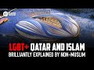

# LGBT+ Qatar and Islam brilliantly explained by non-Muslim (2022-11-28)

## Description

Dennis Fang on TikTok:
https://www.tiktok.com/@dennis.fang/video/7169367944206585090?is_copy_url=1&is_from_webapp=v1&lang=en

## Summary of [LGBT+ Qatar and Islam brilliantly explained by non-Muslim](https://www.youtube.com/watch?v=0RLpcXt7M2g)

*This summary is AI generated - there may be inaccuracies. *

### [00:00:00](https://www.youtube.com/watch?v=0RLpcXt7M2g&t=0) - [00:00:00](https://www.youtube.com/watch?v=0RLpcXt7M2g&t=0)

"LGBT+ Qatar and Islam brilliantly explained by non-Muslim," Dennis Fang, a non-Muslim, explains why Muslims in Qatar are struggling to accept LGBT people. He points out that the values of secular liberalism, which are prevalent in Qatar, are at odds with Islamic morality. Muslims appreciate his perspective, and it is rare to find a non-Muslim who understands Islam's stance on LGBT.

**[00:00:00](https://www.youtube.com/watch?v=0RLpcXt7M2g&t=0)** Muslims in Qatar are struggling to accept LGBT people because their values are based on secular liberalism, which is at odds with Islamic morality. Dennis Fang, a non-Muslim, explains why in a concise video. Muslims appreciate his perspective, and it is rare to find a non-Muslim who understands Islam's stance on LGBT.

## Full transcript with timestamps

[0:00:03](https://youtu.be/0RLpcXt7M2g?t=3) I came across a video on Tick Tock recently 
which has really impressed a lot of people    
[0:00:09](https://youtu.be/0RLpcXt7M2g?t=9) especially Muslims you get this guy who's 
a non-muslim and giving us telling the world    
[0:00:15](https://youtu.be/0RLpcXt7M2g?t=15) the real reason behind why Qatar is having so 
much trouble accepting LGBT people and that's    
[0:00:24](https://youtu.be/0RLpcXt7M2g?t=24) precisely the wording this guy Dennis Fang uses  on Tick Tock as I say I just want to share this    
[0:00:31](https://youtu.be/0RLpcXt7M2g?t=31) video it's quite short a couple of minutes long 
and it's one of the best videos I've ever come    
[0:00:37](https://youtu.be/0RLpcXt7M2g?t=37) across by a non-Muslim explaining the Islamic 
perspective on LGBT and gender and why Qatar as    
[0:00:45](https://youtu.be/0RLpcXt7M2g?t=45) he puts it is having so much trouble from the 
West which accepts a very different set of values    
[0:00:50](https://youtu.be/0RLpcXt7M2g?t=50) based on secular liberalism and of course the 
West is seeking to impose this culturally and    
[0:00:57](https://youtu.be/0RLpcXt7M2g?t=57) economically on the rest of the world and Qatar 
obviously as a Muslim country is resisting this    
[0:01:03](https://youtu.be/0RLpcXt7M2g?t=63) and the West doesn't understand why he doesn't 
want to hear the reasons why and Dennis Fang    
[0:01:09](https://youtu.be/0RLpcXt7M2g?t=69) to his credit, he sounds like an English educated 
public school guy, actually I think he lives in    
[0:01:15](https://youtu.be/0RLpcXt7M2g?t=75) Australia but gives a superb set of insightful 
reasons why Muslims do not accept this agenda    
[0:01:22](https://youtu.be/0RLpcXt7M2g?t=82) why actually we cannot accept this agenda it's 
not a question of stubbornness or not wanting to    
[0:01:27](https://youtu.be/0RLpcXt7M2g?t=87) go along with the Western values that God has 
given us certain parameters and guidelines and    
[0:01:33](https://youtu.be/0RLpcXt7M2g?t=93) rules uh by which to live our lives and they are 
non-negotiable they are set down by our creator    
[0:01:41](https://youtu.be/0RLpcXt7M2g?t=101) anyway I'll I want to share this 
video I'll share it with you its entirety    
[0:01:45](https://youtu.be/0RLpcXt7M2g?t=105) and I'll link to the tick tock  link 
below and you can read the comments left by    
[0:01:52](https://youtu.be/0RLpcXt7M2g?t=112) Muslims which are very appreciative 
of their non-Muslims understanding which I    
[0:01:59](https://youtu.be/0RLpcXt7M2g?t=119) think is quite rare in my experience to find 
a non Muslin to really get it anyway enjoy.  
[0:01:59](https://youtu.be/0RLpcXt7M2g?t=119) why is Qatar struggling so much with LGBT people is 
a simple bigotry can't they be more open-minded    
[0:02:13](https://youtu.be/0RLpcXt7M2g?t=133) or be more accepting of all self-identities well 
it's because of the moral framework of Islam and    
[0:02:19](https://youtu.be/0RLpcXt7M2g?t=139) LGBT that are diametrically opposed you see LGBT 
is a result of Western individual liberalism it's    
[0:02:26](https://youtu.be/0RLpcXt7M2g?t=146) built a fundamentally upon the Revolutionary idea 
that one has sovereignty over their own bodies    
[0:02:33](https://youtu.be/0RLpcXt7M2g?t=153) you are free to do whatever you want with it as it 
resolves the idea of goodness is a utilitarian one    
[0:02:39](https://youtu.be/0RLpcXt7M2g?t=159) where fostering one's own pleasure and limiting 
the undermining of other people's pleasure is    
[0:02:45](https://youtu.be/0RLpcXt7M2g?t=165) the ultimate virtue and because morality is 
subjective one's own feelings inside are of    
[0:02:51](https://youtu.be/0RLpcXt7M2g?t=171) the utmost importance hence we have people 
identifying with our own feelings and bodily    
[0:02:57](https://youtu.be/0RLpcXt7M2g?t=177) urges hence I feel like a female therefore I am a 
female I'm attracted to men therefore I identify    
[0:03:03](https://youtu.be/0RLpcXt7M2g?t=183) suffice a homosexual in Islam on the other 
hand one doesn't have sovereignty over their    
[0:03:08](https://youtu.be/0RLpcXt7M2g?t=188) own bodies for humans were created deliberately 
by God to fulfill a noble and spiritual purpose    
[0:03:15](https://youtu.be/0RLpcXt7M2g?t=195) and that purpose is in serving God who is the 
ultimate form of good in this moral framework    
[0:03:22](https://youtu.be/0RLpcXt7M2g?t=202) in this Paradigm Allah created the male and 
the female with reproductive and social roles    
[0:03:28](https://youtu.be/0RLpcXt7M2g?t=208) and thus fulfilling those purposes it's honoring 
God there is no concept of my body my choice for    
[0:03:34](https://youtu.be/0RLpcXt7M2g?t=214) the choice has already been made it was destined 
for you it is for example only in a heterosexual    
[0:03:40](https://youtu.be/0RLpcXt7M2g?t=220) marriage where gender differences are in force 
when men are more dominant and women have ideals    
[0:03:46](https://youtu.be/0RLpcXt7M2g?t=226) of beauty and gentility that we see a metaphysical 
wholeness in marriage sex outside those purposes    
[0:03:54](https://youtu.be/0RLpcXt7M2g?t=234) loses all meaning and legitimacy for remember the 
purpose of sex isn't individualistic pleasure but    
[0:04:01](https://youtu.be/0RLpcXt7M2g?t=241) to fulfill a higher and trans Transcendent good I 
hope you can see that guitar can't simply make a    
[0:04:08](https://youtu.be/0RLpcXt7M2g?t=248) few small amendments to their laws and wave 
a rainbow flag and accept homosexuality and    
[0:04:13](https://youtu.be/0RLpcXt7M2g?t=253) trans people because they're whole teleology of 
humanity in general is diametrically opposed to    
[0:04:20](https://youtu.be/0RLpcXt7M2g?t=260) what we're familiar with in the western world and 
all the individualistic liberalism has become the    
[0:04:27](https://youtu.be/0RLpcXt7M2g?t=267) de facto lingua Franca of morality we do need to 
understand the difficulty or even the futility of    
[0:04:34](https://youtu.be/0RLpcXt7M2g?t=274) well colonizing foreign people without ideas 
morality we might think that we're right and    
[0:04:40](https://youtu.be/0RLpcXt7M2g?t=280) they're wrong but remember they are thinking 
the exact same thing thanks for watching  
