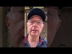

# Lowest & highest station in Paradise #shorts (2021-07-25)

## Description

Hadith from Ahmad and Tirmidhi

## Summary of [Lowest & highest station in Paradise #shorts](https://www.youtube.com/watch?v=bpzb1rjHUkI)

*This summary is AI generated - there may be inaccuracies. *

### [00:00:00](https://www.youtube.com/watch?v=bpzb1rjHUkI&t=0) - [00:00:00](https://www.youtube.com/watch?v=bpzb1rjHUkI&t=0)

a man discusses the hadith that the lowest in station in Paradise will be the one who looks at his gardens, wives, bliss, and servants, while the most honored person will be the one who looks at his face morning and evening. The man goes on to say that this shows that what really matters is not what we have, but how we use what we have.

**[00:00:00](https://www.youtube.com/watch?v=bpzb1rjHUkI&t=0)** According to a hadith recorded by Ahmed Termiti, the lowest in station in Paradise will be the one who looks at his gardens, his wives, his bliss, and his servants. The most honored person in Paradise will be the one who looks at his face morning and evening.

<h2>Full transcript with timestamps: CLICK TO EXPAND</h2>

[0:00:01](https://youtu.be/bpzb1rjHUkI?t=1) ibn umar related that the messenger of  
[0:00:03](https://youtu.be/bpzb1rjHUkI?t=3) god upon whom be peace  
[0:00:04](https://youtu.be/bpzb1rjHUkI?t=4) said the lowest in station among the  
[0:00:07](https://youtu.be/bpzb1rjHUkI?t=7) inhabitants of paradise  
[0:00:09](https://youtu.be/bpzb1rjHUkI?t=9) will be the one who looks at his gardens  
[0:00:12](https://youtu.be/bpzb1rjHUkI?t=12) his wives  
[0:00:13](https://youtu.be/bpzb1rjHUkI?t=13) his bliss his servants and his couches  
[0:00:16](https://youtu.be/bpzb1rjHUkI?t=16) stretching a thousand years journey and  
[0:00:19](https://youtu.be/bpzb1rjHUkI?t=19) the one who would be  
[0:00:21](https://youtu.be/bpzb1rjHUkI?t=21) most honored by god will be the one who  
[0:00:24](https://youtu.be/bpzb1rjHUkI?t=24) looks at his  
[0:00:24](https://youtu.be/bpzb1rjHUkI?t=24) face morning and evening  
[0:00:28](https://youtu.be/bpzb1rjHUkI?t=28) the prophet then recited on that day  
[0:00:31](https://youtu.be/bpzb1rjHUkI?t=31) will faces be resplendent looking  
[0:00:34](https://youtu.be/bpzb1rjHUkI?t=34) upon their lord from surah 75  
[0:00:38](https://youtu.be/bpzb1rjHUkI?t=38) 22 hadith from ahmed termiti  

