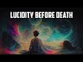

# Lucidity before death: Extraordinary challenges to materialism (2022-12-29)

## Description

Encountering Mystery: Religious Experience in a Secular Age by Dale C Allison https://www.amazon.co.uk/Encountering-Mystery-Religious-Experience-Secular/dp/0802881882/ref=sr_1_1?crid=2E5ZFJYCN9RE8&keywords=encountering+mystery&qid=1672425613&sprefix=encountering%2520mystery%2Caps%2C60&sr=8-1

You Can Support My Work on Patreon:
https://www.patreon.com/Bloggingtheology

My Paypal Link: 
https://www.paypal.com/paypalme/bloggingtheology?locale.x=en_GB

## Summary of [Lucidity before death: Extraordinary challenges to materialism](https://www.youtube.com/watch?v=Xsuu31AUCRw)

*This summary is AI generated - there may be inaccuracies. *

### [00:00:00](https://www.youtube.com/watch?v=Xsuu31AUCRw&t=0) - [00:35:00](https://www.youtube.com/watch?v=Xsuu31AUCRw&t=2100)

 "Lucidity before death: Extraordinary challenges to materialism" discusses the phenomenon of terminal lucidity, in which a person who is near death becomes aware and communicative. This phenomenon challenges materialism, as it suggests that there is more to reality than what can be physically observed. The video features interviews with people who have had near-death experiences, as well as with experts who discuss the implications of these experiences.

**[00:00:00](https://www.youtube.com/watch?v=Xsuu31AUCRw&t=0)**  Professor Dale Allison shares accounts of phenomena which he calls Lucidity before death. These experiences typically occur in the final hours or days of a person's life, and can include an elevated mood and spiritual awareness. Allison notes that this phenomenon barely shows up in the medical literature of the 20th century, and it was largely forgotten until 2009.
* **[00:05:00](https://www.youtube.com/watch?v=Xsuu31AUCRw&t=300)** This video discusses the phenomenon of terminal lucidity, which is when a person who is near death becomes aware and communicative. There are several reports of people who have exhibited terminal lucidity before death, including a 91-year-old woman who had been wholly unresponsive for five years, a woman with Alzheimer's who had not spoken with or recognized anyone for years, and a man with terminal cancer who woke up a few minutes before he died.
* **[00:10:00](https://www.youtube.com/watch?v=Xsuu31AUCRw&t=600)** Near-death experiences are extraordinary experiences which challenge materialism, with some cases corroborating accounts by third parties. These experiences often include seeing things which are physically impossible, and often include an outer body experience. Professor Allison discusses this evidence in-depth, concluding that it points to the subjective nature of near-death experiences, and that they are evidence of an afterlife, of our Spirits, and of God. He urges people to be more confident in these experiences, as they are not just the visions of people who are scared or in pain.
* **[00:15:00](https://www.youtube.com/watch?v=Xsuu31AUCRw&t=900)** These testimonies confirm that experiences reported as "near-death experiences" are, in fact, real. This information can be used to draw conclusions about the dimensions of reality, the afterlife, and God.
* **[00:20:00](https://www.youtube.com/watch?v=Xsuu31AUCRw&t=1200)** This video features a cardiologist recounting an extraordinary case in which a patient claimed to recall events from outside of the body, including the position of surgeons and nurses in the operating theater. The cardiologist warns that such cases are "impossible" and "unexplainable" and that anyone seeking to do so should be careful not to become arrogant.
* **[00:25:00](https://www.youtube.com/watch?v=Xsuu31AUCRw&t=1500)** The videos present cases of people who seemingly experienced awareness after their hearts and brains had stopped working, displaying accurate recounting of events during their near-death experiences. In one case, a patient recalled seeing a 1985 quarter in the corner of a cardiac monitor while he was unconscious. In another, a psychoanalyst recounted a patient's near-death experience while the patient was conscious but unable to respond. In both cases, the patients were able to accurately recount what was happening around them and above them with great lucidity.
* **[00:30:00](https://www.youtube.com/watch?v=Xsuu31AUCRw&t=1800)** This video discusses the phenomenon of lucid dreaming, which is when a person becomes consciously aware that they are dreaming. It interviews various people who have had lucid dreams, and the author concludes that, although there is still much to be learned about the phenomenon, it appears that there is more to reality than what materialism would suggest.
* **[00:35:00](https://www.youtube.com/watch?v=Xsuu31AUCRw&t=2100)** discusses the nature of human beings and the soul, and how these experiences are not rare. mentions that these experiences are supported by passages from the Quran. He challenges the dogmatic view of those who reject these phenomena, and argues that a paradigm shift is needed in order to understand who we are as a species. This video points to the importance of religion in understanding these phenomena, and shows how it reinforces other faiths' beliefs in the afterlife. More and more people are beginning to understand these concepts, and will live accordingly as a result.

<h2>Full transcript with timestamps: CLICK TO EXPAND</h2>

[0:00:04](https://youtu.be/Xsuu31AUCRw?t=4) in this video I want to share with you  
[0:00:06](https://youtu.be/Xsuu31AUCRw?t=6) some extraordinary challenges to  
[0:00:09](https://youtu.be/Xsuu31AUCRw?t=9) materialism materialism is a philosophy  
[0:00:12](https://youtu.be/Xsuu31AUCRw?t=12) which is pretty dominant in the west and  
[0:00:14](https://youtu.be/Xsuu31AUCRw?t=14) it has a certain understanding of who we  
[0:00:16](https://youtu.be/Xsuu31AUCRw?t=16) are as human beings and I think this is  
[0:00:19](https://youtu.be/Xsuu31AUCRw?t=19) coming under sustained critique and  
[0:00:21](https://youtu.be/Xsuu31AUCRw?t=21) Challenge and nowhere more so in the  
[0:00:24](https://youtu.be/Xsuu31AUCRw?t=24) area of near-death experiences and  
[0:00:27](https://youtu.be/Xsuu31AUCRw?t=27) lucidity before death and other  
[0:00:29](https://youtu.be/Xsuu31AUCRw?t=29) remarkable phenomena which are now very  
[0:00:31](https://youtu.be/Xsuu31AUCRw?t=31) well researched and documented often in  
[0:00:34](https://youtu.be/Xsuu31AUCRw?t=34) peer-reviewed academic journals  
[0:00:37](https://youtu.be/Xsuu31AUCRw?t=37) and I want to share some of these  
[0:00:39](https://youtu.be/Xsuu31AUCRw?t=39) accounts with you because I found them  
[0:00:41](https://youtu.be/Xsuu31AUCRw?t=41) mind-blowing when I first came across  
[0:00:42](https://youtu.be/Xsuu31AUCRw?t=42) them and I thought wow this tells us  
[0:00:44](https://youtu.be/Xsuu31AUCRw?t=44) something extraordinary about who we are  
[0:00:47](https://youtu.be/Xsuu31AUCRw?t=47) as a species and also the universe that  
[0:00:49](https://youtu.be/Xsuu31AUCRw?t=49) we live in as well as well as the  
[0:00:52](https://youtu.be/Xsuu31AUCRw?t=52) Transcendent spiritual realm now I'm  
[0:00:54](https://youtu.be/Xsuu31AUCRw?t=54) going to be drawing um many of these  
[0:00:56](https://youtu.be/Xsuu31AUCRw?t=56) accounts from this book uh encountering  
[0:00:58](https://youtu.be/Xsuu31AUCRw?t=58) mystery religious experience in a  
[0:01:01](https://youtu.be/Xsuu31AUCRw?t=61) secular age by Professor Dale Allison  
[0:01:03](https://youtu.be/Xsuu31AUCRw?t=63) who's a professor at Princeton in  
[0:01:06](https://youtu.be/Xsuu31AUCRw?t=66) America  
[0:01:07](https://youtu.be/Xsuu31AUCRw?t=67) um and I had the privilege of  
[0:01:08](https://youtu.be/Xsuu31AUCRw?t=68) interviewing him recently on blogging  
[0:01:10](https://youtu.be/Xsuu31AUCRw?t=70) theology do watch that video so the  
[0:01:12](https://youtu.be/Xsuu31AUCRw?t=72) first thing I want to share with you is  
[0:01:14](https://youtu.be/Xsuu31AUCRw?t=74) the phenomena that he uh recounts in his  
[0:01:16](https://youtu.be/Xsuu31AUCRw?t=76) book firstly what he calls Lucidity  
[0:01:20](https://youtu.be/Xsuu31AUCRw?t=80) before death Lucidity before death what  
[0:01:23](https://youtu.be/Xsuu31AUCRw?t=83) is this phenomena well let me if you're  
[0:01:25](https://youtu.be/Xsuu31AUCRw?t=85) not aware of it is extraordinary and I  
[0:01:27](https://youtu.be/Xsuu31AUCRw?t=87) want to share it with you uh what he  
[0:01:29](https://youtu.be/Xsuu31AUCRw?t=89) says here and he quotes many  
[0:01:31](https://youtu.be/Xsuu31AUCRw?t=91) um sources and research about this so he  
[0:01:34](https://youtu.be/Xsuu31AUCRw?t=94) begins on page 103.  
[0:01:37](https://youtu.be/Xsuu31AUCRw?t=97) in the middle of the 19th century a  
[0:01:40](https://youtu.be/Xsuu31AUCRw?t=100) French doctor wrote  
[0:01:42](https://youtu.be/Xsuu31AUCRw?t=102) in certain diseases the senses acquire  
[0:01:45](https://youtu.be/Xsuu31AUCRw?t=105) an extraordinary delicacy on the  
[0:01:48](https://youtu.be/Xsuu31AUCRw?t=108) approach of death  
[0:01:49](https://youtu.be/Xsuu31AUCRw?t=109) when the sick person astonishes those  
[0:01:52](https://youtu.be/Xsuu31AUCRw?t=112) about him by the elevation of his  
[0:01:55](https://youtu.be/Xsuu31AUCRw?t=115) thoughts  
[0:01:56](https://youtu.be/Xsuu31AUCRw?t=116) and the sudden Lucidity of a mind which  
[0:01:59](https://youtu.be/Xsuu31AUCRw?t=119) has been obscured during many long years  
[0:02:03](https://youtu.be/Xsuu31AUCRw?t=123) end quote  
[0:02:05](https://youtu.be/Xsuu31AUCRw?t=125) similar other words from a British  
[0:02:07](https://youtu.be/Xsuu31AUCRw?t=127) physician of the same Century quote we  
[0:02:10](https://youtu.be/Xsuu31AUCRw?t=130) have all observed the Mind clear up in  
[0:02:13](https://youtu.be/Xsuu31AUCRw?t=133) an extraordinary manner in the last  
[0:02:16](https://youtu.be/Xsuu31AUCRw?t=136) hours of life  
[0:02:17](https://youtu.be/Xsuu31AUCRw?t=137) when the terminated even in the course  
[0:02:20](https://youtu.be/Xsuu31AUCRw?t=140) in even in the ordinary course of nature  
[0:02:23](https://youtu.be/Xsuu31AUCRw?t=143) but certainly still more remarkable when  
[0:02:27](https://youtu.be/Xsuu31AUCRw?t=147) is being cut short by disease when uh  
[0:02:31](https://youtu.be/Xsuu31AUCRw?t=151) which have effect which had affected for  
[0:02:34](https://youtu.be/Xsuu31AUCRw?t=154) a Time the intellectual faculties end  
[0:02:38](https://youtu.be/Xsuu31AUCRw?t=158) quote and Alison explains in more detail  
[0:02:41](https://youtu.be/Xsuu31AUCRw?t=161) what this phenomena are he continues  
[0:02:44](https://youtu.be/Xsuu31AUCRw?t=164) these remarks represent once common  
[0:02:47](https://youtu.be/Xsuu31AUCRw?t=167) knowledge so this is widely known in our  
[0:02:50](https://youtu.be/Xsuu31AUCRw?t=170) civilization uh before more recent times  
[0:02:54](https://youtu.be/Xsuu31AUCRw?t=174) Hippocrates Cicero Plutarch and Galen is  
[0:02:58](https://youtu.be/Xsuu31AUCRw?t=178) a figures in the ancient world as well  
[0:03:00](https://youtu.be/Xsuu31AUCRw?t=180) as doctors in the 18th and 19th  
[0:03:02](https://youtu.be/Xsuu31AUCRw?t=182) centuries reported cases of the confused  
[0:03:06](https://youtu.be/Xsuu31AUCRw?t=186) or cognitively inert becoming shortly  
[0:03:10](https://youtu.be/Xsuu31AUCRw?t=190) before death perfectly Lucid so these  
[0:03:13](https://youtu.be/Xsuu31AUCRw?t=193) people are about to whose lives are  
[0:03:15](https://youtu.be/Xsuu31AUCRw?t=195) about to end on this Earth and they may  
[0:03:18](https://youtu.be/Xsuu31AUCRw?t=198) have been Advanced stages of illness and  
[0:03:21](https://youtu.be/Xsuu31AUCRw?t=201) sickness and suddenly they become very  
[0:03:23](https://youtu.be/Xsuu31AUCRw?t=203) very lucid perfectly Lucid perfectly  
[0:03:25](https://youtu.be/Xsuu31AUCRw?t=205) clear and aware and awake  
[0:03:29](https://youtu.be/Xsuu31AUCRw?t=209) William monk in a book published in 1887  
[0:03:32](https://youtu.be/Xsuu31AUCRw?t=212) remarked that Lucidity before death  
[0:03:36](https://youtu.be/Xsuu31AUCRw?t=216) quote has impressed and surprised  
[0:03:38](https://youtu.be/Xsuu31AUCRw?t=218) Mankind from the earliest ages unquote  
[0:03:43](https://youtu.be/Xsuu31AUCRw?t=223) Now Alison goes on to say something very  
[0:03:45](https://youtu.be/Xsuu31AUCRw?t=225) interesting the phenomenon however  
[0:03:47](https://youtu.be/Xsuu31AUCRw?t=227) barely shows up in the medical  
[0:03:50](https://youtu.be/Xsuu31AUCRw?t=230) literature of the 20th centuries this  
[0:03:52](https://youtu.be/Xsuu31AUCRw?t=232) guy I've not noticed or ignored by the  
[0:03:55](https://youtu.be/Xsuu31AUCRw?t=235) doctor's profession by the medical  
[0:03:56](https://youtu.be/Xsuu31AUCRw?t=236) profession it seems to be largely  
[0:03:59](https://youtu.be/Xsuu31AUCRw?t=239) forgotten until  
[0:04:01](https://youtu.be/Xsuu31AUCRw?t=241) 2009 he says when a German biologist  
[0:04:05](https://youtu.be/Xsuu31AUCRw?t=245) Michael Nam published a survey of  
[0:04:08](https://youtu.be/Xsuu31AUCRw?t=248) relevant cases and coined the phrase in  
[0:04:12](https://youtu.be/Xsuu31AUCRw?t=252) English translates as terminal lucidity  
[0:04:16](https://youtu.be/Xsuu31AUCRw?t=256) he offers this description quote the  
[0:04:19](https://youtu.be/Xsuu31AUCRw?t=259) re-emergence of normal or unusually  
[0:04:22](https://youtu.be/Xsuu31AUCRw?t=262) enhanced medical abilities in dull  
[0:04:26](https://youtu.be/Xsuu31AUCRw?t=266) unconscious or mentally ill patients  
[0:04:29](https://youtu.be/Xsuu31AUCRw?t=269) shortly before death  
[0:04:31](https://youtu.be/Xsuu31AUCRw?t=271) including considerable elevation of mood  
[0:04:34](https://youtu.be/Xsuu31AUCRw?t=274) and spiritual affectation or the ability  
[0:04:37](https://youtu.be/Xsuu31AUCRw?t=277) to speak in a previously unusual  
[0:04:40](https://youtu.be/Xsuu31AUCRw?t=280) spiritualized and elated manner end  
[0:04:44](https://youtu.be/Xsuu31AUCRw?t=284) quote to illustrate  
[0:04:47](https://youtu.be/Xsuu31AUCRw?t=287) Scott Hague a well-known medical  
[0:04:49](https://youtu.be/Xsuu31AUCRw?t=289) columnist and clinical professor of  
[0:04:52](https://youtu.be/Xsuu31AUCRw?t=292) orthopedic surgery at Columbia  
[0:04:54](https://youtu.be/Xsuu31AUCRw?t=294) University College of Physicians and  
[0:04:56](https://youtu.be/Xsuu31AUCRw?t=296) surgeons had a patient David  
[0:05:00](https://youtu.be/Xsuu31AUCRw?t=300) whose lung cancer as so often happens  
[0:05:03](https://youtu.be/Xsuu31AUCRw?t=303) had met as day-sized to his brain  
[0:05:07](https://youtu.be/Xsuu31AUCRw?t=307) David's speech as a result was slurred  
[0:05:10](https://youtu.be/Xsuu31AUCRw?t=310) then he became incoherent then he could  
[0:05:14](https://youtu.be/Xsuu31AUCRw?t=314) no longer move he eventually became holy  
[0:05:18](https://youtu.be/Xsuu31AUCRw?t=318) unresponsive  
[0:05:20](https://youtu.be/Xsuu31AUCRw?t=320) in other words there was no reaction  
[0:05:22](https://youtu.be/Xsuu31AUCRw?t=322) from them at all according to Professor  
[0:05:25](https://youtu.be/Xsuu31AUCRw?t=325) Hague he showed no expression no  
[0:05:28](https://youtu.be/Xsuu31AUCRw?t=328) response to anything we did to him as  
[0:05:30](https://youtu.be/Xsuu31AUCRw?t=330) far as I could tell he was just not  
[0:05:32](https://youtu.be/Xsuu31AUCRw?t=332) there end quote  
[0:05:34](https://youtu.be/Xsuu31AUCRw?t=334) a scan revealed that cancer had eaten  
[0:05:37](https://youtu.be/Xsuu31AUCRw?t=337) most of his brain and yet an hour before  
[0:05:42](https://youtu.be/Xsuu31AUCRw?t=342) his death and after he had already begun  
[0:05:45](https://youtu.be/Xsuu31AUCRw?t=345) to breathe irregularly he awakened so  
[0:05:48](https://youtu.be/Xsuu31AUCRw?t=348) David actually awakened  
[0:05:50](https://youtu.be/Xsuu31AUCRw?t=350) he smiled spoke clearly to his gathered  
[0:05:54](https://youtu.be/Xsuu31AUCRw?t=354) family and held their hands  
[0:05:56](https://youtu.be/Xsuu31AUCRw?t=356) only then did he slip away  
[0:06:00](https://youtu.be/Xsuu31AUCRw?t=360) the attending nurse opined that it was  
[0:06:03](https://youtu.be/Xsuu31AUCRw?t=363) quote like a miracle  
[0:06:06](https://youtu.be/Xsuu31AUCRw?t=366) this was Professor hague's verdict  
[0:06:08](https://youtu.be/Xsuu31AUCRw?t=368) remember this is a medical professional  
[0:06:10](https://youtu.be/Xsuu31AUCRw?t=370) quote it wasn't David's brain that woke  
[0:06:13](https://youtu.be/Xsuu31AUCRw?t=373) him up to say goodbye that Friday his  
[0:06:17](https://youtu.be/Xsuu31AUCRw?t=377) brain had already been destroyed  
[0:06:20](https://youtu.be/Xsuu31AUCRw?t=380) tumor metastasizes don't simply occupy  
[0:06:24](https://youtu.be/Xsuu31AUCRw?t=384) space and press on things leaving a  
[0:06:27](https://youtu.be/Xsuu31AUCRw?t=387) whole brain the metastases actually  
[0:06:30](https://youtu.be/Xsuu31AUCRw?t=390) replace tissue where that gray stuff  
[0:06:33](https://youtu.be/Xsuu31AUCRw?t=393) grows the brain is just not their end  
[0:06:38](https://youtu.be/Xsuu31AUCRw?t=398) quote it's remarkable quote from the  
[0:06:40](https://youtu.be/Xsuu31AUCRw?t=400) professor there the guy basically had  
[0:06:42](https://youtu.be/Xsuu31AUCRw?t=402) little brain left it certainly wasn't  
[0:06:44](https://youtu.be/Xsuu31AUCRw?t=404) able to communicate in any way that  
[0:06:47](https://youtu.be/Xsuu31AUCRw?t=407) medical science could possibly  
[0:06:48](https://youtu.be/Xsuu31AUCRw?t=408) understand and yet he became fully aware  
[0:06:51](https://youtu.be/Xsuu31AUCRw?t=411) alert awake and it could hold normal  
[0:06:53](https://youtu.be/Xsuu31AUCRw?t=413) conversations the moment before he  
[0:06:57](https://youtu.be/Xsuu31AUCRw?t=417) passed away just an hour or so before he  
[0:06:59](https://youtu.be/Xsuu31AUCRw?t=419) passed away  
[0:07:00](https://youtu.be/Xsuu31AUCRw?t=420) remarkable uh uh confirmed authentic  
[0:07:04](https://youtu.be/Xsuu31AUCRw?t=424) report from a medical profession a  
[0:07:06](https://youtu.be/Xsuu31AUCRw?t=426) professional  
[0:07:07](https://youtu.be/Xsuu31AUCRw?t=427) next uh paragraph even Alzheimer's  
[0:07:11](https://youtu.be/Xsuu31AUCRw?t=431) patience reports Professor Adele Ellison  
[0:07:14](https://youtu.be/Xsuu31AUCRw?t=434) can exhibit terminal Lucidity so we all  
[0:07:18](https://youtu.be/Xsuu31AUCRw?t=438) know unfortunately of Alzheimer's  
[0:07:19](https://youtu.be/Xsuu31AUCRw?t=439) patients in a very Advanced stage who  
[0:07:21](https://youtu.be/Xsuu31AUCRw?t=441) are virtually unable to communicate but  
[0:07:24](https://youtu.be/Xsuu31AUCRw?t=444) these people  
[0:07:25](https://youtu.be/Xsuu31AUCRw?t=445) can exhibit terminal acidity in other  
[0:07:28](https://youtu.be/Xsuu31AUCRw?t=448) words at approaching death  
[0:07:29](https://youtu.be/Xsuu31AUCRw?t=449) over 1 91 year old woman had been wholly  
[0:07:34](https://youtu.be/Xsuu31AUCRw?t=454) unresponsive for five years nothing  
[0:07:38](https://youtu.be/Xsuu31AUCRw?t=458) hinted that that she recognized anyone  
[0:07:41](https://youtu.be/Xsuu31AUCRw?t=461) including her own daughter who was her  
[0:07:44](https://youtu.be/Xsuu31AUCRw?t=464) caretaker  
[0:07:45](https://youtu.be/Xsuu31AUCRw?t=465) nevertheless a few minutes before she  
[0:07:48](https://youtu.be/Xsuu31AUCRw?t=468) died she began to engage in a coherent  
[0:07:51](https://youtu.be/Xsuu31AUCRw?t=471) conversation  
[0:07:52](https://youtu.be/Xsuu31AUCRw?t=472) she spoke about death her church her  
[0:07:55](https://youtu.be/Xsuu31AUCRw?t=475) family  
[0:07:56](https://youtu.be/Xsuu31AUCRw?t=476) her daughter was naturally enough  
[0:07:58](https://youtu.be/Xsuu31AUCRw?t=478) utterly baffled at her mother's  
[0:08:01](https://youtu.be/Xsuu31AUCRw?t=481) momentary return to her earlier  
[0:08:04](https://youtu.be/Xsuu31AUCRw?t=484) articulate self  
[0:08:07](https://youtu.be/Xsuu31AUCRw?t=487) in a similar case a woman with  
[0:08:09](https://youtu.be/Xsuu31AUCRw?t=489) Alzheimer's had not spoken with or  
[0:08:11](https://youtu.be/Xsuu31AUCRw?t=491) recognized anyone for years this is one  
[0:08:13](https://youtu.be/Xsuu31AUCRw?t=493) of the most distressing things about  
[0:08:14](https://youtu.be/Xsuu31AUCRw?t=494) Alzheimer not being able to recognize  
[0:08:16](https://youtu.be/Xsuu31AUCRw?t=496) the person without something is not  
[0:08:18](https://youtu.be/Xsuu31AUCRw?t=498) recognizing any of their family their  
[0:08:20](https://youtu.be/Xsuu31AUCRw?t=500) close family their loved ones at all  
[0:08:22](https://youtu.be/Xsuu31AUCRw?t=502) very distressing yet a week before she  
[0:08:26](https://youtu.be/Xsuu31AUCRw?t=506) died she abruptly stirred from in  
[0:08:28](https://youtu.be/Xsuu31AUCRw?t=508) sentience and began conversing with her  
[0:08:31](https://youtu.be/Xsuu31AUCRw?t=511) granddaughter asking questions about the  
[0:08:34](https://youtu.be/Xsuu31AUCRw?t=514) family and offering advice  
[0:08:37](https://youtu.be/Xsuu31AUCRw?t=517) her granddaughter was taken aback by  
[0:08:40](https://youtu.be/Xsuu31AUCRw?t=520) this flabbergasting flash of Vitality  
[0:08:42](https://youtu.be/Xsuu31AUCRw?t=522) and later remarked it was like talking  
[0:08:45](https://youtu.be/Xsuu31AUCRw?t=525) to Rip Van Winkle and quote  
[0:08:49](https://youtu.be/Xsuu31AUCRw?t=529) these last two accounts not only  
[0:08:51](https://youtu.be/Xsuu31AUCRw?t=531) illustrate terminal Lucidity but give a  
[0:08:54](https://youtu.be/Xsuu31AUCRw?t=534) sense of what is usually communicated  
[0:08:58](https://youtu.be/Xsuu31AUCRw?t=538) as smart has noticed of all those I  
[0:09:02](https://youtu.be/Xsuu31AUCRw?t=542) interviewed no one had a story in which  
[0:09:05](https://youtu.be/Xsuu31AUCRw?t=545) angry or spiteful words were spoken  
[0:09:07](https://youtu.be/Xsuu31AUCRw?t=547) during the window of lucidity most of  
[0:09:11](https://youtu.be/Xsuu31AUCRw?t=551) the stories included final requests for  
[0:09:13](https://youtu.be/Xsuu31AUCRw?t=553) favorite foods or final reconciliations  
[0:09:17](https://youtu.be/Xsuu31AUCRw?t=557) or pronouncements of Love end quote  
[0:09:21](https://youtu.be/Xsuu31AUCRw?t=561) another expert has related that the most  
[0:09:23](https://youtu.be/Xsuu31AUCRw?t=563) common themes are memories preparation  
[0:09:26](https://youtu.be/Xsuu31AUCRw?t=566) for Death final wishes bodily issues  
[0:09:30](https://youtu.be/Xsuu31AUCRw?t=570) such as hunger and awareness of imminent  
[0:09:33](https://youtu.be/Xsuu31AUCRw?t=573) departure  
[0:09:34](https://youtu.be/Xsuu31AUCRw?t=574) now the chapter goes on to discuss this  
[0:09:36](https://youtu.be/Xsuu31AUCRw?t=576) in further detail Lucidity before death  
[0:09:39](https://youtu.be/Xsuu31AUCRw?t=579) I'm not going to quote all of it you're  
[0:09:41](https://youtu.be/Xsuu31AUCRw?t=581) very welcome obviously to read it  
[0:09:42](https://youtu.be/Xsuu31AUCRw?t=582) yourselves and I do recommend this book  
[0:09:45](https://youtu.be/Xsuu31AUCRw?t=585) as an extraordinary like Encyclopedia of  
[0:09:48](https://youtu.be/Xsuu31AUCRw?t=588) a phenomena that are very well  
[0:09:50](https://youtu.be/Xsuu31AUCRw?t=590) documented and researched today in  
[0:09:53](https://youtu.be/Xsuu31AUCRw?t=593) medical journals in in many other ways  
[0:09:56](https://youtu.be/Xsuu31AUCRw?t=596) which are not really impinging on our  
[0:09:58](https://youtu.be/Xsuu31AUCRw?t=598) Consciousness in our materialist Society  
[0:10:02](https://youtu.be/Xsuu31AUCRw?t=602) I just now want to come to a second  
[0:10:05](https://youtu.be/Xsuu31AUCRw?t=605) category of extraordinary phenomena  
[0:10:08](https://youtu.be/Xsuu31AUCRw?t=608) which challenges materialism and these  
[0:10:11](https://youtu.be/Xsuu31AUCRw?t=611) of course are the near-death experiences  
[0:10:13](https://youtu.be/Xsuu31AUCRw?t=613) these are coming quite well known now I  
[0:10:16](https://youtu.be/Xsuu31AUCRw?t=616) just want to look at some of the  
[0:10:17](https://youtu.be/Xsuu31AUCRw?t=617) accounts of these near-death experiences  
[0:10:19](https://youtu.be/Xsuu31AUCRw?t=619) to give you a flavor of what they're  
[0:10:22](https://youtu.be/Xsuu31AUCRw?t=622) like because they're not kind of vague  
[0:10:24](https://youtu.be/Xsuu31AUCRw?t=624) senses of a light uh you know as you  
[0:10:27](https://youtu.be/Xsuu31AUCRw?t=627) approach death oh I saw a light and it  
[0:10:29](https://youtu.be/Xsuu31AUCRw?t=629) was all very uh Heavenly and nice no no  
[0:10:32](https://youtu.be/Xsuu31AUCRw?t=632) there's some really fascinating details  
[0:10:34](https://youtu.be/Xsuu31AUCRw?t=634) which corroborates but often by Third  
[0:10:38](https://youtu.be/Xsuu31AUCRw?t=638) parties that what this person  
[0:10:40](https://youtu.be/Xsuu31AUCRw?t=640) experiences objectively real and  
[0:10:43](https://youtu.be/Xsuu31AUCRw?t=643) reliable it's not just a vision that  
[0:10:45](https://youtu.be/Xsuu31AUCRw?t=645) people have  
[0:10:47](https://youtu.be/Xsuu31AUCRw?t=647) so um Dale Martin uh sorry Dell Allison  
[0:10:50](https://youtu.be/Xsuu31AUCRw?t=650) says on page 133 the most intriguing  
[0:10:53](https://youtu.be/Xsuu31AUCRw?t=653) evidence for the extra subjective nature  
[0:10:57](https://youtu.be/Xsuu31AUCRw?t=657) of ndes in other words the objective  
[0:10:59](https://youtu.be/Xsuu31AUCRw?t=659) nature of NDS is this  
[0:11:01](https://youtu.be/Xsuu31AUCRw?t=661) many people claim to have seen while  
[0:11:05](https://youtu.be/Xsuu31AUCRw?t=665) under anesthesia or otherwise  
[0:11:07](https://youtu.be/Xsuu31AUCRw?t=667) unconscious from and from a point of  
[0:11:10](https://youtu.be/Xsuu31AUCRw?t=670) view outside their body things that they  
[0:11:14](https://youtu.be/Xsuu31AUCRw?t=674) should not have been able to see things  
[0:11:16](https://youtu.be/Xsuu31AUCRw?t=676) sort of physically impossible  
[0:11:19](https://youtu.be/Xsuu31AUCRw?t=679) for the patient or the person who had  
[0:11:21](https://youtu.be/Xsuu31AUCRw?t=681) the ND to have seen by any understanding  
[0:11:23](https://youtu.be/Xsuu31AUCRw?t=683) of the laws of physics that we we  
[0:11:25](https://youtu.be/Xsuu31AUCRw?t=685) currently hold  
[0:11:27](https://youtu.be/Xsuu31AUCRw?t=687) even if  
[0:11:28](https://youtu.be/Xsuu31AUCRw?t=688) single such claim is true  
[0:11:31](https://youtu.be/Xsuu31AUCRw?t=691) standard accounts of sense perceptions  
[0:11:34](https://youtu.be/Xsuu31AUCRw?t=694) cannot to understate the matter be the  
[0:11:37](https://youtu.be/Xsuu31AUCRw?t=697) whole picture and this is a  
[0:11:39](https://youtu.be/Xsuu31AUCRw?t=699) characteristic of Professor Allison he  
[0:11:41](https://youtu.be/Xsuu31AUCRw?t=701) tends to understate matters I want to go  
[0:11:44](https://youtu.be/Xsuu31AUCRw?t=704) much further in my conclusion and draw  
[0:11:46](https://youtu.be/Xsuu31AUCRw?t=706) out the what I think are the fairly  
[0:11:49](https://youtu.be/Xsuu31AUCRw?t=709) reasonable conclusions that one can draw  
[0:11:52](https://youtu.be/Xsuu31AUCRw?t=712) from the phenomena he discusses and I  
[0:11:55](https://youtu.be/Xsuu31AUCRw?t=715) can be much we can be much more explicit  
[0:11:57](https://youtu.be/Xsuu31AUCRw?t=717) I think than him about what this tells  
[0:12:00](https://youtu.be/Xsuu31AUCRw?t=720) us about the universe about us as human  
[0:12:02](https://youtu.be/Xsuu31AUCRw?t=722) beings about the afterlife about God  
[0:12:05](https://youtu.be/Xsuu31AUCRw?t=725) about the Transcendent about our souls  
[0:12:07](https://youtu.be/Xsuu31AUCRw?t=727) our Spirits we can be much I think more  
[0:12:09](https://youtu.be/Xsuu31AUCRw?t=729) confident  
[0:12:10](https://youtu.be/Xsuu31AUCRw?t=730) uh the Dell Allison Hughes trying to be  
[0:12:13](https://youtu.be/Xsuu31AUCRw?t=733) more perhaps more reticent so as not  
[0:12:16](https://youtu.be/Xsuu31AUCRw?t=736) perhaps to put off some people but the  
[0:12:17](https://youtu.be/Xsuu31AUCRw?t=737) evidence is very clear anyway some cases  
[0:12:20](https://youtu.be/Xsuu31AUCRw?t=740) are well known and appear in the  
[0:12:22](https://youtu.be/Xsuu31AUCRw?t=742) literature again and again  
[0:12:25](https://youtu.be/Xsuu31AUCRw?t=745) there is the story of the man who after  
[0:12:27](https://youtu.be/Xsuu31AUCRw?t=747) a massive heart attack was cyanotic and  
[0:12:31](https://youtu.be/Xsuu31AUCRw?t=751) comatose before surgery  
[0:12:34](https://youtu.be/Xsuu31AUCRw?t=754) immediately proceeding intubation a  
[0:12:37](https://youtu.be/Xsuu31AUCRw?t=757) nurse removed his dentures and put them  
[0:12:40](https://youtu.be/Xsuu31AUCRw?t=760) on a crash cut  
[0:12:42](https://youtu.be/Xsuu31AUCRw?t=762) regaining Consciousness a week later he  
[0:12:46](https://youtu.be/Xsuu31AUCRw?t=766) said to the nurse you know where my  
[0:12:48](https://youtu.be/Xsuu31AUCRw?t=768) dentures are yes you were there when  
[0:12:51](https://youtu.be/Xsuu31AUCRw?t=771) they brought me into the hospital and  
[0:12:54](https://youtu.be/Xsuu31AUCRw?t=774) you took the Dentures out of my mouth  
[0:12:56](https://youtu.be/Xsuu31AUCRw?t=776) and put them on that cart  
[0:12:58](https://youtu.be/Xsuu31AUCRw?t=778) it had all those bottles on it and there  
[0:13:02](https://youtu.be/Xsuu31AUCRw?t=782) was a sliding drawer underneath and you  
[0:13:05](https://youtu.be/Xsuu31AUCRw?t=785) can put my teeth there and you put my  
[0:13:07](https://youtu.be/Xsuu31AUCRw?t=787) teeth there end quote  
[0:13:09](https://youtu.be/Xsuu31AUCRw?t=789) how did he know how could he see  
[0:13:12](https://youtu.be/Xsuu31AUCRw?t=792) there's also the story of Maria who  
[0:13:15](https://youtu.be/Xsuu31AUCRw?t=795) suffered a heart attack while in  
[0:13:17](https://youtu.be/Xsuu31AUCRw?t=797) hospital  
[0:13:18](https://youtu.be/Xsuu31AUCRw?t=798) she told her social work about during  
[0:13:21](https://youtu.be/Xsuu31AUCRw?t=801) her nde she had seen a dark blue tennis  
[0:13:25](https://youtu.be/Xsuu31AUCRw?t=805) shoe on a Ledge on the third floor near  
[0:13:29](https://youtu.be/Xsuu31AUCRw?t=809) a window  
[0:13:30](https://youtu.be/Xsuu31AUCRw?t=810) social workers subsequently found the  
[0:13:32](https://youtu.be/Xsuu31AUCRw?t=812) shoot and reported that it could not be  
[0:13:34](https://youtu.be/Xsuu31AUCRw?t=814) seen from inside the hospital  
[0:13:37](https://youtu.be/Xsuu31AUCRw?t=817) so Maria here's seen something that is  
[0:13:39](https://youtu.be/Xsuu31AUCRw?t=819) physically impossible to see by the  
[0:13:41](https://youtu.be/Xsuu31AUCRw?t=821) normal understandings of what is  
[0:13:43](https://youtu.be/Xsuu31AUCRw?t=823) possible  
[0:13:44](https://youtu.be/Xsuu31AUCRw?t=824) and then there's the story of Pam  
[0:13:46](https://youtu.be/Xsuu31AUCRw?t=826) Reynolds in order to treat a large brain  
[0:13:49](https://youtu.be/Xsuu31AUCRw?t=829) aneurysm her daughter's induced  
[0:13:52](https://youtu.be/Xsuu31AUCRw?t=832) hypothermic Cardiac Arrest they chilled  
[0:13:56](https://youtu.be/Xsuu31AUCRw?t=836) her blood stopped her heart then drained  
[0:13:59](https://youtu.be/Xsuu31AUCRw?t=839) the blood from her brain  
[0:14:01](https://youtu.be/Xsuu31AUCRw?t=841) during repair of the aneurysm her EEG  
[0:14:04](https://youtu.be/Xsuu31AUCRw?t=844) was flat in other words in a pocket  
[0:14:07](https://youtu.be/Xsuu31AUCRw?t=847) Ascend she was dead basically or  
[0:14:10](https://youtu.be/Xsuu31AUCRw?t=850) virtually dead  
[0:14:11](https://youtu.be/Xsuu31AUCRw?t=851) nevertheless upon Awakening she reported  
[0:14:15](https://youtu.be/Xsuu31AUCRw?t=855) a detailed nde  
[0:14:18](https://youtu.be/Xsuu31AUCRw?t=858) included  
[0:14:20](https://youtu.be/Xsuu31AUCRw?t=860) describing the little saw used to cut  
[0:14:23](https://youtu.be/Xsuu31AUCRw?t=863) open her skull and hearing things she  
[0:14:26](https://youtu.be/Xsuu31AUCRw?t=866) should have been unable to hear it's  
[0:14:28](https://youtu.be/Xsuu31AUCRw?t=868) another way she had an outer body  
[0:14:30](https://youtu.be/Xsuu31AUCRw?t=870) experience observe what was going on  
[0:14:31](https://youtu.be/Xsuu31AUCRw?t=871) around her and heard conversations even  
[0:14:34](https://youtu.be/Xsuu31AUCRw?t=874) though you know EEG was flat so it  
[0:14:37](https://youtu.be/Xsuu31AUCRw?t=877) shouldn't be impossible for that to  
[0:14:40](https://youtu.be/Xsuu31AUCRw?t=880) happen  
[0:14:42](https://youtu.be/Xsuu31AUCRw?t=882) uh Professor Allison continues it's not  
[0:14:44](https://youtu.be/Xsuu31AUCRw?t=884) just that thousands of people  
[0:14:46](https://youtu.be/Xsuu31AUCRw?t=886) have purported that during their nde  
[0:14:49](https://youtu.be/Xsuu31AUCRw?t=889) they saw things they should not have  
[0:14:52](https://youtu.be/Xsuu31AUCRw?t=892) been able to see  
[0:14:54](https://youtu.be/Xsuu31AUCRw?t=894) in quite a few instances and this is a  
[0:14:56](https://youtu.be/Xsuu31AUCRw?t=896) really interesting point one one count  
[0:14:59](https://youtu.be/Xsuu31AUCRw?t=899) reckons the number in the literature to  
[0:15:01](https://youtu.be/Xsuu31AUCRw?t=901) be over 300 cases third party  
[0:15:04](https://youtu.be/Xsuu31AUCRw?t=904) confirmation has been claimed in other  
[0:15:06](https://youtu.be/Xsuu31AUCRw?t=906) words it wasn't just the person say oh  
[0:15:08](https://youtu.be/Xsuu31AUCRw?t=908) this happened to me  
[0:15:09](https://youtu.be/Xsuu31AUCRw?t=909) but other people usually medical  
[0:15:11](https://youtu.be/Xsuu31AUCRw?t=911) profession professionals have been able  
[0:15:14](https://youtu.be/Xsuu31AUCRw?t=914) to corroborate and confirm  
[0:15:16](https://youtu.be/Xsuu31AUCRw?t=916) what the person having the nde saw uh  
[0:15:20](https://youtu.be/Xsuu31AUCRw?t=920) witnessed recounted and heard and so on  
[0:15:23](https://youtu.be/Xsuu31AUCRw?t=923) so in other words these experiences have  
[0:15:25](https://youtu.be/Xsuu31AUCRw?t=925) been verified as authentic by any normal  
[0:15:27](https://youtu.be/Xsuu31AUCRw?t=927) definition of authenticity I would  
[0:15:29](https://youtu.be/Xsuu31AUCRw?t=929) suggest  
[0:15:30](https://youtu.be/Xsuu31AUCRw?t=930) this includes confirmation for medical  
[0:15:33](https://youtu.be/Xsuu31AUCRw?t=933) professionals on the scene consider  
[0:15:35](https://youtu.be/Xsuu31AUCRw?t=935) these first-hand testimonies now I'm now  
[0:15:38](https://youtu.be/Xsuu31AUCRw?t=938) going to mention some of these uh  
[0:15:40](https://youtu.be/Xsuu31AUCRw?t=940) testimonies that Alison has brought  
[0:15:42](https://youtu.be/Xsuu31AUCRw?t=942) together and put in his extraordinary  
[0:15:45](https://youtu.be/Xsuu31AUCRw?t=945) book  
[0:15:45](https://youtu.be/Xsuu31AUCRw?t=945) and then one I've read some of these I  
[0:15:48](https://youtu.be/Xsuu31AUCRw?t=948) will offer my uh own personal  
[0:15:50](https://youtu.be/Xsuu31AUCRw?t=950) conclusions what conclusions can we draw  
[0:15:53](https://youtu.be/Xsuu31AUCRw?t=953) from these testimonies what do they tell  
[0:15:55](https://youtu.be/Xsuu31AUCRw?t=955) us about us as human beings about the  
[0:15:58](https://youtu.be/Xsuu31AUCRw?t=958) world the universe about reality about  
[0:16:00](https://youtu.be/Xsuu31AUCRw?t=960) the dimensions we inhabit about the  
[0:16:03](https://youtu.be/Xsuu31AUCRw?t=963) afterlife about God and so on because  
[0:16:06](https://youtu.be/Xsuu31AUCRw?t=966) this information is very rich in uh  
[0:16:08](https://youtu.be/Xsuu31AUCRw?t=968) detail and suggests quite clear quite  
[0:16:11](https://youtu.be/Xsuu31AUCRw?t=971) clearly I think certain conclusions that  
[0:16:14](https://youtu.be/Xsuu31AUCRw?t=974) we can reasonably draw from the evidence  
[0:16:17](https://youtu.be/Xsuu31AUCRw?t=977) and I'll come to that at the end and a  
[0:16:19](https://youtu.be/Xsuu31AUCRw?t=979) couple of quotes also for macron I think  
[0:16:21](https://youtu.be/Xsuu31AUCRw?t=981) which confirm that these experiences are  
[0:16:24](https://youtu.be/Xsuu31AUCRw?t=984) certainly authentic in principle anyway  
[0:16:27](https://youtu.be/Xsuu31AUCRw?t=987) so here's a one testimony  
[0:16:30](https://youtu.be/Xsuu31AUCRw?t=990) these are the words of an ICU doctor so  
[0:16:34](https://youtu.be/Xsuu31AUCRw?t=994) there's a doctor's testimony  
[0:16:36](https://youtu.be/Xsuu31AUCRw?t=996) I operated on a woman under general  
[0:16:38](https://youtu.be/Xsuu31AUCRw?t=998) anesthetic and when she woke up she  
[0:16:41](https://youtu.be/Xsuu31AUCRw?t=1001) described her operation as if she had  
[0:16:44](https://youtu.be/Xsuu31AUCRw?t=1004) been on the ceiling  
[0:16:46](https://youtu.be/Xsuu31AUCRw?t=1006) not only that she also described the  
[0:16:48](https://youtu.be/Xsuu31AUCRw?t=1008) operation that took place in the next  
[0:16:51](https://youtu.be/Xsuu31AUCRw?t=1011) theater the amputation of a leg  
[0:16:54](https://youtu.be/Xsuu31AUCRw?t=1014) she saw the leg she saw them put the leg  
[0:16:58](https://youtu.be/Xsuu31AUCRw?t=1018) in a yellow bag  
[0:17:00](https://youtu.be/Xsuu31AUCRw?t=1020) she shouldn't possibly she couldn't  
[0:17:02](https://youtu.be/Xsuu31AUCRw?t=1022) possibly have invented that says the  
[0:17:04](https://youtu.be/Xsuu31AUCRw?t=1024) doctor and she described it as soon as  
[0:17:07](https://youtu.be/Xsuu31AUCRw?t=1027) she woke up  
[0:17:08](https://youtu.be/Xsuu31AUCRw?t=1028) I checked afterwards and the operation  
[0:17:11](https://youtu.be/Xsuu31AUCRw?t=1031) had indeed taken place in the next  
[0:17:14](https://youtu.be/Xsuu31AUCRw?t=1034) theater  
[0:17:15](https://youtu.be/Xsuu31AUCRw?t=1035) a leg had been amputated at the very  
[0:17:17](https://youtu.be/Xsuu31AUCRw?t=1037) same time that she was under anesthetic  
[0:17:20](https://youtu.be/Xsuu31AUCRw?t=1040) and thus totally disconnected from the  
[0:17:24](https://youtu.be/Xsuu31AUCRw?t=1044) world unquote wow what does that tell  
[0:17:27](https://youtu.be/Xsuu31AUCRw?t=1047) you so the person claimed to have been a  
[0:17:30](https://youtu.be/Xsuu31AUCRw?t=1050) spirit her whatever you call her soul  
[0:17:33](https://youtu.be/Xsuu31AUCRw?t=1053) left the body was in a position above  
[0:17:36](https://youtu.be/Xsuu31AUCRw?t=1056) her body  
[0:17:37](https://youtu.be/Xsuu31AUCRw?t=1057) observing what was going on to her body  
[0:17:39](https://youtu.be/Xsuu31AUCRw?t=1059) and also in other rooms in other  
[0:17:42](https://youtu.be/Xsuu31AUCRw?t=1062) theaters in the hospital and what she  
[0:17:44](https://youtu.be/Xsuu31AUCRw?t=1064) saw and what she recounted were verified  
[0:17:47](https://youtu.be/Xsuu31AUCRw?t=1067) by a medical profession as soon as she  
[0:17:50](https://youtu.be/Xsuu31AUCRw?t=1070) was conscious she recounted this and  
[0:17:51](https://youtu.be/Xsuu31AUCRw?t=1071) said yes that's exactly and he said the  
[0:17:53](https://youtu.be/Xsuu31AUCRw?t=1073) doctor said yes that indeed happened  
[0:17:58](https://youtu.be/Xsuu31AUCRw?t=1078) another these are the words of a  
[0:18:00](https://youtu.be/Xsuu31AUCRw?t=1080) cardiothoriac surgeon  
[0:18:02](https://youtu.be/Xsuu31AUCRw?t=1082) he so this is a medical a surgeon this  
[0:18:05](https://youtu.be/Xsuu31AUCRw?t=1085) time  
[0:18:06](https://youtu.be/Xsuu31AUCRw?t=1086) corroborating giving testimony  
[0:18:09](https://youtu.be/Xsuu31AUCRw?t=1089) corroborating third-party confirmation  
[0:18:11](https://youtu.be/Xsuu31AUCRw?t=1091) these are the words of a cardiothorac  
[0:18:14](https://youtu.be/Xsuu31AUCRw?t=1094) surgeon he the patient talked about the  
[0:18:18](https://youtu.be/Xsuu31AUCRw?t=1098) bright light at the end of the tunnel as  
[0:18:20](https://youtu.be/Xsuu31AUCRw?t=1100) I recall and so on this is fairly  
[0:18:22](https://youtu.be/Xsuu31AUCRw?t=1102) standard in ndes but the thing that  
[0:18:24](https://youtu.be/Xsuu31AUCRw?t=1104) astounded me was that he described that  
[0:18:28](https://youtu.be/Xsuu31AUCRw?t=1108) operating room  
[0:18:30](https://youtu.be/Xsuu31AUCRw?t=1110) floating around and saying I saw you and  
[0:18:33](https://youtu.be/Xsuu31AUCRw?t=1113) Dr canio standing in the doorway with  
[0:18:36](https://youtu.be/Xsuu31AUCRw?t=1116) your arms folded talking I saw the I  
[0:18:41](https://youtu.be/Xsuu31AUCRw?t=1121) didn't know where the anesthesiologist  
[0:18:44](https://youtu.be/Xsuu31AUCRw?t=1124) was but he came running back and I saw  
[0:18:48](https://youtu.be/Xsuu31AUCRw?t=1128) all of these Post-it notes these are  
[0:18:50](https://youtu.be/Xsuu31AUCRw?t=1130) Post-it notes if you write messages on  
[0:18:53](https://youtu.be/Xsuu31AUCRw?t=1133) Sitting on This TV screen  
[0:18:57](https://youtu.be/Xsuu31AUCRw?t=1137) and what those were were any call I got  
[0:19:00](https://youtu.be/Xsuu31AUCRw?t=1140) the nurse would write down and called  
[0:19:03](https://youtu.be/Xsuu31AUCRw?t=1143) and the phone number and stick it on the  
[0:19:05](https://youtu.be/Xsuu31AUCRw?t=1145) Monitor and then the next Post-It note  
[0:19:07](https://youtu.be/Xsuu31AUCRw?t=1147) would be would stick to that Post-It  
[0:19:10](https://youtu.be/Xsuu31AUCRw?t=1150) note and then I'd have a string of  
[0:19:13](https://youtu.be/Xsuu31AUCRw?t=1153) posted phone calls I'd have to make  
[0:19:15](https://youtu.be/Xsuu31AUCRw?t=1155) he described that I mean there was no  
[0:19:18](https://youtu.be/Xsuu31AUCRw?t=1158) way he could have described that before  
[0:19:20](https://youtu.be/Xsuu31AUCRw?t=1160) the operation because I didn't have any  
[0:19:22](https://youtu.be/Xsuu31AUCRw?t=1162) calls right he described the scene  
[0:19:25](https://youtu.be/Xsuu31AUCRw?t=1165) things that were things that there is no  
[0:19:30](https://youtu.be/Xsuu31AUCRw?t=1170) way he knew I mean he didn't wake up in  
[0:19:33](https://youtu.be/Xsuu31AUCRw?t=1173) the operating room and see all this  
[0:19:34](https://youtu.be/Xsuu31AUCRw?t=1174) stuff end quote  
[0:19:36](https://youtu.be/Xsuu31AUCRw?t=1176) so the surgeon here is is talking about  
[0:19:39](https://youtu.be/Xsuu31AUCRw?t=1179) the Post-it notes and the phone calls  
[0:19:41](https://youtu.be/Xsuu31AUCRw?t=1181) and the messages and how they were left  
[0:19:43](https://youtu.be/Xsuu31AUCRw?t=1183) for the cardiologist the whole procedure  
[0:19:45](https://youtu.be/Xsuu31AUCRw?t=1185) there's no way that the patient could  
[0:19:47](https://youtu.be/Xsuu31AUCRw?t=1187) have known about this in advance because  
[0:19:49](https://youtu.be/Xsuu31AUCRw?t=1189) there were no calls  
[0:19:50](https://youtu.be/Xsuu31AUCRw?t=1190) so clearly uh this is third party  
[0:19:52](https://youtu.be/Xsuu31AUCRw?t=1192) confirmation of the uh the truth of this  
[0:19:56](https://youtu.be/Xsuu31AUCRw?t=1196) account another one  
[0:19:59](https://youtu.be/Xsuu31AUCRw?t=1199) these are the words of another  
[0:20:00](https://youtu.be/Xsuu31AUCRw?t=1200) cardiologist quoting him here he told me  
[0:20:04](https://youtu.be/Xsuu31AUCRw?t=1204) everything I had said and done such as  
[0:20:06](https://youtu.be/Xsuu31AUCRw?t=1206) checking the pulse deciding to stop  
[0:20:08](https://youtu.be/Xsuu31AUCRw?t=1208) resuscitation going out of the room  
[0:20:11](https://youtu.be/Xsuu31AUCRw?t=1211) coming back later looking across at him  
[0:20:13](https://youtu.be/Xsuu31AUCRw?t=1213) going over and rechecking his pulse and  
[0:20:16](https://youtu.be/Xsuu31AUCRw?t=1216) then restarting the resuscitation he got  
[0:20:19](https://youtu.be/Xsuu31AUCRw?t=1219) all the details right which was  
[0:20:22](https://youtu.be/Xsuu31AUCRw?t=1222) impossible because not only had he been  
[0:20:24](https://youtu.be/Xsuu31AUCRw?t=1224) lying in a stall I'm not sure what that  
[0:20:27](https://youtu.be/Xsuu31AUCRw?t=1227) word means uh and had no pulse  
[0:20:30](https://youtu.be/Xsuu31AUCRw?t=1230) throughout the arrest but he wasn't even  
[0:20:32](https://youtu.be/Xsuu31AUCRw?t=1232) being resuscitate resuscitated for about  
[0:20:34](https://youtu.be/Xsuu31AUCRw?t=1234) 15 minutes afterward  
[0:20:37](https://youtu.be/Xsuu31AUCRw?t=1237) what he told me really freaked me out  
[0:20:39](https://youtu.be/Xsuu31AUCRw?t=1239) says the cardiologist and to this day I  
[0:20:42](https://youtu.be/Xsuu31AUCRw?t=1242) haven't told anyone because I just can't  
[0:20:44](https://youtu.be/Xsuu31AUCRw?t=1244) explain it I just can't explain it I  
[0:20:48](https://youtu.be/Xsuu31AUCRw?t=1248) don't think about it anymore end quote  
[0:20:51](https://youtu.be/Xsuu31AUCRw?t=1251) it's a very sad uh the Cardiology who  
[0:20:53](https://youtu.be/Xsuu31AUCRw?t=1253) had seen something absolutely remarkable  
[0:20:55](https://youtu.be/Xsuu31AUCRw?t=1255) and just hadn't told anyone presumably  
[0:20:57](https://youtu.be/Xsuu31AUCRw?t=1257) because he might have been ridiculed or  
[0:21:00](https://youtu.be/Xsuu31AUCRw?t=1260) it might have affected his career  
[0:21:01](https://youtu.be/Xsuu31AUCRw?t=1261) negatively if he got out that you know  
[0:21:03](https://youtu.be/Xsuu31AUCRw?t=1263) he had he had said and seen these things  
[0:21:05](https://youtu.be/Xsuu31AUCRw?t=1265) who knows why but nevertheless a  
[0:21:08](https://youtu.be/Xsuu31AUCRw?t=1268) reliable medical profession  
[0:21:09](https://youtu.be/Xsuu31AUCRw?t=1269) corroborating uh what happened to this  
[0:21:13](https://youtu.be/Xsuu31AUCRw?t=1273) patient  
[0:21:15](https://youtu.be/Xsuu31AUCRw?t=1275) these are more words of an emergency  
[0:21:17](https://youtu.be/Xsuu31AUCRw?t=1277) medical physician in other words doctor  
[0:21:20](https://youtu.be/Xsuu31AUCRw?t=1280) in theory he a patient who was  
[0:21:24](https://youtu.be/Xsuu31AUCRw?t=1284) successfully resuscitated could have  
[0:21:27](https://youtu.be/Xsuu31AUCRw?t=1287) heard what we said aloud and recounted  
[0:21:29](https://youtu.be/Xsuu31AUCRw?t=1289) it later but he also visit visually  
[0:21:32](https://youtu.be/Xsuu31AUCRw?t=1292) described the room and the dark-haired  
[0:21:35](https://youtu.be/Xsuu31AUCRw?t=1295) nurse in detail and what she did even  
[0:21:39](https://youtu.be/Xsuu31AUCRw?t=1299) when she was not talking so even if a  
[0:21:41](https://youtu.be/Xsuu31AUCRw?t=1301) guy could hear  
[0:21:42](https://youtu.be/Xsuu31AUCRw?t=1302) he he shouldn't be able to see anything  
[0:21:45](https://youtu.be/Xsuu31AUCRw?t=1305) this should have been impossible as he  
[0:21:48](https://youtu.be/Xsuu31AUCRw?t=1308) never spontaneously opened his eyes and  
[0:21:51](https://youtu.be/Xsuu31AUCRw?t=1311) had no signs of the visual brain centers  
[0:21:54](https://youtu.be/Xsuu31AUCRw?t=1314) working  
[0:21:56](https://youtu.be/Xsuu31AUCRw?t=1316) there were approximately 60 staff  
[0:21:58](https://youtu.be/Xsuu31AUCRw?t=1318) members or more in the emergency  
[0:22:00](https://youtu.be/Xsuu31AUCRw?t=1320) department additionally he described in  
[0:22:04](https://youtu.be/Xsuu31AUCRw?t=1324) detail what the Pacific woman did to him  
[0:22:07](https://youtu.be/Xsuu31AUCRw?t=1327) I cannot imagine that random chance  
[0:22:10](https://youtu.be/Xsuu31AUCRw?t=1330) would have allowed him to pick her up  
[0:22:13](https://youtu.be/Xsuu31AUCRw?t=1333) from the previously from a previously  
[0:22:16](https://youtu.be/Xsuu31AUCRw?t=1336) known population and then describe in  
[0:22:18](https://youtu.be/Xsuu31AUCRw?t=1338) detail what she did  
[0:22:21](https://youtu.be/Xsuu31AUCRw?t=1341) end quote  
[0:22:23](https://youtu.be/Xsuu31AUCRw?t=1343) this is another one these are the words  
[0:22:26](https://youtu.be/Xsuu31AUCRw?t=1346) of a neurosurgeon who worked on Pam  
[0:22:29](https://youtu.be/Xsuu31AUCRw?t=1349) Reynolds  
[0:22:31](https://youtu.be/Xsuu31AUCRw?t=1351) there was absolutely no question that  
[0:22:33](https://youtu.be/Xsuu31AUCRw?t=1353) Pam Reynolds quoting here was clinically  
[0:22:36](https://youtu.be/Xsuu31AUCRw?t=1356) dead  
[0:22:38](https://youtu.be/Xsuu31AUCRw?t=1358) her EEG was completely flat  
[0:22:42](https://youtu.be/Xsuu31AUCRw?t=1362) and her evoked potential too was  
[0:22:45](https://youtu.be/Xsuu31AUCRw?t=1365) completely gone  
[0:22:47](https://youtu.be/Xsuu31AUCRw?t=1367) I believe that pan recalled things that  
[0:22:49](https://youtu.be/Xsuu31AUCRw?t=1369) were remarkably accurate I do not  
[0:22:52](https://youtu.be/Xsuu31AUCRw?t=1372) understand from a physiological  
[0:22:54](https://youtu.be/Xsuu31AUCRw?t=1374) perspective how that could possibly have  
[0:22:57](https://youtu.be/Xsuu31AUCRw?t=1377) happened he's being honesty as a doctor  
[0:22:59](https://youtu.be/Xsuu31AUCRw?t=1379) he has no physical explanation as to how  
[0:23:01](https://youtu.be/Xsuu31AUCRw?t=1381) this could have happened I hope not to  
[0:23:04](https://youtu.be/Xsuu31AUCRw?t=1384) be arrogant enough to say it can't  
[0:23:07](https://youtu.be/Xsuu31AUCRw?t=1387) happen so the doctor here's Church being  
[0:23:09](https://youtu.be/Xsuu31AUCRw?t=1389) humble in the face of the Unexplained  
[0:23:11](https://youtu.be/Xsuu31AUCRw?t=1391) but from a scientific perspective there  
[0:23:14](https://youtu.be/Xsuu31AUCRw?t=1394) is no acceptable explanation to me he  
[0:23:17](https://youtu.be/Xsuu31AUCRw?t=1397) said as a neurosurgeon I have  
[0:23:20](https://youtu.be/Xsuu31AUCRw?t=1400) encountered so many things that I didn't  
[0:23:22](https://youtu.be/Xsuu31AUCRw?t=1402) have an explanation for  
[0:23:24](https://youtu.be/Xsuu31AUCRw?t=1404) you keep it in the back of your mind and  
[0:23:26](https://youtu.be/Xsuu31AUCRw?t=1406) if in your life you come up with another  
[0:23:28](https://youtu.be/Xsuu31AUCRw?t=1408) explanation then you can recall it and  
[0:23:30](https://youtu.be/Xsuu31AUCRw?t=1410) say ah this is how it works in Pam's  
[0:23:34](https://youtu.be/Xsuu31AUCRw?t=1414) case I'm far far from that  
[0:23:40](https://youtu.be/Xsuu31AUCRw?t=1420) these are the words of an orthopedic  
[0:23:43](https://youtu.be/Xsuu31AUCRw?t=1423) surgeon quote her observations are the  
[0:23:46](https://youtu.be/Xsuu31AUCRw?t=1426) minutest details of her Cardiac Arrest  
[0:23:49](https://youtu.be/Xsuu31AUCRw?t=1429) were things that no one would have known  
[0:23:52](https://youtu.be/Xsuu31AUCRw?t=1432) my mind raced to find a logical  
[0:23:55](https://youtu.be/Xsuu31AUCRw?t=1435) scientific explanation for what she was  
[0:23:57](https://youtu.be/Xsuu31AUCRw?t=1437) telling me  
[0:23:58](https://youtu.be/Xsuu31AUCRw?t=1438) but I could not  
[0:24:01](https://youtu.be/Xsuu31AUCRw?t=1441) she had not been conscious her eyes were  
[0:24:04](https://youtu.be/Xsuu31AUCRw?t=1444) closed and she had no logical way of  
[0:24:06](https://youtu.be/Xsuu31AUCRw?t=1446) knowing what took place in the or that  
[0:24:09](https://youtu.be/Xsuu31AUCRw?t=1449) day  
[0:24:12](https://youtu.be/Xsuu31AUCRw?t=1452) another quote and this one's quite  
[0:24:13](https://youtu.be/Xsuu31AUCRw?t=1453) interesting  
[0:24:15](https://youtu.be/Xsuu31AUCRw?t=1455) even more interesting than others I  
[0:24:17](https://youtu.be/Xsuu31AUCRw?t=1457) should say these are the words of a  
[0:24:19](https://youtu.be/Xsuu31AUCRw?t=1459) cardiac anesthesiologist the patient  
[0:24:21](https://youtu.be/Xsuu31AUCRw?t=1461) quote went on to describe the number of  
[0:24:24](https://youtu.be/Xsuu31AUCRw?t=1464) surgeons in the operating theater where  
[0:24:27](https://youtu.be/Xsuu31AUCRw?t=1467) they were positioned the actions of the  
[0:24:29](https://youtu.be/Xsuu31AUCRw?t=1469) nurses the other events that made it  
[0:24:31](https://youtu.be/Xsuu31AUCRw?t=1471) clear he had been observing events from  
[0:24:35](https://youtu.be/Xsuu31AUCRw?t=1475) somewhere above us notice the  
[0:24:37](https://youtu.be/Xsuu31AUCRw?t=1477) positioning because it's not like  
[0:24:38](https://youtu.be/Xsuu31AUCRw?t=1478) horizontally observing like the patient  
[0:24:41](https://youtu.be/Xsuu31AUCRw?t=1481) would do but he was above them in his  
[0:24:45](https://youtu.be/Xsuu31AUCRw?t=1485) spirit in his soul in what everyone  
[0:24:46](https://youtu.be/Xsuu31AUCRw?t=1486) called it  
[0:24:47](https://youtu.be/Xsuu31AUCRw?t=1487) I could hardly believe what he was  
[0:24:50](https://youtu.be/Xsuu31AUCRw?t=1490) saying  
[0:24:51](https://youtu.be/Xsuu31AUCRw?t=1491) over the course of my 25-year career  
[0:24:54](https://youtu.be/Xsuu31AUCRw?t=1494) there had been patients who claimed to  
[0:24:56](https://youtu.be/Xsuu31AUCRw?t=1496) see deceased friends during their  
[0:24:58](https://youtu.be/Xsuu31AUCRw?t=1498) Cardiac Arrest or who saw lights and the  
[0:25:01](https://youtu.be/Xsuu31AUCRw?t=1501) end of tunnels or you claimed to see  
[0:25:04](https://youtu.be/Xsuu31AUCRw?t=1504) people made of light  
[0:25:06](https://youtu.be/Xsuu31AUCRw?t=1506) perhaps Angels but I I choked that up up  
[0:25:09](https://youtu.be/Xsuu31AUCRw?t=1509) I chalked that off to some kind of  
[0:25:12](https://youtu.be/Xsuu31AUCRw?t=1512) fantasy and refer them to the  
[0:25:14](https://youtu.be/Xsuu31AUCRw?t=1514) psychiatrist he says  
[0:25:17](https://youtu.be/Xsuu31AUCRw?t=1517) but what happened to this man was  
[0:25:19](https://youtu.be/Xsuu31AUCRw?t=1519) different he had accurately described  
[0:25:21](https://youtu.be/Xsuu31AUCRw?t=1521) the operating room I was working in with  
[0:25:24](https://youtu.be/Xsuu31AUCRw?t=1524) great clarity  
[0:25:26](https://youtu.be/Xsuu31AUCRw?t=1526) he not only showed signs of being alive  
[0:25:29](https://youtu.be/Xsuu31AUCRw?t=1529) when his heart and brain were inert but  
[0:25:32](https://youtu.be/Xsuu31AUCRw?t=1532) also of being awake  
[0:25:35](https://youtu.be/Xsuu31AUCRw?t=1535) end quote  
[0:25:36](https://youtu.be/Xsuu31AUCRw?t=1536) so here was a patient  
[0:25:39](https://youtu.be/Xsuu31AUCRw?t=1539) whose heart and brain were inert in  
[0:25:41](https://youtu.be/Xsuu31AUCRw?t=1541) other words they weren't working  
[0:25:43](https://youtu.be/Xsuu31AUCRw?t=1543) but who also showed signs of being awake  
[0:25:46](https://youtu.be/Xsuu31AUCRw?t=1546) above what was happening observing  
[0:25:48](https://youtu.be/Xsuu31AUCRw?t=1548) accurately recounting everything that  
[0:25:51](https://youtu.be/Xsuu31AUCRw?t=1551) took place during his virtual death his  
[0:25:54](https://youtu.be/Xsuu31AUCRw?t=1554) near-death experience  
[0:25:57](https://youtu.be/Xsuu31AUCRw?t=1557) these are the words of an inpatient  
[0:25:59](https://youtu.be/Xsuu31AUCRw?t=1559) medical director for a hospice center  
[0:26:01](https://youtu.be/Xsuu31AUCRw?t=1561) quote  
[0:26:04](https://youtu.be/Xsuu31AUCRw?t=1564) I continued my conversation with Ricardo  
[0:26:07](https://youtu.be/Xsuu31AUCRw?t=1567) hoping there was something he would say  
[0:26:09](https://youtu.be/Xsuu31AUCRw?t=1569) that would prove his experience  
[0:26:12](https://youtu.be/Xsuu31AUCRw?t=1572) Dr Lerma I need your help when I was out  
[0:26:16](https://youtu.be/Xsuu31AUCRw?t=1576) of my body and floating up above the  
[0:26:18](https://youtu.be/Xsuu31AUCRw?t=1578) trauma room I spotted a 1985 quarter so  
[0:26:23](https://youtu.be/Xsuu31AUCRw?t=1583) American coin lying in the right hand  
[0:26:26](https://youtu.be/Xsuu31AUCRw?t=1586) corner of an eight foot high cardiac  
[0:26:29](https://youtu.be/Xsuu31AUCRw?t=1589) monitor could you please check for me  
[0:26:32](https://youtu.be/Xsuu31AUCRw?t=1592) it would mean so much  
[0:26:35](https://youtu.be/Xsuu31AUCRw?t=1595) I was curious and skeptical enough to  
[0:26:37](https://youtu.be/Xsuu31AUCRw?t=1597) oblige him and went to the emergency  
[0:26:39](https://youtu.be/Xsuu31AUCRw?t=1599) room with a ladder  
[0:26:41](https://youtu.be/Xsuu31AUCRw?t=1601) I climbed up with the nurses standing by  
[0:26:46](https://youtu.be/Xsuu31AUCRw?t=1606) they were also curious to know if a  
[0:26:48](https://youtu.be/Xsuu31AUCRw?t=1608) patient had really been able to see  
[0:26:50](https://youtu.be/Xsuu31AUCRw?t=1610) something while being while we were  
[0:26:52](https://youtu.be/Xsuu31AUCRw?t=1612) bringing him back to life so the patient  
[0:26:55](https://youtu.be/Xsuu31AUCRw?t=1615) wasn't even Fully Alive at this point to  
[0:26:57](https://youtu.be/Xsuu31AUCRw?t=1617) our total amazement there it was just as  
[0:27:01](https://youtu.be/Xsuu31AUCRw?t=1621) he had seen it and even the year was  
[0:27:04](https://youtu.be/Xsuu31AUCRw?t=1624) right  
[0:27:05](https://youtu.be/Xsuu31AUCRw?t=1625) 1985 still I was skeptical I wondered if  
[0:27:09](https://youtu.be/Xsuu31AUCRw?t=1629) this man could have put the quarter  
[0:27:12](https://youtu.be/Xsuu31AUCRw?t=1632) there so I checked some of the details  
[0:27:14](https://youtu.be/Xsuu31AUCRw?t=1634) and found there was no way he could have  
[0:27:16](https://youtu.be/Xsuu31AUCRw?t=1636) known the quarter was there  
[0:27:18](https://youtu.be/Xsuu31AUCRw?t=1638) it had been years since he'd been able  
[0:27:21](https://youtu.be/Xsuu31AUCRw?t=1641) to climb a ladder I could find no  
[0:27:24](https://youtu.be/Xsuu31AUCRw?t=1644) connection with anyone who had worked on  
[0:27:26](https://youtu.be/Xsuu31AUCRw?t=1646) the newly built trauma rooms end quote  
[0:27:31](https://youtu.be/Xsuu31AUCRw?t=1651) another example these are the words of a  
[0:27:34](https://youtu.be/Xsuu31AUCRw?t=1654) psychiatrist on call at an ER recounting  
[0:27:38](https://youtu.be/Xsuu31AUCRw?t=1658) his response after a patient told him  
[0:27:40](https://youtu.be/Xsuu31AUCRw?t=1660) they had been going that that he had  
[0:27:43](https://youtu.be/Xsuu31AUCRw?t=1663) been doing down the hall  
[0:27:46](https://youtu.be/Xsuu31AUCRw?t=1666) that's what it says doing down the hall  
[0:27:47](https://youtu.be/Xsuu31AUCRw?t=1667) while he while she was unconscious the  
[0:27:50](https://youtu.be/Xsuu31AUCRw?t=1670) person was going down the hallway whilst  
[0:27:52](https://youtu.be/Xsuu31AUCRw?t=1672) unconscious quote the hair rose on the  
[0:27:56](https://youtu.be/Xsuu31AUCRw?t=1676) back of my neck and I felt Goose Bumps  
[0:27:59](https://youtu.be/Xsuu31AUCRw?t=1679) so the psychiatrist saying this  
[0:28:01](https://youtu.be/Xsuu31AUCRw?t=1681) there was no way Holly could have known  
[0:28:04](https://youtu.be/Xsuu31AUCRw?t=1684) that I had spoken with Susan let alone  
[0:28:07](https://youtu.be/Xsuu31AUCRw?t=1687) been familiar with the content of our  
[0:28:09](https://youtu.be/Xsuu31AUCRw?t=1689) conversation or the stain on my tie and  
[0:28:13](https://youtu.be/Xsuu31AUCRw?t=1693) yet  
[0:28:14](https://youtu.be/Xsuu31AUCRw?t=1694) she did every time I tried to focus on  
[0:28:18](https://youtu.be/Xsuu31AUCRw?t=1698) what she said I found my thoughts  
[0:28:19](https://youtu.be/Xsuu31AUCRw?t=1699) getting muddled psychiatrist saying this  
[0:28:22](https://youtu.be/Xsuu31AUCRw?t=1702) I couldn't deny that she knew the  
[0:28:24](https://youtu.be/Xsuu31AUCRw?t=1704) details of my conversation with her  
[0:28:26](https://youtu.be/Xsuu31AUCRw?t=1706) roommate  
[0:28:27](https://youtu.be/Xsuu31AUCRw?t=1707) I'd heard it with my own ears it  
[0:28:30](https://youtu.be/Xsuu31AUCRw?t=1710) definitely happened but I couldn't  
[0:28:32](https://youtu.be/Xsuu31AUCRw?t=1712) figure out how she knew them I told  
[0:28:34](https://youtu.be/Xsuu31AUCRw?t=1714) myself it had to be a lucky guess or  
[0:28:37](https://youtu.be/Xsuu31AUCRw?t=1717) some kind of trick  
[0:28:39](https://youtu.be/Xsuu31AUCRw?t=1719) quote it's the only explanation to come  
[0:28:40](https://youtu.be/Xsuu31AUCRw?t=1720) up with some kind of trick  
[0:28:42](https://youtu.be/Xsuu31AUCRw?t=1722) here is one more testimony uh the last  
[0:28:45](https://youtu.be/Xsuu31AUCRw?t=1725) one I'll recount there's so many in this  
[0:28:47](https://youtu.be/Xsuu31AUCRw?t=1727) book it's just packed full of uh  
[0:28:49](https://youtu.be/Xsuu31AUCRw?t=1729) accounts uh like this  
[0:28:51](https://youtu.be/Xsuu31AUCRw?t=1731) this is from a critical care physician  
[0:28:53](https://youtu.be/Xsuu31AUCRw?t=1733) and ICU director quote  
[0:28:57](https://youtu.be/Xsuu31AUCRw?t=1737) Howard not only remembered the events of  
[0:29:00](https://youtu.be/Xsuu31AUCRw?t=1740) his Cardiac Arrest what was said what  
[0:29:03](https://youtu.be/Xsuu31AUCRw?t=1743) people were wearing who was present but  
[0:29:06](https://youtu.be/Xsuu31AUCRw?t=1746) he recounted it in such detail that it  
[0:29:08](https://youtu.be/Xsuu31AUCRw?t=1748) was clear he had a witness to his that  
[0:29:11](https://youtu.be/Xsuu31AUCRw?t=1751) he was a witness to his own event  
[0:29:15](https://youtu.be/Xsuu31AUCRw?t=1755) even though he was completely  
[0:29:17](https://youtu.be/Xsuu31AUCRw?t=1757) unconscious at the time so he saw what  
[0:29:20](https://youtu.be/Xsuu31AUCRw?t=1760) was going on heard it witnessed it  
[0:29:21](https://youtu.be/Xsuu31AUCRw?t=1761) recounted it and he was completely  
[0:29:23](https://youtu.be/Xsuu31AUCRw?t=1763) unconscious at the time I could have  
[0:29:25](https://youtu.be/Xsuu31AUCRw?t=1765) rationalized some of his memories Away  
[0:29:27](https://youtu.be/Xsuu31AUCRw?t=1767) by accepting that perhaps while  
[0:29:29](https://youtu.be/Xsuu31AUCRw?t=1769) unconscious he was able to hear  
[0:29:31](https://youtu.be/Xsuu31AUCRw?t=1771) on some level now this is a valid point  
[0:29:34](https://youtu.be/Xsuu31AUCRw?t=1774) maybe unconscious people would do hear  
[0:29:35](https://youtu.be/Xsuu31AUCRw?t=1775) things apparently they can  
[0:29:37](https://youtu.be/Xsuu31AUCRw?t=1777) but Howard was not only telling me what  
[0:29:40](https://youtu.be/Xsuu31AUCRw?t=1780) he heard but also what he had seen with  
[0:29:45](https://youtu.be/Xsuu31AUCRw?t=1785) Incredible accuracy so here's an  
[0:29:48](https://youtu.be/Xsuu31AUCRw?t=1788) unconscious man  
[0:29:49](https://youtu.be/Xsuu31AUCRw?t=1789) okay uh during his Cardiac Arrest who  
[0:29:54](https://youtu.be/Xsuu31AUCRw?t=1794) could see quote with Incredible accuracy  
[0:29:57](https://youtu.be/Xsuu31AUCRw?t=1797) what was going on around him and above  
[0:29:59](https://youtu.be/Xsuu31AUCRw?t=1799) him and so on with great lucidity  
[0:30:02](https://youtu.be/Xsuu31AUCRw?t=1802) he said I and this is the the patient I  
[0:30:05](https://youtu.be/Xsuu31AUCRw?t=1805) felt myself rising up through the  
[0:30:07](https://youtu.be/Xsuu31AUCRw?t=1807) ceiling and it was like I was going  
[0:30:09](https://youtu.be/Xsuu31AUCRw?t=1809) through the structure of the ceiling  
[0:30:12](https://youtu.be/Xsuu31AUCRw?t=1812) he was a guy he moved like a spiritual  
[0:30:14](https://youtu.be/Xsuu31AUCRw?t=1814) ghost or whatever you want to call it  
[0:30:16](https://youtu.be/Xsuu31AUCRw?t=1816) through the building itself  
[0:30:18](https://youtu.be/Xsuu31AUCRw?t=1818) there were individual rooms All Around  
[0:30:21](https://youtu.be/Xsuu31AUCRw?t=1821) The Edge and on some of the beds were  
[0:30:23](https://youtu.be/Xsuu31AUCRw?t=1823) these people except they were not really  
[0:30:26](https://youtu.be/Xsuu31AUCRw?t=1826) people exactly  
[0:30:28](https://youtu.be/Xsuu31AUCRw?t=1828) they look like mannequins and they had  
[0:30:31](https://youtu.be/Xsuu31AUCRw?t=1831) IVs hooked up to them but they didn't  
[0:30:33](https://youtu.be/Xsuu31AUCRw?t=1833) look real in the center was an open area  
[0:30:37](https://youtu.be/Xsuu31AUCRw?t=1837) that looked like a collection of  
[0:30:39](https://youtu.be/Xsuu31AUCRw?t=1839) workstations with computers  
[0:30:42](https://youtu.be/Xsuu31AUCRw?t=1842) that that's when my jaw really dropped  
[0:30:46](https://youtu.be/Xsuu31AUCRw?t=1846) says the uh the physician  
[0:30:49](https://youtu.be/Xsuu31AUCRw?t=1849) right above the ICU is a nurse Training  
[0:30:53](https://youtu.be/Xsuu31AUCRw?t=1853) Center where new hires spend a few days  
[0:30:55](https://youtu.be/Xsuu31AUCRw?t=1855) rotating through different scenarios  
[0:30:58](https://youtu.be/Xsuu31AUCRw?t=1858) there are simulated hospital rooms  
[0:31:01](https://youtu.be/Xsuu31AUCRw?t=1861) around the perimeter with medical  
[0:31:03](https://youtu.be/Xsuu31AUCRw?t=1863) mannequins let's go dummies I guess on  
[0:31:06](https://youtu.be/Xsuu31AUCRw?t=1866) some of the beds in the center there is  
[0:31:08](https://youtu.be/Xsuu31AUCRw?t=1868) indeed a collection of workspaces with  
[0:31:12](https://youtu.be/Xsuu31AUCRw?t=1872) computers the doctor concluded I was  
[0:31:15](https://youtu.be/Xsuu31AUCRw?t=1875) amazed end quote  
[0:31:18](https://youtu.be/Xsuu31AUCRw?t=1878) now those are the ends of the anecdotes  
[0:31:20](https://youtu.be/Xsuu31AUCRw?t=1880) I'm not going to mention more there are  
[0:31:22](https://youtu.be/Xsuu31AUCRw?t=1882) literally hundreds in this extraordinary  
[0:31:23](https://youtu.be/Xsuu31AUCRw?t=1883) book I first I want to just mention  
[0:31:26](https://youtu.be/Xsuu31AUCRw?t=1886) um some of Professor Dale Allison's  
[0:31:28](https://youtu.be/Xsuu31AUCRw?t=1888) conclusions and then I come to my own  
[0:31:30](https://youtu.be/Xsuu31AUCRw?t=1890) more explicit uh conclusions Dell  
[0:31:34](https://youtu.be/Xsuu31AUCRw?t=1894) Allison says on page 139 I acknowledge  
[0:31:37](https://youtu.be/Xsuu31AUCRw?t=1897) that these accounts are anecdotal he  
[0:31:39](https://youtu.be/Xsuu31AUCRw?t=1899) writes this does not however leave us  
[0:31:42](https://youtu.be/Xsuu31AUCRw?t=1902) free to discount them without  
[0:31:44](https://youtu.be/Xsuu31AUCRw?t=1904) compunction there is often strength in  
[0:31:47](https://youtu.be/Xsuu31AUCRw?t=1907) numbers and if the anecdotes come from  
[0:31:50](https://youtu.be/Xsuu31AUCRw?t=1910) on the scene experts which they did  
[0:31:53](https://youtu.be/Xsuu31AUCRw?t=1913) who admit to being flummoxed  
[0:31:56](https://youtu.be/Xsuu31AUCRw?t=1916) does this not intimate a genuine anomaly  
[0:32:00](https://youtu.be/Xsuu31AUCRw?t=1920) he writes those who believe because of  
[0:32:02](https://youtu.be/Xsuu31AUCRw?t=1922) their worldview that the testimony is  
[0:32:04](https://youtu.be/Xsuu31AUCRw?t=1924) just quoted cannot imply what they seem  
[0:32:07](https://youtu.be/Xsuu31AUCRw?t=1927) to imply are like the philosopher David  
[0:32:10](https://youtu.be/Xsuu31AUCRw?t=1930) Hume on Miracles he's a famous Scottish  
[0:32:13](https://youtu.be/Xsuu31AUCRw?t=1933) Enlightenment philosopher very skeptical  
[0:32:16](https://youtu.be/Xsuu31AUCRw?t=1936) The Impossible is impossible whatever  
[0:32:18](https://youtu.be/Xsuu31AUCRw?t=1938) the testimony to the contrary that's  
[0:32:20](https://youtu.be/Xsuu31AUCRw?t=1940) what David Hume would say the impossible  
[0:32:22](https://youtu.be/Xsuu31AUCRw?t=1942) is impossible whatever the evidence to  
[0:32:24](https://youtu.be/Xsuu31AUCRw?t=1944) the country  
[0:32:25](https://youtu.be/Xsuu31AUCRw?t=1945) such people it says Dell Larson are  
[0:32:27](https://youtu.be/Xsuu31AUCRw?t=1947) immovable objects in others like a brick  
[0:32:29](https://youtu.be/Xsuu31AUCRw?t=1949) wall you can't do anything with it what  
[0:32:31](https://youtu.be/Xsuu31AUCRw?t=1951) however of the rest of us who are  
[0:32:34](https://youtu.be/Xsuu31AUCRw?t=1954) subject to persuasion I think any  
[0:32:37](https://youtu.be/Xsuu31AUCRw?t=1957) reasonable person should be open to  
[0:32:38](https://youtu.be/Xsuu31AUCRw?t=1958) persuasion  
[0:32:39](https://youtu.be/Xsuu31AUCRw?t=1959) how many perplexed testimonials from  
[0:32:42](https://youtu.be/Xsuu31AUCRw?t=1962) attending medical professionals do we  
[0:32:44](https://youtu.be/Xsuu31AUCRw?t=1964) need before the skeptical dissections  
[0:32:48](https://youtu.be/Xsuu31AUCRw?t=1968) begin to feel strained  
[0:32:51](https://youtu.be/Xsuu31AUCRw?t=1971) I am unsure but maybe we are already  
[0:32:54](https://youtu.be/Xsuu31AUCRw?t=1974) there end quote yep I agree  
[0:32:59](https://youtu.be/Xsuu31AUCRw?t=1979) but we really need to know what's going  
[0:33:01](https://youtu.be/Xsuu31AUCRw?t=1981) on we I think we can be more explicit  
[0:33:03](https://youtu.be/Xsuu31AUCRw?t=1983) than Dale is we've looked at the  
[0:33:05](https://youtu.be/Xsuu31AUCRw?t=1985) Lucidity before death and we've looked  
[0:33:07](https://youtu.be/Xsuu31AUCRw?t=1987) at people having near-death experiences  
[0:33:09](https://youtu.be/Xsuu31AUCRw?t=1989) and I think in the light of uh all the  
[0:33:13](https://youtu.be/Xsuu31AUCRw?t=1993) evidence dust narrated and there's much  
[0:33:16](https://youtu.be/Xsuu31AUCRw?t=1996) much more  
[0:33:18](https://youtu.be/Xsuu31AUCRw?t=1998) we can reasonably conclude that our  
[0:33:21](https://youtu.be/Xsuu31AUCRw?t=2001) world our universe is much more  
[0:33:24](https://youtu.be/Xsuu31AUCRw?t=2004) multi-dimensional strange and spiritual  
[0:33:27](https://youtu.be/Xsuu31AUCRw?t=2007) than the philosophy of materialism would  
[0:33:30](https://youtu.be/Xsuu31AUCRw?t=2010) suggest materialism of course denies a  
[0:33:31](https://youtu.be/Xsuu31AUCRw?t=2011) supernatural denies and Transcendent  
[0:33:33](https://youtu.be/Xsuu31AUCRw?t=2013) reduces everything to Mere Mata it would  
[0:33:37](https://youtu.be/Xsuu31AUCRw?t=2017) appear that even well-established  
[0:33:39](https://youtu.be/Xsuu31AUCRw?t=2019) scientific views of our Origins as a  
[0:33:42](https://youtu.be/Xsuu31AUCRw?t=2022) species are called into question by this  
[0:33:46](https://youtu.be/Xsuu31AUCRw?t=2026) data now how so how do I think they're  
[0:33:49](https://youtu.be/Xsuu31AUCRw?t=2029) calling to question well this is my view  
[0:33:51](https://youtu.be/Xsuu31AUCRw?t=2031) and I'll end uh in a second with some  
[0:33:53](https://youtu.be/Xsuu31AUCRw?t=2033) quotes from macron  
[0:33:56](https://youtu.be/Xsuu31AUCRw?t=2036) the purely materialist explanation of  
[0:33:59](https://youtu.be/Xsuu31AUCRw?t=2039) our Origins as human beings needs to  
[0:34:02](https://youtu.be/Xsuu31AUCRw?t=2042) incorporate I suggest the empirically  
[0:34:05](https://youtu.be/Xsuu31AUCRw?t=2045) grounded observation that we have souls  
[0:34:09](https://youtu.be/Xsuu31AUCRw?t=2049) or Spirits or whatever you want to call  
[0:34:11](https://youtu.be/Xsuu31AUCRw?t=2051) them that are the essence of what we are  
[0:34:15](https://youtu.be/Xsuu31AUCRw?t=2055) that our minds our Consciousness are not  
[0:34:18](https://youtu.be/Xsuu31AUCRw?t=2058) merely the byproducts of our brains as  
[0:34:22](https://youtu.be/Xsuu31AUCRw?t=2062) materialism would have us believe  
[0:34:24](https://youtu.be/Xsuu31AUCRw?t=2064) that the core of what we are ourselves  
[0:34:27](https://youtu.be/Xsuu31AUCRw?t=2067) survives bodily death  
[0:34:30](https://youtu.be/Xsuu31AUCRw?t=2070) that the religious explanation of where  
[0:34:33](https://youtu.be/Xsuu31AUCRw?t=2073) we came from I God and where we are  
[0:34:37](https://youtu.be/Xsuu31AUCRw?t=2077) headed after this life I the afterlife  
[0:34:40](https://youtu.be/Xsuu31AUCRw?t=2080) are true descriptions of reality after  
[0:34:44](https://youtu.be/Xsuu31AUCRw?t=2084) all  
[0:34:46](https://youtu.be/Xsuu31AUCRw?t=2086) one day I think the ruling Western  
[0:34:49](https://youtu.be/Xsuu31AUCRw?t=2089) materialist Outlook will need to undergo  
[0:34:52](https://youtu.be/Xsuu31AUCRw?t=2092) another paradigm shift if it is to  
[0:34:55](https://youtu.be/Xsuu31AUCRw?t=2095) Encompass the extraordinary documented  
[0:34:58](https://youtu.be/Xsuu31AUCRw?t=2098) phenomena that are widely experienced  
[0:35:01](https://youtu.be/Xsuu31AUCRw?t=2101) these experiences by the way are not  
[0:35:03](https://youtu.be/Xsuu31AUCRw?t=2103) rare I won't go into statistics you can  
[0:35:05](https://youtu.be/Xsuu31AUCRw?t=2105) look in the book but they are  
[0:35:07](https://youtu.be/Xsuu31AUCRw?t=2107) surprisingly common  
[0:35:09](https://youtu.be/Xsuu31AUCRw?t=2109) these uh so if we are to Encompass these  
[0:35:12](https://youtu.be/Xsuu31AUCRw?t=2112) extraordinary doctorate phenomena that  
[0:35:14](https://youtu.be/Xsuu31AUCRw?t=2114) are widely experienced and researched  
[0:35:16](https://youtu.be/Xsuu31AUCRw?t=2116) but are still not taken seriously by The  
[0:35:19](https://youtu.be/Xsuu31AUCRw?t=2119) Gatekeepers of knowledge in our society  
[0:35:23](https://youtu.be/Xsuu31AUCRw?t=2123) so what I'm going to do now is just  
[0:35:25](https://youtu.be/Xsuu31AUCRw?t=2125) quite a few verses from macrame which I  
[0:35:27](https://youtu.be/Xsuu31AUCRw?t=2127) think point in the same direction about  
[0:35:30](https://youtu.be/Xsuu31AUCRw?t=2130) the nature of us as human beings and our  
[0:35:32](https://youtu.be/Xsuu31AUCRw?t=2132) souls and what happens when we die and  
[0:35:35](https://youtu.be/Xsuu31AUCRw?t=2135) in one passage in the Quran it says it  
[0:35:37](https://youtu.be/Xsuu31AUCRw?t=2137) is Allah who calls back The Souls of  
[0:35:40](https://youtu.be/Xsuu31AUCRw?t=2140) people upon their death  
[0:35:42](https://youtu.be/Xsuu31AUCRw?t=2142) as well as the souls of the living  
[0:35:44](https://youtu.be/Xsuu31AUCRw?t=2144) during their sleep  
[0:35:46](https://youtu.be/Xsuu31AUCRw?t=2146) he then keeps those for whom he has  
[0:35:49](https://youtu.be/Xsuu31AUCRw?t=2149) ordained death and releases the others  
[0:35:52](https://youtu.be/Xsuu31AUCRw?t=2152) until their appointed time and many  
[0:35:56](https://youtu.be/Xsuu31AUCRw?t=2156) people by the way with endies we say  
[0:35:57](https://youtu.be/Xsuu31AUCRw?t=2157) report that they had reached a certain  
[0:35:59](https://youtu.be/Xsuu31AUCRw?t=2159) limit in their experience when they were  
[0:36:01](https://youtu.be/Xsuu31AUCRw?t=2161) told it's not your time you can't go any  
[0:36:04](https://youtu.be/Xsuu31AUCRw?t=2164) further you must go back you must go  
[0:36:07](https://youtu.be/Xsuu31AUCRw?t=2167) back to this world this is a very  
[0:36:08](https://youtu.be/Xsuu31AUCRw?t=2168) frequent testimony the Quran says surely  
[0:36:12](https://youtu.be/Xsuu31AUCRw?t=2172) in this are signs for people who reflect  
[0:36:15](https://youtu.be/Xsuu31AUCRw?t=2175) so instead of the David Humes of this  
[0:36:17](https://youtu.be/Xsuu31AUCRw?t=2177) world dogmatically rejecting this  
[0:36:20](https://youtu.be/Xsuu31AUCRw?t=2180) phenomena  
[0:36:21](https://youtu.be/Xsuu31AUCRw?t=2181) the Quran is inviting us to reflect  
[0:36:24](https://youtu.be/Xsuu31AUCRw?t=2184) and another passage my final one the  
[0:36:27](https://youtu.be/Xsuu31AUCRw?t=2187) Quran says you paid no attention to this  
[0:36:31](https://youtu.be/Xsuu31AUCRw?t=2191) day but today we have removed your Veil  
[0:36:34](https://youtu.be/Xsuu31AUCRw?t=2194) and your sight is sharp 50-22 you have  
[0:36:39](https://youtu.be/Xsuu31AUCRw?t=2199) paid no attention so almost as if  
[0:36:41](https://youtu.be/Xsuu31AUCRw?t=2201) speaking to mankind here those who  
[0:36:42](https://youtu.be/Xsuu31AUCRw?t=2202) refuse to acknowledge this phenomena you  
[0:36:46](https://youtu.be/Xsuu31AUCRw?t=2206) paid no attention to this day the day of  
[0:36:49](https://youtu.be/Xsuu31AUCRw?t=2209) someone's death but today we have  
[0:36:51](https://youtu.be/Xsuu31AUCRw?t=2211) removed your Veil  
[0:36:53](https://youtu.be/Xsuu31AUCRw?t=2213) so people can see now and your sight is  
[0:36:56](https://youtu.be/Xsuu31AUCRw?t=2216) sharp they can see these realities these  
[0:36:59](https://youtu.be/Xsuu31AUCRw?t=2219) other dimensions  
[0:37:01](https://youtu.be/Xsuu31AUCRw?t=2221) of existence uh that this phenomena  
[0:37:04](https://youtu.be/Xsuu31AUCRw?t=2224) alludes to quite powerfully I think and  
[0:37:07](https://youtu.be/Xsuu31AUCRw?t=2227) I mentioned the questioning of our  
[0:37:08](https://youtu.be/Xsuu31AUCRw?t=2228) Origins as a species I think if we Now  
[0:37:11](https://youtu.be/Xsuu31AUCRw?t=2231) understand who we are as human beings  
[0:37:13](https://youtu.be/Xsuu31AUCRw?t=2233) now as embodied uh people who possess  
[0:37:17](https://youtu.be/Xsuu31AUCRw?t=2237) spiritual Souls that are not simply  
[0:37:19](https://youtu.be/Xsuu31AUCRw?t=2239) produced by the brain but somehow are  
[0:37:22](https://youtu.be/Xsuu31AUCRw?t=2242) separated from the brain in very extreme  
[0:37:24](https://youtu.be/Xsuu31AUCRw?t=2244) situations like approaching death or  
[0:37:26](https://youtu.be/Xsuu31AUCRw?t=2246) near-death experiences this suggests  
[0:37:28](https://youtu.be/Xsuu31AUCRw?t=2248) that we cannot just be products of an  
[0:37:31](https://youtu.be/Xsuu31AUCRw?t=2251) undesigned blind material process of  
[0:37:34](https://youtu.be/Xsuu31AUCRw?t=2254) evolution human beings I mean  
[0:37:36](https://youtu.be/Xsuu31AUCRw?t=2256) specifically human beings  
[0:37:38](https://youtu.be/Xsuu31AUCRw?t=2258) because he cannot account there's no way  
[0:37:40](https://youtu.be/Xsuu31AUCRw?t=2260) that physical material Evolution that's  
[0:37:42](https://youtu.be/Xsuu31AUCRw?t=2262) not directed alone can give rise to  
[0:37:47](https://youtu.be/Xsuu31AUCRw?t=2267) spiritual reality to our Consciousness  
[0:37:50](https://youtu.be/Xsuu31AUCRw?t=2270) uh which will survive our bodily death  
[0:37:52](https://youtu.be/Xsuu31AUCRw?t=2272) so we need a paradigm shift there a  
[0:37:55](https://youtu.be/Xsuu31AUCRw?t=2275) different understanding of who we are as  
[0:37:57](https://youtu.be/Xsuu31AUCRw?t=2277) a species in the light of all this  
[0:37:59](https://youtu.be/Xsuu31AUCRw?t=2279) phenomena that is increasingly available  
[0:38:01](https://youtu.be/Xsuu31AUCRw?t=2281) to to look at and research and examine  
[0:38:04](https://youtu.be/Xsuu31AUCRw?t=2284) ourselves online so I think this is an  
[0:38:07](https://youtu.be/Xsuu31AUCRw?t=2287) extraordinary challenge to materialism  
[0:38:09](https://youtu.be/Xsuu31AUCRw?t=2289) of course it vindicates Islam and its  
[0:38:12](https://youtu.be/Xsuu31AUCRw?t=2292) beliefs it also vindigates other faiths  
[0:38:14](https://youtu.be/Xsuu31AUCRw?t=2294) which assert the same thing of course  
[0:38:16](https://youtu.be/Xsuu31AUCRw?t=2296) that have a vivid belief in the  
[0:38:19](https://youtu.be/Xsuu31AUCRw?t=2299) afterlife and the existence of our souls  
[0:38:21](https://youtu.be/Xsuu31AUCRw?t=2301) or Spirits Beyond Death inshallah uh  
[0:38:25](https://youtu.be/Xsuu31AUCRw?t=2305) more and more of us will understand this  
[0:38:27](https://youtu.be/Xsuu31AUCRw?t=2307) and see the world differently and live  
[0:38:29](https://youtu.be/Xsuu31AUCRw?t=2309) accordingly inshallah till next time  

