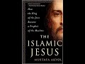

# Mary and her baby: a new series (2021-07-12)

## Description

Islamic Jesus: How the King of the Jews Became a Prophet of the Muslims by Mustafa Akyol https://www.amazon.co.uk/Islamic-Jesus-International-Mustafa-Akyol/dp/1250199352/ref=sr_1_1?keywords=The+Islamic+Jesus%3A+How+the+King+of+the+Jews+Became+a+Prophet+of+the+Muslims&qid=1626106408&sr=8-1

## Summary of [Mary and her baby: a new series](https://www.youtube.com/watch?v=DPApumzcyf8)

*This summary is AI generated - there may be inaccuracies. *

### [00:00:00](https://www.youtube.com/watch?v=DPApumzcyf8&t=0) - [00:10:00](https://www.youtube.com/watch?v=DPApumzcyf8&t=600)

The video discusses the story of Mary and her son, Yahya (John the Baptist), highlighting the parallels and differences between the Quran and the Bible. It also discusses the significance of John the Baptist in both Islamic and Christian theology.

**[00:00:00](https://www.youtube.com/watch?v=DPApumzcyf8&t=0)** The video reviews various sources that portray Mary in a positive light, highlighting the quran's mention of her 34 times and her elevated status in muslim culture. It also touches on the controversial practice of venerating Mary as a perfect example of devotion to God.
* **[00:05:00](https://www.youtube.com/watch?v=DPApumzcyf8&t=300)** In the video, the author presents the story of Mary, including her miraculous birth and her son, Yahya. The author also discusses the parallels and differences between the story in the Quran and the story in the Bible. The author also discusses the significance of John the Baptist, who is mentioned in the Quran as Yahya.
* **[00:10:00](https://www.youtube.com/watch?v=DPApumzcyf8&t=600)** The video discusses the differences between the gospel of Luke and the Quran regarding the story of John the Baptist. The Quran briefly touches on the story of John the Baptist, highlighting only its own key theological message. This book is helpful in looking at more in a more balanced and more sober way.

<h2>Full transcript with timestamps: CLICK TO EXPAND</h2>

[0:00:01](https://youtu.be/DPApumzcyf8?t=1) i thought it'd be interesting to  
[0:00:03](https://youtu.be/DPApumzcyf8?t=3) look at how mary the mother of jesus  
[0:00:06](https://youtu.be/DPApumzcyf8?t=6) is portrayed in the quran the new  
[0:00:09](https://youtu.be/DPApumzcyf8?t=9) testament  
[0:00:10](https://youtu.be/DPApumzcyf8?t=10) and the christian apocrypha look at me  
[0:00:13](https://youtu.be/DPApumzcyf8?t=13) looking at the relationship between them  
[0:00:15](https://youtu.be/DPApumzcyf8?t=15) and as a guide to this i want to refer  
[0:00:18](https://youtu.be/DPApumzcyf8?t=18) to the islamic jesus by  
[0:00:20](https://youtu.be/DPApumzcyf8?t=20) muslim who i once heard lecture at  
[0:00:23](https://youtu.be/DPApumzcyf8?t=23) sowes in london he's written this uh  
[0:00:26](https://youtu.be/DPApumzcyf8?t=26) fascinating book  
[0:00:28](https://youtu.be/DPApumzcyf8?t=28) he's particularly good at drawing on  
[0:00:30](https://youtu.be/DPApumzcyf8?t=30) obscure  
[0:00:31](https://youtu.be/DPApumzcyf8?t=31) historical texts to throw light on  
[0:00:34](https://youtu.be/DPApumzcyf8?t=34) passengers  
[0:00:35](https://youtu.be/DPApumzcyf8?t=35) uh in these different sources but  
[0:00:37](https://youtu.be/DPApumzcyf8?t=37) particularly um the quran he is a muslim  
[0:00:39](https://youtu.be/DPApumzcyf8?t=39) author himself the book's been  
[0:00:41](https://youtu.be/DPApumzcyf8?t=41) recommended by some quite  
[0:00:43](https://youtu.be/DPApumzcyf8?t=43) eminent scholars and he does draw on  
[0:00:47](https://youtu.be/DPApumzcyf8?t=47) some very solid recent scholarship and  
[0:00:49](https://youtu.be/DPApumzcyf8?t=49) he's particularly good in my view  
[0:00:51](https://youtu.be/DPApumzcyf8?t=51) on understanding early jewish  
[0:00:53](https://youtu.be/DPApumzcyf8?t=53) christianity as the  
[0:00:55](https://youtu.be/DPApumzcyf8?t=55) background and context for understanding  
[0:00:58](https://youtu.be/DPApumzcyf8?t=58) the crown  
[0:00:59](https://youtu.be/DPApumzcyf8?t=59) the kran's portrayal of jesus so  
[0:01:02](https://youtu.be/DPApumzcyf8?t=62) i want to do perhaps a series of videos  
[0:01:05](https://youtu.be/DPApumzcyf8?t=65) looking at various aspects of mary's  
[0:01:08](https://youtu.be/DPApumzcyf8?t=68) life  
[0:01:09](https://youtu.be/DPApumzcyf8?t=69) in those different sources and how those  
[0:01:11](https://youtu.be/DPApumzcyf8?t=71) sources interrelate to each other  
[0:01:14](https://youtu.be/DPApumzcyf8?t=74) um the first video i'm just going to be  
[0:01:16](https://youtu.be/DPApumzcyf8?t=76) looking um  
[0:01:18](https://youtu.be/DPApumzcyf8?t=78) at the koran's portrait  
[0:01:21](https://youtu.be/DPApumzcyf8?t=81) of the parents of mary and this chapter  
[0:01:25](https://youtu.be/DPApumzcyf8?t=85) is entitled  
[0:01:26](https://youtu.be/DPApumzcyf8?t=86) mary and her baby and it begins with a  
[0:01:30](https://youtu.be/DPApumzcyf8?t=90) quote from the quran  
[0:01:31](https://youtu.be/DPApumzcyf8?t=91) in english remember the one who guarded  
[0:01:34](https://youtu.be/DPApumzcyf8?t=94) her chastity  
[0:01:36](https://youtu.be/DPApumzcyf8?t=96) we breathed into her our spirit and made  
[0:01:39](https://youtu.be/DPApumzcyf8?t=99) her  
[0:01:40](https://youtu.be/DPApumzcyf8?t=100) and her son a sign for all people  
[0:01:44](https://youtu.be/DPApumzcyf8?t=104) that's the quran 21 31  
[0:01:47](https://youtu.be/DPApumzcyf8?t=107) and the chapter begins in the whole  
[0:01:50](https://youtu.be/DPApumzcyf8?t=110) quran  
[0:01:51](https://youtu.be/DPApumzcyf8?t=111) which has more than 6 000 verses there  
[0:01:54](https://youtu.be/DPApumzcyf8?t=114) is only one  
[0:01:55](https://youtu.be/DPApumzcyf8?t=115) woman mentioned by name there is even a  
[0:01:58](https://youtu.be/DPApumzcyf8?t=118) long chapter named  
[0:02:00](https://youtu.be/DPApumzcyf8?t=120) after her even more there is a longer  
[0:02:03](https://youtu.be/DPApumzcyf8?t=123) chapter named after her family  
[0:02:06](https://youtu.be/DPApumzcyf8?t=126) and yet that woman is not amina the  
[0:02:08](https://youtu.be/DPApumzcyf8?t=128) mother of the prophet muhammad  
[0:02:10](https://youtu.be/DPApumzcyf8?t=130) or khadija his first wife or fatima  
[0:02:14](https://youtu.be/DPApumzcyf8?t=134) his daughter as one could have expected  
[0:02:17](https://youtu.be/DPApumzcyf8?t=137) to see  
[0:02:18](https://youtu.be/DPApumzcyf8?t=138) she is rather mary the mother of jesus  
[0:02:23](https://youtu.be/DPApumzcyf8?t=143) mary is not just named repeatedly in the  
[0:02:26](https://youtu.be/DPApumzcyf8?t=146) muslim scripture  
[0:02:27](https://youtu.be/DPApumzcyf8?t=147) some 34 times compared to this  
[0:02:30](https://youtu.be/DPApumzcyf8?t=150) to 19 times in the new testament this is  
[0:02:33](https://youtu.be/DPApumzcyf8?t=153) very interesting  
[0:02:34](https://youtu.be/DPApumzcyf8?t=154) do christians realize that the quran  
[0:02:36](https://youtu.be/DPApumzcyf8?t=156) mentions mary  
[0:02:38](https://youtu.be/DPApumzcyf8?t=158) far more often than even the bible does  
[0:02:42](https://youtu.be/DPApumzcyf8?t=162) she is also in the quran exceptionally  
[0:02:45](https://youtu.be/DPApumzcyf8?t=165) praised  
[0:02:46](https://youtu.be/DPApumzcyf8?t=166) god has chosen you and purified you  
[0:02:49](https://youtu.be/DPApumzcyf8?t=169) angels  
[0:02:50](https://youtu.be/DPApumzcyf8?t=170) tell mary in the quran he has chosen you  
[0:02:53](https://youtu.be/DPApumzcyf8?t=173) over all other women  
[0:02:56](https://youtu.be/DPApumzcyf8?t=176) consequently mary has become respected  
[0:02:59](https://youtu.be/DPApumzcyf8?t=179) in all muslim cultures as her arabic  
[0:03:02](https://youtu.be/DPApumzcyf8?t=182) name  
[0:03:03](https://youtu.be/DPApumzcyf8?t=183) miriam has been given to countless baby  
[0:03:06](https://youtu.be/DPApumzcyf8?t=186) girls  
[0:03:07](https://youtu.be/DPApumzcyf8?t=187) there are shrines in her name in the  
[0:03:09](https://youtu.be/DPApumzcyf8?t=189) middle east which are visited  
[0:03:11](https://youtu.be/DPApumzcyf8?t=191) by not just christians but also muslims  
[0:03:15](https://youtu.be/DPApumzcyf8?t=195) among the sufis the mystics of islam  
[0:03:18](https://youtu.be/DPApumzcyf8?t=198) mary has enjoyed an even deeper  
[0:03:20](https://youtu.be/DPApumzcyf8?t=200) adoration  
[0:03:22](https://youtu.be/DPApumzcyf8?t=202) as a perfect example of devotion to god  
[0:03:26](https://youtu.be/DPApumzcyf8?t=206) that practice of course is quite  
[0:03:28](https://youtu.be/DPApumzcyf8?t=208) controversial in some questions  
[0:03:30](https://youtu.be/DPApumzcyf8?t=210) in the 20th century a group of sufis  
[0:03:33](https://youtu.be/DPApumzcyf8?t=213) even established an order named  
[0:03:36](https://youtu.be/DPApumzcyf8?t=216) meriyamiya  
[0:03:38](https://youtu.be/DPApumzcyf8?t=218) or the followers of mary whose members  
[0:03:41](https://youtu.be/DPApumzcyf8?t=221) include  
[0:03:42](https://youtu.be/DPApumzcyf8?t=222) some prominent american academics such  
[0:03:44](https://youtu.be/DPApumzcyf8?t=224) as the iranian born  
[0:03:46](https://youtu.be/DPApumzcyf8?t=226) philosopher syed hussein nasser  
[0:03:50](https://youtu.be/DPApumzcyf8?t=230) even mary as she appears in christian  
[0:03:53](https://youtu.be/DPApumzcyf8?t=233) texts  
[0:03:54](https://youtu.be/DPApumzcyf8?t=234) and contexts has received muslim  
[0:03:57](https://youtu.be/DPApumzcyf8?t=237) respect legend has it that when the  
[0:04:00](https://youtu.be/DPApumzcyf8?t=240) prophet muhammad smashed  
[0:04:02](https://youtu.be/DPApumzcyf8?t=242) the hundreds of idols in the kaaba in  
[0:04:05](https://youtu.be/DPApumzcyf8?t=245) the year  
[0:04:05](https://youtu.be/DPApumzcyf8?t=245) 630 toward the end of his life  
[0:04:09](https://youtu.be/DPApumzcyf8?t=249) he spared only the frescoes of jesus and  
[0:04:12](https://youtu.be/DPApumzcyf8?t=252) mary in 1187  
[0:04:16](https://youtu.be/DPApumzcyf8?t=256) when the muslim ruler salah hiding  
[0:04:18](https://youtu.be/DPApumzcyf8?t=258) re-conquered jerusalem  
[0:04:20](https://youtu.be/DPApumzcyf8?t=260) he destroyed the churches built in the  
[0:04:23](https://youtu.be/DPApumzcyf8?t=263) city by  
[0:04:24](https://youtu.be/DPApumzcyf8?t=264) crusaders i.e the invaders  
[0:04:27](https://youtu.be/DPApumzcyf8?t=267) not those built by the eastern  
[0:04:29](https://youtu.be/DPApumzcyf8?t=269) christians  
[0:04:30](https://youtu.be/DPApumzcyf8?t=270) with whom he had no problem these were  
[0:04:32](https://youtu.be/DPApumzcyf8?t=272) the original  
[0:04:33](https://youtu.be/DPApumzcyf8?t=273) christians of the area of course but he  
[0:04:36](https://youtu.be/DPApumzcyf8?t=276) still  
[0:04:36](https://youtu.be/DPApumzcyf8?t=276) spared a crusader relic the church of  
[0:04:40](https://youtu.be/DPApumzcyf8?t=280) saint anne which was believed to be the  
[0:04:43](https://youtu.be/DPApumzcyf8?t=283) childhood home of  
[0:04:44](https://youtu.be/DPApumzcyf8?t=284) mary and then he quotes the preservation  
[0:04:48](https://youtu.be/DPApumzcyf8?t=288) of this church  
[0:04:49](https://youtu.be/DPApumzcyf8?t=289) demonstrates the islamic devotion to  
[0:04:52](https://youtu.be/DPApumzcyf8?t=292) mary  
[0:04:53](https://youtu.be/DPApumzcyf8?t=293) a catholic source appreciatively notes  
[0:04:56](https://youtu.be/DPApumzcyf8?t=296) as the muslims great reverence for our  
[0:04:58](https://youtu.be/DPApumzcyf8?t=298) lady  
[0:04:59](https://youtu.be/DPApumzcyf8?t=299) precluded them from destroying her  
[0:05:02](https://youtu.be/DPApumzcyf8?t=302) birthplace  
[0:05:03](https://youtu.be/DPApumzcyf8?t=303) this is a catholic speaking of highly of  
[0:05:06](https://youtu.be/DPApumzcyf8?t=306) muslims  
[0:05:07](https://youtu.be/DPApumzcyf8?t=307) the quranic story of mary which is  
[0:05:10](https://youtu.be/DPApumzcyf8?t=310) impressively detailed for a scripture  
[0:05:13](https://youtu.be/DPApumzcyf8?t=313) whose main focus is elsewhere and of  
[0:05:15](https://youtu.be/DPApumzcyf8?t=315) course the quran is not about jesus and  
[0:05:17](https://youtu.be/DPApumzcyf8?t=317) mary it's about  
[0:05:18](https://youtu.be/DPApumzcyf8?t=318) other much more transcendent matters the  
[0:05:20](https://youtu.be/DPApumzcyf8?t=320) chronic story of mary is placed in two  
[0:05:23](https://youtu.be/DPApumzcyf8?t=323) separate chapters the chapter mary  
[0:05:26](https://youtu.be/DPApumzcyf8?t=326) which is accepted to be meccan in other  
[0:05:29](https://youtu.be/DPApumzcyf8?t=329) words it's revealed in mecca  
[0:05:31](https://youtu.be/DPApumzcyf8?t=331) and thus relatively earlier and the  
[0:05:34](https://youtu.be/DPApumzcyf8?t=334) chapter  
[0:05:34](https://youtu.be/DPApumzcyf8?t=334) family of imran which is accepted to be  
[0:05:38](https://youtu.be/DPApumzcyf8?t=338) a medinan so it's revealed in medina  
[0:05:40](https://youtu.be/DPApumzcyf8?t=340) perhaps  
[0:05:41](https://youtu.be/DPApumzcyf8?t=341) later on there are parallels between the  
[0:05:44](https://youtu.be/DPApumzcyf8?t=344) mary accounts in these two chapters  
[0:05:47](https://youtu.be/DPApumzcyf8?t=347) but also some differences moreover  
[0:05:50](https://youtu.be/DPApumzcyf8?t=350) there are both parallels and differences  
[0:05:53](https://youtu.be/DPApumzcyf8?t=353) between them  
[0:05:54](https://youtu.be/DPApumzcyf8?t=354) and the new testament and the christian  
[0:05:56](https://youtu.be/DPApumzcyf8?t=356) apocrypha  
[0:05:58](https://youtu.be/DPApumzcyf8?t=358) now the author of this book does go into  
[0:06:00](https://youtu.be/DPApumzcyf8?t=360) some detail of the  
[0:06:01](https://youtu.be/DPApumzcyf8?t=361) alleged sources that the quran uses  
[0:06:05](https://youtu.be/DPApumzcyf8?t=365) about the life of mary and her son  
[0:06:08](https://youtu.be/DPApumzcyf8?t=368) and uh in subsequent videos we'll look  
[0:06:10](https://youtu.be/DPApumzcyf8?t=370) at that in more detail  
[0:06:12](https://youtu.be/DPApumzcyf8?t=372) but i'm not going to anticipate that at  
[0:06:14](https://youtu.be/DPApumzcyf8?t=374) the moment  
[0:06:15](https://youtu.be/DPApumzcyf8?t=375) so he carries on let's begin with the  
[0:06:17](https://youtu.be/DPApumzcyf8?t=377) chapter mary  
[0:06:18](https://youtu.be/DPApumzcyf8?t=378) which begins which presents a storyline  
[0:06:21](https://youtu.be/DPApumzcyf8?t=381) that largely resembles the beginning  
[0:06:23](https://youtu.be/DPApumzcyf8?t=383) of the gospel of luke the plot begins  
[0:06:27](https://youtu.be/DPApumzcyf8?t=387) with  
[0:06:28](https://youtu.be/DPApumzcyf8?t=388) an account of your lord's grace towards  
[0:06:30](https://youtu.be/DPApumzcyf8?t=390) his servant  
[0:06:32](https://youtu.be/DPApumzcyf8?t=392) zechariah we meet him  
[0:06:35](https://youtu.be/DPApumzcyf8?t=395) whose name is zechariah in arabic  
[0:06:37](https://youtu.be/DPApumzcyf8?t=397) without  
[0:06:38](https://youtu.be/DPApumzcyf8?t=398) any introduction without any explanation  
[0:06:42](https://youtu.be/DPApumzcyf8?t=402) but we are still drawn into his story  
[0:06:44](https://youtu.be/DPApumzcyf8?t=404) when we learn about the secret prayer he  
[0:06:46](https://youtu.be/DPApumzcyf8?t=406) gave to god  
[0:06:48](https://youtu.be/DPApumzcyf8?t=408) quote from macron when he called to his  
[0:06:50](https://youtu.be/DPApumzcyf8?t=410) lord secretly  
[0:06:52](https://youtu.be/DPApumzcyf8?t=412) saying lord my bones have weakened and  
[0:06:55](https://youtu.be/DPApumzcyf8?t=415) my hair is  
[0:06:56](https://youtu.be/DPApumzcyf8?t=416) ashen gray but never lord have i  
[0:06:59](https://youtu.be/DPApumzcyf8?t=419) ever prayed to you in vain  
[0:07:02](https://youtu.be/DPApumzcyf8?t=422) i fear what my kinsmen will do when i am  
[0:07:05](https://youtu.be/DPApumzcyf8?t=425) gone  
[0:07:06](https://youtu.be/DPApumzcyf8?t=426) for my wife is barron so grant me a  
[0:07:09](https://youtu.be/DPApumzcyf8?t=429) successor  
[0:07:11](https://youtu.be/DPApumzcyf8?t=431) a gift from you to be my heir  
[0:07:14](https://youtu.be/DPApumzcyf8?t=434) and the heir of the family jacob  
[0:07:17](https://youtu.be/DPApumzcyf8?t=437) lord make me well pleased with you  
[0:07:22](https://youtu.be/DPApumzcyf8?t=442) in return to zechariah's surprise  
[0:07:25](https://youtu.be/DPApumzcyf8?t=445) god answers his prayers and heralds him  
[0:07:29](https://youtu.be/DPApumzcyf8?t=449) a blessed son the crown  
[0:07:32](https://youtu.be/DPApumzcyf8?t=452) says oh zechariah surely  
[0:07:35](https://youtu.be/DPApumzcyf8?t=455) we give you good news of a boy whose  
[0:07:38](https://youtu.be/DPApumzcyf8?t=458) name shall be yahya  
[0:07:40](https://youtu.be/DPApumzcyf8?t=460) that's y-a-h-y-a we have not made him  
[0:07:44](https://youtu.be/DPApumzcyf8?t=464) we have not made before anyone his equal  
[0:07:48](https://youtu.be/DPApumzcyf8?t=468) he said oh my lord when shall i have a  
[0:07:52](https://youtu.be/DPApumzcyf8?t=472) son  
[0:07:52](https://youtu.be/DPApumzcyf8?t=472) and my wife is barren and i myself have  
[0:07:56](https://youtu.be/DPApumzcyf8?t=476) reached indeed the extreme  
[0:07:58](https://youtu.be/DPApumzcyf8?t=478) degree of old age he said  
[0:08:02](https://youtu.be/DPApumzcyf8?t=482) so shall it be your lord says  
[0:08:05](https://youtu.be/DPApumzcyf8?t=485) it is easy for me and indeed i  
[0:08:08](https://youtu.be/DPApumzcyf8?t=488) created you before when you were nothing  
[0:08:12](https://youtu.be/DPApumzcyf8?t=492) end quote the son promised to zechariah  
[0:08:16](https://youtu.be/DPApumzcyf8?t=496) is john the baptist of course  
[0:08:18](https://youtu.be/DPApumzcyf8?t=498) who is named in the quran as yahya the  
[0:08:21](https://youtu.be/DPApumzcyf8?t=501) word  
[0:08:22](https://youtu.be/DPApumzcyf8?t=502) seems to be a derivative of the syriac  
[0:08:24](https://youtu.be/DPApumzcyf8?t=504) name  
[0:08:25](https://youtu.be/DPApumzcyf8?t=505) johanna johanna since zechariah  
[0:08:29](https://youtu.be/DPApumzcyf8?t=509) is still surprised by the news of this  
[0:08:31](https://youtu.be/DPApumzcyf8?t=511) baby boy  
[0:08:32](https://youtu.be/DPApumzcyf8?t=512) he asked god my lord give me  
[0:08:35](https://youtu.be/DPApumzcyf8?t=515) a sign god says your sign shall be  
[0:08:40](https://youtu.be/DPApumzcyf8?t=520) not to speak to people for three nights  
[0:08:42](https://youtu.be/DPApumzcyf8?t=522) despite the fact  
[0:08:44](https://youtu.be/DPApumzcyf8?t=524) that you are perfectly able to  
[0:08:47](https://youtu.be/DPApumzcyf8?t=527) notably the gospel of luke also notes  
[0:08:50](https://youtu.be/DPApumzcyf8?t=530) this detail reporting that zechariah was  
[0:08:53](https://youtu.be/DPApumzcyf8?t=533) told  
[0:08:54](https://youtu.be/DPApumzcyf8?t=534) thou shalt be silent and not able to  
[0:08:57](https://youtu.be/DPApumzcyf8?t=537) speak  
[0:08:58](https://youtu.be/DPApumzcyf8?t=538) but it's the quran which specifies the  
[0:09:01](https://youtu.be/DPApumzcyf8?t=541) period  
[0:09:01](https://youtu.be/DPApumzcyf8?t=541) as for three days  
[0:09:05](https://youtu.be/DPApumzcyf8?t=545) angels also call on zachariah telling  
[0:09:08](https://youtu.be/DPApumzcyf8?t=548) him that his baby boy  
[0:09:09](https://youtu.be/DPApumzcyf8?t=549) will be no ordinary son but will precede  
[0:09:13](https://youtu.be/DPApumzcyf8?t=553) someone even more extraordinary quote  
[0:09:17](https://youtu.be/DPApumzcyf8?t=557) god gives you news of john confirming  
[0:09:20](https://youtu.be/DPApumzcyf8?t=560) a word from god he will be noble  
[0:09:24](https://youtu.be/DPApumzcyf8?t=564) and chaste a prophet one of the  
[0:09:27](https://youtu.be/DPApumzcyf8?t=567) righteous  
[0:09:28](https://youtu.be/DPApumzcyf8?t=568) unquote the noteworthy term here  
[0:09:31](https://youtu.be/DPApumzcyf8?t=571) word from god is used for none other  
[0:09:35](https://youtu.be/DPApumzcyf8?t=575) than jesus  
[0:09:37](https://youtu.be/DPApumzcyf8?t=577) for john the quran also notes the  
[0:09:40](https://youtu.be/DPApumzcyf8?t=580) following  
[0:09:40](https://youtu.be/DPApumzcyf8?t=580) quote we said john hold on to the  
[0:09:44](https://youtu.be/DPApumzcyf8?t=584) scripture  
[0:09:45](https://youtu.be/DPApumzcyf8?t=585) firmly while he was still a boy we  
[0:09:48](https://youtu.be/DPApumzcyf8?t=588) granted him wisdom  
[0:09:50](https://youtu.be/DPApumzcyf8?t=590) tenderness from us and purity  
[0:09:53](https://youtu.be/DPApumzcyf8?t=593) he was devout kind to parents not  
[0:09:56](https://youtu.be/DPApumzcyf8?t=596) domineering or rebellious peace was  
[0:10:00](https://youtu.be/DPApumzcyf8?t=600) on him the day he was born the day he  
[0:10:03](https://youtu.be/DPApumzcyf8?t=603) died and it will be on him  
[0:10:05](https://youtu.be/DPApumzcyf8?t=605) the day he has raised to life again  
[0:10:09](https://youtu.be/DPApumzcyf8?t=609) end quote the scripture here  
[0:10:12](https://youtu.be/DPApumzcyf8?t=612) the emphasis here that john the baptist  
[0:10:15](https://youtu.be/DPApumzcyf8?t=615) held on to the scripture firmly fits  
[0:10:18](https://youtu.be/DPApumzcyf8?t=618) the doctrinal line of both jewish  
[0:10:21](https://youtu.be/DPApumzcyf8?t=621) christianity  
[0:10:22](https://youtu.be/DPApumzcyf8?t=622) and islam that there is a chain of  
[0:10:25](https://youtu.be/DPApumzcyf8?t=625) prophets whose primary mission  
[0:10:27](https://youtu.be/DPApumzcyf8?t=627) is to uphold the revealed word of god  
[0:10:32](https://youtu.be/DPApumzcyf8?t=632) meanwhile the quranic emphasis on john  
[0:10:35](https://youtu.be/DPApumzcyf8?t=635) being  
[0:10:35](https://youtu.be/DPApumzcyf8?t=635) chaste seems to resonate with the note  
[0:10:38](https://youtu.be/DPApumzcyf8?t=638) in the gospel of  
[0:10:39](https://youtu.be/DPApumzcyf8?t=639) luke that john drank no wine  
[0:10:42](https://youtu.be/DPApumzcyf8?t=642) nor strong drink  
[0:10:46](https://youtu.be/DPApumzcyf8?t=646) that is all that we learn from the quran  
[0:10:48](https://youtu.be/DPApumzcyf8?t=648) about john the baptist  
[0:10:50](https://youtu.be/DPApumzcyf8?t=650) actually he is not called the baptist as  
[0:10:52](https://youtu.be/DPApumzcyf8?t=652) the concept of baptism  
[0:10:54](https://youtu.be/DPApumzcyf8?t=654) never occurs in the quran  
[0:10:57](https://youtu.be/DPApumzcyf8?t=657) neither do we learn from the quran about  
[0:10:59](https://youtu.be/DPApumzcyf8?t=659) john's encounter with jesus  
[0:11:01](https://youtu.be/DPApumzcyf8?t=661) or his execution by herod  
[0:11:04](https://youtu.be/DPApumzcyf8?t=664) as is the case with most old testament  
[0:11:07](https://youtu.be/DPApumzcyf8?t=667) figures  
[0:11:08](https://youtu.be/DPApumzcyf8?t=668) such as elijah and job the quran  
[0:11:11](https://youtu.be/DPApumzcyf8?t=671) briefly touches on the story of john the  
[0:11:13](https://youtu.be/DPApumzcyf8?t=673) baptist  
[0:11:14](https://youtu.be/DPApumzcyf8?t=674) and highlights only its own key  
[0:11:17](https://youtu.be/DPApumzcyf8?t=677) theological  
[0:11:18](https://youtu.be/DPApumzcyf8?t=678) message there has been a chain of  
[0:11:21](https://youtu.be/DPApumzcyf8?t=681) prophets  
[0:11:22](https://youtu.be/DPApumzcyf8?t=682) from time immemorial who all proclaimed  
[0:11:26](https://youtu.be/DPApumzcyf8?t=686) the same monotheistic message  
[0:11:30](https://youtu.be/DPApumzcyf8?t=690) now i'm going to end the video here the  
[0:11:33](https://youtu.be/DPApumzcyf8?t=693) next one  
[0:11:34](https://youtu.be/DPApumzcyf8?t=694) will be discussing mary's pre-gospel  
[0:11:38](https://youtu.be/DPApumzcyf8?t=698) so this is now looking at the christian  
[0:11:41](https://youtu.be/DPApumzcyf8?t=701) apocrypha  
[0:11:42](https://youtu.be/DPApumzcyf8?t=702) in some detail the proto-evangelium as  
[0:11:45](https://youtu.be/DPApumzcyf8?t=705) it's known  
[0:11:45](https://youtu.be/DPApumzcyf8?t=705) and that and what light that throws on  
[0:11:48](https://youtu.be/DPApumzcyf8?t=708) the quran  
[0:11:49](https://youtu.be/DPApumzcyf8?t=709) new testament and islam so i hope  
[0:11:52](https://youtu.be/DPApumzcyf8?t=712) i find this particularly interesting um  
[0:11:55](https://youtu.be/DPApumzcyf8?t=715) because it throws so much light on the  
[0:11:56](https://youtu.be/DPApumzcyf8?t=716) three different religions and how  
[0:11:58](https://youtu.be/DPApumzcyf8?t=718) the different scriptures and sources and  
[0:12:00](https://youtu.be/DPApumzcyf8?t=720) texts relate to each other  
[0:12:02](https://youtu.be/DPApumzcyf8?t=722) and uh much polemical um work has been  
[0:12:06](https://youtu.be/DPApumzcyf8?t=726) done against islam because of these  
[0:12:07](https://youtu.be/DPApumzcyf8?t=727) issues  
[0:12:08](https://youtu.be/DPApumzcyf8?t=728) so this book is helpful i think in in  
[0:12:11](https://youtu.be/DPApumzcyf8?t=731) perhaps looking at more  
[0:12:12](https://youtu.be/DPApumzcyf8?t=732) in a more balanced and more sober way  
[0:12:14](https://youtu.be/DPApumzcyf8?t=734) anyway  
[0:12:15](https://youtu.be/DPApumzcyf8?t=735) till next time  

