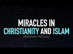

# Miracles in Christianity & Islam with Shaykh Hamza Karamali (2022-03-21)

## Description

Visit Shaykh Hamza Karamali's Basira Education https://www.basiraeducation.org

You Can Support My Work on Patreon:
https://www.patreon.com/Bloggingtheology

My Paypal Link: 
https://www.paypal.com/paypalme/bloggingtheology?locale.x=en_GB

Chapters:
0:00 - Introduction
0:17 - Background of the Guest
0:52 - Topics of discussion
1:33 - Signs (Miracles) in the Gospel of John
3:07 - Signs (Miracles) in the Qur'an
5:29 - Science denying Miracles
6:11 - Change in views of Christians about the miracles after the Enlightenment period
7:22 - Christians vs Muslims with regards to Miracles
10:53 - Jesus as a Prophet in the New Testament
13:03 - Similarity between Jesus & Adam
13:57 - Islamic view of the Bible
14:50 - Christianity vs Islam with regards to the purpose of miracles, messengers & God's existence
24:58 - Miracles of Jesus PBUH in the New Testament having parallels in the Old Testament
26:02 - Science vs Religion
33:49 - Analysing the miracle of Jesus PBUH curing a Blind Man 
37:20 - The Miracles of Muhammad ﷺ
38:08 - The failed healing of a False Prophet
39:02 - Reading the Bible as a Muslim
39:47 - Muslims revering Jesus PBUH
40:08 - The course of "Why Islam is true?"
41:37 - Future discussion on David Hume's Problem of Miracles
42:53 - Wrapping Up

## Summary of [Miracles in Christianity & Islam with Shaykh Hamza Karamali](https://www.youtube.com/watch?v=s5V5huEfy4A)

*This summary is AI generated - there may be inaccuracies. *

### [00:00:00](https://www.youtube.com/watch?v=s5V5huEfy4A&t=0) - [00:40:00](https://www.youtube.com/watch?v=s5V5huEfy4A&t=2400)

Shaykh Hamza Karamali discusses the similarities and differences between Christianity and Islam when it comes to miraculous events. He points out that miracles are not just limited to Christianity, but are also common in the life of Prophet Muhammad.

**[00:00:00](https://www.youtube.com/watch?v=s5V5huEfy4A&t=0)** Hamza Karamali discusses miracles in Christianity and Islam, focusing on the signs that Jesus performed. The Quran also mentions miracles Jesus performed, including turning water into wine and walking on water.
* **[00:05:00](https://www.youtube.com/watch?v=s5V5huEfy4A&t=300)** In Christianity and Islam, miracles are seen as signs that God is confirming that someone is receiving inspiration from him. In the old testament, miracles are seen as proofs that God is speaking to people.
* **[00:10:00](https://www.youtube.com/watch?v=s5V5huEfy4A&t=600)** Shaykh Hamza Karamali discusses the differences between Christianity and Islam with regards to the role of miracles and their evidential value. He argues that, while both religions believe in miracles, Christianity places more emphasis on their divine origin, while Islam views them as signs from God.
* **[00:15:00](https://www.youtube.com/watch?v=s5V5huEfy4A&t=900)** The video discusses the philosophical differences between Christianity and Islam, pointing out that for Christianity, Jesus is a contingent being who is dependent on God, while for Islam, Mary is a divine being who is the mother of Jesus. The clip concludes by discussing how, due to this philosophical difference, miracles are possible in both religions.
* **[00:20:00](https://www.youtube.com/watch?v=s5V5huEfy4A&t=1200)** Shaykh Hamza Karamali discusses how from a Christian perspective, a miracle is an interruption of a necessary relationship. This understanding is also found in Islam, where a miracle is a pattern break. From a scriptural perspective, the trinity introduces a complication to understanding scripture, as it allows for human characteristics to be seen as aspects of God.
* **[00:25:00](https://www.youtube.com/watch?v=s5V5huEfy4A&t=1500)** Shaykh Hamza Karamali discusses how the miracles attributed to Jesus in the Christian Gospels are found in similar form in the Old Testament prophets. He argues that this is not evidence of Jesus being God, but rather someone who is working on behalf of God. He also points to issues like evolutionary science and the beginning of the universe that scientists cannot explain as reasons why the debate between atheism and religion is so important.
* **[00:30:00](https://www.youtube.com/watch?v=s5V5huEfy4A&t=1800)** Shaykh Hamza Karamali discusses the similarities between Christianity and Islam in terms of the miracles they believe in and how these miracles are evidence of the existence of God. He also discusses how Islam bypasses any objections that could be made to miracles based on science not being able to explain them yet.
* **[00:35:00](https://www.youtube.com/watch?v=s5V5huEfy4A&t=2100)** Shaykh Hamza Karamali discusses the similarities and differences between Christianity and Islam when it comes to miraculous events. He points out that miracles are not just limited to Christianity, but are also common in the life of Prophet Muhammad.
* **[00:40:00](https://www.youtube.com/watch?v=s5V5huEfy4A&t=2400)** Shaykh Hamza Karamali discusses miracles in Christianity and Islam, highlighting the importance of understanding the Islamic perspective. He suggests that westerners may benefit from hearing about the thoughts of historical figures such as David Hume, who rejected the miraculous.

<h2>Full transcript with timestamps: CLICK TO EXPAND</h2>

[0:00:04](https://youtu.be/s5V5huEfy4A?t=4) hello everyone and welcome to blogging  
[0:00:06](https://youtu.be/s5V5huEfy4A?t=6) theology today i'm delighted to talk  
[0:00:08](https://youtu.be/s5V5huEfy4A?t=8) again to shake hamza karamali you are  
[0:00:11](https://youtu.be/s5V5huEfy4A?t=11) most welcome sir  
[0:00:13](https://youtu.be/s5V5huEfy4A?t=13) thank you so much for having me again  
[0:00:14](https://youtu.be/s5V5huEfy4A?t=14) paul you're most welcome now for those  
[0:00:17](https://youtu.be/s5V5huEfy4A?t=17) who don't know hamza is the founder of  
[0:00:19](https://youtu.be/s5V5huEfy4A?t=19) basira education where he trains parents  
[0:00:22](https://youtu.be/s5V5huEfy4A?t=22) teachers scholars in high schools  
[0:00:24](https://youtu.be/s5V5huEfy4A?t=24) weekend religious schools and a variety  
[0:00:26](https://youtu.be/s5V5huEfy4A?t=26) of other educational institutions how to  
[0:00:29](https://youtu.be/s5V5huEfy4A?t=29) show their students why islam is true  
[0:00:33](https://youtu.be/s5V5huEfy4A?t=33) he's developed a textbook an online  
[0:00:35](https://youtu.be/s5V5huEfy4A?t=35) teacher's portal and is on a mission to  
[0:00:38](https://youtu.be/s5V5huEfy4A?t=38) train ten thousand teachers  
[0:00:41](https://youtu.be/s5V5huEfy4A?t=41) you can follow him on his social media  
[0:00:43](https://youtu.be/s5V5huEfy4A?t=43) platforms to learn about the details of  
[0:00:45](https://youtu.be/s5V5huEfy4A?t=45) this project which will be will be  
[0:00:47](https://youtu.be/s5V5huEfy4A?t=47) released very soon in the month of  
[0:00:50](https://youtu.be/s5V5huEfy4A?t=50) ramadan  
[0:00:52](https://youtu.be/s5V5huEfy4A?t=52) today hamza will be speaking about  
[0:00:54](https://youtu.be/s5V5huEfy4A?t=54) miracles in christianity and islam which  
[0:00:58](https://youtu.be/s5V5huEfy4A?t=58) lies at the core of his work on religion  
[0:01:01](https://youtu.be/s5V5huEfy4A?t=61) and science from an islamic perspective  
[0:01:04](https://youtu.be/s5V5huEfy4A?t=64) and i think maybe a good starting point  
[0:01:06](https://youtu.be/s5V5huEfy4A?t=66) for our discussion today would be jesus  
[0:01:10](https://youtu.be/s5V5huEfy4A?t=70) because he's really the common figure in  
[0:01:12](https://youtu.be/s5V5huEfy4A?t=72) christianity and islam and in religions  
[0:01:15](https://youtu.be/s5V5huEfy4A?t=75) science debates in the western tradition  
[0:01:18](https://youtu.be/s5V5huEfy4A?t=78) which go all the way back we should go  
[0:01:20](https://youtu.be/s5V5huEfy4A?t=80) back to the history of the christian  
[0:01:22](https://youtu.be/s5V5huEfy4A?t=82) church  
[0:01:23](https://youtu.be/s5V5huEfy4A?t=83) so perhaps hamza you can just introduce  
[0:01:26](https://youtu.be/s5V5huEfy4A?t=86) us to this subject  
[0:01:28](https://youtu.be/s5V5huEfy4A?t=88) thank you for your introduction paul um  
[0:01:31](https://youtu.be/s5V5huEfy4A?t=91) so  
[0:01:32](https://youtu.be/s5V5huEfy4A?t=92) yeah so i did some before i came i  
[0:01:34](https://youtu.be/s5V5huEfy4A?t=94) reviewed  
[0:01:36](https://youtu.be/s5V5huEfy4A?t=96) the gospel of john  
[0:01:38](https://youtu.be/s5V5huEfy4A?t=98) which i thought would be appropriate  
[0:01:39](https://youtu.be/s5V5huEfy4A?t=99) starting point it's the most uh  
[0:01:42](https://youtu.be/s5V5huEfy4A?t=102) i guess allegedly trinitarian of all the  
[0:01:44](https://youtu.be/s5V5huEfy4A?t=104) gospels and so i went through the signs  
[0:01:46](https://youtu.be/s5V5huEfy4A?t=106) that are mentioned there and the word  
[0:01:48](https://youtu.be/s5V5huEfy4A?t=108) signs is important because  
[0:01:50](https://youtu.be/s5V5huEfy4A?t=110) miracles in both christianity and islam  
[0:01:53](https://youtu.be/s5V5huEfy4A?t=113) are described as being signs there's a  
[0:01:56](https://youtu.be/s5V5huEfy4A?t=116) difference on on what exactly they're  
[0:01:58](https://youtu.be/s5V5huEfy4A?t=118) signs of but they're both signs quran 2  
[0:02:01](https://youtu.be/s5V5huEfy4A?t=121) allah describes them as signs  
[0:02:04](https://youtu.be/s5V5huEfy4A?t=124) particularly in reference to jesus so in  
[0:02:06](https://youtu.be/s5V5huEfy4A?t=126) uh so we'll take just i went through the  
[0:02:08](https://youtu.be/s5V5huEfy4A?t=128) the signs and the gospel of john so he  
[0:02:11](https://youtu.be/s5V5huEfy4A?t=131) starts off the first sign in in the in  
[0:02:13](https://youtu.be/s5V5huEfy4A?t=133) the gospel is that he turned wine into  
[0:02:15](https://youtu.be/s5V5huEfy4A?t=135) water and jars of wine into water that's  
[0:02:17](https://youtu.be/s5V5huEfy4A?t=137) one of the miracles that he did that was  
[0:02:19](https://youtu.be/s5V5huEfy4A?t=139) a sign absolutely it was water into wine  
[0:02:22](https://youtu.be/s5V5huEfy4A?t=142) i think it was the other way around  
[0:02:23](https://youtu.be/s5V5huEfy4A?t=143) wasn't it yeah  
[0:02:26](https://youtu.be/s5V5huEfy4A?t=146) yeah  
[0:02:28](https://youtu.be/s5V5huEfy4A?t=148) yeah my islamic bias  
[0:02:29](https://youtu.be/s5V5huEfy4A?t=149) [Laughter]  
[0:02:32](https://youtu.be/s5V5huEfy4A?t=152) so um  
[0:02:34](https://youtu.be/s5V5huEfy4A?t=154) um so he um healed the son of a royal  
[0:02:38](https://youtu.be/s5V5huEfy4A?t=158) official he healed a paralytic who'd  
[0:02:40](https://youtu.be/s5V5huEfy4A?t=160) been um  
[0:02:42](https://youtu.be/s5V5huEfy4A?t=162) paralyzed for 38 years he multiplied  
[0:02:45](https://youtu.be/s5V5huEfy4A?t=165) food miraculously fed 5 000 people he  
[0:02:48](https://youtu.be/s5V5huEfy4A?t=168) walked on water  
[0:02:50](https://youtu.be/s5V5huEfy4A?t=170) he healed somebody who was blind from  
[0:02:51](https://youtu.be/s5V5huEfy4A?t=171) birth  
[0:02:53](https://youtu.be/s5V5huEfy4A?t=173) and  
[0:02:54](https://youtu.be/s5V5huEfy4A?t=174) there's the resurrection  
[0:02:55](https://youtu.be/s5V5huEfy4A?t=175) of lazarus and  
[0:02:57](https://youtu.be/s5V5huEfy4A?t=177) there's his own resurrection from the  
[0:02:59](https://youtu.be/s5V5huEfy4A?t=179) dead as well which he hinted at earlier  
[0:03:02](https://youtu.be/s5V5huEfy4A?t=182) so these are some of the miraculous  
[0:03:04](https://youtu.be/s5V5huEfy4A?t=184) signs in the gospel of john um  
[0:03:07](https://youtu.be/s5V5huEfy4A?t=187) in the quran there's two ver two verses  
[0:03:11](https://youtu.be/s5V5huEfy4A?t=191) um that  
[0:03:12](https://youtu.be/s5V5huEfy4A?t=192) where he talks about his signs and it's  
[0:03:14](https://youtu.be/s5V5huEfy4A?t=194) interesting the word is also sign so  
[0:03:16](https://youtu.be/s5V5huEfy4A?t=196) allah ta'ala in  
[0:03:18](https://youtu.be/s5V5huEfy4A?t=198) in the surat al-imran chapter 3  
[0:03:21](https://youtu.be/s5V5huEfy4A?t=201) verse 49 he says that jesus the allah he  
[0:03:25](https://youtu.be/s5V5huEfy4A?t=205) sent jesus as a rasul as a messenger to  
[0:03:29](https://youtu.be/s5V5huEfy4A?t=209) the israelites  
[0:03:30](https://youtu.be/s5V5huEfy4A?t=210) and that um  
[0:03:33](https://youtu.be/s5V5huEfy4A?t=213) and and he said to them that i've come  
[0:03:35](https://youtu.be/s5V5huEfy4A?t=215) to you with the ayat india  
[0:03:38](https://youtu.be/s5V5huEfy4A?t=218) with a sign from your lord and then he  
[0:03:40](https://youtu.be/s5V5huEfy4A?t=220) mentions a number of signs the first  
[0:03:42](https://youtu.be/s5V5huEfy4A?t=222) sign he talks about the famous sign of  
[0:03:44](https://youtu.be/s5V5huEfy4A?t=224) the clay bird that he fashioned and he  
[0:03:47](https://youtu.be/s5V5huEfy4A?t=227) breathed life into it's not found in the  
[0:03:49](https://youtu.be/s5V5huEfy4A?t=229) canonical gospels but there's other  
[0:03:51](https://youtu.be/s5V5huEfy4A?t=231) infancy gospels which which mentioned  
[0:03:52](https://youtu.be/s5V5huEfy4A?t=232) that um he talked about it mentioned  
[0:03:55](https://youtu.be/s5V5huEfy4A?t=235) that i  
[0:03:56](https://youtu.be/s5V5huEfy4A?t=236) um i um so there's one thing that's  
[0:03:59](https://youtu.be/s5V5huEfy4A?t=239) relevant here which he says the quran so  
[0:04:01](https://youtu.be/s5V5huEfy4A?t=241) the quran it is conscious of the way  
[0:04:04](https://youtu.be/s5V5huEfy4A?t=244) that these  
[0:04:05](https://youtu.be/s5V5huEfy4A?t=245) signs and other  
[0:04:08](https://youtu.be/s5V5huEfy4A?t=248) events from the life of jesus are  
[0:04:09](https://youtu.be/s5V5huEfy4A?t=249) described in the judeo-christian milia  
[0:04:12](https://youtu.be/s5V5huEfy4A?t=252) that was  
[0:04:13](https://youtu.be/s5V5huEfy4A?t=253) that was there in in in which the the  
[0:04:17](https://youtu.be/s5V5huEfy4A?t=257) prophet muhammad sallallahu alaihi spoke  
[0:04:19](https://youtu.be/s5V5huEfy4A?t=259) and so there's there's a  
[0:04:20](https://youtu.be/s5V5huEfy4A?t=260) there's a reference repeatedly to the  
[0:04:23](https://youtu.be/s5V5huEfy4A?t=263) fact that these signs they all happen  
[0:04:24](https://youtu.be/s5V5huEfy4A?t=264) with the permission of allah with the  
[0:04:27](https://youtu.be/s5V5huEfy4A?t=267) permission of god he says that i  
[0:04:30](https://youtu.be/s5V5huEfy4A?t=270) cure  
[0:04:31](https://youtu.be/s5V5huEfy4A?t=271) the  
[0:04:32](https://youtu.be/s5V5huEfy4A?t=272) somebody who's  
[0:04:34](https://youtu.be/s5V5huEfy4A?t=274) blind born blind just like in in the  
[0:04:36](https://youtu.be/s5V5huEfy4A?t=276) gospel like i cure those who are born  
[0:04:39](https://youtu.be/s5V5huEfy4A?t=279) blind  
[0:04:40](https://youtu.be/s5V5huEfy4A?t=280) and uh the lepers which is not in the  
[0:04:43](https://youtu.be/s5V5huEfy4A?t=283) gospel of john but in  
[0:04:44](https://youtu.be/s5V5huEfy4A?t=284) other other some of the other gospels i  
[0:04:46](https://youtu.be/s5V5huEfy4A?t=286) cure the lepers and i bring the dead  
[0:04:49](https://youtu.be/s5V5huEfy4A?t=289) back to life the islam with the  
[0:04:52](https://youtu.be/s5V5huEfy4A?t=292) permission of god  
[0:04:53](https://youtu.be/s5V5huEfy4A?t=293) and then there's this other miracle  
[0:04:55](https://youtu.be/s5V5huEfy4A?t=295) which he talks about he says that i tell  
[0:04:58](https://youtu.be/s5V5huEfy4A?t=298) you what you eat and what you store up  
[0:05:01](https://youtu.be/s5V5huEfy4A?t=301) in your houses i don't think this is in  
[0:05:02](https://youtu.be/s5V5huEfy4A?t=302) the canonical gospels i haven't really  
[0:05:04](https://youtu.be/s5V5huEfy4A?t=304) seen um  
[0:05:05](https://youtu.be/s5V5huEfy4A?t=305) where uh where that would be  
[0:05:08](https://youtu.be/s5V5huEfy4A?t=308) but it was recognized by the jews and  
[0:05:10](https://youtu.be/s5V5huEfy4A?t=310) the christians to whom um the quran was  
[0:05:12](https://youtu.be/s5V5huEfy4A?t=312) speaking  
[0:05:13](https://youtu.be/s5V5huEfy4A?t=313) um so it was there and uh and so these  
[0:05:17](https://youtu.be/s5V5huEfy4A?t=317) are two  
[0:05:18](https://youtu.be/s5V5huEfy4A?t=318) uh you know similar miracles both  
[0:05:20](https://youtu.be/s5V5huEfy4A?t=320) described as signs  
[0:05:22](https://youtu.be/s5V5huEfy4A?t=322) and they are um so that's that's how  
[0:05:25](https://youtu.be/s5V5huEfy4A?t=325) that's how um the signs of jesus  
[0:05:28](https://youtu.be/s5V5huEfy4A?t=328) are described now with science with the  
[0:05:30](https://youtu.be/s5V5huEfy4A?t=330) rise of modern science um the  
[0:05:33](https://youtu.be/s5V5huEfy4A?t=333) uh miracles came to be  
[0:05:36](https://youtu.be/s5V5huEfy4A?t=336) seen as  
[0:05:38](https://youtu.be/s5V5huEfy4A?t=338) unacceptable  
[0:05:40](https://youtu.be/s5V5huEfy4A?t=340) violations of the laws of nature  
[0:05:42](https://youtu.be/s5V5huEfy4A?t=342) and  
[0:05:43](https://youtu.be/s5V5huEfy4A?t=343) based on a worldview where people would  
[0:05:47](https://youtu.be/s5V5huEfy4A?t=347) explain  
[0:05:48](https://youtu.be/s5V5huEfy4A?t=348) things in the universe the events in the  
[0:05:51](https://youtu.be/s5V5huEfy4A?t=351) universe as acts of god  
[0:05:54](https://youtu.be/s5V5huEfy4A?t=354) with  
[0:05:55](https://youtu.be/s5V5huEfy4A?t=355) through supernatural explanations rather  
[0:05:57](https://youtu.be/s5V5huEfy4A?t=357) than through natural explanations so i  
[0:05:59](https://youtu.be/s5V5huEfy4A?t=359) guess both of these narratives would be  
[0:06:03](https://youtu.be/s5V5huEfy4A?t=363) they came to be problematized so that's  
[0:06:05](https://youtu.be/s5V5huEfy4A?t=365) the  
[0:06:06](https://youtu.be/s5V5huEfy4A?t=366) i think that's a good starting point for  
[0:06:08](https://youtu.be/s5V5huEfy4A?t=368) our discussion and and of course um  
[0:06:11](https://youtu.be/s5V5huEfy4A?t=371) after the enlightenment in in europe uh  
[0:06:14](https://youtu.be/s5V5huEfy4A?t=374) which affected christians as much as  
[0:06:15](https://youtu.be/s5V5huEfy4A?t=375) anyone else uh but many became much more  
[0:06:18](https://youtu.be/s5V5huEfy4A?t=378) liberal uh get liberal christians  
[0:06:20](https://youtu.be/s5V5huEfy4A?t=380) liberal christianity and theologians  
[0:06:22](https://youtu.be/s5V5huEfy4A?t=382) started to see these uh miraculous uh  
[0:06:24](https://youtu.be/s5V5huEfy4A?t=384) stories in the gospels as more  
[0:06:26](https://youtu.be/s5V5huEfy4A?t=386) metaphorical perhaps or more symbolic or  
[0:06:29](https://youtu.be/s5V5huEfy4A?t=389) just simply unhistorical and just  
[0:06:31](https://youtu.be/s5V5huEfy4A?t=391) dismissed as mere superstition but the  
[0:06:33](https://youtu.be/s5V5huEfy4A?t=393) more sophisticated ones saw them as  
[0:06:35](https://youtu.be/s5V5huEfy4A?t=395) metaphors for for god's generosity or  
[0:06:38](https://youtu.be/s5V5huEfy4A?t=398) inclusivity and and so on so there's  
[0:06:40](https://youtu.be/s5V5huEfy4A?t=400) been a um  
[0:06:42](https://youtu.be/s5V5huEfy4A?t=402) a complicated reaction from christians  
[0:06:43](https://youtu.be/s5V5huEfy4A?t=403) some have maintained that these stories  
[0:06:45](https://youtu.be/s5V5huEfy4A?t=405) are literally historical happened as is  
[0:06:48](https://youtu.be/s5V5huEfy4A?t=408) in the gospels others um  
[0:06:51](https://youtu.be/s5V5huEfy4A?t=411) have seen them as not historical as more  
[0:06:53](https://youtu.be/s5V5huEfy4A?t=413) symbolic or metaphorical as i say so  
[0:06:56](https://youtu.be/s5V5huEfy4A?t=416) it's been a complex reaction to the rise  
[0:06:58](https://youtu.be/s5V5huEfy4A?t=418) of rationalism  
[0:06:59](https://youtu.be/s5V5huEfy4A?t=419) and secularism  
[0:07:01](https://youtu.be/s5V5huEfy4A?t=421) from the enlightenment um right and  
[0:07:04](https://youtu.be/s5V5huEfy4A?t=424) that's still the case today in in the  
[0:07:05](https://youtu.be/s5V5huEfy4A?t=425) churches uh that there's  
[0:07:07](https://youtu.be/s5V5huEfy4A?t=427) differences of opinion amongst  
[0:07:09](https://youtu.be/s5V5huEfy4A?t=429) christians um at the highest levels even  
[0:07:12](https://youtu.be/s5V5huEfy4A?t=432) and so the resurrection of jesus some  
[0:07:14](https://youtu.be/s5V5huEfy4A?t=434) will see that as a as a figure of speech  
[0:07:16](https://youtu.be/s5V5huEfy4A?t=436) or metaphor rather than a bodily  
[0:07:17](https://youtu.be/s5V5huEfy4A?t=437) resurrection for example  
[0:07:19](https://youtu.be/s5V5huEfy4A?t=439) um  
[0:07:20](https://youtu.be/s5V5huEfy4A?t=440) so yeah anyway that's the digression but  
[0:07:22](https://youtu.be/s5V5huEfy4A?t=442) so christianity and islam agree that  
[0:07:24](https://youtu.be/s5V5huEfy4A?t=444) jesus uh did miracles those that agreed  
[0:07:26](https://youtu.be/s5V5huEfy4A?t=446) that they did he did actually do them  
[0:07:28](https://youtu.be/s5V5huEfy4A?t=448) and this seems to place both of them at  
[0:07:31](https://youtu.be/s5V5huEfy4A?t=451) odds with modern science how would you  
[0:07:34](https://youtu.be/s5V5huEfy4A?t=454) characterize the differences between the  
[0:07:36](https://youtu.be/s5V5huEfy4A?t=456) two religions  
[0:07:38](https://youtu.be/s5V5huEfy4A?t=458) so um  
[0:07:39](https://youtu.be/s5V5huEfy4A?t=459) yeah so  
[0:07:40](https://youtu.be/s5V5huEfy4A?t=460) i i i think that  
[0:07:42](https://youtu.be/s5V5huEfy4A?t=462) um so in in many ways the effect of the  
[0:07:46](https://youtu.be/s5V5huEfy4A?t=466) there were similar effects um not  
[0:07:48](https://youtu.be/s5V5huEfy4A?t=468) completely like the christians not to  
[0:07:50](https://youtu.be/s5V5huEfy4A?t=470) the same degree but there were some  
[0:07:52](https://youtu.be/s5V5huEfy4A?t=472) effects similar effects amongst the  
[0:07:54](https://youtu.be/s5V5huEfy4A?t=474) muslims too there was a a movement  
[0:07:56](https://youtu.be/s5V5huEfy4A?t=476) during a period of colonialism about the  
[0:07:58](https://youtu.be/s5V5huEfy4A?t=478) reinterpretation of miracles um you know  
[0:08:01](https://youtu.be/s5V5huEfy4A?t=481) because they were seen as unscientific  
[0:08:03](https://youtu.be/s5V5huEfy4A?t=483) and the prophet salallahu was presented  
[0:08:05](https://youtu.be/s5V5huEfy4A?t=485) as somebody of uh as a genius moral  
[0:08:07](https://youtu.be/s5V5huEfy4A?t=487) character and his miracles were  
[0:08:10](https://youtu.be/s5V5huEfy4A?t=490) de-emphasized  
[0:08:12](https://youtu.be/s5V5huEfy4A?t=492) but i think i don't think it went to the  
[0:08:14](https://youtu.be/s5V5huEfy4A?t=494) same degree that that you that you  
[0:08:17](https://youtu.be/s5V5huEfy4A?t=497) described and i think that  
[0:08:18](https://youtu.be/s5V5huEfy4A?t=498) one of the reasons for that is that  
[0:08:20](https://youtu.be/s5V5huEfy4A?t=500) christians they started off  
[0:08:23](https://youtu.be/s5V5huEfy4A?t=503) they started off  
[0:08:25](https://youtu.be/s5V5huEfy4A?t=505) they didn't start off where the muslims  
[0:08:27](https://youtu.be/s5V5huEfy4A?t=507) started off so  
[0:08:28](https://youtu.be/s5V5huEfy4A?t=508) in christianity uh  
[0:08:30](https://youtu.be/s5V5huEfy4A?t=510) the there's a common in historically in  
[0:08:33](https://youtu.be/s5V5huEfy4A?t=513) the western tradition miracles have been  
[0:08:36](https://youtu.be/s5V5huEfy4A?t=516) seen as proof of  
[0:08:38](https://youtu.be/s5V5huEfy4A?t=518) divinity so the resurrection is proof  
[0:08:41](https://youtu.be/s5V5huEfy4A?t=521) that jesus is god the other miracles  
[0:08:43](https://youtu.be/s5V5huEfy4A?t=523) that he did were proof that jesus is god  
[0:08:46](https://youtu.be/s5V5huEfy4A?t=526) because he was now there's there's some  
[0:08:48](https://youtu.be/s5V5huEfy4A?t=528) uh  
[0:08:49](https://youtu.be/s5V5huEfy4A?t=529) you know inconsistency in this account  
[0:08:52](https://youtu.be/s5V5huEfy4A?t=532) within the within the gospels they might  
[0:08:54](https://youtu.be/s5V5huEfy4A?t=534) not fit with this but that's  
[0:08:56](https://youtu.be/s5V5huEfy4A?t=536) um i think generally characteristic of  
[0:08:58](https://youtu.be/s5V5huEfy4A?t=538) christianity that the positions that  
[0:09:00](https://youtu.be/s5V5huEfy4A?t=540) they hold doctrinally don't always  
[0:09:03](https://youtu.be/s5V5huEfy4A?t=543) accord with what's found in um  
[0:09:06](https://youtu.be/s5V5huEfy4A?t=546) in in scripture  
[0:09:08](https://youtu.be/s5V5huEfy4A?t=548) um and i want to i want to i i'll come  
[0:09:11](https://youtu.be/s5V5huEfy4A?t=551) back for a second but but it's it's  
[0:09:14](https://youtu.be/s5V5huEfy4A?t=554) commonly held that the fact that jesus  
[0:09:17](https://youtu.be/s5V5huEfy4A?t=557) did miracles is evidence that he has got  
[0:09:19](https://youtu.be/s5V5huEfy4A?t=559) it that he's god because  
[0:09:21](https://youtu.be/s5V5huEfy4A?t=561) only god has the power to overcome the  
[0:09:24](https://youtu.be/s5V5huEfy4A?t=564) laws of nature  
[0:09:25](https://youtu.be/s5V5huEfy4A?t=565) so so that's that's uh that's how  
[0:09:29](https://youtu.be/s5V5huEfy4A?t=569) miracles um one way in which miracles  
[0:09:32](https://youtu.be/s5V5huEfy4A?t=572) have been viewed for in for muslims  
[0:09:35](https://youtu.be/s5V5huEfy4A?t=575) miracles  
[0:09:36](https://youtu.be/s5V5huEfy4A?t=576) are all acts of god they're signs that  
[0:09:39](https://youtu.be/s5V5huEfy4A?t=579) give that are given to human beings  
[0:09:42](https://youtu.be/s5V5huEfy4A?t=582) um as evidence that they are really  
[0:09:44](https://youtu.be/s5V5huEfy4A?t=584) speaking on behalf of god that god god  
[0:09:48](https://youtu.be/s5V5huEfy4A?t=588) is verifying that they are  
[0:09:50](https://youtu.be/s5V5huEfy4A?t=590) uh receiving inspiration from him that  
[0:09:52](https://youtu.be/s5V5huEfy4A?t=592) they're not imposters this found in the  
[0:09:54](https://youtu.be/s5V5huEfy4A?t=594) old testament as well i think it's found  
[0:09:56](https://youtu.be/s5V5huEfy4A?t=596) in the gospels too um many of the  
[0:09:58](https://youtu.be/s5V5huEfy4A?t=598) gospels this uh this sentiment is found  
[0:10:00](https://youtu.be/s5V5huEfy4A?t=600) i was just  
[0:10:01](https://youtu.be/s5V5huEfy4A?t=601) going through the gospel of john and  
[0:10:03](https://youtu.be/s5V5huEfy4A?t=603) it said that after one of the signs that  
[0:10:06](https://youtu.be/s5V5huEfy4A?t=606) jesus performed they the israelites they  
[0:10:08](https://youtu.be/s5V5huEfy4A?t=608) said that this is indeed the prophet of  
[0:10:10](https://youtu.be/s5V5huEfy4A?t=610) god  
[0:10:11](https://youtu.be/s5V5huEfy4A?t=611) um who has come into the world right um  
[0:10:15](https://youtu.be/s5V5huEfy4A?t=615) so uh  
[0:10:16](https://youtu.be/s5V5huEfy4A?t=616) so i think that the the starting point  
[0:10:19](https://youtu.be/s5V5huEfy4A?t=619) for  
[0:10:20](https://youtu.be/s5V5huEfy4A?t=620) christianity is not the pure  
[0:10:24](https://youtu.be/s5V5huEfy4A?t=624) the hate of islam so this so for the  
[0:10:27](https://youtu.be/s5V5huEfy4A?t=627) muslims  
[0:10:28](https://youtu.be/s5V5huEfy4A?t=628) everything in the universe  
[0:10:30](https://youtu.be/s5V5huEfy4A?t=630) is an act of god um  
[0:10:33](https://youtu.be/s5V5huEfy4A?t=633) but uh but i think that at the trinity  
[0:10:35](https://youtu.be/s5V5huEfy4A?t=635) it kind of um  
[0:10:37](https://youtu.be/s5V5huEfy4A?t=637) it mars the ability of us to view the  
[0:10:41](https://youtu.be/s5V5huEfy4A?t=641) world as a as being completely an act of  
[0:10:44](https://youtu.be/s5V5huEfy4A?t=644) god because it raises something that is  
[0:10:46](https://youtu.be/s5V5huEfy4A?t=646) created to the level of the divine and  
[0:10:48](https://youtu.be/s5V5huEfy4A?t=648) in doing that it brings  
[0:10:50](https://youtu.be/s5V5huEfy4A?t=650) brings the divine down hmm  
[0:10:54](https://youtu.be/s5V5huEfy4A?t=654) and essentially even in the new  
[0:10:55](https://youtu.be/s5V5huEfy4A?t=655) testament as we have it now there are  
[0:10:57](https://youtu.be/s5V5huEfy4A?t=657) passages which  
[0:10:58](https://youtu.be/s5V5huEfy4A?t=658) uh jah which don't agree perhaps with  
[0:11:01](https://youtu.be/s5V5huEfy4A?t=661) the uh the traditional christian view of  
[0:11:04](https://youtu.be/s5V5huEfy4A?t=664) jesus being divine because he does  
[0:11:07](https://youtu.be/s5V5huEfy4A?t=667) miracles and uh a very striking passage  
[0:11:10](https://youtu.be/s5V5huEfy4A?t=670) in that regard is found in the acts of  
[0:11:11](https://youtu.be/s5V5huEfy4A?t=671) the apostles where peter this is the  
[0:11:15](https://youtu.be/s5V5huEfy4A?t=675) luke's uh history of the early church  
[0:11:17](https://youtu.be/s5V5huEfy4A?t=677) and there's a very interesting statement  
[0:11:20](https://youtu.be/s5V5huEfy4A?t=680) attributed to the apostle peter the  
[0:11:22](https://youtu.be/s5V5huEfy4A?t=682) prince of the apostles now this is after  
[0:11:24](https://youtu.be/s5V5huEfy4A?t=684) he says this after jesus ascended into  
[0:11:26](https://youtu.be/s5V5huEfy4A?t=686) heaven uh after the coming of the holy  
[0:11:29](https://youtu.be/s5V5huEfy4A?t=689) spirit in acts chapter two so he now  
[0:11:32](https://youtu.be/s5V5huEfy4A?t=692) knows who jesus is no more doubting no  
[0:11:35](https://youtu.be/s5V5huEfy4A?t=695) more who are you you know who do you say  
[0:11:37](https://youtu.be/s5V5huEfy4A?t=697) i am he now knows and he's sent out to  
[0:11:39](https://youtu.be/s5V5huEfy4A?t=699) preach to the israelites who jesus is  
[0:11:42](https://youtu.be/s5V5huEfy4A?t=702) and there's a statement attributed to  
[0:11:44](https://youtu.be/s5V5huEfy4A?t=704) him in acts chapter 2 which speaks  
[0:11:45](https://youtu.be/s5V5huEfy4A?t=705) directly to the issues you raised and i  
[0:11:47](https://youtu.be/s5V5huEfy4A?t=707) don't know peter said this or not but  
[0:11:48](https://youtu.be/s5V5huEfy4A?t=708) this is what the bible says according to  
[0:11:51](https://youtu.be/s5V5huEfy4A?t=711) the passage peter says you that are  
[0:11:54](https://youtu.be/s5V5huEfy4A?t=714) israelites listen to what i have to say  
[0:11:58](https://youtu.be/s5V5huEfy4A?t=718) jesus of nazareth a man attested to you  
[0:12:01](https://youtu.be/s5V5huEfy4A?t=721) by god with deeds of power wonders and  
[0:12:05](https://youtu.be/s5V5huEfy4A?t=725) signs that god did through him among you  
[0:12:08](https://youtu.be/s5V5huEfy4A?t=728) as you yourselves know  
[0:12:11](https://youtu.be/s5V5huEfy4A?t=731) this man and he goes on to talk about  
[0:12:13](https://youtu.be/s5V5huEfy4A?t=733) events so  
[0:12:14](https://youtu.be/s5V5huEfy4A?t=734) here  
[0:12:16](https://youtu.be/s5V5huEfy4A?t=736) jesus is not god he is not the second  
[0:12:18](https://youtu.be/s5V5huEfy4A?t=738) person of the trinity he is not a divine  
[0:12:21](https://youtu.be/s5V5huEfy4A?t=741) being because he does miracles is the  
[0:12:23](https://youtu.be/s5V5huEfy4A?t=743) other way around actually god works  
[0:12:25](https://youtu.be/s5V5huEfy4A?t=745) through him and this is actually almost  
[0:12:28](https://youtu.be/s5V5huEfy4A?t=748) islamic as an islamic paradigm of the  
[0:12:30](https://youtu.be/s5V5huEfy4A?t=750) relationship between jesus as miracle  
[0:12:32](https://youtu.be/s5V5huEfy4A?t=752) worker and god jesus didn't do then god  
[0:12:35](https://youtu.be/s5V5huEfy4A?t=755) worked through jesus and this is a  
[0:12:37](https://youtu.be/s5V5huEfy4A?t=757) prophetic paradigm we see all across the  
[0:12:39](https://youtu.be/s5V5huEfy4A?t=759) old testament with the old testament  
[0:12:41](https://youtu.be/s5V5huEfy4A?t=761) prophets elisha and elijah  
[0:12:43](https://youtu.be/s5V5huEfy4A?t=763) who also rose the dead and did  
[0:12:45](https://youtu.be/s5V5huEfy4A?t=765) miraculous nature miracles and and other  
[0:12:48](https://youtu.be/s5V5huEfy4A?t=768) miracles uh um so that's fascinating the  
[0:12:50](https://youtu.be/s5V5huEfy4A?t=770) beginning of the the church  
[0:12:53](https://youtu.be/s5V5huEfy4A?t=773) jesus was proclaimed as a miracle worker  
[0:12:55](https://youtu.be/s5V5huEfy4A?t=775) by the power and the permission of god  
[0:12:57](https://youtu.be/s5V5huEfy4A?t=777) which coincidentally is exactly i think  
[0:13:00](https://youtu.be/s5V5huEfy4A?t=780) what the quran says isn't that ironic  
[0:13:03](https://youtu.be/s5V5huEfy4A?t=783) yeah so there's there's uh so just a  
[0:13:06](https://youtu.be/s5V5huEfy4A?t=786) further down in the same chapter  
[0:13:08](https://youtu.be/s5V5huEfy4A?t=788) [Music]  
[0:13:10](https://youtu.be/s5V5huEfy4A?t=790) there's a there's a description there's  
[0:13:12](https://youtu.be/s5V5huEfy4A?t=792) a description of a dialogue that took  
[0:13:14](https://youtu.be/s5V5huEfy4A?t=794) place between the prophets allah and the  
[0:13:15](https://youtu.be/s5V5huEfy4A?t=795) christians in the arabian peninsula and  
[0:13:18](https://youtu.be/s5V5huEfy4A?t=798) they argued that jesus is god  
[0:13:22](https://youtu.be/s5V5huEfy4A?t=802) uh jesus is the son of god because he  
[0:13:24](https://youtu.be/s5V5huEfy4A?t=804) had a mother and he didn't have a father  
[0:13:26](https://youtu.be/s5V5huEfy4A?t=806) and um in a famous verse um and uh the  
[0:13:30](https://youtu.be/s5V5huEfy4A?t=810) prophet saws was inspired by allah to  
[0:13:33](https://youtu.be/s5V5huEfy4A?t=813) that jesus  
[0:13:35](https://youtu.be/s5V5huEfy4A?t=815) is the example the description of jesus  
[0:13:38](https://youtu.be/s5V5huEfy4A?t=818) is like the description of adam and he  
[0:13:41](https://youtu.be/s5V5huEfy4A?t=821) created so adam was didn't have a father  
[0:13:43](https://youtu.be/s5V5huEfy4A?t=823) or a mother  
[0:13:45](https://youtu.be/s5V5huEfy4A?t=825) yet  
[0:13:47](https://youtu.be/s5V5huEfy4A?t=827) you don't say that he is divine so and  
[0:13:50](https://youtu.be/s5V5huEfy4A?t=830) he's even more miraculous than jesus  
[0:13:53](https://youtu.be/s5V5huEfy4A?t=833) um so the i think that  
[0:13:56](https://youtu.be/s5V5huEfy4A?t=836) there's a one of the things that i like  
[0:13:57](https://youtu.be/s5V5huEfy4A?t=837) to take from here is that when  
[0:14:00](https://youtu.be/s5V5huEfy4A?t=840) when when i as a muslim when i come to  
[0:14:02](https://youtu.be/s5V5huEfy4A?t=842) the bible um i don't come to it in the  
[0:14:05](https://youtu.be/s5V5huEfy4A?t=845) same way that a secular historian would  
[0:14:08](https://youtu.be/s5V5huEfy4A?t=848) come to it so secular historian um i  
[0:14:10](https://youtu.be/s5V5huEfy4A?t=850) would agree with the secular historian  
[0:14:12](https://youtu.be/s5V5huEfy4A?t=852) the bible has been tampered with and  
[0:14:14](https://youtu.be/s5V5huEfy4A?t=854) it's been altered but i would disagree  
[0:14:17](https://youtu.be/s5V5huEfy4A?t=857) with him because the secular historian  
[0:14:19](https://youtu.be/s5V5huEfy4A?t=859) would deny the fact that it had any kind  
[0:14:22](https://youtu.be/s5V5huEfy4A?t=862) of a divine origin he would deny the  
[0:14:24](https://youtu.be/s5V5huEfy4A?t=864) divine altogether and dismiss miracles  
[0:14:27](https://youtu.be/s5V5huEfy4A?t=867) as as  
[0:14:28](https://youtu.be/s5V5huEfy4A?t=868) as historically  
[0:14:30](https://youtu.be/s5V5huEfy4A?t=870) um untrue  
[0:14:32](https://youtu.be/s5V5huEfy4A?t=872) um but that's not what i would do right  
[0:14:34](https://youtu.be/s5V5huEfy4A?t=874) so i would i would i would say that that  
[0:14:36](https://youtu.be/s5V5huEfy4A?t=876) there is a divine origin but there's  
[0:14:38](https://youtu.be/s5V5huEfy4A?t=878) vena tampering and so i would i would  
[0:14:40](https://youtu.be/s5V5huEfy4A?t=880) fit in somewhere in the middle between  
[0:14:44](https://youtu.be/s5V5huEfy4A?t=884) uh between between the between the chris  
[0:14:46](https://youtu.be/s5V5huEfy4A?t=886) between christianity and between the  
[0:14:48](https://youtu.be/s5V5huEfy4A?t=888) modern yeah  
[0:14:50](https://youtu.be/s5V5huEfy4A?t=890) you touch briefly on the the differences  
[0:14:52](https://youtu.be/s5V5huEfy4A?t=892) between um islam and christianity when  
[0:14:54](https://youtu.be/s5V5huEfy4A?t=894) it comes to the role of miracles and  
[0:14:56](https://youtu.be/s5V5huEfy4A?t=896) their evidential role and value for  
[0:14:58](https://youtu.be/s5V5huEfy4A?t=898) belief but  
[0:15:00](https://youtu.be/s5V5huEfy4A?t=900) what leads to this difference is it just  
[0:15:01](https://youtu.be/s5V5huEfy4A?t=901) scriptural or is it philosophical as  
[0:15:03](https://youtu.be/s5V5huEfy4A?t=903) well  
[0:15:05](https://youtu.be/s5V5huEfy4A?t=905) i think it's both and i think the  
[0:15:06](https://youtu.be/s5V5huEfy4A?t=906) trinity lies at the center of it  
[0:15:08](https://youtu.be/s5V5huEfy4A?t=908) so there's a  
[0:15:10](https://youtu.be/s5V5huEfy4A?t=910) so there's a philosophical difference so  
[0:15:11](https://youtu.be/s5V5huEfy4A?t=911) the philosophical difference is that  
[0:15:15](https://youtu.be/s5V5huEfy4A?t=915) for  
[0:15:16](https://youtu.be/s5V5huEfy4A?t=916) in the quran allah subhanahu wa  
[0:15:17](https://youtu.be/s5V5huEfy4A?t=917) describes himself as the one who is  
[0:15:20](https://youtu.be/s5V5huEfy4A?t=920) acting in the world he's the one who is  
[0:15:22](https://youtu.be/s5V5huEfy4A?t=922) doing everything he's the one who sends  
[0:15:24](https://youtu.be/s5V5huEfy4A?t=924) down the rain he's the one who makes the  
[0:15:26](https://youtu.be/s5V5huEfy4A?t=926) clouds move he's the one who gives life  
[0:15:29](https://youtu.be/s5V5huEfy4A?t=929) he's the one who gives death he's the  
[0:15:31](https://youtu.be/s5V5huEfy4A?t=931) one who cures somebody when they when  
[0:15:32](https://youtu.be/s5V5huEfy4A?t=932) they become ill he's the one who gives  
[0:15:35](https://youtu.be/s5V5huEfy4A?t=935) to gives food he's the one who gives a  
[0:15:36](https://youtu.be/s5V5huEfy4A?t=936) drink and so everything in the world is  
[0:15:39](https://youtu.be/s5V5huEfy4A?t=939) happening  
[0:15:40](https://youtu.be/s5V5huEfy4A?t=940) through the direct action of god and  
[0:15:43](https://youtu.be/s5V5huEfy4A?t=943) it's based on the argument from  
[0:15:44](https://youtu.be/s5V5huEfy4A?t=944) contingency which we talked about in the  
[0:15:46](https://youtu.be/s5V5huEfy4A?t=946) last episode the the way philosophically  
[0:15:48](https://youtu.be/s5V5huEfy4A?t=948) the way that this goes is that  
[0:15:50](https://youtu.be/s5V5huEfy4A?t=950) everything in the universe needs  
[0:15:51](https://youtu.be/s5V5huEfy4A?t=951) something to make it the way that it is  
[0:15:53](https://youtu.be/s5V5huEfy4A?t=953) so when i look at the when i look at the  
[0:15:56](https://youtu.be/s5V5huEfy4A?t=956) shining of the sun i say what made it  
[0:15:58](https://youtu.be/s5V5huEfy4A?t=958) shine when i when the wind blows i say  
[0:16:00](https://youtu.be/s5V5huEfy4A?t=960) what made the wind blow and what made it  
[0:16:02](https://youtu.be/s5V5huEfy4A?t=962) blow in this way and then i search for  
[0:16:04](https://youtu.be/s5V5huEfy4A?t=964) explanations because i see that the  
[0:16:06](https://youtu.be/s5V5huEfy4A?t=966) things in the universe they need  
[0:16:08](https://youtu.be/s5V5huEfy4A?t=968) something  
[0:16:09](https://youtu.be/s5V5huEfy4A?t=969) outside of them to make them the way  
[0:16:11](https://youtu.be/s5V5huEfy4A?t=971) that they are  
[0:16:12](https://youtu.be/s5V5huEfy4A?t=972) what a  
[0:16:14](https://youtu.be/s5V5huEfy4A?t=974) what the the fallacy of materialism is  
[0:16:17](https://youtu.be/s5V5huEfy4A?t=977) that we ascribe  
[0:16:20](https://youtu.be/s5V5huEfy4A?t=980) actual independent causation to other  
[0:16:22](https://youtu.be/s5V5huEfy4A?t=982) things in the universe so we'd say that  
[0:16:24](https://youtu.be/s5V5huEfy4A?t=984) the shining of the sun is because of  
[0:16:26](https://youtu.be/s5V5huEfy4A?t=986) nuclear fusion we say the blowing of the  
[0:16:27](https://youtu.be/s5V5huEfy4A?t=987) wind is because of differences in air  
[0:16:29](https://youtu.be/s5V5huEfy4A?t=989) pressures but then that explanation  
[0:16:32](https://youtu.be/s5V5huEfy4A?t=992) itself is  
[0:16:33](https://youtu.be/s5V5huEfy4A?t=993) also in need of another explanation it's  
[0:16:36](https://youtu.be/s5V5huEfy4A?t=996) contingent and so we so what science  
[0:16:39](https://youtu.be/s5V5huEfy4A?t=999) will do it's a never-ending quest for  
[0:16:42](https://youtu.be/s5V5huEfy4A?t=1002) the uh you know for uh explaining  
[0:16:45](https://youtu.be/s5V5huEfy4A?t=1005) contingent things dependent things with  
[0:16:47](https://youtu.be/s5V5huEfy4A?t=1007) other contingent things dependent things  
[0:16:50](https://youtu.be/s5V5huEfy4A?t=1010) and what the quran would argue is that  
[0:16:53](https://youtu.be/s5V5huEfy4A?t=1013) is that there is that no contingent  
[0:16:56](https://youtu.be/s5V5huEfy4A?t=1016) thing can really explain anything else  
[0:16:59](https://youtu.be/s5V5huEfy4A?t=1019) and it's like a line of people who are  
[0:17:01](https://youtu.be/s5V5huEfy4A?t=1021) leaning on each other and a long line of  
[0:17:04](https://youtu.be/s5V5huEfy4A?t=1024) people if they're not on the ground it  
[0:17:05](https://youtu.be/s5V5huEfy4A?t=1025) means that right at the end there's  
[0:17:06](https://youtu.be/s5V5huEfy4A?t=1026) something someone who's holding them all  
[0:17:08](https://youtu.be/s5V5huEfy4A?t=1028) up and that's a necessary being that's  
[0:17:11](https://youtu.be/s5V5huEfy4A?t=1031) god who's holding everything who's  
[0:17:12](https://youtu.be/s5V5huEfy4A?t=1032) making everything in the universe happen  
[0:17:14](https://youtu.be/s5V5huEfy4A?t=1034) so when i when i uh so when i do science  
[0:17:18](https://youtu.be/s5V5huEfy4A?t=1038) as a as a scientist as a muslim  
[0:17:20](https://youtu.be/s5V5huEfy4A?t=1040) scientist  
[0:17:21](https://youtu.be/s5V5huEfy4A?t=1041) i  
[0:17:21](https://youtu.be/s5V5huEfy4A?t=1041) see what i see is not the same as what a  
[0:17:25](https://youtu.be/s5V5huEfy4A?t=1045) materialist scientist would see what i  
[0:17:28](https://youtu.be/s5V5huEfy4A?t=1048) see is i see  
[0:17:30](https://youtu.be/s5V5huEfy4A?t=1050) relationships i see relationships that  
[0:17:32](https://youtu.be/s5V5huEfy4A?t=1052) god has placed in the universe that  
[0:17:35](https://youtu.be/s5V5huEfy4A?t=1055) i see regularities with which god acts  
[0:17:38](https://youtu.be/s5V5huEfy4A?t=1058) in the universe  
[0:17:39](https://youtu.be/s5V5huEfy4A?t=1059) a scientist sees necessary a material  
[0:17:42](https://youtu.be/s5V5huEfy4A?t=1062) scientist will see necessary cause and  
[0:17:45](https://youtu.be/s5V5huEfy4A?t=1065) effect relationships that are  
[0:17:47](https://youtu.be/s5V5huEfy4A?t=1067) inviolable they cannot be broken so  
[0:17:50](https://youtu.be/s5V5huEfy4A?t=1070) materialists will say that miracles are  
[0:17:53](https://youtu.be/s5V5huEfy4A?t=1073) impossible because these are necessary  
[0:17:56](https://youtu.be/s5V5huEfy4A?t=1076) relationships i'll say that the  
[0:17:59](https://youtu.be/s5V5huEfy4A?t=1079) relationships are there but they're not  
[0:18:01](https://youtu.be/s5V5huEfy4A?t=1081) necessary because i can use my mind you  
[0:18:03](https://youtu.be/s5V5huEfy4A?t=1083) usually just use the argument from  
[0:18:04](https://youtu.be/s5V5huEfy4A?t=1084) contingency to see that they all depend  
[0:18:07](https://youtu.be/s5V5huEfy4A?t=1087) on a necessary being their patterns in  
[0:18:09](https://youtu.be/s5V5huEfy4A?t=1089) that allah has placed in the universe  
[0:18:12](https://youtu.be/s5V5huEfy4A?t=1092) and so miracles are indeed possible  
[0:18:14](https://youtu.be/s5V5huEfy4A?t=1094) and when miracles happen there is an  
[0:18:18](https://youtu.be/s5V5huEfy4A?t=1098) interruption of a regular association  
[0:18:21](https://youtu.be/s5V5huEfy4A?t=1101) that god has placed in the universe so  
[0:18:24](https://youtu.be/s5V5huEfy4A?t=1104) this is these are two there's your two  
[0:18:27](https://youtu.be/s5V5huEfy4A?t=1107) kinds of perspectives there's a  
[0:18:28](https://youtu.be/s5V5huEfy4A?t=1108) materialist perspective and there's the  
[0:18:30](https://youtu.be/s5V5huEfy4A?t=1110) quranic perspective  
[0:18:32](https://youtu.be/s5V5huEfy4A?t=1112) christianity lies somewhere in the  
[0:18:34](https://youtu.be/s5V5huEfy4A?t=1114) middle so what what christians when they  
[0:18:37](https://youtu.be/s5V5huEfy4A?t=1117) attributed divinity to jesus  
[0:18:40](https://youtu.be/s5V5huEfy4A?t=1120) and even though jesus is a contingent  
[0:18:43](https://youtu.be/s5V5huEfy4A?t=1123) thing he's dependent and the quran says  
[0:18:45](https://youtu.be/s5V5huEfy4A?t=1125) that quran  
[0:18:54](https://youtu.be/s5V5huEfy4A?t=1134) says so  
[0:18:56](https://youtu.be/s5V5huEfy4A?t=1136) they to the christians to whom the  
[0:18:59](https://youtu.be/s5V5huEfy4A?t=1139) the quran was speaking some of them they  
[0:19:01](https://youtu.be/s5V5huEfy4A?t=1141) claimed that that mary was the mother of  
[0:19:03](https://youtu.be/s5V5huEfy4A?t=1143) god and she was divine as well um so the  
[0:19:06](https://youtu.be/s5V5huEfy4A?t=1146) quran says that  
[0:19:08](https://youtu.be/s5V5huEfy4A?t=1148) jesus son of mary and mary the most that  
[0:19:12](https://youtu.be/s5V5huEfy4A?t=1152) jesus was was a messenger and many other  
[0:19:14](https://youtu.be/s5V5huEfy4A?t=1154) messengers have died and gone before him  
[0:19:17](https://youtu.be/s5V5huEfy4A?t=1157) and the most that his mother was the  
[0:19:19](https://youtu.be/s5V5huEfy4A?t=1159) virgin mary was a great saint and then  
[0:19:23](https://youtu.be/s5V5huEfy4A?t=1163) it gives an argument it says  
[0:19:26](https://youtu.be/s5V5huEfy4A?t=1166) they used to eat food they're dependent  
[0:19:28](https://youtu.be/s5V5huEfy4A?t=1168) they're needy they need somebody to  
[0:19:30](https://youtu.be/s5V5huEfy4A?t=1170) fulfill their needs you should be able  
[0:19:31](https://youtu.be/s5V5huEfy4A?t=1171) to see that they need something else and  
[0:19:34](https://youtu.be/s5V5huEfy4A?t=1174) so  
[0:19:34](https://youtu.be/s5V5huEfy4A?t=1174) as long as something needs something  
[0:19:36](https://youtu.be/s5V5huEfy4A?t=1176) else it cannot be  
[0:19:39](https://youtu.be/s5V5huEfy4A?t=1179) divine but when but when  
[0:19:42](https://youtu.be/s5V5huEfy4A?t=1182) when a contingent thing is  
[0:19:45](https://youtu.be/s5V5huEfy4A?t=1185) given  
[0:19:46](https://youtu.be/s5V5huEfy4A?t=1186) divine properties then there's a  
[0:19:49](https://youtu.be/s5V5huEfy4A?t=1189) philosophical confusion that's  
[0:19:51](https://youtu.be/s5V5huEfy4A?t=1191) introduced in the way that we analyze  
[0:19:52](https://youtu.be/s5V5huEfy4A?t=1192) the universe we can we come to imagine  
[0:19:55](https://youtu.be/s5V5huEfy4A?t=1195) that okay well if this contingent thing  
[0:19:58](https://youtu.be/s5V5huEfy4A?t=1198) can actually  
[0:19:59](https://youtu.be/s5V5huEfy4A?t=1199) be independent and do things then maybe  
[0:20:02](https://youtu.be/s5V5huEfy4A?t=1202) other contingent things can be  
[0:20:04](https://youtu.be/s5V5huEfy4A?t=1204) independent and do things as well so the  
[0:20:07](https://youtu.be/s5V5huEfy4A?t=1207) so the perspective of  
[0:20:10](https://youtu.be/s5V5huEfy4A?t=1210) the universe from a christian  
[0:20:13](https://youtu.be/s5V5huEfy4A?t=1213) perspective came to be one where  
[0:20:16](https://youtu.be/s5V5huEfy4A?t=1216) laws of nature are  
[0:20:18](https://youtu.be/s5V5huEfy4A?t=1218) true meaning not in the sense of just  
[0:20:20](https://youtu.be/s5V5huEfy4A?t=1220) being  
[0:20:21](https://youtu.be/s5V5huEfy4A?t=1221) patterns and regular relationships but  
[0:20:23](https://youtu.be/s5V5huEfy4A?t=1223) they  
[0:20:24](https://youtu.be/s5V5huEfy4A?t=1224) really bring about their effects and  
[0:20:27](https://youtu.be/s5V5huEfy4A?t=1227) what a miracle is is a miracle is an  
[0:20:30](https://youtu.be/s5V5huEfy4A?t=1230) interruption  
[0:20:31](https://youtu.be/s5V5huEfy4A?t=1231) of a necessary relationship and that's  
[0:20:34](https://youtu.be/s5V5huEfy4A?t=1234) how it shows that the one who is doing  
[0:20:37](https://youtu.be/s5V5huEfy4A?t=1237) the miracle is god because god is the  
[0:20:39](https://youtu.be/s5V5huEfy4A?t=1239) one who is more powerful  
[0:20:42](https://youtu.be/s5V5huEfy4A?t=1242) than the laws of nature that are  
[0:20:45](https://youtu.be/s5V5huEfy4A?t=1245) powerful and so god comes and he  
[0:20:47](https://youtu.be/s5V5huEfy4A?t=1247) interrupts the system and then something  
[0:20:49](https://youtu.be/s5V5huEfy4A?t=1249) happens and now that means he's god so  
[0:20:51](https://youtu.be/s5V5huEfy4A?t=1251) someone does a miracle that means their  
[0:20:53](https://youtu.be/s5V5huEfy4A?t=1253) god and um  
[0:20:55](https://youtu.be/s5V5huEfy4A?t=1255) and so and this kind of thinking is  
[0:20:57](https://youtu.be/s5V5huEfy4A?t=1257) quite is quite prevalent you know in our  
[0:20:59](https://youtu.be/s5V5huEfy4A?t=1259) in our times and um but from from our  
[0:21:02](https://youtu.be/s5V5huEfy4A?t=1262) perspective from the islamic perspective  
[0:21:04](https://youtu.be/s5V5huEfy4A?t=1264) everything is already an act of god you  
[0:21:07](https://youtu.be/s5V5huEfy4A?t=1267) know you don't need so a miracle is not  
[0:21:10](https://youtu.be/s5V5huEfy4A?t=1270) an intervention  
[0:21:12](https://youtu.be/s5V5huEfy4A?t=1272) a miracle is a  
[0:21:14](https://youtu.be/s5V5huEfy4A?t=1274) pattern break a break in a pattern and  
[0:21:16](https://youtu.be/s5V5huEfy4A?t=1276) that and so when i when i see so from so  
[0:21:20](https://youtu.be/s5V5huEfy4A?t=1280) how does it how does it work the way it  
[0:21:21](https://youtu.be/s5V5huEfy4A?t=1281) works is that they give an example the  
[0:21:23](https://youtu.be/s5V5huEfy4A?t=1283) scholars of kalam they give an example  
[0:21:25](https://youtu.be/s5V5huEfy4A?t=1285) they say like if you  
[0:21:27](https://youtu.be/s5V5huEfy4A?t=1287) they take an example of a messenger from  
[0:21:30](https://youtu.be/s5V5huEfy4A?t=1290) a king  
[0:21:31](https://youtu.be/s5V5huEfy4A?t=1291) a human king so human king sends  
[0:21:34](https://youtu.be/s5V5huEfy4A?t=1294) us a messenger and this messenger says  
[0:21:36](https://youtu.be/s5V5huEfy4A?t=1296) that um hamza  
[0:21:39](https://youtu.be/s5V5huEfy4A?t=1299) paul i am a messenger from king  
[0:21:42](https://youtu.be/s5V5huEfy4A?t=1302) so-and-so and he's telling you he's  
[0:21:44](https://youtu.be/s5V5huEfy4A?t=1304) commanding you to do this and so we say  
[0:21:46](https://youtu.be/s5V5huEfy4A?t=1306) well i want authentication i want  
[0:21:47](https://youtu.be/s5V5huEfy4A?t=1307) verification and the king is there he  
[0:21:49](https://youtu.be/s5V5huEfy4A?t=1309) happens to be there and he's watching  
[0:21:51](https://youtu.be/s5V5huEfy4A?t=1311) and so the the messenger says that the  
[0:21:54](https://youtu.be/s5V5huEfy4A?t=1314) king right now is going to do something  
[0:21:55](https://youtu.be/s5V5huEfy4A?t=1315) that he doesn't normally do and the king  
[0:21:57](https://youtu.be/s5V5huEfy4A?t=1317) is watching  
[0:21:58](https://youtu.be/s5V5huEfy4A?t=1318) and he's seeing everything happening and  
[0:22:01](https://youtu.be/s5V5huEfy4A?t=1321) the the messenger says he's now going to  
[0:22:04](https://youtu.be/s5V5huEfy4A?t=1324) against his habit  
[0:22:06](https://youtu.be/s5V5huEfy4A?t=1326) um you know stand on one leg and then  
[0:22:08](https://youtu.be/s5V5huEfy4A?t=1328) stand on one leg again and then turn  
[0:22:11](https://youtu.be/s5V5huEfy4A?t=1331) around and in a in a you know do a twirl  
[0:22:14](https://youtu.be/s5V5huEfy4A?t=1334) like this and and we turn to look at the  
[0:22:16](https://youtu.be/s5V5huEfy4A?t=1336) king and he's watching everything and lo  
[0:22:18](https://youtu.be/s5V5huEfy4A?t=1338) and behold at that moment he does  
[0:22:20](https://youtu.be/s5V5huEfy4A?t=1340) exactly that so in this context in this  
[0:22:23](https://youtu.be/s5V5huEfy4A?t=1343) particular context of a claim to be a  
[0:22:26](https://youtu.be/s5V5huEfy4A?t=1346) messenger from this king when the king  
[0:22:29](https://youtu.be/s5V5huEfy4A?t=1349) does something that goes  
[0:22:32](https://youtu.be/s5V5huEfy4A?t=1352) against the way that he regularly does  
[0:22:34](https://youtu.be/s5V5huEfy4A?t=1354) things it's understood to be a sign a  
[0:22:38](https://youtu.be/s5V5huEfy4A?t=1358) sign is something that signifies it can  
[0:22:40](https://youtu.be/s5V5huEfy4A?t=1360) it so what what does this signify it's  
[0:22:42](https://youtu.be/s5V5huEfy4A?t=1362) like sign language it signifies that the  
[0:22:45](https://youtu.be/s5V5huEfy4A?t=1365) king is saying without actually speaking  
[0:22:47](https://youtu.be/s5V5huEfy4A?t=1367) to us that this  
[0:22:49](https://youtu.be/s5V5huEfy4A?t=1369) servant of mine is really speaking on my  
[0:22:53](https://youtu.be/s5V5huEfy4A?t=1373) behalf so in the same way when you have  
[0:22:56](https://youtu.be/s5V5huEfy4A?t=1376) a someone who claims to be god's  
[0:22:59](https://youtu.be/s5V5huEfy4A?t=1379) messenger and god in the islamic  
[0:23:02](https://youtu.be/s5V5huEfy4A?t=1382) paradigm he's running everything  
[0:23:04](https://youtu.be/s5V5huEfy4A?t=1384) everything is dependent on him directly  
[0:23:06](https://youtu.be/s5V5huEfy4A?t=1386) he's watching everything he hears  
[0:23:07](https://youtu.be/s5V5huEfy4A?t=1387) everything and he's there and this  
[0:23:10](https://youtu.be/s5V5huEfy4A?t=1390) messenger says that this  
[0:23:12](https://youtu.be/s5V5huEfy4A?t=1392) this being who you already know  
[0:23:15](https://youtu.be/s5V5huEfy4A?t=1395) is running everything is now going to  
[0:23:17](https://youtu.be/s5V5huEfy4A?t=1397) interrupt the way that he does things in  
[0:23:20](https://youtu.be/s5V5huEfy4A?t=1400) this way and that happens then in that  
[0:23:22](https://youtu.be/s5V5huEfy4A?t=1402) context it's understood as  
[0:23:25](https://youtu.be/s5V5huEfy4A?t=1405) divine confirmation so the the thing so  
[0:23:29](https://youtu.be/s5V5huEfy4A?t=1409) this is why this is why philosophically  
[0:23:32](https://youtu.be/s5V5huEfy4A?t=1412) um from a christian perspective a  
[0:23:35](https://youtu.be/s5V5huEfy4A?t=1415) miracle would be understood as a sign of  
[0:23:38](https://youtu.be/s5V5huEfy4A?t=1418) divinity  
[0:23:39](https://youtu.be/s5V5huEfy4A?t=1419) and whereas from a muslim perspective it  
[0:23:42](https://youtu.be/s5V5huEfy4A?t=1422) would be understood as a sign of  
[0:23:45](https://youtu.be/s5V5huEfy4A?t=1425) prophet  
[0:23:46](https://youtu.be/s5V5huEfy4A?t=1426) authentication  
[0:23:48](https://youtu.be/s5V5huEfy4A?t=1428) i think scripturally  
[0:23:50](https://youtu.be/s5V5huEfy4A?t=1430) the trinity introduces um what it allows  
[0:23:54](https://youtu.be/s5V5huEfy4A?t=1434) a it also scripturally mars things  
[0:23:56](https://youtu.be/s5V5huEfy4A?t=1436) because it's like a lens that you put on  
[0:23:58](https://youtu.be/s5V5huEfy4A?t=1438) that  
[0:23:59](https://youtu.be/s5V5huEfy4A?t=1439) that that colors the way that you read  
[0:24:02](https://youtu.be/s5V5huEfy4A?t=1442) what's happening so when uh when when  
[0:24:05](https://youtu.be/s5V5huEfy4A?t=1445) there's any when there's when it says  
[0:24:07](https://youtu.be/s5V5huEfy4A?t=1447) that only god does things and you say  
[0:24:10](https://youtu.be/s5V5huEfy4A?t=1450) well jesus is god therefore jesus is  
[0:24:11](https://youtu.be/s5V5huEfy4A?t=1451) doing something but jesus is also human  
[0:24:14](https://youtu.be/s5V5huEfy4A?t=1454) and so there's all of these human  
[0:24:15](https://youtu.be/s5V5huEfy4A?t=1455) characteristics and even though humanity  
[0:24:18](https://youtu.be/s5V5huEfy4A?t=1458) and godhood  
[0:24:20](https://youtu.be/s5V5huEfy4A?t=1460) are opposites and cannot coexist because  
[0:24:24](https://youtu.be/s5V5huEfy4A?t=1464) they cannot be the same thing because  
[0:24:26](https://youtu.be/s5V5huEfy4A?t=1466) one is needy and contingent and one  
[0:24:28](https://youtu.be/s5V5huEfy4A?t=1468) doesn't need anything but when you allow  
[0:24:30](https://youtu.be/s5V5huEfy4A?t=1470) for that and then you read scripture  
[0:24:32](https://youtu.be/s5V5huEfy4A?t=1472) through that then then you can you can  
[0:24:34](https://youtu.be/s5V5huEfy4A?t=1474) then read  
[0:24:36](https://youtu.be/s5V5huEfy4A?t=1476) scripture to  
[0:24:37](https://youtu.be/s5V5huEfy4A?t=1477) to there's a way that you can read it to  
[0:24:39](https://youtu.be/s5V5huEfy4A?t=1479) justify  
[0:24:40](https://youtu.be/s5V5huEfy4A?t=1480) um your position so it kind of clouds  
[0:24:43](https://youtu.be/s5V5huEfy4A?t=1483) and confuses um but if you kind of take  
[0:24:45](https://youtu.be/s5V5huEfy4A?t=1485) off those classes and you look at things  
[0:24:47](https://youtu.be/s5V5huEfy4A?t=1487) from the argument from contingency i  
[0:24:48](https://youtu.be/s5V5huEfy4A?t=1488) think that even  
[0:24:50](https://youtu.be/s5V5huEfy4A?t=1490) scripturally from a um biblical  
[0:24:52](https://youtu.be/s5V5huEfy4A?t=1492) perspective it would be more coherent  
[0:24:54](https://youtu.be/s5V5huEfy4A?t=1494) just as you described by citation no no  
[0:24:57](https://youtu.be/s5V5huEfy4A?t=1497) it's very helpful i i think also has  
[0:24:58](https://youtu.be/s5V5huEfy4A?t=1498) been noted by uh some biblical scholars  
[0:25:01](https://youtu.be/s5V5huEfy4A?t=1501) that none of the miracles attributed to  
[0:25:02](https://youtu.be/s5V5huEfy4A?t=1502) jesus in the christian gospels  
[0:25:05](https://youtu.be/s5V5huEfy4A?t=1505) is without parallel in the old testament  
[0:25:07](https://youtu.be/s5V5huEfy4A?t=1507) prophets themselves so all of the  
[0:25:08](https://youtu.be/s5V5huEfy4A?t=1508) miracles that he does whether it be  
[0:25:10](https://youtu.be/s5V5huEfy4A?t=1510) raising the dead or nature miracles or  
[0:25:13](https://youtu.be/s5V5huEfy4A?t=1513) healings and so on all found all fine  
[0:25:16](https://youtu.be/s5V5huEfy4A?t=1516) precedence in old testament prophets  
[0:25:18](https://youtu.be/s5V5huEfy4A?t=1518) actions  
[0:25:19](https://youtu.be/s5V5huEfy4A?t=1519) um uh elisha and elijah are two very  
[0:25:22](https://youtu.be/s5V5huEfy4A?t=1522) well examples so it's not even within  
[0:25:25](https://youtu.be/s5V5huEfy4A?t=1525) the so-called judeo-christian tradition  
[0:25:27](https://youtu.be/s5V5huEfy4A?t=1527) um  
[0:25:28](https://youtu.be/s5V5huEfy4A?t=1528) this is not necessarily at all an  
[0:25:30](https://youtu.be/s5V5huEfy4A?t=1530) indication of these miracles of someone  
[0:25:32](https://youtu.be/s5V5huEfy4A?t=1532) being god it can simply be someone who  
[0:25:35](https://youtu.be/s5V5huEfy4A?t=1535) has been commissioned by god chosen by  
[0:25:37](https://youtu.be/s5V5huEfy4A?t=1537) god god is working through them um so  
[0:25:40](https://youtu.be/s5V5huEfy4A?t=1540) there's an instability in the biblical  
[0:25:42](https://youtu.be/s5V5huEfy4A?t=1542) narrative here it being a library of  
[0:25:44](https://youtu.be/s5V5huEfy4A?t=1544) books of course there are many different  
[0:25:45](https://youtu.be/s5V5huEfy4A?t=1545) writers and authors over many over many  
[0:25:47](https://youtu.be/s5V5huEfy4A?t=1547) centuries some of it points to  
[0:25:49](https://youtu.be/s5V5huEfy4A?t=1549) an islamic conclusion arguably with the  
[0:25:51](https://youtu.be/s5V5huEfy4A?t=1551) prophets themselves in the jewish bible  
[0:25:53](https://youtu.be/s5V5huEfy4A?t=1553) um doing things by the power of god as  
[0:25:55](https://youtu.be/s5V5huEfy4A?t=1555) as you have have said it doesn't lead to  
[0:25:57](https://youtu.be/s5V5huEfy4A?t=1557) the christian conclusion i mean  
[0:25:59](https://youtu.be/s5V5huEfy4A?t=1559) so it's very um it's very very  
[0:26:01](https://youtu.be/s5V5huEfy4A?t=1561) complicated but but how does all this  
[0:26:03](https://youtu.be/s5V5huEfy4A?t=1563) relate to modern science religion  
[0:26:05](https://youtu.be/s5V5huEfy4A?t=1565) debates and i've got it back in my mind  
[0:26:07](https://youtu.be/s5V5huEfy4A?t=1567) i'm thinking intelligent design  
[0:26:09](https://youtu.be/s5V5huEfy4A?t=1569) arguments in america i'm thinking a lot  
[0:26:11](https://youtu.be/s5V5huEfy4A?t=1571) of the gaps i'm thinking all sorts of  
[0:26:12](https://youtu.be/s5V5huEfy4A?t=1572) things because it really does impact on  
[0:26:14](https://youtu.be/s5V5huEfy4A?t=1574) yeah it does yeah uh issues uh very much  
[0:26:17](https://youtu.be/s5V5huEfy4A?t=1577) so i think  
[0:26:19](https://youtu.be/s5V5huEfy4A?t=1579) yeah so what  
[0:26:20](https://youtu.be/s5V5huEfy4A?t=1580) happens is that so i think what's  
[0:26:22](https://youtu.be/s5V5huEfy4A?t=1582) happened in the  
[0:26:24](https://youtu.be/s5V5huEfy4A?t=1584) in the western tradition where there's  
[0:26:27](https://youtu.be/s5V5huEfy4A?t=1587) this battle between  
[0:26:29](https://youtu.be/s5V5huEfy4A?t=1589) atheism and religion science and  
[0:26:32](https://youtu.be/s5V5huEfy4A?t=1592) religion it's happened  
[0:26:34](https://youtu.be/s5V5huEfy4A?t=1594) in a christian context and that  
[0:26:36](https://youtu.be/s5V5huEfy4A?t=1596) christian context has colored those  
[0:26:39](https://youtu.be/s5V5huEfy4A?t=1599) debates and this is something that  
[0:26:41](https://youtu.be/s5V5huEfy4A?t=1601) i i i  
[0:26:42](https://youtu.be/s5V5huEfy4A?t=1602) you know i talk about a lot i have a  
[0:26:44](https://youtu.be/s5V5huEfy4A?t=1604) thinking muslims die to um atheist  
[0:26:46](https://youtu.be/s5V5huEfy4A?t=1606) arguments and  
[0:26:47](https://youtu.be/s5V5huEfy4A?t=1607) um  
[0:26:48](https://youtu.be/s5V5huEfy4A?t=1608) and so the the  
[0:26:50](https://youtu.be/s5V5huEfy4A?t=1610) uh  
[0:26:50](https://youtu.be/s5V5huEfy4A?t=1610) so a christian to a christian who sees  
[0:26:53](https://youtu.be/s5V5huEfy4A?t=1613) the world in this way  
[0:26:54](https://youtu.be/s5V5huEfy4A?t=1614) um  
[0:26:55](https://youtu.be/s5V5huEfy4A?t=1615) there's a competition there's a  
[0:26:57](https://youtu.be/s5V5huEfy4A?t=1617) competition between  
[0:26:59](https://youtu.be/s5V5huEfy4A?t=1619) natural explanations  
[0:27:01](https://youtu.be/s5V5huEfy4A?t=1621) and divine action  
[0:27:02](https://youtu.be/s5V5huEfy4A?t=1622) so uh so if  
[0:27:05](https://youtu.be/s5V5huEfy4A?t=1625) something can be explained by laws of  
[0:27:08](https://youtu.be/s5V5huEfy4A?t=1628) nature if i can say that laws of nature  
[0:27:10](https://youtu.be/s5V5huEfy4A?t=1630) did this  
[0:27:11](https://youtu.be/s5V5huEfy4A?t=1631) then  
[0:27:13](https://youtu.be/s5V5huEfy4A?t=1633) it means that the laws of nature have  
[0:27:15](https://youtu.be/s5V5huEfy4A?t=1635) crowded out god so if i want to bring if  
[0:27:20](https://youtu.be/s5V5huEfy4A?t=1640) i want to prove the existence of god  
[0:27:22](https://youtu.be/s5V5huEfy4A?t=1642) what i need to do is i need to create a  
[0:27:23](https://youtu.be/s5V5huEfy4A?t=1643) gap i need to create an opening i need  
[0:27:26](https://youtu.be/s5V5huEfy4A?t=1646) to find a space i need to find something  
[0:27:29](https://youtu.be/s5V5huEfy4A?t=1649) that a  
[0:27:31](https://youtu.be/s5V5huEfy4A?t=1651) that a scientist is unable to explain  
[0:27:34](https://youtu.be/s5V5huEfy4A?t=1654) and this manifests itself in a number of  
[0:27:37](https://youtu.be/s5V5huEfy4A?t=1657) areas and the most prominent one is  
[0:27:39](https://youtu.be/s5V5huEfy4A?t=1659) evolution so this is why evolution is so  
[0:27:44](https://youtu.be/s5V5huEfy4A?t=1664) such an important issue  
[0:27:46](https://youtu.be/s5V5huEfy4A?t=1666) in  
[0:27:47](https://youtu.be/s5V5huEfy4A?t=1667) science religion debates in the western  
[0:27:49](https://youtu.be/s5V5huEfy4A?t=1669) world because  
[0:27:50](https://youtu.be/s5V5huEfy4A?t=1670) for a um apart from the biblical  
[0:27:53](https://youtu.be/s5V5huEfy4A?t=1673) accounts of uh direct creation of  
[0:27:55](https://youtu.be/s5V5huEfy4A?t=1675) various different other kinds of human  
[0:27:57](https://youtu.be/s5V5huEfy4A?t=1677) beings um even non-humans um there's  
[0:28:00](https://youtu.be/s5V5huEfy4A?t=1680) there's this uh there's this  
[0:28:03](https://youtu.be/s5V5huEfy4A?t=1683) if  
[0:28:05](https://youtu.be/s5V5huEfy4A?t=1685) if  
[0:28:06](https://youtu.be/s5V5huEfy4A?t=1686) the human beings and all other animals  
[0:28:08](https://youtu.be/s5V5huEfy4A?t=1688) and the variety of life that we see  
[0:28:10](https://youtu.be/s5V5huEfy4A?t=1690) if there's a natural  
[0:28:12](https://youtu.be/s5V5huEfy4A?t=1692) way a process in which it can come about  
[0:28:14](https://youtu.be/s5V5huEfy4A?t=1694) then it means that  
[0:28:16](https://youtu.be/s5V5huEfy4A?t=1696) god didn't make it the laws of nature  
[0:28:19](https://youtu.be/s5V5huEfy4A?t=1699) did so but if i can prove that  
[0:28:22](https://youtu.be/s5V5huEfy4A?t=1702) that the laws of nature cannot  
[0:28:26](https://youtu.be/s5V5huEfy4A?t=1706) explain this design and variety this  
[0:28:28](https://youtu.be/s5V5huEfy4A?t=1708) compelling design in the universe then  
[0:28:31](https://youtu.be/s5V5huEfy4A?t=1711) i have carved out a space for the  
[0:28:33](https://youtu.be/s5V5huEfy4A?t=1713) existence of god and so the the  
[0:28:35](https://youtu.be/s5V5huEfy4A?t=1715) battleground for the existence of god  
[0:28:38](https://youtu.be/s5V5huEfy4A?t=1718) becomes the scientific evidence or lack  
[0:28:42](https://youtu.be/s5V5huEfy4A?t=1722) of scientific evidence for  
[0:28:44](https://youtu.be/s5V5huEfy4A?t=1724) uh the theory of evolution and it's all  
[0:28:48](https://youtu.be/s5V5huEfy4A?t=1728) um that's where the you know it's the  
[0:28:50](https://youtu.be/s5V5huEfy4A?t=1730) centerpiece of the intelligent design  
[0:28:51](https://youtu.be/s5V5huEfy4A?t=1731) movement and then there's other things  
[0:28:53](https://youtu.be/s5V5huEfy4A?t=1733) like um other things that cannot be  
[0:28:55](https://youtu.be/s5V5huEfy4A?t=1735) scientifically explained like the  
[0:28:57](https://youtu.be/s5V5huEfy4A?t=1737) constants of physical constants in the  
[0:28:59](https://youtu.be/s5V5huEfy4A?t=1739) universe or like or the beginning of the  
[0:29:02](https://youtu.be/s5V5huEfy4A?t=1742) universe you know it's not if the  
[0:29:03](https://youtu.be/s5V5huEfy4A?t=1743) universe had a beginning then by  
[0:29:05](https://youtu.be/s5V5huEfy4A?t=1745) definition it cannot have a natural  
[0:29:06](https://youtu.be/s5V5huEfy4A?t=1746) explanation because there was no nature  
[0:29:08](https://youtu.be/s5V5huEfy4A?t=1748) before it so so that's the that's the  
[0:29:11](https://youtu.be/s5V5huEfy4A?t=1751) lens through which through which they'll  
[0:29:13](https://youtu.be/s5V5huEfy4A?t=1753) come and  
[0:29:14](https://youtu.be/s5V5huEfy4A?t=1754) the it becomes and so what what the  
[0:29:16](https://youtu.be/s5V5huEfy4A?t=1756) scientist says is that wait a minute  
[0:29:19](https://youtu.be/s5V5huEfy4A?t=1759) like you're you're if you fine if you  
[0:29:23](https://youtu.be/s5V5huEfy4A?t=1763) know there there may be problems with  
[0:29:26](https://youtu.be/s5V5huEfy4A?t=1766) evolutionary explanations and  
[0:29:28](https://youtu.be/s5V5huEfy4A?t=1768) but that's the nature of science if if  
[0:29:30](https://youtu.be/s5V5huEfy4A?t=1770) you just come and say that no science  
[0:29:33](https://youtu.be/s5V5huEfy4A?t=1773) cannot explain it you're hindering  
[0:29:36](https://youtu.be/s5V5huEfy4A?t=1776) my  
[0:29:37](https://youtu.be/s5V5huEfy4A?t=1777) my ability to function as a scientist  
[0:29:39](https://youtu.be/s5V5huEfy4A?t=1779) because what science what scientists do  
[0:29:42](https://youtu.be/s5V5huEfy4A?t=1782) is they search there's things that are  
[0:29:43](https://youtu.be/s5V5huEfy4A?t=1783) unexplainable there is never perfect you  
[0:29:46](https://youtu.be/s5V5huEfy4A?t=1786) kind of improve in your knowledge but  
[0:29:47](https://youtu.be/s5V5huEfy4A?t=1787) you're telling me i cannot go further  
[0:29:50](https://youtu.be/s5V5huEfy4A?t=1790) and now it'll be seen from the  
[0:29:52](https://youtu.be/s5V5huEfy4A?t=1792) perspective of the scientists as  
[0:29:53](https://youtu.be/s5V5huEfy4A?t=1793) something that is getting in the way of  
[0:29:56](https://youtu.be/s5V5huEfy4A?t=1796) science so and and from the perspective  
[0:29:59](https://youtu.be/s5V5huEfy4A?t=1799) of the christian theist it's science  
[0:30:01](https://youtu.be/s5V5huEfy4A?t=1801) getting in the way of god and so there's  
[0:30:03](https://youtu.be/s5V5huEfy4A?t=1803) a they're inevitably locked in um in  
[0:30:06](https://youtu.be/s5V5huEfy4A?t=1806) dispute but if you if you step back and  
[0:30:09](https://youtu.be/s5V5huEfy4A?t=1809) you see things from an islamic  
[0:30:11](https://youtu.be/s5V5huEfy4A?t=1811) perspective and you see that well  
[0:30:14](https://youtu.be/s5V5huEfy4A?t=1814) everything is  
[0:30:15](https://youtu.be/s5V5huEfy4A?t=1815) uh you know the science discovers  
[0:30:18](https://youtu.be/s5V5huEfy4A?t=1818) the relationships that god has placed in  
[0:30:21](https://youtu.be/s5V5huEfy4A?t=1821) the universe then the more the better  
[0:30:23](https://youtu.be/s5V5huEfy4A?t=1823) you know like there's no you don't need  
[0:30:24](https://youtu.be/s5V5huEfy4A?t=1824) to  
[0:30:25](https://youtu.be/s5V5huEfy4A?t=1825) you don't need to  
[0:30:27](https://youtu.be/s5V5huEfy4A?t=1827) you don't need to bring out a space  
[0:30:30](https://youtu.be/s5V5huEfy4A?t=1830) where something cannot be explained in  
[0:30:32](https://youtu.be/s5V5huEfy4A?t=1832) order to prove the existence of god the  
[0:30:34](https://youtu.be/s5V5huEfy4A?t=1834) role of that space the role of that  
[0:30:36](https://youtu.be/s5V5huEfy4A?t=1836) space is just it's an anomalous event  
[0:30:39](https://youtu.be/s5V5huEfy4A?t=1839) it's rare the role of it is to  
[0:30:41](https://youtu.be/s5V5huEfy4A?t=1841) authenticate prophets happens once in a  
[0:30:44](https://youtu.be/s5V5huEfy4A?t=1844) while um but  
[0:30:46](https://youtu.be/s5V5huEfy4A?t=1846) and it could happen in certain other  
[0:30:48](https://youtu.be/s5V5huEfy4A?t=1848) contexts too but it's not normal it's  
[0:30:50](https://youtu.be/s5V5huEfy4A?t=1850) not regular  
[0:30:51](https://youtu.be/s5V5huEfy4A?t=1851) and  
[0:30:52](https://youtu.be/s5V5huEfy4A?t=1852) and and you know and the the more  
[0:30:55](https://youtu.be/s5V5huEfy4A?t=1855) the more  
[0:30:56](https://youtu.be/s5V5huEfy4A?t=1856) design there is the more natural  
[0:30:59](https://youtu.be/s5V5huEfy4A?t=1859) explanations there are if the natural  
[0:31:01](https://youtu.be/s5V5huEfy4A?t=1861) explanations are seen as patterns of  
[0:31:04](https://youtu.be/s5V5huEfy4A?t=1864) divine action  
[0:31:05](https://youtu.be/s5V5huEfy4A?t=1865) you know it points to the knowledge of  
[0:31:07](https://youtu.be/s5V5huEfy4A?t=1867) god the wisdom of god  
[0:31:09](https://youtu.be/s5V5huEfy4A?t=1869) um there's no the competition isn't  
[0:31:11](https://youtu.be/s5V5huEfy4A?t=1871) there so um so i think it's it's  
[0:31:14](https://youtu.be/s5V5huEfy4A?t=1874) unfortunate when when muslims with what  
[0:31:17](https://youtu.be/s5V5huEfy4A?t=1877) they  
[0:31:18](https://youtu.be/s5V5huEfy4A?t=1878) they go to a  
[0:31:20](https://youtu.be/s5V5huEfy4A?t=1880) um to a  
[0:31:21](https://youtu.be/s5V5huEfy4A?t=1881) christian refutation of  
[0:31:24](https://youtu.be/s5V5huEfy4A?t=1884) of of atheist arguments because they  
[0:31:26](https://youtu.be/s5V5huEfy4A?t=1886) they then take on certain assumptions  
[0:31:28](https://youtu.be/s5V5huEfy4A?t=1888) and they enter into a battlefield that  
[0:31:30](https://youtu.be/s5V5huEfy4A?t=1890) they don't need to enter into um  
[0:31:33](https://youtu.be/s5V5huEfy4A?t=1893) and uh  
[0:31:34](https://youtu.be/s5V5huEfy4A?t=1894) yeah  
[0:31:34](https://youtu.be/s5V5huEfy4A?t=1894) yeah i think the privilege of uh um  
[0:31:36](https://youtu.be/s5V5huEfy4A?t=1896) speaking to uh dr steven meyer on  
[0:31:38](https://youtu.be/s5V5huEfy4A?t=1898) blogging theologies just several days  
[0:31:40](https://youtu.be/s5V5huEfy4A?t=1900) ago he's uh perhaps america's leading or  
[0:31:42](https://youtu.be/s5V5huEfy4A?t=1902) most famous advocate of intelligent  
[0:31:45](https://youtu.be/s5V5huEfy4A?t=1905) design at the discovery institute and uh  
[0:31:48](https://youtu.be/s5V5huEfy4A?t=1908) he discussed uh some of these issues and  
[0:31:49](https://youtu.be/s5V5huEfy4A?t=1909) i did actually ask him um uh what one of  
[0:31:52](https://youtu.be/s5V5huEfy4A?t=1912) those questions that if  
[0:31:54](https://youtu.be/s5V5huEfy4A?t=1914) as you say if science at the moment  
[0:31:56](https://youtu.be/s5V5huEfy4A?t=1916) cannot explain phenomena x because there  
[0:31:59](https://youtu.be/s5V5huEfy4A?t=1919) are several phenomena that he alludes to  
[0:32:01](https://youtu.be/s5V5huEfy4A?t=1921) which proved the existence of god um is  
[0:32:04](https://youtu.be/s5V5huEfy4A?t=1924) this not a hostage to fortune in some  
[0:32:06](https://youtu.be/s5V5huEfy4A?t=1926) sense because you're basically saying  
[0:32:08](https://youtu.be/s5V5huEfy4A?t=1928) belief in god evidence for god  
[0:32:11](https://youtu.be/s5V5huEfy4A?t=1931) is predicated on the  
[0:32:13](https://youtu.be/s5V5huEfy4A?t=1933) non-explicability on naturalistic  
[0:32:16](https://youtu.be/s5V5huEfy4A?t=1936) grounds at the moment of certain  
[0:32:18](https://youtu.be/s5V5huEfy4A?t=1938) phenomena if if science can maybe not in  
[0:32:21](https://youtu.be/s5V5huEfy4A?t=1941) our lifetimes maybe in a 100 years time  
[0:32:24](https://youtu.be/s5V5huEfy4A?t=1944) come to some kind of explanation then  
[0:32:26](https://youtu.be/s5V5huEfy4A?t=1946) your argument your proof for the  
[0:32:28](https://youtu.be/s5V5huEfy4A?t=1948) existence of god just disappears and  
[0:32:30](https://youtu.be/s5V5huEfy4A?t=1950) you're left with no faith and uh um and  
[0:32:34](https://youtu.be/s5V5huEfy4A?t=1954) we can see his his response to that i'm  
[0:32:35](https://youtu.be/s5V5huEfy4A?t=1955) not going to rehearse his answer whether  
[0:32:38](https://youtu.be/s5V5huEfy4A?t=1958) or not you think you might think it's  
[0:32:39](https://youtu.be/s5V5huEfy4A?t=1959) satisfactory or not but the islamic  
[0:32:40](https://youtu.be/s5V5huEfy4A?t=1960) position seems invulnerable clearly to  
[0:32:43](https://youtu.be/s5V5huEfy4A?t=1963) any such objections uh and indeed the  
[0:32:46](https://youtu.be/s5V5huEfy4A?t=1966) uh the more wondrous nature the more  
[0:32:48](https://youtu.be/s5V5huEfy4A?t=1968) science there is uh it actually in a  
[0:32:50](https://youtu.be/s5V5huEfy4A?t=1970) sense is welcome it's not a threat it's  
[0:32:52](https://youtu.be/s5V5huEfy4A?t=1972) not competition this is i like your word  
[0:32:54](https://youtu.be/s5V5huEfy4A?t=1974) there there's no competition between the  
[0:32:56](https://youtu.be/s5V5huEfy4A?t=1976) islamic understanding of the universe  
[0:32:59](https://youtu.be/s5V5huEfy4A?t=1979) and god's action and god's patterns of  
[0:33:01](https://youtu.be/s5V5huEfy4A?t=1981) action in the universe and science  
[0:33:03](https://youtu.be/s5V5huEfy4A?t=1983) they're in harmony because they're  
[0:33:05](https://youtu.be/s5V5huEfy4A?t=1985) operating at different levels of  
[0:33:06](https://youtu.be/s5V5huEfy4A?t=1986) discourse it seems uh completely  
[0:33:08](https://youtu.be/s5V5huEfy4A?t=1988) different levels of discourse which can  
[0:33:10](https://youtu.be/s5V5huEfy4A?t=1990) sit comfortably together they're in  
[0:33:11](https://youtu.be/s5V5huEfy4A?t=1991) complementary harmonious relationship  
[0:33:14](https://youtu.be/s5V5huEfy4A?t=1994) rather than as you say in competition  
[0:33:16](https://youtu.be/s5V5huEfy4A?t=1996) where uh the id people want to claim  
[0:33:19](https://youtu.be/s5V5huEfy4A?t=1999) this for their territory you know the  
[0:33:20](https://youtu.be/s5V5huEfy4A?t=2000) scientists say well hang on  
[0:33:22](https://youtu.be/s5V5huEfy4A?t=2002) we may can or will have an explanation  
[0:33:24](https://youtu.be/s5V5huEfy4A?t=2004) one day perhaps we have faith in our  
[0:33:26](https://youtu.be/s5V5huEfy4A?t=2006) science so islam bypasses all that  
[0:33:29](https://youtu.be/s5V5huEfy4A?t=2009) completely that's a very  
[0:33:30](https://youtu.be/s5V5huEfy4A?t=2010) uh intellectually satisfying answer uh  
[0:33:33](https://youtu.be/s5V5huEfy4A?t=2013) perhaps some people might think  
[0:33:35](https://youtu.be/s5V5huEfy4A?t=2015) yeah and that's why miracles in science  
[0:33:37](https://youtu.be/s5V5huEfy4A?t=2017) and christianity in christianity and  
[0:33:38](https://youtu.be/s5V5huEfy4A?t=2018) islam are so important to um  
[0:33:41](https://youtu.be/s5V5huEfy4A?t=2021) to this issue it's like science religion  
[0:33:43](https://youtu.be/s5V5huEfy4A?t=2023) debates they're  
[0:33:45](https://youtu.be/s5V5huEfy4A?t=2025) um  
[0:33:46](https://youtu.be/s5V5huEfy4A?t=2026) it's core  
[0:33:47](https://youtu.be/s5V5huEfy4A?t=2027) okay well um  
[0:33:49](https://youtu.be/s5V5huEfy4A?t=2029) in conclusion um i had a particular this  
[0:33:51](https://youtu.be/s5V5huEfy4A?t=2031) is a slightly uh tangential we've  
[0:33:53](https://youtu.be/s5V5huEfy4A?t=2033) covered this already but i did want to  
[0:33:55](https://youtu.be/s5V5huEfy4A?t=2035) share uh a passage which uh in the  
[0:33:57](https://youtu.be/s5V5huEfy4A?t=2037) gospels which uh from the the christian  
[0:33:59](https://youtu.be/s5V5huEfy4A?t=2039) bible which um again is something for  
[0:34:02](https://youtu.be/s5V5huEfy4A?t=2042) christians to  
[0:34:03](https://youtu.be/s5V5huEfy4A?t=2043) reflect on when it comes to the way the  
[0:34:05](https://youtu.be/s5V5huEfy4A?t=2045) bible presents jesus i've already quoted  
[0:34:08](https://youtu.be/s5V5huEfy4A?t=2048) from peter's amazing testimony that  
[0:34:10](https://youtu.be/s5V5huEfy4A?t=2050) jesus was just a man through whom god  
[0:34:13](https://youtu.be/s5V5huEfy4A?t=2053) did miracles and signs and wonders  
[0:34:15](https://youtu.be/s5V5huEfy4A?t=2055) amongst you as you yourselves know  
[0:34:17](https://youtu.be/s5V5huEfy4A?t=2057) fitting rather extraordinarily with the  
[0:34:19](https://youtu.be/s5V5huEfy4A?t=2059) islamic view perhaps of  
[0:34:21](https://youtu.be/s5V5huEfy4A?t=2061) jesus action in the world and there's  
[0:34:23](https://youtu.be/s5V5huEfy4A?t=2063) another very very rarely cited passage  
[0:34:26](https://youtu.be/s5V5huEfy4A?t=2066) um which may have some um parallels in  
[0:34:30](https://youtu.be/s5V5huEfy4A?t=2070) the life of muhammad upon him be pieced  
[0:34:32](https://youtu.be/s5V5huEfy4A?t=2072) as well i just wanted to read that from  
[0:34:33](https://youtu.be/s5V5huEfy4A?t=2073) the earliest gospel of mark chapter  
[0:34:36](https://youtu.be/s5V5huEfy4A?t=2076) eight  
[0:34:36](https://youtu.be/s5V5huEfy4A?t=2076) um i'll just read it and then um make a  
[0:34:39](https://youtu.be/s5V5huEfy4A?t=2079) few comments perhaps this is where jesus  
[0:34:41](https://youtu.be/s5V5huEfy4A?t=2081) cures a blind man at uh bethsaida this  
[0:34:45](https://youtu.be/s5V5huEfy4A?t=2085) is a town in  
[0:34:46](https://youtu.be/s5V5huEfy4A?t=2086) palestine they came to bethsaida some  
[0:34:49](https://youtu.be/s5V5huEfy4A?t=2089) people brought a blind man to him and  
[0:34:52](https://youtu.be/s5V5huEfy4A?t=2092) begged him to touch him he that's jesus  
[0:34:55](https://youtu.be/s5V5huEfy4A?t=2095) took the blind man by the hand and led  
[0:34:57](https://youtu.be/s5V5huEfy4A?t=2097) him out of the village and when he had  
[0:34:58](https://youtu.be/s5V5huEfy4A?t=2098) put saliva on his eyes um when he put  
[0:35:02](https://youtu.be/s5V5huEfy4A?t=2102) saliva's when he put saliva on his eyes  
[0:35:05](https://youtu.be/s5V5huEfy4A?t=2105) and laid his hands on him he asked him  
[0:35:08](https://youtu.be/s5V5huEfy4A?t=2108) can you see anything so jesus doesn't  
[0:35:11](https://youtu.be/s5V5huEfy4A?t=2111) know he's asking the man the blind man  
[0:35:13](https://youtu.be/s5V5huEfy4A?t=2113) can he see anything that's interesting  
[0:35:15](https://youtu.be/s5V5huEfy4A?t=2115) in itself and the man looked up and said  
[0:35:18](https://youtu.be/s5V5huEfy4A?t=2118) i can see people but they look like  
[0:35:20](https://youtu.be/s5V5huEfy4A?t=2120) trees walking  
[0:35:22](https://youtu.be/s5V5huEfy4A?t=2122) okay so he's not completely healed he  
[0:35:24](https://youtu.be/s5V5huEfy4A?t=2124) can't see really truly clearly  
[0:35:27](https://youtu.be/s5V5huEfy4A?t=2127) then jesus  
[0:35:29](https://youtu.be/s5V5huEfy4A?t=2129) laid his hands on his eyes again  
[0:35:33](https://youtu.be/s5V5huEfy4A?t=2133) there's a stage several stages in this  
[0:35:35](https://youtu.be/s5V5huEfy4A?t=2135) healing process and he looked intensely  
[0:35:38](https://youtu.be/s5V5huEfy4A?t=2138) and his sight was restored and he saw  
[0:35:41](https://youtu.be/s5V5huEfy4A?t=2141) everything clearly then he went away to  
[0:35:44](https://youtu.be/s5V5huEfy4A?t=2144) his home saying do not uh do not even go  
[0:35:47](https://youtu.be/s5V5huEfy4A?t=2147) into the village so  
[0:35:48](https://youtu.be/s5V5huEfy4A?t=2148) what i find fascinating there is a  
[0:35:50](https://youtu.be/s5V5huEfy4A?t=2150) several things which struck me is that  
[0:35:53](https://youtu.be/s5V5huEfy4A?t=2153) in the traditional christian model of  
[0:35:55](https://youtu.be/s5V5huEfy4A?t=2155) jesus being god and his actions are uh  
[0:35:57](https://youtu.be/s5V5huEfy4A?t=2157) signs of his divinity this shouldn't  
[0:36:00](https://youtu.be/s5V5huEfy4A?t=2160) really happen you shouldn't have jesus  
[0:36:01](https://youtu.be/s5V5huEfy4A?t=2161) going through a staged healing  
[0:36:03](https://youtu.be/s5V5huEfy4A?t=2163) inquiring of the the the blind man have  
[0:36:07](https://youtu.be/s5V5huEfy4A?t=2167) you been killed have you been healed yet  
[0:36:09](https://youtu.be/s5V5huEfy4A?t=2169) how's it looking to you can you see  
[0:36:10](https://youtu.be/s5V5huEfy4A?t=2170) anything the guy says  
[0:36:12](https://youtu.be/s5V5huEfy4A?t=2172) well sort of so jesus has another go  
[0:36:15](https://youtu.be/s5V5huEfy4A?t=2175) and  
[0:36:16](https://youtu.be/s5V5huEfy4A?t=2176) and eventually the guy is is healed so  
[0:36:19](https://youtu.be/s5V5huEfy4A?t=2179) that that sits ill with the the uh the  
[0:36:22](https://youtu.be/s5V5huEfy4A?t=2182) traditional christian view but also it  
[0:36:25](https://youtu.be/s5V5huEfy4A?t=2185) speaks to that this idea of of using  
[0:36:28](https://youtu.be/s5V5huEfy4A?t=2188) spittle and laying hands on uh putting  
[0:36:30](https://youtu.be/s5V5huEfy4A?t=2190) saliva on his eyes was interesting and  
[0:36:34](https://youtu.be/s5V5huEfy4A?t=2194) then like laying hands on him as well  
[0:36:36](https://youtu.be/s5V5huEfy4A?t=2196) there's a uh almost a ritual aspect to  
[0:36:38](https://youtu.be/s5V5huEfy4A?t=2198) this as well and again when i first read  
[0:36:40](https://youtu.be/s5V5huEfy4A?t=2200) this a long time ago this this caused  
[0:36:43](https://youtu.be/s5V5huEfy4A?t=2203) cognitive dissonance i think hang on how  
[0:36:45](https://youtu.be/s5V5huEfy4A?t=2205) does this fit in with my traditional  
[0:36:47](https://youtu.be/s5V5huEfy4A?t=2207) christian beliefs at that time that  
[0:36:48](https://youtu.be/s5V5huEfy4A?t=2208) jesus is god and just does things by  
[0:36:51](https://youtu.be/s5V5huEfy4A?t=2211) fiat you know he just does things it  
[0:36:53](https://youtu.be/s5V5huEfy4A?t=2213) doesn't fit in with that and it speaks  
[0:36:54](https://youtu.be/s5V5huEfy4A?t=2214) to a more a different way of  
[0:36:56](https://youtu.be/s5V5huEfy4A?t=2216) understanding jesus action i'm not  
[0:36:58](https://youtu.be/s5V5huEfy4A?t=2218) saying by the way this is historical i  
[0:37:00](https://youtu.be/s5V5huEfy4A?t=2220) have no idea um a lot of stuff in the  
[0:37:02](https://youtu.be/s5V5huEfy4A?t=2222) gospels historians now say not for  
[0:37:05](https://youtu.be/s5V5huEfy4A?t=2225) anti-miraculous reasons but for  
[0:37:08](https://youtu.be/s5V5huEfy4A?t=2228) historical reasons are not historical  
[0:37:10](https://youtu.be/s5V5huEfy4A?t=2230) after all but um is there anything in  
[0:37:12](https://youtu.be/s5V5huEfy4A?t=2232) the life of the prophet muhammad upon  
[0:37:14](https://youtu.be/s5V5huEfy4A?t=2234) him beast that might offer some  
[0:37:16](https://youtu.be/s5V5huEfy4A?t=2236) reflections on this yeah so uh um  
[0:37:20](https://youtu.be/s5V5huEfy4A?t=2240) a lot of the miracles that that were  
[0:37:22](https://youtu.be/s5V5huEfy4A?t=2242) performed by jesus were also performed  
[0:37:24](https://youtu.be/s5V5huEfy4A?t=2244) by or as reported in the bible that were  
[0:37:26](https://youtu.be/s5V5huEfy4A?t=2246) performed by jesus were also performed  
[0:37:27](https://youtu.be/s5V5huEfy4A?t=2247) by the prophet muhammad  
[0:37:29](https://youtu.be/s5V5huEfy4A?t=2249) so miraculous multiplication of food  
[0:37:31](https://youtu.be/s5V5huEfy4A?t=2251) multiplication of water for example is  
[0:37:33](https://youtu.be/s5V5huEfy4A?t=2253) one one example but also i'm healing the  
[0:37:35](https://youtu.be/s5V5huEfy4A?t=2255) blind and  
[0:37:37](https://youtu.be/s5V5huEfy4A?t=2257) um and uh  
[0:37:38](https://youtu.be/s5V5huEfy4A?t=2258) i think um in the battle of the trench  
[0:37:40](https://youtu.be/s5V5huEfy4A?t=2260) the prophet sallallahu alaihi wasallam  
[0:37:42](https://youtu.be/s5V5huEfy4A?t=2262) he said that i'm going to give um  
[0:37:47](https://youtu.be/s5V5huEfy4A?t=2267) this i forget the details i'm going to  
[0:37:48](https://youtu.be/s5V5huEfy4A?t=2268) give this sword or this batter to  
[0:37:50](https://youtu.be/s5V5huEfy4A?t=2270) somebody who loves allah and his  
[0:37:51](https://youtu.be/s5V5huEfy4A?t=2271) messenger  
[0:37:52](https://youtu.be/s5V5huEfy4A?t=2272) and uh  
[0:37:54](https://youtu.be/s5V5huEfy4A?t=2274) and said ali was the hero of that battle  
[0:37:56](https://youtu.be/s5V5huEfy4A?t=2276) and he had a he had a  
[0:37:58](https://youtu.be/s5V5huEfy4A?t=2278) an eye condition and the prophet saw  
[0:38:00](https://youtu.be/s5V5huEfy4A?t=2280) allah  
[0:38:01](https://youtu.be/s5V5huEfy4A?t=2281) he miraculously cured it  
[0:38:03](https://youtu.be/s5V5huEfy4A?t=2283) through spitting and  
[0:38:06](https://youtu.be/s5V5huEfy4A?t=2286) interesting this was also um there's uh  
[0:38:09](https://youtu.be/s5V5huEfy4A?t=2289) uh  
[0:38:11](https://youtu.be/s5V5huEfy4A?t=2291) the liar the false prophet who emerged  
[0:38:13](https://youtu.be/s5V5huEfy4A?t=2293) in the life of the prophet sallallahu  
[0:38:14](https://youtu.be/s5V5huEfy4A?t=2294) alaihi  
[0:38:15](https://youtu.be/s5V5huEfy4A?t=2295) he um  
[0:38:16](https://youtu.be/s5V5huEfy4A?t=2296) people came to him and they said to him  
[0:38:18](https://youtu.be/s5V5huEfy4A?t=2298) that muhammad um cures  
[0:38:21](https://youtu.be/s5V5huEfy4A?t=2301) people when they go become blind he  
[0:38:23](https://youtu.be/s5V5huEfy4A?t=2303) cures them by spitting in your in their  
[0:38:25](https://youtu.be/s5V5huEfy4A?t=2305) eyes can you do the same thing he said  
[0:38:27](https://youtu.be/s5V5huEfy4A?t=2307) yes of course i can and so they brought  
[0:38:30](https://youtu.be/s5V5huEfy4A?t=2310) a man to him who was blind in one eye  
[0:38:33](https://youtu.be/s5V5huEfy4A?t=2313) and so he spat in it and the other eye  
[0:38:35](https://youtu.be/s5V5huEfy4A?t=2315) went blind too  
[0:38:36](https://youtu.be/s5V5huEfy4A?t=2316) so um so this is this is that rather  
[0:38:39](https://youtu.be/s5V5huEfy4A?t=2319) badly  
[0:38:40](https://youtu.be/s5V5huEfy4A?t=2320) miraculous phenomenon that that  
[0:38:42](https://youtu.be/s5V5huEfy4A?t=2322) signifies the opposite of what a  
[0:38:45](https://youtu.be/s5V5huEfy4A?t=2325) prophetic miracle signifies like a  
[0:38:47](https://youtu.be/s5V5huEfy4A?t=2327) divine act that uh that shows that uh  
[0:38:50](https://youtu.be/s5V5huEfy4A?t=2330) um that somebody is not an authentic  
[0:38:53](https://youtu.be/s5V5huEfy4A?t=2333) prophet but i think that one of the  
[0:38:54](https://youtu.be/s5V5huEfy4A?t=2334) things that that um the passage that you  
[0:38:57](https://youtu.be/s5V5huEfy4A?t=2337) brought out and the other passages that  
[0:38:59](https://youtu.be/s5V5huEfy4A?t=2339) you mentioned brings  
[0:39:01](https://youtu.be/s5V5huEfy4A?t=2341) is that um there's there's a lot of um  
[0:39:05](https://youtu.be/s5V5huEfy4A?t=2345) that when that when we when when we as  
[0:39:08](https://youtu.be/s5V5huEfy4A?t=2348) muslims read the bible  
[0:39:11](https://youtu.be/s5V5huEfy4A?t=2351) through an islamic lens  
[0:39:13](https://youtu.be/s5V5huEfy4A?t=2353) there's things that we can see that um  
[0:39:16](https://youtu.be/s5V5huEfy4A?t=2356) that allow us to to take a lot of it and  
[0:39:19](https://youtu.be/s5V5huEfy4A?t=2359) and uh  
[0:39:21](https://youtu.be/s5V5huEfy4A?t=2361) um  
[0:39:22](https://youtu.be/s5V5huEfy4A?t=2362) and give it a new give it a meaning that  
[0:39:24](https://youtu.be/s5V5huEfy4A?t=2364) uh you know  
[0:39:25](https://youtu.be/s5V5huEfy4A?t=2365) um  
[0:39:26](https://youtu.be/s5V5huEfy4A?t=2366) yeah i i i yeah i don't know so my my  
[0:39:30](https://youtu.be/s5V5huEfy4A?t=2370) own journey i came you know i was born  
[0:39:32](https://youtu.be/s5V5huEfy4A?t=2372) muslim but when i when i read the  
[0:39:34](https://youtu.be/s5V5huEfy4A?t=2374) gospels i i there's obviously there's  
[0:39:37](https://youtu.be/s5V5huEfy4A?t=2377) things there that i that i wouldn't that  
[0:39:38](https://youtu.be/s5V5huEfy4A?t=2378) i wouldn't um  
[0:39:39](https://youtu.be/s5V5huEfy4A?t=2379) accept but um but i love jesus you know  
[0:39:42](https://youtu.be/s5V5huEfy4A?t=2382) like it's just there's a lot of very  
[0:39:44](https://youtu.be/s5V5huEfy4A?t=2384) beautiful things there  
[0:39:45](https://youtu.be/s5V5huEfy4A?t=2385) and um  
[0:39:46](https://youtu.be/s5V5huEfy4A?t=2386) often christians don't appreciate that  
[0:39:48](https://youtu.be/s5V5huEfy4A?t=2388) uh muslims also love jesus revere jesus  
[0:39:51](https://youtu.be/s5V5huEfy4A?t=2391) and indeed the quran it speaks of jesus  
[0:39:54](https://youtu.be/s5V5huEfy4A?t=2394) on many cases and his mother too a whole  
[0:39:55](https://youtu.be/s5V5huEfy4A?t=2395) chapter of the crown is named after her  
[0:39:57](https://youtu.be/s5V5huEfy4A?t=2397) and speaks of her with great reverence  
[0:39:59](https://youtu.be/s5V5huEfy4A?t=2399) and respect um  
[0:40:01](https://youtu.be/s5V5huEfy4A?t=2401) and uh so jesus is truly a global figure  
[0:40:04](https://youtu.be/s5V5huEfy4A?t=2404) in the abrahamic uh faiths it's really  
[0:40:07](https://youtu.be/s5V5huEfy4A?t=2407) extraordinary  
[0:40:08](https://youtu.be/s5V5huEfy4A?t=2408) so um in conclusion uh hamza um  
[0:40:12](https://youtu.be/s5V5huEfy4A?t=2412) would you like to perhaps uh tell us a  
[0:40:13](https://youtu.be/s5V5huEfy4A?t=2413) bit about your why islam is true course  
[0:40:16](https://youtu.be/s5V5huEfy4A?t=2416) yeah so a lot of so everything that i've  
[0:40:19](https://youtu.be/s5V5huEfy4A?t=2419) described here is um it's there in a  
[0:40:22](https://youtu.be/s5V5huEfy4A?t=2422) course that i've developed is called  
[0:40:23](https://youtu.be/s5V5huEfy4A?t=2423) islam is true and the idea of miracles  
[0:40:26](https://youtu.be/s5V5huEfy4A?t=2426) and approaching them from the  
[0:40:28](https://youtu.be/s5V5huEfy4A?t=2428) perspective of  
[0:40:30](https://youtu.be/s5V5huEfy4A?t=2430) of of the quranic perspective and how um  
[0:40:34](https://youtu.be/s5V5huEfy4A?t=2434) modern religion science debates are  
[0:40:36](https://youtu.be/s5V5huEfy4A?t=2436) clouded by um by not having the islamic  
[0:40:39](https://youtu.be/s5V5huEfy4A?t=2439) perspective there in the mainstream so  
[0:40:42](https://youtu.be/s5V5huEfy4A?t=2442) it's um unfortunate that it's not there  
[0:40:44](https://youtu.be/s5V5huEfy4A?t=2444) yet inshallah i hope it'll come in the  
[0:40:45](https://youtu.be/s5V5huEfy4A?t=2445) future but uh but this is a course that  
[0:40:48](https://youtu.be/s5V5huEfy4A?t=2448) uh that is that that's developed for  
[0:40:51](https://youtu.be/s5V5huEfy4A?t=2451) high school students but there's adults  
[0:40:52](https://youtu.be/s5V5huEfy4A?t=2452) who take it too  
[0:40:53](https://youtu.be/s5V5huEfy4A?t=2453) and i'm i'm training teachers um in many  
[0:40:57](https://youtu.be/s5V5huEfy4A?t=2457) institutions to deliver this course  
[0:40:59](https://youtu.be/s5V5huEfy4A?t=2459) there's a textbook there's learning  
[0:41:00](https://youtu.be/s5V5huEfy4A?t=2460) there's lesson plans there's training  
[0:41:02](https://youtu.be/s5V5huEfy4A?t=2462) and um and there'll be an announcement  
[0:41:05](https://youtu.be/s5V5huEfy4A?t=2465) after ramadan um during ramadan actually  
[0:41:08](https://youtu.be/s5V5huEfy4A?t=2468) and so  
[0:41:09](https://youtu.be/s5V5huEfy4A?t=2469) um i hope all of you will follow  
[0:41:11](https://youtu.be/s5V5huEfy4A?t=2471) inshallah yes there's also the thing  
[0:41:13](https://youtu.be/s5V5huEfy4A?t=2473) that people can can subscribe to um and  
[0:41:17](https://youtu.be/s5V5huEfy4A?t=2477) thinking muslimsguy.com  
[0:41:19](https://youtu.be/s5V5huEfy4A?t=2479) um a lot of what i said is unpacked you  
[0:41:22](https://youtu.be/s5V5huEfy4A?t=2482) know but  
[0:41:23](https://youtu.be/s5V5huEfy4A?t=2483) okay well i'll link to that in the  
[0:41:25](https://youtu.be/s5V5huEfy4A?t=2485) description below so people can uh  
[0:41:26](https://youtu.be/s5V5huEfy4A?t=2486) follow that through so thank you  
[0:41:29](https://youtu.be/s5V5huEfy4A?t=2489) very much for that uh fascinating uh  
[0:41:31](https://youtu.be/s5V5huEfy4A?t=2491) presentation on miracles in christianity  
[0:41:34](https://youtu.be/s5V5huEfy4A?t=2494) and islam and uh uh i i perhaps uh god  
[0:41:37](https://youtu.be/s5V5huEfy4A?t=2497) willing you'll uh come back um  
[0:41:40](https://youtu.be/s5V5huEfy4A?t=2500) again to talk about uh david hume's  
[0:41:43](https://youtu.be/s5V5huEfy4A?t=2503) problem of miracles in christian and  
[0:41:46](https://youtu.be/s5V5huEfy4A?t=2506) islamic theology and david hume a  
[0:41:49](https://youtu.be/s5V5huEfy4A?t=2509) scottish philosopher of the scottish  
[0:41:50](https://youtu.be/s5V5huEfy4A?t=2510) enlightenment um hugely influential  
[0:41:54](https://youtu.be/s5V5huEfy4A?t=2514) intellectually  
[0:41:56](https://youtu.be/s5V5huEfy4A?t=2516) in in the world um and a very very  
[0:41:58](https://youtu.be/s5V5huEfy4A?t=2518) skeptical voice in um basically  
[0:42:02](https://youtu.be/s5V5huEfy4A?t=2522) rejecting the miraculous completely from  
[0:42:05](https://youtu.be/s5V5huEfy4A?t=2525) the world um and he his influence still  
[0:42:08](https://youtu.be/s5V5huEfy4A?t=2528) lingers in the background uh in the belt  
[0:42:11](https://youtu.be/s5V5huEfy4A?t=2531) and strong uh the world view that um we  
[0:42:14](https://youtu.be/s5V5huEfy4A?t=2534) inhabit in the west which now by  
[0:42:16](https://youtu.be/s5V5huEfy4A?t=2536) extension perhaps means that globally as  
[0:42:18](https://youtu.be/s5V5huEfy4A?t=2538) well so it's useful to have to pinpoint  
[0:42:21](https://youtu.be/s5V5huEfy4A?t=2541) i think these uh historical figures uh  
[0:42:24](https://youtu.be/s5V5huEfy4A?t=2544) who were they what did they say  
[0:42:26](https://youtu.be/s5V5huEfy4A?t=2546) uh and and their enduring influence on  
[0:42:29](https://youtu.be/s5V5huEfy4A?t=2549) discourse today because whether or not  
[0:42:30](https://youtu.be/s5V5huEfy4A?t=2550) we've heard of this guy his thought is  
[0:42:32](https://youtu.be/s5V5huEfy4A?t=2552) still in the in the in the air in the  
[0:42:35](https://youtu.be/s5V5huEfy4A?t=2555) atmosphere we breathe and and that's why  
[0:42:37](https://youtu.be/s5V5huEfy4A?t=2557) um hamza uh god willing if you would  
[0:42:40](https://youtu.be/s5V5huEfy4A?t=2560) like to come back another time to talk  
[0:42:42](https://youtu.be/s5V5huEfy4A?t=2562) about  
[0:42:42](https://youtu.be/s5V5huEfy4A?t=2562) uh hume's problem  
[0:42:44](https://youtu.be/s5V5huEfy4A?t=2564) problems with miracles because he wrote  
[0:42:46](https://youtu.be/s5V5huEfy4A?t=2566) a lot about this  
[0:42:48](https://youtu.be/s5V5huEfy4A?t=2568) yep yeah  
[0:42:50](https://youtu.be/s5V5huEfy4A?t=2570) and shall i'll see you inshallah correct  
[0:42:52](https://youtu.be/s5V5huEfy4A?t=2572) well thank you very well thank you very  
[0:42:54](https://youtu.be/s5V5huEfy4A?t=2574) much again as i say to um hamza sheikh  
[0:42:57](https://youtu.be/s5V5huEfy4A?t=2577) hamza karamali uh for your time your  
[0:42:59](https://youtu.be/s5V5huEfy4A?t=2579) expertise and um i'm sure viewers will  
[0:43:02](https://youtu.be/s5V5huEfy4A?t=2582) benefit as much as i did from your  
[0:43:04](https://youtu.be/s5V5huEfy4A?t=2584) presentation so until next time  

