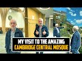

# My Visit To The Amazing Cambridge Central Mosque (2022-06-10 22:08:15+00:00)

## Description

You Can Support My Work on Patreon:
https://www.patreon.com/Bloggingtheology

My Paypal Link: 
https://www.paypal.com/paypalme/bloggingtheology?locale.x=en_GB

## Summary of [My Visit To The Amazing Cambridge Central Mosque](https://www.youtube.com/watch?v=cYamuG78Hl0)

*This is an AI generated summary. There may be inaccuracies. *

### [00:00:00](https://www.youtube.com/watch?v=cYamuG78Hl0&t=0) - [00:00:00](https://www.youtube.com/watch?v=cYamuG78Hl0&t=0)

The video explores the architecture and facilities of the Cambridge Central Mosque. The Sheikh's sermon on empathy is featured, as well as the impressive Wudu facilities.

**[00:00:00](https://www.youtube.com/watch?v=cYamuG78Hl0&t=0)** This YouTube video explores the architecture and facilities of Cambridge Central Mosque. The Sheikh's sermon on empathy was very beautiful and sophisticated, and the Wudu facilities were impressive.

## Full transcript with timestamps

[0:00:00](https://youtu.be/cYamuG78Hl0?t=0) So here we are again at Cambridge 
central mosque and I've just uh    
[0:00:04](https://youtu.be/cYamuG78Hl0?t=4) listened to an extraordinary uh Khotba by 
the way look at this look at this architecture    
[0:00:09](https://youtu.be/cYamuG78Hl0?t=9) these apparently are load-bearing these are 
load-bearing trees apparently they look like    
[0:00:15](https://youtu.be/cYamuG78Hl0?t=15) trees they do remind me of if it's not too um 
inappropriate to say they remind me of the elvish    
[0:00:20](https://youtu.be/cYamuG78Hl0?t=20) architecture in lord of the rings I think if 
Tolkien came here um he would have really liked    
[0:00:26](https://youtu.be/cYamuG78Hl0?t=26) the architecture because it's like a forest a 
forest of trees supporting the the ceiling is    
[0:00:31](https://youtu.be/cYamuG78Hl0?t=31) absolutely beautiful and the architecture 
here I have been told is quite Turkish    
[0:00:36](https://youtu.be/cYamuG78Hl0?t=36) very very beautiful but I mean I've been when 
I was a Christian I did a lot I heard a lot of    
[0:00:41](https://youtu.be/cYamuG78Hl0?t=41) sermons and many of them were quite erudite quite 
sophisticated I've not heard so many Khotbas    
[0:00:46](https://youtu.be/cYamuG78Hl0?t=46) in mosques except today that was a very very 
beautiful sermon about empathy and very subtle    
[0:00:54](https://youtu.be/cYamuG78Hl0?t=54) lots of nuance about treating situations 
and people black and white and taking into    
[0:00:59](https://youtu.be/cYamuG78Hl0?t=59) account how they feel very beautiful uh very 
sophisticated sermon I really enjoyed it and    
[0:01:04](https://youtu.be/cYamuG78Hl0?t=64) I thank you to the Sheikh for doing that um so 
here we are at Cambridge central mosque and where    
[0:01:10](https://youtu.be/cYamuG78Hl0?t=70) else it's just this architecture it's it's the 
lightness of it this ceiling has lots of light    
[0:01:17](https://youtu.be/cYamuG78Hl0?t=77) coming through some portals uh like in a wood it's 
like a like a forest here so it's a lovely space    
[0:01:25](https://youtu.be/cYamuG78Hl0?t=85) and if you're ever in Cambridge do visit this 
is my first ever visit hopefully insha Allah    
[0:01:30](https://youtu.be/cYamuG78Hl0?t=90) it won't be my last so here we are at Cambridge 
central mosque I don't normally get excited    
[0:01:36](https://youtu.be/cYamuG78Hl0?t=96) about Wudu facilities but these are amazing 
look at this this is the hand one it's nice  
[0:01:44](https://youtu.be/cYamuG78Hl0?t=104) this is one for your feet isn't that super cool and 
look how dry it is very dry if you pan around here    
[0:01:52](https://youtu.be/cYamuG78Hl0?t=112) how dry all this is and you've got palm leaves 
and this is very impressive look at this you can    
[0:01:59](https://youtu.be/cYamuG78Hl0?t=119) actually hang your coat in my central London mosque 
I won't name it doesn't have anything like this    
[0:02:04](https://youtu.be/cYamuG78Hl0?t=124) so you can hang up your coat do your ablution you get 
your foot done as well at the same time it's like   
[0:02:08](https://youtu.be/cYamuG78Hl0?t=128) a manicure service is absolutely fantastic so that's 
the Wudu facilities at Cambridge central mosque    
[0:02:14](https://youtu.be/cYamuG78Hl0?t=134) 10 out of 10. So this is the outside of the entrance 
to Cambridge central isn't that beautiful we're in    
[0:02:22](https://youtu.be/cYamuG78Hl0?t=142) the garden of the mosque and beautiful roses you 
can smell the uh the scent of the roses in the air    
[0:02:29](https://youtu.be/cYamuG78Hl0?t=149) and just over here is a fountain 
and gently pumping away some water    
[0:02:37](https://youtu.be/cYamuG78Hl0?t=157) so isn't that beautiful, do come and 
visit if you can. until next time.  
