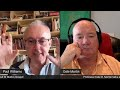

# NEW SERIES: Professor Dale Martin talks about the Gospels (2021-06-11 07:17:42+00:00)

## Description

We begin a new series of talks on the New Testament beginning with the Gospel of Mark. Dale Martin is a distinguished American New Testament scholar who taught at Yale University for over 30 years. See his excellent Introduction to New Testament History and Literature (Open Yale Courses) https://www.amazon.co.uk/Testament-History-Literature-Open-Courses/dp/0300180853
Please consider supporting my work on Patreon: https://www.patreon.com/Bloggingtheology?fan_landing=true

## Summary of [NEW SERIES: Professor Dale Martin talks about the Gospels](https://www.youtube.com/watch?v=YPOcTIYZtNQ)

*This is an AI generated summary. There may be inaccuracies. *

### [00:00:00](https://www.youtube.com/watch?v=YPOcTIYZtNQ&t=0) - [01:00:00](https://www.youtube.com/watch?v=YPOcTIYZtNQ&t=3600)

 Professor Dale Martin discusses the differences between the four canonical Gospels. He argues that John is set apart from the other gospels and comes last in the canon due to its more mature writing style and emphasis on the deity of Jesus. Martin also discusses how scholars can identify parallels between the Greek texts of the Gospels and how they are likely to have been copied and edited by the authors.

**[00:00:00](https://www.youtube.com/watch?v=YPOcTIYZtNQ&t=0)** Professor Dale Martin from Yale University discusses the four canonical gospels in the Bible: Matthew, Mark, Luke, and John. He explains that though all four were written by anonymous authors and were likely composed over a period of several decades, Matthew became the most popular gospel due to its easily-readable structure and its inclusion of teachings that were different from the others. John, the gospel with the most unique teachings, was placed last in the canon due to its divergence from the others.
* **[00:05:00](https://www.youtube.com/watch?v=YPOcTIYZtNQ&t=300)**  Professor Dale Martin discusses how the Gospel of John differs from the other three Gospels. He argues that John is set apart from the other gospels and comes last in the canon due to its more mature writing style and emphasis on the deity of Jesus. Martin also discusses how scholars can identify parallels between the Greek texts of the Gospels and how they are likely to have been copied and edited by the authors.
* **[00:10:00](https://www.youtube.com/watch?v=YPOcTIYZtNQ&t=600)**  Professor Dale Martin discusses how the disciples are portrayed in different gospel accounts. He notes that in Mark's gospel, the earliest account, the disciples are often portrayed negatively. For example, the famous story of Jesus walking on the water and the disciples failing to understand is featured in Mark's gospel, but is absent in Matthew's version. Martin also points out that in Matthew's gospel, the disciples proclaim Jesus as the son of God at the end of the story, a change from the earlier account in Mark. Martin believes that this change is likely due to the later gospel writer's desire to make the disciples more respectable.
* **[00:15:00](https://www.youtube.com/watch?v=YPOcTIYZtNQ&t=900)** Professor Dale Martin discusses the idea that the Gospels contain multiple narratives about the life and teachings of Jesus, including a narrative of his crucifixion and resurrection. He argues that these narratives are not in chronological order, and that the idea of an Ascension is an invention of later Christians.
* **[00:20:00](https://www.youtube.com/watch?v=YPOcTIYZtNQ&t=1200)**  Professor Dale Martin discusses the Gospels and the idea that Paul believed that what he saw when he saw Jesus after his resurrection was different than what Peter and James and John saw. He argues that this discrepancy can be explained by the fact that Paul was teaching in parables to the disciples so that the people on the outside would not understand.
* **[00:25:00](https://www.youtube.com/watch?v=YPOcTIYZtNQ&t=1500)**  Professor Dale Martin discusses the differences between the Gospels of Mark and Matthew. He suggests that Mark may have originally included resurrection appearances, but that they were later lost.
* **[00:30:00](https://www.youtube.com/watch?v=YPOcTIYZtNQ&t=1800)** Professor Dale Martin discusses how the Gospel of Mark ends without any mention of Jesus' resurrection appearances, making it seem like the story was written after the events had already taken place. He believes this may be because the author believed the community of Jesus' followers should be in Galilee waiting for his return.
* **[00:35:00](https://www.youtube.com/watch?v=YPOcTIYZtNQ&t=2100)**  Professor Dale Martin discusses the truncated version of Mark's gospel and why it differs from the other gospels. He also mentions that Luke may have relied on oral tradition and written traditions, and that John the Baptist is portrayed in a familial way.
* **[00:40:00](https://www.youtube.com/watch?v=YPOcTIYZtNQ&t=2400)**  Professor Dale Martin discusses the ancient historiography of the Gospels. He explains that Luke, the author of Acts, does not write like a bios, or a biography, but like a history. Acts is written in a different chronological order than Luke's other two gospel accounts, but that's what ancient historians did all the time. Paul also does not follow a conventional bios format, instead varying his speeches depending on the occasion. Finally, Dale Martin discusses how to give a hortatory speech, or a speech of encouragement, and how Achilles uses an encomium, or speech of praise, to start his speech to the Greeks.
* **[00:45:00](https://www.youtube.com/watch?v=YPOcTIYZtNQ&t=2700)** Professor Dale Martin discusses the Gospels, noting that while the gospel of Mark may have had some literary value in the 2nd century, it was not appreciated by ancient readers. He goes on to say that, as Mark was the most common gospel among early Christians, it is most likely that the author was John, one of the apostles.
* **[00:50:00](https://www.youtube.com/watch?v=YPOcTIYZtNQ&t=3000)** The video discusses the linguistic differences between Greek and Aramaic, which are two of the languages Jesus may have spoken. It argues that these differences make it difficult to ascertain the historical reliability of the Gospels, as the authors may have been influenced by the Aramaic language they were writing in.
* **[00:55:00](https://www.youtube.com/watch?v=YPOcTIYZtNQ&t=3300)** In this passage, Jesus says that the disciples can pick which gospel they want to follow, but they should only pick one. Later in the same chapter, Jesus compares the gospel of Matthew to a good wine, while the gospel of Mark is like vinegar. Paul's style in Colossians and Ephesians is also mentioned.
### [01:00:00](https://www.youtube.com/watch?v=YPOcTIYZtNQ&t=3600) - [01:05:00](https://www.youtube.com/watch?v=YPOcTIYZtNQ&t=3900)

Professor Dale Martin discusses the Gospels and how they differ from other ancient texts. He argues that the Gospel of Mark reflects a lower level of christology than found in the other Gospels. He points to Plato and Apollonius of Tyana as examples of ancient figures who were considered divine by some, but not by all.

**[01:00:00](https://www.youtube.com/watch?v=YPOcTIYZtNQ&t=3600)**  Professor Dale Martin discusses the concept of the son of God in the Gospel of Mark. He argues that, while the passage may seem to imply that Jesus is divine, it actually reflects a lower level of christology than found in the other Gospels.
* **[01:05:00](https://www.youtube.com/watch?v=YPOcTIYZtNQ&t=3900)** Professor Dale Martin discusses the Gospels and how they differ from other ancient texts. He points to Plato and Apollonius of Tyana as examples of ancient figures who were considered divine by some, but not by all. He also mentions the Gospel of Matthew, which he believes is the most interesting of the four gospels.

## Full transcript with timestamps

[0:00:01](https://youtu.be/YPOcTIYZtNQ?t=1) good evening everyone and welcome  
[0:00:04](https://youtu.be/YPOcTIYZtNQ?t=4) to a very special new series on blogging  
[0:00:06](https://youtu.be/YPOcTIYZtNQ?t=6) theology  
[0:00:07](https://youtu.be/YPOcTIYZtNQ?t=7) um and i'm very happy very privileged to  
[0:00:10](https://youtu.be/YPOcTIYZtNQ?t=10) to  
[0:00:11](https://youtu.be/YPOcTIYZtNQ?t=11) introduce again uh professor dale martin  
[0:00:14](https://youtu.be/YPOcTIYZtNQ?t=14) from yale university uh who is an  
[0:00:16](https://youtu.be/YPOcTIYZtNQ?t=16) expert a world class expert on the  
[0:00:19](https://youtu.be/YPOcTIYZtNQ?t=19) gospels  
[0:00:20](https://youtu.be/YPOcTIYZtNQ?t=20) and the new testament in general  
[0:00:21](https://youtu.be/YPOcTIYZtNQ?t=21) actually and um  
[0:00:23](https://youtu.be/YPOcTIYZtNQ?t=23) what's gonna happen uh on this occasion  
[0:00:25](https://youtu.be/YPOcTIYZtNQ?t=25) is we're going to go through  
[0:00:27](https://youtu.be/YPOcTIYZtNQ?t=27) uh the gospels one by one uh we're going  
[0:00:31](https://youtu.be/YPOcTIYZtNQ?t=31) to have a brief introduction to the  
[0:00:33](https://youtu.be/YPOcTIYZtNQ?t=33) four gospels in the bible and another  
[0:00:35](https://youtu.be/YPOcTIYZtNQ?t=35) gospel which is outside of it  
[0:00:38](https://youtu.be/YPOcTIYZtNQ?t=38) uh called the gospel of thomas and then  
[0:00:40](https://youtu.be/YPOcTIYZtNQ?t=40) we're gonna i'm gonna  
[0:00:41](https://youtu.be/YPOcTIYZtNQ?t=41) perhaps steer the conversation through  
[0:00:43](https://youtu.be/YPOcTIYZtNQ?t=43) to the kind of questions that  
[0:00:44](https://youtu.be/YPOcTIYZtNQ?t=44) interest me and interest many people i  
[0:00:46](https://youtu.be/YPOcTIYZtNQ?t=46) think about these uh  
[0:00:48](https://youtu.be/YPOcTIYZtNQ?t=48) four works about their authorship and  
[0:00:50](https://youtu.be/YPOcTIYZtNQ?t=50) their date and  
[0:00:51](https://youtu.be/YPOcTIYZtNQ?t=51) you know do they give us the gospel  
[0:00:52](https://youtu.be/YPOcTIYZtNQ?t=52) truth about jesus are they historical  
[0:00:54](https://youtu.be/YPOcTIYZtNQ?t=54) are they fiction and so on and so on who  
[0:00:57](https://youtu.be/YPOcTIYZtNQ?t=57) is who is jesus  
[0:00:58](https://youtu.be/YPOcTIYZtNQ?t=58) who did jesus say that he is there's so  
[0:01:00](https://youtu.be/YPOcTIYZtNQ?t=60) many questions that we can  
[0:01:01](https://youtu.be/YPOcTIYZtNQ?t=61) um explore in this fascinating subject  
[0:01:04](https://youtu.be/YPOcTIYZtNQ?t=64) so you are most welcomed uh dr dale  
[0:01:06](https://youtu.be/YPOcTIYZtNQ?t=66) martin  
[0:01:07](https://youtu.be/YPOcTIYZtNQ?t=67) and um i'll i'll just start then by  
[0:01:10](https://youtu.be/YPOcTIYZtNQ?t=70) asking if you wouldn't mind if you could  
[0:01:11](https://youtu.be/YPOcTIYZtNQ?t=71) just give us a brief survey a brief  
[0:01:13](https://youtu.be/YPOcTIYZtNQ?t=73) introduction to  
[0:01:15](https://youtu.be/YPOcTIYZtNQ?t=75) the four gospels in the bible and the  
[0:01:17](https://youtu.be/YPOcTIYZtNQ?t=77) gospel of thomas as well  
[0:01:19](https://youtu.be/YPOcTIYZtNQ?t=79) and why that's important in our dating  
[0:01:22](https://youtu.be/YPOcTIYZtNQ?t=82) and understanding of the  
[0:01:23](https://youtu.be/YPOcTIYZtNQ?t=83) the bible's gospels okay  
[0:01:26](https://youtu.be/YPOcTIYZtNQ?t=86) the as most people know the four gospels  
[0:01:29](https://youtu.be/YPOcTIYZtNQ?t=89) that are in the  
[0:01:30](https://youtu.be/YPOcTIYZtNQ?t=90) christian canon are  
[0:01:34](https://youtu.be/YPOcTIYZtNQ?t=94) matthew mark luke and john  
[0:01:37](https://youtu.be/YPOcTIYZtNQ?t=97) now we most modern scholars don't  
[0:01:40](https://youtu.be/YPOcTIYZtNQ?t=100) believe they were written  
[0:01:41](https://youtu.be/YPOcTIYZtNQ?t=101) in that order in other words matthew was  
[0:01:44](https://youtu.be/YPOcTIYZtNQ?t=104) not the earliest one  
[0:01:45](https://youtu.be/YPOcTIYZtNQ?t=105) um and mark wasn't the second one and  
[0:01:48](https://youtu.be/YPOcTIYZtNQ?t=108) luke wasn't the third and john wasn't  
[0:01:50](https://youtu.be/YPOcTIYZtNQ?t=110) the fourth although i think john  
[0:01:51](https://youtu.be/YPOcTIYZtNQ?t=111) probably was the latest one of the four  
[0:01:53](https://youtu.be/YPOcTIYZtNQ?t=113) to be written  
[0:01:55](https://youtu.be/YPOcTIYZtNQ?t=115) and i can explain why but we think that  
[0:02:00](https://youtu.be/YPOcTIYZtNQ?t=120) though and the how the gospels got into  
[0:02:02](https://youtu.be/YPOcTIYZtNQ?t=122) that order  
[0:02:03](https://youtu.be/YPOcTIYZtNQ?t=123) is another complicated question about  
[0:02:05](https://youtu.be/YPOcTIYZtNQ?t=125) the development of the canon  
[0:02:06](https://youtu.be/YPOcTIYZtNQ?t=126) why did the people who put together the  
[0:02:08](https://youtu.be/YPOcTIYZtNQ?t=128) canon uh  
[0:02:09](https://youtu.be/YPOcTIYZtNQ?t=129) put them in the order that they were and  
[0:02:12](https://youtu.be/YPOcTIYZtNQ?t=132) we have to say that not all  
[0:02:13](https://youtu.be/YPOcTIYZtNQ?t=133) canonical collections of the gospels are  
[0:02:16](https://youtu.be/YPOcTIYZtNQ?t=136) in that same order we have manuscripts  
[0:02:19](https://youtu.be/YPOcTIYZtNQ?t=139) from the ancient world that have john  
[0:02:21](https://youtu.be/YPOcTIYZtNQ?t=141) first or have  
[0:02:22](https://youtu.be/YPOcTIYZtNQ?t=142) you know some of them but for kind of  
[0:02:25](https://youtu.be/YPOcTIYZtNQ?t=145) western christianity  
[0:02:26](https://youtu.be/YPOcTIYZtNQ?t=146) including roman catholicism eastern  
[0:02:28](https://youtu.be/YPOcTIYZtNQ?t=148) orthodoxy  
[0:02:30](https://youtu.be/YPOcTIYZtNQ?t=150) and the protestant churches uh the order  
[0:02:32](https://youtu.be/YPOcTIYZtNQ?t=152) in the canon is matthew mark luke and  
[0:02:34](https://youtu.be/YPOcTIYZtNQ?t=154) john  
[0:02:35](https://youtu.be/YPOcTIYZtNQ?t=155) why did they get there most of us think  
[0:02:38](https://youtu.be/YPOcTIYZtNQ?t=158) that matthew just happened to be the  
[0:02:39](https://youtu.be/YPOcTIYZtNQ?t=159) most  
[0:02:40](https://youtu.be/YPOcTIYZtNQ?t=160) popular gospel among a lot of early  
[0:02:44](https://youtu.be/YPOcTIYZtNQ?t=164) churches  
[0:02:45](https://youtu.be/YPOcTIYZtNQ?t=165) there's a lot of teaching in it it's  
[0:02:47](https://youtu.be/YPOcTIYZtNQ?t=167) it's very well organized it's  
[0:02:49](https://youtu.be/YPOcTIYZtNQ?t=169) it's easy to kind of read in sections um  
[0:02:53](https://youtu.be/YPOcTIYZtNQ?t=173) and of course people believed in the  
[0:02:55](https://youtu.be/YPOcTIYZtNQ?t=175) ancient world that it was actually  
[0:02:56](https://youtu.be/YPOcTIYZtNQ?t=176) written by matthew who was  
[0:02:58](https://youtu.be/YPOcTIYZtNQ?t=178) a disciple of jesus we don't believe  
[0:03:00](https://youtu.be/YPOcTIYZtNQ?t=180) that anymore  
[0:03:02](https://youtu.be/YPOcTIYZtNQ?t=182) we don't know who wrote it but i would  
[0:03:04](https://youtu.be/YPOcTIYZtNQ?t=184) argue that it's not written by a direct  
[0:03:06](https://youtu.be/YPOcTIYZtNQ?t=186) disciple of jesus  
[0:03:07](https://youtu.be/YPOcTIYZtNQ?t=187) um because there are just too many  
[0:03:09](https://youtu.be/YPOcTIYZtNQ?t=189) things in it that  
[0:03:10](https://youtu.be/YPOcTIYZtNQ?t=190) um suggest that this author was copying  
[0:03:14](https://youtu.be/YPOcTIYZtNQ?t=194) mark  
[0:03:14](https://youtu.be/YPOcTIYZtNQ?t=194) and using other sources and was not  
[0:03:16](https://youtu.be/YPOcTIYZtNQ?t=196) depending upon  
[0:03:18](https://youtu.be/YPOcTIYZtNQ?t=198) his own memory or his own you know notes  
[0:03:20](https://youtu.be/YPOcTIYZtNQ?t=200) from the field or anything like that  
[0:03:23](https://youtu.be/YPOcTIYZtNQ?t=203) uh so the very compilation aspect of the  
[0:03:25](https://youtu.be/YPOcTIYZtNQ?t=205) gospel of mark  
[0:03:26](https://youtu.be/YPOcTIYZtNQ?t=206) of matthew uh suggests that it was not  
[0:03:29](https://youtu.be/YPOcTIYZtNQ?t=209) written by  
[0:03:30](https://youtu.be/YPOcTIYZtNQ?t=210) uh the disciple of jesus name matthew  
[0:03:34](https://youtu.be/YPOcTIYZtNQ?t=214) who appears in the gospels  
[0:03:36](https://youtu.be/YPOcTIYZtNQ?t=216) but it was written anonymously by  
[0:03:37](https://youtu.be/YPOcTIYZtNQ?t=217) someone later but for different reasons  
[0:03:39](https://youtu.be/YPOcTIYZtNQ?t=219) it seems to become  
[0:03:41](https://youtu.be/YPOcTIYZtNQ?t=221) the most popular gospel to be read in  
[0:03:44](https://youtu.be/YPOcTIYZtNQ?t=224) church  
[0:03:45](https://youtu.be/YPOcTIYZtNQ?t=225) in lots of parts of the ancient  
[0:03:47](https://youtu.be/YPOcTIYZtNQ?t=227) mediterranean and we think that's  
[0:03:49](https://youtu.be/YPOcTIYZtNQ?t=229) probably why i  
[0:03:50](https://youtu.be/YPOcTIYZtNQ?t=230) became first in the canon and then the  
[0:03:53](https://youtu.be/YPOcTIYZtNQ?t=233) others matthew mark and luke are all  
[0:03:55](https://youtu.be/YPOcTIYZtNQ?t=235) grouped together because they're  
[0:03:57](https://youtu.be/YPOcTIYZtNQ?t=237) what we call the synoptic gospels that  
[0:03:59](https://youtu.be/YPOcTIYZtNQ?t=239) is they they tell the same story from  
[0:04:01](https://youtu.be/YPOcTIYZtNQ?t=241) much of the same point of view  
[0:04:03](https://youtu.be/YPOcTIYZtNQ?t=243) they have the same kind of chronology  
[0:04:04](https://youtu.be/YPOcTIYZtNQ?t=244) they have jesus doing this and that they  
[0:04:06](https://youtu.be/YPOcTIYZtNQ?t=246) share a lot of materials  
[0:04:08](https://youtu.be/YPOcTIYZtNQ?t=248) and so uh they  
[0:04:12](https://youtu.be/YPOcTIYZtNQ?t=252) we those three gospels got grouped  
[0:04:14](https://youtu.be/YPOcTIYZtNQ?t=254) together and the gospel of john is so  
[0:04:16](https://youtu.be/YPOcTIYZtNQ?t=256) different from the others it's just  
[0:04:18](https://youtu.be/YPOcTIYZtNQ?t=258) jesus doesn't sound the same  
[0:04:20](https://youtu.be/YPOcTIYZtNQ?t=260) the order of events in in the gospel of  
[0:04:22](https://youtu.be/YPOcTIYZtNQ?t=262) john are not the same  
[0:04:24](https://youtu.be/YPOcTIYZtNQ?t=264) as they are in the other three gospels  
[0:04:26](https://youtu.be/YPOcTIYZtNQ?t=266) in the other three gospels there are a  
[0:04:27](https://youtu.be/YPOcTIYZtNQ?t=267) lot more  
[0:04:28](https://youtu.be/YPOcTIYZtNQ?t=268) healings for example and exorcisms  
[0:04:31](https://youtu.be/YPOcTIYZtNQ?t=271) and there are no exorcisms in the gospel  
[0:04:33](https://youtu.be/YPOcTIYZtNQ?t=273) of john at all  
[0:04:35](https://youtu.be/YPOcTIYZtNQ?t=275) and there are very few healings there  
[0:04:37](https://youtu.be/YPOcTIYZtNQ?t=277) are signs where  
[0:04:38](https://youtu.be/YPOcTIYZtNQ?t=278) jesus turns water into wine and you know  
[0:04:41](https://youtu.be/YPOcTIYZtNQ?t=281) walk from the water and things like that  
[0:04:43](https://youtu.be/YPOcTIYZtNQ?t=283) but there's much less of an emphasis on  
[0:04:45](https://youtu.be/YPOcTIYZtNQ?t=285) healings in the gospel of john  
[0:04:47](https://youtu.be/YPOcTIYZtNQ?t=287) compared to the other three gospels and  
[0:04:49](https://youtu.be/YPOcTIYZtNQ?t=289) no exorcisms at all  
[0:04:51](https://youtu.be/YPOcTIYZtNQ?t=291) which makes it really stand out and the  
[0:04:53](https://youtu.be/YPOcTIYZtNQ?t=293) teachings of the gospel of john  
[0:04:55](https://youtu.be/YPOcTIYZtNQ?t=295) are very different from the teachings  
[0:04:57](https://youtu.be/YPOcTIYZtNQ?t=297) than the other three gospels  
[0:04:58](https://youtu.be/YPOcTIYZtNQ?t=298) they in in john jesus  
[0:05:01](https://youtu.be/YPOcTIYZtNQ?t=301) sounds like a greek philosopher about  
[0:05:04](https://youtu.be/YPOcTIYZtNQ?t=304) half the time  
[0:05:06](https://youtu.be/YPOcTIYZtNQ?t=306) right whereas in the other gospels he  
[0:05:08](https://youtu.be/YPOcTIYZtNQ?t=308) sounds like an apocalyptic  
[0:05:10](https://youtu.be/YPOcTIYZtNQ?t=310) jewish prophet speaking of which there's  
[0:05:13](https://youtu.be/YPOcTIYZtNQ?t=313) a lot less  
[0:05:15](https://youtu.be/YPOcTIYZtNQ?t=315) what we call eschatology or  
[0:05:17](https://youtu.be/YPOcTIYZtNQ?t=317) apocalypticism  
[0:05:18](https://youtu.be/YPOcTIYZtNQ?t=318) in john that is any talk about the end  
[0:05:21](https://youtu.be/YPOcTIYZtNQ?t=321) of the world as we know it  
[0:05:23](https://youtu.be/YPOcTIYZtNQ?t=323) uh satan coming with his angels and  
[0:05:25](https://youtu.be/YPOcTIYZtNQ?t=325) fighting against  
[0:05:26](https://youtu.be/YPOcTIYZtNQ?t=326) uh the son of man with his angels and  
[0:05:28](https://youtu.be/YPOcTIYZtNQ?t=328) the setting up of the kingdom of god on  
[0:05:30](https://youtu.be/YPOcTIYZtNQ?t=330) earth and  
[0:05:31](https://youtu.be/YPOcTIYZtNQ?t=331) all that sort of thing which is all the  
[0:05:33](https://youtu.be/YPOcTIYZtNQ?t=333) way through matthew mark and luke  
[0:05:35](https://youtu.be/YPOcTIYZtNQ?t=335) very little of it in the gospel of john  
[0:05:37](https://youtu.be/YPOcTIYZtNQ?t=337) jesus sounds much more like a  
[0:05:38](https://youtu.be/YPOcTIYZtNQ?t=338) philosopher talking about light and dark  
[0:05:40](https://youtu.be/YPOcTIYZtNQ?t=340) and truth and  
[0:05:42](https://youtu.be/YPOcTIYZtNQ?t=342) you know falseness and that sort of  
[0:05:45](https://youtu.be/YPOcTIYZtNQ?t=345) thing  
[0:05:45](https://youtu.be/YPOcTIYZtNQ?t=345) uh so for a variety of reasons uh  
[0:05:49](https://youtu.be/YPOcTIYZtNQ?t=349) john seems to be set apart from the  
[0:05:51](https://youtu.be/YPOcTIYZtNQ?t=351) other three gospels and we think that's  
[0:05:53](https://youtu.be/YPOcTIYZtNQ?t=353) probably why it comes last  
[0:05:55](https://youtu.be/YPOcTIYZtNQ?t=355) in the canon also a lot of people just  
[0:05:57](https://youtu.be/YPOcTIYZtNQ?t=357) felt it looks like a more mature gospel  
[0:06:00](https://youtu.be/YPOcTIYZtNQ?t=360) it looks like a later gospel for example  
[0:06:02](https://youtu.be/YPOcTIYZtNQ?t=362) it has more of an emphasis  
[0:06:04](https://youtu.be/YPOcTIYZtNQ?t=364) on the deity of jesus and  
[0:06:07](https://youtu.be/YPOcTIYZtNQ?t=367) jesus as the son of god and jesus is  
[0:06:09](https://youtu.be/YPOcTIYZtNQ?t=369) equal to god the father and  
[0:06:11](https://youtu.be/YPOcTIYZtNQ?t=371) and these kinds of things that seem like  
[0:06:13](https://youtu.be/YPOcTIYZtNQ?t=373) they developed more in the  
[0:06:15](https://youtu.be/YPOcTIYZtNQ?t=375) second century the late and first  
[0:06:16](https://youtu.be/YPOcTIYZtNQ?t=376) century in the second century  
[0:06:18](https://youtu.be/YPOcTIYZtNQ?t=378) which would make them several decades  
[0:06:20](https://youtu.be/YPOcTIYZtNQ?t=380) after the writing of mark  
[0:06:22](https://youtu.be/YPOcTIYZtNQ?t=382) now we think mark is the earliest both  
[0:06:24](https://youtu.be/YPOcTIYZtNQ?t=384) because matthew and luke  
[0:06:26](https://youtu.be/YPOcTIYZtNQ?t=386) use mark as a source so mark has got to  
[0:06:29](https://youtu.be/YPOcTIYZtNQ?t=389) pre-date matthew and luke  
[0:06:31](https://youtu.be/YPOcTIYZtNQ?t=391) but how do we know how do we know that  
[0:06:33](https://youtu.be/YPOcTIYZtNQ?t=393) matthew and luke use mark  
[0:06:35](https://youtu.be/YPOcTIYZtNQ?t=395) what gives you such confidence you can  
[0:06:37](https://youtu.be/YPOcTIYZtNQ?t=397) say that well it is disputable because  
[0:06:39](https://youtu.be/YPOcTIYZtNQ?t=399) of course  
[0:06:40](https://youtu.be/YPOcTIYZtNQ?t=400) uh you could say that either matthew  
[0:06:44](https://youtu.be/YPOcTIYZtNQ?t=404) is copying mark but then cutting out  
[0:06:47](https://youtu.be/YPOcTIYZtNQ?t=407) some of the action but expanding the  
[0:06:48](https://youtu.be/YPOcTIYZtNQ?t=408) teachings  
[0:06:50](https://youtu.be/YPOcTIYZtNQ?t=410) because matthew will take you know  
[0:06:52](https://youtu.be/YPOcTIYZtNQ?t=412) something from mark and expand it a lot  
[0:06:55](https://youtu.be/YPOcTIYZtNQ?t=415) now is that is it more likely that  
[0:06:57](https://youtu.be/YPOcTIYZtNQ?t=417) matthew is expanding on mark  
[0:07:00](https://youtu.be/YPOcTIYZtNQ?t=420) or do we imagine mark sitting down with  
[0:07:02](https://youtu.be/YPOcTIYZtNQ?t=422) matthew and cutting reams of it out  
[0:07:06](https://youtu.be/YPOcTIYZtNQ?t=426) you know why would an ancient author cut  
[0:07:08](https://youtu.be/YPOcTIYZtNQ?t=428) out material  
[0:07:09](https://youtu.be/YPOcTIYZtNQ?t=429) if he had it to pass on and it's the  
[0:07:12](https://youtu.be/YPOcTIYZtNQ?t=432) same way with luke  
[0:07:14](https://youtu.be/YPOcTIYZtNQ?t=434) there are parts where i think luke has  
[0:07:17](https://youtu.be/YPOcTIYZtNQ?t=437) mark in front of him and he's following  
[0:07:20](https://youtu.be/YPOcTIYZtNQ?t=440) mark's  
[0:07:20](https://youtu.be/YPOcTIYZtNQ?t=440) chronology somewhat but then he'll take  
[0:07:23](https://youtu.be/YPOcTIYZtNQ?t=443) a story that he finds in mark in  
[0:07:26](https://youtu.be/YPOcTIYZtNQ?t=446) you know a much later chapter and he  
[0:07:28](https://youtu.be/YPOcTIYZtNQ?t=448) takes that story and he  
[0:07:30](https://youtu.be/YPOcTIYZtNQ?t=450) transfers it to earlier in his gospel  
[0:07:34](https://youtu.be/YPOcTIYZtNQ?t=454) and the reason is i think is because he  
[0:07:36](https://youtu.be/YPOcTIYZtNQ?t=456) wants to use that story to make some of  
[0:07:38](https://youtu.be/YPOcTIYZtNQ?t=458) his  
[0:07:39](https://youtu.be/YPOcTIYZtNQ?t=459) favorite themes and so he he uses the  
[0:07:42](https://youtu.be/YPOcTIYZtNQ?t=462) story  
[0:07:43](https://youtu.be/YPOcTIYZtNQ?t=463) um and then he packs into it a bunch  
[0:07:47](https://youtu.be/YPOcTIYZtNQ?t=467) more material  
[0:07:48](https://youtu.be/YPOcTIYZtNQ?t=468) and again it's just a matter of when you  
[0:07:49](https://youtu.be/YPOcTIYZtNQ?t=469) put matthew and mark  
[0:07:52](https://youtu.be/YPOcTIYZtNQ?t=472) next to each other or mark and luke next  
[0:07:54](https://youtu.be/YPOcTIYZtNQ?t=474) to each other  
[0:07:56](https://youtu.be/YPOcTIYZtNQ?t=476) who looks like he copied the other  
[0:08:00](https://youtu.be/YPOcTIYZtNQ?t=480) and it's a guess of course but it's a  
[0:08:03](https://youtu.be/YPOcTIYZtNQ?t=483) guess that scholars  
[0:08:05](https://youtu.be/YPOcTIYZtNQ?t=485) analyzing sentence after sentence after  
[0:08:07](https://youtu.be/YPOcTIYZtNQ?t=487) sentence  
[0:08:08](https://youtu.be/YPOcTIYZtNQ?t=488) for example mark uses language that's a  
[0:08:10](https://youtu.be/YPOcTIYZtNQ?t=490) bit more rough and tumble  
[0:08:12](https://youtu.be/YPOcTIYZtNQ?t=492) a bit more earthy and matthew and luke  
[0:08:15](https://youtu.be/YPOcTIYZtNQ?t=495) almost  
[0:08:16](https://youtu.be/YPOcTIYZtNQ?t=496) always will clean up mark's greek  
[0:08:19](https://youtu.be/YPOcTIYZtNQ?t=499) right to where it sounds more  
[0:08:20](https://youtu.be/YPOcTIYZtNQ?t=500) respectable well what's more likely  
[0:08:24](https://youtu.be/YPOcTIYZtNQ?t=504) that matthew and luke used a  
[0:08:26](https://youtu.be/YPOcTIYZtNQ?t=506) colloquialism  
[0:08:28](https://youtu.be/YPOcTIYZtNQ?t=508) or even a sketchy kind of sounding term  
[0:08:31](https://youtu.be/YPOcTIYZtNQ?t=511) uh a disrespectful term or that matthew  
[0:08:34](https://youtu.be/YPOcTIYZtNQ?t=514) and luke  
[0:08:35](https://youtu.be/YPOcTIYZtNQ?t=515) cleaned up mark so it's it's hundreds of  
[0:08:38](https://youtu.be/YPOcTIYZtNQ?t=518) decisions like that that  
[0:08:40](https://youtu.be/YPOcTIYZtNQ?t=520) you make when you take  
[0:08:43](https://youtu.be/YPOcTIYZtNQ?t=523) the parallel gospels and this is what's  
[0:08:45](https://youtu.be/YPOcTIYZtNQ?t=525) fortunate in modern publications  
[0:08:46](https://youtu.be/YPOcTIYZtNQ?t=526) we can have the greek of matthew in one  
[0:08:49](https://youtu.be/YPOcTIYZtNQ?t=529) column the greek of mark in another  
[0:08:51](https://youtu.be/YPOcTIYZtNQ?t=531) column and the greek of luke in another  
[0:08:53](https://youtu.be/YPOcTIYZtNQ?t=533) column  
[0:08:53](https://youtu.be/YPOcTIYZtNQ?t=533) all of the same passages and you can  
[0:08:55](https://youtu.be/YPOcTIYZtNQ?t=535) just highlight with a with a pen  
[0:08:58](https://youtu.be/YPOcTIYZtNQ?t=538) uh where they have the exact same words  
[0:09:00](https://youtu.be/YPOcTIYZtNQ?t=540) and where they have  
[0:09:01](https://youtu.be/YPOcTIYZtNQ?t=541) different words and then you have to  
[0:09:03](https://youtu.be/YPOcTIYZtNQ?t=543) decide which is most likely changed  
[0:09:05](https://youtu.be/YPOcTIYZtNQ?t=545) to what and so as you're saying at the  
[0:09:08](https://youtu.be/YPOcTIYZtNQ?t=548) level of the greek  
[0:09:08](https://youtu.be/YPOcTIYZtNQ?t=548) the actual greek text sometimes is  
[0:09:10](https://youtu.be/YPOcTIYZtNQ?t=550) identical uh in various gospels and  
[0:09:13](https://youtu.be/YPOcTIYZtNQ?t=553) sometimes it changes subtly or not so  
[0:09:15](https://youtu.be/YPOcTIYZtNQ?t=555) subtly  
[0:09:16](https://youtu.be/YPOcTIYZtNQ?t=556) and and this is the conundrum what's  
[0:09:17](https://youtu.be/YPOcTIYZtNQ?t=557) going on here who is copying and editing  
[0:09:19](https://youtu.be/YPOcTIYZtNQ?t=559) who perhaps  
[0:09:21](https://youtu.be/YPOcTIYZtNQ?t=561) yeah that's exactly right and and uh  
[0:09:25](https://youtu.be/YPOcTIYZtNQ?t=565) you know this is not just something that  
[0:09:27](https://youtu.be/YPOcTIYZtNQ?t=567) scholars of ancient documents  
[0:09:29](https://youtu.be/YPOcTIYZtNQ?t=569) do we have i mean i taught for  
[0:09:32](https://youtu.be/YPOcTIYZtNQ?t=572) 30 over 30 years in universities and i i  
[0:09:35](https://youtu.be/YPOcTIYZtNQ?t=575) got to the point where i had to  
[0:09:37](https://youtu.be/YPOcTIYZtNQ?t=577) i learned pretty well when i saw  
[0:09:39](https://youtu.be/YPOcTIYZtNQ?t=579) plagiarism  
[0:09:42](https://youtu.be/YPOcTIYZtNQ?t=582) and i was pretty sure that the student  
[0:09:46](https://youtu.be/YPOcTIYZtNQ?t=586) that the wikipedia article hadn't copied  
[0:09:48](https://youtu.be/YPOcTIYZtNQ?t=588) from this student's paper  
[0:09:51](https://youtu.be/YPOcTIYZtNQ?t=591) okay but the other way around sounded  
[0:09:53](https://youtu.be/YPOcTIYZtNQ?t=593) right and  
[0:09:54](https://youtu.be/YPOcTIYZtNQ?t=594) and you can even see okay well the  
[0:09:56](https://youtu.be/YPOcTIYZtNQ?t=596) student kind of changed the word here or  
[0:09:57](https://youtu.be/YPOcTIYZtNQ?t=597) changed to work here  
[0:09:58](https://youtu.be/YPOcTIYZtNQ?t=598) thinking that he or she was going to  
[0:10:00](https://youtu.be/YPOcTIYZtNQ?t=600) fool me then clever  
[0:10:02](https://youtu.be/YPOcTIYZtNQ?t=602) yeah and then oh well no i didn't copy  
[0:10:04](https://youtu.be/YPOcTIYZtNQ?t=604) this i wrote this out myself  
[0:10:05](https://youtu.be/YPOcTIYZtNQ?t=605) you know but you get to the point where  
[0:10:08](https://youtu.be/YPOcTIYZtNQ?t=608) you can tell  
[0:10:09](https://youtu.be/YPOcTIYZtNQ?t=609) uh more likely who's copying whom  
[0:10:12](https://youtu.be/YPOcTIYZtNQ?t=612) doesn't always work but it's fascinating  
[0:10:15](https://youtu.be/YPOcTIYZtNQ?t=615) does this detective work really isn't it  
[0:10:17](https://youtu.be/YPOcTIYZtNQ?t=617) you're kind of  
[0:10:18](https://youtu.be/YPOcTIYZtNQ?t=618) you're trying to reconstruct with a  
[0:10:20](https://youtu.be/YPOcTIYZtNQ?t=620) detective's mentality you know what  
[0:10:21](https://youtu.be/YPOcTIYZtNQ?t=621) what really happened there what's the  
[0:10:23](https://youtu.be/YPOcTIYZtNQ?t=623) best hypothesis one can come up with  
[0:10:25](https://youtu.be/YPOcTIYZtNQ?t=625) um that's right but one of the other  
[0:10:28](https://youtu.be/YPOcTIYZtNQ?t=628) things i i've heard and i've checked  
[0:10:29](https://youtu.be/YPOcTIYZtNQ?t=629) this out myself it seems that in mark's  
[0:10:31](https://youtu.be/YPOcTIYZtNQ?t=631) gospel the earliest  
[0:10:33](https://youtu.be/YPOcTIYZtNQ?t=633) um there's quite a negative portrayal of  
[0:10:35](https://youtu.be/YPOcTIYZtNQ?t=635) the disciples  
[0:10:36](https://youtu.be/YPOcTIYZtNQ?t=636) uh often they're portrayed as  
[0:10:38](https://youtu.be/YPOcTIYZtNQ?t=638) unbelieving or hard of heart  
[0:10:40](https://youtu.be/YPOcTIYZtNQ?t=640) um for example the famous story of jesus  
[0:10:43](https://youtu.be/YPOcTIYZtNQ?t=643) walking on the water  
[0:10:45](https://youtu.be/YPOcTIYZtNQ?t=645) and the sort of ends with the disciples  
[0:10:47](https://youtu.be/YPOcTIYZtNQ?t=647) just not getting what's going on in  
[0:10:48](https://youtu.be/YPOcTIYZtNQ?t=648) their hearts were hard  
[0:10:50](https://youtu.be/YPOcTIYZtNQ?t=650) and then if you look at say the story in  
[0:10:51](https://youtu.be/YPOcTIYZtNQ?t=651) matthew's version  
[0:10:53](https://youtu.be/YPOcTIYZtNQ?t=653) yeah there's a bit of disbelief but at  
[0:10:55](https://youtu.be/YPOcTIYZtNQ?t=655) the end they proclaim him as  
[0:10:57](https://youtu.be/YPOcTIYZtNQ?t=657) the son of god and they worship him it  
[0:10:59](https://youtu.be/YPOcTIYZtNQ?t=659) says uh in  
[0:11:01](https://youtu.be/YPOcTIYZtNQ?t=661) matthew and that seems to be a  
[0:11:03](https://youtu.be/YPOcTIYZtNQ?t=663) consistent change is it not  
[0:11:05](https://youtu.be/YPOcTIYZtNQ?t=665) from one to the other which suggests  
[0:11:07](https://youtu.be/YPOcTIYZtNQ?t=667) that matthew is later because  
[0:11:09](https://youtu.be/YPOcTIYZtNQ?t=669) i guess why would a late why would a  
[0:11:11](https://youtu.be/YPOcTIYZtNQ?t=671) gospel writer deliberately  
[0:11:13](https://youtu.be/YPOcTIYZtNQ?t=673) from say a more positive portrayal make  
[0:11:15](https://youtu.be/YPOcTIYZtNQ?t=675) them look more more stupid but you can  
[0:11:17](https://youtu.be/YPOcTIYZtNQ?t=677) understand how  
[0:11:17](https://youtu.be/YPOcTIYZtNQ?t=677) perhaps a later gospel might perhaps  
[0:11:20](https://youtu.be/YPOcTIYZtNQ?t=680) improve their  
[0:11:20](https://youtu.be/YPOcTIYZtNQ?t=680) status as wanting to be more like role  
[0:11:23](https://youtu.be/YPOcTIYZtNQ?t=683) models or more respectable people than  
[0:11:24](https://youtu.be/YPOcTIYZtNQ?t=684) the unbelievers they were earlier on  
[0:11:27](https://youtu.be/YPOcTIYZtNQ?t=687) is that something that uh is the case do  
[0:11:30](https://youtu.be/YPOcTIYZtNQ?t=690) you think  
[0:11:31](https://youtu.be/YPOcTIYZtNQ?t=691) yes um although i don't think it would  
[0:11:34](https://youtu.be/YPOcTIYZtNQ?t=694) be necessarily the case that people  
[0:11:36](https://youtu.be/YPOcTIYZtNQ?t=696) writing later  
[0:11:37](https://youtu.be/YPOcTIYZtNQ?t=697) would always want to make the apostles  
[0:11:39](https://youtu.be/YPOcTIYZtNQ?t=699) look better  
[0:11:40](https://youtu.be/YPOcTIYZtNQ?t=700) right because it's how it's how mark  
[0:11:43](https://youtu.be/YPOcTIYZtNQ?t=703) presents the apostles  
[0:11:44](https://youtu.be/YPOcTIYZtNQ?t=704) the disciples that is one of the clues  
[0:11:47](https://youtu.be/YPOcTIYZtNQ?t=707) to why he wrote his gospel  
[0:11:49](https://youtu.be/YPOcTIYZtNQ?t=709) and you take the places where he's not  
[0:11:51](https://youtu.be/YPOcTIYZtNQ?t=711) like matthew  
[0:11:52](https://youtu.be/YPOcTIYZtNQ?t=712) or luke or john and you're right it's  
[0:11:56](https://youtu.be/YPOcTIYZtNQ?t=716) in these places where over and over  
[0:11:58](https://youtu.be/YPOcTIYZtNQ?t=718) again the disciples misunderstand  
[0:12:00](https://youtu.be/YPOcTIYZtNQ?t=720) and even to the point of you know  
[0:12:01](https://youtu.be/YPOcTIYZtNQ?t=721) halfway through when they're in the boat  
[0:12:04](https://youtu.be/YPOcTIYZtNQ?t=724) and and jesus is saying beware the  
[0:12:07](https://youtu.be/YPOcTIYZtNQ?t=727) leaven of the pharisees  
[0:12:09](https://youtu.be/YPOcTIYZtNQ?t=729) and the disciples i'll start talking  
[0:12:10](https://youtu.be/YPOcTIYZtNQ?t=730) about oh darn we forgot to bring some  
[0:12:12](https://youtu.be/YPOcTIYZtNQ?t=732) bread  
[0:12:13](https://youtu.be/YPOcTIYZtNQ?t=733) you know we don't have any we have one  
[0:12:15](https://youtu.be/YPOcTIYZtNQ?t=735) loaf of bread and that's not enough for  
[0:12:17](https://youtu.be/YPOcTIYZtNQ?t=737) us to get across the  
[0:12:18](https://youtu.be/YPOcTIYZtNQ?t=738) sea of galilee with and what are we  
[0:12:20](https://youtu.be/YPOcTIYZtNQ?t=740) going to do what are we going to do  
[0:12:21](https://youtu.be/YPOcTIYZtNQ?t=741) and jesus overhears them and says  
[0:12:25](https://youtu.be/YPOcTIYZtNQ?t=745) don't you understand yet didn't i just  
[0:12:28](https://youtu.be/YPOcTIYZtNQ?t=748) do two  
[0:12:28](https://youtu.be/YPOcTIYZtNQ?t=748) feedings when we had the you know  
[0:12:32](https://youtu.be/YPOcTIYZtNQ?t=752) 12 you know we had the 5 000 people that  
[0:12:34](https://youtu.be/YPOcTIYZtNQ?t=754) i fed  
[0:12:35](https://youtu.be/YPOcTIYZtNQ?t=755) how many baskets of food left over did  
[0:12:37](https://youtu.be/YPOcTIYZtNQ?t=757) you take up and they kind of hang their  
[0:12:39](https://youtu.be/YPOcTIYZtNQ?t=759) heads and they said well 12.  
[0:12:42](https://youtu.be/YPOcTIYZtNQ?t=762) and then he says and then after that you  
[0:12:43](https://youtu.be/YPOcTIYZtNQ?t=763) know we had the 7 000 people that i  
[0:12:45](https://youtu.be/YPOcTIYZtNQ?t=765) fed and how many baskets of food did you  
[0:12:48](https://youtu.be/YPOcTIYZtNQ?t=768) take up after that  
[0:12:49](https://youtu.be/YPOcTIYZtNQ?t=769) and they kind of hang their heads and  
[0:12:50](https://youtu.be/YPOcTIYZtNQ?t=770) they say seven  
[0:12:53](https://youtu.be/YPOcTIYZtNQ?t=773) and so you get again jesus saying you  
[0:12:55](https://youtu.be/YPOcTIYZtNQ?t=775) don't  
[0:12:56](https://youtu.be/YPOcTIYZtNQ?t=776) you just don't get it do you you keep  
[0:12:58](https://youtu.be/YPOcTIYZtNQ?t=778) misunderstanding  
[0:13:00](https://youtu.be/YPOcTIYZtNQ?t=780) but i think if you really see what it is  
[0:13:02](https://youtu.be/YPOcTIYZtNQ?t=782) exactly  
[0:13:03](https://youtu.be/YPOcTIYZtNQ?t=783) this is the way i've taught mark and  
[0:13:05](https://youtu.be/YPOcTIYZtNQ?t=785) it's the way i've published it in my  
[0:13:06](https://youtu.be/YPOcTIYZtNQ?t=786) book actually the chat remark  
[0:13:09](https://youtu.be/YPOcTIYZtNQ?t=789) why are the disciples portrayed this way  
[0:13:11](https://youtu.be/YPOcTIYZtNQ?t=791) right and i think it's because they're  
[0:13:14](https://youtu.be/YPOcTIYZtNQ?t=794) meant to be representatives of the  
[0:13:16](https://youtu.be/YPOcTIYZtNQ?t=796) disciples that mark is writing to  
[0:13:20](https://youtu.be/YPOcTIYZtNQ?t=800) and it's not that they don't understand  
[0:13:22](https://youtu.be/YPOcTIYZtNQ?t=802) that jesus  
[0:13:23](https://youtu.be/YPOcTIYZtNQ?t=803) is great or a healer because they keep  
[0:13:26](https://youtu.be/YPOcTIYZtNQ?t=806) bringing people for him to heal they  
[0:13:28](https://youtu.be/YPOcTIYZtNQ?t=808) know that  
[0:13:30](https://youtu.be/YPOcTIYZtNQ?t=810) what they don't understand this really  
[0:13:32](https://youtu.be/YPOcTIYZtNQ?t=812) comes to a head in the very very central  
[0:13:34](https://youtu.be/YPOcTIYZtNQ?t=814) chapter  
[0:13:35](https://youtu.be/YPOcTIYZtNQ?t=815) of the gospel of mark which is chapter 8  
[0:13:37](https://youtu.be/YPOcTIYZtNQ?t=817) there are 16 chapters in mark  
[0:13:38](https://youtu.be/YPOcTIYZtNQ?t=818) chapter 8 is the turning point for the  
[0:13:41](https://youtu.be/YPOcTIYZtNQ?t=821) whole gospel  
[0:13:42](https://youtu.be/YPOcTIYZtNQ?t=822) and it's when jesus is saying the son of  
[0:13:44](https://youtu.be/YPOcTIYZtNQ?t=824) man is going to go to jerusalem they're  
[0:13:45](https://youtu.be/YPOcTIYZtNQ?t=825) going to  
[0:13:46](https://youtu.be/YPOcTIYZtNQ?t=826) be beaten he's going to be you know  
[0:13:48](https://youtu.be/YPOcTIYZtNQ?t=828) they're going to kill him  
[0:13:49](https://youtu.be/YPOcTIYZtNQ?t=829) and he's going to rather and peter takes  
[0:13:51](https://youtu.be/YPOcTIYZtNQ?t=831) him aside and says  
[0:13:53](https://youtu.be/YPOcTIYZtNQ?t=833) no no no no you can't talk that way  
[0:13:54](https://youtu.be/YPOcTIYZtNQ?t=834) that's not going to happen  
[0:13:56](https://youtu.be/YPOcTIYZtNQ?t=836) well why is peter saying that because  
[0:13:58](https://youtu.be/YPOcTIYZtNQ?t=838) peter has come to believe that he that  
[0:13:59](https://youtu.be/YPOcTIYZtNQ?t=839) jesus  
[0:14:00](https://youtu.be/YPOcTIYZtNQ?t=840) is the messiah and he just confessed it  
[0:14:04](https://youtu.be/YPOcTIYZtNQ?t=844) jesus had just said who do people say  
[0:14:06](https://youtu.be/YPOcTIYZtNQ?t=846) that i am and they said well some people  
[0:14:08](https://youtu.be/YPOcTIYZtNQ?t=848) say you're john the baptist some people  
[0:14:09](https://youtu.be/YPOcTIYZtNQ?t=849) say you're elijah something  
[0:14:11](https://youtu.be/YPOcTIYZtNQ?t=851) like that and jesus says who do you say  
[0:14:13](https://youtu.be/YPOcTIYZtNQ?t=853) that i  
[0:14:14](https://youtu.be/YPOcTIYZtNQ?t=854) am and that's when peter says you're the  
[0:14:17](https://youtu.be/YPOcTIYZtNQ?t=857) messiah you're the christ  
[0:14:19](https://youtu.be/YPOcTIYZtNQ?t=859) and jesus praises him  
[0:14:22](https://youtu.be/YPOcTIYZtNQ?t=862) for the confession but then when jesus  
[0:14:26](https://youtu.be/YPOcTIYZtNQ?t=866) immediately starts talking about the  
[0:14:28](https://youtu.be/YPOcTIYZtNQ?t=868) suffering he's going to have to endure  
[0:14:30](https://youtu.be/YPOcTIYZtNQ?t=870) precisely because he is the messiah  
[0:14:33](https://youtu.be/YPOcTIYZtNQ?t=873) peter doesn't understand that because  
[0:14:34](https://youtu.be/YPOcTIYZtNQ?t=874) messiahs don't suffer  
[0:14:36](https://youtu.be/YPOcTIYZtNQ?t=876) this is breaking the form and so that's  
[0:14:39](https://youtu.be/YPOcTIYZtNQ?t=879) why peter takes him aside and says no  
[0:14:41](https://youtu.be/YPOcTIYZtNQ?t=881) you don't understand jesus i just told  
[0:14:43](https://youtu.be/YPOcTIYZtNQ?t=883) you you're the messiah  
[0:14:45](https://youtu.be/YPOcTIYZtNQ?t=885) you get on a big white horse in the  
[0:14:47](https://youtu.be/YPOcTIYZtNQ?t=887) heavens and you come sweeping down with  
[0:14:49](https://youtu.be/YPOcTIYZtNQ?t=889) angelic armies and you overthrow the  
[0:14:51](https://youtu.be/YPOcTIYZtNQ?t=891) romans and the bad people and you set up  
[0:14:52](https://youtu.be/YPOcTIYZtNQ?t=892) the kingdom of god on earth  
[0:14:54](https://youtu.be/YPOcTIYZtNQ?t=894) that's what messiahs do messiahs don't  
[0:14:58](https://youtu.be/YPOcTIYZtNQ?t=898) get killed  
[0:14:58](https://youtu.be/YPOcTIYZtNQ?t=898) they don't suffer they don't die that's  
[0:15:02](https://youtu.be/YPOcTIYZtNQ?t=902) against form and that's when jesus  
[0:15:05](https://youtu.be/YPOcTIYZtNQ?t=905) rebukes him  
[0:15:06](https://youtu.be/YPOcTIYZtNQ?t=906) and says the famous line get thee behind  
[0:15:08](https://youtu.be/YPOcTIYZtNQ?t=908) me satan  
[0:15:10](https://youtu.be/YPOcTIYZtNQ?t=910) because god and the holy spirit have not  
[0:15:12](https://youtu.be/YPOcTIYZtNQ?t=912) revealed this to you  
[0:15:14](https://youtu.be/YPOcTIYZtNQ?t=914) this has come from the bad place but  
[0:15:16](https://youtu.be/YPOcTIYZtNQ?t=916) this is i i find this totally confusing  
[0:15:19](https://youtu.be/YPOcTIYZtNQ?t=919) uh indeed that's what the passage says  
[0:15:21](https://youtu.be/YPOcTIYZtNQ?t=921) but then at the end of luke uh you had  
[0:15:23](https://youtu.be/YPOcTIYZtNQ?t=923) this wonderful story of the  
[0:15:24](https://youtu.be/YPOcTIYZtNQ?t=924) disciples on the road to emmaus and they  
[0:15:26](https://youtu.be/YPOcTIYZtNQ?t=926) bump into this stranger  
[0:15:29](https://youtu.be/YPOcTIYZtNQ?t=929) who they don't know it's jesus and in  
[0:15:31](https://youtu.be/YPOcTIYZtNQ?t=931) the end they do but  
[0:15:32](https://youtu.be/YPOcTIYZtNQ?t=932) the stranger when he reveals himself  
[0:15:33](https://youtu.be/YPOcTIYZtNQ?t=933) with the breaking of the bread so  
[0:15:35](https://youtu.be/YPOcTIYZtNQ?t=935) rebukes him says  
[0:15:36](https://youtu.be/YPOcTIYZtNQ?t=936) didn't you understand that all these  
[0:15:37](https://youtu.be/YPOcTIYZtNQ?t=937) things the the suffering the death and  
[0:15:39](https://youtu.be/YPOcTIYZtNQ?t=939) so on  
[0:15:40](https://youtu.be/YPOcTIYZtNQ?t=940) had to happen as it was foretold in the  
[0:15:42](https://youtu.be/YPOcTIYZtNQ?t=942) scriptures  
[0:15:43](https://youtu.be/YPOcTIYZtNQ?t=943) yeah so it's in the scriptures  
[0:15:47](https://youtu.be/YPOcTIYZtNQ?t=947) and yet you're saying it's breaking form  
[0:15:49](https://youtu.be/YPOcTIYZtNQ?t=949) and peter as a good jew didn't know  
[0:15:51](https://youtu.be/YPOcTIYZtNQ?t=951) anything about it so  
[0:15:53](https://youtu.be/YPOcTIYZtNQ?t=953) if you if you take this their scriptures  
[0:15:56](https://youtu.be/YPOcTIYZtNQ?t=956) which is the jewish scriptures  
[0:15:57](https://youtu.be/YPOcTIYZtNQ?t=957) yes our old testament with a few other  
[0:16:00](https://youtu.be/YPOcTIYZtNQ?t=960) books  
[0:16:02](https://youtu.be/YPOcTIYZtNQ?t=962) you find me a passage or say 10 passages  
[0:16:07](https://youtu.be/YPOcTIYZtNQ?t=967) where the messiah is talked about  
[0:16:10](https://youtu.be/YPOcTIYZtNQ?t=970) and it says he'll be he'll suffer and be  
[0:16:12](https://youtu.be/YPOcTIYZtNQ?t=972) beaten and  
[0:16:13](https://youtu.be/YPOcTIYZtNQ?t=973) and killed there is no place now you can  
[0:16:17](https://youtu.be/YPOcTIYZtNQ?t=977) find the passages of  
[0:16:19](https://youtu.be/YPOcTIYZtNQ?t=979) the suffering servant in isaiah  
[0:16:22](https://youtu.be/YPOcTIYZtNQ?t=982) but that's that he's never called the  
[0:16:23](https://youtu.be/YPOcTIYZtNQ?t=983) messiah so there's  
[0:16:26](https://youtu.be/YPOcTIYZtNQ?t=986) the suffering servant passages in the  
[0:16:28](https://youtu.be/YPOcTIYZtNQ?t=988) bible  
[0:16:30](https://youtu.be/YPOcTIYZtNQ?t=990) and then there's the messianic passages  
[0:16:32](https://youtu.be/YPOcTIYZtNQ?t=992) in the bible they're never put together  
[0:16:34](https://youtu.be/YPOcTIYZtNQ?t=994) in the old testament well this is why  
[0:16:36](https://youtu.be/YPOcTIYZtNQ?t=996) i'm confusing because this is not my  
[0:16:37](https://youtu.be/YPOcTIYZtNQ?t=997) idea this it says in the end of luke  
[0:16:39](https://youtu.be/YPOcTIYZtNQ?t=999) and this is jesus speaking thus it is  
[0:16:41](https://youtu.be/YPOcTIYZtNQ?t=1001) written that the messiah is to suffer  
[0:16:44](https://youtu.be/YPOcTIYZtNQ?t=1004) and to rise from the dead on the third  
[0:16:46](https://youtu.be/YPOcTIYZtNQ?t=1006) day and that's from the nrsv  
[0:16:47](https://youtu.be/YPOcTIYZtNQ?t=1007) so it's an idea that is built in to the  
[0:16:50](https://youtu.be/YPOcTIYZtNQ?t=1010) gospels themselves it's not  
[0:16:52](https://youtu.be/YPOcTIYZtNQ?t=1012) it's true they luke believed that he was  
[0:16:55](https://youtu.be/YPOcTIYZtNQ?t=1015) reading the old testament correctly  
[0:16:58](https://youtu.be/YPOcTIYZtNQ?t=1018) but how can he given that you've just  
[0:17:00](https://youtu.be/YPOcTIYZtNQ?t=1020) said that he couldn't be  
[0:17:02](https://youtu.be/YPOcTIYZtNQ?t=1022) because it's not there well from a  
[0:17:04](https://youtu.be/YPOcTIYZtNQ?t=1024) modern perspective this is why we have  
[0:17:05](https://youtu.be/YPOcTIYZtNQ?t=1025) historical criticism  
[0:17:07](https://youtu.be/YPOcTIYZtNQ?t=1027) a historical critic says sift through  
[0:17:10](https://youtu.be/YPOcTIYZtNQ?t=1030) the 2000 years of christian tradition  
[0:17:12](https://youtu.be/YPOcTIYZtNQ?t=1032) and christian reading  
[0:17:14](https://youtu.be/YPOcTIYZtNQ?t=1034) christians immediately after jesus was  
[0:17:16](https://youtu.be/YPOcTIYZtNQ?t=1036) killed  
[0:17:17](https://youtu.be/YPOcTIYZtNQ?t=1037) i think you know maybe before  
[0:17:20](https://youtu.be/YPOcTIYZtNQ?t=1040) anybody saw him in the resurrection  
[0:17:22](https://youtu.be/YPOcTIYZtNQ?t=1042) appearances because those kind of  
[0:17:24](https://youtu.be/YPOcTIYZtNQ?t=1044) happened over  
[0:17:25](https://youtu.be/YPOcTIYZtNQ?t=1045) you know most of the gospels act like it  
[0:17:28](https://youtu.be/YPOcTIYZtNQ?t=1048) all was a three-day thing  
[0:17:29](https://youtu.be/YPOcTIYZtNQ?t=1049) you know he was buried three days later  
[0:17:31](https://youtu.be/YPOcTIYZtNQ?t=1051) he got up well if you read them  
[0:17:32](https://youtu.be/YPOcTIYZtNQ?t=1052) carefully  
[0:17:34](https://youtu.be/YPOcTIYZtNQ?t=1054) that's it's not probably what happened  
[0:17:36](https://youtu.be/YPOcTIYZtNQ?t=1056) there were appearances of the risen  
[0:17:38](https://youtu.be/YPOcTIYZtNQ?t=1058) jesus that happened according to the  
[0:17:39](https://youtu.be/YPOcTIYZtNQ?t=1059) to acts and the gospel look over a  
[0:17:42](https://youtu.be/YPOcTIYZtNQ?t=1062) 40-day period of time  
[0:17:44](https://youtu.be/YPOcTIYZtNQ?t=1064) exactly and so that's much more and in  
[0:17:47](https://youtu.be/YPOcTIYZtNQ?t=1067) fact paul  
[0:17:49](https://youtu.be/YPOcTIYZtNQ?t=1069) who probably saw had a vision of the  
[0:17:52](https://youtu.be/YPOcTIYZtNQ?t=1072) resurrected  
[0:17:53](https://youtu.be/YPOcTIYZtNQ?t=1073) uh jesus maybe in the year 35 or 36  
[0:17:57](https://youtu.be/YPOcTIYZtNQ?t=1077) so maybe just a few years after the  
[0:17:59](https://youtu.be/YPOcTIYZtNQ?t=1079) death of jesus or maybe even the year 34  
[0:18:02](https://youtu.be/YPOcTIYZtNQ?t=1082) i would say it was the year 34 probably  
[0:18:04](https://youtu.be/YPOcTIYZtNQ?t=1084) or  
[0:18:05](https://youtu.be/YPOcTIYZtNQ?t=1085) thereabouts well if jesus was  
[0:18:08](https://youtu.be/YPOcTIYZtNQ?t=1088) executed in the year 30 as i think is  
[0:18:10](https://youtu.be/YPOcTIYZtNQ?t=1090) the most likely  
[0:18:12](https://youtu.be/YPOcTIYZtNQ?t=1092) historical jesus scenario then paul's  
[0:18:14](https://youtu.be/YPOcTIYZtNQ?t=1094) claiming to see  
[0:18:16](https://youtu.be/YPOcTIYZtNQ?t=1096) the risen jesus in a bodily form  
[0:18:19](https://youtu.be/YPOcTIYZtNQ?t=1099) a physical form  
[0:18:23](https://youtu.be/YPOcTIYZtNQ?t=1103) four years after jesus's death  
[0:18:27](https://youtu.be/YPOcTIYZtNQ?t=1107) but uh it's a naive question here but  
[0:18:29](https://youtu.be/YPOcTIYZtNQ?t=1109) surely the ascension  
[0:18:30](https://youtu.be/YPOcTIYZtNQ?t=1110) happened four years prior to that so has  
[0:18:33](https://youtu.be/YPOcTIYZtNQ?t=1113) jesus  
[0:18:33](https://youtu.be/YPOcTIYZtNQ?t=1113) come from heaven back down to earth  
[0:18:35](https://youtu.be/YPOcTIYZtNQ?t=1115) again for a second is that his like  
[0:18:37](https://youtu.be/YPOcTIYZtNQ?t=1117) an early proto-second coming no it's not  
[0:18:39](https://youtu.be/YPOcTIYZtNQ?t=1119) no i mean how can he see a bodily jesus  
[0:18:41](https://youtu.be/YPOcTIYZtNQ?t=1121) if he's already gone to heaven  
[0:18:43](https://youtu.be/YPOcTIYZtNQ?t=1123) according to there again you're reading  
[0:18:45](https://youtu.be/YPOcTIYZtNQ?t=1125) like a modern  
[0:18:46](https://youtu.be/YPOcTIYZtNQ?t=1126) christian you're mashing together all  
[0:18:48](https://youtu.be/YPOcTIYZtNQ?t=1128) these different  
[0:18:49](https://youtu.be/YPOcTIYZtNQ?t=1129) pieces of the new testament and say they  
[0:18:51](https://youtu.be/YPOcTIYZtNQ?t=1131) all tell the same story with the same  
[0:18:53](https://youtu.be/YPOcTIYZtNQ?t=1133) facts  
[0:18:53](https://youtu.be/YPOcTIYZtNQ?t=1133) paul didn't know anything about an  
[0:18:55](https://youtu.be/YPOcTIYZtNQ?t=1135) ascension right  
[0:18:59](https://youtu.be/YPOcTIYZtNQ?t=1139) i believe all the stories about the  
[0:19:01](https://youtu.be/YPOcTIYZtNQ?t=1141) ascension  
[0:19:03](https://youtu.be/YPOcTIYZtNQ?t=1143) um are much later inventions right  
[0:19:06](https://youtu.be/YPOcTIYZtNQ?t=1146) um and what i think what's happening is  
[0:19:09](https://youtu.be/YPOcTIYZtNQ?t=1149) that  
[0:19:10](https://youtu.be/YPOcTIYZtNQ?t=1150) christians who sincerely have had  
[0:19:13](https://youtu.be/YPOcTIYZtNQ?t=1153) visionary experiences of jesus yes  
[0:19:16](https://youtu.be/YPOcTIYZtNQ?t=1156) in the stories of  
[0:19:19](https://youtu.be/YPOcTIYZtNQ?t=1159) you know luke especially they pack those  
[0:19:23](https://youtu.be/YPOcTIYZtNQ?t=1163) experiences  
[0:19:24](https://youtu.be/YPOcTIYZtNQ?t=1164) into one story about the ascension of  
[0:19:27](https://youtu.be/YPOcTIYZtNQ?t=1167) jesus  
[0:19:28](https://youtu.be/YPOcTIYZtNQ?t=1168) and then for the rest of acts jesus  
[0:19:31](https://youtu.be/YPOcTIYZtNQ?t=1171) doesn't appear to anybody  
[0:19:32](https://youtu.be/YPOcTIYZtNQ?t=1172) except as a vision from heaven yeah  
[0:19:35](https://youtu.be/YPOcTIYZtNQ?t=1175) jesus  
[0:19:36](https://youtu.be/YPOcTIYZtNQ?t=1176) never appears on earth again he speaks  
[0:19:38](https://youtu.be/YPOcTIYZtNQ?t=1178) off stage  
[0:19:40](https://youtu.be/YPOcTIYZtNQ?t=1180) yeah from off stage that's not how  
[0:19:43](https://youtu.be/YPOcTIYZtNQ?t=1183) that must not be how paul defined it  
[0:19:45](https://youtu.be/YPOcTIYZtNQ?t=1185) because  
[0:19:46](https://youtu.be/YPOcTIYZtNQ?t=1186) in galatians it's very important for  
[0:19:48](https://youtu.be/YPOcTIYZtNQ?t=1188) paul to say  
[0:19:49](https://youtu.be/YPOcTIYZtNQ?t=1189) what i saw is exactly what peter and  
[0:19:52](https://youtu.be/YPOcTIYZtNQ?t=1192) james and john saw  
[0:19:54](https://youtu.be/YPOcTIYZtNQ?t=1194) i'm not i'm not a junior apostle no  
[0:19:57](https://youtu.be/YPOcTIYZtNQ?t=1197) see other people can say it wrong say  
[0:19:58](https://youtu.be/YPOcTIYZtNQ?t=1198) well paul yeah maybe you saw  
[0:20:00](https://youtu.be/YPOcTIYZtNQ?t=1200) a vision of jesus but peter and james  
[0:20:03](https://youtu.be/YPOcTIYZtNQ?t=1203) and john  
[0:20:04](https://youtu.be/YPOcTIYZtNQ?t=1204) actually held his body in their hands  
[0:20:07](https://youtu.be/YPOcTIYZtNQ?t=1207) after he was resurrected  
[0:20:09](https://youtu.be/YPOcTIYZtNQ?t=1209) and paul will have none of it because  
[0:20:10](https://youtu.be/YPOcTIYZtNQ?t=1210) he's not going to take a junior level  
[0:20:13](https://youtu.be/YPOcTIYZtNQ?t=1213) apostleship from the other from the 12.  
[0:20:16](https://youtu.be/YPOcTIYZtNQ?t=1216) he's just not going to allow it so he  
[0:20:18](https://youtu.be/YPOcTIYZtNQ?t=1218) insists in galatians  
[0:20:20](https://youtu.be/YPOcTIYZtNQ?t=1220) and it makes no sense of his argument at  
[0:20:21](https://youtu.be/YPOcTIYZtNQ?t=1221) all if he's this is not his point  
[0:20:23](https://youtu.be/YPOcTIYZtNQ?t=1223) that what he saw was exactly what peter  
[0:20:26](https://youtu.be/YPOcTIYZtNQ?t=1226) and james and john saw  
[0:20:27](https://youtu.be/YPOcTIYZtNQ?t=1227) which means some form of bodily  
[0:20:30](https://youtu.be/YPOcTIYZtNQ?t=1230) jesus now we use the word physical to  
[0:20:33](https://youtu.be/YPOcTIYZtNQ?t=1233) our peril because  
[0:20:35](https://youtu.be/YPOcTIYZtNQ?t=1235) what we mean in the modern world about  
[0:20:36](https://youtu.be/YPOcTIYZtNQ?t=1236) physical is very different from what  
[0:20:39](https://youtu.be/YPOcTIYZtNQ?t=1239) in the ancient world they meant by  
[0:20:41](https://youtu.be/YPOcTIYZtNQ?t=1241) fooses or fusicos or  
[0:20:43](https://youtu.be/YPOcTIYZtNQ?t=1243) the greek words that we usually  
[0:20:44](https://youtu.be/YPOcTIYZtNQ?t=1244) translate physically so i'd say let's  
[0:20:47](https://youtu.be/YPOcTIYZtNQ?t=1247) get rid of the  
[0:20:48](https://youtu.be/YPOcTIYZtNQ?t=1248) material immaterial dichotomies and the  
[0:20:50](https://youtu.be/YPOcTIYZtNQ?t=1250) physical spiritual dichotomies  
[0:20:52](https://youtu.be/YPOcTIYZtNQ?t=1252) those don't work for paul no and they  
[0:20:55](https://youtu.be/YPOcTIYZtNQ?t=1255) don't work for most of ancient  
[0:20:56](https://youtu.be/YPOcTIYZtNQ?t=1256) christianity  
[0:20:57](https://youtu.be/YPOcTIYZtNQ?t=1257) they had much more complicated views of  
[0:20:59](https://youtu.be/YPOcTIYZtNQ?t=1259) what the body was  
[0:21:01](https://youtu.be/YPOcTIYZtNQ?t=1261) and what nature was but whatever paul  
[0:21:04](https://youtu.be/YPOcTIYZtNQ?t=1264) believes peter saw  
[0:21:07](https://youtu.be/YPOcTIYZtNQ?t=1267) paul believes he saw and that's four  
[0:21:11](https://youtu.be/YPOcTIYZtNQ?t=1271) years after  
[0:21:12](https://youtu.be/YPOcTIYZtNQ?t=1272) masomenos we're guessing but something  
[0:21:14](https://youtu.be/YPOcTIYZtNQ?t=1274) like four years after  
[0:21:16](https://youtu.be/YPOcTIYZtNQ?t=1276) the so-called ascension of jesus was  
[0:21:19](https://youtu.be/YPOcTIYZtNQ?t=1279) supposed to have occurred  
[0:21:22](https://youtu.be/YPOcTIYZtNQ?t=1282) okay well coming can we come back to  
[0:21:24](https://youtu.be/YPOcTIYZtNQ?t=1284) mark then and  
[0:21:25](https://youtu.be/YPOcTIYZtNQ?t=1285) what i've heard this phrase used uh  
[0:21:27](https://youtu.be/YPOcTIYZtNQ?t=1287) mark's so-called  
[0:21:29](https://youtu.be/YPOcTIYZtNQ?t=1289) messianic secret this idea of there's a  
[0:21:32](https://youtu.be/YPOcTIYZtNQ?t=1292) secret  
[0:21:32](https://youtu.be/YPOcTIYZtNQ?t=1292) in the gospel of mark which we don't  
[0:21:34](https://youtu.be/YPOcTIYZtNQ?t=1294) find say in john  
[0:21:35](https://youtu.be/YPOcTIYZtNQ?t=1295) or the other gospel what's that about  
[0:21:37](https://youtu.be/YPOcTIYZtNQ?t=1297) what's this secret do you think that  
[0:21:39](https://youtu.be/YPOcTIYZtNQ?t=1299) refers to what i just said about  
[0:21:41](https://youtu.be/YPOcTIYZtNQ?t=1301) what is it that mark believes the  
[0:21:42](https://youtu.be/YPOcTIYZtNQ?t=1302) disciples misunderstood  
[0:21:45](https://youtu.be/YPOcTIYZtNQ?t=1305) he thinks they get it right that jesus  
[0:21:46](https://youtu.be/YPOcTIYZtNQ?t=1306) is the messiah  
[0:21:48](https://youtu.be/YPOcTIYZtNQ?t=1308) what they don't get right is it's  
[0:21:50](https://youtu.be/YPOcTIYZtNQ?t=1310) necessary for the messiah to suffer  
[0:21:52](https://youtu.be/YPOcTIYZtNQ?t=1312) before he can be glorified  
[0:21:53](https://youtu.be/YPOcTIYZtNQ?t=1313) right and that's why jesus keeps saying  
[0:21:56](https://youtu.be/YPOcTIYZtNQ?t=1316) to the disciples also  
[0:21:57](https://youtu.be/YPOcTIYZtNQ?t=1317) you're going to have to suffer you're  
[0:21:59](https://youtu.be/YPOcTIYZtNQ?t=1319) going to preach my name they're going to  
[0:22:01](https://youtu.be/YPOcTIYZtNQ?t=1321) throw you in jail they're going to beat  
[0:22:02](https://youtu.be/YPOcTIYZtNQ?t=1322) you they're going to stone you  
[0:22:04](https://youtu.be/YPOcTIYZtNQ?t=1324) they may even kill you but if you hold  
[0:22:07](https://youtu.be/YPOcTIYZtNQ?t=1327) on  
[0:22:08](https://youtu.be/YPOcTIYZtNQ?t=1328) you will achieve the glory  
[0:22:11](https://youtu.be/YPOcTIYZtNQ?t=1331) that jesus himself achieves so  
[0:22:14](https://youtu.be/YPOcTIYZtNQ?t=1334) the whole idea in mark in my view and  
[0:22:16](https://youtu.be/YPOcTIYZtNQ?t=1336) this explains the messianic secret  
[0:22:18](https://youtu.be/YPOcTIYZtNQ?t=1338) the messianic secret is not that jesus  
[0:22:20](https://youtu.be/YPOcTIYZtNQ?t=1340) is the messiah  
[0:22:22](https://youtu.be/YPOcTIYZtNQ?t=1342) i think that he keeps telling people  
[0:22:24](https://youtu.be/YPOcTIYZtNQ?t=1344) don't spread this word around because  
[0:22:26](https://youtu.be/YPOcTIYZtNQ?t=1346) the whole gospel of mark is jesus  
[0:22:28](https://youtu.be/YPOcTIYZtNQ?t=1348) attempt to teach  
[0:22:29](https://youtu.be/YPOcTIYZtNQ?t=1349) the people who follow him uh  
[0:22:32](https://youtu.be/YPOcTIYZtNQ?t=1352) and he's not teaching he's not  
[0:22:33](https://youtu.be/YPOcTIYZtNQ?t=1353) broadcasting this all the time see a lot  
[0:22:35](https://youtu.be/YPOcTIYZtNQ?t=1355) of  
[0:22:36](https://youtu.be/YPOcTIYZtNQ?t=1356) mark is about jesus taking the disciples  
[0:22:38](https://youtu.be/YPOcTIYZtNQ?t=1358) off in secret  
[0:22:40](https://youtu.be/YPOcTIYZtNQ?t=1360) and he teaches in parables to the crowd  
[0:22:42](https://youtu.be/YPOcTIYZtNQ?t=1362) but according to mark why does jesus  
[0:22:44](https://youtu.be/YPOcTIYZtNQ?t=1364) teach in parables and this is something  
[0:22:45](https://youtu.be/YPOcTIYZtNQ?t=1365) for modern people really  
[0:22:47](https://youtu.be/YPOcTIYZtNQ?t=1367) hard hard to wrap their brain around  
[0:22:49](https://youtu.be/YPOcTIYZtNQ?t=1369) according to us jesus spoke in parables  
[0:22:52](https://youtu.be/YPOcTIYZtNQ?t=1372) so people could understand better but in  
[0:22:55](https://youtu.be/YPOcTIYZtNQ?t=1375) mark jesus says i teach them parables so  
[0:22:57](https://youtu.be/YPOcTIYZtNQ?t=1377) the people on the outside will not  
[0:22:59](https://youtu.be/YPOcTIYZtNQ?t=1379) understand  
[0:23:01](https://youtu.be/YPOcTIYZtNQ?t=1381) they'll hear and not understand they'll  
[0:23:03](https://youtu.be/YPOcTIYZtNQ?t=1383) see and not perceive  
[0:23:05](https://youtu.be/YPOcTIYZtNQ?t=1385) so jesus is intentionally trying to  
[0:23:08](https://youtu.be/YPOcTIYZtNQ?t=1388) throw outsiders  
[0:23:10](https://youtu.be/YPOcTIYZtNQ?t=1390) a curveball but he tells the truth  
[0:23:14](https://youtu.be/YPOcTIYZtNQ?t=1394) to the insiders and the truth he keeps  
[0:23:16](https://youtu.be/YPOcTIYZtNQ?t=1396) teaching them over and over again in the  
[0:23:18](https://youtu.be/YPOcTIYZtNQ?t=1398) gospel of mark is  
[0:23:20](https://youtu.be/YPOcTIYZtNQ?t=1400) glory must be preceded by suffering  
[0:23:23](https://youtu.be/YPOcTIYZtNQ?t=1403) that's what so many of the early  
[0:23:24](https://youtu.be/YPOcTIYZtNQ?t=1404) disciples of jesus did not understand  
[0:23:26](https://youtu.be/YPOcTIYZtNQ?t=1406) and i think a lot of them truly did not  
[0:23:28](https://youtu.be/YPOcTIYZtNQ?t=1408) understand it  
[0:23:29](https://youtu.be/YPOcTIYZtNQ?t=1409) the crucifix they didn't expect jesus to  
[0:23:30](https://youtu.be/YPOcTIYZtNQ?t=1410) be crucified  
[0:23:32](https://youtu.be/YPOcTIYZtNQ?t=1412) all this stuff about jesus prophesying  
[0:23:34](https://youtu.be/YPOcTIYZtNQ?t=1414) his crucifixion all the way through the  
[0:23:35](https://youtu.be/YPOcTIYZtNQ?t=1415) gospels well that's also probably not  
[0:23:37](https://youtu.be/YPOcTIYZtNQ?t=1417) historical  
[0:23:39](https://youtu.be/YPOcTIYZtNQ?t=1419) um and why would that be is it because  
[0:23:41](https://youtu.be/YPOcTIYZtNQ?t=1421) of what some would talk about  
[0:23:42](https://youtu.be/YPOcTIYZtNQ?t=1422) anti-supernaturalist  
[0:23:44](https://youtu.be/YPOcTIYZtNQ?t=1424) liberal prejudice or is it for kind of  
[0:23:46](https://youtu.be/YPOcTIYZtNQ?t=1426) more  
[0:23:48](https://youtu.be/YPOcTIYZtNQ?t=1428) obvious historical reasons that if you  
[0:23:50](https://youtu.be/YPOcTIYZtNQ?t=1430) had predicted it  
[0:23:51](https://youtu.be/YPOcTIYZtNQ?t=1431) in such detail why were the disciples so  
[0:23:54](https://youtu.be/YPOcTIYZtNQ?t=1434) surprised when it  
[0:23:55](https://youtu.be/YPOcTIYZtNQ?t=1435) when it happened there seems to be no  
[0:23:56](https://youtu.be/YPOcTIYZtNQ?t=1436) awareness or so ah this is now the final  
[0:23:58](https://youtu.be/YPOcTIYZtNQ?t=1438) stage let us  
[0:24:00](https://youtu.be/YPOcTIYZtNQ?t=1440) see this drama unfold they're all kind  
[0:24:01](https://youtu.be/YPOcTIYZtNQ?t=1441) of scattering and running away and  
[0:24:04](https://youtu.be/YPOcTIYZtNQ?t=1444) you know there's kind of not it's an  
[0:24:05](https://youtu.be/YPOcTIYZtNQ?t=1445) inconsistency there which needs to be  
[0:24:07](https://youtu.be/YPOcTIYZtNQ?t=1447) ironed out  
[0:24:07](https://youtu.be/YPOcTIYZtNQ?t=1447) and that's one thing that's one thing  
[0:24:10](https://youtu.be/YPOcTIYZtNQ?t=1450) you could argue  
[0:24:12](https://youtu.be/YPOcTIYZtNQ?t=1452) uh but i think there are lots of other  
[0:24:14](https://youtu.be/YPOcTIYZtNQ?t=1454) uh possible explanations and they are  
[0:24:16](https://youtu.be/YPOcTIYZtNQ?t=1456) it's probably  
[0:24:16](https://youtu.be/YPOcTIYZtNQ?t=1456) an amalgamation of several of them as i  
[0:24:19](https://youtu.be/YPOcTIYZtNQ?t=1459) pointed out  
[0:24:20](https://youtu.be/YPOcTIYZtNQ?t=1460) there was no expectation that the  
[0:24:21](https://youtu.be/YPOcTIYZtNQ?t=1461) messiah would suffer  
[0:24:26](https://youtu.be/YPOcTIYZtNQ?t=1466) i rather doubt that the historical jesus  
[0:24:29](https://youtu.be/YPOcTIYZtNQ?t=1469) thought that either  
[0:24:30](https://youtu.be/YPOcTIYZtNQ?t=1470) because when he goes to jerusalem he  
[0:24:32](https://youtu.be/YPOcTIYZtNQ?t=1472) seems like he's headed in for a parade  
[0:24:35](https://youtu.be/YPOcTIYZtNQ?t=1475) and and he it seems to me that jesus  
[0:24:39](https://youtu.be/YPOcTIYZtNQ?t=1479) at least he's portrayed is it is  
[0:24:42](https://youtu.be/YPOcTIYZtNQ?t=1482) sincerely surprised  
[0:24:43](https://youtu.be/YPOcTIYZtNQ?t=1483) at what happens to him in jerusalem  
[0:24:47](https://youtu.be/YPOcTIYZtNQ?t=1487) or at least if we reconstruct this  
[0:24:49](https://youtu.be/YPOcTIYZtNQ?t=1489) historically  
[0:24:51](https://youtu.be/YPOcTIYZtNQ?t=1491) um so maybe even jesus thought that he  
[0:24:54](https://youtu.be/YPOcTIYZtNQ?t=1494) if he was  
[0:24:54](https://youtu.be/YPOcTIYZtNQ?t=1494) i think i don't know that we can tell  
[0:24:56](https://youtu.be/YPOcTIYZtNQ?t=1496) whether the historical jesus  
[0:24:58](https://youtu.be/YPOcTIYZtNQ?t=1498) thought he was the messiah or not i  
[0:25:00](https://youtu.be/YPOcTIYZtNQ?t=1500) think if he  
[0:25:01](https://youtu.be/YPOcTIYZtNQ?t=1501) didn't think he was the messiah he  
[0:25:03](https://youtu.be/YPOcTIYZtNQ?t=1503) definitely thought he was a prophet who  
[0:25:05](https://youtu.be/YPOcTIYZtNQ?t=1505) was making way for the messiah  
[0:25:07](https://youtu.be/YPOcTIYZtNQ?t=1507) there are just so many things in the  
[0:25:09](https://youtu.be/YPOcTIYZtNQ?t=1509) gospels where jesus talks about  
[0:25:11](https://youtu.be/YPOcTIYZtNQ?t=1511) this i do this but the son of man will  
[0:25:13](https://youtu.be/YPOcTIYZtNQ?t=1513) do this  
[0:25:14](https://youtu.be/YPOcTIYZtNQ?t=1514) yes and it sounds like he's talking  
[0:25:15](https://youtu.be/YPOcTIYZtNQ?t=1515) about two different people it's about  
[0:25:17](https://youtu.be/YPOcTIYZtNQ?t=1517) someone else almost rather yes  
[0:25:20](https://youtu.be/YPOcTIYZtNQ?t=1520) is it possible it's a roundabout way of  
[0:25:21](https://youtu.be/YPOcTIYZtNQ?t=1521) talking about himself or is that not  
[0:25:23](https://youtu.be/YPOcTIYZtNQ?t=1523) plausible  
[0:25:24](https://youtu.be/YPOcTIYZtNQ?t=1524) it is and that it is a possible and  
[0:25:27](https://youtu.be/YPOcTIYZtNQ?t=1527) that's been the  
[0:25:28](https://youtu.be/YPOcTIYZtNQ?t=1528) you know christian answer for two  
[0:25:30](https://youtu.be/YPOcTIYZtNQ?t=1530) thousand years is uh  
[0:25:32](https://youtu.be/YPOcTIYZtNQ?t=1532) when paul says when jesus says me  
[0:25:36](https://youtu.be/YPOcTIYZtNQ?t=1536) uh he means the same person as when he  
[0:25:38](https://youtu.be/YPOcTIYZtNQ?t=1538) the next sentence says the son of man  
[0:25:41](https://youtu.be/YPOcTIYZtNQ?t=1541) the son of man is just a circumlocution  
[0:25:43](https://youtu.be/YPOcTIYZtNQ?t=1543) for i yes  
[0:25:44](https://youtu.be/YPOcTIYZtNQ?t=1544) and so people have said that uh i think  
[0:25:47](https://youtu.be/YPOcTIYZtNQ?t=1547) it's stretching it  
[0:25:48](https://youtu.be/YPOcTIYZtNQ?t=1548) and i think it doesn't get rid of all  
[0:25:49](https://youtu.be/YPOcTIYZtNQ?t=1549) the different clues  
[0:25:52](https://youtu.be/YPOcTIYZtNQ?t=1552) um but so i think that  
[0:25:56](https://youtu.be/YPOcTIYZtNQ?t=1556) mark is so is his peculiar self  
[0:26:00](https://youtu.be/YPOcTIYZtNQ?t=1560) because his main goal is to change  
[0:26:05](https://youtu.be/YPOcTIYZtNQ?t=1565) uh his own friends the disciples in his  
[0:26:07](https://youtu.be/YPOcTIYZtNQ?t=1567) churches  
[0:26:08](https://youtu.be/YPOcTIYZtNQ?t=1568) to change their notion about what glory  
[0:26:11](https://youtu.be/YPOcTIYZtNQ?t=1571) is  
[0:26:11](https://youtu.be/YPOcTIYZtNQ?t=1571) and therefore what the messiah is just  
[0:26:14](https://youtu.be/YPOcTIYZtNQ?t=1574) like jesus  
[0:26:15](https://youtu.be/YPOcTIYZtNQ?t=1575) was the glorified messiah who first had  
[0:26:17](https://youtu.be/YPOcTIYZtNQ?t=1577) to die  
[0:26:19](https://youtu.be/YPOcTIYZtNQ?t=1579) and suffer so we can attain glory  
[0:26:22](https://youtu.be/YPOcTIYZtNQ?t=1582) if we'll hold out through the hardships  
[0:26:25](https://youtu.be/YPOcTIYZtNQ?t=1585) but we are going to have hardships  
[0:26:27](https://youtu.be/YPOcTIYZtNQ?t=1587) right now right now people are at our  
[0:26:30](https://youtu.be/YPOcTIYZtNQ?t=1590) doors  
[0:26:32](https://youtu.be/YPOcTIYZtNQ?t=1592) but what is this glory that they're  
[0:26:33](https://youtu.be/YPOcTIYZtNQ?t=1593) they've been encouraged to have hope in  
[0:26:36](https://youtu.be/YPOcTIYZtNQ?t=1596) what what is this great treasure or this  
[0:26:38](https://youtu.be/YPOcTIYZtNQ?t=1598) great uh  
[0:26:39](https://youtu.be/YPOcTIYZtNQ?t=1599) goal that they want that they've been  
[0:26:41](https://youtu.be/YPOcTIYZtNQ?t=1601) encouraged to aspire to  
[0:26:42](https://youtu.be/YPOcTIYZtNQ?t=1602) for if they've if they've died it's  
[0:26:45](https://youtu.be/YPOcTIYZtNQ?t=1605) resurrection  
[0:26:46](https://youtu.be/YPOcTIYZtNQ?t=1606) but resurrected into a glorified body  
[0:26:49](https://youtu.be/YPOcTIYZtNQ?t=1609) not just the decaying body in the tomb  
[0:26:53](https://youtu.be/YPOcTIYZtNQ?t=1613) paul is the best one to talk about this  
[0:26:54](https://youtu.be/YPOcTIYZtNQ?t=1614) in first corinthians 15 but  
[0:26:56](https://youtu.be/YPOcTIYZtNQ?t=1616) mark seems to be somewhat familiar with  
[0:26:59](https://youtu.be/YPOcTIYZtNQ?t=1619) paul's at least paul's theology  
[0:27:01](https://youtu.be/YPOcTIYZtNQ?t=1621) of all the gospels mark's theology is  
[0:27:04](https://youtu.be/YPOcTIYZtNQ?t=1624) closer to the theology of the apostle  
[0:27:06](https://youtu.be/YPOcTIYZtNQ?t=1626) paul than any of the other four gospels  
[0:27:09](https://youtu.be/YPOcTIYZtNQ?t=1629) and one of the things for example as an  
[0:27:11](https://youtu.be/YPOcTIYZtNQ?t=1631) example is  
[0:27:12](https://youtu.be/YPOcTIYZtNQ?t=1632) paul very much believed in a doctrine of  
[0:27:14](https://youtu.be/YPOcTIYZtNQ?t=1634) atonement  
[0:27:15](https://youtu.be/YPOcTIYZtNQ?t=1635) that is that the death of jesus wasn't  
[0:27:18](https://youtu.be/YPOcTIYZtNQ?t=1638) an accident  
[0:27:19](https://youtu.be/YPOcTIYZtNQ?t=1639) yeah it was a it was a sacrifice  
[0:27:22](https://youtu.be/YPOcTIYZtNQ?t=1642) for our sins jesus atoned for our sins  
[0:27:26](https://youtu.be/YPOcTIYZtNQ?t=1646) by his  
[0:27:27](https://youtu.be/YPOcTIYZtNQ?t=1647) lamb-like sacrifice now you read that  
[0:27:30](https://youtu.be/YPOcTIYZtNQ?t=1650) that's all the way through mark  
[0:27:31](https://youtu.be/YPOcTIYZtNQ?t=1651) it's in matthew because matthew takes it  
[0:27:33](https://youtu.be/YPOcTIYZtNQ?t=1653) out of mark it's in paul very much  
[0:27:36](https://youtu.be/YPOcTIYZtNQ?t=1656) it's not in luke or acts no luke acts  
[0:27:39](https://youtu.be/YPOcTIYZtNQ?t=1659) does not want to have an atonement  
[0:27:41](https://youtu.be/YPOcTIYZtNQ?t=1661) theory the death of jesus was necessary  
[0:27:45](https://youtu.be/YPOcTIYZtNQ?t=1665) for the gospel of duke but it's because  
[0:27:47](https://youtu.be/YPOcTIYZtNQ?t=1667) jesus was a righteous prophet  
[0:27:52](https://youtu.be/YPOcTIYZtNQ?t=1672) yes and all righteous prophets suffer  
[0:27:55](https://youtu.be/YPOcTIYZtNQ?t=1675) for their righteousness and jesus was  
[0:27:58](https://youtu.be/YPOcTIYZtNQ?t=1678) just  
[0:27:58](https://youtu.be/YPOcTIYZtNQ?t=1678) the best example of the suffering of a  
[0:28:00](https://youtu.be/YPOcTIYZtNQ?t=1680) righteous prophet but his death doesn't  
[0:28:02](https://youtu.be/YPOcTIYZtNQ?t=1682) cover our sins  
[0:28:05](https://youtu.be/YPOcTIYZtNQ?t=1685) no so the the odd thing is you you get  
[0:28:09](https://youtu.be/YPOcTIYZtNQ?t=1689) this extraordinary  
[0:28:10](https://youtu.be/YPOcTIYZtNQ?t=1690) scene of jesus dying on the cross  
[0:28:11](https://youtu.be/YPOcTIYZtNQ?t=1691) calling out seemingly in despair my god  
[0:28:14](https://youtu.be/YPOcTIYZtNQ?t=1694) my god why have you forsaken me  
[0:28:16](https://youtu.be/YPOcTIYZtNQ?t=1696) uh now i'm aware that's the first line  
[0:28:18](https://youtu.be/YPOcTIYZtNQ?t=1698) of a psalm but  
[0:28:20](https://youtu.be/YPOcTIYZtNQ?t=1700) nevertheless if he wasn't just reciting  
[0:28:22](https://youtu.be/YPOcTIYZtNQ?t=1702) poetry on the cross it actually  
[0:28:24](https://youtu.be/YPOcTIYZtNQ?t=1704) meant it this is a curious cry of  
[0:28:27](https://youtu.be/YPOcTIYZtNQ?t=1707) despair  
[0:28:27](https://youtu.be/YPOcTIYZtNQ?t=1707) it seems um and then after that  
[0:28:31](https://youtu.be/YPOcTIYZtNQ?t=1711) in mark you don't have any resurrection  
[0:28:33](https://youtu.be/YPOcTIYZtNQ?t=1713) appearances  
[0:28:35](https://youtu.be/YPOcTIYZtNQ?t=1715) i i know there are resurrection of  
[0:28:37](https://youtu.be/YPOcTIYZtNQ?t=1717) stories uh  
[0:28:38](https://youtu.be/YPOcTIYZtNQ?t=1718) several of them that you might read in  
[0:28:40](https://youtu.be/YPOcTIYZtNQ?t=1720) modern bibles but i understand that none  
[0:28:42](https://youtu.be/YPOcTIYZtNQ?t=1722) of them  
[0:28:43](https://youtu.be/YPOcTIYZtNQ?t=1723) are part the organic part of the  
[0:28:45](https://youtu.be/YPOcTIYZtNQ?t=1725) original gospel that they were added  
[0:28:46](https://youtu.be/YPOcTIYZtNQ?t=1726) much later on so  
[0:28:47](https://youtu.be/YPOcTIYZtNQ?t=1727) these mysterious things again this is  
[0:28:49](https://youtu.be/YPOcTIYZtNQ?t=1729) suffering jesus talking about how he  
[0:28:51](https://youtu.be/YPOcTIYZtNQ?t=1731) must suffer must die  
[0:28:53](https://youtu.be/YPOcTIYZtNQ?t=1733) and then when he actually goes through  
[0:28:55](https://youtu.be/YPOcTIYZtNQ?t=1735) that terrible ordeal in that trial  
[0:28:58](https://youtu.be/YPOcTIYZtNQ?t=1738) he seems to die in despair and then  
[0:29:00](https://youtu.be/YPOcTIYZtNQ?t=1740) after that there's no resurrection  
[0:29:02](https://youtu.be/YPOcTIYZtNQ?t=1742) either  
[0:29:02](https://youtu.be/YPOcTIYZtNQ?t=1742) for mark i mean i'm not saying that it's  
[0:29:05](https://youtu.be/YPOcTIYZtNQ?t=1745) not mentioned but it's if the  
[0:29:06](https://youtu.be/YPOcTIYZtNQ?t=1746) appearances don't figure  
[0:29:07](https://youtu.be/YPOcTIYZtNQ?t=1747) as actual events in mark so for me  
[0:29:10](https://youtu.be/YPOcTIYZtNQ?t=1750) that's  
[0:29:10](https://youtu.be/YPOcTIYZtNQ?t=1750) more more mysterious events that  
[0:29:13](https://youtu.be/YPOcTIYZtNQ?t=1753) aren't expected yeah of course you're  
[0:29:16](https://youtu.be/YPOcTIYZtNQ?t=1756) mixing up several different problems  
[0:29:18](https://youtu.be/YPOcTIYZtNQ?t=1758) the the quotation of the elements of  
[0:29:21](https://youtu.be/YPOcTIYZtNQ?t=1761) bhaktani  
[0:29:22](https://youtu.be/YPOcTIYZtNQ?t=1762) is you know one problem uh that requires  
[0:29:25](https://youtu.be/YPOcTIYZtNQ?t=1765) some kind of  
[0:29:26](https://youtu.be/YPOcTIYZtNQ?t=1766) interpretation how you fix that up with  
[0:29:31](https://youtu.be/YPOcTIYZtNQ?t=1771) the fact that mark believes there was a  
[0:29:34](https://youtu.be/YPOcTIYZtNQ?t=1774) resurrection  
[0:29:36](https://youtu.be/YPOcTIYZtNQ?t=1776) yes and yet the fact that he doesn't  
[0:29:39](https://youtu.be/YPOcTIYZtNQ?t=1779) seem to want to depict any of it  
[0:29:41](https://youtu.be/YPOcTIYZtNQ?t=1781) visually yes um  
[0:29:45](https://youtu.be/YPOcTIYZtNQ?t=1785) and i don't personally buy the idea that  
[0:29:49](https://youtu.be/YPOcTIYZtNQ?t=1789) several last pages of mark were lost  
[0:29:51](https://youtu.be/YPOcTIYZtNQ?t=1791) burned up or  
[0:29:53](https://youtu.be/YPOcTIYZtNQ?t=1793) lost and so mark actually originally did  
[0:29:55](https://youtu.be/YPOcTIYZtNQ?t=1795) have resurrection appearances and they  
[0:29:56](https://youtu.be/YPOcTIYZtNQ?t=1796) were just lost  
[0:29:57](https://youtu.be/YPOcTIYZtNQ?t=1797) do you think it ends where mark intends  
[0:29:59](https://youtu.be/YPOcTIYZtNQ?t=1799) it to end in this kind of i  
[0:30:01](https://youtu.be/YPOcTIYZtNQ?t=1801) do i do and again i think that's because  
[0:30:05](https://youtu.be/YPOcTIYZtNQ?t=1805) there are hidden messages all the way  
[0:30:07](https://youtu.be/YPOcTIYZtNQ?t=1807) through this stuff  
[0:30:09](https://youtu.be/YPOcTIYZtNQ?t=1809) so i would say the quotation of the my  
[0:30:12](https://youtu.be/YPOcTIYZtNQ?t=1812) god my god why have you forsaken me  
[0:30:15](https://youtu.be/YPOcTIYZtNQ?t=1815) is it's a hint to the mindful reader  
[0:30:20](https://youtu.be/YPOcTIYZtNQ?t=1820) that on the surface jesus is being  
[0:30:23](https://youtu.be/YPOcTIYZtNQ?t=1823) forsaken by god the father  
[0:30:25](https://youtu.be/YPOcTIYZtNQ?t=1825) but we know how these psalms end  
[0:30:29](https://youtu.be/YPOcTIYZtNQ?t=1829) right most of these suffering david  
[0:30:32](https://youtu.be/YPOcTIYZtNQ?t=1832) kingly figures  
[0:30:33](https://youtu.be/YPOcTIYZtNQ?t=1833) that the psalms are attributed to  
[0:30:37](https://youtu.be/YPOcTIYZtNQ?t=1837) even if david didn't write them all it's  
[0:30:40](https://youtu.be/YPOcTIYZtNQ?t=1840) their you know woe is me they all they  
[0:30:43](https://youtu.be/YPOcTIYZtNQ?t=1843) tons of them begin  
[0:30:44](https://youtu.be/YPOcTIYZtNQ?t=1844) with woe is me why have you forsaken me  
[0:30:46](https://youtu.be/YPOcTIYZtNQ?t=1846) god why have you  
[0:30:48](https://youtu.be/YPOcTIYZtNQ?t=1848) led me to be king of this country and  
[0:30:50](https://youtu.be/YPOcTIYZtNQ?t=1850) now you're just slaughtering me  
[0:30:52](https://youtu.be/YPOcTIYZtNQ?t=1852) yeah and and then somehow the suffering  
[0:30:55](https://youtu.be/YPOcTIYZtNQ?t=1855) comes  
[0:30:56](https://youtu.be/YPOcTIYZtNQ?t=1856) is made sense of the king  
[0:30:59](https://youtu.be/YPOcTIYZtNQ?t=1859) is going to be redeemed the king is  
[0:31:01](https://youtu.be/YPOcTIYZtNQ?t=1861) going to be saved  
[0:31:03](https://youtu.be/YPOcTIYZtNQ?t=1863) so if you're if you're a knowledgeable  
[0:31:06](https://youtu.be/YPOcTIYZtNQ?t=1866) you know disciple of jesus  
[0:31:08](https://youtu.be/YPOcTIYZtNQ?t=1868) you you don't hear just the one word  
[0:31:10](https://youtu.be/YPOcTIYZtNQ?t=1870) from the song  
[0:31:12](https://youtu.be/YPOcTIYZtNQ?t=1872) you might even go look it up you go  
[0:31:16](https://youtu.be/YPOcTIYZtNQ?t=1876) that sounds familiar but where is it  
[0:31:19](https://youtu.be/YPOcTIYZtNQ?t=1879) from  
[0:31:21](https://youtu.be/YPOcTIYZtNQ?t=1881) or you might know your songs you very  
[0:31:23](https://youtu.be/YPOcTIYZtNQ?t=1883) likely know your psalms well enough that  
[0:31:24](https://youtu.be/YPOcTIYZtNQ?t=1884) you at least know what the first line of  
[0:31:26](https://youtu.be/YPOcTIYZtNQ?t=1886) each of them is  
[0:31:28](https://youtu.be/YPOcTIYZtNQ?t=1888) and so you can go look it up that way  
[0:31:31](https://youtu.be/YPOcTIYZtNQ?t=1891) and it gives you a way again to  
[0:31:33](https://youtu.be/YPOcTIYZtNQ?t=1893) deal with the reality of the suffering  
[0:31:36](https://youtu.be/YPOcTIYZtNQ?t=1896) by  
[0:31:36](https://youtu.be/YPOcTIYZtNQ?t=1896) still being able to confess that the  
[0:31:38](https://youtu.be/YPOcTIYZtNQ?t=1898) suffering is not the last word  
[0:31:40](https://youtu.be/YPOcTIYZtNQ?t=1900) glory is the last word so  
[0:31:44](https://youtu.be/YPOcTIYZtNQ?t=1904) i also think that kind of throws some  
[0:31:47](https://youtu.be/YPOcTIYZtNQ?t=1907) light on  
[0:31:48](https://youtu.be/YPOcTIYZtNQ?t=1908) mark 16 8 that is the last verse in  
[0:31:52](https://youtu.be/YPOcTIYZtNQ?t=1912) what we consider the original mark that  
[0:31:54](https://youtu.be/YPOcTIYZtNQ?t=1914) we possess  
[0:31:56](https://youtu.be/YPOcTIYZtNQ?t=1916) and if you notice it's not  
[0:31:59](https://youtu.be/YPOcTIYZtNQ?t=1919) jesus doesn't appear bodily  
[0:32:02](https://youtu.be/YPOcTIYZtNQ?t=1922) but he's certainly resurrected and what  
[0:32:05](https://youtu.be/YPOcTIYZtNQ?t=1925) does  
[0:32:07](https://youtu.be/YPOcTIYZtNQ?t=1927) what are the women told by the young man  
[0:32:10](https://youtu.be/YPOcTIYZtNQ?t=1930) and i think we're supposed to understand  
[0:32:11](https://youtu.be/YPOcTIYZtNQ?t=1931) him to be an angel although they don't  
[0:32:13](https://youtu.be/YPOcTIYZtNQ?t=1933) actually call him that  
[0:32:15](https://youtu.be/YPOcTIYZtNQ?t=1935) he says don't look here for him he's not  
[0:32:18](https://youtu.be/YPOcTIYZtNQ?t=1938) here  
[0:32:19](https://youtu.be/YPOcTIYZtNQ?t=1939) well that makes perfectly sense he's  
[0:32:21](https://youtu.be/YPOcTIYZtNQ?t=1941) been raised from the dead why should he  
[0:32:22](https://youtu.be/YPOcTIYZtNQ?t=1942) hang around in a graveyard  
[0:32:24](https://youtu.be/YPOcTIYZtNQ?t=1944) he's not a ghost after all ghosts hang  
[0:32:27](https://youtu.be/YPOcTIYZtNQ?t=1947) around in graveyards  
[0:32:28](https://youtu.be/YPOcTIYZtNQ?t=1948) resurrected messiahs don't and it says  
[0:32:31](https://youtu.be/YPOcTIYZtNQ?t=1951) go  
[0:32:32](https://youtu.be/YPOcTIYZtNQ?t=1952) to galilee just like he told you go  
[0:32:35](https://youtu.be/YPOcTIYZtNQ?t=1955) to galilee there you will see him  
[0:32:40](https://youtu.be/YPOcTIYZtNQ?t=1960) now i'm not the first person to suggest  
[0:32:43](https://youtu.be/YPOcTIYZtNQ?t=1963) this  
[0:32:44](https://youtu.be/YPOcTIYZtNQ?t=1964) gunter borncom i think was one of the  
[0:32:46](https://youtu.be/YPOcTIYZtNQ?t=1966) german scholars who suggested way back  
[0:32:48](https://youtu.be/YPOcTIYZtNQ?t=1968) in the 50s  
[0:32:49](https://youtu.be/YPOcTIYZtNQ?t=1969) which was to say the end of the gospel  
[0:32:52](https://youtu.be/YPOcTIYZtNQ?t=1972) of mark is telling the community  
[0:32:55](https://youtu.be/YPOcTIYZtNQ?t=1975) either that there are already in galilee  
[0:32:58](https://youtu.be/YPOcTIYZtNQ?t=1978) or that they should go to galilee and  
[0:32:59](https://youtu.be/YPOcTIYZtNQ?t=1979) wait for jesus's appearance  
[0:33:01](https://youtu.be/YPOcTIYZtNQ?t=1981) there and he said there is no  
[0:33:04](https://youtu.be/YPOcTIYZtNQ?t=1984) resurrection appearance of  
[0:33:06](https://youtu.be/YPOcTIYZtNQ?t=1986) jesus in mark because he had not  
[0:33:09](https://youtu.be/YPOcTIYZtNQ?t=1989) appeared to any of them yet  
[0:33:11](https://youtu.be/YPOcTIYZtNQ?t=1991) even when mark was written  
[0:33:14](https://youtu.be/YPOcTIYZtNQ?t=1994) around the year 70. what the gospel  
[0:33:17](https://youtu.be/YPOcTIYZtNQ?t=1997) writer is saying  
[0:33:18](https://youtu.be/YPOcTIYZtNQ?t=1998) he's going to appear to us our community  
[0:33:21](https://youtu.be/YPOcTIYZtNQ?t=2001) in galilee and then he's going to  
[0:33:25](https://youtu.be/YPOcTIYZtNQ?t=2005) establish the kingdom of god so you he's  
[0:33:28](https://youtu.be/YPOcTIYZtNQ?t=2008) saying it to him  
[0:33:28](https://youtu.be/YPOcTIYZtNQ?t=2008) to his his readers  
[0:33:31](https://youtu.be/YPOcTIYZtNQ?t=2011) as if they're living back in the year  
[0:33:33](https://youtu.be/YPOcTIYZtNQ?t=2013) 30.  
[0:33:35](https://youtu.be/YPOcTIYZtNQ?t=2015) but he's meaning for them to follow this  
[0:33:37](https://youtu.be/YPOcTIYZtNQ?t=2017) as if they're living in the year  
[0:33:39](https://youtu.be/YPOcTIYZtNQ?t=2019) 68 or 69 which is when i think it was  
[0:33:42](https://youtu.be/YPOcTIYZtNQ?t=2022) written  
[0:33:43](https://youtu.be/YPOcTIYZtNQ?t=2023) or they're about and so  
[0:33:46](https://youtu.be/YPOcTIYZtNQ?t=2026) it's it's market is sounds like a simple  
[0:33:50](https://youtu.be/YPOcTIYZtNQ?t=2030) gospel when you read it  
[0:33:52](https://youtu.be/YPOcTIYZtNQ?t=2032) first time through because it's all this  
[0:33:53](https://youtu.be/YPOcTIYZtNQ?t=2033) action there's not a lot of  
[0:33:56](https://youtu.be/YPOcTIYZtNQ?t=2036) mysterious teaching but on the on the  
[0:33:59](https://youtu.be/YPOcTIYZtNQ?t=2039) level of the narrative  
[0:34:01](https://youtu.be/YPOcTIYZtNQ?t=2041) and some of the sayings mark is full of  
[0:34:03](https://youtu.be/YPOcTIYZtNQ?t=2043) puzzles  
[0:34:05](https://youtu.be/YPOcTIYZtNQ?t=2045) they're very interesting puzzles once  
[0:34:08](https://youtu.be/YPOcTIYZtNQ?t=2048) you kind of get into them and say okay  
[0:34:10](https://youtu.be/YPOcTIYZtNQ?t=2050) why did it end this way and i'm just  
[0:34:13](https://youtu.be/YPOcTIYZtNQ?t=2053) guessing but i'm saying  
[0:34:14](https://youtu.be/YPOcTIYZtNQ?t=2054) mark it believes that the where his  
[0:34:17](https://youtu.be/YPOcTIYZtNQ?t=2057) community needs to be is in galilee  
[0:34:19](https://youtu.be/YPOcTIYZtNQ?t=2059) waiting for jesus  
[0:34:21](https://youtu.be/YPOcTIYZtNQ?t=2061) and enduring the sufferings that they're  
[0:34:23](https://youtu.be/YPOcTIYZtNQ?t=2063) bound to receive  
[0:34:24](https://youtu.be/YPOcTIYZtNQ?t=2064) from say the romans or the synagogues in  
[0:34:27](https://youtu.be/YPOcTIYZtNQ?t=2067) galilee  
[0:34:29](https://youtu.be/YPOcTIYZtNQ?t=2069) um but it seems to me it's not just the  
[0:34:31](https://youtu.be/YPOcTIYZtNQ?t=2071) end that's  
[0:34:32](https://youtu.be/YPOcTIYZtNQ?t=2072) missing compared to the other gospels  
[0:34:34](https://youtu.be/YPOcTIYZtNQ?t=2074) where there clearly is they are  
[0:34:36](https://youtu.be/YPOcTIYZtNQ?t=2076) actual uh resurrection appearances is  
[0:34:38](https://youtu.be/YPOcTIYZtNQ?t=2078) beginning to because  
[0:34:39](https://youtu.be/YPOcTIYZtNQ?t=2079) uh in matthew and in luke we have these  
[0:34:42](https://youtu.be/YPOcTIYZtNQ?t=2082) uh  
[0:34:42](https://youtu.be/YPOcTIYZtNQ?t=2082) extended nativity stories you know  
[0:34:46](https://youtu.be/YPOcTIYZtNQ?t=2086) the birth of jesus and what happened to  
[0:34:47](https://youtu.be/YPOcTIYZtNQ?t=2087) them the stories are quite different but  
[0:34:49](https://youtu.be/YPOcTIYZtNQ?t=2089) nevertheless they're there  
[0:34:50](https://youtu.be/YPOcTIYZtNQ?t=2090) but in mark what we begin um you know  
[0:34:53](https://youtu.be/YPOcTIYZtNQ?t=2093) with  
[0:34:53](https://youtu.be/YPOcTIYZtNQ?t=2093) john the baptist preaching and then  
[0:34:55](https://youtu.be/YPOcTIYZtNQ?t=2095) jesus comes straight in  
[0:34:56](https://youtu.be/YPOcTIYZtNQ?t=2096) uh as an adult presumably a.d 30 or 80  
[0:35:00](https://youtu.be/YPOcTIYZtNQ?t=2100) 28 or whenever  
[0:35:01](https://youtu.be/YPOcTIYZtNQ?t=2101) so what why does mark seem to leave out  
[0:35:04](https://youtu.be/YPOcTIYZtNQ?t=2104) the really important beginning and the  
[0:35:05](https://youtu.be/YPOcTIYZtNQ?t=2105) really important end  
[0:35:06](https://youtu.be/YPOcTIYZtNQ?t=2106) it seems a truncated gospel but when we  
[0:35:09](https://youtu.be/YPOcTIYZtNQ?t=2109) have the others that clearly do have  
[0:35:11](https://youtu.be/YPOcTIYZtNQ?t=2111) those  
[0:35:11](https://youtu.be/YPOcTIYZtNQ?t=2111) and of course john then takes it back  
[0:35:13](https://youtu.be/YPOcTIYZtNQ?t=2113) much much further to  
[0:35:14](https://youtu.be/YPOcTIYZtNQ?t=2114) eternity you know before the creation of  
[0:35:16](https://youtu.be/YPOcTIYZtNQ?t=2116) the universe he really goes for the  
[0:35:18](https://youtu.be/YPOcTIYZtNQ?t=2118) whole hog but  
[0:35:19](https://youtu.be/YPOcTIYZtNQ?t=2119) um it just seems to be odd that mark  
[0:35:21](https://youtu.be/YPOcTIYZtNQ?t=2121) then doesn't have why would mark have a  
[0:35:23](https://youtu.be/YPOcTIYZtNQ?t=2123) a beginning uh why did he jump why would  
[0:35:25](https://youtu.be/YPOcTIYZtNQ?t=2125) he jump straight in  
[0:35:27](https://youtu.be/YPOcTIYZtNQ?t=2127) uh with jesus as a an adult like that  
[0:35:30](https://youtu.be/YPOcTIYZtNQ?t=2130) because if this has to do with how the  
[0:35:32](https://youtu.be/YPOcTIYZtNQ?t=2132) different writers perceived what they  
[0:35:34](https://youtu.be/YPOcTIYZtNQ?t=2134) were writing  
[0:35:36](https://youtu.be/YPOcTIYZtNQ?t=2136) luke is the best example of someone who  
[0:35:40](https://youtu.be/YPOcTIYZtNQ?t=2140) seemed to have a very clear genre  
[0:35:42](https://youtu.be/YPOcTIYZtNQ?t=2142) expectations in his head  
[0:35:44](https://youtu.be/YPOcTIYZtNQ?t=2144) right he's going to take mark he's going  
[0:35:46](https://youtu.be/YPOcTIYZtNQ?t=2146) to take a lot of his story from mark  
[0:35:49](https://youtu.be/YPOcTIYZtNQ?t=2149) he's also going to take the sayings that  
[0:35:52](https://youtu.be/YPOcTIYZtNQ?t=2152) are in  
[0:35:53](https://youtu.be/YPOcTIYZtNQ?t=2153) the lost document we call q that is  
[0:35:56](https://youtu.be/YPOcTIYZtNQ?t=2156) sayings of jesus that aren't in mark but  
[0:35:59](https://youtu.be/YPOcTIYZtNQ?t=2159) you see  
[0:35:59](https://youtu.be/YPOcTIYZtNQ?t=2159) word for word in matthew and luke well  
[0:36:01](https://youtu.be/YPOcTIYZtNQ?t=2161) where did matthew and luke get them  
[0:36:03](https://youtu.be/YPOcTIYZtNQ?t=2163) we don't think luke used matthew  
[0:36:04](https://youtu.be/YPOcTIYZtNQ?t=2164) matthews luke they're just  
[0:36:06](https://youtu.be/YPOcTIYZtNQ?t=2166) that introduces cans of worms that are  
[0:36:08](https://youtu.be/YPOcTIYZtNQ?t=2168) too many to take care of  
[0:36:10](https://youtu.be/YPOcTIYZtNQ?t=2170) but it does make sense if matthew and  
[0:36:12](https://youtu.be/YPOcTIYZtNQ?t=2172) luke both had access  
[0:36:14](https://youtu.be/YPOcTIYZtNQ?t=2174) to a document that was mainly sayings of  
[0:36:17](https://youtu.be/YPOcTIYZtNQ?t=2177) jesus  
[0:36:18](https://youtu.be/YPOcTIYZtNQ?t=2178) that had been collected before them and  
[0:36:20](https://youtu.be/YPOcTIYZtNQ?t=2180) they both had access to this document  
[0:36:22](https://youtu.be/YPOcTIYZtNQ?t=2182) and they used it  
[0:36:23](https://youtu.be/YPOcTIYZtNQ?t=2183) sometimes freely sometimes pretty  
[0:36:25](https://youtu.be/YPOcTIYZtNQ?t=2185) slavishly  
[0:36:26](https://youtu.be/YPOcTIYZtNQ?t=2186) but um they both used it so luke  
[0:36:30](https://youtu.be/YPOcTIYZtNQ?t=2190) has at least mark in front of him and  
[0:36:32](https://youtu.be/YPOcTIYZtNQ?t=2192) this cue document  
[0:36:33](https://youtu.be/YPOcTIYZtNQ?t=2193) the sayings and he may have it sounds  
[0:36:35](https://youtu.be/YPOcTIYZtNQ?t=2195) like from his first few verses of his  
[0:36:37](https://youtu.be/YPOcTIYZtNQ?t=2197) gospel  
[0:36:38](https://youtu.be/YPOcTIYZtNQ?t=2198) that he had other documents he certainly  
[0:36:40](https://youtu.be/YPOcTIYZtNQ?t=2200) claims to have  
[0:36:41](https://youtu.be/YPOcTIYZtNQ?t=2201) relied on oral tradition and things  
[0:36:43](https://youtu.be/YPOcTIYZtNQ?t=2203) people said stories people told  
[0:36:45](https://youtu.be/YPOcTIYZtNQ?t=2205) but he may have had other written  
[0:36:46](https://youtu.be/YPOcTIYZtNQ?t=2206) traditions too i think he probably did  
[0:36:50](https://youtu.be/YPOcTIYZtNQ?t=2210) um just because the way some of the  
[0:36:51](https://youtu.be/YPOcTIYZtNQ?t=2211) styles change when you read through luke  
[0:36:54](https://youtu.be/YPOcTIYZtNQ?t=2214) and and luke sets out  
[0:36:58](https://youtu.be/YPOcTIYZtNQ?t=2218) he looks at mark and he goes that's kind  
[0:37:01](https://youtu.be/YPOcTIYZtNQ?t=2221) of a nice little short story  
[0:37:04](https://youtu.be/YPOcTIYZtNQ?t=2224) but it's not a real book  
[0:37:07](https://youtu.be/YPOcTIYZtNQ?t=2227) it's certainly not a bios  
[0:37:11](https://youtu.be/YPOcTIYZtNQ?t=2231) of jesus now we use the word bios  
[0:37:13](https://youtu.be/YPOcTIYZtNQ?t=2233) because  
[0:37:14](https://youtu.be/YPOcTIYZtNQ?t=2234) the modern word biography is a little  
[0:37:17](https://youtu.be/YPOcTIYZtNQ?t=2237) misleading  
[0:37:18](https://youtu.be/YPOcTIYZtNQ?t=2238) because in modern biographies what you  
[0:37:20](https://youtu.be/YPOcTIYZtNQ?t=2240) expect to get is not only the child the  
[0:37:22](https://youtu.be/YPOcTIYZtNQ?t=2242) person's childhood and upbringing  
[0:37:24](https://youtu.be/YPOcTIYZtNQ?t=2244) and education but you also expect to get  
[0:37:27](https://youtu.be/YPOcTIYZtNQ?t=2247) some psychological explanation  
[0:37:29](https://youtu.be/YPOcTIYZtNQ?t=2249) right well you don't get that in luke  
[0:37:31](https://youtu.be/YPOcTIYZtNQ?t=2251) and you don't get it in most ancient  
[0:37:33](https://youtu.be/YPOcTIYZtNQ?t=2253) lives ancient lives though had some  
[0:37:35](https://youtu.be/YPOcTIYZtNQ?t=2255) things that you  
[0:37:36](https://youtu.be/YPOcTIYZtNQ?t=2256) were supposed to give and you could even  
[0:37:38](https://youtu.be/YPOcTIYZtNQ?t=2258) learn these in rhetorical school  
[0:37:40](https://youtu.be/YPOcTIYZtNQ?t=2260) as a teenage boy you start off  
[0:37:44](https://youtu.be/YPOcTIYZtNQ?t=2264) with maybe addressing your reader or  
[0:37:46](https://youtu.be/YPOcTIYZtNQ?t=2266) your patronage as if it's your reader so  
[0:37:48](https://youtu.be/YPOcTIYZtNQ?t=2268) you dedicate the book to  
[0:37:50](https://youtu.be/YPOcTIYZtNQ?t=2270) them dear theophilus  
[0:37:53](https://youtu.be/YPOcTIYZtNQ?t=2273) you give a little spread about how you  
[0:37:56](https://youtu.be/YPOcTIYZtNQ?t=2276) came about to write this well i've heard  
[0:37:58](https://youtu.be/YPOcTIYZtNQ?t=2278) several stories about this and i've  
[0:37:59](https://youtu.be/YPOcTIYZtNQ?t=2279) decided to collect  
[0:38:00](https://youtu.be/YPOcTIYZtNQ?t=2280) some real information and do some  
[0:38:03](https://youtu.be/YPOcTIYZtNQ?t=2283) research and i've done my research and  
[0:38:05](https://youtu.be/YPOcTIYZtNQ?t=2285) i'm going to lay it out  
[0:38:07](https://youtu.be/YPOcTIYZtNQ?t=2287) then you give the heritage of the person  
[0:38:09](https://youtu.be/YPOcTIYZtNQ?t=2289) who the person's parents were  
[0:38:11](https://youtu.be/YPOcTIYZtNQ?t=2291) and possibly their ancestry now you  
[0:38:14](https://youtu.be/YPOcTIYZtNQ?t=2294) don't get that  
[0:38:15](https://youtu.be/YPOcTIYZtNQ?t=2295) immediately in luke that comes a little  
[0:38:17](https://youtu.be/YPOcTIYZtNQ?t=2297) bit later because luke  
[0:38:19](https://youtu.be/YPOcTIYZtNQ?t=2299) dives first into the stories around  
[0:38:22](https://youtu.be/YPOcTIYZtNQ?t=2302) jesus's  
[0:38:23](https://youtu.be/YPOcTIYZtNQ?t=2303) well the stories around john the baptist  
[0:38:24](https://youtu.be/YPOcTIYZtNQ?t=2304) birth  
[0:38:26](https://youtu.be/YPOcTIYZtNQ?t=2306) so he he makes john the baptist cousins  
[0:38:29](https://youtu.be/YPOcTIYZtNQ?t=2309) with jesus  
[0:38:31](https://youtu.be/YPOcTIYZtNQ?t=2311) it's probably not historical and it's  
[0:38:33](https://youtu.be/YPOcTIYZtNQ?t=2313) not in any place else  
[0:38:34](https://youtu.be/YPOcTIYZtNQ?t=2314) but notice how it ties everything  
[0:38:37](https://youtu.be/YPOcTIYZtNQ?t=2317) together this is  
[0:38:38](https://youtu.be/YPOcTIYZtNQ?t=2318) these are kind of an extended family of  
[0:38:40](https://youtu.be/YPOcTIYZtNQ?t=2320) prophets  
[0:38:41](https://youtu.be/YPOcTIYZtNQ?t=2321) that's how he wants to portray john the  
[0:38:43](https://youtu.be/YPOcTIYZtNQ?t=2323) baptist in his relationship with jesus  
[0:38:45](https://youtu.be/YPOcTIYZtNQ?t=2325) he admits that john the baptist came  
[0:38:46](https://youtu.be/YPOcTIYZtNQ?t=2326) first and that jesus was a follower of  
[0:38:49](https://youtu.be/YPOcTIYZtNQ?t=2329) john the baptist and was baptized by  
[0:38:50](https://youtu.be/YPOcTIYZtNQ?t=2330) john the baptist  
[0:38:52](https://youtu.be/YPOcTIYZtNQ?t=2332) and jesus doesn't really come on the  
[0:38:53](https://youtu.be/YPOcTIYZtNQ?t=2333) scene until john the baptist is arrested  
[0:38:56](https://youtu.be/YPOcTIYZtNQ?t=2336) by herod which is the way  
[0:38:57](https://youtu.be/YPOcTIYZtNQ?t=2337) a detail luke gets from mark also mark  
[0:39:00](https://youtu.be/YPOcTIYZtNQ?t=2340) says  
[0:39:01](https://youtu.be/YPOcTIYZtNQ?t=2341) jesus didn't start his ministry until  
[0:39:03](https://youtu.be/YPOcTIYZtNQ?t=2343) john was in prison  
[0:39:05](https://youtu.be/YPOcTIYZtNQ?t=2345) so luke kind of follows that but he gets  
[0:39:07](https://youtu.be/YPOcTIYZtNQ?t=2347) he gives all this up at the birth  
[0:39:08](https://youtu.be/YPOcTIYZtNQ?t=2348) as part of the birth if you read a  
[0:39:10](https://youtu.be/YPOcTIYZtNQ?t=2350) biography of plato for example  
[0:39:13](https://youtu.be/YPOcTIYZtNQ?t=2353) you get miracles you get stars that  
[0:39:15](https://youtu.be/YPOcTIYZtNQ?t=2355) appear in the sky you get shooting stars  
[0:39:17](https://youtu.be/YPOcTIYZtNQ?t=2357) you have  
[0:39:17](https://youtu.be/YPOcTIYZtNQ?t=2357) announcements from god you even get  
[0:39:19](https://youtu.be/YPOcTIYZtNQ?t=2359) maybe like asclepius  
[0:39:21](https://youtu.be/YPOcTIYZtNQ?t=2361) uh asclepius is  
[0:39:24](https://youtu.be/YPOcTIYZtNQ?t=2364) you know apollo is born because the god  
[0:39:27](https://youtu.be/YPOcTIYZtNQ?t=2367) asclepius  
[0:39:28](https://youtu.be/YPOcTIYZtNQ?t=2368) uh appears to his mother as a snake and  
[0:39:31](https://youtu.be/YPOcTIYZtNQ?t=2371) getting her  
[0:39:31](https://youtu.be/YPOcTIYZtNQ?t=2371) gets in her bed and has sex with her and  
[0:39:34](https://youtu.be/YPOcTIYZtNQ?t=2374) so apollo's then  
[0:39:35](https://youtu.be/YPOcTIYZtNQ?t=2375) no it's the apollo who turns into the  
[0:39:37](https://youtu.be/YPOcTIYZtNQ?t=2377) snake and asclepius who's the  
[0:39:39](https://youtu.be/YPOcTIYZtNQ?t=2379) child who's born anyway you have to have  
[0:39:41](https://youtu.be/YPOcTIYZtNQ?t=2381) miracles  
[0:39:42](https://youtu.be/YPOcTIYZtNQ?t=2382) you have to have wonders for god because  
[0:39:45](https://youtu.be/YPOcTIYZtNQ?t=2385) great men  
[0:39:46](https://youtu.be/YPOcTIYZtNQ?t=2386) you can see they're great at their birth  
[0:39:49](https://youtu.be/YPOcTIYZtNQ?t=2389) that's the way the gods like things  
[0:39:51](https://youtu.be/YPOcTIYZtNQ?t=2391) and then you show their education uh you  
[0:39:54](https://youtu.be/YPOcTIYZtNQ?t=2394) say okay he studied for a while in  
[0:39:56](https://youtu.be/YPOcTIYZtNQ?t=2396) alexandria then he he studied with the  
[0:39:59](https://youtu.be/YPOcTIYZtNQ?t=2399) great  
[0:39:59](https://youtu.be/YPOcTIYZtNQ?t=2399) you know socrates for a while in athens  
[0:40:02](https://youtu.be/YPOcTIYZtNQ?t=2402) um and then you know you kind of give  
[0:40:05](https://youtu.be/YPOcTIYZtNQ?t=2405) well that's what you got with jesus he  
[0:40:07](https://youtu.be/YPOcTIYZtNQ?t=2407) you know he's a young man in the temple  
[0:40:10](https://youtu.be/YPOcTIYZtNQ?t=2410) he's arguing with the scholars in the  
[0:40:12](https://youtu.be/YPOcTIYZtNQ?t=2412) temple they show that he's very educated  
[0:40:14](https://youtu.be/YPOcTIYZtNQ?t=2414) he's learned his books he's learned his  
[0:40:16](https://youtu.be/YPOcTIYZtNQ?t=2416) torah  
[0:40:16](https://youtu.be/YPOcTIYZtNQ?t=2416) he's probably even learned a little bit  
[0:40:18](https://youtu.be/YPOcTIYZtNQ?t=2418) of the mishna you know and these kinds  
[0:40:20](https://youtu.be/YPOcTIYZtNQ?t=2420) of things he can argue with the best  
[0:40:21](https://youtu.be/YPOcTIYZtNQ?t=2421) well it shows he's  
[0:40:22](https://youtu.be/YPOcTIYZtNQ?t=2422) and then two times luke even has this  
[0:40:25](https://youtu.be/YPOcTIYZtNQ?t=2425) phrase  
[0:40:26](https://youtu.be/YPOcTIYZtNQ?t=2426) he grew and whacked strong in body and  
[0:40:29](https://youtu.be/YPOcTIYZtNQ?t=2429) spirit  
[0:40:29](https://youtu.be/YPOcTIYZtNQ?t=2429) i can't quote it it's in stature and  
[0:40:33](https://youtu.be/YPOcTIYZtNQ?t=2433) you know he wisdom and stature in the  
[0:40:36](https://youtu.be/YPOcTIYZtNQ?t=2436) favor of god and man i think is the way  
[0:40:37](https://youtu.be/YPOcTIYZtNQ?t=2437) one of them puts it  
[0:40:40](https://youtu.be/YPOcTIYZtNQ?t=2440) that's day rigger that's just  
[0:40:43](https://youtu.be/YPOcTIYZtNQ?t=2443) that's required stuff in an ancient  
[0:40:46](https://youtu.be/YPOcTIYZtNQ?t=2446) biography  
[0:40:48](https://youtu.be/YPOcTIYZtNQ?t=2448) so luke does all of this stuff at the  
[0:40:50](https://youtu.be/YPOcTIYZtNQ?t=2450) beginning  
[0:40:52](https://youtu.be/YPOcTIYZtNQ?t=2452) because that's what a boss of a famous  
[0:40:55](https://youtu.be/YPOcTIYZtNQ?t=2455) person is supposed to look like  
[0:40:57](https://youtu.be/YPOcTIYZtNQ?t=2457) so luke is behaving an act like an  
[0:41:00](https://youtu.be/YPOcTIYZtNQ?t=2460) ancient historian according to the  
[0:41:01](https://youtu.be/YPOcTIYZtNQ?t=2461) canons of ancient historiography  
[0:41:03](https://youtu.be/YPOcTIYZtNQ?t=2463) he's converted being very conventional  
[0:41:05](https://youtu.be/YPOcTIYZtNQ?t=2465) he's following this this set pattern of  
[0:41:07](https://youtu.be/YPOcTIYZtNQ?t=2467) of the person's bios the biography but  
[0:41:09](https://youtu.be/YPOcTIYZtNQ?t=2469) matthew doesn't  
[0:41:10](https://youtu.be/YPOcTIYZtNQ?t=2470) do that and that even makes sense you  
[0:41:12](https://youtu.be/YPOcTIYZtNQ?t=2472) know luke's luke's ending  
[0:41:14](https://youtu.be/YPOcTIYZtNQ?t=2474) luke would not could not live with  
[0:41:16](https://youtu.be/YPOcTIYZtNQ?t=2476) having mark's ending  
[0:41:18](https://youtu.be/YPOcTIYZtNQ?t=2478) nothing happens so he has all these  
[0:41:21](https://youtu.be/YPOcTIYZtNQ?t=2481) stories  
[0:41:22](https://youtu.be/YPOcTIYZtNQ?t=2482) about the appearances of jesus and all  
[0:41:24](https://youtu.be/YPOcTIYZtNQ?t=2484) that kind of stuff and  
[0:41:25](https://youtu.be/YPOcTIYZtNQ?t=2485) jesus explaining the nature of his  
[0:41:27](https://youtu.be/YPOcTIYZtNQ?t=2487) gospel and why this happened why this  
[0:41:29](https://youtu.be/YPOcTIYZtNQ?t=2489) happened and all he's all wrapped up  
[0:41:31](https://youtu.be/YPOcTIYZtNQ?t=2491) really nice at the end of luke but then  
[0:41:35](https://youtu.be/YPOcTIYZtNQ?t=2495) act starts and it's clearly  
[0:41:40](https://youtu.be/YPOcTIYZtNQ?t=2500) a follow-up of luke but if you look at  
[0:41:42](https://youtu.be/YPOcTIYZtNQ?t=2502) the way acts  
[0:41:43](https://youtu.be/YPOcTIYZtNQ?t=2503) starts and how it goes through it's not  
[0:41:47](https://youtu.be/YPOcTIYZtNQ?t=2507) written like a bios  
[0:41:48](https://youtu.be/YPOcTIYZtNQ?t=2508) a bios a biography it's written like a  
[0:41:51](https://youtu.be/YPOcTIYZtNQ?t=2511) history  
[0:41:51](https://youtu.be/YPOcTIYZtNQ?t=2511) historia and uh  
[0:41:55](https://youtu.be/YPOcTIYZtNQ?t=2515) he again there's references to him  
[0:41:57](https://youtu.be/YPOcTIYZtNQ?t=2517) gathering data  
[0:41:59](https://youtu.be/YPOcTIYZtNQ?t=2519) there's references to him following  
[0:42:02](https://youtu.be/YPOcTIYZtNQ?t=2522) orderly the things  
[0:42:03](https://youtu.be/YPOcTIYZtNQ?t=2523) well he doesn't mind chronologically  
[0:42:05](https://youtu.be/YPOcTIYZtNQ?t=2525) ordering because we can look at acts and  
[0:42:07](https://youtu.be/YPOcTIYZtNQ?t=2527) say  
[0:42:08](https://youtu.be/YPOcTIYZtNQ?t=2528) uh he he moved this incident  
[0:42:11](https://youtu.be/YPOcTIYZtNQ?t=2531) from a source that he probably had and  
[0:42:13](https://youtu.be/YPOcTIYZtNQ?t=2533) puts it in a different place  
[0:42:15](https://youtu.be/YPOcTIYZtNQ?t=2535) because it serves his purpose by having  
[0:42:17](https://youtu.be/YPOcTIYZtNQ?t=2537) this story about jesus  
[0:42:18](https://youtu.be/YPOcTIYZtNQ?t=2538) or the apostle of paul or peter it  
[0:42:21](https://youtu.be/YPOcTIYZtNQ?t=2541) serves his purpose to have it in a  
[0:42:22](https://youtu.be/YPOcTIYZtNQ?t=2542) different place in acts  
[0:42:24](https://youtu.be/YPOcTIYZtNQ?t=2544) so he's rearranged the chronological  
[0:42:26](https://youtu.be/YPOcTIYZtNQ?t=2546) sequences  
[0:42:27](https://youtu.be/YPOcTIYZtNQ?t=2547) but that's what historians do all the  
[0:42:29](https://youtu.be/YPOcTIYZtNQ?t=2549) time in the ancient world  
[0:42:30](https://youtu.be/YPOcTIYZtNQ?t=2550) the other thing is that it's pretty  
[0:42:32](https://youtu.be/YPOcTIYZtNQ?t=2552) obvious that paul  
[0:42:35](https://youtu.be/YPOcTIYZtNQ?t=2555) luke didn't have you know verbatim  
[0:42:38](https://youtu.be/YPOcTIYZtNQ?t=2558) copies of speeches  
[0:42:40](https://youtu.be/YPOcTIYZtNQ?t=2560) that these guys gave for one thing they  
[0:42:42](https://youtu.be/YPOcTIYZtNQ?t=2562) all sound too much alike  
[0:42:44](https://youtu.be/YPOcTIYZtNQ?t=2564) right peter sounds like paul paul sounds  
[0:42:47](https://youtu.be/YPOcTIYZtNQ?t=2567) like peter  
[0:42:48](https://youtu.be/YPOcTIYZtNQ?t=2568) you know peter gives the same kind of  
[0:42:49](https://youtu.be/YPOcTIYZtNQ?t=2569) speech three times paul gives the same  
[0:42:51](https://youtu.be/YPOcTIYZtNQ?t=2571) kind of speech  
[0:42:52](https://youtu.be/YPOcTIYZtNQ?t=2572) uh three times about his conversion  
[0:42:54](https://youtu.be/YPOcTIYZtNQ?t=2574) except they're slightly different  
[0:42:55](https://youtu.be/YPOcTIYZtNQ?t=2575) you know well um  
[0:42:59](https://youtu.be/YPOcTIYZtNQ?t=2579) the rule in ancient historiography was  
[0:43:01](https://youtu.be/YPOcTIYZtNQ?t=2581) that the author of the historiography  
[0:43:03](https://youtu.be/YPOcTIYZtNQ?t=2583) wrote the speeches  
[0:43:06](https://youtu.be/YPOcTIYZtNQ?t=2586) and wrote the species speeches and  
[0:43:08](https://youtu.be/YPOcTIYZtNQ?t=2588) they'll say oh these are true speeches  
[0:43:10](https://youtu.be/YPOcTIYZtNQ?t=2590) what they mean is they're true to form  
[0:43:13](https://youtu.be/YPOcTIYZtNQ?t=2593) so they're true to the kind of thing  
[0:43:14](https://youtu.be/YPOcTIYZtNQ?t=2594) that person  
[0:43:15](https://youtu.be/YPOcTIYZtNQ?t=2595) would and should have said on that  
[0:43:17](https://youtu.be/YPOcTIYZtNQ?t=2597) occasion but that's not the same as  
[0:43:19](https://youtu.be/YPOcTIYZtNQ?t=2599) saying  
[0:43:19](https://youtu.be/YPOcTIYZtNQ?t=2599) this is what they actually said because  
[0:43:21](https://youtu.be/YPOcTIYZtNQ?t=2601) we have a video recording of it or a  
[0:43:23](https://youtu.be/YPOcTIYZtNQ?t=2603) stenographer took down notes you're  
[0:43:25](https://youtu.be/YPOcTIYZtNQ?t=2605) saying it's exactly  
[0:43:26](https://youtu.be/YPOcTIYZtNQ?t=2606) and this is what this is what you  
[0:43:28](https://youtu.be/YPOcTIYZtNQ?t=2608) learned how to do in school when you  
[0:43:29](https://youtu.be/YPOcTIYZtNQ?t=2609) were  
[0:43:30](https://youtu.be/YPOcTIYZtNQ?t=2610) when you were even 12 years old or much  
[0:43:32](https://youtu.be/YPOcTIYZtNQ?t=2612) less 16 years old  
[0:43:34](https://youtu.be/YPOcTIYZtNQ?t=2614) you get up in school one day and uh  
[0:43:37](https://youtu.be/YPOcTIYZtNQ?t=2617) your teacher your rhetorical teacher  
[0:43:39](https://youtu.be/YPOcTIYZtNQ?t=2619) because that's what most education for  
[0:43:41](https://youtu.be/YPOcTIYZtNQ?t=2621) boys that age were was teaching and  
[0:43:42](https://youtu.be/YPOcTIYZtNQ?t=2622) rhetoric  
[0:43:43](https://youtu.be/YPOcTIYZtNQ?t=2623) yes and you say okay  
[0:43:47](https://youtu.be/YPOcTIYZtNQ?t=2627) you are um  
[0:43:49](https://youtu.be/YPOcTIYZtNQ?t=2629) [Music]  
[0:43:53](https://youtu.be/YPOcTIYZtNQ?t=2633) you are achilles  
[0:43:57](https://youtu.be/YPOcTIYZtNQ?t=2637) and you're not going to give up on helen  
[0:44:02](https://youtu.be/YPOcTIYZtNQ?t=2642) you need to show how the greeks can't  
[0:44:05](https://youtu.be/YPOcTIYZtNQ?t=2645) give up on helen  
[0:44:08](https://youtu.be/YPOcTIYZtNQ?t=2648) uh so give you first  
[0:44:11](https://youtu.be/YPOcTIYZtNQ?t=2651) give this you you're going to give give  
[0:44:14](https://youtu.be/YPOcTIYZtNQ?t=2654) a hortatory speech  
[0:44:16](https://youtu.be/YPOcTIYZtNQ?t=2656) which is going to come later that's  
[0:44:17](https://youtu.be/YPOcTIYZtNQ?t=2657) going to be telling all your  
[0:44:19](https://youtu.be/YPOcTIYZtNQ?t=2659) cohorts why we got to go to war  
[0:44:24](https://youtu.be/YPOcTIYZtNQ?t=2664) but you're going to start off with what  
[0:44:25](https://youtu.be/YPOcTIYZtNQ?t=2665) we call an encomium  
[0:44:27](https://youtu.be/YPOcTIYZtNQ?t=2667) which is a kind of speech that praises  
[0:44:29](https://youtu.be/YPOcTIYZtNQ?t=2669) something or someone  
[0:44:32](https://youtu.be/YPOcTIYZtNQ?t=2672) so you're going to first give your  
[0:44:33](https://youtu.be/YPOcTIYZtNQ?t=2673) encomium of the beauty of helen  
[0:44:36](https://youtu.be/YPOcTIYZtNQ?t=2676) describe her as the dew and the  
[0:44:38](https://youtu.be/YPOcTIYZtNQ?t=2678) mountains and doves  
[0:44:40](https://youtu.be/YPOcTIYZtNQ?t=2680) and you know and then segway from that  
[0:44:43](https://youtu.be/YPOcTIYZtNQ?t=2683) encomium  
[0:44:44](https://youtu.be/YPOcTIYZtNQ?t=2684) into a horritory call to war  
[0:44:49](https://youtu.be/YPOcTIYZtNQ?t=2689) well you spend the next hour writing it  
[0:44:51](https://youtu.be/YPOcTIYZtNQ?t=2691) in your school  
[0:44:52](https://youtu.be/YPOcTIYZtNQ?t=2692) memorizing it and then with the scroll  
[0:44:55](https://youtu.be/YPOcTIYZtNQ?t=2695) with the speech on it  
[0:44:57](https://youtu.be/YPOcTIYZtNQ?t=2697) in your left hand because you keep your  
[0:44:59](https://youtu.be/YPOcTIYZtNQ?t=2699) right hand free to gesture  
[0:45:02](https://youtu.be/YPOcTIYZtNQ?t=2702) the proper way you're told to gesture  
[0:45:04](https://youtu.be/YPOcTIYZtNQ?t=2704) there's proper ways to gesture an  
[0:45:05](https://youtu.be/YPOcTIYZtNQ?t=2705) improper way to gesture  
[0:45:06](https://youtu.be/YPOcTIYZtNQ?t=2706) i'm sure they're wrong and you've  
[0:45:08](https://youtu.be/YPOcTIYZtNQ?t=2708) learned all these things  
[0:45:09](https://youtu.be/YPOcTIYZtNQ?t=2709) and then you give up and you give your  
[0:45:11](https://youtu.be/YPOcTIYZtNQ?t=2711) speech that you've written and memorized  
[0:45:13](https://youtu.be/YPOcTIYZtNQ?t=2713) to the rest of your classmates  
[0:45:16](https://youtu.be/YPOcTIYZtNQ?t=2716) luke learned all this stuff when he was  
[0:45:18](https://youtu.be/YPOcTIYZtNQ?t=2718) a kid because he obviously had a  
[0:45:19](https://youtu.be/YPOcTIYZtNQ?t=2719) rhetorical education i think paul had a  
[0:45:21](https://youtu.be/YPOcTIYZtNQ?t=2721) rhetorical education too  
[0:45:23](https://youtu.be/YPOcTIYZtNQ?t=2723) which is why he can change his  
[0:45:24](https://youtu.be/YPOcTIYZtNQ?t=2724) rhetorical style so  
[0:45:27](https://youtu.be/YPOcTIYZtNQ?t=2727) quickly and and well  
[0:45:31](https://youtu.be/YPOcTIYZtNQ?t=2731) but so the acts looks like ancient  
[0:45:34](https://youtu.be/YPOcTIYZtNQ?t=2734) history  
[0:45:35](https://youtu.be/YPOcTIYZtNQ?t=2735) and luke looks like ancient biography  
[0:45:40](https://youtu.be/YPOcTIYZtNQ?t=2740) and so that author just didn't want his  
[0:45:44](https://youtu.be/YPOcTIYZtNQ?t=2744) book to look like that shabby old mark  
[0:45:48](https://youtu.be/YPOcTIYZtNQ?t=2748) but you say shabby old mark now let  
[0:45:50](https://youtu.be/YPOcTIYZtNQ?t=2750) let's be let's be fair here surely many  
[0:45:52](https://youtu.be/YPOcTIYZtNQ?t=2752) people believe  
[0:45:53](https://youtu.be/YPOcTIYZtNQ?t=2753) that poor old shabby old mark behind  
[0:45:56](https://youtu.be/YPOcTIYZtNQ?t=2756) mark  
[0:45:57](https://youtu.be/YPOcTIYZtNQ?t=2757) stands peter the prince of the apostles  
[0:46:00](https://youtu.be/YPOcTIYZtNQ?t=2760) uh who is obviously an eyewitness  
[0:46:03](https://youtu.be/YPOcTIYZtNQ?t=2763) participant in the very events described  
[0:46:04](https://youtu.be/YPOcTIYZtNQ?t=2764) in in  
[0:46:05](https://youtu.be/YPOcTIYZtNQ?t=2765) mark 8 and mark 9 and so on what do  
[0:46:08](https://youtu.be/YPOcTIYZtNQ?t=2768) modern scholars think about this uh  
[0:46:10](https://youtu.be/YPOcTIYZtNQ?t=2770) tradition that behind it lies the  
[0:46:12](https://youtu.be/YPOcTIYZtNQ?t=2772) apostle himself and this is  
[0:46:14](https://youtu.be/YPOcTIYZtNQ?t=2774) what whatever kind of literary merit it  
[0:46:16](https://youtu.be/YPOcTIYZtNQ?t=2776) may have at least it has that  
[0:46:18](https://youtu.be/YPOcTIYZtNQ?t=2778) golden connection with the prince of the  
[0:46:20](https://youtu.be/YPOcTIYZtNQ?t=2780) apostles  
[0:46:21](https://youtu.be/YPOcTIYZtNQ?t=2781) i think most of us uh just believe  
[0:46:24](https://youtu.be/YPOcTIYZtNQ?t=2784) there's no reason to believe it  
[0:46:26](https://youtu.be/YPOcTIYZtNQ?t=2786) it was a tradition that arose only in  
[0:46:28](https://youtu.be/YPOcTIYZtNQ?t=2788) the second century  
[0:46:29](https://youtu.be/YPOcTIYZtNQ?t=2789) um so it doesn't go back to the  
[0:46:32](https://youtu.be/YPOcTIYZtNQ?t=2792) beginnings of the gospel at all  
[0:46:35](https://youtu.be/YPOcTIYZtNQ?t=2795) the the gospel itself makes no such  
[0:46:36](https://youtu.be/YPOcTIYZtNQ?t=2796) claims for itself  
[0:46:38](https://youtu.be/YPOcTIYZtNQ?t=2798) in fact as you pointed out peter comes  
[0:46:40](https://youtu.be/YPOcTIYZtNQ?t=2800) across looking pretty bad  
[0:46:42](https://youtu.be/YPOcTIYZtNQ?t=2802) in a lot of this gospel he's not  
[0:46:44](https://youtu.be/YPOcTIYZtNQ?t=2804) heroized as he is in matthew  
[0:46:48](https://youtu.be/YPOcTIYZtNQ?t=2808) um i think it'd be more likely that the  
[0:46:50](https://youtu.be/YPOcTIYZtNQ?t=2810) gospel of matthew  
[0:46:52](https://youtu.be/YPOcTIYZtNQ?t=2812) showed peter's reminiscences but we  
[0:46:55](https://youtu.be/YPOcTIYZtNQ?t=2815) don't think any of these gospels  
[0:46:56](https://youtu.be/YPOcTIYZtNQ?t=2816) or the show much influence of actual  
[0:46:59](https://youtu.be/YPOcTIYZtNQ?t=2819) reminiscence of the apostles  
[0:47:01](https://youtu.be/YPOcTIYZtNQ?t=2821) for one thing they just get too much  
[0:47:02](https://youtu.be/YPOcTIYZtNQ?t=2822) wrong they contradict each other  
[0:47:04](https://youtu.be/YPOcTIYZtNQ?t=2824) all over the place so  
[0:47:08](https://youtu.be/YPOcTIYZtNQ?t=2828) whenever you can take the gospels and  
[0:47:10](https://youtu.be/YPOcTIYZtNQ?t=2830) really line them up next to one another  
[0:47:12](https://youtu.be/YPOcTIYZtNQ?t=2832) on things that you can kind of test them  
[0:47:14](https://youtu.be/YPOcTIYZtNQ?t=2834) on they don't  
[0:47:16](https://youtu.be/YPOcTIYZtNQ?t=2836) live up to history  
[0:47:20](https://youtu.be/YPOcTIYZtNQ?t=2840) there are memoirs about that some people  
[0:47:22](https://youtu.be/YPOcTIYZtNQ?t=2842) had about a great man  
[0:47:24](https://youtu.be/YPOcTIYZtNQ?t=2844) but there's just no reason to believe  
[0:47:26](https://youtu.be/YPOcTIYZtNQ?t=2846) that  
[0:47:27](https://youtu.be/YPOcTIYZtNQ?t=2847) mark was written by a guy named mark  
[0:47:31](https://youtu.be/YPOcTIYZtNQ?t=2851) john mark who was himself  
[0:47:34](https://youtu.be/YPOcTIYZtNQ?t=2854) a follower of paul for a while then a  
[0:47:36](https://youtu.be/YPOcTIYZtNQ?t=2856) follower of peter for a while  
[0:47:38](https://youtu.be/YPOcTIYZtNQ?t=2858) and who ended up in rome with peter at  
[0:47:40](https://youtu.be/YPOcTIYZtNQ?t=2860) the end of peter's life  
[0:47:42](https://youtu.be/YPOcTIYZtNQ?t=2862) and took down a notation what peter said  
[0:47:46](https://youtu.be/YPOcTIYZtNQ?t=2866) the document just doesn't look like that  
[0:47:49](https://youtu.be/YPOcTIYZtNQ?t=2869) right  
[0:47:50](https://youtu.be/YPOcTIYZtNQ?t=2870) but you know it was important in the  
[0:47:52](https://youtu.be/YPOcTIYZtNQ?t=2872) second century for that kind of pedigree  
[0:47:54](https://youtu.be/YPOcTIYZtNQ?t=2874) to be built  
[0:47:55](https://youtu.be/YPOcTIYZtNQ?t=2875) for one thing mark was  
[0:47:58](https://youtu.be/YPOcTIYZtNQ?t=2878) some people nowadays especially since  
[0:48:00](https://youtu.be/YPOcTIYZtNQ?t=2880) some  
[0:48:02](https://youtu.be/YPOcTIYZtNQ?t=2882) the sense of an ending i can't remember  
[0:48:04](https://youtu.be/YPOcTIYZtNQ?t=2884) the literary critic's name who wrote  
[0:48:05](https://youtu.be/YPOcTIYZtNQ?t=2885) that  
[0:48:06](https://youtu.be/YPOcTIYZtNQ?t=2886) but uh he wrote on the gospel of mark in  
[0:48:08](https://youtu.be/YPOcTIYZtNQ?t=2888) the 20th century  
[0:48:10](https://youtu.be/YPOcTIYZtNQ?t=2890) and he praised it as being just really  
[0:48:13](https://youtu.be/YPOcTIYZtNQ?t=2893) well written  
[0:48:14](https://youtu.be/YPOcTIYZtNQ?t=2894) well nobody in the ancient world thought  
[0:48:18](https://youtu.be/YPOcTIYZtNQ?t=2898) that  
[0:48:20](https://youtu.be/YPOcTIYZtNQ?t=2900) and it's because it didn't live up to  
[0:48:21](https://youtu.be/YPOcTIYZtNQ?t=2901) ancient notions of literary criticism  
[0:48:24](https://youtu.be/YPOcTIYZtNQ?t=2904) well this guy's writing in the middle of  
[0:48:26](https://youtu.be/YPOcTIYZtNQ?t=2906) the 20th century and  
[0:48:28](https://youtu.be/YPOcTIYZtNQ?t=2908) we like things that do unexpected things  
[0:48:30](https://youtu.be/YPOcTIYZtNQ?t=2910) with the text  
[0:48:31](https://youtu.be/YPOcTIYZtNQ?t=2911) right we like sentences that are short  
[0:48:34](https://youtu.be/YPOcTIYZtNQ?t=2914) and clippy  
[0:48:35](https://youtu.be/YPOcTIYZtNQ?t=2915) we like using one syllabus words or  
[0:48:39](https://youtu.be/YPOcTIYZtNQ?t=2919) two syllabus words rather than 15  
[0:48:41](https://youtu.be/YPOcTIYZtNQ?t=2921) syllabus words  
[0:48:42](https://youtu.be/YPOcTIYZtNQ?t=2922) that's this you know we've all read our  
[0:48:46](https://youtu.be/YPOcTIYZtNQ?t=2926) um  
[0:48:48](https://youtu.be/YPOcTIYZtNQ?t=2928) hemingway and  
[0:48:51](https://youtu.be/YPOcTIYZtNQ?t=2931) but it's not it should not be a surprise  
[0:48:54](https://youtu.be/YPOcTIYZtNQ?t=2934) to people  
[0:48:55](https://youtu.be/YPOcTIYZtNQ?t=2935) when they learned that nobody in the  
[0:48:57](https://youtu.be/YPOcTIYZtNQ?t=2937) ancient world read hemingway  
[0:49:01](https://youtu.be/YPOcTIYZtNQ?t=2941) so uh mark  
[0:49:04](https://youtu.be/YPOcTIYZtNQ?t=2944) for example there's no way mark could  
[0:49:06](https://youtu.be/YPOcTIYZtNQ?t=2946) really ever become first in the canon  
[0:49:09](https://youtu.be/YPOcTIYZtNQ?t=2949) it was either matthew or john almost  
[0:49:11](https://youtu.be/YPOcTIYZtNQ?t=2951) always  
[0:49:14](https://youtu.be/YPOcTIYZtNQ?t=2954) and it's because the literary value of  
[0:49:16](https://youtu.be/YPOcTIYZtNQ?t=2956) mark was just not appreciated in the  
[0:49:18](https://youtu.be/YPOcTIYZtNQ?t=2958) ancient world now we can  
[0:49:19](https://youtu.be/YPOcTIYZtNQ?t=2959) read it and i agree i love to read mark  
[0:49:21](https://youtu.be/YPOcTIYZtNQ?t=2961) and the greek it's  
[0:49:23](https://youtu.be/YPOcTIYZtNQ?t=2963) it's easy to read it's immediate um  
[0:49:27](https://youtu.be/YPOcTIYZtNQ?t=2967) you don't have all these sentences that  
[0:49:29](https://youtu.be/YPOcTIYZtNQ?t=2969) are phrases upon  
[0:49:31](https://youtu.be/YPOcTIYZtNQ?t=2971) other phrases upon other phrases uh the  
[0:49:34](https://youtu.be/YPOcTIYZtNQ?t=2974) stories are direct  
[0:49:35](https://youtu.be/YPOcTIYZtNQ?t=2975) the healings are direct the  
[0:49:38](https://youtu.be/YPOcTIYZtNQ?t=2978) you know the devil casting the exorcisms  
[0:49:41](https://youtu.be/YPOcTIYZtNQ?t=2981) are direct  
[0:49:42](https://youtu.be/YPOcTIYZtNQ?t=2982) and it's nice to read and there's  
[0:49:44](https://youtu.be/YPOcTIYZtNQ?t=2984) surprising things in it too  
[0:49:45](https://youtu.be/YPOcTIYZtNQ?t=2985) and we in the modern world we like  
[0:49:47](https://youtu.be/YPOcTIYZtNQ?t=2987) literature that surprises us every once  
[0:49:49](https://youtu.be/YPOcTIYZtNQ?t=2989) while  
[0:49:51](https://youtu.be/YPOcTIYZtNQ?t=2991) we ought to point out of course that  
[0:49:52](https://youtu.be/YPOcTIYZtNQ?t=2992) when we're reading jesus teaching  
[0:49:54](https://youtu.be/YPOcTIYZtNQ?t=2994) in mark obviously someone like me would  
[0:49:57](https://youtu.be/YPOcTIYZtNQ?t=2997) be  
[0:49:58](https://youtu.be/YPOcTIYZtNQ?t=2998) more likely to be reading in english  
[0:49:59](https://youtu.be/YPOcTIYZtNQ?t=2999) you'll read it in greek but  
[0:50:01](https://youtu.be/YPOcTIYZtNQ?t=3001) jesus himself most likely did he not  
[0:50:04](https://youtu.be/YPOcTIYZtNQ?t=3004) have not preached in greek either he  
[0:50:05](https://youtu.be/YPOcTIYZtNQ?t=3005) would have been preaching in perhaps  
[0:50:07](https://youtu.be/YPOcTIYZtNQ?t=3007) aramaic  
[0:50:09](https://youtu.be/YPOcTIYZtNQ?t=3009) several layers before the modern avid  
[0:50:11](https://youtu.be/YPOcTIYZtNQ?t=3011) reader gets to  
[0:50:12](https://youtu.be/YPOcTIYZtNQ?t=3012) uh the words of jesus you have well not  
[0:50:16](https://youtu.be/YPOcTIYZtNQ?t=3016) only linguistically you also have the  
[0:50:17](https://youtu.be/YPOcTIYZtNQ?t=3017) gospel itself which is an additional  
[0:50:19](https://youtu.be/YPOcTIYZtNQ?t=3019) layer  
[0:50:19](https://youtu.be/YPOcTIYZtNQ?t=3019) but linguistically you have two  
[0:50:21](https://youtu.be/YPOcTIYZtNQ?t=3021) languages to go through and they're not  
[0:50:22](https://youtu.be/YPOcTIYZtNQ?t=3022) just  
[0:50:23](https://youtu.be/YPOcTIYZtNQ?t=3023) it's not like i don't know like italian  
[0:50:24](https://youtu.be/YPOcTIYZtNQ?t=3024) and spanish they're not kindred  
[0:50:26](https://youtu.be/YPOcTIYZtNQ?t=3026) languages they're very very different  
[0:50:28](https://youtu.be/YPOcTIYZtNQ?t=3028) languages aren't they  
[0:50:29](https://youtu.be/YPOcTIYZtNQ?t=3029) greek and the semitic uh  
[0:50:32](https://youtu.be/YPOcTIYZtNQ?t=3032) aramaic which is a bit like hebrew or  
[0:50:35](https://youtu.be/YPOcTIYZtNQ?t=3035) arabic  
[0:50:35](https://youtu.be/YPOcTIYZtNQ?t=3035) um so it's like arabic and english  
[0:50:37](https://youtu.be/YPOcTIYZtNQ?t=3037) almost is that  
[0:50:39](https://youtu.be/YPOcTIYZtNQ?t=3039) that difference yeah well aramaic is  
[0:50:42](https://youtu.be/YPOcTIYZtNQ?t=3042) actually closer to hebrew than it is  
[0:50:44](https://youtu.be/YPOcTIYZtNQ?t=3044) arabic but it certainly has  
[0:50:45](https://youtu.be/YPOcTIYZtNQ?t=3045) commonalities with both of them  
[0:50:47](https://youtu.be/YPOcTIYZtNQ?t=3047) yeah and you're right that's not uh  
[0:50:50](https://youtu.be/YPOcTIYZtNQ?t=3050) that has pretty much nothing to do  
[0:50:54](https://youtu.be/YPOcTIYZtNQ?t=3054) linguistically with greek  
[0:50:58](https://youtu.be/YPOcTIYZtNQ?t=3058) so um that's another reason  
[0:51:01](https://youtu.be/YPOcTIYZtNQ?t=3061) to be you know very skeptical about  
[0:51:05](https://youtu.be/YPOcTIYZtNQ?t=3065) how much reliance to place on the  
[0:51:07](https://youtu.be/YPOcTIYZtNQ?t=3067) historical reliability  
[0:51:09](https://youtu.be/YPOcTIYZtNQ?t=3069) of any of these gospels  
[0:51:13](https://youtu.be/YPOcTIYZtNQ?t=3073) you know even the fact that they don't  
[0:51:17](https://youtu.be/YPOcTIYZtNQ?t=3077) they they know jesus spoke aramaic so  
[0:51:20](https://youtu.be/YPOcTIYZtNQ?t=3080) every once in a while they'll have a  
[0:51:21](https://youtu.be/YPOcTIYZtNQ?t=3081) little  
[0:51:21](https://youtu.be/YPOcTIYZtNQ?t=3081) aramaic phrase there you know  
[0:51:23](https://youtu.be/YPOcTIYZtNQ?t=3083) talithakumi  
[0:51:25](https://youtu.be/YPOcTIYZtNQ?t=3085) when jesus talks to the young girl to  
[0:51:27](https://youtu.be/YPOcTIYZtNQ?t=3087) raise up  
[0:51:28](https://youtu.be/YPOcTIYZtNQ?t=3088) little girl get up uh  
[0:51:31](https://youtu.be/YPOcTIYZtNQ?t=3091) well why does mark and then some of the  
[0:51:33](https://youtu.be/YPOcTIYZtNQ?t=3093) other gospels i think matthew follows  
[0:51:35](https://youtu.be/YPOcTIYZtNQ?t=3095) this  
[0:51:36](https://youtu.be/YPOcTIYZtNQ?t=3096) why do they quote the talithakumi  
[0:51:39](https://youtu.be/YPOcTIYZtNQ?t=3099) um of jesus uh why when they quoted the  
[0:51:43](https://youtu.be/YPOcTIYZtNQ?t=3103) elohim they quoted it in which is really  
[0:51:47](https://youtu.be/YPOcTIYZtNQ?t=3107) more of an  
[0:51:48](https://youtu.be/YPOcTIYZtNQ?t=3108) aramaic form than a hebrew form  
[0:51:54](https://youtu.be/YPOcTIYZtNQ?t=3114) i don't think they did it  
[0:51:58](https://youtu.be/YPOcTIYZtNQ?t=3118) simply out of a desire for various  
[0:52:00](https://youtu.be/YPOcTIYZtNQ?t=3120) similitude right  
[0:52:03](https://youtu.be/YPOcTIYZtNQ?t=3123) i think they did it because it was in  
[0:52:05](https://youtu.be/YPOcTIYZtNQ?t=3125) their sources  
[0:52:07](https://youtu.be/YPOcTIYZtNQ?t=3127) it was a telling thing in their source  
[0:52:09](https://youtu.be/YPOcTIYZtNQ?t=3129) it was a it was a sharp  
[0:52:11](https://youtu.be/YPOcTIYZtNQ?t=3131) phrase that they could remember and  
[0:52:14](https://youtu.be/YPOcTIYZtNQ?t=3134) storytellers had been  
[0:52:15](https://youtu.be/YPOcTIYZtNQ?t=3135) remembering them for years yeah  
[0:52:18](https://youtu.be/YPOcTIYZtNQ?t=3138) um so i i don't think it  
[0:52:21](https://youtu.be/YPOcTIYZtNQ?t=3141) it does though add a feeling of very  
[0:52:23](https://youtu.be/YPOcTIYZtNQ?t=3143) similitude  
[0:52:24](https://youtu.be/YPOcTIYZtNQ?t=3144) uh other than that apparently  
[0:52:28](https://youtu.be/YPOcTIYZtNQ?t=3148) similitude uh how significant is it  
[0:52:31](https://youtu.be/YPOcTIYZtNQ?t=3151) though that jesus spoke in aramaic  
[0:52:33](https://youtu.be/YPOcTIYZtNQ?t=3153) the gospels are in greek i mean does it  
[0:52:35](https://youtu.be/YPOcTIYZtNQ?t=3155) make that much of a difference  
[0:52:36](https://youtu.be/YPOcTIYZtNQ?t=3156) or is a real cultural shift or  
[0:52:39](https://youtu.be/YPOcTIYZtNQ?t=3159) transposition occurring because of this  
[0:52:41](https://youtu.be/YPOcTIYZtNQ?t=3161) movement from a semitic language to a  
[0:52:44](https://youtu.be/YPOcTIYZtNQ?t=3164) what we would call a western language  
[0:52:46](https://youtu.be/YPOcTIYZtNQ?t=3166) like greek or latin  
[0:52:48](https://youtu.be/YPOcTIYZtNQ?t=3168) how significant is it for our  
[0:52:49](https://youtu.be/YPOcTIYZtNQ?t=3169) understanding of jesus  
[0:52:51](https://youtu.be/YPOcTIYZtNQ?t=3171) i think it's very significant though it  
[0:52:53](https://youtu.be/YPOcTIYZtNQ?t=3173) has to happen over a period of time it  
[0:52:55](https://youtu.be/YPOcTIYZtNQ?t=3175) doesn't happen suddenly um i think you  
[0:53:00](https://youtu.be/YPOcTIYZtNQ?t=3180) can tell this because the kind of greek  
[0:53:03](https://youtu.be/YPOcTIYZtNQ?t=3183) you get at least in certain parts of the  
[0:53:06](https://youtu.be/YPOcTIYZtNQ?t=3186) new testament is a greek that's  
[0:53:09](https://youtu.be/YPOcTIYZtNQ?t=3189) clearly been kind of polluted by the  
[0:53:11](https://youtu.be/YPOcTIYZtNQ?t=3191) aramaic  
[0:53:13](https://youtu.be/YPOcTIYZtNQ?t=3193) so the gospel the revelation of john for  
[0:53:15](https://youtu.be/YPOcTIYZtNQ?t=3195) example  
[0:53:16](https://youtu.be/YPOcTIYZtNQ?t=3196) yeah is almost unreadable  
[0:53:19](https://youtu.be/YPOcTIYZtNQ?t=3199) in greek if you have classical greek in  
[0:53:21](https://youtu.be/YPOcTIYZtNQ?t=3201) mind  
[0:53:22](https://youtu.be/YPOcTIYZtNQ?t=3202) um now there have been several  
[0:53:25](https://youtu.be/YPOcTIYZtNQ?t=3205) explanations some people just say well  
[0:53:26](https://youtu.be/YPOcTIYZtNQ?t=3206) the guy who wrote the revelation of john  
[0:53:28](https://youtu.be/YPOcTIYZtNQ?t=3208) was probably a jew from palestine and he  
[0:53:31](https://youtu.be/YPOcTIYZtNQ?t=3211) probably just didn't know greek very  
[0:53:32](https://youtu.be/YPOcTIYZtNQ?t=3212) well  
[0:53:34](https://youtu.be/YPOcTIYZtNQ?t=3214) other people think that it's more  
[0:53:35](https://youtu.be/YPOcTIYZtNQ?t=3215) intentional they they felt like the  
[0:53:37](https://youtu.be/YPOcTIYZtNQ?t=3217) writer of the revelation of john  
[0:53:39](https://youtu.be/YPOcTIYZtNQ?t=3219) wanted his document to look strange  
[0:53:42](https://youtu.be/YPOcTIYZtNQ?t=3222) and to look otherworldly as if it wasn't  
[0:53:44](https://youtu.be/YPOcTIYZtNQ?t=3224) strange enough already but anyway  
[0:53:46](https://youtu.be/YPOcTIYZtNQ?t=3226) exactly  
[0:53:46](https://youtu.be/YPOcTIYZtNQ?t=3226) right and so some people will say the  
[0:53:48](https://youtu.be/YPOcTIYZtNQ?t=3228) language of revelation  
[0:53:50](https://youtu.be/YPOcTIYZtNQ?t=3230) is part of the meaning of the text  
[0:53:54](https://youtu.be/YPOcTIYZtNQ?t=3234) i'm not so sure about that it just seems  
[0:53:56](https://youtu.be/YPOcTIYZtNQ?t=3236) like this guy  
[0:53:59](https://youtu.be/YPOcTIYZtNQ?t=3239) wasn't that good with greek  
[0:54:02](https://youtu.be/YPOcTIYZtNQ?t=3242) um even paul's greek  
[0:54:06](https://youtu.be/YPOcTIYZtNQ?t=3246) looks perfectly fine i don't think paul  
[0:54:09](https://youtu.be/YPOcTIYZtNQ?t=3249) actually spoke hebrew  
[0:54:11](https://youtu.be/YPOcTIYZtNQ?t=3251) but i do believe that he grew up with a  
[0:54:13](https://youtu.be/YPOcTIYZtNQ?t=3253) greek that was heavily influenced by the  
[0:54:15](https://youtu.be/YPOcTIYZtNQ?t=3255) septuagint  
[0:54:18](https://youtu.be/YPOcTIYZtNQ?t=3258) and by greek translations of traditional  
[0:54:20](https://youtu.be/YPOcTIYZtNQ?t=3260) hebrew and aramaic  
[0:54:22](https://youtu.be/YPOcTIYZtNQ?t=3262) texts so his  
[0:54:25](https://youtu.be/YPOcTIYZtNQ?t=3265) his greek just looks more  
[0:54:28](https://youtu.be/YPOcTIYZtNQ?t=3268) everyday you know it doesn't look like  
[0:54:31](https://youtu.be/YPOcTIYZtNQ?t=3271) the  
[0:54:31](https://youtu.be/YPOcTIYZtNQ?t=3271) it doesn't even look as expansionist and  
[0:54:34](https://youtu.be/YPOcTIYZtNQ?t=3274) grecoy's  
[0:54:35](https://youtu.be/YPOcTIYZtNQ?t=3275) as colossians and ephesians  
[0:54:38](https://youtu.be/YPOcTIYZtNQ?t=3278) one of the reasons that i'd say  
[0:54:39](https://youtu.be/YPOcTIYZtNQ?t=3279) colonists and ephesians were written by  
[0:54:40](https://youtu.be/YPOcTIYZtNQ?t=3280) paul  
[0:54:41](https://youtu.be/YPOcTIYZtNQ?t=3281) is because the greek's just too  
[0:54:42](https://youtu.be/YPOcTIYZtNQ?t=3282) different from paul's seven  
[0:54:44](https://youtu.be/YPOcTIYZtNQ?t=3284) undisputed letters the first sentence of  
[0:54:46](https://youtu.be/YPOcTIYZtNQ?t=3286) colossians is  
[0:54:47](https://youtu.be/YPOcTIYZtNQ?t=3287) you know a hundred words long the second  
[0:54:50](https://youtu.be/YPOcTIYZtNQ?t=3290) the the writer of the ephesians  
[0:54:52](https://youtu.be/YPOcTIYZtNQ?t=3292) copies that sentence and then blows it  
[0:54:54](https://youtu.be/YPOcTIYZtNQ?t=3294) up to 200 words  
[0:54:56](https://youtu.be/YPOcTIYZtNQ?t=3296) um you know it's like independent  
[0:55:00](https://youtu.be/YPOcTIYZtNQ?t=3300) independent clause dependent clause  
[0:55:01](https://youtu.be/YPOcTIYZtNQ?t=3301) dependent clause dependent clause  
[0:55:03](https://youtu.be/YPOcTIYZtNQ?t=3303) dependent clause  
[0:55:05](https://youtu.be/YPOcTIYZtNQ?t=3305) you know characteristic of paul's style  
[0:55:08](https://youtu.be/YPOcTIYZtNQ?t=3308) he didn't he didn't write like that  
[0:55:09](https://youtu.be/YPOcTIYZtNQ?t=3309) no i'm not saying he couldn't he that's  
[0:55:12](https://youtu.be/YPOcTIYZtNQ?t=3312) called a periodic style  
[0:55:14](https://youtu.be/YPOcTIYZtNQ?t=3314) whether it occurs in greek or latin or  
[0:55:15](https://youtu.be/YPOcTIYZtNQ?t=3315) english because it was taught in english  
[0:55:17](https://youtu.be/YPOcTIYZtNQ?t=3317) schools in the 19th century  
[0:55:19](https://youtu.be/YPOcTIYZtNQ?t=3319) um so in 19 18th century documents in  
[0:55:23](https://youtu.be/YPOcTIYZtNQ?t=3323) english even  
[0:55:24](https://youtu.be/YPOcTIYZtNQ?t=3324) done here in america you'll see somebody  
[0:55:26](https://youtu.be/YPOcTIYZtNQ?t=3326) who's kind of showing off  
[0:55:28](https://youtu.be/YPOcTIYZtNQ?t=3328) by writing these long involved periodic  
[0:55:30](https://youtu.be/YPOcTIYZtNQ?t=3330) sentences  
[0:55:31](https://youtu.be/YPOcTIYZtNQ?t=3331) that's where they're taught you know but  
[0:55:34](https://youtu.be/YPOcTIYZtNQ?t=3334) uh so i'm not saying that paul  
[0:55:35](https://youtu.be/YPOcTIYZtNQ?t=3335) couldn't write that way and a few and  
[0:55:37](https://youtu.be/YPOcTIYZtNQ?t=3337) there's there are a few places where he  
[0:55:38](https://youtu.be/YPOcTIYZtNQ?t=3338) seems like he's just on the edge of  
[0:55:40](https://youtu.be/YPOcTIYZtNQ?t=3340) going off into a long periodic sentence  
[0:55:43](https://youtu.be/YPOcTIYZtNQ?t=3343) but it just doesn't sound like  
[0:55:45](https://youtu.be/YPOcTIYZtNQ?t=3345) colossians or ephesians  
[0:55:49](https://youtu.be/YPOcTIYZtNQ?t=3349) one of the questions that i have but i  
[0:55:50](https://youtu.be/YPOcTIYZtNQ?t=3350) really don't quite understand given what  
[0:55:51](https://youtu.be/YPOcTIYZtNQ?t=3351) we said about  
[0:55:52](https://youtu.be/YPOcTIYZtNQ?t=3352) mark okay that it's uh it's greek is not  
[0:55:55](https://youtu.be/YPOcTIYZtNQ?t=3355) as polished as luke and matthew  
[0:55:57](https://youtu.be/YPOcTIYZtNQ?t=3357) that it lacks the beginning it lacks a  
[0:55:59](https://youtu.be/YPOcTIYZtNQ?t=3359) nativity it lacks the resurrection  
[0:56:01](https://youtu.be/YPOcTIYZtNQ?t=3361) appearances  
[0:56:02](https://youtu.be/YPOcTIYZtNQ?t=3362) themselves why on earth did didn't the  
[0:56:04](https://youtu.be/YPOcTIYZtNQ?t=3364) church just ditch mark and just stay  
[0:56:06](https://youtu.be/YPOcTIYZtNQ?t=3366) with matthew and luke and john why  
[0:56:09](https://youtu.be/YPOcTIYZtNQ?t=3369) retain this  
[0:56:11](https://youtu.be/YPOcTIYZtNQ?t=3371) you know it's clearly uh you know  
[0:56:13](https://youtu.be/YPOcTIYZtNQ?t=3373) they've upgraded their software they've  
[0:56:14](https://youtu.be/YPOcTIYZtNQ?t=3374) got a better functioning system  
[0:56:16](https://youtu.be/YPOcTIYZtNQ?t=3376) now why retain the old software uh  
[0:56:18](https://youtu.be/YPOcTIYZtNQ?t=3378) within this new canon  
[0:56:19](https://youtu.be/YPOcTIYZtNQ?t=3379) it seems to be a kind of a an unexpected  
[0:56:23](https://youtu.be/YPOcTIYZtNQ?t=3383) move why do that why keep the old text  
[0:56:26](https://youtu.be/YPOcTIYZtNQ?t=3386) might let us go with a better version  
[0:56:28](https://youtu.be/YPOcTIYZtNQ?t=3388) the improved upgraded version  
[0:56:30](https://youtu.be/YPOcTIYZtNQ?t=3390) it's a it's a very good question and uh  
[0:56:34](https://youtu.be/YPOcTIYZtNQ?t=3394) it actually normally doesn't happen that  
[0:56:36](https://youtu.be/YPOcTIYZtNQ?t=3396) way in the ancient world for example i  
[0:56:38](https://youtu.be/YPOcTIYZtNQ?t=3398) mentioned the q  
[0:56:38](https://youtu.be/YPOcTIYZtNQ?t=3398) document we don't have any copies of  
[0:56:41](https://youtu.be/YPOcTIYZtNQ?t=3401) this document  
[0:56:42](https://youtu.be/YPOcTIYZtNQ?t=3402) i'm convinced it was a real written  
[0:56:44](https://youtu.be/YPOcTIYZtNQ?t=3404) document some scholars want to say well  
[0:56:46](https://youtu.be/YPOcTIYZtNQ?t=3406) we don't have any evidence it was a  
[0:56:47](https://youtu.be/YPOcTIYZtNQ?t=3407) written document so it could have been  
[0:56:50](https://youtu.be/YPOcTIYZtNQ?t=3410) you know oral traditions and that sort  
[0:56:52](https://youtu.be/YPOcTIYZtNQ?t=3412) of thing well i just think that the way  
[0:56:54](https://youtu.be/YPOcTIYZtNQ?t=3414) that matthew and luke  
[0:56:56](https://youtu.be/YPOcTIYZtNQ?t=3416) both sound verbatim the same  
[0:57:00](https://youtu.be/YPOcTIYZtNQ?t=3420) means they're not working from oral  
[0:57:01](https://youtu.be/YPOcTIYZtNQ?t=3421) tradition they both have a document in  
[0:57:03](https://youtu.be/YPOcTIYZtNQ?t=3423) front of themselves  
[0:57:05](https://youtu.be/YPOcTIYZtNQ?t=3425) and we can even tell by piecing together  
[0:57:07](https://youtu.be/YPOcTIYZtNQ?t=3427) all these parts where matthew and luke  
[0:57:09](https://youtu.be/YPOcTIYZtNQ?t=3429) sound almost verbatim alike and piece  
[0:57:12](https://youtu.be/YPOcTIYZtNQ?t=3432) them together and we can get an idea  
[0:57:14](https://youtu.be/YPOcTIYZtNQ?t=3434) about well what does this doc  
[0:57:15](https://youtu.be/YPOcTIYZtNQ?t=3435) we only have it's only in fragments but  
[0:57:17](https://youtu.be/YPOcTIYZtNQ?t=3437) what could we say about the nature of  
[0:57:19](https://youtu.be/YPOcTIYZtNQ?t=3439) that document  
[0:57:21](https://youtu.be/YPOcTIYZtNQ?t=3441) if just judging by what survives in  
[0:57:23](https://youtu.be/YPOcTIYZtNQ?t=3443) matthew and luke  
[0:57:24](https://youtu.be/YPOcTIYZtNQ?t=3444) and i think we can say some intelligent  
[0:57:26](https://youtu.be/YPOcTIYZtNQ?t=3446) things we can tell you know that it's a  
[0:57:28](https://youtu.be/YPOcTIYZtNQ?t=3448) book mainly of sayings it doesn't seem  
[0:57:30](https://youtu.be/YPOcTIYZtNQ?t=3450) to have  
[0:57:31](https://youtu.be/YPOcTIYZtNQ?t=3451) you know a lot of narrative it doesn't  
[0:57:33](https://youtu.be/YPOcTIYZtNQ?t=3453) seem to happen except maybe the  
[0:57:35](https://youtu.be/YPOcTIYZtNQ?t=3455) narrative of jesus being tempted by  
[0:57:36](https://youtu.be/YPOcTIYZtNQ?t=3456) satan  
[0:57:37](https://youtu.be/YPOcTIYZtNQ?t=3457) that could be part of it but it  
[0:57:39](https://youtu.be/YPOcTIYZtNQ?t=3459) certainly doesn't have you know a  
[0:57:41](https://youtu.be/YPOcTIYZtNQ?t=3461) nativity scene and it doesn't have  
[0:57:43](https://youtu.be/YPOcTIYZtNQ?t=3463) even a crucifixions it doesn't have no  
[0:57:45](https://youtu.be/YPOcTIYZtNQ?t=3465) passion  
[0:57:46](https://youtu.be/YPOcTIYZtNQ?t=3466) there's no passion there's no passion so  
[0:57:49](https://youtu.be/YPOcTIYZtNQ?t=3469) uh and i think that you could tell that  
[0:57:51](https://youtu.be/YPOcTIYZtNQ?t=3471) it has it's it's written i think for a  
[0:57:54](https://youtu.be/YPOcTIYZtNQ?t=3474) community of scholars uh early christian  
[0:57:56](https://youtu.be/YPOcTIYZtNQ?t=3476) disciples who see themselves in a  
[0:57:58](https://youtu.be/YPOcTIYZtNQ?t=3478) scholastic tradition  
[0:57:59](https://youtu.be/YPOcTIYZtNQ?t=3479) of bookishness look at bookishness and  
[0:58:02](https://youtu.be/YPOcTIYZtNQ?t=3482) copying and  
[0:58:04](https://youtu.be/YPOcTIYZtNQ?t=3484) editing i think you can tell that but um  
[0:58:08](https://youtu.be/YPOcTIYZtNQ?t=3488) obviously the church people in the  
[0:58:10](https://youtu.be/YPOcTIYZtNQ?t=3490) church didn't  
[0:58:12](https://youtu.be/YPOcTIYZtNQ?t=3492) decide to keep it or nobody just got  
[0:58:14](https://youtu.be/YPOcTIYZtNQ?t=3494) around to keeping it  
[0:58:16](https://youtu.be/YPOcTIYZtNQ?t=3496) um i think the only way you can answer  
[0:58:20](https://youtu.be/YPOcTIYZtNQ?t=3500) that  
[0:58:21](https://youtu.be/YPOcTIYZtNQ?t=3501) is to say q from a very early time  
[0:58:26](https://youtu.be/YPOcTIYZtNQ?t=3506) uh was not you was not read out loud in  
[0:58:29](https://youtu.be/YPOcTIYZtNQ?t=3509) churches as part of the liturgy  
[0:58:32](https://youtu.be/YPOcTIYZtNQ?t=3512) but mark was right  
[0:58:35](https://youtu.be/YPOcTIYZtNQ?t=3515) and in fact in some parts of the east  
[0:58:38](https://youtu.be/YPOcTIYZtNQ?t=3518) um mark seems to have been more popular  
[0:58:43](https://youtu.be/YPOcTIYZtNQ?t=3523) in the syriac church than he was in the  
[0:58:46](https://youtu.be/YPOcTIYZtNQ?t=3526) western church  
[0:58:52](https://youtu.be/YPOcTIYZtNQ?t=3532) and my own views of the development of  
[0:58:55](https://youtu.be/YPOcTIYZtNQ?t=3535) the canon  
[0:58:56](https://youtu.be/YPOcTIYZtNQ?t=3536) is that it's a mistake to look at some  
[0:58:58](https://youtu.be/YPOcTIYZtNQ?t=3538) kind of to search for some kind of  
[0:59:00](https://youtu.be/YPOcTIYZtNQ?t=3540) essence in the book itself and say this  
[0:59:03](https://youtu.be/YPOcTIYZtNQ?t=3543) is why it was kept this is why it  
[0:59:05](https://youtu.be/YPOcTIYZtNQ?t=3545) survives  
[0:59:07](https://youtu.be/YPOcTIYZtNQ?t=3547) there's just too many accidents involved  
[0:59:09](https://youtu.be/YPOcTIYZtNQ?t=3549) i think the best explanation is  
[0:59:12](https://youtu.be/YPOcTIYZtNQ?t=3552) that the books that were being used by  
[0:59:16](https://youtu.be/YPOcTIYZtNQ?t=3556) actual churches in their liturgies if  
[0:59:18](https://youtu.be/YPOcTIYZtNQ?t=3558) they were being read  
[0:59:20](https://youtu.be/YPOcTIYZtNQ?t=3560) as part of the liturgy on a  
[0:59:23](https://youtu.be/YPOcTIYZtNQ?t=3563) sunday or even you know in the middle of  
[0:59:26](https://youtu.be/YPOcTIYZtNQ?t=3566) the week  
[0:59:27](https://youtu.be/YPOcTIYZtNQ?t=3567) and you had enough churches that liked  
[0:59:29](https://youtu.be/YPOcTIYZtNQ?t=3569) them  
[0:59:30](https://youtu.be/YPOcTIYZtNQ?t=3570) then they kept getting stuck into the  
[0:59:32](https://youtu.be/YPOcTIYZtNQ?t=3572) canon  
[0:59:34](https://youtu.be/YPOcTIYZtNQ?t=3574) that's also why i think you have like i  
[0:59:36](https://youtu.be/YPOcTIYZtNQ?t=3576) said matthew first  
[0:59:37](https://youtu.be/YPOcTIYZtNQ?t=3577) it was just about the most popular of  
[0:59:39](https://youtu.be/YPOcTIYZtNQ?t=3579) the early gospels  
[0:59:41](https://youtu.be/YPOcTIYZtNQ?t=3581) so it got first place in the canon  
[0:59:44](https://youtu.be/YPOcTIYZtNQ?t=3584) in most lists not all lists  
[0:59:47](https://youtu.be/YPOcTIYZtNQ?t=3587) interesting okay um perhaps we can come  
[0:59:51](https://youtu.be/YPOcTIYZtNQ?t=3591) to conclusion  
[0:59:52](https://youtu.be/YPOcTIYZtNQ?t=3592) shortly um i've got my favorite hobby  
[0:59:54](https://youtu.be/YPOcTIYZtNQ?t=3594) horse if i could just ask you about that  
[0:59:56](https://youtu.be/YPOcTIYZtNQ?t=3596) is a passage in matthew  
[0:59:58](https://youtu.be/YPOcTIYZtNQ?t=3598) mark's gospel chapter 10 verse 17  
[1:00:01](https://youtu.be/YPOcTIYZtNQ?t=3601) and 18 the story where a man comes to  
[1:00:03](https://youtu.be/YPOcTIYZtNQ?t=3603) jesus good teacher what must i do to  
[1:00:05](https://youtu.be/YPOcTIYZtNQ?t=3605) inherit eternal life why do you call me  
[1:00:07](https://youtu.be/YPOcTIYZtNQ?t=3607) good there's no one good but  
[1:00:08](https://youtu.be/YPOcTIYZtNQ?t=3608) but god alone obey the commandments uh  
[1:00:11](https://youtu.be/YPOcTIYZtNQ?t=3611) without going into matthew because  
[1:00:12](https://youtu.be/YPOcTIYZtNQ?t=3612) matthew  
[1:00:13](https://youtu.be/YPOcTIYZtNQ?t=3613) has the same story and matthew does his  
[1:00:15](https://youtu.be/YPOcTIYZtNQ?t=3615) um  
[1:00:16](https://youtu.be/YPOcTIYZtNQ?t=3616) he he does something with those words of  
[1:00:18](https://youtu.be/YPOcTIYZtNQ?t=3618) jesus  
[1:00:19](https://youtu.be/YPOcTIYZtNQ?t=3619) what is that that what do you think that  
[1:00:21](https://youtu.be/YPOcTIYZtNQ?t=3621) passage actually means  
[1:00:22](https://youtu.be/YPOcTIYZtNQ?t=3622) i mean what in terms of who jesus was  
[1:00:25](https://youtu.be/YPOcTIYZtNQ?t=3625) christology what's it telling us about  
[1:00:27](https://youtu.be/YPOcTIYZtNQ?t=3627) who jesus was assuming  
[1:00:28](https://youtu.be/YPOcTIYZtNQ?t=3628) for the second that it's an authentic  
[1:00:30](https://youtu.be/YPOcTIYZtNQ?t=3630) word of jesus what what what can we  
[1:00:32](https://youtu.be/YPOcTIYZtNQ?t=3632) deduce from that about  
[1:00:33](https://youtu.be/YPOcTIYZtNQ?t=3633) the christology of jesus i think it's  
[1:00:36](https://youtu.be/YPOcTIYZtNQ?t=3636) that the  
[1:00:37](https://youtu.be/YPOcTIYZtNQ?t=3637) writer of the gospel of mark  
[1:00:42](https://youtu.be/YPOcTIYZtNQ?t=3642) at least we can say  
[1:00:45](https://youtu.be/YPOcTIYZtNQ?t=3645) whoever passed on that particular story  
[1:00:48](https://youtu.be/YPOcTIYZtNQ?t=3648) in other words  
[1:00:50](https://youtu.be/YPOcTIYZtNQ?t=3650) i'm putting aside speculation about  
[1:00:53](https://youtu.be/YPOcTIYZtNQ?t=3653) who was the final editor of bark right  
[1:00:57](https://youtu.be/YPOcTIYZtNQ?t=3657) if the final editor had come across that  
[1:00:59](https://youtu.be/YPOcTIYZtNQ?t=3659) story  
[1:01:01](https://youtu.be/YPOcTIYZtNQ?t=3661) and read it the way you're reading it  
[1:01:04](https://youtu.be/YPOcTIYZtNQ?t=3664) and that final editor had a full  
[1:01:06](https://youtu.be/YPOcTIYZtNQ?t=3666) trinitarian christology that is believed  
[1:01:08](https://youtu.be/YPOcTIYZtNQ?t=3668) that jesus was not only the son of god  
[1:01:11](https://youtu.be/YPOcTIYZtNQ?t=3671) or a son of god but was equal to god the  
[1:01:14](https://youtu.be/YPOcTIYZtNQ?t=3674) father  
[1:01:15](https://youtu.be/YPOcTIYZtNQ?t=3675) i can't imagine them leaving the story  
[1:01:17](https://youtu.be/YPOcTIYZtNQ?t=3677) like that  
[1:01:19](https://youtu.be/YPOcTIYZtNQ?t=3679) so it makes me think that this person's  
[1:01:22](https://youtu.be/YPOcTIYZtNQ?t=3682) christology is a lot lower  
[1:01:24](https://youtu.be/YPOcTIYZtNQ?t=3684) than the gospel of john or even luke or  
[1:01:28](https://youtu.be/YPOcTIYZtNQ?t=3688) even matthew  
[1:01:29](https://youtu.be/YPOcTIYZtNQ?t=3689) in other words i think that you can read  
[1:01:31](https://youtu.be/YPOcTIYZtNQ?t=3691) all of the gospel of mark  
[1:01:33](https://youtu.be/YPOcTIYZtNQ?t=3693) and there are only two places maybe two  
[1:01:35](https://youtu.be/YPOcTIYZtNQ?t=3695) places because there's  
[1:01:37](https://youtu.be/YPOcTIYZtNQ?t=3697) textual questions about the first where  
[1:01:40](https://youtu.be/YPOcTIYZtNQ?t=3700) jesus is called the son of god  
[1:01:42](https://youtu.be/YPOcTIYZtNQ?t=3702) he's always called the son of man the  
[1:01:45](https://youtu.be/YPOcTIYZtNQ?t=3705) first one being the very first verse of  
[1:01:47](https://youtu.be/YPOcTIYZtNQ?t=3707) the entire gospel of course which is  
[1:01:49](https://youtu.be/YPOcTIYZtNQ?t=3709) well that's the place where it's  
[1:01:50](https://youtu.be/YPOcTIYZtNQ?t=3710) questionable it says  
[1:01:52](https://youtu.be/YPOcTIYZtNQ?t=3712) jesus son of god in the first verse of  
[1:01:55](https://youtu.be/YPOcTIYZtNQ?t=3715) mark  
[1:01:56](https://youtu.be/YPOcTIYZtNQ?t=3716) yeah but it's it's not in all  
[1:01:57](https://youtu.be/YPOcTIYZtNQ?t=3717) manuscripts  
[1:01:59](https://youtu.be/YPOcTIYZtNQ?t=3719) and so some people have said they think  
[1:02:01](https://youtu.be/YPOcTIYZtNQ?t=3721) that was added  
[1:02:03](https://youtu.be/YPOcTIYZtNQ?t=3723) because it makes a good title if you  
[1:02:05](https://youtu.be/YPOcTIYZtNQ?t=3725) believe jesus is the son of god  
[1:02:09](https://youtu.be/YPOcTIYZtNQ?t=3729) and then you have the last confed the  
[1:02:11](https://youtu.be/YPOcTIYZtNQ?t=3731) so-called confession of the  
[1:02:13](https://youtu.be/YPOcTIYZtNQ?t=3733) roman centurion when jesus is on the  
[1:02:15](https://youtu.be/YPOcTIYZtNQ?t=3735) cross and even that  
[1:02:17](https://youtu.be/YPOcTIYZtNQ?t=3737) can be read as surely this man was a son  
[1:02:20](https://youtu.be/YPOcTIYZtNQ?t=3740) of god  
[1:02:21](https://youtu.be/YPOcTIYZtNQ?t=3741) yes in the roman or greek sense that  
[1:02:24](https://youtu.be/YPOcTIYZtNQ?t=3744) lots of heroes are sons of gods  
[1:02:26](https://youtu.be/YPOcTIYZtNQ?t=3746) yes and then there's also the dispute  
[1:02:29](https://youtu.be/YPOcTIYZtNQ?t=3749) that jesus seems to gotten into  
[1:02:32](https://youtu.be/YPOcTIYZtNQ?t=3752) uh you know in some of the guys where  
[1:02:34](https://youtu.be/YPOcTIYZtNQ?t=3754) you know they say you know you can't  
[1:02:36](https://youtu.be/YPOcTIYZtNQ?t=3756) call yourself son of god and jesus says  
[1:02:38](https://youtu.be/YPOcTIYZtNQ?t=3758) look at all the passages where human  
[1:02:40](https://youtu.be/YPOcTIYZtNQ?t=3760) beings are called sons of god it's all  
[1:02:42](https://youtu.be/YPOcTIYZtNQ?t=3762) over  
[1:02:42](https://youtu.be/YPOcTIYZtNQ?t=3762) the psalms david is called the son of  
[1:02:45](https://youtu.be/YPOcTIYZtNQ?t=3765) god  
[1:02:47](https://youtu.be/YPOcTIYZtNQ?t=3767) in another passage in scripture says you  
[1:02:48](https://youtu.be/YPOcTIYZtNQ?t=3768) are all sons of god  
[1:02:50](https://youtu.be/YPOcTIYZtNQ?t=3770) yeah so even jesus can get into a  
[1:02:53](https://youtu.be/YPOcTIYZtNQ?t=3773) dispute about it's according to what you  
[1:02:55](https://youtu.be/YPOcTIYZtNQ?t=3775) mean by son of god  
[1:02:56](https://youtu.be/YPOcTIYZtNQ?t=3776) indeed so um  
[1:03:00](https://youtu.be/YPOcTIYZtNQ?t=3780) but i think that i depend upon that  
[1:03:02](https://youtu.be/YPOcTIYZtNQ?t=3782) passage quite a bit  
[1:03:04](https://youtu.be/YPOcTIYZtNQ?t=3784) to say that i that's one of the reasons  
[1:03:06](https://youtu.be/YPOcTIYZtNQ?t=3786) i think mark is  
[1:03:09](https://youtu.be/YPOcTIYZtNQ?t=3789) more let's call it primitive in a  
[1:03:11](https://youtu.be/YPOcTIYZtNQ?t=3791) christian sense  
[1:03:14](https://youtu.be/YPOcTIYZtNQ?t=3794) he believes that jesus is somehow divine  
[1:03:19](https://youtu.be/YPOcTIYZtNQ?t=3799) but you could call angels divine in this  
[1:03:22](https://youtu.be/YPOcTIYZtNQ?t=3802) period  
[1:03:22](https://youtu.be/YPOcTIYZtNQ?t=3802) you could call the king of jerusalem  
[1:03:25](https://youtu.be/YPOcTIYZtNQ?t=3805) divine  
[1:03:26](https://youtu.be/YPOcTIYZtNQ?t=3806) because the language at that time was it  
[1:03:28](https://youtu.be/YPOcTIYZtNQ?t=3808) not the much more elastic  
[1:03:30](https://youtu.be/YPOcTIYZtNQ?t=3810) much more of a spectrum of the divine  
[1:03:33](https://youtu.be/YPOcTIYZtNQ?t=3813) language  
[1:03:33](https://youtu.be/YPOcTIYZtNQ?t=3813) you know you could call a human being or  
[1:03:35](https://youtu.be/YPOcTIYZtNQ?t=3815) the emperor divine all the way up to  
[1:03:38](https://youtu.be/YPOcTIYZtNQ?t=3818) uh well the lord high god himself  
[1:03:40](https://youtu.be/YPOcTIYZtNQ?t=3820) obviously is divine but  
[1:03:41](https://youtu.be/YPOcTIYZtNQ?t=3821) so today we have a more binary kind of  
[1:03:43](https://youtu.be/YPOcTIYZtNQ?t=3823) well you're god or you're not  
[1:03:45](https://youtu.be/YPOcTIYZtNQ?t=3825) exactly you could use language much more  
[1:03:48](https://youtu.be/YPOcTIYZtNQ?t=3828) as elastically or promiscuously of human  
[1:03:50](https://youtu.be/YPOcTIYZtNQ?t=3830) beings like  
[1:03:51](https://youtu.be/YPOcTIYZtNQ?t=3831) psalm 45 where the king is called god  
[1:03:53](https://youtu.be/YPOcTIYZtNQ?t=3833) and um  
[1:03:54](https://youtu.be/YPOcTIYZtNQ?t=3834) so when you say mark has jesus divine in  
[1:03:57](https://youtu.be/YPOcTIYZtNQ?t=3837) some sense  
[1:03:58](https://youtu.be/YPOcTIYZtNQ?t=3838) christians shouldn't just automatically  
[1:03:59](https://youtu.be/YPOcTIYZtNQ?t=3839) trip to the idea  
[1:04:01](https://youtu.be/YPOcTIYZtNQ?t=3841) oh he's yahweh or he's the he's a  
[1:04:03](https://youtu.be/YPOcTIYZtNQ?t=3843) trinitarian  
[1:04:04](https://youtu.be/YPOcTIYZtNQ?t=3844) uh there's a trinitarian christology  
[1:04:06](https://youtu.be/YPOcTIYZtNQ?t=3846) there you you mean something much more  
[1:04:07](https://youtu.be/YPOcTIYZtNQ?t=3847) historically  
[1:04:08](https://youtu.be/YPOcTIYZtNQ?t=3848) contextualized and subtle than that i  
[1:04:11](https://youtu.be/YPOcTIYZtNQ?t=3851) guess  
[1:04:11](https://youtu.be/YPOcTIYZtNQ?t=3851) much more nuanced and i i think that  
[1:04:14](https://youtu.be/YPOcTIYZtNQ?t=3854) even that kind of gets cleaned up a bit  
[1:04:15](https://youtu.be/YPOcTIYZtNQ?t=3855) in the later gospels  
[1:04:18](https://youtu.be/YPOcTIYZtNQ?t=3858) they're much more interested in making  
[1:04:21](https://youtu.be/YPOcTIYZtNQ?t=3861) jesus's divinity  
[1:04:22](https://youtu.be/YPOcTIYZtNQ?t=3862) higher and more special than the rest of  
[1:04:25](https://youtu.be/YPOcTIYZtNQ?t=3865) us  
[1:04:26](https://youtu.be/YPOcTIYZtNQ?t=3866) but i just don't see it in the gospel of  
[1:04:27](https://youtu.be/YPOcTIYZtNQ?t=3867) mark i see jesus as  
[1:04:30](https://youtu.be/YPOcTIYZtNQ?t=3870) a great prophet as a son of man  
[1:04:34](https://youtu.be/YPOcTIYZtNQ?t=3874) which is an eschatological figure who's  
[1:04:36](https://youtu.be/YPOcTIYZtNQ?t=3876) preparing for the kingdom of god to come  
[1:04:39](https://youtu.be/YPOcTIYZtNQ?t=3879) who maybe even be a suffering prophet  
[1:04:42](https://youtu.be/YPOcTIYZtNQ?t=3882) whose prophet whose suffering is part of  
[1:04:44](https://youtu.be/YPOcTIYZtNQ?t=3884) his prophecy  
[1:04:47](https://youtu.be/YPOcTIYZtNQ?t=3887) um but  
[1:04:50](https://youtu.be/YPOcTIYZtNQ?t=3890) i would even hesitate to call jesus the  
[1:04:53](https://youtu.be/YPOcTIYZtNQ?t=3893) son of god  
[1:04:54](https://youtu.be/YPOcTIYZtNQ?t=3894) in the gospel of mark i think it  
[1:04:57](https://youtu.be/YPOcTIYZtNQ?t=3897) misrepresents what's there in the text  
[1:05:00](https://youtu.be/YPOcTIYZtNQ?t=3900) so he is divine in some sense uh what  
[1:05:02](https://youtu.be/YPOcTIYZtNQ?t=3902) would be a comparable  
[1:05:04](https://youtu.be/YPOcTIYZtNQ?t=3904) divine status that one would find in the  
[1:05:06](https://youtu.be/YPOcTIYZtNQ?t=3906) ancient greek or roman world that one  
[1:05:07](https://youtu.be/YPOcTIYZtNQ?t=3907) could point to if one can  
[1:05:09](https://youtu.be/YPOcTIYZtNQ?t=3909) is there any an analogous example that  
[1:05:11](https://youtu.be/YPOcTIYZtNQ?t=3911) one could point to  
[1:05:12](https://youtu.be/YPOcTIYZtNQ?t=3912) all kinds of angels michael right uh  
[1:05:16](https://youtu.be/YPOcTIYZtNQ?t=3916) um or there's even the concept you get  
[1:05:19](https://youtu.be/YPOcTIYZtNQ?t=3919) mostly  
[1:05:20](https://youtu.be/YPOcTIYZtNQ?t=3920) greek texts and roman texts of the  
[1:05:23](https://youtu.be/YPOcTIYZtNQ?t=3923) divine man  
[1:05:25](https://youtu.be/YPOcTIYZtNQ?t=3925) um theo anos you know on the earth  
[1:05:29](https://youtu.be/YPOcTIYZtNQ?t=3929) they are sitting and any philosopher  
[1:05:32](https://youtu.be/YPOcTIYZtNQ?t=3932) could be depicted as a human being but  
[1:05:36](https://youtu.be/YPOcTIYZtNQ?t=3936) also as a divine figure  
[1:05:38](https://youtu.be/YPOcTIYZtNQ?t=3938) plato was plato was almost universally  
[1:05:41](https://youtu.be/YPOcTIYZtNQ?t=3941) considered divine  
[1:05:42](https://youtu.be/YPOcTIYZtNQ?t=3942) by ancient philosophers uh but even then  
[1:05:45](https://youtu.be/YPOcTIYZtNQ?t=3945) they're  
[1:05:46](https://youtu.be/YPOcTIYZtNQ?t=3946) wonder workers you know there's the  
[1:05:47](https://youtu.be/YPOcTIYZtNQ?t=3947) whole the whole story about apollonius  
[1:05:50](https://youtu.be/YPOcTIYZtNQ?t=3950) of tiana  
[1:05:51](https://youtu.be/YPOcTIYZtNQ?t=3951) who was a greek uh wonder worker  
[1:05:54](https://youtu.be/YPOcTIYZtNQ?t=3954) and i'm sure considered himself a  
[1:05:57](https://youtu.be/YPOcTIYZtNQ?t=3957) philosopher  
[1:05:58](https://youtu.be/YPOcTIYZtNQ?t=3958) i think he probably was not a very good  
[1:06:00](https://youtu.be/YPOcTIYZtNQ?t=3960) philosopher but uh  
[1:06:01](https://youtu.be/YPOcTIYZtNQ?t=3961) five by ancient philosophy standards but  
[1:06:04](https://youtu.be/YPOcTIYZtNQ?t=3964) um  
[1:06:05](https://youtu.be/YPOcTIYZtNQ?t=3965) but then you know he probably lived it  
[1:06:08](https://youtu.be/YPOcTIYZtNQ?t=3968) was a historical person who lived  
[1:06:10](https://youtu.be/YPOcTIYZtNQ?t=3970) and traveled in greece and asia minor uh  
[1:06:12](https://youtu.be/YPOcTIYZtNQ?t=3972) and then eventually to rome  
[1:06:14](https://youtu.be/YPOcTIYZtNQ?t=3974) where he supposedly was martyred by you  
[1:06:16](https://youtu.be/YPOcTIYZtNQ?t=3976) know nero or one of the  
[1:06:18](https://youtu.be/YPOcTIYZtNQ?t=3978) bad emperors um but then who rose from  
[1:06:22](https://youtu.be/YPOcTIYZtNQ?t=3982) the dead and flew off into heaven and  
[1:06:24](https://youtu.be/YPOcTIYZtNQ?t=3984) was divinized in heaven well he probably  
[1:06:27](https://youtu.be/YPOcTIYZtNQ?t=3987) lived around the time of jesus  
[1:06:29](https://youtu.be/YPOcTIYZtNQ?t=3989) now the big two-volume biography of him  
[1:06:32](https://youtu.be/YPOcTIYZtNQ?t=3992) was not written  
[1:06:34](https://youtu.be/YPOcTIYZtNQ?t=3994) until philostratus wrote it the great  
[1:06:37](https://youtu.be/YPOcTIYZtNQ?t=3997) roman  
[1:06:37](https://youtu.be/YPOcTIYZtNQ?t=3997) uh poet and uh rhetorician  
[1:06:41](https://youtu.be/YPOcTIYZtNQ?t=4001) and he wrote uh you know a biography of  
[1:06:44](https://youtu.be/YPOcTIYZtNQ?t=4004) uploads of tiana  
[1:06:45](https://youtu.be/YPOcTIYZtNQ?t=4005) and this is one of the places where i  
[1:06:46](https://youtu.be/YPOcTIYZtNQ?t=4006) told you you know what do we look for  
[1:06:47](https://youtu.be/YPOcTIYZtNQ?t=4007) when you look at an ancient biography  
[1:06:49](https://youtu.be/YPOcTIYZtNQ?t=4009) well you need to tell about the person's  
[1:06:50](https://youtu.be/YPOcTIYZtNQ?t=4010) birth with miracles you need to tell a  
[1:06:52](https://youtu.be/YPOcTIYZtNQ?t=4012) person's  
[1:06:53](https://youtu.be/YPOcTIYZtNQ?t=4013) heritage you need parents education  
[1:06:56](https://youtu.be/YPOcTIYZtNQ?t=4016) how they grew up and then at the end you  
[1:06:59](https://youtu.be/YPOcTIYZtNQ?t=4019) need to pack a few miracles in to show  
[1:07:01](https://youtu.be/YPOcTIYZtNQ?t=4021) how they died  
[1:07:02](https://youtu.be/YPOcTIYZtNQ?t=4022) a miraculous and death and became  
[1:07:05](https://youtu.be/YPOcTIYZtNQ?t=4025) divinized  
[1:07:07](https://youtu.be/YPOcTIYZtNQ?t=4027) this third century document that we have  
[1:07:09](https://youtu.be/YPOcTIYZtNQ?t=4029) a senator annapolis of piano  
[1:07:11](https://youtu.be/YPOcTIYZtNQ?t=4031) some people even think it was written to  
[1:07:13](https://youtu.be/YPOcTIYZtNQ?t=4033) counter the gospels  
[1:07:15](https://youtu.be/YPOcTIYZtNQ?t=4035) they think that it was written by  
[1:07:18](https://youtu.be/YPOcTIYZtNQ?t=4038) someone who wanted to  
[1:07:21](https://youtu.be/YPOcTIYZtNQ?t=4041) compare the gospels and jesus  
[1:07:24](https://youtu.be/YPOcTIYZtNQ?t=4044) unfavorably with apollonius of tiana  
[1:07:28](https://youtu.be/YPOcTIYZtNQ?t=4048) because there were statues of him around  
[1:07:30](https://youtu.be/YPOcTIYZtNQ?t=4050) that you could worship  
[1:07:31](https://youtu.be/YPOcTIYZtNQ?t=4051) it's not like he he actually did attain  
[1:07:34](https://youtu.be/YPOcTIYZtNQ?t=4054) some kind of divine status  
[1:07:37](https://youtu.be/YPOcTIYZtNQ?t=4057) you know at least somewhat to the same  
[1:07:39](https://youtu.be/YPOcTIYZtNQ?t=4059) extent  
[1:07:40](https://youtu.be/YPOcTIYZtNQ?t=4060) that um  
[1:07:45](https://youtu.be/YPOcTIYZtNQ?t=4065) who's hadrian's lover boy  
[1:07:48](https://youtu.be/YPOcTIYZtNQ?t=4068) uh adonis um  
[1:07:56](https://youtu.be/YPOcTIYZtNQ?t=4076) it's not adonis is it no um but um  
[1:08:00](https://youtu.be/YPOcTIYZtNQ?t=4080) i think um maybe uh if we can conclude  
[1:08:03](https://youtu.be/YPOcTIYZtNQ?t=4083) here but maybe next time we can  
[1:08:05](https://youtu.be/YPOcTIYZtNQ?t=4085) um uh explore the gospel of matthew  
[1:08:09](https://youtu.be/YPOcTIYZtNQ?t=4089) which i think for me is the most  
[1:08:11](https://youtu.be/YPOcTIYZtNQ?t=4091) interesting of all the gospels for a  
[1:08:12](https://youtu.be/YPOcTIYZtNQ?t=4092) whole bunch of reasons  
[1:08:14](https://youtu.be/YPOcTIYZtNQ?t=4094) uh historical theological exegetical  
[1:08:17](https://youtu.be/YPOcTIYZtNQ?t=4097) redactional  
[1:08:18](https://youtu.be/YPOcTIYZtNQ?t=4098) there's a lot going on there that's very  
[1:08:19](https://youtu.be/YPOcTIYZtNQ?t=4099) very interesting and replexing as well  
[1:08:21](https://youtu.be/YPOcTIYZtNQ?t=4101) um so you comfortable about doing that  
[1:08:23](https://youtu.be/YPOcTIYZtNQ?t=4103) next time yeah it sounds good  
[1:08:26](https://youtu.be/YPOcTIYZtNQ?t=4106) fantastic well that's the logical  
[1:08:29](https://youtu.be/YPOcTIYZtNQ?t=4109) progression because uh the gospel of  
[1:08:32](https://youtu.be/YPOcTIYZtNQ?t=4112) matthew is the closest of any of the  
[1:08:35](https://youtu.be/YPOcTIYZtNQ?t=4115) other gospels to mark he he sticks with  
[1:08:37](https://youtu.be/YPOcTIYZtNQ?t=4117) he sticks with mark better than the  
[1:08:39](https://youtu.be/YPOcTIYZtNQ?t=4119) other two guys dude  
[1:08:41](https://youtu.be/YPOcTIYZtNQ?t=4121) and if uh readers viewers want to read  
[1:08:44](https://youtu.be/YPOcTIYZtNQ?t=4124) more about this i  
[1:08:45](https://youtu.be/YPOcTIYZtNQ?t=4125) certainly recommend um del martin's uh  
[1:08:47](https://youtu.be/YPOcTIYZtNQ?t=4127) text  
[1:08:48](https://youtu.be/YPOcTIYZtNQ?t=4128) on the is based on the this is a kind of  
[1:08:50](https://youtu.be/YPOcTIYZtNQ?t=4130) transcript of a  
[1:08:52](https://youtu.be/YPOcTIYZtNQ?t=4132) a course of lectures he gave at yale on  
[1:08:54](https://youtu.be/YPOcTIYZtNQ?t=4134) this very subject on the gospels and  
[1:08:56](https://youtu.be/YPOcTIYZtNQ?t=4136) paul's letters and  
[1:08:57](https://youtu.be/YPOcTIYZtNQ?t=4137) uh the historical jesus and all sorts of  
[1:08:59](https://youtu.be/YPOcTIYZtNQ?t=4139) things the canon  
[1:09:00](https://youtu.be/YPOcTIYZtNQ?t=4140) all these subjects and a lot more so i  
[1:09:02](https://youtu.be/YPOcTIYZtNQ?t=4142) do recommend people get this  
[1:09:04](https://youtu.be/YPOcTIYZtNQ?t=4144) um it's it's very readable um  
[1:09:07](https://youtu.be/YPOcTIYZtNQ?t=4147) which is not always the case with text  
[1:09:09](https://youtu.be/YPOcTIYZtNQ?t=4149) on the new testament but the this one is  
[1:09:11](https://youtu.be/YPOcTIYZtNQ?t=4151) uh the title is simple new testament  
[1:09:14](https://youtu.be/YPOcTIYZtNQ?t=4154) history and literature  
[1:09:15](https://youtu.be/YPOcTIYZtNQ?t=4155) of course so i didn't mention that new  
[1:09:16](https://youtu.be/YPOcTIYZtNQ?t=4156) testament history and literature open  
[1:09:18](https://youtu.be/YPOcTIYZtNQ?t=4158) yale courses uh there is a  
[1:09:20](https://youtu.be/YPOcTIYZtNQ?t=4160) a youtube series uh uh um on which this  
[1:09:24](https://youtu.be/YPOcTIYZtNQ?t=4164) is  
[1:09:24](https://youtu.be/YPOcTIYZtNQ?t=4164) related i think or based um so  
[1:09:28](https://youtu.be/YPOcTIYZtNQ?t=4168) um thank you very much professor dale  
[1:09:30](https://youtu.be/YPOcTIYZtNQ?t=4170) martin for your time  
[1:09:31](https://youtu.be/YPOcTIYZtNQ?t=4171) and um and your patience for these  
[1:09:33](https://youtu.be/YPOcTIYZtNQ?t=4173) questions and i really look forward to  
[1:09:36](https://youtu.be/YPOcTIYZtNQ?t=4176) exploring uh the gospel of matthew with  
[1:09:38](https://youtu.be/YPOcTIYZtNQ?t=4178) you next time  
[1:09:39](https://youtu.be/YPOcTIYZtNQ?t=4179) okay thank you thank you bye  
