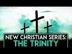

# New Christian Series 2: The Trinity (2021-11-29)

## Description

You Can Support My Work on Patreon:
https://www.patreon.com/Bloggingtheology

My Paypal Link: 
https://www.paypal.com/paypalme/bloggingtheology?locale.x=en_GB

Follow me on Instagram:
https://www.instagram.com/bloggingtheology1

Follow me on TikTok:
https://www.tiktok.com/@bloggingtheology?lang=en

Follow me on Twitter:
https://twitter.com/freemonotheist

## Summary of [New Christian Series 2: The Trinity](https://www.youtube.com/watch?v=DZ5aLzm6tMw)

*This summary is AI generated - there may be inaccuracies. *

### [00:00:00](https://www.youtube.com/watch?v=DZ5aLzm6tMw&t=0) - [00:45:00](https://www.youtube.com/watch?v=DZ5aLzm6tMw&t=2700)

 discusses the doctrine of the Trinity, how it has been understood throughout history, and how it is relevant to contemporary Christian faith. It features a variety of authors with different perspectives on the doctrine.

**[00:00:00](https://www.youtube.com/watch?v=DZ5aLzm6tMw&t=0)** Alistair McGrath discusses the doctrine of the Trinity in a textbook used in many university courses. He discusses the difficulty of understanding the doctrine and how it is not contradictory. Jefferson declared the doctrine of the Trinity to be a hindrance to religious growth.
* **[00:05:00](https://www.youtube.com/watch?v=DZ5aLzm6tMw&t=300)* Discusses how human language finds itself pressed to its limits when trying to describe the divine, and how Christianity understands both divine and human natures in such a way that if it is right, we are unable to grasp the full reality of god. He argues that this is why believers often find the concept of god in the trinity incoherent or inconsistent or self-contradictory.
* **[00:10:00](https://www.youtube.com/watch?v=DZ5aLzm6tMw&t=600)** The Trinity is a doctrine of God found in the Bible, but it wasn't originally revealed to the early church. Emil Brunner, a Protestant theologian, argued that the Trinity was designed to safeguard the rich christian understanding of God from well-meaning attempts to reduce or simplify it. The Trinity itself wasn't revealed in the Bible, but was the result of serious reflection on what was implied by the biblical proclamation in Greek. Traditional Christian theology has been well aware of its limits and has sought to avoid excessively confident affirmations in the face of mystery, yet has never seen itself as totally reduced to silence in the face of divine mysteries. There is a great deal of hesitation and uncertainty when theologians speak of God, and Christian theology is confronted with something so great that it can't be fully comprehended and so must do the best it can with the analytical and descriptive tools at its disposal.
* **[00:15:00](https://www.youtube.com/watch?v=DZ5aLzm6tMw&t=900)** The Trinity is best seen as organically related to the evolution of christology, which is the doctrine of study of christ his nature. A patristic consensus emerged that jesus was of the same substance as god, homo uscios. This led to the development of the doctrine of the divinity of christ. The more emphatic the church became that christ was god, the more it came under pressure to clarify how christ related to god. If the word "capital W" had not been made flesh, there would have been no stumbling block for jewish monotheism. Trinitarianism is ultimately rooted in the christian consciousness due to its baptismal and devotional associations, but these two verses taken together or in isolation cannot be thought of as constituting a doctrine of the Trinity.
* **[00:20:00](https://www.youtube.com/watch?v=DZ5aLzm6tMw&t=1200)**  Dr. John MacArthur argues that the trinity doctrine is found throughout the Old Testament, and that it is implicit in the wisdom literature and the word of God. He also argues that the trinity doctrine is implicit in the messiah prophecies of Isaiah and Ezekiel.
* **[00:25:00](https://www.youtube.com/watch?v=DZ5aLzm6tMw&t=1500)* Discusses doctrine of the Trinity and how it can be seen as incompatible with the faith of Jesus and his disciples. Professor Timothy Winter says it is intrinsically unlikely that Jesus would have voted for the party that became orthodox after his death due to its belief in the Trinity.
* **[00:30:00](https://www.youtube.com/watch?v=DZ5aLzm6tMw&t=1800)**  Tim Winter argues that the doctrine of the Trinity is not original to Christianity, and that it was introduced by the later, Roman-controlled church in order to control the movement. He also quotes a bishop from England who warns against presumptuous attempts to return to the beliefs of Jesus and his apostles.
* **[00:35:00](https://www.youtube.com/watch?v=DZ5aLzm6tMw&t=2100)* Discusses how the belief in the Trinity is simultaneously important and obscure, and how it is a cause for scandal to unbelievers. It references research that suggests most Christians are polytheists in practice.
* **[00:40:00](https://www.youtube.com/watch?v=DZ5aLzm6tMw&t=2400)* Discusses decline of trinitarian language in popular worship, attributing this to a lack of understanding of the doctrine. He also argues that the doctrine has contributed to the wider crisis of faith experienced in the western world.
* **[00:45:00](https://www.youtube.com/watch?v=DZ5aLzm6tMw&t=2700)* Discusses doctrine of the Trinity, and the need for further explanation due to its historical development. It features a variety of authors with alternative perspectives on the doctrine.

<h2>Full transcript with timestamps: CLICK TO EXPAND</h2>

[0:00:01](https://youtu.be/DZ5aLzm6tMw?t=1) this is uh my second video in this new  
[0:00:04](https://youtu.be/DZ5aLzm6tMw?t=4) series on christian theology the last  
[0:00:07](https://youtu.be/DZ5aLzm6tMw?t=7) video was on the holy spirit this one is  
[0:00:10](https://youtu.be/DZ5aLzm6tMw?t=10) on the christian doctrine of the trinity  
[0:00:13](https://youtu.be/DZ5aLzm6tMw?t=13) why do this well i think there's a lot  
[0:00:16](https://youtu.be/DZ5aLzm6tMw?t=16) of perhaps uh crude caricaturing and  
[0:00:18](https://youtu.be/DZ5aLzm6tMw?t=18) straw manning and just misrepresentation  
[0:00:22](https://youtu.be/DZ5aLzm6tMw?t=22) when it comes to key christian doctrines  
[0:00:24](https://youtu.be/DZ5aLzm6tMw?t=24) in the wider world particularly on  
[0:00:25](https://youtu.be/DZ5aLzm6tMw?t=25) social media so i wanted just to  
[0:00:28](https://youtu.be/DZ5aLzm6tMw?t=28) establish using reliable mainstream  
[0:00:31](https://youtu.be/DZ5aLzm6tMw?t=31) academic work  
[0:00:33](https://youtu.be/DZ5aLzm6tMw?t=33) what the doctrines are  
[0:00:35](https://youtu.be/DZ5aLzm6tMw?t=35) and also to complement that with some  
[0:00:38](https://youtu.be/DZ5aLzm6tMw?t=38) comments from islamic and jewish sources  
[0:00:40](https://youtu.be/DZ5aLzm6tMw?t=40) on these very same doctrines just to add  
[0:00:43](https://youtu.be/DZ5aLzm6tMw?t=43) an abrahamic interfaith kind of context  
[0:00:46](https://youtu.be/DZ5aLzm6tMw?t=46) for our uh discussion and of course we  
[0:00:49](https://youtu.be/DZ5aLzm6tMw?t=49) can go and make our own minds up as well  
[0:00:52](https://youtu.be/DZ5aLzm6tMw?t=52) so for this series i'm going to be  
[0:00:53](https://youtu.be/DZ5aLzm6tMw?t=53) drawing mainly on this book christian  
[0:00:55](https://youtu.be/DZ5aLzm6tMw?t=55) theology and introduction by professor  
[0:00:58](https://youtu.be/DZ5aLzm6tMw?t=58) alistair mcgrath he's a professor at  
[0:01:00](https://youtu.be/DZ5aLzm6tMw?t=60) oxford he's one of the world's leading  
[0:01:02](https://youtu.be/DZ5aLzm6tMw?t=62) protestant theologians he's fairly  
[0:01:04](https://youtu.be/DZ5aLzm6tMw?t=64) evangelical this textbook is used in  
[0:01:07](https://youtu.be/DZ5aLzm6tMw?t=67) many university courses throughout the  
[0:01:09](https://youtu.be/DZ5aLzm6tMw?t=69) world and i would say it's probably  
[0:01:11](https://youtu.be/DZ5aLzm6tMw?t=71) underground first year undergraduate  
[0:01:13](https://youtu.be/DZ5aLzm6tMw?t=73) level so it is a little bit demanding  
[0:01:15](https://youtu.be/DZ5aLzm6tMw?t=75) but it is meant to clarify and introduce  
[0:01:17](https://youtu.be/DZ5aLzm6tMw?t=77) the subject in an objective way and i  
[0:01:19](https://youtu.be/DZ5aLzm6tMw?t=79) think he does that although his bias as  
[0:01:21](https://youtu.be/DZ5aLzm6tMw?t=81) a christian is evident  
[0:01:23](https://youtu.be/DZ5aLzm6tMw?t=83) um as i read it i'm going to pepper it  
[0:01:25](https://youtu.be/DZ5aLzm6tMw?t=85) here and there with a few comments uh  
[0:01:27](https://youtu.be/DZ5aLzm6tMw?t=87) hopefully of a clarificatory nature  
[0:01:30](https://youtu.be/DZ5aLzm6tMw?t=90) where perhaps he's not as clear as he  
[0:01:32](https://youtu.be/DZ5aLzm6tMw?t=92) might be  
[0:01:33](https://youtu.be/DZ5aLzm6tMw?t=93) so i'm going to start with chapter 13  
[0:01:35](https://youtu.be/DZ5aLzm6tMw?t=95) entitled the trinity before i go on to a  
[0:01:38](https://youtu.be/DZ5aLzm6tMw?t=98) muslim  
[0:01:39](https://youtu.be/DZ5aLzm6tMw?t=99) reflection on the same subject by a  
[0:01:41](https://youtu.be/DZ5aLzm6tMw?t=101) cambridge professor  
[0:01:43](https://youtu.be/DZ5aLzm6tMw?t=103) so alison mcgrath writes  
[0:01:46](https://youtu.be/DZ5aLzm6tMw?t=106) the doctrine of the trinity is widely  
[0:01:49](https://youtu.be/DZ5aLzm6tMw?t=109) regarded as one of the most difficult  
[0:01:51](https://youtu.be/DZ5aLzm6tMw?t=111) aspects of christian theology many who  
[0:01:54](https://youtu.be/DZ5aLzm6tMw?t=114) are new to the study of theology find  
[0:01:56](https://youtu.be/DZ5aLzm6tMw?t=116) the doctrine perplexing not just those  
[0:01:59](https://youtu.be/DZ5aLzm6tMw?t=119) who are new by the way  
[0:02:01](https://youtu.be/DZ5aLzm6tMw?t=121) this subject sets out to introduce this  
[0:02:03](https://youtu.be/DZ5aLzm6tMw?t=123) tricky yet immensely important doctrine  
[0:02:07](https://youtu.be/DZ5aLzm6tMw?t=127) explaining carefully why it is such a  
[0:02:09](https://youtu.be/DZ5aLzm6tMw?t=129) fundamental aspect of the christian  
[0:02:12](https://youtu.be/DZ5aLzm6tMw?t=132) vision of god and i would say here yes  
[0:02:15](https://youtu.be/DZ5aLzm6tMw?t=135) this is important to establish what  
[0:02:17](https://youtu.be/DZ5aLzm6tMw?t=137) christians actually mainstream  
[0:02:18](https://youtu.be/DZ5aLzm6tMw?t=138) christians actually do believe about  
[0:02:20](https://youtu.be/DZ5aLzm6tMw?t=140) this doctrine  
[0:02:21](https://youtu.be/DZ5aLzm6tMw?t=141) rather than crude caricatures or straw  
[0:02:25](https://youtu.be/DZ5aLzm6tMw?t=145) men which are so often found  
[0:02:27](https://youtu.be/DZ5aLzm6tMw?t=147) he continues  
[0:02:28](https://youtu.be/DZ5aLzm6tMw?t=148) because of the difficulty of the idea we  
[0:02:31](https://youtu.be/DZ5aLzm6tMw?t=151) will spend more time examining its  
[0:02:33](https://youtu.be/DZ5aLzm6tMw?t=153) foundations and origins than normal by  
[0:02:36](https://youtu.be/DZ5aLzm6tMw?t=156) the end of this discussion you will  
[0:02:38](https://youtu.be/DZ5aLzm6tMw?t=158) hopefully feel more confident about this  
[0:02:40](https://youtu.be/DZ5aLzm6tMw?t=160) doctrine in terms of understanding both  
[0:02:42](https://youtu.be/DZ5aLzm6tMw?t=162) the reasons why christians believe it  
[0:02:45](https://youtu.be/DZ5aLzm6tMw?t=165) and the various ways they have developed  
[0:02:47](https://youtu.be/DZ5aLzm6tMw?t=167) of explaining it and i think mcgrath  
[0:02:49](https://youtu.be/DZ5aLzm6tMw?t=169) does a good job doing this but this is  
[0:02:51](https://youtu.be/DZ5aLzm6tMw?t=171) actually quite a substantial chapter so  
[0:02:53](https://youtu.be/DZ5aLzm6tMw?t=173) i'm going to hopefully do two videos the  
[0:02:56](https://youtu.be/DZ5aLzm6tMw?t=176) first one the introductory material and  
[0:02:58](https://youtu.be/DZ5aLzm6tMw?t=178) then a second video which takes us into  
[0:03:00](https://youtu.be/DZ5aLzm6tMw?t=180) deeper waters into the technical  
[0:03:02](https://youtu.be/DZ5aLzm6tMw?t=182) vocabulary and the historical  
[0:03:04](https://youtu.be/DZ5aLzm6tMw?t=184) development of the doctrine which are  
[0:03:06](https://youtu.be/DZ5aLzm6tMw?t=186) equally important in my view  
[0:03:08](https://youtu.be/DZ5aLzm6tMw?t=188) so alistair mcgrath says approaching the  
[0:03:10](https://youtu.be/DZ5aLzm6tMw?t=190) christian doctrine of the trinity  
[0:03:13](https://youtu.be/DZ5aLzm6tMw?t=193) a number of readers will uh approach  
[0:03:16](https://youtu.be/DZ5aLzm6tMw?t=196) this chapter with some hesitations  
[0:03:19](https://youtu.be/DZ5aLzm6tMw?t=199) mainly many of which may reflect  
[0:03:21](https://youtu.be/DZ5aLzm6tMw?t=201) anxieties about the subject's apparent  
[0:03:24](https://youtu.be/DZ5aLzm6tMw?t=204) irrationality  
[0:03:26](https://youtu.be/DZ5aLzm6tMw?t=206) how did the christian church come to  
[0:03:28](https://youtu.be/DZ5aLzm6tMw?t=208) regard such a counter-intuitive notion  
[0:03:31](https://youtu.be/DZ5aLzm6tMw?t=211) as the trinity as fundamental to its  
[0:03:34](https://youtu.be/DZ5aLzm6tMw?t=214) vision of god so mcgrath he was  
[0:03:36](https://youtu.be/DZ5aLzm6tMw?t=216) acknowledging  
[0:03:38](https://youtu.be/DZ5aLzm6tMw?t=218) that people find it counterintuitive in  
[0:03:40](https://youtu.be/DZ5aLzm6tMw?t=220) other words incoherent or  
[0:03:41](https://youtu.be/DZ5aLzm6tMw?t=221) self-contradictory but you know how is  
[0:03:44](https://youtu.be/DZ5aLzm6tMw?t=224) this the case and is it really  
[0:03:45](https://youtu.be/DZ5aLzm6tMw?t=225) contradictory he will argue that it's  
[0:03:47](https://youtu.be/DZ5aLzm6tMw?t=227) not  
[0:03:48](https://youtu.be/DZ5aLzm6tMw?t=228) we may begin by considering some  
[0:03:50](https://youtu.be/DZ5aLzm6tMw?t=230) expressions of anxiety about the  
[0:03:52](https://youtu.be/DZ5aLzm6tMw?t=232) doctrine and then move on to consider  
[0:03:55](https://youtu.be/DZ5aLzm6tMw?t=235) how these can be met  
[0:03:58](https://youtu.be/DZ5aLzm6tMw?t=238) and then the subheading the apparent  
[0:04:00](https://youtu.be/DZ5aLzm6tMw?t=240) illogicality of the doctrine notice the  
[0:04:03](https://youtu.be/DZ5aLzm6tMw?t=243) apparent illogicalities he's saying is  
[0:04:05](https://youtu.be/DZ5aLzm6tMw?t=245) not illogical  
[0:04:07](https://youtu.be/DZ5aLzm6tMw?t=247) thomas jefferson died in 1826 the third  
[0:04:11](https://youtu.be/DZ5aLzm6tMw?t=251) president of the united states was one  
[0:04:13](https://youtu.be/DZ5aLzm6tMw?t=253) of the leading critics of author  
[0:04:15](https://youtu.be/DZ5aLzm6tMw?t=255) orthodox christian theology in the early  
[0:04:18](https://youtu.be/DZ5aLzm6tMw?t=258) 19th century  
[0:04:20](https://youtu.be/DZ5aLzm6tMw?t=260) he reserved most of his ferocious  
[0:04:23](https://youtu.be/DZ5aLzm6tMw?t=263) criticisms for the doctrine of the  
[0:04:25](https://youtu.be/DZ5aLzm6tMw?t=265) trinity  
[0:04:26](https://youtu.be/DZ5aLzm6tMw?t=266) these mystical insanities sorry  
[0:04:29](https://youtu.be/DZ5aLzm6tMw?t=269) metaphysical insanities  
[0:04:31](https://youtu.be/DZ5aLzm6tMw?t=271) he declared hindered the religious  
[0:04:33](https://youtu.be/DZ5aLzm6tMw?t=273) growth of humanity in that they  
[0:04:36](https://youtu.be/DZ5aLzm6tMw?t=276) represented quote relapses into paganism  
[0:04:40](https://youtu.be/DZ5aLzm6tMw?t=280) differing from paganism only by being  
[0:04:42](https://youtu.be/DZ5aLzm6tMw?t=282) more unintelligible  
[0:04:44](https://youtu.be/DZ5aLzm6tMw?t=284) unquote  
[0:04:45](https://youtu.be/DZ5aLzm6tMw?t=285) so why has christianity persistently  
[0:04:48](https://youtu.be/DZ5aLzm6tMw?t=288) upheld such a doctrine  
[0:04:51](https://youtu.be/DZ5aLzm6tMw?t=291) the fundamental issue here is the  
[0:04:53](https://youtu.be/DZ5aLzm6tMw?t=293) inability of human language to do  
[0:04:55](https://youtu.be/DZ5aLzm6tMw?t=295) justice to the transcendent by the  
[0:04:58](https://youtu.be/DZ5aLzm6tMw?t=298) transcendent he means the divine he  
[0:05:01](https://youtu.be/DZ5aLzm6tMw?t=301) means god basically so human language  
[0:05:03](https://youtu.be/DZ5aLzm6tMw?t=303) can't  
[0:05:04](https://youtu.be/DZ5aLzm6tMw?t=304) accurately uh and fully describe god  
[0:05:07](https://youtu.be/DZ5aLzm6tMw?t=307) mcgrath claims  
[0:05:09](https://youtu.be/DZ5aLzm6tMw?t=309) human language finds itself pressed to  
[0:05:12](https://youtu.be/DZ5aLzm6tMw?t=312) its limits when trying to depict and  
[0:05:14](https://youtu.be/DZ5aLzm6tMw?t=314) describe the divine  
[0:05:17](https://youtu.be/DZ5aLzm6tMw?t=317) words and images are borrowed from  
[0:05:19](https://youtu.be/DZ5aLzm6tMw?t=319) everyday life and put to new uses in  
[0:05:22](https://youtu.be/DZ5aLzm6tMw?t=322) attempts to capture and preserve  
[0:05:25](https://youtu.be/DZ5aLzm6tMw?t=325) precious thoughts into the nature of god  
[0:05:29](https://youtu.be/DZ5aLzm6tMw?t=329) the christian understanding of both  
[0:05:31](https://youtu.be/DZ5aLzm6tMw?t=331) divine and human natures is such that if  
[0:05:35](https://youtu.be/DZ5aLzm6tMw?t=335) it is right  
[0:05:36](https://youtu.be/DZ5aLzm6tMw?t=336) we are unable to grasp the full reality  
[0:05:39](https://youtu.be/DZ5aLzm6tMw?t=339) of god  
[0:05:41](https://youtu.be/DZ5aLzm6tMw?t=341) can a human mind ever hope to comprehend  
[0:05:44](https://youtu.be/DZ5aLzm6tMw?t=344) something which must ultimately lie  
[0:05:47](https://youtu.be/DZ5aLzm6tMw?t=347) beyond its ability to unfold  
[0:05:50](https://youtu.be/DZ5aLzm6tMw?t=350) when i began my study  
[0:05:53](https://youtu.be/DZ5aLzm6tMw?t=353) of theology at oxford back in the 1970s  
[0:05:56](https://youtu.be/DZ5aLzm6tMw?t=356) mcgrath writes  
[0:05:57](https://youtu.be/DZ5aLzm6tMw?t=357) i was taught early medieval theology by  
[0:06:00](https://youtu.be/DZ5aLzm6tMw?t=360) edward j  
[0:06:02](https://youtu.be/DZ5aLzm6tMw?t=362) arnold he died in 2002 a jesuit scholar  
[0:06:06](https://youtu.be/DZ5aLzm6tMw?t=366) at campion hall  
[0:06:08](https://youtu.be/DZ5aLzm6tMw?t=368) as we walked to his room together we  
[0:06:10](https://youtu.be/DZ5aLzm6tMw?t=370) passed a large painting depicting an old  
[0:06:13](https://youtu.be/DZ5aLzm6tMw?t=373) man in conversation with a young boy by  
[0:06:16](https://youtu.be/DZ5aLzm6tMw?t=376) the seashore  
[0:06:18](https://youtu.be/DZ5aLzm6tMw?t=378) what was it i asked  
[0:06:20](https://youtu.be/DZ5aLzm6tMw?t=380) and so i was told the famous story about  
[0:06:23](https://youtu.be/DZ5aLzm6tMw?t=383) augustine of hippo he died in 430 a.d  
[0:06:27](https://youtu.be/DZ5aLzm6tMw?t=387) who was particularly noted for his  
[0:06:29](https://youtu.be/DZ5aLzm6tMw?t=389) massive treaties on the trinity  
[0:06:32](https://youtu.be/DZ5aLzm6tMw?t=392) dealing with the mystery of god  
[0:06:35](https://youtu.be/DZ5aLzm6tMw?t=395) perhaps in the midst of composing these  
[0:06:37](https://youtu.be/DZ5aLzm6tMw?t=397) treaties i was told augustine found  
[0:06:40](https://youtu.be/DZ5aLzm6tMw?t=400) himself pacing the mediterranean  
[0:06:43](https://youtu.be/DZ5aLzm6tMw?t=403) shoreline of his native north africa not  
[0:06:46](https://youtu.be/DZ5aLzm6tMw?t=406) far from the great city of carthage  
[0:06:49](https://youtu.be/DZ5aLzm6tMw?t=409) while wandering across the sand he  
[0:06:51](https://youtu.be/DZ5aLzm6tMw?t=411) noticed a small boy scooping water  
[0:06:54](https://youtu.be/DZ5aLzm6tMw?t=414) seawater into his hands and pouring as  
[0:06:57](https://youtu.be/DZ5aLzm6tMw?t=417) much as he could hold into a hole in the  
[0:07:00](https://youtu.be/DZ5aLzm6tMw?t=420) sand puzzled augustine watched as this  
[0:07:04](https://youtu.be/DZ5aLzm6tMw?t=424) action was repeated again and again  
[0:07:08](https://youtu.be/DZ5aLzm6tMw?t=428) eventually his curiosity got the better  
[0:07:10](https://youtu.be/DZ5aLzm6tMw?t=430) of him  
[0:07:11](https://youtu.be/DZ5aLzm6tMw?t=431) what he asked the boy did he think he  
[0:07:13](https://youtu.be/DZ5aLzm6tMw?t=433) was doing  
[0:07:15](https://youtu.be/DZ5aLzm6tMw?t=435) the reply probably perplexed augustine  
[0:07:17](https://youtu.be/DZ5aLzm6tMw?t=437) still further the youth told him that he  
[0:07:19](https://youtu.be/DZ5aLzm6tMw?t=439) was busy emptying the in the ocean into  
[0:07:22](https://youtu.be/DZ5aLzm6tMw?t=442) the small cavity he had scooped out in  
[0:07:25](https://youtu.be/DZ5aLzm6tMw?t=445) the hot sand  
[0:07:27](https://youtu.be/DZ5aLzm6tMw?t=447) augustine was dismissive how could such  
[0:07:30](https://youtu.be/DZ5aLzm6tMw?t=450) a vast body of water be contained in  
[0:07:33](https://youtu.be/DZ5aLzm6tMw?t=453) such a small hole  
[0:07:35](https://youtu.be/DZ5aLzm6tMw?t=455) the boy was equally dismissive in return  
[0:07:39](https://youtu.be/DZ5aLzm6tMw?t=459) how could augustine expect to contain  
[0:07:42](https://youtu.be/DZ5aLzm6tMw?t=462) the vast mystery of god in the mere  
[0:07:45](https://youtu.be/DZ5aLzm6tMw?t=465) words of a book  
[0:07:48](https://youtu.be/DZ5aLzm6tMw?t=468) the story illustrates one of the great  
[0:07:50](https://youtu.be/DZ5aLzm6tMw?t=470) central themes of christian theology and  
[0:07:53](https://youtu.be/DZ5aLzm6tMw?t=473) spirituality alike that there are limits  
[0:07:56](https://youtu.be/DZ5aLzm6tMw?t=476) placed upon the human ability to grasp  
[0:07:59](https://youtu.be/DZ5aLzm6tMw?t=479) the things of god  
[0:08:01](https://youtu.be/DZ5aLzm6tMw?t=481) our knowledge of god is accumulated  
[0:08:03](https://youtu.be/DZ5aLzm6tMw?t=483) sorry is accommodated to our capacity  
[0:08:06](https://youtu.be/DZ5aLzm6tMw?t=486) our knowledge of god is accommodated to  
[0:08:09](https://youtu.be/DZ5aLzm6tMw?t=489) our capacity as writers from augustine  
[0:08:12](https://youtu.be/DZ5aLzm6tMw?t=492) to calvin have argued  
[0:08:14](https://youtu.be/DZ5aLzm6tMw?t=494) god knows the limitations placed upon  
[0:08:17](https://youtu.be/DZ5aLzm6tMw?t=497) human nature which after all is a divine  
[0:08:20](https://youtu.be/DZ5aLzm6tMw?t=500) creation  
[0:08:21](https://youtu.be/DZ5aLzm6tMw?t=501) god therefore both discloses divine  
[0:08:24](https://youtu.be/DZ5aLzm6tMw?t=504) truths and enters into our world in  
[0:08:28](https://youtu.be/DZ5aLzm6tMw?t=508) forms that are tempered and adapted to  
[0:08:31](https://youtu.be/DZ5aLzm6tMw?t=511) our limited capabilities and  
[0:08:34](https://youtu.be/DZ5aLzm6tMw?t=514) competencies  
[0:08:36](https://youtu.be/DZ5aLzm6tMw?t=516) for augustine the point was simple  
[0:08:39](https://youtu.be/DZ5aLzm6tMw?t=519) si comprehendes non este deus  
[0:08:42](https://youtu.be/DZ5aLzm6tMw?t=522) that's latin a loose translation is if  
[0:08:45](https://youtu.be/DZ5aLzm6tMw?t=525) you can get your mind around it it's not  
[0:08:48](https://youtu.be/DZ5aLzm6tMw?t=528) god  
[0:08:49](https://youtu.be/DZ5aLzm6tMw?t=529) it's a great little uh maximum  
[0:08:51](https://youtu.be/DZ5aLzm6tMw?t=531) he didn't mean that belief in god was  
[0:08:53](https://youtu.be/DZ5aLzm6tMw?t=533) contrary to reason rather reason was too  
[0:08:56](https://youtu.be/DZ5aLzm6tMw?t=536) limited to grasp the fullness of the  
[0:08:58](https://youtu.be/DZ5aLzm6tMw?t=538) majesty and glory of god  
[0:09:02](https://youtu.be/DZ5aLzm6tMw?t=542) our thoughts about god are bound to seem  
[0:09:04](https://youtu.be/DZ5aLzm6tMw?t=544) illogical and muddled precisely because  
[0:09:08](https://youtu.be/DZ5aLzm6tMw?t=548) what they refer to  
[0:09:10](https://youtu.be/DZ5aLzm6tMw?t=550) lies beyond our full knowledge and  
[0:09:12](https://youtu.be/DZ5aLzm6tMw?t=552) understanding  
[0:09:14](https://youtu.be/DZ5aLzm6tMw?t=554) for augustine any attempt to reduce god  
[0:09:17](https://youtu.be/DZ5aLzm6tMw?t=557) to the intellectually manageable  
[0:09:19](https://youtu.be/DZ5aLzm6tMw?t=559) distorts god  
[0:09:21](https://youtu.be/DZ5aLzm6tMw?t=561) we need to open up our minds to the  
[0:09:24](https://youtu.be/DZ5aLzm6tMw?t=564) greatness of god rather than did you  
[0:09:26](https://youtu.be/DZ5aLzm6tMw?t=566) reduce god to something that we can cope  
[0:09:29](https://youtu.be/DZ5aLzm6tMw?t=569) with  
[0:09:30](https://youtu.be/DZ5aLzm6tMw?t=570) so it seems here that mcgrath is setting  
[0:09:32](https://youtu.be/DZ5aLzm6tMw?t=572) up the reader to expect  
[0:09:34](https://youtu.be/DZ5aLzm6tMw?t=574) due to our limitations human limitations  
[0:09:37](https://youtu.be/DZ5aLzm6tMw?t=577) in our language of god that we should  
[0:09:39](https://youtu.be/DZ5aLzm6tMw?t=579) expect perhaps to find uh the concept of  
[0:09:42](https://youtu.be/DZ5aLzm6tMw?t=582) god in the trinity apparently incoherent  
[0:09:44](https://youtu.be/DZ5aLzm6tMw?t=584) or inconsistent or self-contradictory we  
[0:09:46](https://youtu.be/DZ5aLzm6tMw?t=586) should expect to see that kind of um  
[0:09:50](https://youtu.be/DZ5aLzm6tMw?t=590) bewilderment given the otherness and  
[0:09:52](https://youtu.be/DZ5aLzm6tMw?t=592) majesty and greatness of god so this is  
[0:09:53](https://youtu.be/DZ5aLzm6tMw?t=593) a almost an apologetic setup i would  
[0:09:56](https://youtu.be/DZ5aLzm6tMw?t=596) suggest here  
[0:09:57](https://youtu.be/DZ5aLzm6tMw?t=597) leading us into the acceptance of the  
[0:10:00](https://youtu.be/DZ5aLzm6tMw?t=600) doctrine of the of the trinity but  
[0:10:02](https://youtu.be/DZ5aLzm6tMw?t=602) anyway i anticipate he goes on the swiss  
[0:10:05](https://youtu.be/DZ5aLzm6tMw?t=605) protestant theologian emil brunner who  
[0:10:08](https://youtu.be/DZ5aLzm6tMw?t=608) died in 96 1966  
[0:10:10](https://youtu.be/DZ5aLzm6tMw?t=610) took a similar view arguing that the  
[0:10:13](https://youtu.be/DZ5aLzm6tMw?t=613) trinity was really quote a protective  
[0:10:16](https://youtu.be/DZ5aLzm6tMw?t=616) doctrine  
[0:10:17](https://youtu.be/DZ5aLzm6tMw?t=617) designed to safeguard the rich christian  
[0:10:20](https://youtu.be/DZ5aLzm6tMw?t=620) understanding of god from well-meaning  
[0:10:23](https://youtu.be/DZ5aLzm6tMw?t=623) attempts to reduce or simplify it  
[0:10:26](https://youtu.be/DZ5aLzm6tMw?t=626) the trinity was not itself revealed in  
[0:10:29](https://youtu.be/DZ5aLzm6tMw?t=629) the bible so this is incredible crucial  
[0:10:31](https://youtu.be/DZ5aLzm6tMw?t=631) point here the trinity itself bruno  
[0:10:34](https://youtu.be/DZ5aLzm6tMw?t=634) admits and mcgrath goes on to admit as  
[0:10:36](https://youtu.be/DZ5aLzm6tMw?t=636) well is not actually taught in the bible  
[0:10:40](https://youtu.be/DZ5aLzm6tMw?t=640) the trinity was itself  
[0:10:42](https://youtu.be/DZ5aLzm6tMw?t=642) not uh revealed in the bible but was the  
[0:10:45](https://youtu.be/DZ5aLzm6tMw?t=645) result of serious reflection on what was  
[0:10:48](https://youtu.be/DZ5aLzm6tMw?t=648) implied by the biblical proclamation in  
[0:10:51](https://youtu.be/DZ5aLzm6tMw?t=651) greek kerygma kerygma is a bit of  
[0:10:54](https://youtu.be/DZ5aLzm6tMw?t=654) academic jargon uh scholars talk about  
[0:10:56](https://youtu.be/DZ5aLzm6tMw?t=656) the kerygma of the early church the  
[0:10:58](https://youtu.be/DZ5aLzm6tMw?t=658) preaching of the early church the  
[0:11:00](https://youtu.be/DZ5aLzm6tMw?t=660) proclamation  
[0:11:02](https://youtu.be/DZ5aLzm6tMw?t=662) and then mcgrath quotes emil brunner  
[0:11:05](https://youtu.be/DZ5aLzm6tMw?t=665) here  
[0:11:06](https://youtu.be/DZ5aLzm6tMw?t=666) the doctrine of the trinity is the  
[0:11:08](https://youtu.be/DZ5aLzm6tMw?t=668) product of reflection and is not the  
[0:11:11](https://youtu.be/DZ5aLzm6tMw?t=671) kerygma so this is not the teaching of  
[0:11:13](https://youtu.be/DZ5aLzm6tMw?t=673) the early church the kerygma  
[0:11:15](https://youtu.be/DZ5aLzm6tMw?t=675) is god revealed in christ  
[0:11:18](https://youtu.be/DZ5aLzm6tMw?t=678) christ the genuine revelation of god  
[0:11:21](https://youtu.be/DZ5aLzm6tMw?t=681) the doctrine of the trinity however is  
[0:11:24](https://youtu.be/DZ5aLzm6tMw?t=684) not itself biblical  
[0:11:27](https://youtu.be/DZ5aLzm6tMw?t=687) but is the result of theological  
[0:11:30](https://youtu.be/DZ5aLzm6tMw?t=690) reflection upon the problem that is  
[0:11:33](https://youtu.be/DZ5aLzm6tMw?t=693) necessarily raised by the christian  
[0:11:35](https://youtu.be/DZ5aLzm6tMw?t=695) kerygma  
[0:11:37](https://youtu.be/DZ5aLzm6tMw?t=697) end quote  
[0:11:39](https://youtu.be/DZ5aLzm6tMw?t=699) mcgrath continues traditionally  
[0:11:40](https://youtu.be/DZ5aLzm6tMw?t=700) christian theology has been well aware  
[0:11:43](https://youtu.be/DZ5aLzm6tMw?t=703) of its limits and has sought to avoid  
[0:11:46](https://youtu.be/DZ5aLzm6tMw?t=706) excessively confident affirmations in  
[0:11:48](https://youtu.be/DZ5aLzm6tMw?t=708) the face of mystery yet at the same time  
[0:11:53](https://youtu.be/DZ5aLzm6tMw?t=713) christian theology has never seen itself  
[0:11:55](https://youtu.be/DZ5aLzm6tMw?t=715) as totally reduced to silence in the  
[0:11:58](https://youtu.be/DZ5aLzm6tMw?t=718) face of divine mysteries  
[0:12:01](https://youtu.be/DZ5aLzm6tMw?t=721) nor has it prohibited intellectual  
[0:12:03](https://youtu.be/DZ5aLzm6tMw?t=723) wrestling with mysteries that might be  
[0:12:06](https://youtu.be/DZ5aLzm6tMw?t=726) destructive or detrimental to faith and  
[0:12:08](https://youtu.be/DZ5aLzm6tMw?t=728) here by the way this concept of mystery  
[0:12:10](https://youtu.be/DZ5aLzm6tMw?t=730) i hear this all the time myself it's  
[0:12:12](https://youtu.be/DZ5aLzm6tMw?t=732) very important when you come up against  
[0:12:13](https://youtu.be/DZ5aLzm6tMw?t=733) doctrine of trinity  
[0:12:15](https://youtu.be/DZ5aLzm6tMw?t=735) sooner or later this word is invoked  
[0:12:17](https://youtu.be/DZ5aLzm6tMw?t=737) it's a mystery and i don't mean that in  
[0:12:19](https://youtu.be/DZ5aLzm6tMw?t=739) a polemical way i'm just this  
[0:12:21](https://youtu.be/DZ5aLzm6tMw?t=741) observationist description of what i see  
[0:12:23](https://youtu.be/DZ5aLzm6tMw?t=743) all the time mystery is a key word in  
[0:12:26](https://youtu.be/DZ5aLzm6tMw?t=746) understanding our approach to the  
[0:12:28](https://youtu.be/DZ5aLzm6tMw?t=748) doctrine  
[0:12:29](https://youtu.be/DZ5aLzm6tMw?t=749) and then he says as the 19th century  
[0:12:31](https://youtu.be/DZ5aLzm6tMw?t=751) anglican theologian charles gore  
[0:12:34](https://youtu.be/DZ5aLzm6tMw?t=754) insisted and he quotes gore now  
[0:12:37](https://youtu.be/DZ5aLzm6tMw?t=757) human language never can express  
[0:12:40](https://youtu.be/DZ5aLzm6tMw?t=760) adequately divine realities  
[0:12:42](https://youtu.be/DZ5aLzm6tMw?t=762) a constant tendency to apologize for  
[0:12:45](https://youtu.be/DZ5aLzm6tMw?t=765) human speech a great element of  
[0:12:47](https://youtu.be/DZ5aLzm6tMw?t=767) agnosticism and awful sense of unfathom  
[0:12:51](https://youtu.be/DZ5aLzm6tMw?t=771) unfathomed depths beyond the little that  
[0:12:54](https://youtu.be/DZ5aLzm6tMw?t=774) is made known  
[0:12:56](https://youtu.be/DZ5aLzm6tMw?t=776) is always present to the minds of  
[0:12:58](https://youtu.be/DZ5aLzm6tMw?t=778) theologians who know what they are about  
[0:13:01](https://youtu.be/DZ5aLzm6tMw?t=781) in conceiving or expressing god in other  
[0:13:05](https://youtu.be/DZ5aLzm6tMw?t=785) words there's a great deal of hesitancy  
[0:13:06](https://youtu.be/DZ5aLzm6tMw?t=786) and uncertainty almost agnosticism  
[0:13:10](https://youtu.be/DZ5aLzm6tMw?t=790) when theologians speak of god christian  
[0:13:12](https://youtu.be/DZ5aLzm6tMw?t=792) theologians speak of god  
[0:13:14](https://youtu.be/DZ5aLzm6tMw?t=794) we see says saint paul in a mirror in  
[0:13:17](https://youtu.be/DZ5aLzm6tMw?t=797) terms of a riddle we know in part  
[0:13:22](https://youtu.be/DZ5aLzm6tMw?t=802) that's another quote from paul  
[0:13:24](https://youtu.be/DZ5aLzm6tMw?t=804) we are compelled complains saint hillary  
[0:13:27](https://youtu.be/DZ5aLzm6tMw?t=807) to attempt what is unattainable to climb  
[0:13:31](https://youtu.be/DZ5aLzm6tMw?t=811) where we cannot reach to speak what we  
[0:13:34](https://youtu.be/DZ5aLzm6tMw?t=814) cannot utter  
[0:13:36](https://youtu.be/DZ5aLzm6tMw?t=816) instead of the mere adoration of faith  
[0:13:38](https://youtu.be/DZ5aLzm6tMw?t=818) we are compelled to entrust  
[0:13:41](https://youtu.be/DZ5aLzm6tMw?t=821) the deep things of religion to the  
[0:13:44](https://youtu.be/DZ5aLzm6tMw?t=824) perils of human expression  
[0:13:47](https://youtu.be/DZ5aLzm6tMw?t=827) so instead of just a merely adoring god  
[0:13:50](https://youtu.be/DZ5aLzm6tMw?t=830) we are we must  
[0:13:52](https://youtu.be/DZ5aLzm6tMw?t=832) entrust the deep things of religion to  
[0:13:54](https://youtu.be/DZ5aLzm6tMw?t=834) the perils of human expression we can't  
[0:13:57](https://youtu.be/DZ5aLzm6tMw?t=837) help but use language inadequately and  
[0:14:00](https://youtu.be/DZ5aLzm6tMw?t=840) it's a perilous business when speaking  
[0:14:02](https://youtu.be/DZ5aLzm6tMw?t=842) of god it's a mystery  
[0:14:03](https://youtu.be/DZ5aLzm6tMw?t=843) and uh  
[0:14:05](https://youtu.be/DZ5aLzm6tMw?t=845) we're attempting to speak of what is  
[0:14:06](https://youtu.be/DZ5aLzm6tMw?t=846) unspeakable here's me paraphrasing what  
[0:14:09](https://youtu.be/DZ5aLzm6tMw?t=849) i think is being said here  
[0:14:11](https://youtu.be/DZ5aLzm6tMw?t=851) alison mcgrath continues a perfectly  
[0:14:13](https://youtu.be/DZ5aLzm6tMw?t=853) good definition of christian theology is  
[0:14:17](https://youtu.be/DZ5aLzm6tMw?t=857) taking rational trouble over a mystery  
[0:14:20](https://youtu.be/DZ5aLzm6tMw?t=860) again this concept of mystery is key  
[0:14:22](https://youtu.be/DZ5aLzm6tMw?t=862) here  
[0:14:23](https://youtu.be/DZ5aLzm6tMw?t=863) recognizing that there may be limits to  
[0:14:25](https://youtu.be/DZ5aLzm6tMw?t=865) what can be achieved but believing that  
[0:14:28](https://youtu.be/DZ5aLzm6tMw?t=868) this intellectual grappling is both  
[0:14:30](https://youtu.be/DZ5aLzm6tMw?t=870) worthwhile and necessary  
[0:14:33](https://youtu.be/DZ5aLzm6tMw?t=873) theology is confronted with something so  
[0:14:35](https://youtu.be/DZ5aLzm6tMw?t=875) great that we cannot fully comprehend it  
[0:14:38](https://youtu.be/DZ5aLzm6tMw?t=878) and so must do the best we can with the  
[0:14:41](https://youtu.be/DZ5aLzm6tMw?t=881) analytical and descriptive tools at our  
[0:14:44](https://youtu.be/DZ5aLzm6tMw?t=884) disposal  
[0:14:46](https://youtu.be/DZ5aLzm6tMw?t=886) and then he continues  
[0:14:48](https://youtu.be/DZ5aLzm6tMw?t=888) trinity the trinity as a statement about  
[0:14:50](https://youtu.be/DZ5aLzm6tMw?t=890) jesus christ  
[0:14:52](https://youtu.be/DZ5aLzm6tMw?t=892) the distinctively christian doctrine of  
[0:14:55](https://youtu.be/DZ5aLzm6tMw?t=895) god took shape in response to a question  
[0:14:58](https://youtu.be/DZ5aLzm6tMw?t=898) about the identity of jesus christ and  
[0:15:01](https://youtu.be/DZ5aLzm6tMw?t=901) this is the origins really  
[0:15:03](https://youtu.be/DZ5aLzm6tMw?t=903) the seed of the doctrine in this section  
[0:15:06](https://youtu.be/DZ5aLzm6tMw?t=906) the development of the doctrine the  
[0:15:07](https://youtu.be/DZ5aLzm6tMw?t=907) trinity is best seen as organically  
[0:15:10](https://youtu.be/DZ5aLzm6tMw?t=910) related to the evolution of christology  
[0:15:14](https://youtu.be/DZ5aLzm6tMw?t=914) christology is the doctrine of study of  
[0:15:16](https://youtu.be/DZ5aLzm6tMw?t=916) christ his nature is being his purpose  
[0:15:20](https://youtu.be/DZ5aLzm6tMw?t=920) as we noted earlier a patristic  
[0:15:23](https://youtu.be/DZ5aLzm6tMw?t=923) consensus emerged patristic means this  
[0:15:25](https://youtu.be/DZ5aLzm6tMw?t=925) is taught by the early fathers of the  
[0:15:27](https://youtu.be/DZ5aLzm6tMw?t=927) church the bishops the theologians of  
[0:15:30](https://youtu.be/DZ5aLzm6tMw?t=930) the early of the first three fourth  
[0:15:31](https://youtu.be/DZ5aLzm6tMw?t=931) centuries of the church  
[0:15:33](https://youtu.be/DZ5aLzm6tMw?t=933) as noted earlier a patristic consensus  
[0:15:36](https://youtu.be/DZ5aLzm6tMw?t=936) emerged  
[0:15:37](https://youtu.be/DZ5aLzm6tMw?t=937) that jesus was quote of the same  
[0:15:40](https://youtu.be/DZ5aLzm6tMw?t=940) substance homo uscios  
[0:15:42](https://youtu.be/DZ5aLzm6tMw?t=942) as god this  
[0:15:44](https://youtu.be/DZ5aLzm6tMw?t=944) mcgrath here is referring to the counts  
[0:15:46](https://youtu.be/DZ5aLzm6tMw?t=946) of nicaea of course in 325  
[0:15:49](https://youtu.be/DZ5aLzm6tMw?t=949) a.d  
[0:15:51](https://youtu.be/DZ5aLzm6tMw?t=951) so he's talking about this consensus  
[0:15:53](https://youtu.be/DZ5aLzm6tMw?t=953) about jesus being of the same substance  
[0:15:55](https://youtu.be/DZ5aLzm6tMw?t=955) as god rather than just being of similar  
[0:15:58](https://youtu.be/DZ5aLzm6tMw?t=958) substance herm or you see us  
[0:16:01](https://youtu.be/DZ5aLzm6tMw?t=961) there's only one letter letter i  
[0:16:04](https://youtu.be/DZ5aLzm6tMw?t=964) difference between homorusios  
[0:16:06](https://youtu.be/DZ5aLzm6tMw?t=966) of the same being or substance  
[0:16:10](https://youtu.be/DZ5aLzm6tMw?t=970) with the i in it there's one letter  
[0:16:12](https://youtu.be/DZ5aLzm6tMw?t=972) added that means of similar substances  
[0:16:14](https://youtu.be/DZ5aLzm6tMw?t=974) not the same but similar  
[0:16:16](https://youtu.be/DZ5aLzm6tMw?t=976) so the church rejected the similar and  
[0:16:20](https://youtu.be/DZ5aLzm6tMw?t=980) opted for the same so jesus is actually  
[0:16:22](https://youtu.be/DZ5aLzm6tMw?t=982) god himself the same being as god  
[0:16:24](https://youtu.be/DZ5aLzm6tMw?t=984) himself  
[0:16:26](https://youtu.be/DZ5aLzm6tMw?t=986) continue  
[0:16:27](https://youtu.be/DZ5aLzm6tMw?t=987) but if jesus was god in any meaningful  
[0:16:30](https://youtu.be/DZ5aLzm6tMw?t=990) sense of the word what did this imply  
[0:16:32](https://youtu.be/DZ5aLzm6tMw?t=992) about existing notions of god because of  
[0:16:34](https://youtu.be/DZ5aLzm6tMw?t=994) course the original christians were jews  
[0:16:36](https://youtu.be/DZ5aLzm6tMw?t=996) they believed in the shema here at  
[0:16:38](https://youtu.be/DZ5aLzm6tMw?t=998) israel the lord our god is one  
[0:16:41](https://youtu.be/DZ5aLzm6tMw?t=1001) if jesus was god were there now two gods  
[0:16:45](https://youtu.be/DZ5aLzm6tMw?t=1005) or was a radical reconsideration of the  
[0:16:48](https://youtu.be/DZ5aLzm6tMw?t=1008) nature of god appropriate so do we  
[0:16:50](https://youtu.be/DZ5aLzm6tMw?t=1010) rewrite the creed  
[0:16:53](https://youtu.be/DZ5aLzm6tMw?t=1013) historically it is possible to argue  
[0:16:56](https://youtu.be/DZ5aLzm6tMw?t=1016) that the doctrine of the trinity is  
[0:16:58](https://youtu.be/DZ5aLzm6tMw?t=1018) closely linked with the development of  
[0:17:00](https://youtu.be/DZ5aLzm6tMw?t=1020) the doctrine of the divinity of christ  
[0:17:03](https://youtu.be/DZ5aLzm6tMw?t=1023) the more emphatic the church became that  
[0:17:05](https://youtu.be/DZ5aLzm6tMw?t=1025) christ was god the more it came under  
[0:17:08](https://youtu.be/DZ5aLzm6tMw?t=1028) pressure to clarify how christ related  
[0:17:12](https://youtu.be/DZ5aLzm6tMw?t=1032) to god  
[0:17:14](https://youtu.be/DZ5aLzm6tMw?t=1034) if the word  
[0:17:15](https://youtu.be/DZ5aLzm6tMw?t=1035) capital w if the word had not been made  
[0:17:18](https://youtu.be/DZ5aLzm6tMw?t=1038) flesh  
[0:17:19](https://youtu.be/DZ5aLzm6tMw?t=1039) there would have been no stumbling block  
[0:17:22](https://youtu.be/DZ5aLzm6tMw?t=1042) for jewish monotheism  
[0:17:24](https://youtu.be/DZ5aLzm6tMw?t=1044) so this is a an illusion to the  
[0:17:26](https://youtu.be/DZ5aLzm6tMw?t=1046) beginning of john's gospel in the  
[0:17:27](https://youtu.be/DZ5aLzm6tMw?t=1047) beginning was the word the word was with  
[0:17:29](https://youtu.be/DZ5aLzm6tMw?t=1049) god the word and the word became flesh  
[0:17:31](https://youtu.be/DZ5aLzm6tMw?t=1051) and dwelt among us  
[0:17:33](https://youtu.be/DZ5aLzm6tMw?t=1053) and he's saying here that if this had  
[0:17:35](https://youtu.be/DZ5aLzm6tMw?t=1055) not been the case there would be no  
[0:17:37](https://youtu.be/DZ5aLzm6tMw?t=1057) problem for jewish monasteries implying  
[0:17:39](https://youtu.be/DZ5aLzm6tMw?t=1059) that there is a problem for jewish  
[0:17:41](https://youtu.be/DZ5aLzm6tMw?t=1061) monotheism it's interesting what groth  
[0:17:43](https://youtu.be/DZ5aLzm6tMw?t=1063) is doing here  
[0:17:45](https://youtu.be/DZ5aLzm6tMw?t=1065) trinity is a statement about the  
[0:17:47](https://youtu.be/DZ5aLzm6tMw?t=1067) christian god he says it is generally  
[0:17:49](https://youtu.be/DZ5aLzm6tMw?t=1069) agreed that the doctrine of the trinity  
[0:17:51](https://youtu.be/DZ5aLzm6tMw?t=1071) emerged from the distinctively christian  
[0:17:53](https://youtu.be/DZ5aLzm6tMw?t=1073) understanding of the identity of jesus  
[0:17:56](https://youtu.be/DZ5aLzm6tMw?t=1076) christ  
[0:17:57](https://youtu.be/DZ5aLzm6tMw?t=1077) the incarnation  
[0:17:59](https://youtu.be/DZ5aLzm6tMw?t=1079) by the way i'll do a separate video on  
[0:18:00](https://youtu.be/DZ5aLzm6tMw?t=1080) this god willing the incarnation a  
[0:18:03](https://youtu.be/DZ5aLzm6tMw?t=1083) concept we considered in some detail in  
[0:18:06](https://youtu.be/DZ5aLzm6tMw?t=1086) chapter 10 of this book which we haven't  
[0:18:08](https://youtu.be/DZ5aLzm6tMw?t=1088) covered on any video yet of course does  
[0:18:10](https://youtu.be/DZ5aLzm6tMw?t=1090) not simply concern the identity of jesus  
[0:18:13](https://youtu.be/DZ5aLzm6tMw?t=1093) of nazareth  
[0:18:14](https://youtu.be/DZ5aLzm6tMw?t=1094) it also concerns the distinctive nature  
[0:18:17](https://youtu.be/DZ5aLzm6tMw?t=1097) and character of the god who became  
[0:18:20](https://youtu.be/DZ5aLzm6tMw?t=1100) incarnate in jesus of nazareth  
[0:18:24](https://youtu.be/DZ5aLzm6tMw?t=1104) the doctrine of the trinity can thus be  
[0:18:26](https://youtu.be/DZ5aLzm6tMw?t=1106) seen as an attempt to describe  
[0:18:28](https://youtu.be/DZ5aLzm6tMw?t=1108) faithfully a god who while remaining  
[0:18:30](https://youtu.be/DZ5aLzm6tMw?t=1110) transcendent  
[0:18:32](https://youtu.be/DZ5aLzm6tMw?t=1112) also became incarnate in christ  
[0:18:35](https://youtu.be/DZ5aLzm6tMw?t=1115) and  
[0:18:36](https://youtu.be/DZ5aLzm6tMw?t=1116) more than that who now dwells within  
[0:18:38](https://youtu.be/DZ5aLzm6tMw?t=1118) believers in the holy spirit  
[0:18:41](https://youtu.be/DZ5aLzm6tMw?t=1121) i did a separate video on the holy  
[0:18:43](https://youtu.be/DZ5aLzm6tMw?t=1123) spirit before  
[0:18:45](https://youtu.be/DZ5aLzm6tMw?t=1125) now the last section here um i'm going  
[0:18:48](https://youtu.be/DZ5aLzm6tMw?t=1128) to touch on  
[0:18:49](https://youtu.be/DZ5aLzm6tMw?t=1129) um is the biblical foundations of the  
[0:18:52](https://youtu.be/DZ5aLzm6tMw?t=1132) doctrine of the trinity according to  
[0:18:53](https://youtu.be/DZ5aLzm6tMw?t=1133) mcgrath he says there are key biblical  
[0:18:57](https://youtu.be/DZ5aLzm6tMw?t=1137) foundations  
[0:18:58](https://youtu.be/DZ5aLzm6tMw?t=1138) um justifications of the doctrine found  
[0:19:00](https://youtu.be/DZ5aLzm6tMw?t=1140) in the old and the new testament so he  
[0:19:02](https://youtu.be/DZ5aLzm6tMw?t=1142) makes some bold claims here  
[0:19:04](https://youtu.be/DZ5aLzm6tMw?t=1144) at first sight he writes  
[0:19:06](https://youtu.be/DZ5aLzm6tMw?t=1146) there are only two verses in the entire  
[0:19:08](https://youtu.be/DZ5aLzm6tMw?t=1148) bible which are explicitly trinitarian  
[0:19:12](https://youtu.be/DZ5aLzm6tMw?t=1152) matthew 28 19 which reads  
[0:19:15](https://youtu.be/DZ5aLzm6tMw?t=1155) go therefore and make disciples of all  
[0:19:17](https://youtu.be/DZ5aLzm6tMw?t=1157) the nations baptizing them in the name  
[0:19:20](https://youtu.be/DZ5aLzm6tMw?t=1160) of the father and of the son and of the  
[0:19:23](https://youtu.be/DZ5aLzm6tMw?t=1163) holy spirit  
[0:19:25](https://youtu.be/DZ5aLzm6tMw?t=1165) and 2 corinthians 13 13  
[0:19:29](https://youtu.be/DZ5aLzm6tMw?t=1169) the grace of the lord jesus christ the  
[0:19:31](https://youtu.be/DZ5aLzm6tMw?t=1171) love of god and the communion of the  
[0:19:33](https://youtu.be/DZ5aLzm6tMw?t=1173) holy spirit be with all of you end quote  
[0:19:37](https://youtu.be/DZ5aLzm6tMw?t=1177) both these verses have become deeply  
[0:19:40](https://youtu.be/DZ5aLzm6tMw?t=1180) rooted in the christian consciousness  
[0:19:43](https://youtu.be/DZ5aLzm6tMw?t=1183) the former on account of its baptismal  
[0:19:46](https://youtu.be/DZ5aLzm6tMw?t=1186) associations  
[0:19:47](https://youtu.be/DZ5aLzm6tMw?t=1187) and the latter through the common use of  
[0:19:49](https://youtu.be/DZ5aLzm6tMw?t=1189) the formula in christian prayer and  
[0:19:52](https://youtu.be/DZ5aLzm6tMw?t=1192) devotion  
[0:19:53](https://youtu.be/DZ5aLzm6tMw?t=1193) yet these two verses taken together or  
[0:19:56](https://youtu.be/DZ5aLzm6tMw?t=1196) in isolation can hardly be thought of as  
[0:19:59](https://youtu.be/DZ5aLzm6tMw?t=1199) constituting a doctrine of the trinity  
[0:20:02](https://youtu.be/DZ5aLzm6tMw?t=1202) so he's very clear here that these are  
[0:20:04](https://youtu.be/DZ5aLzm6tMw?t=1204) not adequate basis for the doctrine the  
[0:20:06](https://youtu.be/DZ5aLzm6tMw?t=1206) trinity you know on the contrary i  
[0:20:08](https://youtu.be/DZ5aLzm6tMw?t=1208) normally hear just that from christians  
[0:20:10](https://youtu.be/DZ5aLzm6tMw?t=1210) that these are perfectly good bases for  
[0:20:13](https://youtu.be/DZ5aLzm6tMw?t=1213) the doctrine treasury but says no he has  
[0:20:15](https://youtu.be/DZ5aLzm6tMw?t=1215) other bases apart from on addition to  
[0:20:17](https://youtu.be/DZ5aLzm6tMw?t=1217) these however he writes the biblical  
[0:20:20](https://youtu.be/DZ5aLzm6tMw?t=1220) foundations of adoption do not lie  
[0:20:22](https://youtu.be/DZ5aLzm6tMw?t=1222) exclusively in these two verses but in  
[0:20:25](https://youtu.be/DZ5aLzm6tMw?t=1225) the overall pattern of divine activity  
[0:20:28](https://youtu.be/DZ5aLzm6tMw?t=1228) to which the new testament bears witness  
[0:20:31](https://youtu.be/DZ5aLzm6tMw?t=1231) so he says it's found everywhere and in  
[0:20:33](https://youtu.be/DZ5aLzm6tMw?t=1233) the old testament as well it's a really  
[0:20:35](https://youtu.be/DZ5aLzm6tMw?t=1235) bold claim but let's see what he says  
[0:20:38](https://youtu.be/DZ5aLzm6tMw?t=1238) the father is revealed in christ through  
[0:20:41](https://youtu.be/DZ5aLzm6tMw?t=1241) the spirit so this is he's setting up  
[0:20:43](https://youtu.be/DZ5aLzm6tMw?t=1243) the theme  
[0:20:44](https://youtu.be/DZ5aLzm6tMw?t=1244) according to the new testament the  
[0:20:45](https://youtu.be/DZ5aLzm6tMw?t=1245) father is revealed in christ's spirit  
[0:20:48](https://youtu.be/DZ5aLzm6tMw?t=1248) across all the letters this is what you  
[0:20:49](https://youtu.be/DZ5aLzm6tMw?t=1249) find he says  
[0:20:51](https://youtu.be/DZ5aLzm6tMw?t=1251) not just the letters the gospels as well  
[0:20:54](https://youtu.be/DZ5aLzm6tMw?t=1254) there is the closest of connections  
[0:20:56](https://youtu.be/DZ5aLzm6tMw?t=1256) between the activities of father son and  
[0:21:00](https://youtu.be/DZ5aLzm6tMw?t=1260) holy spirit in the new testament  
[0:21:01](https://youtu.be/DZ5aLzm6tMw?t=1261) writings  
[0:21:03](https://youtu.be/DZ5aLzm6tMw?t=1263) time after time new testament passages  
[0:21:06](https://youtu.be/DZ5aLzm6tMw?t=1266) linked together these three elements as  
[0:21:08](https://youtu.be/DZ5aLzm6tMw?t=1268) part of a greater whole  
[0:21:11](https://youtu.be/DZ5aLzm6tMw?t=1271) the totality of god's saving presence  
[0:21:13](https://youtu.be/DZ5aLzm6tMw?t=1273) and power can only it would seem be  
[0:21:16](https://youtu.be/DZ5aLzm6tMw?t=1276) expressed by involving all three  
[0:21:19](https://youtu.be/DZ5aLzm6tMw?t=1279) elements  
[0:21:21](https://youtu.be/DZ5aLzm6tMw?t=1281) and then he goes on to quote from uh  
[0:21:22](https://youtu.be/DZ5aLzm6tMw?t=1282) several letters i'll just give you the  
[0:21:24](https://youtu.be/DZ5aLzm6tMw?t=1284) brief references see 1 corinthians  
[0:21:27](https://youtu.be/DZ5aLzm6tMw?t=1287) chapter 12 verses 4 to 6  
[0:21:30](https://youtu.be/DZ5aLzm6tMw?t=1290) galatians chapter 4 verse 6  
[0:21:33](https://youtu.be/DZ5aLzm6tMw?t=1293) ephesians chapter 2 verses 20 to 22  
[0:21:37](https://youtu.be/DZ5aLzm6tMw?t=1297) 2 thessalonians chapter 2 verses 13 to  
[0:21:40](https://youtu.be/DZ5aLzm6tMw?t=1300) 14 and titus  
[0:21:43](https://youtu.be/DZ5aLzm6tMw?t=1303) chapter 3 verses 4 to 6.  
[0:21:46](https://youtu.be/DZ5aLzm6tMw?t=1306) i'm not going to read all these passages  
[0:21:47](https://youtu.be/DZ5aLzm6tMw?t=1307) out you can obviously stop the video and  
[0:21:49](https://youtu.be/DZ5aLzm6tMw?t=1309) have a look for yourself he continues  
[0:21:52](https://youtu.be/DZ5aLzm6tMw?t=1312) the same trinitarian pattern is  
[0:21:54](https://youtu.be/DZ5aLzm6tMw?t=1314) anticipated in the old testament  
[0:21:57](https://youtu.be/DZ5aLzm6tMw?t=1317) three major personifications of god can  
[0:22:00](https://youtu.be/DZ5aLzm6tMw?t=1320) be discerned within its pages he argues  
[0:22:04](https://youtu.be/DZ5aLzm6tMw?t=1324) which naturally naturally lead on to the  
[0:22:07](https://youtu.be/DZ5aLzm6tMw?t=1327) christian doctrine of the trinity so the  
[0:22:09](https://youtu.be/DZ5aLzm6tMw?t=1329) trinity that is kind of implied in the  
[0:22:12](https://youtu.be/DZ5aLzm6tMw?t=1332) old testament he claims  
[0:22:14](https://youtu.be/DZ5aLzm6tMw?t=1334) in three major personifications so the  
[0:22:17](https://youtu.be/DZ5aLzm6tMw?t=1337) first one he mentions  
[0:22:19](https://youtu.be/DZ5aLzm6tMw?t=1339) is wisdom  
[0:22:21](https://youtu.be/DZ5aLzm6tMw?t=1341) this personification of god is  
[0:22:23](https://youtu.be/DZ5aLzm6tMw?t=1343) especially evident in the wisdom  
[0:22:25](https://youtu.be/DZ5aLzm6tMw?t=1345) literature such as job proverbs and  
[0:22:28](https://youtu.be/DZ5aLzm6tMw?t=1348) ecclesiastes these are books in the old  
[0:22:31](https://youtu.be/DZ5aLzm6tMw?t=1351) testament you can go and read them  
[0:22:34](https://youtu.be/DZ5aLzm6tMw?t=1354) the attribute of divine wisdom is here  
[0:22:37](https://youtu.be/DZ5aLzm6tMw?t=1357) treated as if it were a person hence the  
[0:22:40](https://youtu.be/DZ5aLzm6tMw?t=1360) idea of personification  
[0:22:43](https://youtu.be/DZ5aLzm6tMw?t=1363) with an existence apart from yet  
[0:22:46](https://youtu.be/DZ5aLzm6tMw?t=1366) dependent upon  
[0:22:48](https://youtu.be/DZ5aLzm6tMw?t=1368) god  
[0:22:49](https://youtu.be/DZ5aLzm6tMw?t=1369) wisdom who is always treated as female  
[0:22:52](https://youtu.be/DZ5aLzm6tMw?t=1372) incidentally is portrayed as active in  
[0:22:56](https://youtu.be/DZ5aLzm6tMw?t=1376) creation fashioning the world in her  
[0:22:58](https://youtu.be/DZ5aLzm6tMw?t=1378) imprint  
[0:23:00](https://youtu.be/DZ5aLzm6tMw?t=1380) uh and he references job chapter 28  
[0:23:03](https://youtu.be/DZ5aLzm6tMw?t=1383) proverbs chapter 1 verses 20 to 23 and  
[0:23:08](https://youtu.be/DZ5aLzm6tMw?t=1388) ecclesiastes chapter 2 verses 12 to 17.  
[0:23:13](https://youtu.be/DZ5aLzm6tMw?t=1393) the second of these major  
[0:23:14](https://youtu.be/DZ5aLzm6tMw?t=1394) personifications is the word of god  
[0:23:18](https://youtu.be/DZ5aLzm6tMw?t=1398) here the idea of god's speech or  
[0:23:21](https://youtu.be/DZ5aLzm6tMw?t=1401) discourse is treated as an entity with  
[0:23:24](https://youtu.be/DZ5aLzm6tMw?t=1404) an existence independent of god yet  
[0:23:27](https://youtu.be/DZ5aLzm6tMw?t=1407) originating with god  
[0:23:30](https://youtu.be/DZ5aLzm6tMw?t=1410) the word of god is portrayed as going  
[0:23:32](https://youtu.be/DZ5aLzm6tMw?t=1412) forth into the world to confront men and  
[0:23:35](https://youtu.be/DZ5aLzm6tMw?t=1415) women with the will and purpose of god  
[0:23:38](https://youtu.be/DZ5aLzm6tMw?t=1418) bringing guidance judgment and salvation  
[0:23:42](https://youtu.be/DZ5aLzm6tMw?t=1422) and he recites psalms  
[0:23:44](https://youtu.be/DZ5aLzm6tMw?t=1424) 119  
[0:23:46](https://youtu.be/DZ5aLzm6tMw?t=1426) verse 89  
[0:23:48](https://youtu.be/DZ5aLzm6tMw?t=1428) psalm 147  
[0:23:50](https://youtu.be/DZ5aLzm6tMw?t=1430) verses 15 to 20 and isaiah 55 verses 10  
[0:23:55](https://youtu.be/DZ5aLzm6tMw?t=1435) and 11.  
[0:23:57](https://youtu.be/DZ5aLzm6tMw?t=1437) the third  
[0:23:58](https://youtu.be/DZ5aLzm6tMw?t=1438) personification which he sees as a kind  
[0:24:00](https://youtu.be/DZ5aLzm6tMw?t=1440) of implicit trinitarian doctrine in the  
[0:24:03](https://youtu.be/DZ5aLzm6tMw?t=1443) old testament is the spirit of god  
[0:24:07](https://youtu.be/DZ5aLzm6tMw?t=1447) the old testament uses the phrase the  
[0:24:09](https://youtu.be/DZ5aLzm6tMw?t=1449) spirit of god to refer to god's presence  
[0:24:12](https://youtu.be/DZ5aLzm6tMw?t=1452) and power within the creation  
[0:24:16](https://youtu.be/DZ5aLzm6tMw?t=1456) the spirit is portrayed as being present  
[0:24:18](https://youtu.be/DZ5aLzm6tMw?t=1458) in the expected messiah isaiah 42 1-3  
[0:24:23](https://youtu.be/DZ5aLzm6tMw?t=1463) and as being the agent of a new creation  
[0:24:26](https://youtu.be/DZ5aLzm6tMw?t=1466) which will arise when the old order has  
[0:24:29](https://youtu.be/DZ5aLzm6tMw?t=1469) finally passed away and he references  
[0:24:32](https://youtu.be/DZ5aLzm6tMw?t=1472) ezekiel chapter 36 verse 26  
[0:24:35](https://youtu.be/DZ5aLzm6tMw?t=1475) and  
[0:24:36](https://youtu.be/DZ5aLzm6tMw?t=1476) chapter 37 verses 1 to 14.  
[0:24:41](https://youtu.be/DZ5aLzm6tMw?t=1481) these three hypostasis hypostasizations  
[0:24:45](https://youtu.be/DZ5aLzm6tMw?t=1485) mispronounce that of god to use a greek  
[0:24:48](https://youtu.be/DZ5aLzm6tMw?t=1488) origin word in place of the more  
[0:24:50](https://youtu.be/DZ5aLzm6tMw?t=1490) mainstream english personification so  
[0:24:53](https://youtu.be/DZ5aLzm6tMw?t=1493) the greek word basically means  
[0:24:55](https://youtu.be/DZ5aLzm6tMw?t=1495) personification  
[0:24:57](https://youtu.be/DZ5aLzm6tMw?t=1497) do not amount to a doctrine of the  
[0:24:58](https://youtu.be/DZ5aLzm6tMw?t=1498) trinity in the strict sense of the term  
[0:25:01](https://youtu.be/DZ5aLzm6tMw?t=1501) says mcgrath  
[0:25:03](https://youtu.be/DZ5aLzm6tMw?t=1503) rather they point to a pattern of divine  
[0:25:06](https://youtu.be/DZ5aLzm6tMw?t=1506) activity and presence in and through  
[0:25:08](https://youtu.be/DZ5aLzm6tMw?t=1508) creation in which god is both imminent  
[0:25:11](https://youtu.be/DZ5aLzm6tMw?t=1511) and transcendent so he's both close and  
[0:25:14](https://youtu.be/DZ5aLzm6tMw?t=1514) far off he's both with us and utterly  
[0:25:17](https://youtu.be/DZ5aLzm6tMw?t=1517) transcendent  
[0:25:19](https://youtu.be/DZ5aLzm6tMw?t=1519) a purely unitarian conception of god was  
[0:25:23](https://youtu.be/DZ5aLzm6tMw?t=1523) ultimately inadequate  
[0:25:25](https://youtu.be/DZ5aLzm6tMw?t=1525) to contain this dynamic understanding of  
[0:25:27](https://youtu.be/DZ5aLzm6tMw?t=1527) god  
[0:25:28](https://youtu.be/DZ5aLzm6tMw?t=1528) expressed in the doctrine of the trinity  
[0:25:32](https://youtu.be/DZ5aLzm6tMw?t=1532) the doctrine of the trinity can be  
[0:25:33](https://youtu.be/DZ5aLzm6tMw?t=1533) regarded as the outcome of a process of  
[0:25:36](https://youtu.be/DZ5aLzm6tMw?t=1536) sustained and critical reflection on the  
[0:25:39](https://youtu.be/DZ5aLzm6tMw?t=1539) pattern of divine activity revealed in  
[0:25:42](https://youtu.be/DZ5aLzm6tMw?t=1542) scripture  
[0:25:43](https://youtu.be/DZ5aLzm6tMw?t=1543) and continued in christian experiences  
[0:25:45](https://youtu.be/DZ5aLzm6tMw?t=1545) not just  
[0:25:46](https://youtu.be/DZ5aLzm6tMw?t=1546) what he thinks is trinitarianism in the  
[0:25:48](https://youtu.be/DZ5aLzm6tMw?t=1548) bible implicit but also in the lived  
[0:25:52](https://youtu.be/DZ5aLzm6tMw?t=1552) experience of christians in liturgy and  
[0:25:54](https://youtu.be/DZ5aLzm6tMw?t=1554) worship and prayer and so on as the  
[0:25:56](https://youtu.be/DZ5aLzm6tMw?t=1556) generations pass on  
[0:25:59](https://youtu.be/DZ5aLzm6tMw?t=1559) that is not to say that  
[0:26:01](https://youtu.be/DZ5aLzm6tMw?t=1561) scripture contains or expresses an  
[0:26:04](https://youtu.be/DZ5aLzm6tMw?t=1564) explicit doctrine of the trinity no it's  
[0:26:07](https://youtu.be/DZ5aLzm6tMw?t=1567) not very open and clear perhaps rather  
[0:26:11](https://youtu.be/DZ5aLzm6tMw?t=1571) scripture bears witness to a god who  
[0:26:12](https://youtu.be/DZ5aLzm6tMw?t=1572) demands to be understood in a  
[0:26:14](https://youtu.be/DZ5aLzm6tMw?t=1574) trinitarian manner  
[0:26:16](https://youtu.be/DZ5aLzm6tMw?t=1576) we shall explore the evolution of the  
[0:26:18](https://youtu.be/DZ5aLzm6tMw?t=1578) doctrine and its distinctive vocabulary  
[0:26:21](https://youtu.be/DZ5aLzm6tMw?t=1581) in what follows now i'm going to end it  
[0:26:24](https://youtu.be/DZ5aLzm6tMw?t=1584) there  
[0:26:25](https://youtu.be/DZ5aLzm6tMw?t=1585) because the next section is called the  
[0:26:26](https://youtu.be/DZ5aLzm6tMw?t=1586) historical development of the trinity  
[0:26:28](https://youtu.be/DZ5aLzm6tMw?t=1588) which is very important but um this  
[0:26:31](https://youtu.be/DZ5aLzm6tMw?t=1591) video is going to be too long by the way  
[0:26:33](https://youtu.be/DZ5aLzm6tMw?t=1593) so  
[0:26:34](https://youtu.be/DZ5aLzm6tMw?t=1594) i'm going to leave it there for mcgrath  
[0:26:36](https://youtu.be/DZ5aLzm6tMw?t=1596) and i'm now going to turn  
[0:26:39](https://youtu.be/DZ5aLzm6tMw?t=1599) to another view of exactly the same  
[0:26:41](https://youtu.be/DZ5aLzm6tMw?t=1601) subject by uh a contributor to this  
[0:26:44](https://youtu.be/DZ5aLzm6tMw?t=1604) volume now the author of this chapter uh  
[0:26:46](https://youtu.be/DZ5aLzm6tMw?t=1606) is a man called timothy winter he's a  
[0:26:48](https://youtu.be/DZ5aLzm6tMw?t=1608) professor at university of cambridge he  
[0:26:50](https://youtu.be/DZ5aLzm6tMw?t=1610) teaches islamic studies  
[0:26:52](https://youtu.be/DZ5aLzm6tMw?t=1612) and he was invited as i said in the  
[0:26:54](https://youtu.be/DZ5aLzm6tMw?t=1614) previous video where i also quoted him  
[0:26:56](https://youtu.be/DZ5aLzm6tMw?t=1616) then  
[0:26:57](https://youtu.be/DZ5aLzm6tMw?t=1617) to  
[0:26:58](https://youtu.be/DZ5aLzm6tMw?t=1618) this muslim scholar an englishman  
[0:27:00](https://youtu.be/DZ5aLzm6tMw?t=1620) was invited to contribute a chapter on  
[0:27:03](https://youtu.be/DZ5aLzm6tMw?t=1623) the trinity in a book entitled debating  
[0:27:07](https://youtu.be/DZ5aLzm6tMw?t=1627) christian theism by many distinguished  
[0:27:10](https://youtu.be/DZ5aLzm6tMw?t=1630) philosophers or all of him a christian i  
[0:27:12](https://youtu.be/DZ5aLzm6tMw?t=1632) think apart from  
[0:27:13](https://youtu.be/DZ5aLzm6tMw?t=1633) timothy winter  
[0:27:15](https://youtu.be/DZ5aLzm6tMw?t=1635) so here's just a few comments uh on this  
[0:27:18](https://youtu.be/DZ5aLzm6tMw?t=1638) subject of the trinity which i think are  
[0:27:19](https://youtu.be/DZ5aLzm6tMw?t=1639) helpful now he's writing in a very  
[0:27:21](https://youtu.be/DZ5aLzm6tMw?t=1641) elevated academic style so i may need  
[0:27:23](https://youtu.be/DZ5aLzm6tMw?t=1643) just to clarify a few points um but what  
[0:27:27](https://youtu.be/DZ5aLzm6tMw?t=1647) he says i think uh is  
[0:27:30](https://youtu.be/DZ5aLzm6tMw?t=1650) a quintessentially um a very scholarly  
[0:27:33](https://youtu.be/DZ5aLzm6tMw?t=1653) and respectful muslim response to this  
[0:27:35](https://youtu.be/DZ5aLzm6tMw?t=1655) understanding that we've just heard from  
[0:27:38](https://youtu.be/DZ5aLzm6tMw?t=1658) mcgrath about the trinity  
[0:27:40](https://youtu.be/DZ5aLzm6tMw?t=1660) so on page 353  
[0:27:42](https://youtu.be/DZ5aLzm6tMw?t=1662) uh professor timothy winter writes  
[0:27:44](https://youtu.be/DZ5aLzm6tMw?t=1664) final reflections what would jesus do  
[0:27:48](https://youtu.be/DZ5aLzm6tMw?t=1668) in this chapter the one  
[0:27:50](https://youtu.be/DZ5aLzm6tMw?t=1670) jesus written we have not argued that  
[0:27:53](https://youtu.be/DZ5aLzm6tMw?t=1673) the doctrine of the trinity as set forth  
[0:27:55](https://youtu.be/DZ5aLzm6tMw?t=1675) in the official creeds like nicaea  
[0:27:58](https://youtu.be/DZ5aLzm6tMw?t=1678) constantinople  
[0:27:59](https://youtu.be/DZ5aLzm6tMw?t=1679) uh cows and etc he's not argued  
[0:28:03](https://youtu.be/DZ5aLzm6tMw?t=1683) that that it is a metaphysical  
[0:28:05](https://youtu.be/DZ5aLzm6tMw?t=1685) impossibility  
[0:28:06](https://youtu.be/DZ5aLzm6tMw?t=1686) nor has it been claimed that official  
[0:28:08](https://youtu.be/DZ5aLzm6tMw?t=1688) trinitarian teaching is intrinsically  
[0:28:11](https://youtu.be/DZ5aLzm6tMw?t=1691) polytheistic  
[0:28:13](https://youtu.be/DZ5aLzm6tMw?t=1693) instead it has been suggested by tim  
[0:28:15](https://youtu.be/DZ5aLzm6tMw?t=1695) winter that the doctrine fails on two  
[0:28:18](https://youtu.be/DZ5aLzm6tMw?t=1698) internal christian criteria and hence is  
[0:28:22](https://youtu.be/DZ5aLzm6tMw?t=1702) as a purportedly christian belief  
[0:28:25](https://youtu.be/DZ5aLzm6tMw?t=1705) incoherent  
[0:28:26](https://youtu.be/DZ5aLzm6tMw?t=1706) the first  
[0:28:28](https://youtu.be/DZ5aLzm6tMw?t=1708) is that the doctrine appears to be  
[0:28:29](https://youtu.be/DZ5aLzm6tMw?t=1709) incompatible with the faith of jesus and  
[0:28:32](https://youtu.be/DZ5aLzm6tMw?t=1712) the apostolic generations so he's saying  
[0:28:35](https://youtu.be/DZ5aLzm6tMw?t=1715) basically jesus and his disciples and  
[0:28:38](https://youtu.be/DZ5aLzm6tMw?t=1718) the  
[0:28:39](https://youtu.be/DZ5aLzm6tMw?t=1719) few people after that  
[0:28:41](https://youtu.be/DZ5aLzm6tMw?t=1721) absolutely did not share that faith it  
[0:28:42](https://youtu.be/DZ5aLzm6tMw?t=1722) was incompatible with their faith and he  
[0:28:44](https://youtu.be/DZ5aLzm6tMw?t=1724) explains why  
[0:28:46](https://youtu.be/DZ5aLzm6tMw?t=1726) forced apologetics aside it is  
[0:28:49](https://youtu.be/DZ5aLzm6tMw?t=1729) intrinsically unlikely he says that the  
[0:28:51](https://youtu.be/DZ5aLzm6tMw?t=1731) historical jesus of nazareth had he  
[0:28:54](https://youtu.be/DZ5aLzm6tMw?t=1734) attended the council of constantinople  
[0:28:57](https://youtu.be/DZ5aLzm6tMw?t=1737) that was in the fourth century which  
[0:28:59](https://youtu.be/DZ5aLzm6tMw?t=1739) basically gave us today's nicene creed  
[0:29:03](https://youtu.be/DZ5aLzm6tMw?t=1743) it's intrinsically unlikely that this  
[0:29:04](https://youtu.be/DZ5aLzm6tMw?t=1744) jesus would have voted for the party  
[0:29:07](https://youtu.be/DZ5aLzm6tMw?t=1747) that posterity came to regard as  
[0:29:09](https://youtu.be/DZ5aLzm6tMw?t=1749) orthodox  
[0:29:11](https://youtu.be/DZ5aLzm6tMw?t=1751) a as a fervent jewish worshiper of his  
[0:29:14](https://youtu.be/DZ5aLzm6tMw?t=1754) divine father  
[0:29:16](https://youtu.be/DZ5aLzm6tMw?t=1756) caught up in a union mystica  
[0:29:19](https://youtu.be/DZ5aLzm6tMw?t=1759) that allowed many to see aspects of  
[0:29:22](https://youtu.be/DZ5aLzm6tMw?t=1762) divinity indicated in his life and  
[0:29:25](https://youtu.be/DZ5aLzm6tMw?t=1765) qualities  
[0:29:26](https://youtu.be/DZ5aLzm6tMw?t=1766) but still a sermon of the one god  
[0:29:30](https://youtu.be/DZ5aLzm6tMw?t=1770) he would have been sentenced to death  
[0:29:32](https://youtu.be/DZ5aLzm6tMw?t=1772) for his radical denial of christian  
[0:29:34](https://youtu.be/DZ5aLzm6tMw?t=1774) orthodoxy by the same roman empire that  
[0:29:38](https://youtu.be/DZ5aLzm6tMw?t=1778) in its time of paganism had brought his  
[0:29:41](https://youtu.be/DZ5aLzm6tMw?t=1781) earthly ministry to a sudden end  
[0:29:45](https://youtu.be/DZ5aLzm6tMw?t=1785) so  
[0:29:46](https://youtu.be/DZ5aLzm6tMw?t=1786) tim winter here is being um  
[0:29:48](https://youtu.be/DZ5aLzm6tMw?t=1788) ironic he's saying the same roman empire  
[0:29:51](https://youtu.be/DZ5aLzm6tMw?t=1791) that brought jesus a ministry to an end  
[0:29:54](https://youtu.be/DZ5aLzm6tMw?t=1794) in the first century would in his inc in  
[0:29:57](https://youtu.be/DZ5aLzm6tMw?t=1797) christian guys later on  
[0:29:59](https://youtu.be/DZ5aLzm6tMw?t=1799) have sentenced jesus to death a second  
[0:30:01](https://youtu.be/DZ5aLzm6tMw?t=1801) time for being a heretic because he says  
[0:30:04](https://youtu.be/DZ5aLzm6tMw?t=1804) the real jesus the jewish jesus would  
[0:30:06](https://youtu.be/DZ5aLzm6tMw?t=1806) have voted against  
[0:30:08](https://youtu.be/DZ5aLzm6tMw?t=1808) the titles and status attributed to him  
[0:30:11](https://youtu.be/DZ5aLzm6tMw?t=1811) by the later church under the control of  
[0:30:13](https://youtu.be/DZ5aLzm6tMw?t=1813) the roman empire so that empire would  
[0:30:15](https://youtu.be/DZ5aLzm6tMw?t=1815) have put it to death a second time for  
[0:30:17](https://youtu.be/DZ5aLzm6tMw?t=1817) being a heretic  
[0:30:18](https://youtu.be/DZ5aLzm6tMw?t=1818) this is a um typical tim winter rhetoric  
[0:30:21](https://youtu.be/DZ5aLzm6tMw?t=1821) actually very sophisticated uh rhetoric  
[0:30:24](https://youtu.be/DZ5aLzm6tMw?t=1824) the foundation of authentic christianity  
[0:30:26](https://youtu.be/DZ5aLzm6tMw?t=1826) must be the way its founder himself  
[0:30:29](https://youtu.be/DZ5aLzm6tMw?t=1829) believed and worshipped claims tim  
[0:30:32](https://youtu.be/DZ5aLzm6tMw?t=1832) winter  
[0:30:33](https://youtu.be/DZ5aLzm6tMw?t=1833) the incorporation of the ancient  
[0:30:35](https://youtu.be/DZ5aLzm6tMw?t=1835) hellenic principle of a divine triad  
[0:30:38](https://youtu.be/DZ5aLzm6tMw?t=1838) into the formerly jewish movement of  
[0:30:41](https://youtu.be/DZ5aLzm6tMw?t=1841) christianity  
[0:30:42](https://youtu.be/DZ5aLzm6tMw?t=1842) allowed the new religion to attract many  
[0:30:45](https://youtu.be/DZ5aLzm6tMw?t=1845) gentiles gentiles are just basically  
[0:30:47](https://youtu.be/DZ5aLzm6tMw?t=1847) non-jews  
[0:30:49](https://youtu.be/DZ5aLzm6tMw?t=1849) and a vibrant syncretism was born  
[0:30:51](https://youtu.be/DZ5aLzm6tMw?t=1851) syncretism is where you bring together  
[0:30:53](https://youtu.be/DZ5aLzm6tMw?t=1853) disparate elements into one new thing  
[0:30:57](https://youtu.be/DZ5aLzm6tMw?t=1857) gregory of nissa contemplating paganism  
[0:31:00](https://youtu.be/DZ5aLzm6tMw?t=1860) as a preparatio for the church greg  
[0:31:03](https://youtu.be/DZ5aLzm6tMw?t=1863) anisa by the way was a very  
[0:31:04](https://youtu.be/DZ5aLzm6tMw?t=1864) distinguished uh theologian uh in the  
[0:31:07](https://youtu.be/DZ5aLzm6tMw?t=1867) eastern church  
[0:31:08](https://youtu.be/DZ5aLzm6tMw?t=1868) he contemplating as a preparation for  
[0:31:11](https://youtu.be/DZ5aLzm6tMw?t=1871) the church tim winter likes using bits  
[0:31:14](https://youtu.be/DZ5aLzm6tMw?t=1874) of latin here by the way  
[0:31:16](https://youtu.be/DZ5aLzm6tMw?t=1876) presented christianity as a via media  
[0:31:18](https://youtu.be/DZ5aLzm6tMw?t=1878) another bit of latin between jewish  
[0:31:20](https://youtu.be/DZ5aLzm6tMw?t=1880) monotheism and greek monotheis uh  
[0:31:23](https://youtu.be/DZ5aLzm6tMw?t=1883) polytheism so gregor ethnicia um  
[0:31:27](https://youtu.be/DZ5aLzm6tMw?t=1887) saw paganism as a preparation for the  
[0:31:29](https://youtu.be/DZ5aLzm6tMw?t=1889) church and christianity is the middle  
[0:31:32](https://youtu.be/DZ5aLzm6tMw?t=1892) way the via media between jewish  
[0:31:34](https://youtu.be/DZ5aLzm6tMw?t=1894) monotheism on the one hand the religion  
[0:31:36](https://youtu.be/DZ5aLzm6tMw?t=1896) of moses  
[0:31:38](https://youtu.be/DZ5aLzm6tMw?t=1898) if you like  
[0:31:39](https://youtu.be/DZ5aLzm6tMw?t=1899) and greek polytheism on the other so it  
[0:31:41](https://youtu.be/DZ5aLzm6tMw?t=1901) wasn't quite one or the other it was  
[0:31:43](https://youtu.be/DZ5aLzm6tMw?t=1903) kind of in  
[0:31:44](https://youtu.be/DZ5aLzm6tMw?t=1904) between although the reformers uh with a  
[0:31:48](https://youtu.be/DZ5aLzm6tMw?t=1908) capital r reformers are the uh the ref  
[0:31:50](https://youtu.be/DZ5aLzm6tMw?t=1910) the reformers refers to the people of  
[0:31:52](https://youtu.be/DZ5aLzm6tMw?t=1912) the reformation in the 16th century um  
[0:31:55](https://youtu.be/DZ5aLzm6tMw?t=1915) people like john calvin  
[0:31:57](https://youtu.be/DZ5aLzm6tMw?t=1917) and others although the reformers in  
[0:31:59](https://youtu.be/DZ5aLzm6tMw?t=1919) their zeal to return to the sources  
[0:32:02](https://youtu.be/DZ5aLzm6tMw?t=1922) add fontes by the way this is me  
[0:32:05](https://youtu.be/DZ5aLzm6tMw?t=1925) ad fontes is the slogan the reformers  
[0:32:07](https://youtu.be/DZ5aLzm6tMw?t=1927) used to go back to the sources the  
[0:32:10](https://youtu.be/DZ5aLzm6tMw?t=1930) ancient greeks and the romans you cut  
[0:32:12](https://youtu.be/DZ5aLzm6tMw?t=1932) through tradition church teaching and go  
[0:32:14](https://youtu.be/DZ5aLzm6tMw?t=1934) back to the original doctrine so this  
[0:32:16](https://youtu.be/DZ5aLzm6tMw?t=1936) was a key theme in the renaissance as  
[0:32:20](https://youtu.be/DZ5aLzm6tMw?t=1940) well as in reformation theology but the  
[0:32:23](https://youtu.be/DZ5aLzm6tMw?t=1943) two are very closely collected of course  
[0:32:25](https://youtu.be/DZ5aLzm6tMw?t=1945) although the reformers tim says in their  
[0:32:28](https://youtu.be/DZ5aLzm6tMw?t=1948) zeal to return to the sources the  
[0:32:30](https://youtu.be/DZ5aLzm6tMw?t=1950) original new testament  
[0:32:32](https://youtu.be/DZ5aLzm6tMw?t=1952) sought in their more courageous moments  
[0:32:35](https://youtu.be/DZ5aLzm6tMw?t=1955) to rescue the beliefs of the first  
[0:32:37](https://youtu.be/DZ5aLzm6tMw?t=1957) christians from the hellenizing  
[0:32:39](https://youtu.be/DZ5aLzm6tMw?t=1959) categories and assumptions of the  
[0:32:42](https://youtu.be/DZ5aLzm6tMw?t=1962) imperial councils  
[0:32:44](https://youtu.be/DZ5aLzm6tMw?t=1964) to this day the doctrine the doctrine of  
[0:32:47](https://youtu.be/DZ5aLzm6tMw?t=1967) the trinity is required by the great  
[0:32:49](https://youtu.be/DZ5aLzm6tMw?t=1969) majority of reformed churches so  
[0:32:52](https://youtu.be/DZ5aLzm6tMw?t=1972) evangelicals who are mainly the reformed  
[0:32:54](https://youtu.be/DZ5aLzm6tMw?t=1974) people today  
[0:32:55](https://youtu.be/DZ5aLzm6tMw?t=1975) still preach the same doctrine of the  
[0:32:57](https://youtu.be/DZ5aLzm6tMw?t=1977) trinity even though tim winter argues  
[0:33:00](https://youtu.be/DZ5aLzm6tMw?t=1980) it's not the original um beliefs or  
[0:33:03](https://youtu.be/DZ5aLzm6tMw?t=1983) faith of jesus and his original  
[0:33:06](https://youtu.be/DZ5aLzm6tMw?t=1986) disciples so again he's saying this is  
[0:33:08](https://youtu.be/DZ5aLzm6tMw?t=1988) ironic they called people to go back to  
[0:33:11](https://youtu.be/DZ5aLzm6tMw?t=1991) the sources the new testament the first  
[0:33:13](https://youtu.be/DZ5aLzm6tMw?t=1993) christians and yet they didn't actually  
[0:33:14](https://youtu.be/DZ5aLzm6tMw?t=1994) do that in every respect in some  
[0:33:16](https://youtu.be/DZ5aLzm6tMw?t=1996) respects rejecting later  
[0:33:19](https://youtu.be/DZ5aLzm6tMw?t=1999) doctrines like the veneration of mary  
[0:33:21](https://youtu.be/DZ5aLzm6tMw?t=2001) and the assumption of mary and purgatory  
[0:33:23](https://youtu.be/DZ5aLzm6tMw?t=2003) and papacy but they didn't go back to  
[0:33:26](https://youtu.be/DZ5aLzm6tMw?t=2006) the very beginning  
[0:33:28](https://youtu.be/DZ5aLzm6tMw?t=2008) of history  
[0:33:29](https://youtu.be/DZ5aLzm6tMw?t=2009) to the texts which speak of a human  
[0:33:31](https://youtu.be/DZ5aLzm6tMw?t=2011) jesus and a non-trinitarian conception  
[0:33:34](https://youtu.be/DZ5aLzm6tMw?t=2014) of god  
[0:33:36](https://youtu.be/DZ5aLzm6tMw?t=2016) and this is an interesting point here he  
[0:33:38](https://youtu.be/DZ5aLzm6tMw?t=2018) says it is in this spirit that a recent  
[0:33:40](https://youtu.be/DZ5aLzm6tMw?t=2020) survey of trinitarian interpretations of  
[0:33:43](https://youtu.be/DZ5aLzm6tMw?t=2023) the lord's prayer  
[0:33:45](https://youtu.be/DZ5aLzm6tMw?t=2025) warns us against presumptuous attempts  
[0:33:48](https://youtu.be/DZ5aLzm6tMw?t=2028) to subscribe to the beliefs of jesus and  
[0:33:51](https://youtu.be/DZ5aLzm6tMw?t=2031) his apostles  
[0:33:53](https://youtu.be/DZ5aLzm6tMw?t=2033) now he quotes here uh kenneth stephenson  
[0:33:56](https://youtu.be/DZ5aLzm6tMw?t=2036) who was a bishop of the church of  
[0:33:59](https://youtu.be/DZ5aLzm6tMw?t=2039) england in portsmouth who i actually had  
[0:34:00](https://youtu.be/DZ5aLzm6tMw?t=2040) breakfast with at quarrel abbey on the  
[0:34:02](https://youtu.be/DZ5aLzm6tMw?t=2042) isle of wight in my christian time when  
[0:34:04](https://youtu.be/DZ5aLzm6tMw?t=2044) i was a catholic i often used to go um  
[0:34:07](https://youtu.be/DZ5aLzm6tMw?t=2047) on retreat to court abby it's a  
[0:34:08](https://youtu.be/DZ5aLzm6tMw?t=2048) beautiful place and the building there  
[0:34:10](https://youtu.be/DZ5aLzm6tMw?t=2050) the church is actually very islamic in  
[0:34:12](https://youtu.be/DZ5aLzm6tMw?t=2052) his architecture anyway i had breakfast  
[0:34:15](https://youtu.be/DZ5aLzm6tMw?t=2055) one day very early in the morning and  
[0:34:16](https://youtu.be/DZ5aLzm6tMw?t=2056) the good bishop was there i didn't know  
[0:34:18](https://youtu.be/DZ5aLzm6tMw?t=2058) he was only after side well he told me  
[0:34:20](https://youtu.be/DZ5aLzm6tMw?t=2060) who he was uh that he was the bishop of  
[0:34:23](https://youtu.be/DZ5aLzm6tMw?t=2063) portsmouth anyway tim winter quotes from  
[0:34:26](https://youtu.be/DZ5aLzm6tMw?t=2066) um kenneth stevenson who sadly passed  
[0:34:29](https://youtu.be/DZ5aLzm6tMw?t=2069) away now  
[0:34:31](https://youtu.be/DZ5aLzm6tMw?t=2071) and uh bishop stevenson says how much we  
[0:34:34](https://youtu.be/DZ5aLzm6tMw?t=2074) may rightly and understandably load the  
[0:34:38](https://youtu.be/DZ5aLzm6tMw?t=2078) lord's prayer with christological and  
[0:34:41](https://youtu.be/DZ5aLzm6tMw?t=2081) trinitarian teaching  
[0:34:43](https://youtu.be/DZ5aLzm6tMw?t=2083) its new testament origins inevitably  
[0:34:46](https://youtu.be/DZ5aLzm6tMw?t=2086) tell us of a different context  
[0:34:49](https://youtu.be/DZ5aLzm6tMw?t=2089) not one to which we should  
[0:34:51](https://youtu.be/DZ5aLzm6tMw?t=2091) anachronistically aspire in some way to  
[0:34:55](https://youtu.be/DZ5aLzm6tMw?t=2095) return  
[0:34:56](https://youtu.be/DZ5aLzm6tMw?t=2096) quote unquote  
[0:34:59](https://youtu.be/DZ5aLzm6tMw?t=2099) the bishop was an expert on on the  
[0:35:01](https://youtu.be/DZ5aLzm6tMw?t=2101) liturgical um on the liturgy in the  
[0:35:03](https://youtu.be/DZ5aLzm6tMw?t=2103) church of england and spoke a lot about  
[0:35:04](https://youtu.be/DZ5aLzm6tMw?t=2104) the lord's prayer and other matters the  
[0:35:06](https://youtu.be/DZ5aLzm6tMw?t=2106) lord's prayer is found of course in  
[0:35:08](https://youtu.be/DZ5aLzm6tMw?t=2108) matthew's gospel and the former  
[0:35:09](https://youtu.be/DZ5aLzm6tMw?t=2109) christians use it today and it's uh the  
[0:35:11](https://youtu.be/DZ5aLzm6tMw?t=2111) prayer that jesus disciples are supposed  
[0:35:13](https://youtu.be/DZ5aLzm6tMw?t=2113) to use addressing god as the father and  
[0:35:16](https://youtu.be/DZ5aLzm6tMw?t=2116) there's no mention of a trinity in the  
[0:35:19](https://youtu.be/DZ5aLzm6tMw?t=2119) lord's prayer  
[0:35:20](https://youtu.be/DZ5aLzm6tMw?t=2120) and the bishop seems to be warning us  
[0:35:24](https://youtu.be/DZ5aLzm6tMw?t=2124) not to read the lord's prayer in its  
[0:35:26](https://youtu.be/DZ5aLzm6tMw?t=2126) original understanding in its original  
[0:35:28](https://youtu.be/DZ5aLzm6tMw?t=2128) context in a non-trinitarian way  
[0:35:32](https://youtu.be/DZ5aLzm6tMw?t=2132) that would be anachronistic  
[0:35:35](https://youtu.be/DZ5aLzm6tMw?t=2135) uh we may just to repeat we may rightly  
[0:35:38](https://youtu.be/DZ5aLzm6tMw?t=2138) and understandably load the new  
[0:35:40](https://youtu.be/DZ5aLzm6tMw?t=2140) testament i sorry the lord's prayer with  
[0:35:43](https://youtu.be/DZ5aLzm6tMw?t=2143) christological and trinitarian teaching  
[0:35:45](https://youtu.be/DZ5aLzm6tMw?t=2145) so we've got to read it in a trinitarian  
[0:35:47](https://youtu.be/DZ5aLzm6tMw?t=2147) way not the way it was meant originally  
[0:35:49](https://youtu.be/DZ5aLzm6tMw?t=2149) but how the church  
[0:35:51](https://youtu.be/DZ5aLzm6tMw?t=2151) now reads it  
[0:35:53](https://youtu.be/DZ5aLzm6tMw?t=2153) so that's what he he actually warns as  
[0:35:56](https://youtu.be/DZ5aLzm6tMw?t=2156) tim says warns against presumptuous  
[0:35:58](https://youtu.be/DZ5aLzm6tMw?t=2158) attempts  
[0:35:59](https://youtu.be/DZ5aLzm6tMw?t=2159) to actually subscribe to the beliefs of  
[0:36:01](https://youtu.be/DZ5aLzm6tMw?t=2161) jesus and his apostles no no we mustn't  
[0:36:03](https://youtu.be/DZ5aLzm6tMw?t=2163) do that we must subscribe to the beliefs  
[0:36:05](https://youtu.be/DZ5aLzm6tMw?t=2165) of the later church for a valid reading  
[0:36:07](https://youtu.be/DZ5aLzm6tMw?t=2167) of the lord's prayer  
[0:36:09](https://youtu.be/DZ5aLzm6tMw?t=2169) tim winter  
[0:36:10](https://youtu.be/DZ5aLzm6tMw?t=2170) continues the survival of the belief in  
[0:36:13](https://youtu.be/DZ5aLzm6tMw?t=2173) the infallibility of the creeds  
[0:36:16](https://youtu.be/DZ5aLzm6tMw?t=2176) concurrently with a reduced confidence  
[0:36:18](https://youtu.be/DZ5aLzm6tMw?t=2178) in the inerrancy of scripture the idea  
[0:36:21](https://youtu.be/DZ5aLzm6tMw?t=2181) that scriptures without error people  
[0:36:23](https://youtu.be/DZ5aLzm6tMw?t=2183) have less and less confidence in that  
[0:36:24](https://youtu.be/DZ5aLzm6tMw?t=2184) these days even evangelicals i've  
[0:36:26](https://youtu.be/DZ5aLzm6tMw?t=2186) noticed  
[0:36:27](https://youtu.be/DZ5aLzm6tMw?t=2187) have mostly stopped defending the  
[0:36:29](https://youtu.be/DZ5aLzm6tMw?t=2189) error-free perfect bible they say they  
[0:36:32](https://youtu.be/DZ5aLzm6tMw?t=2192) admit has some errors  
[0:36:35](https://youtu.be/DZ5aLzm6tMw?t=2195) so the survival of the belief in the  
[0:36:37](https://youtu.be/DZ5aLzm6tMw?t=2197) infallibility of the creeds at the same  
[0:36:39](https://youtu.be/DZ5aLzm6tMw?t=2199) time with reduced confidence in the  
[0:36:41](https://youtu.be/DZ5aLzm6tMw?t=2201) inanimate scripture is a subject that  
[0:36:44](https://youtu.be/DZ5aLzm6tMw?t=2204) while fascinating can find no place here  
[0:36:46](https://youtu.be/DZ5aLzm6tMw?t=2206) so tim winter raises the subject and  
[0:36:48](https://youtu.be/DZ5aLzm6tMw?t=2208) then doesn't discuss it perhaps the  
[0:36:51](https://youtu.be/DZ5aLzm6tMw?t=2211) contemporary retreat to religion tempts  
[0:36:54](https://youtu.be/DZ5aLzm6tMw?t=2214) some fearful souls to believe to believe  
[0:36:58](https://youtu.be/DZ5aLzm6tMw?t=2218) that without a literal defense of  
[0:37:00](https://youtu.be/DZ5aLzm6tMw?t=2220) historic doxologies the creeds  
[0:37:03](https://youtu.be/DZ5aLzm6tMw?t=2223) their identity will be swept away by the  
[0:37:05](https://youtu.be/DZ5aLzm6tMw?t=2225) turbid seas of modernity  
[0:37:08](https://youtu.be/DZ5aLzm6tMw?t=2228) still  
[0:37:09](https://youtu.be/DZ5aLzm6tMw?t=2229) the post-biblical doctrine must defend  
[0:37:12](https://youtu.be/DZ5aLzm6tMw?t=2232) itself not only against historically  
[0:37:15](https://youtu.be/DZ5aLzm6tMw?t=2235) settled charges of jewish and muslim  
[0:37:18](https://youtu.be/DZ5aLzm6tMw?t=2238) monotheists  
[0:37:19](https://youtu.be/DZ5aLzm6tMw?t=2239) but against the growing number of  
[0:37:21](https://youtu.be/DZ5aLzm6tMw?t=2241) christians  
[0:37:22](https://youtu.be/DZ5aLzm6tMw?t=2242) who consider it unscriptural and  
[0:37:25](https://youtu.be/DZ5aLzm6tMw?t=2245) unhelpful so it's not just muslims and  
[0:37:28](https://youtu.be/DZ5aLzm6tMw?t=2248) jews who criticize this doctrine but  
[0:37:30](https://youtu.be/DZ5aLzm6tMw?t=2250) increasingly christians themselves find  
[0:37:32](https://youtu.be/DZ5aLzm6tMw?t=2252) it unhelpful and unscriptural and he's  
[0:37:36](https://youtu.be/DZ5aLzm6tMw?t=2256) referring here to some research which he  
[0:37:38](https://youtu.be/DZ5aLzm6tMw?t=2258) references in this chapter which i've  
[0:37:39](https://youtu.be/DZ5aLzm6tMw?t=2259) not gone through but basically most  
[0:37:42](https://youtu.be/DZ5aLzm6tMw?t=2262) christians  
[0:37:43](https://youtu.be/DZ5aLzm6tMw?t=2263) are confused about this doctrine  
[0:37:45](https://youtu.be/DZ5aLzm6tMw?t=2265) according to recent research  
[0:37:48](https://youtu.be/DZ5aLzm6tMw?t=2268) so tim winter continues the second of  
[0:37:49](https://youtu.be/DZ5aLzm6tMw?t=2269) our grounds for declaring the doctrine  
[0:37:52](https://youtu.be/DZ5aLzm6tMw?t=2272) incoherent  
[0:37:53](https://youtu.be/DZ5aLzm6tMw?t=2273) is the fact of its simultaneous  
[0:37:56](https://youtu.be/DZ5aLzm6tMw?t=2276) centrality and obscurity so it's  
[0:37:59](https://youtu.be/DZ5aLzm6tMw?t=2279) simultaneously really important and yet  
[0:38:02](https://youtu.be/DZ5aLzm6tMw?t=2282) we don't get it it's baffling  
[0:38:04](https://youtu.be/DZ5aLzm6tMw?t=2284) we have seen how baffled ordinary  
[0:38:06](https://youtu.be/DZ5aLzm6tMw?t=2286) churchgoers are this is the research  
[0:38:09](https://youtu.be/DZ5aLzm6tMw?t=2289) that he references by this core  
[0:38:11](https://youtu.be/DZ5aLzm6tMw?t=2291) christian claim about the object of  
[0:38:13](https://youtu.be/DZ5aLzm6tMw?t=2293) their worship  
[0:38:15](https://youtu.be/DZ5aLzm6tMw?t=2295) how often and how often they react by  
[0:38:17](https://youtu.be/DZ5aLzm6tMw?t=2297) storing trinitarian talk in a seldom  
[0:38:20](https://youtu.be/DZ5aLzm6tMw?t=2300) opened cupboard of their minds  
[0:38:24](https://youtu.be/DZ5aLzm6tMw?t=2304) if the greatest commandment of jesus is  
[0:38:26](https://youtu.be/DZ5aLzm6tMw?t=2306) to believe that quote the law thy god is  
[0:38:29](https://youtu.be/DZ5aLzm6tMw?t=2309) one that's a quote from mark 12 29 by  
[0:38:33](https://youtu.be/DZ5aLzm6tMw?t=2313) the way mark has jesus quote this but  
[0:38:36](https://youtu.be/DZ5aLzm6tMw?t=2316) that is itself a quote from the old  
[0:38:38](https://youtu.be/DZ5aLzm6tMw?t=2318) testament deuteronomy 6 4 the shema  
[0:38:41](https://youtu.be/DZ5aLzm6tMw?t=2321) which jews today recite every day pious  
[0:38:43](https://youtu.be/DZ5aLzm6tMw?t=2323) jews recite every day hero israel the  
[0:38:46](https://youtu.be/DZ5aLzm6tMw?t=2326) lord our god is one  
[0:38:48](https://youtu.be/DZ5aLzm6tMw?t=2328) and that of course is reaffirmed in the  
[0:38:50](https://youtu.be/DZ5aLzm6tMw?t=2330) 112th sura of the quran using exactly  
[0:38:53](https://youtu.be/DZ5aLzm6tMw?t=2333) the same word ahad in arabic echad in  
[0:38:56](https://youtu.be/DZ5aLzm6tMw?t=2336) hebrew anyway i digress  
[0:38:58](https://youtu.be/DZ5aLzm6tMw?t=2338) if the greatest commandment of jesus is  
[0:39:00](https://youtu.be/DZ5aLzm6tMw?t=2340) to believe the law thy god is one then a  
[0:39:02](https://youtu.be/DZ5aLzm6tMw?t=2342) doctrine misunderstood as research  
[0:39:05](https://youtu.be/DZ5aLzm6tMw?t=2345) suggests it has that has led many  
[0:39:07](https://youtu.be/DZ5aLzm6tMw?t=2347) christians into polytheism from which  
[0:39:09](https://youtu.be/DZ5aLzm6tMw?t=2349) the jews have been spared  
[0:39:12](https://youtu.be/DZ5aLzm6tMw?t=2352) might seem an unlikely gift of the holy  
[0:39:15](https://youtu.be/DZ5aLzm6tMw?t=2355) spirit  
[0:39:16](https://youtu.be/DZ5aLzm6tMw?t=2356) neither is the implementation of the  
[0:39:19](https://youtu.be/DZ5aLzm6tMw?t=2359) great commission this is the statement  
[0:39:21](https://youtu.be/DZ5aLzm6tMw?t=2361) in matthew 28 remember that mcgrath  
[0:39:23](https://youtu.be/DZ5aLzm6tMw?t=2363) references go into all the world teach  
[0:39:26](https://youtu.be/DZ5aLzm6tMw?t=2366) and baptize the name of the father son  
[0:39:28](https://youtu.be/DZ5aLzm6tMw?t=2368) and the holy spirit the great commission  
[0:39:29](https://youtu.be/DZ5aLzm6tMw?t=2369) is also called  
[0:39:30](https://youtu.be/DZ5aLzm6tMw?t=2370) neither is the implementation of the  
[0:39:32](https://youtu.be/DZ5aLzm6tMw?t=2372) great commission to spread the faith  
[0:39:34](https://youtu.be/DZ5aLzm6tMw?t=2374) notably helped  
[0:39:35](https://youtu.be/DZ5aLzm6tMw?t=2375) by the centrality of this doctrine which  
[0:39:38](https://youtu.be/DZ5aLzm6tMw?t=2378) remains a scandal to the world's many  
[0:39:41](https://youtu.be/DZ5aLzm6tMw?t=2381) unbelievers so as a scandal to muslims  
[0:39:43](https://youtu.be/DZ5aLzm6tMw?t=2383) of course and jews  
[0:39:46](https://youtu.be/DZ5aLzm6tMw?t=2386) not only does this immensely subtle and  
[0:39:49](https://youtu.be/DZ5aLzm6tMw?t=2389) contested dogma lead many into gross  
[0:39:52](https://youtu.be/DZ5aLzm6tMw?t=2392) heresy because surveys have shown that  
[0:39:54](https://youtu.be/DZ5aLzm6tMw?t=2394) many christians are effectively  
[0:39:56](https://youtu.be/DZ5aLzm6tMw?t=2396) polytheists in practice  
[0:39:59](https://youtu.be/DZ5aLzm6tMw?t=2399) they have the idea of three divine  
[0:40:01](https://youtu.be/DZ5aLzm6tMw?t=2401) beings and that's kind of it so you have  
[0:40:02](https://youtu.be/DZ5aLzm6tMw?t=2402) the father's god the sons god the holy  
[0:40:04](https://youtu.be/DZ5aLzm6tMw?t=2404) spirit's god  
[0:40:05](https://youtu.be/DZ5aLzm6tMw?t=2405) you have three gods  
[0:40:07](https://youtu.be/DZ5aLzm6tMw?t=2407) it surely also obstructs our  
[0:40:09](https://youtu.be/DZ5aLzm6tMw?t=2409) relationship with the religion's founder  
[0:40:12](https://youtu.be/DZ5aLzm6tMw?t=2412) although theologians differ sharply over  
[0:40:14](https://youtu.be/DZ5aLzm6tMw?t=2414) the nature of jesus's self-awareness his  
[0:40:17](https://youtu.be/DZ5aLzm6tMw?t=2417) usefulness as a role model is  
[0:40:20](https://youtu.be/DZ5aLzm6tMw?t=2420) drastically curtailed by his dual nature  
[0:40:24](https://youtu.be/DZ5aLzm6tMw?t=2424) jewel nature here  
[0:40:25](https://youtu.be/DZ5aLzm6tMw?t=2425) tim winston referring to god sorry jesus  
[0:40:28](https://youtu.be/DZ5aLzm6tMw?t=2428) as fully god and fully man that's the  
[0:40:30](https://youtu.be/DZ5aLzm6tMw?t=2430) christian belief of course  
[0:40:31](https://youtu.be/DZ5aLzm6tMw?t=2431) christology that make that necessarily  
[0:40:34](https://youtu.be/DZ5aLzm6tMw?t=2434) makes of him a being categorically  
[0:40:37](https://youtu.be/DZ5aLzm6tMw?t=2437) unlike ourselves  
[0:40:39](https://youtu.be/DZ5aLzm6tMw?t=2439) so jesus is completely unlike us  
[0:40:42](https://youtu.be/DZ5aLzm6tMw?t=2442) we can't indent how can we relate to  
[0:40:44](https://youtu.be/DZ5aLzm6tMw?t=2444) jesus he's saying as a role model  
[0:40:46](https://youtu.be/DZ5aLzm6tMw?t=2446) if he is god and man at the same time  
[0:40:48](https://youtu.be/DZ5aLzm6tMw?t=2448) because none of us are divine and human  
[0:40:50](https://youtu.be/DZ5aLzm6tMw?t=2450) tim went to things  
[0:40:52](https://youtu.be/DZ5aLzm6tMw?t=2452) a christ marked by static perfection  
[0:40:56](https://youtu.be/DZ5aLzm6tMw?t=2456) inerrant even as a small child  
[0:40:59](https://youtu.be/DZ5aLzm6tMw?t=2459) who could not increase in wisdom and  
[0:41:02](https://youtu.be/DZ5aLzm6tMw?t=2462) stature and favor with god that by the  
[0:41:04](https://youtu.be/DZ5aLzm6tMw?t=2464) way is a quote from luke 2 52. it says  
[0:41:08](https://youtu.be/DZ5aLzm6tMw?t=2468) in the niv and jesus grew in wisdom and  
[0:41:11](https://youtu.be/DZ5aLzm6tMw?t=2471) stature and in favor with god and man  
[0:41:15](https://youtu.be/DZ5aLzm6tMw?t=2475) so implying that god is a separate being  
[0:41:16](https://youtu.be/DZ5aLzm6tMw?t=2476) from jesus in that passage but how can  
[0:41:18](https://youtu.be/DZ5aLzm6tMw?t=2478) god grow in wisdom and stature  
[0:41:23](https://youtu.be/DZ5aLzm6tMw?t=2483) um this is an entity tim winter says  
[0:41:26](https://youtu.be/DZ5aLzm6tMw?t=2486) utterly alien to our experience and  
[0:41:28](https://youtu.be/DZ5aLzm6tMw?t=2488) imagination and cannot in any way  
[0:41:31](https://youtu.be/DZ5aLzm6tMw?t=2491) represent us  
[0:41:33](https://youtu.be/DZ5aLzm6tMw?t=2493) as he is purported to do in christian  
[0:41:35](https://youtu.be/DZ5aLzm6tMw?t=2495) theology  
[0:41:37](https://youtu.be/DZ5aLzm6tMw?t=2497) as mccord adams asks and he quotes this  
[0:41:40](https://youtu.be/DZ5aLzm6tMw?t=2500) person  
[0:41:41](https://youtu.be/DZ5aLzm6tMw?t=2501) could not a self-defusing goodness super  
[0:41:44](https://youtu.be/DZ5aLzm6tMw?t=2504) abundant super abundant generosity find  
[0:41:47](https://youtu.be/DZ5aLzm6tMw?t=2507) a smidgen more scope for its  
[0:41:49](https://youtu.be/DZ5aLzm6tMw?t=2509) extravagance by identifying itself with  
[0:41:52](https://youtu.be/DZ5aLzm6tMw?t=2512) the messy developmental process we  
[0:41:55](https://youtu.be/DZ5aLzm6tMw?t=2515) struggle through  
[0:41:56](https://youtu.be/DZ5aLzm6tMw?t=2516) unquote  
[0:41:58](https://youtu.be/DZ5aLzm6tMw?t=2518) the doctrine seems no less effective in  
[0:42:01](https://youtu.be/DZ5aLzm6tMw?t=2521) endangering a clear and loving worship  
[0:42:03](https://youtu.be/DZ5aLzm6tMw?t=2523) of the of the god served and praised so  
[0:42:07](https://youtu.be/DZ5aLzm6tMw?t=2527) perfectly by the human jesus of nazareth  
[0:42:11](https://youtu.be/DZ5aLzm6tMw?t=2531) great religions heal souls by inspiring  
[0:42:14](https://youtu.be/DZ5aLzm6tMw?t=2534) a simplicity of life  
[0:42:16](https://youtu.be/DZ5aLzm6tMw?t=2536) rooted in simple and direct worship  
[0:42:20](https://youtu.be/DZ5aLzm6tMw?t=2540) instead of worshiping the father adored  
[0:42:22](https://youtu.be/DZ5aLzm6tMw?t=2542) by jesus  
[0:42:24](https://youtu.be/DZ5aLzm6tMw?t=2544) believers in the trinity are asked to  
[0:42:26](https://youtu.be/DZ5aLzm6tMw?t=2546) make a metaphysical riddle the object of  
[0:42:29](https://youtu.be/DZ5aLzm6tMw?t=2549) their worship  
[0:42:31](https://youtu.be/DZ5aLzm6tMw?t=2551) indeed the athanasian creed threatens  
[0:42:33](https://youtu.be/DZ5aLzm6tMw?t=2553) those who fail to grasp it with eternal  
[0:42:37](https://youtu.be/DZ5aLzm6tMw?t=2557) fire  
[0:42:39](https://youtu.be/DZ5aLzm6tMw?t=2559) it may be granted that there is always  
[0:42:40](https://youtu.be/DZ5aLzm6tMw?t=2560) something mysterious about the inner  
[0:42:42](https://youtu.be/DZ5aLzm6tMw?t=2562) life of god something that mcgrath  
[0:42:44](https://youtu.be/DZ5aLzm6tMw?t=2564) constantly emphasizes some mystery  
[0:42:46](https://youtu.be/DZ5aLzm6tMw?t=2566) mystery mystery is mysterious we can't  
[0:42:48](https://youtu.be/DZ5aLzm6tMw?t=2568) we can't express it adequately  
[0:42:51](https://youtu.be/DZ5aLzm6tMw?t=2571) but  
[0:42:52](https://youtu.be/DZ5aLzm6tMw?t=2572) tim winters counters  
[0:42:54](https://youtu.be/DZ5aLzm6tMw?t=2574) to introduce threeness into the divine  
[0:42:56](https://youtu.be/DZ5aLzm6tMw?t=2576) essence is to make of god whom we wish  
[0:43:00](https://youtu.be/DZ5aLzm6tMw?t=2580) ardently to approach as a person  
[0:43:03](https://youtu.be/DZ5aLzm6tMw?t=2583) into an alien abstraction  
[0:43:05](https://youtu.be/DZ5aLzm6tMw?t=2585) the doctrine of  
[0:43:07](https://youtu.be/DZ5aLzm6tMw?t=2587) the decline of trinitarian language in  
[0:43:10](https://youtu.be/DZ5aLzm6tMw?t=2590) popular worship which he surveyed by the  
[0:43:12](https://youtu.be/DZ5aLzm6tMw?t=2592) way this is not his idea  
[0:43:14](https://youtu.be/DZ5aLzm6tMw?t=2594) this language is kind of draining out of  
[0:43:16](https://youtu.be/DZ5aLzm6tMw?t=2596) christian worship apparently  
[0:43:17](https://youtu.be/DZ5aLzm6tMw?t=2597) the decline of trinitarian language in  
[0:43:20](https://youtu.be/DZ5aLzm6tMw?t=2600) popular worship  
[0:43:21](https://youtu.be/DZ5aLzm6tMw?t=2601) is rooted in entirely correct  
[0:43:23](https://youtu.be/DZ5aLzm6tMw?t=2603) bewilderment and alienation  
[0:43:27](https://youtu.be/DZ5aLzm6tMw?t=2607) and in the last brief paragraph tim  
[0:43:28](https://youtu.be/DZ5aLzm6tMw?t=2608) writes  
[0:43:29](https://youtu.be/DZ5aLzm6tMw?t=2609) consequently we also need to ask whether  
[0:43:32](https://youtu.be/DZ5aLzm6tMw?t=2612) the public confession and adoration of a  
[0:43:35](https://youtu.be/DZ5aLzm6tMw?t=2615) conundrum  
[0:43:36](https://youtu.be/DZ5aLzm6tMw?t=2616) a one-pointed triangle  
[0:43:39](https://youtu.be/DZ5aLzm6tMw?t=2619) as a condition for access to truth and  
[0:43:42](https://youtu.be/DZ5aLzm6tMw?t=2622) salvation  
[0:43:43](https://youtu.be/DZ5aLzm6tMw?t=2623) has not contributed substantially to the  
[0:43:46](https://youtu.be/DZ5aLzm6tMw?t=2626) wider crisis of faith experienced in the  
[0:43:49](https://youtu.be/DZ5aLzm6tMw?t=2629) western world so he's directly saying  
[0:43:52](https://youtu.be/DZ5aLzm6tMw?t=2632) that doctrine itself has contributed to  
[0:43:54](https://youtu.be/DZ5aLzm6tMw?t=2634) decline of faith in the west incredible  
[0:43:56](https://youtu.be/DZ5aLzm6tMw?t=2636) claim  
[0:43:57](https://youtu.be/DZ5aLzm6tMw?t=2637) modern secularity he says began in  
[0:44:00](https://youtu.be/DZ5aLzm6tMw?t=2640) christendom  
[0:44:01](https://youtu.be/DZ5aLzm6tMw?t=2641) not in china india or islam so he blames  
[0:44:05](https://youtu.be/DZ5aLzm6tMw?t=2645) the west for secularism here is the  
[0:44:08](https://youtu.be/DZ5aLzm6tMw?t=2648) unpersuasiveness of trinitarian  
[0:44:10](https://youtu.be/DZ5aLzm6tMw?t=2650) metaphysics one salient explanation for  
[0:44:14](https://youtu.be/DZ5aLzm6tMw?t=2654) this not insignificant fact  
[0:44:17](https://youtu.be/DZ5aLzm6tMw?t=2657) as a ready target for secular  
[0:44:19](https://youtu.be/DZ5aLzm6tMw?t=2659) incredulity  
[0:44:20](https://youtu.be/DZ5aLzm6tMw?t=2660) it may have played a significant role in  
[0:44:24](https://youtu.be/DZ5aLzm6tMw?t=2664) the rise of atheism  
[0:44:26](https://youtu.be/DZ5aLzm6tMw?t=2666) and the even more widespread deism that  
[0:44:29](https://youtu.be/DZ5aLzm6tMw?t=2669) have replaced orthodoxy in the historic  
[0:44:32](https://youtu.be/DZ5aLzm6tMw?t=2672) lands of christendom end quote  
[0:44:35](https://youtu.be/DZ5aLzm6tMw?t=2675) so not only  
[0:44:36](https://youtu.be/DZ5aLzm6tMw?t=2676) he even blames the rise of atheism in  
[0:44:39](https://youtu.be/DZ5aLzm6tMw?t=2679) some way to the perplexing and baffling  
[0:44:42](https://youtu.be/DZ5aLzm6tMw?t=2682) doctrine of the trinity  
[0:44:44](https://youtu.be/DZ5aLzm6tMw?t=2684) that's quite a thing so that's page 354  
[0:44:47](https://youtu.be/DZ5aLzm6tMw?t=2687) of this book i do recommend many other  
[0:44:50](https://youtu.be/DZ5aLzm6tMw?t=2690) fascinating essays on  
[0:44:52](https://youtu.be/DZ5aLzm6tMw?t=2692) uh theism in this text so i'm gonna  
[0:44:55](https://youtu.be/DZ5aLzm6tMw?t=2695) leave it there it's a long video three  
[0:44:57](https://youtu.be/DZ5aLzm6tMw?t=2697) quarters of an hour long but this is a  
[0:44:59](https://youtu.be/DZ5aLzm6tMw?t=2699) very weighty subject and i've only  
[0:45:01](https://youtu.be/DZ5aLzm6tMw?t=2701) scratched the surface and i'll need to  
[0:45:03](https://youtu.be/DZ5aLzm6tMw?t=2703) do another video to look into the  
[0:45:05](https://youtu.be/DZ5aLzm6tMw?t=2705) historical development of the doctrine  
[0:45:07](https://youtu.be/DZ5aLzm6tMw?t=2707) and um and trinitaria's in more detail  
[0:45:09](https://youtu.be/DZ5aLzm6tMw?t=2709) because to do it justice i'll need to do  
[0:45:11](https://youtu.be/DZ5aLzm6tMw?t=2711) another video and i will always try and  
[0:45:14](https://youtu.be/DZ5aLzm6tMw?t=2714) bring in alternative voices as well  
[0:45:16](https://youtu.be/DZ5aLzm6tMw?t=2716) jewish i have some jewish authors lined  
[0:45:17](https://youtu.be/DZ5aLzm6tMw?t=2717) up as well as muslim ones who are  
[0:45:19](https://youtu.be/DZ5aLzm6tMw?t=2719) academics who have a different  
[0:45:21](https://youtu.be/DZ5aLzm6tMw?t=2721) perspective on these various christian  
[0:45:24](https://youtu.be/DZ5aLzm6tMw?t=2724) concepts i hope to elucidate  
[0:45:26](https://youtu.be/DZ5aLzm6tMw?t=2726) going forward  
[0:45:27](https://youtu.be/DZ5aLzm6tMw?t=2727) until next  

