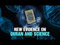

# New evidence on Qur'an and Science with Dr Musharraf Hussain (2022-09-18)

## Description

The Majestic Quran https://www.majesticquran.co.uk/

You Can Support My Work on Patreon:
https://www.patreon.com/Bloggingtheology

My Paypal Link: 
https://www.paypal.com/paypalme/bloggingtheology?locale.x=en_GB

## Summary of [New evidence on Qur'an and Science with Dr Musharraf Hussain](https://www.youtube.com/watch?v=7nm0QJzfHhU)

*This summary is AI generated - there may be inaccuracies. *

### [00:00:00](https://www.youtube.com/watch?v=7nm0QJzfHhU&t=0) - [00:55:00](https://www.youtube.com/watch?v=7nm0QJzfHhU&t=3300)

 discusses the idea that there is scientific evidence to support the claims made in the Quran. argues that when we think morally and spiritually, we can come to see that we are all interconnected and that our relationship with God is a solemn pledge. He urges people to learn more about Islam and its teachings in order to create a better society.

**[00:00:00](https://www.youtube.com/watch?v=7nm0QJzfHhU&t=0)** Dr. Musharraf Hussain discusses how the Quran has been found to be beneficial in terms of human health and welfare. He discusses the British education system and how it prepares students for problem-solving in the physical world.
* **[00:05:00](https://www.youtube.com/watch?v=7nm0QJzfHhU&t=300)** Dr. Musharraf Hussain discusses new evidence that shows how Quranic teachings on morality and spiritual intelligence have positive impacts on human well-being. He argues that these teachings are mandatory for all humans, and that the Quran makes development of moral and spiritual intelligence a priority.
* **[00:10:00](https://www.youtube.com/watch?v=7nm0QJzfHhU&t=600)** argues that there is scientific evidence that moral intelligence and spiritual intelligence are hard-wired and have a positive impact on well-being. He also argues that chronic teachings have a firm scientific foundation.
* **[00:15:00](https://www.youtube.com/watch?v=7nm0QJzfHhU&t=900)* Discusses the idea that there is a difference between moral intelligence and scientific intelligence, and that moral intelligence is more valuable. It goes on to say that moral intelligence is more difficult to develop than scientific intelligence, and that it makes us who we are as humans.  also mentions the importance of Oxford and Cambridge Universities, and how their best graduates often lack in moral intelligence.
* **[00:20:00](https://www.youtube.com/watch?v=7nm0QJzfHhU&t=1200)** discusses the role of religion in developing intelligence, citing Quran and Sunnah as examples of values that are shared by many religions. He goes on to say that unless morality and spiritual intelligence are emphasized in education, the value of religion is lost.
* **[00:25:00](https://www.youtube.com/watch?v=7nm0QJzfHhU&t=1500)** The slide shows how the human brain has billions of nerve cells that are interconnected, and how this makes it complicated and versatile. It also shows how cells are in water and how this makes them look like they are purposefully interacting.
* **[00:30:00](https://www.youtube.com/watch?v=7nm0QJzfHhU&t=1800)* Discusses research that has uncovered new evidence that the Qur'an is correct, and that oxytocin is a hormone that is responsible for a number of positive effects in the body, including increasing generosity and love.  also mentions that negative actions, such as anger or selfishness, have a negative effect on the body.
* **[00:35:00](https://www.youtube.com/watch?v=7nm0QJzfHhU&t=2100)* Discusses how psychologists believe that hearing a vividly told story about kind Behavior has the same emotional impact as actually seeing the act itself. It also discusses how religious stories and parables are very effective in developing the good character and positive behavior of listeners.  concludes by urging listeners to be kind to others.
* **[00:40:00](https://www.youtube.com/watch?v=7nm0QJzfHhU&t=2400)** discusses the relationship between science and religion, noting that science is a powerful force if it is underpinned by morality and spiritual intelligence. He discusses the idea that science without religion is lame, and quotes Albert Einstein, who said the same thing about religion without science. believes that if people have a strong understanding of both science and morality, they will never create weapons of mass destruction.
* **[00:45:00](https://www.youtube.com/watch?v=7nm0QJzfHhU&t=2700)** Dr. Musharraf Hussain discusses new evidence that suggests the Qur'an is compatible with modern science. He argues that when we think morally and spiritually, we can come to see that we are all interconnected and that our relationship with God is a solemn pledge.
* **[00:50:00](https://www.youtube.com/watch?v=7nm0QJzfHhU&t=3000)** discusses how Islam recognizes and respects differences in beliefs, and how this is a key part of the religion's character. He goes on to say that while Muslims should be respectful of others, it is also important to understand the cardinal sins of human behavior, which according to Islamic scholars are explained in the Quran. encourages people to learn more about Islam and its teachings.
* **[00:55:00](https://www.youtube.com/watch?v=7nm0QJzfHhU&t=3300)**  Dr. Musharraf Hussain discusses the overlap between science and Islam, and how Muslims can share their knowledge and teachings with the western community. He cites scientific evidence that supports the Quran's descriptions of natural phenomena. He believes that Muslims should be more involved in the western world, and share their knowledge and spirituality to help create a better society.

## Full transcript with timestamps

[0:00:02](https://youtu.be/7nm0QJzfHhU?t=2) hello everyone and welcome to blogging  
[0:00:05](https://youtu.be/7nm0QJzfHhU?t=5) theology today I am delighted to talk  
[0:00:08](https://youtu.be/7nm0QJzfHhU?t=8) again to Dr musharath Hussein you're  
[0:00:11](https://youtu.be/7nm0QJzfHhU?t=11) most welcome sir  
[0:00:12](https://youtu.be/7nm0QJzfHhU?t=12) I'm delighted Paul  
[0:00:14](https://youtu.be/7nm0QJzfHhU?t=14) Islam to you  
[0:00:16](https://youtu.be/7nm0QJzfHhU?t=16) um Doctor Who's saying for those who  
[0:00:18](https://youtu.be/7nm0QJzfHhU?t=18) don't know uh came to Britain from  
[0:00:20](https://youtu.be/7nm0QJzfHhU?t=20) Pakistan in 1966 with his parents to the  
[0:00:24](https://youtu.be/7nm0QJzfHhU?t=24) Yorkshire town of Halifax where he  
[0:00:26](https://youtu.be/7nm0QJzfHhU?t=26) memorized the Quran learned Taj read and  
[0:00:29](https://youtu.be/7nm0QJzfHhU?t=29) basic Arabic  
[0:00:31](https://youtu.be/7nm0QJzfHhU?t=31) after completing a degree in  
[0:00:32](https://youtu.be/7nm0QJzfHhU?t=32) Biochemistry at Aston University he went  
[0:00:35](https://youtu.be/7nm0QJzfHhU?t=35) on to gain a science doctorate  
[0:00:38](https://youtu.be/7nm0QJzfHhU?t=38) he worked as a scientist until 1990 and  
[0:00:41](https://youtu.be/7nm0QJzfHhU?t=41) then decided to dedicate himself to  
[0:00:43](https://youtu.be/7nm0QJzfHhU?t=43) serving the Muslim Community  
[0:00:46](https://youtu.be/7nm0QJzfHhU?t=46) in 2009 he was awarded an Obe for his  
[0:00:50](https://youtu.be/7nm0QJzfHhU?t=50) services to community relations in  
[0:00:52](https://youtu.be/7nm0QJzfHhU?t=52) Britain  
[0:00:53](https://youtu.be/7nm0QJzfHhU?t=53) and in 2019 he was awarded the Imam  
[0:00:57](https://youtu.be/7nm0QJzfHhU?t=57) while Amal special award by the Muslim  
[0:01:00](https://youtu.be/7nm0QJzfHhU?t=60) news for his translation of the Quran by  
[0:01:03](https://youtu.be/7nm0QJzfHhU?t=63) the way this is it the Majestic Quran  
[0:01:05](https://youtu.be/7nm0QJzfHhU?t=65) guidance and good news for the mindful  
[0:01:07](https://youtu.be/7nm0QJzfHhU?t=67) so get your copy  
[0:01:09](https://youtu.be/7nm0QJzfHhU?t=69) today uh Dr Hussein has kindly agreed to  
[0:01:13](https://youtu.be/7nm0QJzfHhU?t=73) talk about now this is really  
[0:01:15](https://youtu.be/7nm0QJzfHhU?t=75) interesting how scientific studies show  
[0:01:17](https://youtu.be/7nm0QJzfHhU?t=77) the positive effects of moral and  
[0:01:20](https://youtu.be/7nm0QJzfHhU?t=80) spiritual Intelligence on human  
[0:01:22](https://youtu.be/7nm0QJzfHhU?t=82) well-being and how the findings show  
[0:01:25](https://youtu.be/7nm0QJzfHhU?t=85) that the quran's teaching on moral and  
[0:01:28](https://youtu.be/7nm0QJzfHhU?t=88) spiritual values like kindness  
[0:01:31](https://youtu.be/7nm0QJzfHhU?t=91) generosity forgiveness and prayer have a  
[0:01:35](https://youtu.be/7nm0QJzfHhU?t=95) positive impact on human Health and  
[0:01:38](https://youtu.be/7nm0QJzfHhU?t=98) Welfare it's a very very interesting  
[0:01:40](https://youtu.be/7nm0QJzfHhU?t=100) subject so would you like to introduce  
[0:01:42](https://youtu.be/7nm0QJzfHhU?t=102) us to the subject sir  
[0:01:45](https://youtu.be/7nm0QJzfHhU?t=105) assalamualaikum Paul and your wonderful  
[0:01:47](https://youtu.be/7nm0QJzfHhU?t=107) viewers  
[0:01:49](https://youtu.be/7nm0QJzfHhU?t=109) um I believe that  
[0:01:51](https://youtu.be/7nm0QJzfHhU?t=111) religion and Islam in particular are  
[0:01:54](https://youtu.be/7nm0QJzfHhU?t=114) about actually developing us developing  
[0:01:58](https://youtu.be/7nm0QJzfHhU?t=118) uh our sense of understanding first who  
[0:02:02](https://youtu.be/7nm0QJzfHhU?t=122) we are what is our identity where we  
[0:02:05](https://youtu.be/7nm0QJzfHhU?t=125) come from where are we going and what is  
[0:02:08](https://youtu.be/7nm0QJzfHhU?t=128) the purpose and meaning of life I think  
[0:02:11](https://youtu.be/7nm0QJzfHhU?t=131) that is the really ultimate purpose of  
[0:02:15](https://youtu.be/7nm0QJzfHhU?t=135) religion so that we can dedicate and we  
[0:02:19](https://youtu.be/7nm0QJzfHhU?t=139) can truly value and recognize and  
[0:02:23](https://youtu.be/7nm0QJzfHhU?t=143) realize the Creator the Lord who centers  
[0:02:26](https://youtu.be/7nm0QJzfHhU?t=146) on this world so it's really about  
[0:02:29](https://youtu.be/7nm0QJzfHhU?t=149) enabling us  
[0:02:31](https://youtu.be/7nm0QJzfHhU?t=151) empowering us it's about actually  
[0:02:34](https://youtu.be/7nm0QJzfHhU?t=154) educating us  
[0:02:36](https://youtu.be/7nm0QJzfHhU?t=156) now  
[0:02:37](https://youtu.be/7nm0QJzfHhU?t=157) that's on one side now let's look at the  
[0:02:40](https://youtu.be/7nm0QJzfHhU?t=160) British educational system what does it  
[0:02:41](https://youtu.be/7nm0QJzfHhU?t=161) do I remember you know my teacher Mrs  
[0:02:44](https://youtu.be/7nm0QJzfHhU?t=164) Kelly in the primary school how we were  
[0:02:46](https://youtu.be/7nm0QJzfHhU?t=166) taught the verbs the grammar uh how we  
[0:02:49](https://youtu.be/7nm0QJzfHhU?t=169) were taught how to do the arithmetics  
[0:02:51](https://youtu.be/7nm0QJzfHhU?t=171) and then in the secondary school the  
[0:02:54](https://youtu.be/7nm0QJzfHhU?t=174) principles of Science and History of  
[0:02:57](https://youtu.be/7nm0QJzfHhU?t=177) merely about British monarchs actually  
[0:02:59](https://youtu.be/7nm0QJzfHhU?t=179) that's what history creating was like  
[0:03:00](https://youtu.be/7nm0QJzfHhU?t=180) yes history because you see Britain is  
[0:03:03](https://youtu.be/7nm0QJzfHhU?t=183) of course the center of the whole  
[0:03:05](https://youtu.be/7nm0QJzfHhU?t=185) universe so that everything began here  
[0:03:08](https://youtu.be/7nm0QJzfHhU?t=188) and everything was founded and  
[0:03:10](https://youtu.be/7nm0QJzfHhU?t=190) discovered here so we had this amazing  
[0:03:13](https://youtu.be/7nm0QJzfHhU?t=193) history uh you know  
[0:03:15](https://youtu.be/7nm0QJzfHhU?t=195) by Muslims first and then rediscovered  
[0:03:18](https://youtu.be/7nm0QJzfHhU?t=198) by the vision conveniently forgot that  
[0:03:20](https://youtu.be/7nm0QJzfHhU?t=200) actually other people had discovered it  
[0:03:22](https://youtu.be/7nm0QJzfHhU?t=202) first but hey yeah well so so in  
[0:03:25](https://youtu.be/7nm0QJzfHhU?t=205) secondary school we had these amazing  
[0:03:26](https://youtu.be/7nm0QJzfHhU?t=206) lessons in history science  
[0:03:29](https://youtu.be/7nm0QJzfHhU?t=209) um and  
[0:03:30](https://youtu.be/7nm0QJzfHhU?t=210) then in in in in in the University uh  
[0:03:33](https://youtu.be/7nm0QJzfHhU?t=213) you know three years of studying  
[0:03:35](https://youtu.be/7nm0QJzfHhU?t=215) biomedical Sciences looking at the  
[0:03:37](https://youtu.be/7nm0QJzfHhU?t=217) anatomy the biology the physiology the  
[0:03:41](https://youtu.be/7nm0QJzfHhU?t=221) pharmacology even you know how drugs  
[0:03:44](https://youtu.be/7nm0QJzfHhU?t=224) work how does how does your aspirin  
[0:03:46](https://youtu.be/7nm0QJzfHhU?t=226) actually uh bring about that relief of  
[0:03:49](https://youtu.be/7nm0QJzfHhU?t=229) pain and getting rid of your  
[0:03:50](https://youtu.be/7nm0QJzfHhU?t=230) inflammation how does it do that you  
[0:03:52](https://youtu.be/7nm0QJzfHhU?t=232) know all those functions and what I saw  
[0:03:55](https://youtu.be/7nm0QJzfHhU?t=235) you know in those 15 years of the  
[0:03:57](https://youtu.be/7nm0QJzfHhU?t=237) British going through the British  
[0:03:58](https://youtu.be/7nm0QJzfHhU?t=238) education system was it was actually  
[0:04:01](https://youtu.be/7nm0QJzfHhU?t=241) preparing me  
[0:04:02](https://youtu.be/7nm0QJzfHhU?t=242) to solve problems It Was preparing me to  
[0:04:06](https://youtu.be/7nm0QJzfHhU?t=246) understand the physical world how uh you  
[0:04:10](https://youtu.be/7nm0QJzfHhU?t=250) know the uh the plants photosynthesize  
[0:04:13](https://youtu.be/7nm0QJzfHhU?t=253) and produce the glucose molecule how do  
[0:04:16](https://youtu.be/7nm0QJzfHhU?t=256) they use water the sun uh and all those  
[0:04:20](https://youtu.be/7nm0QJzfHhU?t=260) amazing minerals to produce uh all kinds  
[0:04:24](https://youtu.be/7nm0QJzfHhU?t=264) of uh weird and wonderful uh chemicals  
[0:04:27](https://youtu.be/7nm0QJzfHhU?t=267) you know can you imagine a a pole a a  
[0:04:30](https://youtu.be/7nm0QJzfHhU?t=270) single leaf of a plant it can produce  
[0:04:33](https://youtu.be/7nm0QJzfHhU?t=273) something like 4 000 different chemicals  
[0:04:36](https://youtu.be/7nm0QJzfHhU?t=276) wow wow you know you know for human  
[0:04:39](https://youtu.be/7nm0QJzfHhU?t=279) beings to produce one chemical that is  
[0:04:43](https://youtu.be/7nm0QJzfHhU?t=283) ammonia that is a you know the  
[0:04:44](https://youtu.be/7nm0QJzfHhU?t=284) fertilizer we have to have acres and  
[0:04:48](https://youtu.be/7nm0QJzfHhU?t=288) Acres of factory to produce just one  
[0:04:52](https://youtu.be/7nm0QJzfHhU?t=292) chemical  
[0:04:53](https://youtu.be/7nm0QJzfHhU?t=293) but look at you know this this little  
[0:04:56](https://youtu.be/7nm0QJzfHhU?t=296) leaf has the capability of producing  
[0:04:59](https://youtu.be/7nm0QJzfHhU?t=299) something like 4 000 different chemicals  
[0:05:01](https://youtu.be/7nm0QJzfHhU?t=301) in order to Buckle Leaf is well known in  
[0:05:04](https://youtu.be/7nm0QJzfHhU?t=304) research okay that has at least 4 000  
[0:05:06](https://youtu.be/7nm0QJzfHhU?t=306) different chemicals you know that is the  
[0:05:10](https://youtu.be/7nm0QJzfHhU?t=310) magic the miracle of God so one of  
[0:05:14](https://youtu.be/7nm0QJzfHhU?t=314) comparing is here we have the British  
[0:05:16](https://youtu.be/7nm0QJzfHhU?t=316) education system which is preparing me  
[0:05:18](https://youtu.be/7nm0QJzfHhU?t=318) and preparing our children and our  
[0:05:21](https://youtu.be/7nm0QJzfHhU?t=321) um uh students and our citizens to be  
[0:05:25](https://youtu.be/7nm0QJzfHhU?t=325) able to understand the world around us  
[0:05:27](https://youtu.be/7nm0QJzfHhU?t=327) so that we can solve the problems and  
[0:05:29](https://youtu.be/7nm0QJzfHhU?t=329) that is what seriously scientists do you  
[0:05:31](https://youtu.be/7nm0QJzfHhU?t=331) know we look at how can we help to solve  
[0:05:34](https://youtu.be/7nm0QJzfHhU?t=334) this and my own PhD was about how do we  
[0:05:37](https://youtu.be/7nm0QJzfHhU?t=337) you know find some ways of treating  
[0:05:39](https://youtu.be/7nm0QJzfHhU?t=339) diabetes for example looking at the  
[0:05:41](https://youtu.be/7nm0QJzfHhU?t=341) mechanism of insulin secretion how does  
[0:05:43](https://youtu.be/7nm0QJzfHhU?t=343) that little glucose molecule  
[0:05:46](https://youtu.be/7nm0QJzfHhU?t=346) excite the beta cells to secrete the and  
[0:05:51](https://youtu.be/7nm0QJzfHhU?t=351) stimulate them to produce and to secrete  
[0:05:54](https://youtu.be/7nm0QJzfHhU?t=354) insulin so these are so we're what we're  
[0:05:58](https://youtu.be/7nm0QJzfHhU?t=358) looking at is education is about helping  
[0:06:00](https://youtu.be/7nm0QJzfHhU?t=360) us to solve problems but of course it's  
[0:06:04](https://youtu.be/7nm0QJzfHhU?t=364) all about the physical world the outward  
[0:06:07](https://youtu.be/7nm0QJzfHhU?t=367) world right well I believe that Islam  
[0:06:09](https://youtu.be/7nm0QJzfHhU?t=369) like other religions is also preparing  
[0:06:13](https://youtu.be/7nm0QJzfHhU?t=373) us mentally and inwardly to actually get  
[0:06:17](https://youtu.be/7nm0QJzfHhU?t=377) some very deep understandings deep  
[0:06:20](https://youtu.be/7nm0QJzfHhU?t=380) understandings about the nature of human  
[0:06:23](https://youtu.be/7nm0QJzfHhU?t=383) beings and this is why I don't believe  
[0:06:26](https://youtu.be/7nm0QJzfHhU?t=386) philosophers or scientists actually can  
[0:06:29](https://youtu.be/7nm0QJzfHhU?t=389) solve us and help us in understanding  
[0:06:32](https://youtu.be/7nm0QJzfHhU?t=392) who we are where are we going so poor  
[0:06:36](https://youtu.be/7nm0QJzfHhU?t=396) Darwin and or Dawkins are not going to  
[0:06:38](https://youtu.be/7nm0QJzfHhU?t=398) be able to tell us where we come from  
[0:06:41](https://youtu.be/7nm0QJzfHhU?t=401) what is the nature of human beings what  
[0:06:43](https://youtu.be/7nm0QJzfHhU?t=403) is the purpose of human beings on this  
[0:06:45](https://youtu.be/7nm0QJzfHhU?t=405) Earth we're not going to have that  
[0:06:47](https://youtu.be/7nm0QJzfHhU?t=407) because it really is something which is  
[0:06:49](https://youtu.be/7nm0QJzfHhU?t=409) to do with the Unseen the the the  
[0:06:55](https://youtu.be/7nm0QJzfHhU?t=415) inner world the world that is beyond the  
[0:06:59](https://youtu.be/7nm0QJzfHhU?t=419) conscious and and now you know we're in  
[0:07:02](https://youtu.be/7nm0QJzfHhU?t=422) a we're at um our scientific and  
[0:07:05](https://youtu.be/7nm0QJzfHhU?t=425) neuroscientific learning is at such a  
[0:07:07](https://youtu.be/7nm0QJzfHhU?t=427) stage that they're able to actually see  
[0:07:10](https://youtu.be/7nm0QJzfHhU?t=430) the conscious through the MRI through  
[0:07:13](https://youtu.be/7nm0QJzfHhU?t=433) the brain sort of scanning you know  
[0:07:16](https://youtu.be/7nm0QJzfHhU?t=436) we're able to actually see what is  
[0:07:17](https://youtu.be/7nm0QJzfHhU?t=437) happening at that level and we're able  
[0:07:20](https://youtu.be/7nm0QJzfHhU?t=440) to so that is why I so my thesis and  
[0:07:24](https://youtu.be/7nm0QJzfHhU?t=444) what I'm proposing is and and I think a  
[0:07:26](https://youtu.be/7nm0QJzfHhU?t=446) lot of us a lot of uh  
[0:07:28](https://youtu.be/7nm0QJzfHhU?t=448) believing scientists are now beginning  
[0:07:30](https://youtu.be/7nm0QJzfHhU?t=450) to see this um amazing connection  
[0:07:33](https://youtu.be/7nm0QJzfHhU?t=453) between what we call the moral  
[0:07:36](https://youtu.be/7nm0QJzfHhU?t=456) intelligence and the spiritual  
[0:07:38](https://youtu.be/7nm0QJzfHhU?t=458) intelligence so that is the the reason I  
[0:07:40](https://youtu.be/7nm0QJzfHhU?t=460) talked about the British education  
[0:07:42](https://youtu.be/7nm0QJzfHhU?t=462) system is that our British education  
[0:07:44](https://youtu.be/7nm0QJzfHhU?t=464) system is actually creating an amazing  
[0:07:47](https://youtu.be/7nm0QJzfHhU?t=467) intelligence in us to be able to  
[0:07:49](https://youtu.be/7nm0QJzfHhU?t=469) understand the world that's what it's  
[0:07:51](https://youtu.be/7nm0QJzfHhU?t=471) all about isn't it so the higher your IQ  
[0:07:53](https://youtu.be/7nm0QJzfHhU?t=473) is you're able to get to the best  
[0:07:55](https://youtu.be/7nm0QJzfHhU?t=475) courses the best universities and you  
[0:07:58](https://youtu.be/7nm0QJzfHhU?t=478) can then solve the problems in a better  
[0:08:00](https://youtu.be/7nm0QJzfHhU?t=480) way that's an intelligence okay to do  
[0:08:02](https://youtu.be/7nm0QJzfHhU?t=482) with the outer world but what about the  
[0:08:05](https://youtu.be/7nm0QJzfHhU?t=485) intelligence that I need to be a human  
[0:08:09](https://youtu.be/7nm0QJzfHhU?t=489) being loving caring forgiving patient  
[0:08:14](https://youtu.be/7nm0QJzfHhU?t=494) thankful appreciative and someone who is  
[0:08:18](https://youtu.be/7nm0QJzfHhU?t=498) really Pleasant how do you do that well  
[0:08:21](https://youtu.be/7nm0QJzfHhU?t=501) we believe that from the very beginning  
[0:08:24](https://youtu.be/7nm0QJzfHhU?t=504) you know God has been guiding humanity  
[0:08:27](https://youtu.be/7nm0QJzfHhU?t=507) and that is what is known as the moral  
[0:08:30](https://youtu.be/7nm0QJzfHhU?t=510) intelligence the spiritual intelligence  
[0:08:32](https://youtu.be/7nm0QJzfHhU?t=512) and some signed you know social  
[0:08:34](https://youtu.be/7nm0QJzfHhU?t=514) scientists now call that social  
[0:08:36](https://youtu.be/7nm0QJzfHhU?t=516) intelligence as well but I think you  
[0:08:38](https://youtu.be/7nm0QJzfHhU?t=518) know for believers social intelligence  
[0:08:40](https://youtu.be/7nm0QJzfHhU?t=520) is actually moral and spiritual  
[0:08:43](https://youtu.be/7nm0QJzfHhU?t=523) intelligence so my in a definition I'll  
[0:08:46](https://youtu.be/7nm0QJzfHhU?t=526) do the definition further on my next  
[0:08:49](https://youtu.be/7nm0QJzfHhU?t=529) slide okay so we'll have a look at the  
[0:08:52](https://youtu.be/7nm0QJzfHhU?t=532) uh okay thank you yeah so here you know  
[0:08:55](https://youtu.be/7nm0QJzfHhU?t=535) we're looking at some scientific studies  
[0:08:56](https://youtu.be/7nm0QJzfHhU?t=536) and when I say some scientific studies  
[0:08:59](https://youtu.be/7nm0QJzfHhU?t=539) I'm looking at uh when I wrote this  
[0:09:01](https://youtu.be/7nm0QJzfHhU?t=541) paper back in uh  
[0:09:03](https://youtu.be/7nm0QJzfHhU?t=543) 2012. uh there were more than 500  
[0:09:08](https://youtu.be/7nm0QJzfHhU?t=548) um different scientific studies that  
[0:09:10](https://youtu.be/7nm0QJzfHhU?t=550) were actually showing how moral values  
[0:09:14](https://youtu.be/7nm0QJzfHhU?t=554) like kindness how spiritual intelligence  
[0:09:16](https://youtu.be/7nm0QJzfHhU?t=556) like devotion and worship and  
[0:09:19](https://youtu.be/7nm0QJzfHhU?t=559) contemplation and meditation have  
[0:09:22](https://youtu.be/7nm0QJzfHhU?t=562) positive impact on human well-being okay  
[0:09:25](https://youtu.be/7nm0QJzfHhU?t=565) so that was then but now I'm sure there  
[0:09:28](https://youtu.be/7nm0QJzfHhU?t=568) will be thousands more scientific papers  
[0:09:30](https://youtu.be/7nm0QJzfHhU?t=570) yeah and then on the next slide  
[0:09:32](https://youtu.be/7nm0QJzfHhU?t=572) um  
[0:09:33](https://youtu.be/7nm0QJzfHhU?t=573) I'll I'll share that with you yeah the  
[0:09:36](https://youtu.be/7nm0QJzfHhU?t=576) next slide so my argument is this that  
[0:09:39](https://youtu.be/7nm0QJzfHhU?t=579) the Quran makes development of moral and  
[0:09:42](https://youtu.be/7nm0QJzfHhU?t=582) spiritual intelligence mandatory so  
[0:09:46](https://youtu.be/7nm0QJzfHhU?t=586) um now that's a big clip and some people  
[0:09:49](https://youtu.be/7nm0QJzfHhU?t=589) might raise their eyebrows but no it's  
[0:09:52](https://youtu.be/7nm0QJzfHhU?t=592) not uh it's not unfounded it is very  
[0:09:54](https://youtu.be/7nm0QJzfHhU?t=594) because you know if you look at what  
[0:09:56](https://youtu.be/7nm0QJzfHhU?t=596) does the Quran says  
[0:10:02](https://youtu.be/7nm0QJzfHhU?t=602) seek help through patience  
[0:10:05](https://youtu.be/7nm0QJzfHhU?t=605) and prayer okay and then it says  
[0:10:13](https://youtu.be/7nm0QJzfHhU?t=613) Believers be patient and also encourage  
[0:10:17](https://youtu.be/7nm0QJzfHhU?t=617) each other to be patient  
[0:10:20](https://youtu.be/7nm0QJzfHhU?t=620) be thankful okay  
[0:10:25](https://youtu.be/7nm0QJzfHhU?t=625) forgive others  
[0:10:27](https://youtu.be/7nm0QJzfHhU?t=627) and so on so what are these these moral  
[0:10:31](https://youtu.be/7nm0QJzfHhU?t=631) values which the Quran is actually  
[0:10:32](https://youtu.be/7nm0QJzfHhU?t=632) commanding so when the Quran uses the  
[0:10:35](https://youtu.be/7nm0QJzfHhU?t=635) imperative well that is that makes it  
[0:10:38](https://youtu.be/7nm0QJzfHhU?t=638) compulsory for the believer to do so  
[0:10:40](https://youtu.be/7nm0QJzfHhU?t=640) what I'm showing here to you is that yes  
[0:10:43](https://youtu.be/7nm0QJzfHhU?t=643) of course the moral imperative the  
[0:10:45](https://youtu.be/7nm0QJzfHhU?t=645) spiritual imperatives in the Quran are  
[0:10:48](https://youtu.be/7nm0QJzfHhU?t=648) actually mandatory a Muslim must carry  
[0:10:50](https://youtu.be/7nm0QJzfHhU?t=650) out these duties just like pray  
[0:10:55](https://youtu.be/7nm0QJzfHhU?t=655) foreign  
[0:10:59](https://youtu.be/7nm0QJzfHhU?t=659) why isn't being patients why isn't being  
[0:11:03](https://youtu.be/7nm0QJzfHhU?t=663) thankful why isn't being forgiving why  
[0:11:07](https://youtu.be/7nm0QJzfHhU?t=667) isn't being modest not mandatory when  
[0:11:11](https://youtu.be/7nm0QJzfHhU?t=671) the Quran uses exactly the same  
[0:11:13](https://youtu.be/7nm0QJzfHhU?t=673) imperative uh form of the verb so  
[0:11:16](https://youtu.be/7nm0QJzfHhU?t=676) therefore yes they are imperatives now  
[0:11:19](https://youtu.be/7nm0QJzfHhU?t=679) scientific evidence shows in fact you  
[0:11:22](https://youtu.be/7nm0QJzfHhU?t=682) know whereas the legal imperatives in  
[0:11:25](https://youtu.be/7nm0QJzfHhU?t=685) the Quran the Allama are are almost  
[0:11:29](https://youtu.be/7nm0QJzfHhU?t=689) agreed on that there are around about  
[0:11:31](https://youtu.be/7nm0QJzfHhU?t=691) 500 verses of the Quran known as the  
[0:11:34](https://youtu.be/7nm0QJzfHhU?t=694) Ayatul akam you know the verses that  
[0:11:36](https://youtu.be/7nm0QJzfHhU?t=696) deal with legal side of Our Lives just  
[0:11:39](https://youtu.be/7nm0QJzfHhU?t=699) 500 out of 6200 odd verses yet  
[0:11:44](https://youtu.be/7nm0QJzfHhU?t=704) um the verses to do with patience with  
[0:11:47](https://youtu.be/7nm0QJzfHhU?t=707) forgiveness with moral and spiritual  
[0:11:49](https://youtu.be/7nm0QJzfHhU?t=709) intelligence are actually in thousands  
[0:11:52](https://youtu.be/7nm0QJzfHhU?t=712) wow  
[0:11:53](https://youtu.be/7nm0QJzfHhU?t=713) that's my argument so next point I make  
[0:11:56](https://youtu.be/7nm0QJzfHhU?t=716) here is that that so here we have lots  
[0:11:59](https://youtu.be/7nm0QJzfHhU?t=719) of scientific evidence now that shows  
[0:12:01](https://youtu.be/7nm0QJzfHhU?t=721) that moral intelligence and spiritual  
[0:12:04](https://youtu.be/7nm0QJzfHhU?t=724) intelligence are actually hard wired in  
[0:12:08](https://youtu.be/7nm0QJzfHhU?t=728) human beings and they have a positive  
[0:12:11](https://youtu.be/7nm0QJzfHhU?t=731) impact on your well-being so what are we  
[0:12:14](https://youtu.be/7nm0QJzfHhU?t=734) saying here it's very simply this that  
[0:12:16](https://youtu.be/7nm0QJzfHhU?t=736) uh you know these research uh on on um  
[0:12:20](https://youtu.be/7nm0QJzfHhU?t=740) on on moral behavior is now proving  
[0:12:24](https://youtu.be/7nm0QJzfHhU?t=744) almost almost a direct relationship  
[0:12:27](https://youtu.be/7nm0QJzfHhU?t=747) between for example you know and I'll  
[0:12:30](https://youtu.be/7nm0QJzfHhU?t=750) give you more detailed examples later of  
[0:12:33](https://youtu.be/7nm0QJzfHhU?t=753) for example people who are appreciative  
[0:12:36](https://youtu.be/7nm0QJzfHhU?t=756) thankful and they value whatever is  
[0:12:40](https://youtu.be/7nm0QJzfHhU?t=760) given to them they actually acknowledge  
[0:12:43](https://youtu.be/7nm0QJzfHhU?t=763) when something is given to they  
[0:12:45](https://youtu.be/7nm0QJzfHhU?t=765) acknowledge that this is good and they  
[0:12:47](https://youtu.be/7nm0QJzfHhU?t=767) feel something in it uh you know they  
[0:12:49](https://youtu.be/7nm0QJzfHhU?t=769) feel positive about it what the  
[0:12:51](https://youtu.be/7nm0QJzfHhU?t=771) researchers have been able to show is  
[0:12:53](https://youtu.be/7nm0QJzfHhU?t=773) correlation between you know that  
[0:12:56](https://youtu.be/7nm0QJzfHhU?t=776) feeling of a pre appreciation of  
[0:12:59](https://youtu.be/7nm0QJzfHhU?t=779) thankfulness gratitude and well-being  
[0:13:03](https://youtu.be/7nm0QJzfHhU?t=783) how do you measure well-being well you  
[0:13:05](https://youtu.be/7nm0QJzfHhU?t=785) know in in science there are in in  
[0:13:07](https://youtu.be/7nm0QJzfHhU?t=787) Biochemistry for example which is my  
[0:13:09](https://youtu.be/7nm0QJzfHhU?t=789) field there are many ways you can  
[0:13:11](https://youtu.be/7nm0QJzfHhU?t=791) actually measure human well-being and  
[0:13:13](https://youtu.be/7nm0QJzfHhU?t=793) some of those things are like looking at  
[0:13:15](https://youtu.be/7nm0QJzfHhU?t=795) the levels of hormones like cortisol now  
[0:13:18](https://youtu.be/7nm0QJzfHhU?t=798) cortisol is a stress hormone when you  
[0:13:21](https://youtu.be/7nm0QJzfHhU?t=801) are stressed the levels of cortisol are  
[0:13:24](https://youtu.be/7nm0QJzfHhU?t=804) raised  
[0:13:25](https://youtu.be/7nm0QJzfHhU?t=805) and obviously when you're relaxed calm  
[0:13:28](https://youtu.be/7nm0QJzfHhU?t=808) uh and and and uh relax the levels fall  
[0:13:33](https://youtu.be/7nm0QJzfHhU?t=813) so by measuring the levels of cortisol  
[0:13:36](https://youtu.be/7nm0QJzfHhU?t=816) you can actually show uh you know that  
[0:13:38](https://youtu.be/7nm0QJzfHhU?t=818) something has happened you know to the  
[0:13:41](https://youtu.be/7nm0QJzfHhU?t=821) stress it has gone down and of course  
[0:13:43](https://youtu.be/7nm0QJzfHhU?t=823) blood pressure uh and and cardiac output  
[0:13:47](https://youtu.be/7nm0QJzfHhU?t=827) uh and of course there are other ways of  
[0:13:50](https://youtu.be/7nm0QJzfHhU?t=830) measuring and and we will share those  
[0:13:52](https://youtu.be/7nm0QJzfHhU?t=832) with you so there is the scientific  
[0:13:54](https://youtu.be/7nm0QJzfHhU?t=834) evidence that is showing a direct  
[0:13:56](https://youtu.be/7nm0QJzfHhU?t=836) correlation between moral intelligence  
[0:13:59](https://youtu.be/7nm0QJzfHhU?t=839) spiritual intelligence and uh the uh  
[0:14:03](https://youtu.be/7nm0QJzfHhU?t=843) well-being parameters that you know I've  
[0:14:06](https://youtu.be/7nm0QJzfHhU?t=846) just mentioned some of them so I I  
[0:14:08](https://youtu.be/7nm0QJzfHhU?t=848) therefore conclude that you know chronic  
[0:14:09](https://youtu.be/7nm0QJzfHhU?t=849) teachings do have  
[0:14:11](https://youtu.be/7nm0QJzfHhU?t=851) a very firm scientific foundation and  
[0:14:14](https://youtu.be/7nm0QJzfHhU?t=854) and uh not that you know we believe God  
[0:14:17](https://youtu.be/7nm0QJzfHhU?t=857) speaks the truth the scripture you know  
[0:14:20](https://youtu.be/7nm0QJzfHhU?t=860) the Bible the New Testament the Old  
[0:14:23](https://youtu.be/7nm0QJzfHhU?t=863) Testament uh the Quran uh and other  
[0:14:25](https://youtu.be/7nm0QJzfHhU?t=865) religious scriptures uh all actually  
[0:14:29](https://youtu.be/7nm0QJzfHhU?t=869) um impose uh and and expect their  
[0:14:33](https://youtu.be/7nm0QJzfHhU?t=873) followers to have these to develop this  
[0:14:36](https://youtu.be/7nm0QJzfHhU?t=876) moral and spiritual intelligence okay so  
[0:14:39](https://youtu.be/7nm0QJzfHhU?t=879) we now move to the  
[0:14:41](https://youtu.be/7nm0QJzfHhU?t=881) um so what is what what do we mean by  
[0:14:43](https://youtu.be/7nm0QJzfHhU?t=883) spiritual intelligence well this is my  
[0:14:46](https://youtu.be/7nm0QJzfHhU?t=886) definition of spiritual intelligence it  
[0:14:48](https://youtu.be/7nm0QJzfHhU?t=888) comes from my book the seven steps to  
[0:14:51](https://youtu.be/7nm0QJzfHhU?t=891) spiritual intelligence uh which is  
[0:14:53](https://youtu.be/7nm0QJzfHhU?t=893) published by Cube and spiritual  
[0:14:55](https://youtu.be/7nm0QJzfHhU?t=895) intelligence is understanding the  
[0:14:57](https://youtu.be/7nm0QJzfHhU?t=897) meaning and purpose of life practices  
[0:15:00](https://youtu.be/7nm0QJzfHhU?t=900) that enhance human connection with God  
[0:15:03](https://youtu.be/7nm0QJzfHhU?t=903) and help human beings to become Divine  
[0:15:05](https://youtu.be/7nm0QJzfHhU?t=905) Representatives with god-like character  
[0:15:08](https://youtu.be/7nm0QJzfHhU?t=908) and moral values the spiritual person is  
[0:15:12](https://youtu.be/7nm0QJzfHhU?t=912) able to see beyond the physical and  
[0:15:15](https://youtu.be/7nm0QJzfHhU?t=915) material world and that is why I said  
[0:15:17](https://youtu.be/7nm0QJzfHhU?t=917) who are Darwin Darvin all poor Dawkins  
[0:15:20](https://youtu.be/7nm0QJzfHhU?t=920) will not be able to see because they are  
[0:15:24](https://youtu.be/7nm0QJzfHhU?t=924) blinded you know they are blind in the  
[0:15:26](https://youtu.be/7nm0QJzfHhU?t=926) sense they have no you know they are on  
[0:15:30](https://youtu.be/7nm0QJzfHhU?t=930) willing to accept this spiritual and  
[0:15:34](https://youtu.be/7nm0QJzfHhU?t=934) Beyond the physical okay they can't see  
[0:15:37](https://youtu.be/7nm0QJzfHhU?t=937) something beyond that and uh and of  
[0:15:39](https://youtu.be/7nm0QJzfHhU?t=939) course uh it's not unscientific to  
[0:15:41](https://youtu.be/7nm0QJzfHhU?t=941) believe in The Invisible the Unseen  
[0:15:43](https://youtu.be/7nm0QJzfHhU?t=943) because you know that is you know well  
[0:15:48](https://youtu.be/7nm0QJzfHhU?t=948) known okay let me just so that is what  
[0:15:50](https://youtu.be/7nm0QJzfHhU?t=950) we mean by is that okay Paul the I I  
[0:15:53](https://youtu.be/7nm0QJzfHhU?t=953) just Define spiritualism you know think  
[0:15:55](https://youtu.be/7nm0QJzfHhU?t=955) about that it's very interesting indeed  
[0:15:57](https://youtu.be/7nm0QJzfHhU?t=957) it's interesting that they are often uh  
[0:15:59](https://youtu.be/7nm0QJzfHhU?t=959) some Muslims talk about these scientific  
[0:16:01](https://youtu.be/7nm0QJzfHhU?t=961) miracles of the Quran meaning you know  
[0:16:03](https://youtu.be/7nm0QJzfHhU?t=963) the extraordinary statements about say  
[0:16:04](https://youtu.be/7nm0QJzfHhU?t=964) the expanding universe or uh  
[0:16:06](https://youtu.be/7nm0QJzfHhU?t=966) descriptions of the embryo or uh you  
[0:16:09](https://youtu.be/7nm0QJzfHhU?t=969) know the the difference between salt  
[0:16:10](https://youtu.be/7nm0QJzfHhU?t=970) water and fresh water and so on and  
[0:16:12](https://youtu.be/7nm0QJzfHhU?t=972) these are remarkable I I agree but this  
[0:16:15](https://youtu.be/7nm0QJzfHhU?t=975) is a very different take is actually  
[0:16:16](https://youtu.be/7nm0QJzfHhU?t=976) looking at uh other other facets of the  
[0:16:19](https://youtu.be/7nm0QJzfHhU?t=979) quran's  
[0:16:21](https://youtu.be/7nm0QJzfHhU?t=981) um seemingly scientific statements or  
[0:16:23](https://youtu.be/7nm0QJzfHhU?t=983) statements that are corroborated I  
[0:16:24](https://youtu.be/7nm0QJzfHhU?t=984) should say by by the recent scientific  
[0:16:27](https://youtu.be/7nm0QJzfHhU?t=987) research there's a refreshing different  
[0:16:29](https://youtu.be/7nm0QJzfHhU?t=989) approach to to science and the Quran  
[0:16:31](https://youtu.be/7nm0QJzfHhU?t=991) than the usual one that I hear and it's  
[0:16:34](https://youtu.be/7nm0QJzfHhU?t=994) ongoing it's actually it's very recent  
[0:16:36](https://youtu.be/7nm0QJzfHhU?t=996) it's actually happening now and and  
[0:16:39](https://youtu.be/7nm0QJzfHhU?t=999) places like America and and the Research  
[0:16:42](https://youtu.be/7nm0QJzfHhU?t=1002) Laboratories they're particularly  
[0:16:43](https://youtu.be/7nm0QJzfHhU?t=1003) Neuroscience you know the uh there is a  
[0:16:46](https://youtu.be/7nm0QJzfHhU?t=1006) huge interest uh because it's about  
[0:16:48](https://youtu.be/7nm0QJzfHhU?t=1008) well-being and as as the uh the  
[0:16:52](https://youtu.be/7nm0QJzfHhU?t=1012) communities in the west age uh you know  
[0:16:55](https://youtu.be/7nm0QJzfHhU?t=1015) they're more concerned about the  
[0:16:57](https://youtu.be/7nm0QJzfHhU?t=1017) well-being uh and and what they're  
[0:16:59](https://youtu.be/7nm0QJzfHhU?t=1019) beginning to see is that the more closer  
[0:17:02](https://youtu.be/7nm0QJzfHhU?t=1022) the communities are with their religion  
[0:17:04](https://youtu.be/7nm0QJzfHhU?t=1024) and they have moral and spiritual  
[0:17:06](https://youtu.be/7nm0QJzfHhU?t=1026) intelligence there is proof and evidence  
[0:17:08](https://youtu.be/7nm0QJzfHhU?t=1028) now to show that their well-being and  
[0:17:11](https://youtu.be/7nm0QJzfHhU?t=1031) their health is is is better well that's  
[0:17:14](https://youtu.be/7nm0QJzfHhU?t=1034) fantastic oh that's fantastic well thank  
[0:17:16](https://youtu.be/7nm0QJzfHhU?t=1036) you very much for for that so uh yeah  
[0:17:18](https://youtu.be/7nm0QJzfHhU?t=1038) back to the slides then yes well this is  
[0:17:21](https://youtu.be/7nm0QJzfHhU?t=1041) the next one about moral intelligence  
[0:17:23](https://youtu.be/7nm0QJzfHhU?t=1043) moral intelligence is the Knowledge and  
[0:17:25](https://youtu.be/7nm0QJzfHhU?t=1045) Skills for having a god-like character  
[0:17:28](https://youtu.be/7nm0QJzfHhU?t=1048) now can I just clarify it's my some of  
[0:17:31](https://youtu.be/7nm0QJzfHhU?t=1051) my brothers might say that well this is  
[0:17:33](https://youtu.be/7nm0QJzfHhU?t=1053) very shirky isn't it this is shirk  
[0:17:35](https://youtu.be/7nm0QJzfHhU?t=1055) god-like character what do we mean there  
[0:17:38](https://youtu.be/7nm0QJzfHhU?t=1058) is actually  
[0:17:40](https://youtu.be/7nm0QJzfHhU?t=1060) you know  
[0:17:42](https://youtu.be/7nm0QJzfHhU?t=1062) which is we are expected to acquire the  
[0:17:48](https://youtu.be/7nm0QJzfHhU?t=1068) Divine attributes  
[0:17:49](https://youtu.be/7nm0QJzfHhU?t=1069) why does Allah talk about his beautiful  
[0:17:52](https://youtu.be/7nm0QJzfHhU?t=1072) names of Rahman  
[0:17:58](https://youtu.be/7nm0QJzfHhU?t=1078) what does he talk about that he's  
[0:18:00](https://youtu.be/7nm0QJzfHhU?t=1080) patient he's the most appreciative and  
[0:18:03](https://youtu.be/7nm0QJzfHhU?t=1083) rewarding that he is you know the most  
[0:18:06](https://youtu.be/7nm0QJzfHhU?t=1086) kind and compassionate and al-karim the  
[0:18:08](https://youtu.be/7nm0QJzfHhU?t=1088) general why  
[0:18:10](https://youtu.be/7nm0QJzfHhU?t=1090) because God wants us to be like that  
[0:18:13](https://youtu.be/7nm0QJzfHhU?t=1093) right and but the difference between  
[0:18:15](https://youtu.be/7nm0QJzfHhU?t=1095) when I say you know we having god-like  
[0:18:19](https://youtu.be/7nm0QJzfHhU?t=1099) character what we mean is of course when  
[0:18:22](https://youtu.be/7nm0QJzfHhU?t=1102) we are kind  
[0:18:24](https://youtu.be/7nm0QJzfHhU?t=1104) and then there is Allah who is kind well  
[0:18:26](https://youtu.be/7nm0QJzfHhU?t=1106) there's a world of difference between  
[0:18:28](https://youtu.be/7nm0QJzfHhU?t=1108) Allah's kindness and my kindness there  
[0:18:30](https://youtu.be/7nm0QJzfHhU?t=1110) now first of all it's very limited it is  
[0:18:33](https://youtu.be/7nm0QJzfHhU?t=1113) and it is also a gift from God bestowed  
[0:18:37](https://youtu.be/7nm0QJzfHhU?t=1117) upon me it is temporary it's fleeting  
[0:18:39](https://youtu.be/7nm0QJzfHhU?t=1119) what is God's kindness is of course  
[0:18:42](https://youtu.be/7nm0QJzfHhU?t=1122) kadim it is from ever and forever and it  
[0:18:46](https://youtu.be/7nm0QJzfHhU?t=1126) has it is it is his personal kindness it  
[0:18:49](https://youtu.be/7nm0QJzfHhU?t=1129) is not bestowed on him so I just wanted  
[0:18:53](https://youtu.be/7nm0QJzfHhU?t=1133) to clarify that before clarification  
[0:18:57](https://youtu.be/7nm0QJzfHhU?t=1137) yeah I can see I can see some people  
[0:18:59](https://youtu.be/7nm0QJzfHhU?t=1139) might have misunderstood what you meant  
[0:19:00](https://youtu.be/7nm0QJzfHhU?t=1140) by that but I think you you clarified  
[0:19:02](https://youtu.be/7nm0QJzfHhU?t=1142) perfectly uh The Chronic understanding  
[0:19:04](https://youtu.be/7nm0QJzfHhU?t=1144) yeah okay so yeah the whole idea of  
[0:19:07](https://youtu.be/7nm0QJzfHhU?t=1147) moral intelligence is actually to have  
[0:19:10](https://youtu.be/7nm0QJzfHhU?t=1150) that Knowledge and Skills you know that  
[0:19:12](https://youtu.be/7nm0QJzfHhU?t=1152) help us to have Godlike character of  
[0:19:15](https://youtu.be/7nm0QJzfHhU?t=1155) compassion patience forgiveness Justice  
[0:19:19](https://youtu.be/7nm0QJzfHhU?t=1159) controlling the ego to manage anger  
[0:19:22](https://youtu.be/7nm0QJzfHhU?t=1162) arrogance greed and jealousy that is  
[0:19:25](https://youtu.be/7nm0QJzfHhU?t=1165) amazing intelligence to be honest this  
[0:19:27](https://youtu.be/7nm0QJzfHhU?t=1167) is this intelligence poll is far more  
[0:19:30](https://youtu.be/7nm0QJzfHhU?t=1170) difficult and far more powerful far more  
[0:19:33](https://youtu.be/7nm0QJzfHhU?t=1173) worthier than the intelligence that our  
[0:19:36](https://youtu.be/7nm0QJzfHhU?t=1176) education system is able to develop in  
[0:19:38](https://youtu.be/7nm0QJzfHhU?t=1178) the best graduates of Oxford and  
[0:19:41](https://youtu.be/7nm0QJzfHhU?t=1181) Cambridge seriously  
[0:19:43](https://youtu.be/7nm0QJzfHhU?t=1183) and this intelligence is far more  
[0:19:46](https://youtu.be/7nm0QJzfHhU?t=1186) valuable you know because it makes us  
[0:19:49](https://youtu.be/7nm0QJzfHhU?t=1189) truly who we are human beings you know  
[0:19:52](https://youtu.be/7nm0QJzfHhU?t=1192) whereas our great prime minister of the  
[0:19:55](https://youtu.be/7nm0QJzfHhU?t=1195) past learned his inner skills from  
[0:19:57](https://youtu.be/7nm0QJzfHhU?t=1197) Oxford University and each and school  
[0:19:59](https://youtu.be/7nm0QJzfHhU?t=1199) you know and and we saw how miserably he  
[0:20:02](https://youtu.be/7nm0QJzfHhU?t=1202) failed because whereas this intelligence  
[0:20:04](https://youtu.be/7nm0QJzfHhU?t=1204) if he had this intelligence he would  
[0:20:07](https://youtu.be/7nm0QJzfHhU?t=1207) still be the Prime Minister he would  
[0:20:09](https://youtu.be/7nm0QJzfHhU?t=1209) still have these amazing you know  
[0:20:11](https://youtu.be/7nm0QJzfHhU?t=1211) qualities to serve humanity and and  
[0:20:13](https://youtu.be/7nm0QJzfHhU?t=1213) goodness you know so I think really you  
[0:20:17](https://youtu.be/7nm0QJzfHhU?t=1217) know the ability to solve economic  
[0:20:19](https://youtu.be/7nm0QJzfHhU?t=1219) problems uh and I was and and our  
[0:20:22](https://youtu.be/7nm0QJzfHhU?t=1222) technological problems and our political  
[0:20:25](https://youtu.be/7nm0QJzfHhU?t=1225) problems is one but until and unless it  
[0:20:29](https://youtu.be/7nm0QJzfHhU?t=1229) is actually  
[0:20:31](https://youtu.be/7nm0QJzfHhU?t=1231) underpinned by moral intelligence really  
[0:20:34](https://youtu.be/7nm0QJzfHhU?t=1234) has far less value and this is why I  
[0:20:37](https://youtu.be/7nm0QJzfHhU?t=1237) think one of the down problems with our  
[0:20:40](https://youtu.be/7nm0QJzfHhU?t=1240) education system is it lacks moral and  
[0:20:43](https://youtu.be/7nm0QJzfHhU?t=1243) spiritual intelligence it doesn't pay  
[0:20:44](https://youtu.be/7nm0QJzfHhU?t=1244) enough attention to it and and and I I  
[0:20:48](https://youtu.be/7nm0QJzfHhU?t=1248) just I think this is one of the biggest  
[0:20:50](https://youtu.be/7nm0QJzfHhU?t=1250) uh negative things about our modern  
[0:20:53](https://youtu.be/7nm0QJzfHhU?t=1253) education system anyway let's move on to  
[0:20:56](https://youtu.be/7nm0QJzfHhU?t=1256) uh  
[0:20:57](https://youtu.be/7nm0QJzfHhU?t=1257) showing that the role of religion the  
[0:21:01](https://youtu.be/7nm0QJzfHhU?t=1261) role of Quran and the Sunnah the role of  
[0:21:03](https://youtu.be/7nm0QJzfHhU?t=1263) Islam is about developing this amazing  
[0:21:06](https://youtu.be/7nm0QJzfHhU?t=1266) intelligence before we continue if I may  
[0:21:10](https://youtu.be/7nm0QJzfHhU?t=1270) just make a quick point I mean this is  
[0:21:11](https://youtu.be/7nm0QJzfHhU?t=1271) something as you've already stressed  
[0:21:13](https://youtu.be/7nm0QJzfHhU?t=1273) that these values which are found in the  
[0:21:15](https://youtu.be/7nm0QJzfHhU?t=1275) Quran that are found in other religions  
[0:21:17](https://youtu.be/7nm0QJzfHhU?t=1277) as well and this this helps to uh make  
[0:21:20](https://youtu.be/7nm0QJzfHhU?t=1280) collections social cohesion social bonds  
[0:21:22](https://youtu.be/7nm0QJzfHhU?t=1282) with people in Britain  
[0:21:25](https://youtu.be/7nm0QJzfHhU?t=1285) rather to be seeing it as an alien other  
[0:21:27](https://youtu.be/7nm0QJzfHhU?t=1287) actually is promoting endorsing and  
[0:21:31](https://youtu.be/7nm0QJzfHhU?t=1291) recommending values which are of our  
[0:21:33](https://youtu.be/7nm0QJzfHhU?t=1293) shared Humanity uh these are Universal  
[0:21:36](https://youtu.be/7nm0QJzfHhU?t=1296) values  
[0:21:38](https://youtu.be/7nm0QJzfHhU?t=1298) Islam does not claim Monopoly over them  
[0:21:41](https://youtu.be/7nm0QJzfHhU?t=1301) you know we have no Monopoly in fact you  
[0:21:44](https://youtu.be/7nm0QJzfHhU?t=1304) know I will talk later on perhaps that  
[0:21:47](https://youtu.be/7nm0QJzfHhU?t=1307) uh you know Aristotle talked about the  
[0:21:50](https://youtu.be/7nm0QJzfHhU?t=1310) four cardinal virtues and and Imam the  
[0:21:55](https://youtu.be/7nm0QJzfHhU?t=1315) great Muslim  
[0:21:56](https://youtu.be/7nm0QJzfHhU?t=1316) um Theologian and also IBN musgria one  
[0:21:59](https://youtu.be/7nm0QJzfHhU?t=1319) of the greatest Muslim uh philosopher in  
[0:22:02](https://youtu.be/7nm0QJzfHhU?t=1322) ethics  
[0:22:03](https://youtu.be/7nm0QJzfHhU?t=1323) um also not only endorsed what Aristotle  
[0:22:07](https://youtu.be/7nm0QJzfHhU?t=1327) had talked about before moral uh virtues  
[0:22:09](https://youtu.be/7nm0QJzfHhU?t=1329) but he expanded that into 10 moral uh  
[0:22:12](https://youtu.be/7nm0QJzfHhU?t=1332) values from the Muhammad  
[0:22:15](https://youtu.be/7nm0QJzfHhU?t=1335) sallallahua okay and from Islam and from  
[0:22:17](https://youtu.be/7nm0QJzfHhU?t=1337) the Quran yeah no yeah this is universal  
[0:22:19](https://youtu.be/7nm0QJzfHhU?t=1339) values we are actually this is shared  
[0:22:22](https://youtu.be/7nm0QJzfHhU?t=1342) between the Hindus between the  
[0:22:24](https://youtu.be/7nm0QJzfHhU?t=1344) Christians between the Buddhists between  
[0:22:26](https://youtu.be/7nm0QJzfHhU?t=1346) the Muslims all of them share these and  
[0:22:30](https://youtu.be/7nm0QJzfHhU?t=1350) and that in in many ways actually shows  
[0:22:32](https://youtu.be/7nm0QJzfHhU?t=1352) the universality of religious values and  
[0:22:36](https://youtu.be/7nm0QJzfHhU?t=1356) the significance of religion really yeah  
[0:22:38](https://youtu.be/7nm0QJzfHhU?t=1358) okay I wanted to point out you know this  
[0:22:41](https://youtu.be/7nm0QJzfHhU?t=1361) is just to because we're going to be  
[0:22:42](https://youtu.be/7nm0QJzfHhU?t=1362) talking a bit about Neuroscience it's  
[0:22:44](https://youtu.be/7nm0QJzfHhU?t=1364) important to know what part of the brain  
[0:22:47](https://youtu.be/7nm0QJzfHhU?t=1367) do what it's well known now that the  
[0:22:50](https://youtu.be/7nm0QJzfHhU?t=1370) prefrontal cortex this is the forehead  
[0:22:54](https://youtu.be/7nm0QJzfHhU?t=1374) and what lies behind it the cortex is  
[0:22:56](https://youtu.be/7nm0QJzfHhU?t=1376) immediately behind my forehead you know  
[0:22:59](https://youtu.be/7nm0QJzfHhU?t=1379) this is actually concerned with social  
[0:23:02](https://youtu.be/7nm0QJzfHhU?t=1382) thinking awareness and and  
[0:23:06](https://youtu.be/7nm0QJzfHhU?t=1386) really about self-control as well  
[0:23:09](https://youtu.be/7nm0QJzfHhU?t=1389) and it's very interesting you know the  
[0:23:11](https://youtu.be/7nm0QJzfHhU?t=1391) Quran talks about  
[0:23:13](https://youtu.be/7nm0QJzfHhU?t=1393) um having  
[0:23:18](https://youtu.be/7nm0QJzfHhU?t=1398) yeah you know the Quran talks about his  
[0:23:20](https://youtu.be/7nm0QJzfHhU?t=1400) four locks his forehead as being one  
[0:23:23](https://youtu.be/7nm0QJzfHhU?t=1403) that was in error because he was  
[0:23:26](https://youtu.be/7nm0QJzfHhU?t=1406) thinking wrongly you know he was  
[0:23:28](https://youtu.be/7nm0QJzfHhU?t=1408) misguided he had lost his self-control  
[0:23:30](https://youtu.be/7nm0QJzfHhU?t=1410) and the the understanding of his own  
[0:23:33](https://youtu.be/7nm0QJzfHhU?t=1413) purpose and meanings by being an  
[0:23:36](https://youtu.be/7nm0QJzfHhU?t=1416) opposition to the prophet sallallahu and  
[0:23:39](https://youtu.be/7nm0QJzfHhU?t=1419) with that social thinking and then you  
[0:23:41](https://youtu.be/7nm0QJzfHhU?t=1421) know we have different parts of the  
[0:23:43](https://youtu.be/7nm0QJzfHhU?t=1423) brain actually doing different things  
[0:23:44](https://youtu.be/7nm0QJzfHhU?t=1424) and how do we know that well what  
[0:23:47](https://youtu.be/7nm0QJzfHhU?t=1427) scientists do is when if uh for example  
[0:23:52](https://youtu.be/7nm0QJzfHhU?t=1432) in an operation if particular part of  
[0:23:56](https://youtu.be/7nm0QJzfHhU?t=1436) the brain dies or is chopped off or you  
[0:24:00](https://youtu.be/7nm0QJzfHhU?t=1440) will see that a particular function goes  
[0:24:04](https://youtu.be/7nm0QJzfHhU?t=1444) missing and from that you know it's  
[0:24:06](https://youtu.be/7nm0QJzfHhU?t=1446) deduced at all well that is this the  
[0:24:09](https://youtu.be/7nm0QJzfHhU?t=1449) this particular function for example  
[0:24:13](https://youtu.be/7nm0QJzfHhU?t=1453) for example you know what one incident a  
[0:24:16](https://youtu.be/7nm0QJzfHhU?t=1456) very famous one is about modesty you  
[0:24:19](https://youtu.be/7nm0QJzfHhU?t=1459) know sense of decency of Haya now that  
[0:24:23](https://youtu.be/7nm0QJzfHhU?t=1463) is particularly controlled by amigadella  
[0:24:26](https://youtu.be/7nm0QJzfHhU?t=1466) here which you know and when certain  
[0:24:30](https://youtu.be/7nm0QJzfHhU?t=1470) patients who lacked that what they found  
[0:24:32](https://youtu.be/7nm0QJzfHhU?t=1472) in them was they had completely lost  
[0:24:35](https://youtu.be/7nm0QJzfHhU?t=1475) self-control they became glutinous and  
[0:24:38](https://youtu.be/7nm0QJzfHhU?t=1478) they also became very sort of uh  
[0:24:40](https://youtu.be/7nm0QJzfHhU?t=1480) promiscuous almost you know  
[0:24:43](https://youtu.be/7nm0QJzfHhU?t=1483) propositioning even to their brothers  
[0:24:45](https://youtu.be/7nm0QJzfHhU?t=1485) and sisters and you know they lost that  
[0:24:47](https://youtu.be/7nm0QJzfHhU?t=1487) because they had lost that particular  
[0:24:49](https://youtu.be/7nm0QJzfHhU?t=1489) part of the brain that controls sense of  
[0:24:52](https://youtu.be/7nm0QJzfHhU?t=1492) decency and modesty so here we have you  
[0:24:54](https://youtu.be/7nm0QJzfHhU?t=1494) know this idea that yes in the brain are  
[0:24:57](https://youtu.be/7nm0QJzfHhU?t=1497) centers which control different parts of  
[0:25:00](https://youtu.be/7nm0QJzfHhU?t=1500) our moral uh the different moral values  
[0:25:04](https://youtu.be/7nm0QJzfHhU?t=1504) okay  
[0:25:05](https://youtu.be/7nm0QJzfHhU?t=1505) uh you know altruism is is a something  
[0:25:08](https://youtu.be/7nm0QJzfHhU?t=1508) which is uh which actually all religions  
[0:25:12](https://youtu.be/7nm0QJzfHhU?t=1512) promote which is simply means being  
[0:25:14](https://youtu.be/7nm0QJzfHhU?t=1514) selfless and giving for the benefit of  
[0:25:17](https://youtu.be/7nm0QJzfHhU?t=1517) others really you know many people would  
[0:25:20](https://youtu.be/7nm0QJzfHhU?t=1520) think you know Dawkins often talks about  
[0:25:23](https://youtu.be/7nm0QJzfHhU?t=1523) the selfish G he says no no no no there  
[0:25:26](https://youtu.be/7nm0QJzfHhU?t=1526) isn't anything called attruism there is  
[0:25:28](https://youtu.be/7nm0QJzfHhU?t=1528) nothing called philanthropy there is a  
[0:25:31](https://youtu.be/7nm0QJzfHhU?t=1531) generosity there isn't the sense of  
[0:25:33](https://youtu.be/7nm0QJzfHhU?t=1533) being good to others we're just being  
[0:25:35](https://youtu.be/7nm0QJzfHhU?t=1535) selfish we're doing it because we're  
[0:25:37](https://youtu.be/7nm0QJzfHhU?t=1537) going to get something in return no  
[0:25:38](https://youtu.be/7nm0QJzfHhU?t=1538) that's not true actually the reality is  
[0:25:41](https://youtu.be/7nm0QJzfHhU?t=1541) that human beings  
[0:25:44](https://youtu.be/7nm0QJzfHhU?t=1544) are you know uh always we always want to  
[0:25:48](https://youtu.be/7nm0QJzfHhU?t=1548) except if you're a psychopath actually  
[0:25:50](https://youtu.be/7nm0QJzfHhU?t=1550) and that and it's been shown with  
[0:25:52](https://youtu.be/7nm0QJzfHhU?t=1552) Psychopaths and that's about one in a  
[0:25:54](https://youtu.be/7nm0QJzfHhU?t=1554) million you know Psychopaths okay as  
[0:25:57](https://youtu.be/7nm0QJzfHhU?t=1557) mangy magnesi the uh the the the Chinese  
[0:26:01](https://youtu.be/7nm0QJzfHhU?t=1561) philosopher said all men have mind which  
[0:26:05](https://youtu.be/7nm0QJzfHhU?t=1565) cannot bear to see the suffering of  
[0:26:08](https://youtu.be/7nm0QJzfHhU?t=1568) others and even when we talk about a  
[0:26:11](https://youtu.be/7nm0QJzfHhU?t=1571) psychopath even they actually have some  
[0:26:13](https://youtu.be/7nm0QJzfHhU?t=1573) kind of a sense of compassion as well so  
[0:26:17](https://youtu.be/7nm0QJzfHhU?t=1577) yes this is the reality you know this is  
[0:26:19](https://youtu.be/7nm0QJzfHhU?t=1579) we are hardwired to be kind and  
[0:26:22](https://youtu.be/7nm0QJzfHhU?t=1582) compassionate can I just ask you you put  
[0:26:25](https://youtu.be/7nm0QJzfHhU?t=1585) a um a quote there from the prophet  
[0:26:27](https://youtu.be/7nm0QJzfHhU?t=1587) Muhammad upon him he said you are not a  
[0:26:29](https://youtu.be/7nm0QJzfHhU?t=1589) Believer until you love for your brother  
[0:26:30](https://youtu.be/7nm0QJzfHhU?t=1590) what you love for yourself what is the  
[0:26:33](https://youtu.be/7nm0QJzfHhU?t=1593) meaning of the word brother in that  
[0:26:35](https://youtu.be/7nm0QJzfHhU?t=1595) context do you think  
[0:26:36](https://youtu.be/7nm0QJzfHhU?t=1596) well you know I I think we we should  
[0:26:40](https://youtu.be/7nm0QJzfHhU?t=1600) take that brother and a sister we should  
[0:26:43](https://youtu.be/7nm0QJzfHhU?t=1603) also take it in in a wider context not  
[0:26:46](https://youtu.be/7nm0QJzfHhU?t=1606) just Muslim brother to be honest I think  
[0:26:49](https://youtu.be/7nm0QJzfHhU?t=1609) we are brothers uh with all human beings  
[0:26:53](https://youtu.be/7nm0QJzfHhU?t=1613) um  
[0:26:53](https://youtu.be/7nm0QJzfHhU?t=1613) in in the sense you know when the Quran  
[0:26:56](https://youtu.be/7nm0QJzfHhU?t=1616) says  
[0:26:59](https://youtu.be/7nm0QJzfHhU?t=1619) Believers are brothers and sisters to  
[0:27:02](https://youtu.be/7nm0QJzfHhU?t=1622) each other and that's a chronic verse  
[0:27:05](https://youtu.be/7nm0QJzfHhU?t=1625) um absolutely meaning that  
[0:27:08](https://youtu.be/7nm0QJzfHhU?t=1628) just like a blood brother and sister  
[0:27:10](https://youtu.be/7nm0QJzfHhU?t=1630) have another level of  
[0:27:14](https://youtu.be/7nm0QJzfHhU?t=1634) fraternity and and and closeness we have  
[0:27:18](https://youtu.be/7nm0QJzfHhU?t=1638) a we are children of Adam  
[0:27:20](https://youtu.be/7nm0QJzfHhU?t=1640) and therefore we are brothers and  
[0:27:23](https://youtu.be/7nm0QJzfHhU?t=1643) sisters with our Japanese with our  
[0:27:25](https://youtu.be/7nm0QJzfHhU?t=1645) Chinese with our Indian brothers and  
[0:27:28](https://youtu.be/7nm0QJzfHhU?t=1648) sisters we are actually old brothers and  
[0:27:30](https://youtu.be/7nm0QJzfHhU?t=1650) sisters uh in that sense I just want to  
[0:27:32](https://youtu.be/7nm0QJzfHhU?t=1652) clarify because the word their brother  
[0:27:33](https://youtu.be/7nm0QJzfHhU?t=1653) is ambiguous I mean does it mean Blood  
[0:27:35](https://youtu.be/7nm0QJzfHhU?t=1655) Brother does it mean just Muslims  
[0:27:37](https://youtu.be/7nm0QJzfHhU?t=1657) brothers sisters or does it have that  
[0:27:40](https://youtu.be/7nm0QJzfHhU?t=1660) wider Human Being Human Beings it's  
[0:27:43](https://youtu.be/7nm0QJzfHhU?t=1663) really human beings to be honest it's  
[0:27:45](https://youtu.be/7nm0QJzfHhU?t=1665) important that that is understood  
[0:27:47](https://youtu.be/7nm0QJzfHhU?t=1667) because  
[0:27:48](https://youtu.be/7nm0QJzfHhU?t=1668) um it shows that as you say the  
[0:27:49](https://youtu.be/7nm0QJzfHhU?t=1669) universality of the prophet's teaching  
[0:27:50](https://youtu.be/7nm0QJzfHhU?t=1670) he's not just uh focused on one  
[0:27:53](https://youtu.be/7nm0QJzfHhU?t=1673) particular group uh in this saying  
[0:27:55](https://youtu.be/7nm0QJzfHhU?t=1675) anyway  
[0:27:56](https://youtu.be/7nm0QJzfHhU?t=1676) thank you  
[0:27:57](https://youtu.be/7nm0QJzfHhU?t=1677) okay  
[0:27:59](https://youtu.be/7nm0QJzfHhU?t=1679) um now I I said we are hardwired what do  
[0:28:03](https://youtu.be/7nm0QJzfHhU?t=1683) we mean by hardwired well this is  
[0:28:04](https://youtu.be/7nm0QJzfHhU?t=1684) precisely what I mean by this now this  
[0:28:06](https://youtu.be/7nm0QJzfHhU?t=1686) is just an example this is this this  
[0:28:09](https://youtu.be/7nm0QJzfHhU?t=1689) slide shows you uh you know the human uh  
[0:28:12](https://youtu.be/7nm0QJzfHhU?t=1692) nerves uh and and or and and how you  
[0:28:16](https://youtu.be/7nm0QJzfHhU?t=1696) know the nerves are linked together by  
[0:28:18](https://youtu.be/7nm0QJzfHhU?t=1698) the accent and how they have these  
[0:28:20](https://youtu.be/7nm0QJzfHhU?t=1700) dendrites and how many of them do we  
[0:28:23](https://youtu.be/7nm0QJzfHhU?t=1703) have in our brains well there will be  
[0:28:26](https://youtu.be/7nm0QJzfHhU?t=1706) billions and billions of them uh of  
[0:28:29](https://youtu.be/7nm0QJzfHhU?t=1709) these this is what the gray matter is  
[0:28:31](https://youtu.be/7nm0QJzfHhU?t=1711) all about actually it's these  
[0:28:34](https://youtu.be/7nm0QJzfHhU?t=1714) um nerves carrying signals from one part  
[0:28:37](https://youtu.be/7nm0QJzfHhU?t=1717) to the other and then all of them  
[0:28:41](https://youtu.be/7nm0QJzfHhU?t=1721) interconnecting so you can see the  
[0:28:43](https://youtu.be/7nm0QJzfHhU?t=1723) connections are in billions as well and  
[0:28:46](https://youtu.be/7nm0QJzfHhU?t=1726) that is what makes it so complicated uh  
[0:28:49](https://youtu.be/7nm0QJzfHhU?t=1729) and and so versatile and so powerful  
[0:28:52](https://youtu.be/7nm0QJzfHhU?t=1732) that I I've actually seen uh on Twitter  
[0:28:55](https://youtu.be/7nm0QJzfHhU?t=1735) of all places I I occasionally used see  
[0:28:58](https://youtu.be/7nm0QJzfHhU?t=1738) actual footage obviously very recently  
[0:29:00](https://youtu.be/7nm0QJzfHhU?t=1740) filmed of uh of of these uh cell bodies  
[0:29:04](https://youtu.be/7nm0QJzfHhU?t=1744) and you can see them interacting is it  
[0:29:06](https://youtu.be/7nm0QJzfHhU?t=1746) like in in water or something  
[0:29:08](https://youtu.be/7nm0QJzfHhU?t=1748) it's really extraordinary how and you  
[0:29:11](https://youtu.be/7nm0QJzfHhU?t=1751) think wow this is this is clearly not  
[0:29:13](https://youtu.be/7nm0QJzfHhU?t=1753) random this is but in my view obviously  
[0:29:15](https://youtu.be/7nm0QJzfHhU?t=1755) by design it has such sophistication and  
[0:29:17](https://youtu.be/7nm0QJzfHhU?t=1757) elegance elegance and uh and  
[0:29:20](https://youtu.be/7nm0QJzfHhU?t=1760) intelligence even you feel that they're  
[0:29:22](https://youtu.be/7nm0QJzfHhU?t=1762) purposefully interacting and and that  
[0:29:24](https://youtu.be/7nm0QJzfHhU?t=1764) this is this is a meaningful design  
[0:29:26](https://youtu.be/7nm0QJzfHhU?t=1766) environment and activity at least that's  
[0:29:28](https://youtu.be/7nm0QJzfHhU?t=1768) how it appears to me absolutely it and  
[0:29:31](https://youtu.be/7nm0QJzfHhU?t=1771) of course with the modern sort of  
[0:29:33](https://youtu.be/7nm0QJzfHhU?t=1773) devices of uh magnetic  
[0:29:37](https://youtu.be/7nm0QJzfHhU?t=1777) resonance imaging MRI you can actually  
[0:29:41](https://youtu.be/7nm0QJzfHhU?t=1781) begin to actually  
[0:29:43](https://youtu.be/7nm0QJzfHhU?t=1783) um see the color changes as you know the  
[0:29:47](https://youtu.be/7nm0QJzfHhU?t=1787) chemicals move and interact with each  
[0:29:49](https://youtu.be/7nm0QJzfHhU?t=1789) other uh it's just amazing really and  
[0:29:52](https://youtu.be/7nm0QJzfHhU?t=1792) and  
[0:29:52](https://youtu.be/7nm0QJzfHhU?t=1792) um again uh it's it's a marvelous it is  
[0:29:56](https://youtu.be/7nm0QJzfHhU?t=1796) and when we say marvelous we mean it's  
[0:29:57](https://youtu.be/7nm0QJzfHhU?t=1797) magical it's actually a miraculous uh  
[0:30:00](https://youtu.be/7nm0QJzfHhU?t=1800) really it does seem correct it does seem  
[0:30:03](https://youtu.be/7nm0QJzfHhU?t=1803) extraordinary remarkable uh you know  
[0:30:05](https://youtu.be/7nm0QJzfHhU?t=1805) it's not just oh it's just a bit of the  
[0:30:07](https://youtu.be/7nm0QJzfHhU?t=1807) world around us no it it looks  
[0:30:08](https://youtu.be/7nm0QJzfHhU?t=1808) remarkable and astonishing and science  
[0:30:10](https://youtu.be/7nm0QJzfHhU?t=1810) has uncovered this for us something it  
[0:30:12](https://youtu.be/7nm0QJzfHhU?t=1812) was before it was the Unseen it was  
[0:30:14](https://youtu.be/7nm0QJzfHhU?t=1814) hidden from us so now we can actually  
[0:30:15](https://youtu.be/7nm0QJzfHhU?t=1815) observe it happening which is remarkable  
[0:30:18](https://youtu.be/7nm0QJzfHhU?t=1818) well I I I I'm here showing you some  
[0:30:22](https://youtu.be/7nm0QJzfHhU?t=1822) another hormone uh oxytocin is a very  
[0:30:25](https://youtu.be/7nm0QJzfHhU?t=1825) well known uh in in Biochemistry and and  
[0:30:28](https://youtu.be/7nm0QJzfHhU?t=1828) and it's an hormone that is really  
[0:30:31](https://youtu.be/7nm0QJzfHhU?t=1831) responsible for dilating and ex relaxing  
[0:30:36](https://youtu.be/7nm0QJzfHhU?t=1836) the muscles and again what they've been  
[0:30:40](https://youtu.be/7nm0QJzfHhU?t=1840) able to show uh you know in in research  
[0:30:44](https://youtu.be/7nm0QJzfHhU?t=1844) is that when we  
[0:30:47](https://youtu.be/7nm0QJzfHhU?t=1847) um when we show for example when we show  
[0:30:51](https://youtu.be/7nm0QJzfHhU?t=1851) generosity what do we mean by generosity  
[0:30:53](https://youtu.be/7nm0QJzfHhU?t=1853) generosity literally means to give  
[0:30:56](https://youtu.be/7nm0QJzfHhU?t=1856) others  
[0:30:57](https://youtu.be/7nm0QJzfHhU?t=1857) without them asking you give it without  
[0:31:01](https://youtu.be/7nm0QJzfHhU?t=1861) expecting anything in return you give it  
[0:31:04](https://youtu.be/7nm0QJzfHhU?t=1864) freely freely as well so it's giving  
[0:31:06](https://youtu.be/7nm0QJzfHhU?t=1866) freely freely without being asked for it  
[0:31:09](https://youtu.be/7nm0QJzfHhU?t=1869) and without expecting anything in return  
[0:31:12](https://youtu.be/7nm0QJzfHhU?t=1872) okay that is called generosity and you  
[0:31:15](https://youtu.be/7nm0QJzfHhU?t=1875) know we often exercise that for example  
[0:31:17](https://youtu.be/7nm0QJzfHhU?t=1877) when you donated money for the floods in  
[0:31:20](https://youtu.be/7nm0QJzfHhU?t=1880) Pakistan you don't know those uh poor  
[0:31:23](https://youtu.be/7nm0QJzfHhU?t=1883) people who've been affected you will  
[0:31:25](https://youtu.be/7nm0QJzfHhU?t=1885) never see them ever in your life you  
[0:31:27](https://youtu.be/7nm0QJzfHhU?t=1887) don't expect even a thank you okay  
[0:31:29](https://youtu.be/7nm0QJzfHhU?t=1889) you're just doing it because you believe  
[0:31:32](https://youtu.be/7nm0QJzfHhU?t=1892) you know in being good and kind uh  
[0:31:36](https://youtu.be/7nm0QJzfHhU?t=1896) because they're your what we're just  
[0:31:38](https://youtu.be/7nm0QJzfHhU?t=1898) talking about your brothers and sisters  
[0:31:40](https://youtu.be/7nm0QJzfHhU?t=1900) yeah yeah just like next door yes  
[0:31:43](https://youtu.be/7nm0QJzfHhU?t=1903) they're four five thousand miles away  
[0:31:44](https://youtu.be/7nm0QJzfHhU?t=1904) but they are your brothers and sisters  
[0:31:46](https://youtu.be/7nm0QJzfHhU?t=1906) there is something telling you inside  
[0:31:48](https://youtu.be/7nm0QJzfHhU?t=1908) that look that's my brother and sister I  
[0:31:50](https://youtu.be/7nm0QJzfHhU?t=1910) need to help them uh and and this is  
[0:31:52](https://youtu.be/7nm0QJzfHhU?t=1912) what I can do I can send them 50 pounds  
[0:31:54](https://youtu.be/7nm0QJzfHhU?t=1914) so that they can have a whole month's  
[0:31:56](https://youtu.be/7nm0QJzfHhU?t=1916) food uh when you do that uh Paul what  
[0:31:59](https://youtu.be/7nm0QJzfHhU?t=1919) happens is you get a release of this  
[0:32:02](https://youtu.be/7nm0QJzfHhU?t=1922) oxytocin and and so again you can  
[0:32:05](https://youtu.be/7nm0QJzfHhU?t=1925) measure this you see so when when you  
[0:32:08](https://youtu.be/7nm0QJzfHhU?t=1928) when you when you've done a charitable  
[0:32:11](https://youtu.be/7nm0QJzfHhU?t=1931) action like that and you can take your  
[0:32:14](https://youtu.be/7nm0QJzfHhU?t=1934) blood samples and show wow you know the  
[0:32:16](https://youtu.be/7nm0QJzfHhU?t=1936) oxytocin went up and you also feel  
[0:32:19](https://youtu.be/7nm0QJzfHhU?t=1939) inside you you know you feel much  
[0:32:21](https://youtu.be/7nm0QJzfHhU?t=1941) relaxed  
[0:32:22](https://youtu.be/7nm0QJzfHhU?t=1942) Carl uh you feel good  
[0:32:26](https://youtu.be/7nm0QJzfHhU?t=1946) that is you know that that is almost you  
[0:32:29](https://youtu.be/7nm0QJzfHhU?t=1949) know the Quran saying  
[0:32:34](https://youtu.be/7nm0QJzfHhU?t=1954) I'm sorry you're about to quote the  
[0:32:36](https://youtu.be/7nm0QJzfHhU?t=1956) Quran I think yeah when you do good you  
[0:32:39](https://youtu.be/7nm0QJzfHhU?t=1959) are the first Benny fishery of it  
[0:32:42](https://youtu.be/7nm0QJzfHhU?t=1962) so so you whenever you do any good I'm  
[0:32:47](https://youtu.be/7nm0QJzfHhU?t=1967) sure you know all of us have experienced  
[0:32:48](https://youtu.be/7nm0QJzfHhU?t=1968) that whenever we do good you know we  
[0:32:51](https://youtu.be/7nm0QJzfHhU?t=1971) feel something good about it we are the  
[0:32:53](https://youtu.be/7nm0QJzfHhU?t=1973) ones who benefit first and foremost your  
[0:32:55](https://youtu.be/7nm0QJzfHhU?t=1975) blood pressure goes down okay your heart  
[0:32:57](https://youtu.be/7nm0QJzfHhU?t=1977) rate comes down your cortisol levels  
[0:32:59](https://youtu.be/7nm0QJzfHhU?t=1979) will come down you will have more of  
[0:33:01](https://youtu.be/7nm0QJzfHhU?t=1981) this oxytocin okay and you'll begin to  
[0:33:04](https://youtu.be/7nm0QJzfHhU?t=1984) love and care you know and of course  
[0:33:06](https://youtu.be/7nm0QJzfHhU?t=1986) this is a this is a hormone of love and  
[0:33:10](https://youtu.be/7nm0QJzfHhU?t=1990) if we don't have enough of that hormone  
[0:33:13](https://youtu.be/7nm0QJzfHhU?t=1993) I like that expression hormone of love  
[0:33:14](https://youtu.be/7nm0QJzfHhU?t=1994) that's a good one yes and seriously you  
[0:33:18](https://youtu.be/7nm0QJzfHhU?t=1998) know and and I I think when we see that  
[0:33:20](https://youtu.be/7nm0QJzfHhU?t=2000) our world is is lacking love  
[0:33:25](https://youtu.be/7nm0QJzfHhU?t=2005) compassion and care for others that's  
[0:33:28](https://youtu.be/7nm0QJzfHhU?t=2008) what love means you know in the Quran  
[0:33:30](https://youtu.be/7nm0QJzfHhU?t=2010) the word is  
[0:33:35](https://youtu.be/7nm0QJzfHhU?t=2015) the Believers intensely love God the  
[0:33:39](https://youtu.be/7nm0QJzfHhU?t=2019) word  
[0:33:40](https://youtu.be/7nm0QJzfHhU?t=2020) you know is is loving uh and and but  
[0:33:44](https://youtu.be/7nm0QJzfHhU?t=2024) what that very simply means you know  
[0:33:47](https://youtu.be/7nm0QJzfHhU?t=2027) it's being compassionate loyal uh and  
[0:33:51](https://youtu.be/7nm0QJzfHhU?t=2031) and uh willing to help and willing to be  
[0:33:55](https://youtu.be/7nm0QJzfHhU?t=2035) with this real that's what it is and and  
[0:33:57](https://youtu.be/7nm0QJzfHhU?t=2037) I think  
[0:33:58](https://youtu.be/7nm0QJzfHhU?t=2038) when we lose that and we're competitive  
[0:34:01](https://youtu.be/7nm0QJzfHhU?t=2041) and and we in in a world that is run by  
[0:34:05](https://youtu.be/7nm0QJzfHhU?t=2045) economists politicians who only know  
[0:34:08](https://youtu.be/7nm0QJzfHhU?t=2048) economy economics the best uh and and  
[0:34:11](https://youtu.be/7nm0QJzfHhU?t=2051) who only know how to make profit and how  
[0:34:14](https://youtu.be/7nm0QJzfHhU?t=2054) to compete successfully and and be big  
[0:34:18](https://youtu.be/7nm0QJzfHhU?t=2058) rivals uh you know and uh then of course  
[0:34:21](https://youtu.be/7nm0QJzfHhU?t=2061) we're going to be lacking oxytocin  
[0:34:23](https://youtu.be/7nm0QJzfHhU?t=2063) motherly love what we're thinking you're  
[0:34:25](https://youtu.be/7nm0QJzfHhU?t=2065) saying on a social level absolutely but  
[0:34:28](https://youtu.be/7nm0QJzfHhU?t=2068) on the individual level you say that our  
[0:34:30](https://youtu.be/7nm0QJzfHhU?t=2070) acts of loving kindness can um Trigger  
[0:34:33](https://youtu.be/7nm0QJzfHhU?t=2073) or uh that this uh oxytonian  
[0:34:36](https://youtu.be/7nm0QJzfHhU?t=2076) um uh biochemical reaction but I was  
[0:34:39](https://youtu.be/7nm0QJzfHhU?t=2079) wondering about the opposite if acts of  
[0:34:42](https://youtu.be/7nm0QJzfHhU?t=2082) uh selfishness or of anger in a negative  
[0:34:45](https://youtu.be/7nm0QJzfHhU?t=2085) sense  
[0:34:46](https://youtu.be/7nm0QJzfHhU?t=2086) um or or another kind of uh bad actions  
[0:34:50](https://youtu.be/7nm0QJzfHhU?t=2090) what kind of a biochemical effect do  
[0:34:53](https://youtu.be/7nm0QJzfHhU?t=2093) they have on us presumably they do and  
[0:34:54](https://youtu.be/7nm0QJzfHhU?t=2094) it's interesting that these uh higher uh  
[0:34:58](https://youtu.be/7nm0QJzfHhU?t=2098) these higher their virtues have a  
[0:35:00](https://youtu.be/7nm0QJzfHhU?t=2100) biochemical effect on our bodies and you  
[0:35:04](https://youtu.be/7nm0QJzfHhU?t=2104) mentioned blood pressure and other  
[0:35:05](https://youtu.be/7nm0QJzfHhU?t=2105) things yes I'll talk about that later on  
[0:35:08](https://youtu.be/7nm0QJzfHhU?t=2108) actually this is bigger on you are  
[0:35:11](https://youtu.be/7nm0QJzfHhU?t=2111) jumping lots of slides there  
[0:35:13](https://youtu.be/7nm0QJzfHhU?t=2113) so okay  
[0:35:16](https://youtu.be/7nm0QJzfHhU?t=2116) and and you know this next slide what  
[0:35:19](https://youtu.be/7nm0QJzfHhU?t=2119) I'm saying is uh why  
[0:35:21](https://youtu.be/7nm0QJzfHhU?t=2121) religious stories and parables are very  
[0:35:24](https://youtu.be/7nm0QJzfHhU?t=2124) effective in developing the good  
[0:35:27](https://youtu.be/7nm0QJzfHhU?t=2127) character and positive uh Behavior  
[0:35:29](https://youtu.be/7nm0QJzfHhU?t=2129) psychologists believe that hearing a  
[0:35:32](https://youtu.be/7nm0QJzfHhU?t=2132) vividly told story about kind Behavior  
[0:35:35](https://youtu.be/7nm0QJzfHhU?t=2135) has the same emotional impact as  
[0:35:38](https://youtu.be/7nm0QJzfHhU?t=2138) actually seeing the act itself and it  
[0:35:41](https://youtu.be/7nm0QJzfHhU?t=2141) encourages you you know the other day I  
[0:35:45](https://youtu.be/7nm0QJzfHhU?t=2145) I  
[0:35:46](https://youtu.be/7nm0QJzfHhU?t=2146) read this story and actually in Urdu and  
[0:35:49](https://youtu.be/7nm0QJzfHhU?t=2149) then I've translated it into English  
[0:35:50](https://youtu.be/7nm0QJzfHhU?t=2150) it's about a this um  
[0:35:54](https://youtu.be/7nm0QJzfHhU?t=2154) this uh very spiritual writer who goes  
[0:35:58](https://youtu.be/7nm0QJzfHhU?t=2158) to on a spiritual retreat in the desert  
[0:36:00](https://youtu.be/7nm0QJzfHhU?t=2160) in in sin sin is of course the the  
[0:36:04](https://youtu.be/7nm0QJzfHhU?t=2164) Eastern Sudan province of Pakistan and  
[0:36:08](https://youtu.be/7nm0QJzfHhU?t=2168) it has a very big desert called so he  
[0:36:10](https://youtu.be/7nm0QJzfHhU?t=2170) says he does his spiritual retreats in  
[0:36:13](https://youtu.be/7nm0QJzfHhU?t=2173) the desert of tar and he wasn't very far  
[0:36:16](https://youtu.be/7nm0QJzfHhU?t=2176) from the settlements which you know and  
[0:36:19](https://youtu.be/7nm0QJzfHhU?t=2179) and what would happen is a people you  
[0:36:22](https://youtu.be/7nm0QJzfHhU?t=2182) know would pass by and there was a young  
[0:36:24](https://youtu.be/7nm0QJzfHhU?t=2184) boy perhaps 15 16 years old he would  
[0:36:28](https://youtu.be/7nm0QJzfHhU?t=2188) pass by every day and he would be  
[0:36:31](https://youtu.be/7nm0QJzfHhU?t=2191) carrying on his head a basket full of  
[0:36:33](https://youtu.be/7nm0QJzfHhU?t=2193) melons which he would be selling in some  
[0:36:35](https://youtu.be/7nm0QJzfHhU?t=2195) other settlements or the market Town  
[0:36:37](https://youtu.be/7nm0QJzfHhU?t=2197) nearby but and behind him was always a  
[0:36:41](https://youtu.be/7nm0QJzfHhU?t=2201) little girl uh you know  
[0:36:44](https://youtu.be/7nm0QJzfHhU?t=2204) um  
[0:36:46](https://youtu.be/7nm0QJzfHhU?t=2206) gayfully uh you know walking dancing  
[0:36:50](https://youtu.be/7nm0QJzfHhU?t=2210) prancing behind him always and one day  
[0:36:53](https://youtu.be/7nm0QJzfHhU?t=2213) you know he says I I stopped him and  
[0:36:56](https://youtu.be/7nm0QJzfHhU?t=2216) bought a melon from him and said to him  
[0:36:58](https://youtu.be/7nm0QJzfHhU?t=2218) okay look what I see is your sister was  
[0:37:02](https://youtu.be/7nm0QJzfHhU?t=2222) only five six years old why don't you  
[0:37:04](https://youtu.be/7nm0QJzfHhU?t=2224) get her to walk in front of you so you  
[0:37:06](https://youtu.be/7nm0QJzfHhU?t=2226) can see that she's safe why are you  
[0:37:08](https://youtu.be/7nm0QJzfHhU?t=2228) keeping her behind you  
[0:37:10](https://youtu.be/7nm0QJzfHhU?t=2230) mm-hmm and he said something really  
[0:37:13](https://youtu.be/7nm0QJzfHhU?t=2233) moving he said you know when I'm walking  
[0:37:15](https://youtu.be/7nm0QJzfHhU?t=2235) the sun is on my face and the basket  
[0:37:18](https://youtu.be/7nm0QJzfHhU?t=2238) that I'm carrying makes a big Shadow and  
[0:37:22](https://youtu.be/7nm0QJzfHhU?t=2242) I want my sister to be in that shadow  
[0:37:26](https://youtu.be/7nm0QJzfHhU?t=2246) yes that's very powerful oh and he said  
[0:37:30](https://youtu.be/7nm0QJzfHhU?t=2250) and then he went on to say I and I don't  
[0:37:32](https://youtu.be/7nm0QJzfHhU?t=2252) leave her behind at home because she's  
[0:37:35](https://youtu.be/7nm0QJzfHhU?t=2255) an orphan we haven't got mother and  
[0:37:36](https://youtu.be/7nm0QJzfHhU?t=2256) father I'm the only one and I wanted to  
[0:37:39](https://youtu.be/7nm0QJzfHhU?t=2259) be you know in my shade  
[0:37:43](https://youtu.be/7nm0QJzfHhU?t=2263) um you know that I just I I don't know I  
[0:37:46](https://youtu.be/7nm0QJzfHhU?t=2266) mean I experienced that actually  
[0:37:49](https://youtu.be/7nm0QJzfHhU?t=2269) experienced it's it's a holistic  
[0:37:51](https://youtu.be/7nm0QJzfHhU?t=2271) existential it's not that you're  
[0:37:53](https://youtu.be/7nm0QJzfHhU?t=2273) processing information uh you're  
[0:37:56](https://youtu.be/7nm0QJzfHhU?t=2276) actually is a human wholeness to it and  
[0:37:59](https://youtu.be/7nm0QJzfHhU?t=2279) that's extraordinary and he says you  
[0:38:01](https://youtu.be/7nm0QJzfHhU?t=2281) know ashfaq said his eyes began to roll  
[0:38:04](https://youtu.be/7nm0QJzfHhU?t=2284) with tears he couldn't just control  
[0:38:06](https://youtu.be/7nm0QJzfHhU?t=2286) himself he said what this desert boy  
[0:38:09](https://youtu.be/7nm0QJzfHhU?t=2289) taught me is something which I could  
[0:38:10](https://youtu.be/7nm0QJzfHhU?t=2290) have learned from chapters of reading  
[0:38:12](https://youtu.be/7nm0QJzfHhU?t=2292) about kindness okay what an amazing  
[0:38:16](https://youtu.be/7nm0QJzfHhU?t=2296) telling stories like that and that is  
[0:38:18](https://youtu.be/7nm0QJzfHhU?t=2298) why the Quran tells the stories of the  
[0:38:21](https://youtu.be/7nm0QJzfHhU?t=2301) kindness of generosity of certain people  
[0:38:24](https://youtu.be/7nm0QJzfHhU?t=2304) and and so on  
[0:38:25](https://youtu.be/7nm0QJzfHhU?t=2305) um you see this in the in the gospel and  
[0:38:27](https://youtu.be/7nm0QJzfHhU?t=2307) they've got the Christian gospels anyway  
[0:38:28](https://youtu.be/7nm0QJzfHhU?t=2308) the the stories that Jesus tells The  
[0:38:30](https://youtu.be/7nm0QJzfHhU?t=2310) Parables which are basically fictional  
[0:38:32](https://youtu.be/7nm0QJzfHhU?t=2312) stories they're not actual descriptions  
[0:38:33](https://youtu.be/7nm0QJzfHhU?t=2313) of something that happened but their  
[0:38:35](https://youtu.be/7nm0QJzfHhU?t=2315) their stories to tell a message about  
[0:38:37](https://youtu.be/7nm0QJzfHhU?t=2317) God's loving kindness or how we should  
[0:38:39](https://youtu.be/7nm0QJzfHhU?t=2319) treat our neighbors and how to be good  
[0:38:41](https://youtu.be/7nm0QJzfHhU?t=2321) and compassionate and these apparently  
[0:38:43](https://youtu.be/7nm0QJzfHhU?t=2323) you know had enormous impact on his  
[0:38:46](https://youtu.be/7nm0QJzfHhU?t=2326) fellow Israelites and and also I'm  
[0:38:48](https://youtu.be/7nm0QJzfHhU?t=2328) reminded of in Islam the uh the work of  
[0:38:51](https://youtu.be/7nm0QJzfHhU?t=2331) Rumi the musnawi this extraordinary  
[0:38:53](https://youtu.be/7nm0QJzfHhU?t=2333) massive poem you know that's the door of  
[0:38:56](https://youtu.be/7nm0QJzfHhU?t=2336) love that's what he is which is  
[0:38:59](https://youtu.be/7nm0QJzfHhU?t=2339) apparently the second most popular uh  
[0:39:01](https://youtu.be/7nm0QJzfHhU?t=2341) book uh amongst Muslims after the Quran  
[0:39:03](https://youtu.be/7nm0QJzfHhU?t=2343) and it's just chock-a-block full of  
[0:39:05](https://youtu.be/7nm0QJzfHhU?t=2345) stories just like the one you have  
[0:39:07](https://youtu.be/7nm0QJzfHhU?t=2347) taught we could do another program on  
[0:39:08](https://youtu.be/7nm0QJzfHhU?t=2348) that as well Dad okay  
[0:39:10](https://youtu.be/7nm0QJzfHhU?t=2350) I love I love uh I Love Rumi I I read a  
[0:39:14](https://youtu.be/7nm0QJzfHhU?t=2354) lot of him and so the point of you know  
[0:39:16](https://youtu.be/7nm0QJzfHhU?t=2356) this was about you know so the  
[0:39:19](https://youtu.be/7nm0QJzfHhU?t=2359) psychologists believe that when we hear  
[0:39:21](https://youtu.be/7nm0QJzfHhU?t=2361) these vividly told stories they actually  
[0:39:24](https://youtu.be/7nm0QJzfHhU?t=2364) have a an impact on us they make us feel  
[0:39:28](https://youtu.be/7nm0QJzfHhU?t=2368) an experience and when you've  
[0:39:31](https://youtu.be/7nm0QJzfHhU?t=2371) experienced something you want to do it  
[0:39:32](https://youtu.be/7nm0QJzfHhU?t=2372) so you've just we've just heard about  
[0:39:34](https://youtu.be/7nm0QJzfHhU?t=2374) the kindness of this young boy uh how  
[0:39:37](https://youtu.be/7nm0QJzfHhU?t=2377) he's kind to his little sister I hope  
[0:39:39](https://youtu.be/7nm0QJzfHhU?t=2379) you know this moves us to be kind to  
[0:39:42](https://youtu.be/7nm0QJzfHhU?t=2382) others as well so that that's the point  
[0:39:44](https://youtu.be/7nm0QJzfHhU?t=2384) about you know we were saying then so I  
[0:39:46](https://youtu.be/7nm0QJzfHhU?t=2386) just want to sort of conclude with this  
[0:39:48](https://youtu.be/7nm0QJzfHhU?t=2388) uh you know the scientific findings will  
[0:39:51](https://youtu.be/7nm0QJzfHhU?t=2391) help to raise the confidence of young  
[0:39:54](https://youtu.be/7nm0QJzfHhU?t=2394) Muslims in the legitimacy of Science and  
[0:39:57](https://youtu.be/7nm0QJzfHhU?t=2397) hence you know you know what I'm really  
[0:40:00](https://youtu.be/7nm0QJzfHhU?t=2400) I'm using it the other way around not  
[0:40:02](https://youtu.be/7nm0QJzfHhU?t=2402) that science gives us a legitimacy about  
[0:40:05](https://youtu.be/7nm0QJzfHhU?t=2405) our religion but the way around that  
[0:40:07](https://youtu.be/7nm0QJzfHhU?t=2407) look you know whatever religion teaches  
[0:40:10](https://youtu.be/7nm0QJzfHhU?t=2410) we we have what we call  
[0:40:13](https://youtu.be/7nm0QJzfHhU?t=2413) yakin we truly believe in it we don't  
[0:40:15](https://youtu.be/7nm0QJzfHhU?t=2415) doubt it for a moment therefore you know  
[0:40:19](https://youtu.be/7nm0QJzfHhU?t=2419) a lot of science is good you know  
[0:40:21](https://youtu.be/7nm0QJzfHhU?t=2421) therefore we need to study it in order  
[0:40:24](https://youtu.be/7nm0QJzfHhU?t=2424) to uh you know of course in improve our  
[0:40:26](https://youtu.be/7nm0QJzfHhU?t=2426) world as well as of course learn the the  
[0:40:30](https://youtu.be/7nm0QJzfHhU?t=2430) this Mysteries and and by learning uh  
[0:40:34](https://youtu.be/7nm0QJzfHhU?t=2434) the the mysteries of moral values how  
[0:40:36](https://youtu.be/7nm0QJzfHhU?t=2436) the impact is I hope it will really make  
[0:40:39](https://youtu.be/7nm0QJzfHhU?t=2439) us appreciate and say you know I I do  
[0:40:42](https://youtu.be/7nm0QJzfHhU?t=2442) need to be patient I need to learn how  
[0:40:44](https://youtu.be/7nm0QJzfHhU?t=2444) to be patient now that is another whole  
[0:40:46](https://youtu.be/7nm0QJzfHhU?t=2446) story you can learn how to do that  
[0:40:48](https://youtu.be/7nm0QJzfHhU?t=2448) through my book called seven steps to  
[0:40:50](https://youtu.be/7nm0QJzfHhU?t=2450) moral of intelligence inshallah and then  
[0:40:52](https://youtu.be/7nm0QJzfHhU?t=2452) you know these new findings will help us  
[0:40:54](https://youtu.be/7nm0QJzfHhU?t=2454) to overcome the growing divisions in the  
[0:40:58](https://youtu.be/7nm0QJzfHhU?t=2458) society and encourage joint thinking  
[0:41:00](https://youtu.be/7nm0QJzfHhU?t=2460) joint thinking here I mean science and  
[0:41:03](https://youtu.be/7nm0QJzfHhU?t=2463) religion together we have had no  
[0:41:06](https://youtu.be/7nm0QJzfHhU?t=2466) problems we shouldn't have those  
[0:41:07](https://youtu.be/7nm0QJzfHhU?t=2467) problems either you know it's really an  
[0:41:09](https://youtu.be/7nm0QJzfHhU?t=2469) amazing one of  
[0:41:12](https://youtu.be/7nm0QJzfHhU?t=2472) what you just said there about joint uh  
[0:41:15](https://youtu.be/7nm0QJzfHhU?t=2475) thinking so we just go back if we were  
[0:41:17](https://youtu.be/7nm0QJzfHhU?t=2477) just at that previous one uh yeah  
[0:41:20](https://youtu.be/7nm0QJzfHhU?t=2480) um a couple of days ago I I read from a  
[0:41:23](https://youtu.be/7nm0QJzfHhU?t=2483) um a um a speech that uh Prince Charles  
[0:41:26](https://youtu.be/7nm0QJzfHhU?t=2486) as he was then the Prince of Wales gave  
[0:41:28](https://youtu.be/7nm0QJzfHhU?t=2488) on uh Islam and the west and he said one  
[0:41:31](https://youtu.be/7nm0QJzfHhU?t=2491) of the things that uh Christianity had  
[0:41:33](https://youtu.be/7nm0QJzfHhU?t=2493) lost was this sense of of joined up  
[0:41:36](https://youtu.be/7nm0QJzfHhU?t=2496) thinking science and religion together  
[0:41:38](https://youtu.be/7nm0QJzfHhU?t=2498) body and Minds together but this  
[0:41:40](https://youtu.be/7nm0QJzfHhU?t=2500) something he said Islam had retained the  
[0:41:43](https://youtu.be/7nm0QJzfHhU?t=2503) integral understanding of the universe  
[0:41:45](https://youtu.be/7nm0QJzfHhU?t=2505) where these things are together so um  
[0:41:48](https://youtu.be/7nm0QJzfHhU?t=2508) it's interesting that our current King  
[0:41:50](https://youtu.be/7nm0QJzfHhU?t=2510) uh in England anyway and actually yes  
[0:41:52](https://youtu.be/7nm0QJzfHhU?t=2512) it was in 93 at Oxford Center is amazing  
[0:41:58](https://youtu.be/7nm0QJzfHhU?t=2518) speech to be honest and I think it just  
[0:41:59](https://youtu.be/7nm0QJzfHhU?t=2519) shows that it's going to be an amazingly  
[0:42:01](https://youtu.be/7nm0QJzfHhU?t=2521) good King who will be truly a defender  
[0:42:04](https://youtu.be/7nm0QJzfHhU?t=2524) of faiths not only Christianity but  
[0:42:06](https://youtu.be/7nm0QJzfHhU?t=2526) inshallah Islam as well but you know  
[0:42:09](https://youtu.be/7nm0QJzfHhU?t=2529) coming back to this whole notion about  
[0:42:12](https://youtu.be/7nm0QJzfHhU?t=2532) uh the relationship between science and  
[0:42:15](https://youtu.be/7nm0QJzfHhU?t=2535) Islam  
[0:42:17](https://youtu.be/7nm0QJzfHhU?t=2537) um we've never had this problem actually  
[0:42:18](https://youtu.be/7nm0QJzfHhU?t=2538) this is a western problem  
[0:42:22](https://youtu.be/7nm0QJzfHhU?t=2542) because of the church really let's be  
[0:42:25](https://youtu.be/7nm0QJzfHhU?t=2545) honest it's not Christianity even it's  
[0:42:26](https://youtu.be/7nm0QJzfHhU?t=2546) the church problem church had a problem  
[0:42:28](https://youtu.be/7nm0QJzfHhU?t=2548) uh and it's it's Father's had a problem  
[0:42:31](https://youtu.be/7nm0QJzfHhU?t=2551) with science uh and and uh and and that  
[0:42:34](https://youtu.be/7nm0QJzfHhU?t=2554) was because of their you know being  
[0:42:36](https://youtu.be/7nm0QJzfHhU?t=2556) blinkered uh and and their own serious  
[0:42:39](https://youtu.be/7nm0QJzfHhU?t=2559) philosophical problems than others but  
[0:42:41](https://youtu.be/7nm0QJzfHhU?t=2561) alhamdulillah we've never had this  
[0:42:43](https://youtu.be/7nm0QJzfHhU?t=2563) problem of uh the uh you know between  
[0:42:47](https://youtu.be/7nm0QJzfHhU?t=2567) science and and and and religion  
[0:42:50](https://youtu.be/7nm0QJzfHhU?t=2570) um and and so I'm I'm suggesting you  
[0:42:54](https://youtu.be/7nm0QJzfHhU?t=2574) know to our uh  
[0:42:56](https://youtu.be/7nm0QJzfHhU?t=2576) viewers that uh science is a positive  
[0:42:59](https://youtu.be/7nm0QJzfHhU?t=2579) force uh however we need to underpin it  
[0:43:04](https://youtu.be/7nm0QJzfHhU?t=2584) with those amazing models with that  
[0:43:07](https://youtu.be/7nm0QJzfHhU?t=2587) amazing moral and spiritual intelligence  
[0:43:10](https://youtu.be/7nm0QJzfHhU?t=2590) now I believe that you know if we had  
[0:43:13](https://youtu.be/7nm0QJzfHhU?t=2593) this moral and spiritual intelligence  
[0:43:15](https://youtu.be/7nm0QJzfHhU?t=2595) um we would never have invented the atom  
[0:43:18](https://youtu.be/7nm0QJzfHhU?t=2598) bomb yeah  
[0:43:21](https://youtu.be/7nm0QJzfHhU?t=2601) um even having that capability we would  
[0:43:25](https://youtu.be/7nm0QJzfHhU?t=2605) not have invented them because we would  
[0:43:26](https://youtu.be/7nm0QJzfHhU?t=2606) say well this is totally Madness it's  
[0:43:29](https://youtu.be/7nm0QJzfHhU?t=2609) crazy it is a mutual uh you know  
[0:43:31](https://youtu.be/7nm0QJzfHhU?t=2611) destruction and it is madness of the  
[0:43:33](https://youtu.be/7nm0QJzfHhU?t=2613) heist order and no human being should be  
[0:43:35](https://youtu.be/7nm0QJzfHhU?t=2615) thinking of destroying others in such a  
[0:43:39](https://youtu.be/7nm0QJzfHhU?t=2619) large number you know we are only  
[0:43:42](https://youtu.be/7nm0QJzfHhU?t=2622) white yeah competent so if there is  
[0:43:46](https://youtu.be/7nm0QJzfHhU?t=2626) somebody who's pointing a gun at you you  
[0:43:48](https://youtu.be/7nm0QJzfHhU?t=2628) can defend yourself but you can't just  
[0:43:51](https://youtu.be/7nm0QJzfHhU?t=2631) destroy  
[0:43:52](https://youtu.be/7nm0QJzfHhU?t=2632) um you know cities upon cities and  
[0:43:55](https://youtu.be/7nm0QJzfHhU?t=2635) carpet bomb them and Destroy them like  
[0:43:57](https://youtu.be/7nm0QJzfHhU?t=2637) that that is in this is totally uh so so  
[0:44:01](https://youtu.be/7nm0QJzfHhU?t=2641) what I'm saying is you know we really  
[0:44:05](https://youtu.be/7nm0QJzfHhU?t=2645) need to understand that uh science is a  
[0:44:08](https://youtu.be/7nm0QJzfHhU?t=2648) great force but only great if it has as  
[0:44:12](https://youtu.be/7nm0QJzfHhU?t=2652) that moral and spiritual backing in it  
[0:44:16](https://youtu.be/7nm0QJzfHhU?t=2656) okay there is another slide I I wanted  
[0:44:19](https://youtu.be/7nm0QJzfHhU?t=2659) to share  
[0:44:20](https://youtu.be/7nm0QJzfHhU?t=2660) um Paul and  
[0:44:22](https://youtu.be/7nm0QJzfHhU?t=2662) um and and that is you know something  
[0:44:25](https://youtu.be/7nm0QJzfHhU?t=2665) which Albert Einstein said science  
[0:44:27](https://youtu.be/7nm0QJzfHhU?t=2667) without religion is lame and religion  
[0:44:30](https://youtu.be/7nm0QJzfHhU?t=2670) without science is blind  
[0:44:33](https://youtu.be/7nm0QJzfHhU?t=2673) that's really interesting cool you know  
[0:44:36](https://youtu.be/7nm0QJzfHhU?t=2676) because you know the Quran is always  
[0:44:38](https://youtu.be/7nm0QJzfHhU?t=2678) saying to us  
[0:44:40](https://youtu.be/7nm0QJzfHhU?t=2680) um uh you know  
[0:44:42](https://youtu.be/7nm0QJzfHhU?t=2682) you know in fact it's inviting us to  
[0:44:45](https://youtu.be/7nm0QJzfHhU?t=2685) observe and you know and and what is  
[0:44:49](https://youtu.be/7nm0QJzfHhU?t=2689) science science is actually observation  
[0:44:50](https://youtu.be/7nm0QJzfHhU?t=2690) of nature measuring and weighing you  
[0:44:53](https://youtu.be/7nm0QJzfHhU?t=2693) know it talks about you know measuring  
[0:44:55](https://youtu.be/7nm0QJzfHhU?t=2695) and weighing and keeping balance like  
[0:44:57](https://youtu.be/7nm0QJzfHhU?t=2697) akimo wasn't able okay  
[0:45:02](https://youtu.be/7nm0QJzfHhU?t=2702) you know don't play with these uh  
[0:45:05](https://youtu.be/7nm0QJzfHhU?t=2705) equilibriums that God has created in the  
[0:45:07](https://youtu.be/7nm0QJzfHhU?t=2707) universe okay in in the nature so yes  
[0:45:12](https://youtu.be/7nm0QJzfHhU?t=2712) um you know we're really  
[0:45:14](https://youtu.be/7nm0QJzfHhU?t=2714) um  
[0:45:16](https://youtu.be/7nm0QJzfHhU?t=2716) we need to remember that and what is the  
[0:45:19](https://youtu.be/7nm0QJzfHhU?t=2719) benefit of thinking in this way I think  
[0:45:22](https://youtu.be/7nm0QJzfHhU?t=2722) when we begin to think morally and  
[0:45:25](https://youtu.be/7nm0QJzfHhU?t=2725) spiritually what will happen is this is  
[0:45:27](https://youtu.be/7nm0QJzfHhU?t=2727) what will happen  
[0:45:28](https://youtu.be/7nm0QJzfHhU?t=2728) you know when we are selfish there is  
[0:45:31](https://youtu.be/7nm0QJzfHhU?t=2731) only  
[0:45:33](https://youtu.be/7nm0QJzfHhU?t=2733) us and uh you know the world around  
[0:45:39](https://youtu.be/7nm0QJzfHhU?t=2739) everybody is them okay uh and and uh  
[0:45:44](https://youtu.be/7nm0QJzfHhU?t=2744) we're a little Island  
[0:45:46](https://youtu.be/7nm0QJzfHhU?t=2746) okay of us me just us or my little  
[0:45:50](https://youtu.be/7nm0QJzfHhU?t=2750) family or my little Community okay  
[0:45:54](https://youtu.be/7nm0QJzfHhU?t=2754) um and the rest is the rest of humanity  
[0:45:56](https://youtu.be/7nm0QJzfHhU?t=2756) the Sea of humanity is them somewhere  
[0:45:59](https://youtu.be/7nm0QJzfHhU?t=2759) cut off and that's where you know you  
[0:46:01](https://youtu.be/7nm0QJzfHhU?t=2761) said about the brothers the prophet saws  
[0:46:04](https://youtu.be/7nm0QJzfHhU?t=2764) expanded this sense of Brotherhood he  
[0:46:07](https://youtu.be/7nm0QJzfHhU?t=2767) says all this is these are your brothers  
[0:46:09](https://youtu.be/7nm0QJzfHhU?t=2769) why are you confining yourself to this  
[0:46:12](https://youtu.be/7nm0QJzfHhU?t=2772) little island of Brothers  
[0:46:15](https://youtu.be/7nm0QJzfHhU?t=2775) okay and this and it transform  
[0:46:17](https://youtu.be/7nm0QJzfHhU?t=2777) transforms it to this so now them is  
[0:46:21](https://youtu.be/7nm0QJzfHhU?t=2781) very little  
[0:46:22](https://youtu.be/7nm0QJzfHhU?t=2782) everybody's us  
[0:46:24](https://youtu.be/7nm0QJzfHhU?t=2784) you know this is where we feel part of  
[0:46:27](https://youtu.be/7nm0QJzfHhU?t=2787) humanity where we feel the pain of our  
[0:46:30](https://youtu.be/7nm0QJzfHhU?t=2790) brothers and sisters in China we feel  
[0:46:33](https://youtu.be/7nm0QJzfHhU?t=2793) the pain of our brothers and sisters in  
[0:46:35](https://youtu.be/7nm0QJzfHhU?t=2795) California where we feel the pain of our  
[0:46:38](https://youtu.be/7nm0QJzfHhU?t=2798) brothers and sisters in New Zealand you  
[0:46:41](https://youtu.be/7nm0QJzfHhU?t=2801) know thousands of miles away we can feel  
[0:46:43](https://youtu.be/7nm0QJzfHhU?t=2803) that we are all knit together in our  
[0:46:46](https://youtu.be/7nm0QJzfHhU?t=2806) Humanity really and I think that's the  
[0:46:48](https://youtu.be/7nm0QJzfHhU?t=2808) purpose of moral and spiritual  
[0:46:50](https://youtu.be/7nm0QJzfHhU?t=2810) intelligence you know it develops that  
[0:46:53](https://youtu.be/7nm0QJzfHhU?t=2813) uh sense of of uh being one  
[0:46:57](https://youtu.be/7nm0QJzfHhU?t=2817) um I'm gonna stop with that and and  
[0:47:00](https://youtu.be/7nm0QJzfHhU?t=2820) inshallah on another occasion I'll be  
[0:47:01](https://youtu.be/7nm0QJzfHhU?t=2821) happy to share some more uh you know  
[0:47:04](https://youtu.be/7nm0QJzfHhU?t=2824) some of some more details actually of  
[0:47:07](https://youtu.be/7nm0QJzfHhU?t=2827) some findings on for example on  
[0:47:10](https://youtu.be/7nm0QJzfHhU?t=2830) gratitude inshallah okay I love that  
[0:47:13](https://youtu.be/7nm0QJzfHhU?t=2833) because one of the definitions uh  
[0:47:14](https://youtu.be/7nm0QJzfHhU?t=2834) correct me if I'm wrong of the word  
[0:47:16](https://youtu.be/7nm0QJzfHhU?t=2836) kuffa uh kuffa is a word that's often  
[0:47:19](https://youtu.be/7nm0QJzfHhU?t=2839) badged around uh by some people meaning  
[0:47:21](https://youtu.be/7nm0QJzfHhU?t=2841) uh the unbelievers they're not Muslims  
[0:47:24](https://youtu.be/7nm0QJzfHhU?t=2844) they are Believers but it also I think  
[0:47:26](https://youtu.be/7nm0QJzfHhU?t=2846) and perhaps you can uh correct this uh  
[0:47:30](https://youtu.be/7nm0QJzfHhU?t=2850) it has a sense of ingratitude uh there's  
[0:47:32](https://youtu.be/7nm0QJzfHhU?t=2852) a sense of not appreciating the gifts uh  
[0:47:35](https://youtu.be/7nm0QJzfHhU?t=2855) and this is a very important sense of  
[0:47:38](https://youtu.be/7nm0QJzfHhU?t=2858) kuffa so anyone could be cover in that  
[0:47:40](https://youtu.be/7nm0QJzfHhU?t=2860) sense we can he can be a Muslim and not  
[0:47:42](https://youtu.be/7nm0QJzfHhU?t=2862) be great yes  
[0:47:44](https://youtu.be/7nm0QJzfHhU?t=2864) Paul comes from the the the verb  
[0:47:52](https://youtu.be/7nm0QJzfHhU?t=2872) in Arabic has and coffee in Arabic is  
[0:47:56](https://youtu.be/7nm0QJzfHhU?t=2876) the farmer  
[0:47:57](https://youtu.be/7nm0QJzfHhU?t=2877) yes why because what does the farmer do  
[0:48:01](https://youtu.be/7nm0QJzfHhU?t=2881) he covers up the seed yes when he plows  
[0:48:05](https://youtu.be/7nm0QJzfHhU?t=2885) he actually covers the seed up okay and  
[0:48:08](https://youtu.be/7nm0QJzfHhU?t=2888) his and the problem with a coffee  
[0:48:11](https://youtu.be/7nm0QJzfHhU?t=2891) technical Cafe okay that's the literal  
[0:48:14](https://youtu.be/7nm0QJzfHhU?t=2894) meaning of it technical copper is  
[0:48:16](https://youtu.be/7nm0QJzfHhU?t=2896) somebody who covers up the reality of  
[0:48:20](https://youtu.be/7nm0QJzfHhU?t=2900) being the slave the servant and the  
[0:48:24](https://youtu.be/7nm0QJzfHhU?t=2904) creature of God and and and and and  
[0:48:26](https://youtu.be/7nm0QJzfHhU?t=2906) someone who should be submitting he  
[0:48:28](https://youtu.be/7nm0QJzfHhU?t=2908) covers up that seed of truth of and he  
[0:48:32](https://youtu.be/7nm0QJzfHhU?t=2912) covers up that actually that uh that  
[0:48:35](https://youtu.be/7nm0QJzfHhU?t=2915) solemn pledge that we all made in our  
[0:48:37](https://youtu.be/7nm0QJzfHhU?t=2917) when Allah had the primordial uh  
[0:48:40](https://youtu.be/7nm0QJzfHhU?t=2920) conference of the souls in that  
[0:48:43](https://youtu.be/7nm0QJzfHhU?t=2923) conference all the souls pledged that  
[0:48:46](https://youtu.be/7nm0QJzfHhU?t=2926) you know when the last Allah am I not  
[0:48:49](https://youtu.be/7nm0QJzfHhU?t=2929) your lord  
[0:48:51](https://youtu.be/7nm0QJzfHhU?t=2931) all the souls said yes you are that is  
[0:48:54](https://youtu.be/7nm0QJzfHhU?t=2934) the seed of faith that lies within our  
[0:48:57](https://youtu.be/7nm0QJzfHhU?t=2937) souls and what the technical cover does  
[0:49:00](https://youtu.be/7nm0QJzfHhU?t=2940) he actually covers up that seed  
[0:49:03](https://youtu.be/7nm0QJzfHhU?t=2943) therefore that seed cannot now flourish  
[0:49:06](https://youtu.be/7nm0QJzfHhU?t=2946) it cannot actually grow into the into  
[0:49:08](https://youtu.be/7nm0QJzfHhU?t=2948) the tree of Islam the tree of submission  
[0:49:10](https://youtu.be/7nm0QJzfHhU?t=2950) and dedication to God and worship of God  
[0:49:13](https://youtu.be/7nm0QJzfHhU?t=2953) and therefore that is that's why it's  
[0:49:15](https://youtu.be/7nm0QJzfHhU?t=2955) called a coffee and uh yeah it is in in  
[0:49:18](https://youtu.be/7nm0QJzfHhU?t=2958) a way it is of course a derogatory term  
[0:49:20](https://youtu.be/7nm0QJzfHhU?t=2960) and that is why you know the Quran  
[0:49:22](https://youtu.be/7nm0QJzfHhU?t=2962) actually uh Paul  
[0:49:24](https://youtu.be/7nm0QJzfHhU?t=2964) only in one place says  
[0:49:29](https://youtu.be/7nm0QJzfHhU?t=2969) it says  
[0:49:32](https://youtu.be/7nm0QJzfHhU?t=2972) o people all believers all believers  
[0:49:35](https://youtu.be/7nm0QJzfHhU?t=2975) about 80 or 90 times it says but only  
[0:49:39](https://youtu.be/7nm0QJzfHhU?t=2979) once does it say yeah  
[0:49:41](https://youtu.be/7nm0QJzfHhU?t=2981) but even that all deniers and  
[0:49:45](https://youtu.be/7nm0QJzfHhU?t=2985) disbelievers only once but even that is  
[0:49:48](https://youtu.be/7nm0QJzfHhU?t=2988) preceded by Kola  
[0:49:51](https://youtu.be/7nm0QJzfHhU?t=2991) tell  
[0:49:53](https://youtu.be/7nm0QJzfHhU?t=2993) you Muhammad sallallah you tell all  
[0:49:56](https://youtu.be/7nm0QJzfHhU?t=2996) disbelievers  
[0:49:59](https://youtu.be/7nm0QJzfHhU?t=2999) I'm Not Gonna Worship what you worship  
[0:50:01](https://youtu.be/7nm0QJzfHhU?t=3001) you are not going to worship what I  
[0:50:03](https://youtu.be/7nm0QJzfHhU?t=3003) worship  
[0:50:05](https://youtu.be/7nm0QJzfHhU?t=3005) you have your religion I have my  
[0:50:08](https://youtu.be/7nm0QJzfHhU?t=3008) religion so even there you know we are  
[0:50:10](https://youtu.be/7nm0QJzfHhU?t=3010) not we are not supposed to you know  
[0:50:14](https://youtu.be/7nm0QJzfHhU?t=3014) show contempt in in in in in a way but  
[0:50:17](https://youtu.be/7nm0QJzfHhU?t=3017) you know show that we accept our  
[0:50:20](https://youtu.be/7nm0QJzfHhU?t=3020) differences uh we believe in those  
[0:50:22](https://youtu.be/7nm0QJzfHhU?t=3022) differences and and we accept that and  
[0:50:25](https://youtu.be/7nm0QJzfHhU?t=3025) and so so yes I think we have to be very  
[0:50:28](https://youtu.be/7nm0QJzfHhU?t=3028) careful how we address our non-muslim uh  
[0:50:31](https://youtu.be/7nm0QJzfHhU?t=3031) friends uh and fellow citizens and  
[0:50:34](https://youtu.be/7nm0QJzfHhU?t=3034) neighbors uh in in a way that shows that  
[0:50:38](https://youtu.be/7nm0QJzfHhU?t=3038) moral in a beautiful character of a True  
[0:50:41](https://youtu.be/7nm0QJzfHhU?t=3041) Believer of respect really for Humanity  
[0:50:45](https://youtu.be/7nm0QJzfHhU?t=3045) I think that's that's really very  
[0:50:47](https://youtu.be/7nm0QJzfHhU?t=3047) important you know when we talk about  
[0:50:50](https://youtu.be/7nm0QJzfHhU?t=3050) um we live in a multicultural multi  
[0:50:52](https://youtu.be/7nm0QJzfHhU?t=3052) faith Society  
[0:50:54](https://youtu.be/7nm0QJzfHhU?t=3054) Islam is of course in Makkah it was a  
[0:50:58](https://youtu.be/7nm0QJzfHhU?t=3058) multi of Faith Society in Medina it was  
[0:51:01](https://youtu.be/7nm0QJzfHhU?t=3061) a multi-faith society so Islam actually  
[0:51:03](https://youtu.be/7nm0QJzfHhU?t=3063) grew up Islam was founded in that and  
[0:51:06](https://youtu.be/7nm0QJzfHhU?t=3066) therefore it knew how to respect when  
[0:51:08](https://youtu.be/7nm0QJzfHhU?t=3068) you know rasulullah was sitting on the  
[0:51:12](https://youtu.be/7nm0QJzfHhU?t=3072) uh with some disciples and and  
[0:51:15](https://youtu.be/7nm0QJzfHhU?t=3075) [Music]  
[0:51:17](https://youtu.be/7nm0QJzfHhU?t=3077) A procession of funeral past  
[0:51:21](https://youtu.be/7nm0QJzfHhU?t=3081) the prophet saws immediately stood up  
[0:51:23](https://youtu.be/7nm0QJzfHhU?t=3083) and somewhat equipped oh he's a Jew and  
[0:51:26](https://youtu.be/7nm0QJzfHhU?t=3086) the prophet sallallahu said but didn't  
[0:51:28](https://youtu.be/7nm0QJzfHhU?t=3088) he have a soul of a human being  
[0:51:31](https://youtu.be/7nm0QJzfHhU?t=3091) we have to show respect he said we have  
[0:51:34](https://youtu.be/7nm0QJzfHhU?t=3094) to show respect to you know the the the  
[0:51:36](https://youtu.be/7nm0QJzfHhU?t=3096) the the it's interesting is it are the  
[0:51:38](https://youtu.be/7nm0QJzfHhU?t=3098) the so-called constitution of Medina  
[0:51:40](https://youtu.be/7nm0QJzfHhU?t=3100) people can just Google it the  
[0:51:42](https://youtu.be/7nm0QJzfHhU?t=3102) constitution of Medina this is the uh in  
[0:51:44](https://youtu.be/7nm0QJzfHhU?t=3104) Medina where the the prophet's time  
[0:51:46](https://youtu.be/7nm0QJzfHhU?t=3106) himself and it guaranteed religious  
[0:51:48](https://youtu.be/7nm0QJzfHhU?t=3108) freedom for non-muslims Jews and others  
[0:51:51](https://youtu.be/7nm0QJzfHhU?t=3111) Christians and even uh others too uh to  
[0:51:54](https://youtu.be/7nm0QJzfHhU?t=3114) practice their faith so this is a  
[0:51:56](https://youtu.be/7nm0QJzfHhU?t=3116) genuine uh Multicultural multi-religious  
[0:51:59](https://youtu.be/7nm0QJzfHhU?t=3119) Society which guaranteed religious  
[0:52:00](https://youtu.be/7nm0QJzfHhU?t=3120) freedom and this was during the time of  
[0:52:02](https://youtu.be/7nm0QJzfHhU?t=3122) the prophet in Medina he didn't have to  
[0:52:04](https://youtu.be/7nm0QJzfHhU?t=3124) do this you know but he chose to have  
[0:52:06](https://youtu.be/7nm0QJzfHhU?t=3126) this kind of of society and and that  
[0:52:09](https://youtu.be/7nm0QJzfHhU?t=3129) misaki Madina  
[0:52:11](https://youtu.be/7nm0QJzfHhU?t=3131) brother Paul is is just an amazing that  
[0:52:14](https://youtu.be/7nm0QJzfHhU?t=3134) in the 7th Century who would dream of  
[0:52:19](https://youtu.be/7nm0QJzfHhU?t=3139) showing that kind of respect to other  
[0:52:21](https://youtu.be/7nm0QJzfHhU?t=3141) religions and to other  
[0:52:23](https://youtu.be/7nm0QJzfHhU?t=3143) groups of people it would only be  
[0:52:26](https://youtu.be/7nm0QJzfHhU?t=3146) somebody who had that amazing character  
[0:52:28](https://youtu.be/7nm0QJzfHhU?t=3148) moral intelligence and spiritual  
[0:52:30](https://youtu.be/7nm0QJzfHhU?t=3150) intelligence that of Muhammad  
[0:52:32](https://youtu.be/7nm0QJzfHhU?t=3152) the other thing I want to just ask you  
[0:52:34](https://youtu.be/7nm0QJzfHhU?t=3154) if you could just say a few words if you  
[0:52:36](https://youtu.be/7nm0QJzfHhU?t=3156) don't mind you mentioned the biochemical  
[0:52:38](https://youtu.be/7nm0QJzfHhU?t=3158) reactions of uh of the the body when we  
[0:52:43](https://youtu.be/7nm0QJzfHhU?t=3163) uh do uh loving kindness acts of loving  
[0:52:46](https://youtu.be/7nm0QJzfHhU?t=3166) kindness and I was just asking about the  
[0:52:48](https://youtu.be/7nm0QJzfHhU?t=3168) contrary if we do acts of selfishness or  
[0:52:50](https://youtu.be/7nm0QJzfHhU?t=3170) cruelty or harshness how does that  
[0:52:54](https://youtu.be/7nm0QJzfHhU?t=3174) impact us in our bodies in our  
[0:52:56](https://youtu.be/7nm0QJzfHhU?t=3176) biochemistry absolutely you know you  
[0:52:59](https://youtu.be/7nm0QJzfHhU?t=3179) know of  
[0:53:00](https://youtu.be/7nm0QJzfHhU?t=3180) sentiments and emotions like anger and  
[0:53:04](https://youtu.be/7nm0QJzfHhU?t=3184) and arrogance uh certainly are well  
[0:53:07](https://youtu.be/7nm0QJzfHhU?t=3187) known to trigger things like the the the  
[0:53:10](https://youtu.be/7nm0QJzfHhU?t=3190) the rise of cortisol the the stress  
[0:53:13](https://youtu.be/7nm0QJzfHhU?t=3193) hormone the raise your blood pressure uh  
[0:53:16](https://youtu.be/7nm0QJzfHhU?t=3196) and and of course I'm sure many of us we  
[0:53:19](https://youtu.be/7nm0QJzfHhU?t=3199) will have experienced this oh many we  
[0:53:22](https://youtu.be/7nm0QJzfHhU?t=3202) don't need to say you know when you're  
[0:53:23](https://youtu.be/7nm0QJzfHhU?t=3203) angry what happens to you your heart  
[0:53:26](https://youtu.be/7nm0QJzfHhU?t=3206) rate goes up your blood pressure Rises  
[0:53:28](https://youtu.be/7nm0QJzfHhU?t=3208) uh and and it's not a good state to be  
[0:53:31](https://youtu.be/7nm0QJzfHhU?t=3211) in okay you feel miserable you you feel  
[0:53:33](https://youtu.be/7nm0QJzfHhU?t=3213) very bad uh you know and and uh same  
[0:53:37](https://youtu.be/7nm0QJzfHhU?t=3217) thing with when you envy others uh you  
[0:53:39](https://youtu.be/7nm0QJzfHhU?t=3219) know and and same thing happens when  
[0:53:42](https://youtu.be/7nm0QJzfHhU?t=3222) you're actually  
[0:53:44](https://youtu.be/7nm0QJzfHhU?t=3224) um greedy as well you know when you're  
[0:53:46](https://youtu.be/7nm0QJzfHhU?t=3226) greedy those evokes emotions that really  
[0:53:50](https://youtu.be/7nm0QJzfHhU?t=3230) are miserable uh and and screwy you know  
[0:53:54](https://youtu.be/7nm0QJzfHhU?t=3234) that's what it was about you know it  
[0:53:57](https://youtu.be/7nm0QJzfHhU?t=3237) gives you that kind of and you live like  
[0:53:59](https://youtu.be/7nm0QJzfHhU?t=3239) that then so yes all those negative and  
[0:54:02](https://youtu.be/7nm0QJzfHhU?t=3242) they are mainly what are known as the  
[0:54:04](https://youtu.be/7nm0QJzfHhU?t=3244) Cardinal vices of Aristotle Aristotle at  
[0:54:08](https://youtu.be/7nm0QJzfHhU?t=3248) this and of course our Muslim  
[0:54:10](https://youtu.be/7nm0QJzfHhU?t=3250) philosophers like ibne masqueria who was  
[0:54:13](https://youtu.be/7nm0QJzfHhU?t=3253) one of the greatest ethical philosopher  
[0:54:15](https://youtu.be/7nm0QJzfHhU?t=3255) of Islam in the 12th century him and  
[0:54:18](https://youtu.be/7nm0QJzfHhU?t=3258) then of course  
[0:54:21](https://youtu.be/7nm0QJzfHhU?t=3261) have further elucidated and explained  
[0:54:24](https://youtu.be/7nm0QJzfHhU?t=3264) how you know the uh these four cardinal  
[0:54:28](https://youtu.be/7nm0QJzfHhU?t=3268) vices are explained in the Quran how  
[0:54:31](https://youtu.be/7nm0QJzfHhU?t=3271) they have branches you know they'll  
[0:54:34](https://youtu.be/7nm0QJzfHhU?t=3274) actually arrogance isn't just one it's  
[0:54:37](https://youtu.be/7nm0QJzfHhU?t=3277) got dozens and in my book uh I could  
[0:54:40](https://youtu.be/7nm0QJzfHhU?t=3280) have shown you actually there's a  
[0:54:42](https://youtu.be/7nm0QJzfHhU?t=3282) diagram where you know arrogance is what  
[0:54:45](https://youtu.be/7nm0QJzfHhU?t=3285) leads to belligerence you know you're  
[0:54:47](https://youtu.be/7nm0QJzfHhU?t=3287) picking fights  
[0:54:49](https://youtu.be/7nm0QJzfHhU?t=3289) um you know you're being boastful uh you  
[0:54:51](https://youtu.be/7nm0QJzfHhU?t=3291) know you're being Vain and all sorts of  
[0:54:53](https://youtu.be/7nm0QJzfHhU?t=3293) many many other so you know these are  
[0:54:56](https://youtu.be/7nm0QJzfHhU?t=3296) amazing sciences and I I just wish that  
[0:54:58](https://youtu.be/7nm0QJzfHhU?t=3298) you know we this is why I said to you  
[0:55:00](https://youtu.be/7nm0QJzfHhU?t=3300) that our education system really does an  
[0:55:04](https://youtu.be/7nm0QJzfHhU?t=3304) amazing job in terms of helping me to  
[0:55:07](https://youtu.be/7nm0QJzfHhU?t=3307) become a great Problem Solver of  
[0:55:09](https://youtu.be/7nm0QJzfHhU?t=3309) understanding the nature and doing  
[0:55:11](https://youtu.be/7nm0QJzfHhU?t=3311) technological  
[0:55:13](https://youtu.be/7nm0QJzfHhU?t=3313) um problem solvings and all sorts  
[0:55:15](https://youtu.be/7nm0QJzfHhU?t=3315) however it it leaves the moral  
[0:55:19](https://youtu.be/7nm0QJzfHhU?t=3319) intelligence and the spiritual  
[0:55:20](https://youtu.be/7nm0QJzfHhU?t=3320) intelligence role and underdeveloped to  
[0:55:24](https://youtu.be/7nm0QJzfHhU?t=3324) such an extent that you know we can't  
[0:55:26](https://youtu.be/7nm0QJzfHhU?t=3326) even  
[0:55:27](https://youtu.be/7nm0QJzfHhU?t=3327) oh we can't even control our you know  
[0:55:30](https://youtu.be/7nm0QJzfHhU?t=3330) obsessions and we've become very selfish  
[0:55:32](https://youtu.be/7nm0QJzfHhU?t=3332) and I think this is one of the tragedies  
[0:55:34](https://youtu.be/7nm0QJzfHhU?t=3334) of the generation Zed uh who is is  
[0:55:38](https://youtu.be/7nm0QJzfHhU?t=3338) almost deprived of moral and spiritual  
[0:55:41](https://youtu.be/7nm0QJzfHhU?t=3341) intelligence and and this is really very  
[0:55:44](https://youtu.be/7nm0QJzfHhU?t=3344) dangerous and I I hope you know we  
[0:55:46](https://youtu.be/7nm0QJzfHhU?t=3346) Muslims should really be spreading uh  
[0:55:48](https://youtu.be/7nm0QJzfHhU?t=3348) the the moral and spiritual intelligence  
[0:55:51](https://youtu.be/7nm0QJzfHhU?t=3351) and of the Prophet salallahu the okay  
[0:55:55](https://youtu.be/7nm0QJzfHhU?t=3355) that is what it is it's a great sorry  
[0:55:57](https://youtu.be/7nm0QJzfHhU?t=3357) it's got to be one of the the surely one  
[0:56:00](https://youtu.be/7nm0QJzfHhU?t=3360) of the reasons why Muslims are are now  
[0:56:02](https://youtu.be/7nm0QJzfHhU?t=3362) uh such an important part of the West uh  
[0:56:05](https://youtu.be/7nm0QJzfHhU?t=3365) Europe and America is actually to as you  
[0:56:08](https://youtu.be/7nm0QJzfHhU?t=3368) say it's not it's not a novelty what  
[0:56:09](https://youtu.be/7nm0QJzfHhU?t=3369) you're talking about it's not a new  
[0:56:10](https://youtu.be/7nm0QJzfHhU?t=3370) thing it is found in other religions but  
[0:56:13](https://youtu.be/7nm0QJzfHhU?t=3373) it's been lost largely been lost uh  
[0:56:15](https://youtu.be/7nm0QJzfHhU?t=3375) because of secularization and falling  
[0:56:18](https://youtu.be/7nm0QJzfHhU?t=3378) away from Faith but Muslims in my  
[0:56:20](https://youtu.be/7nm0QJzfHhU?t=3380) experience have not Fallen away from  
[0:56:22](https://youtu.be/7nm0QJzfHhU?t=3382) Faith uh generally speaking  
[0:56:24](https://youtu.be/7nm0QJzfHhU?t=3384) um and so retain these Sciences of the  
[0:56:27](https://youtu.be/7nm0QJzfHhU?t=3387) Soul as well as which are now confirmed  
[0:56:29](https://youtu.be/7nm0QJzfHhU?t=3389) by The Sciences of science  
[0:56:32](https://youtu.be/7nm0QJzfHhU?t=3392) um and so how have something to share  
[0:56:33](https://youtu.be/7nm0QJzfHhU?t=3393) and give back to the communities even to  
[0:56:37](https://youtu.be/7nm0QJzfHhU?t=3397) reawaken what they once had uh of their  
[0:56:40](https://youtu.be/7nm0QJzfHhU?t=3400) own so in Awakening the indigenous  
[0:56:42](https://youtu.be/7nm0QJzfHhU?t=3402) understanding but coming from newcomers  
[0:56:44](https://youtu.be/7nm0QJzfHhU?t=3404) or not so newcomers now uh who are  
[0:56:47](https://youtu.be/7nm0QJzfHhU?t=3407) bringing this message of reminder and  
[0:56:49](https://youtu.be/7nm0QJzfHhU?t=3409) renewal and revitalization  
[0:56:52](https://youtu.be/7nm0QJzfHhU?t=3412) I think this would be the role of  
[0:56:54](https://youtu.be/7nm0QJzfHhU?t=3414) Muslims in the west if they choose to do  
[0:56:56](https://youtu.be/7nm0QJzfHhU?t=3416) it absolutely I I agree with you that  
[0:56:58](https://youtu.be/7nm0QJzfHhU?t=3418) we've got to give back something to the  
[0:57:02](https://youtu.be/7nm0QJzfHhU?t=3422) west west has given us beautiful homes  
[0:57:04](https://youtu.be/7nm0QJzfHhU?t=3424) it's given us nice cars it's given us  
[0:57:07](https://youtu.be/7nm0QJzfHhU?t=3427) the comfort of our material Comforts but  
[0:57:11](https://youtu.be/7nm0QJzfHhU?t=3431) what can we give back and I think this  
[0:57:13](https://youtu.be/7nm0QJzfHhU?t=3433) is what we can do you're right and how  
[0:57:16](https://youtu.be/7nm0QJzfHhU?t=3436) do we do that well by having good family  
[0:57:19](https://youtu.be/7nm0QJzfHhU?t=3439) lives by having good relationships by  
[0:57:22](https://youtu.be/7nm0QJzfHhU?t=3442) showing that you know socially we can  
[0:57:25](https://youtu.be/7nm0QJzfHhU?t=3445) get on with one another we've got strong  
[0:57:27](https://youtu.be/7nm0QJzfHhU?t=3447) wrong social bonds we've got social  
[0:57:30](https://youtu.be/7nm0QJzfHhU?t=3450) societies you know we know how to  
[0:57:32](https://youtu.be/7nm0QJzfHhU?t=3452) mediate reconcile we know how to  
[0:57:35](https://youtu.be/7nm0QJzfHhU?t=3455) overcome our social problems family  
[0:57:37](https://youtu.be/7nm0QJzfHhU?t=3457) problems we can live together as good  
[0:57:40](https://youtu.be/7nm0QJzfHhU?t=3460) human beings because you know Britain  
[0:57:42](https://youtu.be/7nm0QJzfHhU?t=3462) has nine million  
[0:57:44](https://youtu.be/7nm0QJzfHhU?t=3464) um people who are in solitude and are  
[0:57:48](https://youtu.be/7nm0QJzfHhU?t=3468) lonely you know that that is you know  
[0:57:50](https://youtu.be/7nm0QJzfHhU?t=3470) who live alone uh and and you know  
[0:57:53](https://youtu.be/7nm0QJzfHhU?t=3473) that's a very big you know number and  
[0:57:56](https://youtu.be/7nm0QJzfHhU?t=3476) we've got to say no look we've got to  
[0:57:57](https://youtu.be/7nm0QJzfHhU?t=3477) encourage families and and keep the  
[0:58:01](https://youtu.be/7nm0QJzfHhU?t=3481) families together and strong and then be  
[0:58:03](https://youtu.be/7nm0QJzfHhU?t=3483) loving and caring yes we have a great  
[0:58:05](https://youtu.be/7nm0QJzfHhU?t=3485) deal to give to be honest yes fantastic  
[0:58:08](https://youtu.be/7nm0QJzfHhU?t=3488) well um I I very much uh grateful for uh  
[0:58:12](https://youtu.be/7nm0QJzfHhU?t=3492) your time and your expertise in sharing  
[0:58:13](https://youtu.be/7nm0QJzfHhU?t=3493) these marvelous scientific insights into  
[0:58:16](https://youtu.be/7nm0QJzfHhU?t=3496) what the Quran has already been uh  
[0:58:17](https://youtu.be/7nm0QJzfHhU?t=3497) telling us of course and just confirming  
[0:58:19](https://youtu.be/7nm0QJzfHhU?t=3499) another scientific confirmation of the  
[0:58:22](https://youtu.be/7nm0QJzfHhU?t=3502) Quran uh in a new way we usually hear  
[0:58:25](https://youtu.be/7nm0QJzfHhU?t=3505) about the other scientific confirmations  
[0:58:27](https://youtu.be/7nm0QJzfHhU?t=3507) of The Chronic descriptions of natural  
[0:58:29](https://youtu.be/7nm0QJzfHhU?t=3509) phenomena in the world the expanding  
[0:58:30](https://youtu.be/7nm0QJzfHhU?t=3510) Universe you know the the way the salt  
[0:58:33](https://youtu.be/7nm0QJzfHhU?t=3513) and the fresh waters are not mixing uh  
[0:58:35](https://youtu.be/7nm0QJzfHhU?t=3515) description of the embryo Etc but this  
[0:58:37](https://youtu.be/7nm0QJzfHhU?t=3517) is a new uh an exciting take on uh on  
[0:58:41](https://youtu.be/7nm0QJzfHhU?t=3521) this uh which is actually very uh  
[0:58:43](https://youtu.be/7nm0QJzfHhU?t=3523) spiritually enriching rather than oh  
[0:58:45](https://youtu.be/7nm0QJzfHhU?t=3525) isn't it remarkable the Quran talks  
[0:58:46](https://youtu.be/7nm0QJzfHhU?t=3526) about natural phenomena accurately yes  
[0:58:48](https://youtu.be/7nm0QJzfHhU?t=3528) but this uh has a more transformative uh  
[0:58:52](https://youtu.be/7nm0QJzfHhU?t=3532) and deeper impact uh probably than those  
[0:58:54](https://youtu.be/7nm0QJzfHhU?t=3534) uh than those facts I think  
[0:58:56](https://youtu.be/7nm0QJzfHhU?t=3536) and it's very contemporary and it's the  
[0:58:59](https://youtu.be/7nm0QJzfHhU?t=3539) new neuroscientists and yes inshallah I  
[0:59:02](https://youtu.be/7nm0QJzfHhU?t=3542) hope and our young people are actually  
[0:59:03](https://youtu.be/7nm0QJzfHhU?t=3543) most Muslim young people actually go  
[0:59:05](https://youtu.be/7nm0QJzfHhU?t=3545) into sciences and technology these days  
[0:59:09](https://youtu.be/7nm0QJzfHhU?t=3549) mostly so I I think it's very attractive  
[0:59:12](https://youtu.be/7nm0QJzfHhU?t=3552) uh to see that uh you know religion is  
[0:59:16](https://youtu.be/7nm0QJzfHhU?t=3556) about helping us flourish in our lives  
[0:59:19](https://youtu.be/7nm0QJzfHhU?t=3559) and  
[0:59:21](https://youtu.be/7nm0QJzfHhU?t=3561) um here is the evidence for it you know  
[0:59:23](https://youtu.be/7nm0QJzfHhU?t=3563) for your well-being and and now that you  
[0:59:25](https://youtu.be/7nm0QJzfHhU?t=3565) know we'll be inshallah living long  
[0:59:27](https://youtu.be/7nm0QJzfHhU?t=3567) lives into our 90s most of us uh we do  
[0:59:31](https://youtu.be/7nm0QJzfHhU?t=3571) need to ensure that you know we are  
[0:59:33](https://youtu.be/7nm0QJzfHhU?t=3573) healthy and and well so that you know we  
[0:59:37](https://youtu.be/7nm0QJzfHhU?t=3577) can be of benefit still to the society  
[0:59:42](https://youtu.be/7nm0QJzfHhU?t=3582) at large fantastic well thank you very  
[0:59:44](https://youtu.be/7nm0QJzfHhU?t=3584) much again uh Dr Hussein for your time  
[0:59:47](https://youtu.be/7nm0QJzfHhU?t=3587) and hopefully we will one day I'll see  
[0:59:48](https://youtu.be/7nm0QJzfHhU?t=3588) you again back on blogging theology  
[0:59:50](https://youtu.be/7nm0QJzfHhU?t=3590) inshallah so thank you until next time  
