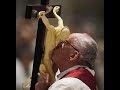

# O Christ Worshippers! - A Poem by Ibn al-Qayyim (2021-02-08)

## Description

Ibn al-Qayyim was an important medieval Islamic jurisconsult, theologian, and spiritual writer. Belonging to the Hanbali school of orthodox Sunni jurisprudence, of which he is regarded as "one of the most important thinkers," Ibn al-Qayyim is today best remembered as the foremost disciple and student of the fourteenth-century Sunni theologian Shaykh Al-Islam Ibn Taymiyyah, with whom he was imprisoned in 1326 for dissenting against established tradition during Ibn Taymiyyah's famous incarceration in the Citadel of Damascus.

## Summary of [O Christ Worshippers! - A Poem by Ibn al-Qayyim](https://www.youtube.com/watch?v=pMB-v2Q5ijU)

*This summary is AI generated - there may be inaccuracies. *

### [00:00:00](https://www.youtube.com/watch?v=pMB-v2Q5ijU&t=0) - [00:00:00](https://www.youtube.com/watch?v=pMB-v2Q5ijU&t=0)

In this poem, Ibn al-Qayyim criticizes Christianity for its lack of logical consistency. He argues that if God was killed as a result of human actions, then he is not a worthy deity. He also questions the reliability of the Bible, and points out that if Christianity is true, then the universe must have come to an end, angels failed to help Jesus during his crucifixion, and enemies could not even reach him to inflict pain.

**[00:00:00](https://www.youtube.com/watch?v=pMB-v2Q5ijU&t=0)** This poem, written by Ibn al-Qayyim, is a hard-hitting criticism of Christianity. It argues that if God was killed as a result of human actions, then he is not a worthy deity. It also questions the reliability of the Bible, and points out that if Christianity is true, then the universe must have come to an end, angels failed to help Jesus during his crucifixion, and enemies could not even reach him to inflict pain.

<h2>Full transcript with timestamps: CLICK TO EXPAND</h2>

[0:00:01](https://youtu.be/pMB-v2Q5ijU?t=1) i love poetry . and there are lots of christian 
poets over the centuries who obviously write    
[0:00:08](https://youtu.be/pMB-v2Q5ijU?t=8) about christianity , about their faith . but i 
couldn't find any christian poetry about islam    
[0:00:14](https://youtu.be/pMB-v2Q5ijU?t=14) but i have been able to find a poem by a muslim 
about christianity . a poem by a chap called    
[0:00:22](https://youtu.be/pMB-v2Q5ijU?t=22) Ibn Qayyim who died in 1350 a.d . now this is a 
really hard hitting poem actually it's called "O    
[0:00:29](https://youtu.be/pMB-v2Q5ijU?t=29) Worshipers of Christ" and it's quite well known .
obviously it was written in arabic and it's   
[0:00:36](https://youtu.be/pMB-v2Q5ijU?t=36) a no-holds-barred kind of criticism of the heart 
of the matter , the muslim objection to christian    
[0:00:43](https://youtu.be/pMB-v2Q5ijU?t=43) belief . and i'm going to read the poem out and 
so i say be aware that it is quite hard-hitting ,  
[0:00:49](https://youtu.be/pMB-v2Q5ijU?t=49) this is not an ecumenical interfaith touchy-feely 
poem this is meant to in a sense refute    
[0:00:55](https://youtu.be/pMB-v2Q5ijU?t=55) some of the claims of christianity but  
Ibn Qayyim was an islamic scholar as    
[0:01:02](https://youtu.be/pMB-v2Q5ijU?t=62) i said who died in 1350 . he was an important 
theologian and a spiritual writer who belonged    
[0:01:09](https://youtu.be/pMB-v2Q5ijU?t=69) to the hanbali school of which he is regarded as 
one of the most important thinkers . he is today    
[0:01:14](https://youtu.be/pMB-v2Q5ijU?t=74) also remembered as the foremost disciple and 
student of the great medieval theologian Ibn Taymiyya .  
[0:01:22](https://youtu.be/pMB-v2Q5ijU?t=82) and his poem as i say is called "O Worshipers 
of Christ" and it goes like this in english  
[0:01:28](https://youtu.be/pMB-v2Q5ijU?t=88) i'm not going to recite it in arabic of course : O 
Worshipers of Christ , we'd like your most wise to    
[0:01:35](https://youtu.be/pMB-v2Q5ijU?t=95) answer our question . if god was murdered by some 
people's actions then what sort of god is this .  
[0:01:43](https://youtu.be/pMB-v2Q5ijU?t=103) and we wonder was he pleased by what they did to 
him if so then blessed are they for they must have    
[0:01:51](https://youtu.be/pMB-v2Q5ijU?t=111) achieved his pleasure . but if he wasn't pleased 
with them then this must mean they overpowered him .  
[0:01:59](https://youtu.be/pMB-v2Q5ijU?t=119) so was this present entity left without a 
god . an all-hearing being who can hear prayers .  
[0:02:06](https://youtu.be/pMB-v2Q5ijU?t=126) and were the heavens vacated when he was placed 
under the earth and the dirt was above him . and    
[0:02:13](https://youtu.be/pMB-v2Q5ijU?t=133) was the universe left without a god to manage 
it while his hands were being nailed down .  
[0:02:19](https://youtu.be/pMB-v2Q5ijU?t=139) and why didn't the angels help him 
when they heard him cry out in pain .  
[0:02:24](https://youtu.be/pMB-v2Q5ijU?t=144) and how could any wooden beam uphold a 
true god while he was being fastened to it .  
[0:02:32](https://youtu.be/pMB-v2Q5ijU?t=152) and could any iron ever be brought to him so that 
it would be driven inside him and cause him pain .  
[0:02:40](https://youtu.be/pMB-v2Q5ijU?t=160) and how could ever his enemies hands ever reach 
him so that they could whip him from behind .  
[0:02:47](https://youtu.be/pMB-v2Q5ijU?t=167) and did this christ revive himself or was there 
another god that brought him to life . how strange    
[0:02:55](https://youtu.be/pMB-v2Q5ijU?t=175) is this . a grave that enclosed a god . and even 
stranger is the womb that enclosed him before .  
[0:03:05](https://youtu.be/pMB-v2Q5ijU?t=185) which he remained inside for nine whole 
months in utter darkness being fed by blood    
[0:03:12](https://youtu.be/pMB-v2Q5ijU?t=192) then he emerged from the womb as a small child 
completely helpless and gaping to be breastfed .  
[0:03:19](https://youtu.be/pMB-v2Q5ijU?t=199) thus he ate , drank and afterwards he answered the 
call which comes naturally . so is this really a god .  
[0:03:28](https://youtu.be/pMB-v2Q5ijU?t=208) highly exalted is allah above the lies of 
christians they will be held accountable    
[0:03:35](https://youtu.be/pMB-v2Q5ijU?t=215) for their fabrications . O Worshipers of Christ 
wake up . for this is what the matter is all about .  
[0:03:46](https://youtu.be/pMB-v2Q5ijU?t=226) so there we go very hard hitting indeed . it 
makes some important points from a muslim point    
[0:03:51](https://youtu.be/pMB-v2Q5ijU?t=231) of view of course . how can god be killed ?
how can the creation have power over the    
[0:03:57](https://youtu.be/pMB-v2Q5ijU?t=237) almighty god ? how can god die ? even the bible 
of course says in several places that god    
[0:04:03](https://youtu.be/pMB-v2Q5ijU?t=243) is eternal and that he does not die that he is 
immortal the bible says that a number of times .  
[0:04:09](https://youtu.be/pMB-v2Q5ijU?t=249) and what was happening to the universe ?
how could the universe be left without a   
[0:04:14](https://youtu.be/pMB-v2Q5ijU?t=254) god to manage it while he was being crucified to 
death . and these the same points , the same arguments    
[0:04:21](https://youtu.be/pMB-v2Q5ijU?t=261) that you'll hear muslims making today 
in objection to the christian faith and    
[0:04:27](https://youtu.be/pMB-v2Q5ijU?t=267) i think they're quite powerful 
arguments and i know the responses    
[0:04:31](https://youtu.be/pMB-v2Q5ijU?t=271) but many people might feel that the responses 
are not always very compelling or very convincing .  
[0:04:39](https://youtu.be/pMB-v2Q5ijU?t=279) but anyway , i hope you found that 
brief poem of interest . till next time  

