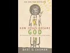

# Problems with the Christian Gospels (2021-01-25 19:06:23+00:00)

## Description

I read from 'How Jesus Became God: The Exaltation of a Jewish Preacher from Galilee' by Professor Bart Ehrman.
https://www.amazon.co.uk/How-Jesus-Became-Bart-Ehrman/dp/0061778184

I recommend this book: 'The Historical Figure of Jesus' by Professor E. P. Sanders https://www.amazon.co.uk/Historical-Figure-Jesus-P-Sanders/dp/0140144994/ref=sr_1_1?dchild=1&keywords=ep+sanders+Jesus&qid=1611599973&s=books&sr=1-1

## Full transcript with timestamps

[0:00:00](https://youtu.be/27AfZmwoJnY?t=0) are the christian gospels historically reliable 
this is such an important question for faith and    
[0:00:08](https://youtu.be/27AfZmwoJnY?t=8) for our knowledge and understanding of one of the 
most important individuals in human history and so    
[0:00:14](https://youtu.be/27AfZmwoJnY?t=14) we need to turn to a guide who is truly an expert 
in the new testament and the historical jesus    
[0:00:21](https://youtu.be/27AfZmwoJnY?t=21) and i tend to share with you the 
research of professor bart ehrmann    
[0:00:27](https://youtu.be/27AfZmwoJnY?t=27) who is the distinguished professor of religious 
studies at the university of north carolina    
[0:00:31](https://youtu.be/27AfZmwoJnY?t=31) chapel hill he's author of more than 20 books and 
is recognized as a master explainer of the issues    
[0:00:39](https://youtu.be/27AfZmwoJnY?t=39) to do with the gospels and the new testament he 
has written this book uh how jesus became god    
[0:00:47](https://youtu.be/27AfZmwoJnY?t=47) the exaltation of a jewish preacher from galilee 
and um there's so much amazing information here    
[0:00:53](https://youtu.be/27AfZmwoJnY?t=53) that i i might take several videos to explain 
many different aspects of this uh subject that    
[0:00:59](https://youtu.be/27AfZmwoJnY?t=59) he explores but in this video i just want 
to talk about the problems with the gospels    
[0:01:06](https://youtu.be/27AfZmwoJnY?t=66) uh so what i want to important point i want to 
make here is that i happen to know that what    
[0:01:11](https://youtu.be/27AfZmwoJnY?t=71) by ehrman says in this chapter is totally 
mainstream if you study the subjects at any    
[0:01:17](https://youtu.be/27AfZmwoJnY?t=77) mainstream university be at oxford or cambridge 
or edinburgh in britain or yale or harvard or    
[0:01:23](https://youtu.be/27AfZmwoJnY?t=83) whatever united states you will find very similar 
things being taught by the leading scholars of    
[0:01:30](https://youtu.be/27AfZmwoJnY?t=90) the day he is not a maverick this is not marginal 
or eccentric this is totally mainstream academic    
[0:01:36](https://youtu.be/27AfZmwoJnY?t=96) scholarship now it doesn't mean you should accept 
it uncritically of course we must think these    
[0:01:41](https://youtu.be/27AfZmwoJnY?t=101) things through for ourselves but nevertheless 
we're dealing with someone who is has a reputation    
[0:01:47](https://youtu.be/27AfZmwoJnY?t=107) for explaining in a very accessible way uh the 
often obscure subject of new testament scholarship    
[0:01:55](https://youtu.be/27AfZmwoJnY?t=115) so when we look at the problems with the 
gospels by ermine says this what we want he says    
[0:02:00](https://youtu.be/27AfZmwoJnY?t=120) if we want historically reliable accounts are 
sources that can be traced back to jesus's own    
[0:02:07](https://youtu.be/27AfZmwoJnY?t=127) time we want ancient sources so to use the islamic 
language we want isn't ads we want to know where    
[0:02:14](https://youtu.be/27AfZmwoJnY?t=134) this information came from who passed it to 
whom did they do they exist are they reliable    
[0:02:20](https://youtu.be/27AfZmwoJnY?t=140) characters and we want to know that there is a 
traceable narration that goes from a to b to c    
[0:02:27](https://youtu.be/27AfZmwoJnY?t=147) he says we do of course have ancient sources 
but they are not as ancient as we would like    
[0:02:33](https://youtu.be/27AfZmwoJnY?t=153) our very first christian author is the apostle 
paul who was writing 20 to 30 years after jesus's    
[0:02:40](https://youtu.be/27AfZmwoJnY?t=160) death a number of paul's letters are included 
in the new testament other christian authors    
[0:02:45](https://youtu.be/27AfZmwoJnY?t=165) may have been writing earlier than paul but none 
of their work survives the problems with paul are    
[0:02:51](https://youtu.be/27AfZmwoJnY?t=171) that he didn't actually know jesus personally and 
he doesn't tell us very much about jesus teaching    
[0:02:59](https://youtu.be/27AfZmwoJnY?t=179) activities or experiences i sometimes give my 
students an assignment to read through all of    
[0:03:06](https://youtu.be/27AfZmwoJnY?t=186) paul's writings and list everything 
paul indicates jesus said and did    
[0:03:11](https://youtu.be/27AfZmwoJnY?t=191) my students are surprised to find that 
they don't even need a three by five card    
[0:03:16](https://youtu.be/27AfZmwoJnY?t=196) to list them paul by the way never says 
that jesus declared himself to be divine    
[0:03:23](https://youtu.be/27AfZmwoJnY?t=203) our next earlier sources of information about the 
historical jesus of course are the gospels of the    
[0:03:29](https://youtu.be/27AfZmwoJnY?t=209) new testament as it turns out these are our best 
sources they are best not because they happen to    
[0:03:35](https://youtu.be/27AfZmwoJnY?t=215) be in the new testament but because they are also 
the earliest narratives of jesus life to survive    
[0:03:41](https://youtu.be/27AfZmwoJnY?t=221) even though they are the best sources available 
to us they really are not as good as we might hope    
[0:03:48](https://youtu.be/27AfZmwoJnY?t=228) this is for several reasons to begin with 
they are not written by eyewitnesses now this    
[0:03:56](https://youtu.be/27AfZmwoJnY?t=236) when one first comes across this idea uh in 
scholars it's quite shocking what do you mean    
[0:04:00](https://youtu.be/27AfZmwoJnY?t=240) matthew is not written by the apostle matthew of 
course he was or john of course it was written by    
[0:04:04](https://youtu.be/27AfZmwoJnY?t=244) the apostle john and so on and it's quite a shock 
to uh maybe it was to me some time ago to learn    
[0:04:11](https://youtu.be/27AfZmwoJnY?t=251) actually the historians do not think that they 
are written by eyewitnesses and by ehrman explains    
[0:04:16](https://youtu.be/27AfZmwoJnY?t=256) why we call these books matthew mark luke and 
john because they are named after two of jesus's    
[0:04:25](https://youtu.be/27AfZmwoJnY?t=265) earthly disciples matthew the tax collector and 
john the baptist and john the beloved disciple    
[0:04:32](https://youtu.be/27AfZmwoJnY?t=272) and two of the close companions of other apostles 
mark the secretary of peter and luke the traveling    
[0:04:39](https://youtu.be/27AfZmwoJnY?t=279) companion of paul but in fact the books were 
written anonymously the authors never identify    
[0:04:47](https://youtu.be/27AfZmwoJnY?t=287) themselves and they circulated for decades before 
anyone claimed they were written by these people    
[0:04:53](https://youtu.be/27AfZmwoJnY?t=293) the first certain attribution of these books 
to these authors is a century after they were    
[0:04:59](https://youtu.be/27AfZmwoJnY?t=299) produced and bartomen doesn't mention but the 
earliest records we have are people like irenaeus    
[0:05:05](https://youtu.be/27AfZmwoJnY?t=305) at the end of the second century who has the 
gospel according to matthew gospel according to    
[0:05:08](https://youtu.be/27AfZmwoJnY?t=308) mark and this is the end of the second century 
not in the first half of the first century    
[0:05:15](https://youtu.be/27AfZmwoJnY?t=315) there are good reasons for thinking that none 
of these attributions is right for one thing    
[0:05:23](https://youtu.be/27AfZmwoJnY?t=323) the followers of jesus as we learn from the new 
testament itself were uneducated lower class    
[0:05:30](https://youtu.be/27AfZmwoJnY?t=330) aramaic speaking jews from palestine in other 
words they were peasants in the sociological sense    
[0:05:37](https://youtu.be/27AfZmwoJnY?t=337) they were uneducated lower class aramaic 
speaking jews from palestine remember    
[0:05:43](https://youtu.be/27AfZmwoJnY?t=343) these books are not written by people like that 
their authors were highly educated greek speaking    
[0:05:50](https://youtu.be/27AfZmwoJnY?t=350) christians of a later generation they probably 
wrote after jesus disciples had all or almost    
[0:05:56](https://youtu.be/27AfZmwoJnY?t=356) all died they were writing in different parts of 
the world in a different language at a later time    
[0:06:03](https://youtu.be/27AfZmwoJnY?t=363) there's not much mystery about why later 
christians would want to claim that the    
[0:06:07](https://youtu.be/27AfZmwoJnY?t=367) authors were in fact companions of jesus or at 
least connected with the apostles that claim    
[0:06:13](https://youtu.be/27AfZmwoJnY?t=373) proved much provided much needed authority for 
these accounts for people wanting to know what    
[0:06:19](https://youtu.be/27AfZmwoJnY?t=379) jesus was really like scholars typically date 
the new testament gospels to the latter part    
[0:06:26](https://youtu.be/27AfZmwoJnY?t=386) of the first century almost everyone would 
agree that jesus died sometime around 30 a.d    
[0:06:32](https://youtu.be/27AfZmwoJnY?t=392) mark was the first gospel to be written probably 
around 65 to 70 a.d matthew and luke were written    
[0:06:38](https://youtu.be/27AfZmwoJnY?t=398) about 15 to 20 years after that say 80-85 a.d john 
was written last around 95 a.d what is significant    
[0:06:50](https://youtu.be/27AfZmwoJnY?t=410) is the amount of is the huge gap involved the very 
first surviving account of jesus life was written    
[0:06:58](https://youtu.be/27AfZmwoJnY?t=418) 35 to 40 years after his death our last canonical 
gospel was written 60 to 65 years after his death    
[0:07:08](https://youtu.be/27AfZmwoJnY?t=428) that's obviously a lot of time if the authors 
were not eyewitnesses and were not from palestine    
[0:07:15](https://youtu.be/27AfZmwoJnY?t=435) and did not even speak the same language as jesus 
where did they get their information so back to    
[0:07:20](https://youtu.be/27AfZmwoJnY?t=440) the the muslim question of islam you know what is 
the source how do we know it's reliable here again    
[0:07:26](https://youtu.be/27AfZmwoJnY?t=446) there's a there's not a lot of agreement among 
critical scholars after jesus died his followers    
[0:07:33](https://youtu.be/27AfZmwoJnY?t=453) came to believe that he was raised from the dead 
and they saw it as their mission to convert people    
[0:07:38](https://youtu.be/27AfZmwoJnY?t=458) to the belief that the death and resurrection of 
jesus were the death and resurrection of god's    
[0:07:44](https://youtu.be/27AfZmwoJnY?t=464) messiah and that by believing in his death and 
resurrection a person could have eternal life    
[0:07:50](https://youtu.be/27AfZmwoJnY?t=470) the early christian witnesses to jesus 
had to persuade people that jesus    
[0:07:56](https://youtu.be/27AfZmwoJnY?t=476) really was the messiah from god and to do that 
they had to tell stories about him so they did    
[0:08:03](https://youtu.be/27AfZmwoJnY?t=483) they told stories about what happened at the end 
of his life the crucifixion the empty tomb his    
[0:08:09](https://youtu.be/27AfZmwoJnY?t=489) appearances to his followers alive afterwards they 
also told stories of his life before those final    
[0:08:16](https://youtu.be/27AfZmwoJnY?t=496) events what he taught the miracles he performed 
the controversies he had with the jewish leaders    
[0:08:22](https://youtu.be/27AfZmwoJnY?t=502) his arrest and trial and so on these tor 
stories circulated anyone who converted to    
[0:08:30](https://youtu.be/27AfZmwoJnY?t=510) become a follower of jesus could and did tell 
the stories a neighbor would tell his wife    
[0:08:36](https://youtu.be/27AfZmwoJnY?t=516) if she converted she would tell her neighbor if 
she converted she would tell her husband if he    
[0:08:41](https://youtu.be/27AfZmwoJnY?t=521) converted he would tell his business partner if 
he converted he would take a business trip to    
[0:08:47](https://youtu.be/27AfZmwoJnY?t=527) another city and tell his business associate if he 
converted he would tell his wife if she converted    
[0:08:54](https://youtu.be/27AfZmwoJnY?t=534) she would tell her neighbor and on and on telling 
stories was the only way to communicate in the    
[0:09:03](https://youtu.be/27AfZmwoJnY?t=543) days before mass communication national media 
coverage and even significant levels of literacy    
[0:09:11](https://youtu.be/27AfZmwoJnY?t=551) at that time only 10 percent of 
the population could read and write    
[0:09:15](https://youtu.be/27AfZmwoJnY?t=555) so almost all communication was oral who 
then was telling the stories about jesus    
[0:09:25](https://youtu.be/27AfZmwoJnY?t=565) just the apostles it can't just have been the 
apostles just the people whom the apostles    
[0:09:31](https://youtu.be/27AfZmwoJnY?t=571) authorized no way just the people who checked 
their facts to make sure they didn't change    
[0:09:37](https://youtu.be/27AfZmwoJnY?t=577) any of the stories but only recounted events 
that really happened and as they happened    
[0:09:43](https://youtu.be/27AfZmwoJnY?t=583) how could they do that the stories have been told 
by word of mouth year after year decade after    
[0:09:51](https://youtu.be/27AfZmwoJnY?t=591) decade among lots of people in different parts 
of the world in different languages and there    
[0:09:57](https://youtu.be/27AfZmwoJnY?t=597) was no way to control what one person said to the 
next about jesus's words and deeds everyone knows    
[0:10:05](https://youtu.be/27AfZmwoJnY?t=605) what happens to stories that circulate in this 
way details get changed episodes get invented    
[0:10:12](https://youtu.be/27AfZmwoJnY?t=612) events get exaggerated impressive accounts 
get made even more impressive and so on    
[0:10:20](https://youtu.be/27AfZmwoJnY?t=620) eventually an author heard the stories in his 
church say say it was mark in the city of rome    
[0:10:26](https://youtu.be/27AfZmwoJnY?t=626) and he wrote his account and 10 or 15 years later 
another author in another city read mark's account    
[0:10:33](https://youtu.be/27AfZmwoJnY?t=633) and decides to write his own based primarily 
or partially on mark's account but partially on    
[0:10:40](https://youtu.be/27AfZmwoJnY?t=640) the stories he had heard in his own community 
and the gospels started coming into existence    
[0:10:49](https://youtu.be/27AfZmwoJnY?t=649) those are the gospels we now have scholars for 
300 years and more have studied them in my new    
[0:10:55](https://youtu.be/27AfZmwoJnY?t=655) detail and one of the assured results of this 
intensive investigation is the certainty that the    
[0:11:02](https://youtu.be/27AfZmwoJnY?t=662) gospels have numerous discrepancies contradictions 
and historical problems why would that be it would    
[0:11:11](https://youtu.be/27AfZmwoJnY?t=671) be better to ask how could that not be of course 
the gospels contain non-historical information and    
[0:11:18](https://youtu.be/27AfZmwoJnY?t=678) stories that have been modified and exaggerated 
and embellished these books do not contain the    
[0:11:25](https://youtu.be/27AfZmwoJnY?t=685) words of someone who was sitting at jesus 
feet taking notes they are nothing like that    
[0:11:31](https://youtu.be/27AfZmwoJnY?t=691) they are books that are intending to tell the good 
news of jesus the word gospel means good news in    
[0:11:37](https://youtu.be/27AfZmwoJnY?t=697) greek that is their authors had a vested interest 
both in what they are telling and then how they    
[0:11:44](https://youtu.be/27AfZmwoJnY?t=704) are telling it they wanted to preach jesus they 
were not trying to give biographical information    
[0:11:50](https://youtu.be/27AfZmwoJnY?t=710) that will pass muster among critical historians 
living two thousand years later who have developed    
[0:11:56](https://youtu.be/27AfZmwoJnY?t=716) significantly different standards of writing 
history or historiography they are writing    
[0:12:02](https://youtu.be/27AfZmwoJnY?t=722) for their own day and were trying to convince 
people about the truth as they saw it about jesus    
[0:12:09](https://youtu.be/27AfZmwoJnY?t=729) they were basing their stories on what they 
had heard and and read what they had read was    
[0:12:15](https://youtu.be/27AfZmwoJnY?t=735) based on what the authors of these writings 
had heard it all goes back to oral tradition    
[0:12:22](https://youtu.be/27AfZmwoJnY?t=742) some people today claim that cultures rooted 
in oral tradition are far more careful to make    
[0:12:27](https://youtu.be/27AfZmwoJnY?t=747) certain that traditions that are told and retold 
are not changed significantly this turns out to    
[0:12:33](https://youtu.be/27AfZmwoJnY?t=753) be a modern myth however anthropologists who have 
studied oral cultures show just the opposite is    
[0:12:39](https://youtu.be/27AfZmwoJnY?t=759) the case only literary cultures have a concern for 
exact replication of the facts as they really are    
[0:12:48](https://youtu.be/27AfZmwoJnY?t=768) and this is because in literary cultures it is 
possible to check the sources to see whether    
[0:12:53](https://youtu.be/27AfZmwoJnY?t=773) someone has changed the story in oral cultures 
it is widely expected that stories will indeed    
[0:12:59](https://youtu.be/27AfZmwoJnY?t=779) change they change any time a storyteller is 
telling a story in a new context new context    
[0:13:06](https://youtu.be/27AfZmwoJnY?t=786) require new ways of telling stories thus oral 
cultures historically have been no pro have seen    
[0:13:14](https://youtu.be/27AfZmwoJnY?t=794) no problem with altering accounts as they 
were told and retold so of course there are    
[0:13:20](https://youtu.be/27AfZmwoJnY?t=800) discrepancies embellishments made up stories and 
historical problems in the gospels and this means    
[0:13:26](https://youtu.be/27AfZmwoJnY?t=806) that they cannot be taken at face value as giving 
us historically accurate accounts for what really    
[0:13:31](https://youtu.be/27AfZmwoJnY?t=811) happened does this mean the gospels are useless 
no it means that we need to have a rigorous    
[0:13:37](https://youtu.be/27AfZmwoJnY?t=817) historical methodology to help us examine books 
that were written for one purpose to proclaim    
[0:13:42](https://youtu.be/27AfZmwoJnY?t=822) the good news of jesus to achieve a different 
purpose to know what jesus really said and did    
[0:13:51](https://youtu.be/27AfZmwoJnY?t=831) and that is uh bar ehrman as i say this is 
totally mainstream that's what you'll learn    
[0:13:56](https://youtu.be/27AfZmwoJnY?t=836) about at university if you study this subject 
academically and if you uh if you want to    
[0:14:02](https://youtu.be/27AfZmwoJnY?t=842) study this uh for yourself uh this is the best 
introductory book the historical figure of jesus    
[0:14:07](https://youtu.be/27AfZmwoJnY?t=847) by ep sanders he's america's most distinguished 
scholar in the field of jesus research    
[0:14:13](https://youtu.be/27AfZmwoJnY?t=853) and this is commonly seen as the best go-to 
uh academic introduction to the historical    
[0:14:19](https://youtu.be/27AfZmwoJnY?t=859) figure of jesus ep saunders i'll put a link in 
the description below for you until next time  
