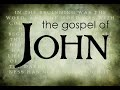

# Prof Dale Martin: Surprises in the Gospel of John (2021-07-16)

## Description

We continue our series of talks on the New Testament with the Gospel of John. Professor Dale Martin is a distinguished American New Testament scholar who taught at Yale University for over 30 years. See his excellent Introduction to New Testament History and Literature (Open Yale Courses) https://www.amazon.com/Testament-History-Literature-Open-Courses/dp/0300180853

## Summary of [Prof Dale Martin: Surprises in the Gospel of John](https://www.youtube.com/watch?v=cjCRhgD_XIQ)

*This summary is AI generated - there may be inaccuracies. *

### [00:00:00](https://www.youtube.com/watch?v=cjCRhgD_XIQ&t=0) - [00:50:00](https://www.youtube.com/watch?v=cjCRhgD_XIQ&t=3000)

 Dale Martin discusses the differences between the Gospel of John and the other New Testament gospels. He argues that John was not written by an eyewitness, but by someone who was familiar with the other gospels. He also discusses how the gospel was edited and changed over time, and how this affects the various Christological statements in the text.

**[00:00:00](https://www.youtube.com/watch?v=cjCRhgD_XIQ&t=0)**  Prof. Dale Martin discusses the differences between the Gospel of John and the Synoptics. He points out that John is full of long speeches and has a carefully constructed narrative, which suggests that the author knew the other two gospels. He also argues that the author was not a disciple of Jesus, due to the mistakes he makes in comparison to the other gospels.
* **[00:05:00](https://www.youtube.com/watch?v=cjCRhgD_XIQ&t=300)**  Professor Dale Martin discusses how the Gospel of John was not originally written by an eyewitness, but by someone who was actually one of the most talented writers in the New Testament. He points out that the arguments over what to include in the Bible were based more on theology than on authorial or dating issues, and that John became suspect because it was the favorite gospel of Gnostics.
* **[00:10:00](https://www.youtube.com/watch?v=cjCRhgD_XIQ&t=600)** The Gospel of John is unique among the New Testament writings in that it begins with the discussion of the divine logos. There was controversy over this aspect of the gospel among early Christians, as it was seen as divisive. However, John's popularity among Christians of the East is evidence that the message of the gospel was resonating.
* **[00:15:00](https://www.youtube.com/watch?v=cjCRhgD_XIQ&t=900)**  Professor Dale Martin discusses how the gospel of John was edited and changed over time, and how this affects the various Christological statements in the text. He credits scholar Louis Martin for helping to popularize this approach to understanding the gospel.
* **[00:20:00](https://www.youtube.com/watch?v=cjCRhgD_XIQ&t=1200)** Dale Martin discusses the different layers of Christology found in the Gospel of John. He explains that this makes the gospel difficult to understand, as it depends on which layer the listener is at. Martin argues that the idea of a break between the community of John and other jews after the time of Jesus makes sense, and that it has found wide acceptance in the scholarly community.
* **[00:25:00](https://www.youtube.com/watch?v=cjCRhgD_XIQ&t=1500)** This professor discusses how the meaning of a text is something that readers can figure out for themselves and how the interpretation of a text should not be based only on the author's intentions. He also discusses how there is no difference between the way the new testament is read and the way texts in other religions are read.
* **[00:30:00](https://www.youtube.com/watch?v=cjCRhgD_XIQ&t=1800)** Dale Martin, a professor of New Testament studies, discusses how the gospel of John differs from other parts of the New Testament and how it is not a historical record of the life of Jesus.
* **[00:35:00](https://www.youtube.com/watch?v=cjCRhgD_XIQ&t=2100)**  Professor Dale Martin discusses how the Bible is closer to being poetry than an owner's manual. He argues that this shift away from a "fundamentalist" approach to scripture is necessary for scholars in the 21st century.
* **[00:40:00](https://www.youtube.com/watch?v=cjCRhgD_XIQ&t=2400)** In "Prof Dale Martin: Surprises in the Gospel of John," Professor Dale Martin discusses how rationality and empiricism can both be applied to the gospel of John, which makes it difficult to determine certain details. He goes on to say that scripture is not meant to be understood in a certain way, but rather read and experienced. Finally, he argues that all different interpretations of the gospel are valuable.
* **[00:45:00](https://www.youtube.com/watch?v=cjCRhgD_XIQ&t=2700)** , Prof. Dale Martin discusses some of the surprises in the Gospel of John. He discusses how the author or some precursor changed the crucifixion scene to make Jesus fix the Passover, and why Nicodemus is possibly historical. He also recommends a book by Dale Martin on New Testament history and literature.
* **[00:50:00](https://www.youtube.com/watch?v=cjCRhgD_XIQ&t=3000)**  Dale Martin discusses surprises in the Gospel of John. He recommends the work of Urbans and says that he has experienced academia being a rare virtue. He ends the video by saying that he is fine and that he hopes viewers have also benefited from the talk.

<h2>Full transcript with timestamps: CLICK TO EXPAND</h2>

[0:00:02](https://youtu.be/cjCRhgD_XIQ?t=2) she speaks with an american accent  
[0:00:05](https://youtu.be/cjCRhgD_XIQ?t=5) uh good evening everyone and welcome to  
[0:00:08](https://youtu.be/cjCRhgD_XIQ?t=8) blogging theology  
[0:00:09](https://youtu.be/cjCRhgD_XIQ?t=9) and um as you can see we are with our  
[0:00:12](https://youtu.be/cjCRhgD_XIQ?t=12) very esteemed guest professor dale  
[0:00:14](https://youtu.be/cjCRhgD_XIQ?t=14) martin i will just  
[0:00:16](https://youtu.be/cjCRhgD_XIQ?t=16) straight off the bat say apologies for  
[0:00:18](https://youtu.be/cjCRhgD_XIQ?t=18) my fuzziness  
[0:00:20](https://youtu.be/cjCRhgD_XIQ?t=20) um but uh dale is uh crystal clear i  
[0:00:22](https://youtu.be/cjCRhgD_XIQ?t=22) think  
[0:00:23](https://youtu.be/cjCRhgD_XIQ?t=23) um and that's what really matters uh  
[0:00:25](https://youtu.be/cjCRhgD_XIQ?t=25) we're recording this  
[0:00:26](https://youtu.be/cjCRhgD_XIQ?t=26) on zoom uh because we've had technical  
[0:00:28](https://youtu.be/cjCRhgD_XIQ?t=28) problems so  
[0:00:30](https://youtu.be/cjCRhgD_XIQ?t=30) um i've not had time to sort out my own  
[0:00:32](https://youtu.be/cjCRhgD_XIQ?t=32) fuzziness  
[0:00:33](https://youtu.be/cjCRhgD_XIQ?t=33) i don't really mind about that it's  
[0:00:34](https://youtu.be/cjCRhgD_XIQ?t=34) seeing and hearing dale very clearly  
[0:00:36](https://youtu.be/cjCRhgD_XIQ?t=36) that really matters  
[0:00:37](https://youtu.be/cjCRhgD_XIQ?t=37) so welcome dale back to blogging  
[0:00:39](https://youtu.be/cjCRhgD_XIQ?t=39) theology  
[0:00:42](https://youtu.be/cjCRhgD_XIQ?t=42) and um today we're going to be talking  
[0:00:44](https://youtu.be/cjCRhgD_XIQ?t=44) about uh the gospel of john  
[0:00:46](https://youtu.be/cjCRhgD_XIQ?t=46) and uh i'm drawing as usual on the book  
[0:00:50](https://youtu.be/cjCRhgD_XIQ?t=50) by dale martin  
[0:00:51](https://youtu.be/cjCRhgD_XIQ?t=51) called new testament history and  
[0:00:53](https://youtu.be/cjCRhgD_XIQ?t=53) literature this is  
[0:00:54](https://youtu.be/cjCRhgD_XIQ?t=54) an undergraduate text published by yale  
[0:00:56](https://youtu.be/cjCRhgD_XIQ?t=56) university uh which is kind of  
[0:00:58](https://youtu.be/cjCRhgD_XIQ?t=58) a transcript or re-edited form of  
[0:01:01](https://youtu.be/cjCRhgD_XIQ?t=61) lectures that he gave to undergraduates  
[0:01:03](https://youtu.be/cjCRhgD_XIQ?t=63) at yale  
[0:01:04](https://youtu.be/cjCRhgD_XIQ?t=64) uh introducing them to the new testament  
[0:01:06](https://youtu.be/cjCRhgD_XIQ?t=66) the historical jesus and  
[0:01:08](https://youtu.be/cjCRhgD_XIQ?t=68) and the nature of history historiography  
[0:01:11](https://youtu.be/cjCRhgD_XIQ?t=71) authorship date and so on and it's very  
[0:01:14](https://youtu.be/cjCRhgD_XIQ?t=74) readable  
[0:01:15](https://youtu.be/cjCRhgD_XIQ?t=75) i do recommend it so i'm going to just  
[0:01:17](https://youtu.be/cjCRhgD_XIQ?t=77) quote briefly the overview that daley  
[0:01:19](https://youtu.be/cjCRhgD_XIQ?t=79) himself gives at the beginning of his  
[0:01:20](https://youtu.be/cjCRhgD_XIQ?t=80) chapter  
[0:01:21](https://youtu.be/cjCRhgD_XIQ?t=81) on the gospel of john and then ask dale  
[0:01:24](https://youtu.be/cjCRhgD_XIQ?t=84) to expand and then there's a couple of  
[0:01:26](https://youtu.be/cjCRhgD_XIQ?t=86) questions  
[0:01:26](https://youtu.be/cjCRhgD_XIQ?t=86) uh also i want to ask him to address if  
[0:01:29](https://youtu.be/cjCRhgD_XIQ?t=89) he's up for that so  
[0:01:31](https://youtu.be/cjCRhgD_XIQ?t=91) um dale writes uh at the beginning of  
[0:01:34](https://youtu.be/cjCRhgD_XIQ?t=94) his  
[0:01:35](https://youtu.be/cjCRhgD_XIQ?t=95) book uh sorry a chapter on the gospel of  
[0:01:37](https://youtu.be/cjCRhgD_XIQ?t=97) john the gospel of john  
[0:01:39](https://youtu.be/cjCRhgD_XIQ?t=99) is dramatically different from the  
[0:01:41](https://youtu.be/cjCRhgD_XIQ?t=101) synoptic gospels that's matthew mark and  
[0:01:44](https://youtu.be/cjCRhgD_XIQ?t=104) luke of course  
[0:01:45](https://youtu.be/cjCRhgD_XIQ?t=105) it is full of long dialogues and speaks  
[0:01:48](https://youtu.be/cjCRhgD_XIQ?t=108) of signs  
[0:01:49](https://youtu.be/cjCRhgD_XIQ?t=109) rather than exorcisms or miracles  
[0:01:52](https://youtu.be/cjCRhgD_XIQ?t=112) and its narrative differs at many points  
[0:01:55](https://youtu.be/cjCRhgD_XIQ?t=115) from the synoptics  
[0:01:56](https://youtu.be/cjCRhgD_XIQ?t=116) the themes themes in the gospel of john  
[0:01:59](https://youtu.be/cjCRhgD_XIQ?t=119) are also repeated throughout  
[0:02:01](https://youtu.be/cjCRhgD_XIQ?t=121) themes such as ascending and descending  
[0:02:04](https://youtu.be/cjCRhgD_XIQ?t=124) light and darkness seeing and knowing  
[0:02:09](https://youtu.be/cjCRhgD_XIQ?t=129) johannine literature presents a high  
[0:02:12](https://youtu.be/cjCRhgD_XIQ?t=132) christology  
[0:02:13](https://youtu.be/cjCRhgD_XIQ?t=133) that requires jesus sorry that equates  
[0:02:16](https://youtu.be/cjCRhgD_XIQ?t=136) jesus with god  
[0:02:18](https://youtu.be/cjCRhgD_XIQ?t=138) the gospel also reflects the sectarian  
[0:02:20](https://youtu.be/cjCRhgD_XIQ?t=140) nature  
[0:02:21](https://youtu.be/cjCRhgD_XIQ?t=141) of the community to which the author  
[0:02:23](https://youtu.be/cjCRhgD_XIQ?t=143) belonged  
[0:02:25](https://youtu.be/cjCRhgD_XIQ?t=145) so that's the the overview very succinct  
[0:02:27](https://youtu.be/cjCRhgD_XIQ?t=147) overview to the gospel  
[0:02:29](https://youtu.be/cjCRhgD_XIQ?t=149) i just want to begin by asking you dale  
[0:02:31](https://youtu.be/cjCRhgD_XIQ?t=151) most of us think that  
[0:02:33](https://youtu.be/cjCRhgD_XIQ?t=153) the apostle john the beloved disciple  
[0:02:35](https://youtu.be/cjCRhgD_XIQ?t=155) that the the gospel refers to  
[0:02:38](https://youtu.be/cjCRhgD_XIQ?t=158) is the author of the gospel and thus it  
[0:02:41](https://youtu.be/cjCRhgD_XIQ?t=161) is an  
[0:02:41](https://youtu.be/cjCRhgD_XIQ?t=161) eyewitness account of the life and  
[0:02:44](https://youtu.be/cjCRhgD_XIQ?t=164) ministry and death and resurrection of  
[0:02:46](https://youtu.be/cjCRhgD_XIQ?t=166) jesus  
[0:02:47](https://youtu.be/cjCRhgD_XIQ?t=167) and yet i suspect that historians these  
[0:02:49](https://youtu.be/cjCRhgD_XIQ?t=169) days don't think that  
[0:02:51](https://youtu.be/cjCRhgD_XIQ?t=171) why would they doubt such an obvious  
[0:02:53](https://youtu.be/cjCRhgD_XIQ?t=173) conclusion of traditional  
[0:02:54](https://youtu.be/cjCRhgD_XIQ?t=174) christian views  
[0:02:58](https://youtu.be/cjCRhgD_XIQ?t=178) well let's start with the first thing we  
[0:03:00](https://youtu.be/cjCRhgD_XIQ?t=180) should start with which is the evidence  
[0:03:05](https://youtu.be/cjCRhgD_XIQ?t=185) you know you said there's you know very  
[0:03:08](https://youtu.be/cjCRhgD_XIQ?t=188) similitude in this  
[0:03:10](https://youtu.be/cjCRhgD_XIQ?t=190) gospel that is it looks like it should  
[0:03:13](https://youtu.be/cjCRhgD_XIQ?t=193) be real and historical yes but if you  
[0:03:16](https://youtu.be/cjCRhgD_XIQ?t=196) actually compare it  
[0:03:17](https://youtu.be/cjCRhgD_XIQ?t=197) with the other three gospels um  
[0:03:22](https://youtu.be/cjCRhgD_XIQ?t=202) you start getting the impression that  
[0:03:25](https://youtu.be/cjCRhgD_XIQ?t=205) they might be closer to what actually  
[0:03:28](https://youtu.be/cjCRhgD_XIQ?t=208) happened than  
[0:03:29](https://youtu.be/cjCRhgD_XIQ?t=209) john was john  
[0:03:32](https://youtu.be/cjCRhgD_XIQ?t=212) looks later he has these long speeches  
[0:03:36](https://youtu.be/cjCRhgD_XIQ?t=216) the the the narrative is carefully  
[0:03:39](https://youtu.be/cjCRhgD_XIQ?t=219) constructed to fit a certain pattern  
[0:03:42](https://youtu.be/cjCRhgD_XIQ?t=222) of from the dark galilee to the  
[0:03:46](https://youtu.be/cjCRhgD_XIQ?t=226) i mean the bright galilee to the dark  
[0:03:48](https://youtu.be/cjCRhgD_XIQ?t=228) jerusalem  
[0:03:49](https://youtu.be/cjCRhgD_XIQ?t=229) um there's there's just so many things  
[0:03:53](https://youtu.be/cjCRhgD_XIQ?t=233) about the gospel  
[0:03:54](https://youtu.be/cjCRhgD_XIQ?t=234) john that make you think whoever wrote  
[0:03:57](https://youtu.be/cjCRhgD_XIQ?t=237) this took a lot of time at it  
[0:04:00](https://youtu.be/cjCRhgD_XIQ?t=240) and was very smart about it  
[0:04:04](https://youtu.be/cjCRhgD_XIQ?t=244) and probably i think that  
[0:04:07](https://youtu.be/cjCRhgD_XIQ?t=247) whoever wrote the gospel of john may  
[0:04:09](https://youtu.be/cjCRhgD_XIQ?t=249) have known  
[0:04:10](https://youtu.be/cjCRhgD_XIQ?t=250) the gospels of mark and luke because  
[0:04:13](https://youtu.be/cjCRhgD_XIQ?t=253) there  
[0:04:14](https://youtu.be/cjCRhgD_XIQ?t=254) are striking uh similarities  
[0:04:18](https://youtu.be/cjCRhgD_XIQ?t=258) um at parts and so you think well  
[0:04:22](https://youtu.be/cjCRhgD_XIQ?t=262) you know if if this person did not at  
[0:04:25](https://youtu.be/cjCRhgD_XIQ?t=265) all know  
[0:04:26](https://youtu.be/cjCRhgD_XIQ?t=266) any of the other gospels why  
[0:04:29](https://youtu.be/cjCRhgD_XIQ?t=269) why did he write his story just like  
[0:04:32](https://youtu.be/cjCRhgD_XIQ?t=272) this  
[0:04:33](https://youtu.be/cjCRhgD_XIQ?t=273) um so that's the kind of thing that make  
[0:04:37](https://youtu.be/cjCRhgD_XIQ?t=277) me think that the whoever wrote the  
[0:04:39](https://youtu.be/cjCRhgD_XIQ?t=279) gospel john  
[0:04:42](https://youtu.be/cjCRhgD_XIQ?t=282) was not a disciple of jesus because  
[0:04:46](https://youtu.be/cjCRhgD_XIQ?t=286) he gets too much wrong  
[0:04:51](https://youtu.be/cjCRhgD_XIQ?t=291) if we use any of our other sources  
[0:04:54](https://youtu.be/cjCRhgD_XIQ?t=294) for the historical jesus which  
[0:04:57](https://youtu.be/cjCRhgD_XIQ?t=297) include matthew mark luke and maybe  
[0:05:00](https://youtu.be/cjCRhgD_XIQ?t=300) thomas  
[0:05:04](https://youtu.be/cjCRhgD_XIQ?t=304) and the letters of paul  
[0:05:08](https://youtu.be/cjCRhgD_XIQ?t=308) so  
[0:05:11](https://youtu.be/cjCRhgD_XIQ?t=311) i think it's just remarkable that the  
[0:05:13](https://youtu.be/cjCRhgD_XIQ?t=313) gospel of john  
[0:05:15](https://youtu.be/cjCRhgD_XIQ?t=315) is not written by an eyewitness but is  
[0:05:18](https://youtu.be/cjCRhgD_XIQ?t=318) written by someone  
[0:05:20](https://youtu.be/cjCRhgD_XIQ?t=320) who is actually one of the most talented  
[0:05:24](https://youtu.be/cjCRhgD_XIQ?t=324) writers we have in our new testament  
[0:05:28](https://youtu.be/cjCRhgD_XIQ?t=328) okay so when is it likely to be written  
[0:05:31](https://youtu.be/cjCRhgD_XIQ?t=331) if it took  
[0:05:32](https://youtu.be/cjCRhgD_XIQ?t=332) time to develop these uh these themes  
[0:05:34](https://youtu.be/cjCRhgD_XIQ?t=334) that we see in john which are  
[0:05:37](https://youtu.be/cjCRhgD_XIQ?t=337) quite distinct you know light darkness  
[0:05:39](https://youtu.be/cjCRhgD_XIQ?t=339) ascending descending  
[0:05:41](https://youtu.be/cjCRhgD_XIQ?t=341) knowledge so are we looking at towards  
[0:05:44](https://youtu.be/cjCRhgD_XIQ?t=344) what the end of the first century  
[0:05:45](https://youtu.be/cjCRhgD_XIQ?t=345) or the second century even  
[0:05:48](https://youtu.be/cjCRhgD_XIQ?t=348) um i would have to say  
[0:05:52](https://youtu.be/cjCRhgD_XIQ?t=352) not before the 90s  
[0:05:56](https://youtu.be/cjCRhgD_XIQ?t=356) so the end of the first century right  
[0:06:00](https://youtu.be/cjCRhgD_XIQ?t=360) but as to when how late it is  
[0:06:04](https://youtu.be/cjCRhgD_XIQ?t=364) i oh i'm not very good about this i  
[0:06:07](https://youtu.be/cjCRhgD_XIQ?t=367) would  
[0:06:07](https://youtu.be/cjCRhgD_XIQ?t=367) want to go and see when uh different  
[0:06:11](https://youtu.be/cjCRhgD_XIQ?t=371) second century authors  
[0:06:14](https://youtu.be/cjCRhgD_XIQ?t=374) mention the gospel of john  
[0:06:18](https://youtu.be/cjCRhgD_XIQ?t=378) um  
[0:06:22](https://youtu.be/cjCRhgD_XIQ?t=382) so you know off the top of my head  
[0:06:25](https://youtu.be/cjCRhgD_XIQ?t=385) justin martyr  
[0:06:27](https://youtu.be/cjCRhgD_XIQ?t=387) who was martyred around the year 150  
[0:06:30](https://youtu.be/cjCRhgD_XIQ?t=390) i think that i remember that he seems to  
[0:06:34](https://youtu.be/cjCRhgD_XIQ?t=394) know the gospel of john well  
[0:06:37](https://youtu.be/cjCRhgD_XIQ?t=397) um so that would just  
[0:06:40](https://youtu.be/cjCRhgD_XIQ?t=400) i mean any time between i would put the  
[0:06:44](https://youtu.be/cjCRhgD_XIQ?t=404) writing of the gospel of john anytime  
[0:06:46](https://youtu.be/cjCRhgD_XIQ?t=406) between 90 and 140.  
[0:06:48](https://youtu.be/cjCRhgD_XIQ?t=408) right so it could be second century then  
[0:06:51](https://youtu.be/cjCRhgD_XIQ?t=411) clearly yes  
[0:06:52](https://youtu.be/cjCRhgD_XIQ?t=412) yes clearly that's uh quite late um  
[0:06:55](https://youtu.be/cjCRhgD_XIQ?t=415) is he not quoted say in some of the  
[0:06:57](https://youtu.be/cjCRhgD_XIQ?t=417) apostolic fathers i don't know in  
[0:06:59](https://youtu.be/cjCRhgD_XIQ?t=419) clement  
[0:06:59](https://youtu.be/cjCRhgD_XIQ?t=419) of rome that famous letter that the the  
[0:07:02](https://youtu.be/cjCRhgD_XIQ?t=422) person called clement wrote to the  
[0:07:04](https://youtu.be/cjCRhgD_XIQ?t=424) corinthians in the 90s uh  
[0:07:05](https://youtu.be/cjCRhgD_XIQ?t=425) and what about ignatius of antioch who  
[0:07:07](https://youtu.be/cjCRhgD_XIQ?t=427) wrote those seven now  
[0:07:09](https://youtu.be/cjCRhgD_XIQ?t=429) authentic letters to the various  
[0:07:11](https://youtu.be/cjCRhgD_XIQ?t=431) churches  
[0:07:12](https://youtu.be/cjCRhgD_XIQ?t=432) very early in the second century to  
[0:07:14](https://youtu.be/cjCRhgD_XIQ?t=434) either of these writers do you know  
[0:07:15](https://youtu.be/cjCRhgD_XIQ?t=435) quote from john  
[0:07:16](https://youtu.be/cjCRhgD_XIQ?t=436) or have joe hanine words well  
[0:07:20](https://youtu.be/cjCRhgD_XIQ?t=440) those those are the right questions to  
[0:07:22](https://youtu.be/cjCRhgD_XIQ?t=442) ask and i'm sorry i'm  
[0:07:23](https://youtu.be/cjCRhgD_XIQ?t=443) i'm not up on this this is just not one  
[0:07:25](https://youtu.be/cjCRhgD_XIQ?t=445) of my fields of expertise but  
[0:07:29](https://youtu.be/cjCRhgD_XIQ?t=449) um i just don't know  
[0:07:33](https://youtu.be/cjCRhgD_XIQ?t=453) whether ignitious so ignatius's letters  
[0:07:36](https://youtu.be/cjCRhgD_XIQ?t=456) come from around 110 to 112.  
[0:07:39](https://youtu.be/cjCRhgD_XIQ?t=459) yeah um and  
[0:07:44](https://youtu.be/cjCRhgD_XIQ?t=464) clement of alexandria well  
[0:07:47](https://youtu.be/cjCRhgD_XIQ?t=467) that's not so early because most of  
[0:07:50](https://youtu.be/cjCRhgD_XIQ?t=470) those  
[0:07:51](https://youtu.be/cjCRhgD_XIQ?t=471) sorry clements of rome who the whole  
[0:07:53](https://youtu.be/cjCRhgD_XIQ?t=473) president of wrong actually  
[0:07:55](https://youtu.be/cjCRhgD_XIQ?t=475) the corinthians uh in 1896 approximately  
[0:07:59](https://youtu.be/cjCRhgD_XIQ?t=479) yeah but but even then we don't really  
[0:08:02](https://youtu.be/cjCRhgD_XIQ?t=482) know who wrote  
[0:08:03](https://youtu.be/cjCRhgD_XIQ?t=483) any of that or exactly when it came  
[0:08:05](https://youtu.be/cjCRhgD_XIQ?t=485) about um  
[0:08:07](https://youtu.be/cjCRhgD_XIQ?t=487) but you're right it would probably be  
[0:08:09](https://youtu.be/cjCRhgD_XIQ?t=489) early first century so  
[0:08:11](https://youtu.be/cjCRhgD_XIQ?t=491) if either of those writers um explicitly  
[0:08:15](https://youtu.be/cjCRhgD_XIQ?t=495) quoted the gospel of john then that  
[0:08:16](https://youtu.be/cjCRhgD_XIQ?t=496) would  
[0:08:17](https://youtu.be/cjCRhgD_XIQ?t=497) prove an earlier dating for it  
[0:08:20](https://youtu.be/cjCRhgD_XIQ?t=500) yeah i'm not aware that they they ever  
[0:08:22](https://youtu.be/cjCRhgD_XIQ?t=502) did actually i was just seeking  
[0:08:24](https://youtu.be/cjCRhgD_XIQ?t=504) confirmation i don't think they they did  
[0:08:25](https://youtu.be/cjCRhgD_XIQ?t=505) quote john in any obvious way at all  
[0:08:28](https://youtu.be/cjCRhgD_XIQ?t=508) uh there's synoptics yes matthew and so  
[0:08:30](https://youtu.be/cjCRhgD_XIQ?t=510) on but not  
[0:08:31](https://youtu.be/cjCRhgD_XIQ?t=511) john but is it again i don't want to  
[0:08:33](https://youtu.be/cjCRhgD_XIQ?t=513) push you into areas where you're not  
[0:08:34](https://youtu.be/cjCRhgD_XIQ?t=514) uh comfortable but what wasn't there  
[0:08:36](https://youtu.be/cjCRhgD_XIQ?t=516) some hesitancy  
[0:08:38](https://youtu.be/cjCRhgD_XIQ?t=518) uh in the part of the early church or  
[0:08:40](https://youtu.be/cjCRhgD_XIQ?t=520) some parts of the early church and  
[0:08:42](https://youtu.be/cjCRhgD_XIQ?t=522) accepting john  
[0:08:43](https://youtu.be/cjCRhgD_XIQ?t=523) as scripture as authoritative because of  
[0:08:46](https://youtu.be/cjCRhgD_XIQ?t=526) the use that it was made of by  
[0:08:47](https://youtu.be/cjCRhgD_XIQ?t=527) uh people called gnostics you had this  
[0:08:50](https://youtu.be/cjCRhgD_XIQ?t=530) uh  
[0:08:51](https://youtu.be/cjCRhgD_XIQ?t=531) uh obsession but this kind of idea that  
[0:08:53](https://youtu.be/cjCRhgD_XIQ?t=533) it was through knowledge through gnosis  
[0:08:55](https://youtu.be/cjCRhgD_XIQ?t=535) that one um acquired uh salvation and a  
[0:08:58](https://youtu.be/cjCRhgD_XIQ?t=538) theme that kind of  
[0:09:00](https://youtu.be/cjCRhgD_XIQ?t=540) then in some way in john itself it talks  
[0:09:02](https://youtu.be/cjCRhgD_XIQ?t=542) about knowledge  
[0:09:04](https://youtu.be/cjCRhgD_XIQ?t=544) uh knowing god  
[0:09:07](https://youtu.be/cjCRhgD_XIQ?t=547) yes um  
[0:09:10](https://youtu.be/cjCRhgD_XIQ?t=550) most people tend to think that the  
[0:09:14](https://youtu.be/cjCRhgD_XIQ?t=554) arguments in the early church about what  
[0:09:17](https://youtu.be/cjCRhgD_XIQ?t=557) to include in the bible  
[0:09:18](https://youtu.be/cjCRhgD_XIQ?t=558) in the canon had to do with  
[0:09:22](https://youtu.be/cjCRhgD_XIQ?t=562) authorship or dating yeah  
[0:09:25](https://youtu.be/cjCRhgD_XIQ?t=565) they really didn't they had to do with  
[0:09:27](https://youtu.be/cjCRhgD_XIQ?t=567) theology  
[0:09:30](https://youtu.be/cjCRhgD_XIQ?t=570) and um so john  
[0:09:33](https://youtu.be/cjCRhgD_XIQ?t=573) became suspect because  
[0:09:37](https://youtu.be/cjCRhgD_XIQ?t=577) outside of thomas he was the favorite  
[0:09:41](https://youtu.be/cjCRhgD_XIQ?t=581) gospel  
[0:09:42](https://youtu.be/cjCRhgD_XIQ?t=582) for what later people would call  
[0:09:44](https://youtu.be/cjCRhgD_XIQ?t=584) gnostics  
[0:09:45](https://youtu.be/cjCRhgD_XIQ?t=585) now the word gnostic just comes from the  
[0:09:48](https://youtu.be/cjCRhgD_XIQ?t=588) word for knowledge  
[0:09:49](https://youtu.be/cjCRhgD_XIQ?t=589) and means like knowledge people people  
[0:09:52](https://youtu.be/cjCRhgD_XIQ?t=592) who are in the know  
[0:09:53](https://youtu.be/cjCRhgD_XIQ?t=593) yeah it's not something that they seem  
[0:09:56](https://youtu.be/cjCRhgD_XIQ?t=596) to have called themselves so much so  
[0:09:58](https://youtu.be/cjCRhgD_XIQ?t=598) we're  
[0:09:58](https://youtu.be/cjCRhgD_XIQ?t=598) we're kind of hesitant to use the word  
[0:10:00](https://youtu.be/cjCRhgD_XIQ?t=600) gnostics for a definable historical  
[0:10:03](https://youtu.be/cjCRhgD_XIQ?t=603) group  
[0:10:04](https://youtu.be/cjCRhgD_XIQ?t=604) but there were people early christians  
[0:10:07](https://youtu.be/cjCRhgD_XIQ?t=607) and jews  
[0:10:08](https://youtu.be/cjCRhgD_XIQ?t=608) who considered that they had a special  
[0:10:11](https://youtu.be/cjCRhgD_XIQ?t=611) inside  
[0:10:12](https://youtu.be/cjCRhgD_XIQ?t=612) look at wisdom  
[0:10:15](https://youtu.be/cjCRhgD_XIQ?t=615) and one of the most important aspects of  
[0:10:17](https://youtu.be/cjCRhgD_XIQ?t=617) that was the word logos  
[0:10:20](https://youtu.be/cjCRhgD_XIQ?t=620) which is the greek word for word but it  
[0:10:22](https://youtu.be/cjCRhgD_XIQ?t=622) also means speech  
[0:10:24](https://youtu.be/cjCRhgD_XIQ?t=624) or rationality or  
[0:10:28](https://youtu.be/cjCRhgD_XIQ?t=628) it means a logarithm a ton of stuff it  
[0:10:31](https://youtu.be/cjCRhgD_XIQ?t=631) means for  
[0:10:32](https://youtu.be/cjCRhgD_XIQ?t=632) why why things hang together in the  
[0:10:34](https://youtu.be/cjCRhgD_XIQ?t=634) universe  
[0:10:35](https://youtu.be/cjCRhgD_XIQ?t=635) that we wonder why they hang together  
[0:10:37](https://youtu.be/cjCRhgD_XIQ?t=637) that's logos  
[0:10:39](https://youtu.be/cjCRhgD_XIQ?t=639) um but it's just a it's a  
[0:10:42](https://youtu.be/cjCRhgD_XIQ?t=642) big big word that means a lot of  
[0:10:44](https://youtu.be/cjCRhgD_XIQ?t=644) different things  
[0:10:45](https://youtu.be/cjCRhgD_XIQ?t=645) yeah and uh because  
[0:10:48](https://youtu.be/cjCRhgD_XIQ?t=648) i mean the gospel john starts off in the  
[0:10:51](https://youtu.be/cjCRhgD_XIQ?t=651) beginning was the logos  
[0:10:54](https://youtu.be/cjCRhgD_XIQ?t=654) and other christians looked at it and  
[0:10:56](https://youtu.be/cjCRhgD_XIQ?t=656) they say well this can't be good news um  
[0:11:01](https://youtu.be/cjCRhgD_XIQ?t=661) if this guy's starting off talking about  
[0:11:03](https://youtu.be/cjCRhgD_XIQ?t=663) the divine logos that  
[0:11:05](https://youtu.be/cjCRhgD_XIQ?t=665) permeates the entire world well that  
[0:11:07](https://youtu.be/cjCRhgD_XIQ?t=667) means it permeates  
[0:11:09](https://youtu.be/cjCRhgD_XIQ?t=669) satan doesn't it  
[0:11:13](https://youtu.be/cjCRhgD_XIQ?t=673) so uh no the gospel of john was very  
[0:11:17](https://youtu.be/cjCRhgD_XIQ?t=677) controversial  
[0:11:18](https://youtu.be/cjCRhgD_XIQ?t=678) right and yet it was super popular  
[0:11:22](https://youtu.be/cjCRhgD_XIQ?t=682) among especially christians of the east  
[0:11:24](https://youtu.be/cjCRhgD_XIQ?t=684) yeah in  
[0:11:25](https://youtu.be/cjCRhgD_XIQ?t=685) syria and places and so uh  
[0:11:29](https://youtu.be/cjCRhgD_XIQ?t=689) it's it's like it couldn't really be  
[0:11:31](https://youtu.be/cjCRhgD_XIQ?t=691) kept out of the  
[0:11:32](https://youtu.be/cjCRhgD_XIQ?t=692) cannon but it shouldn't have the first  
[0:11:36](https://youtu.be/cjCRhgD_XIQ?t=696) place  
[0:11:37](https://youtu.be/cjCRhgD_XIQ?t=697) yeah i think that's kind of where they  
[0:11:40](https://youtu.be/cjCRhgD_XIQ?t=700) came down right  
[0:11:42](https://youtu.be/cjCRhgD_XIQ?t=702) interesting one of the distinctive  
[0:11:44](https://youtu.be/cjCRhgD_XIQ?t=704) features of  
[0:11:45](https://youtu.be/cjCRhgD_XIQ?t=705) uh this gospel unique features is the  
[0:11:48](https://youtu.be/cjCRhgD_XIQ?t=708) way  
[0:11:48](https://youtu.be/cjCRhgD_XIQ?t=708) jesus speaks of himself and he  
[0:11:51](https://youtu.be/cjCRhgD_XIQ?t=711) he uh calls himself uh the i am he says  
[0:11:55](https://youtu.be/cjCRhgD_XIQ?t=715) i am  
[0:11:56](https://youtu.be/cjCRhgD_XIQ?t=716) the light of the world before abraham  
[0:11:58](https://youtu.be/cjCRhgD_XIQ?t=718) was i am i am the resurrection of the  
[0:12:00](https://youtu.be/cjCRhgD_XIQ?t=720) life i am the good ship  
[0:12:01](https://youtu.be/cjCRhgD_XIQ?t=721) and so on and so on um a form of speech  
[0:12:05](https://youtu.be/cjCRhgD_XIQ?t=725) a way of self identifying himself which  
[0:12:07](https://youtu.be/cjCRhgD_XIQ?t=727) is entirely absent i think from any  
[0:12:10](https://youtu.be/cjCRhgD_XIQ?t=730) other gospel  
[0:12:10](https://youtu.be/cjCRhgD_XIQ?t=730) from mark from matthew from luke and  
[0:12:13](https://youtu.be/cjCRhgD_XIQ?t=733) many people seem to think that this  
[0:12:15](https://youtu.be/cjCRhgD_XIQ?t=735) identification  
[0:12:16](https://youtu.be/cjCRhgD_XIQ?t=736) as i am is  
[0:12:19](https://youtu.be/cjCRhgD_XIQ?t=739) you know referring back to the name of  
[0:12:21](https://youtu.be/cjCRhgD_XIQ?t=741) god in exodus chapter 3  
[0:12:23](https://youtu.be/cjCRhgD_XIQ?t=743) verse 15 and 16 or 14 and 15.  
[0:12:27](https://youtu.be/cjCRhgD_XIQ?t=747) is that right is jesus taking the divine  
[0:12:29](https://youtu.be/cjCRhgD_XIQ?t=749) name on himself in the gospel of john  
[0:12:32](https://youtu.be/cjCRhgD_XIQ?t=752) uniquely unlike in the others  
[0:12:35](https://youtu.be/cjCRhgD_XIQ?t=755) i think so i i admit that it's  
[0:12:37](https://youtu.be/cjCRhgD_XIQ?t=757) controversial  
[0:12:39](https://youtu.be/cjCRhgD_XIQ?t=759) that how you read the words  
[0:12:42](https://youtu.be/cjCRhgD_XIQ?t=762) could be uh disagreed about  
[0:12:45](https://youtu.be/cjCRhgD_XIQ?t=765) but i think that precisely because  
[0:12:49](https://youtu.be/cjCRhgD_XIQ?t=769) when in one of the scenes in the gospel  
[0:12:51](https://youtu.be/cjCRhgD_XIQ?t=771) john when  
[0:12:52](https://youtu.be/cjCRhgD_XIQ?t=772) jesus says that i am the jews  
[0:12:55](https://youtu.be/cjCRhgD_XIQ?t=775) take up stones to stone him yeah  
[0:12:59](https://youtu.be/cjCRhgD_XIQ?t=779) which means that they that and these are  
[0:13:02](https://youtu.be/cjCRhgD_XIQ?t=782) not real jews we need to keep in mind  
[0:13:04](https://youtu.be/cjCRhgD_XIQ?t=784) these are caricatures  
[0:13:06](https://youtu.be/cjCRhgD_XIQ?t=786) of jews invented by the writer of the  
[0:13:09](https://youtu.be/cjCRhgD_XIQ?t=789) gospel of john  
[0:13:11](https://youtu.be/cjCRhgD_XIQ?t=791) and so we need to be careful about using  
[0:13:15](https://youtu.be/cjCRhgD_XIQ?t=795) these caricatures  
[0:13:16](https://youtu.be/cjCRhgD_XIQ?t=796) but the characters of the jews take up  
[0:13:18](https://youtu.be/cjCRhgD_XIQ?t=798) stones to stone  
[0:13:20](https://youtu.be/cjCRhgD_XIQ?t=800) jesus after he says i am which means  
[0:13:23](https://youtu.be/cjCRhgD_XIQ?t=803) they  
[0:13:24](https://youtu.be/cjCRhgD_XIQ?t=804) thought that he was quoting yahweh  
[0:13:30](https://youtu.be/cjCRhgD_XIQ?t=810) but doesn't it doesn't in one of those  
[0:13:31](https://youtu.be/cjCRhgD_XIQ?t=811) episodes in john chapter 10  
[0:13:35](https://youtu.be/cjCRhgD_XIQ?t=815) where he's accused of making himself  
[0:13:37](https://youtu.be/cjCRhgD_XIQ?t=817) equal with god  
[0:13:38](https://youtu.be/cjCRhgD_XIQ?t=818) i mean i'm not very clear what it says  
[0:13:40](https://youtu.be/cjCRhgD_XIQ?t=820) but it suggests that jesus  
[0:13:42](https://youtu.be/cjCRhgD_XIQ?t=822) attempts to refute them uh by quoting  
[0:13:45](https://youtu.be/cjCRhgD_XIQ?t=825) psalm 82  
[0:13:46](https://youtu.be/cjCRhgD_XIQ?t=826) you know ye shall be as gods and and as  
[0:13:49](https://youtu.be/cjCRhgD_XIQ?t=829) if this  
[0:13:50](https://youtu.be/cjCRhgD_XIQ?t=830) language could be used in a non-absolute  
[0:13:53](https://youtu.be/cjCRhgD_XIQ?t=833) yahwest  
[0:13:54](https://youtu.be/cjCRhgD_XIQ?t=834) sense and refer to human beings  
[0:13:57](https://youtu.be/cjCRhgD_XIQ?t=837) therefore why do you have a problem with  
[0:13:58](https://youtu.be/cjCRhgD_XIQ?t=838) me jesus says  
[0:13:59](https://youtu.be/cjCRhgD_XIQ?t=839) you i call myself the son of god so he  
[0:14:02](https://youtu.be/cjCRhgD_XIQ?t=842) seems to be deflecting to some extent  
[0:14:05](https://youtu.be/cjCRhgD_XIQ?t=845) if i miss if i've answered it correctly  
[0:14:07](https://youtu.be/cjCRhgD_XIQ?t=847) this accusation and modifying it  
[0:14:10](https://youtu.be/cjCRhgD_XIQ?t=850) in a way that would lead to the  
[0:14:12](https://youtu.be/cjCRhgD_XIQ?t=852) conclusion that he was not claiming to  
[0:14:14](https://youtu.be/cjCRhgD_XIQ?t=854) be equal with god why have i  
[0:14:15](https://youtu.be/cjCRhgD_XIQ?t=855) misunderstood john 10  
[0:14:19](https://youtu.be/cjCRhgD_XIQ?t=859) this is another point where i need to  
[0:14:21](https://youtu.be/cjCRhgD_XIQ?t=861) bring up the sedimentation  
[0:14:22](https://youtu.be/cjCRhgD_XIQ?t=862) issue right okay so it's really  
[0:14:26](https://youtu.be/cjCRhgD_XIQ?t=866) according to  
[0:14:27](https://youtu.be/cjCRhgD_XIQ?t=867) what do we imagine a historical jesus  
[0:14:30](https://youtu.be/cjCRhgD_XIQ?t=870) could have talked about  
[0:14:31](https://youtu.be/cjCRhgD_XIQ?t=871) in this context right and that's one  
[0:14:34](https://youtu.be/cjCRhgD_XIQ?t=874) thing  
[0:14:35](https://youtu.be/cjCRhgD_XIQ?t=875) and i can't imagine any historical jesus  
[0:14:38](https://youtu.be/cjCRhgD_XIQ?t=878) who was a good pious jew of his time  
[0:14:41](https://youtu.be/cjCRhgD_XIQ?t=881) claiming to be equal to god yeah  
[0:14:45](https://youtu.be/cjCRhgD_XIQ?t=885) i i could see him claiming to be divine  
[0:14:49](https://youtu.be/cjCRhgD_XIQ?t=889) in a sense like king david was divine  
[0:14:53](https://youtu.be/cjCRhgD_XIQ?t=893) yeah a son of god maybe  
[0:14:56](https://youtu.be/cjCRhgD_XIQ?t=896) a son of god yeah not the son of god  
[0:15:00](https://youtu.be/cjCRhgD_XIQ?t=900) right but so i take that  
[0:15:04](https://youtu.be/cjCRhgD_XIQ?t=904) first level as being one place where we  
[0:15:08](https://youtu.be/cjCRhgD_XIQ?t=908) analyze such a statement like that  
[0:15:10](https://youtu.be/cjCRhgD_XIQ?t=910) right but then you go up several levels  
[0:15:13](https://youtu.be/cjCRhgD_XIQ?t=913) and you get into trinitarian  
[0:15:14](https://youtu.be/cjCRhgD_XIQ?t=914) christianity  
[0:15:16](https://youtu.be/cjCRhgD_XIQ?t=916) which is where you know these gospels  
[0:15:18](https://youtu.be/cjCRhgD_XIQ?t=918) are  
[0:15:19](https://youtu.be/cjCRhgD_XIQ?t=919) you know all of the gospels even if  
[0:15:21](https://youtu.be/cjCRhgD_XIQ?t=921) they're not fully trinitarian they're  
[0:15:23](https://youtu.be/cjCRhgD_XIQ?t=923) trinitarian to some extent they all  
[0:15:27](https://youtu.be/cjCRhgD_XIQ?t=927) they all believe that jesus is divine  
[0:15:31](https://youtu.be/cjCRhgD_XIQ?t=931) in some sense in some sense  
[0:15:34](https://youtu.be/cjCRhgD_XIQ?t=934) and this and the son of god are a son of  
[0:15:37](https://youtu.be/cjCRhgD_XIQ?t=937) god  
[0:15:38](https://youtu.be/cjCRhgD_XIQ?t=938) and then most of them except mark seem  
[0:15:41](https://youtu.be/cjCRhgD_XIQ?t=941) to believe that the holy spirit  
[0:15:43](https://youtu.be/cjCRhgD_XIQ?t=943) is also some kind of figure in this  
[0:15:47](https://youtu.be/cjCRhgD_XIQ?t=947) yeah um so  
[0:15:50](https://youtu.be/cjCRhgD_XIQ?t=950) you just got several sedimented later  
[0:15:53](https://youtu.be/cjCRhgD_XIQ?t=953) layers  
[0:15:54](https://youtu.be/cjCRhgD_XIQ?t=954) of divinity where do you ascribe  
[0:15:57](https://youtu.be/cjCRhgD_XIQ?t=957) divinity at a particular time  
[0:15:59](https://youtu.be/cjCRhgD_XIQ?t=959) that's that's the question and so  
[0:16:02](https://youtu.be/cjCRhgD_XIQ?t=962) when you get to the bible as we have it  
[0:16:06](https://youtu.be/cjCRhgD_XIQ?t=966) of course um it is a trinitarian bible  
[0:16:10](https://youtu.be/cjCRhgD_XIQ?t=970) not because it's trinitarian in its pulp  
[0:16:14](https://youtu.be/cjCRhgD_XIQ?t=974) in its makeup but because it has to be  
[0:16:18](https://youtu.be/cjCRhgD_XIQ?t=978) interpreted  
[0:16:19](https://youtu.be/cjCRhgD_XIQ?t=979) by the church which is a trinitarian  
[0:16:21](https://youtu.be/cjCRhgD_XIQ?t=981) church right  
[0:16:24](https://youtu.be/cjCRhgD_XIQ?t=984) and as always the meaning of the text is  
[0:16:27](https://youtu.be/cjCRhgD_XIQ?t=987) not in the text  
[0:16:28](https://youtu.be/cjCRhgD_XIQ?t=988) it's in the interpretation right right  
[0:16:31](https://youtu.be/cjCRhgD_XIQ?t=991) so are you saying then that the gospel  
[0:16:34](https://youtu.be/cjCRhgD_XIQ?t=994) itself  
[0:16:34](https://youtu.be/cjCRhgD_XIQ?t=994) has been i take your point about at the  
[0:16:37](https://youtu.be/cjCRhgD_XIQ?t=997) later trinitarian context  
[0:16:38](https://youtu.be/cjCRhgD_XIQ?t=998) and then at the other end of the  
[0:16:40](https://youtu.be/cjCRhgD_XIQ?t=1000) spectrum the  
[0:16:42](https://youtu.be/cjCRhgD_XIQ?t=1002) historical jesus whatever that means but  
[0:16:44](https://youtu.be/cjCRhgD_XIQ?t=1004) you  
[0:16:45](https://youtu.be/cjCRhgD_XIQ?t=1005) does the text itself the gospel of john  
[0:16:48](https://youtu.be/cjCRhgD_XIQ?t=1008) is that also a product of various  
[0:16:50](https://youtu.be/cjCRhgD_XIQ?t=1010) editorial stages some scholars  
[0:16:52](https://youtu.be/cjCRhgD_XIQ?t=1012) famously like raymond brown the american  
[0:16:55](https://youtu.be/cjCRhgD_XIQ?t=1015) scholar  
[0:16:55](https://youtu.be/cjCRhgD_XIQ?t=1015) uh union theological seminary catholic  
[0:16:57](https://youtu.be/cjCRhgD_XIQ?t=1017) priest perhaps the  
[0:16:59](https://youtu.be/cjCRhgD_XIQ?t=1019) 20th century's greatest expert on the  
[0:17:02](https://youtu.be/cjCRhgD_XIQ?t=1022) gospel of john he positive multiple  
[0:17:04](https://youtu.be/cjCRhgD_XIQ?t=1024) redactional editions of the gospel of  
[0:17:07](https://youtu.be/cjCRhgD_XIQ?t=1027) john  
[0:17:08](https://youtu.be/cjCRhgD_XIQ?t=1028) even perhaps starting with the apostle  
[0:17:10](https://youtu.be/cjCRhgD_XIQ?t=1030) john himself  
[0:17:11](https://youtu.be/cjCRhgD_XIQ?t=1031) but ending up with several further  
[0:17:14](https://youtu.be/cjCRhgD_XIQ?t=1034) stages of editing and would that make  
[0:17:18](https://youtu.be/cjCRhgD_XIQ?t=1038) sense of the  
[0:17:19](https://youtu.be/cjCRhgD_XIQ?t=1039) to me the contradictory christological  
[0:17:22](https://youtu.be/cjCRhgD_XIQ?t=1042) statements  
[0:17:23](https://youtu.be/cjCRhgD_XIQ?t=1043) in job for example in in john 17 we have  
[0:17:26](https://youtu.be/cjCRhgD_XIQ?t=1046) jesus praying to god  
[0:17:27](https://youtu.be/cjCRhgD_XIQ?t=1047) saying and this is eternal life  
[0:17:30](https://youtu.be/cjCRhgD_XIQ?t=1050) that they may know you the only true  
[0:17:33](https://youtu.be/cjCRhgD_XIQ?t=1053) god and jesus christ whom you have sent  
[0:17:37](https://youtu.be/cjCRhgD_XIQ?t=1057) so that suggests jesus is absolutely  
[0:17:40](https://youtu.be/cjCRhgD_XIQ?t=1060) differentiating himself from  
[0:17:42](https://youtu.be/cjCRhgD_XIQ?t=1062) the true god and yet you have other  
[0:17:45](https://youtu.be/cjCRhgD_XIQ?t=1065) statements  
[0:17:46](https://youtu.be/cjCRhgD_XIQ?t=1066) before abraham was i am you know  
[0:17:50](https://youtu.be/cjCRhgD_XIQ?t=1070) wow you know i mean what are you  
[0:17:52](https://youtu.be/cjCRhgD_XIQ?t=1072) supposed to make of that so can we make  
[0:17:53](https://youtu.be/cjCRhgD_XIQ?t=1073) sense of these  
[0:17:54](https://youtu.be/cjCRhgD_XIQ?t=1074) apparent contradictions in a a an  
[0:17:57](https://youtu.be/cjCRhgD_XIQ?t=1077) in-depth  
[0:17:57](https://youtu.be/cjCRhgD_XIQ?t=1077) reading through reductional layers would  
[0:18:00](https://youtu.be/cjCRhgD_XIQ?t=1080) that be an approach  
[0:18:02](https://youtu.be/cjCRhgD_XIQ?t=1082) well that i mean i have to confess  
[0:18:05](https://youtu.be/cjCRhgD_XIQ?t=1085) maybe to my entire shame that i am a  
[0:18:08](https://youtu.be/cjCRhgD_XIQ?t=1088) total disciple of raymond brown  
[0:18:11](https://youtu.be/cjCRhgD_XIQ?t=1091) and lou martin you didn't mention louis  
[0:18:14](https://youtu.be/cjCRhgD_XIQ?t=1094) martin  
[0:18:16](https://youtu.be/cjCRhgD_XIQ?t=1096) sorry he's my fellow texan um when  
[0:18:19](https://youtu.be/cjCRhgD_XIQ?t=1099) texas a m and so you but he  
[0:18:22](https://youtu.be/cjCRhgD_XIQ?t=1102) he also with raymond brown uh  
[0:18:25](https://youtu.be/cjCRhgD_XIQ?t=1105) wrote about these levels of the  
[0:18:27](https://youtu.be/cjCRhgD_XIQ?t=1107) johannine community  
[0:18:29](https://youtu.be/cjCRhgD_XIQ?t=1109) yeah and how you can kind of  
[0:18:31](https://youtu.be/cjCRhgD_XIQ?t=1111) archaeologically almost  
[0:18:33](https://youtu.be/cjCRhgD_XIQ?t=1113) dig a borehole uh down through the  
[0:18:36](https://youtu.be/cjCRhgD_XIQ?t=1116) layers of the johannine community  
[0:18:39](https://youtu.be/cjCRhgD_XIQ?t=1119) yeah and i mean i totally bought all  
[0:18:42](https://youtu.be/cjCRhgD_XIQ?t=1122) that  
[0:18:43](https://youtu.be/cjCRhgD_XIQ?t=1123) i drank the kool-aid i you know  
[0:18:47](https://youtu.be/cjCRhgD_XIQ?t=1127) i am a total yeah  
[0:18:50](https://youtu.be/cjCRhgD_XIQ?t=1130) i'm a total follower of of lou martin  
[0:18:53](https://youtu.be/cjCRhgD_XIQ?t=1133) and ray brown i think they got it right  
[0:18:56](https://youtu.be/cjCRhgD_XIQ?t=1136) i think that one of the best ways now of  
[0:18:59](https://youtu.be/cjCRhgD_XIQ?t=1139) course this is not the only way  
[0:19:00](https://youtu.be/cjCRhgD_XIQ?t=1140) somebody 10 years from now may publish a  
[0:19:04](https://youtu.be/cjCRhgD_XIQ?t=1144) book and say  
[0:19:04](https://youtu.be/cjCRhgD_XIQ?t=1144) something completely different but i  
[0:19:06](https://youtu.be/cjCRhgD_XIQ?t=1146) think at this point in my career one of  
[0:19:08](https://youtu.be/cjCRhgD_XIQ?t=1148) the best ways for making  
[0:19:10](https://youtu.be/cjCRhgD_XIQ?t=1150) sense of the gospel of john but not just  
[0:19:12](https://youtu.be/cjCRhgD_XIQ?t=1152) the gospel of john  
[0:19:13](https://youtu.be/cjCRhgD_XIQ?t=1153) the three letters of john  
[0:19:17](https://youtu.be/cjCRhgD_XIQ?t=1157) now i don't include revelation because i  
[0:19:19](https://youtu.be/cjCRhgD_XIQ?t=1159) don't i don't believe the book of  
[0:19:21](https://youtu.be/cjCRhgD_XIQ?t=1161) revelation was  
[0:19:22](https://youtu.be/cjCRhgD_XIQ?t=1162) connected at all with the this other  
[0:19:25](https://youtu.be/cjCRhgD_XIQ?t=1165) johannine  
[0:19:26](https://youtu.be/cjCRhgD_XIQ?t=1166) literature yeah but the gospel of john  
[0:19:29](https://youtu.be/cjCRhgD_XIQ?t=1169) and the three letters of john  
[0:19:31](https://youtu.be/cjCRhgD_XIQ?t=1171) um i think uh  
[0:19:35](https://youtu.be/cjCRhgD_XIQ?t=1175) necessitate an archaeological  
[0:19:38](https://youtu.be/cjCRhgD_XIQ?t=1178) spade level kind of sifting through the  
[0:19:41](https://youtu.be/cjCRhgD_XIQ?t=1181) layers  
[0:19:42](https://youtu.be/cjCRhgD_XIQ?t=1182) of history to find out okay what did  
[0:19:45](https://youtu.be/cjCRhgD_XIQ?t=1185) this saying mean at this time  
[0:19:47](https://youtu.be/cjCRhgD_XIQ?t=1187) because it it means something totally  
[0:19:49](https://youtu.be/cjCRhgD_XIQ?t=1189) different at nicaea  
[0:19:51](https://youtu.be/cjCRhgD_XIQ?t=1191) in you know 325 right yeah  
[0:19:56](https://youtu.be/cjCRhgD_XIQ?t=1196) you know when they totally ignored the  
[0:19:58](https://youtu.be/cjCRhgD_XIQ?t=1198) thing you brought up which is when jesus  
[0:20:00](https://youtu.be/cjCRhgD_XIQ?t=1200) says  
[0:20:01](https://youtu.be/cjCRhgD_XIQ?t=1201) you know why do you call me good no one  
[0:20:03](https://youtu.be/cjCRhgD_XIQ?t=1203) is good but god.  
[0:20:06](https://youtu.be/cjCRhgD_XIQ?t=1206) yep that didn't even come up for  
[0:20:08](https://youtu.be/cjCRhgD_XIQ?t=1208) discussion really  
[0:20:10](https://youtu.be/cjCRhgD_XIQ?t=1210) i don't think um so  
[0:20:13](https://youtu.be/cjCRhgD_XIQ?t=1213) you know it's just layers upon layers  
[0:20:15](https://youtu.be/cjCRhgD_XIQ?t=1215) upon layers of christology  
[0:20:18](https://youtu.be/cjCRhgD_XIQ?t=1218) whatever you make of jesus totally  
[0:20:21](https://youtu.be/cjCRhgD_XIQ?t=1221) depends upon the layer you're at  
[0:20:24](https://youtu.be/cjCRhgD_XIQ?t=1224) um you and i are sitting on the top of  
[0:20:28](https://youtu.be/cjCRhgD_XIQ?t=1228) the heap  
[0:20:29](https://youtu.be/cjCRhgD_XIQ?t=1229) which is kind of anglican orthodoxy  
[0:20:34](https://youtu.be/cjCRhgD_XIQ?t=1234) uh but there's lots of layers below us  
[0:20:38](https://youtu.be/cjCRhgD_XIQ?t=1238) that are gonna present jesus in a  
[0:20:40](https://youtu.be/cjCRhgD_XIQ?t=1240) totally different way  
[0:20:42](https://youtu.be/cjCRhgD_XIQ?t=1242) and we know this i mean to give an  
[0:20:44](https://youtu.be/cjCRhgD_XIQ?t=1244) example a perhaps a clear  
[0:20:45](https://youtu.be/cjCRhgD_XIQ?t=1245) in your face example in the gospel of  
[0:20:47](https://youtu.be/cjCRhgD_XIQ?t=1247) john itself it talks about these people  
[0:20:50](https://youtu.be/cjCRhgD_XIQ?t=1250) called  
[0:20:50](https://youtu.be/cjCRhgD_XIQ?t=1250) the jews you the jews the jews hate  
[0:20:54](https://youtu.be/cjCRhgD_XIQ?t=1254) jesus  
[0:20:54](https://youtu.be/cjCRhgD_XIQ?t=1254) the jews accuse jesus of this and if  
[0:20:57](https://youtu.be/cjCRhgD_XIQ?t=1257) you're thinking  
[0:20:58](https://youtu.be/cjCRhgD_XIQ?t=1258) hang on jesus is a jew the disciples  
[0:21:01](https://youtu.be/cjCRhgD_XIQ?t=1261) jewish what the hell's going on here how  
[0:21:03](https://youtu.be/cjCRhgD_XIQ?t=1263) come suddenly  
[0:21:05](https://youtu.be/cjCRhgD_XIQ?t=1265) you get the jews and you get on the one  
[0:21:07](https://youtu.be/cjCRhgD_XIQ?t=1267) side and jesus and the others on the  
[0:21:09](https://youtu.be/cjCRhgD_XIQ?t=1269) other side doesn't make any historical  
[0:21:10](https://youtu.be/cjCRhgD_XIQ?t=1270) sense because they're all  
[0:21:11](https://youtu.be/cjCRhgD_XIQ?t=1271) jews so uh people like raymond brown uh  
[0:21:14](https://youtu.be/cjCRhgD_XIQ?t=1274) obviously yourself and your  
[0:21:16](https://youtu.be/cjCRhgD_XIQ?t=1276) uh your texan colleague um would see  
[0:21:18](https://youtu.be/cjCRhgD_XIQ?t=1278) this reference to  
[0:21:20](https://youtu.be/cjCRhgD_XIQ?t=1280) the jews as a kind of um a sectarian  
[0:21:24](https://youtu.be/cjCRhgD_XIQ?t=1284) reference  
[0:21:25](https://youtu.be/cjCRhgD_XIQ?t=1285) by the perhaps the final author the  
[0:21:27](https://youtu.be/cjCRhgD_XIQ?t=1287) redactor of john  
[0:21:28](https://youtu.be/cjCRhgD_XIQ?t=1288) to a kind of inter-sectarian  
[0:21:32](https://youtu.be/cjCRhgD_XIQ?t=1292) uh conflict perhaps towards the end of  
[0:21:34](https://youtu.be/cjCRhgD_XIQ?t=1294) the first century maybe some  
[0:21:35](https://youtu.be/cjCRhgD_XIQ?t=1295) the jews had expelled uh  
[0:21:38](https://youtu.be/cjCRhgD_XIQ?t=1298) or anathematized or uh  
[0:21:42](https://youtu.be/cjCRhgD_XIQ?t=1302) um the johannine community who produced  
[0:21:44](https://youtu.be/cjCRhgD_XIQ?t=1304) this  
[0:21:45](https://youtu.be/cjCRhgD_XIQ?t=1305) and so they became the enemy the second  
[0:21:47](https://youtu.be/cjCRhgD_XIQ?t=1307) and this  
[0:21:48](https://youtu.be/cjCRhgD_XIQ?t=1308) sectarian you know we are the real  
[0:21:50](https://youtu.be/cjCRhgD_XIQ?t=1310) believers  
[0:21:51](https://youtu.be/cjCRhgD_XIQ?t=1311) they're the enemies now and so that  
[0:21:53](https://youtu.be/cjCRhgD_XIQ?t=1313) that's be speaks  
[0:21:55](https://youtu.be/cjCRhgD_XIQ?t=1315) of a context uh much  
[0:21:58](https://youtu.be/cjCRhgD_XIQ?t=1318) after the time of jesus when as far as  
[0:22:00](https://youtu.be/cjCRhgD_XIQ?t=1320) we know  
[0:22:01](https://youtu.be/cjCRhgD_XIQ?t=1321) uh jesus wasn't and his fathers weren't  
[0:22:03](https://youtu.be/cjCRhgD_XIQ?t=1323) expelled from the synagogue not during  
[0:22:05](https://youtu.be/cjCRhgD_XIQ?t=1325) jesus own lifetime i mean  
[0:22:06](https://youtu.be/cjCRhgD_XIQ?t=1326) would that be going along the right path  
[0:22:09](https://youtu.be/cjCRhgD_XIQ?t=1329) do you think  
[0:22:10](https://youtu.be/cjCRhgD_XIQ?t=1330) yes exactly you take the words the  
[0:22:14](https://youtu.be/cjCRhgD_XIQ?t=1334) word that you use for expelled from the  
[0:22:16](https://youtu.be/cjCRhgD_XIQ?t=1336) synagogue is  
[0:22:17](https://youtu.be/cjCRhgD_XIQ?t=1337) actually a very peculiar greek word it's  
[0:22:20](https://youtu.be/cjCRhgD_XIQ?t=1340) not  
[0:22:21](https://youtu.be/cjCRhgD_XIQ?t=1341) a normal greek word aposunage  
[0:22:26](https://youtu.be/cjCRhgD_XIQ?t=1346) and it means someone who has been  
[0:22:30](https://youtu.be/cjCRhgD_XIQ?t=1350) literally expelled from the synagogue  
[0:22:32](https://youtu.be/cjCRhgD_XIQ?t=1352) and it occurs  
[0:22:33](https://youtu.be/cjCRhgD_XIQ?t=1353) three times in the gospel of john it's a  
[0:22:36](https://youtu.be/cjCRhgD_XIQ?t=1356) very peculiar word and the fact that it  
[0:22:38](https://youtu.be/cjCRhgD_XIQ?t=1358) occurs three times  
[0:22:40](https://youtu.be/cjCRhgD_XIQ?t=1360) in the gospel of john as a technical  
[0:22:42](https://youtu.be/cjCRhgD_XIQ?t=1362) term for  
[0:22:43](https://youtu.be/cjCRhgD_XIQ?t=1363) a person like you know  
[0:22:47](https://youtu.be/cjCRhgD_XIQ?t=1367) somebody did not want to be upon a goat  
[0:22:50](https://youtu.be/cjCRhgD_XIQ?t=1370) case  
[0:22:51](https://youtu.be/cjCRhgD_XIQ?t=1371) or uh he was apostates  
[0:22:54](https://youtu.be/cjCRhgD_XIQ?t=1374) um so  
[0:22:58](https://youtu.be/cjCRhgD_XIQ?t=1378) this break between the community of john  
[0:23:03](https://youtu.be/cjCRhgD_XIQ?t=1383) which sees itself as completely jewish  
[0:23:05](https://youtu.be/cjCRhgD_XIQ?t=1385) they do not see themselves as ex-jewish  
[0:23:11](https://youtu.be/cjCRhgD_XIQ?t=1391) but they see themselves as  
[0:23:15](https://youtu.be/cjCRhgD_XIQ?t=1395) thrown out of the synagogue so  
[0:23:18](https://youtu.be/cjCRhgD_XIQ?t=1398) that's i think that's the main point of  
[0:23:21](https://youtu.be/cjCRhgD_XIQ?t=1401) the whole gospel  
[0:23:25](https://youtu.be/cjCRhgD_XIQ?t=1405) and the reason it becomes controversial  
[0:23:28](https://youtu.be/cjCRhgD_XIQ?t=1408) is because  
[0:23:30](https://youtu.be/cjCRhgD_XIQ?t=1410) those jews who have this who belong to  
[0:23:33](https://youtu.be/cjCRhgD_XIQ?t=1413) the community of john  
[0:23:34](https://youtu.be/cjCRhgD_XIQ?t=1414) they have a higher christology than  
[0:23:37](https://youtu.be/cjCRhgD_XIQ?t=1417) other jews who may respect  
[0:23:38](https://youtu.be/cjCRhgD_XIQ?t=1418) jesus right as a prophet  
[0:23:42](https://youtu.be/cjCRhgD_XIQ?t=1422) but don't see him as equal to god  
[0:23:45](https://youtu.be/cjCRhgD_XIQ?t=1425) and what happens is when this certain  
[0:23:48](https://youtu.be/cjCRhgD_XIQ?t=1428) group of jews  
[0:23:49](https://youtu.be/cjCRhgD_XIQ?t=1429) start believing that jesus is actually  
[0:23:52](https://youtu.be/cjCRhgD_XIQ?t=1432) divine  
[0:23:53](https://youtu.be/cjCRhgD_XIQ?t=1433) in a full sense that prompts this  
[0:23:57](https://youtu.be/cjCRhgD_XIQ?t=1437) rupture of a community  
[0:24:01](https://youtu.be/cjCRhgD_XIQ?t=1441) that's the way i see it and so you see  
[0:24:04](https://youtu.be/cjCRhgD_XIQ?t=1444) uh you can't read the gospel of john  
[0:24:07](https://youtu.be/cjCRhgD_XIQ?t=1447) without reading it  
[0:24:08](https://youtu.be/cjCRhgD_XIQ?t=1448) along the lines of several different  
[0:24:10](https://youtu.be/cjCRhgD_XIQ?t=1450) historical periods  
[0:24:12](https://youtu.be/cjCRhgD_XIQ?t=1452) and that's what lou martin and ray brown  
[0:24:15](https://youtu.be/cjCRhgD_XIQ?t=1455) did  
[0:24:16](https://youtu.be/cjCRhgD_XIQ?t=1456) they they peeled back the onion layers  
[0:24:20](https://youtu.be/cjCRhgD_XIQ?t=1460) of the gospel john uh and then they said  
[0:24:23](https://youtu.be/cjCRhgD_XIQ?t=1463) okay  
[0:24:24](https://youtu.be/cjCRhgD_XIQ?t=1464) we're going to put this one around the  
[0:24:26](https://youtu.be/cjCRhgD_XIQ?t=1466) year 320  
[0:24:28](https://youtu.be/cjCRhgD_XIQ?t=1468) and we're going to put this one around  
[0:24:29](https://youtu.be/cjCRhgD_XIQ?t=1469) the year 300  
[0:24:31](https://youtu.be/cjCRhgD_XIQ?t=1471) and then we're going to put this one  
[0:24:32](https://youtu.be/cjCRhgD_XIQ?t=1472) around the year 250. and that was  
[0:24:34](https://youtu.be/cjCRhgD_XIQ?t=1474) brilliant  
[0:24:38](https://youtu.be/cjCRhgD_XIQ?t=1478) has that is that has that found wide  
[0:24:40](https://youtu.be/cjCRhgD_XIQ?t=1480) acceptance in the scholarly community  
[0:24:42](https://youtu.be/cjCRhgD_XIQ?t=1482) this idea of  
[0:24:44](https://youtu.be/cjCRhgD_XIQ?t=1484) the community levels of of discourse uh  
[0:24:47](https://youtu.be/cjCRhgD_XIQ?t=1487) uh crafting and creating the narrative  
[0:24:50](https://youtu.be/cjCRhgD_XIQ?t=1490) affecting the narrative in the gospel  
[0:24:52](https://youtu.be/cjCRhgD_XIQ?t=1492) like that  
[0:24:53](https://youtu.be/cjCRhgD_XIQ?t=1493) well i think that if you say is it uh  
[0:24:57](https://youtu.be/cjCRhgD_XIQ?t=1497) part of the community of scholarship for  
[0:24:59](https://youtu.be/cjCRhgD_XIQ?t=1499) the whole bible  
[0:25:01](https://youtu.be/cjCRhgD_XIQ?t=1501) including all the books you get to say  
[0:25:03](https://youtu.be/cjCRhgD_XIQ?t=1503) yes this is kind of the way  
[0:25:05](https://youtu.be/cjCRhgD_XIQ?t=1505) we study the history of religion these  
[0:25:08](https://youtu.be/cjCRhgD_XIQ?t=1508) days we  
[0:25:09](https://youtu.be/cjCRhgD_XIQ?t=1509) we don't take anything at face value we  
[0:25:12](https://youtu.be/cjCRhgD_XIQ?t=1512) just  
[0:25:12](https://youtu.be/cjCRhgD_XIQ?t=1512) you know we start peeling back layers  
[0:25:15](https://youtu.be/cjCRhgD_XIQ?t=1515) that's what we do  
[0:25:16](https://youtu.be/cjCRhgD_XIQ?t=1516) and it doesn't matter whether it's  
[0:25:18](https://youtu.be/cjCRhgD_XIQ?t=1518) buddha or  
[0:25:20](https://youtu.be/cjCRhgD_XIQ?t=1520) hindu traditions or the scripture the  
[0:25:22](https://youtu.be/cjCRhgD_XIQ?t=1522) hindu scriptures  
[0:25:24](https://youtu.be/cjCRhgD_XIQ?t=1524) or judaic scriptures or  
[0:25:28](https://youtu.be/cjCRhgD_XIQ?t=1528) uh christian scriptures we that's the  
[0:25:30](https://youtu.be/cjCRhgD_XIQ?t=1530) what that's just what we do  
[0:25:32](https://youtu.be/cjCRhgD_XIQ?t=1532) um now is it true also  
[0:25:35](https://youtu.be/cjCRhgD_XIQ?t=1535) for uh you know christianity  
[0:25:38](https://youtu.be/cjCRhgD_XIQ?t=1538) i think yes it's it's um there  
[0:25:42](https://youtu.be/cjCRhgD_XIQ?t=1542) there are pushbacks there are people who  
[0:25:44](https://youtu.be/cjCRhgD_XIQ?t=1544) say you know  
[0:25:45](https://youtu.be/cjCRhgD_XIQ?t=1545) you're destroying the text by doing this  
[0:25:48](https://youtu.be/cjCRhgD_XIQ?t=1548) it's supposed to be dealt with as a  
[0:25:50](https://youtu.be/cjCRhgD_XIQ?t=1550) complete  
[0:25:50](https://youtu.be/cjCRhgD_XIQ?t=1550) full text my response to that is say  
[0:25:54](https://youtu.be/cjCRhgD_XIQ?t=1554) well yeah but the  
[0:25:58](https://youtu.be/cjCRhgD_XIQ?t=1558) number one the meaning of the text is  
[0:26:00](https://youtu.be/cjCRhgD_XIQ?t=1560) not the text itself  
[0:26:01](https://youtu.be/cjCRhgD_XIQ?t=1561) and it's not the intention of the author  
[0:26:05](https://youtu.be/cjCRhgD_XIQ?t=1565) the meaning of the text is something for  
[0:26:07](https://youtu.be/cjCRhgD_XIQ?t=1567) you as a reader  
[0:26:09](https://youtu.be/cjCRhgD_XIQ?t=1569) to figure out and to establish  
[0:26:13](https://youtu.be/cjCRhgD_XIQ?t=1573) and it's you as a reader can't be  
[0:26:16](https://youtu.be/cjCRhgD_XIQ?t=1576) robbed of that job um so  
[0:26:21](https://youtu.be/cjCRhgD_XIQ?t=1581) you know but but the idea that the text  
[0:26:24](https://youtu.be/cjCRhgD_XIQ?t=1584) should be torn apart historically  
[0:26:27](https://youtu.be/cjCRhgD_XIQ?t=1587) has been challenged but and i just  
[0:26:30](https://youtu.be/cjCRhgD_XIQ?t=1590) basically  
[0:26:30](https://youtu.be/cjCRhgD_XIQ?t=1590) my response is sure it's not the only  
[0:26:33](https://youtu.be/cjCRhgD_XIQ?t=1593) way to get to the meaning of a text  
[0:26:35](https://youtu.be/cjCRhgD_XIQ?t=1595) but it's there's nothing wrong with it  
[0:26:37](https://youtu.be/cjCRhgD_XIQ?t=1597) either  
[0:26:38](https://youtu.be/cjCRhgD_XIQ?t=1598) i wonder if that's i mean when when i  
[0:26:40](https://youtu.be/cjCRhgD_XIQ?t=1600) read when  
[0:26:42](https://youtu.be/cjCRhgD_XIQ?t=1602) students of yours have read this book of  
[0:26:43](https://youtu.be/cjCRhgD_XIQ?t=1603) yours uh says an undergraduate  
[0:26:45](https://youtu.be/cjCRhgD_XIQ?t=1605) introduction to the new testament  
[0:26:48](https://youtu.be/cjCRhgD_XIQ?t=1608) and and they read say the text the  
[0:26:50](https://youtu.be/cjCRhgD_XIQ?t=1610) chapter on the gospel of john  
[0:26:53](https://youtu.be/cjCRhgD_XIQ?t=1613) when i read this i'm trying to unders at  
[0:26:55](https://youtu.be/cjCRhgD_XIQ?t=1615) least in my mind i'm trying to  
[0:26:57](https://youtu.be/cjCRhgD_XIQ?t=1617) understand what dale martin  
[0:26:58](https://youtu.be/cjCRhgD_XIQ?t=1618) is trying to communicate to me as a  
[0:27:00](https://youtu.be/cjCRhgD_XIQ?t=1620) teacher  
[0:27:01](https://youtu.be/cjCRhgD_XIQ?t=1621) uh of this as a historian and i imagine  
[0:27:04](https://youtu.be/cjCRhgD_XIQ?t=1624) if  
[0:27:05](https://youtu.be/cjCRhgD_XIQ?t=1625) i was part of a class of 30 other  
[0:27:07](https://youtu.be/cjCRhgD_XIQ?t=1627) students and we all came to radically  
[0:27:09](https://youtu.be/cjCRhgD_XIQ?t=1629) different conclusions about what you had  
[0:27:10](https://youtu.be/cjCRhgD_XIQ?t=1630) said in that chapter  
[0:27:12](https://youtu.be/cjCRhgD_XIQ?t=1632) and you heard us say that you were would  
[0:27:15](https://youtu.be/cjCRhgD_XIQ?t=1635) you not protest and say no no  
[0:27:17](https://youtu.be/cjCRhgD_XIQ?t=1637) no you've misread what i've said you  
[0:27:19](https://youtu.be/cjCRhgD_XIQ?t=1639) misunderstood  
[0:27:21](https://youtu.be/cjCRhgD_XIQ?t=1641) my meaning and intention in writing this  
[0:27:24](https://youtu.be/cjCRhgD_XIQ?t=1644) would you not seek to reign in  
[0:27:25](https://youtu.be/cjCRhgD_XIQ?t=1645) and regiment the exegesis  
[0:27:29](https://youtu.be/cjCRhgD_XIQ?t=1649) of this text according to the authorial  
[0:27:31](https://youtu.be/cjCRhgD_XIQ?t=1651) intent otherwise what you intended and  
[0:27:34](https://youtu.be/cjCRhgD_XIQ?t=1654) and that being the case would that not  
[0:27:36](https://youtu.be/cjCRhgD_XIQ?t=1656) be a different paradigm than the one  
[0:27:37](https://youtu.be/cjCRhgD_XIQ?t=1657) you're suggesting  
[0:27:39](https://youtu.be/cjCRhgD_XIQ?t=1659) then for the new testament in terms of  
[0:27:41](https://youtu.be/cjCRhgD_XIQ?t=1661) reading  
[0:27:42](https://youtu.be/cjCRhgD_XIQ?t=1662) texts it's not a different paradigm  
[0:27:46](https://youtu.be/cjCRhgD_XIQ?t=1666) really because  
[0:27:47](https://youtu.be/cjCRhgD_XIQ?t=1667) i mean when we use these terms like  
[0:27:50](https://youtu.be/cjCRhgD_XIQ?t=1670) the the meaning of the text or what the  
[0:27:52](https://youtu.be/cjCRhgD_XIQ?t=1672) text says  
[0:27:53](https://youtu.be/cjCRhgD_XIQ?t=1673) those are shorthand terms they just help  
[0:27:56](https://youtu.be/cjCRhgD_XIQ?t=1676) us skip over  
[0:27:57](https://youtu.be/cjCRhgD_XIQ?t=1677) parts of the conversation um because  
[0:28:00](https://youtu.be/cjCRhgD_XIQ?t=1680) the parts of the conversation  
[0:28:02](https://youtu.be/cjCRhgD_XIQ?t=1682) [Music]  
[0:28:05](https://youtu.be/cjCRhgD_XIQ?t=1685) so for example when a student  
[0:28:09](https://youtu.be/cjCRhgD_XIQ?t=1689) and this has happened me of course where  
[0:28:11](https://youtu.be/cjCRhgD_XIQ?t=1691) a student  
[0:28:12](https://youtu.be/cjCRhgD_XIQ?t=1692) reads out something that i've written  
[0:28:15](https://youtu.be/cjCRhgD_XIQ?t=1695) and says  
[0:28:16](https://youtu.be/cjCRhgD_XIQ?t=1696) you're a racist  
[0:28:19](https://youtu.be/cjCRhgD_XIQ?t=1699) um and i'll say i don't think  
[0:28:23](https://youtu.be/cjCRhgD_XIQ?t=1703) that's the right way to interpret that  
[0:28:26](https://youtu.be/cjCRhgD_XIQ?t=1706) sentence but i can't  
[0:28:30](https://youtu.be/cjCRhgD_XIQ?t=1710) say i'm the author of the sentence and  
[0:28:32](https://youtu.be/cjCRhgD_XIQ?t=1712) therefore you're wrong  
[0:28:34](https://youtu.be/cjCRhgD_XIQ?t=1714) why not why not because i don't  
[0:28:35](https://youtu.be/cjCRhgD_XIQ?t=1715) understand why you can't make that  
[0:28:37](https://youtu.be/cjCRhgD_XIQ?t=1717) because  
[0:28:37](https://youtu.be/cjCRhgD_XIQ?t=1717) you have generated this ex nilo  
[0:28:40](https://youtu.be/cjCRhgD_XIQ?t=1720) you know out of your own mind is not  
[0:28:43](https://youtu.be/cjCRhgD_XIQ?t=1723) being given to you so why can't you  
[0:28:45](https://youtu.be/cjCRhgD_XIQ?t=1725) claim  
[0:28:46](https://youtu.be/cjCRhgD_XIQ?t=1726) ownership and proprietorship over that  
[0:28:49](https://youtu.be/cjCRhgD_XIQ?t=1729) to determine  
[0:28:50](https://youtu.be/cjCRhgD_XIQ?t=1730) the correct understanding of that  
[0:28:54](https://youtu.be/cjCRhgD_XIQ?t=1734) well we have to think empirically  
[0:28:57](https://youtu.be/cjCRhgD_XIQ?t=1737) um by what legal mechanism  
[0:29:03](https://youtu.be/cjCRhgD_XIQ?t=1743) would you assert my authority  
[0:29:07](https://youtu.be/cjCRhgD_XIQ?t=1747) over the interpretation of that stat  
[0:29:09](https://youtu.be/cjCRhgD_XIQ?t=1749) that statement  
[0:29:10](https://youtu.be/cjCRhgD_XIQ?t=1750) in a court of law why a legal concept  
[0:29:13](https://youtu.be/cjCRhgD_XIQ?t=1753) why not a moral con  
[0:29:15](https://youtu.be/cjCRhgD_XIQ?t=1755) your moral right to be identified as the  
[0:29:17](https://youtu.be/cjCRhgD_XIQ?t=1757) author  
[0:29:19](https://youtu.be/cjCRhgD_XIQ?t=1759) why a legal metaphor why not a moral one  
[0:29:23](https://youtu.be/cjCRhgD_XIQ?t=1763) well legality is just  
[0:29:26](https://youtu.be/cjCRhgD_XIQ?t=1766) easier to settle moral is kind of a  
[0:29:29](https://youtu.be/cjCRhgD_XIQ?t=1769) matter of opinion isn't it  
[0:29:32](https://youtu.be/cjCRhgD_XIQ?t=1772) i mean uh i can  
[0:29:35](https://youtu.be/cjCRhgD_XIQ?t=1775) say i have a moral right to  
[0:29:39](https://youtu.be/cjCRhgD_XIQ?t=1779) the meaning of this statement but  
[0:29:43](https://youtu.be/cjCRhgD_XIQ?t=1783) how do i prove it how do i make it stand  
[0:29:47](https://youtu.be/cjCRhgD_XIQ?t=1787) up  
[0:29:48](https://youtu.be/cjCRhgD_XIQ?t=1788) that's why i bring up the legal issue is  
[0:29:51](https://youtu.be/cjCRhgD_XIQ?t=1791) that  
[0:29:53](https://youtu.be/cjCRhgD_XIQ?t=1793) if you have a illegal ownership of  
[0:29:56](https://youtu.be/cjCRhgD_XIQ?t=1796) something  
[0:29:58](https://youtu.be/cjCRhgD_XIQ?t=1798) you can make a claim in court for it  
[0:30:02](https://youtu.be/cjCRhgD_XIQ?t=1802) if you have a moral ownership of  
[0:30:04](https://youtu.be/cjCRhgD_XIQ?t=1804) something  
[0:30:06](https://youtu.be/cjCRhgD_XIQ?t=1806) where's your court  
[0:30:10](https://youtu.be/cjCRhgD_XIQ?t=1810) i'm trying to be an empiricist which  
[0:30:13](https://youtu.be/cjCRhgD_XIQ?t=1813) means  
[0:30:14](https://youtu.be/cjCRhgD_XIQ?t=1814) let's don't think let's don't just think  
[0:30:17](https://youtu.be/cjCRhgD_XIQ?t=1817) about how we think things ought to be  
[0:30:20](https://youtu.be/cjCRhgD_XIQ?t=1820) let's think about how we things how we  
[0:30:23](https://youtu.be/cjCRhgD_XIQ?t=1823) think things are  
[0:30:25](https://youtu.be/cjCRhgD_XIQ?t=1825) um and i can spend all day  
[0:30:29](https://youtu.be/cjCRhgD_XIQ?t=1829) thinking ought to be but i go  
[0:30:33](https://youtu.be/cjCRhgD_XIQ?t=1833) widely of just who owns a statement  
[0:30:39](https://youtu.be/cjCRhgD_XIQ?t=1839) i go into issues of love and  
[0:30:42](https://youtu.be/cjCRhgD_XIQ?t=1842) you know  
[0:30:46](https://youtu.be/cjCRhgD_XIQ?t=1846) and ownership and love which is a  
[0:30:50](https://youtu.be/cjCRhgD_XIQ?t=1850) whole other issue okay um  
[0:30:54](https://youtu.be/cjCRhgD_XIQ?t=1854) just finally to try this uh  
[0:30:57](https://youtu.be/cjCRhgD_XIQ?t=1857) issue with you um if if there are any  
[0:30:59](https://youtu.be/cjCRhgD_XIQ?t=1859) christians  
[0:31:01](https://youtu.be/cjCRhgD_XIQ?t=1861) hearing what you say who are not  
[0:31:02](https://youtu.be/cjCRhgD_XIQ?t=1862) familiar with new testament studies they  
[0:31:04](https://youtu.be/cjCRhgD_XIQ?t=1864) would  
[0:31:05](https://youtu.be/cjCRhgD_XIQ?t=1865) i'm sure be be quite shocked to to hear  
[0:31:08](https://youtu.be/cjCRhgD_XIQ?t=1868) the way you speak about the uh the  
[0:31:11](https://youtu.be/cjCRhgD_XIQ?t=1871) different community levels  
[0:31:12](https://youtu.be/cjCRhgD_XIQ?t=1872) and the uh the non-historicity of  
[0:31:15](https://youtu.be/cjCRhgD_XIQ?t=1875) some of the statements attributed to  
[0:31:17](https://youtu.be/cjCRhgD_XIQ?t=1877) jesus now this is a common place in your  
[0:31:19](https://youtu.be/cjCRhgD_XIQ?t=1879) in your profession of course is the norm  
[0:31:22](https://youtu.be/cjCRhgD_XIQ?t=1882) um but the question then is of what use  
[0:31:26](https://youtu.be/cjCRhgD_XIQ?t=1886) is this gospel then in the ongoing life  
[0:31:30](https://youtu.be/cjCRhgD_XIQ?t=1890) for christians  
[0:31:31](https://youtu.be/cjCRhgD_XIQ?t=1891) if they were to take on board what you  
[0:31:34](https://youtu.be/cjCRhgD_XIQ?t=1894) say as historically plausible  
[0:31:36](https://youtu.be/cjCRhgD_XIQ?t=1896) so if they were to think in the back of  
[0:31:38](https://youtu.be/cjCRhgD_XIQ?t=1898) their minds you know  
[0:31:39](https://youtu.be/cjCRhgD_XIQ?t=1899) i'm convinced that the historical jesus  
[0:31:42](https://youtu.be/cjCRhgD_XIQ?t=1902) we haven't discussed what that means but  
[0:31:43](https://youtu.be/cjCRhgD_XIQ?t=1903) we'll go with that term  
[0:31:44](https://youtu.be/cjCRhgD_XIQ?t=1904) for the moment presumably meaning the  
[0:31:46](https://youtu.be/cjCRhgD_XIQ?t=1906) actual flesh and blood jesus of nazareth  
[0:31:48](https://youtu.be/cjCRhgD_XIQ?t=1908) who walked the streets of  
[0:31:50](https://youtu.be/cjCRhgD_XIQ?t=1910) galilee or jerusalem 2000 years ago it's  
[0:31:53](https://youtu.be/cjCRhgD_XIQ?t=1913) unlikely  
[0:31:54](https://youtu.be/cjCRhgD_XIQ?t=1914) that he said i am the way the truth in  
[0:31:55](https://youtu.be/cjCRhgD_XIQ?t=1915) the life behave before abraham was i am  
[0:31:57](https://youtu.be/cjCRhgD_XIQ?t=1917) and so on attributed to him by john  
[0:32:00](https://youtu.be/cjCRhgD_XIQ?t=1920) therefore when we when we hear these  
[0:32:01](https://youtu.be/cjCRhgD_XIQ?t=1921) words preached in the pulpit  
[0:32:04](https://youtu.be/cjCRhgD_XIQ?t=1924) when we hear billy graham or his son  
[0:32:06](https://youtu.be/cjCRhgD_XIQ?t=1926) tell us this is what jesus claimed  
[0:32:09](https://youtu.be/cjCRhgD_XIQ?t=1929) the back of my head we think well no he  
[0:32:12](https://youtu.be/cjCRhgD_XIQ?t=1932) didn't  
[0:32:13](https://youtu.be/cjCRhgD_XIQ?t=1933) say these things probably for the  
[0:32:16](https://youtu.be/cjCRhgD_XIQ?t=1936) reasons that dale martin and  
[0:32:17](https://youtu.be/cjCRhgD_XIQ?t=1937) many many other scholars will tell you  
[0:32:19](https://youtu.be/cjCRhgD_XIQ?t=1939) you know without rehearsing all the  
[0:32:21](https://youtu.be/cjCRhgD_XIQ?t=1941) points you know they're  
[0:32:22](https://youtu.be/cjCRhgD_XIQ?t=1942) pretty strong arguments i think  
[0:32:24](https://youtu.be/cjCRhgD_XIQ?t=1944) historically  
[0:32:25](https://youtu.be/cjCRhgD_XIQ?t=1945) so of what utility is this gospel now  
[0:32:29](https://youtu.be/cjCRhgD_XIQ?t=1949) if we take away its foundation as  
[0:32:32](https://youtu.be/cjCRhgD_XIQ?t=1952) historical reminiscence  
[0:32:34](https://youtu.be/cjCRhgD_XIQ?t=1954) as eyewitness testimony that  
[0:32:37](https://youtu.be/cjCRhgD_XIQ?t=1957) isn't the gospel of john now perhaps  
[0:32:39](https://youtu.be/cjCRhgD_XIQ?t=1959) more in the same category  
[0:32:40](https://youtu.be/cjCRhgD_XIQ?t=1960) as plato's dialogues so we read these  
[0:32:43](https://youtu.be/cjCRhgD_XIQ?t=1963) amazing stories about socrates  
[0:32:46](https://youtu.be/cjCRhgD_XIQ?t=1966) arguing with you know fellow athenians  
[0:32:48](https://youtu.be/cjCRhgD_XIQ?t=1968) in the republic and euthyphro and  
[0:32:50](https://youtu.be/cjCRhgD_XIQ?t=1970) symposia and so on but no no one  
[0:32:52](https://youtu.be/cjCRhgD_XIQ?t=1972) actually thinks that these are actually  
[0:32:54](https://youtu.be/cjCRhgD_XIQ?t=1974) transcripts of conversations the  
[0:32:55](https://youtu.be/cjCRhgD_XIQ?t=1975) socrates said these are dramatizations  
[0:32:58](https://youtu.be/cjCRhgD_XIQ?t=1978) of plato to communicate philosophical  
[0:33:01](https://youtu.be/cjCRhgD_XIQ?t=1981) truth  
[0:33:02](https://youtu.be/cjCRhgD_XIQ?t=1982) about whatever is going on now i know  
[0:33:05](https://youtu.be/cjCRhgD_XIQ?t=1985) you've heard always before but  
[0:33:07](https://youtu.be/cjCRhgD_XIQ?t=1987) how of what utility is the gospel of  
[0:33:10](https://youtu.be/cjCRhgD_XIQ?t=1990) john  
[0:33:10](https://youtu.be/cjCRhgD_XIQ?t=1990) in this context that i've just kind of  
[0:33:13](https://youtu.be/cjCRhgD_XIQ?t=1993) sketched  
[0:33:14](https://youtu.be/cjCRhgD_XIQ?t=1994) do you think um i can't i come at it  
[0:33:18](https://youtu.be/cjCRhgD_XIQ?t=1998) by by saying that um  
[0:33:21](https://youtu.be/cjCRhgD_XIQ?t=2001) again if you take the gospel of john  
[0:33:25](https://youtu.be/cjCRhgD_XIQ?t=2005) or the letters of paul or any other part  
[0:33:27](https://youtu.be/cjCRhgD_XIQ?t=2007) of the new testament  
[0:33:29](https://youtu.be/cjCRhgD_XIQ?t=2009) or the bible as being  
[0:33:32](https://youtu.be/cjCRhgD_XIQ?t=2012) something like  
[0:33:36](https://youtu.be/cjCRhgD_XIQ?t=2016) gibbons history of the  
[0:33:39](https://youtu.be/cjCRhgD_XIQ?t=2019) you know roman empire yeah roman empire  
[0:33:43](https://youtu.be/cjCRhgD_XIQ?t=2023) you're not going to read it right yeah  
[0:33:47](https://youtu.be/cjCRhgD_XIQ?t=2027) um if you  
[0:33:50](https://youtu.be/cjCRhgD_XIQ?t=2030) take it to be more like  
[0:33:54](https://youtu.be/cjCRhgD_XIQ?t=2034) uh homer's  
[0:33:59](https://youtu.be/cjCRhgD_XIQ?t=2039) iliad  
[0:34:03](https://youtu.be/cjCRhgD_XIQ?t=2043) you're getting closer to it  
[0:34:08](https://youtu.be/cjCRhgD_XIQ?t=2048) and then if you take it like plutarch's  
[0:34:12](https://youtu.be/cjCRhgD_XIQ?t=2052) lives of the famous philosophers  
[0:34:16](https://youtu.be/cjCRhgD_XIQ?t=2056) of the first century or second early  
[0:34:19](https://youtu.be/cjCRhgD_XIQ?t=2059) second century  
[0:34:21](https://youtu.be/cjCRhgD_XIQ?t=2061) you're getting really close to what the  
[0:34:23](https://youtu.be/cjCRhgD_XIQ?t=2063) gospel is  
[0:34:24](https://youtu.be/cjCRhgD_XIQ?t=2064) the gospel because what i'm trying to  
[0:34:28](https://youtu.be/cjCRhgD_XIQ?t=2068) say is that  
[0:34:30](https://youtu.be/cjCRhgD_XIQ?t=2070) the text is not something you see  
[0:34:33](https://youtu.be/cjCRhgD_XIQ?t=2073) through the text is something you live  
[0:34:36](https://youtu.be/cjCRhgD_XIQ?t=2076) in  
[0:34:37](https://youtu.be/cjCRhgD_XIQ?t=2077) the text if if it's script if it's  
[0:34:40](https://youtu.be/cjCRhgD_XIQ?t=2080) science yes you just want to read an  
[0:34:42](https://youtu.be/cjCRhgD_XIQ?t=2082) owner's manual to see okay where do i  
[0:34:44](https://youtu.be/cjCRhgD_XIQ?t=2084) put this screw  
[0:34:46](https://youtu.be/cjCRhgD_XIQ?t=2086) on my vacuum cleaner  
[0:34:49](https://youtu.be/cjCRhgD_XIQ?t=2089) but is that the way you read a poem  
[0:34:54](https://youtu.be/cjCRhgD_XIQ?t=2094) no you read a poem differently  
[0:34:57](https://youtu.be/cjCRhgD_XIQ?t=2097) and what i'm saying is that to read the  
[0:35:00](https://youtu.be/cjCRhgD_XIQ?t=2100) bible as scripture is closer to reading  
[0:35:02](https://youtu.be/cjCRhgD_XIQ?t=2102) it like a poem  
[0:35:04](https://youtu.be/cjCRhgD_XIQ?t=2104) than treating it like an owner's man i  
[0:35:07](https://youtu.be/cjCRhgD_XIQ?t=2107) see  
[0:35:08](https://youtu.be/cjCRhgD_XIQ?t=2108) i see i see and this has been totally  
[0:35:11](https://youtu.be/cjCRhgD_XIQ?t=2111) against everything we've been told  
[0:35:13](https://youtu.be/cjCRhgD_XIQ?t=2113) for the last 100 years that's the  
[0:35:16](https://youtu.be/cjCRhgD_XIQ?t=2116) fundamentalists who say  
[0:35:17](https://youtu.be/cjCRhgD_XIQ?t=2117) this is your owner's manual this is your  
[0:35:20](https://youtu.be/cjCRhgD_XIQ?t=2120) owner's manual  
[0:35:21](https://youtu.be/cjCRhgD_XIQ?t=2121) all you have to do is follow the rules  
[0:35:23](https://youtu.be/cjCRhgD_XIQ?t=2123) in your owner's manual and you'll be  
[0:35:25](https://youtu.be/cjCRhgD_XIQ?t=2125) happy and safe for the rest of your life  
[0:35:27](https://youtu.be/cjCRhgD_XIQ?t=2127) and into eternity  
[0:35:29](https://youtu.be/cjCRhgD_XIQ?t=2129) yeah and you know there's just got to be  
[0:35:32](https://youtu.be/cjCRhgD_XIQ?t=2132) enough people who say  
[0:35:33](https://youtu.be/cjCRhgD_XIQ?t=2133) it's not an owner's manual yeah it  
[0:35:36](https://youtu.be/cjCRhgD_XIQ?t=2136) doesn't have any good illustrations in  
[0:35:38](https://youtu.be/cjCRhgD_XIQ?t=2138) it  
[0:35:38](https://youtu.be/cjCRhgD_XIQ?t=2138) it doesn't tell you where peg b  
[0:35:41](https://youtu.be/cjCRhgD_XIQ?t=2141) goes into point a which would be helpful  
[0:35:44](https://youtu.be/cjCRhgD_XIQ?t=2144) sexually  
[0:35:45](https://youtu.be/cjCRhgD_XIQ?t=2145) um you know but it  
[0:35:49](https://youtu.be/cjCRhgD_XIQ?t=2149) doesn't have any of those pictures in it  
[0:35:52](https://youtu.be/cjCRhgD_XIQ?t=2152) it's not an owner's manual folks stop  
[0:35:54](https://youtu.be/cjCRhgD_XIQ?t=2154) talking about it like it's an owner's  
[0:35:56](https://youtu.be/cjCRhgD_XIQ?t=2156) manual no  
[0:35:58](https://youtu.be/cjCRhgD_XIQ?t=2158) that is a crude metaphor that i you  
[0:35:59](https://youtu.be/cjCRhgD_XIQ?t=2159) often come across or that it's a love  
[0:36:02](https://youtu.be/cjCRhgD_XIQ?t=2162) letter from god to the  
[0:36:03](https://youtu.be/cjCRhgD_XIQ?t=2163) individual believer and i'm thinking  
[0:36:05](https://youtu.be/cjCRhgD_XIQ?t=2165) have you read the bible recently  
[0:36:09](https://youtu.be/cjCRhgD_XIQ?t=2169) it's not very uh loving in in some parts  
[0:36:11](https://youtu.be/cjCRhgD_XIQ?t=2171) so  
[0:36:12](https://youtu.be/cjCRhgD_XIQ?t=2172) you're calling for i don't mean you per  
[0:36:14](https://youtu.be/cjCRhgD_XIQ?t=2174) well you personally yes but  
[0:36:16](https://youtu.be/cjCRhgD_XIQ?t=2176) the community in which you are part  
[0:36:17](https://youtu.be/cjCRhgD_XIQ?t=2177) scholars historians christian historians  
[0:36:19](https://youtu.be/cjCRhgD_XIQ?t=2179) are calling for a revolution basically  
[0:36:21](https://youtu.be/cjCRhgD_XIQ?t=2181) in how one approaches the scriptures  
[0:36:24](https://youtu.be/cjCRhgD_XIQ?t=2184) away from this fundamentalist um  
[0:36:28](https://youtu.be/cjCRhgD_XIQ?t=2188) quasi-owner's manual approach to  
[0:36:30](https://youtu.be/cjCRhgD_XIQ?t=2190) one that engages with it as literature  
[0:36:32](https://youtu.be/cjCRhgD_XIQ?t=2192) perhaps or poetry or  
[0:36:34](https://youtu.be/cjCRhgD_XIQ?t=2194) spiritual nourishment or i don't know  
[0:36:37](https://youtu.be/cjCRhgD_XIQ?t=2197) what other words you might call  
[0:36:38](https://youtu.be/cjCRhgD_XIQ?t=2198) call it well i think well i  
[0:36:42](https://youtu.be/cjCRhgD_XIQ?t=2202) i would like to believe what you said  
[0:36:44](https://youtu.be/cjCRhgD_XIQ?t=2204) but i think you're exaggerating my  
[0:36:46](https://youtu.be/cjCRhgD_XIQ?t=2206) influence  
[0:36:47](https://youtu.be/cjCRhgD_XIQ?t=2207) um i would not say that most people in  
[0:36:51](https://youtu.be/cjCRhgD_XIQ?t=2211) my discipline  
[0:36:52](https://youtu.be/cjCRhgD_XIQ?t=2212) are doing what i'm saying ah okay i  
[0:36:55](https://youtu.be/cjCRhgD_XIQ?t=2215) think a whole lot of them still believe  
[0:36:57](https://youtu.be/cjCRhgD_XIQ?t=2217) that if you just get to the historical  
[0:36:59](https://youtu.be/cjCRhgD_XIQ?t=2219) meaning of this text  
[0:37:01](https://youtu.be/cjCRhgD_XIQ?t=2221) right or the historical jesus of  
[0:37:04](https://youtu.be/cjCRhgD_XIQ?t=2224) historical paul or what did paul  
[0:37:08](https://youtu.be/cjCRhgD_XIQ?t=2228) intend this verse to mean i think most  
[0:37:11](https://youtu.be/cjCRhgD_XIQ?t=2231) of them still kind of believe that  
[0:37:12](https://youtu.be/cjCRhgD_XIQ?t=2232) that's the meaning of  
[0:37:14](https://youtu.be/cjCRhgD_XIQ?t=2234) the text i'm actually in a minority  
[0:37:18](https://youtu.be/cjCRhgD_XIQ?t=2238) voice  
[0:37:20](https://youtu.be/cjCRhgD_XIQ?t=2240) uh in trying to move beyond the  
[0:37:23](https://youtu.be/cjCRhgD_XIQ?t=2243) modernist  
[0:37:24](https://youtu.be/cjCRhgD_XIQ?t=2244) uh idea of referential truths truth  
[0:37:29](https://youtu.be/cjCRhgD_XIQ?t=2249) that you know truth is something you can  
[0:37:31](https://youtu.be/cjCRhgD_XIQ?t=2251) point to  
[0:37:32](https://youtu.be/cjCRhgD_XIQ?t=2252) and it's just right there and i don't  
[0:37:35](https://youtu.be/cjCRhgD_XIQ?t=2255) believe that  
[0:37:36](https://youtu.be/cjCRhgD_XIQ?t=2256) and that's why just pointing to the text  
[0:37:40](https://youtu.be/cjCRhgD_XIQ?t=2260) of the new testament of the bible is not  
[0:37:43](https://youtu.be/cjCRhgD_XIQ?t=2263) the way for me  
[0:37:45](https://youtu.be/cjCRhgD_XIQ?t=2265) to render truth but that is the way a  
[0:37:48](https://youtu.be/cjCRhgD_XIQ?t=2268) whole lot of scholars still think  
[0:37:50](https://youtu.be/cjCRhgD_XIQ?t=2270) about it yes you're right i mean people  
[0:37:52](https://youtu.be/cjCRhgD_XIQ?t=2272) like tom wright who who's a great  
[0:37:54](https://youtu.be/cjCRhgD_XIQ?t=2274) person absolutely biblical scholar uh  
[0:37:57](https://youtu.be/cjCRhgD_XIQ?t=2277) very popular in america i think probably  
[0:37:58](https://youtu.be/cjCRhgD_XIQ?t=2278) more popular where you are than he is  
[0:38:00](https://youtu.be/cjCRhgD_XIQ?t=2280) here well not here in britain i mean  
[0:38:02](https://youtu.be/cjCRhgD_XIQ?t=2282) but i mean he's he's uh in his in his  
[0:38:04](https://youtu.be/cjCRhgD_XIQ?t=2284) early work which i read because this is  
[0:38:06](https://youtu.be/cjCRhgD_XIQ?t=2286) a philosophical question about how we  
[0:38:08](https://youtu.be/cjCRhgD_XIQ?t=2288) uh interpret reality texts and knowledge  
[0:38:11](https://youtu.be/cjCRhgD_XIQ?t=2291) you know he's got this concept of  
[0:38:13](https://youtu.be/cjCRhgD_XIQ?t=2293) critical realism if i remember rightly  
[0:38:15](https://youtu.be/cjCRhgD_XIQ?t=2295) so we that we can actually have  
[0:38:17](https://youtu.be/cjCRhgD_XIQ?t=2297) objective  
[0:38:18](https://youtu.be/cjCRhgD_XIQ?t=2298) knowledge of texts or history whatever  
[0:38:21](https://youtu.be/cjCRhgD_XIQ?t=2301) although it has to be understood  
[0:38:22](https://youtu.be/cjCRhgD_XIQ?t=2302) critically we're not just passively  
[0:38:24](https://youtu.be/cjCRhgD_XIQ?t=2304) receiving it whereas  
[0:38:25](https://youtu.be/cjCRhgD_XIQ?t=2305) you seem to have a more want of a better  
[0:38:27](https://youtu.be/cjCRhgD_XIQ?t=2307) term post-modernist  
[0:38:29](https://youtu.be/cjCRhgD_XIQ?t=2309) philosophical approach which has a  
[0:38:32](https://youtu.be/cjCRhgD_XIQ?t=2312) different  
[0:38:33](https://youtu.be/cjCRhgD_XIQ?t=2313) orientation at least a different result  
[0:38:36](https://youtu.be/cjCRhgD_XIQ?t=2316) as well so is this not a  
[0:38:37](https://youtu.be/cjCRhgD_XIQ?t=2317) root a philosophical question rather  
[0:38:40](https://youtu.be/cjCRhgD_XIQ?t=2320) than a question of  
[0:38:41](https://youtu.be/cjCRhgD_XIQ?t=2321) details of history yes and it's a  
[0:38:44](https://youtu.be/cjCRhgD_XIQ?t=2324) philosophical question that's more than  
[0:38:46](https://youtu.be/cjCRhgD_XIQ?t=2326) 100 years old i mean  
[0:38:47](https://youtu.be/cjCRhgD_XIQ?t=2327) so this is not this is not a recent  
[0:38:52](https://youtu.be/cjCRhgD_XIQ?t=2332) philosophical disagreement um  
[0:38:56](https://youtu.be/cjCRhgD_XIQ?t=2336) maybe the strength to which  
[0:39:01](https://youtu.be/cjCRhgD_XIQ?t=2341) the difference has been put is stronger  
[0:39:05](https://youtu.be/cjCRhgD_XIQ?t=2345) now  
[0:39:06](https://youtu.be/cjCRhgD_XIQ?t=2346) because of where we are in the  
[0:39:09](https://youtu.be/cjCRhgD_XIQ?t=2349) uh 21st century so that i would say that  
[0:39:12](https://youtu.be/cjCRhgD_XIQ?t=2352) um my insistence  
[0:39:16](https://youtu.be/cjCRhgD_XIQ?t=2356) on you know what for lack of a better  
[0:39:19](https://youtu.be/cjCRhgD_XIQ?t=2359) term we could call post-modernism  
[0:39:22](https://youtu.be/cjCRhgD_XIQ?t=2362) uh is  
[0:39:25](https://youtu.be/cjCRhgD_XIQ?t=2365) very central um and it probably would  
[0:39:29](https://youtu.be/cjCRhgD_XIQ?t=2369) not have been  
[0:39:30](https://youtu.be/cjCRhgD_XIQ?t=2370) possible even 75 years ago  
[0:39:34](https://youtu.be/cjCRhgD_XIQ?t=2374) but yes i  
[0:39:38](https://youtu.be/cjCRhgD_XIQ?t=2378) my basic point is that and here again  
[0:39:41](https://youtu.be/cjCRhgD_XIQ?t=2381) i'm an empiricist  
[0:39:44](https://youtu.be/cjCRhgD_XIQ?t=2384) you proved to me that your  
[0:39:46](https://youtu.be/cjCRhgD_XIQ?t=2386) representation of truth  
[0:39:49](https://youtu.be/cjCRhgD_XIQ?t=2389) is the pure representation of truth and  
[0:39:52](https://youtu.be/cjCRhgD_XIQ?t=2392) not simply  
[0:39:52](https://youtu.be/cjCRhgD_XIQ?t=2392) a representation  
[0:39:56](https://youtu.be/cjCRhgD_XIQ?t=2396) now see the thing is i know  
[0:39:58](https://youtu.be/cjCRhgD_XIQ?t=2398) philosophically  
[0:40:00](https://youtu.be/cjCRhgD_XIQ?t=2400) rationally that that's impossible to do  
[0:40:05](https://youtu.be/cjCRhgD_XIQ?t=2405) so is my argument about it empirical  
[0:40:08](https://youtu.be/cjCRhgD_XIQ?t=2408) or is it rational well it's both  
[0:40:12](https://youtu.be/cjCRhgD_XIQ?t=2412) it's because at some point my empiricism  
[0:40:16](https://youtu.be/cjCRhgD_XIQ?t=2416) stops because i think there's no way  
[0:40:18](https://youtu.be/cjCRhgD_XIQ?t=2418) that person could do that  
[0:40:21](https://youtu.be/cjCRhgD_XIQ?t=2421) but why did i just say there's no way  
[0:40:23](https://youtu.be/cjCRhgD_XIQ?t=2423) that person could do that  
[0:40:25](https://youtu.be/cjCRhgD_XIQ?t=2425) because i'm exercising rationality  
[0:40:30](https://youtu.be/cjCRhgD_XIQ?t=2430) i'm just trying to imagine what's  
[0:40:32](https://youtu.be/cjCRhgD_XIQ?t=2432) possible in a world  
[0:40:34](https://youtu.be/cjCRhgD_XIQ?t=2434) and that's what rationality is so  
[0:40:38](https://youtu.be/cjCRhgD_XIQ?t=2438) um  
[0:40:41](https://youtu.be/cjCRhgD_XIQ?t=2441) i don't know i i just see that the  
[0:40:45](https://youtu.be/cjCRhgD_XIQ?t=2445) limitation of what you know  
[0:40:49](https://youtu.be/cjCRhgD_XIQ?t=2449) has got to be the best limit of  
[0:40:51](https://youtu.be/cjCRhgD_XIQ?t=2451) philosophy  
[0:40:55](https://youtu.be/cjCRhgD_XIQ?t=2455) i i i'm not going to go into kent and  
[0:40:57](https://youtu.be/cjCRhgD_XIQ?t=2457) this is strictly a different subject but  
[0:40:59](https://youtu.be/cjCRhgD_XIQ?t=2459) i was impressed in his i call it cpr the  
[0:41:02](https://youtu.be/cjCRhgD_XIQ?t=2462) critical pure reason  
[0:41:04](https://youtu.be/cjCRhgD_XIQ?t=2464) because it gives you a heart attack just  
[0:41:05](https://youtu.be/cjCRhgD_XIQ?t=2465) trying to read it that's a joke um  
[0:41:07](https://youtu.be/cjCRhgD_XIQ?t=2467) but he talks about um you know he tries  
[0:41:10](https://youtu.be/cjCRhgD_XIQ?t=2470) to build up from the bottom upwards the  
[0:41:12](https://youtu.be/cjCRhgD_XIQ?t=2472) sense of  
[0:41:12](https://youtu.be/cjCRhgD_XIQ?t=2472) a priori knowledge and synthetic a  
[0:41:14](https://youtu.be/cjCRhgD_XIQ?t=2474) priori knowledge so extending it beyond  
[0:41:17](https://youtu.be/cjCRhgD_XIQ?t=2477) analytical truths and mathematics into  
[0:41:19](https://youtu.be/cjCRhgD_XIQ?t=2479) uh statements of the synthetic  
[0:41:21](https://youtu.be/cjCRhgD_XIQ?t=2481) statements about the world around us  
[0:41:22](https://youtu.be/cjCRhgD_XIQ?t=2482) which is still a priori  
[0:41:24](https://youtu.be/cjCRhgD_XIQ?t=2484) in other words they're a precondition of  
[0:41:25](https://youtu.be/cjCRhgD_XIQ?t=2485) knowledge itself  
[0:41:27](https://youtu.be/cjCRhgD_XIQ?t=2487) and you know space time and causality  
[0:41:29](https://youtu.be/cjCRhgD_XIQ?t=2489) and motion and so on  
[0:41:31](https://youtu.be/cjCRhgD_XIQ?t=2491) and um i i just found that quite  
[0:41:33](https://youtu.be/cjCRhgD_XIQ?t=2493) powerful but  
[0:41:34](https://youtu.be/cjCRhgD_XIQ?t=2494) i don't think you're talking about  
[0:41:36](https://youtu.be/cjCRhgD_XIQ?t=2496) canton epistemology but i think  
[0:41:38](https://youtu.be/cjCRhgD_XIQ?t=2498) i i i do think there is a way of  
[0:41:40](https://youtu.be/cjCRhgD_XIQ?t=2500) transcending the empiricist  
[0:41:41](https://youtu.be/cjCRhgD_XIQ?t=2501) rational debate at least kent thought  
[0:41:43](https://youtu.be/cjCRhgD_XIQ?t=2503) there was  
[0:41:44](https://youtu.be/cjCRhgD_XIQ?t=2504) um but then he was an enlightenment  
[0:41:46](https://youtu.be/cjCRhgD_XIQ?t=2506) thinker and uh he  
[0:41:48](https://youtu.be/cjCRhgD_XIQ?t=2508) he did dismiss or they believed in god  
[0:41:49](https://youtu.be/cjCRhgD_XIQ?t=2509) and believed there were some arguments  
[0:41:51](https://youtu.be/cjCRhgD_XIQ?t=2511) for god's existence  
[0:41:52](https://youtu.be/cjCRhgD_XIQ?t=2512) although arguably not as strong as one  
[0:41:55](https://youtu.be/cjCRhgD_XIQ?t=2515) might think they were  
[0:41:56](https://youtu.be/cjCRhgD_XIQ?t=2516) um but he would have um shared i think  
[0:42:00](https://youtu.be/cjCRhgD_XIQ?t=2520) your  
[0:42:00](https://youtu.be/cjCRhgD_XIQ?t=2520) um skepticism uh about some of the uh  
[0:42:05](https://youtu.be/cjCRhgD_XIQ?t=2525) the early christian stories uh in terms  
[0:42:07](https://youtu.be/cjCRhgD_XIQ?t=2527) of their historicity anyway  
[0:42:11](https://youtu.be/cjCRhgD_XIQ?t=2531) oh yeah that's clear yeah and he was he  
[0:42:13](https://youtu.be/cjCRhgD_XIQ?t=2533) was quite well read on biblical studies  
[0:42:15](https://youtu.be/cjCRhgD_XIQ?t=2535) yes well read on everything he was a  
[0:42:18](https://youtu.be/cjCRhgD_XIQ?t=2538) polymath  
[0:42:21](https://youtu.be/cjCRhgD_XIQ?t=2541) okay well that's without going into  
[0:42:22](https://youtu.be/cjCRhgD_XIQ?t=2542) further details about john as she wants  
[0:42:24](https://youtu.be/cjCRhgD_XIQ?t=2544) to add anything but  
[0:42:26](https://youtu.be/cjCRhgD_XIQ?t=2546) um in terms of the four gospels that we  
[0:42:29](https://youtu.be/cjCRhgD_XIQ?t=2549) have today  
[0:42:30](https://youtu.be/cjCRhgD_XIQ?t=2550) um how is the lay christian having had a  
[0:42:33](https://youtu.be/cjCRhgD_XIQ?t=2553) brush  
[0:42:34](https://youtu.be/cjCRhgD_XIQ?t=2554) with your approach to move forward now  
[0:42:37](https://youtu.be/cjCRhgD_XIQ?t=2557) with those gospels  
[0:42:38](https://youtu.be/cjCRhgD_XIQ?t=2558) you know as they continue their walk as  
[0:42:41](https://youtu.be/cjCRhgD_XIQ?t=2561) a christian they've got their bible they  
[0:42:42](https://youtu.be/cjCRhgD_XIQ?t=2562) still go to a middle-of-the-road church  
[0:42:45](https://youtu.be/cjCRhgD_XIQ?t=2565) what kind of attitudes or approaches  
[0:42:48](https://youtu.be/cjCRhgD_XIQ?t=2568) should they be  
[0:42:49](https://youtu.be/cjCRhgD_XIQ?t=2569) adopting to be consistent with  
[0:42:52](https://youtu.be/cjCRhgD_XIQ?t=2572) the methodologies that you're advocating  
[0:42:56](https://youtu.be/cjCRhgD_XIQ?t=2576) um i hate to sound flip but the  
[0:42:59](https://youtu.be/cjCRhgD_XIQ?t=2579) main thing i can answer is just read it  
[0:43:02](https://youtu.be/cjCRhgD_XIQ?t=2582) um  
[0:43:03](https://youtu.be/cjCRhgD_XIQ?t=2583) that's what scripture is about is just  
[0:43:05](https://youtu.be/cjCRhgD_XIQ?t=2585) read it um  
[0:43:07](https://youtu.be/cjCRhgD_XIQ?t=2587) you don't have to you don't have to know  
[0:43:10](https://youtu.be/cjCRhgD_XIQ?t=2590) what it means  
[0:43:12](https://youtu.be/cjCRhgD_XIQ?t=2592) you don't have to decide something about  
[0:43:15](https://youtu.be/cjCRhgD_XIQ?t=2595) it  
[0:43:16](https://youtu.be/cjCRhgD_XIQ?t=2596) you read it and when you go to church  
[0:43:20](https://youtu.be/cjCRhgD_XIQ?t=2600) you have it read out loud so you can  
[0:43:22](https://youtu.be/cjCRhgD_XIQ?t=2602) kind of walk through it  
[0:43:24](https://youtu.be/cjCRhgD_XIQ?t=2604) as a way of uh you know physically  
[0:43:27](https://youtu.be/cjCRhgD_XIQ?t=2607) uh reading it but the main thing about  
[0:43:30](https://youtu.be/cjCRhgD_XIQ?t=2610) scripture  
[0:43:31](https://youtu.be/cjCRhgD_XIQ?t=2611) is just read it um  
[0:43:34](https://youtu.be/cjCRhgD_XIQ?t=2614) that's what it means the word means  
[0:43:36](https://youtu.be/cjCRhgD_XIQ?t=2616) something read  
[0:43:38](https://youtu.be/cjCRhgD_XIQ?t=2618) that's it um  
[0:43:42](https://youtu.be/cjCRhgD_XIQ?t=2622) so i don't have much of  
[0:43:45](https://youtu.be/cjCRhgD_XIQ?t=2625) advice but particular ways of  
[0:43:47](https://youtu.be/cjCRhgD_XIQ?t=2627) interpreting the bible  
[0:43:49](https://youtu.be/cjCRhgD_XIQ?t=2629) uh i do believe that all the different  
[0:43:52](https://youtu.be/cjCRhgD_XIQ?t=2632) ways are  
[0:43:54](https://youtu.be/cjCRhgD_XIQ?t=2634) valuable so i like i like the way that  
[0:43:57](https://youtu.be/cjCRhgD_XIQ?t=2637) you know i learned how to read  
[0:43:59](https://youtu.be/cjCRhgD_XIQ?t=2639) this in this kind of radical historical  
[0:44:01](https://youtu.be/cjCRhgD_XIQ?t=2641) way with this  
[0:44:02](https://youtu.be/cjCRhgD_XIQ?t=2642) radical skepticism uh i appreciate that  
[0:44:06](https://youtu.be/cjCRhgD_XIQ?t=2646) i think it's a good way to learn to read  
[0:44:09](https://youtu.be/cjCRhgD_XIQ?t=2649) but i don't think it's the end or  
[0:44:12](https://youtu.be/cjCRhgD_XIQ?t=2652) anything  
[0:44:13](https://youtu.be/cjCRhgD_XIQ?t=2653) no it's just it's just bringing all  
[0:44:15](https://youtu.be/cjCRhgD_XIQ?t=2655) those together in a human life as a  
[0:44:17](https://youtu.be/cjCRhgD_XIQ?t=2657) person lives  
[0:44:18](https://youtu.be/cjCRhgD_XIQ?t=2658) uh radical skepticism but reading the  
[0:44:21](https://youtu.be/cjCRhgD_XIQ?t=2661) bible and just letting it speak to you  
[0:44:24](https://youtu.be/cjCRhgD_XIQ?t=2664) this seems quite sort of a difficult  
[0:44:27](https://youtu.be/cjCRhgD_XIQ?t=2667) juggling act  
[0:44:28](https://youtu.be/cjCRhgD_XIQ?t=2668) perhaps or is it a thing one practices  
[0:44:31](https://youtu.be/cjCRhgD_XIQ?t=2671) over time  
[0:44:34](https://youtu.be/cjCRhgD_XIQ?t=2674) well let's bring it back to the gospel  
[0:44:36](https://youtu.be/cjCRhgD_XIQ?t=2676) john i mean  
[0:44:37](https://youtu.be/cjCRhgD_XIQ?t=2677) uh the gospel of john is um  
[0:44:41](https://youtu.be/cjCRhgD_XIQ?t=2681) an amazing document  
[0:44:44](https://youtu.be/cjCRhgD_XIQ?t=2684) that has so many layers of puzzles  
[0:44:47](https://youtu.be/cjCRhgD_XIQ?t=2687) in it that you can never figure out all  
[0:44:50](https://youtu.be/cjCRhgD_XIQ?t=2690) of them  
[0:44:51](https://youtu.be/cjCRhgD_XIQ?t=2691) yeah the most you know from the most  
[0:44:54](https://youtu.be/cjCRhgD_XIQ?t=2694) obvious who is the beloved disciple  
[0:44:57](https://youtu.be/cjCRhgD_XIQ?t=2697) that we're never told uh  
[0:45:01](https://youtu.be/cjCRhgD_XIQ?t=2701) you know to the most uh  
[0:45:04](https://youtu.be/cjCRhgD_XIQ?t=2704) maybe more obscure why are why is there  
[0:45:07](https://youtu.be/cjCRhgD_XIQ?t=2707) not  
[0:45:07](https://youtu.be/cjCRhgD_XIQ?t=2707) one exorcism in the gospel of john  
[0:45:11](https://youtu.be/cjCRhgD_XIQ?t=2711) whereas there are tons in the other  
[0:45:13](https://youtu.be/cjCRhgD_XIQ?t=2713) gospels  
[0:45:15](https://youtu.be/cjCRhgD_XIQ?t=2715) another one of my favorites is the the  
[0:45:16](https://youtu.be/cjCRhgD_XIQ?t=2716) date of the crucifixion is different  
[0:45:18](https://youtu.be/cjCRhgD_XIQ?t=2718) in john matthew mark and luke and and  
[0:45:22](https://youtu.be/cjCRhgD_XIQ?t=2722) and the reasons for that seem to be  
[0:45:23](https://youtu.be/cjCRhgD_XIQ?t=2723) theological about jesus being the lamb  
[0:45:25](https://youtu.be/cjCRhgD_XIQ?t=2725) of god as  
[0:45:26](https://youtu.be/cjCRhgD_XIQ?t=2726) the baptist proclaims him really early  
[0:45:28](https://youtu.be/cjCRhgD_XIQ?t=2728) on and so jesus is crucified just at the  
[0:45:31](https://youtu.be/cjCRhgD_XIQ?t=2731) moment when the lambs have been  
[0:45:32](https://youtu.be/cjCRhgD_XIQ?t=2732) slaughtered the lands are being  
[0:45:33](https://youtu.be/cjCRhgD_XIQ?t=2733) slaughtered  
[0:45:35](https://youtu.be/cjCRhgD_XIQ?t=2735) i think that's the answer i think i  
[0:45:37](https://youtu.be/cjCRhgD_XIQ?t=2737) think that's the answer i think the  
[0:45:39](https://youtu.be/cjCRhgD_XIQ?t=2739) author or some precursor  
[0:45:41](https://youtu.be/cjCRhgD_XIQ?t=2741) um quite ideologically changed  
[0:45:45](https://youtu.be/cjCRhgD_XIQ?t=2745) that uh crucifixion scene to make him  
[0:45:49](https://youtu.be/cjCRhgD_XIQ?t=2749) to make it fix the passover yeah  
[0:45:53](https://youtu.be/cjCRhgD_XIQ?t=2753) so i think that's pretty obvious but  
[0:45:57](https://youtu.be/cjCRhgD_XIQ?t=2757) there are so many things like that in  
[0:45:58](https://youtu.be/cjCRhgD_XIQ?t=2758) the gospel john that  
[0:46:00](https://youtu.be/cjCRhgD_XIQ?t=2760) you know why does the last discourse of  
[0:46:03](https://youtu.be/cjCRhgD_XIQ?t=2763) jesus  
[0:46:04](https://youtu.be/cjCRhgD_XIQ?t=2764) start in chapter 13 of john  
[0:46:08](https://youtu.be/cjCRhgD_XIQ?t=2768) you know basically halfway through the  
[0:46:11](https://youtu.be/cjCRhgD_XIQ?t=2771) gospel  
[0:46:12](https://youtu.be/cjCRhgD_XIQ?t=2772) and continue all the way up until like  
[0:46:14](https://youtu.be/cjCRhgD_XIQ?t=2774) what  
[0:46:15](https://youtu.be/cjCRhgD_XIQ?t=2775) chapter 21 the final discourse of jesus  
[0:46:19](https://youtu.be/cjCRhgD_XIQ?t=2779) turns out to be  
[0:46:21](https://youtu.be/cjCRhgD_XIQ?t=2781) the largest valedictorian speech  
[0:46:25](https://youtu.be/cjCRhgD_XIQ?t=2785) yes uh but there are just so many  
[0:46:29](https://youtu.be/cjCRhgD_XIQ?t=2789) interesting things like that about john  
[0:46:31](https://youtu.be/cjCRhgD_XIQ?t=2791) i think  
[0:46:32](https://youtu.be/cjCRhgD_XIQ?t=2792) so just a a very naive trivial  
[0:46:34](https://youtu.be/cjCRhgD_XIQ?t=2794) historical question but  
[0:46:36](https://youtu.be/cjCRhgD_XIQ?t=2796) would jesus do you think normally have  
[0:46:37](https://youtu.be/cjCRhgD_XIQ?t=2797) spoken aramaic or greek or both or was  
[0:46:40](https://youtu.be/cjCRhgD_XIQ?t=2800) he multilingual  
[0:46:42](https://youtu.be/cjCRhgD_XIQ?t=2802) uh i mean what would have been his  
[0:46:44](https://youtu.be/cjCRhgD_XIQ?t=2804) normal mode of discourse  
[0:46:46](https://youtu.be/cjCRhgD_XIQ?t=2806) on all these occasions if they happened  
[0:46:48](https://youtu.be/cjCRhgD_XIQ?t=2808) what language would he actually have  
[0:46:50](https://youtu.be/cjCRhgD_XIQ?t=2810) spoken  
[0:46:51](https://youtu.be/cjCRhgD_XIQ?t=2811) was that still not er i think aramaic um  
[0:46:56](https://youtu.be/cjCRhgD_XIQ?t=2816) he may have understood a bit of greek  
[0:46:59](https://youtu.be/cjCRhgD_XIQ?t=2819) when he was in the synagogue i mean uh  
[0:47:02](https://youtu.be/cjCRhgD_XIQ?t=2822) hebrew  
[0:47:02](https://youtu.be/cjCRhgD_XIQ?t=2822) when he was in the synagogue right  
[0:47:04](https://youtu.be/cjCRhgD_XIQ?t=2824) because they would use hebrew  
[0:47:07](https://youtu.be/cjCRhgD_XIQ?t=2827) um and so he might be able to understand  
[0:47:10](https://youtu.be/cjCRhgD_XIQ?t=2830) a bit of hebrew but mainly aramaic  
[0:47:14](https://youtu.be/cjCRhgD_XIQ?t=2834) and um at least some of the people  
[0:47:17](https://youtu.be/cjCRhgD_XIQ?t=2837) around him he  
[0:47:18](https://youtu.be/cjCRhgD_XIQ?t=2838) he did move in a kind of bilingual  
[0:47:20](https://youtu.be/cjCRhgD_XIQ?t=2840) culture  
[0:47:22](https://youtu.be/cjCRhgD_XIQ?t=2842) because uh some of the people who are  
[0:47:24](https://youtu.be/cjCRhgD_XIQ?t=2844) his closest disciples  
[0:47:26](https://youtu.be/cjCRhgD_XIQ?t=2846) had greek names uh philip  
[0:47:29](https://youtu.be/cjCRhgD_XIQ?t=2849) and andrew for example those are  
[0:47:33](https://youtu.be/cjCRhgD_XIQ?t=2853) clearly uh greek names  
[0:47:36](https://youtu.be/cjCRhgD_XIQ?t=2856) nicodemus is that a greek or a aramaic  
[0:47:39](https://youtu.be/cjCRhgD_XIQ?t=2859) what was the  
[0:47:40](https://youtu.be/cjCRhgD_XIQ?t=2860) that would be that would be a greek name  
[0:47:42](https://youtu.be/cjCRhgD_XIQ?t=2862) yeah the reason i asked that is because  
[0:47:44](https://youtu.be/cjCRhgD_XIQ?t=2864) that discourse with nicodemus where you  
[0:47:47](https://youtu.be/cjCRhgD_XIQ?t=2867) know jesus talks obscurely about being  
[0:47:49](https://youtu.be/cjCRhgD_XIQ?t=2869) born again or  
[0:47:50](https://youtu.be/cjCRhgD_XIQ?t=2870) i mean i i know enough greek to know  
[0:47:52](https://youtu.be/cjCRhgD_XIQ?t=2872) that the the greek means  
[0:47:54](https://youtu.be/cjCRhgD_XIQ?t=2874) born again or born from above and so  
[0:47:56](https://youtu.be/cjCRhgD_XIQ?t=2876) there is a kind of  
[0:47:57](https://youtu.be/cjCRhgD_XIQ?t=2877) um pun there that there is a which is  
[0:48:01](https://youtu.be/cjCRhgD_XIQ?t=2881) which is there in the greek but i  
[0:48:03](https://youtu.be/cjCRhgD_XIQ?t=2883) understand it's not there in the  
[0:48:04](https://youtu.be/cjCRhgD_XIQ?t=2884) aramaic i'm not that i know any aramaic  
[0:48:07](https://youtu.be/cjCRhgD_XIQ?t=2887) but would that mean that that discourse  
[0:48:08](https://youtu.be/cjCRhgD_XIQ?t=2888) would have happened in greek or is that  
[0:48:10](https://youtu.be/cjCRhgD_XIQ?t=2890) just  
[0:48:10](https://youtu.be/cjCRhgD_XIQ?t=2890) john making that story up um it's  
[0:48:13](https://youtu.be/cjCRhgD_XIQ?t=2893) probably john  
[0:48:14](https://youtu.be/cjCRhgD_XIQ?t=2894) making that story up yeah yeah  
[0:48:17](https://youtu.be/cjCRhgD_XIQ?t=2897) because you're right it the pun wouldn't  
[0:48:21](https://youtu.be/cjCRhgD_XIQ?t=2901) work  
[0:48:22](https://youtu.be/cjCRhgD_XIQ?t=2902) in aramaic or hebrew right  
[0:48:27](https://youtu.be/cjCRhgD_XIQ?t=2907) so the story the story had to originate  
[0:48:32](https://youtu.be/cjCRhgD_XIQ?t=2912) in  
[0:48:33](https://youtu.be/cjCRhgD_XIQ?t=2913) greek but if nicodemus was a greek guy  
[0:48:36](https://youtu.be/cjCRhgD_XIQ?t=2916) i mean i'm assuming historicity here  
[0:48:38](https://youtu.be/cjCRhgD_XIQ?t=2918) then why not in greek in the first place  
[0:48:43](https://youtu.be/cjCRhgD_XIQ?t=2923) well it's just  
[0:48:46](https://youtu.be/cjCRhgD_XIQ?t=2926) i think we would come along and question  
[0:48:48](https://youtu.be/cjCRhgD_XIQ?t=2928) and pick at all those little details you  
[0:48:51](https://youtu.be/cjCRhgD_XIQ?t=2931) know  
[0:48:51](https://youtu.be/cjCRhgD_XIQ?t=2931) why do you think nicodemus is historical  
[0:48:54](https://youtu.be/cjCRhgD_XIQ?t=2934) uh you know  
[0:48:56](https://youtu.be/cjCRhgD_XIQ?t=2936) just it's like you just go down the line  
[0:48:59](https://youtu.be/cjCRhgD_XIQ?t=2939) of okay  
[0:49:00](https://youtu.be/cjCRhgD_XIQ?t=2940) what are the different presuppositions  
[0:49:02](https://youtu.be/cjCRhgD_XIQ?t=2942) that are going into this hypothesis  
[0:49:04](https://youtu.be/cjCRhgD_XIQ?t=2944) and how possible or probable  
[0:49:08](https://youtu.be/cjCRhgD_XIQ?t=2948) are the different hypotheses that's just  
[0:49:10](https://youtu.be/cjCRhgD_XIQ?t=2950) that's just what you have to do  
[0:49:12](https://youtu.be/cjCRhgD_XIQ?t=2952) and that's why sometimes you say  
[0:49:16](https://youtu.be/cjCRhgD_XIQ?t=2956) that's possible and sometimes you say  
[0:49:20](https://youtu.be/cjCRhgD_XIQ?t=2960) i don't think there's any way  
[0:49:25](https://youtu.be/cjCRhgD_XIQ?t=2965) yep fair enough uh fair enough okay well  
[0:49:29](https://youtu.be/cjCRhgD_XIQ?t=2969) just to conclude i i do um as i said  
[0:49:31](https://youtu.be/cjCRhgD_XIQ?t=2971) before recommend  
[0:49:32](https://youtu.be/cjCRhgD_XIQ?t=2972) uh this book um by uh dale  
[0:49:35](https://youtu.be/cjCRhgD_XIQ?t=2975) uh new testament history and literature  
[0:49:37](https://youtu.be/cjCRhgD_XIQ?t=2977) published by yale university a very good  
[0:49:39](https://youtu.be/cjCRhgD_XIQ?t=2979) introduction to  
[0:49:41](https://youtu.be/cjCRhgD_XIQ?t=2981) well everything in the new testament um  
[0:49:44](https://youtu.be/cjCRhgD_XIQ?t=2984) and uh  
[0:49:45](https://youtu.be/cjCRhgD_XIQ?t=2985) i think dale and bart ehrman who i know  
[0:49:47](https://youtu.be/cjCRhgD_XIQ?t=2987) is a friend of yours have done a great  
[0:49:49](https://youtu.be/cjCRhgD_XIQ?t=2989) service to  
[0:49:50](https://youtu.be/cjCRhgD_XIQ?t=2990) educating the general public the  
[0:49:52](https://youtu.be/cjCRhgD_XIQ?t=2992) educated general public in  
[0:49:54](https://youtu.be/cjCRhgD_XIQ?t=2994) um the uh the cloistered ivory towers of  
[0:49:58](https://youtu.be/cjCRhgD_XIQ?t=2998) biblical scholarship  
[0:49:59](https://youtu.be/cjCRhgD_XIQ?t=2999) just to open the windows and let some  
[0:50:00](https://youtu.be/cjCRhgD_XIQ?t=3000) fresh air uh in and  
[0:50:02](https://youtu.be/cjCRhgD_XIQ?t=3002) let us sample some of these delights and  
[0:50:04](https://youtu.be/cjCRhgD_XIQ?t=3004) uh it's all in the name of knowledge  
[0:50:06](https://youtu.be/cjCRhgD_XIQ?t=3006) really understanding the truth  
[0:50:07](https://youtu.be/cjCRhgD_XIQ?t=3007) understanding  
[0:50:08](https://youtu.be/cjCRhgD_XIQ?t=3008) what's really going on as far as we can  
[0:50:10](https://youtu.be/cjCRhgD_XIQ?t=3010) tell so  
[0:50:11](https://youtu.be/cjCRhgD_XIQ?t=3011) i do recommend dale's work and by urbans  
[0:50:14](https://youtu.be/cjCRhgD_XIQ?t=3014) as well  
[0:50:15](https://youtu.be/cjCRhgD_XIQ?t=3015) for similar reasons i think they're both  
[0:50:16](https://youtu.be/cjCRhgD_XIQ?t=3016) good communicators  
[0:50:18](https://youtu.be/cjCRhgD_XIQ?t=3018) of uh academia and that's in my  
[0:50:21](https://youtu.be/cjCRhgD_XIQ?t=3021) experience  
[0:50:21](https://youtu.be/cjCRhgD_XIQ?t=3021) not a common virtue it tends to be the  
[0:50:24](https://youtu.be/cjCRhgD_XIQ?t=3024) exception rather than the rule so thank  
[0:50:26](https://youtu.be/cjCRhgD_XIQ?t=3026) you very much for that  
[0:50:27](https://youtu.be/cjCRhgD_XIQ?t=3027) uh dale um well before we conclude we've  
[0:50:30](https://youtu.be/cjCRhgD_XIQ?t=3030) had a good hour is anything else you  
[0:50:31](https://youtu.be/cjCRhgD_XIQ?t=3031) want just to conclude with  
[0:50:34](https://youtu.be/cjCRhgD_XIQ?t=3034) no i'm fine no well thank you  
[0:50:37](https://youtu.be/cjCRhgD_XIQ?t=3037) once again dale very much for your time  
[0:50:40](https://youtu.be/cjCRhgD_XIQ?t=3040) uh  
[0:50:40](https://youtu.be/cjCRhgD_XIQ?t=3040) in uh texas and um i i know  
[0:50:44](https://youtu.be/cjCRhgD_XIQ?t=3044) that the viewers will benefit usually  
[0:50:45](https://youtu.be/cjCRhgD_XIQ?t=3045) from this i know a number of people who  
[0:50:47](https://youtu.be/cjCRhgD_XIQ?t=3047) wanted to hear you talk specifically on  
[0:50:49](https://youtu.be/cjCRhgD_XIQ?t=3049) this subject but john i mean  
[0:50:51](https://youtu.be/cjCRhgD_XIQ?t=3051) so i i hope they have all benefited too  
[0:50:53](https://youtu.be/cjCRhgD_XIQ?t=3053) so thank you once again professor  
[0:50:55](https://youtu.be/cjCRhgD_XIQ?t=3055) dale martin okay thank you goodbye  

