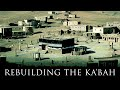

# Rebuilding the Ka'bah (2022-03-06)

## Description

You Can Support My Work on Patreon:
https://www.patreon.com/Bloggingtheology

My Paypal Link: 
https://www.paypal.com/paypalme/bloggingtheology?locale.x=en_GB

## Summary of [Rebuilding the Ka'bah](https://www.youtube.com/watch?v=Maihu1XOM6U)

*This summary is AI generated - there may be inaccuracies. *

### [00:00:00](https://www.youtube.com/watch?v=Maihu1XOM6U&t=0) - [00:05:00](https://www.youtube.com/watch?v=Maihu1XOM6U&t=300)

The video is a set of notes about the rebuilding of the Ka'aba in Mecca. The project was ordered by Muhammad and the clans fought for the honor of completing it. The black stone was returned to its corner and the project was completed.

**[00:00:00](https://www.youtube.com/watch?v=Maihu1XOM6U&t=0)** The Ka'aba was rebuilt by Quresh in Mecca around the time Ali was taken into the household. The walls were just above the height of a man and there was no roof, which made it easy for thieves to access the building. The first man to lift a stone from the top of one of the walls was a Maximide Abu Wab, the brother of Fatima Muhammad's grandmother. However, the stone leapt from his hand and returned to its place, so they decided to leave the foundation untouched. Inside the corner of the black stone they found a piece of writing in Syriac. They kept it not knowing what it was, until one of the Jews read it to them. It said, "I am God, the Lord of Becker, who created her on the day I created the heavens and the earth. The day I formed the sun and the moon. I placed around her seven inviolable angels. She shall stand so long as her two hills stand." The project continued and they were eventually able to raise the rest of the wall to the ground. However, when they were about to destroy the foundation, a quaking shudder ran through Mecca, so they decided to leave it untouched. The project was completed and the walls were rebuilt exactly
* **[00:05:00](https://www.youtube.com/watch?v=Maihu1XOM6U&t=300)** Muhammad is reported to have ordered his followers to rebuild the Kaaba, which had fallen into disrepair. The clans fought for the honor of lifting the black stone back into its corner and completing the project.

<h2>Full transcript with timestamps: CLICK TO EXPAND</h2>

[0:00:04](https://youtu.be/Maihu1XOM6U?t=4) in the last episode we read of the  
[0:00:06](https://youtu.be/Maihu1XOM6U?t=6) introduction of zaid and ali into the  
[0:00:09](https://youtu.be/Maihu1XOM6U?t=9) household of muhammad upon him the peace  
[0:00:12](https://youtu.be/Maihu1XOM6U?t=12) and in this episode we will read about  
[0:00:14](https://youtu.be/Maihu1XOM6U?t=14) the rebuilding of the kaaba and i  
[0:00:17](https://youtu.be/Maihu1XOM6U?t=17) continue to read from muhammad his life  
[0:00:20](https://youtu.be/Maihu1XOM6U?t=20) based on the earliest sources by martin  
[0:00:23](https://youtu.be/Maihu1XOM6U?t=23) lings  
[0:00:24](https://youtu.be/Maihu1XOM6U?t=24) chapter 14 the rebuilding of the  
[0:00:28](https://youtu.be/Maihu1XOM6U?t=28) kaaba somewhat before these last mention  
[0:00:32](https://youtu.be/Maihu1XOM6U?t=32) happenings about the time when ali was  
[0:00:35](https://youtu.be/Maihu1XOM6U?t=35) taken into the household when muhammad  
[0:00:37](https://youtu.be/Maihu1XOM6U?t=37) was 35 years old quresh decided to  
[0:00:41](https://youtu.be/Maihu1XOM6U?t=41) rebuild the kaaba  
[0:00:43](https://youtu.be/Maihu1XOM6U?t=43) as it then stood the walls were just  
[0:00:45](https://youtu.be/Maihu1XOM6U?t=45) above the height of a man and there was  
[0:00:48](https://youtu.be/Maihu1XOM6U?t=48) no roof which meant that even when the  
[0:00:50](https://youtu.be/Maihu1XOM6U?t=50) door was locked access was easy and  
[0:00:54](https://youtu.be/Maihu1XOM6U?t=54) recently there had been a theft of some  
[0:00:57](https://youtu.be/Maihu1XOM6U?t=57) of its treasure which was stowed in a  
[0:00:59](https://youtu.be/Maihu1XOM6U?t=59) vault that had been dug inside the  
[0:01:02](https://youtu.be/Maihu1XOM6U?t=62) building for that purpose  
[0:01:05](https://youtu.be/Maihu1XOM6U?t=65) they already had all the wood that was  
[0:01:07](https://youtu.be/Maihu1XOM6U?t=67) needed for the roof the ship of a greek  
[0:01:10](https://youtu.be/Maihu1XOM6U?t=70) merchant had been driven ashore and  
[0:01:12](https://youtu.be/Maihu1XOM6U?t=72) wrecked beyond repair at jeddah  
[0:01:15](https://youtu.be/Maihu1XOM6U?t=75) so they had taken its timbers to serve  
[0:01:18](https://youtu.be/Maihu1XOM6U?t=78) as rafters  
[0:01:20](https://youtu.be/Maihu1XOM6U?t=80) and there happened to be in mecca at  
[0:01:22](https://youtu.be/Maihu1XOM6U?t=82) that time a copt who was a skilled  
[0:01:25](https://youtu.be/Maihu1XOM6U?t=85) carpenter  
[0:01:26](https://youtu.be/Maihu1XOM6U?t=86) but such was their ore of the kaaba that  
[0:01:30](https://youtu.be/Maihu1XOM6U?t=90) they hesitated to lay hands on it  
[0:01:33](https://youtu.be/Maihu1XOM6U?t=93) their plan was to demolish its walls  
[0:01:36](https://youtu.be/Maihu1XOM6U?t=96) which were built of loose stones and to  
[0:01:39](https://youtu.be/Maihu1XOM6U?t=99) rebuild it all together  
[0:01:41](https://youtu.be/Maihu1XOM6U?t=101) but they were afraid of incurring the  
[0:01:43](https://youtu.be/Maihu1XOM6U?t=103) guilt of sacrilege  
[0:01:45](https://youtu.be/Maihu1XOM6U?t=105) and their hesitation was greatly  
[0:01:48](https://youtu.be/Maihu1XOM6U?t=108) increased by the appearance of a large  
[0:01:50](https://youtu.be/Maihu1XOM6U?t=110) snake which had taken to coming every  
[0:01:53](https://youtu.be/Maihu1XOM6U?t=113) day out of the vault to sun itself  
[0:01:55](https://youtu.be/Maihu1XOM6U?t=115) against a wall of the kaaba  
[0:01:59](https://youtu.be/Maihu1XOM6U?t=119) if anyone approached it would rear its  
[0:02:02](https://youtu.be/Maihu1XOM6U?t=122) head and hiss with gaping jaws and they  
[0:02:05](https://youtu.be/Maihu1XOM6U?t=125) were terrified of it  
[0:02:08](https://youtu.be/Maihu1XOM6U?t=128) but one day while it was sunning itself  
[0:02:11](https://youtu.be/Maihu1XOM6U?t=131) god sent against it an eagle which  
[0:02:14](https://youtu.be/Maihu1XOM6U?t=134) seized it and flew away with it  
[0:02:17](https://youtu.be/Maihu1XOM6U?t=137) so quresh said among themselves  
[0:02:20](https://youtu.be/Maihu1XOM6U?t=140) now we may indeed hope that god is  
[0:02:22](https://youtu.be/Maihu1XOM6U?t=142) pleased with our intent  
[0:02:25](https://youtu.be/Maihu1XOM6U?t=145) we have a craftsman whose heart is with  
[0:02:28](https://youtu.be/Maihu1XOM6U?t=148) us and we have wood  
[0:02:30](https://youtu.be/Maihu1XOM6U?t=150) and god hath rid us of this serpent  
[0:02:35](https://youtu.be/Maihu1XOM6U?t=155) the first man to lift a stone from the  
[0:02:37](https://youtu.be/Maihu1XOM6U?t=157) top of one of the walls was a maximide  
[0:02:41](https://youtu.be/Maihu1XOM6U?t=161) abu wab the brother of fatima muhammad's  
[0:02:44](https://youtu.be/Maihu1XOM6U?t=164) grandmother but no sooner had it been  
[0:02:47](https://youtu.be/Maihu1XOM6U?t=167) lifted than the stone leapt from its  
[0:02:49](https://youtu.be/Maihu1XOM6U?t=169) hand and returned to its place  
[0:02:52](https://youtu.be/Maihu1XOM6U?t=172) whereupon all drew back from the kaaba  
[0:02:55](https://youtu.be/Maihu1XOM6U?t=175) afraid to proceed with the work  
[0:02:59](https://youtu.be/Maihu1XOM6U?t=179) the chief of the maxim walid son of the  
[0:03:02](https://youtu.be/Maihu1XOM6U?t=182) now dead moghira took up a pickaxe and  
[0:03:06](https://youtu.be/Maihu1XOM6U?t=186) said  
[0:03:06](https://youtu.be/Maihu1XOM6U?t=186) i will begin raising for you  
[0:03:09](https://youtu.be/Maihu1XOM6U?t=189) and going to the kaaba he said oh god  
[0:03:12](https://youtu.be/Maihu1XOM6U?t=192) fear not o god we intend not but good  
[0:03:17](https://youtu.be/Maihu1XOM6U?t=197) thereupon he knocked down part of the  
[0:03:19](https://youtu.be/Maihu1XOM6U?t=199) war between the blackstone and the  
[0:03:21](https://youtu.be/Maihu1XOM6U?t=201) yemenite corner that is the south  
[0:03:24](https://youtu.be/Maihu1XOM6U?t=204) easterly wall  
[0:03:26](https://youtu.be/Maihu1XOM6U?t=206) but the rest of the people held back  
[0:03:29](https://youtu.be/Maihu1XOM6U?t=209) let us wait and see they said if he be  
[0:03:32](https://youtu.be/Maihu1XOM6U?t=212) smitten we will raise no more of it but  
[0:03:35](https://youtu.be/Maihu1XOM6U?t=215) restore it even as it was  
[0:03:38](https://youtu.be/Maihu1XOM6U?t=218) but if he is not smitten then god is  
[0:03:41](https://youtu.be/Maihu1XOM6U?t=221) pleased with our work and we will raise  
[0:03:43](https://youtu.be/Maihu1XOM6U?t=223) it all to the ground  
[0:03:47](https://youtu.be/Maihu1XOM6U?t=227) the night passed without mishap and  
[0:03:49](https://youtu.be/Maihu1XOM6U?t=229) waled was again at work early next  
[0:03:52](https://youtu.be/Maihu1XOM6U?t=232) morning so the others joined him  
[0:03:55](https://youtu.be/Maihu1XOM6U?t=235) and when the wars were all down as far  
[0:03:57](https://youtu.be/Maihu1XOM6U?t=237) as the foundation of abraham they came  
[0:04:00](https://youtu.be/Maihu1XOM6U?t=240) upon large greenish cobblestones like  
[0:04:04](https://youtu.be/Maihu1XOM6U?t=244) the humps of camels placed side by side  
[0:04:08](https://youtu.be/Maihu1XOM6U?t=248) a man put a crowbar between two of these  
[0:04:10](https://youtu.be/Maihu1XOM6U?t=250) stones to level one of them out  
[0:04:13](https://youtu.be/Maihu1XOM6U?t=253) but at the first movement of the stone a  
[0:04:16](https://youtu.be/Maihu1XOM6U?t=256) quaking shudder ran through the whole of  
[0:04:19](https://youtu.be/Maihu1XOM6U?t=259) mecca  
[0:04:20](https://youtu.be/Maihu1XOM6U?t=260) and they took it as a sign that they  
[0:04:22](https://youtu.be/Maihu1XOM6U?t=262) must leave that foundation undisturbed  
[0:04:27](https://youtu.be/Maihu1XOM6U?t=267) inside the corner of the black stone  
[0:04:29](https://youtu.be/Maihu1XOM6U?t=269) they had found a piece of writing in  
[0:04:31](https://youtu.be/Maihu1XOM6U?t=271) syriac  
[0:04:32](https://youtu.be/Maihu1XOM6U?t=272) they kept it not knowing what it was  
[0:04:35](https://youtu.be/Maihu1XOM6U?t=275) until one of the jews read it to them  
[0:04:38](https://youtu.be/Maihu1XOM6U?t=278) i am god the lord of becker i created  
[0:04:42](https://youtu.be/Maihu1XOM6U?t=282) her the day i created the heavens and  
[0:04:45](https://youtu.be/Maihu1XOM6U?t=285) the earth the day i formed the sun and  
[0:04:48](https://youtu.be/Maihu1XOM6U?t=288) the moon and i placed round about her  
[0:04:51](https://youtu.be/Maihu1XOM6U?t=291) seven inviolable angels  
[0:04:54](https://youtu.be/Maihu1XOM6U?t=294) she shall stand so long as her two hills  
[0:04:57](https://youtu.be/Maihu1XOM6U?t=297) stand  
[0:04:58](https://youtu.be/Maihu1XOM6U?t=298) blessed for her people with milk and  
[0:05:01](https://youtu.be/Maihu1XOM6U?t=301) water  
[0:05:03](https://youtu.be/Maihu1XOM6U?t=303) another piece of writing was found  
[0:05:05](https://youtu.be/Maihu1XOM6U?t=305) beneath the station of abraham  
[0:05:08](https://youtu.be/Maihu1XOM6U?t=308) a small rock near the door of the kaaba  
[0:05:11](https://youtu.be/Maihu1XOM6U?t=311) which bears the miraculous print of his  
[0:05:13](https://youtu.be/Maihu1XOM6U?t=313) foot  
[0:05:14](https://youtu.be/Maihu1XOM6U?t=314) it reads  
[0:05:15](https://youtu.be/Maihu1XOM6U?t=315) mecca is the holy house of god her  
[0:05:18](https://youtu.be/Maihu1XOM6U?t=318) sustenance cometh unto her from three  
[0:05:22](https://youtu.be/Maihu1XOM6U?t=322) directions  
[0:05:23](https://youtu.be/Maihu1XOM6U?t=323) let not her people be the first to  
[0:05:26](https://youtu.be/Maihu1XOM6U?t=326) profane her  
[0:05:29](https://youtu.be/Maihu1XOM6U?t=329) quraish now gathered more stones in  
[0:05:31](https://youtu.be/Maihu1XOM6U?t=331) addition to those they already had so as  
[0:05:34](https://youtu.be/Maihu1XOM6U?t=334) to increase the height of the building  
[0:05:38](https://youtu.be/Maihu1XOM6U?t=338) they worked separately clan by clan  
[0:05:40](https://youtu.be/Maihu1XOM6U?t=340) until the walls were high enough for the  
[0:05:43](https://youtu.be/Maihu1XOM6U?t=343) black stone to be built once more into  
[0:05:46](https://youtu.be/Maihu1XOM6U?t=346) its corner  
[0:05:48](https://youtu.be/Maihu1XOM6U?t=348) then a violent disagreement broke out  
[0:05:51](https://youtu.be/Maihu1XOM6U?t=351) amongst them  
[0:05:53](https://youtu.be/Maihu1XOM6U?t=353) for each clan wanted the honor of  
[0:05:55](https://youtu.be/Maihu1XOM6U?t=355) lifting it into its place  
[0:05:58](https://youtu.be/Maihu1XOM6U?t=358) the deadlock lasted for four or five  
[0:06:01](https://youtu.be/Maihu1XOM6U?t=361) days and the tension had increased to  
[0:06:04](https://youtu.be/Maihu1XOM6U?t=364) the point of alliances being made and  
[0:06:06](https://youtu.be/Maihu1XOM6U?t=366) preparations for battle begun  
[0:06:09](https://youtu.be/Maihu1XOM6U?t=369) where the oldest man present pointed to  
[0:06:12](https://youtu.be/Maihu1XOM6U?t=372) a solution  
[0:06:15](https://youtu.be/Maihu1XOM6U?t=375) oh men of course she said take as  
[0:06:18](https://youtu.be/Maihu1XOM6U?t=378) arbiter between you about that which  
[0:06:21](https://youtu.be/Maihu1XOM6U?t=381) wherein ye differ the first man who  
[0:06:24](https://youtu.be/Maihu1XOM6U?t=384) shall enter in through the gate of this  
[0:06:27](https://youtu.be/Maihu1XOM6U?t=387) mosque  
[0:06:28](https://youtu.be/Maihu1XOM6U?t=388) the precinct round the kaaba was called  
[0:06:31](https://youtu.be/Maihu1XOM6U?t=391) a mosque in arabic masjid a place of  
[0:06:35](https://youtu.be/Maihu1XOM6U?t=395) prostration because the right of  
[0:06:37](https://youtu.be/Maihu1XOM6U?t=397) prostrating oneself to god in the  
[0:06:40](https://youtu.be/Maihu1XOM6U?t=400) direction of the holy house had been  
[0:06:42](https://youtu.be/Maihu1XOM6U?t=402) performed there since the time of  
[0:06:45](https://youtu.be/Maihu1XOM6U?t=405) abraham and ishmael  
[0:06:48](https://youtu.be/Maihu1XOM6U?t=408) they agreed to follow the old man's  
[0:06:50](https://youtu.be/Maihu1XOM6U?t=410) council and the first man to enter the  
[0:06:52](https://youtu.be/Maihu1XOM6U?t=412) mosque was muhammad  
[0:06:55](https://youtu.be/Maihu1XOM6U?t=415) who had just returned to mecca after an  
[0:06:58](https://youtu.be/Maihu1XOM6U?t=418) absence  
[0:06:59](https://youtu.be/Maihu1XOM6U?t=419) the sight of him produced an immediate  
[0:07:02](https://youtu.be/Maihu1XOM6U?t=422) and spontaneous recognition that here  
[0:07:05](https://youtu.be/Maihu1XOM6U?t=425) was the right person for the task  
[0:07:08](https://youtu.be/Maihu1XOM6U?t=428) and his arrival was greeted by  
[0:07:10](https://youtu.be/Maihu1XOM6U?t=430) exclamations and murmurs of satisfaction  
[0:07:14](https://youtu.be/Maihu1XOM6U?t=434) it is said some we accept his judgment  
[0:07:19](https://youtu.be/Maihu1XOM6U?t=439) said others  
[0:07:20](https://youtu.be/Maihu1XOM6U?t=440) it is muhammad  
[0:07:22](https://youtu.be/Maihu1XOM6U?t=442) when he explained the matter to him he  
[0:07:25](https://youtu.be/Maihu1XOM6U?t=445) said  
[0:07:26](https://youtu.be/Maihu1XOM6U?t=446) bring me a cloak  
[0:07:29](https://youtu.be/Maihu1XOM6U?t=449) and when they brought it he spread it on  
[0:07:31](https://youtu.be/Maihu1XOM6U?t=451) the ground and taking up the black stone  
[0:07:34](https://youtu.be/Maihu1XOM6U?t=454) he laid it on the middle of the garment  
[0:07:38](https://youtu.be/Maihu1XOM6U?t=458) let each clan take hold of the border of  
[0:07:42](https://youtu.be/Maihu1XOM6U?t=462) the cloak he said then lifted up all of  
[0:07:46](https://youtu.be/Maihu1XOM6U?t=466) you together  
[0:07:48](https://youtu.be/Maihu1XOM6U?t=468) and when he had raised it to the right  
[0:07:50](https://youtu.be/Maihu1XOM6U?t=470) to right height he took the stone and  
[0:07:53](https://youtu.be/Maihu1XOM6U?t=473) placed it in the corner with his own  
[0:07:56](https://youtu.be/Maihu1XOM6U?t=476) hands and the building was continued and  
[0:08:01](https://youtu.be/Maihu1XOM6U?t=481) completed  
[0:08:02](https://youtu.be/Maihu1XOM6U?t=482) above it  
[0:08:04](https://youtu.be/Maihu1XOM6U?t=484) that was chapter 14  
[0:08:06](https://youtu.be/Maihu1XOM6U?t=486) the rebuilding of the kaaba until next  
[0:08:09](https://youtu.be/Maihu1XOM6U?t=489) time  

