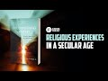

# Religious Experiences in a Secular Age with Prof Dale C. Allison of Princeton (2022-12-12)

## Description

The Archives of Scientists’ Transcendental Experiences: https://www.aapsglobal.com/taste/
Encountering Mystery: Religious Experience in a Secular Age by Dale C. Allison Jr. https://www.eerdmans.com/Products/8188/encountering-mystery.aspx

You Can Support My Work on Patreon:
https://www.patreon.com/Bloggingtheology

My Paypal Link: 
https://www.paypal.com/paypalme/bloggingtheology?locale.x=en_GB

## Summary of [Religious Experiences in a Secular Age with Prof Dale C. Allison of Princeton](https://www.youtube.com/watch?v=VqP8tHfSPR0)

*This summary is AI generated - there may be inaccuracies. *

### [00:00:00](https://www.youtube.com/watch?v=VqP8tHfSPR0&t=0) - [00:55:00](https://www.youtube.com/watch?v=VqP8tHfSPR0&t=3300)

Dale Allison discusses religious experiences in a secular age, noting that they are often dismissed by skeptics. He argues that these experiences offer a rational basis for religious belief, and that we should be more open to discussing them. Allison also discusses his book, "Religious Experiences in a Secular Age," which includes secular people who have had similar experiences.

**[00:00:00](https://www.youtube.com/watch?v=VqP8tHfSPR0&t=0)** Dale Allison's book, "Encountering Mystery: Religious Experience in a Secular Age," discusses the historical Jesus and the various religious experiences people have around the world. Allison argues that these experiences are the backbone of the spiritual life, and he contrasts this view with that of William James, who believed that precepts of organized religion were more important. Allison's book is an updated version of a work he started writing three decades ago.
* **[00:05:00](https://www.youtube.com/watch?v=VqP8tHfSPR0&t=300)**  Dale Allison discusses the increase in people reporting religious experiences over the past few decades, noting that this may be due to a cultural shift rather than an increase in mysticism. He also discusses the book "William James: A Life" and its impact on the field of religious studies.
* **[00:10:00](https://www.youtube.com/watch?v=VqP8tHfSPR0&t=600)** This book discusses religious experiences in a secular age, with the aim of helping people to be more open and honest about their experiences. Dale C. Allison, a psychologist and sociologist, discusses the importance of being open to discussing religious experiences, and how often people keep them quiet for fear of ridicule or misunderstanding. He also discusses the importance of being non-pathologizing when discussing religious experiences, as it can be harmful to someone's mental health to label them as having mental pathology.
* **[00:15:00](https://www.youtube.com/watch?v=VqP8tHfSPR0&t=900)* Discusses disconnect between religious experiences and skepticism among Christian professionals, and the reasons for this disconnect. It suggests that two factors contribute to this skepticism: first, the Protestant reformers' dismissal of Catholic Miracle stories; and second, the theologians and pastors' training in the 19th century, during which Christians lost the scientific battles over the Bible.
* **[00:20:00](https://www.youtube.com/watch?v=VqP8tHfSPR0&t=1200)** Dale Allison discusses religious experiences in a secular age, highlighting the lack of satisfactory explanations for such experiences. He argues that these phenomena offer a rational basis for religious belief, pointing to the many testimonies of accuracy and non-materialism.
* **[00:25:00](https://www.youtube.com/watch?v=VqP8tHfSPR0&t=1500)**  Princeton professor Dale Allison discusses religious experiences in a secular age, noting that while some experiences seem to defy conventional explanations, others share commonalities across religious traditions. He also speaks about his book, "Religious Experiences in a Secular Age," noting that while it does not focus exclusively on religious experiences, it includes secular people who have had similar experiences.
* **[00:30:00](https://www.youtube.com/watch?v=VqP8tHfSPR0&t=1800)* Discusses religious experiences of people in a secular age, with historian Dale Allison of Princeton. Allison notes that individuals raised in a secular world view tend to think about everything from a reductionistic standpoint. He discusses a range of examples, including ancient figures such as Hippocrates and Cicero, as well as doctors from the modern era. Allison argues that these examples suggest that there is something more to human existence than material processes, and that we should be paying attention to what's going on in the world.
* **[00:35:00](https://www.youtube.com/watch?v=VqP8tHfSPR0&t=2100)* Discusses eligious experiences in a secular age, with Prof. Dale C. Allison of Princeton. Allison explains that reports of lucid individuals before death have been present throughout history, and that this phenomenon is evidence of something beyond the understanding of scientists. He also discusses Alzheimer's patients' ability to exhibit terminal acidity, and how this disproves easy reductionism about the mind.
* **[00:40:00](https://www.youtube.com/watch?v=VqP8tHfSPR0&t=2400)* Discusses eligious experiences in a secular age, and discusses the Archives of Scientific Transcendental Experiences, which is an online safe site for scientists to share their experiences.
* **[00:45:00](https://www.youtube.com/watch?v=VqP8tHfSPR0&t=2700)** Scientists who report experiences of transcendence in a secular age discuss the irony of their situation and the fear that their experiences will not be taken seriously. They also describe a resurgence of paganism in the face of a decline in formal religious belief.
* **[00:50:00](https://www.youtube.com/watch?v=VqP8tHfSPR0&t=3000)** Dale Allison discusses the decline of religious institutions and the rise of religious experiences in a secular age. He says that while these experiences may be unfamiliar to some, they are actually quite common and offer an alternative to belief in nothing. Allison's book has been well-received by his colleagues, religious leaders, and the media, though some religious scholars remain dismissive of them.
* **[00:55:00](https://www.youtube.com/watch?v=VqP8tHfSPR0&t=3300)**  Dale Allison, a scholar from Princeton Theological Seminary, discusses how religious experiences are changing in a secular age. He discusses how some people may find his work helpful in understanding the world around them. Allison also talks about a sequel to his book, Encountering Mystery: Religious Experiences in a Secular Age, which he plans to write.

## Full transcript with timestamps

[0:00:03](https://youtu.be/VqP8tHfSPR0?t=3) Hello everyone and welcome to Blogging Theology 
today I'm delighted to talk again to Professor    
[0:00:10](https://youtu.be/VqP8tHfSPR0?t=10) Dale C Allison you're most welcome sir happy to be 
back good to see you Paul great to see you uh Dr    
[0:00:17](https://youtu.be/VqP8tHfSPR0?t=17) Dale Allison is an American New Testament scholar 
an historian of early Christianity and a Christian    
[0:00:23](https://youtu.be/VqP8tHfSPR0?t=23) Theologian he is currently the Richard J Dearborn 
professor of New Testament studies at Princeton    
[0:00:30](https://youtu.be/VqP8tHfSPR0?t=30) Theological Seminary and an ordained Elder in 
the Presbyterian Church USA Dale last appeared    
[0:00:38](https://youtu.be/VqP8tHfSPR0?t=38) on blogging theology in June last year when he 
discussed the historical Jesus and I do recommend    
[0:00:44](https://youtu.be/VqP8tHfSPR0?t=44) you see that if you haven't already today he has 
kindly agreed to discuss uh his extraordinary    
[0:00:51](https://youtu.be/VqP8tHfSPR0?t=51) new book which is entitled encountering mystery 
religious experience in a secular age and there's    
[0:00:59](https://youtu.be/VqP8tHfSPR0?t=59) my copy there which I've read from cover to cover 
it's truly an absorbing read it's almost like a    
[0:01:04](https://youtu.be/VqP8tHfSPR0?t=64) novel I don't mean it's fictional I mean it's so 
absorbing you want to read it through as as quick    
[0:01:09](https://youtu.be/VqP8tHfSPR0?t=69) as possible so Dale could you begin by telling 
us what led you to write this extraordinary book    
[0:01:16](https://youtu.be/VqP8tHfSPR0?t=76) well I've really wanted to write this book 
for a long long time and I started to write    
[0:01:22](https://youtu.be/VqP8tHfSPR0?t=82) it actually three decades ago but at that point 
in time I uh was not a full-time academic I uh    
[0:01:31](https://youtu.be/VqP8tHfSPR0?t=91) was working in a bookstore and teaching adjunct 
jobs and I wanted to become a full-time Professor    
[0:01:37](https://youtu.be/VqP8tHfSPR0?t=97) somewhere and I realized that if I wrote a book 
like this I actually did write a book and a few    
[0:01:44](https://youtu.be/VqP8tHfSPR0?t=104) of its passages are are now in in this book I did 
write a book but I decided maybe if I published    
[0:01:50](https://youtu.be/VqP8tHfSPR0?t=110) it then I would never get a job because there's so 
much Prejudice I think uninformed Prejudice about    
[0:01:56](https://youtu.be/VqP8tHfSPR0?t=116) the things that are talked about in this book 
so I waited until I I'm a full Professor there    
[0:02:03](https://youtu.be/VqP8tHfSPR0?t=123) are no more um opportunities for advancement I 
I you know I'm I'm the next thing that happens    
[0:02:11](https://youtu.be/VqP8tHfSPR0?t=131) on my agenda is that I retire so at this point I 
really don't care about what other people think I    
[0:02:17](https://youtu.be/VqP8tHfSPR0?t=137) don't have to please anybody except please myself 
and um to to put it more seriously I can be honest    
[0:02:25](https://youtu.be/VqP8tHfSPR0?t=145) I can uh I think this book uh is an honest book 
and I I don't have to hide anything so I wanted    
[0:02:32](https://youtu.be/VqP8tHfSPR0?t=152) to write it for a long time and um this is in 
part because of my own experience I'm I'm not    
[0:02:42](https://youtu.be/VqP8tHfSPR0?t=162) um a wannabe Mystic things just happen to me 
and they turned out to be very important in my    
[0:02:49](https://youtu.be/VqP8tHfSPR0?t=169) life and I didn't know how to bury them I didn't 
know how to ignore them so I I went looking in the    
[0:02:56](https://youtu.be/VqP8tHfSPR0?t=176) literature for uh other people who had had similar 
experiences so I've spent a long time cataloging    
[0:03:04](https://youtu.be/VqP8tHfSPR0?t=184) experiences reading about cross-cultural religious 
experience doing this sort of thing that William    
[0:03:09](https://youtu.be/VqP8tHfSPR0?t=189) James did 100 years ago and this book then is 
the the up upshot of of that so so the it's not    
[0:03:18](https://youtu.be/VqP8tHfSPR0?t=198) that this is a sudden interest of mine it's a 
lifelong interest but it's been mostly hidden    
[0:03:24](https://youtu.be/VqP8tHfSPR0?t=204) because of the prejudices of my academic guilt 
or at least what I perceive to be a Prejudice    
[0:03:31](https://youtu.be/VqP8tHfSPR0?t=211) of my academic guilt yes and this is a theme that 
because in the book actually we'll come to that in    
[0:03:35](https://youtu.be/VqP8tHfSPR0?t=215) a second but you briefly alluded to this seminal 
work uh William James the varieties of religious    
[0:03:41](https://youtu.be/VqP8tHfSPR0?t=221) experience I mean this really founded the whole 
field of of psychology looking at religious    
[0:03:46](https://youtu.be/VqP8tHfSPR0?t=226) experience it says on the on the back here William 
James believed uh individual religious experiences    
[0:03:52](https://youtu.be/VqP8tHfSPR0?t=232) rather than the precepts of organized religion 
were the backbone of the world's spiritual life    
[0:03:58](https://youtu.be/VqP8tHfSPR0?t=238) and he he was a Harvard University psychologist 
and philosopher William James um and this is still    
[0:04:04](https://youtu.be/VqP8tHfSPR0?t=244) you know having read this myself uh very fresh uh 
full of the most extraordinarily Vivid experiences    
[0:04:10](https://youtu.be/VqP8tHfSPR0?t=250) that he called from you know a vast array of 
sources people he met and various accounts that    
[0:04:14](https://youtu.be/VqP8tHfSPR0?t=254) he had read mostly I think American or Christian 
in origin even if people turned Unitarian or    
[0:04:20](https://youtu.be/VqP8tHfSPR0?t=260) whatever uh but he wasn't very strong wrong say 
on Muslim religious experiences or no he wasn't    
[0:04:25](https://youtu.be/VqP8tHfSPR0?t=265) he was I think that's the weakness of the book 
I mean perhaps not to blame him too much as I've    
[0:04:29](https://youtu.be/VqP8tHfSPR0?t=269) written over 100 years ago perhaps but it's still 
really worth reading and I mean how does your book    
[0:04:34](https://youtu.be/VqP8tHfSPR0?t=274) differ from that is it an updated version or 
is it quite different I do I I would like to    
[0:04:40](https://youtu.be/VqP8tHfSPR0?t=280) flatter myself I would like to think that I'm in 
uh that I'm a descendant of James and that I'm    
[0:04:45](https://youtu.be/VqP8tHfSPR0?t=285) he's in my genealogy right but I think one of the 
things that distinguishes my book from his is that    
[0:04:55](https://youtu.be/VqP8tHfSPR0?t=295) um he's standing at the beginning of a discipline 
and he can't really do anything other than tell    
[0:05:01](https://youtu.be/VqP8tHfSPR0?t=301) stories and then analyze them we're actually at 
the point where we've had a lot of work done on    
[0:05:08](https://youtu.be/VqP8tHfSPR0?t=308) a lot of these um religious experiences for one of 
a better term and we have statistics about lots of    
[0:05:15](https://youtu.be/VqP8tHfSPR0?t=315) things we have lots of cross-cultural data uh 
so I think we have a lot more to work with uh    
[0:05:23](https://youtu.be/VqP8tHfSPR0?t=323) so things were messier than maybe than they are 
now some of the categories are clearer some of    
[0:05:29](https://youtu.be/VqP8tHfSPR0?t=329) the psychological triggers are clear and things 
like that um so if if I look at my own genealogy    
[0:05:37](https://youtu.be/VqP8tHfSPR0?t=337) it's not just that William James is there at 
the beginning but you're probably familiar with    
[0:05:44](https://youtu.be/VqP8tHfSPR0?t=344) an Oxford Professor named Aleister Hardy who 
was above all a biologist a very accomplished    
[0:05:51](https://youtu.be/VqP8tHfSPR0?t=351) biologist but he at some point in the 1960s 
became very very interested in uh so-called    
[0:05:58](https://youtu.be/VqP8tHfSPR0?t=358) religious experiences and he started collecting 
data mostly from the British public and at that    
[0:06:04](https://youtu.be/VqP8tHfSPR0?t=364) time people would just send in letters today 
they'd send in emails but back then they sent    
[0:06:08](https://youtu.be/VqP8tHfSPR0?t=368) in letters and he started categorizing things and 
sorting material and then uh from from then to now    
[0:06:16](https://youtu.be/VqP8tHfSPR0?t=376) we've simply learned more and more and more so um 
nothing can replace James and and the varieties    
[0:06:24](https://youtu.be/VqP8tHfSPR0?t=384) of religious experience really is one of those 
books that may be timeless uh it does not feel    
[0:06:30](https://youtu.be/VqP8tHfSPR0?t=390) dated it's just fresh actually that's that's not 
just the subject matter that's also William James    
[0:06:35](https://youtu.be/VqP8tHfSPR0?t=395) almost everything he wrote is still worth reading 
yeah almost everything he wrote is brilliant he's    
[0:06:41](https://youtu.be/VqP8tHfSPR0?t=401) just one of those mutants who's sort of ahead of 
the rest of us right yeah uh but I do think that    
[0:06:47](https://youtu.be/VqP8tHfSPR0?t=407) I have a small advantage in that uh I have a lot 
more material to work with uh than than he did    
[0:06:56](https://youtu.be/VqP8tHfSPR0?t=416) but what wasn't he the brother or related to it 
which uh Henry James the the novelist oh that's    
[0:07:00](https://youtu.be/VqP8tHfSPR0?t=420) right yeah that's a very accomplished family so 
there must be some genetic gift going on there uh  
[0:07:09](https://youtu.be/VqP8tHfSPR0?t=429) um I mean I mean there's a little little no 
there's so there's so much that this your    
[0:07:13](https://youtu.be/VqP8tHfSPR0?t=433) book uh never mind William James but your book 
is packed full of gems almost on every page of    
[0:07:18](https://youtu.be/VqP8tHfSPR0?t=438) something of interest and we talk about the 
book for days but but almost randomly uh you    
[0:07:22](https://youtu.be/VqP8tHfSPR0?t=442) say on page 20 several times of the past 60 years 
pollsters have asked Americans if they've ever had    
[0:07:28](https://youtu.be/VqP8tHfSPR0?t=448) a religious or mystical experience that been 
defined as a moment of religious or Spiritual    
[0:07:34](https://youtu.be/VqP8tHfSPR0?t=454) Awakening and they look at the numbers remember 
we're not going to statistical analysis here but    
[0:07:39](https://youtu.be/VqP8tHfSPR0?t=459) back in 1962 yes was the answer only 22 percent 
said yes they'd have um a a Mr college experience    
[0:07:47](https://youtu.be/VqP8tHfSPR0?t=467) 78 said no uh you know very much a minority and 
then in the successive years in 1976 and 94 and    
[0:07:55](https://youtu.be/VqP8tHfSPR0?t=475) 20 2006 2009 there's been a huge increase so that 
recently in 2009 49 basically half the American    
[0:08:04](https://youtu.be/VqP8tHfSPR0?t=484) population have had experiences and no is 48 so 
now does a majority have these experiences and    
[0:08:11](https://youtu.be/VqP8tHfSPR0?t=491) I mean you say you don't want to read too much in 
statistics but they do seem to indicate a really    
[0:08:15](https://youtu.be/VqP8tHfSPR0?t=495) interesting trend is it as you ask that people 
are having more experiences or that it's become    
[0:08:22](https://youtu.be/VqP8tHfSPR0?t=502) more socially acceptable to talk openly in a map 
to remember them and to be you know just to be    
[0:08:28](https://youtu.be/VqP8tHfSPR0?t=508) more Frank about them so we did a cultural shift 
rather than some kind of eruption of mysticism in    
[0:08:33](https://youtu.be/VqP8tHfSPR0?t=513) the United States yeah yeah yeah so I I think 
it's the lat the latter option I don't think    
[0:08:38](https://youtu.be/VqP8tHfSPR0?t=518) we've had a eruption of of mysticism I uh think 
that the culture has changed I'm not sure I'm    
[0:08:46](https://youtu.be/VqP8tHfSPR0?t=526) not a sociologist so I can't tell you why it's 
changing we're not becoming more religious in    
[0:08:52](https://youtu.be/VqP8tHfSPR0?t=532) the conventional sense that is more people aren't 
going to church or synagogue or mosque than used    
[0:08:56](https://youtu.be/VqP8tHfSPR0?t=536) to go in the past but um we've got this growing 
crowd of what uh are called the the spiritual but    
[0:09:04](https://youtu.be/VqP8tHfSPR0?t=544) not religious folks and these folks are now uh 
able to say yes to the pollsters I've had these    
[0:09:14](https://youtu.be/VqP8tHfSPR0?t=554) experiences where they didn't say that uh in such 
large numbers back in 1960 or 1970. now what this    
[0:09:21](https://youtu.be/VqP8tHfSPR0?t=561) has to do with um you know the the Revolutionary 
time of the 1960s and and everything that came    
[0:09:29](https://youtu.be/VqP8tHfSPR0?t=569) from that I don't know I'm not a sociologist all 
I can tell you that is that I'm happy and this is    
[0:09:34](https://youtu.be/VqP8tHfSPR0?t=574) the most important thing I'm happy that people can 
be a little more honest now than they were then    
[0:09:40](https://youtu.be/VqP8tHfSPR0?t=580) because I know that many of the people who used 
to say no I haven't had an experience had had an    
[0:09:48](https://youtu.be/VqP8tHfSPR0?t=588) experience but they didn't want to say so or maybe 
they were even as sometimes happen uh happens    
[0:09:54](https://youtu.be/VqP8tHfSPR0?t=594) hiding it from themselves that that happens too 
you know sometimes you'll ask or I'll ask people    
[0:09:59](https://youtu.be/VqP8tHfSPR0?t=599) uh you know what when I'm being a gadfly I'll say 
you know have you had any experience like this or    
[0:10:04](https://youtu.be/VqP8tHfSPR0?t=604) like that and so on and they'll say no and then if 
I leave them that's the answer but if I press on    
[0:10:11](https://youtu.be/VqP8tHfSPR0?t=611) a little bit and say well you know blah blah blah 
blah blah and then sometimes I'll get oh yeah well    
[0:10:17](https://youtu.be/VqP8tHfSPR0?t=617) this did happen you know such and such did happen 
to me so there is still this uh hesitancy on lots    
[0:10:24](https://youtu.be/VqP8tHfSPR0?t=624) of of people's parts to uh just be honest about 
their their own experience and that's actually    
[0:10:30](https://youtu.be/VqP8tHfSPR0?t=630) I think the first main point of this book is just 
to be honest so I think you can read most of this    
[0:10:40](https://youtu.be/VqP8tHfSPR0?t=640) book and be happy even if you have no religious 
or theological orientation because first of all    
[0:10:47](https://youtu.be/VqP8tHfSPR0?t=647) I'm simply saying people say these things happen 
to them isn't this interesting and shouldn't we    
[0:10:53](https://youtu.be/VqP8tHfSPR0?t=653) pay attention whatever the explanation for these 
things are if you want to understand human being    
[0:10:58](https://youtu.be/VqP8tHfSPR0?t=658) means this is an important part of human beings 
just talk to them a lot of them will say time    
[0:11:03](https://youtu.be/VqP8tHfSPR0?t=663) and time again this happened to me and it's the 
most important thing in my life so a psychologist    
[0:11:08](https://youtu.be/VqP8tHfSPR0?t=668) or sociologist even if there's no belief in the 
Transcendence should say well that's interesting    
[0:11:14](https://youtu.be/VqP8tHfSPR0?t=674) what's that about shouldn't we look into this 
and the problem has been that so much of this    
[0:11:20](https://youtu.be/VqP8tHfSPR0?t=680) has been pathologized yes uh in Modern Times And 
so people just feel inhibited and people who are    
[0:11:28](https://youtu.be/VqP8tHfSPR0?t=688) trained sociologists or psychologists just 
often aren't interested because that's where    
[0:11:32](https://youtu.be/VqP8tHfSPR0?t=692) the the crazy people are and you don't want to 
go there I think they're afraid to talk about    
[0:11:36](https://youtu.be/VqP8tHfSPR0?t=696) these expenses because they'll be labeled crazy 
or misunderstood or be labeled psychotic or the    
[0:11:42](https://youtu.be/VqP8tHfSPR0?t=702) the thing is medicalized pathologized yes every 
incentive in our culture not to speak about it for    
[0:11:49](https://youtu.be/VqP8tHfSPR0?t=709) fear of ridicule or being misunderstood so people 
keep it quiet until they come across people like    
[0:11:54](https://youtu.be/VqP8tHfSPR0?t=714) yourself and you've said on many occasions in your 
book at the end of a lecture or end of a class    
[0:11:58](https://youtu.be/VqP8tHfSPR0?t=718) people will you know when most people have 
gone you'll get their yeah that will come    
[0:12:02](https://youtu.be/VqP8tHfSPR0?t=722) up and sheepishly say I had this experience uh and 
almost like confessing it to you and and of course    
[0:12:08](https://youtu.be/VqP8tHfSPR0?t=728) you're just the person to hear about it yeah 
that happens that happens all the time and um I    
[0:12:13](https://youtu.be/VqP8tHfSPR0?t=733) also think in this connection of an experience my 
daughter had which is a very negative experience    
[0:12:18](https://youtu.be/VqP8tHfSPR0?t=738) you know this book isn't all sweetness and light 
there are also very negative religious so-called    
[0:12:22](https://youtu.be/VqP8tHfSPR0?t=742) religious experiences my daughter had this very 
creepy overwhelming experience um once and uh it    
[0:12:32](https://youtu.be/VqP8tHfSPR0?t=752) was so horrible that she told me later on she had 
uh post-traumatic stress syndrome for 10 years she    
[0:12:38](https://youtu.be/VqP8tHfSPR0?t=758) was quite serious about this but what I remember 
is that the morning after it happened she woke    
[0:12:43](https://youtu.be/VqP8tHfSPR0?t=763) up and she came to me and because she knows who 
I am and that I'm open-minded she recounted the    
[0:12:47](https://youtu.be/VqP8tHfSPR0?t=767) event to me and then what I remember most vividly 
is she said but Dad you can't tell anyone because    
[0:12:53](https://youtu.be/VqP8tHfSPR0?t=773) they'll think I'm crazy those are almost her 
exact words you know they were burned on my mind    
[0:12:58](https://youtu.be/VqP8tHfSPR0?t=778) this happened to her she didn't make it up it's 
at least subjectively real and why is it that she    
[0:13:04](https://youtu.be/VqP8tHfSPR0?t=784) can't talk about this well what happened without 
breaking the competencies or maybe you can't say    
[0:13:09](https://youtu.be/VqP8tHfSPR0?t=789) but what what happened to her I mean it sounds 
awful but what happened so she was awakened in the    
[0:13:15](https://youtu.be/VqP8tHfSPR0?t=795) night and she was surrounded by um these shadowy 
amorphous uh threatening figures and she felt as    
[0:13:25](https://youtu.be/VqP8tHfSPR0?t=805) though they hated her and they were making fun of 
her and and so on and she didn't she didn't think    
[0:13:34](https://youtu.be/VqP8tHfSPR0?t=814) that it was a dream she still thinks this to 
this day thinks that it was real now she's not    
[0:13:40](https://youtu.be/VqP8tHfSPR0?t=820) quite sure what that means but she doesn't think 
it was a just pure projection of her own mind    
[0:13:45](https://youtu.be/VqP8tHfSPR0?t=825) she thinks she was encountering something and 
that it was not pleasant it was threatening and    
[0:13:52](https://youtu.be/VqP8tHfSPR0?t=832) ugly and so on if this had happened in another 
place in time I am certain that uh somebody    
[0:13:59](https://youtu.be/VqP8tHfSPR0?t=839) would have said oh well I saw demons or you 
know Satan appeared to me that sort of thing    
[0:14:05](https://youtu.be/VqP8tHfSPR0?t=845) but she was raised in my household and she knows 
that things are messed up and you know we don't    
[0:14:11](https://youtu.be/VqP8tHfSPR0?t=851) always have clear categories for things so she 
didn't say demons she just said shadow figures    
[0:14:16](https://youtu.be/VqP8tHfSPR0?t=856) right so so that's what that was all about 
and of course she did what I did after I had    
[0:14:22](https://youtu.be/VqP8tHfSPR0?t=862) my experiences I read looking for parallels after 
her experience she went looking for parallels and    
[0:14:28](https://youtu.be/VqP8tHfSPR0?t=868) she's found uh passages in many books now which 
talk of people having this experience I don't    
[0:14:34](https://youtu.be/VqP8tHfSPR0?t=874) what it is I have no explanation for it what I'm 
most concerned about is that we don't pathologize    
[0:14:39](https://youtu.be/VqP8tHfSPR0?t=879) it because she's perfectly healthy she's just a 
Hell she's a healthy person there's nothing wrong    
[0:14:44](https://youtu.be/VqP8tHfSPR0?t=884) with her mentally it's really stupid to say you 
know this this this is a a manifestation of her    
[0:14:51](https://youtu.be/VqP8tHfSPR0?t=891) mental pathology because it just just isn't uh 
it might be some transient electrical something    
[0:14:59](https://youtu.be/VqP8tHfSPR0?t=899) in her brain but there's nothing wrong with her 
psychologically that's just not the way to go    
[0:15:04](https://youtu.be/VqP8tHfSPR0?t=904) here no I mean you know about your account 
many extraordinary stories of people who've    
[0:15:08](https://youtu.be/VqP8tHfSPR0?t=908) experienced Supernatural events Angels encounters 
with deceased loved ones surprisingly common out    
[0:15:14](https://youtu.be/VqP8tHfSPR0?t=914) of body experiences near death experiences and 
some as you say were clearly felt of as malevolent    
[0:15:20](https://youtu.be/VqP8tHfSPR0?t=920) but what struck me is you know the surprising 
indifference or even skepticism shown by many    
[0:15:27](https://youtu.be/VqP8tHfSPR0?t=927) Christian priests ministers pastors uh whom one 
might have expected to offer a sympathetic ear    
[0:15:34](https://youtu.be/VqP8tHfSPR0?t=934) up but they don't very often why is this I mean 
of all people the religious professionals you'd    
[0:15:39](https://youtu.be/VqP8tHfSPR0?t=939) expect them to be open to this kind of 
phenomenon ah yes well as it says in    
[0:15:42](https://youtu.be/VqP8tHfSPR0?t=942) the gospels Jesus XYZ but yeah what so I don't 
quite understand this this kind of disconnect    
[0:15:49](https://youtu.be/VqP8tHfSPR0?t=949) so here's my amateur um attempt to explain 
that I think there are at least two    
[0:15:56](https://youtu.be/VqP8tHfSPR0?t=956) um streams here that combine to create this 
attitude so the first thing you have to remember    
[0:16:03](https://youtu.be/VqP8tHfSPR0?t=963) is that early Protestants were anti-catholic 
they were as much as anything anti-catholic    
[0:16:09](https://youtu.be/VqP8tHfSPR0?t=969) that's their identity and Catholic tradition 
especially in the Middle Ages is simply full    
[0:16:15](https://youtu.be/VqP8tHfSPR0?t=975) of Miracle stories yes and those Miracle stories 
were understood to authenticate Catholic Doctrine    
[0:16:23](https://youtu.be/VqP8tHfSPR0?t=983) so the only way the Protestants could deal with 
this stuff or the only thing that came to their    
[0:16:28](https://youtu.be/VqP8tHfSPR0?t=988) mind was to say these events did not happen and 
so the Protestant reformers are actually the first    
[0:16:34](https://youtu.be/VqP8tHfSPR0?t=994) rationalists they're the first people to look 
at Miracle stories and say well that's a legend    
[0:16:39](https://youtu.be/VqP8tHfSPR0?t=999) or somebody misperceived or you know there's a 
mental issue here or you know maybe demons were    
[0:16:46](https://youtu.be/VqP8tHfSPR0?t=1006) deceiving them but but you know it's it there's 
no positive spin put on these things everything    
[0:16:52](https://youtu.be/VqP8tHfSPR0?t=1012) is an attempt to dismiss them and that then lives 
on especially in the reformed Protestant tradition    
[0:16:59](https://youtu.be/VqP8tHfSPR0?t=1019) um and and eventuates in something called 
cessationism which is the belief that the only    
[0:17:05](https://youtu.be/VqP8tHfSPR0?t=1025) Miracles that ever took place are in the Bible and 
all the others are bogus as soon as the apostles    
[0:17:11](https://youtu.be/VqP8tHfSPR0?t=1031) died that was at the end of The Miracles yeah 
that's right and you could actually find a couple    
[0:17:15](https://youtu.be/VqP8tHfSPR0?t=1035) of passages in Shakespeare where he refers to you 
know the age of Miracles is past so it becomes    
[0:17:20](https://youtu.be/VqP8tHfSPR0?t=1040) a really well-known far-flung uh Protestant idea 
so so that's the first thing that feeds into this    
[0:17:29](https://youtu.be/VqP8tHfSPR0?t=1049) um you know I'm a presbyterian at least on paper 
and the tradition is no Miracles just I I teach at    
[0:17:37](https://youtu.be/VqP8tHfSPR0?t=1057) um uh Princeton Theological Seminary uh one of our 
old famous professors late 19th early 20th century    
[0:17:45](https://youtu.be/VqP8tHfSPR0?t=1065) was a man named Bibi Warfield he wrote a book on 
Miracles and it was a cessationist track there are    
[0:17:52](https://youtu.be/VqP8tHfSPR0?t=1072) no Miracles once there are there may be two places 
in that book where he says well I can't explain it    
[0:17:57](https://youtu.be/VqP8tHfSPR0?t=1077) but I know it wasn't God or anything you know like 
that so they're all all gone the second thing is    
[0:18:04](https://youtu.be/VqP8tHfSPR0?t=1084) this I think that Christian theologians and then 
pastors trained at seminaries are descendants from    
[0:18:12](https://youtu.be/VqP8tHfSPR0?t=1092) the 19th century and during the 19th century 
Christians lost the scientific battles over    
[0:18:18](https://youtu.be/VqP8tHfSPR0?t=1098) the Bible the the experts decided the world was 
not you know just a few thousand years old but    
[0:18:24](https://youtu.be/VqP8tHfSPR0?t=1104) billions of years old they decided that there 
probably wasn't uh sort of flood that the Bible    
[0:18:32](https://youtu.be/VqP8tHfSPR0?t=1112) a worldwide flood the geological evidence was 
problematic and then they had evolutionary theory    
[0:18:37](https://youtu.be/VqP8tHfSPR0?t=1117) which raised questions about Adam and Eve so I 
I think that having suffered these losses that    
[0:18:45](https://youtu.be/VqP8tHfSPR0?t=1125) having been on the wrong side of History several 
times they simply learned their lesson and said    
[0:18:50](https://youtu.be/VqP8tHfSPR0?t=1130) well we're just going on along with whatever the 
scientists say and by the way I think that's why    
[0:18:56](https://youtu.be/VqP8tHfSPR0?t=1136) you get somebody like Rudolph voltman who's an 
existentialist and Faith really gets reduced to    
[0:19:03](https://youtu.be/VqP8tHfSPR0?t=1143) this inner decision but it has nothing to do 
with history or science or the world we just    
[0:19:08](https://youtu.be/VqP8tHfSPR0?t=1148) leave that into this recently anti-miracle isn't 
he I mean yes it's really at the paraphrase it    
[0:19:13](https://youtu.be/VqP8tHfSPR0?t=1153) says in the days of the electric light bulb and 
you know there's high technology then how can we    
[0:19:18](https://youtu.be/VqP8tHfSPR0?t=1158) believe in these Supernatural miraculous claims 
they clearly you know they don't exist for us    
[0:19:22](https://youtu.be/VqP8tHfSPR0?t=1162) anymore yeah so bulban's quite explicit he'll 
talk about the rational order of Science and    
[0:19:28](https://youtu.be/VqP8tHfSPR0?t=1168) that's what he believes and he just says as a what 
he calls modern man I can't do anything else right    
[0:19:34](https://youtu.be/VqP8tHfSPR0?t=1174) so uh I I think he's wrong about that but he is a 
symptom or a symbol of this tradition we've lost    
[0:19:46](https://youtu.be/VqP8tHfSPR0?t=1186) to science so often that we're just not going to 
resist it anymore and if we think modern science    
[0:19:51](https://youtu.be/VqP8tHfSPR0?t=1191) says that we're material beings or that Miracles 
don't happen then we just have to go along and    
[0:19:57](https://youtu.be/VqP8tHfSPR0?t=1197) then we'll reinterpret our texts you know in an 
existential fashion or whatever in some way that    
[0:20:03](https://youtu.be/VqP8tHfSPR0?t=1203) won't contradict what the scientists uh have been 
teaching all history teaches us I mean if I hear    
[0:20:10](https://youtu.be/VqP8tHfSPR0?t=1210) him whether or not Jesus actually died and rose 
again from the dead physically was irrelevant    
[0:20:14](https://youtu.be/VqP8tHfSPR0?t=1214) if him it was all Faith it's going to be Lutheran 
kind of pietistic thing and perish that you should    
[0:20:20](https://youtu.be/VqP8tHfSPR0?t=1220) be actually rooted in historical events that might 
be disproven by someone yeah yeah that's right so    
[0:20:26](https://youtu.be/VqP8tHfSPR0?t=1226) it's very odd boltmann was a historian of early 
Christianity but when it comes to Jesus he just    
[0:20:31](https://youtu.be/VqP8tHfSPR0?t=1231) says well I think Jesus existed and he died and 
that's all I need to know uh you know that's it    
[0:20:38](https://youtu.be/VqP8tHfSPR0?t=1238) yeah very say who's going to disagree with that 
but of course today you get the business history    
[0:20:41](https://youtu.be/VqP8tHfSPR0?t=1241) because you see driving that but anyway yeah 
but but the point here the point is is that he's    
[0:20:46](https://youtu.be/VqP8tHfSPR0?t=1246) representative of the the Christian thinkers and 
pastors who simply feel intimidated I would say    
[0:20:54](https://youtu.be/VqP8tHfSPR0?t=1254) by what they perceive to be a universal scientific 
consensus which cancels uh some of the things I'm    
[0:21:02](https://youtu.be/VqP8tHfSPR0?t=1262) talking about in in my book right yeah but and 
this is where the extraordinary turn of events    
[0:21:08](https://youtu.be/VqP8tHfSPR0?t=1268) because you discuss phenomena uh which are not 
explicitly religious but which seem to break    
[0:21:15](https://youtu.be/VqP8tHfSPR0?t=1275) up this hard materialist Zeitgeist that seems 
to have infected are they Halls of Academy and    
[0:21:21](https://youtu.be/VqP8tHfSPR0?t=1281) the science for example uh I mean there's so 
many examples there's almost random near-death    
[0:21:25](https://youtu.be/VqP8tHfSPR0?t=1285) experiences okay I'm I'm impressed with these no 
not I'm not impressed with the the usual story    
[0:21:30](https://youtu.be/VqP8tHfSPR0?t=1290) uh you know I nearly died I saw a light and well 
yeah live with you that is okay what impresses me    
[0:21:38](https://youtu.be/VqP8tHfSPR0?t=1298) is when you get this extraordinary um verified 
account so people born blind okay people who    
[0:21:46](https://youtu.be/VqP8tHfSPR0?t=1306) can't see you never or never seen you have 
a near-death experience and during that they    
[0:21:51](https://youtu.be/VqP8tHfSPR0?t=1311) have an outer body Spin and they actually 
see and observe what's going on around them    
[0:21:55](https://youtu.be/VqP8tHfSPR0?t=1315) accurately reporting what they've seen and heard 
uh later on because obviously they recovery they    
[0:22:00](https://youtu.be/VqP8tHfSPR0?t=1320) don't die obviously they wouldn't be around to 
tell us and this is extraordinary because it    
[0:22:04](https://youtu.be/VqP8tHfSPR0?t=1324) suggests a very non-materialist show he say 
gently non-materialist understanding of the    
[0:22:09](https://youtu.be/VqP8tHfSPR0?t=1329) human consciousness that impresses me because it's 
hard it's empirical and it's totally unexpected    
[0:22:17](https://youtu.be/VqP8tHfSPR0?t=1337) yes uh and you you are right there are such 
cases there are also cases that are very similar    
[0:22:23](https://youtu.be/VqP8tHfSPR0?t=1343) of people who have never been able to hear and 
they will report that they've also heard things    
[0:22:29](https://youtu.be/VqP8tHfSPR0?t=1349) for the first time which is very strange now in 
addition to those two sorts of cases in the book    
[0:22:35](https://youtu.be/VqP8tHfSPR0?t=1355) I have I don't know three or four pages where I 
just quote medical people who are on the scene    
[0:22:42](https://youtu.be/VqP8tHfSPR0?t=1362) surgeons doctors emergency Personnel nurses and 
so on who will talk to somebody after that person    
[0:22:49](https://youtu.be/VqP8tHfSPR0?t=1369) was unconscious maybe during surgery or in some 
other way and that person will then report that    
[0:22:56](https://youtu.be/VqP8tHfSPR0?t=1376) oh when I was out I saw this or I heard that and 
it turns out that their perceptions were correct    
[0:23:05](https://youtu.be/VqP8tHfSPR0?t=1385) and there's no real conventional explanation for 
what happened and the question I have in the book    
[0:23:11](https://youtu.be/VqP8tHfSPR0?t=1391) is how many testimonies like this does it take 
before we decide there really is something here    
[0:23:17](https://youtu.be/VqP8tHfSPR0?t=1397) sure there is now a book with literally hundreds 
these are cases not where people say well I was    
[0:23:24](https://youtu.be/VqP8tHfSPR0?t=1404) in surgery and I saw such and such these are 
cases where the person wakes up reports such    
[0:23:31](https://youtu.be/VqP8tHfSPR0?t=1411) and such and then a medical person says oh yeah 
I was there you were unconscious and you're    
[0:23:38](https://youtu.be/VqP8tHfSPR0?t=1418) reporting exactly what happened you're reporting 
odd details that you couldn't have guessed or you    
[0:23:43](https://youtu.be/VqP8tHfSPR0?t=1423) shouldn't have seen I have no explanation for 
this so when we get person after person expert    
[0:23:49](https://youtu.be/VqP8tHfSPR0?t=1429) actor expert after expert saying I can't explain 
this then maybe we're dealing with something    
[0:23:54](https://youtu.be/VqP8tHfSPR0?t=1434) that's unexplainable within our current you know 
scientific reductionistic world so I'm actually    
[0:24:02](https://youtu.be/VqP8tHfSPR0?t=1442) with you on this I you know you have to be careful 
here with words like proof but I think there are    
[0:24:10](https://youtu.be/VqP8tHfSPR0?t=1450) elements of these uh near-death experiences that 
push against what we perceive to be the dominant    
[0:24:17](https://youtu.be/VqP8tHfSPR0?t=1457) uh secular materialistic reductionistic paradigms 
you do actually offer uh you actually seek out    
[0:24:25](https://youtu.be/VqP8tHfSPR0?t=1465) alternative explanations in accordance with the 
standard materialist conventional explanations you    
[0:24:30](https://youtu.be/VqP8tHfSPR0?t=1470) know what was it lack of oxygen was it this 
you gotta stand him to try to see if these    
[0:24:35](https://youtu.be/VqP8tHfSPR0?t=1475) explanations do offer a sufficient uh rationale 
for these and you find the more wanting they all    
[0:24:40](https://youtu.be/VqP8tHfSPR0?t=1480) fall short quite radically from an adequate 
explanation for this extraordinary phenomena    
[0:24:44](https://youtu.be/VqP8tHfSPR0?t=1484) and that's one of the the characteristics of 
uh this book encountering uh mystery is your uh    
[0:24:51](https://youtu.be/VqP8tHfSPR0?t=1491) what I see is your intellectual Integrity this 
is not a prop there's not a work of propaganda    
[0:24:55](https://youtu.be/VqP8tHfSPR0?t=1495) although clearly you you have uh your views but 
they don't I don't think they're overwhelm the    
[0:25:01](https://youtu.be/VqP8tHfSPR0?t=1501) evidence you you you're quite open to Alternative 
explanations when they are plausible so you    
[0:25:07](https://youtu.be/VqP8tHfSPR0?t=1507) quote some uh you know cases of Fairly insane 
people who have weird ideas you know clearly    
[0:25:13](https://youtu.be/VqP8tHfSPR0?t=1513) that this isn't this is not indicative of anything 
extraordinary other than their own Insanity to use    
[0:25:17](https://youtu.be/VqP8tHfSPR0?t=1517) local language not very PC language either um 
you mentioned one guy he thought he was he was    
[0:25:24](https://youtu.be/VqP8tHfSPR0?t=1524) possessed by a tree or something towards the end 
oh yes yeah and I thought but you gave that as an    
[0:25:30](https://youtu.be/VqP8tHfSPR0?t=1530) example of something that was clearly not right 
you know in terms of his mental uh capabilities    
[0:25:35](https://youtu.be/VqP8tHfSPR0?t=1535) um so you are aware of of more prosaic 
explanations but nevertheless that other phenomena    
[0:25:40](https://youtu.be/VqP8tHfSPR0?t=1540) which clearly defy this kind of conventional 
explanation and so I I your methodology is is    
[0:25:46](https://youtu.be/VqP8tHfSPR0?t=1546) very much from the tradition of William James I 
think in the it is scientific or scholarly I think    
[0:25:52](https://youtu.be/VqP8tHfSPR0?t=1552) uh I hope so also even though I'm a Christian and 
even though this is published by erdman's which is    
[0:25:58](https://youtu.be/VqP8tHfSPR0?t=1558) a Christian publisher so it's you know going to 
be read uh by by a Christian audience I suppose    
[0:26:03](https://youtu.be/VqP8tHfSPR0?t=1563) in in great degree it's not a book of Theology and 
it's not apologetics I really am trying to as best    
[0:26:11](https://youtu.be/VqP8tHfSPR0?t=1571) I can to to understand what what is going on and 
I even at points say well if this particular kind    
[0:26:19](https://youtu.be/VqP8tHfSPR0?t=1579) of experience is consistent with what my tradition 
teaches it's also consistent consistent with other    
[0:26:25](https://youtu.be/VqP8tHfSPR0?t=1585) traditions and here's how they might deal with 
it or how people within it have so again I'm not    
[0:26:31](https://youtu.be/VqP8tHfSPR0?t=1591) trying to push um um a Christian agenda here I I 
it does come up at points and I certainly speak    
[0:26:39](https://youtu.be/VqP8tHfSPR0?t=1599) as a Christian but uh it's not Christian Theology 
and the truth is that while I think many of these    
[0:26:47](https://youtu.be/VqP8tHfSPR0?t=1607) experiences push us towards um some sort of belief 
in a Transcendent reality I don't think that at    
[0:26:57](https://youtu.be/VqP8tHfSPR0?t=1617) least the experiences in this book uh nominate 
a certain religious tradition as the best one    
[0:27:04](https://youtu.be/VqP8tHfSPR0?t=1624) right that is true but but I I know this is the 
absence if there is a critical kind of review of    
[0:27:10](https://youtu.be/VqP8tHfSPR0?t=1630) it at the absence of other religious testimonies 
and the same with William James in his book rise    
[0:27:15](https://youtu.be/VqP8tHfSPR0?t=1635) was experience there's almost not completely but 
almost like the Muslim tradition you know in Sufi    
[0:27:20](https://youtu.be/VqP8tHfSPR0?t=1640) there's absolutely the great mystical traditional 
Islam Sufism uh we've been lots of phenomena and    
[0:27:25](https://youtu.be/VqP8tHfSPR0?t=1645) experiences and this is all there in abundance but 
a lot of that might be in Arabic or Persian but    
[0:27:31](https://youtu.be/VqP8tHfSPR0?t=1651) there's there's roomie you know but that's largely 
absolutely but I'm more critic I'm just saying    
[0:27:36](https://youtu.be/VqP8tHfSPR0?t=1656) that you are writing as a Christian Theologian 
for Christian publisher of an American audience    
[0:27:39](https://youtu.be/VqP8tHfSPR0?t=1659) inevitably but there is uh you know the same 
William James as well a whole wealth of literature    
[0:27:46](https://youtu.be/VqP8tHfSPR0?t=1666) that was not actually utilized arguably so so 
certainly um uh I need to be humble I'm working    
[0:27:53](https://youtu.be/VqP8tHfSPR0?t=1673) with the material that I know yes but right so 
I'm not an expert on on the sufis however in the    
[0:28:03](https://youtu.be/VqP8tHfSPR0?t=1683) chapter where I talk about Divine love I do quote 
at link the Sufi testimony and then I go on and I    
[0:28:10](https://youtu.be/VqP8tHfSPR0?t=1690) look at um Zen Buddhist testimonies and I ask are 
these referring to the same thing and giving it    
[0:28:17](https://youtu.be/VqP8tHfSPR0?t=1697) different interpretations so I'm keenly aware 
uh of the reality of cross-cultural experience    
[0:28:23](https://youtu.be/VqP8tHfSPR0?t=1703) and all the problems that this raises for you 
know comparative religion and so on but again    
[0:28:29](https://youtu.be/VqP8tHfSPR0?t=1709) um I have to be um I have to be who I am and I 
have to work with the materials that that I know    
[0:28:36](https://youtu.be/VqP8tHfSPR0?t=1716) best and for me uh I you know I grew up in the 
west I grew up in the Christian tradition and I    
[0:28:42](https://youtu.be/VqP8tHfSPR0?t=1722) know Christianity uh better than I know anything 
else and I know the Christian Mystics better than    
[0:28:49](https://youtu.be/VqP8tHfSPR0?t=1729) I know the other Mystics and so on yes uh but I 
I will also say that I think maybe this is less    
[0:28:57](https://youtu.be/VqP8tHfSPR0?t=1737) of a defect than it might appear because the book 
is also full of secular people who do not belong    
[0:29:05](https://youtu.be/VqP8tHfSPR0?t=1745) to any religious tradition and my tendency is to 
think if these people are having these experiences    
[0:29:12](https://youtu.be/VqP8tHfSPR0?t=1752) too then they probably are in some way common 
to the different Traditions right which which    
[0:29:19](https://youtu.be/VqP8tHfSPR0?t=1759) they are yes they are now and and that's part 
of the book too I'm trying to uh think in large    
[0:29:28](https://youtu.be/VqP8tHfSPR0?t=1768) Universal terms but you could also write a book it 
would be really interesting on just Sufi religious    
[0:29:36](https://youtu.be/VqP8tHfSPR0?t=1776) experience and ask what's unique about this why is 
it unique what's going on what does it tell us you    
[0:29:42](https://youtu.be/VqP8tHfSPR0?t=1782) could probably I'm sure do the same thing with Zen 
Buddhists or Tibetan Buddhists and that's not my    
[0:29:49](https://youtu.be/VqP8tHfSPR0?t=1789) you know I I'm primarily a first century historian 
at the end of the day and by the way Paul you keep    
[0:29:55](https://youtu.be/VqP8tHfSPR0?t=1795) calling me a a Christian Theologian I maybe I'm 
an amateur Theologian but I'm a professional    
[0:30:01](https://youtu.be/VqP8tHfSPR0?t=1801) historian right well okay but okay well by 
by saying that I'm sort of criticism I'm just    
[0:30:10](https://youtu.be/VqP8tHfSPR0?t=1810) trying to clarify your expertise which I think 
certainly is in Christianity obviously but but    
[0:30:15](https://youtu.be/VqP8tHfSPR0?t=1815) um another not so much criticism but another if I 
was writing a book review I might say this um I I    
[0:30:23](https://youtu.be/VqP8tHfSPR0?t=1823) wish you'd gone further sometimes I I by the way 
I share your worldview disclaimer I I I believe    
[0:30:29](https://youtu.be/VqP8tHfSPR0?t=1829) that there's a Divine realm and unseen realm I 
believe the malevolent forces are objectively    
[0:30:35](https://youtu.be/VqP8tHfSPR0?t=1835) real as well as the Angelic forces I believe are 
soul uh our spirit uh survives bodily death um and    
[0:30:42](https://youtu.be/VqP8tHfSPR0?t=1842) so on uh we should we inhabit that same worldview 
but that's my point I wish you'd sometimes gone    
[0:30:47](https://youtu.be/VqP8tHfSPR0?t=1847) further for example um one of one of the things 
that captivates Us in the west is darwinian    
[0:30:54](https://youtu.be/VqP8tHfSPR0?t=1854) evolution okay the idea that we as a species human 
humankind are products of blind Evolution we can    
[0:31:01](https://youtu.be/VqP8tHfSPR0?t=1861) materially analyze where we came from we were 
ascended from not Apes but whatever the precursors    
[0:31:06](https://youtu.be/VqP8tHfSPR0?t=1866) were of human beings and and that's what we are 
we're basically uh you know Richard Dawkins might    
[0:31:11](https://youtu.be/VqP8tHfSPR0?t=1871) say we're just self-replicating DNA machines 
and but the implication of what you're saying    
[0:31:17](https://youtu.be/VqP8tHfSPR0?t=1877) is that this is false because we have to want to 
use language of religion Souls we have a Divine    
[0:31:25](https://youtu.be/VqP8tHfSPR0?t=1885) spark we we have Spirit a spiritual The Rook this 
Spirit within us see in the in the Hebrew Arabic    
[0:31:33](https://youtu.be/VqP8tHfSPR0?t=1893) sense and and and this transcends our bodies 
Our Consciousness is not just an Epi phenomena    
[0:31:39](https://youtu.be/VqP8tHfSPR0?t=1899) of our brains it has some kind of existence 
that transcends now what this means is that    
[0:31:44](https://youtu.be/VqP8tHfSPR0?t=1904) darwini the darwinian explanation of our Origins 
is at best radically inadequate to understanding    
[0:31:50](https://youtu.be/VqP8tHfSPR0?t=1910) who we are as human beings that's what I'm trying 
to say there's something about us which is simply    
[0:31:55](https://youtu.be/VqP8tHfSPR0?t=1915) not the product of material processes and I 
wish you had gone that made that collection    
[0:32:00](https://youtu.be/VqP8tHfSPR0?t=1920) because it does challenge the darwinian Paradigm 
from a very unusual perspective I would argue    
[0:32:07](https://youtu.be/VqP8tHfSPR0?t=1927) uh so I agree with everything you said all I can 
say is that uh the book is a modest introduction    
[0:32:15](https://youtu.be/VqP8tHfSPR0?t=1935) to the topic and I think I so I actually agree 
I agree with your world view but I was raised    
[0:32:24](https://youtu.be/VqP8tHfSPR0?t=1944) in another world view that is I did go to church 
and my father believed the things that you just    
[0:32:29](https://youtu.be/VqP8tHfSPR0?t=1949) enunciated but I went to school and I went to 
secular school and I never got any of that in fact    
[0:32:35](https://youtu.be/VqP8tHfSPR0?t=1955) I learned to think about everything from a secular 
point of view I was taught to learn about history    
[0:32:40](https://youtu.be/VqP8tHfSPR0?t=1960) and human beings and Science and everything from 
a sort of reductionistic standpoint so given how    
[0:32:49](https://youtu.be/VqP8tHfSPR0?t=1969) I was educated this book is very radical as it is 
right it's very radical as it is and it's intended    
[0:32:55](https://youtu.be/VqP8tHfSPR0?t=1975) to be a sort of uh softball not a hard you know 
not a hard pitch right and look so so I I said    
[0:33:04](https://youtu.be/VqP8tHfSPR0?t=1984) earlier that that one of the goals here is not to 
pathologize all right the other goal is simply to    
[0:33:11](https://youtu.be/VqP8tHfSPR0?t=1991) report and say we really should know what's going 
on for the same reason you want to know what's    
[0:33:17](https://youtu.be/VqP8tHfSPR0?t=1997) going on today with politics or you know the world 
uh this is going on and we should pay attention to    
[0:33:23](https://youtu.be/VqP8tHfSPR0?t=2003) it those are actually my two Chief goals report 
on all this stuff don't pathologize it the third    
[0:33:30](https://youtu.be/VqP8tHfSPR0?t=2010) goal which was beneath those two was to push back 
and say yeah I think these things are telling us    
[0:33:37](https://youtu.be/VqP8tHfSPR0?t=2017) there's a bigger and wider world out there but 
that's not the chief gold so you know maybe you    
[0:33:45](https://youtu.be/VqP8tHfSPR0?t=2025) should be asking me to write a sequel or someone 
else to continue the trajectory you thought you    
[0:33:51](https://youtu.be/VqP8tHfSPR0?t=2031) softballed it but the implications of what we 
were saying this world view are actually really    
[0:33:56](https://youtu.be/VqP8tHfSPR0?t=2036) rap magical they threatened the ruling Paradigm 
in the west I'm up you're some iconoclass I don't    
[0:34:02](https://youtu.be/VqP8tHfSPR0?t=2042) mean to point paint you as iconoclass but they do 
offer an alternative paradigms but it politely uh    
[0:34:07](https://youtu.be/VqP8tHfSPR0?t=2047) which is configured around a very different set 
of presuppositions which I think is actually    
[0:34:11](https://youtu.be/VqP8tHfSPR0?t=2051) more informed of the wealth of empirical data that 
have now uh data that have now come to light and I    
[0:34:18](https://youtu.be/VqP8tHfSPR0?t=2058) give you just one more example I mean we've gone 
for hours but there's a particularly fascinating    
[0:34:22](https://youtu.be/VqP8tHfSPR0?t=2062) example of this very kind of um non-religious 
non-spiritual phenomena that has been noticed uh    
[0:34:30](https://youtu.be/VqP8tHfSPR0?t=2070) about those people who are approaching death but 
which has profound philosophical and spiritual and    
[0:34:35](https://youtu.be/VqP8tHfSPR0?t=2075) Theological implications were we brave enough 
to write the second volume or all of those two    
[0:34:41](https://youtu.be/VqP8tHfSPR0?t=2081) reflect on what this means the 
implications of this are really    
[0:34:44](https://youtu.be/VqP8tHfSPR0?t=2084) radical if I may on page 103 of your book um 
but obviously this book encountering mystery    
[0:34:52](https://youtu.be/VqP8tHfSPR0?t=2092) um you refer to um individuals who at the very end 
of their lives just before they they pass and you    
[0:34:59](https://youtu.be/VqP8tHfSPR0?t=2099) you say Hippocrates Cicero Plutarch and Galen as 
well these are ancient figures as well as doctors    
[0:35:05](https://youtu.be/VqP8tHfSPR0?t=2105) in the 18th and 19th centuries reported cases 
of the confused or cognitively inert becoming    
[0:35:12](https://youtu.be/VqP8tHfSPR0?t=2112) shortly before death perfectly lucid and this is 
the key point William monk in a book published in    
[0:35:20](https://youtu.be/VqP8tHfSPR0?t=2120) 1887 remarked that Lucidity before death quote has 
impressed and surprised Mankind from the earliest    
[0:35:29](https://youtu.be/VqP8tHfSPR0?t=2129) ages and then you go on the phenomena however 
barely shows up in the medical literature of    
[0:35:35](https://youtu.be/VqP8tHfSPR0?t=2135) the 20th century which is extraordinary it seems 
to have begun largely forgotten until 2009 and    
[0:35:41](https://youtu.be/VqP8tHfSPR0?t=2141) then you talk about inside a German study and I'm 
going to bypass that and just come to a specific    
[0:35:47](https://youtu.be/VqP8tHfSPR0?t=2147) case which you illustrate concerning um uh an 
American experience which really illustrates this    
[0:35:53](https://youtu.be/VqP8tHfSPR0?t=2153) extraordinary phenomena which is widely attested 
throughout history it seems uh to illustrate you    
[0:35:59](https://youtu.be/VqP8tHfSPR0?t=2159) say Scott Hague the well-known medical columnist 
and clinical professor of orthopedic surgery at    
[0:36:05](https://youtu.be/VqP8tHfSPR0?t=2165) Columbia University College of Physicians and 
surgeons obviously in America had a patient    
[0:36:10](https://youtu.be/VqP8tHfSPR0?t=2170) David whose lung cancer as so often happens have 
metastasized to his brain in other words it moved    
[0:36:17](https://youtu.be/VqP8tHfSPR0?t=2177) into a secondary area from his lungs into his 
brain that's what medicine I've looked this word    
[0:36:22](https://youtu.be/VqP8tHfSPR0?t=2182) up by the way that's what I mean I'm no doctor 
David's speech as a result was slurred then he    
[0:36:30](https://youtu.be/VqP8tHfSPR0?t=2190) became incoherent then he could no longer move he 
eventually became wholly unresponsive according    
[0:36:38](https://youtu.be/VqP8tHfSPR0?t=2198) to Professor Hague he showed quote no expression 
no response to anything we did to him as far as    
[0:36:47](https://youtu.be/VqP8tHfSPR0?t=2207) I could tell he said he was just not there end 
quote a scan revealed that cancer had eaten most    
[0:36:55](https://youtu.be/VqP8tHfSPR0?t=2215) of his brain now this is a horrific description 
cancer had eaten away most of his brain and yet    
[0:37:01](https://youtu.be/VqP8tHfSPR0?t=2221) an hour before his death you write and after 
he had already begun to breathe irregularly    
[0:37:08](https://youtu.be/VqP8tHfSPR0?t=2228) he awakened he smiled spoke clearly to 
his gathered family and held their hands    
[0:37:17](https://youtu.be/VqP8tHfSPR0?t=2237) only then did he slip away the attending nurse 
opined that it was like a miracle she said and    
[0:37:25](https://youtu.be/VqP8tHfSPR0?t=2245) this was Professor hague's verdict so this 
is a scientist really a medical professional    
[0:37:29](https://youtu.be/VqP8tHfSPR0?t=2249) saying it wasn't David's brain that woke him 
up to say goodbye that Friday his brain had    
[0:37:38](https://youtu.be/VqP8tHfSPR0?t=2258) already been destroyed tumor metastate 
size tuna tumor metastasis don't simply    
[0:37:46](https://youtu.be/VqP8tHfSPR0?t=2266) occupy space and press on things leaving a 
whole brain the metastases actually replace    
[0:37:53](https://youtu.be/VqP8tHfSPR0?t=2273) tissue this is the cancer actually replaces the 
tissue where that gray stuff grows the brain    
[0:38:01](https://youtu.be/VqP8tHfSPR0?t=2281) is simply just not there unquote uh and then he 
goes and then you go and talk about Alzheimer's    
[0:38:08](https://youtu.be/VqP8tHfSPR0?t=2288) patients uh can exhibit terminal acidity as well 
I won't go into it it's absolutely fascinating    
[0:38:12](https://youtu.be/VqP8tHfSPR0?t=2292) uh 100 page 104. so here we have I mean it's 
not religious nothing to do with metaphysics    
[0:38:19](https://youtu.be/VqP8tHfSPR0?t=2299) theology nothing to do with churches you know 
I'm laboring the point here because here we have    
[0:38:26](https://youtu.be/VqP8tHfSPR0?t=2306) actual empirical observed phenomena that there are 
very commonly observed and now in the literature    
[0:38:32](https://youtu.be/VqP8tHfSPR0?t=2312) the peer-reviewed academic literature has now 
been cited by reliable people by professors    
[0:38:38](https://youtu.be/VqP8tHfSPR0?t=2318) Etc say that people who basically don't have 
brains in their heads anymore have been eaten    
[0:38:43](https://youtu.be/VqP8tHfSPR0?t=2323) Away by cancer suddenly wake up perfectly 
Lucid have conversations with their loved    
[0:38:48](https://youtu.be/VqP8tHfSPR0?t=2328) ones hold their hands and then gently pass 
away what is going on there do you think    
[0:38:55](https://youtu.be/VqP8tHfSPR0?t=2335) I don't so I don't know what's going on and I 
don't understand the relationship between the    
[0:39:02](https://youtu.be/VqP8tHfSPR0?t=2342) brain and the self I'm not a philosopher I'm not 
a neuroscientist all I can say is the sort of easy    
[0:39:08](https://youtu.be/VqP8tHfSPR0?t=2348) reductionism that I was taught in college can't 
explain this this is not what they expect but    
[0:39:16](https://youtu.be/VqP8tHfSPR0?t=2356) it's a real phenomenon so it shows you that 
the self or the mind is not exactly what we    
[0:39:26](https://youtu.be/VqP8tHfSPR0?t=2366) think it is that is the constricted idea that 
you know we understand what's going on and uh    
[0:39:33](https://youtu.be/VqP8tHfSPR0?t=2373) when we do autopsies we figure out how the brain 
works and all the rest of it that's just not    
[0:39:40](https://youtu.be/VqP8tHfSPR0?t=2380) uh the final answer right there's something 
more going on here I I noticed maybe just in    
[0:39:46](https://youtu.be/VqP8tHfSPR0?t=2386) a footnote but I noticed at some point that there 
was an old German Theologian writing uh um over a    
[0:39:53](https://youtu.be/VqP8tHfSPR0?t=2393) hundred years ago who said you know maybe this is 
evidence for the existence of the soul I think it    
[0:39:59](https://youtu.be/VqP8tHfSPR0?t=2399) is evidence for something that we certainly don't 
understand or doesn't fit our categories at at    
[0:40:04](https://youtu.be/VqP8tHfSPR0?t=2404) the moment also I don't know if I talked about 
it in this book but there is now a literature a    
[0:40:11](https://youtu.be/VqP8tHfSPR0?t=2411) scientific literature on a handful of cases of 
people who are are victims of um you know the    
[0:40:20](https://youtu.be/VqP8tHfSPR0?t=2420) cerebral fluid that that fills up and pushes their 
their their brain to the outside of the the the    
[0:40:27](https://youtu.be/VqP8tHfSPR0?t=2427) inner skull uh but also in many cases destroys uh 
much of the brain tissue and a few you know most    
[0:40:36](https://youtu.be/VqP8tHfSPR0?t=2436) of the time when people have this condition they 
are um they don't live long or they're severely uh    
[0:40:44](https://youtu.be/VqP8tHfSPR0?t=2444) severely challenged but there are cases of people 
who have led pretty normal lives and they don't    
[0:40:53](https://youtu.be/VqP8tHfSPR0?t=2453) seem to have much in their heads except water now 
that doesn't make any sense makes no sense at all    
[0:40:59](https://youtu.be/VqP8tHfSPR0?t=2459) right let me turn you down you quote this German 
Theologian for 100 years ago said this is evidence    
[0:41:04](https://youtu.be/VqP8tHfSPR0?t=2464) for the soul and I'm thinking yeah obviously and 
you you won't call a spider I'm pushing back now    
[0:41:10](https://youtu.be/VqP8tHfSPR0?t=2470) why did you call this theaters fade of course 
it's evidence for this song what else would it    
[0:41:15](https://youtu.be/VqP8tHfSPR0?t=2475) be I mean you can call it Spirit or whatever 
okay there's no the category for it is that in    
[0:41:21](https://youtu.be/VqP8tHfSPR0?t=2481) our lexicon to describe such an entity surely okay 
so so yeah that's the that's the term we're going    
[0:41:27](https://youtu.be/VqP8tHfSPR0?t=2487) to fall back on solar Spirit but then if you push 
me I really have to admit that I don't understand    
[0:41:32](https://youtu.be/VqP8tHfSPR0?t=2492) what a soul or or spirit is I don't know if it's 
some kind of non-material thing I don't know if    
[0:41:37](https://youtu.be/VqP8tHfSPR0?t=2497) it's some sort of weird matter I have I I don't 
know whether it's some kind of force feel I I    
[0:41:43](https://youtu.be/VqP8tHfSPR0?t=2503) have no idea what what I'm doing what I do think 
is that there is a lot of evidence now that bodily    
[0:41:51](https://youtu.be/VqP8tHfSPR0?t=2511) death is not the death of us and that somehow the 
the self or important parts of the self can exist    
[0:42:00](https://youtu.be/VqP8tHfSPR0?t=2520) uh Beyond this physical frame which of course 
is what you know my tradition and you know has    
[0:42:08](https://youtu.be/VqP8tHfSPR0?t=2528) has always thought anyway but uh I'm trying to 
be as careful as possible because I don't want    
[0:42:15](https://youtu.be/VqP8tHfSPR0?t=2535) to give the impression that I understand so I 
do use maybe I don't use it much in this book    
[0:42:20](https://youtu.be/VqP8tHfSPR0?t=2540) I do use in my own thought and conversation I use 
words like spirit and soul but they can easily be    
[0:42:28](https://youtu.be/VqP8tHfSPR0?t=2548) deconstructed and you know I'm somebody and I've 
said this in the book I really think that much    
[0:42:35](https://youtu.be/VqP8tHfSPR0?t=2555) of what goes on is a genuine mystery and that 
I don't really understand a lot of things so    
[0:42:42](https://youtu.be/VqP8tHfSPR0?t=2562) um I don't really have a clear idea of myself 
but I'm happy to say kind of calling up Plato you    
[0:42:52](https://youtu.be/VqP8tHfSPR0?t=2572) know the soul or something like it you know what 
people have meant by Soul or something like it so    
[0:42:57](https://youtu.be/VqP8tHfSPR0?t=2577) maybe I'm just being unduly cautious I'm not gonna 
really no I think in cheek I mean I understand the    
[0:43:04](https://youtu.be/VqP8tHfSPR0?t=2584) the you're being um uh uh reticent you don't want 
to make uh a grandiose claims that were the site    
[0:43:11](https://youtu.be/VqP8tHfSPR0?t=2591) they might backfire with an audience who might 
think you're just an apologist for Christianity    
[0:43:16](https://youtu.be/VqP8tHfSPR0?t=2596) yeah you're losing chaste language to give it 
more uh scholarly uh uh appearance and I I think    
[0:43:23](https://youtu.be/VqP8tHfSPR0?t=2603) I understand the credibility of that that makes 
sense um there's something tell us about something    
[0:43:27](https://youtu.be/VqP8tHfSPR0?t=2607) else these are these you mentioned about the The 
Archives of scientists transcendental experiences    
[0:43:34](https://youtu.be/VqP8tHfSPR0?t=2614) or tastes p-i-s-t-e um which I will link to in 
the description below by the way folks because    
[0:43:39](https://youtu.be/VqP8tHfSPR0?t=2619) tell us about these archives what why did 
you mention them well so I I think this is    
[0:43:45](https://youtu.be/VqP8tHfSPR0?t=2625) um interesting and sad at the same time so the 
experiences that I talk about in this book are    
[0:43:52](https://youtu.be/VqP8tHfSPR0?t=2632) common and they transcend uh religious divisions 
and they also happen to people who aren't    
[0:43:58](https://youtu.be/VqP8tHfSPR0?t=2638) religious so what happens to you if you are a 
scientist and you are at some secular institution    
[0:44:04](https://youtu.be/VqP8tHfSPR0?t=2644) and then you have some remarkable experience you 
run into the love of God for example or you think    
[0:44:10](https://youtu.be/VqP8tHfSPR0?t=2650) that demons have attacked you uh or you've seen 
a a dead person or you have a Mystic Rapture what    
[0:44:17](https://youtu.be/VqP8tHfSPR0?t=2657) do you do well this is an online safe site for 
scientists because they cannot they feel tell    
[0:44:25](https://youtu.be/VqP8tHfSPR0?t=2665) the people around them the people they work with 
every day about what's happened to them so this    
[0:44:30](https://youtu.be/VqP8tHfSPR0?t=2670) site was created so that scientists and these are 
accredited scientists at academic institutions    
[0:44:36](https://youtu.be/VqP8tHfSPR0?t=2676) could share what they uh had experienced and not 
worry about the Fallout this goes back to to what    
[0:44:44](https://youtu.be/VqP8tHfSPR0?t=2684) I said earlier that is in the 1990s I wanted to 
write a book like this I actually did write a    
[0:44:50](https://youtu.be/VqP8tHfSPR0?t=2690) book somewhat like this and then I never published 
it because I was a I wanted to be hired and I knew    
[0:44:56](https://youtu.be/VqP8tHfSPR0?t=2696) that people who were you know in a position to 
hire me might not go for this so that's what's    
[0:45:02](https://youtu.be/VqP8tHfSPR0?t=2702) happening with these scientists they they can't 
be honest just chat with the people around them so    
[0:45:08](https://youtu.be/VqP8tHfSPR0?t=2708) they write out their experiences and they upload 
it to this site so that's that's what it is and    
[0:45:14](https://youtu.be/VqP8tHfSPR0?t=2714) so these are scientists who are Mystics and having 
the experiences that Many religious people report    
[0:45:21](https://youtu.be/VqP8tHfSPR0?t=2721) but they can't they can't talk to the people 
around them so that's what that is and as I    
[0:45:26](https://youtu.be/VqP8tHfSPR0?t=2726) said that's that's very interesting first of all 
that these people in these secular environments    
[0:45:32](https://youtu.be/VqP8tHfSPR0?t=2732) are still having these experiences but 
it's also ad sad because they can't be    
[0:45:37](https://youtu.be/VqP8tHfSPR0?t=2737) honest exactly they already hear it's a great 
irony of this because science presents itself    
[0:45:42](https://youtu.be/VqP8tHfSPR0?t=2742) and I'm not saying it isn't but it presents 
itself as a Fearless search for truth the    
[0:45:46](https://youtu.be/VqP8tHfSPR0?t=2746) truth that's out there when untrammeled 
by dogma and yet the Israeli cell people    
[0:45:52](https://youtu.be/VqP8tHfSPR0?t=2752) can't actually speak openly about the truth 
of their experiences for fear of whatever    
[0:45:57](https://youtu.be/VqP8tHfSPR0?t=2757) um so there's a great irony in all this yeah 
so so the fear is that the experience won't    
[0:46:02](https://youtu.be/VqP8tHfSPR0?t=2762) be taken seriously or if it's taken 
seriously it will be pathologized so    
[0:46:07](https://youtu.be/VqP8tHfSPR0?t=2767) um yeah let's have a let's have a safe space for 
us scientific Mystics yeah so this is called taste    
[0:46:15](https://youtu.be/VqP8tHfSPR0?t=2775) is the anachronism uh The Archives of scientists 
transcendental experiences are linked to uh in    
[0:46:20](https://youtu.be/VqP8tHfSPR0?t=2780) the description below um just to come back to this 
point about our materialist culture and skeptical    
[0:46:26](https://youtu.be/VqP8tHfSPR0?t=2786) worldview and the inec is seemingly inexorable 
decline in formal religious practice now just you    
[0:46:32](https://youtu.be/VqP8tHfSPR0?t=2792) might you may or may not be aware just a few weeks 
ago the 2021 census was uh published in the United    
[0:46:38](https://youtu.be/VqP8tHfSPR0?t=2798) Kingdom and which included a lot about people's 
religious views and allegiances and for the first    
[0:46:44](https://youtu.be/VqP8tHfSPR0?t=2804) time in British English History uh Christian 
adherence is now a minority in in in in England    
[0:46:53](https://youtu.be/VqP8tHfSPR0?t=2813) um and there's been a huge increase this is since 
the census before that in 2011 by the way it's a    
[0:46:59](https://youtu.be/VqP8tHfSPR0?t=2819) 10-year period there's been an increase in those 
declaring they have no religion quote unquote    
[0:47:05](https://youtu.be/VqP8tHfSPR0?t=2825) from a quarter of the population to 37.5 that's 
a huge increase in no religion in England and    
[0:47:14](https://youtu.be/VqP8tHfSPR0?t=2834) Wales uh Scotland has different senses it was 
delayed because of Kobe that's another story    
[0:47:19](https://youtu.be/VqP8tHfSPR0?t=2839) um now what's interesting about this I I there's a 
fascinating lecture by Professor Linda uh Woodhead    
[0:47:26](https://youtu.be/VqP8tHfSPR0?t=2846) who is a professor of sociology and uh theology 
at King's College in London and uh she's coming    
[0:47:32](https://youtu.be/VqP8tHfSPR0?t=2852) on blogging theology gobbling uh soon to talk 
about the Christian statistics and all this is    
[0:47:37](https://youtu.be/VqP8tHfSPR0?t=2857) that the people who say they're not religious and 
I remember someone tweeted about this yeah look at    
[0:47:42](https://youtu.be/VqP8tHfSPR0?t=2862) the atheism is rising in Britain look at all these 
atheists now like a third population I said no no    
[0:47:47](https://youtu.be/VqP8tHfSPR0?t=2867) no no no no they're not atheists and Linda uh the 
professor herself has said this these people the    
[0:47:53](https://youtu.be/VqP8tHfSPR0?t=2873) the no religions um are experiencing a uh um a 
Resurgence of paganism or belief in angels in the    
[0:48:02](https://youtu.be/VqP8tHfSPR0?t=2882) occult um in uh you know obsession with uh all 
sorts of angels and whatnot these aren't again    
[0:48:09](https://youtu.be/VqP8tHfSPR0?t=2889) back to Richard Dawkins he's my favorite go-to guy 
these are not hardcore materialists at all these    
[0:48:15](https://youtu.be/VqP8tHfSPR0?t=2895) non-religious what they've done is they disengage 
from formal religious religions to the Church of    
[0:48:19](https://youtu.be/VqP8tHfSPR0?t=2899) England or the Roman Catholic Church the Methodist 
Church but they are as you put it earlier they're    
[0:48:25](https://youtu.be/VqP8tHfSPR0?t=2905) not religious they're spiritual and they are 
very spiritual so it seems to be this kind of    
[0:48:29](https://youtu.be/VqP8tHfSPR0?t=2909) popularist upsurge of what I think is religious 
religiosity actually but it's not called that it's    
[0:48:35](https://youtu.be/VqP8tHfSPR0?t=2915) called spirituality in the face of a a uh the 
increasing decline of Christianity as a formal    
[0:48:42](https://youtu.be/VqP8tHfSPR0?t=2922) faith in Britain um and this is a really weird 
because we're supposed to be living in a secular    
[0:48:48](https://youtu.be/VqP8tHfSPR0?t=2928) society so why is not all belief in in Decline 
but it's not only certain kinds of former belief    
[0:48:54](https://youtu.be/VqP8tHfSPR0?t=2934) are in Decline yeah it was so you should have a 
sociologist on to talk about this which is coming    
[0:49:00](https://youtu.be/VqP8tHfSPR0?t=2940) on okay well good but you see in my experience 
people who say they are not religious they    
[0:49:09](https://youtu.be/VqP8tHfSPR0?t=2949) really often are or you're right they're I mean I 
know someone fairly well who's a practicing witch    
[0:49:15](https://youtu.be/VqP8tHfSPR0?t=2955) right and she's completely alienated from the 
Roman Catholicism of her youth but she is into    
[0:49:22](https://youtu.be/VqP8tHfSPR0?t=2962) magic and spirits and believes all sorts 
of things that I think that are too weird    
[0:49:26](https://youtu.be/VqP8tHfSPR0?t=2966) for me right uh so so this is the case the 
other thing that's interesting about these    
[0:49:32](https://youtu.be/VqP8tHfSPR0?t=2972) polls uh and I'm not familiar with this poll I 
haven't seen it and I don't know how deep they    
[0:49:38](https://youtu.be/VqP8tHfSPR0?t=2978) dig into to these questions but I know people 
who will say they don't believe in God but if    
[0:49:44](https://youtu.be/VqP8tHfSPR0?t=2984) you sit down and have a conversation with them 
what they're really saying is I don't believe    
[0:49:49](https://youtu.be/VqP8tHfSPR0?t=2989) in a man on a throne right because that's what 
Christians believe I believe in such and such    
[0:49:55](https://youtu.be/VqP8tHfSPR0?t=2995) and and what they're actually saying fits some 
Christian theologians what they think right you    
[0:50:02](https://youtu.be/VqP8tHfSPR0?t=3002) know it's it's a different sort of thing so uh 
people you always have to dig deep and and talk    
[0:50:08](https://youtu.be/VqP8tHfSPR0?t=3008) to people that's the one of the reasons polls 
can be misleading right or they can just be    
[0:50:14](https://youtu.be/VqP8tHfSPR0?t=3014) the beginning for a conversation but if you ask 
people uh do you believe in God uh I don't think    
[0:50:21](https://youtu.be/VqP8tHfSPR0?t=3021) the answer is reliable unless you can actually 
sit down and say well what do you mean by the    
[0:50:25](https://youtu.be/VqP8tHfSPR0?t=3025) word God yes and what is your alternative is your 
alternative that I believe in nothing at all or    
[0:50:32](https://youtu.be/VqP8tHfSPR0?t=3032) have you have some sort of functional substitute 
for for this or a different sort of of deity right    
[0:50:40](https://youtu.be/VqP8tHfSPR0?t=3040) so uh you're right and I I don't know um 
how to explain the decline of Institutions    
[0:50:48](https://youtu.be/VqP8tHfSPR0?t=3048) um I personally um am persuaded that it's not 
a good thing in the long run I don't think the    
[0:50:59](https://youtu.be/VqP8tHfSPR0?t=3059) world's going to be a better place if we have no 
organized religion at all but um what's driving    
[0:51:05](https://youtu.be/VqP8tHfSPR0?t=3065) this uh I'm not sure uh I mean maybe go ahead 
go ahead no I was just saying consolation I    
[0:51:12](https://youtu.be/VqP8tHfSPR0?t=3072) mean the bigger picture here is we're often in our 
very eurocentric or american-centric perspective    
[0:51:16](https://youtu.be/VqP8tHfSPR0?t=3076) on the world is that most of the world is not 
experiencing this you know religion is booming    
[0:51:21](https://youtu.be/VqP8tHfSPR0?t=3081) in you know sub-Saharan Africa in South America 
in China uh you name it people faith is really    
[0:51:27](https://youtu.be/VqP8tHfSPR0?t=3087) important it's only seemingly in Western Europe 
not even Eastern Europe I think of Poland or    
[0:51:31](https://youtu.be/VqP8tHfSPR0?t=3091) Hungary let alone Russia um and parts of America 
where um where religions are still very strong    
[0:51:38](https://youtu.be/VqP8tHfSPR0?t=3098) but other parts of America is not so it's kind of 
a western Europe slash East and Western Seaboard    
[0:51:44](https://youtu.be/VqP8tHfSPR0?t=3104) of America type phenomena rather than Global 
phenomena yeah you're absolutely right about    
[0:51:48](https://youtu.be/VqP8tHfSPR0?t=3108) that but again that's a issue for sociologists 
you'll know that there's been I'm sure you know    
[0:51:53](https://youtu.be/VqP8tHfSPR0?t=3113) there's been a huge discussion since the 1960s 
about the topic of secularization and how it's    
[0:51:58](https://youtu.be/VqP8tHfSPR0?t=3118) defined and whether you know they've got things 
right whether they need to rethink things and    
[0:52:03](https://youtu.be/VqP8tHfSPR0?t=3123) and all the rest of it but I'm not an expert in in 
those things no Peter Berger of course the famous    
[0:52:09](https://youtu.be/VqP8tHfSPR0?t=3129) American sociologist I think he was a Boston 
University he was one of the great proponents    
[0:52:13](https://youtu.be/VqP8tHfSPR0?t=3133) of secular the secularization thesis that was 
called in the 50s is sadly passed away recently    
[0:52:18](https://youtu.be/VqP8tHfSPR0?t=3138) but he said before he passed away that he was 
completely wrong oh yeah he did he repented he    
[0:52:24](https://youtu.be/VqP8tHfSPR0?t=3144) started repenting on that in the 1990s uh but yeah 
he was he was completely wrong about about that    
[0:52:31](https://youtu.be/VqP8tHfSPR0?t=3151) and he was also wrong in part because he did it he 
did sort of confuse his trajectory of history with    
[0:52:37](https://youtu.be/VqP8tHfSPR0?t=3157) world history and it just it just doesn't work 
at all right okay I think my last question really    
[0:52:44](https://youtu.be/VqP8tHfSPR0?t=3164) is uh about uh this book's reception encountering 
mystery religious experience in a secular age how    
[0:52:50](https://youtu.be/VqP8tHfSPR0?t=3170) has it been been received by colleagues academic 
colleagues by religious lead leaders and by The    
[0:52:56](https://youtu.be/VqP8tHfSPR0?t=3176) Wider media what kind of responses have been so 
they have been favorable so far my suspicion is    
[0:53:04](https://youtu.be/VqP8tHfSPR0?t=3184) that um I've done enough work that is not like 
this you have to have one enough I don't know    
[0:53:13](https://youtu.be/VqP8tHfSPR0?t=3193) respect that if people uh think I've gone over 
the bin they won't tell me to my face they'll just    
[0:53:19](https://youtu.be/VqP8tHfSPR0?t=3199) talk about me behind my back so I'm never going to 
know about that but the reception so far has been    
[0:53:25](https://youtu.be/VqP8tHfSPR0?t=3205) um surprisingly positive um I have a meeting with 
my own faculty here in February where they're    
[0:53:34](https://youtu.be/VqP8tHfSPR0?t=3214) going to talk about this book so I'll find out 
then what my colleagues literally next door think    
[0:53:39](https://youtu.be/VqP8tHfSPR0?t=3219) of this I really don't know so far yes because you 
you were quite harsh on not your your immediate    
[0:53:44](https://youtu.be/VqP8tHfSPR0?t=3224) faculty colleagues but uh other uh colleagues uh 
in the world of Theology and biblical studies uh    
[0:53:51](https://youtu.be/VqP8tHfSPR0?t=3231) biblical scholars in in simply not taking these 
religious experiences seriously and being quite a    
[0:53:56](https://youtu.be/VqP8tHfSPR0?t=3236) Loof or dismissive of them well look I was trained 
I was trained not to take these seriously that is    
[0:54:05](https://youtu.be/VqP8tHfSPR0?t=3245) I read David Friedrich Strauss when I was young 
I read Rudolph boltman when I was young uh all    
[0:54:11](https://youtu.be/VqP8tHfSPR0?t=3251) the historians of Jesus that I learned from 
either said these don't happen or they taught    
[0:54:17](https://youtu.be/VqP8tHfSPR0?t=3257) by example that you just don't pay attention to 
them you you know you worry about other other    
[0:54:21](https://youtu.be/VqP8tHfSPR0?t=3261) things and I actually had one Professor who told 
me just don't go there don't don't don't do this    
[0:54:28](https://youtu.be/VqP8tHfSPR0?t=3268) because you want to be respected you want people 
to read you and pay attention to you and if you    
[0:54:34](https://youtu.be/VqP8tHfSPR0?t=3274) talk about these things that you're interested 
in uh you'll lose your audience um so I've had    
[0:54:40](https://youtu.be/VqP8tHfSPR0?t=3280) an audience and I I don't think I'm going to lose 
it lose it now but but it's also the case that    
[0:54:47](https://youtu.be/VqP8tHfSPR0?t=3287) things as you indicated right at the beginning 
seem to be changing there are more people in the    
[0:54:52](https://youtu.be/VqP8tHfSPR0?t=3292) culture who open are open-minded I think there 
are more people behind closed doors who are open    
[0:54:58](https://youtu.be/VqP8tHfSPR0?t=3298) to the sort of thing that I'm saying that you 
might suspect no I I think you're absolutely    
[0:55:03](https://youtu.be/VqP8tHfSPR0?t=3303) right I think there is a a slow change in the 
culture maybe the tectonic plates are moving a    
[0:55:07](https://youtu.be/VqP8tHfSPR0?t=3307) little bit slowly but they are moving and then 
we're not stuck in the 1950s we are moving into    
[0:55:13](https://youtu.be/VqP8tHfSPR0?t=3313) a hopefully a a different way of seeing things in 
the future and the very very last question is what    
[0:55:19](https://youtu.be/VqP8tHfSPR0?t=3319) are you working on now if anything what books 
projects do you have in the pipeline I mostly    
[0:55:24](https://youtu.be/VqP8tHfSPR0?t=3324) I mostly threw another book on Jesus uh you know 
I keep trying to quit but I still have ideas and    
[0:55:32](https://youtu.be/VqP8tHfSPR0?t=3332) I I can't stop and when I finish this this Jesus 
book I really don't know what I'm going to do I    
[0:55:40](https://youtu.be/VqP8tHfSPR0?t=3340) have thought of right I seriously have thought 
of writing a sort of sequel where I go a little    
[0:55:45](https://youtu.be/VqP8tHfSPR0?t=3345) further and ask questions about world view and so 
on yeah you must I beg you do write these equals    
[0:55:54](https://youtu.be/VqP8tHfSPR0?t=3354) if this book wins uh you know some accolades and 
if I hear enough people like you then I I might    
[0:56:03](https://youtu.be/VqP8tHfSPR0?t=3363) go that direction but um I don't know I don't 
know for sure all I know is that I'm I'm gonna    
[0:56:10](https://youtu.be/VqP8tHfSPR0?t=3370) finish a book on Jesus next year and then after 
that we'll we'll see it's nice not to have your    
[0:56:17](https://youtu.be/VqP8tHfSPR0?t=3377) life planned out that's where you know that way 
you get surprised and uh it's more fun that way    
[0:56:22](https://youtu.be/VqP8tHfSPR0?t=3382) so I don't know no but that's fair enough but 
never too proposed subjects I mean I I I've had    
[0:56:28](https://youtu.be/VqP8tHfSPR0?t=3388) a lot of biblical scholarship over the years and 
your work I I don't want to intentionally flatter    
[0:56:34](https://youtu.be/VqP8tHfSPR0?t=3394) you because I know that's uncomfortable but your 
work is usually different because it is actually    
[0:56:38](https://youtu.be/VqP8tHfSPR0?t=3398) interesting to read a lot of stuff is interesting 
it's worthy and maybe necessary to you know    
[0:56:45](https://youtu.be/VqP8tHfSPR0?t=3405) another book on the synoptic problem but when you 
when you talk about the historical Jesus or the    
[0:56:50](https://youtu.be/VqP8tHfSPR0?t=3410) scriptures or the other question it is actually 
interesting and informative and one comes away    
[0:56:55](https://youtu.be/VqP8tHfSPR0?t=3415) feeling one's encountered uh a thoughtful person 
who is erudite obviously but it is a beneficial    
[0:57:01](https://youtu.be/VqP8tHfSPR0?t=3421) experience and that's often not the case with 
Biblical Scholars bless them who don't always    
[0:57:05](https://youtu.be/VqP8tHfSPR0?t=3425) have that um that skill so okay I don't want to 
uh embarrass you by saying that but that's a very    
[0:57:11](https://youtu.be/VqP8tHfSPR0?t=3431) popular very common response I should say from 
other biblical Scholars is who I've also read who    
[0:57:15](https://youtu.be/VqP8tHfSPR0?t=3435) read reviews of your work so you are unusual 
in that sense so I do hope you write another    
[0:57:19](https://youtu.be/VqP8tHfSPR0?t=3439) book on Jesus another one I should say I forget 
how many you've written down Jesus but that's    
[0:57:23](https://youtu.be/VqP8tHfSPR0?t=3443) fine and a sequel to uh this book encountering 
mystery religious experience in a secular age so    
[0:57:30](https://youtu.be/VqP8tHfSPR0?t=3450) um do you have anything finally you want to say 
sir before no just just that you're too kind and    
[0:57:34](https://youtu.be/VqP8tHfSPR0?t=3454) I really will think about this okay I really am 
thinking about a sequel excellent well that's    
[0:57:40](https://youtu.be/VqP8tHfSPR0?t=3460) excellent so thank you very much indeed uh again 
to Professor Dale C Allison American New Testament    
[0:57:46](https://youtu.be/VqP8tHfSPR0?t=3466) scholar from Princeton Theological Seminary uh 
in the United States it's been absolute pleasure    
[0:57:51](https://youtu.be/VqP8tHfSPR0?t=3471) and I do uh recommend uh if you hadn't guessed 
I do recommend people uh get hold of this copy    
[0:57:57](https://youtu.be/VqP8tHfSPR0?t=3477) is extremely readable and really Illuminating 
about what's really going on in the world that    
[0:58:03](https://youtu.be/VqP8tHfSPR0?t=3483) you wouldn't necessarily get from uh understand 
from reading the usual mainstream news sources    
[0:58:07](https://youtu.be/VqP8tHfSPR0?t=3487) and it's all uh solid stuff so thank you very 
much indeed sir for your time thank you very much  
