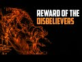

# Reward of the Disbelievers (2022-06-27 20:07:41+00:00)

## Description

You Can Support My Work on Patreon:
https://www.patreon.com/Bloggingtheology

My Paypal Link: 
https://www.paypal.com/paypalme/bloggingtheology?locale.x=en_GB

## Full transcript with timestamps

[0:00:00](https://youtu.be/zuBe4WP_Vus?t=0) here i am at speaker's corner  
[0:00:02](https://youtu.be/zuBe4WP_Vus?t=2) oh believers be mindful of allah and  
[0:00:05](https://youtu.be/zuBe4WP_Vus?t=5) seek what brings you closer to him and  
[0:00:08](https://youtu.be/zuBe4WP_Vus?t=8) struggle in his way  
[0:00:10](https://youtu.be/zuBe4WP_Vus?t=10) so you may be successful  
[0:00:12](https://youtu.be/zuBe4WP_Vus?t=12) as for the disbelievers even if they  
[0:00:15](https://youtu.be/zuBe4WP_Vus?t=15) were to possess everything in the world  
[0:00:17](https://youtu.be/zuBe4WP_Vus?t=17) twice over and offer it all to ransom  
[0:00:21](https://youtu.be/zuBe4WP_Vus?t=21) themselves from the punishment of the  
[0:00:23](https://youtu.be/zuBe4WP_Vus?t=23) day of judgment it would never be  
[0:00:25](https://youtu.be/zuBe4WP_Vus?t=25) accepted from them and they will suffer  
[0:00:28](https://youtu.be/zuBe4WP_Vus?t=28) a painful punishment  
[0:00:30](https://youtu.be/zuBe4WP_Vus?t=30) and they will be desperate to get out of  
[0:00:32](https://youtu.be/zuBe4WP_Vus?t=32) the fire but they never will be able to  
[0:00:35](https://youtu.be/zuBe4WP_Vus?t=35) and they will suffer an everlasting  
[0:00:38](https://youtu.be/zuBe4WP_Vus?t=38) punishment  
