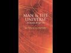

# Science as Religion (2021-06-09 14:39:32+00:00)

## Description

I read from Man and the Universe: An Islamic Perspective by Dr Mostafa Al-Badawi https://www.amazon.co.uk/Man-Universe-Mostafa-al-Badawi/dp/1905837364/ref=pd_lpo_14_t_0/261-2148358-4532537?_encoding=UTF8&pd_rd_i=1905837364&pd_rd_r=693fd526-a715-454e-9f64-b559e87ed11f&pd_rd_w=wWe5Y&pd_rd_wg=oIgyP&pf_rd_p=3366510f-1771-44b5-99e2-20c1889506ac&pf_rd_r=M71J4AJJWQCWSNCZTT07&psc=1&refRID=M71J4AJJWQCWSNCZTT07

## Full transcript with timestamps

[0:00:01](https://youtu.be/DYBY_8c7YX8?t=1) today we continue reading some  
[0:00:03](https://youtu.be/DYBY_8c7YX8?t=3) reflections from dr mustafa al-bidari's  
[0:00:06](https://youtu.be/DYBY_8c7YX8?t=6) penetrating diagnosis of the illnesses  
[0:00:09](https://youtu.be/DYBY_8c7YX8?t=9) afflicting  
[0:00:10](https://youtu.be/DYBY_8c7YX8?t=10) humanity today and i'll be reading from  
[0:00:13](https://youtu.be/DYBY_8c7YX8?t=13) man and the universe an islamic  
[0:00:15](https://youtu.be/DYBY_8c7YX8?t=15) perspective  
[0:00:16](https://youtu.be/DYBY_8c7YX8?t=16) mustafa al-badari is a consultant  
[0:00:18](https://youtu.be/DYBY_8c7YX8?t=18) psychiatrist  
[0:00:19](https://youtu.be/DYBY_8c7YX8?t=19) here in the uk here are his thoughts  
[0:00:23](https://youtu.be/DYBY_8c7YX8?t=23) on science as religion and i'll be  
[0:00:26](https://youtu.be/DYBY_8c7YX8?t=26) reading from page 84  
[0:00:28](https://youtu.be/DYBY_8c7YX8?t=28) onwards he writes man cannot live  
[0:00:32](https://youtu.be/DYBY_8c7YX8?t=32) without some kind of religion  
[0:00:34](https://youtu.be/DYBY_8c7YX8?t=34) even those who hold that there is no  
[0:00:36](https://youtu.be/DYBY_8c7YX8?t=36) such thing as religion  
[0:00:38](https://youtu.be/DYBY_8c7YX8?t=38) merely substitute one set of beliefs for  
[0:00:41](https://youtu.be/DYBY_8c7YX8?t=41) another  
[0:00:42](https://youtu.be/DYBY_8c7YX8?t=42) religion consists in a doctrine which  
[0:00:45](https://youtu.be/DYBY_8c7YX8?t=45) explains what man  
[0:00:46](https://youtu.be/DYBY_8c7YX8?t=46) is his position within the universe and  
[0:00:50](https://youtu.be/DYBY_8c7YX8?t=50) his relationship with the absolute  
[0:00:52](https://youtu.be/DYBY_8c7YX8?t=52) he spells absolute with a capital a it  
[0:00:56](https://youtu.be/DYBY_8c7YX8?t=56) offers a  
[0:00:56](https://youtu.be/DYBY_8c7YX8?t=56) law which regulates man's transactions  
[0:00:59](https://youtu.be/DYBY_8c7YX8?t=59) with his environment  
[0:01:00](https://youtu.be/DYBY_8c7YX8?t=60) and beyond that it offers a method of  
[0:01:03](https://youtu.be/DYBY_8c7YX8?t=63) spiritual ascent  
[0:01:05](https://youtu.be/DYBY_8c7YX8?t=65) it should always be remembered that the  
[0:01:07](https://youtu.be/DYBY_8c7YX8?t=67) memory of the lost  
[0:01:08](https://youtu.be/DYBY_8c7YX8?t=68) paradise lingers on within men as does  
[0:01:11](https://youtu.be/DYBY_8c7YX8?t=71) the feeling of the upward pull  
[0:01:13](https://youtu.be/DYBY_8c7YX8?t=73) of the spirit when christianity  
[0:01:17](https://youtu.be/DYBY_8c7YX8?t=77) lost its credibility and hence its  
[0:01:19](https://youtu.be/DYBY_8c7YX8?t=79) powers to explain  
[0:01:21](https://youtu.be/DYBY_8c7YX8?t=81) it was simply replaced by the more  
[0:01:23](https://youtu.be/DYBY_8c7YX8?t=83) materialistic  
[0:01:24](https://youtu.be/DYBY_8c7YX8?t=84) alternatives on offer thus instead of  
[0:01:28](https://youtu.be/DYBY_8c7YX8?t=88) seeking to reach the real paradise  
[0:01:30](https://youtu.be/DYBY_8c7YX8?t=90) people busied themselves with obtaining  
[0:01:33](https://youtu.be/DYBY_8c7YX8?t=93) as much pleasure  
[0:01:34](https://youtu.be/DYBY_8c7YX8?t=94) from the only paradise left to them that  
[0:01:37](https://youtu.be/DYBY_8c7YX8?t=97) of  
[0:01:37](https://youtu.be/DYBY_8c7YX8?t=97) immediate enjoyment in this life  
[0:01:40](https://youtu.be/DYBY_8c7YX8?t=100) and instead of striving along the path  
[0:01:42](https://youtu.be/DYBY_8c7YX8?t=102) of spiritual ascent  
[0:01:44](https://youtu.be/DYBY_8c7YX8?t=104) they chose the cruder and more  
[0:01:46](https://youtu.be/DYBY_8c7YX8?t=106) materialistic  
[0:01:47](https://youtu.be/DYBY_8c7YX8?t=107) alternative to satisfy this need  
[0:01:50](https://youtu.be/DYBY_8c7YX8?t=110) which was to reach for the moon the  
[0:01:53](https://youtu.be/DYBY_8c7YX8?t=113) explanations of religion were replaced  
[0:01:56](https://youtu.be/DYBY_8c7YX8?t=116) by  
[0:01:56](https://youtu.be/DYBY_8c7YX8?t=116) scientific theories with mere conjecture  
[0:01:59](https://youtu.be/DYBY_8c7YX8?t=119) being presented  
[0:02:00](https://youtu.be/DYBY_8c7YX8?t=120) as fact and held onto as tenaciously as  
[0:02:04](https://youtu.be/DYBY_8c7YX8?t=124) any religious belief  
[0:02:05](https://youtu.be/DYBY_8c7YX8?t=125) ever was the most notorious example is  
[0:02:09](https://youtu.be/DYBY_8c7YX8?t=129) of course the theory of evolution  
[0:02:13](https://youtu.be/DYBY_8c7YX8?t=133) despite the large number of people who  
[0:02:15](https://youtu.be/DYBY_8c7YX8?t=135) have attempted to demonstrate  
[0:02:16](https://youtu.be/DYBY_8c7YX8?t=136) that the scientific community was  
[0:02:18](https://youtu.be/DYBY_8c7YX8?t=138) equally divided between  
[0:02:20](https://youtu.be/DYBY_8c7YX8?t=140) supporters and foes popular mythology  
[0:02:23](https://youtu.be/DYBY_8c7YX8?t=143) accepts it as a proven fact and  
[0:02:27](https://youtu.be/DYBY_8c7YX8?t=147) scientists from  
[0:02:27](https://youtu.be/DYBY_8c7YX8?t=147) other disciplines readily use the  
[0:02:30](https://youtu.be/DYBY_8c7YX8?t=150) concept as categorically  
[0:02:32](https://youtu.be/DYBY_8c7YX8?t=152) as they use directly observable data  
[0:02:36](https://youtu.be/DYBY_8c7YX8?t=156) belief in science is currently perceived  
[0:02:38](https://youtu.be/DYBY_8c7YX8?t=158) as conferring the right to be skeptical  
[0:02:41](https://youtu.be/DYBY_8c7YX8?t=161) of  
[0:02:41](https://youtu.be/DYBY_8c7YX8?t=161) everything including science and  
[0:02:44](https://youtu.be/DYBY_8c7YX8?t=164) as release from the obligation to strive  
[0:02:47](https://youtu.be/DYBY_8c7YX8?t=167) for the truth dr albert ellis  
[0:02:52](https://youtu.be/DYBY_8c7YX8?t=172) an american psychologist who originated  
[0:02:54](https://youtu.be/DYBY_8c7YX8?t=174) a reasonably successful form of  
[0:02:57](https://youtu.be/DYBY_8c7YX8?t=177) psychotherapy that he labeled rational  
[0:02:59](https://youtu.be/DYBY_8c7YX8?t=179) emotive therapy  
[0:03:00](https://youtu.be/DYBY_8c7YX8?t=180) writes and he quotes the idea that  
[0:03:03](https://youtu.be/DYBY_8c7YX8?t=183) certain people are  
[0:03:04](https://youtu.be/DYBY_8c7YX8?t=184) bad or wicked springs from the ancient  
[0:03:07](https://youtu.be/DYBY_8c7YX8?t=187) theological doctrine  
[0:03:09](https://youtu.be/DYBY_8c7YX8?t=189) of free will which assumes that every  
[0:03:11](https://youtu.be/DYBY_8c7YX8?t=191) person has the freedom to act  
[0:03:13](https://youtu.be/DYBY_8c7YX8?t=193) rightly or wrongly in relation to some  
[0:03:16](https://youtu.be/DYBY_8c7YX8?t=196) absolute standard to truth and justice  
[0:03:19](https://youtu.be/DYBY_8c7YX8?t=199) obtained by  
[0:03:20](https://youtu.be/DYBY_8c7YX8?t=200) god or the natural law and that if  
[0:03:23](https://youtu.be/DYBY_8c7YX8?t=203) anyone uses his free will to behave  
[0:03:26](https://youtu.be/DYBY_8c7YX8?t=206) wrongly he is a wicked sinner  
[0:03:29](https://youtu.be/DYBY_8c7YX8?t=209) this doctrine has no scientific  
[0:03:31](https://youtu.be/DYBY_8c7YX8?t=211) foundation  
[0:03:32](https://youtu.be/DYBY_8c7YX8?t=212) because its key terms including absolute  
[0:03:36](https://youtu.be/DYBY_8c7YX8?t=216) truth  
[0:03:36](https://youtu.be/DYBY_8c7YX8?t=216) god free will and natural law  
[0:03:39](https://youtu.be/DYBY_8c7YX8?t=219) are purely definitional and can  
[0:03:42](https://youtu.be/DYBY_8c7YX8?t=222) be neither proven nor disproven in  
[0:03:46](https://youtu.be/DYBY_8c7YX8?t=226) empirical scientific terms end quote  
[0:03:51](https://youtu.be/DYBY_8c7YX8?t=231) this kind of argument is fairly  
[0:03:53](https://youtu.be/DYBY_8c7YX8?t=233) widespread in the west and reveals the  
[0:03:55](https://youtu.be/DYBY_8c7YX8?t=235) contradictions inherent in such  
[0:03:58](https://youtu.be/DYBY_8c7YX8?t=238) pseudo-objectivity denying the  
[0:04:00](https://youtu.be/DYBY_8c7YX8?t=240) absolute must surely also mean denying  
[0:04:03](https://youtu.be/DYBY_8c7YX8?t=243) oneself the right to speak in such  
[0:04:05](https://youtu.be/DYBY_8c7YX8?t=245) absolute  
[0:04:06](https://youtu.be/DYBY_8c7YX8?t=246) terms to think of proof as only possible  
[0:04:09](https://youtu.be/DYBY_8c7YX8?t=249) in purely  
[0:04:10](https://youtu.be/DYBY_8c7YX8?t=250) scientific terms is to attribute to  
[0:04:13](https://youtu.be/DYBY_8c7YX8?t=253) science a  
[0:04:14](https://youtu.be/DYBY_8c7YX8?t=254) competence far exceeding its quite  
[0:04:16](https://youtu.be/DYBY_8c7YX8?t=256) limited  
[0:04:17](https://youtu.be/DYBY_8c7YX8?t=257) territory it is to be so hypnotized by  
[0:04:20](https://youtu.be/DYBY_8c7YX8?t=260) science  
[0:04:21](https://youtu.be/DYBY_8c7YX8?t=261) that sight is lost of the fact that it  
[0:04:24](https://youtu.be/DYBY_8c7YX8?t=264) is valid  
[0:04:24](https://youtu.be/DYBY_8c7YX8?t=264) only in what pertains to the material  
[0:04:27](https://youtu.be/DYBY_8c7YX8?t=267) level  
[0:04:28](https://youtu.be/DYBY_8c7YX8?t=268) and that also in a very relative way  
[0:04:32](https://youtu.be/DYBY_8c7YX8?t=272) it would be more rational to think that  
[0:04:34](https://youtu.be/DYBY_8c7YX8?t=274) proof should be adequate to the level of  
[0:04:36](https://youtu.be/DYBY_8c7YX8?t=276) what needs to be  
[0:04:38](https://youtu.be/DYBY_8c7YX8?t=278) proved intelligible things require  
[0:04:41](https://youtu.be/DYBY_8c7YX8?t=281) intelligible proof  
[0:04:42](https://youtu.be/DYBY_8c7YX8?t=282) and spiritual things require spiritual  
[0:04:45](https://youtu.be/DYBY_8c7YX8?t=285) truth  
[0:04:47](https://youtu.be/DYBY_8c7YX8?t=287) the fact that the west has lost the  
[0:04:49](https://youtu.be/DYBY_8c7YX8?t=289) ability to accept spiritual proof  
[0:04:51](https://youtu.be/DYBY_8c7YX8?t=291) neither renders the spiritual dimension  
[0:04:54](https://youtu.be/DYBY_8c7YX8?t=294) non-existent  
[0:04:55](https://youtu.be/DYBY_8c7YX8?t=295) nor does it affect the validity of such  
[0:04:57](https://youtu.be/DYBY_8c7YX8?t=297) proof  
[0:04:58](https://youtu.be/DYBY_8c7YX8?t=298) at its own level that they cannot prove  
[0:05:02](https://youtu.be/DYBY_8c7YX8?t=302) god  
[0:05:02](https://youtu.be/DYBY_8c7YX8?t=302) scientifically merely proves that he is  
[0:05:05](https://youtu.be/DYBY_8c7YX8?t=305) not material enough  
[0:05:07](https://youtu.be/DYBY_8c7YX8?t=307) to be measured to conclude that he  
[0:05:09](https://youtu.be/DYBY_8c7YX8?t=309) therefore does not exist  
[0:05:11](https://youtu.be/DYBY_8c7YX8?t=311) is patently absurd now what if he did  
[0:05:15](https://youtu.be/DYBY_8c7YX8?t=315) what if those millions of people who  
[0:05:17](https://youtu.be/DYBY_8c7YX8?t=317) have lived throughout the centuries  
[0:05:18](https://youtu.be/DYBY_8c7YX8?t=318) believing in a life to come  
[0:05:20](https://youtu.be/DYBY_8c7YX8?t=320) were not so naive and backward after all  
[0:05:24](https://youtu.be/DYBY_8c7YX8?t=324) what of the inertia and complacency of  
[0:05:26](https://youtu.be/DYBY_8c7YX8?t=326) those who do not even wish  
[0:05:28](https://youtu.be/DYBY_8c7YX8?t=328) to find out pleasure seeking and the  
[0:05:31](https://youtu.be/DYBY_8c7YX8?t=331) wish to achieve  
[0:05:33](https://youtu.be/DYBY_8c7YX8?t=333) are basic human traits however the west  
[0:05:36](https://youtu.be/DYBY_8c7YX8?t=336) has substituted immediate and lowly  
[0:05:39](https://youtu.be/DYBY_8c7YX8?t=339) pleasures  
[0:05:40](https://youtu.be/DYBY_8c7YX8?t=340) for those of paradise and the spirit  
[0:05:43](https://youtu.be/DYBY_8c7YX8?t=343) and achievement in terms of income and  
[0:05:46](https://youtu.be/DYBY_8c7YX8?t=346) social status  
[0:05:47](https://youtu.be/DYBY_8c7YX8?t=347) for spiritual growth  
[0:05:50](https://youtu.be/DYBY_8c7YX8?t=350) there are a few people in the west who  
[0:05:53](https://youtu.be/DYBY_8c7YX8?t=353) are aware that there's  
[0:05:54](https://youtu.be/DYBY_8c7YX8?t=354) is indeed a precarious situation and you  
[0:05:57](https://youtu.be/DYBY_8c7YX8?t=357) have some degree of sincerity and  
[0:05:59](https://youtu.be/DYBY_8c7YX8?t=359) wishing to find  
[0:06:00](https://youtu.be/DYBY_8c7YX8?t=360) a way out they will first of all have to  
[0:06:04](https://youtu.be/DYBY_8c7YX8?t=364) dis  
[0:06:04](https://youtu.be/DYBY_8c7YX8?t=364) entangle themselves from the current  
[0:06:06](https://youtu.be/DYBY_8c7YX8?t=366) myths which  
[0:06:07](https://youtu.be/DYBY_8c7YX8?t=367) shape their mentality and they will then  
[0:06:10](https://youtu.be/DYBY_8c7YX8?t=370) be faced with a myriad of  
[0:06:12](https://youtu.be/DYBY_8c7YX8?t=372) pseudo-religions  
[0:06:13](https://youtu.be/DYBY_8c7YX8?t=373) which are bound in the west today and  
[0:06:16](https://youtu.be/DYBY_8c7YX8?t=376) nowhere more so  
[0:06:17](https://youtu.be/DYBY_8c7YX8?t=377) than in america some of those are  
[0:06:21](https://youtu.be/DYBY_8c7YX8?t=381) parodies of true traditions  
[0:06:23](https://youtu.be/DYBY_8c7YX8?t=383) others are invented from moment to  
[0:06:25](https://youtu.be/DYBY_8c7YX8?t=385) moment as the situation requires  
[0:06:28](https://youtu.be/DYBY_8c7YX8?t=388) and there are even some which are based  
[0:06:30](https://youtu.be/DYBY_8c7YX8?t=390) on science fiction  
[0:06:33](https://youtu.be/DYBY_8c7YX8?t=393) very few indeed are those who are able  
[0:06:35](https://youtu.be/DYBY_8c7YX8?t=395) to see through  
[0:06:36](https://youtu.be/DYBY_8c7YX8?t=396) such mirages and keep their feet firmly  
[0:06:40](https://youtu.be/DYBY_8c7YX8?t=400) on the ground  
[0:06:43](https://youtu.be/DYBY_8c7YX8?t=403) until next time  
