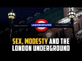

# Sex, modesty, and the London Underground (2022-05-12 15:52:38+00:00)

## Description

If men will not be governed by the Ten Commandments https://catholicherald.co.uk/ch/if-men-will-not-be-governed-by-the-ten-commandments/

You Can Support My Work on Patreon:
https://www.patreon.com/Bloggingtheology

My Paypal Link: 
https://www.paypal.com/paypalme/bloggingtheology?locale.x=en_GB

## Full transcript with timestamps

[0:00:03](https://youtu.be/JCZWW21LoNU?t=3) just want to share with you a  
[0:00:04](https://youtu.be/JCZWW21LoNU?t=4) fascinating article i have just read in  
[0:00:06](https://youtu.be/JCZWW21LoNU?t=6) the catholic herald the catholic held is  
[0:00:09](https://youtu.be/JCZWW21LoNU?t=9) a roman catholic publication based in  
[0:00:11](https://youtu.be/JCZWW21LoNU?t=11) the uk i read it online and there's a  
[0:00:14](https://youtu.be/JCZWW21LoNU?t=14) really interesting article by a guy  
[0:00:16](https://youtu.be/JCZWW21LoNU?t=16) called niall gooch entitled if men will  
[0:00:20](https://youtu.be/JCZWW21LoNU?t=20) not be governed by the ten commandments  
[0:00:23](https://youtu.be/JCZWW21LoNU?t=23) i'm just going to read it to you and  
[0:00:24](https://youtu.be/JCZWW21LoNU?t=24) then make a few comments uh by way of  
[0:00:26](https://youtu.be/JCZWW21LoNU?t=26) perhaps an islamic response to what he  
[0:00:29](https://youtu.be/JCZWW21LoNU?t=29) writes  
[0:00:30](https://youtu.be/JCZWW21LoNU?t=30) and he says  
[0:00:33](https://youtu.be/JCZWW21LoNU?t=33) if men will not be governed by the ten  
[0:00:35](https://youtu.be/JCZWW21LoNU?t=35) commandments they will be governed by  
[0:00:37](https://youtu.be/JCZWW21LoNU?t=37) the ten thousand commandments  
[0:00:40](https://youtu.be/JCZWW21LoNU?t=40) so said g k chesterton  
[0:00:43](https://youtu.be/JCZWW21LoNU?t=43) in a memorable way the truth that a  
[0:00:46](https://youtu.be/JCZWW21LoNU?t=46) society made up of those who will not  
[0:00:48](https://youtu.be/JCZWW21LoNU?t=48) govern their own moral behavior will  
[0:00:51](https://youtu.be/JCZWW21LoNU?t=51) sooner or later become less free as the  
[0:00:55](https://youtu.be/JCZWW21LoNU?t=55) government resorts to ever more coercion  
[0:00:58](https://youtu.be/JCZWW21LoNU?t=58) and regulation to minimize the  
[0:01:00](https://youtu.be/JCZWW21LoNU?t=60) consequences of unrestrained human  
[0:01:03](https://youtu.be/JCZWW21LoNU?t=63) sinfulness  
[0:01:05](https://youtu.be/JCZWW21LoNU?t=65) i think of this aphorism often nowadays  
[0:01:08](https://youtu.be/JCZWW21LoNU?t=68) as our authorities in the uk he means  
[0:01:12](https://youtu.be/JCZWW21LoNU?t=72) with little success use the law to  
[0:01:15](https://youtu.be/JCZWW21LoNU?t=75) contain forms of bad behavior which  
[0:01:18](https://youtu.be/JCZWW21LoNU?t=78) until very recently were widely  
[0:01:21](https://youtu.be/JCZWW21LoNU?t=81) understood to be the preserve of manners  
[0:01:24](https://youtu.be/JCZWW21LoNU?t=84) and morals  
[0:01:25](https://youtu.be/JCZWW21LoNU?t=85) transmitted organically through  
[0:01:28](https://youtu.be/JCZWW21LoNU?t=88) non-political social institutions like  
[0:01:30](https://youtu.be/JCZWW21LoNU?t=90) the family churches youth organizations  
[0:01:34](https://youtu.be/JCZWW21LoNU?t=94) and so on  
[0:01:36](https://youtu.be/JCZWW21LoNU?t=96) a couple of months back for example  
[0:01:38](https://youtu.be/JCZWW21LoNU?t=98) transport for london that's an  
[0:01:40](https://youtu.be/JCZWW21LoNU?t=100) organization that runs the buses and the  
[0:01:42](https://youtu.be/JCZWW21LoNU?t=102) underground and so on here in london  
[0:01:44](https://youtu.be/JCZWW21LoNU?t=104) they began putting up posters on the  
[0:01:47](https://youtu.be/JCZWW21LoNU?t=107) underground the subway  
[0:01:48](https://youtu.be/JCZWW21LoNU?t=108) and buses too reminding men that  
[0:01:51](https://youtu.be/JCZWW21LoNU?t=111) intrusive staring was unacceptable and  
[0:01:55](https://youtu.be/JCZWW21LoNU?t=115) might be reported to the police as a  
[0:01:58](https://youtu.be/JCZWW21LoNU?t=118) form of sexual harassment  
[0:02:00](https://youtu.be/JCZWW21LoNU?t=120) in april a senior british transport  
[0:02:04](https://youtu.be/JCZWW21LoNU?t=124) police officer  
[0:02:05](https://youtu.be/JCZWW21LoNU?t=125) reiterated that they would prosecute  
[0:02:08](https://youtu.be/JCZWW21LoNU?t=128) people suspected of such behavior  
[0:02:11](https://youtu.be/JCZWW21LoNU?t=131) more recently posters have appeared  
[0:02:14](https://youtu.be/JCZWW21LoNU?t=134) targeted at men  
[0:02:15](https://youtu.be/JCZWW21LoNU?t=135) insisting that they refuse to tolerate  
[0:02:18](https://youtu.be/JCZWW21LoNU?t=138) their friends sexist and misogynist  
[0:02:21](https://youtu.be/JCZWW21LoNU?t=141) jokes on the grounds that such jokes are  
[0:02:24](https://youtu.be/JCZWW21LoNU?t=144) the first steps on the road to  
[0:02:26](https://youtu.be/JCZWW21LoNU?t=146) committing sexual assault or violence  
[0:02:29](https://youtu.be/JCZWW21LoNU?t=149) against women  
[0:02:32](https://youtu.be/JCZWW21LoNU?t=152) such initiatives are clearly well  
[0:02:34](https://youtu.be/JCZWW21LoNU?t=154) meaning that the fact that they need to  
[0:02:36](https://youtu.be/JCZWW21LoNU?t=156) happen at all shows the steep cost of  
[0:02:40](https://youtu.be/JCZWW21LoNU?t=160) our endless war against limits and  
[0:02:43](https://youtu.be/JCZWW21LoNU?t=163) constraints on behavior  
[0:02:45](https://youtu.be/JCZWW21LoNU?t=165) and our increasing reliance on the  
[0:02:48](https://youtu.be/JCZWW21LoNU?t=168) pliable and woolly concept of consent  
[0:02:52](https://youtu.be/JCZWW21LoNU?t=172) as the only benchmark for morality  
[0:02:56](https://youtu.be/JCZWW21LoNU?t=176) in the bad old days of repression so  
[0:02:59](https://youtu.be/JCZWW21LoNU?t=179) called  
[0:03:00](https://youtu.be/JCZWW21LoNU?t=180) the public sphere was largely kept free  
[0:03:04](https://youtu.be/JCZWW21LoNU?t=184) of sexually explicit behavior and  
[0:03:06](https://youtu.be/JCZWW21LoNU?t=186) references  
[0:03:08](https://youtu.be/JCZWW21LoNU?t=188) reticence and modesty regarding sex and  
[0:03:12](https://youtu.be/JCZWW21LoNU?t=192) indeed most personal matters were  
[0:03:14](https://youtu.be/JCZWW21LoNU?t=194) considered the order of the day this was  
[0:03:18](https://youtu.be/JCZWW21LoNU?t=198) rooted of course in britain's long  
[0:03:21](https://youtu.be/JCZWW21LoNU?t=201) christian history  
[0:03:22](https://youtu.be/JCZWW21LoNU?t=202) it undoubtedly had disadvantages but it  
[0:03:26](https://youtu.be/JCZWW21LoNU?t=206) also meant that the pa that in public  
[0:03:28](https://youtu.be/JCZWW21LoNU?t=208) you are unlikely to be confronted with  
[0:03:31](https://youtu.be/JCZWW21LoNU?t=211) sexual imagery and sexualized behavior  
[0:03:35](https://youtu.be/JCZWW21LoNU?t=215) i don't mean that what we'd now call  
[0:03:38](https://youtu.be/JCZWW21LoNU?t=218) sexual harassment or intrusive staring  
[0:03:41](https://youtu.be/JCZWW21LoNU?t=221) was unknown  
[0:03:42](https://youtu.be/JCZWW21LoNU?t=222) but rather that they were unusual and to  
[0:03:45](https://youtu.be/JCZWW21LoNU?t=225) many people literally unthinkable  
[0:03:48](https://youtu.be/JCZWW21LoNU?t=228) because of the social and legal norms in  
[0:03:51](https://youtu.be/JCZWW21LoNU?t=231) place  
[0:03:53](https://youtu.be/JCZWW21LoNU?t=233) now we think we know better  
[0:03:57](https://youtu.be/JCZWW21LoNU?t=237) we have what we feel like an almost  
[0:03:59](https://youtu.be/JCZWW21LoNU?t=239) pathological openness about every aspect  
[0:04:02](https://youtu.be/JCZWW21LoNU?t=242) of people's lives and reservations about  
[0:04:06](https://youtu.be/JCZWW21LoNU?t=246) sexualized public sphere  
[0:04:09](https://youtu.be/JCZWW21LoNU?t=249) reservations about a publicly sexualized  
[0:04:11](https://youtu.be/JCZWW21LoNU?t=251) sphere are regarded as old-fashioned and  
[0:04:15](https://youtu.be/JCZWW21LoNU?t=255) puritanical  
[0:04:17](https://youtu.be/JCZWW21LoNU?t=257) this leads however to a chaotic and  
[0:04:20](https://youtu.be/JCZWW21LoNU?t=260) confusing situation for many people and  
[0:04:23](https://youtu.be/JCZWW21LoNU?t=263) this is where i think the author of this  
[0:04:24](https://youtu.be/JCZWW21LoNU?t=264) article makes a really interesting point  
[0:04:27](https://youtu.be/JCZWW21LoNU?t=267) we are enjoined we're encouraged to be  
[0:04:29](https://youtu.be/JCZWW21LoNU?t=269) open about sex  
[0:04:31](https://youtu.be/JCZWW21LoNU?t=271) pornography is widely available  
[0:04:34](https://youtu.be/JCZWW21LoNU?t=274) highly explicit sex scenes can be shown  
[0:04:37](https://youtu.be/JCZWW21LoNU?t=277) on tv and films and huge billboards can  
[0:04:40](https://youtu.be/JCZWW21LoNU?t=280) feature people in revealing underwear  
[0:04:43](https://youtu.be/JCZWW21LoNU?t=283) but  
[0:04:44](https://youtu.be/JCZWW21LoNU?t=284) personal interactions are governed by  
[0:04:47](https://youtu.be/JCZWW21LoNU?t=287) very strict rules  
[0:04:49](https://youtu.be/JCZWW21LoNU?t=289) now approached in a rationalistic way  
[0:04:52](https://youtu.be/JCZWW21LoNU?t=292) this is defensible he says  
[0:04:55](https://youtu.be/JCZWW21LoNU?t=295) it is all about personal choice and  
[0:04:57](https://youtu.be/JCZWW21LoNU?t=297) freedom modern people would say  
[0:05:01](https://youtu.be/JCZWW21LoNU?t=301) but this is astonishingly naive he  
[0:05:04](https://youtu.be/JCZWW21LoNU?t=304) writes  
[0:05:06](https://youtu.be/JCZWW21LoNU?t=306) it does not suit human nature as it  
[0:05:08](https://youtu.be/JCZWW21LoNU?t=308) really exists  
[0:05:10](https://youtu.be/JCZWW21LoNU?t=310) the christian anthropology  
[0:05:13](https://youtu.be/JCZWW21LoNU?t=313) in other words the christian  
[0:05:14](https://youtu.be/JCZWW21LoNU?t=314) understanding of our human nature  
[0:05:16](https://youtu.be/JCZWW21LoNU?t=316) understands that appetites  
[0:05:20](https://youtu.be/JCZWW21LoNU?t=320) once aroused and indulged are hard to  
[0:05:23](https://youtu.be/JCZWW21LoNU?t=323) control and that we cannot  
[0:05:25](https://youtu.be/JCZWW21LoNU?t=325) compartmentalize them so easily  
[0:05:29](https://youtu.be/JCZWW21LoNU?t=329) we realize that there is a fundamental  
[0:05:31](https://youtu.be/JCZWW21LoNU?t=331) contradiction in wanting a public life  
[0:05:34](https://youtu.be/JCZWW21LoNU?t=334) that is as relaxed as possible about all  
[0:05:37](https://youtu.be/JCZWW21LoNU?t=337) forms of sexual display  
[0:05:39](https://youtu.be/JCZWW21LoNU?t=339) and where chivalry is ridiculed and  
[0:05:42](https://youtu.be/JCZWW21LoNU?t=342) looked down upon  
[0:05:44](https://youtu.be/JCZWW21LoNU?t=344) but also one where men are enjoined to  
[0:05:47](https://youtu.be/JCZWW21LoNU?t=347) behave towards women in public as if it  
[0:05:50](https://youtu.be/JCZWW21LoNU?t=350) was still 1952  
[0:05:53](https://youtu.be/JCZWW21LoNU?t=353) i'm not sure why he picks 1952 but you  
[0:05:54](https://youtu.be/JCZWW21LoNU?t=354) get the sense of  
[0:05:56](https://youtu.be/JCZWW21LoNU?t=356) an age gone by  
[0:05:58](https://youtu.be/JCZWW21LoNU?t=358) it is not so very easy to have good  
[0:06:00](https://youtu.be/JCZWW21LoNU?t=360) things when the religious and social  
[0:06:03](https://youtu.be/JCZWW21LoNU?t=363) norms that underpin them have been  
[0:06:06](https://youtu.be/JCZWW21LoNU?t=366) kicked away  
[0:06:08](https://youtu.be/JCZWW21LoNU?t=368) there ends that article i think many  
[0:06:10](https://youtu.be/JCZWW21LoNU?t=370) muslims would uh reckon and traditional  
[0:06:12](https://youtu.be/JCZWW21LoNU?t=372) christians would recognize  
[0:06:14](https://youtu.be/JCZWW21LoNU?t=374) the profound insight into that now what  
[0:06:17](https://youtu.be/JCZWW21LoNU?t=377) about islam well as we know islam is  
[0:06:20](https://youtu.be/JCZWW21LoNU?t=380) characterized by its modesty  
[0:06:23](https://youtu.be/JCZWW21LoNU?t=383) ibn ibas  
[0:06:25](https://youtu.be/JCZWW21LoNU?t=385) reported in hadith the messenger of god  
[0:06:27](https://youtu.be/JCZWW21LoNU?t=387) peace and blessings be upon him said  
[0:06:29](https://youtu.be/JCZWW21LoNU?t=389) truly every religion has a character and  
[0:06:33](https://youtu.be/JCZWW21LoNU?t=393) the character of islam is modesty  
[0:06:37](https://youtu.be/JCZWW21LoNU?t=397) herrera reported the messenger of god  
[0:06:39](https://youtu.be/JCZWW21LoNU?t=399) peace and blessings be upon him said  
[0:06:42](https://youtu.be/JCZWW21LoNU?t=402) faith has 60 to 70 branches the best of  
[0:06:45](https://youtu.be/JCZWW21LoNU?t=405) which is to declare that there is no god  
[0:06:48](https://youtu.be/JCZWW21LoNU?t=408) but allah the least of which is to  
[0:06:50](https://youtu.be/JCZWW21LoNU?t=410) remove something harmful from the road  
[0:06:53](https://youtu.be/JCZWW21LoNU?t=413) and modesty is a branch of faith  
[0:06:58](https://youtu.be/JCZWW21LoNU?t=418) there are many many examples one could  
[0:06:59](https://youtu.be/JCZWW21LoNU?t=419) give from numerous hadith and statements  
[0:07:01](https://youtu.be/JCZWW21LoNU?t=421) in the quran to the same effect of  
[0:07:03](https://youtu.be/JCZWW21LoNU?t=423) course  
[0:07:04](https://youtu.be/JCZWW21LoNU?t=424) in the west however many people  
[0:07:07](https://youtu.be/JCZWW21LoNU?t=427) equate dressing modestly  
[0:07:09](https://youtu.be/JCZWW21LoNU?t=429) as being oppressed  
[0:07:12](https://youtu.be/JCZWW21LoNU?t=432) however many female reverts these are  
[0:07:14](https://youtu.be/JCZWW21LoNU?t=434) converts to islam report that when they  
[0:07:17](https://youtu.be/JCZWW21LoNU?t=437) began dressing modestly after converting  
[0:07:19](https://youtu.be/JCZWW21LoNU?t=439) to islam they felt more empowered than  
[0:07:22](https://youtu.be/JCZWW21LoNU?t=442) ever before  
[0:07:24](https://youtu.be/JCZWW21LoNU?t=444) one said  
[0:07:26](https://youtu.be/JCZWW21LoNU?t=446) i became in control of my body and was  
[0:07:29](https://youtu.be/JCZWW21LoNU?t=449) newly able to choose who could see me  
[0:07:32](https://youtu.be/JCZWW21LoNU?t=452) contrary to the common narrative in the  
[0:07:34](https://youtu.be/JCZWW21LoNU?t=454) west dressing modestly has empowered me  
[0:07:38](https://youtu.be/JCZWW21LoNU?t=458) and given me a newfound sense of  
[0:07:41](https://youtu.be/JCZWW21LoNU?t=461) security and confidence  
[0:07:44](https://youtu.be/JCZWW21LoNU?t=464) and as as we know in islam the concept  
[0:07:47](https://youtu.be/JCZWW21LoNU?t=467) of hair or modesty is a distinctive  
[0:07:49](https://youtu.be/JCZWW21LoNU?t=469) quality of the faith  
[0:07:51](https://youtu.be/JCZWW21LoNU?t=471) many muslims observe modesty both in  
[0:07:55](https://youtu.be/JCZWW21LoNU?t=475) their outward appearance and also  
[0:07:57](https://youtu.be/JCZWW21LoNU?t=477) through their inner self  
[0:07:59](https://youtu.be/JCZWW21LoNU?t=479) in regard to their actions and character  
[0:08:02](https://youtu.be/JCZWW21LoNU?t=482) men and women alike are commanded in the  
[0:08:05](https://youtu.be/JCZWW21LoNU?t=485) quran to observe modesty  
[0:08:09](https://youtu.be/JCZWW21LoNU?t=489) and this i think is another instance of  
[0:08:12](https://youtu.be/JCZWW21LoNU?t=492) how muslims in the west can contribute  
[0:08:15](https://youtu.be/JCZWW21LoNU?t=495) to the public good by their wholesome  
[0:08:18](https://youtu.be/JCZWW21LoNU?t=498) example  
[0:08:20](https://youtu.be/JCZWW21LoNU?t=500) until next time  
