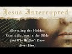

# Some key differences between Paul and the Gospel writers (2020-12-16)

## Description

I cite 'Jesus Interrupted: Revealing the Hidden Contradictions in the Bible (and Why We Don't Know About Them)' by Dr Bart D. Ehrman  https://www.amazon.co.uk/Jesus-Interrupted-Bart-D-Ehrman/dp/0061173940

## Summary of [Some key differences between Paul and the Gospel writers](https://www.youtube.com/watch?v=KuA2ozpf6AA)

*This summary is AI generated - there may be inaccuracies. *

### [00:00:00](https://www.youtube.com/watch?v=KuA2ozpf6AA&t=0) - [00:10:00](https://www.youtube.com/watch?v=KuA2ozpf6AA&t=600)

Bart Ehrman discusses some key differences between Paul and the Gospel writers, including their beliefs about human sacrifice and the Jewish law. He also highlights a difference in their views on salvation, with Paul teaching that it comes to those who follow Jesus and keep the Jewish law, and Matthew believing that it is available to all who treat others humanely.

**[00:00:00](https://www.youtube.com/watch?v=KuA2ozpf6AA&t=0)** The main differences between Paul and the Gospel writers are that Paul preached about Jesus primarily to put one's faith in Jesus' death and resurrection, and not through observing the works of the Jewish law. Paul also reasons that Jesus must not have died for any wrong deeds because if he was the messiah, who stood under God's special favor, he must not have died for his own sins.
* **[00:05:00](https://www.youtube.com/watch?v=KuA2ozpf6AA&t=300)** According to Bart Ehrman, differences between Paul and the Gospel writers include the following: Paul did not believe in human sacrifice as an atonement for sin, the sacrificial system in the temple never made room for human sacrifice, and the keeping of the Jewish law can have no place in salvation. Differences between Paul and Matthew include the following: while Paul taught that followers of Jesus needed to keep the law, Matthew thought that followers of Jesus should keep the law better than most religious Jews.
* **[00:10:00](https://www.youtube.com/watch?v=KuA2ozpf6AA&t=600)** In Matthew, salvation comes to those who have never heard of Jesus and treat others humanely, while in Paul, salvation comes to those who follow Jesus and keep the Jewish law. This difference in viewpoints has significant implications for Christian-Muslim relations today.

<h2>Full transcript with timestamps: CLICK TO EXPAND</h2>

[0:00:01](https://youtu.be/KuA2ozpf6AA?t=1) hello and in this uh  
[0:00:03](https://youtu.be/KuA2ozpf6AA?t=3) episode i want to look at some of the  
[0:00:05](https://youtu.be/KuA2ozpf6AA?t=5) key differences  
[0:00:06](https://youtu.be/KuA2ozpf6AA?t=6) between the apostle paul and the gospel  
[0:00:10](https://youtu.be/KuA2ozpf6AA?t=10) writers uh focusing particularly on  
[0:00:13](https://youtu.be/KuA2ozpf6AA?t=13) salvation and the and the law  
[0:00:17](https://youtu.be/KuA2ozpf6AA?t=17) we we find if we look at the four  
[0:00:19](https://youtu.be/KuA2ozpf6AA?t=19) gospels uh  
[0:00:20](https://youtu.be/KuA2ozpf6AA?t=20) all written some years after jesus time  
[0:00:23](https://youtu.be/KuA2ozpf6AA?t=23) uh and then compare it with the teaching  
[0:00:25](https://youtu.be/KuA2ozpf6AA?t=25) of paul we have  
[0:00:26](https://youtu.be/KuA2ozpf6AA?t=26) some interesting issues shall we say  
[0:00:28](https://youtu.be/KuA2ozpf6AA?t=28) arise and i'm going to be  
[0:00:30](https://youtu.be/KuA2ozpf6AA?t=30) uh quoting uh and commenting on a book  
[0:00:33](https://youtu.be/KuA2ozpf6AA?t=33) by professor bye ehrman who's uh  
[0:00:36](https://youtu.be/KuA2ozpf6AA?t=36) an academic in new testament studies in  
[0:00:38](https://youtu.be/KuA2ozpf6AA?t=38) the states uh he wrote a book called  
[0:00:40](https://youtu.be/KuA2ozpf6AA?t=40) jesus  
[0:00:41](https://youtu.be/KuA2ozpf6AA?t=41) interrupted um from page 85 onwards it's  
[0:00:45](https://youtu.be/KuA2ozpf6AA?t=45) a rather good book it really  
[0:00:46](https://youtu.be/KuA2ozpf6AA?t=46) in a very simple and populist way it uh  
[0:00:50](https://youtu.be/KuA2ozpf6AA?t=50) gives us the the main issues uh that  
[0:00:52](https://youtu.be/KuA2ozpf6AA?t=52) have preoccupied  
[0:00:54](https://youtu.be/KuA2ozpf6AA?t=54) new testament scholars for the last  
[0:00:56](https://youtu.be/KuA2ozpf6AA?t=56) century or two  
[0:00:57](https://youtu.be/KuA2ozpf6AA?t=57) and this particular question um is of  
[0:01:00](https://youtu.be/KuA2ozpf6AA?t=60) absolutely central importance i would  
[0:01:02](https://youtu.be/KuA2ozpf6AA?t=62) think or  
[0:01:03](https://youtu.be/KuA2ozpf6AA?t=63) and many people think uh because we're  
[0:01:05](https://youtu.be/KuA2ozpf6AA?t=65) dealing with two different  
[0:01:07](https://youtu.be/KuA2ozpf6AA?t=67) uh gospels here we're dealing with the  
[0:01:09](https://youtu.be/KuA2ozpf6AA?t=69) gospel of paul  
[0:01:10](https://youtu.be/KuA2ozpf6AA?t=70) who preached about jesus obviously  
[0:01:14](https://youtu.be/KuA2ozpf6AA?t=74) to put one's faith uh one's trust  
[0:01:17](https://youtu.be/KuA2ozpf6AA?t=77) in jesus saving death and resurrection  
[0:01:20](https://youtu.be/KuA2ozpf6AA?t=80) and  
[0:01:21](https://youtu.be/KuA2ozpf6AA?t=81) through that saving trust in jesus death  
[0:01:22](https://youtu.be/KuA2ozpf6AA?t=82) and resurrection one is saved one  
[0:01:24](https://youtu.be/KuA2ozpf6AA?t=84) acquires salvation  
[0:01:26](https://youtu.be/KuA2ozpf6AA?t=86) but if one looks at the teaching of  
[0:01:28](https://youtu.be/KuA2ozpf6AA?t=88) jesus in the early gospels  
[0:01:30](https://youtu.be/KuA2ozpf6AA?t=90) one has a different message and we'll  
[0:01:32](https://youtu.be/KuA2ozpf6AA?t=92) come to what that might be in a second  
[0:01:34](https://youtu.be/KuA2ozpf6AA?t=94) with the help of  
[0:01:35](https://youtu.be/KuA2ozpf6AA?t=95) professor bart ehrmann now  
[0:01:39](https://youtu.be/KuA2ozpf6AA?t=99) one important aspect of paul's teaching  
[0:01:42](https://youtu.be/KuA2ozpf6AA?t=102) is the question of how a person can have  
[0:01:44](https://youtu.be/KuA2ozpf6AA?t=104) a right relationship  
[0:01:45](https://youtu.be/KuA2ozpf6AA?t=105) a right standing before god we're  
[0:01:47](https://youtu.be/KuA2ozpf6AA?t=107) sinners god is a holy god how can we  
[0:01:49](https://youtu.be/KuA2ozpf6AA?t=109) stand before a holy god  
[0:01:51](https://youtu.be/KuA2ozpf6AA?t=111) is it possible to be  
[0:01:54](https://youtu.be/KuA2ozpf6AA?t=114) justified to have justification as  
[0:01:56](https://youtu.be/KuA2ozpf6AA?t=116) christians call it  
[0:01:58](https://youtu.be/KuA2ozpf6AA?t=118) um this idea of having a right standing  
[0:02:00](https://youtu.be/KuA2ozpf6AA?t=120) before god and how is this acquired or  
[0:02:02](https://youtu.be/KuA2ozpf6AA?t=122) how is this given to us  
[0:02:04](https://youtu.be/KuA2ozpf6AA?t=124) and uh paul's views on justification  
[0:02:08](https://youtu.be/KuA2ozpf6AA?t=128) can be found mainly in his letters to  
[0:02:10](https://youtu.be/KuA2ozpf6AA?t=130) the galatians and to the romans  
[0:02:12](https://youtu.be/KuA2ozpf6AA?t=132) and he explains how this is uh happened  
[0:02:15](https://youtu.be/KuA2ozpf6AA?t=135) and his  
[0:02:16](https://youtu.be/KuA2ozpf6AA?t=136) uh most famous expression is  
[0:02:20](https://youtu.be/KuA2ozpf6AA?t=140) justified by faith paul says we're  
[0:02:22](https://youtu.be/KuA2ozpf6AA?t=142) justified by faith we're made right  
[0:02:25](https://youtu.be/KuA2ozpf6AA?t=145) by faith or trusting in uh  
[0:02:28](https://youtu.be/KuA2ozpf6AA?t=148) christ's death and resurrection and  
[0:02:31](https://youtu.be/KuA2ozpf6AA?t=151) importantly  
[0:02:31](https://youtu.be/KuA2ozpf6AA?t=151) not by observing the works of the jewish  
[0:02:34](https://youtu.be/KuA2ozpf6AA?t=154) law the jewish law of the 613  
[0:02:36](https://youtu.be/KuA2ozpf6AA?t=156) commandments given to moses  
[0:02:38](https://youtu.be/KuA2ozpf6AA?t=158) on mount sinai uh so that uh the jews or  
[0:02:41](https://youtu.be/KuA2ozpf6AA?t=161) the israelites i should say  
[0:02:43](https://youtu.be/KuA2ozpf6AA?t=163) uh could enter into this covenant  
[0:02:45](https://youtu.be/KuA2ozpf6AA?t=165) express their loyalty to god  
[0:02:46](https://youtu.be/KuA2ozpf6AA?t=166) through obeying his commandments and god  
[0:02:48](https://youtu.be/KuA2ozpf6AA?t=168) would bless them  
[0:02:50](https://youtu.be/KuA2ozpf6AA?t=170) if they chose to obey the commandments  
[0:02:52](https://youtu.be/KuA2ozpf6AA?t=172) of god which were there for their own  
[0:02:54](https://youtu.be/KuA2ozpf6AA?t=174) good  
[0:02:55](https://youtu.be/KuA2ozpf6AA?t=175) now let me see so um  
[0:02:59](https://youtu.be/KuA2ozpf6AA?t=179) bart er makes an interesting point about  
[0:03:01](https://youtu.be/KuA2ozpf6AA?t=181) paul  
[0:03:02](https://youtu.be/KuA2ozpf6AA?t=182) before he became a jew he says as a  
[0:03:05](https://youtu.be/KuA2ozpf6AA?t=185) religious jew  
[0:03:06](https://youtu.be/KuA2ozpf6AA?t=186) prior to believing in jesus paul no  
[0:03:08](https://youtu.be/KuA2ozpf6AA?t=188) doubt had ideas  
[0:03:10](https://youtu.be/KuA2ozpf6AA?t=190) of what the messiah would be like  
[0:03:13](https://youtu.be/KuA2ozpf6AA?t=193) before christianity appeared  
[0:03:16](https://youtu.be/KuA2ozpf6AA?t=196) there weren't any jews who believed that  
[0:03:19](https://youtu.be/KuA2ozpf6AA?t=199) the messiah  
[0:03:20](https://youtu.be/KuA2ozpf6AA?t=200) would suffer and die  
[0:03:23](https://youtu.be/KuA2ozpf6AA?t=203) jews who believed that the messiah would  
[0:03:25](https://youtu.be/KuA2ozpf6AA?t=205) suffer and die uh  
[0:03:27](https://youtu.be/KuA2ozpf6AA?t=207) on the contrary bottom and says whatever  
[0:03:29](https://youtu.be/KuA2ozpf6AA?t=209) different jews thought about the master  
[0:03:30](https://youtu.be/KuA2ozpf6AA?t=210) they all agreed that the messiah would  
[0:03:32](https://youtu.be/KuA2ozpf6AA?t=212) be a figure of grandeur and power  
[0:03:35](https://youtu.be/KuA2ozpf6AA?t=215) who would implement god's purposes on  
[0:03:37](https://youtu.be/KuA2ozpf6AA?t=217) earth in a forceful way  
[0:03:39](https://youtu.be/KuA2ozpf6AA?t=219) jews did not understand the passages of  
[0:03:41](https://youtu.be/KuA2ozpf6AA?t=221) scripture that referred to the  
[0:03:43](https://youtu.be/KuA2ozpf6AA?t=223) suffering of god's righteous one as a  
[0:03:46](https://youtu.be/KuA2ozpf6AA?t=226) reference to the messiah  
[0:03:48](https://youtu.be/KuA2ozpf6AA?t=228) and bartomen is thinking of isaiah 53  
[0:03:51](https://youtu.be/KuA2ozpf6AA?t=231) and psalm 22 neither of which  
[0:03:55](https://youtu.be/KuA2ozpf6AA?t=235) mentions the messiah a little detail  
[0:03:58](https://youtu.be/KuA2ozpf6AA?t=238) that's quite important  
[0:04:00](https://youtu.be/KuA2ozpf6AA?t=240) now um bottoming goes on  
[0:04:05](https://youtu.be/KuA2ozpf6AA?t=245) if uh but if jesus was the messiah  
[0:04:08](https://youtu.be/KuA2ozpf6AA?t=248) and he had to die why did he have to die  
[0:04:11](https://youtu.be/KuA2ozpf6AA?t=251) and this is where we start thinking with  
[0:04:14](https://youtu.be/KuA2ozpf6AA?t=254) paul  
[0:04:15](https://youtu.be/KuA2ozpf6AA?t=255) in reverse as it were starting from the  
[0:04:17](https://youtu.be/KuA2ozpf6AA?t=257) end which is the resurrection of jesus  
[0:04:19](https://youtu.be/KuA2ozpf6AA?t=259) and moving back towards jesus death and  
[0:04:22](https://youtu.be/KuA2ozpf6AA?t=262) then life  
[0:04:23](https://youtu.be/KuA2ozpf6AA?t=263) paul reasons that jesus must not have  
[0:04:26](https://youtu.be/KuA2ozpf6AA?t=266) died for anything wrong  
[0:04:28](https://youtu.be/KuA2ozpf6AA?t=268) that he did if he was the messiah  
[0:04:32](https://youtu.be/KuA2ozpf6AA?t=272) who unders who stood under god's special  
[0:04:35](https://youtu.be/KuA2ozpf6AA?t=275) favor he must not have died for his own  
[0:04:38](https://youtu.be/KuA2ozpf6AA?t=278) sins  
[0:04:40](https://youtu.be/KuA2ozpf6AA?t=280) for what then evidently for the sins of  
[0:04:43](https://youtu.be/KuA2ozpf6AA?t=283) others  
[0:04:44](https://youtu.be/KuA2ozpf6AA?t=284) like the sacrifices in the jerusalem  
[0:04:46](https://youtu.be/KuA2ozpf6AA?t=286) temple jesus was a sacrifice for the  
[0:04:48](https://youtu.be/KuA2ozpf6AA?t=288) sins  
[0:04:49](https://youtu.be/KuA2ozpf6AA?t=289) that other people committed  
[0:04:52](https://youtu.be/KuA2ozpf6AA?t=292) but why would god have jesus die for  
[0:04:54](https://youtu.be/KuA2ozpf6AA?t=294) others  
[0:04:55](https://youtu.be/KuA2ozpf6AA?t=295) evidently because a human sacrifice was  
[0:04:58](https://youtu.be/KuA2ozpf6AA?t=298) the only way a perfect sacrifice  
[0:05:00](https://youtu.be/KuA2ozpf6AA?t=300) could be made the jewish sacrificial  
[0:05:03](https://youtu.be/KuA2ozpf6AA?t=303) system  
[0:05:04](https://youtu.be/KuA2ozpf6AA?t=304) must not be adequate enough to deal with  
[0:05:06](https://youtu.be/KuA2ozpf6AA?t=306) sins  
[0:05:08](https://youtu.be/KuA2ozpf6AA?t=308) but does that mean that god has changed  
[0:05:10](https://youtu.be/KuA2ozpf6AA?t=310) his mind about how people are to be  
[0:05:12](https://youtu.be/KuA2ozpf6AA?t=312) right with him  
[0:05:13](https://youtu.be/KuA2ozpf6AA?t=313) didn't he call the jews to be his  
[0:05:15](https://youtu.be/KuA2ozpf6AA?t=315) special people and give them the law  
[0:05:17](https://youtu.be/KuA2ozpf6AA?t=317) so that they would be set apart from all  
[0:05:19](https://youtu.be/KuA2ozpf6AA?t=319) the other people as his chosen ones  
[0:05:22](https://youtu.be/KuA2ozpf6AA?t=322) yes reason paul he did the law and the  
[0:05:25](https://youtu.be/KuA2ozpf6AA?t=325) prophets  
[0:05:26](https://youtu.be/KuA2ozpf6AA?t=326) must be pointing towards christ  
[0:05:29](https://youtu.be/KuA2ozpf6AA?t=329) god's ultimate solution to the human  
[0:05:32](https://youtu.be/KuA2ozpf6AA?t=332) problem  
[0:05:33](https://youtu.be/KuA2ozpf6AA?t=333) and i'll just say here my own voice so  
[0:05:34](https://youtu.be/KuA2ozpf6AA?t=334) to speak the  
[0:05:36](https://youtu.be/KuA2ozpf6AA?t=336) uh the idea of um jesus being uh  
[0:05:39](https://youtu.be/KuA2ozpf6AA?t=339) the messiah being a human sacrifice of  
[0:05:42](https://youtu.be/KuA2ozpf6AA?t=342) course  
[0:05:43](https://youtu.be/KuA2ozpf6AA?t=343) is not just not found in the jewish  
[0:05:44](https://youtu.be/KuA2ozpf6AA?t=344) scriptures it's also condemned the idea  
[0:05:47](https://youtu.be/KuA2ozpf6AA?t=347) of human sacrifices condemned repeatedly  
[0:05:50](https://youtu.be/KuA2ozpf6AA?t=350) by god as an abomination  
[0:05:53](https://youtu.be/KuA2ozpf6AA?t=353) the sacrificial system in the temple  
[0:05:55](https://youtu.be/KuA2ozpf6AA?t=355) never  
[0:05:56](https://youtu.be/KuA2ozpf6AA?t=356) made uh accommodated human sacrifice on  
[0:05:59](https://youtu.be/KuA2ozpf6AA?t=359) the contrary that was  
[0:06:01](https://youtu.be/KuA2ozpf6AA?t=361) explicitly condemned and ruled out in  
[0:06:03](https://youtu.be/KuA2ozpf6AA?t=363) many passages  
[0:06:04](https://youtu.be/KuA2ozpf6AA?t=364) in the jewish bible so the idea in fact  
[0:06:06](https://youtu.be/KuA2ozpf6AA?t=366) that god suddenly  
[0:06:07](https://youtu.be/KuA2ozpf6AA?t=367) made what was an abomination a positive  
[0:06:10](https://youtu.be/KuA2ozpf6AA?t=370) good  
[0:06:11](https://youtu.be/KuA2ozpf6AA?t=371) is is extraordinary um  
[0:06:14](https://youtu.be/KuA2ozpf6AA?t=374) bart ehrman goes on but what is the  
[0:06:17](https://youtu.be/KuA2ozpf6AA?t=377) human problem  
[0:06:19](https://youtu.be/KuA2ozpf6AA?t=379) it appears to be that everyone not just  
[0:06:21](https://youtu.be/KuA2ozpf6AA?t=381) gentiles but also the jews have violated  
[0:06:24](https://youtu.be/KuA2ozpf6AA?t=384) god's law  
[0:06:25](https://youtu.be/KuA2ozpf6AA?t=385) and need a perfect sacrifice for their  
[0:06:27](https://youtu.be/KuA2ozpf6AA?t=387) sins  
[0:06:29](https://youtu.be/KuA2ozpf6AA?t=389) but that would mean that everyone jews  
[0:06:31](https://youtu.be/KuA2ozpf6AA?t=391) and gentiles must accept the sacrifice  
[0:06:33](https://youtu.be/KuA2ozpf6AA?t=393) of god's messiah in order for their sins  
[0:06:36](https://youtu.be/KuA2ozpf6AA?t=396) to be covered  
[0:06:37](https://youtu.be/KuA2ozpf6AA?t=397) over or atoned for before god  
[0:06:41](https://youtu.be/KuA2ozpf6AA?t=401) can't people be right with god by doing  
[0:06:43](https://youtu.be/KuA2ozpf6AA?t=403) what god instructed them in the law  
[0:06:45](https://youtu.be/KuA2ozpf6AA?t=405) evidently not if they could be  
[0:06:49](https://youtu.be/KuA2ozpf6AA?t=409) there would have been no reason for the  
[0:06:50](https://youtu.be/KuA2ozpf6AA?t=410) messiah to be crucified  
[0:06:53](https://youtu.be/KuA2ozpf6AA?t=413) by being crucified jesus shed his blood  
[0:06:56](https://youtu.be/KuA2ozpf6AA?t=416) for others  
[0:06:57](https://youtu.be/KuA2ozpf6AA?t=417) and brought about an atoning sacrifice  
[0:06:59](https://youtu.be/KuA2ozpf6AA?t=419) for sin  
[0:07:01](https://youtu.be/KuA2ozpf6AA?t=421) those who believe in his death and  
[0:07:03](https://youtu.be/KuA2ozpf6AA?t=423) resurrection  
[0:07:04](https://youtu.be/KuA2ozpf6AA?t=424) will be right with god justified  
[0:07:07](https://youtu.be/KuA2ozpf6AA?t=427) those who don't cannot be justified  
[0:07:10](https://youtu.be/KuA2ozpf6AA?t=430) all this means that the keeping of the  
[0:07:12](https://youtu.be/KuA2ozpf6AA?t=432) jewish law can have no  
[0:07:13](https://youtu.be/KuA2ozpf6AA?t=433) place in salvation now  
[0:07:16](https://youtu.be/KuA2ozpf6AA?t=436) i would say uh if one looks at patches  
[0:07:18](https://youtu.be/KuA2ozpf6AA?t=438) in deuteronomy  
[0:07:19](https://youtu.be/KuA2ozpf6AA?t=439) god where god says it's perfectly  
[0:07:21](https://youtu.be/KuA2ozpf6AA?t=441) possible to obey the jewish law  
[0:07:23](https://youtu.be/KuA2ozpf6AA?t=443) it's easy to obey the jewish law he says  
[0:07:26](https://youtu.be/KuA2ozpf6AA?t=446) or the commandments i'm giving you this  
[0:07:28](https://youtu.be/KuA2ozpf6AA?t=448) day and  
[0:07:30](https://youtu.be/KuA2ozpf6AA?t=450) if you obey them you will be blessed in  
[0:07:32](https://youtu.be/KuA2ozpf6AA?t=452) the land that god will bless you and  
[0:07:34](https://youtu.be/KuA2ozpf6AA?t=454) you'll be great among the nations and  
[0:07:36](https://youtu.be/KuA2ozpf6AA?t=456) you will  
[0:07:36](https://youtu.be/KuA2ozpf6AA?t=456) you will thrive and prosper and so on  
[0:07:39](https://youtu.be/KuA2ozpf6AA?t=459) and you'll be pleasing to god  
[0:07:41](https://youtu.be/KuA2ozpf6AA?t=461) so um given that reality it's hard to  
[0:07:44](https://youtu.be/KuA2ozpf6AA?t=464) understand what further need there would  
[0:07:45](https://youtu.be/KuA2ozpf6AA?t=465) be for a sacrifice of a human messiah  
[0:07:48](https://youtu.be/KuA2ozpf6AA?t=468) but uh  
[0:07:49](https://youtu.be/KuA2ozpf6AA?t=469) that's just me so uh bart ehrman  
[0:07:52](https://youtu.be/KuA2ozpf6AA?t=472) continues  
[0:07:53](https://youtu.be/KuA2ozpf6AA?t=473) the only way to be justified is by  
[0:07:55](https://youtu.be/KuA2ozpf6AA?t=475) having faith in the death and  
[0:07:56](https://youtu.be/KuA2ozpf6AA?t=476) resurrection of jesus  
[0:07:57](https://youtu.be/KuA2ozpf6AA?t=477) and he quotes galatians 2 15 we have  
[0:08:00](https://youtu.be/KuA2ozpf6AA?t=480) come to believe in christ jesus  
[0:08:03](https://youtu.be/KuA2ozpf6AA?t=483) so that we might be justified by faith  
[0:08:05](https://youtu.be/KuA2ozpf6AA?t=485) in christ  
[0:08:06](https://youtu.be/KuA2ozpf6AA?t=486) and not by doing the works of the law  
[0:08:08](https://youtu.be/KuA2ozpf6AA?t=488) because no one will be justified by the  
[0:08:10](https://youtu.be/KuA2ozpf6AA?t=490) works  
[0:08:11](https://youtu.be/KuA2ozpf6AA?t=491) of the law this is paul's teaching  
[0:08:14](https://youtu.be/KuA2ozpf6AA?t=494) in romans and galatians and followers of  
[0:08:17](https://youtu.be/KuA2ozpf6AA?t=497) jesus  
[0:08:18](https://youtu.be/KuA2ozpf6AA?t=498) are not to try and keep the law except  
[0:08:20](https://youtu.be/KuA2ozpf6AA?t=500) insofar as loving your neighbor as  
[0:08:22](https://youtu.be/KuA2ozpf6AA?t=502) yourself  
[0:08:23](https://youtu.be/KuA2ozpf6AA?t=503) and living a good ethical life is  
[0:08:24](https://youtu.be/KuA2ozpf6AA?t=504) something that god still expects of  
[0:08:26](https://youtu.be/KuA2ozpf6AA?t=506) people  
[0:08:27](https://youtu.be/KuA2ozpf6AA?t=507) but following the precepts and  
[0:08:28](https://youtu.be/KuA2ozpf6AA?t=508) commandments of the law  
[0:08:31](https://youtu.be/KuA2ozpf6AA?t=511) getting circumcised keeping kosher  
[0:08:33](https://youtu.be/KuA2ozpf6AA?t=513) observing  
[0:08:34](https://youtu.be/KuA2ozpf6AA?t=514) shabbat sabbath and other jewish  
[0:08:36](https://youtu.be/KuA2ozpf6AA?t=516) festivals  
[0:08:38](https://youtu.be/KuA2ozpf6AA?t=518) none of this was necessary for salvation  
[0:08:41](https://youtu.be/KuA2ozpf6AA?t=521) and if you thought or acted otherwise  
[0:08:42](https://youtu.be/KuA2ozpf6AA?t=522) you were in danger of losing your  
[0:08:44](https://youtu.be/KuA2ozpf6AA?t=524) salvation  
[0:08:45](https://youtu.be/KuA2ozpf6AA?t=525) according to galatians 5 4.  
[0:08:49](https://youtu.be/KuA2ozpf6AA?t=529) so the biome then goes on and wonders  
[0:08:53](https://youtu.be/KuA2ozpf6AA?t=533) what would have happened if paul and  
[0:08:54](https://youtu.be/KuA2ozpf6AA?t=534) matthew the author of the first gospel  
[0:08:57](https://youtu.be/KuA2ozpf6AA?t=537) had been locked up together in a room  
[0:08:59](https://youtu.be/KuA2ozpf6AA?t=539) and told they could not come out until  
[0:09:00](https://youtu.be/KuA2ozpf6AA?t=540) they had hammered out a consensus  
[0:09:02](https://youtu.be/KuA2ozpf6AA?t=542) statement  
[0:09:03](https://youtu.be/KuA2ozpf6AA?t=543) on how followers of jesus were to deal  
[0:09:06](https://youtu.be/KuA2ozpf6AA?t=546) with the jewish law it's quite comical  
[0:09:08](https://youtu.be/KuA2ozpf6AA?t=548) ideally  
[0:09:09](https://youtu.be/KuA2ozpf6AA?t=549) would they have ever have emerged or  
[0:09:11](https://youtu.be/KuA2ozpf6AA?t=551) would they still be there  
[0:09:13](https://youtu.be/KuA2ozpf6AA?t=553) two skeletons locked in a death grip  
[0:09:17](https://youtu.be/KuA2ozpf6AA?t=557) so he continues if matthew the author of  
[0:09:20](https://youtu.be/KuA2ozpf6AA?t=560) the gospel of matthew who wrote some 25  
[0:09:22](https://youtu.be/KuA2ozpf6AA?t=562) to 30 years after paul  
[0:09:24](https://youtu.be/KuA2ozpf6AA?t=564) ever read any of paul's letters he  
[0:09:26](https://youtu.be/KuA2ozpf6AA?t=566) certainly did not find them inspiring  
[0:09:29](https://youtu.be/KuA2ozpf6AA?t=569) let alone inspired matthew  
[0:09:32](https://youtu.be/KuA2ozpf6AA?t=572) had a different view of the law from  
[0:09:34](https://youtu.be/KuA2ozpf6AA?t=574) paul matthew  
[0:09:36](https://youtu.be/KuA2ozpf6AA?t=576) thinks that the followers of jesus need  
[0:09:38](https://youtu.be/KuA2ozpf6AA?t=578) to keep the law  
[0:09:40](https://youtu.be/KuA2ozpf6AA?t=580) in fact they need to keep it better than  
[0:09:43](https://youtu.be/KuA2ozpf6AA?t=583) most religious  
[0:09:43](https://youtu.be/KuA2ozpf6AA?t=583) jews the scribes and the pharisees  
[0:09:48](https://youtu.be/KuA2ozpf6AA?t=588) in matthew jesus is recorded as saying  
[0:09:51](https://youtu.be/KuA2ozpf6AA?t=591) and just remember what we just said  
[0:09:53](https://youtu.be/KuA2ozpf6AA?t=593) about paul and what how we are made  
[0:09:55](https://youtu.be/KuA2ozpf6AA?t=595) right with god and what our  
[0:09:57](https://youtu.be/KuA2ozpf6AA?t=597) duties before god are to have faith in  
[0:09:59](https://youtu.be/KuA2ozpf6AA?t=599) jesus death and resurrection  
[0:10:01](https://youtu.be/KuA2ozpf6AA?t=601) jesus is recorded as saying do not think  
[0:10:04](https://youtu.be/KuA2ozpf6AA?t=604) that i have come to abolish the law  
[0:10:06](https://youtu.be/KuA2ozpf6AA?t=606) or the prophets i have not come to  
[0:10:07](https://youtu.be/KuA2ozpf6AA?t=607) abolish but to fulfill  
[0:10:09](https://youtu.be/KuA2ozpf6AA?t=609) truly i tell you until heaven and earth  
[0:10:11](https://youtu.be/KuA2ozpf6AA?t=611) pass away not one letter not one stroke  
[0:10:14](https://youtu.be/KuA2ozpf6AA?t=614) of a letter  
[0:10:14](https://youtu.be/KuA2ozpf6AA?t=614) will pass on the law until all is  
[0:10:16](https://youtu.be/KuA2ozpf6AA?t=616) accomplished  
[0:10:18](https://youtu.be/KuA2ozpf6AA?t=618) therefore whoever breaks one of the  
[0:10:21](https://youtu.be/KuA2ozpf6AA?t=621) least  
[0:10:22](https://youtu.be/KuA2ozpf6AA?t=622) of these commandments of the law and  
[0:10:25](https://youtu.be/KuA2ozpf6AA?t=625) teaches others to do the same  
[0:10:27](https://youtu.be/KuA2ozpf6AA?t=627) will be called least in the kingdom of  
[0:10:29](https://youtu.be/KuA2ozpf6AA?t=629) heaven but whoever does them and teaches  
[0:10:32](https://youtu.be/KuA2ozpf6AA?t=632) them will be called great in the kingdom  
[0:10:34](https://youtu.be/KuA2ozpf6AA?t=634) of heaven  
[0:10:34](https://youtu.be/KuA2ozpf6AA?t=634) for i tell you unless your righteousness  
[0:10:38](https://youtu.be/KuA2ozpf6AA?t=638) excuse me exceeds that of the scribes  
[0:10:40](https://youtu.be/KuA2ozpf6AA?t=640) and the pharisees  
[0:10:41](https://youtu.be/KuA2ozpf6AA?t=641) you will never enter the kingdom of  
[0:10:44](https://youtu.be/KuA2ozpf6AA?t=644) heaven that's matthew chapter 5 verse 17  
[0:10:46](https://youtu.be/KuA2ozpf6AA?t=646) and following  
[0:10:49](https://youtu.be/KuA2ozpf6AA?t=649) paul as we've seen thought and taught  
[0:10:52](https://youtu.be/KuA2ozpf6AA?t=652) that  
[0:10:52](https://youtu.be/KuA2ozpf6AA?t=652) followers of jesus who tried to keep the  
[0:10:54](https://youtu.be/KuA2ozpf6AA?t=654) law were in danger of  
[0:10:56](https://youtu.be/KuA2ozpf6AA?t=656) losing their salvation matthew thought  
[0:11:00](https://youtu.be/KuA2ozpf6AA?t=660) that followers of jesus who did not keep  
[0:11:02](https://youtu.be/KuA2ozpf6AA?t=662) the law  
[0:11:03](https://youtu.be/KuA2ozpf6AA?t=663) would never attain salvation  
[0:11:07](https://youtu.be/KuA2ozpf6AA?t=667) theologians have over the centuries try  
[0:11:10](https://youtu.be/KuA2ozpf6AA?t=670) to reconcile these two views  
[0:11:13](https://youtu.be/KuA2ozpf6AA?t=673) and and which is perfectly  
[0:11:14](https://youtu.be/KuA2ozpf6AA?t=674) understandable since both of them are in  
[0:11:16](https://youtu.be/KuA2ozpf6AA?t=676) the new testament canon  
[0:11:18](https://youtu.be/KuA2ozpf6AA?t=678) but bart ehrman says anyone who reads  
[0:11:20](https://youtu.be/KuA2ozpf6AA?t=680) the gospel of matthew  
[0:11:22](https://youtu.be/KuA2ozpf6AA?t=682) and then reads the letter to the  
[0:11:23](https://youtu.be/KuA2ozpf6AA?t=683) galatians would never suspect  
[0:11:25](https://youtu.be/KuA2ozpf6AA?t=685) that there was a reason or a way to  
[0:11:27](https://youtu.be/KuA2ozpf6AA?t=687) reconcile these two statements  
[0:11:30](https://youtu.be/KuA2ozpf6AA?t=690) for matthew to be great in the kingdom  
[0:11:33](https://youtu.be/KuA2ozpf6AA?t=693) requires keeping the very least of the  
[0:11:35](https://youtu.be/KuA2ozpf6AA?t=695) commandments  
[0:11:38](https://youtu.be/KuA2ozpf6AA?t=698) and that obviously includes kosher  
[0:11:40](https://youtu.be/KuA2ozpf6AA?t=700) circumcision  
[0:11:41](https://youtu.be/KuA2ozpf6AA?t=701) and all the other things which uh paul  
[0:11:43](https://youtu.be/KuA2ozpf6AA?t=703) clearly taught were not necessary  
[0:11:45](https://youtu.be/KuA2ozpf6AA?t=705) uh and should not be obeyed on pain of  
[0:11:48](https://youtu.be/KuA2ozpf6AA?t=708) losing one's survation  
[0:11:51](https://youtu.be/KuA2ozpf6AA?t=711) so just getting into the kingdom  
[0:11:53](https://youtu.be/KuA2ozpf6AA?t=713) requires keeping them better than the  
[0:11:55](https://youtu.be/KuA2ozpf6AA?t=715) scribes and the pharisees it could be  
[0:11:57](https://youtu.be/KuA2ozpf6AA?t=717) ultra scrupulous  
[0:11:58](https://youtu.be/KuA2ozpf6AA?t=718) for paul getting into the kingdom which  
[0:12:01](https://youtu.be/KuA2ozpf6AA?t=721) is a different way of saying being  
[0:12:03](https://youtu.be/KuA2ozpf6AA?t=723) justified  
[0:12:04](https://youtu.be/KuA2ozpf6AA?t=724) is made possible only only by the death  
[0:12:07](https://youtu.be/KuA2ozpf6AA?t=727) and resurrection of jesus  
[0:12:10](https://youtu.be/KuA2ozpf6AA?t=730) so interesting and then he continues of  
[0:12:13](https://youtu.be/KuA2ozpf6AA?t=733) course  
[0:12:14](https://youtu.be/KuA2ozpf6AA?t=734) matthew also knows all about the death  
[0:12:16](https://youtu.be/KuA2ozpf6AA?t=736) and resurrection of jesus  
[0:12:17](https://youtu.be/KuA2ozpf6AA?t=737) he spends a good part of his gospel  
[0:12:19](https://youtu.be/KuA2ozpf6AA?t=739) narrating it and he  
[0:12:20](https://youtu.be/KuA2ozpf6AA?t=740) too thinks that apart from jesus death  
[0:12:22](https://youtu.be/KuA2ozpf6AA?t=742) there could be no salvation  
[0:12:25](https://youtu.be/KuA2ozpf6AA?t=745) but salvation also requires keeping  
[0:12:27](https://youtu.be/KuA2ozpf6AA?t=747) god's laws  
[0:12:30](https://youtu.be/KuA2ozpf6AA?t=750) he did give these laws after all  
[0:12:32](https://youtu.be/KuA2ozpf6AA?t=752) presumably he meant them the first time  
[0:12:34](https://youtu.be/KuA2ozpf6AA?t=754) and didn't change his mind later  
[0:12:40](https://youtu.be/KuA2ozpf6AA?t=760) one passage in matthew suggests in fact  
[0:12:43](https://youtu.be/KuA2ozpf6AA?t=763) that salvation is not just a matter of  
[0:12:45](https://youtu.be/KuA2ozpf6AA?t=765) belief but also of action  
[0:12:47](https://youtu.be/KuA2ozpf6AA?t=767) an idea completely alien to the thinking  
[0:12:50](https://youtu.be/KuA2ozpf6AA?t=770) of paul  
[0:12:53](https://youtu.be/KuA2ozpf6AA?t=773) in one of the great discourses of jesus  
[0:12:54](https://youtu.be/KuA2ozpf6AA?t=774) found only in matthew he describes the  
[0:12:57](https://youtu.be/KuA2ozpf6AA?t=777) day of judgment that will come at the  
[0:12:58](https://youtu.be/KuA2ozpf6AA?t=778) end of time  
[0:13:00](https://youtu.be/KuA2ozpf6AA?t=780) and this is where the son of man comes  
[0:13:02](https://youtu.be/KuA2ozpf6AA?t=782) in his glory with his angels  
[0:13:04](https://youtu.be/KuA2ozpf6AA?t=784) and all the people from all the nations  
[0:13:06](https://youtu.be/KuA2ozpf6AA?t=786) of the earth are gathered before him  
[0:13:08](https://youtu.be/KuA2ozpf6AA?t=788) this is matthew 25  
[0:13:09](https://youtu.be/KuA2ozpf6AA?t=789) he separates them into the sheep and the  
[0:13:11](https://youtu.be/KuA2ozpf6AA?t=791) goats so to speak  
[0:13:13](https://youtu.be/KuA2ozpf6AA?t=793) the sheep are on his right and they go  
[0:13:15](https://youtu.be/KuA2ozpf6AA?t=795) to heaven or  
[0:13:16](https://youtu.be/KuA2ozpf6AA?t=796) paradise and the the goats on this left  
[0:13:18](https://youtu.be/KuA2ozpf6AA?t=798) they go to hell fire  
[0:13:20](https://youtu.be/KuA2ozpf6AA?t=800) now why are the people who go to  
[0:13:22](https://youtu.be/KuA2ozpf6AA?t=802) paradise welcomed into the kingdom  
[0:13:25](https://youtu.be/KuA2ozpf6AA?t=805) jesus says because i was hungry and you  
[0:13:27](https://youtu.be/KuA2ozpf6AA?t=807) gave me food i was thirsty you gave me  
[0:13:29](https://youtu.be/KuA2ozpf6AA?t=809) to drink  
[0:13:29](https://youtu.be/KuA2ozpf6AA?t=809) i was a stranger and you welcomed me i  
[0:13:31](https://youtu.be/KuA2ozpf6AA?t=811) was naked and you clothed me  
[0:13:32](https://youtu.be/KuA2ozpf6AA?t=812) i was sick and you took care of me and i  
[0:13:35](https://youtu.be/KuA2ozpf6AA?t=815) was in prison and you visited me  
[0:13:38](https://youtu.be/KuA2ozpf6AA?t=818) and on the other hand the goats are sent  
[0:13:40](https://youtu.be/KuA2ozpf6AA?t=820) away into eternal fire  
[0:13:42](https://youtu.be/KuA2ozpf6AA?t=822) that is prepared for the devil and his  
[0:13:44](https://youtu.be/KuA2ozpf6AA?t=824) angels why  
[0:13:45](https://youtu.be/KuA2ozpf6AA?t=825) because they didn't do those things  
[0:13:51](https://youtu.be/KuA2ozpf6AA?t=831) now these are jesus final public words  
[0:13:54](https://youtu.be/KuA2ozpf6AA?t=834) in the gospel of matthew and how do they  
[0:13:56](https://youtu.be/KuA2ozpf6AA?t=836) stack up against paul  
[0:13:58](https://youtu.be/KuA2ozpf6AA?t=838) not so well paul believe eternal life  
[0:14:00](https://youtu.be/KuA2ozpf6AA?t=840) comes to those who believe in the death  
[0:14:02](https://youtu.be/KuA2ozpf6AA?t=842) and resurrection of jesus  
[0:14:03](https://youtu.be/KuA2ozpf6AA?t=843) in matthew's account of the sheep and  
[0:14:06](https://youtu.be/KuA2ozpf6AA?t=846) the goats salvation comes to those who  
[0:14:07](https://youtu.be/KuA2ozpf6AA?t=847) have never even heard of jesus  
[0:14:10](https://youtu.be/KuA2ozpf6AA?t=850) who treat others in a humane and caring  
[0:14:12](https://youtu.be/KuA2ozpf6AA?t=852) way in their arrow of deepest  
[0:14:14](https://youtu.be/KuA2ozpf6AA?t=854) need and this is a completely different  
[0:14:17](https://youtu.be/KuA2ozpf6AA?t=857) view of salvation and there's another  
[0:14:20](https://youtu.be/KuA2ozpf6AA?t=860) striking story in matthew a rich man  
[0:14:22](https://youtu.be/KuA2ozpf6AA?t=862) comes to jesus and says  
[0:14:23](https://youtu.be/KuA2ozpf6AA?t=863) teacher what good must i do to have  
[0:14:26](https://youtu.be/KuA2ozpf6AA?t=866) eternal life  
[0:14:27](https://youtu.be/KuA2ozpf6AA?t=867) jesus tells him if you wish to enter  
[0:14:29](https://youtu.be/KuA2ozpf6AA?t=869) into life  
[0:14:30](https://youtu.be/KuA2ozpf6AA?t=870) keep the commandments and he lists them  
[0:14:33](https://youtu.be/KuA2ozpf6AA?t=873) and this is matthew 19.  
[0:14:35](https://youtu.be/KuA2ozpf6AA?t=875) so without laboring the point we we see  
[0:14:38](https://youtu.be/KuA2ozpf6AA?t=878) here a fundamental difference between  
[0:14:40](https://youtu.be/KuA2ozpf6AA?t=880) matthew and paul on the matter of  
[0:14:43](https://youtu.be/KuA2ozpf6AA?t=883) obeying  
[0:14:44](https://youtu.be/KuA2ozpf6AA?t=884) the the jewish law and um this is  
[0:14:47](https://youtu.be/KuA2ozpf6AA?t=887) certainly worth  
[0:14:48](https://youtu.be/KuA2ozpf6AA?t=888) pondering further and what this the  
[0:14:50](https://youtu.be/KuA2ozpf6AA?t=890) significance of this  
[0:14:51](https://youtu.be/KuA2ozpf6AA?t=891) for christian muslim relations today  
[0:14:53](https://youtu.be/KuA2ozpf6AA?t=893) where this whole issue of salvation by  
[0:14:55](https://youtu.be/KuA2ozpf6AA?t=895) faith and works is very important  

