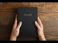

# Some surprising facts about the Bible - part 2 (2021-01-16 19:48:52+00:00)

## Description

There are many different Bibles. I don’t mean different translations but different Bibles with different contents, different books. 
What exactly is the Bible?
It is important to understand that the Bible is a *library of books* written over a period of a 1000 years or more by mostly unknown authors. Today, Christians still disagree about which books should be in the Bible. This results in Christians believing different doctrines...

## Summary of [Some surprising facts about the Bible - part 2](https://www.youtube.com/watch?v=U1SiSCwpcVQ)

*This is an AI generated summary. There may be inaccuracies. *

### [00:00:00](https://www.youtube.com/watch?v=U1SiSCwpcVQ&t=0) - [00:05:00](https://www.youtube.com/watch?v=U1SiSCwpcVQ&t=300)

The author discusses some surprising facts about the Bible, including the fact that there are many different canons of the Bible and that Muhammad Assad believes that the Quran should be used to confirm the truth of what remains in earlier scriptures. The author finishes the video by saying that he hopes this information was of interest.

**[00:00:00](https://www.youtube.com/watch?v=U1SiSCwpcVQ&t=0)** The Bible is a library of books written over a period of a thousand years or more, by mostly unknown authors. Today, Christians still disagree about which books should be in the Bible. There are many different canons of the Bible, a biblical canon or a canon of scripture is simply a set of books which a particular jewish or christian religious community regards as authoritative scripture. The English word canon comes from the greek word canon meaning rule or measuring stick. Roman catholics think their bible should contain 73 books including the book of tobit the book of job the book of judith, i should say the first book of maccabees, the second book of maccabees, the book of wisdom, otherwise known as the wisdom of solomon and the book of sirach which is also called ecclesiasticus. Protestant Christians think the bible contains just 66 books and none of the books I've just mentioned are part of their bible. Then there are orthodox christians you get the russian orthodox church, the greek orthodox church, and so on they say the bible contains 78 books in addition to one and two maccabees in the catholic version they have three and four maccabees. However, the ethiopian orthodox
* **[00:05:00](https://www.youtube.com/watch?v=U1SiSCwpcVQ&t=300)** The author discusses some surprising facts about the Bible, including the fact that Muhammad Assad, the author's note-taker, believes that the quran should be used to confirm the truth of what remains in earlier scriptures. The author finishes the video by saying that he hopes this information was of interest.

## Full transcript with timestamps

[0:00:02](https://youtu.be/U1SiSCwpcVQ?t=2) there are many different bibles i don't mean 
different translations but different bibles    
[0:00:09](https://youtu.be/U1SiSCwpcVQ?t=9) with different contents different 
books what exactly is the bible    
[0:00:16](https://youtu.be/U1SiSCwpcVQ?t=16) well the bible is a library of books it's 
important to understand that the the bible    
[0:00:23](https://youtu.be/U1SiSCwpcVQ?t=23) is a library of books written over a period of a 
thousand years or more by mostly unknown authors    
[0:00:31](https://youtu.be/U1SiSCwpcVQ?t=31) today christians still disagree about which 
books should be in the bible now there are many    
[0:00:38](https://youtu.be/U1SiSCwpcVQ?t=38) different canons of the bible a biblical canon 
or a canon of scripture is simply a set of books    
[0:00:45](https://youtu.be/U1SiSCwpcVQ?t=45) which a particular jewish or christian religious 
community regards as authoritative scripture and    
[0:00:53](https://youtu.be/U1SiSCwpcVQ?t=53) the english word canon comes from the greek 
word canon meaning rule or measuring stick    
[0:01:01](https://youtu.be/U1SiSCwpcVQ?t=61) roman catholics think their bible should contain 
73 books including the book of tobit the book of    
[0:01:08](https://youtu.be/U1SiSCwpcVQ?t=68) job the book of judith i should say the first 
book of maccabees the second book of maccabees    
[0:01:15](https://youtu.be/U1SiSCwpcVQ?t=75) the book of wisdom otherwise known as the wisdom 
of solomon and the book of sirach which is also    
[0:01:21](https://youtu.be/U1SiSCwpcVQ?t=81) called ecclesiasticus protestant christians think 
the bible contains just 66 books and none of the    
[0:01:29](https://youtu.be/U1SiSCwpcVQ?t=89) books i've just mentioned are part of their bible 
then there are orthodox christians you get the    
[0:01:36](https://youtu.be/U1SiSCwpcVQ?t=96) russian orthodox church the greek orthodox church 
and so on they say the bible contains 78 books in    
[0:01:44](https://youtu.be/U1SiSCwpcVQ?t=104) addition to one and two maccabees in the catholic 
version they have three and four maccabees    
[0:01:50](https://youtu.be/U1SiSCwpcVQ?t=110) however the ethiopian orthodox church believes the 
bible contains 81 books the highest figure of all    
[0:01:59](https://youtu.be/U1SiSCwpcVQ?t=119) and the ethiopian broader new testament canon 
has eight additional books in addition to the one    
[0:02:06](https://youtu.be/U1SiSCwpcVQ?t=126) the canon we normally uh aware of it has the four 
books of cynodos the two divisions of the book of    
[0:02:13](https://youtu.be/U1SiSCwpcVQ?t=133) the covenant the ethiopic clement and the ethiopic 
didascalia this is what they're called if you    
[0:02:21](https://youtu.be/U1SiSCwpcVQ?t=141) google uh the ethiopian new testament canon 
you'll see all these books detailed and discussed    
[0:02:28](https://youtu.be/U1SiSCwpcVQ?t=148) now if we go back in time 
uh to the codex sinaiticus    
[0:02:33](https://youtu.be/U1SiSCwpcVQ?t=153) this is the oldest complete bible in the world 
and it's uh in the british library uh just    
[0:02:39](https://youtu.be/U1SiSCwpcVQ?t=159) a couple of miles from where i'm sitting 
and it's a fourth century christian bible    
[0:02:45](https://youtu.be/U1SiSCwpcVQ?t=165) and the canon there reflects probably most closely 
the roman catholic canon but in the new testament    
[0:02:53](https://youtu.be/U1SiSCwpcVQ?t=173) we find the epistle of barnabas and 
portions of the shepherd of hermas    
[0:02:59](https://youtu.be/U1SiSCwpcVQ?t=179) so these are two texts that no one today thinks 
is the word of god but uh in the fourth century    
[0:03:05](https://youtu.be/U1SiSCwpcVQ?t=185) uh they were accepted as the word of god so 
it's not just a different but it's not just    
[0:03:11](https://youtu.be/U1SiSCwpcVQ?t=191) a different bible we have today different bibles 
teach different christian doctrines for example    
[0:03:18](https://youtu.be/U1SiSCwpcVQ?t=198) the question whether it's permissible to seek the 
intercession of the living for the dead and the    
[0:03:24](https://youtu.be/U1SiSCwpcVQ?t=204) existence of purgatory there's an old testament 
book called two maccabees this is accepted by the    
[0:03:30](https://youtu.be/U1SiSCwpcVQ?t=210) catholic church and the orthodox churches but not 
by the evangelical churches and if you look at 2    
[0:03:36](https://youtu.be/U1SiSCwpcVQ?t=216) maccabees chapter 12 verse 43 onwards this speaks 
explicitly about the prayer of the living for    
[0:03:45](https://youtu.be/U1SiSCwpcVQ?t=225) the dead and it's where the roman catholics also 
get the doctrine of the purgat of purgatory from    
[0:03:52](https://youtu.be/U1SiSCwpcVQ?t=232) as i say this book is in the roman catholic and 
the orthodox bible but is rejected by protestants    
[0:03:57](https://youtu.be/U1SiSCwpcVQ?t=237) and all evangelicals so when a christian 
tells you you must believe in the bible    
[0:04:05](https://youtu.be/U1SiSCwpcVQ?t=245) you must always ask them which one there 
are so many they teach different things    
[0:04:13](https://youtu.be/U1SiSCwpcVQ?t=253) given there is so much confusion amongst the 
people of the book about their scriptures and what    
[0:04:20](https://youtu.be/U1SiSCwpcVQ?t=260) they actually teach what does the quran 
say in response to this well according to    
[0:04:28](https://youtu.be/U1SiSCwpcVQ?t=268) muhammad assad's message of the quran 
translated and explained by muhammad assad    
[0:04:33](https://youtu.be/U1SiSCwpcVQ?t=273) in verse 48 of surah number 5 it says and unto 
thee o prophet we have vouchsafed this divine    
[0:04:42](https://youtu.be/U1SiSCwpcVQ?t=282) writ setting forth the truth confirming 
the truth of whatever there still remains    
[0:04:48](https://youtu.be/U1SiSCwpcVQ?t=288) of earlier revelations and determining what is 
true therein judged then between the followers    
[0:04:56](https://youtu.be/U1SiSCwpcVQ?t=296) of earlier revelation in accordance with what 
god has bestowed from on high and do not follow    
[0:05:03](https://youtu.be/U1SiSCwpcVQ?t=303) their errant views forsaking the truth that has 
come unto thee so this passage seems to clearly    
[0:05:11](https://youtu.be/U1SiSCwpcVQ?t=311) imply that the quran as a criterion as a quality 
control is to be used to discern what is true and    
[0:05:19](https://youtu.be/U1SiSCwpcVQ?t=319) what is false in the scriptures of the people of 
the book and to confirm the truth of what remains    
[0:05:27](https://youtu.be/U1SiSCwpcVQ?t=327) in those earlier revelations clearly implying 
corruption and change and alteration of the    
[0:05:33](https://youtu.be/U1SiSCwpcVQ?t=333) original scriptures given to moses and given to 
jesus and so on so the quran is as a footnote here    
[0:05:40](https://youtu.be/U1SiSCwpcVQ?t=340) is is described as the determinant factor in 
deciding what is genuine and what is false in the    
[0:05:47](https://youtu.be/U1SiSCwpcVQ?t=347) earlier scriptures that's muhammad assad's note 
so i hope that was of interest until next time  
