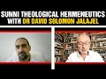

# Sunni Theological Hermeneutics with Dr David Solomon Jalajel (2022-01-17 22:17:03+00:00)

## Description

Dr David Solomon Jalajel is a researcher with the Prince Sultan Research Institute at King Saud University, in Saudi Arabia. He holds a PhD in Arabic and Islamic Studies from the University of the Western Cape. Formerly, he was a lecturer in Islamic theology and legal theory at the Dar al-Uloom in Cape Town, South Africa, where he graduated and then received the higher specialisation in Islamic Law and the higher specialisation in Arabic.

In this video David speaks about Sunni Theological Hermeneutics. That is, he discusses the methodology that Muslim scholars in the classical Sunni tradition have used to interpret scripture for establishing matters of binding religious doctrine or Aqidah.

You Can Support My Work on Patreon:
https://www.patreon.com/Bloggingtheology

My Paypal Link: 
https://www.paypal.com/paypalme/bloggingtheology?locale.x=en_GB

## Summary of [Sunni Theological Hermeneutics with Dr David Solomon Jalajel](https://www.youtube.com/watch?v=MPezdzuEqgo)

*This is an AI generated summary. There may be inaccuracies. *

### [00:00:00](https://www.youtube.com/watch?v=MPezdzuEqgo&t=0) - [01:00:00](https://www.youtube.com/watch?v=MPezdzuEqgo&t=3600)

Sunni theological hermeneutics focuses on understanding possible meanings of the Quran. Dr. David Solomon Jalajel discusses the importance of being cautious and humble when approaching theological questions, and the usefulness of the concept of "suspension of judgment" in making decisions about religious matters.

**[00:00:00](https://www.youtube.com/watch?v=MPezdzuEqgo&t=0)** The speaker discusses Sunni theological hermeneutics, emphasizing the importance of verses from the Quran that deal with the relationship between God and creation. He goes on to discuss other questions related to the nature and attributes of God.
* **[00:05:00](https://www.youtube.com/watch?v=MPezdzuEqgo&t=300)** Sunni theologians hold that what is known only by way of revelation (scripture) can be known with certainty, negating the ability of reason to dictate what has to be the case in the world. Abu Hamid al-Ghazali and Evantamia say that what is known only by way of revelation (scripture) is what is actualized in the real world, while Lazada discusses specific examples of what is only known by way of scripture (such as the resurrection). Finally, a later Ashrae theologian says that what is unseen, or what is not indicated by evidence, is knowledge only God knows.
* **[00:10:00](https://www.youtube.com/watch?v=MPezdzuEqgo&t=600)** Sunni theologians believe that only scripture can provide information about God's actions in the past and the future. They also believe that angels and jinn are possible to be seen and that god can be seen in the hereafter.
* **[00:15:00](https://www.youtube.com/watch?v=MPezdzuEqgo&t=900)** Sunni theological hermeneutics considers only authenticated texts to establish matters of belief, and all three schools oblige that meaning be the default assumption. Differences of opinion exist about which texts are firmly authenticated and which are not, and about what qualifies as a clear law.
* **[00:20:00](https://www.youtube.com/watch?v=MPezdzuEqgo&t=1200)** Sunni theology holds that texts are on their apparent meanings and that these meanings cannot be removed by definitive copy evidence. Scripture explicitly forbids speculating about matters of theology which are not explicitly taught. This principle of theological non-commitment is accepted by all religions.
* **[00:25:00](https://www.youtube.com/watch?v=MPezdzuEqgo&t=1500)** Sunni theological hermeneutics holds that certain actions and statements about God are forbidden, and that knowledge of such matters is only accessible to God. This principle is based in the Quran and the Sunnah of the Prophet Muhammad.
* **[00:30:00](https://www.youtube.com/watch?v=MPezdzuEqgo&t=1800)** Sunni theologian Dr. David Solomon Jalajel discusses the concept of theological non-commitment, or the idea that faith is not sound unless successful knowledge is embraced in the pursuit of the inaccessible. Jalajel provides commentary on a Tahawi's creed, which all three Sunni traditions agree upon.
* **[00:35:00](https://www.youtube.com/watch?v=MPezdzuEqgo&t=2100)** Sunni theologians agree that knowledge of the unseen is impossible and unbelief, and that claiming such knowledge is a form of polytheism. Ibn Abraham, a famous contemporary commentator, says that inaccessible knowledge is the knowledge of God's decree which God has kept from his creatures and forbidden them from seeking. Tawakov and exegesis, a unique form of Sunni theology, is where you take the Quran and make commentary on it, looking at what the different companions and successors said and what the grammar and syntax of the text allow.
* **[00:40:00](https://www.youtube.com/watch?v=MPezdzuEqgo&t=2400)** Dr. David Solomon Jalajel discusses Sunni theological hermeneutics, which focuses on understanding possible meanings of the Quran, and how this can be used to interpret scripture. He also discusses the principle of tafseer, which is the act of interpreting scripture. Jalajel stresses the importance of sound evidence when interpreting scripture, and how a lack of such evidence can lead to a lack of understanding and theological non-commitment.
* **[00:45:00](https://www.youtube.com/watch?v=MPezdzuEqgo&t=2700)** Sunni theological Hermeneutics focuses on the nature and how to understand certain aspects of scriptures, such as the angels having wings and God's transcendence. There is disagreement among Sunni theologians on how often to apply this concept of deferment, but all agree that it exists. One difference between Sunni theology and other theological schools is that Sunni theology focuses on the attributes of a topic, while other schools focus on the topic itself.
* **[00:50:00](https://www.youtube.com/watch?v=MPezdzuEqgo&t=3000)** Sunni theology is different from Islamic law, which relies on a suspension of judgment in cases of uncertainty. The hermeneutics of law involves navigating uncertainty, weighing evidence, and making decisions in the face of uncertainty.
* **[00:55:00](https://www.youtube.com/watch?v=MPezdzuEqgo&t=3300)**  Dr. David Solomon Jalajel discusses Sunni theological hermeneutics, discussing how one should approach theological questions with caution and humility, and the importance of experts in these fields. He also touches on the concept of "suspension of judgment," discussing how it is often used in Islamic traditions and how it can be beneficial to Muslims.
### [01:00:00](https://www.youtube.com/watch?v=MPezdzuEqgo&t=3600) - [01:55:00](https://www.youtube.com/watch?v=MPezdzuEqgo&t=6900)

Sunni theological hermeneutics is a detailed and systematic approach to interpreting the Quran and Sunnah.  Dr. David Solomon Jalajel discusses the different ways in which reason does not help when it comes to understanding Scripture, and how focusing on what is mentioned in the text is a better approach. He also provides several examples from the Prophet Muhammad to illustrate his point.

**[01:00:00](https://www.youtube.com/watch?v=MPezdzuEqgo&t=3600)** Sunni theologians discuss whether Prophet Muhammad saw God during his Ascension to Heaven. Some argue that it did occur, while others argue that it didn't. There is no definitive evidence either way.
* **[01:05:00](https://www.youtube.com/watch?v=MPezdzuEqgo&t=3900)** Abu Hanifa takes a non-committal stance on whether the jinn will be rewarded in the hereafter, with knowledge on the matter being reserved for God alone. A later maturity scholar says that unless god tells us about the jinn's rational status, we don't know.
* **[01:10:00](https://www.youtube.com/watch?v=MPezdzuEqgo&t=4200)** Sunni theological scholar, Dr. David Solomon Jalajel, discusses the different possible interpretations of the Qur'an's mentions of Hell and Paradise. He argues that while the jinn are certain to receive paradise, the human's reward is to benefit from their garden and take shade under trees in the hereafter. He goes on to say that Persian is not a language of Hell, and that there is evidence that the companions never argued about the recompense of animals for their suffering in life.
* **[01:15:00](https://www.youtube.com/watch?v=MPezdzuEqgo&t=4500)** Sunni theologian Dr. David Solomon Jalajel discusses the various ways in which reason does not help when it comes to understanding Scripture. He suggests that instead of relying on reason, one should focus on what is mentioned in the text. Jalajel provides several examples from the Prophet Muhammad to illustrate his point.
* **[01:20:00](https://www.youtube.com/watch?v=MPezdzuEqgo&t=4800)** Sunni theological hermeneutics focuses on determining what scripture is not saying, usually in order to avoid committing a minor sin. This video explains the concept of scriptural restraint, or the strategy of determining what scripture is not saying in order to avoid asserting a position on a matter without evidence from the Quran or hadith.
* **[01:25:00](https://www.youtube.com/watch?v=MPezdzuEqgo&t=5100)** Arabic scholar Dr. David Solomon Jalajel discusses how certain assumptions must be made in order to understand Quranic verses. He provides an example from the Quran of a verse in which God addresses Satan. If one assumes that Satan was not an angel, then the verse must be negated. If one assumes that Satan was an angel, then the verse must be affirmed. If one lies about the Qur'an, they become an unbeliever.
* **[01:30:00](https://www.youtube.com/watch?v=MPezdzuEqgo&t=5400)** Sunnis believe that angels can disobey God, and that this is not mentioned in the Quran or Sunnah.

The Sunni theological hermeneutics video discusses how interpretation of verses in the Quran and Sunnah can be ambiguous and subjective. Dr. David Solomon Jalajel discusses how the assumption that angels cannot disobey God is highly uncertain, and that there are several verses in the Quran and Sunnah which praise angels for obeying God.
* **[01:35:00](https://www.youtube.com/watch?v=MPezdzuEqgo&t=5700)** Sunni theological hermeneutics is explained in detail, with particular focus on the verse "Do not speak until I have spoken; and do not act on your own authority, but obey everything I command." Solomon Jalajel argues that, based on this verse, angels cannot disobey God, and therefore no praise of them is warranted. He also provides a linguistic argument demonstrating that an exception can be made for someone who does not share the attributes of a larger group. Finally, Solomon Jalajel argues that the mention of Satan in the Quran only serves to remind us that we do not need to know his full backstory in order to understand his role in the Fall.
* **[01:40:00](https://www.youtube.com/watch?v=MPezdzuEqgo&t=6000)** Sunni theologian Dr. David Solomon Jalajel discusses the differences between Sunni and Shia theology, and how these differences can impact one's understanding of Quranic verses. He also discusses the similarities between Sunni and Shia theology in terms of their respective positions on free will and the universe's beginning.
* **[01:45:00](https://www.youtube.com/watch?v=MPezdzuEqgo&t=6300)** Sunni theologian Dr. David Solomon Jalajel discusses how certain verses in the Quran support the idea that the universe has a beginning, and that this beginning was created by God. Solomon also discusses how this idea conflicts with the idea that God is eternal, and that there are competing interpretations of these verses among Sunni Muslims. Solomon argues that these verses should not be used to argue that the universe has a beginning, as this is an assumption that is highly uncertain.
* **[01:50:00](https://www.youtube.com/watch?v=MPezdzuEqgo&t=6600)** David Solomon Jalajel explains that the world needs God because it has a finite past and because that which is dependent on its own existence requires someone to give it that existence. He also points out that the verse "be and it is" does not necessarily mean that the universe had a first moment in time.
* **[01:55:00](https://www.youtube.com/watch?v=MPezdzuEqgo&t=6900)** Sunni theological hermeneutics is a rigorous and philosophical approach to understanding the Quran. It is essential for dealing with contemporary issues, such as biological science, artificial intelligence, and extraterrestrial life, which are throwing questions at Muslims that they have never anticipated before.

David Solomon Jalajel outlined the principles of Sunni theological hermeneutics, which have relevance to the questions Muslims are facing today. He also provided his email address so that viewers could ask him questions about Sunni theology.

## Full transcript with timestamps

[0:00:01](https://youtu.be/MPezdzuEqgo?t=1) hello everyone and uh welcome to  
[0:00:03](https://youtu.be/MPezdzuEqgo?t=3) blogging theology today i am delighted  
[0:00:07](https://youtu.be/MPezdzuEqgo?t=7) to talk to a doctor david solomon  
[0:00:10](https://youtu.be/MPezdzuEqgo?t=10) jalagel good afternoon and you are most  
[0:00:12](https://youtu.be/MPezdzuEqgo?t=12) welcome sir  
[0:00:14](https://youtu.be/MPezdzuEqgo?t=14) it's my pleasure to be here with you  
[0:00:16](https://youtu.be/MPezdzuEqgo?t=16) dr david uh solomon jalagel is a  
[0:00:19](https://youtu.be/MPezdzuEqgo?t=19) researcher with the prince sultan  
[0:00:21](https://youtu.be/MPezdzuEqgo?t=21) research institute at king saud  
[0:00:24](https://youtu.be/MPezdzuEqgo?t=24) university in saudi arabia he holds a  
[0:00:27](https://youtu.be/MPezdzuEqgo?t=27) phd in arabic and islamic studies from  
[0:00:29](https://youtu.be/MPezdzuEqgo?t=29) the university of the western cape  
[0:00:33](https://youtu.be/MPezdzuEqgo?t=33) formally he was a lecturer in islamic  
[0:00:35](https://youtu.be/MPezdzuEqgo?t=35) theology and legal theory at the daraa  
[0:00:38](https://youtu.be/MPezdzuEqgo?t=38) loom in cape town south africa where he  
[0:00:41](https://youtu.be/MPezdzuEqgo?t=41) graduated and then received the higher  
[0:00:44](https://youtu.be/MPezdzuEqgo?t=44) specialization in islamic law and the  
[0:00:47](https://youtu.be/MPezdzuEqgo?t=47) higher specialization in arabic  
[0:00:51](https://youtu.be/MPezdzuEqgo?t=51) david will be speaking today about sunni  
[0:00:54](https://youtu.be/MPezdzuEqgo?t=54) theological hermeneutics that is he is  
[0:00:58](https://youtu.be/MPezdzuEqgo?t=58) going to discuss the methodology that  
[0:01:00](https://youtu.be/MPezdzuEqgo?t=60) muslim scholars in the classical sunni  
[0:01:02](https://youtu.be/MPezdzuEqgo?t=62) tradition have used to interpret  
[0:01:05](https://youtu.be/MPezdzuEqgo?t=65) scripture for establishing matters of  
[0:01:08](https://youtu.be/MPezdzuEqgo?t=68) binding religious doctrine or akida as  
[0:01:12](https://youtu.be/MPezdzuEqgo?t=72) it's known in arabic  
[0:01:14](https://youtu.be/MPezdzuEqgo?t=74) so would you like to introduce us to  
[0:01:17](https://youtu.be/MPezdzuEqgo?t=77) this subject david  
[0:01:19](https://youtu.be/MPezdzuEqgo?t=79) thank you very much paul  
[0:01:20](https://youtu.be/MPezdzuEqgo?t=80) yes i would  
[0:01:29](https://youtu.be/MPezdzuEqgo?t=89) theological hermeneutics and of course  
[0:01:31](https://youtu.be/MPezdzuEqgo?t=91) what i mean by hermeneutics is how we  
[0:01:32](https://youtu.be/MPezdzuEqgo?t=92) derive meaning from text for a reason  
[0:01:35](https://youtu.be/MPezdzuEqgo?t=95) either for law or for belief it is  
[0:01:38](https://youtu.be/MPezdzuEqgo?t=98) usually used in religious or legal  
[0:01:39](https://youtu.be/MPezdzuEqgo?t=99) contexts  
[0:01:41](https://youtu.be/MPezdzuEqgo?t=101) my subtitle you see is theological  
[0:01:44](https://youtu.be/MPezdzuEqgo?t=104) non-commitment and interpretive  
[0:01:46](https://youtu.be/MPezdzuEqgo?t=106) restraint  
[0:01:47](https://youtu.be/MPezdzuEqgo?t=107) these are two topics that i'm going to  
[0:01:49](https://youtu.be/MPezdzuEqgo?t=109) particularly focus on though of course  
[0:01:51](https://youtu.be/MPezdzuEqgo?t=111) theological hermeneutics is broader and  
[0:01:53](https://youtu.be/MPezdzuEqgo?t=113) we'll cover more than that but these are  
[0:01:55](https://youtu.be/MPezdzuEqgo?t=115) two topics that i will particularly  
[0:01:57](https://youtu.be/MPezdzuEqgo?t=117) focus on  
[0:01:58](https://youtu.be/MPezdzuEqgo?t=118) as we explore this uh field  
[0:02:03](https://youtu.be/MPezdzuEqgo?t=123) to begin with we need to talk about the  
[0:02:05](https://youtu.be/MPezdzuEqgo?t=125) topic of theology what is theology and  
[0:02:08](https://youtu.be/MPezdzuEqgo?t=128) and what is its background in a sunni  
[0:02:10](https://youtu.be/MPezdzuEqgo?t=130) perspective  
[0:02:12](https://youtu.be/MPezdzuEqgo?t=132) well as far as the background is  
[0:02:13](https://youtu.be/MPezdzuEqgo?t=133) concerned  
[0:02:14](https://youtu.be/MPezdzuEqgo?t=134) uh the sunni theological tradition has  
[0:02:17](https://youtu.be/MPezdzuEqgo?t=137) what you could say are three  
[0:02:18](https://youtu.be/MPezdzuEqgo?t=138) sub-traditions within it  
[0:02:20](https://youtu.be/MPezdzuEqgo?t=140) and those are ash arizona maturitism and  
[0:02:22](https://youtu.be/MPezdzuEqgo?t=142) salafism  
[0:02:24](https://youtu.be/MPezdzuEqgo?t=144) and each of those traditions have  
[0:02:26](https://youtu.be/MPezdzuEqgo?t=146) illustrious scholars who are famous like  
[0:02:28](https://youtu.be/MPezdzuEqgo?t=148) imam haram juwani  
[0:02:30](https://youtu.be/MPezdzuEqgo?t=150) al-ghazali and  
[0:02:31](https://youtu.be/MPezdzuEqgo?t=151) for the asha  
[0:02:33](https://youtu.be/MPezdzuEqgo?t=153) and for the materials and neces  
[0:02:42](https://youtu.be/MPezdzuEqgo?t=162) are the three most prominent theologians  
[0:02:45](https://youtu.be/MPezdzuEqgo?t=165) and these schools are all sunni schools  
[0:02:47](https://youtu.be/MPezdzuEqgo?t=167) they share much more in common in the  
[0:02:49](https://youtu.be/MPezdzuEqgo?t=169) matters in which they disagree  
[0:02:51](https://youtu.be/MPezdzuEqgo?t=171) but they disagree sometimes very sharply  
[0:02:53](https://youtu.be/MPezdzuEqgo?t=173) on certain issues  
[0:02:55](https://youtu.be/MPezdzuEqgo?t=175) and um  
[0:02:56](https://youtu.be/MPezdzuEqgo?t=176) and it can cause sometimes friction  
[0:02:58](https://youtu.be/MPezdzuEqgo?t=178) between them but broadly they all  
[0:03:00](https://youtu.be/MPezdzuEqgo?t=180) self-identify sunni muslims  
[0:03:02](https://youtu.be/MPezdzuEqgo?t=182) and they share a lot in common on that  
[0:03:04](https://youtu.be/MPezdzuEqgo?t=184) basis  
[0:03:07](https://youtu.be/MPezdzuEqgo?t=187) so theology we can look at different  
[0:03:09](https://youtu.be/MPezdzuEqgo?t=189) kinds of questions we have god's  
[0:03:10](https://youtu.be/MPezdzuEqgo?t=190) existence and god's attributes which are  
[0:03:12](https://youtu.be/MPezdzuEqgo?t=192) generally referred to as  
[0:03:14](https://youtu.be/MPezdzuEqgo?t=194) yet or study of god  
[0:03:17](https://youtu.be/MPezdzuEqgo?t=197) and this is  
[0:03:18](https://youtu.be/MPezdzuEqgo?t=198) different schools approach it  
[0:03:19](https://youtu.be/MPezdzuEqgo?t=199) differently some are approach it more  
[0:03:21](https://youtu.be/MPezdzuEqgo?t=201) scripturally some approach it more uh  
[0:03:24](https://youtu.be/MPezdzuEqgo?t=204) rationally  
[0:03:25](https://youtu.be/MPezdzuEqgo?t=205) but this is how you attribute who is  
[0:03:27](https://youtu.be/MPezdzuEqgo?t=207) gone what are his attributes what is his  
[0:03:29](https://youtu.be/MPezdzuEqgo?t=209) nature  
[0:03:31](https://youtu.be/MPezdzuEqgo?t=211) other kind of questions relate to what  
[0:03:33](https://youtu.be/MPezdzuEqgo?t=213) god did do and what he did not do  
[0:03:36](https://youtu.be/MPezdzuEqgo?t=216) and these are strictly scriptural as we  
[0:03:38](https://youtu.be/MPezdzuEqgo?t=218) shall see  
[0:03:42](https://youtu.be/MPezdzuEqgo?t=222) first of all we're dealing with god and  
[0:03:44](https://youtu.be/MPezdzuEqgo?t=224) his relationship to creation and his  
[0:03:46](https://youtu.be/MPezdzuEqgo?t=226) nature and his attributes  
[0:03:47](https://youtu.be/MPezdzuEqgo?t=227) this verse is of extreme importance to  
[0:03:49](https://youtu.be/MPezdzuEqgo?t=229) all  
[0:03:50](https://youtu.be/MPezdzuEqgo?t=230) sunni muslims  
[0:03:52](https://youtu.be/MPezdzuEqgo?t=232) god is the creator of all things and he  
[0:03:54](https://youtu.be/MPezdzuEqgo?t=234) is maintaining all things  
[0:03:58](https://youtu.be/MPezdzuEqgo?t=238) this verse expresses relationship  
[0:04:00](https://youtu.be/MPezdzuEqgo?t=240) between god and his creation  
[0:04:02](https://youtu.be/MPezdzuEqgo?t=242) nothing is exempted from this ruling of  
[0:04:04](https://youtu.be/MPezdzuEqgo?t=244) this verse besides god himself  
[0:04:06](https://youtu.be/MPezdzuEqgo?t=246) and that is understood by  
[0:04:08](https://youtu.be/MPezdzuEqgo?t=248) the straightforward understanding of  
[0:04:10](https://youtu.be/MPezdzuEqgo?t=250) language if if you and i enter a room  
[0:04:12](https://youtu.be/MPezdzuEqgo?t=252) together and i say i own everything in  
[0:04:14](https://youtu.be/MPezdzuEqgo?t=254) this room it's implicitly understood  
[0:04:16](https://youtu.be/MPezdzuEqgo?t=256) that i do not own you  
[0:04:18](https://youtu.be/MPezdzuEqgo?t=258) we just walk in the room and that and so  
[0:04:20](https://youtu.be/MPezdzuEqgo?t=260) that is understood by language when god  
[0:04:22](https://youtu.be/MPezdzuEqgo?t=262) says he's a creator of all things it it  
[0:04:24](https://youtu.be/MPezdzuEqgo?t=264) doesn't mean he creates themselves you  
[0:04:25](https://youtu.be/MPezdzuEqgo?t=265) don't even have to invoke reason for  
[0:04:26](https://youtu.be/MPezdzuEqgo?t=266) this  
[0:04:27](https://youtu.be/MPezdzuEqgo?t=267) the language itself is enough for that  
[0:04:28](https://youtu.be/MPezdzuEqgo?t=268) and normal usage of course reason would  
[0:04:31](https://youtu.be/MPezdzuEqgo?t=271) also dictate that god did not create  
[0:04:32](https://youtu.be/MPezdzuEqgo?t=272) himself  
[0:04:35](https://youtu.be/MPezdzuEqgo?t=275) so basically it's there's no exceptions  
[0:04:37](https://youtu.be/MPezdzuEqgo?t=277) that would be allowed in the language  
[0:04:39](https://youtu.be/MPezdzuEqgo?t=279) everything besides god is his creation  
[0:04:43](https://youtu.be/MPezdzuEqgo?t=283) another verse of extreme importance  
[0:04:46](https://youtu.be/MPezdzuEqgo?t=286) is god creates what he pleases  
[0:04:48](https://youtu.be/MPezdzuEqgo?t=288) indeed god is capable of all things  
[0:04:51](https://youtu.be/MPezdzuEqgo?t=291) in the previous verse  
[0:04:53](https://youtu.be/MPezdzuEqgo?t=293) we saw the relationship between god and  
[0:04:55](https://youtu.be/MPezdzuEqgo?t=295) created things  
[0:04:57](https://youtu.be/MPezdzuEqgo?t=297) this verse addresses the nature of god's  
[0:04:59](https://youtu.be/MPezdzuEqgo?t=299) creative act itself  
[0:05:00](https://youtu.be/MPezdzuEqgo?t=300) the creative act has two aspects as you  
[0:05:02](https://youtu.be/MPezdzuEqgo?t=302) can see god's will and god's power  
[0:05:07](https://youtu.be/MPezdzuEqgo?t=307) so  
[0:05:08](https://youtu.be/MPezdzuEqgo?t=308) this  
[0:05:09](https://youtu.be/MPezdzuEqgo?t=309) so it's also a sense also that he is not  
[0:05:11](https://youtu.be/MPezdzuEqgo?t=311) compelled that he creates what he  
[0:05:13](https://youtu.be/MPezdzuEqgo?t=313) pleases so  
[0:05:14](https://youtu.be/MPezdzuEqgo?t=314) he has he has free will yeah he's not  
[0:05:17](https://youtu.be/MPezdzuEqgo?t=317) under uh under obligation he he is he  
[0:05:19](https://youtu.be/MPezdzuEqgo?t=319) has sovereignty and will supremely so  
[0:05:22](https://youtu.be/MPezdzuEqgo?t=322) just to clarify that yeah yes and that  
[0:05:24](https://youtu.be/MPezdzuEqgo?t=324) is very strong in the sunni uh  
[0:05:26](https://youtu.be/MPezdzuEqgo?t=326) perspective the god has free will  
[0:05:28](https://youtu.be/MPezdzuEqgo?t=328) and everything  
[0:05:30](https://youtu.be/MPezdzuEqgo?t=330) that takes place in the universe is  
[0:05:31](https://youtu.be/MPezdzuEqgo?t=331) under his power without exception  
[0:05:34](https://youtu.be/MPezdzuEqgo?t=334) and that  
[0:05:35](https://youtu.be/MPezdzuEqgo?t=335) that actually negates the ability of  
[0:05:37](https://youtu.be/MPezdzuEqgo?t=337) reason as we shall see  
[0:05:39](https://youtu.be/MPezdzuEqgo?t=339) to dictate what has to be the case in  
[0:05:42](https://youtu.be/MPezdzuEqgo?t=342) the world  
[0:05:43](https://youtu.be/MPezdzuEqgo?t=343) or what we would see in the world around  
[0:05:45](https://youtu.be/MPezdzuEqgo?t=345) us because if god if reason and  
[0:05:47](https://youtu.be/MPezdzuEqgo?t=347) revelation both attest that god is  
[0:05:49](https://youtu.be/MPezdzuEqgo?t=349) capable of all things then which things  
[0:05:51](https://youtu.be/MPezdzuEqgo?t=351) god actually did  
[0:05:54](https://youtu.be/MPezdzuEqgo?t=354) how we're going to know about those  
[0:05:55](https://youtu.be/MPezdzuEqgo?t=355) things if we can see them we see them  
[0:05:56](https://youtu.be/MPezdzuEqgo?t=356) but if we can't see them we have to rely  
[0:05:58](https://youtu.be/MPezdzuEqgo?t=358) on scripture  
[0:06:00](https://youtu.be/MPezdzuEqgo?t=360) and this is what we are moving to now  
[0:06:02](https://youtu.be/MPezdzuEqgo?t=362) what can be known only through scripture  
[0:06:04](https://youtu.be/MPezdzuEqgo?t=364) the first person i will look at is an  
[0:06:06](https://youtu.be/MPezdzuEqgo?t=366) ashrae theologian the same most famous  
[0:06:08](https://youtu.be/MPezdzuEqgo?t=368) one abu hamid al-ghazali  
[0:06:11](https://youtu.be/MPezdzuEqgo?t=371) he says  
[0:06:13](https://youtu.be/MPezdzuEqgo?t=373) what is known only by way of textual  
[0:06:15](https://youtu.be/MPezdzuEqgo?t=375) evidence what they call an arabic  
[0:06:17](https://youtu.be/MPezdzuEqgo?t=377) sentence means something you hear  
[0:06:18](https://youtu.be/MPezdzuEqgo?t=378) literally textual evidence  
[0:06:21](https://youtu.be/MPezdzuEqgo?t=381) is where one of the rational  
[0:06:22](https://youtu.be/MPezdzuEqgo?t=382) possibilities is actualized by god  
[0:06:26](https://youtu.be/MPezdzuEqgo?t=386) since it is all permitted by reason  
[0:06:29](https://youtu.be/MPezdzuEqgo?t=389) these things are only known by way of  
[0:06:31](https://youtu.be/MPezdzuEqgo?t=391) revelation and inspiration  
[0:06:33](https://youtu.be/MPezdzuEqgo?t=393) and we know about them from the  
[0:06:35](https://youtu.be/MPezdzuEqgo?t=395) revelation that reaches us  
[0:06:37](https://youtu.be/MPezdzuEqgo?t=397) like the resurrection the gathering of  
[0:06:38](https://youtu.be/MPezdzuEqgo?t=398) souls reward and punishment and the life  
[0:06:42](https://youtu.be/MPezdzuEqgo?t=402) so  
[0:06:42](https://youtu.be/MPezdzuEqgo?t=402) you see that everything is possible  
[0:06:44](https://youtu.be/MPezdzuEqgo?t=404) every reason would dictate that unicorns  
[0:06:47](https://youtu.be/MPezdzuEqgo?t=407) and mars are possible and a moon made of  
[0:06:49](https://youtu.be/MPezdzuEqgo?t=409) jello is possible everything  
[0:06:51](https://youtu.be/MPezdzuEqgo?t=411) reason doesn't negate that god could do  
[0:06:53](https://youtu.be/MPezdzuEqgo?t=413) those things  
[0:06:54](https://youtu.be/MPezdzuEqgo?t=414) so  
[0:06:55](https://youtu.be/MPezdzuEqgo?t=415) what was actually actualized in the real  
[0:06:57](https://youtu.be/MPezdzuEqgo?t=417) world  
[0:06:59](https://youtu.be/MPezdzuEqgo?t=419) can only be known by textual evidence  
[0:07:00](https://youtu.be/MPezdzuEqgo?t=420) unless it's something that is visible to  
[0:07:02](https://youtu.be/MPezdzuEqgo?t=422) us like if i see  
[0:07:04](https://youtu.be/MPezdzuEqgo?t=424) you in front of me i know you're there i  
[0:07:05](https://youtu.be/MPezdzuEqgo?t=425) don't need to look at the quran to find  
[0:07:07](https://youtu.be/MPezdzuEqgo?t=427) out that you exist but for other things  
[0:07:09](https://youtu.be/MPezdzuEqgo?t=429) things that are not just they're not in  
[0:07:10](https://youtu.be/MPezdzuEqgo?t=430) in the empirical realm  
[0:07:12](https://youtu.be/MPezdzuEqgo?t=432) i can only rely on scripture because  
[0:07:14](https://youtu.be/MPezdzuEqgo?t=434) these are god's actions what he did and  
[0:07:16](https://youtu.be/MPezdzuEqgo?t=436) didn't do  
[0:07:18](https://youtu.be/MPezdzuEqgo?t=438) and lazada gave some examples like the  
[0:07:20](https://youtu.be/MPezdzuEqgo?t=440) resurrection  
[0:07:21](https://youtu.be/MPezdzuEqgo?t=441) and our gathering and the reward and  
[0:07:23](https://youtu.be/MPezdzuEqgo?t=443) punishment hereafter they're all things  
[0:07:24](https://youtu.be/MPezdzuEqgo?t=444) we would not know about except through  
[0:07:26](https://youtu.be/MPezdzuEqgo?t=446) scripture and because they're all  
[0:07:28](https://youtu.be/MPezdzuEqgo?t=448) possible for god the only way we can  
[0:07:30](https://youtu.be/MPezdzuEqgo?t=450) know about them is from scripture  
[0:07:34](https://youtu.be/MPezdzuEqgo?t=454) now let's see what evantamia the most  
[0:07:36](https://youtu.be/MPezdzuEqgo?t=456) prominent of the salafi theology sets on  
[0:07:38](https://youtu.be/MPezdzuEqgo?t=458) this matter  
[0:07:39](https://youtu.be/MPezdzuEqgo?t=459) of knowledge  
[0:07:41](https://youtu.be/MPezdzuEqgo?t=461) is what those who are not prophets can  
[0:07:44](https://youtu.be/MPezdzuEqgo?t=464) only know by being informed by a prophet  
[0:07:47](https://youtu.be/MPezdzuEqgo?t=467) their report alone being the scriptural  
[0:07:49](https://youtu.be/MPezdzuEqgo?t=469) semi  
[0:07:50](https://youtu.be/MPezdzuEqgo?t=470) evidence  
[0:07:51](https://youtu.be/MPezdzuEqgo?t=471) like the details of the affairs of god  
[0:07:53](https://youtu.be/MPezdzuEqgo?t=473) the angels the throne paradise the fire  
[0:07:56](https://youtu.be/MPezdzuEqgo?t=476) and the details of what is commanded and  
[0:07:58](https://youtu.be/MPezdzuEqgo?t=478) prohibited  
[0:07:59](https://youtu.be/MPezdzuEqgo?t=479) so many of god's attributes can only be  
[0:08:02](https://youtu.be/MPezdzuEqgo?t=482) known because god tells us about  
[0:08:04](https://youtu.be/MPezdzuEqgo?t=484) and he maintains his famous we're saying  
[0:08:06](https://youtu.be/MPezdzuEqgo?t=486) we  
[0:08:06](https://youtu.be/MPezdzuEqgo?t=486) certainly forgot what he starts about  
[0:08:08](https://youtu.be/MPezdzuEqgo?t=488) himself and we negate what he negates  
[0:08:10](https://youtu.be/MPezdzuEqgo?t=490) about himself and we leave off  
[0:08:12](https://youtu.be/MPezdzuEqgo?t=492) everything else  
[0:08:13](https://youtu.be/MPezdzuEqgo?t=493) and then he also mentions the angels we  
[0:08:15](https://youtu.be/MPezdzuEqgo?t=495) only know about them for scripture the  
[0:08:17](https://youtu.be/MPezdzuEqgo?t=497) throne paradise and fire and he talks  
[0:08:19](https://youtu.be/MPezdzuEqgo?t=499) about  
[0:08:20](https://youtu.be/MPezdzuEqgo?t=500) things that we can only know by being  
[0:08:21](https://youtu.be/MPezdzuEqgo?t=501) informed of the prophet he's talking  
[0:08:23](https://youtu.be/MPezdzuEqgo?t=503) here about the unseen as opposed to  
[0:08:25](https://youtu.be/MPezdzuEqgo?t=505) things that we know from experience and  
[0:08:28](https://youtu.be/MPezdzuEqgo?t=508) looking around us in our daily lives  
[0:08:32](https://youtu.be/MPezdzuEqgo?t=512) now we'll look at another ashrae  
[0:08:33](https://youtu.be/MPezdzuEqgo?t=513) theologian a little bit later in history  
[0:08:35](https://youtu.be/MPezdzuEqgo?t=515) a later ashrae theology named  
[0:08:38](https://youtu.be/MPezdzuEqgo?t=518) he says the unseen oh he's talking  
[0:08:40](https://youtu.be/MPezdzuEqgo?t=520) specifically about the unseen  
[0:08:42](https://youtu.be/MPezdzuEqgo?t=522) the unseen is divided into what is  
[0:08:44](https://youtu.be/MPezdzuEqgo?t=524) indicated by evidence and what is not  
[0:08:46](https://youtu.be/MPezdzuEqgo?t=526) indicated by evidence of course the  
[0:08:48](https://youtu.be/MPezdzuEqgo?t=528) evidence is scriptural what is not  
[0:08:50](https://youtu.be/MPezdzuEqgo?t=530) indicated by evidence god alone knows  
[0:08:53](https://youtu.be/MPezdzuEqgo?t=533) about it to the exclusion of others  
[0:08:55](https://youtu.be/MPezdzuEqgo?t=535) as to what is indicated by evidence it  
[0:08:57](https://youtu.be/MPezdzuEqgo?t=537) can be said that we know of the unseen  
[0:08:59](https://youtu.be/MPezdzuEqgo?t=539) what the evidence indicates so whatever  
[0:09:01](https://youtu.be/MPezdzuEqgo?t=541) it tells us we know only to the extent  
[0:09:03](https://youtu.be/MPezdzuEqgo?t=543) that it tells us  
[0:09:05](https://youtu.be/MPezdzuEqgo?t=545) there's an extent to which we know it  
[0:09:07](https://youtu.be/MPezdzuEqgo?t=547) and that's the extent to which scripture  
[0:09:08](https://youtu.be/MPezdzuEqgo?t=548) addresses it  
[0:09:09](https://youtu.be/MPezdzuEqgo?t=549) so if it doesn't address a certain  
[0:09:10](https://youtu.be/MPezdzuEqgo?t=550) detail we have no recourse to knowing  
[0:09:12](https://youtu.be/MPezdzuEqgo?t=552) that detail  
[0:09:17](https://youtu.be/MPezdzuEqgo?t=557) okay  
[0:09:19](https://youtu.be/MPezdzuEqgo?t=559) and finally another salafi theologian  
[0:09:21](https://youtu.be/MPezdzuEqgo?t=561) even though him he's a student of  
[0:09:23](https://youtu.be/MPezdzuEqgo?t=563) inventania  
[0:09:24](https://youtu.be/MPezdzuEqgo?t=564) he says something very specific and uh  
[0:09:26](https://youtu.be/MPezdzuEqgo?t=566) insightful here  
[0:09:28](https://youtu.be/MPezdzuEqgo?t=568) a claim about god's actions  
[0:09:31](https://youtu.be/MPezdzuEqgo?t=571) if it is not established by him  
[0:09:34](https://youtu.be/MPezdzuEqgo?t=574) declaring it about himself  
[0:09:36](https://youtu.be/MPezdzuEqgo?t=576) which he means the quran or the prophet  
[0:09:38](https://youtu.be/MPezdzuEqgo?t=578) declaring it about him  
[0:09:40](https://youtu.be/MPezdzuEqgo?t=580) then it is a claim fabricated against  
[0:09:42](https://youtu.be/MPezdzuEqgo?t=582) him without knowledge so he's  
[0:09:44](https://youtu.be/MPezdzuEqgo?t=584) identifying  
[0:09:45](https://youtu.be/MPezdzuEqgo?t=585) how important this is if we are to say  
[0:09:48](https://youtu.be/MPezdzuEqgo?t=588) that something happened or doesn't  
[0:09:49](https://youtu.be/MPezdzuEqgo?t=589) happen in the world  
[0:09:51](https://youtu.be/MPezdzuEqgo?t=591) or about the unseen  
[0:09:53](https://youtu.be/MPezdzuEqgo?t=593) and especially we're talking about it in  
[0:09:54](https://youtu.be/MPezdzuEqgo?t=594) a theological context we're not just  
[0:09:56](https://youtu.be/MPezdzuEqgo?t=596) making a claim about that thing like  
[0:09:58](https://youtu.be/MPezdzuEqgo?t=598) whether this exists or that exists or  
[0:10:00](https://youtu.be/MPezdzuEqgo?t=600) this happened when we make the claim  
[0:10:01](https://youtu.be/MPezdzuEqgo?t=601) we're making claim for what god did so  
[0:10:03](https://youtu.be/MPezdzuEqgo?t=603) we're actually talking about god's  
[0:10:04](https://youtu.be/MPezdzuEqgo?t=604) actions  
[0:10:06](https://youtu.be/MPezdzuEqgo?t=606) so many people don't realize the  
[0:10:07](https://youtu.be/MPezdzuEqgo?t=607) seriousness of this if you say that  
[0:10:09](https://youtu.be/MPezdzuEqgo?t=609) in the in the distant past  
[0:10:12](https://youtu.be/MPezdzuEqgo?t=612) something happened in the world we must  
[0:10:13](https://youtu.be/MPezdzuEqgo?t=613) believe this as muslims or something  
[0:10:15](https://youtu.be/MPezdzuEqgo?t=615) didn't happen and we must believe that  
[0:10:16](https://youtu.be/MPezdzuEqgo?t=616) as muslims  
[0:10:17](https://youtu.be/MPezdzuEqgo?t=617) what are we making a claim about if  
[0:10:19](https://youtu.be/MPezdzuEqgo?t=619) we're making a theological claim we're  
[0:10:20](https://youtu.be/MPezdzuEqgo?t=620) making a claim about what god did we're  
[0:10:22](https://youtu.be/MPezdzuEqgo?t=622) talking about god's actions so you may  
[0:10:24](https://youtu.be/MPezdzuEqgo?t=624) not think you're talking directly about  
[0:10:25](https://youtu.be/MPezdzuEqgo?t=625) god but you are and that's what malcolm  
[0:10:27](https://youtu.be/MPezdzuEqgo?t=627) is pointing out here  
[0:10:32](https://youtu.be/MPezdzuEqgo?t=632) so what can be known only through  
[0:10:34](https://youtu.be/MPezdzuEqgo?t=634) scripture there are two conditions for  
[0:10:35](https://youtu.be/MPezdzuEqgo?t=635) this  
[0:10:36](https://youtu.be/MPezdzuEqgo?t=636) first it must be rationally possible  
[0:10:40](https://youtu.be/MPezdzuEqgo?t=640) we're not talking about square circles  
[0:10:41](https://youtu.be/MPezdzuEqgo?t=641) or totality or contradictions and things  
[0:10:44](https://youtu.be/MPezdzuEqgo?t=644) so something which can be conceivable  
[0:10:46](https://youtu.be/MPezdzuEqgo?t=646) because anything conceivable god can  
[0:10:48](https://youtu.be/MPezdzuEqgo?t=648) know and second it must be unseen  
[0:10:52](https://youtu.be/MPezdzuEqgo?t=652) like no one is going to debate can god  
[0:10:54](https://youtu.be/MPezdzuEqgo?t=654) stop existing  
[0:10:55](https://youtu.be/MPezdzuEqgo?t=655) that is rationally not possible the one  
[0:10:57](https://youtu.be/MPezdzuEqgo?t=657) who has to exist will not stop existing  
[0:11:00](https://youtu.be/MPezdzuEqgo?t=660) and it must be unseen we're not going to  
[0:11:01](https://youtu.be/MPezdzuEqgo?t=661) debate scripturally whether uh mount  
[0:11:04](https://youtu.be/MPezdzuEqgo?t=664) everest is a very tall male now you look  
[0:11:06](https://youtu.be/MPezdzuEqgo?t=666) at it and you see it's there i mean  
[0:11:08](https://youtu.be/MPezdzuEqgo?t=668) there's nothing to talk about so when  
[0:11:10](https://youtu.be/MPezdzuEqgo?t=670) these two conditions are met  
[0:11:12](https://youtu.be/MPezdzuEqgo?t=672) then we need scripture and only  
[0:11:13](https://youtu.be/MPezdzuEqgo?t=673) scripture can resolve the issue which  
[0:11:15](https://youtu.be/MPezdzuEqgo?t=675) includes a number of god's attributes  
[0:11:17](https://youtu.be/MPezdzuEqgo?t=677) and matters of the unseen  
[0:11:22](https://youtu.be/MPezdzuEqgo?t=682) the unseen includes events of the past  
[0:11:25](https://youtu.be/MPezdzuEqgo?t=685) the quran itself tells us this we have  
[0:11:28](https://youtu.be/MPezdzuEqgo?t=688) in the story of noah  
[0:11:30](https://youtu.be/MPezdzuEqgo?t=690) that is from the news of the unseen to  
[0:11:32](https://youtu.be/MPezdzuEqgo?t=692) reveal to you o muhammad you knew it not  
[0:11:36](https://youtu.be/MPezdzuEqgo?t=696) neither you nor your people before this  
[0:11:38](https://youtu.be/MPezdzuEqgo?t=698) the story of joseph this is from the  
[0:11:40](https://youtu.be/MPezdzuEqgo?t=700) news of the unseen which we reveal to  
[0:11:42](https://youtu.be/MPezdzuEqgo?t=702) you  
[0:11:43](https://youtu.be/MPezdzuEqgo?t=703) and you are not with them when they put  
[0:11:45](https://youtu.be/MPezdzuEqgo?t=705) together their plan while they conspire  
[0:11:48](https://youtu.be/MPezdzuEqgo?t=708) the story of mary  
[0:11:49](https://youtu.be/MPezdzuEqgo?t=709) this is from the news of the unseen  
[0:11:51](https://youtu.be/MPezdzuEqgo?t=711) which appealed to you and you were not  
[0:11:53](https://youtu.be/MPezdzuEqgo?t=713) with them when they cast their pens as  
[0:11:55](https://youtu.be/MPezdzuEqgo?t=715) to which of them should be responsible  
[0:11:56](https://youtu.be/MPezdzuEqgo?t=716) for mary  
[0:11:57](https://youtu.be/MPezdzuEqgo?t=717) nor were you with them when they  
[0:11:59](https://youtu.be/MPezdzuEqgo?t=719) disputed now what's important here is  
[0:12:01](https://youtu.be/MPezdzuEqgo?t=721) none of these matters were unseen for  
[0:12:03](https://youtu.be/MPezdzuEqgo?t=723) the people who were present  
[0:12:07](https://youtu.be/MPezdzuEqgo?t=727) the people that cast the lots where they  
[0:12:09](https://youtu.be/MPezdzuEqgo?t=729) knew what they were doing it wasn't  
[0:12:10](https://youtu.be/MPezdzuEqgo?t=730) unseen for them but for prophet muhammad  
[0:12:12](https://youtu.be/MPezdzuEqgo?t=732) saw like and for everybody today we have  
[0:12:15](https://youtu.be/MPezdzuEqgo?t=735) no access there's no historical records  
[0:12:18](https://youtu.be/MPezdzuEqgo?t=738) no  
[0:12:18](https://youtu.be/MPezdzuEqgo?t=738) archaeological records for these events  
[0:12:21](https://youtu.be/MPezdzuEqgo?t=741) and for us of course the history doesn't  
[0:12:23](https://youtu.be/MPezdzuEqgo?t=743) exist history is not history historians  
[0:12:25](https://youtu.be/MPezdzuEqgo?t=745) don't look into the past doesn't exist  
[0:12:27](https://youtu.be/MPezdzuEqgo?t=747) for us it's gone it's finished or we've  
[0:12:29](https://youtu.be/MPezdzuEqgo?t=749) got any artifacts that may be left but  
[0:12:33](https://youtu.be/MPezdzuEqgo?t=753) these texts are saying god saw them and  
[0:12:35](https://youtu.be/MPezdzuEqgo?t=755) uh he has perfect knowledge and he share  
[0:12:38](https://youtu.be/MPezdzuEqgo?t=758) that knowledge with his his prophets uh  
[0:12:40](https://youtu.be/MPezdzuEqgo?t=760) with muhammad upon him be peace so uh to  
[0:12:42](https://youtu.be/MPezdzuEqgo?t=762) reveal that to us but for us it's unseen  
[0:12:45](https://youtu.be/MPezdzuEqgo?t=765) we have no access to it anymore it's  
[0:12:47](https://youtu.be/MPezdzuEqgo?t=767) gone  
[0:12:49](https://youtu.be/MPezdzuEqgo?t=769) now of course the quran confirms  
[0:12:50](https://youtu.be/MPezdzuEqgo?t=770) historical access it says when it tells  
[0:12:52](https://youtu.be/MPezdzuEqgo?t=772) us to go to the world and look at what  
[0:12:54](https://youtu.be/MPezdzuEqgo?t=774) happened to the people of the past that  
[0:12:56](https://youtu.be/MPezdzuEqgo?t=776) means yes we can know about the past  
[0:12:58](https://youtu.be/MPezdzuEqgo?t=778) through historical records and through  
[0:13:00](https://youtu.be/MPezdzuEqgo?t=780) uh archaeological evidence  
[0:13:02](https://youtu.be/MPezdzuEqgo?t=782) but that is non-existent for these  
[0:13:04](https://youtu.be/MPezdzuEqgo?t=784) matters these are very particular events  
[0:13:06](https://youtu.be/MPezdzuEqgo?t=786) that people had in their lives that were  
[0:13:08](https://youtu.be/MPezdzuEqgo?t=788) not reported except in the scriptures  
[0:13:11](https://youtu.be/MPezdzuEqgo?t=791) and we know about it from the scriptures  
[0:13:13](https://youtu.be/MPezdzuEqgo?t=793) and from no other source  
[0:13:14](https://youtu.be/MPezdzuEqgo?t=794) and prophet muhammad would not have  
[0:13:16](https://youtu.be/MPezdzuEqgo?t=796) known about it peace be upon him except  
[0:13:18](https://youtu.be/MPezdzuEqgo?t=798) through these sources for this for the  
[0:13:19](https://youtu.be/MPezdzuEqgo?t=799) scripture  
[0:13:21](https://youtu.be/MPezdzuEqgo?t=801) so amen tamiya makes a very important uh  
[0:13:24](https://youtu.be/MPezdzuEqgo?t=804) distinction observation here  
[0:13:26](https://youtu.be/MPezdzuEqgo?t=806) he observes that  
[0:13:28](https://youtu.be/MPezdzuEqgo?t=808) everything that is unseen  
[0:13:30](https://youtu.be/MPezdzuEqgo?t=810) that we classify as unseen even the  
[0:13:32](https://youtu.be/MPezdzuEqgo?t=812) angels and jinn  
[0:13:35](https://youtu.be/MPezdzuEqgo?t=815) they are possible to be seen  
[0:13:38](https://youtu.be/MPezdzuEqgo?t=818) in that if god had willed he could make  
[0:13:40](https://youtu.be/MPezdzuEqgo?t=820) them manifest  
[0:13:41](https://youtu.be/MPezdzuEqgo?t=821) their possibility to be um perceived if  
[0:13:44](https://youtu.be/MPezdzuEqgo?t=824) it's a sound it's possibly heard it's  
[0:13:46](https://youtu.be/MPezdzuEqgo?t=826) not necessarily seen in the sense of the  
[0:13:48](https://youtu.be/MPezdzuEqgo?t=828) eyes but whatever it is if it exists  
[0:13:51](https://youtu.be/MPezdzuEqgo?t=831) it is perceivable  
[0:13:54](https://youtu.be/MPezdzuEqgo?t=834) but god doesn't give us access to  
[0:13:57](https://youtu.be/MPezdzuEqgo?t=837) everything  
[0:13:58](https://youtu.be/MPezdzuEqgo?t=838) we know that according to all sunni  
[0:14:00](https://youtu.be/MPezdzuEqgo?t=840) theologians that god himself can be seen  
[0:14:02](https://youtu.be/MPezdzuEqgo?t=842) and will be seen in the hereafter though  
[0:14:04](https://youtu.be/MPezdzuEqgo?t=844) we don't know the modality of that or  
[0:14:06](https://youtu.be/MPezdzuEqgo?t=846) how that will be the case but it will  
[0:14:07](https://youtu.be/MPezdzuEqgo?t=847) happen so there is no exception to that  
[0:14:10](https://youtu.be/MPezdzuEqgo?t=850) if it exists if god created it or if it  
[0:14:12](https://youtu.be/MPezdzuEqgo?t=852) exists in any way it can be seen  
[0:14:14](https://youtu.be/MPezdzuEqgo?t=854) or it can be discernible to the senses  
[0:14:17](https://youtu.be/MPezdzuEqgo?t=857) if god makes itself  
[0:14:19](https://youtu.be/MPezdzuEqgo?t=859) so all things are unseen in some way as  
[0:14:21](https://youtu.be/MPezdzuEqgo?t=861) relative it's relative to god willing us  
[0:14:23](https://youtu.be/MPezdzuEqgo?t=863) to see it or not to see it or maybe  
[0:14:24](https://youtu.be/MPezdzuEqgo?t=864) relative because it's in the past so  
[0:14:26](https://youtu.be/MPezdzuEqgo?t=866) it's not seen by us or something happens  
[0:14:28](https://youtu.be/MPezdzuEqgo?t=868) in the future if the quran tells us  
[0:14:30](https://youtu.be/MPezdzuEqgo?t=870) about the events of the future it will  
[0:14:31](https://youtu.be/MPezdzuEqgo?t=871) not be unseen to the people in the  
[0:14:32](https://youtu.be/MPezdzuEqgo?t=872) future it's unseen to us  
[0:14:35](https://youtu.be/MPezdzuEqgo?t=875) but regardless of how unseen something  
[0:14:37](https://youtu.be/MPezdzuEqgo?t=877) is  
[0:14:39](https://youtu.be/MPezdzuEqgo?t=879) to the extent that it is unseen  
[0:14:41](https://youtu.be/MPezdzuEqgo?t=881) we can only know about it through  
[0:14:44](https://youtu.be/MPezdzuEqgo?t=884) scripture yeah that's clear  
[0:14:49](https://youtu.be/MPezdzuEqgo?t=889) so now we've established what aspects of  
[0:14:51](https://youtu.be/MPezdzuEqgo?t=891) theology  
[0:14:53](https://youtu.be/MPezdzuEqgo?t=893) are grounded only in scripture  
[0:14:55](https://youtu.be/MPezdzuEqgo?t=895) and this is the case for all three  
[0:14:56](https://youtu.be/MPezdzuEqgo?t=896) schools here  
[0:14:57](https://youtu.be/MPezdzuEqgo?t=897) certain schools may differ about what  
[0:14:59](https://youtu.be/MPezdzuEqgo?t=899) reason can ascertain develop god's  
[0:15:01](https://youtu.be/MPezdzuEqgo?t=901) nature and attributes they do differ  
[0:15:02](https://youtu.be/MPezdzuEqgo?t=902) about that that's one of the points of  
[0:15:04](https://youtu.be/MPezdzuEqgo?t=904) difference  
[0:15:05](https://youtu.be/MPezdzuEqgo?t=905) but a point of convergence between the  
[0:15:07](https://youtu.be/MPezdzuEqgo?t=907) three traditions  
[0:15:08](https://youtu.be/MPezdzuEqgo?t=908) is that matters that relate to god's  
[0:15:11](https://youtu.be/MPezdzuEqgo?t=911) actions in the world  
[0:15:12](https://youtu.be/MPezdzuEqgo?t=912) what he did and didn't do  
[0:15:14](https://youtu.be/MPezdzuEqgo?t=914) if they are not  
[0:15:15](https://youtu.be/MPezdzuEqgo?t=915) visible to us then we only know about  
[0:15:18](https://youtu.be/MPezdzuEqgo?t=918) them by way of scripture and now that  
[0:15:19](https://youtu.be/MPezdzuEqgo?t=919) means we have to apply a scriptural  
[0:15:22](https://youtu.be/MPezdzuEqgo?t=922) uh hermeneutic  
[0:15:24](https://youtu.be/MPezdzuEqgo?t=924) we have to know how to interpret the  
[0:15:25](https://youtu.be/MPezdzuEqgo?t=925) scriptures  
[0:15:26](https://youtu.be/MPezdzuEqgo?t=926) in order to understand what we must  
[0:15:28](https://youtu.be/MPezdzuEqgo?t=928) believe and what is obligatory for us to  
[0:15:30](https://youtu.be/MPezdzuEqgo?t=930) accept this doctrine on these matters  
[0:15:32](https://youtu.be/MPezdzuEqgo?t=932) and that is of course the main topic of  
[0:15:34](https://youtu.be/MPezdzuEqgo?t=934) our presentation  
[0:15:37](https://youtu.be/MPezdzuEqgo?t=937) so here's four very important principles  
[0:15:42](https://youtu.be/MPezdzuEqgo?t=942) in  
[0:15:43](https://youtu.be/MPezdzuEqgo?t=943) sunni theological hermeneutics  
[0:15:45](https://youtu.be/MPezdzuEqgo?t=945) and these principles are agreed upon by  
[0:15:47](https://youtu.be/MPezdzuEqgo?t=947) all  
[0:15:48](https://youtu.be/MPezdzuEqgo?t=948) three traditions  
[0:15:50](https://youtu.be/MPezdzuEqgo?t=950) the first principle  
[0:15:52](https://youtu.be/MPezdzuEqgo?t=952) is only authenticated  
[0:15:54](https://youtu.be/MPezdzuEqgo?t=954) or inherited  
[0:15:56](https://youtu.be/MPezdzuEqgo?t=956) texts  
[0:15:57](https://youtu.be/MPezdzuEqgo?t=957) can establish matters of belief  
[0:16:00](https://youtu.be/MPezdzuEqgo?t=960) and only firmly authenticated a text can  
[0:16:03](https://youtu.be/MPezdzuEqgo?t=963) establish binding creed and binding  
[0:16:05](https://youtu.be/MPezdzuEqgo?t=965) creed i mean that which a person leaves  
[0:16:07](https://youtu.be/MPezdzuEqgo?t=967) islam that they don't accept  
[0:16:10](https://youtu.be/MPezdzuEqgo?t=970) now this principle is accepted by all  
[0:16:13](https://youtu.be/MPezdzuEqgo?t=973) three schools  
[0:16:14](https://youtu.be/MPezdzuEqgo?t=974) but there  
[0:16:16](https://youtu.be/MPezdzuEqgo?t=976) is difference of opinion  
[0:16:18](https://youtu.be/MPezdzuEqgo?t=978) about  
[0:16:19](https://youtu.be/MPezdzuEqgo?t=979) what is firmly authenticated and what is  
[0:16:22](https://youtu.be/MPezdzuEqgo?t=982) not firmly authenticated  
[0:16:25](https://youtu.be/MPezdzuEqgo?t=985) for instance we have what's called a  
[0:16:26](https://youtu.be/MPezdzuEqgo?t=986) single narrator hadith  
[0:16:28](https://youtu.be/MPezdzuEqgo?t=988) uh which is related by the prophet first  
[0:16:31](https://youtu.be/MPezdzuEqgo?t=991) of all the quran is al-qaeda in its  
[0:16:34](https://youtu.be/MPezdzuEqgo?t=994) being in its authentic city there is no  
[0:16:36](https://youtu.be/MPezdzuEqgo?t=996) doubt about the authenticity of every  
[0:16:38](https://youtu.be/MPezdzuEqgo?t=998) verse of the quran  
[0:16:39](https://youtu.be/MPezdzuEqgo?t=999) within the framework of sunni islam  
[0:16:42](https://youtu.be/MPezdzuEqgo?t=1002) so any text of the quran we might debate  
[0:16:45](https://youtu.be/MPezdzuEqgo?t=1005) about understand how we understand the  
[0:16:46](https://youtu.be/MPezdzuEqgo?t=1006) text it is authentically god without  
[0:16:50](https://youtu.be/MPezdzuEqgo?t=1010) dispute and without any question  
[0:16:53](https://youtu.be/MPezdzuEqgo?t=1013) but then we also have a body of  
[0:16:54](https://youtu.be/MPezdzuEqgo?t=1014) traditions from the prophet known as  
[0:16:55](https://youtu.be/MPezdzuEqgo?t=1015) hadith  
[0:16:57](https://youtu.be/MPezdzuEqgo?t=1017) that are narrated from the prophet  
[0:16:59](https://youtu.be/MPezdzuEqgo?t=1019) through chains of narration  
[0:17:01](https://youtu.be/MPezdzuEqgo?t=1021) and there's uh and  
[0:17:03](https://youtu.be/MPezdzuEqgo?t=1023) there are different grades of this  
[0:17:04](https://youtu.be/MPezdzuEqgo?t=1024) chains of narration depending on how uh  
[0:17:07](https://youtu.be/MPezdzuEqgo?t=1027) how strong the chain of narration is how  
[0:17:09](https://youtu.be/MPezdzuEqgo?t=1029) well it's cooperated etc which is a  
[0:17:11](https://youtu.be/MPezdzuEqgo?t=1031) science for hadith science  
[0:17:13](https://youtu.be/MPezdzuEqgo?t=1033) and only authenticated texts can be  
[0:17:15](https://youtu.be/MPezdzuEqgo?t=1035) matters of belief they all agree that if  
[0:17:17](https://youtu.be/MPezdzuEqgo?t=1037) it's a if a hadith is weak  
[0:17:19](https://youtu.be/MPezdzuEqgo?t=1039) if it has some weakness in its  
[0:17:20](https://youtu.be/MPezdzuEqgo?t=1040) transmission then it cannot be used to  
[0:17:22](https://youtu.be/MPezdzuEqgo?t=1042) establish theology whether it can be  
[0:17:24](https://youtu.be/MPezdzuEqgo?t=1044) used for law or for ethics or other  
[0:17:26](https://youtu.be/MPezdzuEqgo?t=1046) matters is another issue altogether  
[0:17:28](https://youtu.be/MPezdzuEqgo?t=1048) outside of our topic today but it cannot  
[0:17:30](https://youtu.be/MPezdzuEqgo?t=1050) be used to establish belief  
[0:17:33](https://youtu.be/MPezdzuEqgo?t=1053) but then when it comes to the authentic  
[0:17:35](https://youtu.be/MPezdzuEqgo?t=1055) hadith there is a disagreement among the  
[0:17:37](https://youtu.be/MPezdzuEqgo?t=1057) three schools about which of those have  
[0:17:39](https://youtu.be/MPezdzuEqgo?t=1059) the higher level of authority to  
[0:17:41](https://youtu.be/MPezdzuEqgo?t=1061) establish binding greed  
[0:17:43](https://youtu.be/MPezdzuEqgo?t=1063) the salafists have the broadest  
[0:17:44](https://youtu.be/MPezdzuEqgo?t=1064) acceptance any hadith that is authentic  
[0:17:46](https://youtu.be/MPezdzuEqgo?t=1066) unless is contradicted by another hadith  
[0:17:48](https://youtu.be/MPezdzuEqgo?t=1068) or brought into question by something  
[0:17:50](https://youtu.be/MPezdzuEqgo?t=1070) else  
[0:17:51](https://youtu.be/MPezdzuEqgo?t=1071) can be used to establish binding grief  
[0:17:54](https://youtu.be/MPezdzuEqgo?t=1074) for the mataridis they have it has to be  
[0:17:56](https://youtu.be/MPezdzuEqgo?t=1076) what's called a famous  
[0:17:59](https://youtu.be/MPezdzuEqgo?t=1079) which means it could start out by one or  
[0:18:00](https://youtu.be/MPezdzuEqgo?t=1080) two companions narrating it but then it  
[0:18:02](https://youtu.be/MPezdzuEqgo?t=1082) must proliferate and become widely  
[0:18:03](https://youtu.be/MPezdzuEqgo?t=1083) accepted  
[0:18:04](https://youtu.be/MPezdzuEqgo?t=1084) the asharis have the strictest uh  
[0:18:06](https://youtu.be/MPezdzuEqgo?t=1086) criterion here  
[0:18:08](https://youtu.be/MPezdzuEqgo?t=1088) only a hadith that is because that is a  
[0:18:10](https://youtu.be/MPezdzuEqgo?t=1090) hadith of the general masses called  
[0:18:12](https://youtu.be/MPezdzuEqgo?t=1092) mutawatya  
[0:18:14](https://youtu.be/MPezdzuEqgo?t=1094) is acceptable for establishing binding  
[0:18:15](https://youtu.be/MPezdzuEqgo?t=1095) creed which means from the very  
[0:18:17](https://youtu.be/MPezdzuEqgo?t=1097) beginning from the first time was  
[0:18:18](https://youtu.be/MPezdzuEqgo?t=1098) narrated from the companions on down it  
[0:18:20](https://youtu.be/MPezdzuEqgo?t=1100) must be so widely dispersed that there  
[0:18:22](https://youtu.be/MPezdzuEqgo?t=1102) could be no possibility of error or or  
[0:18:25](https://youtu.be/MPezdzuEqgo?t=1105) collusion or or coincidence upon a lie  
[0:18:29](https://youtu.be/MPezdzuEqgo?t=1109) so these so there is so the principle  
[0:18:31](https://youtu.be/MPezdzuEqgo?t=1111) itself is not a point of disagreement  
[0:18:33](https://youtu.be/MPezdzuEqgo?t=1113) but the application of the principle  
[0:18:35](https://youtu.be/MPezdzuEqgo?t=1115) which is respect hadith which hadith or  
[0:18:37](https://youtu.be/MPezdzuEqgo?t=1117) qualify is cut  
[0:18:38](https://youtu.be/MPezdzuEqgo?t=1118) or strong enough to establish creed is a  
[0:18:40](https://youtu.be/MPezdzuEqgo?t=1120) matter of disagreement between the three  
[0:18:43](https://youtu.be/MPezdzuEqgo?t=1123) schools and they each have a different  
[0:18:44](https://youtu.be/MPezdzuEqgo?t=1124) great uh different standard for which  
[0:18:46](https://youtu.be/MPezdzuEqgo?t=1126) hadith are acceptable in matters of  
[0:18:48](https://youtu.be/MPezdzuEqgo?t=1128) establishing creed but principle itself  
[0:18:51](https://youtu.be/MPezdzuEqgo?t=1131) is recognized by all schools  
[0:18:54](https://youtu.be/MPezdzuEqgo?t=1134) the second principle  
[0:18:56](https://youtu.be/MPezdzuEqgo?t=1136) is that the clear law here meaning of  
[0:18:58](https://youtu.be/MPezdzuEqgo?t=1138) the text must be the default assumption  
[0:19:00](https://youtu.be/MPezdzuEqgo?t=1140) you notice i don't say literal there's  
[0:19:02](https://youtu.be/MPezdzuEqgo?t=1142) no such thing  
[0:19:03](https://youtu.be/MPezdzuEqgo?t=1143) uh  
[0:19:04](https://youtu.be/MPezdzuEqgo?t=1144) as literalism in sunni islam  
[0:19:07](https://youtu.be/MPezdzuEqgo?t=1147) everything has to be understood in the  
[0:19:09](https://youtu.be/MPezdzuEqgo?t=1149) context of its parent  
[0:19:12](https://youtu.be/MPezdzuEqgo?t=1152) so no one's going to take a single word  
[0:19:14](https://youtu.be/MPezdzuEqgo?t=1154) and try to say this word means this and  
[0:19:16](https://youtu.be/MPezdzuEqgo?t=1156) disregard it's it's function in the  
[0:19:19](https://youtu.be/MPezdzuEqgo?t=1159) sentence or in the passage or in the  
[0:19:21](https://youtu.be/MPezdzuEqgo?t=1161) context no one does that  
[0:19:23](https://youtu.be/MPezdzuEqgo?t=1163) not within sunni islam but there is what  
[0:19:25](https://youtu.be/MPezdzuEqgo?t=1165) we call the law here what is clearly  
[0:19:27](https://youtu.be/MPezdzuEqgo?t=1167) apparent when you read the text  
[0:19:29](https://youtu.be/MPezdzuEqgo?t=1169) what comes as a clear apparent meaning  
[0:19:31](https://youtu.be/MPezdzuEqgo?t=1171) and all the schools oblige that meaning  
[0:19:34](https://youtu.be/MPezdzuEqgo?t=1174) must be the default assumption which  
[0:19:36](https://youtu.be/MPezdzuEqgo?t=1176) means unless you have some other  
[0:19:37](https://youtu.be/MPezdzuEqgo?t=1177) evidence compelling evidence to show it  
[0:19:39](https://youtu.be/MPezdzuEqgo?t=1179) should not be on that default assumption  
[0:19:41](https://youtu.be/MPezdzuEqgo?t=1181) you must leave it on it  
[0:19:43](https://youtu.be/MPezdzuEqgo?t=1183) and  
[0:19:44](https://youtu.be/MPezdzuEqgo?t=1184) not it's not that it's impossible for a  
[0:19:46](https://youtu.be/MPezdzuEqgo?t=1186) text to be understood in some other way  
[0:19:48](https://youtu.be/MPezdzuEqgo?t=1188) but it can you that is not how you  
[0:19:50](https://youtu.be/MPezdzuEqgo?t=1190) initially approach this you don't  
[0:19:51](https://youtu.be/MPezdzuEqgo?t=1191) approach a text by trying to uh  
[0:19:54](https://youtu.be/MPezdzuEqgo?t=1194) reinterpret it  
[0:19:56](https://youtu.be/MPezdzuEqgo?t=1196) anesthetic maturity theologian says  
[0:20:00](https://youtu.be/MPezdzuEqgo?t=1200) texts are on their apparent meanings  
[0:20:02](https://youtu.be/MPezdzuEqgo?t=1202) that dr zany said as long as they are  
[0:20:04](https://youtu.be/MPezdzuEqgo?t=1204) not taking off the meaning by definitive  
[0:20:06](https://youtu.be/MPezdzuEqgo?t=1206) copy evidence so the only thing that can  
[0:20:08](https://youtu.be/MPezdzuEqgo?t=1208) remove a text from its apparent meaning  
[0:20:10](https://youtu.be/MPezdzuEqgo?t=1210) is something else that's stronger than  
[0:20:12](https://youtu.be/MPezdzuEqgo?t=1212) it is  
[0:20:14](https://youtu.be/MPezdzuEqgo?t=1214) okay so that is  
[0:20:16](https://youtu.be/MPezdzuEqgo?t=1216) now what now here is a place where some  
[0:20:18](https://youtu.be/MPezdzuEqgo?t=1218) scholars deliver what actually is cut  
[0:20:20](https://youtu.be/MPezdzuEqgo?t=1220) the evidence that can remove a text from  
[0:20:22](https://youtu.be/MPezdzuEqgo?t=1222) its law here  
[0:20:23](https://youtu.be/MPezdzuEqgo?t=1223) some would say certain rational evidence  
[0:20:25](https://youtu.be/MPezdzuEqgo?t=1225) can do so and depending on your on the  
[0:20:27](https://youtu.be/MPezdzuEqgo?t=1227) different opinions they had about the  
[0:20:28](https://youtu.be/MPezdzuEqgo?t=1228) nature of god's transcendence  
[0:20:30](https://youtu.be/MPezdzuEqgo?t=1230) you'll find selfies matridges ashraes  
[0:20:33](https://youtu.be/MPezdzuEqgo?t=1233) will differ on when they will take  
[0:20:35](https://youtu.be/MPezdzuEqgo?t=1235) certain texts off of their  
[0:20:37](https://youtu.be/MPezdzuEqgo?t=1237) uh apparent meaning and that goes back  
[0:20:40](https://youtu.be/MPezdzuEqgo?t=1240) to their theological positions on the  
[0:20:42](https://youtu.be/MPezdzuEqgo?t=1242) nature of god's transcendence they all  
[0:20:43](https://youtu.be/MPezdzuEqgo?t=1243) accept that god is transcendent but they  
[0:20:45](https://youtu.be/MPezdzuEqgo?t=1245) disagree on the nature of that or how  
[0:20:47](https://youtu.be/MPezdzuEqgo?t=1247) we're supposed to contextualize that and  
[0:20:49](https://youtu.be/MPezdzuEqgo?t=1249) that does lead to some disagreements in  
[0:20:51](https://youtu.be/MPezdzuEqgo?t=1251) interpreting  
[0:20:52](https://youtu.be/MPezdzuEqgo?t=1252) on this principle here  
[0:20:55](https://youtu.be/MPezdzuEqgo?t=1255) the next principle is  
[0:20:57](https://youtu.be/MPezdzuEqgo?t=1257) no interpretation is valid that  
[0:20:59](https://youtu.be/MPezdzuEqgo?t=1259) constitutes construing any text as a lie  
[0:21:01](https://youtu.be/MPezdzuEqgo?t=1261) or a deception  
[0:21:03](https://youtu.be/MPezdzuEqgo?t=1263) that's agreed upon  
[0:21:05](https://youtu.be/MPezdzuEqgo?t=1265) allah says anyone who claims of the  
[0:21:07](https://youtu.be/MPezdzuEqgo?t=1267) prophet lied  
[0:21:09](https://youtu.be/MPezdzuEqgo?t=1269) must be condemned as an unbeliever  
[0:21:11](https://youtu.be/MPezdzuEqgo?t=1271) even if this claim of his involves a  
[0:21:13](https://youtu.be/MPezdzuEqgo?t=1273) secondary issue  
[0:21:15](https://youtu.be/MPezdzuEqgo?t=1275) which means even if it's an issue of law  
[0:21:17](https://youtu.be/MPezdzuEqgo?t=1277) or an issue of anything regardless of  
[0:21:19](https://youtu.be/MPezdzuEqgo?t=1279) how trivial the issue itself is  
[0:21:22](https://youtu.be/MPezdzuEqgo?t=1282) or in our perspective  
[0:21:23](https://youtu.be/MPezdzuEqgo?t=1283) if  
[0:21:24](https://youtu.be/MPezdzuEqgo?t=1284) denying something  
[0:21:26](https://youtu.be/MPezdzuEqgo?t=1286) or asserting something whatever it  
[0:21:28](https://youtu.be/MPezdzuEqgo?t=1288) is would mean the quran is lying  
[0:21:33](https://youtu.be/MPezdzuEqgo?t=1293) or the prophet in an unambiguous uh  
[0:21:35](https://youtu.be/MPezdzuEqgo?t=1295) statement it is lie and you have to  
[0:21:37](https://youtu.be/MPezdzuEqgo?t=1297) believe that  
[0:21:38](https://youtu.be/MPezdzuEqgo?t=1298) or it implies that they are lying then  
[0:21:40](https://youtu.be/MPezdzuEqgo?t=1300) you that is unbelief  
[0:21:42](https://youtu.be/MPezdzuEqgo?t=1302) that we can take you out of the fold of  
[0:21:44](https://youtu.be/MPezdzuEqgo?t=1304) islam regardless of how obnoxious the  
[0:21:46](https://youtu.be/MPezdzuEqgo?t=1306) claim might otherwise appear  
[0:21:48](https://youtu.be/MPezdzuEqgo?t=1308) because  
[0:21:50](https://youtu.be/MPezdzuEqgo?t=1310) of the fact that by making that claim  
[0:21:52](https://youtu.be/MPezdzuEqgo?t=1312) you're directly contradicting the  
[0:21:54](https://youtu.be/MPezdzuEqgo?t=1314) scripture and the strip would have to be  
[0:21:55](https://youtu.be/MPezdzuEqgo?t=1315) lying for that claim to be the way you  
[0:21:57](https://youtu.be/MPezdzuEqgo?t=1317) say it is so that is a principle that no  
[0:21:59](https://youtu.be/MPezdzuEqgo?t=1319) one disagrees on  
[0:22:02](https://youtu.be/MPezdzuEqgo?t=1322) and the fourth principle is one we're  
[0:22:03](https://youtu.be/MPezdzuEqgo?t=1323) going to look at in great depths  
[0:22:05](https://youtu.be/MPezdzuEqgo?t=1325) because it applaud is one of the most  
[0:22:06](https://youtu.be/MPezdzuEqgo?t=1326) important for practical permanent  
[0:22:10](https://youtu.be/MPezdzuEqgo?t=1330) details left unstated  
[0:22:13](https://youtu.be/MPezdzuEqgo?t=1333) about these matters that can only be  
[0:22:15](https://youtu.be/MPezdzuEqgo?t=1335) known by scripture  
[0:22:17](https://youtu.be/MPezdzuEqgo?t=1337) cannot be filled in by conjecture  
[0:22:20](https://youtu.be/MPezdzuEqgo?t=1340) that means if something is only known by  
[0:22:22](https://youtu.be/MPezdzuEqgo?t=1342) scripture and scripture though it might  
[0:22:24](https://youtu.be/MPezdzuEqgo?t=1344) talk in depth about the topic but  
[0:22:26](https://youtu.be/MPezdzuEqgo?t=1346) doesn't mention any specific detail or  
[0:22:28](https://youtu.be/MPezdzuEqgo?t=1348) anything about it or something about it  
[0:22:30](https://youtu.be/MPezdzuEqgo?t=1350) and you ask what about this or is this  
[0:22:32](https://youtu.be/MPezdzuEqgo?t=1352) the case  
[0:22:33](https://youtu.be/MPezdzuEqgo?t=1353) and it's not addressed by scripture it  
[0:22:35](https://youtu.be/MPezdzuEqgo?t=1355) cannot be answered there's no there's no  
[0:22:37](https://youtu.be/MPezdzuEqgo?t=1357) room for to speculate about it you're  
[0:22:38](https://youtu.be/MPezdzuEqgo?t=1358) not allowed to speculate and fill in  
[0:22:40](https://youtu.be/MPezdzuEqgo?t=1360) those gaps at least not if you're  
[0:22:41](https://youtu.be/MPezdzuEqgo?t=1361) talking about a theological redisc  
[0:22:43](https://youtu.be/MPezdzuEqgo?t=1363) and speaking about belief and what we  
[0:22:45](https://youtu.be/MPezdzuEqgo?t=1365) have to believe is muslims  
[0:22:47](https://youtu.be/MPezdzuEqgo?t=1367) so these are four very important  
[0:22:49](https://youtu.be/MPezdzuEqgo?t=1369) principles  
[0:22:50](https://youtu.be/MPezdzuEqgo?t=1370) and the final principle we will continue  
[0:22:52](https://youtu.be/MPezdzuEqgo?t=1372) to look at in more detail  
[0:22:54](https://youtu.be/MPezdzuEqgo?t=1374) and this introduces what a principle  
[0:22:56](https://youtu.be/MPezdzuEqgo?t=1376) called theological non-commitment or  
[0:22:58](https://youtu.be/MPezdzuEqgo?t=1378) arabic to which comes from  
[0:23:02](https://youtu.be/MPezdzuEqgo?t=1382) and the principle is this when something  
[0:23:04](https://youtu.be/MPezdzuEqgo?t=1384) can only be known through the revealed  
[0:23:06](https://youtu.be/MPezdzuEqgo?t=1386) texts  
[0:23:08](https://youtu.be/MPezdzuEqgo?t=1388) it is necessary to stop at what the  
[0:23:10](https://youtu.be/MPezdzuEqgo?t=1390) texts explicitly say now this word  
[0:23:12](https://youtu.be/MPezdzuEqgo?t=1392) explicit is extremely important  
[0:23:15](https://youtu.be/MPezdzuEqgo?t=1395) if a question falls outside the text  
[0:23:17](https://youtu.be/MPezdzuEqgo?t=1397) explicit pronouncements it becomes  
[0:23:20](https://youtu.be/MPezdzuEqgo?t=1400) obligatory to avoid any affirmation or  
[0:23:22](https://youtu.be/MPezdzuEqgo?t=1402) denial and take a stance of  
[0:23:24](https://youtu.be/MPezdzuEqgo?t=1404) non-commitment to walk off  
[0:23:28](https://youtu.be/MPezdzuEqgo?t=1408) now when i say explicit it  
[0:23:30](https://youtu.be/MPezdzuEqgo?t=1410) is important because the person can look  
[0:23:32](https://youtu.be/MPezdzuEqgo?t=1412) at the quran and maybe try to tease out  
[0:23:35](https://youtu.be/MPezdzuEqgo?t=1415) means or like look at a bunch of birds  
[0:23:37](https://youtu.be/MPezdzuEqgo?t=1417) say i get a general picture like this  
[0:23:38](https://youtu.be/MPezdzuEqgo?t=1418) and try to interpret  
[0:23:41](https://youtu.be/MPezdzuEqgo?t=1421) and maybe the interpretations may even  
[0:23:42](https://youtu.be/MPezdzuEqgo?t=1422) be somewhat sensible themselves  
[0:23:45](https://youtu.be/MPezdzuEqgo?t=1425) that if you were a legal scholar they  
[0:23:46](https://youtu.be/MPezdzuEqgo?t=1426) would be considered acceptable if you're  
[0:23:47](https://youtu.be/MPezdzuEqgo?t=1427) just doing a tafsir or exegesis people  
[0:23:50](https://youtu.be/MPezdzuEqgo?t=1430) would say it's a reasonable  
[0:23:52](https://youtu.be/MPezdzuEqgo?t=1432) assumption  
[0:23:54](https://youtu.be/MPezdzuEqgo?t=1434) but for establishing uh matters of  
[0:23:55](https://youtu.be/MPezdzuEqgo?t=1435) theology  
[0:23:57](https://youtu.be/MPezdzuEqgo?t=1437) these are matters of unknown and unseen  
[0:24:00](https://youtu.be/MPezdzuEqgo?t=1440) there has to be explicit so the tricks  
[0:24:02](https://youtu.be/MPezdzuEqgo?t=1442) has to be directly addressing the issue  
[0:24:04](https://youtu.be/MPezdzuEqgo?t=1444) it can't be something that you assume  
[0:24:05](https://youtu.be/MPezdzuEqgo?t=1445) about the text or you tried to tease out  
[0:24:07](https://youtu.be/MPezdzuEqgo?t=1447) the text it did just i'm just struck  
[0:24:09](https://youtu.be/MPezdzuEqgo?t=1449) here by how um  
[0:24:12](https://youtu.be/MPezdzuEqgo?t=1452) clear and forceful a principle this is  
[0:24:14](https://youtu.be/MPezdzuEqgo?t=1454) when one  
[0:24:15](https://youtu.be/MPezdzuEqgo?t=1455) steps outside of islam just as in  
[0:24:17](https://youtu.be/MPezdzuEqgo?t=1457) parenthesis here looking at say  
[0:24:19](https://youtu.be/MPezdzuEqgo?t=1459) christianity uh it's not meant to be a  
[0:24:21](https://youtu.be/MPezdzuEqgo?t=1461) critical comment but just a contrasting  
[0:24:23](https://youtu.be/MPezdzuEqgo?t=1463) uh statement where um uh for example the  
[0:24:26](https://youtu.be/MPezdzuEqgo?t=1466) doctrine of the trinity is not taught  
[0:24:27](https://youtu.be/MPezdzuEqgo?t=1467) explicitly in the new testament that's  
[0:24:30](https://youtu.be/MPezdzuEqgo?t=1470) commonly accepted by christian academics  
[0:24:32](https://youtu.be/MPezdzuEqgo?t=1472) themselves not me being polemical it's  
[0:24:34](https://youtu.be/MPezdzuEqgo?t=1474) just not taught the doctrine the trinity  
[0:24:37](https://youtu.be/MPezdzuEqgo?t=1477) um  
[0:24:38](https://youtu.be/MPezdzuEqgo?t=1478) this principle of theological  
[0:24:40](https://youtu.be/MPezdzuEqgo?t=1480) non-commitment and  
[0:24:42](https://youtu.be/MPezdzuEqgo?t=1482) avoiding any affirmations uh  
[0:24:44](https://youtu.be/MPezdzuEqgo?t=1484) about god which are not explicitly  
[0:24:47](https://youtu.be/MPezdzuEqgo?t=1487) taught it's something that is not  
[0:24:49](https://youtu.be/MPezdzuEqgo?t=1489) accepted in other religions  
[0:24:50](https://youtu.be/MPezdzuEqgo?t=1490) uh it it it is very clearly accepted in  
[0:24:54](https://youtu.be/MPezdzuEqgo?t=1494) christianity where you can uh have  
[0:24:56](https://youtu.be/MPezdzuEqgo?t=1496) doctrines and ideas and theologies which  
[0:24:59](https://youtu.be/MPezdzuEqgo?t=1499) go way beyond  
[0:25:00](https://youtu.be/MPezdzuEqgo?t=1500) uh the scriptures of of other people so  
[0:25:04](https://youtu.be/MPezdzuEqgo?t=1504) this is a very tight  
[0:25:06](https://youtu.be/MPezdzuEqgo?t=1506) controlled definition presumably to  
[0:25:08](https://youtu.be/MPezdzuEqgo?t=1508) avoid  
[0:25:09](https://youtu.be/MPezdzuEqgo?t=1509) um the outgrowth and development of  
[0:25:12](https://youtu.be/MPezdzuEqgo?t=1512) speculations and ideas about god without  
[0:25:15](https://youtu.be/MPezdzuEqgo?t=1515) any scriptural warrant at all well that  
[0:25:17](https://youtu.be/MPezdzuEqgo?t=1517) would be my parenthetical comment by the  
[0:25:18](https://youtu.be/MPezdzuEqgo?t=1518) way  
[0:25:19](https://youtu.be/MPezdzuEqgo?t=1519) now i can't speak about the treaty  
[0:25:21](https://youtu.be/MPezdzuEqgo?t=1521) because i do not know on what basis  
[0:25:23](https://youtu.be/MPezdzuEqgo?t=1523) sacrament if it's on a rational basis or  
[0:25:25](https://youtu.be/MPezdzuEqgo?t=1525) what have you i can't even comment on  
[0:25:27](https://youtu.be/MPezdzuEqgo?t=1527) that but yes it is is it very important  
[0:25:30](https://youtu.be/MPezdzuEqgo?t=1530) because remember everything that you say  
[0:25:32](https://youtu.be/MPezdzuEqgo?t=1532) about what happens in the world  
[0:25:34](https://youtu.be/MPezdzuEqgo?t=1534) and if you claim about if you claim it  
[0:25:35](https://youtu.be/MPezdzuEqgo?t=1535) as a theological position  
[0:25:37](https://youtu.be/MPezdzuEqgo?t=1537) you're actually are making a claim about  
[0:25:39](https://youtu.be/MPezdzuEqgo?t=1539) god what he did or did not do you know  
[0:25:42](https://youtu.be/MPezdzuEqgo?t=1542) making claim about his action  
[0:25:44](https://youtu.be/MPezdzuEqgo?t=1544) as immortalia made clear  
[0:25:46](https://youtu.be/MPezdzuEqgo?t=1546) and that's why it's important not to do  
[0:25:47](https://youtu.be/MPezdzuEqgo?t=1547) so  
[0:25:49](https://youtu.be/MPezdzuEqgo?t=1549) because  
[0:25:50](https://youtu.be/MPezdzuEqgo?t=1550) any claim you make about the unseen is a  
[0:25:52](https://youtu.be/MPezdzuEqgo?t=1552) claim of god's actions  
[0:25:55](https://youtu.be/MPezdzuEqgo?t=1555) or it could be in in some cases about  
[0:25:57](https://youtu.be/MPezdzuEqgo?t=1557) his attributes if you're making a claim  
[0:25:58](https://youtu.be/MPezdzuEqgo?t=1558) about his attributes without having any  
[0:26:00](https://youtu.be/MPezdzuEqgo?t=1560) evidence for it  
[0:26:02](https://youtu.be/MPezdzuEqgo?t=1562) this principle is grounded in the quran  
[0:26:04](https://youtu.be/MPezdzuEqgo?t=1564) the sunnah in the practice of the  
[0:26:05](https://youtu.be/MPezdzuEqgo?t=1565) companions now the sun of course we get  
[0:26:07](https://youtu.be/MPezdzuEqgo?t=1567) from the hadith of the narrations of  
[0:26:09](https://youtu.be/MPezdzuEqgo?t=1569) what the prophet said  
[0:26:10](https://youtu.be/MPezdzuEqgo?t=1570) and we're going to see some of these  
[0:26:11](https://youtu.be/MPezdzuEqgo?t=1571) examples  
[0:26:13](https://youtu.be/MPezdzuEqgo?t=1573) now the quran establishes this principle  
[0:26:17](https://youtu.be/MPezdzuEqgo?t=1577) it says  
[0:26:19](https://youtu.be/MPezdzuEqgo?t=1579) verse 33  
[0:26:21](https://youtu.be/MPezdzuEqgo?t=1581) say  
[0:26:22](https://youtu.be/MPezdzuEqgo?t=1582) the things that my lord has indeed  
[0:26:24](https://youtu.be/MPezdzuEqgo?t=1584) forbidden are licentious deeds whether  
[0:26:26](https://youtu.be/MPezdzuEqgo?t=1586) committed openly or secretly sins of all  
[0:26:29](https://youtu.be/MPezdzuEqgo?t=1589) kinds unrighteous oppression joining  
[0:26:31](https://youtu.be/MPezdzuEqgo?t=1591) partners in worship with god which is  
[0:26:33](https://youtu.be/MPezdzuEqgo?t=1593) given no authority  
[0:26:34](https://youtu.be/MPezdzuEqgo?t=1594) and  
[0:26:35](https://youtu.be/MPezdzuEqgo?t=1595) saying things about god of which you  
[0:26:38](https://youtu.be/MPezdzuEqgo?t=1598) have no knowledge right so there are  
[0:26:40](https://youtu.be/MPezdzuEqgo?t=1600) four things  
[0:26:41](https://youtu.be/MPezdzuEqgo?t=1601) listed  
[0:26:43](https://youtu.be/MPezdzuEqgo?t=1603) in this verse  
[0:26:45](https://youtu.be/MPezdzuEqgo?t=1605) that are indeed or emphatically  
[0:26:47](https://youtu.be/MPezdzuEqgo?t=1607) forbidden  
[0:26:48](https://youtu.be/MPezdzuEqgo?t=1608) the last of which is  
[0:26:50](https://youtu.be/MPezdzuEqgo?t=1610) saying things about god of which you  
[0:26:52](https://youtu.be/MPezdzuEqgo?t=1612) have no knowledge  
[0:26:54](https://youtu.be/MPezdzuEqgo?t=1614) so it's one of the forbidden is one of  
[0:26:56](https://youtu.be/MPezdzuEqgo?t=1616) the forbidden things and it's being  
[0:26:57](https://youtu.be/MPezdzuEqgo?t=1617) linked to what  
[0:26:58](https://youtu.be/MPezdzuEqgo?t=1618) like fornication and other licentious  
[0:27:00](https://youtu.be/MPezdzuEqgo?t=1620) deeds  
[0:27:02](https://youtu.be/MPezdzuEqgo?t=1622) sins and oppression and polytheism  
[0:27:04](https://youtu.be/MPezdzuEqgo?t=1624) itself joining partners in worship with  
[0:27:06](https://youtu.be/MPezdzuEqgo?t=1626) god  
[0:27:09](https://youtu.be/MPezdzuEqgo?t=1629) so  
[0:27:09](https://youtu.be/MPezdzuEqgo?t=1629) that's  
[0:27:10](https://youtu.be/MPezdzuEqgo?t=1630) listed in in that category of  
[0:27:13](https://youtu.be/MPezdzuEqgo?t=1633) sins that are forbidden  
[0:27:17](https://youtu.be/MPezdzuEqgo?t=1637) another verse emphasizes this and do not  
[0:27:20](https://youtu.be/MPezdzuEqgo?t=1640) pursue that of which you have no  
[0:27:22](https://youtu.be/MPezdzuEqgo?t=1642) knowledge indeed the hearing the sight  
[0:27:24](https://youtu.be/MPezdzuEqgo?t=1644) and the heart all of those  
[0:27:26](https://youtu.be/MPezdzuEqgo?t=1646) about them one will be questioned  
[0:27:31](https://youtu.be/MPezdzuEqgo?t=1651) so this is very important you see there  
[0:27:33](https://youtu.be/MPezdzuEqgo?t=1653) are two verses lebron that warn against  
[0:27:35](https://youtu.be/MPezdzuEqgo?t=1655) making claims about god  
[0:27:38](https://youtu.be/MPezdzuEqgo?t=1658) and about religious matters without  
[0:27:40](https://youtu.be/MPezdzuEqgo?t=1660) knowledge  
[0:27:42](https://youtu.be/MPezdzuEqgo?t=1662) [Music]  
[0:27:46](https://youtu.be/MPezdzuEqgo?t=1666) now we have in the in the prophet's  
[0:27:49](https://youtu.be/MPezdzuEqgo?t=1669) own practice he  
[0:27:50](https://youtu.be/MPezdzuEqgo?t=1670) engaged in this and he was a prophet of  
[0:27:52](https://youtu.be/MPezdzuEqgo?t=1672) god  
[0:27:53](https://youtu.be/MPezdzuEqgo?t=1673) here's one perfect example  
[0:27:56](https://youtu.be/MPezdzuEqgo?t=1676) the prophet muhammad said i do not know  
[0:27:57](https://youtu.be/MPezdzuEqgo?t=1677) if ezra was a prophet or not now ezra  
[0:27:59](https://youtu.be/MPezdzuEqgo?t=1679) has mentioned you know but whether he  
[0:28:01](https://youtu.be/MPezdzuEqgo?t=1681) was a prophet  
[0:28:02](https://youtu.be/MPezdzuEqgo?t=1682) it wasn't a detail given about him  
[0:28:05](https://youtu.be/MPezdzuEqgo?t=1685) so prophet muhammad didn't know the  
[0:28:06](https://youtu.be/MPezdzuEqgo?t=1686) answer was he a prophet is there was he  
[0:28:08](https://youtu.be/MPezdzuEqgo?t=1688) just somebody that  
[0:28:10](https://youtu.be/MPezdzuEqgo?t=1690) was important  
[0:28:12](https://youtu.be/MPezdzuEqgo?t=1692) also when prophet muhammad sallam was  
[0:28:14](https://youtu.be/MPezdzuEqgo?t=1694) asked about certain matters of the  
[0:28:16](https://youtu.be/MPezdzuEqgo?t=1696) unseen he was commanded by god to  
[0:28:18](https://youtu.be/MPezdzuEqgo?t=1698) profess his lack of knowledge again  
[0:28:20](https://youtu.be/MPezdzuEqgo?t=1700) so this is not only an example of the  
[0:28:22](https://youtu.be/MPezdzuEqgo?t=1702) prophetess example from the quran as  
[0:28:23](https://youtu.be/MPezdzuEqgo?t=1703) well for instance  
[0:28:26](https://youtu.be/MPezdzuEqgo?t=1706) in  
[0:28:26](https://youtu.be/MPezdzuEqgo?t=1706) israel 8 85  
[0:28:29](https://youtu.be/MPezdzuEqgo?t=1709) they ask you o muhammad about the soul  
[0:28:32](https://youtu.be/MPezdzuEqgo?t=1712) say the soul is of the affair of my lord  
[0:28:34](https://youtu.be/MPezdzuEqgo?t=1714) you o people have been granted but  
[0:28:36](https://youtu.be/MPezdzuEqgo?t=1716) little knowledge that was his answer now  
[0:28:38](https://youtu.be/MPezdzuEqgo?t=1718) they this is now there's disagreement  
[0:28:40](https://youtu.be/MPezdzuEqgo?t=1720) among scholars of jurors of  
[0:28:42](https://youtu.be/MPezdzuEqgo?t=1722) um tafsir of exodus whether the soul  
[0:28:45](https://youtu.be/MPezdzuEqgo?t=1725) here refers to the angel gabriel or to  
[0:28:47](https://youtu.be/MPezdzuEqgo?t=1727) the human soul what was it was something  
[0:28:49](https://youtu.be/MPezdzuEqgo?t=1729) that he was asked about  
[0:28:51](https://youtu.be/MPezdzuEqgo?t=1731) and there's a difference opinion about  
[0:28:52](https://youtu.be/MPezdzuEqgo?t=1732) what he was asked about in the first  
[0:28:53](https://youtu.be/MPezdzuEqgo?t=1733) place  
[0:28:54](https://youtu.be/MPezdzuEqgo?t=1734) and but either way this is the way he  
[0:28:56](https://youtu.be/MPezdzuEqgo?t=1736) had to answer  
[0:28:59](https://youtu.be/MPezdzuEqgo?t=1739) regarding the final hour  
[0:29:01](https://youtu.be/MPezdzuEqgo?t=1741) and they say  
[0:29:03](https://youtu.be/MPezdzuEqgo?t=1743) when is this promise if you should be  
[0:29:04](https://youtu.be/MPezdzuEqgo?t=1744) truthful that's what they said  
[0:29:08](https://youtu.be/MPezdzuEqgo?t=1748) and the prophet is commanded say  
[0:29:10](https://youtu.be/MPezdzuEqgo?t=1750) this knowledge is only with god and i am  
[0:29:13](https://youtu.be/MPezdzuEqgo?t=1753) but a clear warner  
[0:29:15](https://youtu.be/MPezdzuEqgo?t=1755) so he's supposed to confess his own  
[0:29:16](https://youtu.be/MPezdzuEqgo?t=1756) ignorance of the answer yeah  
[0:29:19](https://youtu.be/MPezdzuEqgo?t=1759) he doesn't know when it's going to  
[0:29:20](https://youtu.be/MPezdzuEqgo?t=1760) happen and he can't give an answer to  
[0:29:21](https://youtu.be/MPezdzuEqgo?t=1761) that question  
[0:29:23](https://youtu.be/MPezdzuEqgo?t=1763) just like jesus in the gospels as he  
[0:29:24](https://youtu.be/MPezdzuEqgo?t=1764) said no one knows that they are only god  
[0:29:26](https://youtu.be/MPezdzuEqgo?t=1766) knows he confesses his own ignorance uh  
[0:29:29](https://youtu.be/MPezdzuEqgo?t=1769) jesus and the gospels as well it's the  
[0:29:30](https://youtu.be/MPezdzuEqgo?t=1770) same kind of thing really yeah profound  
[0:29:33](https://youtu.be/MPezdzuEqgo?t=1773) yes  
[0:29:35](https://youtu.be/MPezdzuEqgo?t=1775) and then we see the companions of the  
[0:29:36](https://youtu.be/MPezdzuEqgo?t=1776) prophet also practiced  
[0:29:38](https://youtu.be/MPezdzuEqgo?t=1778) of this principle  
[0:29:40](https://youtu.be/MPezdzuEqgo?t=1780) they are the people that  
[0:29:42](https://youtu.be/MPezdzuEqgo?t=1782) lived with him and knew him and learned  
[0:29:43](https://youtu.be/MPezdzuEqgo?t=1783) islam directly from the companions  
[0:29:47](https://youtu.be/MPezdzuEqgo?t=1787) one of them was having a past  
[0:29:48](https://youtu.be/MPezdzuEqgo?t=1788) a man asked ibn abbas  
[0:29:51](https://youtu.be/MPezdzuEqgo?t=1791) about a day the extent of which is a  
[0:29:54](https://youtu.be/MPezdzuEqgo?t=1794) thousand years and that is part of a  
[0:29:55](https://youtu.be/MPezdzuEqgo?t=1795) verse of the quran the quran refers to a  
[0:29:57](https://youtu.be/MPezdzuEqgo?t=1797) day the extent which is a thousand years  
[0:29:59](https://youtu.be/MPezdzuEqgo?t=1799) so man's asking about the verse  
[0:30:02](https://youtu.be/MPezdzuEqgo?t=1802) serena bass said to him  
[0:30:04](https://youtu.be/MPezdzuEqgo?t=1804) so what is  
[0:30:06](https://youtu.be/MPezdzuEqgo?t=1806) and i quote a day the extent of which is  
[0:30:09](https://youtu.be/MPezdzuEqgo?t=1809) 50 000 years which happens to be another  
[0:30:11](https://youtu.be/MPezdzuEqgo?t=1811) verse of the quran there's a verse quran  
[0:30:12](https://youtu.be/MPezdzuEqgo?t=1812) that says mention the day the extent to  
[0:30:14](https://youtu.be/MPezdzuEqgo?t=1814) a thousand years so he answers with  
[0:30:15](https://youtu.be/MPezdzuEqgo?t=1815) another verse what do you have to say  
[0:30:16](https://youtu.be/MPezdzuEqgo?t=1816) for the day the extent which is fifty  
[0:30:18](https://youtu.be/MPezdzuEqgo?t=1818) thousand years  
[0:30:19](https://youtu.be/MPezdzuEqgo?t=1819) now the poor man  
[0:30:21](https://youtu.be/MPezdzuEqgo?t=1821) he was not both he came to evan abbas  
[0:30:23](https://youtu.be/MPezdzuEqgo?t=1823) was one of the most knowledgeable  
[0:30:24](https://youtu.be/MPezdzuEqgo?t=1824) companions about the quran with an  
[0:30:27](https://youtu.be/MPezdzuEqgo?t=1827) honest question and he got this kind of  
[0:30:29](https://youtu.be/MPezdzuEqgo?t=1829) cheeky answer  
[0:30:31](https://youtu.be/MPezdzuEqgo?t=1831) so the man said i only asked you so you  
[0:30:33](https://youtu.be/MPezdzuEqgo?t=1833) relate something to me  
[0:30:35](https://youtu.be/MPezdzuEqgo?t=1835) he wanted to learn  
[0:30:37](https://youtu.be/MPezdzuEqgo?t=1837) servant abbas said there are two days  
[0:30:39](https://youtu.be/MPezdzuEqgo?t=1839) that god mentions his book  
[0:30:42](https://youtu.be/MPezdzuEqgo?t=1842) and god knows best about them  
[0:30:46](https://youtu.be/MPezdzuEqgo?t=1846) i hate to say something about god's book  
[0:30:48](https://youtu.be/MPezdzuEqgo?t=1848) that i do not know  
[0:30:50](https://youtu.be/MPezdzuEqgo?t=1850) wow  
[0:30:51](https://youtu.be/MPezdzuEqgo?t=1851) so that is him one of the most  
[0:30:53](https://youtu.be/MPezdzuEqgo?t=1853) authoritative companions in the quran  
[0:30:55](https://youtu.be/MPezdzuEqgo?t=1855) saying he doesn't know he doesn't want  
[0:30:56](https://youtu.be/MPezdzuEqgo?t=1856) to mention anything about  
[0:31:01](https://youtu.be/MPezdzuEqgo?t=1861) now we look at this  
[0:31:03](https://youtu.be/MPezdzuEqgo?t=1863) as a doctrinal commitment  
[0:31:06](https://youtu.be/MPezdzuEqgo?t=1866) now  
[0:31:07](https://youtu.be/MPezdzuEqgo?t=1867) i want to give some background about the  
[0:31:08](https://youtu.be/MPezdzuEqgo?t=1868) appeal  
[0:31:11](https://youtu.be/MPezdzuEqgo?t=1871) was one of the uh scholars from the  
[0:31:14](https://youtu.be/MPezdzuEqgo?t=1874) traditional tradition  
[0:31:17](https://youtu.be/MPezdzuEqgo?t=1877) that  
[0:31:18](https://youtu.be/MPezdzuEqgo?t=1878) was active in the very early days  
[0:31:20](https://youtu.be/MPezdzuEqgo?t=1880) when the sunnis began codifying books  
[0:31:24](https://youtu.be/MPezdzuEqgo?t=1884) and statements of theology  
[0:31:26](https://youtu.be/MPezdzuEqgo?t=1886) themselves they began compiling complete  
[0:31:28](https://youtu.be/MPezdzuEqgo?t=1888) books before that you had mainly little  
[0:31:30](https://youtu.be/MPezdzuEqgo?t=1890) treaties about one topic or another but  
[0:31:32](https://youtu.be/MPezdzuEqgo?t=1892) at this time this is the same that the  
[0:31:34](https://youtu.be/MPezdzuEqgo?t=1894) howie was contemporary with three other  
[0:31:36](https://youtu.be/MPezdzuEqgo?t=1896) scholars that were known to do the same  
[0:31:37](https://youtu.be/MPezdzuEqgo?t=1897) thing at tabori al-matridi and al-ashari  
[0:31:41](https://youtu.be/MPezdzuEqgo?t=1901) atahawi was in that time period and he  
[0:31:44](https://youtu.be/MPezdzuEqgo?t=1904) composed a creed a treaty it's a very  
[0:31:46](https://youtu.be/MPezdzuEqgo?t=1906) short treaty some creed with many points  
[0:31:48](https://youtu.be/MPezdzuEqgo?t=1908) each one a point of belief  
[0:31:50](https://youtu.be/MPezdzuEqgo?t=1910) and tahawi's intention  
[0:31:52](https://youtu.be/MPezdzuEqgo?t=1912) was not to create a manifesto for any  
[0:31:55](https://youtu.be/MPezdzuEqgo?t=1915) particular  
[0:31:56](https://youtu.be/MPezdzuEqgo?t=1916) tendency within sunni thought but to  
[0:31:59](https://youtu.be/MPezdzuEqgo?t=1919) create a creed that was very very  
[0:32:01](https://youtu.be/MPezdzuEqgo?t=1921) comprehensive of all sunni thought it  
[0:32:03](https://youtu.be/MPezdzuEqgo?t=1923) was carefully written  
[0:32:05](https://youtu.be/MPezdzuEqgo?t=1925) right and for that reason  
[0:32:06](https://youtu.be/MPezdzuEqgo?t=1926) it is generally accepted by all three  
[0:32:10](https://youtu.be/MPezdzuEqgo?t=1930) sunni traditions right as being  
[0:32:12](https://youtu.be/MPezdzuEqgo?t=1932) representative of  
[0:32:15](https://youtu.be/MPezdzuEqgo?t=1935) sunni belief  
[0:32:16](https://youtu.be/MPezdzuEqgo?t=1936) there are a couple caveats here and  
[0:32:18](https://youtu.be/MPezdzuEqgo?t=1938) sometimes you'll find that if it's an  
[0:32:20](https://youtu.be/MPezdzuEqgo?t=1940) ashrae uh commentary or a celebrity  
[0:32:22](https://youtu.be/MPezdzuEqgo?t=1942) commentary or maturity commentary on the  
[0:32:24](https://youtu.be/MPezdzuEqgo?t=1944) tahawi's creed and they all write  
[0:32:26](https://youtu.be/MPezdzuEqgo?t=1946) commentaries on the screen but sometimes  
[0:32:28](https://youtu.be/MPezdzuEqgo?t=1948) they interpret tahawi's statement a bit  
[0:32:30](https://youtu.be/MPezdzuEqgo?t=1950) differently and sometimes they have  
[0:32:32](https://youtu.be/MPezdzuEqgo?t=1952) certain reservations but in general it's  
[0:32:34](https://youtu.be/MPezdzuEqgo?t=1954) accepted by all  
[0:32:35](https://youtu.be/MPezdzuEqgo?t=1955) three  
[0:32:36](https://youtu.be/MPezdzuEqgo?t=1956) schools right  
[0:32:39](https://youtu.be/MPezdzuEqgo?t=1959) and so this is what the hawaii himself  
[0:32:42](https://youtu.be/MPezdzuEqgo?t=1962) in his very brief treaties  
[0:32:44](https://youtu.be/MPezdzuEqgo?t=1964) knowledge is of two types  
[0:32:48](https://youtu.be/MPezdzuEqgo?t=1968) the humanly accessible  
[0:32:50](https://youtu.be/MPezdzuEqgo?t=1970) and humanly inaccessible  
[0:32:53](https://youtu.be/MPezdzuEqgo?t=1973) to either deny  
[0:32:54](https://youtu.be/MPezdzuEqgo?t=1974) accessible knowledge  
[0:32:56](https://youtu.be/MPezdzuEqgo?t=1976) or to claim the inaccessible  
[0:32:59](https://youtu.be/MPezdzuEqgo?t=1979) is disbelief  
[0:33:02](https://youtu.be/MPezdzuEqgo?t=1982) faith is not sound  
[0:33:04](https://youtu.be/MPezdzuEqgo?t=1984) unless accessible knowledge is embraced  
[0:33:07](https://youtu.be/MPezdzuEqgo?t=1987) and the pursuit of the inaccessible is  
[0:33:09](https://youtu.be/MPezdzuEqgo?t=1989) abandoned  
[0:33:11](https://youtu.be/MPezdzuEqgo?t=1991) now this is important if you deny  
[0:33:12](https://youtu.be/MPezdzuEqgo?t=1992) something that's explicitly stated  
[0:33:15](https://youtu.be/MPezdzuEqgo?t=1995) in the scriptures that's unbelievable  
[0:33:17](https://youtu.be/MPezdzuEqgo?t=1997) we've already discussed that  
[0:33:22](https://youtu.be/MPezdzuEqgo?t=2002) but  
[0:33:22](https://youtu.be/MPezdzuEqgo?t=2002) to claim the inaccessible that which  
[0:33:25](https://youtu.be/MPezdzuEqgo?t=2005) cannot be known  
[0:33:27](https://youtu.be/MPezdzuEqgo?t=2007) to claim to know it  
[0:33:29](https://youtu.be/MPezdzuEqgo?t=2009) is unbelief  
[0:33:31](https://youtu.be/MPezdzuEqgo?t=2011) now remember  
[0:33:32](https://youtu.be/MPezdzuEqgo?t=2012) here or theological non-commitment is a  
[0:33:35](https://youtu.be/MPezdzuEqgo?t=2015) hermeneutical strategy  
[0:33:37](https://youtu.be/MPezdzuEqgo?t=2017) or a method related to interpreting and  
[0:33:40](https://youtu.be/MPezdzuEqgo?t=2020) understanding scripture  
[0:33:42](https://youtu.be/MPezdzuEqgo?t=2022) why is it being mentioned here as one of  
[0:33:44](https://youtu.be/MPezdzuEqgo?t=2024) the  
[0:33:44](https://youtu.be/MPezdzuEqgo?t=2024) bulleted he like almost bullets and  
[0:33:46](https://youtu.be/MPezdzuEqgo?t=2026) numbers doctrinal points as a matter of  
[0:33:48](https://youtu.be/MPezdzuEqgo?t=2028) belief itself he's not saying this is  
[0:33:50](https://youtu.be/MPezdzuEqgo?t=2030) just an approach to interpreting  
[0:33:52](https://youtu.be/MPezdzuEqgo?t=2032) scripture he's making this particular  
[0:33:54](https://youtu.be/MPezdzuEqgo?t=2034) approach a matter of belief and making  
[0:33:57](https://youtu.be/MPezdzuEqgo?t=2037) the abandonment of this particular  
[0:33:59](https://youtu.be/MPezdzuEqgo?t=2039) approach  
[0:34:00](https://youtu.be/MPezdzuEqgo?t=2040) in itself  
[0:34:02](https://youtu.be/MPezdzuEqgo?t=2042) unbelief  
[0:34:04](https://youtu.be/MPezdzuEqgo?t=2044) he says faith is not sound unless  
[0:34:07](https://youtu.be/MPezdzuEqgo?t=2047) successful knowledge is embraced in the  
[0:34:09](https://youtu.be/MPezdzuEqgo?t=2049) pursuit of the inaccessible is abandoned  
[0:34:11](https://youtu.be/MPezdzuEqgo?t=2051) so to pursue that which you cannot know  
[0:34:14](https://youtu.be/MPezdzuEqgo?t=2054) which of course is what the quran tells  
[0:34:15](https://youtu.be/MPezdzuEqgo?t=2055) you not to do  
[0:34:16](https://youtu.be/MPezdzuEqgo?t=2056) is not just sinful it's unbelief  
[0:34:19](https://youtu.be/MPezdzuEqgo?t=2059) now we're going to explore why this is  
[0:34:21](https://youtu.be/MPezdzuEqgo?t=2061) the case by looking at three different  
[0:34:23](https://youtu.be/MPezdzuEqgo?t=2063) commentaries on the tahalia one for each  
[0:34:26](https://youtu.be/MPezdzuEqgo?t=2066) of the three traditions  
[0:34:28](https://youtu.be/MPezdzuEqgo?t=2068) and also we're going to see is this one  
[0:34:30](https://youtu.be/MPezdzuEqgo?t=2070) of those places where there's some  
[0:34:31](https://youtu.be/MPezdzuEqgo?t=2071) disagreement between the three  
[0:34:33](https://youtu.be/MPezdzuEqgo?t=2073) traditions one of those few capyats i  
[0:34:35](https://youtu.be/MPezdzuEqgo?t=2075) mentioned earlier or is this something  
[0:34:37](https://youtu.be/MPezdzuEqgo?t=2077) that all three traditions are  
[0:34:38](https://youtu.be/MPezdzuEqgo?t=2078) unanimously agreed upon  
[0:34:41](https://youtu.be/MPezdzuEqgo?t=2081) so let us begin  
[0:34:43](https://youtu.be/MPezdzuEqgo?t=2083) we're going to do a suraj  
[0:34:46](https://youtu.be/MPezdzuEqgo?t=2086) and his commentary is a majority  
[0:34:48](https://youtu.be/MPezdzuEqgo?t=2088) commentary  
[0:34:49](https://youtu.be/MPezdzuEqgo?t=2089) on a tahawi's creed what does he say  
[0:34:53](https://youtu.be/MPezdzuEqgo?t=2093) as for the inaccessible knowledge  
[0:34:56](https://youtu.be/MPezdzuEqgo?t=2096) it is knowledge of what god conceals  
[0:34:58](https://youtu.be/MPezdzuEqgo?t=2098) from his creatures  
[0:35:00](https://youtu.be/MPezdzuEqgo?t=2100) like knowledge of the unseen which he  
[0:35:01](https://youtu.be/MPezdzuEqgo?t=2101) keeps to himself  
[0:35:03](https://youtu.be/MPezdzuEqgo?t=2103) and like knowledge of fate and divine  
[0:35:05](https://youtu.be/MPezdzuEqgo?t=2105) decree  
[0:35:06](https://youtu.be/MPezdzuEqgo?t=2106) and when the final hour will be  
[0:35:08](https://youtu.be/MPezdzuEqgo?t=2108) it is as god says  
[0:35:11](https://youtu.be/MPezdzuEqgo?t=2111) say no one in the heavens and earth  
[0:35:14](https://youtu.be/MPezdzuEqgo?t=2114) knows the unseen except god  
[0:35:17](https://youtu.be/MPezdzuEqgo?t=2117) and another quote from the quran he  
[0:35:19](https://youtu.be/MPezdzuEqgo?t=2119) alone will reveal it when the time  
[0:35:22](https://youtu.be/MPezdzuEqgo?t=2122) so claiming and seeking such knowledge  
[0:35:24](https://youtu.be/MPezdzuEqgo?t=2124) is likewise unbelief  
[0:35:27](https://youtu.be/MPezdzuEqgo?t=2127) and he gives the reason why now since it  
[0:35:29](https://youtu.be/MPezdzuEqgo?t=2129) is a claim to share with god what he has  
[0:35:31](https://youtu.be/MPezdzuEqgo?t=2131) kept himself  
[0:35:34](https://youtu.be/MPezdzuEqgo?t=2134) so if you claim to know something of the  
[0:35:35](https://youtu.be/MPezdzuEqgo?t=2135) unseen  
[0:35:37](https://youtu.be/MPezdzuEqgo?t=2137) whatever it is  
[0:35:39](https://youtu.be/MPezdzuEqgo?t=2139) and you don't have scriptural authority  
[0:35:40](https://youtu.be/MPezdzuEqgo?t=2140) for doing so you are competing with god  
[0:35:42](https://youtu.be/MPezdzuEqgo?t=2142) you're saying that you know something  
[0:35:44](https://youtu.be/MPezdzuEqgo?t=2144) that god has kept to himself that you  
[0:35:46](https://youtu.be/MPezdzuEqgo?t=2146) have that knowledge that you cannot  
[0:35:47](https://youtu.be/MPezdzuEqgo?t=2147) otherwise have  
[0:35:50](https://youtu.be/MPezdzuEqgo?t=2150) and it's interesting that we see  
[0:35:51](https://youtu.be/MPezdzuEqgo?t=2151) parallels we've been telling you said  
[0:35:52](https://youtu.be/MPezdzuEqgo?t=2152) earlier about how everything could be  
[0:35:54](https://youtu.be/MPezdzuEqgo?t=2154) perceived if god wanted it to be we see  
[0:35:56](https://youtu.be/MPezdzuEqgo?t=2156) that here in uh al-khashnami's  
[0:35:58](https://youtu.be/MPezdzuEqgo?t=2158) commentary  
[0:35:59](https://youtu.be/MPezdzuEqgo?t=2159) that the unseen is what god has chosen  
[0:36:02](https://youtu.be/MPezdzuEqgo?t=2162) not to make see  
[0:36:04](https://youtu.be/MPezdzuEqgo?t=2164) not what has to be rationally unseen  
[0:36:06](https://youtu.be/MPezdzuEqgo?t=2166) there's nothing of that nature  
[0:36:10](https://youtu.be/MPezdzuEqgo?t=2170) now we'll deal with an ash atti uh  
[0:36:12](https://youtu.be/MPezdzuEqgo?t=2172) commentary and this one happens to be  
[0:36:14](https://youtu.be/MPezdzuEqgo?t=2174) from saint faulda who is a living ashrae  
[0:36:15](https://youtu.be/MPezdzuEqgo?t=2175) scholar today a very famous living  
[0:36:17](https://youtu.be/MPezdzuEqgo?t=2177) actually scholar okay there's a  
[0:36:19](https://youtu.be/MPezdzuEqgo?t=2179) contemporary commentary  
[0:36:22](https://youtu.be/MPezdzuEqgo?t=2182) the inaccessible knowledge is the unseen  
[0:36:25](https://youtu.be/MPezdzuEqgo?t=2185) so identify as inaccessible with the  
[0:36:27](https://youtu.be/MPezdzuEqgo?t=2187) unseen here  
[0:36:29](https://youtu.be/MPezdzuEqgo?t=2189) like the knowledge of some finer details  
[0:36:31](https://youtu.be/MPezdzuEqgo?t=2191) and the true nature of the divine  
[0:36:32](https://youtu.be/MPezdzuEqgo?t=2192) essence and when the final hour will be  
[0:36:34](https://youtu.be/MPezdzuEqgo?t=2194) among other facts  
[0:36:36](https://youtu.be/MPezdzuEqgo?t=2196) claiming to know such things is likewise  
[0:36:38](https://youtu.be/MPezdzuEqgo?t=2198) unbelief  
[0:36:40](https://youtu.be/MPezdzuEqgo?t=2200) knowledge is either possible for human  
[0:36:42](https://youtu.be/MPezdzuEqgo?t=2202) being to attain or impulsive  
[0:36:44](https://youtu.be/MPezdzuEqgo?t=2204) when it is possible then it is either  
[0:36:46](https://youtu.be/MPezdzuEqgo?t=2206) something that all people know or some  
[0:36:48](https://youtu.be/MPezdzuEqgo?t=2208) of them  
[0:36:49](https://youtu.be/MPezdzuEqgo?t=2209) so claiming knowledge that is  
[0:36:50](https://youtu.be/MPezdzuEqgo?t=2210) categorically absent under all  
[0:36:52](https://youtu.be/MPezdzuEqgo?t=2212) possibilities as something condemnable  
[0:36:55](https://youtu.be/MPezdzuEqgo?t=2215) and the condemnation is more severe when  
[0:36:57](https://youtu.be/MPezdzuEqgo?t=2217) it's saying it is impossible to know  
[0:36:59](https://youtu.be/MPezdzuEqgo?t=2219) this becomes an infringement and  
[0:37:02](https://youtu.be/MPezdzuEqgo?t=2222) transgression against knowledge god has  
[0:37:04](https://youtu.be/MPezdzuEqgo?t=2224) kept especially for himself  
[0:37:06](https://youtu.be/MPezdzuEqgo?t=2226) it is like associating oneself with  
[0:37:08](https://youtu.be/MPezdzuEqgo?t=2228) god's exclusive knowledge like  
[0:37:10](https://youtu.be/MPezdzuEqgo?t=2230) polytheism here  
[0:37:12](https://youtu.be/MPezdzuEqgo?t=2232) this is why that tahoe points out that  
[0:37:14](https://youtu.be/MPezdzuEqgo?t=2234) it's forbidden to make such a claim so  
[0:37:16](https://youtu.be/MPezdzuEqgo?t=2236) he's saying it's a form of polytheism  
[0:37:18](https://youtu.be/MPezdzuEqgo?t=2238) but you're claiming to have god's  
[0:37:19](https://youtu.be/MPezdzuEqgo?t=2239) exclusive knowledge if it's something  
[0:37:21](https://youtu.be/MPezdzuEqgo?t=2241) god has not revealed and you're going to  
[0:37:23](https://youtu.be/MPezdzuEqgo?t=2243) say that you know it then you're  
[0:37:25](https://youtu.be/MPezdzuEqgo?t=2245) it's very similar to what  
[0:37:26](https://youtu.be/MPezdzuEqgo?t=2246) we said  
[0:37:28](https://youtu.be/MPezdzuEqgo?t=2248) now let us look at ibn abraham who wrote  
[0:37:30](https://youtu.be/MPezdzuEqgo?t=2250) what is now in today's time the most  
[0:37:32](https://youtu.be/MPezdzuEqgo?t=2252) famous and widespread and widely read  
[0:37:35](https://youtu.be/MPezdzuEqgo?t=2255) commentary on the tahavi it's a  
[0:37:37](https://youtu.be/MPezdzuEqgo?t=2257) celebrity commentary it's in translation  
[0:37:40](https://youtu.be/MPezdzuEqgo?t=2260) in english and it's very widely  
[0:37:41](https://youtu.be/MPezdzuEqgo?t=2261) available all over the world  
[0:37:43](https://youtu.be/MPezdzuEqgo?t=2263) it's  
[0:37:45](https://youtu.be/MPezdzuEqgo?t=2265) uh  
[0:37:45](https://youtu.be/MPezdzuEqgo?t=2265) commentary  
[0:37:47](https://youtu.be/MPezdzuEqgo?t=2267) now what does he say  
[0:37:49](https://youtu.be/MPezdzuEqgo?t=2269) he means by inaccessible knowledge the  
[0:37:51](https://youtu.be/MPezdzuEqgo?t=2271) knowledge of god's decree which god has  
[0:37:53](https://youtu.be/MPezdzuEqgo?t=2273) kept from his creatures and forbidden  
[0:37:55](https://youtu.be/MPezdzuEqgo?t=2275) them from seeking  
[0:37:56](https://youtu.be/MPezdzuEqgo?t=2276) by accessible knowledge he means the  
[0:37:58](https://youtu.be/MPezdzuEqgo?t=2278) knowledge of the sharia his general  
[0:38:00](https://youtu.be/MPezdzuEqgo?t=2280) principles and particular rulings  
[0:38:02](https://youtu.be/MPezdzuEqgo?t=2282) whoever claims knowledge of the unsee  
[0:38:05](https://youtu.be/MPezdzuEqgo?t=2285) is among the unbelievers  
[0:38:06](https://youtu.be/MPezdzuEqgo?t=2286) so again he mentions the unseen and  
[0:38:08](https://youtu.be/MPezdzuEqgo?t=2288) mentions unbelief to claim such  
[0:38:10](https://youtu.be/MPezdzuEqgo?t=2290) knowledge  
[0:38:12](https://youtu.be/MPezdzuEqgo?t=2292) so this is again something that all  
[0:38:14](https://youtu.be/MPezdzuEqgo?t=2294) three schools agree upon they all agree  
[0:38:16](https://youtu.be/MPezdzuEqgo?t=2296) with the hollywood there's no caveats  
[0:38:18](https://youtu.be/MPezdzuEqgo?t=2298) there's no disagreement on the matter  
[0:38:21](https://youtu.be/MPezdzuEqgo?t=2301) i i find this very uh impressive and and  
[0:38:24](https://youtu.be/MPezdzuEqgo?t=2304) and convey a very good thing that  
[0:38:26](https://youtu.be/MPezdzuEqgo?t=2306) everyone agrees on this so there's  
[0:38:28](https://youtu.be/MPezdzuEqgo?t=2308) there's there is no  
[0:38:29](https://youtu.be/MPezdzuEqgo?t=2309) like in some other religions where you  
[0:38:30](https://youtu.be/MPezdzuEqgo?t=2310) had these big theological schools and  
[0:38:32](https://youtu.be/MPezdzuEqgo?t=2312) they're completely different on  
[0:38:33](https://youtu.be/MPezdzuEqgo?t=2313) fundamental matters of theology here  
[0:38:35](https://youtu.be/MPezdzuEqgo?t=2315) there is consensus uh on this  
[0:38:38](https://youtu.be/MPezdzuEqgo?t=2318) fundamental uh doctrinal commitment and  
[0:38:40](https://youtu.be/MPezdzuEqgo?t=2320) that that's impressive i think  
[0:38:42](https://youtu.be/MPezdzuEqgo?t=2322) yes and i'm saying in truth though i'm  
[0:38:44](https://youtu.be/MPezdzuEqgo?t=2324) not going to in any way shape or form  
[0:38:48](https://youtu.be/MPezdzuEqgo?t=2328) play down the differences between these  
[0:38:50](https://youtu.be/MPezdzuEqgo?t=2330) three schools  
[0:38:52](https://youtu.be/MPezdzuEqgo?t=2332) and where they differ  
[0:38:54](https://youtu.be/MPezdzuEqgo?t=2334) at the same time  
[0:38:56](https://youtu.be/MPezdzuEqgo?t=2336) they agree on more than they differ  
[0:38:58](https://youtu.be/MPezdzuEqgo?t=2338) and they definitely agree on this  
[0:38:59](https://youtu.be/MPezdzuEqgo?t=2339) hermeneutical principle  
[0:39:01](https://youtu.be/MPezdzuEqgo?t=2341) so this is one of the points where they  
[0:39:03](https://youtu.be/MPezdzuEqgo?t=2343) are definitely in agreement when it  
[0:39:04](https://youtu.be/MPezdzuEqgo?t=2344) comes to matters the unseen  
[0:39:07](https://youtu.be/MPezdzuEqgo?t=2347) particularly matters of the unseen we  
[0:39:09](https://youtu.be/MPezdzuEqgo?t=2349) only know about them what god reveals  
[0:39:11](https://youtu.be/MPezdzuEqgo?t=2351) and you will see that they all say it is  
[0:39:13](https://youtu.be/MPezdzuEqgo?t=2353) to claim to have such knowledge is  
[0:39:15](https://youtu.be/MPezdzuEqgo?t=2355) tantamount to unbelief so this is  
[0:39:17](https://youtu.be/MPezdzuEqgo?t=2357) definitely something upon which they all  
[0:39:18](https://youtu.be/MPezdzuEqgo?t=2358) are on the same page  
[0:39:24](https://youtu.be/MPezdzuEqgo?t=2364) now here's something interesting now  
[0:39:25](https://youtu.be/MPezdzuEqgo?t=2365) we're going to get some very very  
[0:39:27](https://youtu.be/MPezdzuEqgo?t=2367) somewhat unique not completely unique  
[0:39:29](https://youtu.be/MPezdzuEqgo?t=2369) but somewhat unique to the salafists  
[0:39:31](https://youtu.be/MPezdzuEqgo?t=2371) and this is tawakov and exegesis that is  
[0:39:34](https://youtu.be/MPezdzuEqgo?t=2374) tapsir  
[0:39:36](https://youtu.be/MPezdzuEqgo?t=2376) now tafsir is a different genre we're  
[0:39:37](https://youtu.be/MPezdzuEqgo?t=2377) not this is not the genre of theology  
[0:39:39](https://youtu.be/MPezdzuEqgo?t=2379) the genre of tafsir is where you take  
[0:39:41](https://youtu.be/MPezdzuEqgo?t=2381) the quran and you make commentary on it  
[0:39:44](https://youtu.be/MPezdzuEqgo?t=2384) often looking at what the different  
[0:39:45](https://youtu.be/MPezdzuEqgo?t=2385) companions and  
[0:39:47](https://youtu.be/MPezdzuEqgo?t=2387) said and what the  
[0:39:48](https://youtu.be/MPezdzuEqgo?t=2388) successor said and all their opinions  
[0:39:51](https://youtu.be/MPezdzuEqgo?t=2391) and that is called tapsir by narration  
[0:39:54](https://youtu.be/MPezdzuEqgo?t=2394) then you have other mufasirin that allow  
[0:39:56](https://youtu.be/MPezdzuEqgo?t=2396) other opinions and have syria by grammar  
[0:39:58](https://youtu.be/MPezdzuEqgo?t=2398) and many different ways to look and  
[0:40:00](https://youtu.be/MPezdzuEqgo?t=2400) comprehend all the possible meanings and  
[0:40:02](https://youtu.be/MPezdzuEqgo?t=2402) what is possible what is likely what is  
[0:40:04](https://youtu.be/MPezdzuEqgo?t=2404) unlikely in the quran  
[0:40:05](https://youtu.be/MPezdzuEqgo?t=2405) and this is a place where there's often  
[0:40:07](https://youtu.be/MPezdzuEqgo?t=2407) more scope if you read up here some of  
[0:40:09](https://youtu.be/MPezdzuEqgo?t=2409) these same topics of the unseen you will  
[0:40:12](https://youtu.be/MPezdzuEqgo?t=2412) see different opinions narrated from  
[0:40:14](https://youtu.be/MPezdzuEqgo?t=2414) different people and sometimes some will  
[0:40:15](https://youtu.be/MPezdzuEqgo?t=2415) say well these are the different  
[0:40:16](https://youtu.be/MPezdzuEqgo?t=2416) opinions and i think this is more likely  
[0:40:18](https://youtu.be/MPezdzuEqgo?t=2418) or i think that is unlikely or without  
[0:40:21](https://youtu.be/MPezdzuEqgo?t=2421) saying this one's an unbeliever and that  
[0:40:22](https://youtu.be/MPezdzuEqgo?t=2422) one's an unbeliever not taking you to  
[0:40:24](https://youtu.be/MPezdzuEqgo?t=2424) the point of theology you'll see that in  
[0:40:26](https://youtu.be/MPezdzuEqgo?t=2426) that genre there's a level of tolerance  
[0:40:29](https://youtu.be/MPezdzuEqgo?t=2429) for discussing these matters  
[0:40:32](https://youtu.be/MPezdzuEqgo?t=2432) as long as you don't take it to the  
[0:40:33](https://youtu.be/MPezdzuEqgo?t=2433) point of you know this is doctrine if  
[0:40:35](https://youtu.be/MPezdzuEqgo?t=2435) you don't believe it you're you're  
[0:40:36](https://youtu.be/MPezdzuEqgo?t=2436) condemned now as long as you keep it on  
[0:40:38](https://youtu.be/MPezdzuEqgo?t=2438) the level of you know this is uncertain  
[0:40:40](https://youtu.be/MPezdzuEqgo?t=2440) but we can explore the possibilities  
[0:40:42](https://youtu.be/MPezdzuEqgo?t=2442) there was a great tolerance for that  
[0:40:45](https://youtu.be/MPezdzuEqgo?t=2445) in practice in the majority of works in  
[0:40:48](https://youtu.be/MPezdzuEqgo?t=2448) this field  
[0:40:50](https://youtu.be/MPezdzuEqgo?t=2450) but him in tamiya  
[0:40:52](https://youtu.be/MPezdzuEqgo?t=2452) had something else to say he wrote an  
[0:40:54](https://youtu.be/MPezdzuEqgo?t=2454) entire book on what he calls the  
[0:40:55](https://youtu.be/MPezdzuEqgo?t=2455) principle's introduction to the  
[0:40:57](https://youtu.be/MPezdzuEqgo?t=2457) principles of tafsir which is a great  
[0:40:59](https://youtu.be/MPezdzuEqgo?t=2459) book to read  
[0:41:00](https://youtu.be/MPezdzuEqgo?t=2460) and he describes when exegesis becomes  
[0:41:02](https://youtu.be/MPezdzuEqgo?t=2462) and i quote  
[0:41:04](https://youtu.be/MPezdzuEqgo?t=2464) a useless endeavor and frivolous speech  
[0:41:07](https://youtu.be/MPezdzuEqgo?t=2467) and here's what he describes  
[0:41:09](https://youtu.be/MPezdzuEqgo?t=2469) examples of things where discussion  
[0:41:11](https://youtu.be/MPezdzuEqgo?t=2471) brings no benefit and where there is no  
[0:41:14](https://youtu.be/MPezdzuEqgo?t=2474) sound evidence one way or the other are  
[0:41:16](https://youtu.be/MPezdzuEqgo?t=2476) as follows  
[0:41:17](https://youtu.be/MPezdzuEqgo?t=2477) differences concerning very details  
[0:41:19](https://youtu.be/MPezdzuEqgo?t=2479) about the story of the boys in the cave  
[0:41:21](https://youtu.be/MPezdzuEqgo?t=2481) there was a boys in the cave and they  
[0:41:23](https://youtu.be/MPezdzuEqgo?t=2483) were there for  
[0:41:24](https://youtu.be/MPezdzuEqgo?t=2484) they went to sleep for many many years  
[0:41:26](https://youtu.be/MPezdzuEqgo?t=2486) and came out again  
[0:41:28](https://youtu.be/MPezdzuEqgo?t=2488) which portion of the cow moses used to  
[0:41:30](https://youtu.be/MPezdzuEqgo?t=2490) strike the murder victim's force  
[0:41:32](https://youtu.be/MPezdzuEqgo?t=2492) that's where he was they were told to  
[0:41:34](https://youtu.be/MPezdzuEqgo?t=2494) slaughter a cow and a murder victim he  
[0:41:35](https://youtu.be/MPezdzuEqgo?t=2495) struck the corpse and the corpse spoke  
[0:41:37](https://youtu.be/MPezdzuEqgo?t=2497) stood up and mentioned who the murderer  
[0:41:39](https://youtu.be/MPezdzuEqgo?t=2499) was  
[0:41:40](https://youtu.be/MPezdzuEqgo?t=2500) the size of the ark built by noah and  
[0:41:42](https://youtu.be/MPezdzuEqgo?t=2502) what kind of wood it was built from  
[0:41:45](https://youtu.be/MPezdzuEqgo?t=2505) the name of the young man killed by  
[0:41:47](https://youtu.be/MPezdzuEqgo?t=2507) elephants these are all  
[0:41:48](https://youtu.be/MPezdzuEqgo?t=2508) stories mentioned in the quran but  
[0:41:50](https://youtu.be/MPezdzuEqgo?t=2510) detail is not given  
[0:41:52](https://youtu.be/MPezdzuEqgo?t=2512) in the scripture  
[0:41:53](https://youtu.be/MPezdzuEqgo?t=2513) so he gives jesus examples things that  
[0:41:55](https://youtu.be/MPezdzuEqgo?t=2515) the quran talks about but doesn't give  
[0:41:56](https://youtu.be/MPezdzuEqgo?t=2516) those details  
[0:41:58](https://youtu.be/MPezdzuEqgo?t=2518) and he explains why this is problematic  
[0:42:00](https://youtu.be/MPezdzuEqgo?t=2520) in the next paragraph  
[0:42:02](https://youtu.be/MPezdzuEqgo?t=2522) the only possible route  
[0:42:05](https://youtu.be/MPezdzuEqgo?t=2525) to the knowledge of any of these  
[0:42:06](https://youtu.be/MPezdzuEqgo?t=2526) questions is through a narration from  
[0:42:08](https://youtu.be/MPezdzuEqgo?t=2528) the property  
[0:42:10](https://youtu.be/MPezdzuEqgo?t=2530) anything in these areas which has been  
[0:42:12](https://youtu.be/MPezdzuEqgo?t=2532) narrated directly from the prophet with  
[0:42:14](https://youtu.be/MPezdzuEqgo?t=2534) an authenticated chain of transmission  
[0:42:16](https://youtu.be/MPezdzuEqgo?t=2536) is known and accepted  
[0:42:18](https://youtu.be/MPezdzuEqgo?t=2538) that which does not meet these crimea is  
[0:42:20](https://youtu.be/MPezdzuEqgo?t=2540) not a legitimate source of knowledge  
[0:42:22](https://youtu.be/MPezdzuEqgo?t=2542) remember in the cell if you believe all  
[0:42:24](https://youtu.be/MPezdzuEqgo?t=2544) sahih hadith are acceptable for  
[0:42:26](https://youtu.be/MPezdzuEqgo?t=2546) even their individual narrator and he's  
[0:42:27](https://youtu.be/MPezdzuEqgo?t=2547) mentioning that here as well but in the  
[0:42:29](https://youtu.be/MPezdzuEqgo?t=2549) absence of that in the absence of a  
[0:42:30](https://youtu.be/MPezdzuEqgo?t=2550) verse of quran or sahih  
[0:42:32](https://youtu.be/MPezdzuEqgo?t=2552) no talking  
[0:42:34](https://youtu.be/MPezdzuEqgo?t=2554) and his book is exceedingly critical of  
[0:42:36](https://youtu.be/MPezdzuEqgo?t=2556) the tafseer of his day he's not critical  
[0:42:39](https://youtu.be/MPezdzuEqgo?t=2559) of here as a genre not at all  
[0:42:42](https://youtu.be/MPezdzuEqgo?t=2562) but what he saw around him he was very  
[0:42:44](https://youtu.be/MPezdzuEqgo?t=2564) unhappy  
[0:42:46](https://youtu.be/MPezdzuEqgo?t=2566) because of the tendency i described  
[0:42:48](https://youtu.be/MPezdzuEqgo?t=2568) earlier he was not pleased with that  
[0:42:50](https://youtu.be/MPezdzuEqgo?t=2570) tendency at all  
[0:42:51](https://youtu.be/MPezdzuEqgo?t=2571) and his book is extremely critical of  
[0:42:54](https://youtu.be/MPezdzuEqgo?t=2574) the state of exegesis in his  
[0:42:56](https://youtu.be/MPezdzuEqgo?t=2576) time many people today uh when they read  
[0:42:59](https://youtu.be/MPezdzuEqgo?t=2579) this book uh  
[0:43:01](https://youtu.be/MPezdzuEqgo?t=2581) because it's a very sensible sounding  
[0:43:03](https://youtu.be/MPezdzuEqgo?t=2583) book they think he's describing the  
[0:43:05](https://youtu.be/MPezdzuEqgo?t=2585) field of tafsir as it is so many people  
[0:43:08](https://youtu.be/MPezdzuEqgo?t=2588) today  
[0:43:09](https://youtu.be/MPezdzuEqgo?t=2589) when they read his introduction  
[0:43:10](https://youtu.be/MPezdzuEqgo?t=2590) principles of sierra think he's  
[0:43:11](https://youtu.be/MPezdzuEqgo?t=2591) describing  
[0:43:13](https://youtu.be/MPezdzuEqgo?t=2593) how tafsir is done so when they go and  
[0:43:14](https://youtu.be/MPezdzuEqgo?t=2594) read some other tips here that's on the  
[0:43:16](https://youtu.be/MPezdzuEqgo?t=2596) market they're reading something no  
[0:43:18](https://youtu.be/MPezdzuEqgo?t=2598) that's not what he was doing he was his  
[0:43:20](https://youtu.be/MPezdzuEqgo?t=2600) book is how kepsier should be done  
[0:43:23](https://youtu.be/MPezdzuEqgo?t=2603) he was actually not happy at all with  
[0:43:25](https://youtu.be/MPezdzuEqgo?t=2605) how it was being done he was his book is  
[0:43:27](https://youtu.be/MPezdzuEqgo?t=2607) how it's supposed to be done  
[0:43:30](https://youtu.be/MPezdzuEqgo?t=2610) and so this shows that for salafis and  
[0:43:32](https://youtu.be/MPezdzuEqgo?t=2612) we're going to see there might be other  
[0:43:33](https://youtu.be/MPezdzuEqgo?t=2613) examples that were not celebrities where  
[0:43:35](https://youtu.be/MPezdzuEqgo?t=2615) people had this attitude but clearly he  
[0:43:37](https://youtu.be/MPezdzuEqgo?t=2617) had this message  
[0:43:39](https://youtu.be/MPezdzuEqgo?t=2619) it's an attitude that even when you're  
[0:43:41](https://youtu.be/MPezdzuEqgo?t=2621) dealing with something  
[0:43:42](https://youtu.be/MPezdzuEqgo?t=2622) when you're not  
[0:43:43](https://youtu.be/MPezdzuEqgo?t=2623) describing it as doctrine when you're  
[0:43:45](https://youtu.be/MPezdzuEqgo?t=2625) just talking on a on a general level of  
[0:43:47](https://youtu.be/MPezdzuEqgo?t=2627) possibilities you should  
[0:43:49](https://youtu.be/MPezdzuEqgo?t=2629) you should really be quiet  
[0:43:51](https://youtu.be/MPezdzuEqgo?t=2631) and so that is uh an interesting point  
[0:43:54](https://youtu.be/MPezdzuEqgo?t=2634) to make as well  
[0:43:58](https://youtu.be/MPezdzuEqgo?t=2638) now we have to define terms because  
[0:44:00](https://youtu.be/MPezdzuEqgo?t=2640) people get confused  
[0:44:02](https://youtu.be/MPezdzuEqgo?t=2642) by what we mean by  
[0:44:03](https://youtu.be/MPezdzuEqgo?t=2643) for theological non-commitment because  
[0:44:05](https://youtu.be/MPezdzuEqgo?t=2645) there are other terms that sometimes  
[0:44:07](https://youtu.be/MPezdzuEqgo?t=2647) might be confused with it so it's very  
[0:44:09](https://youtu.be/MPezdzuEqgo?t=2649) important for us to distinguish them  
[0:44:11](https://youtu.be/MPezdzuEqgo?t=2651) within theology there are two different  
[0:44:13](https://youtu.be/MPezdzuEqgo?t=2653) and distinctive concepts one is known as  
[0:44:15](https://youtu.be/MPezdzuEqgo?t=2655) tequila and one is known as  
[0:44:19](https://youtu.be/MPezdzuEqgo?t=2659) tef wheel is deferment of interpretation  
[0:44:22](https://youtu.be/MPezdzuEqgo?t=2662) when you say when you look at verse say  
[0:44:24](https://youtu.be/MPezdzuEqgo?t=2664) i am going to not interpret this i'm not  
[0:44:26](https://youtu.be/MPezdzuEqgo?t=2666) going to go into the interpretation i'm  
[0:44:27](https://youtu.be/MPezdzuEqgo?t=2667) going to defer the knowledge of what  
[0:44:29](https://youtu.be/MPezdzuEqgo?t=2669) this verse means to god  
[0:44:32](https://youtu.be/MPezdzuEqgo?t=2672) where theological non-commitment is  
[0:44:33](https://youtu.be/MPezdzuEqgo?t=2673) something else i don't you ask me a  
[0:44:35](https://youtu.be/MPezdzuEqgo?t=2675) question i don't have an answer because  
[0:44:36](https://youtu.be/MPezdzuEqgo?t=2676) i cannot find a text that addresses it  
[0:44:38](https://youtu.be/MPezdzuEqgo?t=2678) and there's a big distinction between  
[0:44:40](https://youtu.be/MPezdzuEqgo?t=2680) these two uh topics it's scope of  
[0:44:42](https://youtu.be/MPezdzuEqgo?t=2682) application is different  
[0:44:45](https://youtu.be/MPezdzuEqgo?t=2685) if we deal with ambiguous or conflicting  
[0:44:48](https://youtu.be/MPezdzuEqgo?t=2688) evidence on a theological matter you see  
[0:44:50](https://youtu.be/MPezdzuEqgo?t=2690) different verses seem to say different  
[0:44:51](https://youtu.be/MPezdzuEqgo?t=2691) things you can't reconcile them  
[0:44:54](https://youtu.be/MPezdzuEqgo?t=2694) or on a theological matter or there's  
[0:44:56](https://youtu.be/MPezdzuEqgo?t=2696) ambiguity in what a word might mean or  
[0:44:58](https://youtu.be/MPezdzuEqgo?t=2698) how it's to be applied  
[0:45:00](https://youtu.be/MPezdzuEqgo?t=2700) or in its or in the nature or the  
[0:45:02](https://youtu.be/MPezdzuEqgo?t=2702) modality or how it should be understood  
[0:45:06](https://youtu.be/MPezdzuEqgo?t=2706) in these cases different theologians  
[0:45:08](https://youtu.be/MPezdzuEqgo?t=2708) will say i'm deferring this  
[0:45:10](https://youtu.be/MPezdzuEqgo?t=2710) knowledge to god it's not that the verse  
[0:45:12](https://youtu.be/MPezdzuEqgo?t=2712) isn't saying something it's not that the  
[0:45:14](https://youtu.be/MPezdzuEqgo?t=2714) verse isn't there it's that i cannot  
[0:45:16](https://youtu.be/MPezdzuEqgo?t=2716) give a firm interpretation so i have to  
[0:45:18](https://youtu.be/MPezdzuEqgo?t=2718) say i don't know  
[0:45:20](https://youtu.be/MPezdzuEqgo?t=2720) because i can't interpret it or  
[0:45:22](https://youtu.be/MPezdzuEqgo?t=2722) understand all aspects of what it is  
[0:45:23](https://youtu.be/MPezdzuEqgo?t=2723) saying  
[0:45:24](https://youtu.be/MPezdzuEqgo?t=2724) now there are some aspects of tahui that  
[0:45:26](https://youtu.be/MPezdzuEqgo?t=2726) all three schools agree upon and others  
[0:45:28](https://youtu.be/MPezdzuEqgo?t=2728) that they don't  
[0:45:29](https://youtu.be/MPezdzuEqgo?t=2729) where they agree  
[0:45:31](https://youtu.be/MPezdzuEqgo?t=2731) is what's called  
[0:45:32](https://youtu.be/MPezdzuEqgo?t=2732) uh the deferment of interpreting the  
[0:45:34](https://youtu.be/MPezdzuEqgo?t=2734) modality or the how of something  
[0:45:37](https://youtu.be/MPezdzuEqgo?t=2737) for example when it comes to seeing god  
[0:45:39](https://youtu.be/MPezdzuEqgo?t=2739) in the hereafter  
[0:45:41](https://youtu.be/MPezdzuEqgo?t=2741) all theological schools affirm that  
[0:45:44](https://youtu.be/MPezdzuEqgo?t=2744) and all theological schools affirm that  
[0:45:46](https://youtu.be/MPezdzuEqgo?t=2746) the nature of the exact understanding of  
[0:45:48](https://youtu.be/MPezdzuEqgo?t=2748) how that is going to be for us is not  
[0:45:50](https://youtu.be/MPezdzuEqgo?t=2750) known we will know it when it happens of  
[0:45:51](https://youtu.be/MPezdzuEqgo?t=2751) course but right now it's not known we  
[0:45:53](https://youtu.be/MPezdzuEqgo?t=2753) can't  
[0:45:54](https://youtu.be/MPezdzuEqgo?t=2754) discuss the nature  
[0:45:56](https://youtu.be/MPezdzuEqgo?t=2756) the kefir it's called in  
[0:45:58](https://youtu.be/MPezdzuEqgo?t=2758) ours now  
[0:46:00](https://youtu.be/MPezdzuEqgo?t=2760) for ashraes and matariti's because of  
[0:46:03](https://youtu.be/MPezdzuEqgo?t=2763) their understanding of transcendence  
[0:46:04](https://youtu.be/MPezdzuEqgo?t=2764) they apply to wheat often to things like  
[0:46:07](https://youtu.be/MPezdzuEqgo?t=2767) what it says allah's hand is above their  
[0:46:08](https://youtu.be/MPezdzuEqgo?t=2768) hands they say that's called  
[0:46:11](https://youtu.be/MPezdzuEqgo?t=2771) or the you're doing you're deferring the  
[0:46:13](https://youtu.be/MPezdzuEqgo?t=2773) interpretation of the very meaning you  
[0:46:14](https://youtu.be/MPezdzuEqgo?t=2774) say  
[0:46:15](https://youtu.be/MPezdzuEqgo?t=2775) i know god says his hand is above their  
[0:46:17](https://youtu.be/MPezdzuEqgo?t=2777) hands but what is meant by hand i don't  
[0:46:20](https://youtu.be/MPezdzuEqgo?t=2780) i affirm it but i don't know what it  
[0:46:22](https://youtu.be/MPezdzuEqgo?t=2782) means  
[0:46:24](https://youtu.be/MPezdzuEqgo?t=2784) even tamiya rejects this kind of of weed  
[0:46:27](https://youtu.be/MPezdzuEqgo?t=2787) he says you must know what it means  
[0:46:29](https://youtu.be/MPezdzuEqgo?t=2789) now the nature of the application or the  
[0:46:31](https://youtu.be/MPezdzuEqgo?t=2791) modality the how  
[0:46:34](https://youtu.be/MPezdzuEqgo?t=2794) of it the exact nature of what it what  
[0:46:36](https://youtu.be/MPezdzuEqgo?t=2796) god's hand is is going to be very  
[0:46:39](https://youtu.be/MPezdzuEqgo?t=2799) different than our understanding of hand  
[0:46:40](https://youtu.be/MPezdzuEqgo?t=2800) for ourselves so we we will make defer  
[0:46:43](https://youtu.be/MPezdzuEqgo?t=2803) the understanding of that but we have to  
[0:46:45](https://youtu.be/MPezdzuEqgo?t=2805) affirm what he calls the attributes  
[0:46:47](https://youtu.be/MPezdzuEqgo?t=2807) itself  
[0:46:48](https://youtu.be/MPezdzuEqgo?t=2808) so there is a difference here between  
[0:46:50](https://youtu.be/MPezdzuEqgo?t=2810) the schools with regard to  
[0:46:51](https://youtu.be/MPezdzuEqgo?t=2811) uh how much or how often you will apply  
[0:46:55](https://youtu.be/MPezdzuEqgo?t=2815) this uh concept of deferment  
[0:46:58](https://youtu.be/MPezdzuEqgo?t=2818) but one and so that is a point of  
[0:46:59](https://youtu.be/MPezdzuEqgo?t=2819) disagreement and it refers back off  
[0:47:01](https://youtu.be/MPezdzuEqgo?t=2821) actually to a different agreement  
[0:47:03](https://youtu.be/MPezdzuEqgo?t=2823) regarding how to understand  
[0:47:05](https://youtu.be/MPezdzuEqgo?t=2825) god's transcendence  
[0:47:09](https://youtu.be/MPezdzuEqgo?t=2829) they're not about matters of the unseen  
[0:47:11](https://youtu.be/MPezdzuEqgo?t=2831) in other matters  
[0:47:13](https://youtu.be/MPezdzuEqgo?t=2833) but what i'm trying to show here is that  
[0:47:14](https://youtu.be/MPezdzuEqgo?t=2834) it's not the same as theological  
[0:47:16](https://youtu.be/MPezdzuEqgo?t=2836) non-commitment  
[0:47:18](https://youtu.be/MPezdzuEqgo?t=2838) now the walk off has many different  
[0:47:19](https://youtu.be/MPezdzuEqgo?t=2839) meanings there's political meanings for  
[0:47:21](https://youtu.be/MPezdzuEqgo?t=2841) it there's meanings relating to the  
[0:47:23](https://youtu.be/MPezdzuEqgo?t=2843) status of an individual person's belief  
[0:47:25](https://youtu.be/MPezdzuEqgo?t=2845) whether you call that person  
[0:47:26](https://youtu.be/MPezdzuEqgo?t=2846) unbelievable so there's many different  
[0:47:27](https://youtu.be/MPezdzuEqgo?t=2847) uses  
[0:47:28](https://youtu.be/MPezdzuEqgo?t=2848) our concern here is how it's used in  
[0:47:30](https://youtu.be/MPezdzuEqgo?t=2850) theological interpretation of scripture  
[0:47:33](https://youtu.be/MPezdzuEqgo?t=2853) so it's a terminology with a specific  
[0:47:35](https://youtu.be/MPezdzuEqgo?t=2855) usage when it's used in theology  
[0:47:39](https://youtu.be/MPezdzuEqgo?t=2859) is when you have a topic or a detail of  
[0:47:41](https://youtu.be/MPezdzuEqgo?t=2861) a topic that is unknown if someone asks  
[0:47:43](https://youtu.be/MPezdzuEqgo?t=2863) you  
[0:47:44](https://youtu.be/MPezdzuEqgo?t=2864) do the angels have wings  
[0:47:48](https://youtu.be/MPezdzuEqgo?t=2868) you can only know that from scripture  
[0:47:49](https://youtu.be/MPezdzuEqgo?t=2869) you can't you don't see an angel neither  
[0:47:51](https://youtu.be/MPezdzuEqgo?t=2871) have i i mean  
[0:47:52](https://youtu.be/MPezdzuEqgo?t=2872) with with firm knowledge  
[0:47:54](https://youtu.be/MPezdzuEqgo?t=2874) so what you have to say is what does  
[0:47:56](https://youtu.be/MPezdzuEqgo?t=2876) scripture say well the scripture says  
[0:47:57](https://youtu.be/MPezdzuEqgo?t=2877) they do have wings  
[0:47:59](https://youtu.be/MPezdzuEqgo?t=2879) so you're affirmative  
[0:48:02](https://youtu.be/MPezdzuEqgo?t=2882) now someone were to ask you  
[0:48:03](https://youtu.be/MPezdzuEqgo?t=2883) are the angels wings feathered do they  
[0:48:06](https://youtu.be/MPezdzuEqgo?t=2886) have feathers we have to do the same  
[0:48:08](https://youtu.be/MPezdzuEqgo?t=2888) thing  
[0:48:09](https://youtu.be/MPezdzuEqgo?t=2889) go back to scripture  
[0:48:10](https://youtu.be/MPezdzuEqgo?t=2890) and what you say is there is no  
[0:48:12](https://youtu.be/MPezdzuEqgo?t=2892) scripture and scripture is limited even  
[0:48:14](https://youtu.be/MPezdzuEqgo?t=2894) though there's lots of verses  
[0:48:16](https://youtu.be/MPezdzuEqgo?t=2896) they come to an end it's not an infinite  
[0:48:19](https://youtu.be/MPezdzuEqgo?t=2899) series it's a finite series of texts it  
[0:48:22](https://youtu.be/MPezdzuEqgo?t=2902) doesn't say this at all  
[0:48:24](https://youtu.be/MPezdzuEqgo?t=2904) so you make a firm statement at this  
[0:48:26](https://youtu.be/MPezdzuEqgo?t=2906) point it's not a it's not ambiguous it's  
[0:48:28](https://youtu.be/MPezdzuEqgo?t=2908) not deferring things it's a firm  
[0:48:30](https://youtu.be/MPezdzuEqgo?t=2910) statement we don't know the answer to  
[0:48:32](https://youtu.be/MPezdzuEqgo?t=2912) this question we cannot know the answer  
[0:48:34](https://youtu.be/MPezdzuEqgo?t=2914) to this question and furthermore if you  
[0:48:36](https://youtu.be/MPezdzuEqgo?t=2916) claim to have an answer you are  
[0:48:37](https://youtu.be/MPezdzuEqgo?t=2917) committing a sin and may even be falling  
[0:48:39](https://youtu.be/MPezdzuEqgo?t=2919) into disbelief so keep quiet about it  
[0:48:41](https://youtu.be/MPezdzuEqgo?t=2921) that is  
[0:48:43](https://youtu.be/MPezdzuEqgo?t=2923) not that i can't interpret the scripture  
[0:48:45](https://youtu.be/MPezdzuEqgo?t=2925) i can't understand it i'm going to defer  
[0:48:47](https://youtu.be/MPezdzuEqgo?t=2927) it's there is no scripture  
[0:48:49](https://youtu.be/MPezdzuEqgo?t=2929) the scripture that says anything about  
[0:48:51](https://youtu.be/MPezdzuEqgo?t=2931) feathers on wings does not exist  
[0:48:55](https://youtu.be/MPezdzuEqgo?t=2935) so to freedom to walk up or different in  
[0:48:57](https://youtu.be/MPezdzuEqgo?t=2937) that the weed is carried out after being  
[0:48:59](https://youtu.be/MPezdzuEqgo?t=2939) confronted by a verse  
[0:49:03](https://youtu.be/MPezdzuEqgo?t=2943) you have a verse and your mind is having  
[0:49:04](https://youtu.be/MPezdzuEqgo?t=2944) difficulty interpreting  
[0:49:06](https://youtu.be/MPezdzuEqgo?t=2946) so you're in either  
[0:49:08](https://youtu.be/MPezdzuEqgo?t=2948) totality or in its modality or it's how  
[0:49:11](https://youtu.be/MPezdzuEqgo?t=2951) how it's applied  
[0:49:13](https://youtu.be/MPezdzuEqgo?t=2953) and so you have the verse and you're  
[0:49:14](https://youtu.be/MPezdzuEqgo?t=2954) challenged by it and you decide i will  
[0:49:16](https://youtu.be/MPezdzuEqgo?t=2956) defer interpretations the knowledge of  
[0:49:18](https://youtu.be/MPezdzuEqgo?t=2958) its meaning i diverted it  
[0:49:21](https://youtu.be/MPezdzuEqgo?t=2961) okay to walk off you have already have a  
[0:49:23](https://youtu.be/MPezdzuEqgo?t=2963) question in mind  
[0:49:25](https://youtu.be/MPezdzuEqgo?t=2965) you start out with a question and then  
[0:49:27](https://youtu.be/MPezdzuEqgo?t=2967) you seek the information in scripture  
[0:49:29](https://youtu.be/MPezdzuEqgo?t=2969) and realize it isn't there  
[0:49:31](https://youtu.be/MPezdzuEqgo?t=2971) so that's another distinction between  
[0:49:32](https://youtu.be/MPezdzuEqgo?t=2972) these terms so what matters here is not  
[0:49:34](https://youtu.be/MPezdzuEqgo?t=2974) to get confused between these two  
[0:49:36](https://youtu.be/MPezdzuEqgo?t=2976) discussions both of which are held in  
[0:49:38](https://youtu.be/MPezdzuEqgo?t=2978) theological writings and this causes  
[0:49:41](https://youtu.be/MPezdzuEqgo?t=2981) confusion for people they don't know the  
[0:49:42](https://youtu.be/MPezdzuEqgo?t=2982) difference then we're talking about  
[0:49:43](https://youtu.be/MPezdzuEqgo?t=2983) tuakka for not talking about  
[0:49:45](https://youtu.be/MPezdzuEqgo?t=2985) not at all  
[0:49:47](https://youtu.be/MPezdzuEqgo?t=2987) another important distinction where  
[0:49:49](https://youtu.be/MPezdzuEqgo?t=2989) people get confused is to walk off in  
[0:49:51](https://youtu.be/MPezdzuEqgo?t=2991) theology versus the same word not the  
[0:49:54](https://youtu.be/MPezdzuEqgo?t=2994) same meaning but the same word when used  
[0:49:56](https://youtu.be/MPezdzuEqgo?t=2996) in islamic law or in hadith criticism  
[0:49:59](https://youtu.be/MPezdzuEqgo?t=2999) they used to walk off in both of those  
[0:50:00](https://youtu.be/MPezdzuEqgo?t=3000) fields with a completely different  
[0:50:02](https://youtu.be/MPezdzuEqgo?t=3002) meaning  
[0:50:05](https://youtu.be/MPezdzuEqgo?t=3005) in the meaning of in theology is  
[0:50:07](https://youtu.be/MPezdzuEqgo?t=3007) theological non-commitment i don't know  
[0:50:09](https://youtu.be/MPezdzuEqgo?t=3009) we don't know not only don't we know we  
[0:50:11](https://youtu.be/MPezdzuEqgo?t=3011) cannot know it cannot be known  
[0:50:14](https://youtu.be/MPezdzuEqgo?t=3014) fifth is suspension of judgment for  
[0:50:16](https://youtu.be/MPezdzuEqgo?t=3016) example you see two hadith or two verses  
[0:50:18](https://youtu.be/MPezdzuEqgo?t=3018) of quran and you they seem to say  
[0:50:20](https://youtu.be/MPezdzuEqgo?t=3020) contradictory things about a certain  
[0:50:22](https://youtu.be/MPezdzuEqgo?t=3022) legal issue  
[0:50:23](https://youtu.be/MPezdzuEqgo?t=3023) and you can't reconcile them they seem  
[0:50:26](https://youtu.be/MPezdzuEqgo?t=3026) to be equally weighted both both  
[0:50:27](https://youtu.be/MPezdzuEqgo?t=3027) opinions whether it's lawful or unlawful  
[0:50:30](https://youtu.be/MPezdzuEqgo?t=3030) or necessary or unnecessary you can't  
[0:50:32](https://youtu.be/MPezdzuEqgo?t=3032) decide  
[0:50:33](https://youtu.be/MPezdzuEqgo?t=3033) so you make suspension of judgment you  
[0:50:36](https://youtu.be/MPezdzuEqgo?t=3036) say until i get more information or i  
[0:50:38](https://youtu.be/MPezdzuEqgo?t=3038) can uh weigh the evidence in favor of  
[0:50:40](https://youtu.be/MPezdzuEqgo?t=3040) one ruling or another i will suspend  
[0:50:42](https://youtu.be/MPezdzuEqgo?t=3042) judgment i will say i don't know  
[0:50:45](https://youtu.be/MPezdzuEqgo?t=3045) and the scope of application is  
[0:50:46](https://youtu.be/MPezdzuEqgo?t=3046) different  
[0:50:48](https://youtu.be/MPezdzuEqgo?t=3048) for theology we already mentioned it no  
[0:50:50](https://youtu.be/MPezdzuEqgo?t=3050) evidence whatsoever there is no text  
[0:50:52](https://youtu.be/MPezdzuEqgo?t=3052) that says we need to say  
[0:50:54](https://youtu.be/MPezdzuEqgo?t=3054) for fifth is whether it's ambiguity or  
[0:50:56](https://youtu.be/MPezdzuEqgo?t=3056) conflicting or insufficient evidence now  
[0:50:58](https://youtu.be/MPezdzuEqgo?t=3058) islamic law has a totally different  
[0:51:00](https://youtu.be/MPezdzuEqgo?t=3060) permanent a totally different uh  
[0:51:02](https://youtu.be/MPezdzuEqgo?t=3062) interpretive strategy because islamic  
[0:51:05](https://youtu.be/MPezdzuEqgo?t=3065) law is a practical application where you  
[0:51:06](https://youtu.be/MPezdzuEqgo?t=3066) have to act something is either lawful  
[0:51:09](https://youtu.be/MPezdzuEqgo?t=3069) or unlawful when you pray  
[0:51:10](https://youtu.be/MPezdzuEqgo?t=3070) if i break my wu-lu in prayer what do i  
[0:51:12](https://youtu.be/MPezdzuEqgo?t=3072) do you have to know what you're going to  
[0:51:14](https://youtu.be/MPezdzuEqgo?t=3074) do you have to find an answer you can't  
[0:51:15](https://youtu.be/MPezdzuEqgo?t=3075) just say we don't know it and stop you  
[0:51:17](https://youtu.be/MPezdzuEqgo?t=3077) need an answer so fifth is all about  
[0:51:20](https://youtu.be/MPezdzuEqgo?t=3080) when there is uncertainty how do we  
[0:51:22](https://youtu.be/MPezdzuEqgo?t=3082) weigh the evidence to get what's called  
[0:51:24](https://youtu.be/MPezdzuEqgo?t=3084) the preponderance of evidence for the  
[0:51:25](https://youtu.be/MPezdzuEqgo?t=3085) rajish  
[0:51:26](https://youtu.be/MPezdzuEqgo?t=3086) to determine what is stronger and more  
[0:51:28](https://youtu.be/MPezdzuEqgo?t=3088) likely and then adopt that ruling  
[0:51:31](https://youtu.be/MPezdzuEqgo?t=3091) in law which includes both civil law and  
[0:51:34](https://youtu.be/MPezdzuEqgo?t=3094) you know criminal law and marriage law  
[0:51:36](https://youtu.be/MPezdzuEqgo?t=3096) as well as religious practice law  
[0:51:38](https://youtu.be/MPezdzuEqgo?t=3098) they're all combined together in islamic  
[0:51:40](https://youtu.be/MPezdzuEqgo?t=3100) organization  
[0:51:42](https://youtu.be/MPezdzuEqgo?t=3102) in law you have to practice even if the  
[0:51:44](https://youtu.be/MPezdzuEqgo?t=3104) evidence is not certain you're still you  
[0:51:46](https://youtu.be/MPezdzuEqgo?t=3106) just can't just stop and say well is  
[0:51:48](https://youtu.be/MPezdzuEqgo?t=3108) this person going to jail or not well we  
[0:51:49](https://youtu.be/MPezdzuEqgo?t=3109) don't know we'll just leave him in the  
[0:51:51](https://youtu.be/MPezdzuEqgo?t=3111) court foot room forever  
[0:51:53](https://youtu.be/MPezdzuEqgo?t=3113) he can't go to jail he can't go free no  
[0:51:55](https://youtu.be/MPezdzuEqgo?t=3115) you have to decide what you're going to  
[0:51:56](https://youtu.be/MPezdzuEqgo?t=3116) do  
[0:51:57](https://youtu.be/MPezdzuEqgo?t=3117) so you need to navigate uncertainty so  
[0:52:00](https://youtu.be/MPezdzuEqgo?t=3120) the hermeneutics of law just like the  
[0:52:02](https://youtu.be/MPezdzuEqgo?t=3122) hermeneutics of seer  
[0:52:04](https://youtu.be/MPezdzuEqgo?t=3124) maybe for some not reminding me as more  
[0:52:06](https://youtu.be/MPezdzuEqgo?t=3126) lenient the roman rooks of law is  
[0:52:08](https://youtu.be/MPezdzuEqgo?t=3128) different it navigates uncertainty and  
[0:52:11](https://youtu.be/MPezdzuEqgo?t=3131) looks for weighing evidence  
[0:52:14](https://youtu.be/MPezdzuEqgo?t=3134) okay and when they can't do that they  
[0:52:16](https://youtu.be/MPezdzuEqgo?t=3136) make  
[0:52:17](https://youtu.be/MPezdzuEqgo?t=3137) or suspension of judgment it's a  
[0:52:18](https://youtu.be/MPezdzuEqgo?t=3138) temporary stop-gap measure like when  
[0:52:20](https://youtu.be/MPezdzuEqgo?t=3140) malik malek was famously asked many  
[0:52:22](https://youtu.be/MPezdzuEqgo?t=3142) questions a man traveled from another  
[0:52:24](https://youtu.be/MPezdzuEqgo?t=3144) city from another country and came to it  
[0:52:26](https://youtu.be/MPezdzuEqgo?t=3146) and asked him a long list of questions  
[0:52:28](https://youtu.be/MPezdzuEqgo?t=3148) some would she answer many of which he  
[0:52:30](https://youtu.be/MPezdzuEqgo?t=3150) said  
[0:52:31](https://youtu.be/MPezdzuEqgo?t=3151) i don't know  
[0:52:33](https://youtu.be/MPezdzuEqgo?t=3153) and the man said you i came all this way  
[0:52:35](https://youtu.be/MPezdzuEqgo?t=3155) and the people are waiting for answers  
[0:52:36](https://youtu.be/MPezdzuEqgo?t=3156) from the great email what am i supposed  
[0:52:38](https://youtu.be/MPezdzuEqgo?t=3158) to tell them he said tell them that i  
[0:52:40](https://youtu.be/MPezdzuEqgo?t=3160) said i don't know  
[0:52:42](https://youtu.be/MPezdzuEqgo?t=3162) that doesn't mean these rulings have not  
[0:52:43](https://youtu.be/MPezdzuEqgo?t=3163) been addressed by the malady school they  
[0:52:45](https://youtu.be/MPezdzuEqgo?t=3165) have of course  
[0:52:46](https://youtu.be/MPezdzuEqgo?t=3166) because they had to be addressed but at  
[0:52:48](https://youtu.be/MPezdzuEqgo?t=3168) that point in time when put on the spot  
[0:52:50](https://youtu.be/MPezdzuEqgo?t=3170) he didn't have an answer he wasn't  
[0:52:51](https://youtu.be/MPezdzuEqgo?t=3171) saying the answer is unknowable or  
[0:52:52](https://youtu.be/MPezdzuEqgo?t=3172) cannot be known or should not be  
[0:52:54](https://youtu.be/MPezdzuEqgo?t=3174) addressed he's just saying he doesn't  
[0:52:56](https://youtu.be/MPezdzuEqgo?t=3176) have an answer that's suspension of  
[0:52:58](https://youtu.be/MPezdzuEqgo?t=3178) judgment i'm just really impressed with  
[0:52:59](https://youtu.be/MPezdzuEqgo?t=3179) that story because here we have one of  
[0:53:01](https://youtu.be/MPezdzuEqgo?t=3181) the great titans of uh islamic  
[0:53:04](https://youtu.be/MPezdzuEqgo?t=3184) scholarship hadith you know he knew  
[0:53:05](https://youtu.be/MPezdzuEqgo?t=3185) medina really well the eponymous founder  
[0:53:08](https://youtu.be/MPezdzuEqgo?t=3188) of the maleki school saying i don't know  
[0:53:10](https://youtu.be/MPezdzuEqgo?t=3190) and how how different that is to many of  
[0:53:12](https://youtu.be/MPezdzuEqgo?t=3192) us today who have an opinion on  
[0:53:14](https://youtu.be/MPezdzuEqgo?t=3194) everything at the drop of a hat usually  
[0:53:16](https://youtu.be/MPezdzuEqgo?t=3196) without much knowledge uh i mean anybody  
[0:53:19](https://youtu.be/MPezdzuEqgo?t=3199) here's a great example of uh of  
[0:53:21](https://youtu.be/MPezdzuEqgo?t=3201) intellectual humility and indeed courage  
[0:53:24](https://youtu.be/MPezdzuEqgo?t=3204) to say this in fact of a man who said  
[0:53:26](https://youtu.be/MPezdzuEqgo?t=3206) i've come all this distance and you're  
[0:53:28](https://youtu.be/MPezdzuEqgo?t=3208) still saying you don't know you know uh  
[0:53:30](https://youtu.be/MPezdzuEqgo?t=3210) it takes a bit of guts to actually say i  
[0:53:32](https://youtu.be/MPezdzuEqgo?t=3212) don't know and stick by that so i mean  
[0:53:34](https://youtu.be/MPezdzuEqgo?t=3214) he's a great model of um integrity and  
[0:53:36](https://youtu.be/MPezdzuEqgo?t=3216) courage i think for all of us  
[0:53:38](https://youtu.be/MPezdzuEqgo?t=3218) yes i think integrity  
[0:53:40](https://youtu.be/MPezdzuEqgo?t=3220) courage humility are all very important  
[0:53:43](https://youtu.be/MPezdzuEqgo?t=3223) aspects of all of these things we're  
[0:53:44](https://youtu.be/MPezdzuEqgo?t=3224) discussing here  
[0:53:45](https://youtu.be/MPezdzuEqgo?t=3225) and one of that fear of god is the  
[0:53:47](https://youtu.be/MPezdzuEqgo?t=3227) overriding overarching gospel that's  
[0:53:49](https://youtu.be/MPezdzuEqgo?t=3229) true so the point is yes it is still a  
[0:53:51](https://youtu.be/MPezdzuEqgo?t=3231) good virtue to have but it's different  
[0:53:54](https://youtu.be/MPezdzuEqgo?t=3234) than it is for theology because it  
[0:53:56](https://youtu.be/MPezdzuEqgo?t=3236) cannot be a permanent situation  
[0:53:59](https://youtu.be/MPezdzuEqgo?t=3239) somewhere sooner or later it has to be  
[0:54:01](https://youtu.be/MPezdzuEqgo?t=3241) addressed  
[0:54:02](https://youtu.be/MPezdzuEqgo?t=3242) depending on the needs of society and  
[0:54:04](https://youtu.be/MPezdzuEqgo?t=3244) the needs of worship you have to answer  
[0:54:05](https://youtu.be/MPezdzuEqgo?t=3245) the question  
[0:54:07](https://youtu.be/MPezdzuEqgo?t=3247) and so that's why an entire body of  
[0:54:10](https://youtu.be/MPezdzuEqgo?t=3250) knowledge called us  
[0:54:11](https://youtu.be/MPezdzuEqgo?t=3251) or jurisprudence came about in order to  
[0:54:14](https://youtu.be/MPezdzuEqgo?t=3254) navigate the scriptural hermeneutics for  
[0:54:16](https://youtu.be/MPezdzuEqgo?t=3256) the permanent dictionary this means  
[0:54:18](https://youtu.be/MPezdzuEqgo?t=3258) interpretation for for an applied  
[0:54:20](https://youtu.be/MPezdzuEqgo?t=3260) purpose you interpret for discerning law  
[0:54:23](https://youtu.be/MPezdzuEqgo?t=3263) or belief or something so how to  
[0:54:25](https://youtu.be/MPezdzuEqgo?t=3265) interpret scripture to derive certain  
[0:54:27](https://youtu.be/MPezdzuEqgo?t=3267) types of meaning  
[0:54:30](https://youtu.be/MPezdzuEqgo?t=3270) is about how to do that  
[0:54:31](https://youtu.be/MPezdzuEqgo?t=3271) to weigh evidence to derive legal  
[0:54:34](https://youtu.be/MPezdzuEqgo?t=3274) meaning  
[0:54:35](https://youtu.be/MPezdzuEqgo?t=3275) when you have uncertainty it's called hd  
[0:54:37](https://youtu.be/MPezdzuEqgo?t=3277) head  
[0:54:38](https://youtu.be/MPezdzuEqgo?t=3278) hd head or exerting effort  
[0:54:40](https://youtu.be/MPezdzuEqgo?t=3280) you know issue that is is when you're  
[0:54:43](https://youtu.be/MPezdzuEqgo?t=3283) dealing with uncertainty and trying to  
[0:54:44](https://youtu.be/MPezdzuEqgo?t=3284) get an answer anywhere  
[0:54:46](https://youtu.be/MPezdzuEqgo?t=3286) and you have to expend your utmost  
[0:54:48](https://youtu.be/MPezdzuEqgo?t=3288) effort  
[0:54:49](https://youtu.be/MPezdzuEqgo?t=3289) and you know there's a famous hadith  
[0:54:51](https://youtu.be/MPezdzuEqgo?t=3291) that says if a jurist expands his effort  
[0:54:53](https://youtu.be/MPezdzuEqgo?t=3293) and he gets it right he gets a double  
[0:54:54](https://youtu.be/MPezdzuEqgo?t=3294) reward and he gets wrong he's a single  
[0:54:56](https://youtu.be/MPezdzuEqgo?t=3296) people very famous which shows that  
[0:54:58](https://youtu.be/MPezdzuEqgo?t=3298) these things it's not sinful to do this  
[0:55:00](https://youtu.be/MPezdzuEqgo?t=3300) you have to do it you have to expend  
[0:55:02](https://youtu.be/MPezdzuEqgo?t=3302) effort you have to try to get an answer  
[0:55:04](https://youtu.be/MPezdzuEqgo?t=3304) but you can't be put on the spot and not  
[0:55:06](https://youtu.be/MPezdzuEqgo?t=3306) expend the effort that's what malek was  
[0:55:07](https://youtu.be/MPezdzuEqgo?t=3307) really i'm going to do he's not saying  
[0:55:09](https://youtu.be/MPezdzuEqgo?t=3309) he didn't say you're wrong for asking  
[0:55:11](https://youtu.be/MPezdzuEqgo?t=3311) this question he sometimes did say that  
[0:55:12](https://youtu.be/MPezdzuEqgo?t=3312) on theological matters  
[0:55:14](https://youtu.be/MPezdzuEqgo?t=3314) when someone said to him for instance  
[0:55:16](https://youtu.be/MPezdzuEqgo?t=3316) this is just contrasted  
[0:55:18](https://youtu.be/MPezdzuEqgo?t=3318) he said  
[0:55:22](https://youtu.be/MPezdzuEqgo?t=3322) it says in the quran the beneficent has  
[0:55:24](https://youtu.be/MPezdzuEqgo?t=3324) mounted the throne how did he mount it  
[0:55:28](https://youtu.be/MPezdzuEqgo?t=3328) angry  
[0:55:30](https://youtu.be/MPezdzuEqgo?t=3330) and he said the meaning is known the  
[0:55:32](https://youtu.be/MPezdzuEqgo?t=3332) modality the kefia he's making  
[0:55:34](https://youtu.be/MPezdzuEqgo?t=3334) it here okay it's my true it's unknown  
[0:55:38](https://youtu.be/MPezdzuEqgo?t=3338) and he says i see here is nothing but an  
[0:55:39](https://youtu.be/MPezdzuEqgo?t=3339) innovation he didn't say you know  
[0:55:41](https://youtu.be/MPezdzuEqgo?t=3341) there's no such thing as a bad question  
[0:55:43](https://youtu.be/MPezdzuEqgo?t=3343) he wasn't saying that  
[0:55:45](https://youtu.be/MPezdzuEqgo?t=3345) i think that is a bad question because  
[0:55:46](https://youtu.be/MPezdzuEqgo?t=3346) it implies something wrong with your  
[0:55:48](https://youtu.be/MPezdzuEqgo?t=3348) head  
[0:55:49](https://youtu.be/MPezdzuEqgo?t=3349) that's exactly what he said at that  
[0:55:50](https://youtu.be/MPezdzuEqgo?t=3350) point so that is very different than the  
[0:55:52](https://youtu.be/MPezdzuEqgo?t=3352) answer he gave his first and long list  
[0:55:53](https://youtu.be/MPezdzuEqgo?t=3353) of legal questions he says i don't know  
[0:55:56](https://youtu.be/MPezdzuEqgo?t=3356) because there's a difference here  
[0:55:58](https://youtu.be/MPezdzuEqgo?t=3358) it's not that it's unknowable or  
[0:55:59](https://youtu.be/MPezdzuEqgo?t=3359) shouldn't be known to this bad question  
[0:56:01](https://youtu.be/MPezdzuEqgo?t=3361) or i wish i or not i really wish i could  
[0:56:03](https://youtu.be/MPezdzuEqgo?t=3363) answer the question and said i just  
[0:56:05](https://youtu.be/MPezdzuEqgo?t=3365) can't i haven't done the excerpt of the  
[0:56:07](https://youtu.be/MPezdzuEqgo?t=3367) effort done the issue you had necessary  
[0:56:09](https://youtu.be/MPezdzuEqgo?t=3369) so i can give you an answer with  
[0:56:11](https://youtu.be/MPezdzuEqgo?t=3371) confidence and responsibility  
[0:56:13](https://youtu.be/MPezdzuEqgo?t=3373) if suspension of judgment same thing in  
[0:56:15](https://youtu.be/MPezdzuEqgo?t=3375) hadith terminology suspension of  
[0:56:17](https://youtu.be/MPezdzuEqgo?t=3377) judgment in that case is like you don't  
[0:56:19](https://youtu.be/MPezdzuEqgo?t=3379) know if a narrator is that reliable or  
[0:56:21](https://youtu.be/MPezdzuEqgo?t=3381) not reliable and you say i make two from  
[0:56:24](https://youtu.be/MPezdzuEqgo?t=3384) this narrate and sometimes there's  
[0:56:26](https://youtu.be/MPezdzuEqgo?t=3386) different narrative different versions  
[0:56:27](https://youtu.be/MPezdzuEqgo?t=3387) of the same hadith seem to indicate  
[0:56:29](https://youtu.be/MPezdzuEqgo?t=3389) different things so they both have  
[0:56:30](https://youtu.be/MPezdzuEqgo?t=3390) strong chains of transmission you make  
[0:56:32](https://youtu.be/MPezdzuEqgo?t=3392) the lock which one is more more  
[0:56:33](https://youtu.be/MPezdzuEqgo?t=3393) authentic  
[0:56:35](https://youtu.be/MPezdzuEqgo?t=3395) these are all kinds of colloquial is  
[0:56:37](https://youtu.be/MPezdzuEqgo?t=3397) used for these matters but in these  
[0:56:39](https://youtu.be/MPezdzuEqgo?t=3399) cases suspension of judgment you're  
[0:56:40](https://youtu.be/MPezdzuEqgo?t=3400) waiting for better evidence or to  
[0:56:42](https://youtu.be/MPezdzuEqgo?t=3402) realize something that gives you uh  
[0:56:45](https://youtu.be/MPezdzuEqgo?t=3405) allows you to weigh the issue and come  
[0:56:47](https://youtu.be/MPezdzuEqgo?t=3407) with an answer it doesn't mean  
[0:56:49](https://youtu.be/MPezdzuEqgo?t=3409) it's not a claim about the unknowability  
[0:56:51](https://youtu.be/MPezdzuEqgo?t=3411) of the topic where the theology is a  
[0:56:53](https://youtu.be/MPezdzuEqgo?t=3413) claim of  
[0:56:55](https://youtu.be/MPezdzuEqgo?t=3415) unknowability it's not i don't know is  
[0:56:57](https://youtu.be/MPezdzuEqgo?t=3417) that it's unknowable  
[0:57:00](https://youtu.be/MPezdzuEqgo?t=3420) it's much more firm yeah and it happens  
[0:57:02](https://youtu.be/MPezdzuEqgo?t=3422) which thing there is actually no  
[0:57:04](https://youtu.be/MPezdzuEqgo?t=3424) evidence explicit evidence to actually  
[0:57:06](https://youtu.be/MPezdzuEqgo?t=3426) affirm this piece of knowledge so it  
[0:57:08](https://youtu.be/MPezdzuEqgo?t=3428) cannot be known  
[0:57:09](https://youtu.be/MPezdzuEqgo?t=3429) i'm sorry it takes so long on that but  
[0:57:11](https://youtu.be/MPezdzuEqgo?t=3431) this is a this if this is not understood  
[0:57:13](https://youtu.be/MPezdzuEqgo?t=3433) people get confused because people are  
[0:57:15](https://youtu.be/MPezdzuEqgo?t=3435) used to tafsir they have a different  
[0:57:17](https://youtu.be/MPezdzuEqgo?t=3437) attitude they are used to fit have a  
[0:57:18](https://youtu.be/MPezdzuEqgo?t=3438) different attitude than people that are  
[0:57:20](https://youtu.be/MPezdzuEqgo?t=3440) looking at these issues from a  
[0:57:21](https://youtu.be/MPezdzuEqgo?t=3441) theological lens and using and so to  
[0:57:24](https://youtu.be/MPezdzuEqgo?t=3444) summarize we see that if you look at  
[0:57:26](https://youtu.be/MPezdzuEqgo?t=3446) this table  
[0:57:27](https://youtu.be/MPezdzuEqgo?t=3447) the left hand column is what all of  
[0:57:29](https://youtu.be/MPezdzuEqgo?t=3449) these three approaches have in common  
[0:57:31](https://youtu.be/MPezdzuEqgo?t=3451) the left-hand box  
[0:57:33](https://youtu.be/MPezdzuEqgo?t=3453) formally saying in a formal sense you  
[0:57:35](https://youtu.be/MPezdzuEqgo?t=3455) say i don't know  
[0:57:38](https://youtu.be/MPezdzuEqgo?t=3458) so this is what causes the confusion  
[0:57:40](https://youtu.be/MPezdzuEqgo?t=3460) because the end result of each one of  
[0:57:42](https://youtu.be/MPezdzuEqgo?t=3462) these  
[0:57:42](https://youtu.be/MPezdzuEqgo?t=3462) terms is a person saying i don't know  
[0:57:47](https://youtu.be/MPezdzuEqgo?t=3467) in law and hadith narrations it's  
[0:57:49](https://youtu.be/MPezdzuEqgo?t=3469) provisional suspension of judgment i  
[0:57:51](https://youtu.be/MPezdzuEqgo?t=3471) don't know right now but it should be  
[0:57:53](https://youtu.be/MPezdzuEqgo?t=3473) looked into  
[0:57:55](https://youtu.be/MPezdzuEqgo?t=3475) in theology you have tough weed which is  
[0:57:58](https://youtu.be/MPezdzuEqgo?t=3478) i don't know how to interpret this so  
[0:58:00](https://youtu.be/MPezdzuEqgo?t=3480) i'm going to defer its interpretation to  
[0:58:02](https://youtu.be/MPezdzuEqgo?t=3482) god either completely or in its modality  
[0:58:04](https://youtu.be/MPezdzuEqgo?t=3484) only okay but you're saying i don't know  
[0:58:07](https://youtu.be/MPezdzuEqgo?t=3487) it's unknowable nothing is talking about  
[0:58:09](https://youtu.be/MPezdzuEqgo?t=3489) it we must keep our mouths shut  
[0:58:12](https://youtu.be/MPezdzuEqgo?t=3492) very different the only thing these  
[0:58:14](https://youtu.be/MPezdzuEqgo?t=3494) three things have in common is the i  
[0:58:15](https://youtu.be/MPezdzuEqgo?t=3495) don't know result but they're very  
[0:58:17](https://youtu.be/MPezdzuEqgo?t=3497) different uses of the very different  
[0:58:19](https://youtu.be/MPezdzuEqgo?t=3499) concepts  
[0:58:20](https://youtu.be/MPezdzuEqgo?t=3500) otherwise it just it just struck me to  
[0:58:23](https://youtu.be/MPezdzuEqgo?t=3503) state the obvious that one of the  
[0:58:24](https://youtu.be/MPezdzuEqgo?t=3504) important uh takeaways for me on this is  
[0:58:26](https://youtu.be/MPezdzuEqgo?t=3506) that uh thinking about islamic theology  
[0:58:29](https://youtu.be/MPezdzuEqgo?t=3509) and fear can and jurisprudence and so on  
[0:58:32](https://youtu.be/MPezdzuEqgo?t=3512) really needs to be left to the experts  
[0:58:33](https://youtu.be/MPezdzuEqgo?t=3513) and people of knowledge and and not to  
[0:58:36](https://youtu.be/MPezdzuEqgo?t=3516) anyone uh with a twitter account on  
[0:58:38](https://youtu.be/MPezdzuEqgo?t=3518) youtube you know i mean it's it's a  
[0:58:40](https://youtu.be/MPezdzuEqgo?t=3520) specialized  
[0:58:42](https://youtu.be/MPezdzuEqgo?t=3522) you need to be trained you've got to  
[0:58:44](https://youtu.be/MPezdzuEqgo?t=3524) understand these concepts it's for the  
[0:58:46](https://youtu.be/MPezdzuEqgo?t=3526) experts and not just for anyone who  
[0:58:48](https://youtu.be/MPezdzuEqgo?t=3528) feels they can just have a go and i  
[0:58:51](https://youtu.be/MPezdzuEqgo?t=3531) think because that that way leads to  
[0:58:53](https://youtu.be/MPezdzuEqgo?t=3533) disaster for the reasons you outlined i  
[0:58:56](https://youtu.be/MPezdzuEqgo?t=3536) think  
[0:58:57](https://youtu.be/MPezdzuEqgo?t=3537) yes but at the same time i want to  
[0:58:58](https://youtu.be/MPezdzuEqgo?t=3538) empower everybody  
[0:59:00](https://youtu.be/MPezdzuEqgo?t=3540) this practice of saying i don't know is  
[0:59:02](https://youtu.be/MPezdzuEqgo?t=3542) something everybody can do yes  
[0:59:07](https://youtu.be/MPezdzuEqgo?t=3547) everybody say we should all say i don't  
[0:59:10](https://youtu.be/MPezdzuEqgo?t=3550) know that'd be so easy  
[0:59:13](https://youtu.be/MPezdzuEqgo?t=3553) yeah even if it turns out to be  
[0:59:15](https://youtu.be/MPezdzuEqgo?t=3555) something that happens something a  
[0:59:16](https://youtu.be/MPezdzuEqgo?t=3556) muslim is obligated to know if you at  
[0:59:18](https://youtu.be/MPezdzuEqgo?t=3558) the present moment don't know it and  
[0:59:20](https://youtu.be/MPezdzuEqgo?t=3560) someone asked you about it you could say  
[0:59:21](https://youtu.be/MPezdzuEqgo?t=3561) i don't know but maybe i should know yes  
[0:59:27](https://youtu.be/MPezdzuEqgo?t=3567) those three words unfortunately have  
[0:59:29](https://youtu.be/MPezdzuEqgo?t=3569) never ever been uttered at speaker's  
[0:59:30](https://youtu.be/MPezdzuEqgo?t=3570) corner by the way by anyone  
[0:59:33](https://youtu.be/MPezdzuEqgo?t=3573) no one ever says  
[0:59:35](https://youtu.be/MPezdzuEqgo?t=3575) in islam traditions it is said that i  
[0:59:38](https://youtu.be/MPezdzuEqgo?t=3578) don't know is half of knowledge  
[0:59:41](https://youtu.be/MPezdzuEqgo?t=3581) and that is a very rich and deep  
[0:59:43](https://youtu.be/MPezdzuEqgo?t=3583) statement has many different ways that  
[0:59:44](https://youtu.be/MPezdzuEqgo?t=3584) you can benefit from it about how it is  
[0:59:47](https://youtu.be/MPezdzuEqgo?t=3587) half of knowledge but that is that's  
[0:59:49](https://youtu.be/MPezdzuEqgo?t=3589) just a very wise statement  
[0:59:52](https://youtu.be/MPezdzuEqgo?t=3592) and it's part of the islamic traditional  
[0:59:53](https://youtu.be/MPezdzuEqgo?t=3593) statements  
[0:59:55](https://youtu.be/MPezdzuEqgo?t=3595) let's revive it now we're going to look  
[0:59:56](https://youtu.be/MPezdzuEqgo?t=3596) at we've discussed now the first of our  
[0:59:58](https://youtu.be/MPezdzuEqgo?t=3598) two topics or two in-depth topics the  
[1:00:00](https://youtu.be/MPezdzuEqgo?t=3600) one is  
[1:00:02](https://youtu.be/MPezdzuEqgo?t=3602) now we're gonna look at our theological  
[1:00:04](https://youtu.be/MPezdzuEqgo?t=3604) non-commitment now we'll look at  
[1:00:05](https://youtu.be/MPezdzuEqgo?t=3605) examples from theologians of of course  
[1:00:07](https://youtu.be/MPezdzuEqgo?t=3607) all three uh  
[1:00:09](https://youtu.be/MPezdzuEqgo?t=3609) uh traditions within sunni uh theology  
[1:00:12](https://youtu.be/MPezdzuEqgo?t=3612) of practical examples of where they made  
[1:00:16](https://youtu.be/MPezdzuEqgo?t=3616) the first we're going to deal with the  
[1:00:17](https://youtu.be/MPezdzuEqgo?t=3617) selfie example  
[1:00:19](https://youtu.be/MPezdzuEqgo?t=3619) is  
[1:00:20](https://youtu.be/MPezdzuEqgo?t=3620) do pious people enjoy a higher spiritual  
[1:00:23](https://youtu.be/MPezdzuEqgo?t=3623) status than the angels  
[1:00:25](https://youtu.be/MPezdzuEqgo?t=3625) and this comes from his commentary on  
[1:00:27](https://youtu.be/MPezdzuEqgo?t=3627) the tahoe  
[1:00:28](https://youtu.be/MPezdzuEqgo?t=3628) again  
[1:00:30](https://youtu.be/MPezdzuEqgo?t=3630) he says  
[1:00:32](https://youtu.be/MPezdzuEqgo?t=3632) our duty is to believe in the angels and  
[1:00:35](https://youtu.be/MPezdzuEqgo?t=3635) the prophets  
[1:00:36](https://youtu.be/MPezdzuEqgo?t=3636) not to believe one group is better  
[1:00:39](https://youtu.be/MPezdzuEqgo?t=3639) had that been our duty  
[1:00:41](https://youtu.be/MPezdzuEqgo?t=3641) there would be a text making that clear  
[1:00:43](https://youtu.be/MPezdzuEqgo?t=3643) to us  
[1:00:44](https://youtu.be/MPezdzuEqgo?t=3644) god said today i have completed for you  
[1:00:47](https://youtu.be/MPezdzuEqgo?t=3647) your religion  
[1:00:48](https://youtu.be/MPezdzuEqgo?t=3648) and he said your lord does not forget  
[1:00:52](https://youtu.be/MPezdzuEqgo?t=3652) it is authentically related  
[1:00:54](https://youtu.be/MPezdzuEqgo?t=3654) god has obligated obligated  
[1:00:56](https://youtu.be/MPezdzuEqgo?t=3656) things so do not neglect this from the  
[1:00:58](https://youtu.be/MPezdzuEqgo?t=3658) prophet  
[1:00:59](https://youtu.be/MPezdzuEqgo?t=3659) god has obligated things so do not  
[1:01:00](https://youtu.be/MPezdzuEqgo?t=3660) neglect them he has set limits you do  
[1:01:02](https://youtu.be/MPezdzuEqgo?t=3662) not break them he has remained silent  
[1:01:05](https://youtu.be/MPezdzuEqgo?t=3665) about things as a mercy to you not out  
[1:01:07](https://youtu.be/MPezdzuEqgo?t=3667) of forgetfulness so do not ask about  
[1:01:09](https://youtu.be/MPezdzuEqgo?t=3669) them  
[1:01:10](https://youtu.be/MPezdzuEqgo?t=3670) then even even happily discontinues  
[1:01:13](https://youtu.be/MPezdzuEqgo?t=3673) so silence and asserting or negating  
[1:01:15](https://youtu.be/MPezdzuEqgo?t=3675) something about the matter is best  
[1:01:18](https://youtu.be/MPezdzuEqgo?t=3678) and he also says the evidence that we  
[1:01:19](https://youtu.be/MPezdzuEqgo?t=3679) have because he discusses evidence that  
[1:01:21](https://youtu.be/MPezdzuEqgo?t=3681) does exist that people have discussed on  
[1:01:23](https://youtu.be/MPezdzuEqgo?t=3683) this matter people discuss this matter  
[1:01:25](https://youtu.be/MPezdzuEqgo?t=3685) in great depth actually  
[1:01:26](https://youtu.be/MPezdzuEqgo?t=3686) and he says the efficient the evidence  
[1:01:28](https://youtu.be/MPezdzuEqgo?t=3688) for this matter actually indicates honor  
[1:01:30](https://youtu.be/MPezdzuEqgo?t=3690) not preference  
[1:01:33](https://youtu.be/MPezdzuEqgo?t=3693) now it's interesting because remember i  
[1:01:35](https://youtu.be/MPezdzuEqgo?t=3695) said after how he was very unique in  
[1:01:37](https://youtu.be/MPezdzuEqgo?t=3697) writing a creed that all sunnis could  
[1:01:38](https://youtu.be/MPezdzuEqgo?t=3698) get on board with to a greater extent  
[1:01:42](https://youtu.be/MPezdzuEqgo?t=3702) and what he did is he didn't mention  
[1:01:43](https://youtu.be/MPezdzuEqgo?t=3703) this issue  
[1:01:45](https://youtu.be/MPezdzuEqgo?t=3705) so what even is explaining here he's not  
[1:01:48](https://youtu.be/MPezdzuEqgo?t=3708) commenting on one of the things to how  
[1:01:49](https://youtu.be/MPezdzuEqgo?t=3709) we mentioned he's commenting on  
[1:01:50](https://youtu.be/MPezdzuEqgo?t=3710) something neglected to mention and why  
[1:01:53](https://youtu.be/MPezdzuEqgo?t=3713) to hawaii did not mention  
[1:01:55](https://youtu.be/MPezdzuEqgo?t=3715) he said  
[1:01:56](https://youtu.be/MPezdzuEqgo?t=3716) so he says this at tahoe is excuse  
[1:01:58](https://youtu.be/MPezdzuEqgo?t=3718) explaining why he does not mention this  
[1:02:00](https://youtu.be/MPezdzuEqgo?t=3720) topic by affirming or denying anything  
[1:02:03](https://youtu.be/MPezdzuEqgo?t=3723) and he says for example he taught adam  
[1:02:05](https://youtu.be/MPezdzuEqgo?t=3725) the names all of them  
[1:02:07](https://youtu.be/MPezdzuEqgo?t=3727) because the story where adam was taught  
[1:02:09](https://youtu.be/MPezdzuEqgo?t=3729) all the names and allah says to the  
[1:02:10](https://youtu.be/MPezdzuEqgo?t=3730) angels you know tell me the names if you  
[1:02:13](https://youtu.be/MPezdzuEqgo?t=3733) know and the angels were incapable and  
[1:02:14](https://youtu.be/MPezdzuEqgo?t=3734) adam was capable some people say this  
[1:02:16](https://youtu.be/MPezdzuEqgo?t=3736) shows that adam and humans are  
[1:02:18](https://youtu.be/MPezdzuEqgo?t=3738) preferable to the angels he says wait a  
[1:02:20](https://youtu.be/MPezdzuEqgo?t=3740) minute this is evidence for  
[1:02:22](https://youtu.be/MPezdzuEqgo?t=3742) god's grace on somebody not that they  
[1:02:25](https://youtu.be/MPezdzuEqgo?t=3745) are superior to the other  
[1:02:27](https://youtu.be/MPezdzuEqgo?t=3747) neither adam nor the angel knew anything  
[1:02:29](https://youtu.be/MPezdzuEqgo?t=3749) except what god taught them  
[1:02:31](https://youtu.be/MPezdzuEqgo?t=3751) likewise  
[1:02:32](https://youtu.be/MPezdzuEqgo?t=3752) is not better than moses moses once  
[1:02:34](https://youtu.be/MPezdzuEqgo?t=3754) wanted to see somebody who  
[1:02:37](https://youtu.be/MPezdzuEqgo?t=3757) knew things that he did not know and he  
[1:02:38](https://youtu.be/MPezdzuEqgo?t=3758) was sent to hidden did some strange  
[1:02:40](https://youtu.be/MPezdzuEqgo?t=3760) things based on his knowledge that god  
[1:02:42](https://youtu.be/MPezdzuEqgo?t=3762) had revealed to him or given to him in  
[1:02:44](https://youtu.be/MPezdzuEqgo?t=3764) some way or another that moses didn't  
[1:02:46](https://youtu.be/MPezdzuEqgo?t=3766) have access to so it doesn't make hitler  
[1:02:48](https://youtu.be/MPezdzuEqgo?t=3768) better than moses because peter knew  
[1:02:49](https://youtu.be/MPezdzuEqgo?t=3769) something moses did not know  
[1:02:52](https://youtu.be/MPezdzuEqgo?t=3772) and and ibnapolis discusses this again  
[1:02:54](https://youtu.be/MPezdzuEqgo?t=3774) he says  
[1:02:55](https://youtu.be/MPezdzuEqgo?t=3775) some people cite this verse  
[1:02:58](https://youtu.be/MPezdzuEqgo?t=3778) what prevents you he's talking god is  
[1:02:59](https://youtu.be/MPezdzuEqgo?t=3779) talking to satan what prevents you from  
[1:03:01](https://youtu.be/MPezdzuEqgo?t=3781) prostrating to the one i created with my  
[1:03:03](https://youtu.be/MPezdzuEqgo?t=3783) two hands  
[1:03:05](https://youtu.be/MPezdzuEqgo?t=3785) and he says again this is this is  
[1:03:07](https://youtu.be/MPezdzuEqgo?t=3787) evidence for god's grace  
[1:03:09](https://youtu.be/MPezdzuEqgo?t=3789) and his honoring of someone not that  
[1:03:12](https://youtu.be/MPezdzuEqgo?t=3792) that person is superior  
[1:03:14](https://youtu.be/MPezdzuEqgo?t=3794) inherently otherwise that would make  
[1:03:17](https://youtu.be/MPezdzuEqgo?t=3797) adam preferential to muhammad himself  
[1:03:21](https://youtu.be/MPezdzuEqgo?t=3801) and if you say well muhammad is from his  
[1:03:23](https://youtu.be/MPezdzuEqgo?t=3803) descendants then so is every pious  
[1:03:25](https://youtu.be/MPezdzuEqgo?t=3805) person in cinder sinner from adam's  
[1:03:27](https://youtu.be/MPezdzuEqgo?t=3807) descendants  
[1:03:28](https://youtu.be/MPezdzuEqgo?t=3808) and everything and even those that go on  
[1:03:30](https://youtu.be/MPezdzuEqgo?t=3810) the fire from adam's descendants so that  
[1:03:32](https://youtu.be/MPezdzuEqgo?t=3812) makes adam superior to the angels and  
[1:03:34](https://youtu.be/MPezdzuEqgo?t=3814) that would include for this reason alone  
[1:03:36](https://youtu.be/MPezdzuEqgo?t=3816) that would have to include everybody  
[1:03:38](https://youtu.be/MPezdzuEqgo?t=3818) yeah  
[1:03:39](https://youtu.be/MPezdzuEqgo?t=3819) and or everybody will be equally  
[1:03:41](https://youtu.be/MPezdzuEqgo?t=3821) superior to the angels or they go to  
[1:03:42](https://youtu.be/MPezdzuEqgo?t=3822) hell or heaven or  
[1:03:44](https://youtu.be/MPezdzuEqgo?t=3824) adam will have to be superior to  
[1:03:45](https://youtu.be/MPezdzuEqgo?t=3825) everybody else including prophet  
[1:03:46](https://youtu.be/MPezdzuEqgo?t=3826) muhammad so that cannot show inherent  
[1:03:48](https://youtu.be/MPezdzuEqgo?t=3828) superiority and he discusses these  
[1:03:50](https://youtu.be/MPezdzuEqgo?t=3830) issues and this could be a topic in and  
[1:03:51](https://youtu.be/MPezdzuEqgo?t=3831) of itself so what he's saying is you  
[1:03:54](https://youtu.be/MPezdzuEqgo?t=3834) don't have this information who is  
[1:03:56](https://youtu.be/MPezdzuEqgo?t=3836) inherently superior to who  
[1:03:58](https://youtu.be/MPezdzuEqgo?t=3838) so you shouldn't be talking about it  
[1:04:01](https://youtu.be/MPezdzuEqgo?t=3841) now of course this also reflected in  
[1:04:02](https://youtu.be/MPezdzuEqgo?t=3842) tamiya was saying earlier that extra  
[1:04:05](https://youtu.be/MPezdzuEqgo?t=3845) rigorousness even when it comes to  
[1:04:06](https://youtu.be/MPezdzuEqgo?t=3846) matters of commentary of the quran on  
[1:04:08](https://youtu.be/MPezdzuEqgo?t=3848) these matters you don't discuss  
[1:04:13](https://youtu.be/MPezdzuEqgo?t=3853) here's another good example  
[1:04:15](https://youtu.be/MPezdzuEqgo?t=3855) who is  
[1:04:17](https://youtu.be/MPezdzuEqgo?t=3857) is our example here  
[1:04:20](https://youtu.be/MPezdzuEqgo?t=3860) was god seen directly at the night of  
[1:04:22](https://youtu.be/MPezdzuEqgo?t=3862) the prophetic ascension we know about  
[1:04:23](https://youtu.be/MPezdzuEqgo?t=3863) the  
[1:04:25](https://youtu.be/MPezdzuEqgo?t=3865) where the prophet saws was taken from  
[1:04:27](https://youtu.be/MPezdzuEqgo?t=3867) mecca up to jerusalem that ascended and  
[1:04:30](https://youtu.be/MPezdzuEqgo?t=3870) was in the presence of god  
[1:04:32](https://youtu.be/MPezdzuEqgo?t=3872) there was a debate whether he actually  
[1:04:33](https://youtu.be/MPezdzuEqgo?t=3873) saw god at that time or not there's no  
[1:04:35](https://youtu.be/MPezdzuEqgo?t=3875) debate that god can be seen if god wants  
[1:04:37](https://youtu.be/MPezdzuEqgo?t=3877) to be seen and we don't know the nature  
[1:04:40](https://youtu.be/MPezdzuEqgo?t=3880) of that but that's agreed upon but did  
[1:04:42](https://youtu.be/MPezdzuEqgo?t=3882) it actually occur not what could have  
[1:04:44](https://youtu.be/MPezdzuEqgo?t=3884) occurred what did occur is a matter of  
[1:04:47](https://youtu.be/MPezdzuEqgo?t=3887) debate  
[1:04:48](https://youtu.be/MPezdzuEqgo?t=3888) that report to be uh says  
[1:04:50](https://youtu.be/MPezdzuEqgo?t=3890) a group of scholars adopted a position  
[1:04:52](https://youtu.be/MPezdzuEqgo?t=3892) of non-commitment  
[1:04:53](https://youtu.be/MPezdzuEqgo?t=3893) uses a word  
[1:04:55](https://youtu.be/MPezdzuEqgo?t=3895) arguing that there is no decisive  
[1:04:57](https://youtu.be/MPezdzuEqgo?t=3897) evidence to affirm or deny its  
[1:04:59](https://youtu.be/MPezdzuEqgo?t=3899) occurrence so its occurrence is a  
[1:05:01](https://youtu.be/MPezdzuEqgo?t=3901) rational possibility this is the correct  
[1:05:04](https://youtu.be/MPezdzuEqgo?t=3904) stance  
[1:05:05](https://youtu.be/MPezdzuEqgo?t=3905) now you see again the theme of neither  
[1:05:08](https://youtu.be/MPezdzuEqgo?t=3908) affirm nor deny you'll hear that a lot  
[1:05:10](https://youtu.be/MPezdzuEqgo?t=3910) when it comes to talk of neither affirm  
[1:05:11](https://youtu.be/MPezdzuEqgo?t=3911) nor deny both are possible actions for  
[1:05:14](https://youtu.be/MPezdzuEqgo?t=3914) god god didn't say what action he did  
[1:05:16](https://youtu.be/MPezdzuEqgo?t=3916) you don't say god did it you don't say  
[1:05:17](https://youtu.be/MPezdzuEqgo?t=3917) god did not do it you just leave it  
[1:05:19](https://youtu.be/MPezdzuEqgo?t=3919) alone  
[1:05:20](https://youtu.be/MPezdzuEqgo?t=3920) it's a rational possibility again god  
[1:05:22](https://youtu.be/MPezdzuEqgo?t=3922) can do all things as long as reason is  
[1:05:24](https://youtu.be/MPezdzuEqgo?t=3924) not going to help you here  
[1:05:27](https://youtu.be/MPezdzuEqgo?t=3927) reason cannot tell you what happened  
[1:05:29](https://youtu.be/MPezdzuEqgo?t=3929) because both are possible  
[1:05:32](https://youtu.be/MPezdzuEqgo?t=3932) it doesn't mean when we say something is  
[1:05:34](https://youtu.be/MPezdzuEqgo?t=3934) it can is rationally possible doesn't  
[1:05:36](https://youtu.be/MPezdzuEqgo?t=3936) mean okay you're free to have an opinion  
[1:05:38](https://youtu.be/MPezdzuEqgo?t=3938) you need you're not freed  
[1:05:40](https://youtu.be/MPezdzuEqgo?t=3940) if something is rationally necessary  
[1:05:42](https://youtu.be/MPezdzuEqgo?t=3942) like god must exist then you have an  
[1:05:44](https://youtu.be/MPezdzuEqgo?t=3944) opinion god exists  
[1:05:45](https://youtu.be/MPezdzuEqgo?t=3945) if you're saying it's rationally  
[1:05:46](https://youtu.be/MPezdzuEqgo?t=3946) impossible that god can stop existing  
[1:05:48](https://youtu.be/MPezdzuEqgo?t=3948) then you have to deny it  
[1:05:50](https://youtu.be/MPezdzuEqgo?t=3950) when it's rationally possible though it  
[1:05:52](https://youtu.be/MPezdzuEqgo?t=3952) means reason can't help you anymore  
[1:05:55](https://youtu.be/MPezdzuEqgo?t=3955) reason cannot tell you what happened  
[1:05:57](https://youtu.be/MPezdzuEqgo?t=3957) because yes it could be a good bb reason  
[1:05:59](https://youtu.be/MPezdzuEqgo?t=3959) cannot help you here  
[1:06:00](https://youtu.be/MPezdzuEqgo?t=3960) so you can only use scripture so  
[1:06:03](https://youtu.be/MPezdzuEqgo?t=3963) rationally possible doesn't open doors  
[1:06:04](https://youtu.be/MPezdzuEqgo?t=3964) it closes for us it means reason is  
[1:06:06](https://youtu.be/MPezdzuEqgo?t=3966) impotent  
[1:06:07](https://youtu.be/MPezdzuEqgo?t=3967) to answer this question  
[1:06:10](https://youtu.be/MPezdzuEqgo?t=3970) reason because it could be or it could  
[1:06:12](https://youtu.be/MPezdzuEqgo?t=3972) otherwise be something else  
[1:06:15](https://youtu.be/MPezdzuEqgo?t=3975) so here  
[1:06:16](https://youtu.be/MPezdzuEqgo?t=3976) if you don't have a direct textual  
[1:06:18](https://youtu.be/MPezdzuEqgo?t=3978) evidence you must keep silent  
[1:06:22](https://youtu.be/MPezdzuEqgo?t=3982) do animals have rational souls this is  
[1:06:25](https://youtu.be/MPezdzuEqgo?t=3985) faculty narazi a later ashrae scholar  
[1:06:27](https://youtu.be/MPezdzuEqgo?t=3987) and he says  
[1:06:29](https://youtu.be/MPezdzuEqgo?t=3989) to give either a positive or negative  
[1:06:31](https://youtu.be/MPezdzuEqgo?t=3991) verdict on this matter is to make a  
[1:06:32](https://youtu.be/MPezdzuEqgo?t=3992) pronouncement about the unseen  
[1:06:34](https://youtu.be/MPezdzuEqgo?t=3994) and no one knows the unseen except  
[1:06:36](https://youtu.be/MPezdzuEqgo?t=3996) thought this is our final word about the  
[1:06:38](https://youtu.be/MPezdzuEqgo?t=3998) souls of animals now that when he says  
[1:06:40](https://youtu.be/MPezdzuEqgo?t=4000) final word it means there's like  
[1:06:42](https://youtu.be/MPezdzuEqgo?t=4002) eight eight pages before this  
[1:06:45](https://youtu.be/MPezdzuEqgo?t=4005) final word  
[1:06:46](https://youtu.be/MPezdzuEqgo?t=4006) most of which he is an animal rights ad  
[1:06:48](https://youtu.be/MPezdzuEqgo?t=4008) he talks about how great animals are how  
[1:06:50](https://youtu.be/MPezdzuEqgo?t=4010) clever they are how in some ways animals  
[1:06:53](https://youtu.be/MPezdzuEqgo?t=4013) exhibit rational powers in certain  
[1:06:55](https://youtu.be/MPezdzuEqgo?t=4015) limited spheres that exceed human beings  
[1:06:58](https://youtu.be/MPezdzuEqgo?t=4018) he goes for it all even mention some  
[1:06:59](https://youtu.be/MPezdzuEqgo?t=4019) verses of the quran that some people  
[1:07:01](https://youtu.be/MPezdzuEqgo?t=4021) might use to argue this point  
[1:07:03](https://youtu.be/MPezdzuEqgo?t=4023) but says at the end  
[1:07:05](https://youtu.be/MPezdzuEqgo?t=4025) you know you you think oh this is he's  
[1:07:07](https://youtu.be/MPezdzuEqgo?t=4027) championing the animals animal reason  
[1:07:09](https://youtu.be/MPezdzuEqgo?t=4029) animals have higher level reason not  
[1:07:11](https://youtu.be/MPezdzuEqgo?t=4031) like humans but they do have it to some  
[1:07:13](https://youtu.be/MPezdzuEqgo?t=4033) extent at least someone is clear what  
[1:07:15](https://youtu.be/MPezdzuEqgo?t=4035) he's going to say at the end he says  
[1:07:16](https://youtu.be/MPezdzuEqgo?t=4036) this  
[1:07:19](https://youtu.be/MPezdzuEqgo?t=4039) obviously he likes animals and he wants  
[1:07:21](https://youtu.be/MPezdzuEqgo?t=4041) to think they have reason it's obvious  
[1:07:23](https://youtu.be/MPezdzuEqgo?t=4043) from the text but he won't do it  
[1:07:27](https://youtu.be/MPezdzuEqgo?t=4047) so the rational  
[1:07:29](https://youtu.be/MPezdzuEqgo?t=4049) they have a soul they have an animal  
[1:07:31](https://youtu.be/MPezdzuEqgo?t=4051) soul soul that animates the body that  
[1:07:33](https://youtu.be/MPezdzuEqgo?t=4053) they believe that in their day that all  
[1:07:34](https://youtu.be/MPezdzuEqgo?t=4054) that the body is only animated by the  
[1:07:36](https://youtu.be/MPezdzuEqgo?t=4056) soul but then only but a higher rational  
[1:07:38](https://youtu.be/MPezdzuEqgo?t=4058) faculty is absent in animals that was a  
[1:07:40](https://youtu.be/MPezdzuEqgo?t=4060) common belief and other people contested  
[1:07:42](https://youtu.be/MPezdzuEqgo?t=4062) it and he's saying well guess what  
[1:07:44](https://youtu.be/MPezdzuEqgo?t=4064) unless god tells us about their rational  
[1:07:46](https://youtu.be/MPezdzuEqgo?t=4066) status we don't know  
[1:07:50](https://youtu.be/MPezdzuEqgo?t=4070) so um  
[1:07:51](https://youtu.be/MPezdzuEqgo?t=4071) and that's in his final work on theology  
[1:07:57](https://youtu.be/MPezdzuEqgo?t=4077) are the virtuous jinn admitted into  
[1:07:59](https://youtu.be/MPezdzuEqgo?t=4079) paradise in hereafter  
[1:08:01](https://youtu.be/MPezdzuEqgo?t=4081) this is one of the most painful examples  
[1:08:02](https://youtu.be/MPezdzuEqgo?t=4082) i've seen  
[1:08:05](https://youtu.be/MPezdzuEqgo?t=4085) abu hanifa took a non-chemical stance  
[1:08:08](https://youtu.be/MPezdzuEqgo?t=4088) as to whether the jinn are rewarded and  
[1:08:10](https://youtu.be/MPezdzuEqgo?t=4090) granted eternal bliss  
[1:08:12](https://youtu.be/MPezdzuEqgo?t=4092) he said  
[1:08:14](https://youtu.be/MPezdzuEqgo?t=4094) the servant is not entitled to anything  
[1:08:16](https://youtu.be/MPezdzuEqgo?t=4096) from god  
[1:08:17](https://youtu.be/MPezdzuEqgo?t=4097) and only receives what is promised  
[1:08:20](https://youtu.be/MPezdzuEqgo?t=4100) and nothing is promised with respect to  
[1:08:21](https://youtu.be/MPezdzuEqgo?t=4101) the jinn except forgiveness and  
[1:08:23](https://youtu.be/MPezdzuEqgo?t=4103) protection from punishment  
[1:08:25](https://youtu.be/MPezdzuEqgo?t=4105) as for the bliss of paradise i claim  
[1:08:27](https://youtu.be/MPezdzuEqgo?t=4107) requires evidence  
[1:08:31](https://youtu.be/MPezdzuEqgo?t=4111) a later maturity scholar  
[1:08:34](https://youtu.be/MPezdzuEqgo?t=4114) said  
[1:08:35](https://youtu.be/MPezdzuEqgo?t=4115) nessafi said the disbelieving jinn will  
[1:08:38](https://youtu.be/MPezdzuEqgo?t=4118) be punished in the fire because we have  
[1:08:40](https://youtu.be/MPezdzuEqgo?t=4120) explicit texts in the quran you don't  
[1:08:41](https://youtu.be/MPezdzuEqgo?t=4121) make talk of when you have a text no  
[1:08:44](https://youtu.be/MPezdzuEqgo?t=4124) we must take a non-committal status  
[1:08:47](https://youtu.be/MPezdzuEqgo?t=4127) about the type of reward they will  
[1:08:49](https://youtu.be/MPezdzuEqgo?t=4129) receive now you see a slight difference  
[1:08:51](https://youtu.be/MPezdzuEqgo?t=4131) between what is related from apple honey  
[1:08:52](https://youtu.be/MPezdzuEqgo?t=4132) for himself and what is related from  
[1:08:55](https://youtu.be/MPezdzuEqgo?t=4135) necessity and that's where he says it is  
[1:08:57](https://youtu.be/MPezdzuEqgo?t=4137) interpreting  
[1:08:58](https://youtu.be/MPezdzuEqgo?t=4138) says we talk about the type of reward  
[1:09:02](https://youtu.be/MPezdzuEqgo?t=4142) so there's even here a disagreement  
[1:09:04](https://youtu.be/MPezdzuEqgo?t=4144) about how far you need to go  
[1:09:06](https://youtu.be/MPezdzuEqgo?t=4146) likewise of course to be quotes of  
[1:09:08](https://youtu.be/MPezdzuEqgo?t=4148) course you're saying  
[1:09:09](https://youtu.be/MPezdzuEqgo?t=4149) the correct position is that this  
[1:09:11](https://youtu.be/MPezdzuEqgo?t=4151) question is one would be certain nothing  
[1:09:13](https://youtu.be/MPezdzuEqgo?t=4153) with certainty  
[1:09:14](https://youtu.be/MPezdzuEqgo?t=4154) knowledge on this matter is of god alone  
[1:09:16](https://youtu.be/MPezdzuEqgo?t=4156) now  
[1:09:17](https://youtu.be/MPezdzuEqgo?t=4157) anybody who reads  
[1:09:18](https://youtu.be/MPezdzuEqgo?t=4158) al-rahman is going to have a very  
[1:09:20](https://youtu.be/MPezdzuEqgo?t=4160) difficult time not thinking that the  
[1:09:22](https://youtu.be/MPezdzuEqgo?t=4162) general in paradise people could even  
[1:09:24](https://youtu.be/MPezdzuEqgo?t=4164) invoke god's fairness  
[1:09:26](https://youtu.be/MPezdzuEqgo?t=4166) and i don't think anyone in their heart  
[1:09:29](https://youtu.be/MPezdzuEqgo?t=4169) thinks otherwise  
[1:09:31](https://youtu.be/MPezdzuEqgo?t=4171) but  
[1:09:33](https://youtu.be/MPezdzuEqgo?t=4173) are you going to stake your mortal soul  
[1:09:34](https://youtu.be/MPezdzuEqgo?t=4174) on this by stating something about what  
[1:09:36](https://youtu.be/MPezdzuEqgo?t=4176) god will or will not do with his actions  
[1:09:38](https://youtu.be/MPezdzuEqgo?t=4178) when he didn't explicitly say it  
[1:09:43](https://youtu.be/MPezdzuEqgo?t=4183) one argument that the jinn will be in  
[1:09:44](https://youtu.be/MPezdzuEqgo?t=4184) paradise is in sword or man we will turn  
[1:09:47](https://youtu.be/MPezdzuEqgo?t=4187) our full attention to your awaiting ones  
[1:09:49](https://youtu.be/MPezdzuEqgo?t=4189) then which of the favors of your lord  
[1:09:51](https://youtu.be/MPezdzuEqgo?t=4191) will you deny  
[1:09:52](https://youtu.be/MPezdzuEqgo?t=4192) so he's talking about the favors of the  
[1:09:54](https://youtu.be/MPezdzuEqgo?t=4194) lord type of power he describes paradise  
[1:09:56](https://youtu.be/MPezdzuEqgo?t=4196) and tells of jin and men which of god's  
[1:09:58](https://youtu.be/MPezdzuEqgo?t=4198) favors will you do not  
[1:10:00](https://youtu.be/MPezdzuEqgo?t=4200) and we know that the jinn said we  
[1:10:01](https://youtu.be/MPezdzuEqgo?t=4201) already believe in god's guidance it  
[1:10:03](https://youtu.be/MPezdzuEqgo?t=4203) talks in the crime of jin that heard the  
[1:10:04](https://youtu.be/MPezdzuEqgo?t=4204) guidance  
[1:10:06](https://youtu.be/MPezdzuEqgo?t=4206) and  
[1:10:07](https://youtu.be/MPezdzuEqgo?t=4207) then that the deviant will be fuel for  
[1:10:08](https://youtu.be/MPezdzuEqgo?t=4208) hell but it doesn't ever say that they  
[1:10:10](https://youtu.be/MPezdzuEqgo?t=4210) will get paradise  
[1:10:12](https://youtu.be/MPezdzuEqgo?t=4212) now ima maturity student arusha fannie  
[1:10:14](https://youtu.be/MPezdzuEqgo?t=4214) had this to say  
[1:10:16](https://youtu.be/MPezdzuEqgo?t=4216) he understood for this way he said  
[1:10:19](https://youtu.be/MPezdzuEqgo?t=4219) his position is that we do not pass  
[1:10:20](https://youtu.be/MPezdzuEqgo?t=4220) judgment that the believing of a portion  
[1:10:22](https://youtu.be/MPezdzuEqgo?t=4222) of the paradise promised for unions  
[1:10:24](https://youtu.be/MPezdzuEqgo?t=4224) since god does not make that clear in  
[1:10:26](https://youtu.be/MPezdzuEqgo?t=4226) the quran  
[1:10:27](https://youtu.be/MPezdzuEqgo?t=4227) and he has a good reason for saying this  
[1:10:29](https://youtu.be/MPezdzuEqgo?t=4229) actually the human's reward is to  
[1:10:31](https://youtu.be/MPezdzuEqgo?t=4231) benefit from their garden to take shade  
[1:10:33](https://youtu.be/MPezdzuEqgo?t=4233) in their trees like they used to do in  
[1:10:34](https://youtu.be/MPezdzuEqgo?t=4234) their worldly lives by staying in  
[1:10:36](https://youtu.be/MPezdzuEqgo?t=4236) gardens and taking shade under trees  
[1:10:39](https://youtu.be/MPezdzuEqgo?t=4239) so it's the same in the hereafter  
[1:10:41](https://youtu.be/MPezdzuEqgo?t=4241) for this we can rely on comparing the  
[1:10:43](https://youtu.be/MPezdzuEqgo?t=4243) visible world we live in in our  
[1:10:45](https://youtu.be/MPezdzuEqgo?t=4245) experiences to the unseen world of  
[1:10:47](https://youtu.be/MPezdzuEqgo?t=4247) paradise  
[1:10:48](https://youtu.be/MPezdzuEqgo?t=4248) but god does not clarify the jinn's  
[1:10:50](https://youtu.be/MPezdzuEqgo?t=4250) reward in the past  
[1:10:52](https://youtu.be/MPezdzuEqgo?t=4252) we know for certain here's what he says  
[1:10:54](https://youtu.be/MPezdzuEqgo?t=4254) we know for certain that their faith  
[1:10:56](https://youtu.be/MPezdzuEqgo?t=4256) will not be wasted which is similar to  
[1:10:58](https://youtu.be/MPezdzuEqgo?t=4258) nested  
[1:11:00](https://youtu.be/MPezdzuEqgo?t=4260) and he will give them whatever he wishes  
[1:11:02](https://youtu.be/MPezdzuEqgo?t=4262) he knows what that is  
[1:11:03](https://youtu.be/MPezdzuEqgo?t=4263) we do not know about the jinn  
[1:11:05](https://youtu.be/MPezdzuEqgo?t=4265) so you see some take us to the point  
[1:11:07](https://youtu.be/MPezdzuEqgo?t=4267) where they can't even they can't even  
[1:11:09](https://youtu.be/MPezdzuEqgo?t=4269) say for sure that god is going to give  
[1:11:11](https://youtu.be/MPezdzuEqgo?t=4271) them any reward even though they are  
[1:11:12](https://youtu.be/MPezdzuEqgo?t=4272) liable to be punished and then others  
[1:11:14](https://youtu.be/MPezdzuEqgo?t=4274) say no this is not really how that's  
[1:11:16](https://youtu.be/MPezdzuEqgo?t=4276) understood we have enough evidence to  
[1:11:18](https://youtu.be/MPezdzuEqgo?t=4278) say that they will their faith will not  
[1:11:20](https://youtu.be/MPezdzuEqgo?t=4280) be brought to loss they will be given  
[1:11:21](https://youtu.be/MPezdzuEqgo?t=4281) something but we can't say what it is  
[1:11:24](https://youtu.be/MPezdzuEqgo?t=4284) but it just shows how seriously they  
[1:11:26](https://youtu.be/MPezdzuEqgo?t=4286) took this matter of not claiming  
[1:11:28](https://youtu.be/MPezdzuEqgo?t=4288) something about god without direct and  
[1:11:30](https://youtu.be/MPezdzuEqgo?t=4290) explicit evidence there is a there is  
[1:11:31](https://youtu.be/MPezdzuEqgo?t=4291) evidence even if you read through the  
[1:11:33](https://youtu.be/MPezdzuEqgo?t=4293) rahman it seems like they should even be  
[1:11:35](https://youtu.be/MPezdzuEqgo?t=4295) getting paradise like us  
[1:11:37](https://youtu.be/MPezdzuEqgo?t=4297) but there's not explicit enough for  
[1:11:38](https://youtu.be/MPezdzuEqgo?t=4298) theology  
[1:11:41](https://youtu.be/MPezdzuEqgo?t=4301) so this just shows how strict and  
[1:11:42](https://youtu.be/MPezdzuEqgo?t=4302) cautious scholars could become  
[1:11:46](https://youtu.be/MPezdzuEqgo?t=4306) is arabic the language of the here  
[1:11:48](https://youtu.be/MPezdzuEqgo?t=4308) africa  
[1:11:49](https://youtu.be/MPezdzuEqgo?t=4309) this is of course they've been tamiya  
[1:11:50](https://youtu.be/MPezdzuEqgo?t=4310) from all of itself  
[1:11:52](https://youtu.be/MPezdzuEqgo?t=4312) so uh theologian it is unknown what  
[1:11:56](https://youtu.be/MPezdzuEqgo?t=4316) language people speak at that time  
[1:11:58](https://youtu.be/MPezdzuEqgo?t=4318) or what language they will hear the lord  
[1:12:00](https://youtu.be/MPezdzuEqgo?t=4320) speak  
[1:12:01](https://youtu.be/MPezdzuEqgo?t=4321) because neither god nor his messenger  
[1:12:03](https://youtu.be/MPezdzuEqgo?t=4323) have told us anything about  
[1:12:06](https://youtu.be/MPezdzuEqgo?t=4326) it is not correct that persian is a  
[1:12:07](https://youtu.be/MPezdzuEqgo?t=4327) language of the tennessees of hell  
[1:12:10](https://youtu.be/MPezdzuEqgo?t=4330) i think that was possibly motivated i  
[1:12:12](https://youtu.be/MPezdzuEqgo?t=4332) was messing with that  
[1:12:15](https://youtu.be/MPezdzuEqgo?t=4335) thing to say persian might actually be  
[1:12:18](https://youtu.be/MPezdzuEqgo?t=4338) the only language of hell but anyway  
[1:12:19](https://youtu.be/MPezdzuEqgo?t=4339) yeah  
[1:12:20](https://youtu.be/MPezdzuEqgo?t=4340) but i'm telling  
[1:12:25](https://youtu.be/MPezdzuEqgo?t=4345) people were saying it's not making this  
[1:12:26](https://youtu.be/MPezdzuEqgo?t=4346) up  
[1:12:27](https://youtu.be/MPezdzuEqgo?t=4347) okay because neither god nor his  
[1:12:29](https://youtu.be/MPezdzuEqgo?t=4349) messenger have told us anything about it  
[1:12:31](https://youtu.be/MPezdzuEqgo?t=4351) is not correct that purging this  
[1:12:33](https://youtu.be/MPezdzuEqgo?t=4353) language is  
[1:12:34](https://youtu.be/MPezdzuEqgo?t=4354) hell nor that arabic is the language of  
[1:12:36](https://youtu.be/MPezdzuEqgo?t=4356) the people of eternal bliss very  
[1:12:37](https://youtu.be/MPezdzuEqgo?t=4357) commonly assumed  
[1:12:40](https://youtu.be/MPezdzuEqgo?t=4360) the companions never argued about it it  
[1:12:42](https://youtu.be/MPezdzuEqgo?t=4362) wasn't an issue for them  
[1:12:45](https://youtu.be/MPezdzuEqgo?t=4365) they all refrained from doing so since  
[1:12:47](https://youtu.be/MPezdzuEqgo?t=4367) it's a surprise discussion  
[1:12:49](https://youtu.be/MPezdzuEqgo?t=4369) sure enough  
[1:12:52](https://youtu.be/MPezdzuEqgo?t=4372) are animals recompensed for the  
[1:12:54](https://youtu.be/MPezdzuEqgo?t=4374) suffering they undergo in life  
[1:12:58](https://youtu.be/MPezdzuEqgo?t=4378) said  
[1:13:00](https://youtu.be/MPezdzuEqgo?t=4380) whatever is not found in scripture like  
[1:13:02](https://youtu.be/MPezdzuEqgo?t=4382) the recompense for animals for their  
[1:13:04](https://youtu.be/MPezdzuEqgo?t=4384) pain we do not assert that it takes  
[1:13:06](https://youtu.be/MPezdzuEqgo?t=4386) place even if we allow for irrational  
[1:13:08](https://youtu.be/MPezdzuEqgo?t=4388) you know again reason says they could be  
[1:13:10](https://youtu.be/MPezdzuEqgo?t=4390) rewarded and punished or rewarded for  
[1:13:13](https://youtu.be/MPezdzuEqgo?t=4393) what they suffered in life or they might  
[1:13:14](https://youtu.be/MPezdzuEqgo?t=4394) not be if god is capable of both so it  
[1:13:17](https://youtu.be/MPezdzuEqgo?t=4397) means reason is impotent you cannot help  
[1:13:19](https://youtu.be/MPezdzuEqgo?t=4399) you  
[1:13:20](https://youtu.be/MPezdzuEqgo?t=4400) you need scripture scripture is absent  
[1:13:22](https://youtu.be/MPezdzuEqgo?t=4402) now this doesn't contradict with hadith  
[1:13:23](https://youtu.be/MPezdzuEqgo?t=4403) that says that the animals be  
[1:13:24](https://youtu.be/MPezdzuEqgo?t=4404) resurrected and take retribution from  
[1:13:26](https://youtu.be/MPezdzuEqgo?t=4406) each other yeah i was thinking about  
[1:13:28](https://youtu.be/MPezdzuEqgo?t=4408) that because i was just thinking of that  
[1:13:30](https://youtu.be/MPezdzuEqgo?t=4410) different  
[1:13:32](https://youtu.be/MPezdzuEqgo?t=4412) that's different that's animals doing  
[1:13:34](https://youtu.be/MPezdzuEqgo?t=4414) things to each other  
[1:13:35](https://youtu.be/MPezdzuEqgo?t=4415) and getting compensatory justice but if  
[1:13:38](https://youtu.be/MPezdzuEqgo?t=4418) an animal breaks its leg and suffers for  
[1:13:40](https://youtu.be/MPezdzuEqgo?t=4420) six weeks and dies right there's no  
[1:13:43](https://youtu.be/MPezdzuEqgo?t=4423) animal that's going to recompense it  
[1:13:44](https://youtu.be/MPezdzuEqgo?t=4424) just broke its leg running okay this is  
[1:13:46](https://youtu.be/MPezdzuEqgo?t=4426) what this is talking about right  
[1:13:49](https://youtu.be/MPezdzuEqgo?t=4429) and ibrahim by the way  
[1:13:52](https://youtu.be/MPezdzuEqgo?t=4432) is um  
[1:13:54](https://youtu.be/MPezdzuEqgo?t=4434) um he's a material theologian  
[1:14:03](https://youtu.be/MPezdzuEqgo?t=4443) what types of fruit  
[1:14:05](https://youtu.be/MPezdzuEqgo?t=4445) did the tree in the garden bear this is  
[1:14:07](https://youtu.be/MPezdzuEqgo?t=4447) the tree of you know the tree that adam  
[1:14:09](https://youtu.be/MPezdzuEqgo?t=4449) and eve ate from and got them in trouble  
[1:14:12](https://youtu.be/MPezdzuEqgo?t=4452) now this is abu mansour matridi himself  
[1:14:14](https://youtu.be/MPezdzuEqgo?t=4454) he wrote an interesting commentary of  
[1:14:16](https://youtu.be/MPezdzuEqgo?t=4456) the quran  
[1:14:18](https://youtu.be/MPezdzuEqgo?t=4458) uh it was one of the early commentaries  
[1:14:20](https://youtu.be/MPezdzuEqgo?t=4460) that came soon after a tabori's  
[1:14:22](https://youtu.be/MPezdzuEqgo?t=4462) commentary which is one of the first  
[1:14:24](https://youtu.be/MPezdzuEqgo?t=4464) full-length commentaries and this is  
[1:14:25](https://youtu.be/MPezdzuEqgo?t=4465) also full length so it's very early and  
[1:14:28](https://youtu.be/MPezdzuEqgo?t=4468) it's a totally different approach  
[1:14:30](https://youtu.be/MPezdzuEqgo?t=4470) and abu mansour maturity the epitome  
[1:14:33](https://youtu.be/MPezdzuEqgo?t=4473) founder of the madrid school says  
[1:14:36](https://youtu.be/MPezdzuEqgo?t=4476) the principle  
[1:14:38](https://youtu.be/MPezdzuEqgo?t=4478) is that this type of knowledge is known  
[1:14:39](https://youtu.be/MPezdzuEqgo?t=4479) only through being informed by the  
[1:14:42](https://youtu.be/MPezdzuEqgo?t=4482) knower of the unseen  
[1:14:44](https://youtu.be/MPezdzuEqgo?t=4484) and we have no need to know the correct  
[1:14:46](https://youtu.be/MPezdzuEqgo?t=4486) answer  
[1:14:47](https://youtu.be/MPezdzuEqgo?t=4487) all we need to know  
[1:14:49](https://youtu.be/MPezdzuEqgo?t=4489) is the degree of the sin  
[1:14:51](https://youtu.be/MPezdzuEqgo?t=4491) that adam and eve committed and seek  
[1:14:53](https://youtu.be/MPezdzuEqgo?t=4493) strength in god to avoid it avoid doing  
[1:14:55](https://youtu.be/MPezdzuEqgo?t=4495) things like that that's the lesson we're  
[1:14:57](https://youtu.be/MPezdzuEqgo?t=4497) supposed to take now matt really does  
[1:14:59](https://youtu.be/MPezdzuEqgo?t=4499) this throughout his steps here if you  
[1:15:00](https://youtu.be/MPezdzuEqgo?t=4500) want to if you want one place to find  
[1:15:02](https://youtu.be/MPezdzuEqgo?t=4502) examples of dwarf combine examples of  
[1:15:04](https://youtu.be/MPezdzuEqgo?t=4504) theological non-commitment it's mad 3d  
[1:15:06](https://youtu.be/MPezdzuEqgo?t=4506) steps here and even though evan taymir  
[1:15:08](https://youtu.be/MPezdzuEqgo?t=4508) would disagree with material in a lot of  
[1:15:10](https://youtu.be/MPezdzuEqgo?t=4510) his theological positions where they  
[1:15:12](https://youtu.be/MPezdzuEqgo?t=4512) just where they disagree  
[1:15:13](https://youtu.be/MPezdzuEqgo?t=4513) i think he'd appreciate this aspect of  
[1:15:16](https://youtu.be/MPezdzuEqgo?t=4516) him  
[1:15:17](https://youtu.be/MPezdzuEqgo?t=4517) because this he just he is i was he does  
[1:15:19](https://youtu.be/MPezdzuEqgo?t=4519) not  
[1:15:20](https://youtu.be/MPezdzuEqgo?t=4520) remember tafseera's genre was still  
[1:15:22](https://youtu.be/MPezdzuEqgo?t=4522) developing his approach was if it isn't  
[1:15:24](https://youtu.be/MPezdzuEqgo?t=4524) suspension  
[1:15:25](https://youtu.be/MPezdzuEqgo?t=4525) you don't know what he often does three  
[1:15:27](https://youtu.be/MPezdzuEqgo?t=4527) things he first mentions it's not  
[1:15:29](https://youtu.be/MPezdzuEqgo?t=4529) mentioned so you cannot know it  
[1:15:30](https://youtu.be/MPezdzuEqgo?t=4530) and then he tells you with a little bit  
[1:15:32](https://youtu.be/MPezdzuEqgo?t=4532) of a little bit of anger you don't need  
[1:15:34](https://youtu.be/MPezdzuEqgo?t=4534) to know what it's none of your business  
[1:15:36](https://youtu.be/MPezdzuEqgo?t=4536) and then often he also volunteers what  
[1:15:38](https://youtu.be/MPezdzuEqgo?t=4538) you're supposed to be taking from this  
[1:15:40](https://youtu.be/MPezdzuEqgo?t=4540) verse and not being distracted by these  
[1:15:42](https://youtu.be/MPezdzuEqgo?t=4542) nonsensical questions  
[1:15:44](https://youtu.be/MPezdzuEqgo?t=4544) i was surprised to read this because i i  
[1:15:46](https://youtu.be/MPezdzuEqgo?t=4546) associate perhaps wrongly the material  
[1:15:48](https://youtu.be/MPezdzuEqgo?t=4548) school with a slightly more rationalist  
[1:15:51](https://youtu.be/MPezdzuEqgo?t=4551) emphasis and perhaps some other scores  
[1:15:53](https://youtu.be/MPezdzuEqgo?t=4553) and so you know perhaps they were given  
[1:15:54](https://youtu.be/MPezdzuEqgo?t=4554) more to uh speculation and filling in  
[1:15:57](https://youtu.be/MPezdzuEqgo?t=4557) the gaps but the eponymous founder of  
[1:15:59](https://youtu.be/MPezdzuEqgo?t=4559) the uh of that school is certainly uh  
[1:16:01](https://youtu.be/MPezdzuEqgo?t=4561) not endorsing uh speculation of at all  
[1:16:04](https://youtu.be/MPezdzuEqgo?t=4564) this is about remember this is about  
[1:16:06](https://youtu.be/MPezdzuEqgo?t=4566) that matters that these are matters that  
[1:16:07](https://youtu.be/MPezdzuEqgo?t=4567) see everyone agrees that these are  
[1:16:09](https://youtu.be/MPezdzuEqgo?t=4569) rationally possible  
[1:16:11](https://youtu.be/MPezdzuEqgo?t=4571) did god create unicorns and mars just  
[1:16:13](https://youtu.be/MPezdzuEqgo?t=4573) give you a really crazy example  
[1:16:15](https://youtu.be/MPezdzuEqgo?t=4575) ashrae's mad treaties and celebrities  
[1:16:17](https://youtu.be/MPezdzuEqgo?t=4577) agree if god wanted to do so and give  
[1:16:19](https://youtu.be/MPezdzuEqgo?t=4579) them and let them breathe as well and be  
[1:16:20](https://youtu.be/MPezdzuEqgo?t=4580) happy he could do it rationally  
[1:16:23](https://youtu.be/MPezdzuEqgo?t=4583) yeah so they all agree reason does not  
[1:16:25](https://youtu.be/MPezdzuEqgo?t=4585) help here when it's rationally possible  
[1:16:28](https://youtu.be/MPezdzuEqgo?t=4588) it doesn't open the door it closes  
[1:16:30](https://youtu.be/MPezdzuEqgo?t=4590) rationally possibly reason cannot help  
[1:16:32](https://youtu.be/MPezdzuEqgo?t=4592) reason can only help you if you're  
[1:16:35](https://youtu.be/MPezdzuEqgo?t=4595) dealing with something that's rationally  
[1:16:36](https://youtu.be/MPezdzuEqgo?t=4596) impossible so you can declare it didn't  
[1:16:38](https://youtu.be/MPezdzuEqgo?t=4598) happen  
[1:16:40](https://youtu.be/MPezdzuEqgo?t=4600) or rationally necessary assuming there  
[1:16:42](https://youtu.be/MPezdzuEqgo?t=4602) had to happen now yes celebi's matrix  
[1:16:44](https://youtu.be/MPezdzuEqgo?t=4604) and ashley's this is not scriptural  
[1:16:45](https://youtu.be/MPezdzuEqgo?t=4605) hermeneutics anymore this is uh earlier  
[1:16:47](https://youtu.be/MPezdzuEqgo?t=4607) this is rational uh  
[1:16:49](https://youtu.be/MPezdzuEqgo?t=4609) metaphysics and theology in that field  
[1:16:52](https://youtu.be/MPezdzuEqgo?t=4612) actually mad treaties and celebrities  
[1:16:53](https://youtu.be/MPezdzuEqgo?t=4613) differ about what reason can help you  
[1:16:55](https://youtu.be/MPezdzuEqgo?t=4615) with  
[1:16:56](https://youtu.be/MPezdzuEqgo?t=4616) with regard to god's nature and  
[1:16:57](https://youtu.be/MPezdzuEqgo?t=4617) attributes and things like that why they  
[1:16:59](https://youtu.be/MPezdzuEqgo?t=4619) disagree on the hand because they say  
[1:17:02](https://youtu.be/MPezdzuEqgo?t=4622) there's certain rational necessities  
[1:17:04](https://youtu.be/MPezdzuEqgo?t=4624) about the nature of god which this verse  
[1:17:06](https://youtu.be/MPezdzuEqgo?t=4626) is not compatible with if it's taken on  
[1:17:08](https://youtu.be/MPezdzuEqgo?t=4628) this meaning so you must understand it  
[1:17:09](https://youtu.be/MPezdzuEqgo?t=4629) differently or make the and there's  
[1:17:11](https://youtu.be/MPezdzuEqgo?t=4631) differences opinions which are very  
[1:17:13](https://youtu.be/MPezdzuEqgo?t=4633) serious but that's not what we're  
[1:17:14](https://youtu.be/MPezdzuEqgo?t=4634) talking about here in scriptural  
[1:17:16](https://youtu.be/MPezdzuEqgo?t=4636) hermeneutics this is a point of  
[1:17:17](https://youtu.be/MPezdzuEqgo?t=4637) agreement right and reason tells you  
[1:17:20](https://youtu.be/MPezdzuEqgo?t=4640) reason dictates that reason is increased  
[1:17:22](https://youtu.be/MPezdzuEqgo?t=4642) right okay thanks reason itself  
[1:17:25](https://youtu.be/MPezdzuEqgo?t=4645) dictates that reason is impotent to  
[1:17:26](https://youtu.be/MPezdzuEqgo?t=4646) handle these issues  
[1:17:28](https://youtu.be/MPezdzuEqgo?t=4648) and matariti definitely took this i  
[1:17:30](https://youtu.be/MPezdzuEqgo?t=4650) think in tafsir  
[1:17:32](https://youtu.be/MPezdzuEqgo?t=4652) further than anybody else unfortunately  
[1:17:36](https://youtu.be/MPezdzuEqgo?t=4656) i don't see this tendency in the genre  
[1:17:38](https://youtu.be/MPezdzuEqgo?t=4658) of pepsi to be carried to the same  
[1:17:39](https://youtu.be/MPezdzuEqgo?t=4659) extent by anybody after him  
[1:17:42](https://youtu.be/MPezdzuEqgo?t=4662) not even kathir or those who are  
[1:17:44](https://youtu.be/MPezdzuEqgo?t=4664) influenced by maintainment  
[1:17:46](https://youtu.be/MPezdzuEqgo?t=4666) he was  
[1:17:47](https://youtu.be/MPezdzuEqgo?t=4667) and no one does it the way he does with  
[1:17:49](https://youtu.be/MPezdzuEqgo?t=4669) those three different things you don't  
[1:17:51](https://youtu.be/MPezdzuEqgo?t=4671) know it you shouldn't worry about it and  
[1:17:53](https://youtu.be/MPezdzuEqgo?t=4673) here's what you should be worrying about  
[1:17:54](https://youtu.be/MPezdzuEqgo?t=4674) instead and that was his style  
[1:17:57](https://youtu.be/MPezdzuEqgo?t=4677) wonderful love it love it  
[1:18:00](https://youtu.be/MPezdzuEqgo?t=4680) now without giving kamiah will moses be  
[1:18:03](https://youtu.be/MPezdzuEqgo?t=4683) spared the general death when the trump  
[1:18:04](https://youtu.be/MPezdzuEqgo?t=4684) and his bone on the day of resurrection  
[1:18:06](https://youtu.be/MPezdzuEqgo?t=4686) now this is a bit difficult to unpack  
[1:18:08](https://youtu.be/MPezdzuEqgo?t=4688) because what happens on the day of  
[1:18:10](https://youtu.be/MPezdzuEqgo?t=4690) resurrection the trump will be blown  
[1:18:11](https://youtu.be/MPezdzuEqgo?t=4691) multiple times and people soon and  
[1:18:13](https://youtu.be/MPezdzuEqgo?t=4693) people will be resurrected  
[1:18:15](https://youtu.be/MPezdzuEqgo?t=4695) but the prophet said he will see moses  
[1:18:17](https://youtu.be/MPezdzuEqgo?t=4697) now the question is did moses die with  
[1:18:20](https://youtu.be/MPezdzuEqgo?t=4700) the trumpet blast  
[1:18:21](https://youtu.be/MPezdzuEqgo?t=4701) whether everybody will be everybody is  
[1:18:23](https://youtu.be/MPezdzuEqgo?t=4703) it's time resurrection it's not the time  
[1:18:25](https://youtu.be/MPezdzuEqgo?t=4705) we're talking about today so that's the  
[1:18:27](https://youtu.be/MPezdzuEqgo?t=4707) context of this uh discussion  
[1:18:30](https://youtu.be/MPezdzuEqgo?t=4710) but it's a brilliant discussion so  
[1:18:31](https://youtu.be/MPezdzuEqgo?t=4711) that's why even though it's a difficult  
[1:18:32](https://youtu.be/MPezdzuEqgo?t=4712) one to conceptualize i want to discuss  
[1:18:34](https://youtu.be/MPezdzuEqgo?t=4714) it even tamiya says the prophet took a  
[1:18:37](https://youtu.be/MPezdzuEqgo?t=4717) non-chemical stance to work with about  
[1:18:39](https://youtu.be/MPezdzuEqgo?t=4719) moses here's another example from the  
[1:18:40](https://youtu.be/MPezdzuEqgo?t=4720) prophet  
[1:18:42](https://youtu.be/MPezdzuEqgo?t=4722) whether or not he was among those  
[1:18:44](https://youtu.be/MPezdzuEqgo?t=4724) exempted by god  
[1:18:47](https://youtu.be/MPezdzuEqgo?t=4727) it is certainly not possible for us to  
[1:18:49](https://youtu.be/MPezdzuEqgo?t=4729) assert something about it  
[1:18:51](https://youtu.be/MPezdzuEqgo?t=4731) this becomes like knowledge of the time  
[1:18:53](https://youtu.be/MPezdzuEqgo?t=4733) of the hour the identity of all the  
[1:18:56](https://youtu.be/MPezdzuEqgo?t=4736) prophets and similar things that have  
[1:18:58](https://youtu.be/MPezdzuEqgo?t=4738) not been revealed  
[1:18:59](https://youtu.be/MPezdzuEqgo?t=4739) such knowledge can only be attained  
[1:19:01](https://youtu.be/MPezdzuEqgo?t=4741) through revelation  
[1:19:02](https://youtu.be/MPezdzuEqgo?t=4742) so it's brilliant because it's also  
[1:19:03](https://youtu.be/MPezdzuEqgo?t=4743) where the prophet himself says i don't  
[1:19:05](https://youtu.be/MPezdzuEqgo?t=4745) know if moses is going to be exempted  
[1:19:07](https://youtu.be/MPezdzuEqgo?t=4747) from the swoon of the trumpet class  
[1:19:10](https://youtu.be/MPezdzuEqgo?t=4750) and even tamiya is confirming this so  
[1:19:11](https://youtu.be/MPezdzuEqgo?t=4751) it's an example for him as well  
[1:19:15](https://youtu.be/MPezdzuEqgo?t=4755) was adam's garden in heaven or earth  
[1:19:18](https://youtu.be/MPezdzuEqgo?t=4758) this is something tafseer book spindle  
[1:19:20](https://youtu.be/MPezdzuEqgo?t=4760) still a lot of injury  
[1:19:23](https://youtu.be/MPezdzuEqgo?t=4763) now maturity of course you know what  
[1:19:26](https://youtu.be/MPezdzuEqgo?t=4766) he's going to say yeah he says  
[1:19:28](https://youtu.be/MPezdzuEqgo?t=4768) it is unknown what the garden is which  
[1:19:31](https://youtu.be/MPezdzuEqgo?t=4771) adam and eve were commanded to be in and  
[1:19:33](https://youtu.be/MPezdzuEqgo?t=4773) reside  
[1:19:35](https://youtu.be/MPezdzuEqgo?t=4775) is it the pr is it the guardian promise  
[1:19:37](https://youtu.be/MPezdzuEqgo?t=4777) to the god fearing in the hereafter or a  
[1:19:39](https://youtu.be/MPezdzuEqgo?t=4779) garden on earth  
[1:19:40](https://youtu.be/MPezdzuEqgo?t=4780) since the verse is not to clarify this  
[1:19:43](https://youtu.be/MPezdzuEqgo?t=4783) he says when he repeats this in another  
[1:19:45](https://youtu.be/MPezdzuEqgo?t=4785) verse when he gets occasion to do so  
[1:19:47](https://youtu.be/MPezdzuEqgo?t=4787) again he says we do not know what that  
[1:19:49](https://youtu.be/MPezdzuEqgo?t=4789) garden is and there is no need for us to  
[1:19:51](https://youtu.be/MPezdzuEqgo?t=4791) know about that card  
[1:19:54](https://youtu.be/MPezdzuEqgo?t=4794) he's getting a little bit cheeky here  
[1:19:56](https://youtu.be/MPezdzuEqgo?t=4796) the only thing needed is what is  
[1:19:57](https://youtu.be/MPezdzuEqgo?t=4797) mentioned of the trials you know the  
[1:19:59](https://youtu.be/MPezdzuEqgo?t=4799) trials that happened at me that's what  
[1:20:00](https://youtu.be/MPezdzuEqgo?t=4800) you're supposed to be focusing on  
[1:20:03](https://youtu.be/MPezdzuEqgo?t=4803) again very strict  
[1:20:05](https://youtu.be/MPezdzuEqgo?t=4805) at razzie who's an ashrae theologian  
[1:20:07](https://youtu.be/MPezdzuEqgo?t=4807) said the fourth opinion expressed he  
[1:20:09](https://youtu.be/MPezdzuEqgo?t=4809) discusses all three opinions that  
[1:20:10](https://youtu.be/MPezdzuEqgo?t=4810) everybody else has then he concludes the  
[1:20:13](https://youtu.be/MPezdzuEqgo?t=4813) fourth opinion expressed in this matter  
[1:20:15](https://youtu.be/MPezdzuEqgo?t=4815) is that all opinions are possible again  
[1:20:18](https://youtu.be/MPezdzuEqgo?t=4818) rational possibility  
[1:20:20](https://youtu.be/MPezdzuEqgo?t=4820) and the scriptural evidence is weak and  
[1:20:21](https://youtu.be/MPezdzuEqgo?t=4821) contradict at best  
[1:20:23](https://youtu.be/MPezdzuEqgo?t=4823) so non-commitment to is mandatory  
[1:20:31](https://youtu.be/MPezdzuEqgo?t=4831) our final example  
[1:20:32](https://youtu.be/MPezdzuEqgo?t=4832) and i highlighted some things in in  
[1:20:34](https://youtu.be/MPezdzuEqgo?t=4834) yellow that are important  
[1:20:36](https://youtu.be/MPezdzuEqgo?t=4836) is any unspecified sin major minor now  
[1:20:38](https://youtu.be/MPezdzuEqgo?t=4838) before anybody tries to read all this  
[1:20:40](https://youtu.be/MPezdzuEqgo?t=4840) text here  
[1:20:42](https://youtu.be/MPezdzuEqgo?t=4842) um if you want to pause the video later  
[1:20:44](https://youtu.be/MPezdzuEqgo?t=4844) on to do so it's fine um the issue here  
[1:20:47](https://youtu.be/MPezdzuEqgo?t=4847) is we have major sins and minors and  
[1:20:48](https://youtu.be/MPezdzuEqgo?t=4848) sometimes they're designated if i commit  
[1:20:51](https://youtu.be/MPezdzuEqgo?t=4851) adultery is in a major cinema if i do  
[1:20:53](https://youtu.be/MPezdzuEqgo?t=4853) this is it a major sin or minor sin  
[1:20:57](https://youtu.be/MPezdzuEqgo?t=4857) he says  
[1:20:58](https://youtu.be/MPezdzuEqgo?t=4858) whether something is sinful or not is  
[1:20:59](https://youtu.be/MPezdzuEqgo?t=4859) known through scripture that's not the  
[1:21:01](https://youtu.be/MPezdzuEqgo?t=4861) question because that is a matter of  
[1:21:02](https://youtu.be/MPezdzuEqgo?t=4862) islamic law as well is it sinful did god  
[1:21:05](https://youtu.be/MPezdzuEqgo?t=4865) forbid it  
[1:21:06](https://youtu.be/MPezdzuEqgo?t=4866) but whether something is a major or  
[1:21:08](https://youtu.be/MPezdzuEqgo?t=4868) minor sin he explains has to do with  
[1:21:11](https://youtu.be/MPezdzuEqgo?t=4871) what  
[1:21:12](https://youtu.be/MPezdzuEqgo?t=4872) whether your prayers whether praying in  
[1:21:13](https://youtu.be/MPezdzuEqgo?t=4873) your five daily prayers without even  
[1:21:15](https://youtu.be/MPezdzuEqgo?t=4875) asking for forgiveness  
[1:21:18](https://youtu.be/MPezdzuEqgo?t=4878) will remove the sin  
[1:21:21](https://youtu.be/MPezdzuEqgo?t=4881) if it does that's a minor sin  
[1:21:23](https://youtu.be/MPezdzuEqgo?t=4883) any sin  
[1:21:25](https://youtu.be/MPezdzuEqgo?t=4885) it's not humanly in human power to  
[1:21:26](https://youtu.be/MPezdzuEqgo?t=4886) commit is sin that is not forgivable  
[1:21:29](https://youtu.be/MPezdzuEqgo?t=4889) if you  
[1:21:30](https://youtu.be/MPezdzuEqgo?t=4890) rep if you're asking even if you've got  
[1:21:32](https://youtu.be/MPezdzuEqgo?t=4892) polytheism  
[1:21:33](https://youtu.be/MPezdzuEqgo?t=4893) return to monotheism and return to islam  
[1:21:35](https://youtu.be/MPezdzuEqgo?t=4895) and fake a lot of forgive you god  
[1:21:37](https://youtu.be/MPezdzuEqgo?t=4897) promises forgiveness  
[1:21:39](https://youtu.be/MPezdzuEqgo?t=4899) but will your  
[1:21:41](https://youtu.be/MPezdzuEqgo?t=4901) prayers automatically  
[1:21:43](https://youtu.be/MPezdzuEqgo?t=4903) wipe away the sin even if you don't even  
[1:21:45](https://youtu.be/MPezdzuEqgo?t=4905) repent for it  
[1:21:47](https://youtu.be/MPezdzuEqgo?t=4907) that is the matter of the unseen dealing  
[1:21:49](https://youtu.be/MPezdzuEqgo?t=4909) with the hereafter it doesn't deal with  
[1:21:50](https://youtu.be/MPezdzuEqgo?t=4910) whether it's a sin or not so that you  
[1:21:52](https://youtu.be/MPezdzuEqgo?t=4912) cannot know about any first yellow  
[1:21:54](https://youtu.be/MPezdzuEqgo?t=4914) highlight the only way to remove this  
[1:21:56](https://youtu.be/MPezdzuEqgo?t=4916) doubt of whether you're going to be  
[1:21:58](https://youtu.be/MPezdzuEqgo?t=4918) you have to have to formally beg  
[1:22:00](https://youtu.be/MPezdzuEqgo?t=4920) forgiveness remember god can still  
[1:22:02](https://youtu.be/MPezdzuEqgo?t=4922) forgive you if you don't break reduce  
[1:22:03](https://youtu.be/MPezdzuEqgo?t=4923) whether you're guaranteed forgiveness  
[1:22:05](https://youtu.be/MPezdzuEqgo?t=4925) even as long as you pray and are  
[1:22:06](https://youtu.be/MPezdzuEqgo?t=4926) steadfast  
[1:22:08](https://youtu.be/MPezdzuEqgo?t=4928) the only way to remove this doubt is  
[1:22:10](https://youtu.be/MPezdzuEqgo?t=4930) with textual evidence from the quran or  
[1:22:11](https://youtu.be/MPezdzuEqgo?t=4931) sunni and since that cannot be obtained  
[1:22:14](https://youtu.be/MPezdzuEqgo?t=4934) it is impossible to try to dispel that  
[1:22:16](https://youtu.be/MPezdzuEqgo?t=4936) note  
[1:22:18](https://youtu.be/MPezdzuEqgo?t=4938) and again let's read what's in yellow  
[1:22:20](https://youtu.be/MPezdzuEqgo?t=4940) the ruling that something is a major sin  
[1:22:22](https://youtu.be/MPezdzuEqgo?t=4942) is precisely that performing the five  
[1:22:24](https://youtu.be/MPezdzuEqgo?t=4944) prayers does not atone for it  
[1:22:27](https://youtu.be/MPezdzuEqgo?t=4947) that you can't atone for it just by  
[1:22:29](https://youtu.be/MPezdzuEqgo?t=4949) praying your five daily prayers  
[1:22:31](https://youtu.be/MPezdzuEqgo?t=4951) this pertains to the hereafter and  
[1:22:33](https://youtu.be/MPezdzuEqgo?t=4953) here's where it's brilliant  
[1:22:35](https://youtu.be/MPezdzuEqgo?t=4955) and obscurity is better for it  
[1:22:39](https://youtu.be/MPezdzuEqgo?t=4959) so people be scrupulous and cautious now  
[1:22:41](https://youtu.be/MPezdzuEqgo?t=4961) this is a reputation for all those who  
[1:22:43](https://youtu.be/MPezdzuEqgo?t=4963) say  
[1:22:44](https://youtu.be/MPezdzuEqgo?t=4964) if was not mentioned in the quran so i'm  
[1:22:47](https://youtu.be/MPezdzuEqgo?t=4967) going to not believe in this  
[1:22:49](https://youtu.be/MPezdzuEqgo?t=4969) that god has didn't mention this detail  
[1:22:51](https://youtu.be/MPezdzuEqgo?t=4971) on the quran so i'm going to actually  
[1:22:52](https://youtu.be/MPezdzuEqgo?t=4972) volunteer the detail myself he says no  
[1:22:55](https://youtu.be/MPezdzuEqgo?t=4975) there could be a wisdom why god doesn't  
[1:22:57](https://youtu.be/MPezdzuEqgo?t=4977) want to mention the detail god there's a  
[1:22:59](https://youtu.be/MPezdzuEqgo?t=4979) lot of things in all the stories and  
[1:23:01](https://youtu.be/MPezdzuEqgo?t=4981) everything that god does not tell us and  
[1:23:02](https://youtu.be/MPezdzuEqgo?t=4982) it may be in our interest that he  
[1:23:04](https://youtu.be/MPezdzuEqgo?t=4984) doesn't tell us remember we already  
[1:23:07](https://youtu.be/MPezdzuEqgo?t=4987) heard that god does not forget  
[1:23:09](https://youtu.be/MPezdzuEqgo?t=4989) wherever is was talking about that he  
[1:23:11](https://youtu.be/MPezdzuEqgo?t=4991) doesn't forget if he doesn't tell you  
[1:23:13](https://youtu.be/MPezdzuEqgo?t=4993) something he doesn't want to tell you  
[1:23:15](https://youtu.be/MPezdzuEqgo?t=4995) and he says there's wisdom in this and  
[1:23:17](https://youtu.be/MPezdzuEqgo?t=4997) he says otherwise they would commit  
[1:23:19](https://youtu.be/MPezdzuEqgo?t=4999) minor sins and rely on their prayers so  
[1:23:21](https://youtu.be/MPezdzuEqgo?t=5001) if you knew what the minor sins are you  
[1:23:24](https://youtu.be/MPezdzuEqgo?t=5004) know i pray five times a day  
[1:23:26](https://youtu.be/MPezdzuEqgo?t=5006) i don't care  
[1:23:27](https://youtu.be/MPezdzuEqgo?t=5007) but you don't know  
[1:23:30](https://youtu.be/MPezdzuEqgo?t=5010) so you're going to be cautious and ask  
[1:23:32](https://youtu.be/MPezdzuEqgo?t=5012) forgiveness and avoid those sins  
[1:23:35](https://youtu.be/MPezdzuEqgo?t=5015) so this is again we can never use the  
[1:23:37](https://youtu.be/MPezdzuEqgo?t=5017) argument i didn't see it in the quran so  
[1:23:39](https://youtu.be/MPezdzuEqgo?t=5019) i don't believe it exists or i believe  
[1:23:40](https://youtu.be/MPezdzuEqgo?t=5020) it happened some other way or sometimes  
[1:23:42](https://youtu.be/MPezdzuEqgo?t=5022) i'd say france i'm going to make my own  
[1:23:44](https://youtu.be/MPezdzuEqgo?t=5024) opinion and then and insist upon which  
[1:23:46](https://youtu.be/MPezdzuEqgo?t=5026) people do as well he's saying no when  
[1:23:47](https://youtu.be/MPezdzuEqgo?t=5027) it's i think there's a reason for it and  
[1:23:49](https://youtu.be/MPezdzuEqgo?t=5029) in some cases you can even understand  
[1:23:51](https://youtu.be/MPezdzuEqgo?t=5031) why it's better that god kept it to  
[1:23:54](https://youtu.be/MPezdzuEqgo?t=5034) himself  
[1:23:56](https://youtu.be/MPezdzuEqgo?t=5036) and with that i will conclude the  
[1:23:58](https://youtu.be/MPezdzuEqgo?t=5038) section on  
[1:23:59](https://youtu.be/MPezdzuEqgo?t=5039) theological non-commitment and we'll  
[1:24:01](https://youtu.be/MPezdzuEqgo?t=5041) move to the second  
[1:24:03](https://youtu.be/MPezdzuEqgo?t=5043) important topic  
[1:24:05](https://youtu.be/MPezdzuEqgo?t=5045) interpretive restraint  
[1:24:07](https://youtu.be/MPezdzuEqgo?t=5047) now there's overlap between this and  
[1:24:09](https://youtu.be/MPezdzuEqgo?t=5049) theological non-commitment interpretive  
[1:24:11](https://youtu.be/MPezdzuEqgo?t=5051) restraint is a hermeneutic strategy to  
[1:24:13](https://youtu.be/MPezdzuEqgo?t=5053) determine what scripture is not saying  
[1:24:16](https://youtu.be/MPezdzuEqgo?t=5056) now of course the scripture is not  
[1:24:17](https://youtu.be/MPezdzuEqgo?t=5057) saying something you may talk about so  
[1:24:18](https://youtu.be/MPezdzuEqgo?t=5058) there's a relationship  
[1:24:20](https://youtu.be/MPezdzuEqgo?t=5060) uh in many cases unless you have some  
[1:24:22](https://youtu.be/MPezdzuEqgo?t=5062) other evidence which we'll see as well  
[1:24:24](https://youtu.be/MPezdzuEqgo?t=5064) sometimes you may have rational evidence  
[1:24:26](https://youtu.be/MPezdzuEqgo?t=5066) or some other doctrinal evidence for  
[1:24:28](https://youtu.be/MPezdzuEqgo?t=5068) asserting a position but then you want  
[1:24:30](https://youtu.be/MPezdzuEqgo?t=5070) to know does scripture confirm that  
[1:24:31](https://youtu.be/MPezdzuEqgo?t=5071) position or not  
[1:24:32](https://youtu.be/MPezdzuEqgo?t=5072) so determining what scripture is not  
[1:24:34](https://youtu.be/MPezdzuEqgo?t=5074) saying now we've heard of something  
[1:24:36](https://youtu.be/MPezdzuEqgo?t=5076) called scriptural gymnastics people love  
[1:24:38](https://youtu.be/MPezdzuEqgo?t=5078) to talk about that especially when  
[1:24:40](https://youtu.be/MPezdzuEqgo?t=5080) somebody else has an opinion which we  
[1:24:41](https://youtu.be/MPezdzuEqgo?t=5081) disagree with they call us  
[1:24:42](https://youtu.be/MPezdzuEqgo?t=5082) cryptogymnastics  
[1:24:44](https://youtu.be/MPezdzuEqgo?t=5084) this is anti-gymnastics  
[1:24:48](https://youtu.be/MPezdzuEqgo?t=5088) this is scriptural restraint this is  
[1:24:50](https://youtu.be/MPezdzuEqgo?t=5090) a case where you have a verse of the  
[1:24:52](https://youtu.be/MPezdzuEqgo?t=5092) quran or hadith  
[1:24:54](https://youtu.be/MPezdzuEqgo?t=5094) and you have something someone is  
[1:24:55](https://youtu.be/MPezdzuEqgo?t=5095) claiming about the claim has to be there  
[1:24:57](https://youtu.be/MPezdzuEqgo?t=5097) in order to do this you have the verse  
[1:24:59](https://youtu.be/MPezdzuEqgo?t=5099) and you have the claim  
[1:25:01](https://youtu.be/MPezdzuEqgo?t=5101) the verse is not explicitly stating if  
[1:25:03](https://youtu.be/MPezdzuEqgo?t=5103) the claim is god can do what he pleases  
[1:25:05](https://youtu.be/MPezdzuEqgo?t=5105) and the verse says god can know what he  
[1:25:07](https://youtu.be/MPezdzuEqgo?t=5107) pleases well there's nothing to discuss  
[1:25:09](https://youtu.be/MPezdzuEqgo?t=5109) here  
[1:25:10](https://youtu.be/MPezdzuEqgo?t=5110) the first and the claim are identical  
[1:25:13](https://youtu.be/MPezdzuEqgo?t=5113) when the verse says something and  
[1:25:14](https://youtu.be/MPezdzuEqgo?t=5114) someone says this verse means this or  
[1:25:16](https://youtu.be/MPezdzuEqgo?t=5116) implies this or entails something else  
[1:25:19](https://youtu.be/MPezdzuEqgo?t=5119) you have to get from point a what the  
[1:25:20](https://youtu.be/MPezdzuEqgo?t=5120) verse is saying to point b what the  
[1:25:23](https://youtu.be/MPezdzuEqgo?t=5123) person is claiming about  
[1:25:24](https://youtu.be/MPezdzuEqgo?t=5124) now interpretive restraint is where you  
[1:25:27](https://youtu.be/MPezdzuEqgo?t=5127) examine all the unspoken unwritten and  
[1:25:29](https://youtu.be/MPezdzuEqgo?t=5129) sometimes unfolding assumptions that you  
[1:25:33](https://youtu.be/MPezdzuEqgo?t=5133) are projecting onto the verse or  
[1:25:34](https://youtu.be/MPezdzuEqgo?t=5134) understanding to get from point a to  
[1:25:36](https://youtu.be/MPezdzuEqgo?t=5136) point now we all have we cannot  
[1:25:39](https://youtu.be/MPezdzuEqgo?t=5139) understand language without certain  
[1:25:40](https://youtu.be/MPezdzuEqgo?t=5140) assumptions so we're not saying the  
[1:25:41](https://youtu.be/MPezdzuEqgo?t=5141) assumptions are necessarily wrong or bad  
[1:25:44](https://youtu.be/MPezdzuEqgo?t=5144) but we have to examine them if the  
[1:25:46](https://youtu.be/MPezdzuEqgo?t=5146) assumption is extremely strong then it's  
[1:25:48](https://youtu.be/MPezdzuEqgo?t=5148) still the law here of the verse we'll  
[1:25:50](https://youtu.be/MPezdzuEqgo?t=5150) keep it if it's weak well then we can't  
[1:25:51](https://youtu.be/MPezdzuEqgo?t=5151) establish theology with if the  
[1:25:53](https://youtu.be/MPezdzuEqgo?t=5153) assumption is false we have to negate  
[1:25:55](https://youtu.be/MPezdzuEqgo?t=5155) the thing so  
[1:25:56](https://youtu.be/MPezdzuEqgo?t=5156) when you look at a verse and you're  
[1:25:58](https://youtu.be/MPezdzuEqgo?t=5158) making an interpretation what are the  
[1:26:00](https://youtu.be/MPezdzuEqgo?t=5160) assumptions someone had to use all the  
[1:26:02](https://youtu.be/MPezdzuEqgo?t=5162) assumptions they are not saying that get  
[1:26:04](https://youtu.be/MPezdzuEqgo?t=5164) them from the verse to the  
[1:26:06](https://youtu.be/MPezdzuEqgo?t=5166) interpretation and then we examine and  
[1:26:08](https://youtu.be/MPezdzuEqgo?t=5168) expose those assumptions often and what  
[1:26:11](https://youtu.be/MPezdzuEqgo?t=5171) can lead to is to the  
[1:26:12](https://youtu.be/MPezdzuEqgo?t=5172) non-interpretation of the verbs to  
[1:26:14](https://youtu.be/MPezdzuEqgo?t=5174) negate that interpretation or say  
[1:26:15](https://youtu.be/MPezdzuEqgo?t=5175) interpretation is not certain or it's  
[1:26:17](https://youtu.be/MPezdzuEqgo?t=5177) not strong  
[1:26:19](https://youtu.be/MPezdzuEqgo?t=5179) so it is  
[1:26:20](https://youtu.be/MPezdzuEqgo?t=5180) interpretive restraint  
[1:26:22](https://youtu.be/MPezdzuEqgo?t=5182) it is to pull back it's moving back not  
[1:26:24](https://youtu.be/MPezdzuEqgo?t=5184) trying to we're not taking a verse and  
[1:26:26](https://youtu.be/MPezdzuEqgo?t=5186) trying to get to an interpretation we're  
[1:26:28](https://youtu.be/MPezdzuEqgo?t=5188) looking at interpretation and examining  
[1:26:30](https://youtu.be/MPezdzuEqgo?t=5190) this fault  
[1:26:33](https://youtu.be/MPezdzuEqgo?t=5193) our first example is coming from that  
[1:26:34](https://youtu.be/MPezdzuEqgo?t=5194) same book i mentioned  
[1:26:36](https://youtu.be/MPezdzuEqgo?t=5196) the quran  
[1:26:38](https://youtu.be/MPezdzuEqgo?t=5198) abu mansur mataris  
[1:26:40](https://youtu.be/MPezdzuEqgo?t=5200) early  
[1:26:41](https://youtu.be/MPezdzuEqgo?t=5201) and very extensive commentary on the  
[1:26:43](https://youtu.be/MPezdzuEqgo?t=5203) koran force it's from the maturity  
[1:26:45](https://youtu.be/MPezdzuEqgo?t=5205) school because it's alma trilli himself  
[1:26:48](https://youtu.be/MPezdzuEqgo?t=5208) and the question we're going to explore  
[1:26:49](https://youtu.be/MPezdzuEqgo?t=5209) along with matrid looking at all the  
[1:26:51](https://youtu.be/MPezdzuEqgo?t=5211) different evidence how we examined it  
[1:26:53](https://youtu.be/MPezdzuEqgo?t=5213) is was satan and angel  
[1:26:59](https://youtu.be/MPezdzuEqgo?t=5219) so  
[1:27:00](https://youtu.be/MPezdzuEqgo?t=5220) the first example he gives the first  
[1:27:02](https://youtu.be/MPezdzuEqgo?t=5222) verse we're going to look at is when we  
[1:27:04](https://youtu.be/MPezdzuEqgo?t=5224) said to the angels prostrate to adam  
[1:27:08](https://youtu.be/MPezdzuEqgo?t=5228) and they prostrated except satan  
[1:27:11](https://youtu.be/MPezdzuEqgo?t=5231) he was one of the jinn so he rebelled  
[1:27:14](https://youtu.be/MPezdzuEqgo?t=5234) against his lord's command  
[1:27:16](https://youtu.be/MPezdzuEqgo?t=5236) the interpretation that is given  
[1:27:19](https://youtu.be/MPezdzuEqgo?t=5239) is satan is agent knee so he was not an  
[1:27:21](https://youtu.be/MPezdzuEqgo?t=5241) angel now the part of the portion of the  
[1:27:23](https://youtu.be/MPezdzuEqgo?t=5243) verse we're looking at here is he was  
[1:27:25](https://youtu.be/MPezdzuEqgo?t=5245) one of the jinns now for people that  
[1:27:27](https://youtu.be/MPezdzuEqgo?t=5247) would be cut and dry this is not only  
[1:27:30](https://youtu.be/MPezdzuEqgo?t=5250) law here it's  
[1:27:34](https://youtu.be/MPezdzuEqgo?t=5254) what is your problem why are we having  
[1:27:36](https://youtu.be/MPezdzuEqgo?t=5256) this discussion  
[1:27:37](https://youtu.be/MPezdzuEqgo?t=5257) okay  
[1:27:38](https://youtu.be/MPezdzuEqgo?t=5258) if my treaty points out there's an  
[1:27:40](https://youtu.be/MPezdzuEqgo?t=5260) assumption you're making here  
[1:27:43](https://youtu.be/MPezdzuEqgo?t=5263) angels cannot be jinn  
[1:27:48](https://youtu.be/MPezdzuEqgo?t=5268) and this is a highly uncertain  
[1:27:49](https://youtu.be/MPezdzuEqgo?t=5269) assumption nowhere does it say in the  
[1:27:52](https://youtu.be/MPezdzuEqgo?t=5272) angels in junior party unseen right and  
[1:27:54](https://youtu.be/MPezdzuEqgo?t=5274) nowhere does it say in the quran angels  
[1:27:55](https://youtu.be/MPezdzuEqgo?t=5275) cannot be or become  
[1:27:58](https://youtu.be/MPezdzuEqgo?t=5278) it doesn't say that  
[1:28:00](https://youtu.be/MPezdzuEqgo?t=5280) no way  
[1:28:03](https://youtu.be/MPezdzuEqgo?t=5283) i need to discuss the jinn could be an  
[1:28:05](https://youtu.be/MPezdzuEqgo?t=5285) alternative name for angels and uses  
[1:28:06](https://youtu.be/MPezdzuEqgo?t=5286) linguistic arguments for this um a group  
[1:28:09](https://youtu.be/MPezdzuEqgo?t=5289) of angels or because jinn can mean to be  
[1:28:11](https://youtu.be/MPezdzuEqgo?t=5291) shielded from our sight and so angels  
[1:28:13](https://youtu.be/MPezdzuEqgo?t=5293) refer to gin in the sense that they are  
[1:28:15](https://youtu.be/MPezdzuEqgo?t=5295) snorted from our sight that's one of the  
[1:28:16](https://youtu.be/MPezdzuEqgo?t=5296) meanings of the word etymology and the  
[1:28:18](https://youtu.be/MPezdzuEqgo?t=5298) language is going to be used in any  
[1:28:20](https://youtu.be/MPezdzuEqgo?t=5300) interpretation if you interpret the word  
[1:28:22](https://youtu.be/MPezdzuEqgo?t=5302) if i said the cat is on the map you  
[1:28:24](https://youtu.be/MPezdzuEqgo?t=5304) interpret based on what it means to be a  
[1:28:25](https://youtu.be/MPezdzuEqgo?t=5305) catholic what it means to be a matter  
[1:28:26](https://youtu.be/MPezdzuEqgo?t=5306) what it means beyond something so yes  
[1:28:28](https://youtu.be/MPezdzuEqgo?t=5308) you can use language  
[1:28:29](https://youtu.be/MPezdzuEqgo?t=5309) so the gym could be an alternative name  
[1:28:31](https://youtu.be/MPezdzuEqgo?t=5311) for angels a group of angels  
[1:28:33](https://youtu.be/MPezdzuEqgo?t=5313) or what satan became upon his  
[1:28:35](https://youtu.be/MPezdzuEqgo?t=5315) disobedience because satan disobeyed he  
[1:28:38](https://youtu.be/MPezdzuEqgo?t=5318) became one of the jews  
[1:28:40](https://youtu.be/MPezdzuEqgo?t=5320) he's saying i'm not arguing these points  
[1:28:42](https://youtu.be/MPezdzuEqgo?t=5322) i'm not speculating about these  
[1:28:44](https://youtu.be/MPezdzuEqgo?t=5324) what i'm saying is that your assumption  
[1:28:46](https://youtu.be/MPezdzuEqgo?t=5326) is we  
[1:28:48](https://youtu.be/MPezdzuEqgo?t=5328) see so here's an important point because  
[1:28:50](https://youtu.be/MPezdzuEqgo?t=5330) sometimes when i have to discuss certain  
[1:28:51](https://youtu.be/MPezdzuEqgo?t=5331) issues i have to show what alternative  
[1:28:53](https://youtu.be/MPezdzuEqgo?t=5333) possibilities could be imagined i'm not  
[1:28:57](https://youtu.be/MPezdzuEqgo?t=5337) entertaining those possibilities  
[1:28:59](https://youtu.be/MPezdzuEqgo?t=5339) i'm just showing you that you're  
[1:29:00](https://youtu.be/MPezdzuEqgo?t=5340) entertaining them in the negative or  
[1:29:01](https://youtu.be/MPezdzuEqgo?t=5341) you're entertaining the opposite of  
[1:29:03](https://youtu.be/MPezdzuEqgo?t=5343) those possibilities and you can't do  
[1:29:05](https://youtu.be/MPezdzuEqgo?t=5345) that either  
[1:29:06](https://youtu.be/MPezdzuEqgo?t=5346) you are projecting an assumption on the  
[1:29:08](https://youtu.be/MPezdzuEqgo?t=5348) verse of verses no words this verse says  
[1:29:10](https://youtu.be/MPezdzuEqgo?t=5350) if the verse added  
[1:29:14](https://youtu.be/MPezdzuEqgo?t=5354) then there would be no question that in  
[1:29:16](https://youtu.be/MPezdzuEqgo?t=5356) english  
[1:29:17](https://youtu.be/MPezdzuEqgo?t=5357) that means and satan was not one of the  
[1:29:19](https://youtu.be/MPezdzuEqgo?t=5359) angels that would end the discussion you  
[1:29:22](https://youtu.be/MPezdzuEqgo?t=5362) don't make tawakpuff when there's a  
[1:29:24](https://youtu.be/MPezdzuEqgo?t=5364) clear statement  
[1:29:25](https://youtu.be/MPezdzuEqgo?t=5365) you affirm it when there's a clear  
[1:29:27](https://youtu.be/MPezdzuEqgo?t=5367) statement  
[1:29:28](https://youtu.be/MPezdzuEqgo?t=5368) if the quran negates something satan was  
[1:29:30](https://youtu.be/MPezdzuEqgo?t=5370) not an angel you negate it if the quran  
[1:29:32](https://youtu.be/MPezdzuEqgo?t=5372) says satan was an angel you affirm it  
[1:29:34](https://youtu.be/MPezdzuEqgo?t=5374) and you have no business to say anything  
[1:29:36](https://youtu.be/MPezdzuEqgo?t=5376) else would be tantamount to lying about  
[1:29:38](https://youtu.be/MPezdzuEqgo?t=5378) the quran and we already discussed that  
[1:29:39](https://youtu.be/MPezdzuEqgo?t=5379) as an agreed upon position in all three  
[1:29:41](https://youtu.be/MPezdzuEqgo?t=5381) permanents if you lie about the quran  
[1:29:43](https://youtu.be/MPezdzuEqgo?t=5383) you become an unbeliever it's not  
[1:29:44](https://youtu.be/MPezdzuEqgo?t=5384) allowed  
[1:29:45](https://youtu.be/MPezdzuEqgo?t=5385) if you say the quran is lying  
[1:29:48](https://youtu.be/MPezdzuEqgo?t=5388) but here the quran isn't saying that  
[1:29:49](https://youtu.be/MPezdzuEqgo?t=5389) you're interpreting it you think the  
[1:29:51](https://youtu.be/MPezdzuEqgo?t=5391) verse is saying that he's not saying  
[1:29:53](https://youtu.be/MPezdzuEqgo?t=5393) that  
[1:29:54](https://youtu.be/MPezdzuEqgo?t=5394) so that's my treaty on that verse  
[1:29:57](https://youtu.be/MPezdzuEqgo?t=5397) the second verse  
[1:29:59](https://youtu.be/MPezdzuEqgo?t=5399) god said and he's speaking to satan  
[1:30:01](https://youtu.be/MPezdzuEqgo?t=5401) after satan refuses to vow  
[1:30:04](https://youtu.be/MPezdzuEqgo?t=5404) god said what prevented you from  
[1:30:06](https://youtu.be/MPezdzuEqgo?t=5406) prostrating when i commanded you  
[1:30:08](https://youtu.be/MPezdzuEqgo?t=5408) satan said i am better than him you  
[1:30:11](https://youtu.be/MPezdzuEqgo?t=5411) created me from fire and created him  
[1:30:14](https://youtu.be/MPezdzuEqgo?t=5414) from clay now again  
[1:30:15](https://youtu.be/MPezdzuEqgo?t=5415) what is the interpretation satan was not  
[1:30:17](https://youtu.be/MPezdzuEqgo?t=5417) an angel because he is made of fire  
[1:30:20](https://youtu.be/MPezdzuEqgo?t=5420) so the verse never says satan is an  
[1:30:22](https://youtu.be/MPezdzuEqgo?t=5422) angel it never says satan is not an  
[1:30:24](https://youtu.be/MPezdzuEqgo?t=5424) angel so the verse is what the verse is  
[1:30:26](https://youtu.be/MPezdzuEqgo?t=5426) saying is what it's saying your  
[1:30:27](https://youtu.be/MPezdzuEqgo?t=5427) interpretation satan is not an angel you  
[1:30:29](https://youtu.be/MPezdzuEqgo?t=5429) have to get from point a to point b and  
[1:30:31](https://youtu.be/MPezdzuEqgo?t=5431) a matrix identifies  
[1:30:33](https://youtu.be/MPezdzuEqgo?t=5433) how you do so now here's something i  
[1:30:35](https://youtu.be/MPezdzuEqgo?t=5435) want to make clear i should make for the  
[1:30:36](https://youtu.be/MPezdzuEqgo?t=5436) beginning my bulleted statements  
[1:30:38](https://youtu.be/MPezdzuEqgo?t=5438) interpretation assumption verdict and  
[1:30:40](https://youtu.be/MPezdzuEqgo?t=5440) reason are not given like that  
[1:30:42](https://youtu.be/MPezdzuEqgo?t=5442) he just writes it all out and discusses  
[1:30:44](https://youtu.be/MPezdzuEqgo?t=5444) i am presenting it in this tabulated  
[1:30:46](https://youtu.be/MPezdzuEqgo?t=5446) form for ease of discussion yeah no he  
[1:30:49](https://youtu.be/MPezdzuEqgo?t=5449) doesn't have these things involved in  
[1:30:51](https://youtu.be/MPezdzuEqgo?t=5451) his steps no he doesn't discuss it in  
[1:30:53](https://youtu.be/MPezdzuEqgo?t=5453) this formal way  
[1:30:55](https://youtu.be/MPezdzuEqgo?t=5455) so the interpretation is satan was not  
[1:30:57](https://youtu.be/MPezdzuEqgo?t=5457) an angel and the reason is because he  
[1:30:59](https://youtu.be/MPezdzuEqgo?t=5459) made a file the unspoken assumption here  
[1:31:02](https://youtu.be/MPezdzuEqgo?t=5462) is angels cannot be made of fire  
[1:31:06](https://youtu.be/MPezdzuEqgo?t=5466) highly uncertain assumption and of  
[1:31:08](https://youtu.be/MPezdzuEqgo?t=5468) course why  
[1:31:09](https://youtu.be/MPezdzuEqgo?t=5469) nowhere does it say angels cannot  
[1:31:10](https://youtu.be/MPezdzuEqgo?t=5470) believe  
[1:31:13](https://youtu.be/MPezdzuEqgo?t=5473) as for angels being made of light  
[1:31:15](https://youtu.be/MPezdzuEqgo?t=5475) alma treaty points out that the  
[1:31:17](https://youtu.be/MPezdzuEqgo?t=5477) interpretation as jin there's one  
[1:31:19](https://youtu.be/MPezdzuEqgo?t=5479) interpretations are made up of flame  
[1:31:20](https://youtu.be/MPezdzuEqgo?t=5480) chips of fire and marriage  
[1:31:23](https://youtu.be/MPezdzuEqgo?t=5483) now the marriage could be the flame the  
[1:31:25](https://youtu.be/MPezdzuEqgo?t=5485) light essence of fire that is completely  
[1:31:26](https://youtu.be/MPezdzuEqgo?t=5486) divorced of the fuel and the smoke just  
[1:31:29](https://youtu.be/MPezdzuEqgo?t=5489) the light aspect of it  
[1:31:30](https://youtu.be/MPezdzuEqgo?t=5490) marriage can also mean a mixture some  
[1:31:32](https://youtu.be/MPezdzuEqgo?t=5492) say a quintessence of flames you'll see  
[1:31:34](https://youtu.be/MPezdzuEqgo?t=5494) different interpretations using that  
[1:31:35](https://youtu.be/MPezdzuEqgo?t=5495) some say it's a smokeless fire or  
[1:31:37](https://youtu.be/MPezdzuEqgo?t=5497) quintessence of flame whether they  
[1:31:39](https://youtu.be/MPezdzuEqgo?t=5499) understand is a mixture or a  
[1:31:41](https://youtu.be/MPezdzuEqgo?t=5501) light essence of fun  
[1:31:43](https://youtu.be/MPezdzuEqgo?t=5503) so that's one thing you cannot argue you  
[1:31:45](https://youtu.be/MPezdzuEqgo?t=5505) cannot deny  
[1:31:47](https://youtu.be/MPezdzuEqgo?t=5507) he incidentally he uh points out that  
[1:31:50](https://youtu.be/MPezdzuEqgo?t=5510) they ought to have to make to walk up on  
[1:31:52](https://youtu.be/MPezdzuEqgo?t=5512) that issue as well on whether it's a  
[1:31:53](https://youtu.be/MPezdzuEqgo?t=5513) quintessence or a smokeless  
[1:31:56](https://youtu.be/MPezdzuEqgo?t=5516) uh fire because you can't you can't  
[1:31:58](https://youtu.be/MPezdzuEqgo?t=5518) resolve that issue either that's an  
[1:32:00](https://youtu.be/MPezdzuEqgo?t=5520) incidental thing  
[1:32:02](https://youtu.be/MPezdzuEqgo?t=5522) but even if light and fire are  
[1:32:04](https://youtu.be/MPezdzuEqgo?t=5524) distinguished you say light is light and  
[1:32:06](https://youtu.be/MPezdzuEqgo?t=5526) fire is fine  
[1:32:08](https://youtu.be/MPezdzuEqgo?t=5528) even if you're going to argue that  
[1:32:09](https://youtu.be/MPezdzuEqgo?t=5529) matrix continues  
[1:32:10](https://youtu.be/MPezdzuEqgo?t=5530) some angels may be made upon  
[1:32:13](https://youtu.be/MPezdzuEqgo?t=5533) yeah  
[1:32:14](https://youtu.be/MPezdzuEqgo?t=5534) there is no proof in the quran or sunnah  
[1:32:16](https://youtu.be/MPezdzuEqgo?t=5536) that all angels without exception are  
[1:32:18](https://youtu.be/MPezdzuEqgo?t=5538) made only from light and never from  
[1:32:19](https://youtu.be/MPezdzuEqgo?t=5539) anything else remember they're from the  
[1:32:21](https://youtu.be/MPezdzuEqgo?t=5541) unseen you don't know except what god  
[1:32:23](https://youtu.be/MPezdzuEqgo?t=5543) says so god says angels are made of  
[1:32:25](https://youtu.be/MPezdzuEqgo?t=5545) light that means there are at least some  
[1:32:27](https://youtu.be/MPezdzuEqgo?t=5547) of them but you can't generalize and you  
[1:32:28](https://youtu.be/MPezdzuEqgo?t=5548) can't say it's absolutely the case  
[1:32:30](https://youtu.be/MPezdzuEqgo?t=5550) it's that everything god calls an angel  
[1:32:32](https://youtu.be/MPezdzuEqgo?t=5552) is made of life so he makes it clear  
[1:32:34](https://youtu.be/MPezdzuEqgo?t=5554) that you're assuming things that  
[1:32:36](https://youtu.be/MPezdzuEqgo?t=5556) linguistically that based on scripture  
[1:32:38](https://youtu.be/MPezdzuEqgo?t=5558) even and it does not hold you're over  
[1:32:42](https://youtu.be/MPezdzuEqgo?t=5562) interpreting the verbs and all these  
[1:32:44](https://youtu.be/MPezdzuEqgo?t=5564) cases are cases when you when you're  
[1:32:45](https://youtu.be/MPezdzuEqgo?t=5565) backing off like this you're claiming  
[1:32:47](https://youtu.be/MPezdzuEqgo?t=5567) that someone is over in term not that  
[1:32:48](https://youtu.be/MPezdzuEqgo?t=5568) someone is is playing wrong with the  
[1:32:50](https://youtu.be/MPezdzuEqgo?t=5570) verse necessary but they're over  
[1:32:52](https://youtu.be/MPezdzuEqgo?t=5572) interpreting it and over interpretation  
[1:32:54](https://youtu.be/MPezdzuEqgo?t=5574) happens when you project an assumption  
[1:32:55](https://youtu.be/MPezdzuEqgo?t=5575) which you may not even realize  
[1:32:57](https://youtu.be/MPezdzuEqgo?t=5577) yeah on to the verse and a driver  
[1:32:59](https://youtu.be/MPezdzuEqgo?t=5579) conclusion which isn't actually stated  
[1:33:01](https://youtu.be/MPezdzuEqgo?t=5581) by the verse  
[1:33:08](https://youtu.be/MPezdzuEqgo?t=5588) now let's look at verse 3  
[1:33:10](https://youtu.be/MPezdzuEqgo?t=5590) all believers  
[1:33:12](https://youtu.be/MPezdzuEqgo?t=5592) protect yourselves and your families  
[1:33:14](https://youtu.be/MPezdzuEqgo?t=5594) from a fire whose fuel is people and  
[1:33:16](https://youtu.be/MPezdzuEqgo?t=5596) stones  
[1:33:17](https://youtu.be/MPezdzuEqgo?t=5597) overseen by formidable and severe angels  
[1:33:21](https://youtu.be/MPezdzuEqgo?t=5601) will never disobey what god orders  
[1:33:23](https://youtu.be/MPezdzuEqgo?t=5603) always doing is commanded  
[1:33:26](https://youtu.be/MPezdzuEqgo?t=5606) and this is not the only verse there's a  
[1:33:28](https://youtu.be/MPezdzuEqgo?t=5608) couple others we need to mention  
[1:33:31](https://youtu.be/MPezdzuEqgo?t=5611) this also an enviou 26-27  
[1:33:34](https://youtu.be/MPezdzuEqgo?t=5614) and they say the beneficient has taken  
[1:33:37](https://youtu.be/MPezdzuEqgo?t=5617) himself a son  
[1:33:39](https://youtu.be/MPezdzuEqgo?t=5619) be he glorified nay they are about  
[1:33:41](https://youtu.be/MPezdzuEqgo?t=5621) honored servants  
[1:33:43](https://youtu.be/MPezdzuEqgo?t=5623) who do not speak until he has spoken  
[1:33:46](https://youtu.be/MPezdzuEqgo?t=5626) acting at his command  
[1:33:48](https://youtu.be/MPezdzuEqgo?t=5628) um  
[1:33:49](https://youtu.be/MPezdzuEqgo?t=5629) we also have in fusilla uh verse 38  
[1:33:54](https://youtu.be/MPezdzuEqgo?t=5634) but they if they are arrogant  
[1:33:57](https://youtu.be/MPezdzuEqgo?t=5637) then know that those who are near your  
[1:33:58](https://youtu.be/MPezdzuEqgo?t=5638) lord exalt him by night and day and they  
[1:34:01](https://youtu.be/MPezdzuEqgo?t=5641) do not become weird  
[1:34:04](https://youtu.be/MPezdzuEqgo?t=5644) so the interpretation  
[1:34:06](https://youtu.be/MPezdzuEqgo?t=5646) satan was not an angel because he  
[1:34:09](https://youtu.be/MPezdzuEqgo?t=5649) disobeyed god now again  
[1:34:10](https://youtu.be/MPezdzuEqgo?t=5650) none of these verses mention oh by the  
[1:34:12](https://youtu.be/MPezdzuEqgo?t=5652) way satan is not in it no they don't say  
[1:34:14](https://youtu.be/MPezdzuEqgo?t=5654) that so you have to get from the verse  
[1:34:16](https://youtu.be/MPezdzuEqgo?t=5656) to the conclusion so what's the  
[1:34:18](https://youtu.be/MPezdzuEqgo?t=5658) assumption the angels cannot  
[1:34:21](https://youtu.be/MPezdzuEqgo?t=5661) disobey god  
[1:34:25](https://youtu.be/MPezdzuEqgo?t=5665) otherwise the whole argument fails yeah  
[1:34:27](https://youtu.be/MPezdzuEqgo?t=5667) if you don't have that assumption  
[1:34:29](https://youtu.be/MPezdzuEqgo?t=5669) your argument satan cannot be an angel  
[1:34:31](https://youtu.be/MPezdzuEqgo?t=5671) or was not an angel because he disobeyed  
[1:34:32](https://youtu.be/MPezdzuEqgo?t=5672) god you have the underlying assumption  
[1:34:35](https://youtu.be/MPezdzuEqgo?t=5675) that angels are incapable of disobeying  
[1:34:37](https://youtu.be/MPezdzuEqgo?t=5677) god  
[1:34:39](https://youtu.be/MPezdzuEqgo?t=5679) verdict highly uncertain assumption  
[1:34:41](https://youtu.be/MPezdzuEqgo?t=5681) nowhere does it say angels cannot  
[1:34:43](https://youtu.be/MPezdzuEqgo?t=5683) disobey god  
[1:34:45](https://youtu.be/MPezdzuEqgo?t=5685) in all three examples you have  
[1:34:47](https://youtu.be/MPezdzuEqgo?t=5687) descriptions of angels obeying god  
[1:34:51](https://youtu.be/MPezdzuEqgo?t=5691) they're being praised actually for  
[1:34:53](https://youtu.be/MPezdzuEqgo?t=5693) obeying him  
[1:34:54](https://youtu.be/MPezdzuEqgo?t=5694) and for not disobeying him the guardians  
[1:34:56](https://youtu.be/MPezdzuEqgo?t=5696) of hell do not disobey god they never do  
[1:35:02](https://youtu.be/MPezdzuEqgo?t=5702) the ones who are near to him are  
[1:35:03](https://youtu.be/MPezdzuEqgo?t=5703) exalting him by night and day and they  
[1:35:05](https://youtu.be/MPezdzuEqgo?t=5705) do not become weird  
[1:35:07](https://youtu.be/MPezdzuEqgo?t=5707) then he talks about the honored servants  
[1:35:10](https://youtu.be/MPezdzuEqgo?t=5710) do not speak until he has spoken and  
[1:35:12](https://youtu.be/MPezdzuEqgo?t=5712) acting on his command  
[1:35:15](https://youtu.be/MPezdzuEqgo?t=5715) and that treaty actually you says that  
[1:35:16](https://youtu.be/MPezdzuEqgo?t=5716) there are other people that use these  
[1:35:18](https://youtu.be/MPezdzuEqgo?t=5718) very same verses  
[1:35:20](https://youtu.be/MPezdzuEqgo?t=5720) to prove  
[1:35:22](https://youtu.be/MPezdzuEqgo?t=5722) they try to  
[1:35:23](https://youtu.be/MPezdzuEqgo?t=5723) prove  
[1:35:25](https://youtu.be/MPezdzuEqgo?t=5725) that angels are capable of surveying god  
[1:35:27](https://youtu.be/MPezdzuEqgo?t=5727) and what is their argument  
[1:35:29](https://youtu.be/MPezdzuEqgo?t=5729) he doesn't accept their argument either  
[1:35:30](https://youtu.be/MPezdzuEqgo?t=5730) but what is their argument  
[1:35:32](https://youtu.be/MPezdzuEqgo?t=5732) he says that they argue that the verses  
[1:35:34](https://youtu.be/MPezdzuEqgo?t=5734) praise the angels for their obedience  
[1:35:37](https://youtu.be/MPezdzuEqgo?t=5737) and there is no point in praising  
[1:35:38](https://youtu.be/MPezdzuEqgo?t=5738) someone if they don't have the ability  
[1:35:40](https://youtu.be/MPezdzuEqgo?t=5740) to say if i praise you for your  
[1:35:41](https://youtu.be/MPezdzuEqgo?t=5741) obedience it means that something good  
[1:35:43](https://youtu.be/MPezdzuEqgo?t=5743) that you've done something praiseworthy  
[1:35:45](https://youtu.be/MPezdzuEqgo?t=5745) i would not phrase  
[1:35:47](https://youtu.be/MPezdzuEqgo?t=5747) i'm created a robot  
[1:35:49](https://youtu.be/MPezdzuEqgo?t=5749) and it did what i said i wouldn't praise  
[1:35:50](https://youtu.be/MPezdzuEqgo?t=5750) the robot and say  
[1:35:52](https://youtu.be/MPezdzuEqgo?t=5752) robot i'm very happy you're a great  
[1:35:54](https://youtu.be/MPezdzuEqgo?t=5754) robot you always do what i say it  
[1:35:55](https://youtu.be/MPezdzuEqgo?t=5755) doesn't even know it exists it has no  
[1:35:57](https://youtu.be/MPezdzuEqgo?t=5757) self-awareness it's just a machine i  
[1:35:59](https://youtu.be/MPezdzuEqgo?t=5759) program  
[1:36:01](https://youtu.be/MPezdzuEqgo?t=5761) so there's no point in praising it if it  
[1:36:02](https://youtu.be/MPezdzuEqgo?t=5762) cannot disobey it saying there's a big  
[1:36:05](https://youtu.be/MPezdzuEqgo?t=5765) difference how much 3d is pointing out  
[1:36:06](https://youtu.be/MPezdzuEqgo?t=5766) between saying you  
[1:36:08](https://youtu.be/MPezdzuEqgo?t=5768) can or cannot disobey god who did or did  
[1:36:10](https://youtu.be/MPezdzuEqgo?t=5770) not visit  
[1:36:11](https://youtu.be/MPezdzuEqgo?t=5771) so satan was an angel who could have  
[1:36:13](https://youtu.be/MPezdzuEqgo?t=5773) been in it could have been he's not  
[1:36:14](https://youtu.be/MPezdzuEqgo?t=5774) saying he was his whole point of view  
[1:36:16](https://youtu.be/MPezdzuEqgo?t=5776) don't delve into this question  
[1:36:18](https://youtu.be/MPezdzuEqgo?t=5778) but because of all the discussion around  
[1:36:20](https://youtu.be/MPezdzuEqgo?t=5780) it he goes verse by verse and points out  
[1:36:23](https://youtu.be/MPezdzuEqgo?t=5783) why you should be shutting up  
[1:36:25](https://youtu.be/MPezdzuEqgo?t=5785) his opinion you should shut up but he's  
[1:36:26](https://youtu.be/MPezdzuEqgo?t=5786) going to go tell you specifically why  
[1:36:28](https://youtu.be/MPezdzuEqgo?t=5788) you should be shutting up  
[1:36:30](https://youtu.be/MPezdzuEqgo?t=5790) about this issue  
[1:36:32](https://youtu.be/MPezdzuEqgo?t=5792) so the angels cannot disobey god that's  
[1:36:34](https://youtu.be/MPezdzuEqgo?t=5794) an assumption you're projecting on the  
[1:36:35](https://youtu.be/MPezdzuEqgo?t=5795) verse then receiving the uh output  
[1:36:41](https://youtu.be/MPezdzuEqgo?t=5801) based on your assumption not based on  
[1:36:42](https://youtu.be/MPezdzuEqgo?t=5802) what the verses say  
[1:36:47](https://youtu.be/MPezdzuEqgo?t=5807) now the next verse  
[1:36:49](https://youtu.be/MPezdzuEqgo?t=5809) when we said to the angels prostrate to  
[1:36:51](https://youtu.be/MPezdzuEqgo?t=5811) adam they prostrated except for satan  
[1:36:55](https://youtu.be/MPezdzuEqgo?t=5815) the interpretation  
[1:36:57](https://youtu.be/MPezdzuEqgo?t=5817) satan is an angel or was an angel at  
[1:37:00](https://youtu.be/MPezdzuEqgo?t=5820) least at the time because he was counted  
[1:37:02](https://youtu.be/MPezdzuEqgo?t=5822) among them  
[1:37:05](https://youtu.be/MPezdzuEqgo?t=5825) no one can be with the angels and accept  
[1:37:07](https://youtu.be/MPezdzuEqgo?t=5827) it from the angels unless he wasn't in  
[1:37:10](https://youtu.be/MPezdzuEqgo?t=5830) verdict highly uncertain assumption  
[1:37:13](https://youtu.be/MPezdzuEqgo?t=5833) being in the company of a group and  
[1:37:15](https://youtu.be/MPezdzuEqgo?t=5835) addressed or being addressed along with  
[1:37:16](https://youtu.be/MPezdzuEqgo?t=5836) the group  
[1:37:17](https://youtu.be/MPezdzuEqgo?t=5837) does not make you the same class of the  
[1:37:19](https://youtu.be/MPezdzuEqgo?t=5839) group and be a cat among the dogs and i  
[1:37:22](https://youtu.be/MPezdzuEqgo?t=5842) could say talk to them and you know it  
[1:37:24](https://youtu.be/MPezdzuEqgo?t=5844) doesn't matter i mean  
[1:37:25](https://youtu.be/MPezdzuEqgo?t=5845) it doesn't imply that  
[1:37:27](https://youtu.be/MPezdzuEqgo?t=5847) and he uses a linguistic argument here  
[1:37:29](https://youtu.be/MPezdzuEqgo?t=5849) he says you see the exception being made  
[1:37:31](https://youtu.be/MPezdzuEqgo?t=5851) an exception can be made of someone who  
[1:37:33](https://youtu.be/MPezdzuEqgo?t=5853) does not share the attributes of the  
[1:37:35](https://youtu.be/MPezdzuEqgo?t=5855) larger group  
[1:37:36](https://youtu.be/MPezdzuEqgo?t=5856) and he gives an example an example that  
[1:37:39](https://youtu.be/MPezdzuEqgo?t=5859) is a linguist example that everybody  
[1:37:40](https://youtu.be/MPezdzuEqgo?t=5860) agrees with  
[1:37:41](https://youtu.be/MPezdzuEqgo?t=5861) the people from the city of kufa enter  
[1:37:43](https://youtu.be/MPezdzuEqgo?t=5863) the building except for a man  
[1:37:46](https://youtu.be/MPezdzuEqgo?t=5866) from medina  
[1:37:48](https://youtu.be/MPezdzuEqgo?t=5868) now this is the case if a bunch of  
[1:37:49](https://youtu.be/MPezdzuEqgo?t=5869) people are always known together guys  
[1:37:51](https://youtu.be/MPezdzuEqgo?t=5871) from hoover there are five guys from  
[1:37:52](https://youtu.be/MPezdzuEqgo?t=5872) goof and one man they all go together  
[1:37:54](https://youtu.be/MPezdzuEqgo?t=5874) and you say did they enter the building  
[1:37:56](https://youtu.be/MPezdzuEqgo?t=5876) you say the people from  
[1:37:57](https://youtu.be/MPezdzuEqgo?t=5877) entered the building except for the man  
[1:37:59](https://youtu.be/MPezdzuEqgo?t=5879) from  
[1:38:00](https://youtu.be/MPezdzuEqgo?t=5880) you're just telling the guy from medina  
[1:38:02](https://youtu.be/MPezdzuEqgo?t=5882) that's usually with them didn't enter  
[1:38:03](https://youtu.be/MPezdzuEqgo?t=5883) it's valid linguistic  
[1:38:05](https://youtu.be/MPezdzuEqgo?t=5885) you're allowed in arabic grammar to make  
[1:38:07](https://youtu.be/MPezdzuEqgo?t=5887) an exception of something which is not  
[1:38:09](https://youtu.be/MPezdzuEqgo?t=5889) does not share all the  
[1:38:10](https://youtu.be/MPezdzuEqgo?t=5890) principles of the group so this is again  
[1:38:12](https://youtu.be/MPezdzuEqgo?t=5892) an assertion which is not linguistically  
[1:38:14](https://youtu.be/MPezdzuEqgo?t=5894) valid nor is it stated in the text satan  
[1:38:17](https://youtu.be/MPezdzuEqgo?t=5897) was among the angels that it was satan  
[1:38:19](https://youtu.be/MPezdzuEqgo?t=5899) among the angels you don't make a  
[1:38:21](https://youtu.be/MPezdzuEqgo?t=5901) he wasn't  
[1:38:22](https://youtu.be/MPezdzuEqgo?t=5902) makes it clear was he commanded to  
[1:38:24](https://youtu.be/MPezdzuEqgo?t=5904) prostrate of course because he wouldn't  
[1:38:25](https://youtu.be/MPezdzuEqgo?t=5905) be in trouble for not prostrating those  
[1:38:27](https://youtu.be/MPezdzuEqgo?t=5907) things are are clear  
[1:38:29](https://youtu.be/MPezdzuEqgo?t=5909) but was he an angel at the time or not  
[1:38:31](https://youtu.be/MPezdzuEqgo?t=5911) an angel of god the first isn't telling  
[1:38:33](https://youtu.be/MPezdzuEqgo?t=5913) you that in any way shape or form  
[1:38:39](https://youtu.be/MPezdzuEqgo?t=5919) now he mentions also a general argument  
[1:38:42](https://youtu.be/MPezdzuEqgo?t=5922) this is he does this not a verse being  
[1:38:44](https://youtu.be/MPezdzuEqgo?t=5924) quoted but an argument being given  
[1:38:46](https://youtu.be/MPezdzuEqgo?t=5926) he was one of the angels  
[1:38:48](https://youtu.be/MPezdzuEqgo?t=5928) is the argument this is because in none  
[1:38:50](https://youtu.be/MPezdzuEqgo?t=5930) of the accounts  
[1:38:53](https://youtu.be/MPezdzuEqgo?t=5933) in spite that they're being repeated  
[1:38:54](https://youtu.be/MPezdzuEqgo?t=5934) many many times in the cross and the  
[1:38:56](https://youtu.be/MPezdzuEqgo?t=5936) previous scriptures as well  
[1:38:58](https://youtu.be/MPezdzuEqgo?t=5938) is it ever mentioned that he was not an  
[1:39:01](https://youtu.be/MPezdzuEqgo?t=5941) angel  
[1:39:02](https://youtu.be/MPezdzuEqgo?t=5942) and there is nothing in the verse to say  
[1:39:04](https://youtu.be/MPezdzuEqgo?t=5944) that he was not one of them now  
[1:39:06](https://youtu.be/MPezdzuEqgo?t=5946) this is  
[1:39:08](https://youtu.be/MPezdzuEqgo?t=5948) only to be mentioned because so many  
[1:39:09](https://youtu.be/MPezdzuEqgo?t=5949) people are making these kinds of  
[1:39:10](https://youtu.be/MPezdzuEqgo?t=5950) arguments in the past and in the  
[1:39:12](https://youtu.be/MPezdzuEqgo?t=5952) presence  
[1:39:14](https://youtu.be/MPezdzuEqgo?t=5954) why is he an angel because it doesn't  
[1:39:15](https://youtu.be/MPezdzuEqgo?t=5955) say he wasn't  
[1:39:17](https://youtu.be/MPezdzuEqgo?t=5957) and allah could have said he wasn't an  
[1:39:18](https://youtu.be/MPezdzuEqgo?t=5958) angel of evil of course you would  
[1:39:19](https://youtu.be/MPezdzuEqgo?t=5959) reverse this entire argument do the  
[1:39:21](https://youtu.be/MPezdzuEqgo?t=5961) opposite  
[1:39:22](https://youtu.be/MPezdzuEqgo?t=5962) it would be just as unreasonable or  
[1:39:23](https://youtu.be/MPezdzuEqgo?t=5963) reasonable if you did but this is what  
[1:39:25](https://youtu.be/MPezdzuEqgo?t=5965) people do and he mentions this  
[1:39:28](https://youtu.be/MPezdzuEqgo?t=5968) and this is saying if the quran is  
[1:39:29](https://youtu.be/MPezdzuEqgo?t=5969) trying to detail we default to what we  
[1:39:31](https://youtu.be/MPezdzuEqgo?t=5971) think is obvious because some people  
[1:39:32](https://youtu.be/MPezdzuEqgo?t=5972) could default the opposite direction for  
[1:39:34](https://youtu.be/MPezdzuEqgo?t=5974) the same reason  
[1:39:35](https://youtu.be/MPezdzuEqgo?t=5975) it's a false assumption  
[1:39:37](https://youtu.be/MPezdzuEqgo?t=5977) god's silence on a detail does not mean  
[1:39:40](https://youtu.be/MPezdzuEqgo?t=5980) we decide on institutions  
[1:39:42](https://youtu.be/MPezdzuEqgo?t=5982) that's the abs opposite of what you're  
[1:39:45](https://youtu.be/MPezdzuEqgo?t=5985) supposed to do  
[1:39:49](https://youtu.be/MPezdzuEqgo?t=5989) now the conclusion  
[1:39:51](https://youtu.be/MPezdzuEqgo?t=5991) and that treaty says what he is used to  
[1:39:53](https://youtu.be/MPezdzuEqgo?t=5993) saying we have no need to know whether  
[1:39:55](https://youtu.be/MPezdzuEqgo?t=5995) satan was one of the angels or something  
[1:39:57](https://youtu.be/MPezdzuEqgo?t=5997) else  
[1:39:58](https://youtu.be/MPezdzuEqgo?t=5998) the only thing we need to know  
[1:40:00](https://youtu.be/MPezdzuEqgo?t=6000) is that he is our enemy so you don't  
[1:40:03](https://youtu.be/MPezdzuEqgo?t=6003) have an opinion about it  
[1:40:04](https://youtu.be/MPezdzuEqgo?t=6004) you shouldn't be worried about it it's  
[1:40:06](https://youtu.be/MPezdzuEqgo?t=6006) not your business and finally this is a  
[1:40:09](https://youtu.be/MPezdzuEqgo?t=6009) style  
[1:40:10](https://youtu.be/MPezdzuEqgo?t=6010) what you actually need to know is that  
[1:40:11](https://youtu.be/MPezdzuEqgo?t=6011) he's your enemy that's what's important  
[1:40:13](https://youtu.be/MPezdzuEqgo?t=6013) here  
[1:40:14](https://youtu.be/MPezdzuEqgo?t=6014) that's what matters to you and your face  
[1:40:16](https://youtu.be/MPezdzuEqgo?t=6016) and so that is at mad tree's conclusion  
[1:40:19](https://youtu.be/MPezdzuEqgo?t=6019) and his exploration of this topic now  
[1:40:21](https://youtu.be/MPezdzuEqgo?t=6021) interestingly  
[1:40:23](https://youtu.be/MPezdzuEqgo?t=6023) who was  
[1:40:24](https://youtu.be/MPezdzuEqgo?t=6024) almost his contemporary slightly older  
[1:40:26](https://youtu.be/MPezdzuEqgo?t=6026) died a few years earlier who also wrote  
[1:40:28](https://youtu.be/MPezdzuEqgo?t=6028) the major tests here was also one of the  
[1:40:30](https://youtu.be/MPezdzuEqgo?t=6030) few scholars of the time that was one of  
[1:40:32](https://youtu.be/MPezdzuEqgo?t=6032) the pioneers in writing a theological  
[1:40:33](https://youtu.be/MPezdzuEqgo?t=6033) treatise along with the ashrae  
[1:40:40](https://youtu.be/MPezdzuEqgo?t=6040) the same time  
[1:40:42](https://youtu.be/MPezdzuEqgo?t=6042) very different part of the world he was  
[1:40:43](https://youtu.be/MPezdzuEqgo?t=6043) like in iraq and this and uh um i'm not  
[1:40:46](https://youtu.be/MPezdzuEqgo?t=6046) sure he was in uzbekistan what's the  
[1:40:48](https://youtu.be/MPezdzuEqgo?t=6048) date uzbekistani they were far from each  
[1:40:49](https://youtu.be/MPezdzuEqgo?t=6049) other  
[1:40:50](https://youtu.be/MPezdzuEqgo?t=6050) and so it's very unlikely that they read  
[1:40:52](https://youtu.be/MPezdzuEqgo?t=6052) each other's step smoothly  
[1:40:53](https://youtu.be/MPezdzuEqgo?t=6053) as almost impossible because materials  
[1:40:55](https://youtu.be/MPezdzuEqgo?t=6055) here was dictated to his students and  
[1:40:57](https://youtu.be/MPezdzuEqgo?t=6057) they read it back to him i discussed  
[1:40:59](https://youtu.be/MPezdzuEqgo?t=6059) this with an expert on maturity himself  
[1:41:01](https://youtu.be/MPezdzuEqgo?t=6061) so that deficier is by not even  
[1:41:02](https://youtu.be/MPezdzuEqgo?t=6062) completed until after uh october uh  
[1:41:06](https://youtu.be/MPezdzuEqgo?t=6066) toughery's death may allah have mercy on  
[1:41:08](https://youtu.be/MPezdzuEqgo?t=6068) both of them  
[1:41:09](https://youtu.be/MPezdzuEqgo?t=6069) and uh so they probably did not have  
[1:41:11](https://youtu.be/MPezdzuEqgo?t=6071) accidental chefs here but today  
[1:41:12](https://youtu.be/MPezdzuEqgo?t=6072) discusses this issue as well mentions  
[1:41:14](https://youtu.be/MPezdzuEqgo?t=6074) very similar arguments very similar same  
[1:41:17](https://youtu.be/MPezdzuEqgo?t=6077) kind of arguments are mentioned both of  
[1:41:18](https://youtu.be/MPezdzuEqgo?t=6078) scares because they were these arguments  
[1:41:20](https://youtu.be/MPezdzuEqgo?t=6080) were then must have been in general  
[1:41:21](https://youtu.be/MPezdzuEqgo?t=6081) circulation at the time that's why i  
[1:41:23](https://youtu.be/MPezdzuEqgo?t=6083) hope them discussed it  
[1:41:24](https://youtu.be/MPezdzuEqgo?t=6084) but  
[1:41:25](https://youtu.be/MPezdzuEqgo?t=6085) though he doesn't make a theological  
[1:41:27](https://youtu.be/MPezdzuEqgo?t=6087) doctrine  
[1:41:28](https://youtu.be/MPezdzuEqgo?t=6088) he writes on a tafsir register most of  
[1:41:30](https://youtu.be/MPezdzuEqgo?t=6090) the time  
[1:41:31](https://youtu.be/MPezdzuEqgo?t=6091) he is willing to weigh the evidence and  
[1:41:33](https://youtu.be/MPezdzuEqgo?t=6093) look at it and in his opinion and he is  
[1:41:36](https://youtu.be/MPezdzuEqgo?t=6096) a grand great granddaddy of course he is  
[1:41:38](https://youtu.be/MPezdzuEqgo?t=6098) like the big  
[1:41:40](https://youtu.be/MPezdzuEqgo?t=6100) tafsir scholar the man who is considered  
[1:41:41](https://youtu.be/MPezdzuEqgo?t=6101) the foundation of comprehensive full  
[1:41:43](https://youtu.be/MPezdzuEqgo?t=6103) length of sheer works with discussion  
[1:41:46](https://youtu.be/MPezdzuEqgo?t=6106) and he says he thinks  
[1:41:49](https://youtu.be/MPezdzuEqgo?t=6109) that the most apparent position is that  
[1:41:51](https://youtu.be/MPezdzuEqgo?t=6111) satan was in fact an angel  
[1:41:53](https://youtu.be/MPezdzuEqgo?t=6113) because he was with them and he was in  
[1:41:55](https://youtu.be/MPezdzuEqgo?t=6115) their company  
[1:41:57](https://youtu.be/MPezdzuEqgo?t=6117) he was there with him so he was and he  
[1:41:59](https://youtu.be/MPezdzuEqgo?t=6119) disobeyed so he was an angel that's  
[1:42:01](https://youtu.be/MPezdzuEqgo?t=6121) that's his opinion he never says this is  
[1:42:02](https://youtu.be/MPezdzuEqgo?t=6122) doctor no i mean if he was talking about  
[1:42:05](https://youtu.be/MPezdzuEqgo?t=6125) a theological register he would never  
[1:42:06](https://youtu.be/MPezdzuEqgo?t=6126) say anything  
[1:42:08](https://youtu.be/MPezdzuEqgo?t=6128) because he was also a theologian but  
[1:42:09](https://youtu.be/MPezdzuEqgo?t=6129) he's writing into and he accepted that  
[1:42:11](https://youtu.be/MPezdzuEqgo?t=6131) you're allowed to in many cases look at  
[1:42:14](https://youtu.be/MPezdzuEqgo?t=6134) the evidence and say  
[1:42:15](https://youtu.be/MPezdzuEqgo?t=6135) these are the different arguments  
[1:42:16](https://youtu.be/MPezdzuEqgo?t=6136) different companions different uh  
[1:42:18](https://youtu.be/MPezdzuEqgo?t=6138) successors the successors the students  
[1:42:20](https://youtu.be/MPezdzuEqgo?t=6140) the companions so they had they were the  
[1:42:22](https://youtu.be/MPezdzuEqgo?t=6142) students of the prophet students that  
[1:42:24](https://youtu.be/MPezdzuEqgo?t=6144) you can look at they disagree you can  
[1:42:26](https://youtu.be/MPezdzuEqgo?t=6146) decide which one is more likely etcetera  
[1:42:28](https://youtu.be/MPezdzuEqgo?t=6148) and maturity in his steps here always  
[1:42:30](https://youtu.be/MPezdzuEqgo?t=6150) stays on a theological verse he's he's  
[1:42:33](https://youtu.be/MPezdzuEqgo?t=6153) giving theological lessons through chefs  
[1:42:34](https://youtu.be/MPezdzuEqgo?t=6154) here he's not giving kafsir through tips  
[1:42:36](https://youtu.be/MPezdzuEqgo?t=6156) here he's talking as a theologian so he  
[1:42:39](https://youtu.be/MPezdzuEqgo?t=6159) stays on the theological register and  
[1:42:41](https://youtu.be/MPezdzuEqgo?t=6161) says you cannot know this you cannot  
[1:42:43](https://youtu.be/MPezdzuEqgo?t=6163) know that you must shut up about this he  
[1:42:45](https://youtu.be/MPezdzuEqgo?t=6165) doesn't come and say well i'm gonna he  
[1:42:46](https://youtu.be/MPezdzuEqgo?t=6166) doesn't give himself the  
[1:42:48](https://youtu.be/MPezdzuEqgo?t=6168) right to say well in my heart and he  
[1:42:50](https://youtu.be/MPezdzuEqgo?t=6170) probably has an opinion  
[1:42:52](https://youtu.be/MPezdzuEqgo?t=6172) he died with that opinion we will never  
[1:42:53](https://youtu.be/MPezdzuEqgo?t=6173) know it and here's why you probably has  
[1:42:55](https://youtu.be/MPezdzuEqgo?t=6175) suspected what he thinks is more  
[1:42:57](https://youtu.be/MPezdzuEqgo?t=6177) accurate we're human we're going to have  
[1:42:59](https://youtu.be/MPezdzuEqgo?t=6179) our  
[1:43:00](https://youtu.be/MPezdzuEqgo?t=6180) our meanings but he didn't think he had  
[1:43:02](https://youtu.be/MPezdzuEqgo?t=6182) the right to articulate that he said  
[1:43:04](https://youtu.be/MPezdzuEqgo?t=6184) you have no need to know this it's none  
[1:43:06](https://youtu.be/MPezdzuEqgo?t=6186) of our business that's what he  
[1:43:07](https://youtu.be/MPezdzuEqgo?t=6187) articulated  
[1:43:08](https://youtu.be/MPezdzuEqgo?t=6188) a  
[1:43:10](https://youtu.be/MPezdzuEqgo?t=6190) did the same exploration the same  
[1:43:12](https://youtu.be/MPezdzuEqgo?t=6192) journey he took and said i think  
[1:43:15](https://youtu.be/MPezdzuEqgo?t=6195) that he was an angel  
[1:43:16](https://youtu.be/MPezdzuEqgo?t=6196) he doesn't say it's a matter of doctrine  
[1:43:19](https://youtu.be/MPezdzuEqgo?t=6199) so there agreed that it's not a matter  
[1:43:21](https://youtu.be/MPezdzuEqgo?t=6201) of doctrine but he was willing in his  
[1:43:23](https://youtu.be/MPezdzuEqgo?t=6203) stepsir and his commentary of the quran  
[1:43:24](https://youtu.be/MPezdzuEqgo?t=6204) to give his a personal opinion  
[1:43:27](https://youtu.be/MPezdzuEqgo?t=6207) about what he thinks is more likely  
[1:43:29](https://youtu.be/MPezdzuEqgo?t=6209) so that shows a comparison and  
[1:43:31](https://youtu.be/MPezdzuEqgo?t=6211) contrasting between two contemporary  
[1:43:33](https://youtu.be/MPezdzuEqgo?t=6213) scholars of tafsir and theology  
[1:43:35](https://youtu.be/MPezdzuEqgo?t=6215) and that's which is interesting  
[1:43:37](https://youtu.be/MPezdzuEqgo?t=6217) our second and final example is time  
[1:43:40](https://youtu.be/MPezdzuEqgo?t=6220) eternal  
[1:43:42](https://youtu.be/MPezdzuEqgo?t=6222) by fakir dino  
[1:43:43](https://youtu.be/MPezdzuEqgo?t=6223) now this is an interesting example  
[1:43:45](https://youtu.be/MPezdzuEqgo?t=6225) because there's a vested interest  
[1:43:46](https://youtu.be/MPezdzuEqgo?t=6226) involved  
[1:43:48](https://youtu.be/MPezdzuEqgo?t=6228) faculty rasi has a theologian as an  
[1:43:50](https://youtu.be/MPezdzuEqgo?t=6230) asteroid theologian believed  
[1:43:52](https://youtu.be/MPezdzuEqgo?t=6232) that time and the universe had a finite  
[1:43:55](https://youtu.be/MPezdzuEqgo?t=6235) starting point  
[1:43:57](https://youtu.be/MPezdzuEqgo?t=6237) that you will go back to a point in time  
[1:43:59](https://youtu.be/MPezdzuEqgo?t=6239) before which there is no time  
[1:44:01](https://youtu.be/MPezdzuEqgo?t=6241) that the universe is or occurring not  
[1:44:04](https://youtu.be/MPezdzuEqgo?t=6244) just the things in the universe you  
[1:44:06](https://youtu.be/MPezdzuEqgo?t=6246) don't say that all like all items in the  
[1:44:08](https://youtu.be/MPezdzuEqgo?t=6248) universe are occurring but the universe  
[1:44:09](https://youtu.be/MPezdzuEqgo?t=6249) could go on to keep creating it the  
[1:44:12](https://youtu.be/MPezdzuEqgo?t=6252) universe itself is a current it has a  
[1:44:14](https://youtu.be/MPezdzuEqgo?t=6254) beginning time itself as a beginning  
[1:44:17](https://youtu.be/MPezdzuEqgo?t=6257) and he believed that as a theological  
[1:44:19](https://youtu.be/MPezdzuEqgo?t=6259) principle and he believed that because  
[1:44:21](https://youtu.be/MPezdzuEqgo?t=6261) of issues are not related to scripture  
[1:44:23](https://youtu.be/MPezdzuEqgo?t=6263) as much as they related to  
[1:44:25](https://youtu.be/MPezdzuEqgo?t=6265) uh god's transcendence and his  
[1:44:27](https://youtu.be/MPezdzuEqgo?t=6267) attributes  
[1:44:28](https://youtu.be/MPezdzuEqgo?t=6268) the attribute of his free will is  
[1:44:30](https://youtu.be/MPezdzuEqgo?t=6270) established by the prophet we already  
[1:44:32](https://youtu.be/MPezdzuEqgo?t=6272) saw that  
[1:44:34](https://youtu.be/MPezdzuEqgo?t=6274) he does what he wants and according to  
[1:44:36](https://youtu.be/MPezdzuEqgo?t=6276) razi he could not reconcile the idea of  
[1:44:38](https://youtu.be/MPezdzuEqgo?t=6278) a god that has free will  
[1:44:40](https://youtu.be/MPezdzuEqgo?t=6280) with the universe that goes on without  
[1:44:42](https://youtu.be/MPezdzuEqgo?t=6282) beginning  
[1:44:43](https://youtu.be/MPezdzuEqgo?t=6283) because god has to decide to begin the  
[1:44:46](https://youtu.be/MPezdzuEqgo?t=6286) universe that is a decision we must  
[1:44:47](https://youtu.be/MPezdzuEqgo?t=6287) leave for god and would entail the  
[1:44:49](https://youtu.be/MPezdzuEqgo?t=6289) universe as beginning now other people  
[1:44:50](https://youtu.be/MPezdzuEqgo?t=6290) would argue  
[1:44:52](https://youtu.be/MPezdzuEqgo?t=6292) god would be free to do otherwise as  
[1:44:53](https://youtu.be/MPezdzuEqgo?t=6293) well but that was his personal stance  
[1:44:55](https://youtu.be/MPezdzuEqgo?t=6295) and the stance of most nationality  
[1:44:57](https://youtu.be/MPezdzuEqgo?t=6297) theologians the very majority of astro  
[1:44:59](https://youtu.be/MPezdzuEqgo?t=6299) theologians saw an irreconcilable  
[1:45:02](https://youtu.be/MPezdzuEqgo?t=6302) problem  
[1:45:03](https://youtu.be/MPezdzuEqgo?t=6303) between god's free will on the one hand  
[1:45:05](https://youtu.be/MPezdzuEqgo?t=6305) and a pre-eternal universe and it says  
[1:45:07](https://youtu.be/MPezdzuEqgo?t=6307) not that any object is pre-eternal but  
[1:45:09](https://youtu.be/MPezdzuEqgo?t=6309) the universe itself has no temporal  
[1:45:11](https://youtu.be/MPezdzuEqgo?t=6311) beginning that god's creative act  
[1:45:12](https://youtu.be/MPezdzuEqgo?t=6312) continues  
[1:45:14](https://youtu.be/MPezdzuEqgo?t=6314) for an eternity in the past so that it  
[1:45:16](https://youtu.be/MPezdzuEqgo?t=6316) so he doesn't he's not making too up  
[1:45:18](https://youtu.be/MPezdzuEqgo?t=6318) here what he is asking is this is a  
[1:45:20](https://youtu.be/MPezdzuEqgo?t=6320) position i have based on god's free will  
[1:45:22](https://youtu.be/MPezdzuEqgo?t=6322) which is established by reason and by  
[1:45:24](https://youtu.be/MPezdzuEqgo?t=6324) revelation  
[1:45:25](https://youtu.be/MPezdzuEqgo?t=6325) but can i support this with the quran  
[1:45:27](https://youtu.be/MPezdzuEqgo?t=6327) because there were competing people  
[1:45:29](https://youtu.be/MPezdzuEqgo?t=6329) there was the evincing who said the  
[1:45:30](https://youtu.be/MPezdzuEqgo?t=6330) universe is eternal and probably  
[1:45:32](https://youtu.be/MPezdzuEqgo?t=6332) compromised god's free will in doing sin  
[1:45:34](https://youtu.be/MPezdzuEqgo?t=6334) he did compromise his understanding of  
[1:45:36](https://youtu.be/MPezdzuEqgo?t=6336) god's will is very different there were  
[1:45:38](https://youtu.be/MPezdzuEqgo?t=6338) also other scholars who said god freely  
[1:45:40](https://youtu.be/MPezdzuEqgo?t=6340) creates return because god is eternal  
[1:45:41](https://youtu.be/MPezdzuEqgo?t=6341) and he's constantly created and that's  
[1:45:43](https://youtu.be/MPezdzuEqgo?t=6343) another theological event  
[1:45:46](https://youtu.be/MPezdzuEqgo?t=6346) as well yeah yeah some would argue that  
[1:45:48](https://youtu.be/MPezdzuEqgo?t=6348) so  
[1:45:49](https://youtu.be/MPezdzuEqgo?t=6349) this position was held by even some  
[1:45:51](https://youtu.be/MPezdzuEqgo?t=6351) sunni muslims  
[1:45:52](https://youtu.be/MPezdzuEqgo?t=6352) so this was a debate  
[1:45:54](https://youtu.be/MPezdzuEqgo?t=6354) and important he had a stake in this so  
[1:45:55](https://youtu.be/MPezdzuEqgo?t=6355) we're not here  
[1:45:57](https://youtu.be/MPezdzuEqgo?t=6357) i'm using example that isolates  
[1:45:59](https://youtu.be/MPezdzuEqgo?t=6359) the what we're talking about here which  
[1:46:01](https://youtu.be/MPezdzuEqgo?t=6361) is a kind of conservatism uh  
[1:46:03](https://youtu.be/MPezdzuEqgo?t=6363) hermeneutical restraint or interpretive  
[1:46:04](https://youtu.be/MPezdzuEqgo?t=6364) restraint  
[1:46:06](https://youtu.be/MPezdzuEqgo?t=6366) even when you have an opinion so you're  
[1:46:08](https://youtu.be/MPezdzuEqgo?t=6368) not even making to walk off here like  
[1:46:10](https://youtu.be/MPezdzuEqgo?t=6370) matt reedy's position was about the  
[1:46:12](https://youtu.be/MPezdzuEqgo?t=6372) unseen  
[1:46:13](https://youtu.be/MPezdzuEqgo?t=6373) so he had to make uh to walk off when he  
[1:46:15](https://youtu.be/MPezdzuEqgo?t=6375) couldn't  
[1:46:16](https://youtu.be/MPezdzuEqgo?t=6376) when the scriptures were silent here  
[1:46:18](https://youtu.be/MPezdzuEqgo?t=6378) we're gonna look does scripture support  
[1:46:20](https://youtu.be/MPezdzuEqgo?t=6380) or refute me in what i'm arguing  
[1:46:23](https://youtu.be/MPezdzuEqgo?t=6383) and he takes this journey and we're  
[1:46:25](https://youtu.be/MPezdzuEqgo?t=6385) going to take this journey with him  
[1:46:29](https://youtu.be/MPezdzuEqgo?t=6389) so the first verse that he says is  
[1:46:30](https://youtu.be/MPezdzuEqgo?t=6390) sighted to show that the universe has a  
[1:46:32](https://youtu.be/MPezdzuEqgo?t=6392) beginning  
[1:46:34](https://youtu.be/MPezdzuEqgo?t=6394) praise be to god lord of the worlds  
[1:46:37](https://youtu.be/MPezdzuEqgo?t=6397) the interpretation of the world is  
[1:46:38](https://youtu.be/MPezdzuEqgo?t=6398) brought into temporal existence by its  
[1:46:41](https://youtu.be/MPezdzuEqgo?t=6401) lord if you have a lord the lord has to  
[1:46:43](https://youtu.be/MPezdzuEqgo?t=6403) uh nurture you and bring you about  
[1:46:47](https://youtu.be/MPezdzuEqgo?t=6407) the assumption here is lordship entails  
[1:46:49](https://youtu.be/MPezdzuEqgo?t=6409) temporal origination  
[1:46:52](https://youtu.be/MPezdzuEqgo?t=6412) highly uncertain how rosie would argue  
[1:46:54](https://youtu.be/MPezdzuEqgo?t=6414) now these arguments a little bit harder  
[1:46:56](https://youtu.be/MPezdzuEqgo?t=6416) to follow than maturity's arguments  
[1:46:58](https://youtu.be/MPezdzuEqgo?t=6418) he says it does not follow from being a  
[1:47:00](https://youtu.be/MPezdzuEqgo?t=6420) lord  
[1:47:01](https://youtu.be/MPezdzuEqgo?t=6421) in arabic  
[1:47:03](https://youtu.be/MPezdzuEqgo?t=6423) that you temporarily originate its  
[1:47:06](https://youtu.be/MPezdzuEqgo?t=6426) constituents and entities the one who  
[1:47:08](https://youtu.be/MPezdzuEqgo?t=6428) nurtures europe  
[1:47:10](https://youtu.be/MPezdzuEqgo?t=6430) nurtures and maintains and sustains  
[1:47:14](https://youtu.be/MPezdzuEqgo?t=6434) is one what tends directly to its  
[1:47:15](https://youtu.be/MPezdzuEqgo?t=6435) flourishing in its circumstances  
[1:47:18](https://youtu.be/MPezdzuEqgo?t=6438) which would be the case whether  
[1:47:19](https://youtu.be/MPezdzuEqgo?t=6439) gold was creating the universe in  
[1:47:21](https://youtu.be/MPezdzuEqgo?t=6441) perpetuity  
[1:47:23](https://youtu.be/MPezdzuEqgo?t=6443) or if he hadn't created it with a finite  
[1:47:25](https://youtu.be/MPezdzuEqgo?t=6445) starting point so this verse cannot be  
[1:47:27](https://youtu.be/MPezdzuEqgo?t=6447) used  
[1:47:28](https://youtu.be/MPezdzuEqgo?t=6448) to argue that the universe has ace that  
[1:47:30](https://youtu.be/MPezdzuEqgo?t=6450) god created the starting point from  
[1:47:32](https://youtu.be/MPezdzuEqgo?t=6452) humans in time  
[1:47:35](https://youtu.be/MPezdzuEqgo?t=6455) praise be to god creator of the heavens  
[1:47:37](https://youtu.be/MPezdzuEqgo?t=6457) and the earth so call it creator  
[1:47:39](https://youtu.be/MPezdzuEqgo?t=6459) the interpretation here  
[1:47:41](https://youtu.be/MPezdzuEqgo?t=6461) god created the world so it has a finite  
[1:47:44](https://youtu.be/MPezdzuEqgo?t=6464) past something created creator he  
[1:47:46](https://youtu.be/MPezdzuEqgo?t=6466) created it at the beginning obvious come  
[1:47:48](https://youtu.be/MPezdzuEqgo?t=6468) on rosie  
[1:47:49](https://youtu.be/MPezdzuEqgo?t=6469) highly uncertain assumption  
[1:47:53](https://youtu.be/MPezdzuEqgo?t=6473) creation is determination and decree  
[1:47:55](https://youtu.be/MPezdzuEqgo?t=6475) rosie argues  
[1:47:57](https://youtu.be/MPezdzuEqgo?t=6477) proof for this from another verse he  
[1:47:59](https://youtu.be/MPezdzuEqgo?t=6479) created him from dust talking about adam  
[1:48:03](https://youtu.be/MPezdzuEqgo?t=6483) and said to him be and he was  
[1:48:05](https://youtu.be/MPezdzuEqgo?t=6485) so you can see clearly from this verse  
[1:48:08](https://youtu.be/MPezdzuEqgo?t=6488) that creation precedes what's called  
[1:48:09](https://youtu.be/MPezdzuEqgo?t=6489) extension or tech mean  
[1:48:12](https://youtu.be/MPezdzuEqgo?t=6492) to be taking or extension  
[1:48:16](https://youtu.be/MPezdzuEqgo?t=6496) so creation precedes extensions  
[1:48:19](https://youtu.be/MPezdzuEqgo?t=6499) god could determine forms in past  
[1:48:21](https://youtu.be/MPezdzuEqgo?t=6501) divinity  
[1:48:22](https://youtu.be/MPezdzuEqgo?t=6502) so the world could exist by his  
[1:48:23](https://youtu.be/MPezdzuEqgo?t=6503) determination composition of it within  
[1:48:26](https://youtu.be/MPezdzuEqgo?t=6506) as its creator  
[1:48:27](https://youtu.be/MPezdzuEqgo?t=6507) and he extensions each thing in its time  
[1:48:30](https://youtu.be/MPezdzuEqgo?t=6510) yes  
[1:48:30](https://youtu.be/MPezdzuEqgo?t=6510) no question when something's extensioned  
[1:48:33](https://youtu.be/MPezdzuEqgo?t=6513) but because god is eternally the creator  
[1:48:35](https://youtu.be/MPezdzuEqgo?t=6515) there's no reason why the creation of  
[1:48:37](https://youtu.be/MPezdzuEqgo?t=6517) the heavens and the earth entails that  
[1:48:40](https://youtu.be/MPezdzuEqgo?t=6520) heavens and the earth didn't exist and  
[1:48:42](https://youtu.be/MPezdzuEqgo?t=6522) suddenly they  
[1:48:43](https://youtu.be/MPezdzuEqgo?t=6523) as long as he's  
[1:48:44](https://youtu.be/MPezdzuEqgo?t=6524) created he could create them from his  
[1:48:45](https://youtu.be/MPezdzuEqgo?t=6525) pre-eternity and almost instantiates  
[1:48:47](https://youtu.be/MPezdzuEqgo?t=6527) everything in time that could go on  
[1:48:49](https://youtu.be/MPezdzuEqgo?t=6529) forever why not  
[1:48:51](https://youtu.be/MPezdzuEqgo?t=6531) based on the language of the verse  
[1:48:54](https://youtu.be/MPezdzuEqgo?t=6534) remember this is not his opinion  
[1:48:56](https://youtu.be/MPezdzuEqgo?t=6536) his name would like to be able to argue  
[1:48:58](https://youtu.be/MPezdzuEqgo?t=6538) this  
[1:48:59](https://youtu.be/MPezdzuEqgo?t=6539) he just says i can't do so  
[1:49:02](https://youtu.be/MPezdzuEqgo?t=6542) praise be to god the renderer  
[1:49:05](https://youtu.be/MPezdzuEqgo?t=6545) the renderer of the heavens amir sword  
[1:49:07](https://youtu.be/MPezdzuEqgo?t=6547) falter  
[1:49:09](https://youtu.be/MPezdzuEqgo?t=6549) god created the world so it is a finite  
[1:49:10](https://youtu.be/MPezdzuEqgo?t=6550) caste again  
[1:49:12](https://youtu.be/MPezdzuEqgo?t=6552) he says rendering something requires  
[1:49:14](https://youtu.be/MPezdzuEqgo?t=6554) past finite origination is the  
[1:49:16](https://youtu.be/MPezdzuEqgo?t=6556) assumption so if i render something that  
[1:49:18](https://youtu.be/MPezdzuEqgo?t=6558) has to start some  
[1:49:19](https://youtu.be/MPezdzuEqgo?t=6559) highly uncertain it explains rendering  
[1:49:21](https://youtu.be/MPezdzuEqgo?t=6561) means to cleave something apart  
[1:49:23](https://youtu.be/MPezdzuEqgo?t=6563) if it is assumed that the constituents  
[1:49:25](https://youtu.be/MPezdzuEqgo?t=6565) are passed even that that that god can  
[1:49:28](https://youtu.be/MPezdzuEqgo?t=6568) create things in past infinity the  
[1:49:30](https://youtu.be/MPezdzuEqgo?t=6570) constituents of what we see  
[1:49:34](https://youtu.be/MPezdzuEqgo?t=6574) some can just and brought forth some  
[1:49:36](https://youtu.be/MPezdzuEqgo?t=6576) constituents from others  
[1:49:38](https://youtu.be/MPezdzuEqgo?t=6578) and compose this world from them this is  
[1:49:40](https://youtu.be/MPezdzuEqgo?t=6580) what is expressed by rendering so the  
[1:49:41](https://youtu.be/MPezdzuEqgo?t=6581) verse is talking about taking  
[1:49:42](https://youtu.be/MPezdzuEqgo?t=6582) constituents and splitting them apart  
[1:49:44](https://youtu.be/MPezdzuEqgo?t=6584) and composing them  
[1:49:46](https://youtu.be/MPezdzuEqgo?t=6586) which could be the case that god could  
[1:49:48](https://youtu.be/MPezdzuEqgo?t=6588) do that through eternity or with a  
[1:49:50](https://youtu.be/MPezdzuEqgo?t=6590) finite starting point so you cannot use  
[1:49:51](https://youtu.be/MPezdzuEqgo?t=6591) this  
[1:49:53](https://youtu.be/MPezdzuEqgo?t=6593) to uh to argue that the universe is a  
[1:49:54](https://youtu.be/MPezdzuEqgo?t=6594) finite starting point  
[1:49:57](https://youtu.be/MPezdzuEqgo?t=6597) here's another interesting verse god is  
[1:49:59](https://youtu.be/MPezdzuEqgo?t=6599) independent and all of you are dependent  
[1:50:02](https://youtu.be/MPezdzuEqgo?t=6602) the world needs god  
[1:50:04](https://youtu.be/MPezdzuEqgo?t=6604) so it has a finite past  
[1:50:07](https://youtu.be/MPezdzuEqgo?t=6607) because that which is dependent its own  
[1:50:09](https://youtu.be/MPezdzuEqgo?t=6609) existence requires someone to give it  
[1:50:11](https://youtu.be/MPezdzuEqgo?t=6611) that existence and so  
[1:50:14](https://youtu.be/MPezdzuEqgo?t=6614) it has to start somewhere he says this  
[1:50:15](https://youtu.be/MPezdzuEqgo?t=6615) is also very uncertain based on the  
[1:50:17](https://youtu.be/MPezdzuEqgo?t=6617) verse the world needs god to bring about  
[1:50:19](https://youtu.be/MPezdzuEqgo?t=6619) its particular qualities and modes of  
[1:50:21](https://youtu.be/MPezdzuEqgo?t=6621) existence  
[1:50:22](https://youtu.be/MPezdzuEqgo?t=6622) and this is the extent of what is  
[1:50:24](https://youtu.be/MPezdzuEqgo?t=6624) expressed by dependency  
[1:50:26](https://youtu.be/MPezdzuEqgo?t=6626) and he says even an infant universe  
[1:50:29](https://youtu.be/MPezdzuEqgo?t=6629) infinite in time would still depend on  
[1:50:31](https://youtu.be/MPezdzuEqgo?t=6631) god  
[1:50:32](https://youtu.be/MPezdzuEqgo?t=6632) people understand that all entities are  
[1:50:33](https://youtu.be/MPezdzuEqgo?t=6633) only possible you could exist you might  
[1:50:35](https://youtu.be/MPezdzuEqgo?t=6635) not exist and all depends on god  
[1:50:38](https://youtu.be/MPezdzuEqgo?t=6638) they're all contingent in themselves  
[1:50:40](https://youtu.be/MPezdzuEqgo?t=6640) they're necessitated only by the one who  
[1:50:43](https://youtu.be/MPezdzuEqgo?t=6643) causes them  
[1:50:44](https://youtu.be/MPezdzuEqgo?t=6644) and this is enough to show dependence  
[1:50:46](https://youtu.be/MPezdzuEqgo?t=6646) so even if god created universe and gave  
[1:50:48](https://youtu.be/MPezdzuEqgo?t=6648) it eternal time every single item in  
[1:50:51](https://youtu.be/MPezdzuEqgo?t=6651) that universe would still depend on  
[1:50:56](https://youtu.be/MPezdzuEqgo?t=6656) he is the first and the last the  
[1:50:58](https://youtu.be/MPezdzuEqgo?t=6658) manifest and the hidden well here's some  
[1:51:01](https://youtu.be/MPezdzuEqgo?t=6661) people saying since god was before the  
[1:51:02](https://youtu.be/MPezdzuEqgo?t=6662) world he's the first  
[1:51:04](https://youtu.be/MPezdzuEqgo?t=6664) he's the first it must start after him  
[1:51:08](https://youtu.be/MPezdzuEqgo?t=6668) so  
[1:51:09](https://youtu.be/MPezdzuEqgo?t=6669) the assumption here is that being  
[1:51:10](https://youtu.be/MPezdzuEqgo?t=6670) precedent  
[1:51:12](https://youtu.be/MPezdzuEqgo?t=6672) being precedent is strictly temporal at  
[1:51:14](https://youtu.be/MPezdzuEqgo?t=6674) least must be understood in a time frame  
[1:51:18](https://youtu.be/MPezdzuEqgo?t=6678) highly uncertain assumption he says for  
[1:51:20](https://youtu.be/MPezdzuEqgo?t=6680) god to be the first before everything  
[1:51:22](https://youtu.be/MPezdzuEqgo?t=6682) else  
[1:51:23](https://youtu.be/MPezdzuEqgo?t=6683) the world is contingent in itself it it  
[1:51:25](https://youtu.be/MPezdzuEqgo?t=6685) it can't exist on its own  
[1:51:28](https://youtu.be/MPezdzuEqgo?t=6688) it's necessitated only by its cause  
[1:51:31](https://youtu.be/MPezdzuEqgo?t=6691) and its cause precedes its  
[1:51:33](https://youtu.be/MPezdzuEqgo?t=6693) effect in effectiveness and in essence  
[1:51:36](https://youtu.be/MPezdzuEqgo?t=6696) so god precedes everything other than  
[1:51:38](https://youtu.be/MPezdzuEqgo?t=6698) himself in this way he is its cause  
[1:51:41](https://youtu.be/MPezdzuEqgo?t=6701) everything depends on him  
[1:51:43](https://youtu.be/MPezdzuEqgo?t=6703) everything is its effect so that is  
[1:51:45](https://youtu.be/MPezdzuEqgo?t=6705) precedence it doesn't necessarily have  
[1:51:47](https://youtu.be/MPezdzuEqgo?t=6707) to be in time  
[1:51:49](https://youtu.be/MPezdzuEqgo?t=6709) especially if you understand god is  
[1:51:50](https://youtu.be/MPezdzuEqgo?t=6710) creating time  
[1:51:52](https://youtu.be/MPezdzuEqgo?t=6712) it doesn't necessarily have to mean the  
[1:51:53](https://youtu.be/MPezdzuEqgo?t=6713) time itself is created itself and yeah  
[1:51:55](https://youtu.be/MPezdzuEqgo?t=6715) time be present into time you would  
[1:51:57](https://youtu.be/MPezdzuEqgo?t=6717) argue  
[1:51:58](https://youtu.be/MPezdzuEqgo?t=6718) so saying none of these verses are  
[1:51:59](https://youtu.be/MPezdzuEqgo?t=6719) actually stating that the universe has a  
[1:52:01](https://youtu.be/MPezdzuEqgo?t=6721) starting point in time it has a starting  
[1:52:03](https://youtu.be/MPezdzuEqgo?t=6723) point with god yes the goal goes back to  
[1:52:05](https://youtu.be/MPezdzuEqgo?t=6725) him and he's its creator  
[1:52:07](https://youtu.be/MPezdzuEqgo?t=6727) and it depends on him but the verse  
[1:52:09](https://youtu.be/MPezdzuEqgo?t=6729) themselves are not explicitly saying god  
[1:52:11](https://youtu.be/MPezdzuEqgo?t=6731) created a first moment in  
[1:52:14](https://youtu.be/MPezdzuEqgo?t=6734) time the last thing he mentions our  
[1:52:17](https://youtu.be/MPezdzuEqgo?t=6737) command for a thing  
[1:52:19](https://youtu.be/MPezdzuEqgo?t=6739) if we want it to be is to say be and it  
[1:52:22](https://youtu.be/MPezdzuEqgo?t=6742) is  
[1:52:23](https://youtu.be/MPezdzuEqgo?t=6743) the world has a finite beginning because  
[1:52:25](https://youtu.be/MPezdzuEqgo?t=6745) it comes after god's command  
[1:52:28](https://youtu.be/MPezdzuEqgo?t=6748) he says be and it is it isn't before he  
[1:52:31](https://youtu.be/MPezdzuEqgo?t=6751) says me you see that's what the argument  
[1:52:33](https://youtu.be/MPezdzuEqgo?t=6753) is  
[1:52:34](https://youtu.be/MPezdzuEqgo?t=6754) the assumption is god's command  
[1:52:36](https://youtu.be/MPezdzuEqgo?t=6756) temporarily initiates the outcome the  
[1:52:39](https://youtu.be/MPezdzuEqgo?t=6759) command is happening in time and the  
[1:52:41](https://youtu.be/MPezdzuEqgo?t=6761) outcome comes after in time and the  
[1:52:43](https://youtu.be/MPezdzuEqgo?t=6763) world and the objects are the outcome of  
[1:52:46](https://youtu.be/MPezdzuEqgo?t=6766) the command  
[1:52:47](https://youtu.be/MPezdzuEqgo?t=6767) this is the assumption you're making  
[1:52:49](https://youtu.be/MPezdzuEqgo?t=6769) highly uncertain the command be merely  
[1:52:52](https://youtu.be/MPezdzuEqgo?t=6772) indicates the execution of power and  
[1:52:54](https://youtu.be/MPezdzuEqgo?t=6774) will that's what indicates god is  
[1:52:56](https://youtu.be/MPezdzuEqgo?t=6776) commanding he's commanding its existence  
[1:52:59](https://youtu.be/MPezdzuEqgo?t=6779) so it indicates that god is actualizing  
[1:53:02](https://youtu.be/MPezdzuEqgo?t=6782) these things in this power he says be  
[1:53:04](https://youtu.be/MPezdzuEqgo?t=6784) it shows that whatever god wants to  
[1:53:06](https://youtu.be/MPezdzuEqgo?t=6786) actualize comes developed in this way  
[1:53:08](https://youtu.be/MPezdzuEqgo?t=6788) where is it saying that there's a first  
[1:53:09](https://youtu.be/MPezdzuEqgo?t=6789) moment in time god had to do with that  
[1:53:11](https://youtu.be/MPezdzuEqgo?t=6791) yeah it's not in the verse  
[1:53:14](https://youtu.be/MPezdzuEqgo?t=6794) so what is his conclusion on this  
[1:53:18](https://youtu.be/MPezdzuEqgo?t=6798) the divine scriptures do not explicitly  
[1:53:20](https://youtu.be/MPezdzuEqgo?t=6800) state that the universe is temporarily  
[1:53:22](https://youtu.be/MPezdzuEqgo?t=6802) originated that doesn't explicitly state  
[1:53:24](https://youtu.be/MPezdzuEqgo?t=6804) where the universe goes on forever in  
[1:53:25](https://youtu.be/MPezdzuEqgo?t=6805) the past and god is constantly creating  
[1:53:27](https://youtu.be/MPezdzuEqgo?t=6807) it  
[1:53:28](https://youtu.be/MPezdzuEqgo?t=6808) it doesn't explicitly say that god gave  
[1:53:30](https://youtu.be/MPezdzuEqgo?t=6810) it a first moment now this is again a  
[1:53:33](https://youtu.be/MPezdzuEqgo?t=6813) very good example  
[1:53:35](https://youtu.be/MPezdzuEqgo?t=6815) of theological  
[1:53:37](https://youtu.be/MPezdzuEqgo?t=6817) of logical interpretive restraint  
[1:53:39](https://youtu.be/MPezdzuEqgo?t=6819) because rosi would really like it to be  
[1:53:41](https://youtu.be/MPezdzuEqgo?t=6821) some other way he's not saying this he's  
[1:53:43](https://youtu.be/MPezdzuEqgo?t=6823) not going through all these arguments to  
[1:53:45](https://youtu.be/MPezdzuEqgo?t=6825) prove a point  
[1:53:46](https://youtu.be/MPezdzuEqgo?t=6826) he's one of the arguments saying can i  
[1:53:48](https://youtu.be/MPezdzuEqgo?t=6828) prove my point this answer i cannot do  
[1:53:51](https://youtu.be/MPezdzuEqgo?t=6831) i have other reasons from scripture as  
[1:53:53](https://youtu.be/MPezdzuEqgo?t=6833) well god is pat will and my and from  
[1:53:57](https://youtu.be/MPezdzuEqgo?t=6837) my understanding of god's attributes of  
[1:53:58](https://youtu.be/MPezdzuEqgo?t=6838) will that i don't think i don't  
[1:54:01](https://youtu.be/MPezdzuEqgo?t=6841) personally think that this can be the  
[1:54:02](https://youtu.be/MPezdzuEqgo?t=6842) case  
[1:54:03](https://youtu.be/MPezdzuEqgo?t=6843) but i can't project this understanding  
[1:54:06](https://youtu.be/MPezdzuEqgo?t=6846) onto these verses when these verses  
[1:54:08](https://youtu.be/MPezdzuEqgo?t=6848) aren't saying people are arguing if you  
[1:54:09](https://youtu.be/MPezdzuEqgo?t=6849) didn't make these verses up he gave you  
[1:54:11](https://youtu.be/MPezdzuEqgo?t=6851) but people argue on the basis of all six  
[1:54:13](https://youtu.be/MPezdzuEqgo?t=6853) of these verses  
[1:54:14](https://youtu.be/MPezdzuEqgo?t=6854) people argued that the universe has a  
[1:54:17](https://youtu.be/MPezdzuEqgo?t=6857) finite starting point from the strength  
[1:54:18](https://youtu.be/MPezdzuEqgo?t=6858) of those verses well guess what you  
[1:54:19](https://youtu.be/MPezdzuEqgo?t=6859) can't  
[1:54:21](https://youtu.be/MPezdzuEqgo?t=6861) just because you're convinced and you  
[1:54:23](https://youtu.be/MPezdzuEqgo?t=6863) know this is the case from your  
[1:54:24](https://youtu.be/MPezdzuEqgo?t=6864) theological position you cannot project  
[1:54:26](https://youtu.be/MPezdzuEqgo?t=6866) this understanding onto these verses and  
[1:54:28](https://youtu.be/MPezdzuEqgo?t=6868) then have them break back out to you  
[1:54:31](https://youtu.be/MPezdzuEqgo?t=6871) you cannot make a verse say what it is  
[1:54:32](https://youtu.be/MPezdzuEqgo?t=6872) not saying  
[1:54:34](https://youtu.be/MPezdzuEqgo?t=6874) and that shows integrity because it's  
[1:54:36](https://youtu.be/MPezdzuEqgo?t=6876) not that he doesn't want this to be the  
[1:54:37](https://youtu.be/MPezdzuEqgo?t=6877) case is that he cannot make the argument  
[1:54:40](https://youtu.be/MPezdzuEqgo?t=6880) and he refuses to project onto a verse a  
[1:54:42](https://youtu.be/MPezdzuEqgo?t=6882) meaning the verse is not explicitly  
[1:54:44](https://youtu.be/MPezdzuEqgo?t=6884) saying  
[1:54:44](https://youtu.be/MPezdzuEqgo?t=6884) and that is a lesson of integrity for  
[1:54:47](https://youtu.be/MPezdzuEqgo?t=6887) all of us  
[1:54:48](https://youtu.be/MPezdzuEqgo?t=6888) thank you very much  
[1:54:50](https://youtu.be/MPezdzuEqgo?t=6890) well thank you uh it was a astonishing  
[1:54:53](https://youtu.be/MPezdzuEqgo?t=6893) uh absolutely fascinating it reminds me  
[1:54:55](https://youtu.be/MPezdzuEqgo?t=6895) of having studied philosophy at  
[1:54:57](https://youtu.be/MPezdzuEqgo?t=6897) university there's a certain  
[1:54:58](https://youtu.be/MPezdzuEqgo?t=6898) philosophical rigor and methodology um  
[1:55:01](https://youtu.be/MPezdzuEqgo?t=6901) in  
[1:55:02](https://youtu.be/MPezdzuEqgo?t=6902) this whole approach which um  
[1:55:04](https://youtu.be/MPezdzuEqgo?t=6904) i i appreciate uh even though it's  
[1:55:06](https://youtu.be/MPezdzuEqgo?t=6906) theology uh has a kind of philosophical  
[1:55:08](https://youtu.be/MPezdzuEqgo?t=6908) character to it  
[1:55:09](https://youtu.be/MPezdzuEqgo?t=6909) um  
[1:55:10](https://youtu.be/MPezdzuEqgo?t=6910) now this is not just an  
[1:55:12](https://youtu.be/MPezdzuEqgo?t=6912) active academic exercise or there is  
[1:55:14](https://youtu.be/MPezdzuEqgo?t=6914) this but there is also the question of  
[1:55:17](https://youtu.be/MPezdzuEqgo?t=6917) um  
[1:55:18](https://youtu.be/MPezdzuEqgo?t=6918) the relevance  
[1:55:20](https://youtu.be/MPezdzuEqgo?t=6920) of these questions for today and i  
[1:55:22](https://youtu.be/MPezdzuEqgo?t=6922) certainly don't intend to get into this  
[1:55:23](https://youtu.be/MPezdzuEqgo?t=6923) now at all um but nevertheless as  
[1:55:27](https://youtu.be/MPezdzuEqgo?t=6927) anticipating perhaps a further time  
[1:55:29](https://youtu.be/MPezdzuEqgo?t=6929) when you can  
[1:55:31](https://youtu.be/MPezdzuEqgo?t=6931) talk about the relevance of these  
[1:55:32](https://youtu.be/MPezdzuEqgo?t=6932) questions for pressing issues facing  
[1:55:35](https://youtu.be/MPezdzuEqgo?t=6935) muslims today  
[1:55:36](https://youtu.be/MPezdzuEqgo?t=6936) in terms of um  
[1:55:38](https://youtu.be/MPezdzuEqgo?t=6938) theological restraint  
[1:55:40](https://youtu.be/MPezdzuEqgo?t=6940) theological non-commitment  
[1:55:42](https://youtu.be/MPezdzuEqgo?t=6942) what the text actually really says and  
[1:55:44](https://youtu.be/MPezdzuEqgo?t=6944) not reading to not doing not doing  
[1:55:46](https://youtu.be/MPezdzuEqgo?t=6946) easter jesus rather than exegesis  
[1:55:49](https://youtu.be/MPezdzuEqgo?t=6949) um  
[1:55:50](https://youtu.be/MPezdzuEqgo?t=6950) so perhaps on another occasion you'll be  
[1:55:52](https://youtu.be/MPezdzuEqgo?t=6952) good enough david to  
[1:55:54](https://youtu.be/MPezdzuEqgo?t=6954) um  
[1:55:55](https://youtu.be/MPezdzuEqgo?t=6955) talk about how these uh uh methodologies  
[1:55:58](https://youtu.be/MPezdzuEqgo?t=6958) his insights these lessons  
[1:56:00](https://youtu.be/MPezdzuEqgo?t=6960) can be um relevant uh to questions that  
[1:56:03](https://youtu.be/MPezdzuEqgo?t=6963) we have today  
[1:56:04](https://youtu.be/MPezdzuEqgo?t=6964) if you'll be but that we we can uh you  
[1:56:07](https://youtu.be/MPezdzuEqgo?t=6967) can address those on another  
[1:56:10](https://youtu.be/MPezdzuEqgo?t=6970) occasion of course  
[1:56:12](https://youtu.be/MPezdzuEqgo?t=6972) certainly and one thing i'd point out  
[1:56:14](https://youtu.be/MPezdzuEqgo?t=6974) here is that um  
[1:56:16](https://youtu.be/MPezdzuEqgo?t=6976) you just mentioned philosophical rigor  
[1:56:18](https://youtu.be/MPezdzuEqgo?t=6978) the rigor here the strictness here is  
[1:56:20](https://youtu.be/MPezdzuEqgo?t=6980) less philosophical and more pious it's  
[1:56:22](https://youtu.be/MPezdzuEqgo?t=6982) more out of fear of god  
[1:56:24](https://youtu.be/MPezdzuEqgo?t=6984) the great motivation for saying i don't  
[1:56:26](https://youtu.be/MPezdzuEqgo?t=6986) know without a fear of god and the rigor  
[1:56:28](https://youtu.be/MPezdzuEqgo?t=6988) here is because of that we're not  
[1:56:30](https://youtu.be/MPezdzuEqgo?t=6990) talking skepticism here  
[1:56:32](https://youtu.be/MPezdzuEqgo?t=6992) there's no skepticism whatsoever and no  
[1:56:34](https://youtu.be/MPezdzuEqgo?t=6994) this is true yeah it doesn't have that  
[1:56:36](https://youtu.be/MPezdzuEqgo?t=6996) temper about it  
[1:56:37](https://youtu.be/MPezdzuEqgo?t=6997) that grief  
[1:56:38](https://youtu.be/MPezdzuEqgo?t=6998) he could be quite skeptical in its  
[1:56:40](https://youtu.be/MPezdzuEqgo?t=7000) methodology it's true yeah this is not  
[1:56:42](https://youtu.be/MPezdzuEqgo?t=7002) about skepticism about what we can know  
[1:56:44](https://youtu.be/MPezdzuEqgo?t=7004) it's about asserting what we know we  
[1:56:46](https://youtu.be/MPezdzuEqgo?t=7006) cannot know  
[1:56:47](https://youtu.be/MPezdzuEqgo?t=7007) yeah when a person makes the local if  
[1:56:49](https://youtu.be/MPezdzuEqgo?t=7009) they're not being skeptical they're not  
[1:56:50](https://youtu.be/MPezdzuEqgo?t=7010) being vacillating they're not  
[1:56:52](https://youtu.be/MPezdzuEqgo?t=7012) reserving judgment just because they  
[1:56:55](https://youtu.be/MPezdzuEqgo?t=7015) don't think they can understand they're  
[1:56:56](https://youtu.be/MPezdzuEqgo?t=7016) saying this is something we are  
[1:56:58](https://youtu.be/MPezdzuEqgo?t=7018) incapable knowing because we can only  
[1:56:59](https://youtu.be/MPezdzuEqgo?t=7019) know about it if god tells us and he did  
[1:57:01](https://youtu.be/MPezdzuEqgo?t=7021) not tell us it's a very affirmative a  
[1:57:03](https://youtu.be/MPezdzuEqgo?t=7023) very assertive position to hold i'm  
[1:57:06](https://youtu.be/MPezdzuEqgo?t=7026) saying god didn't tell us this so i'm  
[1:57:08](https://youtu.be/MPezdzuEqgo?t=7028) saying we must shut up  
[1:57:11](https://youtu.be/MPezdzuEqgo?t=7031) and i believe that we can definitely  
[1:57:12](https://youtu.be/MPezdzuEqgo?t=7032) talk more about this with regard to  
[1:57:14](https://youtu.be/MPezdzuEqgo?t=7034) modern issues today so many things are  
[1:57:16](https://youtu.be/MPezdzuEqgo?t=7036) happening in the sciences  
[1:57:18](https://youtu.be/MPezdzuEqgo?t=7038) in the social life we're having in every  
[1:57:20](https://youtu.be/MPezdzuEqgo?t=7040) aspect we're being challenged by new and  
[1:57:22](https://youtu.be/MPezdzuEqgo?t=7042) unprecedented issues  
[1:57:24](https://youtu.be/MPezdzuEqgo?t=7044) and we have to go back to the quran  
[1:57:26](https://youtu.be/MPezdzuEqgo?t=7046) especially on even theological issues  
[1:57:27](https://youtu.be/MPezdzuEqgo?t=7047) where we're being challenged  
[1:57:30](https://youtu.be/MPezdzuEqgo?t=7050) we have to go back to the quran to deal  
[1:57:32](https://youtu.be/MPezdzuEqgo?t=7052) with these new and unprecedented issues  
[1:57:34](https://youtu.be/MPezdzuEqgo?t=7054) whether it is biological science or  
[1:57:36](https://youtu.be/MPezdzuEqgo?t=7056) extraterrestrials or a.i  
[1:57:38](https://youtu.be/MPezdzuEqgo?t=7058) and artificial intelligence all these  
[1:57:39](https://youtu.be/MPezdzuEqgo?t=7059) things are  
[1:57:40](https://youtu.be/MPezdzuEqgo?t=7060) throwing questions at us we've never  
[1:57:42](https://youtu.be/MPezdzuEqgo?t=7062) anticipated before  
[1:57:44](https://youtu.be/MPezdzuEqgo?t=7064) and it's very tempting to go to the  
[1:57:46](https://youtu.be/MPezdzuEqgo?t=7066) quran and read it like you would read a  
[1:57:47](https://youtu.be/MPezdzuEqgo?t=7067) tafsir and start arguing about these  
[1:57:49](https://youtu.be/MPezdzuEqgo?t=7069) things  
[1:57:50](https://youtu.be/MPezdzuEqgo?t=7070) or to uh try to navigate the  
[1:57:52](https://youtu.be/MPezdzuEqgo?t=7072) uncertainties and weigh evidence  
[1:57:55](https://youtu.be/MPezdzuEqgo?t=7075) but if that leads to disagreement  
[1:57:57](https://youtu.be/MPezdzuEqgo?t=7077) discord people accusing each other  
[1:57:59](https://youtu.be/MPezdzuEqgo?t=7079) unbelief because they have different  
[1:58:01](https://youtu.be/MPezdzuEqgo?t=7081) opinions and each one is convinced the  
[1:58:02](https://youtu.be/MPezdzuEqgo?t=7082) quran is telling them they hold  
[1:58:05](https://youtu.be/MPezdzuEqgo?t=7085) and we see it happening today  
[1:58:07](https://youtu.be/MPezdzuEqgo?t=7087) so i believe yes the relevance of this  
[1:58:08](https://youtu.be/MPezdzuEqgo?t=7088) phrase is extremely high  
[1:58:10](https://youtu.be/MPezdzuEqgo?t=7090) and i believe that is why it's important  
[1:58:12](https://youtu.be/MPezdzuEqgo?t=7092) people understand these principles  
[1:58:14](https://youtu.be/MPezdzuEqgo?t=7094) and know them and i said it's a very  
[1:58:16](https://youtu.be/MPezdzuEqgo?t=7096) easy principle to apply you don't have  
[1:58:17](https://youtu.be/MPezdzuEqgo?t=7097) to be a scholar to say  
[1:58:19](https://youtu.be/MPezdzuEqgo?t=7099) i don't know  
[1:58:22](https://youtu.be/MPezdzuEqgo?t=7102) yes  
[1:58:23](https://youtu.be/MPezdzuEqgo?t=7103) indeed but the these foundations so this  
[1:58:25](https://youtu.be/MPezdzuEqgo?t=7105) this whole exercise this incredible  
[1:58:26](https://youtu.be/MPezdzuEqgo?t=7106) exercise is laying uh epistemological  
[1:58:29](https://youtu.be/MPezdzuEqgo?t=7109) theological principles foundations uh  
[1:58:32](https://youtu.be/MPezdzuEqgo?t=7112) which then uh have relevance to the kind  
[1:58:34](https://youtu.be/MPezdzuEqgo?t=7114) of questions we we have today um so it's  
[1:58:37](https://youtu.be/MPezdzuEqgo?t=7117) not just an academic exercise it's of  
[1:58:39](https://youtu.be/MPezdzuEqgo?t=7119) great relevance um for us uh and david's  
[1:58:42](https://youtu.be/MPezdzuEqgo?t=7122) kindly as you can see on the screen here  
[1:58:44](https://youtu.be/MPezdzuEqgo?t=7124) put up his email address uh if you have  
[1:58:46](https://youtu.be/MPezdzuEqgo?t=7126) any questions you can find them at that  
[1:58:49](https://youtu.be/MPezdzuEqgo?t=7129) email address so thank you very much  
[1:58:52](https://youtu.be/MPezdzuEqgo?t=7132) indeed david for your um your  
[1:58:54](https://youtu.be/MPezdzuEqgo?t=7134) presentation your time your intellectual  
[1:58:56](https://youtu.be/MPezdzuEqgo?t=7136) labors and your effort  
[1:58:58](https://youtu.be/MPezdzuEqgo?t=7138) uh and your intelligence in uh making  
[1:59:01](https://youtu.be/MPezdzuEqgo?t=7141) all this very clear hopefully to  
[1:59:03](https://youtu.be/MPezdzuEqgo?t=7143) everyone  
[1:59:04](https://youtu.be/MPezdzuEqgo?t=7144) what the issues are at stake and god  
[1:59:07](https://youtu.be/MPezdzuEqgo?t=7147) willing um next time you will come back  
[1:59:09](https://youtu.be/MPezdzuEqgo?t=7149) and we can look at some of these other  
[1:59:11](https://youtu.be/MPezdzuEqgo?t=7151) issues of contemporary relevance that  
[1:59:13](https://youtu.be/MPezdzuEqgo?t=7153) are pressing on us uh whether we like it  
[1:59:16](https://youtu.be/MPezdzuEqgo?t=7156) or not and how to approach these  
[1:59:17](https://youtu.be/MPezdzuEqgo?t=7157) questions with this this rigor um and  
[1:59:20](https://youtu.be/MPezdzuEqgo?t=7160) this theological sobriety even if i can  
[1:59:23](https://youtu.be/MPezdzuEqgo?t=7163) use that expression um that you have you  
[1:59:25](https://youtu.be/MPezdzuEqgo?t=7165) have um outlined here so thank you very  
[1:59:27](https://youtu.be/MPezdzuEqgo?t=7167) much indeed david for your time thank  
[1:59:29](https://youtu.be/MPezdzuEqgo?t=7169) you for having me and it's an honor to  
[1:59:31](https://youtu.be/MPezdzuEqgo?t=7171) be on your show and thank you for making  
[1:59:33](https://youtu.be/MPezdzuEqgo?t=7173) uh this information accessible to others  
[1:59:36](https://youtu.be/MPezdzuEqgo?t=7176) i really appreciate it  
[1:59:38](https://youtu.be/MPezdzuEqgo?t=7178) okay  
[1:59:39](https://youtu.be/MPezdzuEqgo?t=7179) till next time thank you  
