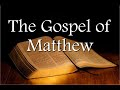

# Surprises in the Gospel of Matthew with Professor Dale Martin (2021-06-20 12:50:01+00:00)

## Description

We continue the series of talks on the New Testament with the Gospel of Matthew. Dale Martin is a distinguished American New Testament scholar who taught at Yale University for over 30 years. See his excellent Introduction to New Testament History and Literature (Open Yale Courses) https://www.amazon.co.uk/Testament-History-Literature-Open-Courses/dp/0300180853
Please consider supporting my work on Patreon: https://www.patreon.com/Bloggingtheology?fan_landing=true

## Summary of [Surprises in the Gospel of Matthew with Professor Dale Martin](https://www.youtube.com/watch?v=CN9jS7guHck)

*This is an AI generated summary. There may be inaccuracies. *

### [00:00:00](https://www.youtube.com/watch?v=CN9jS7guHck&t=0) - [00:50:00](https://www.youtube.com/watch?v=CN9jS7guHck&t=3000)

In this video, Professor Dale Martin discusses the differences between the Gospel of Matthew and the other gospels. He points out that Matthew is unique in its focus on the church, and its insistence on the importance of the Jewishness of the Christian faith. He also discusses the different ways scholars have organized Matthew's Gospel, and how it parallels the way the Hebrew Bible is organized.

**[00:00:00](https://www.youtube.com/watch?v=CN9jS7guHck&t=0)** In this video, Professor Dale Martin discusses the Gospel of Matthew, highlighting its paradoxical nature as a Torah-observant Christianity and gentile mission text. He also mentions that the names attributed to the gospel text were not present in the first century, and that it was only in the second century that these titles were attached. Martin finishes by discussing how we know about the gospel's authorship and when it was written.
* **[00:05:00](https://www.youtube.com/watch?v=CN9jS7guHck&t=300)** In this video, Professor Dale Martin discusses the theory that the Gospel of Matthew was written after the events it describes had already taken place. Martin points out that the author of Matthew does not mention the destruction of Jerusalem taking place at the same time as the other events mentioned in the gospel, indicating that it was written after these events had taken place. Additionally, Martin argues that the author of Matthew likely used a written source, known as "Q," which provided him with verbatim quotations from the Gospel of Mark.
* **[00:10:00](https://www.youtube.com/watch?v=CN9jS7guHck&t=600)** In this video, Professor Dale Martin discusses the differences between the Gospel of Matthew and the Gospel of Luke. He points out that Matthew uses a different term, "lost sheep of the house of Israel," to refer to people who are not Jewish. He also points out that in the last verses of the gospel, Jesus tells his disciples to go and make disciples of all nations. This is significant because it shows that Jesus is not limited to the people of Israel.
* **[00:15:00](https://www.youtube.com/watch?v=CN9jS7guHck&t=900)** Professor Dale Martin discusses the differences between the historical Jesus and the Jesus in the Gospel of Matthew. He argues that the historical Jesus saw himself as being only a prophet to the people of Israel, while the Jesus in Matthew's community includes gentiles.
* **[00:20:00](https://www.youtube.com/watch?v=CN9jS7guHck&t=1200)** In Matthew, Jesus intensifies the law by putting it inside the human heart. Paul and other early Christian writers would likely disagree with this view of the law.
* **[00:25:00](https://www.youtube.com/watch?v=CN9jS7guHck&t=1500)** Matthew focuses on the importance of the church, and surprises viewers by mentioning the founding of the church in a unique way. This is a departure from other gospel authors, who focus primarily on the teachings of Jesus.
* **[00:30:00](https://www.youtube.com/watch?v=CN9jS7guHck&t=1800)** In this video, Professor Dale Martin discusses the theology of the remnant in the Gospel of Matthew. He argues that this theology is found in other places in the first century, and that it developed quickly after the death of Jesus. He also discusses the conversion of Paul, which he believes took place around 34 AD.
* **[00:35:00](https://www.youtube.com/watch?v=CN9jS7guHck&t=2100)** In Matthew, Jesus commissions the disciples to make disciples of all nations, baptizing them in the name of the Father, Son, and Holy Spirit. Luke, which is proposed to be the history of the early earliest church, does not mention anyone being baptized in this triadic name. Dale Martin argues that this is because Luke is writing after the resurrection of Jesus, and baptizing in this three-fold name was developed theology.
* **[00:40:00](https://www.youtube.com/watch?v=CN9jS7guHck&t=2400)** Professor Dale Martin discusses the differences between the spirit in Luke and in Acts, and how the spirit is only present in Paul. He also discusses the historical context of the Gospel of Matthew, and how it forces the church to be Jewish. He also discusses how Matthew is the first gospel in the canon to insist that the church be aware of its Jewishness.
* **[00:45:00](https://www.youtube.com/watch?v=CN9jS7guHck&t=2700)** Professor Dale Martin discusses the different ways scholars have organized Matthew's Gospel, and how it parallels the way the Hebrew Bible is organized. He also discusses why he believes Matthew is the favorite Gospel of Jesus Christ.
* **[00:50:00](https://www.youtube.com/watch?v=CN9jS7guHck&t=3000)** In this video, Professor Dale Martin discusses the five gospels, noting that although they have similar themes, each gospel has its own unique content. He also comments on the Gospel of Thomas, which he believes is not a gospel but rather a series of sayings.

## Full transcript with timestamps

[0:00:02](https://youtu.be/CN9jS7guHck?t=2) Good evening everyone and welcome to Blogging 
Theology. My name is Paul Williams. I'm calling    
[0:00:06](https://youtu.be/CN9jS7guHck?t=6) from the South of France today and I'm honoured 
again to have as our guest Dale Martin who I    
[0:00:14](https://youtu.be/CN9jS7guHck?t=14) understand is in Texas in the USA and a professor 
at Yale University and other places as well.    
[0:00:22](https://youtu.be/CN9jS7guHck?t=22) And he is today going to talk us through aspects 
of the Gospel of Matthew. This is the first gospel    
[0:00:30](https://youtu.be/CN9jS7guHck?t=30) in the New Testament and by way of Overview of 
this brief introduction i just want to read a    
[0:00:36](https://youtu.be/CN9jS7guHck?t=36) few words from his book one of many books: New 
Testament History and Literature, published by Yale    
[0:00:43](https://youtu.be/CN9jS7guHck?t=43) University Press and in chapter 7 The Gospel of 
Matthew he writes as an overview 'The Gospel of    
[0:00:50](https://youtu.be/CN9jS7guHck?t=50) Matthew contains some of the most famous passages 
that both Christians and non-christians recognize    
[0:00:57](https://youtu.be/CN9jS7guHck?t=57) but matthew presents itself paradox paradoxically 
as preaching both a Torah-observant Christianity    
[0:01:05](https://youtu.be/CN9jS7guHck?t=65) and a gentile mission a christian mission to 
gentiles the figure of Jesus in matthew is as    
[0:01:13](https://youtu.be/CN9jS7guHck?t=73) a teacher the founder of a church uniquely uh the 
model for the apostles and matthew's own community    
[0:01:21](https://youtu.be/CN9jS7guHck?t=81) matthew is writing for a church community that 
needs encouragement to have faith uh in a time of    
[0:01:27](https://youtu.be/CN9jS7guHck?t=87) trouble and then the first sentence on the chapter 
itself the gospel of matthew from the second    
[0:01:34](https://youtu.be/CN9jS7guHck?t=94) century on has been the most popular gospel which 
is probably why it ended up first in our bibles    
[0:01:42](https://youtu.be/CN9jS7guHck?t=102) um there's a lot there particularly the 
paradoxical bit which i really like to explore    
[0:01:46](https://youtu.be/CN9jS7guHck?t=106) but dale could you just i really want to know who 
wrote this gospel who is the author and um and    
[0:01:53](https://youtu.be/CN9jS7guHck?t=113) when was it written because we've all been told 
christians have been told for most of the last    
[0:01:57](https://youtu.be/CN9jS7guHck?t=117) 2000 years that a disciple called matthew um the 
tax collector disciple of jesus himself authored    
[0:02:05](https://youtu.be/CN9jS7guHck?t=125) the text but i've heard rumors that scholars don't 
believe this anymore and why would they doubt    
[0:02:11](https://youtu.be/CN9jS7guHck?t=131) such a such an obvious truth this is by an apostle 
himself well one of the things you have to realize    
[0:02:17](https://youtu.be/CN9jS7guHck?t=137) is that um none of the names that are attached 
to the gospels in the bible were part of the text    
[0:02:29](https://youtu.be/CN9jS7guHck?t=149) they all they weren't there in the first century 
we can't find any reference in the first century    
[0:02:37](https://youtu.be/CN9jS7guHck?t=157) that matthew wrote matthew mark wrote mark 
blah blah blah um the the type the names of    
[0:02:46](https://youtu.be/CN9jS7guHck?t=166) these gospels got attached to the gospels only 
in the second century and most of us think it    
[0:02:52](https://youtu.be/CN9jS7guHck?t=172) was only in the late second century you know 
after 150. well why would you believe something    
[0:03:01](https://youtu.be/CN9jS7guHck?t=181) uh that's a hundred years separated from 
when it was supposed to have happened    
[0:03:08](https://youtu.be/CN9jS7guHck?t=188) um i mean just think about it we you know we just 
separated the first anniversary of juneteenth here    
[0:03:18](https://youtu.be/CN9jS7guHck?t=198) in texas in galveston as a matter of fact where 
i'm sitting right now this was the day in june    
[0:03:26](https://youtu.be/CN9jS7guHck?t=206) when black people were first told that they were 
free they had been freed for two years by the    
[0:03:33](https://youtu.be/CN9jS7guHck?t=213) emancipation proclamation but they weren't told 
um and so we celebrate juneteenth as uh june 19th    
[0:03:43](https://youtu.be/CN9jS7guHck?t=223) is the date when uh emancipation was proclaimed 
in texas and it was proclaimed in four different    
[0:03:52](https://youtu.be/CN9jS7guHck?t=232) buildings in galveston and then it spread out 
throughout the state of texas now imagine that    
[0:03:59](https://youtu.be/CN9jS7guHck?t=239) you know that was only a hundred years ago how 
do we know about that well we have newspapers    
[0:04:09](https://youtu.be/CN9jS7guHck?t=249) from the time we have letters we have people's 
accounts we even had live memories of people who    
[0:04:16](https://youtu.be/CN9jS7guHck?t=256) were alive back then who can tell us uh what 
it was like when they first heard about it  
[0:04:25](https://youtu.be/CN9jS7guHck?t=265) there was nothing like that for the 
gospels there were no newspapers    
[0:04:29](https://youtu.be/CN9jS7guHck?t=269) there was no uh tv there was no radio there was no 
nothing you just had these papyrus texts that were    
[0:04:37](https://youtu.be/CN9jS7guHck?t=277) floating around being shared by different 
church groups and they were probably just    
[0:04:43](https://youtu.be/CN9jS7guHck?t=283) small house churches and they would copy them out 
by hand and send them a copy to somebody else but    
[0:04:51](https://youtu.be/CN9jS7guHck?t=291) that's all there was so how do you know that the 
gospel of matthew that never gets the name matthew    
[0:04:59](https://youtu.be/CN9jS7guHck?t=299) attached to it until sometime after 150 how do 
you know that goes back to the year 35 or 40.    
[0:05:10](https://youtu.be/CN9jS7guHck?t=310) it's just unbelievable you just have to you just 
have to work with some historical skepticism    
[0:05:18](https://youtu.be/CN9jS7guHck?t=318) so there's simply no evidence that matthew 
the author uh wrote it uh himself because as    
[0:05:24](https://youtu.be/CN9jS7guHck?t=324) you say it was a later second century idea that 
materialized uh but but also is it not the case    
[0:05:31](https://youtu.be/CN9jS7guHck?t=331) that i mean how significant is it when i read that 
gospel it's not in the first person it's not i'm    
[0:05:37](https://youtu.be/CN9jS7guHck?t=337) it's not implying an eyewitness account it reads 
like a third person account he did this and he's    
[0:05:43](https://youtu.be/CN9jS7guHck?t=343) not that in fact third fourth fifth sixth person 
account matthew never says oh well there was that    
[0:05:51](https://youtu.be/CN9jS7guHck?t=351) time when jesus and i were sitting by the sea of 
galilee and he handed out a bunch of fish and he    
[0:05:58](https://youtu.be/CN9jS7guHck?t=358) did this or that there's nothing like that and 
in fact we know that whoever wrote the gospel    
[0:06:04](https://youtu.be/CN9jS7guHck?t=364) of matthew used the gospel of mark as a source he 
just copies it out verbatim at times he also uses    
[0:06:12](https://youtu.be/CN9jS7guHck?t=372) a source that the gospel of luke uses that we tend 
to call q which just comes from the german word    
[0:06:20](https://youtu.be/CN9jS7guHck?t=380) which is just the german word for source you know 
german scholars just decided well look there was    
[0:06:27](https://youtu.be/CN9jS7guHck?t=387) some written document that luke and matthew use 
that's not in mark these are sayings they're not    
[0:06:33](https://youtu.be/CN9jS7guHck?t=393) in mark but they are verbatim the same you know 
blessed are blah blah blah you know you are the    
[0:06:42](https://youtu.be/CN9jS7guHck?t=402) salt of the earth you know uh how did matthew and 
luke come up with these sayings neither of them    
[0:06:48](https://youtu.be/CN9jS7guHck?t=408) appears to be a follower of jesus so they're 
getting it from a written source so matthew    
[0:06:54](https://youtu.be/CN9jS7guHck?t=414) and luke are using a written source of mark and 
they use a written source that we call q it's a    
[0:07:01](https://youtu.be/CN9jS7guHck?t=421) hypothetical written source and some people doubt 
that it never existed but i don't see how they can    
[0:07:06](https://youtu.be/CN9jS7guHck?t=426) get around it because it's verbatim and matthew 
and luke and if if you put matthew and luke next    
[0:07:11](https://youtu.be/CN9jS7guHck?t=431) to one another they don't look like they copied 
each other no and so where did they get these    
[0:07:18](https://youtu.be/CN9jS7guHck?t=438) verbatim quotations well one of the things that 
impresses me is uh if you look in mark's gospel    
[0:07:25](https://youtu.be/CN9jS7guHck?t=445) mark chapter 13 you get this long discourse 
where jesus is talking about the destruction    
[0:07:30](https://youtu.be/CN9jS7guHck?t=450) of the temple and the the return of the son of 
man and so on and in the middle of this discourse    
[0:07:35](https://youtu.be/CN9jS7guHck?t=455) it jesus says apparently in parenthesis let the 
reader understand i'm thinking hang on this is    
[0:07:42](https://youtu.be/CN9jS7guHck?t=462) not reading this is jesus talking to disciples and 
then you get an identical phrase in matthew's uh    
[0:07:48](https://youtu.be/CN9jS7guHck?t=468) version of the same episode in matthew 24 where 
it says lo and behold halfway through let the    
[0:07:54](https://youtu.be/CN9jS7guHck?t=474) reader understand what a coincidence um unless 
of course uh as you're suggesting that one gospel    
[0:08:00](https://youtu.be/CN9jS7guHck?t=480) is common from another and it's clearly a 
written account let the reader understand    
[0:08:05](https://youtu.be/CN9jS7guHck?t=485) um but that's a that's a great place to go for the 
idea of when it was written right according to the    
[0:08:12](https://youtu.be/CN9jS7guHck?t=492) gospel of mark the gospel of mark in chapter 
13 which we're talking about says right now    
[0:08:20](https://youtu.be/CN9jS7guHck?t=500) at this point jesus is going to come back 
the angels are going to come in and we're    
[0:08:26](https://youtu.be/CN9jS7guHck?t=506) going to have the big blow up of the world and 
we're going to have the kingdom of god come  
[0:08:32](https://youtu.be/CN9jS7guHck?t=512) matthew doesn't like that and luke doesn't 
like that because it sounds like mark is saying    
[0:08:41](https://youtu.be/CN9jS7guHck?t=521) right when the romans are surrounding 
jerusalem which happened what 69 and 70 right    
[0:08:49](https://youtu.be/CN9jS7guHck?t=529) so the gospel that's why we say the gospel of mark 
was probably written around the year 70 because    
[0:08:56](https://youtu.be/CN9jS7guHck?t=536) he tells the story of what's going 
to happen with the romans and the war    
[0:09:02](https://youtu.be/CN9jS7guHck?t=542) against the jews and he tells it all up 
against the year 70 and he says that's when    
[0:09:08](https://youtu.be/CN9jS7guHck?t=548) jesus is going to come or jesus is basically 
saying that's when the son of man is going to come  
[0:09:16](https://youtu.be/CN9jS7guHck?t=556) did it happen  
[0:09:19](https://youtu.be/CN9jS7guHck?t=559) not not according to any of us we're still 
here um and so matthew and luke change that    
[0:09:29](https://youtu.be/CN9jS7guHck?t=569) they change it very slightly um luke puts in this 
thing saying you will get the romans surrounding    
[0:09:37](https://youtu.be/CN9jS7guHck?t=577) jerusalem and they will be around jerusalem and 
you'll get jerusalem destroyed so luke even has    
[0:09:45](https://youtu.be/CN9jS7guHck?t=585) the destruction of jerusalem and he's copying 
this out of mark and yet he's changing it all    
[0:09:52](https://youtu.be/CN9jS7guHck?t=592) to bring it up today and so mark didn't talk about 
the destruction of jerusalem happening right then    
[0:09:58](https://youtu.be/CN9jS7guHck?t=598) luke adds that because he's sitting over there i 
think luke was probably sitting in i don't know    
[0:10:04](https://youtu.be/CN9jS7guHck?t=604) galilee or asia minor or some place and he's 
looking over there in the palestine he goes    
[0:10:10](https://youtu.be/CN9jS7guHck?t=610) the romans destroyed jerusalem so why didn't 
jesus come back and so luke brings it up to    
[0:10:18](https://youtu.be/CN9jS7guHck?t=618) date and he says then you'll have jerusalem where 
we trampled down until the times of the gentiles    
[0:10:27](https://youtu.be/CN9jS7guHck?t=627) the times of the gentiles well what does 
that mean mark didn't say anything about that    
[0:10:32](https://youtu.be/CN9jS7guHck?t=632) no and matthew doesn't say anything about 
that either which is why one of the reasons    
[0:10:36](https://youtu.be/CN9jS7guHck?t=636) i don't think matthew knew luke um why wouldn't 
matthew copy some of luke into his own gospel    
[0:10:43](https://youtu.be/CN9jS7guHck?t=643) he doesn't he uses a mark and then he goes off on 
his own but matthew also knows that the time of    
[0:10:51](https://youtu.be/CN9jS7guHck?t=651) the end that mark predicted didn't happen and so 
you get you get time kind of factored in both in    
[0:11:01](https://youtu.be/CN9jS7guHck?t=661) matthew and in luke which is why we know i mean if 
you're gonna practice this historical critical uh    
[0:11:10](https://youtu.be/CN9jS7guHck?t=670) game at all then you use this kind of stuff you 
say you know why do they tell the story of the    
[0:11:19](https://youtu.be/CN9jS7guHck?t=679) end of time differently it's because they lived at 
different times so there's a bit of detective work    
[0:11:30](https://youtu.be/CN9jS7guHck?t=690) really isn't it you've got to be someone with an 
acute be blunt an acute intelligence a desire to    
[0:11:36](https://youtu.be/CN9jS7guHck?t=696) really notice these subtle differences 
my case you just have to go to school    
[0:11:45](https://youtu.be/CN9jS7guHck?t=705) and and from that you can actually really get a 
sense of what might be going on have one gospel    
[0:11:50](https://youtu.be/CN9jS7guHck?t=710) change the other gospel and why would they do it 
what's the agenda what's going on rather than just    
[0:11:55](https://youtu.be/CN9jS7guHck?t=715) seeing the differences are there's eyewitness 
accounts people traditionally say well matthews    
[0:11:58](https://youtu.be/CN9jS7guHck?t=718) and i when is mark no we were dealing here with 
people copying and changing and editing redacting    
[0:12:04](https://youtu.be/CN9jS7guHck?t=724) each other and that can tell us a lot about their 
agenda and what their theology is and what their    
[0:12:09](https://youtu.be/CN9jS7guHck?t=729) physiology is and their eschatology and how that's 
changed because of the flow of time history itself    
[0:12:16](https://youtu.be/CN9jS7guHck?t=736) has had to change things because here we get 
to the contradictions in matthew that you were    
[0:12:22](https://youtu.be/CN9jS7guHck?t=742) talking about why is it that matthew wants 
his church to be a law abiding torah keeping    
[0:12:31](https://youtu.be/CN9jS7guHck?t=751) a basically jewish church and yet at the the last 
verses of the gospel jesus tells the disciples    
[0:12:41](https://youtu.be/CN9jS7guHck?t=761) to go and make disciples of all nations the word 
nations is directly ethnoi it's that word ethnos    
[0:12:50](https://youtu.be/CN9jS7guHck?t=770) we can translate it nations but it means all 
the different ethnic groups so yeah matthew's    
[0:12:58](https://youtu.be/CN9jS7guHck?t=778) having jesus at the very last so here's what 
i think is going on first you have to say    
[0:13:04](https://youtu.be/CN9jS7guHck?t=784) there are different levels as i've 
said there's the historical jesus    
[0:13:09](https://youtu.be/CN9jS7guHck?t=789) and jesus may have said things that got into 
matthew's gospel um that the historical jesus    
[0:13:18](https://youtu.be/CN9jS7guHck?t=798) actually said would an example of that be the 
canaanite woman her faith in matthew 15 yes    
[0:13:26](https://youtu.be/CN9jS7guHck?t=806) can i just read that out for people i know you 
know it but just so because i think it's a really    
[0:13:30](https://youtu.be/CN9jS7guHck?t=810) significant passage in the light of what happens 
at the end of the gospel so according to this    
[0:13:35](https://youtu.be/CN9jS7guHck?t=815) is the nrsv uh version jesus left that place 
and went away to the district of ty and sidon    
[0:13:41](https://youtu.be/CN9jS7guHck?t=821) just said a canaanite woman this is not a 
jews a gentile from that region came out    
[0:13:46](https://youtu.be/CN9jS7guHck?t=826) and started shouting have mercy on me lord son 
of david my daughter is tormented by a demon    
[0:13:52](https://youtu.be/CN9jS7guHck?t=832) but he did not answer her at all 
really important silence and his    
[0:13:58](https://youtu.be/CN9jS7guHck?t=838) disciples came and urged him saying send 
her away but she keeps shouting after us    
[0:14:04](https://youtu.be/CN9jS7guHck?t=844) he answers jesus this is the killer the key thing 
i was sent only to the lost sheep of the house    
[0:14:12](https://youtu.be/CN9jS7guHck?t=852) of israel was only sent to the lost sheep of 
the house of israel not even all israel just    
[0:14:16](https://youtu.be/CN9jS7guHck?t=856) for the lost sheep of the house of israel but she 
knelt before him saying lord help me he answered    
[0:14:22](https://youtu.be/CN9jS7guHck?t=862) uh it is not fair to take the children's food this 
is the israelites food and throw it to the dogs    
[0:14:28](https://youtu.be/CN9jS7guHck?t=868) oh she said yes lord yet even the dogs eat 
the crumbs that fall from their master's table    
[0:14:36](https://youtu.be/CN9jS7guHck?t=876) then jesus answers her woman great is your 
faith let it be done for you as you wish and    
[0:14:42](https://youtu.be/CN9jS7guHck?t=882) her daughter was healed instantly so here we have 
a series of rebuffs from from silence initially to    
[0:14:50](https://youtu.be/CN9jS7guHck?t=890) the disciples urging jesus to send her away then 
jesus saying look i'm not sent to you go away    
[0:14:55](https://youtu.be/CN9jS7guHck?t=895) and then you get a clever faithful response than 
this gentile and because of this exceptional    
[0:15:01](https://youtu.be/CN9jS7guHck?t=901) response great is your faith he actually accedes 
to her request and does actually heal the daughter    
[0:15:08](https://youtu.be/CN9jS7guHck?t=908) immediately apparently but this seems to be an 
exception rather than the rule but you're clear    
[0:15:13](https://youtu.be/CN9jS7guHck?t=913) clearly the disciples and jesus did not want to 
deal with her and yet at the end of this very same    
[0:15:19](https://youtu.be/CN9jS7guHck?t=919) gospel jesus teaches the very same disciples 
go into all the nations the ethnic the ethnos    
[0:15:27](https://youtu.be/CN9jS7guHck?t=927) and teaching them to obey everything that i've 
commanded you and baptized them etc etc and    
[0:15:32](https://youtu.be/CN9jS7guHck?t=932) i'm thinking what's going on here matthew what's 
going on you've got jesus who said look i'm only    
[0:15:38](https://youtu.be/CN9jS7guHck?t=938) sent to the jews and then he's changed his mind 
i mean what is jesus mission but you're saying    
[0:15:44](https://youtu.be/CN9jS7guHck?t=944) that we're dealing with different levels of 
history here you're saying the historical jesus    
[0:15:50](https://youtu.be/CN9jS7guHck?t=950) whatever that means uh was restricting his mission 
to the israelites but the church after paul    
[0:16:00](https://youtu.be/CN9jS7guHck?t=960) in the 80s 90s was largely a gentile organization 
movement and so you had different levels of    
[0:16:08](https://youtu.be/CN9jS7guHck?t=968) um discourse going on here you have 
the historical jesus you have the later    
[0:16:12](https://youtu.be/CN9jS7guHck?t=972) gentile church and then you have matthew's 
community which includes gentiles presumably now    
[0:16:19](https://youtu.be/CN9jS7guHck?t=979) am i am i on the right this is what you're saying 
a little bit yes but i don't want to make it    
[0:16:24](https://youtu.be/CN9jS7guHck?t=984) i don't want to make it too clearly 
simply the historical jesus versus    
[0:16:28](https://youtu.be/CN9jS7guHck?t=988) the textual jesus of matthew because i 
believe that even in matthew there are layers    
[0:16:34](https://youtu.be/CN9jS7guHck?t=994) of meaning um i do believe that the historical 
jesus saw himself as being only a prophet    
[0:16:42](https://youtu.be/CN9jS7guHck?t=1002) to the people of israel i think that he 
was a disciple of john the baptist i think    
[0:16:49](https://youtu.be/CN9jS7guHck?t=1009) he was baptized by john the baptist i think he 
thought he was inferior to john the baptist um  
[0:16:58](https://youtu.be/CN9jS7guHck?t=1018) and yet after john the baptist was arrested 
and killed jesus comes out of the closet    
[0:17:07](https://youtu.be/CN9jS7guHck?t=1027) and starts um speaking more openly 
well did he did he have a change in his    
[0:17:15](https://youtu.be/CN9jS7guHck?t=1035) self-concept i don't know but see 
that's getting way back into the    
[0:17:20](https://youtu.be/CN9jS7guHck?t=1040) undiscoverable historical jesus stuff 
right but even in matthew there's a tension    
[0:17:28](https://youtu.be/CN9jS7guHck?t=1048) um for example matthew i think matthew drew a 
line between jesus in his ministry in israel    
[0:17:43](https://youtu.be/CN9jS7guHck?t=1063) uh which matthew would have included 
all of palestine including galilee and  
[0:17:53](https://youtu.be/CN9jS7guHck?t=1073) and then jesus after his death  
[0:17:58](https://youtu.be/CN9jS7guHck?t=1078) and i think that jesus he recognized and i think 
this is where matthew is probably historically    
[0:18:03](https://youtu.be/CN9jS7guHck?t=1083) accurate he recognized that jesus saw 
himself as being sent only to israel    
[0:18:13](https://youtu.be/CN9jS7guHck?t=1093) but matthew's church is a combined 
church of jews and gentiles    
[0:18:18](https://youtu.be/CN9jS7guHck?t=1098) and so he has to believe that somehow jesus's 
will was to include the gentiles into israel    
[0:18:27](https://youtu.be/CN9jS7guHck?t=1107) and i don't mean that he wanted the church to be 
gentile he wanted the gentiles to become israel    
[0:18:35](https://youtu.be/CN9jS7guHck?t=1115) that's why matthew never says unlike paul would 
say or luke would say or other new testament    
[0:18:43](https://youtu.be/CN9jS7guHck?t=1123) rather than say that gentiles don't have to keep 
the law matthew insisted that everyone in his    
[0:18:49](https://youtu.be/CN9jS7guHck?t=1129) church keep the law yeah the gentiles included the 
same entirely you have to follow the sabbath laws    
[0:18:56](https://youtu.be/CN9jS7guHck?t=1136) the kosher food laws and be certain the males be 
circumcised gently exactly there's not one hint    
[0:19:04](https://youtu.be/CN9jS7guHck?t=1144) in any of the gospel of matthew that he believed 
that gentile believers didn't have to keep the    
[0:19:12](https://youtu.be/CN9jS7guHck?t=1152) entire torah how however he understood it now of 
course in matthew's day there were lots of ways of    
[0:19:19](https://youtu.be/CN9jS7guHck?t=1159) interpreting the torah so for example some people 
said you know you couldn't rub your hands together    
[0:19:25](https://youtu.be/CN9jS7guHck?t=1165) with grain on the sabbath that's breaking the 
sabbath well matthew doesn't believe that uh    
[0:19:31](https://youtu.be/CN9jS7guHck?t=1171) some people say you have to wash your hands before 
you eat or handle matthew doesn't believe that so    
[0:19:38](https://youtu.be/CN9jS7guHck?t=1178) he said he has jesus disciples not washing their 
hands and jesus calls that oh that's just your the    
[0:19:45](https://youtu.be/CN9jS7guHck?t=1185) tradition of your elders but nowhere does jesus 
in matthew say moses said to you and i'm throwing    
[0:19:57](https://youtu.be/CN9jS7guHck?t=1197) it out in fact in the center of the mount jesus 
says moses says to you do not commit adultery  
[0:20:08](https://youtu.be/CN9jS7guHck?t=1208) i say to you do not even look at a woman with 
the intention of committing adultery notice    
[0:20:15](https://youtu.be/CN9jS7guHck?t=1215) jesus is not throwing away the anti-adultery 
commandment he's making it harder to keep    
[0:20:20](https://youtu.be/CN9jS7guHck?t=1220) it's intensifying it it's making 
it more difficult in a way because  
[0:20:27](https://youtu.be/CN9jS7guHck?t=1227) intensely personal into the heart rather than 
just mere external obedience in matthew jesus    
[0:20:33](https://youtu.be/CN9jS7guHck?t=1233) internalizes the mosaic law and puts it inside 
the human being which makes it even harder to keep    
[0:20:42](https://youtu.be/CN9jS7guHck?t=1242) right um you might say don't you know don't kill 
well jesus says in matthew don't even be angry    
[0:20:54](https://youtu.be/CN9jS7guHck?t=1254) what do you mean don't be angry how can you 
not be angry jesus intensifies the torah    
[0:21:03](https://youtu.be/CN9jS7guHck?t=1263) in matthew this is totally different from luke 
and ax and paul totally different so matthew    
[0:21:14](https://youtu.be/CN9jS7guHck?t=1274) has a jesus who's completely jewish completely 
torah observant and yet at the very end he says    
[0:21:21](https://youtu.be/CN9jS7guHck?t=1281) go get the gentiles and bring them in but notice 
he doesn't say they get to stay gentiles they have    
[0:21:30](https://youtu.be/CN9jS7guHck?t=1290) to keep the law also now he doesn't say they have 
to become jews so that's a difference but i don't    
[0:21:35](https://youtu.be/CN9jS7guHck?t=1295) know what he would call them he doesn't call them 
jews but he doesn't call them gentiles if you look    
[0:21:42](https://youtu.be/CN9jS7guHck?t=1302) at the word gentile in matthew matthew never uses 
the word gentile for people in his own community  
[0:21:52](https://youtu.be/CN9jS7guHck?t=1312) gentiles are out there  
[0:21:55](https://youtu.be/CN9jS7guHck?t=1315) so matthew has this weird view that jesus opened 
up the church to the nations but he didn't really    
[0:22:06](https://youtu.be/CN9jS7guHck?t=1326) open it up to gentiles did he because they have 
to keep the law also but this is why what you're    
[0:22:14](https://youtu.be/CN9jS7guHck?t=1334) saying is so um shocking really to the uninitiated 
you write on page 99 most christians have been    
[0:22:21](https://youtu.be/CN9jS7guHck?t=1341) taught traditionally and at one time or another 
that christianity represents the supersession the    
[0:22:28](https://youtu.be/CN9jS7guHck?t=1348) superseding of judaism the thing that makes jews 
and christians alike is their worship of the same    
[0:22:35](https://youtu.be/CN9jS7guHck?t=1355) god what separates them is that christians need 
not follow jewish law it surprises people when    
[0:22:42](https://youtu.be/CN9jS7guHck?t=1362) they come to realize as modern scholars have done 
that this is not at all the attitude to the law in    
[0:22:50](https://youtu.be/CN9jS7guHck?t=1370) matthew and then you go on which i won't read 
uh to quote matthew 5 17-20 and you also later    
[0:22:56](https://youtu.be/CN9jS7guHck?t=1376) on quote uh matthew 23 verses 1 to 4 which also 
kind of reinforced the same point this is really    
[0:23:03](https://youtu.be/CN9jS7guHck?t=1383) shocking because uh it's a kind of christianity 
or kind of jewish christianity which we're just    
[0:23:10](https://youtu.be/CN9jS7guHck?t=1390) not familiar with today there is no such and 
paul himself who predates the writing of matthew    
[0:23:15](https://youtu.be/CN9jS7guHck?t=1395) arguably would uh intensely disagree with that as 
well absolutely absolutely and that's why i find    
[0:23:24](https://youtu.be/CN9jS7guHck?t=1404) um matthew so amazing i imagine i don't know 
this because we don't know we can't know this    
[0:23:34](https://youtu.be/CN9jS7guHck?t=1414) but i imagine matthew being a gospel that was 
written for a community living somewhere in    
[0:23:39](https://youtu.be/CN9jS7guHck?t=1419) syria which would have been a very semitic 
place arabic jewish strong strong jewish    
[0:23:49](https://youtu.be/CN9jS7guHck?t=1429) community that's one of the 
birthplaces of later rabbinic judaism    
[0:23:56](https://youtu.be/CN9jS7guHck?t=1436) and and his church is a law observant this is 
so ironic it's a law observant mixed church    
[0:24:12](https://youtu.be/CN9jS7guHck?t=1452) this is the you know the young the one of the 
parables in matthew that's not in any place else    
[0:24:17](https://youtu.be/CN9jS7guHck?t=1457) are the parables about the mixture 
um there's the weeds and the wheat    
[0:24:24](https://youtu.be/CN9jS7guHck?t=1464) and how do you keep apart the weeds and 
the wheat well you can't you just have to    
[0:24:31](https://youtu.be/CN9jS7guHck?t=1471) wait for jesus to come and then he'll separate 
the weeds and the wheat and i think that's the    
[0:24:38](https://youtu.be/CN9jS7guHck?t=1478) way he saw his church is a mixture of jews 
and gentiles that he couldn't separate out  
[0:24:48](https://youtu.be/CN9jS7guHck?t=1488) but he wanted the gentiles to be law 
observant and i believe it's because    
[0:24:57](https://youtu.be/CN9jS7guHck?t=1497) he just thought jesus never foresaw that there 
would be a law free form of the jesus movement    
[0:25:07](https://youtu.be/CN9jS7guHck?t=1507) so how would the author of matthew whoever 
he was have viewed paul's gospel which  
[0:25:16](https://youtu.be/CN9jS7guHck?t=1516) a particularly lutheran reading is a law free 
gospel that it completely rejects the law as    
[0:25:22](https://youtu.be/CN9jS7guHck?t=1522) something completely inappropriate and even 
just in martyr not just ignatius of antioch    
[0:25:27](https://youtu.be/CN9jS7guHck?t=1527) i should say the turn of the first century uh 
you know he said don't follow judy you're not    
[0:25:32](https://youtu.be/CN9jS7guHck?t=1532) jews you're christians don't follow this 
religion this is a really convincing how    
[0:25:38](https://youtu.be/CN9jS7guHck?t=1538) would matthew would have viewed paul what 
as a imposter an apostate a nerdy well a an    
[0:25:44](https://youtu.be/CN9jS7guHck?t=1544) an and not a real authentic follower of 
jesus i guess if that message went well    
[0:25:50](https://youtu.be/CN9jS7guHck?t=1550) we know for a fact from other sources there were a 
whole lot of christians who thought paul was crazy    
[0:25:57](https://youtu.be/CN9jS7guHck?t=1557) and wrong and heretical and 
you know this is not news um    
[0:26:05](https://youtu.be/CN9jS7guHck?t=1565) that paul was seen as um heretical uh 
but it makes perfect sense doesn't it um    
[0:26:17](https://youtu.be/CN9jS7guHck?t=1577) the real revolution was in people who 
came along like paul and like luke  
[0:26:28](https://youtu.be/CN9jS7guHck?t=1588) and said you know  
[0:26:33](https://youtu.be/CN9jS7guHck?t=1593) this whole thing about the torah that was 
fine for a time but it's gone it's over  
[0:26:43](https://youtu.be/CN9jS7guHck?t=1603) they were the ones who were 
the red the revolutionaries  
[0:26:49](https://youtu.be/CN9jS7guHck?t=1609) matthew did what we should 
have expected people to do  
[0:26:55](https://youtu.be/CN9jS7guHck?t=1615) so his religion his christianity if i can use 
that word anachronistically his he was a jewish    
[0:27:02](https://youtu.be/CN9jS7guHck?t=1622) movement within judaism i guess would have been 
the normative faith that the original disciples    
[0:27:09](https://youtu.be/CN9jS7guHck?t=1629) would have recognized as an expression of their 
faith but you're saying there was a parallel    
[0:27:14](https://youtu.be/CN9jS7guHck?t=1634) movement uh expressed bubble famously by paul 
and by luke which kind of went off in a different    
[0:27:20](https://youtu.be/CN9jS7guHck?t=1640) trajectory and ended up with a different kind 
of expression of faith law free gentile centered    
[0:27:28](https://youtu.be/CN9jS7guHck?t=1648) but centered on the church and this is 
something else i wanted to mention in    
[0:27:31](https://youtu.be/CN9jS7guHck?t=1651) in matthew uniquely in all of the gospels this is 
a real surprise um to me i'm sure to many people    
[0:27:40](https://youtu.be/CN9jS7guHck?t=1660) none of the gospels mentioned jesus founding 
a church anywhere apart from matthew    
[0:27:47](https://youtu.be/CN9jS7guHck?t=1667) and he has jesus found the church in matthew 16 i 
think it is uh and you found on peter this great    
[0:27:56](https://youtu.be/CN9jS7guHck?t=1676) great roman catholic phrase you know you are peter 
petros the rock and on this rock i will build my    
[0:28:02](https://youtu.be/CN9jS7guHck?t=1682) church and the gates of hell will not 
overcome it wow but for some reason    
[0:28:09](https://youtu.be/CN9jS7guHck?t=1689) no one else mentions this never speaks about 
a church paul doesn't mention the founding    
[0:28:13](https://youtu.be/CN9jS7guHck?t=1693) of the church in that way on the rock on peter 
surprisingly why is matthew mentioning a founding    
[0:28:20](https://youtu.be/CN9jS7guHck?t=1700) of the church where does that come from well 
i think that you have to go back to the greek  
[0:28:28](https://youtu.be/CN9jS7guHck?t=1708) church is just a translation of ecclesia 
which means those who are called out right now    
[0:28:35](https://youtu.be/CN9jS7guHck?t=1715) matthew is very very much um centered in the 
prophets uh he he constructs his narrative    
[0:28:46](https://youtu.be/CN9jS7guHck?t=1726) to portray jesus as a prophet 
who is called out of egypt    
[0:28:52](https://youtu.be/CN9jS7guHck?t=1732) um as a prophet like his father joseph joseph 
is fashioned out of joseph in the hebrew bible  
[0:29:06](https://youtu.be/CN9jS7guHck?t=1746) jesus comes out of egypt  
[0:29:11](https://youtu.be/CN9jS7guHck?t=1751) so there's so much of the prophets 
the israel prophets in matthew    
[0:29:20](https://youtu.be/CN9jS7guHck?t=1760) and ecclesia doesn't mean church in that sense 
it means the called ones the set aside ones    
[0:29:32](https://youtu.be/CN9jS7guHck?t=1772) the prophetic ones the ones like 
jeremiah jeremiah and isaiah were called    
[0:29:42](https://youtu.be/CN9jS7guHck?t=1782) they weren't christians they were called uh and 
that's what matthew means i think by ekklesia    
[0:29:52](https://youtu.be/CN9jS7guHck?t=1792) is these are the people who are called out of 
israel as a remnant you know this is a thing    
[0:30:00](https://youtu.be/CN9jS7guHck?t=1800) all the way through jewish history there's 
a theology of the remnant there's you know    
[0:30:06](https://youtu.be/CN9jS7guHck?t=1806) the all the people of israel are not holy 
necessarily uh according to this theology uh only  
[0:30:17](https://youtu.be/CN9jS7guHck?t=1817) a remnant of israel is truly holy and 
that's exactly what matthew believes    
[0:30:26](https://youtu.be/CN9jS7guHck?t=1826) but why is this if jesus did this historically 
why is there no trace of this seemingly anyway    
[0:30:32](https://youtu.be/CN9jS7guHck?t=1832) in mark and luke and john there's no none 
of this calling of a remnant that i can see    
[0:30:38](https://youtu.be/CN9jS7guHck?t=1838) well there's not there's not the term ecclesia 
but i do i would argue that there is remnant    
[0:30:45](https://youtu.be/CN9jS7guHck?t=1845) theology in some of the other places too 
okay um that not all of israel will be saved    
[0:30:55](https://youtu.be/CN9jS7guHck?t=1855) that's you know a phrase you find in 
other places too okay um and so um  
[0:31:06](https://youtu.be/CN9jS7guHck?t=1866) i think i don't think you can separate 
out any of first century judaism  
[0:31:15](https://youtu.be/CN9jS7guHck?t=1875) from remnant theology whether you're 
talking about qumran the dead sea scrolls    
[0:31:23](https://youtu.be/CN9jS7guHck?t=1883) um john the baptist what was john the baptist 
doing he was trying to call out and uh prove their    
[0:31:34](https://youtu.be/CN9jS7guHck?t=1894) remnant status by dipping them in 
water um that's pure remnant theology    
[0:31:42](https://youtu.be/CN9jS7guHck?t=1902) but remnant theory is different from the more 
catholic understanding which where you have the    
[0:31:46](https://youtu.be/CN9jS7guHck?t=1906) college of the apostles you have peter of course 
as the preeminent um uh the premier apostle um    
[0:31:53](https://youtu.be/CN9jS7guHck?t=1913) founding a church i mean this is using the word 
church now as an organization and there are    
[0:31:58](https://youtu.be/CN9jS7guHck?t=1918) successors the apostles appoint others who will 
carry on their ministry after their passing and    
[0:32:05](https://youtu.be/CN9jS7guHck?t=1925) they pass on to their successes you have the 
apostolic succession idea which is there in    
[0:32:09](https://youtu.be/CN9jS7guHck?t=1929) the second century um of course um and you seem 
to be saying that that's not quite what jesus    
[0:32:15](https://youtu.be/CN9jS7guHck?t=1935) is the historical so-called historical jesus 
dude this is ma this is matthew's understanding    
[0:32:22](https://youtu.be/CN9jS7guHck?t=1942) perhaps influenced by that later first century uh 
and is he is he reading back into jesus ministry    
[0:32:29](https://youtu.be/CN9jS7guHck?t=1949) that um that more developed understanding perhaps 
embryonically there in the remnant theology    
[0:32:34](https://youtu.be/CN9jS7guHck?t=1954) you mentioned he's he's working it towards a 
more developed ecclesiology i don't i don't    
[0:32:42](https://youtu.be/CN9jS7guHck?t=1962) i would not want to read any of matthew 
in those second century terms i think the    
[0:32:49](https://youtu.be/CN9jS7guHck?t=1969) establishment of uh catholic christianity takes 
decades and decades and decades to development    
[0:32:58](https://youtu.be/CN9jS7guHck?t=1978) to develop when paul when matthew says you are 
peter and upon this rock i will build my church    
[0:33:08](https://youtu.be/CN9jS7guHck?t=1988) i i just resist reading that in later catholic    
[0:33:13](https://youtu.be/CN9jS7guHck?t=1993) uh foundational theology i just don't think 
that's what i don't think it i don't think    
[0:33:18](https://youtu.be/CN9jS7guHck?t=1998) number one the historical jesus ever said that 
number two i don't think that's what matthew meant    
[0:33:25](https://youtu.be/CN9jS7guHck?t=2005) i think what matthew meant was this is what i'm 
gonna found my remnant theology on is on your    
[0:33:34](https://youtu.be/CN9jS7guHck?t=2014) confession and that confession being true for 
other people um and i do believe that matthew    
[0:33:44](https://youtu.be/CN9jS7guHck?t=2024) came to believe that jesus was the messiah 
which i do believe took time to develop  
[0:33:53](https://youtu.be/CN9jS7guHck?t=2033) i don't think anybody in the year 30 thought jesus 
was the messiah uh much less jesus um but it was    
[0:34:04](https://youtu.be/CN9jS7guHck?t=2044) a belief that's developed after that to the point 
it developed quickly i think so that i would place    
[0:34:13](https://youtu.be/CN9jS7guHck?t=2053) uh paul's let's call it a conversion he would not 
call it a conversion because he didn't convert    
[0:34:19](https://youtu.be/CN9jS7guHck?t=2059) from one religion to another but his call to be an 
apostle i think paul that happened in around the    
[0:34:26](https://youtu.be/CN9jS7guHck?t=2066) year 34 and i think the death of jesus happened 
around the year 30 four years is not very long    
[0:34:36](https://youtu.be/CN9jS7guHck?t=2076) for this kind of stuff to develop but paul thought 
that he was called by jesus of nazareth the    
[0:34:47](https://youtu.be/CN9jS7guHck?t=2087) messiah hmm so in four years jesus he becomes his 
name doesn't it becomes jesus christ almost like    
[0:34:55](https://youtu.be/CN9jS7guHck?t=2095) his second name uh it's almost the the 
title sort of takes a change and becomes    
[0:35:02](https://youtu.be/CN9jS7guHck?t=2102) it is tight as his name jesus christ yeah 
we used to joke about him and say you know  
[0:35:10](https://youtu.be/CN9jS7guHck?t=2110) h was not jesus's middle name jesus christ 
you know right can i just tackle one other    
[0:35:18](https://youtu.be/CN9jS7guHck?t=2118) thing at the very end of matthew uh we've kind of 
alluded to already that jesus uh this is after the    
[0:35:23](https://youtu.be/CN9jS7guHck?t=2123) resurrection and he commissions the disciples 
to go into all the world as we've discussed    
[0:35:28](https://youtu.be/CN9jS7guHck?t=2128) and then he says go therefore make disciples 
of one nation baptizing them in the name of    
[0:35:32](https://youtu.be/CN9jS7guHck?t=2132) the father and of the son and of the holy spirit 
and it's that that struck me but when when i read    
[0:35:40](https://youtu.be/CN9jS7guHck?t=2140) acts the book of acts by luke which is proposed 
to be the history of the early earliest church    
[0:35:45](https://youtu.be/CN9jS7guHck?t=2145) from the resurrection of jesus onwards i i don't 
see anyone baptizing them in this three-fold name    
[0:35:53](https://youtu.be/CN9jS7guHck?t=2153) and i i don't understand why because i've heard 
some people say oh well luke doesn't need to    
[0:35:59](https://youtu.be/CN9jS7guHck?t=2159) mention all the names he's just abbreviating it 
to jesus because that's the baptized the name of    
[0:36:04](https://youtu.be/CN9jS7guHck?t=2164) jesus but then i think also it's very you know 
some people say that this is a very developed    
[0:36:10](https://youtu.be/CN9jS7guHck?t=2170) theology where the talk of father's son and holy 
spirit is almost trinitarian if one can use that    
[0:36:17](https://youtu.be/CN9jS7guHck?t=2177) term anachronistically perhaps so it seems to 
be more going on there perhaps than first glance    
[0:36:24](https://youtu.be/CN9jS7guHck?t=2184) it's uh it's a it's one of those puzzling verses 
in the whole bible to me um how could you get    
[0:36:33](https://youtu.be/CN9jS7guHck?t=2193) let's say matthew is written around the 
year 85 yeah yes it's got to be after 70    
[0:36:41](https://youtu.be/CN9jS7guHck?t=2201) and it's got to be long enough after that mark 
has become well known and q has become well known    
[0:36:49](https://youtu.be/CN9jS7guHck?t=2209) um so most of us just kind of pick 85 
out of the air yeah as a possibility  
[0:37:02](https://youtu.be/CN9jS7guHck?t=2222) and i honestly don't understand 
how you could get what    
[0:37:09](https://youtu.be/CN9jS7guHck?t=2229) i interpret i don't interpret the full 
trinity into that baptizing name of the    
[0:37:15](https://youtu.be/CN9jS7guHck?t=2235) father-son holy spirit that would mean that 
you have to believe that they're all three    
[0:37:20](https://youtu.be/CN9jS7guHck?t=2240) unique persons but one manifestation 
different manifestations of the one god  
[0:37:29](https://youtu.be/CN9jS7guHck?t=2249) that's just too complicated    
[0:37:32](https://youtu.be/CN9jS7guHck?t=2252) but that's the most trinitarian statement you'll 
find anywhere in the bible and i find that amazing  
[0:37:44](https://youtu.be/CN9jS7guHck?t=2264) i would not want to call it the trinity 
yet um but it is remarkably trinitarian    
[0:37:53](https://youtu.be/CN9jS7guHck?t=2273) it's trinitarian structure but is there could one 
interpret the words differently say the name of    
[0:37:58](https://youtu.be/CN9jS7guHck?t=2278) the father the father is god of course in matthew 
jesus prays to god um so we have the father is god    
[0:38:05](https://youtu.be/CN9jS7guHck?t=2285) the son well what does the sun mean well it 
can mean lots of things in the psalms it can    
[0:38:10](https://youtu.be/CN9jS7guHck?t=2290) mean one thing it can blessed are the peacemakers 
jesus says in matthew for they should be called    
[0:38:15](https://youtu.be/CN9jS7guHck?t=2295) sons of god it doesn't necessarily have to 
mean a person of the same stature ontology    
[0:38:21](https://youtu.be/CN9jS7guHck?t=2301) or uzia the same being as the father and 
then you have this thing the holy spirit and    
[0:38:26](https://youtu.be/CN9jS7guHck?t=2306) that that's why i don't know what he means but 
it it could be read in a in a binary or even in    
[0:38:31](https://youtu.be/CN9jS7guHck?t=2311) a unitarian way without just defaulting to it an 
embryonic trinitarianism could it not absolutely    
[0:38:38](https://youtu.be/CN9jS7guHck?t=2318) in fact that's why i say i i would not want to 
read into that verse a full trinitarian theology    
[0:38:46](https://youtu.be/CN9jS7guHck?t=2326) but simply saying those three terms in the same 
statement for example why include the spirit there  
[0:38:58](https://youtu.be/CN9jS7guHck?t=2338) or why include the sun along with the spirit 
because in matthew the spirit uh actually plays a    
[0:39:06](https://youtu.be/CN9jS7guHck?t=2346) pretty big role you know it's in matthew that the 
spirit drives him out into the desert um and in    
[0:39:16](https://youtu.be/CN9jS7guHck?t=2356) matthew the spirit occupies you know a big place 
in the beatitudes and in the sermon on the mount  
[0:39:25](https://youtu.be/CN9jS7guHck?t=2365) um so you would if i thought about    
[0:39:32](https://youtu.be/CN9jS7guHck?t=2372) what you would include baptizing them in the name 
of the father and the spirit would make more sense  
[0:39:40](https://youtu.be/CN9jS7guHck?t=2380) and but then why stick in the sun  
[0:39:44](https://youtu.be/CN9jS7guHck?t=2384) um so  
[0:39:47](https://youtu.be/CN9jS7guHck?t=2387) i don't want to say that it's trinitarianism    
[0:39:51](https://youtu.be/CN9jS7guHck?t=2391) i just want to say that it's the most 
trinitarian statement we have in the bible  
[0:39:58](https://youtu.be/CN9jS7guHck?t=2398) and and why does luke in acts fail to mention 
that anyone ever baptized them in this triadic    
[0:40:06](https://youtu.be/CN9jS7guHck?t=2406) formula even though it's the explicit command 
of jesus apparently at the end of matthew why    
[0:40:12](https://youtu.be/CN9jS7guHck?t=2412) is it never mentioned then obviously i would 
conclude that in fact it was unknown to luke    
[0:40:17](https://youtu.be/CN9jS7guHck?t=2417) or the early church i think so i think 
probably it was just unknown but um    
[0:40:25](https://youtu.be/CN9jS7guHck?t=2425) the spirit occupies a very 
different role in luke and acts  
[0:40:31](https://youtu.be/CN9jS7guHck?t=2431) the spirit is present during the 
ministry of jesus but if you notice    
[0:40:40](https://youtu.be/CN9jS7guHck?t=2440) once jesus disappears from earth the 
spirit disappears from earth also right    
[0:40:48](https://youtu.be/CN9jS7guHck?t=2448) and all the way through the acts of the apostles 
the spirit is the main actor in fact you know i've    
[0:40:55](https://youtu.be/CN9jS7guHck?t=2455) taught this many times the acts of the apostles is 
mistitled it's not the acts of the apostles it's    
[0:41:02](https://youtu.be/CN9jS7guHck?t=2462) if at all the acts of peter and paul but 
really what it is is the acts of the spirit    
[0:41:11](https://youtu.be/CN9jS7guHck?t=2471) but the spirit is never present the spirit is kind 
of like off stage hollering things onto stage now    
[0:41:21](https://youtu.be/CN9jS7guHck?t=2481) paul you go over here to damascus now paul you're 
going to go over here now uh philip you're going    
[0:41:26](https://youtu.be/CN9jS7guHck?t=2486) to go down to the you know river jordan the spirit 
is like this off stage actor with stage directions    
[0:41:35](https://youtu.be/CN9jS7guHck?t=2495) telling people where to go in acts and that's 
very different from the way the spirit was in    
[0:41:42](https://youtu.be/CN9jS7guHck?t=2502) luke so i think the spirit retreats in acts to 
go behind the scenes i'm not sure why that is um  
[0:41:57](https://youtu.be/CN9jS7guHck?t=2517) maybe the author of acts had a run-in with people 
who were too i don't know in our terms pentecostal    
[0:42:07](https://youtu.be/CN9jS7guHck?t=2527) maybe he was wary of people who 
were claiming to have the spirit    
[0:42:11](https://youtu.be/CN9jS7guHck?t=2531) you know right on their lips all the time 
so speaking in tongues happens what twice  
[0:42:23](https://youtu.be/CN9jS7guHck?t=2543) and then it kind of disappears  
[0:42:27](https://youtu.be/CN9jS7guHck?t=2547) uh much to the chagrin of pentecostals well it's 
all it's there in paul i guess the authentic    
[0:42:34](https://youtu.be/CN9jS7guHck?t=2554) paul so they can make it up from that but okay 
the last thing i want to just ask in the light    
[0:42:39](https://youtu.be/CN9jS7guHck?t=2559) of what you have written and what you have said 
about the gospel of matthew it's a jewish gospel    
[0:42:46](https://youtu.be/CN9jS7guHck?t=2566) by the way it does have some pretty um alarming 
things in terms of our own reception of them    
[0:42:53](https://youtu.be/CN9jS7guHck?t=2573) today to say about the jews you know um at the 
crucifixion when the jews bring upon themselves    
[0:42:59](https://youtu.be/CN9jS7guHck?t=2579) a curse uh both on that generation and then on 
their children but given that it's a paradoxically    
[0:43:05](https://youtu.be/CN9jS7guHck?t=2585) a torah observant gospel uh that jesus is not 
abolishing the law he actually says i have not    
[0:43:12](https://youtu.be/CN9jS7guHck?t=2592) come to abolish the law in the sermon on the mount 
although christians have pretended to interpret    
[0:43:17](https://youtu.be/CN9jS7guHck?t=2597) the in the opposite way bizarrely it seems if what 
you're saying is correct historically and it's    
[0:43:23](https://youtu.be/CN9jS7guHck?t=2603) certainly the widely accepted scholarly view of 
what value is this gospel for christians today and    
[0:43:30](https://youtu.be/CN9jS7guHck?t=2610) again i'm moving beyond history now in terms of 
the church the church is given this message is so    
[0:43:37](https://youtu.be/CN9jS7guHck?t=2617) uh different shall we say from that of paul the 
churches seem to have adopted paul as their guide    
[0:43:42](https://youtu.be/CN9jS7guHck?t=2622) all the churches that the orthodox 
the catholic the pentecostals the    
[0:43:45](https://youtu.be/CN9jS7guHck?t=2625) episcopalians the baptists they all follow 
paul seemingly in in this regard about the law    
[0:43:52](https://youtu.be/CN9jS7guHck?t=2632) and yet matthew doesn't so is matthew effectively 
marginalized pretty much completely when    
[0:43:59](https://youtu.be/CN9jS7guHck?t=2639) understood correctly in his historical context no 
no that's exactly uh part of the thing i want to    
[0:44:05](https://youtu.be/CN9jS7guHck?t=2645) say about the theological appropriation of matthew 
matthew forces the church to its jewishness  
[0:44:17](https://youtu.be/CN9jS7guHck?t=2657) the church has to be jewish it can't be gentile    
[0:44:24](https://youtu.be/CN9jS7guHck?t=2664) it can have gentiles in it and it has to 
be open to gentiles but when christians  
[0:44:33](https://youtu.be/CN9jS7guHck?t=2673) start forgetting that they're jewish that's heresy  
[0:44:45](https://youtu.be/CN9jS7guHck?t=2685) and matthew is right there first in the 
canon to insist that you notice that    
[0:44:53](https://youtu.be/CN9jS7guHck?t=2693) so there's genesis at the beginning and then the 
beginning of the new testament there's matthew    
[0:45:01](https://youtu.be/CN9jS7guHck?t=2701) and they both start out in the beginning yeah    
[0:45:05](https://youtu.be/CN9jS7guHck?t=2705) in the genesis the same word isn't it in greek in 
matthew and in the greek translation of genesis    
[0:45:11](https://youtu.be/CN9jS7guHck?t=2711) in the beginning the same word and you one 
thing you haven't talked about but i used to    
[0:45:16](https://youtu.be/CN9jS7guHck?t=2716) lecture about a lot was there's different ways 
to split up matthew formulaically uh one of the    
[0:45:24](https://youtu.be/CN9jS7guHck?t=2724) ways scholars have done is say there are five 
books of matthew there's the sermon on the mount    
[0:45:33](https://youtu.be/CN9jS7guHck?t=2733) then there's i can't remember what order they're 
in but there's the apocalyptic discourses    
[0:45:40](https://youtu.be/CN9jS7guHck?t=2740) yeah is it matthew 10 matthew matthew 10 is the 
sending out of the apostles then matthew 18 or    
[0:45:50](https://youtu.be/CN9jS7guHck?t=2750) something like that matthew 23 through 25 is yep 
you get these five blocks of teaching which kind    
[0:45:58](https://youtu.be/CN9jS7guHck?t=2758) of yeah the pentateuch meaning five in green you 
have five you have five blocks of teaching in    
[0:46:06](https://youtu.be/CN9jS7guHck?t=2766) matthew yeah and some people have argued that 
that's intentionally built on the pentateuch    
[0:46:15](https://youtu.be/CN9jS7guHck?t=2775) another way of organizing matthew though i think 
jack kingsbury was famous for pointing this    
[0:46:22](https://youtu.be/CN9jS7guHck?t=2782) out is that you have three sections of matthew 
that correspond to three journeys right um and    
[0:46:33](https://youtu.be/CN9jS7guHck?t=2793) that also takes its uh inspiration 
from the hebrew bible right um so    
[0:46:41](https://youtu.be/CN9jS7guHck?t=2801) people have been very creative and i 
think in perfectly legitimate ways in    
[0:46:48](https://youtu.be/CN9jS7guHck?t=2808) mapping the gospel of 
matthew onto the hebrew bible  
[0:46:54](https://youtu.be/CN9jS7guHck?t=2814) it's like a re-expression of the hebrew 
bible in greek in the new testament so you    
[0:47:02](https://youtu.be/CN9jS7guHck?t=2822) you said see matthew then as a useful reminder 
to the the church the contemporary church about    
[0:47:08](https://youtu.be/CN9jS7guHck?t=2828) its jewishness its jewish heritage its jewish 
understanding as a way to counter the uh the    
[0:47:16](https://youtu.be/CN9jS7guHck?t=2836) vicious anti-semitism that was was endemic in 
the church for many centuries uh until perhaps    
[0:47:23](https://youtu.be/CN9jS7guHck?t=2843) after the second world war with the holocaust and 
that there's a you know review of that and that's    
[0:47:30](https://youtu.be/CN9jS7guHck?t=2850) that's what's highly ironic is that you know as 
we already mentioned in matthews where you get    
[0:47:35](https://youtu.be/CN9jS7guHck?t=2855) that awful awful blood guilt thing 
upon us and our children me his blood    
[0:47:43](https://youtu.be/CN9jS7guHck?t=2863) you know um that's in the gospel of matthew 
which is the most jewish gospel of all yeah    
[0:47:52](https://youtu.be/CN9jS7guHck?t=2872) it's another it's full of paradoxes isn't it this 
gospel whether it be jew and gentile the the law    
[0:47:57](https://youtu.be/CN9jS7guHck?t=2877) uh and uh and it's just so many you said to me 
that matthew was your favorite gospel and i told    
[0:48:06](https://youtu.be/CN9jS7guHck?t=2886) it's not mine in fact i think i think matthew 
is boring in a lot of places why is matthew    
[0:48:12](https://youtu.be/CN9jS7guHck?t=2892) your favorite gospel because to me it provides uh 
indirectly a root or route back to what i consider    
[0:48:21](https://youtu.be/CN9jS7guHck?t=2901) as a non-scholar the historical jesus more clearly 
than say john does or mark does or luke by that i    
[0:48:28](https://youtu.be/CN9jS7guHck?t=2908) mean jesus as a torah observant jew that comes 
out very clearly in matthew it's not there in    
[0:48:35](https://youtu.be/CN9jS7guHck?t=2915) the other gospels anything like the same extent at 
all um so i i kind of meant that really that that    
[0:48:42](https://youtu.be/CN9jS7guHck?t=2922) it and also i like it because it's it shatters 
paradigms you know as you said in your book you    
[0:48:48](https://youtu.be/CN9jS7guHck?t=2928) know we christians have been told we're all told 
that christianity supersedes judaism jews have the    
[0:48:55](https://youtu.be/CN9jS7guHck?t=2935) law but christians have grace and truth and all 
this matthew messes with that and refutes it big    
[0:49:02](https://youtu.be/CN9jS7guHck?t=2942) time and i like it for that because it has that 
kind of uh shocking reality check so that those    
[0:49:08](https://youtu.be/CN9jS7guHck?t=2948) are concerned they come to the reasons from a 
jewish point of view the law is grace and truth    
[0:49:15](https://youtu.be/CN9jS7guHck?t=2955) exactly exactly absolutely it is pure grace uh uh 
god says that to the prophet so so i i like it for    
[0:49:23](https://youtu.be/CN9jS7guHck?t=2963) for uh how challenging it is either it shatters 
paradigms and also it indicates something really    
[0:49:29](https://youtu.be/CN9jS7guHck?t=2969) important about the historical jesus i personally 
understand him that he is a torah observant jew    
[0:49:33](https://youtu.be/CN9jS7guHck?t=2973) which has been lost in virtually all christian 
discourse in the last 2000 years so i like it    
[0:49:38](https://youtu.be/CN9jS7guHck?t=2978) for those kinds of reasons not for any sentimental 
reasons but because of its uh power to challenge    
[0:49:44](https://youtu.be/CN9jS7guHck?t=2984) our inherited ideas about jesus himself well but 
i mean there are things to add to that i mean um  
[0:49:55](https://youtu.be/CN9jS7guHck?t=2995) this there's no better part of the 
bible than the sermon on the mount  
[0:50:03](https://youtu.be/CN9jS7guHck?t=3003) i was going to mention that but you seemed i 
thought you're going to say you're going to    
[0:50:06](https://youtu.be/CN9jS7guHck?t=3006) dismiss that i think it's a marvelous a marvelous 
sermon as well yeah the lesser of the peacemakers    
[0:50:14](https://youtu.be/CN9jS7guHck?t=3014) how can you beat that yeah yeah absolutely um 
yeah no i i yeah so that's why i look lootcaster  
[0:50:28](https://youtu.be/CN9jS7guHck?t=3028) you you asked me to persuade you that was a 
good reason or good reasons are you persuaded    
[0:50:33](https://youtu.be/CN9jS7guHck?t=3033) or you still think matthew is for you it's not 
my favorite gospel i won't say that but i i    
[0:50:40](https://youtu.be/CN9jS7guHck?t=3040) see some very positive parts of it i do believe 
that uh when it comes to simply quotable quotes    
[0:50:48](https://youtu.be/CN9jS7guHck?t=3048) matthew is about the best yeah especially 
in the king james yes pretty good yeah    
[0:50:56](https://youtu.be/CN9jS7guHck?t=3056) good all right well um unless you want to add 
anything dale i i perhaps draw it to a close there    
[0:51:01](https://youtu.be/CN9jS7guHck?t=3061) it's been absolutely as always a fascinating um 
journey through this these gospels which are much    
[0:51:08](https://youtu.be/CN9jS7guHck?t=3068) more than they first seem to the the christian 
and other reader i think there's much more going    
[0:51:12](https://youtu.be/CN9jS7guHck?t=3072) on there historically theologically creatively 
and uh that sort of makes it fascinating so is    
[0:51:18](https://youtu.be/CN9jS7guHck?t=3078) there anything else you want to add before we 
no that's fine with me perfect um obviously you    
[0:51:24](https://youtu.be/CN9jS7guHck?t=3084) are uh most welcome to come back again talk about 
the next installment which is the gospel of luke    
[0:51:31](https://youtu.be/CN9jS7guHck?t=3091) next is is that right or would you 
prefer to go to your number five with    
[0:51:35](https://youtu.be/CN9jS7guHck?t=3095) yeah because there's some really interesting 
things about luke let's go chronological order    
[0:51:39](https://youtu.be/CN9jS7guHck?t=3099) logical order and then we can save the 
best to last in john all right well thank    
[0:51:44](https://youtu.be/CN9jS7guHck?t=3104) you so much sir and uh the best for last means 
thomas right of course there are five gospels  
[0:51:54](https://youtu.be/CN9jS7guHck?t=3114) if you don't want to look gospel thomas is a 
seriously interesting it's not a gospel it's    
[0:51:59](https://youtu.be/CN9jS7guHck?t=3119) a series of sayings but there's some very 
strange weird stuff going on in the gospels  
[0:52:07](https://youtu.be/CN9jS7guHck?t=3127) but nevertheless some very early 
stuff as well anyway that's    
[0:52:10](https://youtu.be/CN9jS7guHck?t=3130) another time all right well thank you so much sir 
and uh until next time all right talk to you later  
