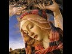

# The Blessed Virgin Mary in the Bible and Qur'an. (2021-03-01 00:00:11+00:00)

## Description

I read from 'Mary in the New Testament' by Professor Raymond E. Brown and others. https://www.amazon.co.uk/Mary-New-Testament-Raymond-Brown/dp/0809121689

https://www.patreon.com/Bloggingtheology?fan_landing=true

https://twitter.com/freemonotheist

## Full transcript with timestamps

[0:00:01](https://youtu.be/JJ4MU-8sN3E?t=1) in this video i want to look at the blessed virgin 
mary in the bible and quran from a slightly more    
[0:00:08](https://youtu.be/JJ4MU-8sN3E?t=8) academic uh perspective on a first reading of the 
gospels matthew mark luke and john it's tempting    
[0:00:16](https://youtu.be/JJ4MU-8sN3E?t=16) to take these stories at face value here are 
ancient texts that tell us what mary the mother    
[0:00:22](https://youtu.be/JJ4MU-8sN3E?t=22) of jesus said and did the historical reliability 
is usually assumed without question and this    
[0:00:29](https://youtu.be/JJ4MU-8sN3E?t=29) way of reading the gospels has been the norm in 
christian churches for the past two thousand years    
[0:00:35](https://youtu.be/JJ4MU-8sN3E?t=35) these days however such a reading of the gospels 
is no longer possible as we have seen in previous    
[0:00:41](https://youtu.be/JJ4MU-8sN3E?t=41) videos there are four gospels matthew mark luke 
and john and each has a different picture of jesus    
[0:00:47](https://youtu.be/JJ4MU-8sN3E?t=47) and his teaching it's illuminating to apply the 
same methodology to the gospel portraits of the    
[0:00:53](https://youtu.be/JJ4MU-8sN3E?t=53) virgin mary that we have seen employed with such 
powerful effect concerning the gospel portraits    
[0:00:59](https://youtu.be/JJ4MU-8sN3E?t=59) of jesus so i want to examine how the gospel 
writers depict mary the mother of jesus and    
[0:01:04](https://youtu.be/JJ4MU-8sN3E?t=64) then i'm going to go on to the quran the earliest 
surviving gospel that of mark portrays mary along    
[0:01:12](https://youtu.be/JJ4MU-8sN3E?t=72) with jesus brothers in a negative light placing 
them literally outside the circle of those who    
[0:01:20](https://youtu.be/JJ4MU-8sN3E?t=80) make up his family which is based on faith if you 
look at mark chapter 3 verses 20 onwards it says    
[0:01:28](https://youtu.be/JJ4MU-8sN3E?t=88) and the crowd came together again so that they 
could not even eat when his family heard it they    
[0:01:34](https://youtu.be/JJ4MU-8sN3E?t=94) went out to restrain him for people were saying he 
has gone out of his mind and the scribes came down    
[0:01:40](https://youtu.be/JJ4MU-8sN3E?t=100) from jerusalem said he has beelzebub as a demon 
and by the ruler of the demons he casts out demons    
[0:01:49](https://youtu.be/JJ4MU-8sN3E?t=109) and jesus called them to him and said and spoke 
to them in parables how come satan cast out satan    
[0:01:55](https://youtu.be/JJ4MU-8sN3E?t=115) if a kingdom is divided against itself that 
kingdom cannot stand and if a house is divided    
[0:02:02](https://youtu.be/JJ4MU-8sN3E?t=122) against itself that house will not be able 
to stand and if satan has risen up against    
[0:02:08](https://youtu.be/JJ4MU-8sN3E?t=128) himself and is divided he cannot stand but his end 
has come but no one can enter a strong man's house    
[0:02:16](https://youtu.be/JJ4MU-8sN3E?t=136) and plunder his property without first tying 
up the strong man then indeed the house can be    
[0:02:22](https://youtu.be/JJ4MU-8sN3E?t=142) plundered truly i tell you people will be forgiven 
for their sins and whatever blasphemies they utter    
[0:02:29](https://youtu.be/JJ4MU-8sN3E?t=149) but whoever blasphemes against the holy spirit can 
never be forgiven but is guilty of an eternal sin    
[0:02:37](https://youtu.be/JJ4MU-8sN3E?t=157) for they have said he has an unclean spirit then 
his mother and his brothers came and standing    
[0:02:45](https://youtu.be/JJ4MU-8sN3E?t=165) outside they sent sent to him and called him a 
crowd was sitting around him and they said to    
[0:02:52](https://youtu.be/JJ4MU-8sN3E?t=172) him your mother and your brothers and sisters are 
outside asking for you and jesus replied who are    
[0:02:59](https://youtu.be/JJ4MU-8sN3E?t=179) my mother and my brothers and looking at those 
who sat around him he said here are my mother    
[0:03:05](https://youtu.be/JJ4MU-8sN3E?t=185) and my brothers whoever does the will of god 
is my brother and sister and mother end quote    
[0:03:13](https://youtu.be/JJ4MU-8sN3E?t=193) the scholarly consensus is that mark was the first 
to be written matthew and luke then used markers    
[0:03:19](https://youtu.be/JJ4MU-8sN3E?t=199) as source as well as a hypothetical saying source 
known as q q is the first letter of the german    
[0:03:25](https://youtu.be/JJ4MU-8sN3E?t=205) word quell meaning source i think this is the 
most plausible explanation although a few scholars    
[0:03:31](https://youtu.be/JJ4MU-8sN3E?t=211) still disagree so matthew relies on mark as 
one of his sources but he clearly thought    
[0:03:38](https://youtu.be/JJ4MU-8sN3E?t=218) mark was inadequate and complete because 
sometimes matthew paraphrases mark sometimes    
[0:03:44](https://youtu.be/JJ4MU-8sN3E?t=224) he deliberately alters mark and this shows us 
that for mark so for matthew the facts could be    
[0:03:51](https://youtu.be/JJ4MU-8sN3E?t=231) changed to enhance his message a good example 
of this change is to note how matthew improves    
[0:03:58](https://youtu.be/JJ4MU-8sN3E?t=238) the negative portrayal of jesus mother and 
brothers in mark in the latter in mark they    
[0:04:04](https://youtu.be/JJ4MU-8sN3E?t=244) are shown as outsiders who think jesus is mad and 
they repeatedly fail to understand jesus message    
[0:04:13](https://youtu.be/JJ4MU-8sN3E?t=253) matthew however has a very different positive 
picture perhaps wanting to show the disciples    
[0:04:19](https://youtu.be/JJ4MU-8sN3E?t=259) as good role models for christians he is happy 
to change mark's narrative to fit his viewpoint    
[0:04:26](https://youtu.be/JJ4MU-8sN3E?t=266) he omits mark's negative story where mary and the 
brothers all try to restrain jesus because they    
[0:04:33](https://youtu.be/JJ4MU-8sN3E?t=273) thought he was out of his mind so it is clear 
that there has been some development in the way    
[0:04:40](https://youtu.be/JJ4MU-8sN3E?t=280) mary is portrayed in the gospels in matthew's 
gospel mark's negative betrayal is eliminated    
[0:04:48](https://youtu.be/JJ4MU-8sN3E?t=288) luke unlike mark also presents a highly positive 
portrait of mary and this is the gospel that    
[0:04:54](https://youtu.be/JJ4MU-8sN3E?t=294) catholics often go to for their devotions and 
understanding when they're praying the rosary    
[0:04:58](https://youtu.be/JJ4MU-8sN3E?t=298) for example it's luke's picture of a narrative of 
mary that they focus and reflect on in the scene    
[0:05:06](https://youtu.be/JJ4MU-8sN3E?t=306) parallel to marx with the brothers in the house 
she is now included in the eschatological family    
[0:05:13](https://youtu.be/JJ4MU-8sN3E?t=313) those who hear the word of god and do it just 
look up luke chapter 8 verse 19 20 and 21    
[0:05:20](https://youtu.be/JJ4MU-8sN3E?t=320) luke like matthew omits the embarrassing and 
offensive passage in mark chapter 3 verse 20 21    
[0:05:28](https://youtu.be/JJ4MU-8sN3E?t=328) in a groundbreaking ecumenical study a team of 
roman catholic anglican and protestant scholars    
[0:05:35](https://youtu.be/JJ4MU-8sN3E?t=335) collaborated in producing this agreed statement on 
mary's called mary in the new testament edited by    
[0:05:42](https://youtu.be/JJ4MU-8sN3E?t=342) some quite famous names if you know new testament 
studies raymond brown joseph fitzmeyer and others    
[0:05:48](https://youtu.be/JJ4MU-8sN3E?t=348) and this was published uh some years ago but 
i want to share with you their conclusions so    
[0:05:54](https://youtu.be/JJ4MU-8sN3E?t=354) this is quite unusual it has a roman catholic and 
protestant and anglican agreed statement on mary    
[0:06:00](https://youtu.be/JJ4MU-8sN3E?t=360) historically these churches have been literally at 
war with each other but now they can come together    
[0:06:05](https://youtu.be/JJ4MU-8sN3E?t=365) and produce this agreed consensus on the new 
testament's portrait of mary and they say in    
[0:06:13](https://youtu.be/JJ4MU-8sN3E?t=373) matthew's form of the passage in mark which we've 
seen is not that different from marx they say    
[0:06:21](https://youtu.be/JJ4MU-8sN3E?t=381) however it is not so much in the passage itself 
that matthew differs from mark but in the context    
[0:06:28](https://youtu.be/JJ4MU-8sN3E?t=388) the introductory scene in mark chapter 3 verse 
2021 in which his own think he is beside himself    
[0:06:36](https://youtu.be/JJ4MU-8sN3E?t=396) out of his mind is completely absent 
presumably they say the omission was deliberate    
[0:06:43](https://youtu.be/JJ4MU-8sN3E?t=403) and it can be understood if matthew interpreted 
marx his own to include jesus mother that's page    
[0:06:51](https://youtu.be/JJ4MU-8sN3E?t=411) 99 of the book the study concludes with 
this assessment of the synoptic gospels    
[0:06:57](https://youtu.be/JJ4MU-8sN3E?t=417) depiction of mary in other words how matthew 
mark and luke portray mary the mother of jesus    
[0:07:03](https://youtu.be/JJ4MU-8sN3E?t=423) we have spoken of a negative portrait of 
mary in the gospel of mark the principal    
[0:07:09](https://youtu.be/JJ4MU-8sN3E?t=429) text text which leads to that conclusion is 
mark 3 20-35 in matthew and luke's parallels    
[0:07:19](https://youtu.be/JJ4MU-8sN3E?t=439) to mark they give a rather different picture 
largely by modification of the mark and text    
[0:07:26](https://youtu.be/JJ4MU-8sN3E?t=446) both evangelists dropped the harsh introduction 
in mark 3 20-21 luke goes further in softening    
[0:07:34](https://youtu.be/JJ4MU-8sN3E?t=454) the marking picture by eliminating also the 
question of jesus who are my mother and brothers    
[0:07:41](https://youtu.be/JJ4MU-8sN3E?t=461) and by transferring the beelzebub controversy 
to another place entirely in luke chapter 11.    
[0:07:48](https://youtu.be/JJ4MU-8sN3E?t=468) thus in the synoptic depiction of mary during 
jesus ministry we have a development from the    
[0:07:54](https://youtu.be/JJ4MU-8sN3E?t=474) negative estimation of mark to the positive one 
of luke with matthew representing the middle term    
[0:08:01](https://youtu.be/JJ4MU-8sN3E?t=481) that's page 286 of this book so just to conclude 
the that kind of academic uh scholarly appraisal    
[0:08:12](https://youtu.be/JJ4MU-8sN3E?t=492) of the subject what are we to make then of 
the truth about mary now the gospel writers    
[0:08:18](https://youtu.be/JJ4MU-8sN3E?t=498) contradict each other matthew and luke contradict 
or disagree with mark what has god reliably told    
[0:08:26](https://youtu.be/JJ4MU-8sN3E?t=506) us about the mother of jesus and how are we to 
find out unfortunately the new testament gospels    
[0:08:32](https://youtu.be/JJ4MU-8sN3E?t=512) are not a reliable source of information at this 
point for its reasons they say different things    
[0:08:39](https://youtu.be/JJ4MU-8sN3E?t=519) muslims as we move on to the quran now 
muslims uh hold mary in the highest regard    
[0:08:46](https://youtu.be/JJ4MU-8sN3E?t=526) a chapter in the quran itself is named 
after her surah maryam or mary the surah    
[0:08:54](https://youtu.be/JJ4MU-8sN3E?t=534) about mary in fact believe it or not the quran 
refers to mary more often than the bible does    
[0:09:01](https://youtu.be/JJ4MU-8sN3E?t=541) in surah 3 42 it states the angel said to mary 
mary god has chosen you and made you pure he    
[0:09:12](https://youtu.be/JJ4MU-8sN3E?t=552) has chosen you above all women interesting so the 
quran absolutely agrees with shall we say luke's    
[0:09:19](https://youtu.be/JJ4MU-8sN3E?t=559) portrait of of a woman who is all generations will 
call me blessed that's a quote from luke's gospel    
[0:09:25](https://youtu.be/JJ4MU-8sN3E?t=565) the quran agrees with that high estimation of mary 
but disagrees with mark's uh negative portrait of    
[0:09:32](https://youtu.be/JJ4MU-8sN3E?t=572) mary so how can muslims navigate the way through 
the gospels what is the truth about mary how does    
[0:09:40](https://youtu.be/JJ4MU-8sN3E?t=580) the chronic revelation see itself in relation to 
the bible and this is a really interesting point    
[0:09:45](https://youtu.be/JJ4MU-8sN3E?t=585) i think god speaks to his prophet muhammad 
in the quran saying and unto thee o prophet    
[0:09:53](https://youtu.be/JJ4MU-8sN3E?t=593) we have vouchsafed this divine writ in other 
words the quran setting forth the truth    
[0:10:00](https://youtu.be/JJ4MU-8sN3E?t=600) confirming the truth or whatever there 
still remains of earlier revelations and    
[0:10:06](https://youtu.be/JJ4MU-8sN3E?t=606) determining what is true therein judge then 
between the followers of earlier revelation    
[0:10:12](https://youtu.be/JJ4MU-8sN3E?t=612) in accord with what is true herein sorry 
which we've got god has bestowed on high    
[0:10:20](https://youtu.be/JJ4MU-8sN3E?t=620) and do not follow their errant views forsaking the 
truth that has come unto thee that's surah 5 48.    
[0:10:29](https://youtu.be/JJ4MU-8sN3E?t=629) so um that is the quran's view but there's a 
further verse i just want to read to you which uh    
[0:10:36](https://youtu.be/JJ4MU-8sN3E?t=636) has been a source of misunderstanding but i think 
also is a fruitful insight into this whole issue    
[0:10:41](https://youtu.be/JJ4MU-8sN3E?t=641) in sir number five the feast verse 116 it says 
when god says jesus son of mary did you say to    
[0:10:51](https://youtu.be/JJ4MU-8sN3E?t=651) people take me and my mother as two gods alongside 
god he will say may you be exalted i would never    
[0:11:00](https://youtu.be/JJ4MU-8sN3E?t=660) say what i had no right to say if i had said 
such a thing you would have known it you know    
[0:11:06](https://youtu.be/JJ4MU-8sN3E?t=666) all that is within me though i do not know what is 
within you you alone have full knowledge of things    
[0:11:12](https://youtu.be/JJ4MU-8sN3E?t=672) unseen i told them only what you commanded 
me to worship god my lord and your lord    
[0:11:22](https://youtu.be/JJ4MU-8sN3E?t=682) i think it's very interesting here because uh 
christians not only follow luke's gospel most    
[0:11:27](https://youtu.be/JJ4MU-8sN3E?t=687) christians follow a more catholic understanding 
say as we see in the catholic church    
[0:11:32](https://youtu.be/JJ4MU-8sN3E?t=692) and in the orthodox church and they have exalted 
her with uh great titles as mother of god spouse    
[0:11:40](https://youtu.be/JJ4MU-8sN3E?t=700) of the holy spirit spouse means husband or wife 
literally the husband or wife of god queen of the    
[0:11:46](https://youtu.be/JJ4MU-8sN3E?t=706) universe that's another popular title in catholic 
devotions so she has acquired i would argue and    
[0:11:55](https://youtu.be/JJ4MU-8sN3E?t=715) the crown seems to say this a status as a divinity 
now formal catholic theology will tell you she is    
[0:12:03](https://youtu.be/JJ4MU-8sN3E?t=723) not a divinity i want to be quite clear about that 
but i think what the quran is doing and i i think    
[0:12:08](https://youtu.be/JJ4MU-8sN3E?t=728) i see the point here is that in practice in the 
prayer and the liturgies and the language used of    
[0:12:13](https://youtu.be/JJ4MU-8sN3E?t=733) her that prayer is directed to her petitions the 
helmet hail mary full of grace blessed art thou    
[0:12:19](https://youtu.be/JJ4MU-8sN3E?t=739) among women blesses the fruit of thy womb jesus 
these are actual prayers addressed to mary as uh    
[0:12:26](https://youtu.be/JJ4MU-8sN3E?t=746) as mother of god and i say she's called the queen 
of the universe spouse of the holy spirit ex and    
[0:12:31](https://youtu.be/JJ4MU-8sN3E?t=751) many many many other titles so the quran is saying 
here is rebuking uh implicitly those christians    
[0:12:39](https://youtu.be/JJ4MU-8sN3E?t=759) who take mary and jesus as two gods alongside 
gods you have god the father the creator of    
[0:12:46](https://youtu.be/JJ4MU-8sN3E?t=766) the universe but you also have an effect mary 
treated as divinity and her son also is proclaimed    
[0:12:52](https://youtu.be/JJ4MU-8sN3E?t=772) as a divinity and you see this in iconography 
in orthodox churches and statues you will see    
[0:12:57](https://youtu.be/JJ4MU-8sN3E?t=777) particularly in the there's stunning orthodox 
icons you'll see mary and jesus very often portray    
[0:13:03](https://youtu.be/JJ4MU-8sN3E?t=783) you and see the father portrayed and they and and 
those icons are prayed to and kissed and venerated    
[0:13:08](https://youtu.be/JJ4MU-8sN3E?t=788) as well so they are two gods alongside god i 
think the quran is using rhetorical language to uh    
[0:13:15](https://youtu.be/JJ4MU-8sN3E?t=795) criticize and deconstruct this kind of doxological 
prayer and liturgy that christians indulge in    
[0:13:24](https://youtu.be/JJ4MU-8sN3E?t=804) so there's not meant to be a a forensic study 
of christian theology this is as he says to    
[0:13:30](https://youtu.be/JJ4MU-8sN3E?t=810) jesus did you jesus then god says jesus did you 
say to people take me and my mother as two gods    
[0:13:38](https://youtu.be/JJ4MU-8sN3E?t=818) alongside god well of course not jesus didn't 
say that he said worship god alone but christians    
[0:13:44](https://youtu.be/JJ4MU-8sN3E?t=824) unfortunately have uh corrupted and changed that 
teaching and included when i say christians of    
[0:13:50](https://youtu.be/JJ4MU-8sN3E?t=830) course i'm not referring to evangelicals you 
do not in any way shape or form worship mary    
[0:13:55](https://youtu.be/JJ4MU-8sN3E?t=835) but most christians today and throughout 
history have been of a more catholic persuasion    
[0:14:00](https://youtu.be/JJ4MU-8sN3E?t=840) and they do invoke her in prayer they do pray 
to her they uh supplicate to her they invoke her    
[0:14:05](https://youtu.be/JJ4MU-8sN3E?t=845) as the queen of heaven and as the mother of god 
and i think that's what the quran is criticizing    
[0:14:11](https://youtu.be/JJ4MU-8sN3E?t=851) them for doing so i think that kind of sums up 
my my view all too briefly there's so much more    
[0:14:16](https://youtu.be/JJ4MU-8sN3E?t=856) i could have said uh rush through a little bit 
they just want to give you a more academic uh    
[0:14:22](https://youtu.be/JJ4MU-8sN3E?t=862) contribution towards this discussion uh uh 
from new testament scholars themselves and    
[0:14:28](https://youtu.be/JJ4MU-8sN3E?t=868) i think the fascinating contribution from 
the quran as to mary's true status as a pure    
[0:14:35](https://youtu.be/JJ4MU-8sN3E?t=875) noble woman but not as a divinity a 
quasi-divinity or natural divinity until next time  
