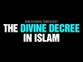

# The Divine Decree in Islam (2022-01-11)

## Description

Reconciling the Divine Decree and Free Will in Islam by Justin Parrott: https://yaqeeninstitute.org/read/paper/reconciling-the-divine-decree-and-free-will-in-islam
You Can Support My Work on Patreon:
https://www.patreon.com/Bloggingtheology

My Paypal Link: 
https://www.paypal.com/paypalme/bloggingtheology?locale.x=en_GB

## Summary of [The Divine Decree in Islam](https://www.youtube.com/watch?v=QvUy-KwRHBE)

*This summary is AI generated - there may be inaccuracies. *

### [00:00:00](https://www.youtube.com/watch?v=QvUy-KwRHBE&t=0) - [00:50:00](https://www.youtube.com/watch?v=QvUy-KwRHBE&t=3000)

The video discusses the concept of divine decree in Islam and how it applies to everyday life. It explains that each individual has a destiny, and that there is no escaping it. The video also discusses the importance of humility when understanding the unseen.

**[00:00:00](https://www.youtube.com/watch?v=QvUy-KwRHBE&t=0)** Justin Parratt's article "Reconciling the Divine Decree and Free Will in Islam" discusses the controversy surrounding the belief in divine decree or predestination in Islam. He argues that the two concepts – absolute power and sovereignty of Allah and human responsibility and free will – are not contradictory and can both be true at the same time, based on Qur'anic and Sunnah scripture.
* **[00:05:00](https://www.youtube.com/watch?v=QvUy-KwRHBE&t=300)** The author of this YouTube video discusses the concept of divine decree in Islam, which refers to the reality that allah has complete control over what is decreed from the beginning and what is later expunged. The author quotes two quran verses that refer to the decree in absolute terms and two verses that refer to modifications to the decree as it is brought into being. These two sets of texts appear to be contradictory at first, but are actually reconciled towards the united purpose of guiding us to right behavior with respect to allah and our fellow human beings.
* **[00:10:00](https://www.youtube.com/watch?v=QvUy-KwRHBE&t=600)** The author explains that all decisions made in life are written down by Allah before they happen. This includes everything from our destiny in this life to our ultimate fate in the hereafter. The prophet Muhammad said that the decree has already been made, and that good deeds are the only way to secure a good fate.
* **[00:15:00](https://www.youtube.com/watch?v=QvUy-KwRHBE&t=900)** The video discusses the difference between the will of desire and the will of enacting, and explains that the jaborites and the kadarites equated them both. The jaborites said that all existence was by decree and measure, and that it was loved and pleasing to Allah. The kadarites said that what is evil is not by the decree of Allah, which means it is decreed by some other power. The jaborites denied the moral responsibility of humankind, and the kadarites denied the full power of the creator. The truth is that our actions make a meaningful difference and can change the course of the decree. Submission to Allah is the key to success.
* **[00:20:00](https://www.youtube.com/watch?v=QvUy-KwRHBE&t=1200)** The article discusses the idea that what proceeds from knowledge of Allah does not change, and that what is allowed to change and be replaced is what appears to people as good or bad deeds performed by the doer. It points out that actions, intentions, prayers, and good deeds are the main factors in determining a person's fate, and that humans are held accountable for their deeds. It also mentions that the Quran and the Sunnah teach that humans have free will, and that what humans decide to do with their God-given will determines their fate.
* **[00:25:00](https://www.youtube.com/watch?v=QvUy-KwRHBE&t=1500)** This video discusses the Islamic belief that good deeds will lead to a brighter future, while evil deeds will lead to a darker future. It also discusses the idea that supplication (prayer) is the best way to resist the divine decree, and that the Prophet Muhammad himself supplicated to Allah for protection. Finally, it discusses the importance of family ties in the Islamic faith.
* **[00:30:00](https://www.youtube.com/watch?v=QvUy-KwRHBE&t=1800)** The author discusses the concept of divine decree in Islam and how it applies to everyday life. He points out that relying upon Allah for good fortune is not only a matter of trusting in Him, but also pursuing the correct causes. The author quotes from Ibn Hazm and Ibn Tamir, who explain that before a decree comes into being, the believer should seek refuge in Allah and call upon Him during that time. After the decree is fulfilled, the believer should be thankful and recognize that it was all due to Allah's will.
* **[00:35:00](https://www.youtube.com/watch?v=QvUy-KwRHBE&t=2100)** The Islamic belief is that there is a divine decree in life, and that it is important to be patient and content in the face of it, even if it is a blessing. If the decree is the result of one's actions, then one should seek forgiveness for those actions. If the decree is the result of sin, then one should work to make amends. Finally, even if the decree is something bad, the believer should praise Allah for it and move on.
* **[00:40:00](https://www.youtube.com/watch?v=QvUy-KwRHBE&t=2400)** The author provides a brief overview of the Islamic concept of "divine decree," highlighting that each individual has a destiny in either paradise or hellfire, and that there is no escaping it. He goes on to say that this concept can be difficult to understand due to our limitations in understanding time and space, and that it is important to avoid philosophizing about it excessively.
* **[00:45:00](https://www.youtube.com/watch?v=QvUy-KwRHBE&t=2700)** The video discusses the principle of divine providence in Islam, and how it can be understood through the literary images of the pen, the preserved tablet, and the record of deeds. According to the author, the deeper realities of providence are beyond the scope of our comprehension, and those who attempt to investigate it will be lost. In conclusion, the author stresses the importance of humility when understanding the unseen.
* **[00:50:00](https://www.youtube.com/watch?v=QvUy-KwRHBE&t=3000)** This article provides a reconciliation of the Divine Decree and free will in Islam. It outlines how the two concepts are intertwined and argues that success comes from Allah, not from free will.

## Full transcript with timestamps

[0:00:02](https://youtu.be/QvUy-KwRHBE?t=2) the idea of the divine decree or  
[0:00:05](https://youtu.be/QvUy-KwRHBE?t=5) predestination is a key belief in islam  
[0:00:09](https://youtu.be/QvUy-KwRHBE?t=9) and many people are perplexed by it  
[0:00:12](https://youtu.be/QvUy-KwRHBE?t=12) including myself and i came across a  
[0:00:15](https://youtu.be/QvUy-KwRHBE?t=15) really good academic article by a chat  
[0:00:18](https://youtu.be/QvUy-KwRHBE?t=18) called justin parratt  
[0:00:20](https://youtu.be/QvUy-KwRHBE?t=20) which i'll link to in the description  
[0:00:22](https://youtu.be/QvUy-KwRHBE?t=22) below and i want just to share with you  
[0:00:25](https://youtu.be/QvUy-KwRHBE?t=25) his thoughts  
[0:00:26](https://youtu.be/QvUy-KwRHBE?t=26) from the article because i think they're  
[0:00:29](https://youtu.be/QvUy-KwRHBE?t=29) very helpful it's clear it's  
[0:00:31](https://youtu.be/QvUy-KwRHBE?t=31) academically rigorous it's based on the  
[0:00:34](https://youtu.be/QvUy-KwRHBE?t=34) fundamental sources of islam the quran  
[0:00:37](https://youtu.be/QvUy-KwRHBE?t=37) and the sunnah so i'm going to read most  
[0:00:39](https://youtu.be/QvUy-KwRHBE?t=39) of it to you maybe intersperse it with  
[0:00:42](https://youtu.be/QvUy-KwRHBE?t=42) some of my own uh comments if applicable  
[0:00:45](https://youtu.be/QvUy-KwRHBE?t=45) so uh who is justin parrott well he's  
[0:00:47](https://youtu.be/QvUy-KwRHBE?t=47) currently research librarian at new york  
[0:00:50](https://youtu.be/QvUy-KwRHBE?t=50) university in abu dhabi and i think he  
[0:00:54](https://youtu.be/QvUy-KwRHBE?t=54) is a convert to islam  
[0:00:56](https://youtu.be/QvUy-KwRHBE?t=56) and his article which as i say i will  
[0:00:59](https://youtu.be/QvUy-KwRHBE?t=59) link to below is entitled  
[0:01:01](https://youtu.be/QvUy-KwRHBE?t=61) reconciling the divine decree  
[0:01:04](https://youtu.be/QvUy-KwRHBE?t=64) and free will in islam  
[0:01:08](https://youtu.be/QvUy-KwRHBE?t=68) and he begins the introduction  
[0:01:10](https://youtu.be/QvUy-KwRHBE?t=70) in the name of allah the gracious the  
[0:01:12](https://youtu.be/QvUy-KwRHBE?t=72) merciful  
[0:01:14](https://youtu.be/QvUy-KwRHBE?t=74) and he writes  
[0:01:15](https://youtu.be/QvUy-KwRHBE?t=75) the idea of divine providence also known  
[0:01:19](https://youtu.be/QvUy-KwRHBE?t=79) as the divine decree or predestination  
[0:01:23](https://youtu.be/QvUy-KwRHBE?t=83) that everything has already been decreed  
[0:01:26](https://youtu.be/QvUy-KwRHBE?t=86) by the creator from eternity  
[0:01:29](https://youtu.be/QvUy-KwRHBE?t=89) has troubled theologians and  
[0:01:31](https://youtu.be/QvUy-KwRHBE?t=91) philosophers for centuries and i might  
[0:01:34](https://youtu.be/QvUy-KwRHBE?t=94) add he's troubled christians and jews as  
[0:01:37](https://youtu.be/QvUy-KwRHBE?t=97) well everyone all the abrahamic faiths  
[0:01:40](https://youtu.be/QvUy-KwRHBE?t=100) have thought about this long and hard  
[0:01:43](https://youtu.be/QvUy-KwRHBE?t=103) how he writes can we reconcile the two  
[0:01:46](https://youtu.be/QvUy-KwRHBE?t=106) apparently contradictory facts that  
[0:01:49](https://youtu.be/QvUy-KwRHBE?t=109) allah has absolute power and sovereignty  
[0:01:53](https://youtu.be/QvUy-KwRHBE?t=113) over all creation  
[0:01:55](https://youtu.be/QvUy-KwRHBE?t=115) and  
[0:01:56](https://youtu.be/QvUy-KwRHBE?t=116) that at the same time  
[0:01:58](https://youtu.be/QvUy-KwRHBE?t=118) we are responsible for our actions  
[0:02:01](https://youtu.be/QvUy-KwRHBE?t=121) are we forced to do what we do or  
[0:02:04](https://youtu.be/QvUy-KwRHBE?t=124) are our choices meaningful okay so he  
[0:02:08](https://youtu.be/QvUy-KwRHBE?t=128) sets up the the subject very concisely  
[0:02:10](https://youtu.be/QvUy-KwRHBE?t=130) there  
[0:02:11](https://youtu.be/QvUy-KwRHBE?t=131) this question led to one of the earliest  
[0:02:14](https://youtu.be/QvUy-KwRHBE?t=134) sectarian schisms in the muslim  
[0:02:17](https://youtu.be/QvUy-KwRHBE?t=137) community between the kadyrites as they  
[0:02:20](https://youtu.be/QvUy-KwRHBE?t=140) were called who believed in absolute  
[0:02:23](https://youtu.be/QvUy-KwRHBE?t=143) human free will allah has no control  
[0:02:26](https://youtu.be/QvUy-KwRHBE?t=146) over us  
[0:02:27](https://youtu.be/QvUy-KwRHBE?t=147) and the jaborites who believed in  
[0:02:29](https://youtu.be/QvUy-KwRHBE?t=149) absolute determinism and fatalism  
[0:02:33](https://youtu.be/QvUy-KwRHBE?t=153) so we have no control over our actions  
[0:02:36](https://youtu.be/QvUy-KwRHBE?t=156) no free will  
[0:02:38](https://youtu.be/QvUy-KwRHBE?t=158) each of these groups developed an  
[0:02:39](https://youtu.be/QvUy-KwRHBE?t=159) extreme and misguided theology  
[0:02:43](https://youtu.be/QvUy-KwRHBE?t=163) if allah has no control then why call  
[0:02:46](https://youtu.be/QvUy-KwRHBE?t=166) upon allah in prayer  
[0:02:48](https://youtu.be/QvUy-KwRHBE?t=168) and  
[0:02:49](https://youtu.be/QvUy-KwRHBE?t=169) if we have no control over our actions  
[0:02:52](https://youtu.be/QvUy-KwRHBE?t=172) and fate  
[0:02:53](https://youtu.be/QvUy-KwRHBE?t=173) why do any good deeds at all  
[0:02:58](https://youtu.be/QvUy-KwRHBE?t=178) not only was this question a sharp  
[0:03:00](https://youtu.be/QvUy-KwRHBE?t=180) controversy in  
[0:03:02](https://youtu.be/QvUy-KwRHBE?t=182) early islamic history it has been an  
[0:03:04](https://youtu.be/QvUy-KwRHBE?t=184) important issue throughout history for  
[0:03:06](https://youtu.be/QvUy-KwRHBE?t=186) both religious and secular reasons  
[0:03:10](https://youtu.be/QvUy-KwRHBE?t=190) the ancient greek philosopher aristotle  
[0:03:13](https://youtu.be/QvUy-KwRHBE?t=193) wrote seriously on the topic over two  
[0:03:15](https://youtu.be/QvUy-KwRHBE?t=195) and a half thousand years ago because of  
[0:03:18](https://youtu.be/QvUy-KwRHBE?t=198) its implications for understanding  
[0:03:20](https://youtu.be/QvUy-KwRHBE?t=200) ordering the universe the origin of life  
[0:03:23](https://youtu.be/QvUy-KwRHBE?t=203) human freedom and happiness  
[0:03:26](https://youtu.be/QvUy-KwRHBE?t=206) today it is the subject of complex  
[0:03:29](https://youtu.be/QvUy-KwRHBE?t=209) academic debate  
[0:03:30](https://youtu.be/QvUy-KwRHBE?t=210) under the heading of determinism  
[0:03:33](https://youtu.be/QvUy-KwRHBE?t=213) determinism  
[0:03:34](https://youtu.be/QvUy-KwRHBE?t=214) in scientific disciplines such as maths  
[0:03:36](https://youtu.be/QvUy-KwRHBE?t=216) physics biology psychology and in social  
[0:03:40](https://youtu.be/QvUy-KwRHBE?t=220) sciences as well  
[0:03:41](https://youtu.be/QvUy-KwRHBE?t=221) clearly our understanding of destiny  
[0:03:44](https://youtu.be/QvUy-KwRHBE?t=224) plays a decisive role in both our view  
[0:03:47](https://youtu.be/QvUy-KwRHBE?t=227) of the world and perhaps more  
[0:03:49](https://youtu.be/QvUy-KwRHBE?t=229) importantly our behavior in it  
[0:03:52](https://youtu.be/QvUy-KwRHBE?t=232) muslims have also experienced doubts in  
[0:03:55](https://youtu.be/QvUy-KwRHBE?t=235) their faith  
[0:03:57](https://youtu.be/QvUy-KwRHBE?t=237) due to the myriad of philosophical  
[0:03:59](https://youtu.be/QvUy-KwRHBE?t=239) conundrums that arise from it  
[0:04:02](https://youtu.be/QvUy-KwRHBE?t=242) so it can cause quite a lot of  
[0:04:03](https://youtu.be/QvUy-KwRHBE?t=243) intellectual even existential angst it  
[0:04:06](https://youtu.be/QvUy-KwRHBE?t=246) seems  
[0:04:07](https://youtu.be/QvUy-KwRHBE?t=247) so how does islam solve the riddle and  
[0:04:10](https://youtu.be/QvUy-KwRHBE?t=250) that's the purpose of justin's paper  
[0:04:14](https://youtu.be/QvUy-KwRHBE?t=254) he writes the quran and sunnah take a  
[0:04:17](https://youtu.be/QvUy-KwRHBE?t=257) middle path  
[0:04:19](https://youtu.be/QvUy-KwRHBE?t=259) between the historical extremes  
[0:04:21](https://youtu.be/QvUy-KwRHBE?t=261) upholding both the sovereignty of allah  
[0:04:25](https://youtu.be/QvUy-KwRHBE?t=265) and the responsibility of mankind  
[0:04:29](https://youtu.be/QvUy-KwRHBE?t=269) from a purely rational standpoint these  
[0:04:32](https://youtu.be/QvUy-KwRHBE?t=272) two aspects seem mutually exclusive  
[0:04:37](https://youtu.be/QvUy-KwRHBE?t=277) in other words it seems they both cannot  
[0:04:39](https://youtu.be/QvUy-KwRHBE?t=279) be true at the same time  
[0:04:42](https://youtu.be/QvUy-KwRHBE?t=282) however we have to remember that allah  
[0:04:45](https://youtu.be/QvUy-KwRHBE?t=285) exists outside  
[0:04:48](https://youtu.be/QvUy-KwRHBE?t=288) of time and space  
[0:04:50](https://youtu.be/QvUy-KwRHBE?t=290) beyond the cosmic veil  
[0:04:52](https://youtu.be/QvUy-KwRHBE?t=292) in the unseen  
[0:04:54](https://youtu.be/QvUy-KwRHBE?t=294) by contrast we human beings can only  
[0:04:58](https://youtu.be/QvUy-KwRHBE?t=298) conceive of realities within the  
[0:05:00](https://youtu.be/QvUy-KwRHBE?t=300) framework of time and space so we're  
[0:05:03](https://youtu.be/QvUy-KwRHBE?t=303) limited by our creaturely uh three  
[0:05:06](https://youtu.be/QvUy-KwRHBE?t=306) dimensions in our space-time continuum  
[0:05:08](https://youtu.be/QvUy-KwRHBE?t=308) that we inhabit we can't think outside  
[0:05:10](https://youtu.be/QvUy-KwRHBE?t=310) of the box basically i think justin is  
[0:05:12](https://youtu.be/QvUy-KwRHBE?t=312) saying  
[0:05:13](https://youtu.be/QvUy-KwRHBE?t=313) divine providence or predestination is a  
[0:05:16](https://youtu.be/QvUy-KwRHBE?t=316) reality that exists beyond time and  
[0:05:20](https://youtu.be/QvUy-KwRHBE?t=320) space which means we are simply  
[0:05:22](https://youtu.be/QvUy-KwRHBE?t=322) incapable of conceiving it with our  
[0:05:26](https://youtu.be/QvUy-KwRHBE?t=326) limited rational faculties so he's  
[0:05:29](https://youtu.be/QvUy-KwRHBE?t=329) already setting up here that we we need  
[0:05:31](https://youtu.be/QvUy-KwRHBE?t=331) to adopt humble attitude we can't know  
[0:05:34](https://youtu.be/QvUy-KwRHBE?t=334) everything he says  
[0:05:35](https://youtu.be/QvUy-KwRHBE?t=335) for this reason allah communicated the  
[0:05:39](https://youtu.be/QvUy-KwRHBE?t=339) reality of providence using the tools of  
[0:05:42](https://youtu.be/QvUy-KwRHBE?t=342) language in particular he writes  
[0:05:45](https://youtu.be/QvUy-KwRHBE?t=345) literary imagery  
[0:05:47](https://youtu.be/QvUy-KwRHBE?t=347) these images are  
[0:05:49](https://youtu.be/QvUy-KwRHBE?t=349) the pen  
[0:05:51](https://youtu.be/QvUy-KwRHBE?t=351) the preserved tablet  
[0:05:53](https://youtu.be/QvUy-KwRHBE?t=353) and the angelic records of deeds now i  
[0:05:56](https://youtu.be/QvUy-KwRHBE?t=356) wasn't aware this is particularly  
[0:05:58](https://youtu.be/QvUy-KwRHBE?t=358) interesting these three images  
[0:06:01](https://youtu.be/QvUy-KwRHBE?t=361) they articulate the nature of providence  
[0:06:04](https://youtu.be/QvUy-KwRHBE?t=364) that allah has complete control over  
[0:06:06](https://youtu.be/QvUy-KwRHBE?t=366) what is decreed  
[0:06:08](https://youtu.be/QvUy-KwRHBE?t=368) from the beginning and what is later  
[0:06:11](https://youtu.be/QvUy-KwRHBE?t=371) expunged  
[0:06:13](https://youtu.be/QvUy-KwRHBE?t=373) they are images that are not fictional  
[0:06:16](https://youtu.be/QvUy-KwRHBE?t=376) nor merely metaphorical on the contrary  
[0:06:19](https://youtu.be/QvUy-KwRHBE?t=379) they constitute profound truths in the  
[0:06:22](https://youtu.be/QvUy-KwRHBE?t=382) universe and are realities in themselves  
[0:06:25](https://youtu.be/QvUy-KwRHBE?t=385) so these are not  
[0:06:27](https://youtu.be/QvUy-KwRHBE?t=387) just mere figures of speeches or  
[0:06:29](https://youtu.be/QvUy-KwRHBE?t=389) convenient myths or just just those  
[0:06:31](https://youtu.be/QvUy-KwRHBE?t=391) stories these are profoundly true he  
[0:06:34](https://youtu.be/QvUy-KwRHBE?t=394) says  
[0:06:35](https://youtu.be/QvUy-KwRHBE?t=395) while all things have already been  
[0:06:38](https://youtu.be/QvUy-KwRHBE?t=398) decreed from eternity  
[0:06:40](https://youtu.be/QvUy-KwRHBE?t=400) allah has the power to change destiny  
[0:06:44](https://youtu.be/QvUy-KwRHBE?t=404) based upon the choices we make  
[0:06:46](https://youtu.be/QvUy-KwRHBE?t=406) we are indeed morally responsible for  
[0:06:49](https://youtu.be/QvUy-KwRHBE?t=409) our actions and our free will has  
[0:06:51](https://youtu.be/QvUy-KwRHBE?t=411) associated with it a measure of control  
[0:06:56](https://youtu.be/QvUy-KwRHBE?t=416) limited under the sovereignty of allah  
[0:06:58](https://youtu.be/QvUy-KwRHBE?t=418) to determine our ultimate fate  
[0:07:02](https://youtu.be/QvUy-KwRHBE?t=422) now the nature of divine providence  
[0:07:06](https://youtu.be/QvUy-KwRHBE?t=426) the term for divine providence in islam  
[0:07:09](https://youtu.be/QvUy-KwRHBE?t=429) is  
[0:07:13](https://youtu.be/QvUy-KwRHBE?t=433) literally the decree and the measure the  
[0:07:16](https://youtu.be/QvUy-KwRHBE?t=436) decree and the measure  
[0:07:18](https://youtu.be/QvUy-KwRHBE?t=438) it is a combination of two terms which  
[0:07:21](https://youtu.be/QvUy-KwRHBE?t=441) signifies the dual aspects of providence  
[0:07:26](https://youtu.be/QvUy-KwRHBE?t=446) ibn hajar writes quote  
[0:07:29](https://youtu.be/QvUy-KwRHBE?t=449) the scholars said the divine  
[0:07:31](https://youtu.be/QvUy-KwRHBE?t=451) decree  
[0:07:32](https://youtu.be/QvUy-KwRHBE?t=452) al-qaeda  
[0:07:34](https://youtu.be/QvUy-KwRHBE?t=454) consists of the entire and complete  
[0:07:37](https://youtu.be/QvUy-KwRHBE?t=457) judgment forever  
[0:07:39](https://youtu.be/QvUy-KwRHBE?t=459) and the divine measurement al-qaeda  
[0:07:42](https://youtu.be/QvUy-KwRHBE?t=462) consists of the particulars of judgment  
[0:07:45](https://youtu.be/QvUy-KwRHBE?t=465) and its details  
[0:07:48](https://youtu.be/QvUy-KwRHBE?t=468) end quote  
[0:07:50](https://youtu.be/QvUy-KwRHBE?t=470) although scholars sometimes define the  
[0:07:52](https://youtu.be/QvUy-KwRHBE?t=472) terms differently the definition offered  
[0:07:55](https://youtu.be/QvUy-KwRHBE?t=475) here is based upon two sets of texts in  
[0:07:59](https://youtu.be/QvUy-KwRHBE?t=479) the quran and the sunnah  
[0:08:01](https://youtu.be/QvUy-KwRHBE?t=481) texts that speak of the decree in  
[0:08:04](https://youtu.be/QvUy-KwRHBE?t=484) absolute and unchanging terms  
[0:08:08](https://youtu.be/QvUy-KwRHBE?t=488) and texts that speak of modifications to  
[0:08:11](https://youtu.be/QvUy-KwRHBE?t=491) the decree as it is brought into being  
[0:08:16](https://youtu.be/QvUy-KwRHBE?t=496) these two sets of texts seem  
[0:08:18](https://youtu.be/QvUy-KwRHBE?t=498) contradictory on their face in other  
[0:08:21](https://youtu.be/QvUy-KwRHBE?t=501) words on the surface they appear to be  
[0:08:23](https://youtu.be/QvUy-KwRHBE?t=503) so yet they are aspects of the same  
[0:08:26](https://youtu.be/QvUy-KwRHBE?t=506) reality whose apparent contradiction is  
[0:08:30](https://youtu.be/QvUy-KwRHBE?t=510) only the result of the human mind's  
[0:08:33](https://youtu.be/QvUy-KwRHBE?t=513) limited frame of reference so we're  
[0:08:36](https://youtu.be/QvUy-KwRHBE?t=516) really constricted by our the dunya  
[0:08:39](https://youtu.be/QvUy-KwRHBE?t=519) createdness we cannot see beyond that  
[0:08:41](https://youtu.be/QvUy-KwRHBE?t=521) with our own capabilities  
[0:08:43](https://youtu.be/QvUy-KwRHBE?t=523) each and each set of texts which he's  
[0:08:46](https://youtu.be/QvUy-KwRHBE?t=526) going to quote now  
[0:08:48](https://youtu.be/QvUy-KwRHBE?t=528) is reconciled towards the united purpose  
[0:08:51](https://youtu.be/QvUy-KwRHBE?t=531) of guiding us to right behavior with  
[0:08:55](https://youtu.be/QvUy-KwRHBE?t=535) respect to allah and to our fellow human  
[0:08:58](https://youtu.be/QvUy-KwRHBE?t=538) beings  
[0:09:00](https://youtu.be/QvUy-KwRHBE?t=540) the idea of the unchanging decree is  
[0:09:03](https://youtu.be/QvUy-KwRHBE?t=543) embodied in the literary image of the  
[0:09:06](https://youtu.be/QvUy-KwRHBE?t=546) preserved tablet  
[0:09:08](https://youtu.be/QvUy-KwRHBE?t=548) which contains everything that will come  
[0:09:10](https://youtu.be/QvUy-KwRHBE?t=550) to be  
[0:09:11](https://youtu.be/QvUy-KwRHBE?t=551) including the divine scriptures  
[0:09:14](https://youtu.be/QvUy-KwRHBE?t=554) allah said  
[0:09:16](https://youtu.be/QvUy-KwRHBE?t=556) this is truly a glorious quran written  
[0:09:20](https://youtu.be/QvUy-KwRHBE?t=560) on a preserved tablet at surah 85 21  
[0:09:25](https://youtu.be/QvUy-KwRHBE?t=565) the term conveys the absolute reality of  
[0:09:28](https://youtu.be/QvUy-KwRHBE?t=568) divine providence through a mental  
[0:09:30](https://youtu.be/QvUy-KwRHBE?t=570) representation of a thing a tablet  
[0:09:34](https://youtu.be/QvUy-KwRHBE?t=574) with which we are already familiar even  
[0:09:36](https://youtu.be/QvUy-KwRHBE?t=576) though the preserved tablet is unlike  
[0:09:39](https://youtu.be/QvUy-KwRHBE?t=579) any tablet we have known  
[0:09:43](https://youtu.be/QvUy-KwRHBE?t=583) the implication of the preserved tablet  
[0:09:46](https://youtu.be/QvUy-KwRHBE?t=586) is that allah knows all things before  
[0:09:48](https://youtu.be/QvUy-KwRHBE?t=588) they come into existence  
[0:09:52](https://youtu.be/QvUy-KwRHBE?t=592) allah said are you prophet not aware  
[0:09:55](https://youtu.be/QvUy-KwRHBE?t=595) that god knows all that is in the  
[0:09:57](https://youtu.be/QvUy-KwRHBE?t=597) heavens and earth  
[0:10:00](https://youtu.be/QvUy-KwRHBE?t=600) all this is written in a record this is  
[0:10:03](https://youtu.be/QvUy-KwRHBE?t=603) easy for god  
[0:10:05](https://youtu.be/QvUy-KwRHBE?t=605) surah 22 70.  
[0:10:07](https://youtu.be/QvUy-KwRHBE?t=607) and the prophet upon whom bp said  
[0:10:10](https://youtu.be/QvUy-KwRHBE?t=610) verily allah almighty created his  
[0:10:13](https://youtu.be/QvUy-KwRHBE?t=613) creation in darkness and he cast over  
[0:10:16](https://youtu.be/QvUy-KwRHBE?t=616) them his light whoever is troubled by  
[0:10:19](https://youtu.be/QvUy-KwRHBE?t=619) that light sorry whoever is touched by  
[0:10:22](https://youtu.be/QvUy-KwRHBE?t=622) that light is guided  
[0:10:24](https://youtu.be/QvUy-KwRHBE?t=624) and whoever misses it is astray  
[0:10:28](https://youtu.be/QvUy-KwRHBE?t=628) thus i say the pens have been dried upon  
[0:10:31](https://youtu.be/QvUy-KwRHBE?t=631) the knowledge of allah  
[0:10:34](https://youtu.be/QvUy-KwRHBE?t=634) end quote  
[0:10:35](https://youtu.be/QvUy-KwRHBE?t=635) not only does allah know what will be he  
[0:10:38](https://youtu.be/QvUy-KwRHBE?t=638) has full control and power over what he  
[0:10:41](https://youtu.be/QvUy-KwRHBE?t=641) allows to come into existence  
[0:10:44](https://youtu.be/QvUy-KwRHBE?t=644) he can allow or block anything from ever  
[0:10:48](https://youtu.be/QvUy-KwRHBE?t=648) occurring  
[0:10:50](https://youtu.be/QvUy-KwRHBE?t=650) allah said  
[0:10:51](https://youtu.be/QvUy-KwRHBE?t=651) it is he who has control over the  
[0:10:54](https://youtu.be/QvUy-KwRHBE?t=654) heavens and earth and has no offspring  
[0:10:58](https://youtu.be/QvUy-KwRHBE?t=658) no one shares control with him  
[0:11:00](https://youtu.be/QvUy-KwRHBE?t=660) and who created all things and made them  
[0:11:03](https://youtu.be/QvUy-KwRHBE?t=663) to an exact measure  
[0:11:05](https://youtu.be/QvUy-KwRHBE?t=665) sure 25 2  
[0:11:08](https://youtu.be/QvUy-KwRHBE?t=668) moreover the provision lifespan deeds  
[0:11:11](https://youtu.be/QvUy-KwRHBE?t=671) and ultimate fate in the hereafter of  
[0:11:14](https://youtu.be/QvUy-KwRHBE?t=674) every human being are written by the  
[0:11:18](https://youtu.be/QvUy-KwRHBE?t=678) angels as soon as the soul is blown into  
[0:11:21](https://youtu.be/QvUy-KwRHBE?t=681) the fetus  
[0:11:22](https://youtu.be/QvUy-KwRHBE?t=682) our destiny is decreed for us even  
[0:11:25](https://youtu.be/QvUy-KwRHBE?t=685) before we were born  
[0:11:27](https://youtu.be/QvUy-KwRHBE?t=687) the prophet upon whom be peace said and  
[0:11:29](https://youtu.be/QvUy-KwRHBE?t=689) this is a a marvelous hadith i think  
[0:11:32](https://youtu.be/QvUy-KwRHBE?t=692) from bukhari  
[0:11:33](https://youtu.be/QvUy-KwRHBE?t=693) the creation of each one of you is in  
[0:11:36](https://youtu.be/QvUy-KwRHBE?t=696) his mother's womb for 40 days or nights  
[0:11:39](https://youtu.be/QvUy-KwRHBE?t=699) then as a clot for a similar period then  
[0:11:42](https://youtu.be/QvUy-KwRHBE?t=702) as a piece of flesh for a similar period  
[0:11:46](https://youtu.be/QvUy-KwRHBE?t=706) then the angel is sent to it to announce  
[0:11:49](https://youtu.be/QvUy-KwRHBE?t=709) four decrees  
[0:11:51](https://youtu.be/QvUy-KwRHBE?t=711) he writes his provision his lifespan his  
[0:11:54](https://youtu.be/QvUy-KwRHBE?t=714) deeds and whether he is blessed or  
[0:11:57](https://youtu.be/QvUy-KwRHBE?t=717) damned  
[0:11:59](https://youtu.be/QvUy-KwRHBE?t=719) then he breathes the soul into it  
[0:12:02](https://youtu.be/QvUy-KwRHBE?t=722) verily one of you acts with the deeds of  
[0:12:05](https://youtu.be/QvUy-KwRHBE?t=725) the people of paradise until he is not  
[0:12:08](https://youtu.be/QvUy-KwRHBE?t=728) bat an arm's length away from it  
[0:12:11](https://youtu.be/QvUy-KwRHBE?t=731) yet the decree overtakes him he acts  
[0:12:14](https://youtu.be/QvUy-KwRHBE?t=734) with the people of the  
[0:12:15](https://youtu.be/QvUy-KwRHBE?t=735) acts with the deeds of the people of  
[0:12:18](https://youtu.be/QvUy-KwRHBE?t=738) hell fire and thus enters hellfire  
[0:12:22](https://youtu.be/QvUy-KwRHBE?t=742) and one of you acts with the deeds of  
[0:12:24](https://youtu.be/QvUy-KwRHBE?t=744) the people of hellfire until he is not  
[0:12:27](https://youtu.be/QvUy-KwRHBE?t=747) but an arm's length away from it  
[0:12:30](https://youtu.be/QvUy-KwRHBE?t=750) yet the decree overtakes him and he acts  
[0:12:34](https://youtu.be/QvUy-KwRHBE?t=754) with the deeds of the people of paradise  
[0:12:36](https://youtu.be/QvUy-KwRHBE?t=756) and thus enters it end quote  
[0:12:41](https://youtu.be/QvUy-KwRHBE?t=761) we are set upon a path with our fate  
[0:12:43](https://youtu.be/QvUy-KwRHBE?t=763) ahead of us as soon as we enter this  
[0:12:46](https://youtu.be/QvUy-KwRHBE?t=766) world  
[0:12:47](https://youtu.be/QvUy-KwRHBE?t=767) yet our will and our actions are  
[0:12:50](https://youtu.be/QvUy-KwRHBE?t=770) meaningful because by allah's will  
[0:12:54](https://youtu.be/QvUy-KwRHBE?t=774) they are the causes of changing course  
[0:12:58](https://youtu.be/QvUy-KwRHBE?t=778) they are the causes of changing course  
[0:13:02](https://youtu.be/QvUy-KwRHBE?t=782) since allah is in control of destiny the  
[0:13:05](https://youtu.be/QvUy-KwRHBE?t=785) only way to secure a good fate is to  
[0:13:08](https://youtu.be/QvUy-KwRHBE?t=788) appeal to allah through worship prayer  
[0:13:11](https://youtu.be/QvUy-KwRHBE?t=791) and good deeds  
[0:13:14](https://youtu.be/QvUy-KwRHBE?t=794) we have no control by ourselves  
[0:13:17](https://youtu.be/QvUy-KwRHBE?t=797) in this sense the pens have been lifted  
[0:13:20](https://youtu.be/QvUy-KwRHBE?t=800) and the pages have dried  
[0:13:23](https://youtu.be/QvUy-KwRHBE?t=803) the prophet upon whom be peace said  
[0:13:26](https://youtu.be/QvUy-KwRHBE?t=806) be mindful of allah and he will protect  
[0:13:29](https://youtu.be/QvUy-KwRHBE?t=809) you be mindful of allah and you will  
[0:13:32](https://youtu.be/QvUy-KwRHBE?t=812) find him before you if you ask ask of  
[0:13:36](https://youtu.be/QvUy-KwRHBE?t=816) allah if you seek help seek help from  
[0:13:39](https://youtu.be/QvUy-KwRHBE?t=819) allah  
[0:13:41](https://youtu.be/QvUy-KwRHBE?t=821) know that if the nations gather together  
[0:13:43](https://youtu.be/QvUy-KwRHBE?t=823) to benefit you  
[0:13:45](https://youtu.be/QvUy-KwRHBE?t=825) they will not benefit you unless allah  
[0:13:48](https://youtu.be/QvUy-KwRHBE?t=828) has decreed it for you  
[0:13:50](https://youtu.be/QvUy-KwRHBE?t=830) and if the nations gather together to  
[0:13:52](https://youtu.be/QvUy-KwRHBE?t=832) harm you they will not harm you unless  
[0:13:56](https://youtu.be/QvUy-KwRHBE?t=836) allah has decreed it for you  
[0:13:59](https://youtu.be/QvUy-KwRHBE?t=839) the pens have been lifted and the pages  
[0:14:02](https://youtu.be/QvUy-KwRHBE?t=842) have dried  
[0:14:04](https://youtu.be/QvUy-KwRHBE?t=844) that's a hadith from al termiti  
[0:14:08](https://youtu.be/QvUy-KwRHBE?t=848) notice that in this hadith the prophet  
[0:14:10](https://youtu.be/QvUy-KwRHBE?t=850) informed us through his companion ibn  
[0:14:13](https://youtu.be/QvUy-KwRHBE?t=853) abbas  
[0:14:14](https://youtu.be/QvUy-KwRHBE?t=854) that the decree has already been made  
[0:14:18](https://youtu.be/QvUy-KwRHBE?t=858) the pages have been dried even so the  
[0:14:21](https://youtu.be/QvUy-KwRHBE?t=861) prophet prescribed action to be mindful  
[0:14:24](https://youtu.be/QvUy-KwRHBE?t=864) of allah and to seek help from allah  
[0:14:28](https://youtu.be/QvUy-KwRHBE?t=868) the important point is to understand the  
[0:14:31](https://youtu.be/QvUy-KwRHBE?t=871) important point to understand is that  
[0:14:33](https://youtu.be/QvUy-KwRHBE?t=873) everything happens by the will of allah  
[0:14:37](https://youtu.be/QvUy-KwRHBE?t=877) despite allah not being pleased with  
[0:14:40](https://youtu.be/QvUy-KwRHBE?t=880) everything that is allowed to happen now  
[0:14:42](https://youtu.be/QvUy-KwRHBE?t=882) this is a really interesting point here  
[0:14:44](https://youtu.be/QvUy-KwRHBE?t=884) that justin makes in this paragraph  
[0:14:46](https://youtu.be/QvUy-KwRHBE?t=886) something i wasn't familiar with at all  
[0:14:48](https://youtu.be/QvUy-KwRHBE?t=888) there are two ways in which the will of  
[0:14:51](https://youtu.be/QvUy-KwRHBE?t=891) allah is understood  
[0:14:54](https://youtu.be/QvUy-KwRHBE?t=894) the universal will  
[0:14:56](https://youtu.be/QvUy-KwRHBE?t=896) and the legislative will the universal  
[0:14:59](https://youtu.be/QvUy-KwRHBE?t=899) and the legislative will  
[0:15:01](https://youtu.be/QvUy-KwRHBE?t=901) the universal will encompasses  
[0:15:03](https://youtu.be/QvUy-KwRHBE?t=903) everything that is allowed to be both  
[0:15:05](https://youtu.be/QvUy-KwRHBE?t=905) good and evil  
[0:15:07](https://youtu.be/QvUy-KwRHBE?t=907) the legislative will consists of what  
[0:15:10](https://youtu.be/QvUy-KwRHBE?t=910) allah wants from us  
[0:15:12](https://youtu.be/QvUy-KwRHBE?t=912) of good deeds  
[0:15:15](https://youtu.be/QvUy-KwRHBE?t=915) ibn abi al-is the commentator on the  
[0:15:18](https://youtu.be/QvUy-KwRHBE?t=918) early and agreed-upon creed of al-tahawi  
[0:15:22](https://youtu.be/QvUy-KwRHBE?t=922) writes quote  
[0:15:24](https://youtu.be/QvUy-KwRHBE?t=924) the researchers among allah say that  
[0:15:28](https://youtu.be/QvUy-KwRHBE?t=928) will  
[0:15:29](https://youtu.be/QvUy-KwRHBE?t=929) in the book of allah is two types  
[0:15:32](https://youtu.be/QvUy-KwRHBE?t=932) a will that is preordained universal and  
[0:15:36](https://youtu.be/QvUy-KwRHBE?t=936) creative  
[0:15:37](https://youtu.be/QvUy-KwRHBE?t=937) and a world that is religious  
[0:15:40](https://youtu.be/QvUy-KwRHBE?t=940) commanding and legislating  
[0:15:43](https://youtu.be/QvUy-KwRHBE?t=943) thus  
[0:15:44](https://youtu.be/QvUy-KwRHBE?t=944) the legislative will includes what allah  
[0:15:47](https://youtu.be/QvUy-KwRHBE?t=947) loves and is pleased with  
[0:15:49](https://youtu.be/QvUy-KwRHBE?t=949) and the universal will is what is willed  
[0:15:52](https://youtu.be/QvUy-KwRHBE?t=952) including all things that occur  
[0:15:56](https://youtu.be/QvUy-KwRHBE?t=956) end quote  
[0:15:58](https://youtu.be/QvUy-KwRHBE?t=958) the confusion that led to sectarianism  
[0:16:01](https://youtu.be/QvUy-KwRHBE?t=961) in early islamic history was due to the  
[0:16:04](https://youtu.be/QvUy-KwRHBE?t=964) caddorites and jaborites failure to  
[0:16:07](https://youtu.be/QvUy-KwRHBE?t=967) understand this point  
[0:16:10](https://youtu.be/QvUy-KwRHBE?t=970) ibn abi al-is continues  
[0:16:14](https://youtu.be/QvUy-KwRHBE?t=974) the origin of the error is from equating  
[0:16:17](https://youtu.be/QvUy-KwRHBE?t=977) between the will of desire and the will  
[0:16:19](https://youtu.be/QvUy-KwRHBE?t=979) of enacting  
[0:16:21](https://youtu.be/QvUy-KwRHBE?t=981) and between love and pleasure thus the  
[0:16:24](https://youtu.be/QvUy-KwRHBE?t=984) jaborites and the kadarites equate them  
[0:16:27](https://youtu.be/QvUy-KwRHBE?t=987) both then they disagree  
[0:16:29](https://youtu.be/QvUy-KwRHBE?t=989) the jaborites said all of existence is  
[0:16:32](https://youtu.be/QvUy-KwRHBE?t=992) by decree and measure  
[0:16:34](https://youtu.be/QvUy-KwRHBE?t=994) so it is loved and pleasing to allah the  
[0:16:38](https://youtu.be/QvUy-KwRHBE?t=998) cadre said sinful disobedience is not  
[0:16:41](https://youtu.be/QvUy-KwRHBE?t=1001) beloved and pleasing to allah so it  
[0:16:44](https://youtu.be/QvUy-KwRHBE?t=1004) cannot be ordained and decreed by him  
[0:16:48](https://youtu.be/QvUy-KwRHBE?t=1008) it is outside of his will and creation  
[0:16:51](https://youtu.be/QvUy-KwRHBE?t=1011) yet the distinction between what is  
[0:16:54](https://youtu.be/QvUy-KwRHBE?t=1014) willed and what is loved has been made  
[0:16:57](https://youtu.be/QvUy-KwRHBE?t=1017) in the book the sunnah and sound  
[0:17:00](https://youtu.be/QvUy-KwRHBE?t=1020) instinct end quote  
[0:17:03](https://youtu.be/QvUy-KwRHBE?t=1023) sum this up the jaborites said allah  
[0:17:07](https://youtu.be/QvUy-KwRHBE?t=1027) decrees good and evil therefore he loves  
[0:17:10](https://youtu.be/QvUy-KwRHBE?t=1030) them both while the kadurites said what  
[0:17:13](https://youtu.be/QvUy-KwRHBE?t=1033) is evil is not by the decree of allah  
[0:17:16](https://youtu.be/QvUy-KwRHBE?t=1036) which means it is decreed by some other  
[0:17:18](https://youtu.be/QvUy-KwRHBE?t=1038) power  
[0:17:19](https://youtu.be/QvUy-KwRHBE?t=1039) the jaborites denied the moral  
[0:17:22](https://youtu.be/QvUy-KwRHBE?t=1042) responsibility of humankind the  
[0:17:25](https://youtu.be/QvUy-KwRHBE?t=1045) kadurites denied the full power of the  
[0:17:28](https://youtu.be/QvUy-KwRHBE?t=1048) creator  
[0:17:30](https://youtu.be/QvUy-KwRHBE?t=1050) the truth is that our actions make a  
[0:17:33](https://youtu.be/QvUy-KwRHBE?t=1053) meaningful difference and can change the  
[0:17:37](https://youtu.be/QvUy-KwRHBE?t=1057) course of the decree  
[0:17:39](https://youtu.be/QvUy-KwRHBE?t=1059) by bringing our will to coincide with  
[0:17:42](https://youtu.be/QvUy-KwRHBE?t=1062) the legislative will of the creator  
[0:17:45](https://youtu.be/QvUy-KwRHBE?t=1065) surrendering our will to allah  
[0:17:48](https://youtu.be/QvUy-KwRHBE?t=1068) our fate will change for the better  
[0:17:52](https://youtu.be/QvUy-KwRHBE?t=1072) allah said  
[0:17:54](https://youtu.be/QvUy-KwRHBE?t=1074) there is a time decreed for everything  
[0:17:58](https://youtu.be/QvUy-KwRHBE?t=1078) god erases or confirms whatever he wills  
[0:18:02](https://youtu.be/QvUy-KwRHBE?t=1082) and the source of scripture is with him  
[0:18:06](https://youtu.be/QvUy-KwRHBE?t=1086) surah 13 39  
[0:18:09](https://youtu.be/QvUy-KwRHBE?t=1089) the source of scripture is literally the  
[0:18:12](https://youtu.be/QvUy-KwRHBE?t=1092) mother of the book um al-kitab  
[0:18:16](https://youtu.be/QvUy-KwRHBE?t=1096) it is the preserved tablet in which the  
[0:18:19](https://youtu.be/QvUy-KwRHBE?t=1099) unchanging decree from eternity is  
[0:18:21](https://youtu.be/QvUy-KwRHBE?t=1101) written  
[0:18:22](https://youtu.be/QvUy-KwRHBE?t=1102) but the books of individuals our deeds  
[0:18:25](https://youtu.be/QvUy-KwRHBE?t=1105) and fate as recorded by the angels  
[0:18:28](https://youtu.be/QvUy-KwRHBE?t=1108) can change according to our actions  
[0:18:32](https://youtu.be/QvUy-KwRHBE?t=1112) ibn abbas explained the verse saying  
[0:18:35](https://youtu.be/QvUy-KwRHBE?t=1115) quote  
[0:18:36](https://youtu.be/QvUy-KwRHBE?t=1116) there are two books  
[0:18:38](https://youtu.be/QvUy-KwRHBE?t=1118) a book in which is erased whatever allah  
[0:18:41](https://youtu.be/QvUy-KwRHBE?t=1121) wills  
[0:18:42](https://youtu.be/QvUy-KwRHBE?t=1122) and with him is the mother of the book  
[0:18:46](https://youtu.be/QvUy-KwRHBE?t=1126) end quote  
[0:18:48](https://youtu.be/QvUy-KwRHBE?t=1128) in fact things are being recorded by the  
[0:18:51](https://youtu.be/QvUy-KwRHBE?t=1131) angels destinies are being fulfilled or  
[0:18:54](https://youtu.be/QvUy-KwRHBE?t=1134) changed every single day  
[0:18:58](https://youtu.be/QvUy-KwRHBE?t=1138) allah said  
[0:19:00](https://youtu.be/QvUy-KwRHBE?t=1140) everyone in heaven and earth entreats  
[0:19:03](https://youtu.be/QvUy-KwRHBE?t=1143) him every day he attends to some task  
[0:19:07](https://youtu.be/QvUy-KwRHBE?t=1147) surah 55 29  
[0:19:10](https://youtu.be/QvUy-KwRHBE?t=1150) abu dhada asked the prophet upon whom be  
[0:19:13](https://youtu.be/QvUy-KwRHBE?t=1153) peace about this verse and he said  
[0:19:16](https://youtu.be/QvUy-KwRHBE?t=1156) among his affairs are forgiving others  
[0:19:19](https://youtu.be/QvUy-KwRHBE?t=1159) relieving hardship  
[0:19:21](https://youtu.be/QvUy-KwRHBE?t=1161) raising a people and debasing others  
[0:19:26](https://youtu.be/QvUy-KwRHBE?t=1166) mujahid also explained this verse saying  
[0:19:29](https://youtu.be/QvUy-KwRHBE?t=1169) quote among his affairs are giving to  
[0:19:32](https://youtu.be/QvUy-KwRHBE?t=1172) those who ask  
[0:19:34](https://youtu.be/QvUy-KwRHBE?t=1174) freeing those who suffer asking those  
[0:19:36](https://youtu.be/QvUy-KwRHBE?t=1176) who pray and healing the sick  
[0:19:39](https://youtu.be/QvUy-KwRHBE?t=1179) and he also said relieving hardships  
[0:19:43](https://youtu.be/QvUy-KwRHBE?t=1183) answering needs and forgiving sins  
[0:19:46](https://youtu.be/QvUy-KwRHBE?t=1186) and quote  
[0:19:48](https://youtu.be/QvUy-KwRHBE?t=1188) this apparent change in destiny is not a  
[0:19:51](https://youtu.be/QvUy-KwRHBE?t=1191) result of our own power and ability and  
[0:19:54](https://youtu.be/QvUy-KwRHBE?t=1194) it is not outside the knowledge of allah  
[0:19:57](https://youtu.be/QvUy-KwRHBE?t=1197) rather it is only when we submit  
[0:20:00](https://youtu.be/QvUy-KwRHBE?t=1200) ourselves to the will of allah that our  
[0:20:03](https://youtu.be/QvUy-KwRHBE?t=1203) fate can change for the better  
[0:20:07](https://youtu.be/QvUy-KwRHBE?t=1207) ibn hajja the commentator on the  
[0:20:09](https://youtu.be/QvUy-KwRHBE?t=1209) authentic collection sahih al-bukhari  
[0:20:12](https://youtu.be/QvUy-KwRHBE?t=1212) writes  
[0:20:14](https://youtu.be/QvUy-KwRHBE?t=1214) what proceeds from the knowledge of  
[0:20:16](https://youtu.be/QvUy-KwRHBE?t=1216) allah does not change and is not  
[0:20:19](https://youtu.be/QvUy-KwRHBE?t=1219) replaced  
[0:20:20](https://youtu.be/QvUy-KwRHBE?t=1220) that which is allowed to change and be  
[0:20:22](https://youtu.be/QvUy-KwRHBE?t=1222) replaced is what appears to people of  
[0:20:25](https://youtu.be/QvUy-KwRHBE?t=1225) the deeds of the doer  
[0:20:28](https://youtu.be/QvUy-KwRHBE?t=1228) thus it falls under wiping away and  
[0:20:31](https://youtu.be/QvUy-KwRHBE?t=1231) affirming such as the increase and  
[0:20:33](https://youtu.be/QvUy-KwRHBE?t=1233) decrease in lifespan  
[0:20:36](https://youtu.be/QvUy-KwRHBE?t=1236) as for the knowledge of allah it is not  
[0:20:39](https://youtu.be/QvUy-KwRHBE?t=1239) wiped away or affirmed as all knowledge  
[0:20:42](https://youtu.be/QvUy-KwRHBE?t=1242) is with allah end quote  
[0:20:46](https://youtu.be/QvUy-KwRHBE?t=1246) the catalyst for a change in fate  
[0:20:49](https://youtu.be/QvUy-KwRHBE?t=1249) depends upon actions  
[0:20:52](https://youtu.be/QvUy-KwRHBE?t=1252) intentions prayers supplications and  
[0:20:54](https://youtu.be/QvUy-KwRHBE?t=1254) good deeds  
[0:20:56](https://youtu.be/QvUy-KwRHBE?t=1256) it is not the power of our actions in  
[0:20:59](https://youtu.be/QvUy-KwRHBE?t=1259) themselves that makes the change  
[0:21:03](https://youtu.be/QvUy-KwRHBE?t=1263) rather it is the reward that allah  
[0:21:05](https://youtu.be/QvUy-KwRHBE?t=1265) bestows upon us for surrendering to his  
[0:21:09](https://youtu.be/QvUy-KwRHBE?t=1269) will  
[0:21:09](https://youtu.be/QvUy-KwRHBE?t=1269) in this way humankind is held  
[0:21:12](https://youtu.be/QvUy-KwRHBE?t=1272) accountable for their deeds  
[0:21:16](https://youtu.be/QvUy-KwRHBE?t=1276) and the next section here in the article  
[0:21:18](https://youtu.be/QvUy-KwRHBE?t=1278) is entitled human will action and  
[0:21:21](https://youtu.be/QvUy-KwRHBE?t=1281) responsibility  
[0:21:24](https://youtu.be/QvUy-KwRHBE?t=1284) the quran and the sunnah are clear in  
[0:21:27](https://youtu.be/QvUy-KwRHBE?t=1287) expressing the moral responsibility of  
[0:21:29](https://youtu.be/QvUy-KwRHBE?t=1289) humankind  
[0:21:30](https://youtu.be/QvUy-KwRHBE?t=1290) allah said  
[0:21:32](https://youtu.be/QvUy-KwRHBE?t=1292) each soul is responsible for its own  
[0:21:35](https://youtu.be/QvUy-KwRHBE?t=1295) actions  
[0:21:36](https://youtu.be/QvUy-KwRHBE?t=1296) no soul will bear the burden of another  
[0:21:40](https://youtu.be/QvUy-KwRHBE?t=1300) you will all return to your lord in the  
[0:21:43](https://youtu.be/QvUy-KwRHBE?t=1303) end and he will tell you the truth about  
[0:21:46](https://youtu.be/QvUy-KwRHBE?t=1306) your differences  
[0:21:48](https://youtu.be/QvUy-KwRHBE?t=1308) that surah 6 1 6 4.  
[0:21:52](https://youtu.be/QvUy-KwRHBE?t=1312) this is the whole purpose of life  
[0:21:54](https://youtu.be/QvUy-KwRHBE?t=1314) the great test culminating at the day of  
[0:21:57](https://youtu.be/QvUy-KwRHBE?t=1317) judgment would not make sense unless the  
[0:22:00](https://youtu.be/QvUy-KwRHBE?t=1320) judgment was just and meaningful  
[0:22:04](https://youtu.be/QvUy-KwRHBE?t=1324) hence allah delegated will to humankind  
[0:22:08](https://youtu.be/QvUy-KwRHBE?t=1328) to be used in the service of good our  
[0:22:12](https://youtu.be/QvUy-KwRHBE?t=1332) will is free will in the sense that we  
[0:22:15](https://youtu.be/QvUy-KwRHBE?t=1335) are not forced to do what we do  
[0:22:18](https://youtu.be/QvUy-KwRHBE?t=1338) we are rewarded or punished in the  
[0:22:20](https://youtu.be/QvUy-KwRHBE?t=1340) hereafter based upon what we did with  
[0:22:23](https://youtu.be/QvUy-KwRHBE?t=1343) our god-given will  
[0:22:26](https://youtu.be/QvUy-KwRHBE?t=1346) allah said  
[0:22:27](https://youtu.be/QvUy-KwRHBE?t=1347) this is a message for all people for  
[0:22:30](https://youtu.be/QvUy-KwRHBE?t=1350) those who wish to take the straight path  
[0:22:32](https://youtu.be/QvUy-KwRHBE?t=1352) for those who wish to take the straight  
[0:22:35](https://youtu.be/QvUy-KwRHBE?t=1355) path but you will only wish to do so by  
[0:22:39](https://youtu.be/QvUy-KwRHBE?t=1359) the will of allah the will of god  
[0:22:42](https://youtu.be/QvUy-KwRHBE?t=1362) the lord of all people  
[0:22:45](https://youtu.be/QvUy-KwRHBE?t=1365) surah 81 29  
[0:22:47](https://youtu.be/QvUy-KwRHBE?t=1367) and allah said  
[0:22:49](https://youtu.be/QvUy-KwRHBE?t=1369) this is a reminder  
[0:22:52](https://youtu.be/QvUy-KwRHBE?t=1372) let whoever wishes wishes  
[0:22:55](https://youtu.be/QvUy-KwRHBE?t=1375) take the way to his lord  
[0:22:57](https://youtu.be/QvUy-KwRHBE?t=1377) but you will only wish to do so if god  
[0:23:00](https://youtu.be/QvUy-KwRHBE?t=1380) wills  
[0:23:01](https://youtu.be/QvUy-KwRHBE?t=1381) god is all-knowing or wise  
[0:23:05](https://youtu.be/QvUy-KwRHBE?t=1385) that's surah 76 29  
[0:23:08](https://youtu.be/QvUy-KwRHBE?t=1388) in the abdul haleem translation all  
[0:23:10](https://youtu.be/QvUy-KwRHBE?t=1390) these quran translations in the abdul  
[0:23:12](https://youtu.be/QvUy-KwRHBE?t=1392) haleem version  
[0:23:14](https://youtu.be/QvUy-KwRHBE?t=1394) and ibn tamir the humbly jurist in  
[0:23:17](https://youtu.be/QvUy-KwRHBE?t=1397) theologian writes quote  
[0:23:19](https://youtu.be/QvUy-KwRHBE?t=1399) among what was agreed upon by the  
[0:23:22](https://youtu.be/QvUy-KwRHBE?t=1402) predecessors of this nation and its  
[0:23:24](https://youtu.be/QvUy-KwRHBE?t=1404) leaders regarding their faith in the  
[0:23:27](https://youtu.be/QvUy-KwRHBE?t=1407) divine decree and providence  
[0:23:30](https://youtu.be/QvUy-KwRHBE?t=1410) is that allah created all things  
[0:23:34](https://youtu.be/QvUy-KwRHBE?t=1414) that what he wills comes to be  
[0:23:37](https://youtu.be/QvUy-KwRHBE?t=1417) and what he does not will cannot come to  
[0:23:40](https://youtu.be/QvUy-KwRHBE?t=1420) be that allah misguides whomever he  
[0:23:44](https://youtu.be/QvUy-KwRHBE?t=1424) wills and guides whomever he wills  
[0:23:47](https://youtu.be/QvUy-KwRHBE?t=1427) and that the servants will have will and  
[0:23:50](https://youtu.be/QvUy-KwRHBE?t=1430) ability acting upon their ability and  
[0:23:54](https://youtu.be/QvUy-KwRHBE?t=1434) their will according to what allah has  
[0:23:57](https://youtu.be/QvUy-KwRHBE?t=1437) enabled for them  
[0:23:59](https://youtu.be/QvUy-KwRHBE?t=1439) indeed the servants do not will unless  
[0:24:03](https://youtu.be/QvUy-KwRHBE?t=1443) allah wills  
[0:24:05](https://youtu.be/QvUy-KwRHBE?t=1445) end quote  
[0:24:07](https://youtu.be/QvUy-KwRHBE?t=1447) thus what we decide to do with our  
[0:24:09](https://youtu.be/QvUy-KwRHBE?t=1449) god-given will  
[0:24:13](https://youtu.be/QvUy-KwRHBE?t=1453) thus what we decide to do with our  
[0:24:15](https://youtu.be/QvUy-KwRHBE?t=1455) god-given will will determine the fate  
[0:24:18](https://youtu.be/QvUy-KwRHBE?t=1458) that allah assigns to us  
[0:24:22](https://youtu.be/QvUy-KwRHBE?t=1462) the essence of the matter is that good  
[0:24:24](https://youtu.be/QvUy-KwRHBE?t=1464) deeds lead to a good ending and evil  
[0:24:27](https://youtu.be/QvUy-KwRHBE?t=1467) deeds lead to an evil  
[0:24:30](https://youtu.be/QvUy-KwRHBE?t=1470) ending prophet upon whom bp said  
[0:24:34](https://youtu.be/QvUy-KwRHBE?t=1474) god works  
[0:24:36](https://youtu.be/QvUy-KwRHBE?t=1476) good works  
[0:24:37](https://youtu.be/QvUy-KwRHBE?t=1477) protect from evil fates  
[0:24:40](https://youtu.be/QvUy-KwRHBE?t=1480) charity in secret extinguishes the wrath  
[0:24:44](https://youtu.be/QvUy-KwRHBE?t=1484) of the lord maintaining family ties  
[0:24:48](https://youtu.be/QvUy-KwRHBE?t=1488) increases lifespan  
[0:24:50](https://youtu.be/QvUy-KwRHBE?t=1490) and every good deed is charity  
[0:24:54](https://youtu.be/QvUy-KwRHBE?t=1494) the people of good in the world are the  
[0:24:56](https://youtu.be/QvUy-KwRHBE?t=1496) people of good in the hereafter and the  
[0:24:59](https://youtu.be/QvUy-KwRHBE?t=1499) people of evil in the world are the  
[0:25:01](https://youtu.be/QvUy-KwRHBE?t=1501) people of evil in the hereafter  
[0:25:03](https://youtu.be/QvUy-KwRHBE?t=1503) and the first to enter paradise are the  
[0:25:06](https://youtu.be/QvUy-KwRHBE?t=1506) people of good  
[0:25:09](https://youtu.be/QvUy-KwRHBE?t=1509) end quote  
[0:25:10](https://youtu.be/QvUy-KwRHBE?t=1510) and ibn ibas said quote verily good  
[0:25:14](https://youtu.be/QvUy-KwRHBE?t=1514) deeds bring brightness upon the face a  
[0:25:17](https://youtu.be/QvUy-KwRHBE?t=1517) light in the heart an expanse of vision  
[0:25:21](https://youtu.be/QvUy-KwRHBE?t=1521) strength in the body and love in the  
[0:25:24](https://youtu.be/QvUy-KwRHBE?t=1524) hearts of the creation  
[0:25:26](https://youtu.be/QvUy-KwRHBE?t=1526) and he evil deeds bring blackness upon  
[0:25:28](https://youtu.be/QvUy-KwRHBE?t=1528) the face darkness in the grave and in  
[0:25:31](https://youtu.be/QvUy-KwRHBE?t=1531) the heart weakness in the body a  
[0:25:34](https://youtu.be/QvUy-KwRHBE?t=1534) restriction of provision and hatred in  
[0:25:37](https://youtu.be/QvUy-KwRHBE?t=1537) the hearts of the creation  
[0:25:40](https://youtu.be/QvUy-KwRHBE?t=1540) unquote in particular the righteous act  
[0:25:44](https://youtu.be/QvUy-KwRHBE?t=1544) of maintaining family ties is a means by  
[0:25:48](https://youtu.be/QvUy-KwRHBE?t=1548) which allah increases the amount of  
[0:25:50](https://youtu.be/QvUy-KwRHBE?t=1550) provision and the length of lifespan in  
[0:25:53](https://youtu.be/QvUy-KwRHBE?t=1553) one's record  
[0:25:55](https://youtu.be/QvUy-KwRHBE?t=1555) something i never come across until i  
[0:25:56](https://youtu.be/QvUy-KwRHBE?t=1556) read this article  
[0:25:58](https://youtu.be/QvUy-KwRHBE?t=1558) the prophet upon who bp said  
[0:26:00](https://youtu.be/QvUy-KwRHBE?t=1560) whoever is pleased to have his provision  
[0:26:03](https://youtu.be/QvUy-KwRHBE?t=1563) expanded and his life span extended let  
[0:26:07](https://youtu.be/QvUy-KwRHBE?t=1567) him keep good relations with his family  
[0:26:10](https://youtu.be/QvUy-KwRHBE?t=1570) end quote  
[0:26:11](https://youtu.be/QvUy-KwRHBE?t=1571) and ibn umar said  
[0:26:13](https://youtu.be/QvUy-KwRHBE?t=1573) whoever fears his lord and maintains  
[0:26:16](https://youtu.be/QvUy-KwRHBE?t=1576) family ties his life will be prolonged  
[0:26:20](https://youtu.be/QvUy-KwRHBE?t=1580) his wealth will be enriched and his  
[0:26:22](https://youtu.be/QvUy-KwRHBE?t=1582) family will love him  
[0:26:24](https://youtu.be/QvUy-KwRHBE?t=1584) end quote  
[0:26:25](https://youtu.be/QvUy-KwRHBE?t=1585) among the most important deeds that make  
[0:26:28](https://youtu.be/QvUy-KwRHBE?t=1588) a difference are prayer and supplication  
[0:26:32](https://youtu.be/QvUy-KwRHBE?t=1592) in fact nothing repels evil  
[0:26:35](https://youtu.be/QvUy-KwRHBE?t=1595) nothing repels the evil of divine  
[0:26:37](https://youtu.be/QvUy-KwRHBE?t=1597) providence like supplication  
[0:26:41](https://youtu.be/QvUy-KwRHBE?t=1601) the prophet upon him bp said  
[0:26:43](https://youtu.be/QvUy-KwRHBE?t=1603) nothing repels the divine decree but  
[0:26:47](https://youtu.be/QvUy-KwRHBE?t=1607) supplication and nothing increases  
[0:26:49](https://youtu.be/QvUy-KwRHBE?t=1609) lifespan but righteousness  
[0:26:53](https://youtu.be/QvUy-KwRHBE?t=1613) as uh hadith from al-termiti  
[0:26:56](https://youtu.be/QvUy-KwRHBE?t=1616) and the prophet upon him bp said  
[0:26:59](https://youtu.be/QvUy-KwRHBE?t=1619) there is no muslim on earth who calls  
[0:27:01](https://youtu.be/QvUy-KwRHBE?t=1621) upon allah in supplication  
[0:27:04](https://youtu.be/QvUy-KwRHBE?t=1624) but that allah will grant it to him or  
[0:27:07](https://youtu.be/QvUy-KwRHBE?t=1627) divert some evil away from him so long  
[0:27:11](https://youtu.be/QvUy-KwRHBE?t=1631) as he does not ask for something sinful  
[0:27:14](https://youtu.be/QvUy-KwRHBE?t=1634) or to cut off family ties  
[0:27:19](https://youtu.be/QvUy-KwRHBE?t=1639) the prophet himself supplicated to allah  
[0:27:22](https://youtu.be/QvUy-KwRHBE?t=1642) for protection from an evil fate  
[0:27:25](https://youtu.be/QvUy-KwRHBE?t=1645) recognizing that it is allah alone who  
[0:27:28](https://youtu.be/QvUy-KwRHBE?t=1648) holds the power to decree quote  
[0:27:34](https://youtu.be/QvUy-KwRHBE?t=1654) me among those you have guided secure me  
[0:27:36](https://youtu.be/QvUy-KwRHBE?t=1656) among those who you have secured protect  
[0:27:39](https://youtu.be/QvUy-KwRHBE?t=1659) me among those you have protected bless  
[0:27:42](https://youtu.be/QvUy-KwRHBE?t=1662) me in what you have given me and save me  
[0:27:45](https://youtu.be/QvUy-KwRHBE?t=1665) from the evil you have decreed verily  
[0:27:48](https://youtu.be/QvUy-KwRHBE?t=1668) you alone decree and none can issue  
[0:27:52](https://youtu.be/QvUy-KwRHBE?t=1672) decree over you  
[0:27:54](https://youtu.be/QvUy-KwRHBE?t=1674) verily he cannot be humiliated whoever  
[0:27:57](https://youtu.be/QvUy-KwRHBE?t=1677) is protected by you  
[0:27:59](https://youtu.be/QvUy-KwRHBE?t=1679) blessed are you our lord the almighty  
[0:28:05](https://youtu.be/QvUy-KwRHBE?t=1685) and abu herrera reported the prophet  
[0:28:07](https://youtu.be/QvUy-KwRHBE?t=1687) upon him be peace would seek refuge in  
[0:28:10](https://youtu.be/QvUy-KwRHBE?t=1690) allah from the evil of the divine decree  
[0:28:13](https://youtu.be/QvUy-KwRHBE?t=1693) from falling into misery from his  
[0:28:16](https://youtu.be/QvUy-KwRHBE?t=1696) enemies rejoicing at his misfortune  
[0:28:19](https://youtu.be/QvUy-KwRHBE?t=1699) and from a difficult trial  
[0:28:22](https://youtu.be/QvUy-KwRHBE?t=1702) [Music]  
[0:28:24](https://youtu.be/QvUy-KwRHBE?t=1704) similarly it was reported from the  
[0:28:26](https://youtu.be/QvUy-KwRHBE?t=1706) companions and righteous predecessors  
[0:28:29](https://youtu.be/QvUy-KwRHBE?t=1709) that they would ask allah explicitly to  
[0:28:32](https://youtu.be/QvUy-KwRHBE?t=1712) change their fate from an evil one to a  
[0:28:36](https://youtu.be/QvUy-KwRHBE?t=1716) good one  
[0:28:38](https://youtu.be/QvUy-KwRHBE?t=1718) abu uthman witnessed uma performing  
[0:28:42](https://youtu.be/QvUy-KwRHBE?t=1722) taweth around the house it's a house of  
[0:28:44](https://youtu.be/QvUy-KwRHBE?t=1724) god in mecca and he was weeping saying  
[0:28:48](https://youtu.be/QvUy-KwRHBE?t=1728) oh allah if you had written me among the  
[0:28:50](https://youtu.be/QvUy-KwRHBE?t=1730) blessed then affirm it therein and if  
[0:28:54](https://youtu.be/QvUy-KwRHBE?t=1734) you have written me among the sinful and  
[0:28:56](https://youtu.be/QvUy-KwRHBE?t=1736) the damned then wipe it away and affirm  
[0:28:59](https://youtu.be/QvUy-KwRHBE?t=1739) me among the blessed  
[0:29:01](https://youtu.be/QvUy-KwRHBE?t=1741) verily you wipe away and affirm whatever  
[0:29:05](https://youtu.be/QvUy-KwRHBE?t=1745) you will  
[0:29:06](https://youtu.be/QvUy-KwRHBE?t=1746) and with you is the mother of the book  
[0:29:10](https://youtu.be/QvUy-KwRHBE?t=1750) end quote  
[0:29:12](https://youtu.be/QvUy-KwRHBE?t=1752) our predecessors understood that  
[0:29:14](https://youtu.be/QvUy-KwRHBE?t=1754) whatever came to be positive or negative  
[0:29:18](https://youtu.be/QvUy-KwRHBE?t=1758) was from the decree of allah  
[0:29:21](https://youtu.be/QvUy-KwRHBE?t=1761) in one instance uma departed for syria  
[0:29:25](https://youtu.be/QvUy-KwRHBE?t=1765) and when he arrived they found that a  
[0:29:28](https://youtu.be/QvUy-KwRHBE?t=1768) plague had  
[0:29:29](https://youtu.be/QvUy-KwRHBE?t=1769) broken out this is quite relevant today  
[0:29:31](https://youtu.be/QvUy-KwRHBE?t=1771) in a way they found that a plague had  
[0:29:33](https://youtu.be/QvUy-KwRHBE?t=1773) broken out  
[0:29:35](https://youtu.be/QvUy-KwRHBE?t=1775) so uma announced that they would return  
[0:29:38](https://youtu.be/QvUy-KwRHBE?t=1778) to medina  
[0:29:40](https://youtu.be/QvUy-KwRHBE?t=1780) one companion questioned him saying do  
[0:29:43](https://youtu.be/QvUy-KwRHBE?t=1783) you flee from the decree of allah  
[0:29:45](https://youtu.be/QvUy-KwRHBE?t=1785) and uma replied  
[0:29:48](https://youtu.be/QvUy-KwRHBE?t=1788) would that another had said so oh yes we  
[0:29:52](https://youtu.be/QvUy-KwRHBE?t=1792) are fleeing from the decree of allah to  
[0:29:56](https://youtu.be/QvUy-KwRHBE?t=1796) the decree of allah  
[0:29:58](https://youtu.be/QvUy-KwRHBE?t=1798) do you not see that if you had camels  
[0:30:01](https://youtu.be/QvUy-KwRHBE?t=1801) descending in a valley with two fields  
[0:30:04](https://youtu.be/QvUy-KwRHBE?t=1804) one of them fertile and the other baron  
[0:30:08](https://youtu.be/QvUy-KwRHBE?t=1808) you would graze in the fertile field by  
[0:30:11](https://youtu.be/QvUy-KwRHBE?t=1811) the decree of allah  
[0:30:12](https://youtu.be/QvUy-KwRHBE?t=1812) or you would graze in the barren field  
[0:30:15](https://youtu.be/QvUy-KwRHBE?t=1815) by the decree of allah end quote  
[0:30:19](https://youtu.be/QvUy-KwRHBE?t=1819) uma understood that whatever happened as  
[0:30:21](https://youtu.be/QvUy-KwRHBE?t=1821) a result of his actions was from the  
[0:30:24](https://youtu.be/QvUy-KwRHBE?t=1824) decree of allah so he should act  
[0:30:27](https://youtu.be/QvUy-KwRHBE?t=1827) accordingly and consider the causes of  
[0:30:31](https://youtu.be/QvUy-KwRHBE?t=1831) events  
[0:30:32](https://youtu.be/QvUy-KwRHBE?t=1832) in this case he avoided the plague as he  
[0:30:35](https://youtu.be/QvUy-KwRHBE?t=1835) understood it to be a cause of harm  
[0:30:39](https://youtu.be/QvUy-KwRHBE?t=1839) people often mistakenly assume that  
[0:30:42](https://youtu.be/QvUy-KwRHBE?t=1842) trusting in allah's decree means we  
[0:30:45](https://youtu.be/QvUy-KwRHBE?t=1845) should not act  
[0:30:47](https://youtu.be/QvUy-KwRHBE?t=1847) like a person who does not wear his  
[0:30:49](https://youtu.be/QvUy-KwRHBE?t=1849) car's safety belt for example thinking  
[0:30:52](https://youtu.be/QvUy-KwRHBE?t=1852) it has no effect on what allah chooses  
[0:30:54](https://youtu.be/QvUy-KwRHBE?t=1854) to ordain  
[0:30:56](https://youtu.be/QvUy-KwRHBE?t=1856) but uma's example shows us that real  
[0:30:59](https://youtu.be/QvUy-KwRHBE?t=1859) trust in allah means one should act upon  
[0:31:03](https://youtu.be/QvUy-KwRHBE?t=1863) the pattern of causes we observe in  
[0:31:06](https://youtu.be/QvUy-KwRHBE?t=1866) daily life  
[0:31:09](https://youtu.be/QvUy-KwRHBE?t=1869) ibn hajar comments on the statement of  
[0:31:11](https://youtu.be/QvUy-KwRHBE?t=1871) umar saying  
[0:31:14](https://youtu.be/QvUy-KwRHBE?t=1874) if he does so then it was from the  
[0:31:16](https://youtu.be/QvUy-KwRHBE?t=1876) decree of allah  
[0:31:18](https://youtu.be/QvUy-KwRHBE?t=1878) and avoiding what harms him has been  
[0:31:21](https://youtu.be/QvUy-KwRHBE?t=1881) commanded  
[0:31:22](https://youtu.be/QvUy-KwRHBE?t=1882) allah ordains its occurrence  
[0:31:25](https://youtu.be/QvUy-KwRHBE?t=1885) while he flees from it  
[0:31:28](https://youtu.be/QvUy-KwRHBE?t=1888) if he did it  
[0:31:29](https://youtu.be/QvUy-KwRHBE?t=1889) or left it it would be from the decree  
[0:31:32](https://youtu.be/QvUy-KwRHBE?t=1892) of allah hence there are two  
[0:31:35](https://youtu.be/QvUy-KwRHBE?t=1895) perspectives the perspective of reliance  
[0:31:38](https://youtu.be/QvUy-KwRHBE?t=1898) upon allah and the  
[0:31:40](https://youtu.be/QvUy-KwRHBE?t=1900) perspective of holding to causes  
[0:31:44](https://youtu.be/QvUy-KwRHBE?t=1904) end quote  
[0:31:46](https://youtu.be/QvUy-KwRHBE?t=1906) this is the true way to rely upon allah  
[0:31:51](https://youtu.be/QvUy-KwRHBE?t=1911) it is to rely upon allah in the  
[0:31:53](https://youtu.be/QvUy-KwRHBE?t=1913) awareness that allah has decreed  
[0:31:55](https://youtu.be/QvUy-KwRHBE?t=1915) goodness for those who work for the good  
[0:31:58](https://youtu.be/QvUy-KwRHBE?t=1918) in other words we have faith that if we  
[0:32:00](https://youtu.be/QvUy-KwRHBE?t=1920) work for our provision then allah will  
[0:32:03](https://youtu.be/QvUy-KwRHBE?t=1923) provide it  
[0:32:05](https://youtu.be/QvUy-KwRHBE?t=1925) the prophet upon him be peace said  
[0:32:08](https://youtu.be/QvUy-KwRHBE?t=1928) on the authority of umar  
[0:32:11](https://youtu.be/QvUy-KwRHBE?t=1931) if you were to rely upon  
[0:32:13](https://youtu.be/QvUy-KwRHBE?t=1933) allah with reliance due to him  
[0:32:16](https://youtu.be/QvUy-KwRHBE?t=1936) then he will provide for you just as he  
[0:32:19](https://youtu.be/QvUy-KwRHBE?t=1939) provides for the birds  
[0:32:22](https://youtu.be/QvUy-KwRHBE?t=1942) they go out in the morning with empty  
[0:32:24](https://youtu.be/QvUy-KwRHBE?t=1944) stomachs and return full  
[0:32:26](https://youtu.be/QvUy-KwRHBE?t=1946) end quote and uma said  
[0:32:30](https://youtu.be/QvUy-KwRHBE?t=1950) let not one of you refrain from working  
[0:32:32](https://youtu.be/QvUy-KwRHBE?t=1952) for his provision supplicating to allah  
[0:32:35](https://youtu.be/QvUy-KwRHBE?t=1955) to provide while he knows that the sky  
[0:32:38](https://youtu.be/QvUy-KwRHBE?t=1958) does not rain gold or silver end quote  
[0:32:43](https://youtu.be/QvUy-KwRHBE?t=1963) and this is the correct understanding of  
[0:32:45](https://youtu.be/QvUy-KwRHBE?t=1965) divine providence  
[0:32:47](https://youtu.be/QvUy-KwRHBE?t=1967) we understand that the world is full of  
[0:32:50](https://youtu.be/QvUy-KwRHBE?t=1970) causes and effects so we pers so we  
[0:32:52](https://youtu.be/QvUy-KwRHBE?t=1972) pursue the causes of a good fate while  
[0:32:56](https://youtu.be/QvUy-KwRHBE?t=1976) we acknowledge that it is not the causes  
[0:32:58](https://youtu.be/QvUy-KwRHBE?t=1978) in themselves that we rely upon  
[0:33:02](https://youtu.be/QvUy-KwRHBE?t=1982) the prophet upon whom bp said  
[0:33:05](https://youtu.be/QvUy-KwRHBE?t=1985) there is no contagion which recognizes  
[0:33:08](https://youtu.be/QvUy-KwRHBE?t=1988) that all diseases are allowed to happen  
[0:33:11](https://youtu.be/QvUy-KwRHBE?t=1991) by the will of allah and at the same  
[0:33:14](https://youtu.be/QvUy-KwRHBE?t=1994) time he upon whom bp said  
[0:33:17](https://youtu.be/QvUy-KwRHBE?t=1997) do not mix those who are sick with those  
[0:33:20](https://youtu.be/QvUy-KwRHBE?t=2000) who are healthy thereby acknowledging  
[0:33:22](https://youtu.be/QvUy-KwRHBE?t=2002) the role of worldly causes in the  
[0:33:25](https://youtu.be/QvUy-KwRHBE?t=2005) treatment of illness  
[0:33:29](https://youtu.be/QvUy-KwRHBE?t=2009) with this understanding it is only allah  
[0:33:31](https://youtu.be/QvUy-KwRHBE?t=2011) upon whom we depend to bring these  
[0:33:34](https://youtu.be/QvUy-KwRHBE?t=2014) course these good causes about  
[0:33:37](https://youtu.be/QvUy-KwRHBE?t=2017) every action we intend in the future  
[0:33:39](https://youtu.be/QvUy-KwRHBE?t=2019) should be qualified as only occurring  
[0:33:42](https://youtu.be/QvUy-KwRHBE?t=2022) under the will of allah because we know  
[0:33:46](https://youtu.be/QvUy-KwRHBE?t=2026) by our will and ability alone  
[0:33:49](https://youtu.be/QvUy-KwRHBE?t=2029) it will not happen  
[0:33:52](https://youtu.be/QvUy-KwRHBE?t=2032) allah said  
[0:33:54](https://youtu.be/QvUy-KwRHBE?t=2034) do not say of anything i will do that  
[0:33:56](https://youtu.be/QvUy-KwRHBE?t=2036) tomorrow without adding god willing  
[0:34:01](https://youtu.be/QvUy-KwRHBE?t=2041) surah 18 23 such an important verse  
[0:34:05](https://youtu.be/QvUy-KwRHBE?t=2045) the key point to remember is that the  
[0:34:07](https://youtu.be/QvUy-KwRHBE?t=2047) actions and causes without the will of  
[0:34:10](https://youtu.be/QvUy-KwRHBE?t=2050) allah to back them up are essentially  
[0:34:13](https://youtu.be/QvUy-KwRHBE?t=2053) nothing  
[0:34:14](https://youtu.be/QvUy-KwRHBE?t=2054) yet they are still necessary for  
[0:34:17](https://youtu.be/QvUy-KwRHBE?t=2057) bringing about a good fate  
[0:34:19](https://youtu.be/QvUy-KwRHBE?t=2059) action is always prescribed for the  
[0:34:22](https://youtu.be/QvUy-KwRHBE?t=2062) believers in relation to the decree  
[0:34:25](https://youtu.be/QvUy-KwRHBE?t=2065) both before it comes to be and after it  
[0:34:28](https://youtu.be/QvUy-KwRHBE?t=2068) is fulfilled  
[0:34:31](https://youtu.be/QvUy-KwRHBE?t=2071) ibn tamir writes  
[0:34:33](https://youtu.be/QvUy-KwRHBE?t=2073) the servant has two states of being in  
[0:34:36](https://youtu.be/QvUy-KwRHBE?t=2076) relation to what is decreed  
[0:34:39](https://youtu.be/QvUy-KwRHBE?t=2079) a state before the decree and a state  
[0:34:42](https://youtu.be/QvUy-KwRHBE?t=2082) after the decree  
[0:34:45](https://youtu.be/QvUy-KwRHBE?t=2085) it is a duty upon him before the decree  
[0:34:48](https://youtu.be/QvUy-KwRHBE?t=2088) to seek refuge in allah to be to depend  
[0:34:51](https://youtu.be/QvUy-KwRHBE?t=2091) upon him and to call upon him  
[0:34:54](https://youtu.be/QvUy-KwRHBE?t=2094) it is the result of the decree if the  
[0:34:57](https://youtu.be/QvUy-KwRHBE?t=2097) result of the decree is not from his  
[0:35:00](https://youtu.be/QvUy-KwRHBE?t=2100) actions for man's actions then he must  
[0:35:04](https://youtu.be/QvUy-KwRHBE?t=2104) be patient over it and satisfied with it  
[0:35:07](https://youtu.be/QvUy-KwRHBE?t=2107) if it was the result of his actions  
[0:35:09](https://youtu.be/QvUy-KwRHBE?t=2109) however and it is a blessing he praises  
[0:35:13](https://youtu.be/QvUy-KwRHBE?t=2113) allah for that  
[0:35:15](https://youtu.be/QvUy-KwRHBE?t=2115) if it was the result of sin then he  
[0:35:17](https://youtu.be/QvUy-KwRHBE?t=2117) seeks forgiveness from him for that end  
[0:35:21](https://youtu.be/QvUy-KwRHBE?t=2121) quote  
[0:35:22](https://youtu.be/QvUy-KwRHBE?t=2122) before the decree takes place we should  
[0:35:25](https://youtu.be/QvUy-KwRHBE?t=2125) say take refuge in allah pray and  
[0:35:28](https://youtu.be/QvUy-KwRHBE?t=2128) supplicate to him rely upon him and put  
[0:35:31](https://youtu.be/QvUy-KwRHBE?t=2131) in the work necessary to achieve a good  
[0:35:35](https://youtu.be/QvUy-KwRHBE?t=2135) outcome  
[0:35:36](https://youtu.be/QvUy-KwRHBE?t=2136) after the decree is fulfilled we have to  
[0:35:39](https://youtu.be/QvUy-KwRHBE?t=2139) accept it and move on  
[0:35:42](https://youtu.be/QvUy-KwRHBE?t=2142) if it was a calamity unrelated to our  
[0:35:45](https://youtu.be/QvUy-KwRHBE?t=2145) actions such as a natural disaster then  
[0:35:48](https://youtu.be/QvUy-KwRHBE?t=2148) we accept it as part of the trials of  
[0:35:51](https://youtu.be/QvUy-KwRHBE?t=2151) life and continue to persevere in our  
[0:35:54](https://youtu.be/QvUy-KwRHBE?t=2154) faith  
[0:35:56](https://youtu.be/QvUy-KwRHBE?t=2156) if it was a blessing we praise allah and  
[0:35:59](https://youtu.be/QvUy-KwRHBE?t=2159) continue to be grateful  
[0:36:01](https://youtu.be/QvUy-KwRHBE?t=2161) if it was the result of our good deeds  
[0:36:04](https://youtu.be/QvUy-KwRHBE?t=2164) we praise allah for facilitating our  
[0:36:08](https://youtu.be/QvUy-KwRHBE?t=2168) good deeds  
[0:36:09](https://youtu.be/QvUy-KwRHBE?t=2169) if it was the result of our sins we seek  
[0:36:12](https://youtu.be/QvUy-KwRHBE?t=2172) forgiveness from allah and do what needs  
[0:36:16](https://youtu.be/QvUy-KwRHBE?t=2176) to be done to make amends  
[0:36:19](https://youtu.be/QvUy-KwRHBE?t=2179) at every point in time the believers  
[0:36:21](https://youtu.be/QvUy-KwRHBE?t=2181) respond to the to the decree with action  
[0:36:27](https://youtu.be/QvUy-KwRHBE?t=2187) accepting a calamity that has been  
[0:36:29](https://youtu.be/QvUy-KwRHBE?t=2189) decreed by allah is one of the most  
[0:36:32](https://youtu.be/QvUy-KwRHBE?t=2192) difficult tests we face in life  
[0:36:35](https://youtu.be/QvUy-KwRHBE?t=2195) in fact the root word  
[0:36:38](https://youtu.be/QvUy-KwRHBE?t=2198) for trial fitna  
[0:36:40](https://youtu.be/QvUy-KwRHBE?t=2200) carries the meaning of  
[0:36:42](https://youtu.be/QvUy-KwRHBE?t=2202) he put it into the fire namely gold and  
[0:36:46](https://youtu.be/QvUy-KwRHBE?t=2206) silver in order to separate or  
[0:36:48](https://youtu.be/QvUy-KwRHBE?t=2208) distinguish the bad from the good that  
[0:36:52](https://youtu.be/QvUy-KwRHBE?t=2212) definition comes from edward lane's  
[0:36:54](https://youtu.be/QvUy-KwRHBE?t=2214) arabic english lexicon  
[0:36:57](https://youtu.be/QvUy-KwRHBE?t=2217) allah puts us through trials because  
[0:37:00](https://youtu.be/QvUy-KwRHBE?t=2220) they are means by which we grow morally  
[0:37:03](https://youtu.be/QvUy-KwRHBE?t=2223) and spiritually indeed some of the worst  
[0:37:06](https://youtu.be/QvUy-KwRHBE?t=2226) trials bring out the best in people  
[0:37:10](https://youtu.be/QvUy-KwRHBE?t=2230) therefore once a calamity occurs we  
[0:37:13](https://youtu.be/QvUy-KwRHBE?t=2233) should accept it and carry forward  
[0:37:16](https://youtu.be/QvUy-KwRHBE?t=2236) we should not dwell on the past by  
[0:37:19](https://youtu.be/QvUy-KwRHBE?t=2239) repeating the events in our minds over  
[0:37:21](https://youtu.be/QvUy-KwRHBE?t=2241) and over  
[0:37:22](https://youtu.be/QvUy-KwRHBE?t=2242) in despair  
[0:37:24](https://youtu.be/QvUy-KwRHBE?t=2244) the prophet upon whom bp said and this  
[0:37:26](https://youtu.be/QvUy-KwRHBE?t=2246) is a really important hadith i think if  
[0:37:28](https://youtu.be/QvUy-KwRHBE?t=2248) something befalls you then do not say if  
[0:37:32](https://youtu.be/QvUy-KwRHBE?t=2252) only i had done something else  
[0:37:35](https://youtu.be/QvUy-KwRHBE?t=2255) rather say  
[0:37:36](https://youtu.be/QvUy-KwRHBE?t=2256) allah has decreed what he wills verily  
[0:37:39](https://youtu.be/QvUy-KwRHBE?t=2259) the phrase if only  
[0:37:42](https://youtu.be/QvUy-KwRHBE?t=2262) opens the way for the work of satan  
[0:37:46](https://youtu.be/QvUy-KwRHBE?t=2266) that wonderful saying verily the phrase  
[0:37:48](https://youtu.be/QvUy-KwRHBE?t=2268) if only opens the way for the work of  
[0:37:52](https://youtu.be/QvUy-KwRHBE?t=2272) satan that's a hadith  
[0:37:55](https://youtu.be/QvUy-KwRHBE?t=2275) muslim  
[0:37:55](https://youtu.be/QvUy-KwRHBE?t=2275) [Music]  
[0:37:57](https://youtu.be/QvUy-KwRHBE?t=2277) accepting the decree in this case a  
[0:38:00](https://youtu.be/QvUy-KwRHBE?t=2280) calamity is a way of instilling within  
[0:38:02](https://youtu.be/QvUy-KwRHBE?t=2282) us contentment and peace of mind  
[0:38:05](https://youtu.be/QvUy-KwRHBE?t=2285) as we have faith that there is divine  
[0:38:08](https://youtu.be/QvUy-KwRHBE?t=2288) wisdom behind every event we may not  
[0:38:12](https://youtu.be/QvUy-KwRHBE?t=2292) fully understand  
[0:38:14](https://youtu.be/QvUy-KwRHBE?t=2294) saying if only is the means for satan to  
[0:38:18](https://youtu.be/QvUy-KwRHBE?t=2298) corrupt this peace of mind  
[0:38:21](https://youtu.be/QvUy-KwRHBE?t=2301) al-nawawi comments on this hadith saying  
[0:38:25](https://youtu.be/QvUy-KwRHBE?t=2305) quote it opens the way for the work of  
[0:38:28](https://youtu.be/QvUy-KwRHBE?t=2308) satan means he cast into the heart  
[0:38:32](https://youtu.be/QvUy-KwRHBE?t=2312) opposition to the divine decree and  
[0:38:34](https://youtu.be/QvUy-KwRHBE?t=2314) satan tempts him with it  
[0:38:36](https://youtu.be/QvUy-KwRHBE?t=2316) as it is said we should not re-litigate  
[0:38:40](https://youtu.be/QvUy-KwRHBE?t=2320) the past  
[0:38:41](https://youtu.be/QvUy-KwRHBE?t=2321) that's upon a justin sentence there as  
[0:38:43](https://youtu.be/QvUy-KwRHBE?t=2323) it is said we should not re-litigate the  
[0:38:46](https://youtu.be/QvUy-KwRHBE?t=2326) past there's a marvelous expression  
[0:38:49](https://youtu.be/QvUy-KwRHBE?t=2329) accepting the decree after the fact  
[0:38:51](https://youtu.be/QvUy-KwRHBE?t=2331) though does not imply  
[0:38:53](https://youtu.be/QvUy-KwRHBE?t=2333) not learning from our mistakes and  
[0:38:56](https://youtu.be/QvUy-KwRHBE?t=2336) negative experiences  
[0:38:59](https://youtu.be/QvUy-KwRHBE?t=2339) the prophet upon whom be peace also said  
[0:39:02](https://youtu.be/QvUy-KwRHBE?t=2342) the believer is not stung twice from the  
[0:39:05](https://youtu.be/QvUy-KwRHBE?t=2345) same hole  
[0:39:06](https://youtu.be/QvUy-KwRHBE?t=2346) that is we should not commit the same  
[0:39:08](https://youtu.be/QvUy-KwRHBE?t=2348) mistake twice nor shall we allow a  
[0:39:11](https://youtu.be/QvUy-KwRHBE?t=2351) negative experience to repeat itself if  
[0:39:14](https://youtu.be/QvUy-KwRHBE?t=2354) we can prevent it  
[0:39:17](https://youtu.be/QvUy-KwRHBE?t=2357) ultimately we have a choice to make in  
[0:39:19](https://youtu.be/QvUy-KwRHBE?t=2359) this life  
[0:39:21](https://youtu.be/QvUy-KwRHBE?t=2361) we can choose to worship the creator and  
[0:39:23](https://youtu.be/QvUy-KwRHBE?t=2363) do good deeds or we can choose to ignore  
[0:39:26](https://youtu.be/QvUy-KwRHBE?t=2366) the signs of his power in creation  
[0:39:30](https://youtu.be/QvUy-KwRHBE?t=2370) regardless the outcome of our choices  
[0:39:33](https://youtu.be/QvUy-KwRHBE?t=2373) will last for eternity  
[0:39:37](https://youtu.be/QvUy-KwRHBE?t=2377) the prophet upon whom be peace said  
[0:39:40](https://youtu.be/QvUy-KwRHBE?t=2380) not one will enter paradise but that he  
[0:39:42](https://youtu.be/QvUy-KwRHBE?t=2382) will be shown the place he would have  
[0:39:44](https://youtu.be/QvUy-KwRHBE?t=2384) occupied in hell fire if he had done  
[0:39:48](https://youtu.be/QvUy-KwRHBE?t=2388) evil  
[0:39:49](https://youtu.be/QvUy-KwRHBE?t=2389) so that he may be more thankful  
[0:39:52](https://youtu.be/QvUy-KwRHBE?t=2392) none will enter hellfire but that he  
[0:39:54](https://youtu.be/QvUy-KwRHBE?t=2394) will be shown the place he would have  
[0:39:56](https://youtu.be/QvUy-KwRHBE?t=2396) occupied in paradise if he had done good  
[0:40:00](https://youtu.be/QvUy-KwRHBE?t=2400) so that it may cause him sorrow  
[0:40:03](https://youtu.be/QvUy-KwRHBE?t=2403) as hadith from sahih al-bukhari  
[0:40:07](https://youtu.be/QvUy-KwRHBE?t=2407) each one of us has a place in paradise  
[0:40:10](https://youtu.be/QvUy-KwRHBE?t=2410) and a place in hellfire  
[0:40:13](https://youtu.be/QvUy-KwRHBE?t=2413) wherever we end up we will be shown what  
[0:40:16](https://youtu.be/QvUy-KwRHBE?t=2416) could have been  
[0:40:17](https://youtu.be/QvUy-KwRHBE?t=2417) if we had taken a different path to  
[0:40:20](https://youtu.be/QvUy-KwRHBE?t=2420) either reward us with gratitude or to  
[0:40:23](https://youtu.be/QvUy-KwRHBE?t=2423) punish us with regret  
[0:40:27](https://youtu.be/QvUy-KwRHBE?t=2427) imagine for a moment that you jumped out  
[0:40:30](https://youtu.be/QvUy-KwRHBE?t=2430) of a plane with a parachute  
[0:40:32](https://youtu.be/QvUy-KwRHBE?t=2432) you have two inescapable destinies ahead  
[0:40:35](https://youtu.be/QvUy-KwRHBE?t=2435) of you  
[0:40:36](https://youtu.be/QvUy-KwRHBE?t=2436) you were pull the parachute and live  
[0:40:39](https://youtu.be/QvUy-KwRHBE?t=2439) or you will fail to do so and die  
[0:40:43](https://youtu.be/QvUy-KwRHBE?t=2443) both of these possibilities have been  
[0:40:45](https://youtu.be/QvUy-KwRHBE?t=2445) decreed for you  
[0:40:47](https://youtu.be/QvUy-KwRHBE?t=2447) there is no third option there is no  
[0:40:49](https://youtu.be/QvUy-KwRHBE?t=2449) getting back to the safety of the plane  
[0:40:52](https://youtu.be/QvUy-KwRHBE?t=2452) it is up to you to make the choice and  
[0:40:55](https://youtu.be/QvUy-KwRHBE?t=2455) fulfill the destiny you desire  
[0:40:59](https://youtu.be/QvUy-KwRHBE?t=2459) in a similar way we are bound for  
[0:41:01](https://youtu.be/QvUy-KwRHBE?t=2461) paradise or hellfire we cannot escape  
[0:41:05](https://youtu.be/QvUy-KwRHBE?t=2465) the decree from eternity there is no way  
[0:41:08](https://youtu.be/QvUy-KwRHBE?t=2468) to change  
[0:41:09](https://youtu.be/QvUy-KwRHBE?t=2469) what has already been set in motion  
[0:41:12](https://youtu.be/QvUy-KwRHBE?t=2472) since the beginning of the time  
[0:41:14](https://youtu.be/QvUy-KwRHBE?t=2474) beginning of time yet  
[0:41:16](https://youtu.be/QvUy-KwRHBE?t=2476) the path leading to eternal happiness in  
[0:41:19](https://youtu.be/QvUy-KwRHBE?t=2479) paradise  
[0:41:21](https://youtu.be/QvUy-KwRHBE?t=2481) has been laid before us  
[0:41:23](https://youtu.be/QvUy-KwRHBE?t=2483) what we use  
[0:41:25](https://youtu.be/QvUy-KwRHBE?t=2485) our free will to do  
[0:41:27](https://youtu.be/QvUy-KwRHBE?t=2487) makes the difference  
[0:41:29](https://youtu.be/QvUy-KwRHBE?t=2489) it is our decision alone whether or not  
[0:41:31](https://youtu.be/QvUy-KwRHBE?t=2491) we will take the first step of the  
[0:41:34](https://youtu.be/QvUy-KwRHBE?t=2494) journey  
[0:41:36](https://youtu.be/QvUy-KwRHBE?t=2496) and the final paragraph is the mystery  
[0:41:38](https://youtu.be/QvUy-KwRHBE?t=2498) of divine providence  
[0:41:41](https://youtu.be/QvUy-KwRHBE?t=2501) why does the divine decree seem to  
[0:41:43](https://youtu.be/QvUy-KwRHBE?t=2503) conflict with human will  
[0:41:46](https://youtu.be/QvUy-KwRHBE?t=2506) our notions of time and space  
[0:41:49](https://youtu.be/QvUy-KwRHBE?t=2509) limit our ability to fully comprehend  
[0:41:52](https://youtu.be/QvUy-KwRHBE?t=2512) anything outside of them  
[0:41:54](https://youtu.be/QvUy-KwRHBE?t=2514) we are unable to conceive of an  
[0:41:57](https://youtu.be/QvUy-KwRHBE?t=2517) atemporal and a linear reality itself  
[0:42:02](https://youtu.be/QvUy-KwRHBE?t=2522) let alone the essence of allah  
[0:42:04](https://youtu.be/QvUy-KwRHBE?t=2524) almighty's actions and decrees from  
[0:42:06](https://youtu.be/QvUy-KwRHBE?t=2526) beyond the confines of time and space  
[0:42:10](https://youtu.be/QvUy-KwRHBE?t=2530) past present and future are all  
[0:42:13](https://youtu.be/QvUy-KwRHBE?t=2533) categories that the human mind cannot  
[0:42:16](https://youtu.be/QvUy-KwRHBE?t=2536) escape  
[0:42:17](https://youtu.be/QvUy-KwRHBE?t=2537) and so we find it  
[0:42:19](https://youtu.be/QvUy-KwRHBE?t=2539) counterintuitive for our time for our  
[0:42:22](https://youtu.be/QvUy-KwRHBE?t=2542) future actions to have been determined  
[0:42:25](https://youtu.be/QvUy-KwRHBE?t=2545) in the past  
[0:42:26](https://youtu.be/QvUy-KwRHBE?t=2546) but for allah there is no past present  
[0:42:30](https://youtu.be/QvUy-KwRHBE?t=2550) or future as he alone regulates time  
[0:42:33](https://youtu.be/QvUy-KwRHBE?t=2553) itself  
[0:42:35](https://youtu.be/QvUy-KwRHBE?t=2555) as the prophet said let not one of you  
[0:42:37](https://youtu.be/QvUy-KwRHBE?t=2557) curse time for allah himself is  
[0:42:41](https://youtu.be/QvUy-KwRHBE?t=2561) time  
[0:42:42](https://youtu.be/QvUy-KwRHBE?t=2562) meaning allah is the creator of time  
[0:42:46](https://youtu.be/QvUy-KwRHBE?t=2566) allah is not allah is not deciding a  
[0:42:48](https://youtu.be/QvUy-KwRHBE?t=2568) matter that lies in the future and  
[0:42:51](https://youtu.be/QvUy-KwRHBE?t=2571) waiting for it to unfold he simply  
[0:42:53](https://youtu.be/QvUy-KwRHBE?t=2573) decrees the reality according to his  
[0:42:56](https://youtu.be/QvUy-KwRHBE?t=2576) will  
[0:42:57](https://youtu.be/QvUy-KwRHBE?t=2577) when he decrees something he says only  
[0:43:00](https://youtu.be/QvUy-KwRHBE?t=2580) be  
[0:43:01](https://youtu.be/QvUy-KwRHBE?t=2581) and it is  
[0:43:03](https://youtu.be/QvUy-KwRHBE?t=2583) that's the second surah 117.  
[0:43:06](https://youtu.be/QvUy-KwRHBE?t=2586) in the end  
[0:43:07](https://youtu.be/QvUy-KwRHBE?t=2587) divine providence is an enigma that is  
[0:43:10](https://youtu.be/QvUy-KwRHBE?t=2590) it's a mystery to us due to our limited  
[0:43:13](https://youtu.be/QvUy-KwRHBE?t=2593) ability to conceive of realities beyond  
[0:43:17](https://youtu.be/QvUy-KwRHBE?t=2597) time and space and beyond physical  
[0:43:20](https://youtu.be/QvUy-KwRHBE?t=2600) causes and effects  
[0:43:22](https://youtu.be/QvUy-KwRHBE?t=2602) it is a mystery in its essence as free  
[0:43:26](https://youtu.be/QvUy-KwRHBE?t=2606) will and providence are an apparent  
[0:43:29](https://youtu.be/QvUy-KwRHBE?t=2609) contradiction  
[0:43:31](https://youtu.be/QvUy-KwRHBE?t=2611) it is a also a mystery in its details as  
[0:43:35](https://youtu.be/QvUy-KwRHBE?t=2615) we often cannot directly discern the  
[0:43:37](https://youtu.be/QvUy-KwRHBE?t=2617) hidden wisdom behind the catastrophes  
[0:43:40](https://youtu.be/QvUy-KwRHBE?t=2620) and evil that allah allows to happen  
[0:43:45](https://youtu.be/QvUy-KwRHBE?t=2625) as a result the scholars emphasized that  
[0:43:49](https://youtu.be/QvUy-KwRHBE?t=2629) providence is a secret of allah and that  
[0:43:52](https://youtu.be/QvUy-KwRHBE?t=2632) going too deeply into it philosophically  
[0:43:55](https://youtu.be/QvUy-KwRHBE?t=2635) will lead to misguidance and this last  
[0:43:58](https://youtu.be/QvUy-KwRHBE?t=2638) point i think is uh really important  
[0:44:01](https://youtu.be/QvUy-KwRHBE?t=2641) the creed of al tahawi states quote  
[0:44:05](https://youtu.be/QvUy-KwRHBE?t=2645) the principle of providence is the  
[0:44:08](https://youtu.be/QvUy-KwRHBE?t=2648) secret of allah almighty in his creation  
[0:44:11](https://youtu.be/QvUy-KwRHBE?t=2651) that has not been given to an angel near  
[0:44:13](https://youtu.be/QvUy-KwRHBE?t=2653) him nor to a prophet or messenger  
[0:44:17](https://youtu.be/QvUy-KwRHBE?t=2657) exaggeration  
[0:44:18](https://youtu.be/QvUy-KwRHBE?t=2658) and debate regarding it leads to failure  
[0:44:22](https://youtu.be/QvUy-KwRHBE?t=2662) progressive denial and a degree of  
[0:44:25](https://youtu.be/QvUy-KwRHBE?t=2665) transgression  
[0:44:27](https://youtu.be/QvUy-KwRHBE?t=2667) take every precaution against that kind  
[0:44:29](https://youtu.be/QvUy-KwRHBE?t=2669) of debate  
[0:44:30](https://youtu.be/QvUy-KwRHBE?t=2670) thinking and insinuation unquote  
[0:44:34](https://youtu.be/QvUy-KwRHBE?t=2674) exaggeration here means to be absorbed  
[0:44:37](https://youtu.be/QvUy-KwRHBE?t=2677) and immersed in the philosophical  
[0:44:40](https://youtu.be/QvUy-KwRHBE?t=2680) controversies surrounding providence  
[0:44:43](https://youtu.be/QvUy-KwRHBE?t=2683) it was such exaggeration and extremism  
[0:44:46](https://youtu.be/QvUy-KwRHBE?t=2686) that led to the original splitting are  
[0:44:49](https://youtu.be/QvUy-KwRHBE?t=2689) the kadurites and the jaborites from the  
[0:44:52](https://youtu.be/QvUy-KwRHBE?t=2692) main community of muslims to this day  
[0:44:55](https://youtu.be/QvUy-KwRHBE?t=2695) there are philosophers theologians and  
[0:44:58](https://youtu.be/QvUy-KwRHBE?t=2698) scientists taking the idea too far in  
[0:45:01](https://youtu.be/QvUy-KwRHBE?t=2701) one direction or another away from the  
[0:45:04](https://youtu.be/QvUy-KwRHBE?t=2704) middle path of islam  
[0:45:06](https://youtu.be/QvUy-KwRHBE?t=2706) consequently the prophet upon whom bps  
[0:45:09](https://youtu.be/QvUy-KwRHBE?t=2709) prohibited his companions from arguing  
[0:45:12](https://youtu.be/QvUy-KwRHBE?t=2712) about providence  
[0:45:14](https://youtu.be/QvUy-KwRHBE?t=2714) on one occasion when he was arguing  
[0:45:16](https://youtu.be/QvUy-KwRHBE?t=2716) about the issue  
[0:45:17](https://youtu.be/QvUy-KwRHBE?t=2717) on one occasion when they were arguing  
[0:45:20](https://youtu.be/QvUy-KwRHBE?t=2720) about the issue the prophet upon him be  
[0:45:22](https://youtu.be/QvUy-KwRHBE?t=2722) peace was angered and said  
[0:45:26](https://youtu.be/QvUy-KwRHBE?t=2726) with this i have commanded you  
[0:45:28](https://youtu.be/QvUy-KwRHBE?t=2728) with this i was sent to you  
[0:45:31](https://youtu.be/QvUy-KwRHBE?t=2731) verily the people before you were  
[0:45:33](https://youtu.be/QvUy-KwRHBE?t=2733) destroyed when they argued over this  
[0:45:37](https://youtu.be/QvUy-KwRHBE?t=2737) matter  
[0:45:38](https://youtu.be/QvUy-KwRHBE?t=2738) i am determined for you not to argue  
[0:45:41](https://youtu.be/QvUy-KwRHBE?t=2741) over it  
[0:45:44](https://youtu.be/QvUy-KwRHBE?t=2744) the prophet also told us to be very  
[0:45:46](https://youtu.be/QvUy-KwRHBE?t=2746) careful and disciplined in the way we  
[0:45:48](https://youtu.be/QvUy-KwRHBE?t=2748) discuss destiny saying  
[0:45:51](https://youtu.be/QvUy-KwRHBE?t=2751) if providence is mentioned then be  
[0:45:54](https://youtu.be/QvUy-KwRHBE?t=2754) restrained  
[0:45:57](https://youtu.be/QvUy-KwRHBE?t=2757) as such the principle according to the  
[0:45:59](https://youtu.be/QvUy-KwRHBE?t=2759) great imam ahmed ibn hanbal is to accept  
[0:46:04](https://youtu.be/QvUy-KwRHBE?t=2764) providence as it comes  
[0:46:06](https://youtu.be/QvUy-KwRHBE?t=2766) believing in quote it's good and it's  
[0:46:09](https://youtu.be/QvUy-KwRHBE?t=2769) evil affirming the narrations regarding  
[0:46:11](https://youtu.be/QvUy-KwRHBE?t=2771) it and having faith in them with our  
[0:46:14](https://youtu.be/QvUy-KwRHBE?t=2774) without asking why or how unquote  
[0:46:19](https://youtu.be/QvUy-KwRHBE?t=2779) this is the principle of bail  
[0:46:22](https://youtu.be/QvUy-KwRHBE?t=2782) takif  
[0:46:23](https://youtu.be/QvUy-KwRHBE?t=2783) bailar takyev without asking how in  
[0:46:27](https://youtu.be/QvUy-KwRHBE?t=2787) english  
[0:46:28](https://youtu.be/QvUy-KwRHBE?t=2788) and it is the supreme principle that  
[0:46:31](https://youtu.be/QvUy-KwRHBE?t=2791) guides our interpretation of allah's  
[0:46:33](https://youtu.be/QvUy-KwRHBE?t=2793) divine names and attributes  
[0:46:36](https://youtu.be/QvUy-KwRHBE?t=2796) another expression of this principle is  
[0:46:39](https://youtu.be/QvUy-KwRHBE?t=2799) our taukif which means stopping at the  
[0:46:43](https://youtu.be/QvUy-KwRHBE?t=2803) texts  
[0:46:44](https://youtu.be/QvUy-KwRHBE?t=2804) ibidhaja quotes  
[0:46:47](https://youtu.be/QvUy-KwRHBE?t=2807) al samani as saying  
[0:46:50](https://youtu.be/QvUy-KwRHBE?t=2810) the way of knowledge in this topic of  
[0:46:53](https://youtu.be/QvUy-KwRHBE?t=2813) providence is to suspend judgment at the  
[0:46:56](https://youtu.be/QvUy-KwRHBE?t=2816) book and the sunnah without resorting to  
[0:46:59](https://youtu.be/QvUy-KwRHBE?t=2819) pure analogy or reason whoever turns  
[0:47:02](https://youtu.be/QvUy-KwRHBE?t=2822) away from stopping at the texts  
[0:47:05](https://youtu.be/QvUy-KwRHBE?t=2825) will be misled and will stray into a sea  
[0:47:09](https://youtu.be/QvUy-KwRHBE?t=2829) of confusion  
[0:47:10](https://youtu.be/QvUy-KwRHBE?t=2830) he will not achieve what heals the mind  
[0:47:14](https://youtu.be/QvUy-KwRHBE?t=2834) nor what satisfies the heart for  
[0:47:16](https://youtu.be/QvUy-KwRHBE?t=2836) providence is a secret among the secrets  
[0:47:20](https://youtu.be/QvUy-KwRHBE?t=2840) of allah almighty end quote  
[0:47:24](https://youtu.be/QvUy-KwRHBE?t=2844) because allah is beyond the scope of our  
[0:47:27](https://youtu.be/QvUy-KwRHBE?t=2847) comprehension it is futile to interpret  
[0:47:30](https://youtu.be/QvUy-KwRHBE?t=2850) the throne or the hand of allah or  
[0:47:34](https://youtu.be/QvUy-KwRHBE?t=2854) the all-seeing by comparing them to our  
[0:47:38](https://youtu.be/QvUy-KwRHBE?t=2858) mundane realities although the words are  
[0:47:40](https://youtu.be/QvUy-KwRHBE?t=2860) familiar to us and the general meaning  
[0:47:43](https://youtu.be/QvUy-KwRHBE?t=2863) is plain the deeper realities are  
[0:47:47](https://youtu.be/QvUy-KwRHBE?t=2867) inconceivable  
[0:47:48](https://youtu.be/QvUy-KwRHBE?t=2868) in the same way we understand the simple  
[0:47:51](https://youtu.be/QvUy-KwRHBE?t=2871) reality of providence through the  
[0:47:53](https://youtu.be/QvUy-KwRHBE?t=2873) literary images of the pen the preserved  
[0:47:57](https://youtu.be/QvUy-KwRHBE?t=2877) tablet and the record of deeds  
[0:48:01](https://youtu.be/QvUy-KwRHBE?t=2881) any investigation after this is  
[0:48:03](https://youtu.be/QvUy-KwRHBE?t=2883) impossible and will lead us astray  
[0:48:09](https://youtu.be/QvUy-KwRHBE?t=2889) rational analysis and philosophical  
[0:48:11](https://youtu.be/QvUy-KwRHBE?t=2891) deliberation have their place to be sure  
[0:48:14](https://youtu.be/QvUy-KwRHBE?t=2894) but certain divine realities are outside  
[0:48:17](https://youtu.be/QvUy-KwRHBE?t=2897) the limits of the human mind far from  
[0:48:20](https://youtu.be/QvUy-KwRHBE?t=2900) being blind uncritical faith  
[0:48:23](https://youtu.be/QvUy-KwRHBE?t=2903) understanding this requires a principled  
[0:48:27](https://youtu.be/QvUy-KwRHBE?t=2907) recognition of our humility before the  
[0:48:30](https://youtu.be/QvUy-KwRHBE?t=2910) truths in the unseen  
[0:48:33](https://youtu.be/QvUy-KwRHBE?t=2913) that what belies beyond our senses is an  
[0:48:37](https://youtu.be/QvUy-KwRHBE?t=2917) expansive unknowable reality  
[0:48:41](https://youtu.be/QvUy-KwRHBE?t=2921) so justin is saying  
[0:48:43](https://youtu.be/QvUy-KwRHBE?t=2923) we need to be humble we cannot  
[0:48:45](https://youtu.be/QvUy-KwRHBE?t=2925) understand all things beyond our little  
[0:48:48](https://youtu.be/QvUy-KwRHBE?t=2928) box of the space-time continuum that we  
[0:48:50](https://youtu.be/QvUy-KwRHBE?t=2930) inhabit  
[0:48:52](https://youtu.be/QvUy-KwRHBE?t=2932) and in conclusion he says  
[0:48:54](https://youtu.be/QvUy-KwRHBE?t=2934) divine providence is one of the six  
[0:48:56](https://youtu.be/QvUy-KwRHBE?t=2936) articles of faith in islam yet it was  
[0:48:59](https://youtu.be/QvUy-KwRHBE?t=2939) one of the first concepts to be disputed  
[0:49:02](https://youtu.be/QvUy-KwRHBE?t=2942) leading to sectarianism in the early  
[0:49:05](https://youtu.be/QvUy-KwRHBE?t=2945) generations  
[0:49:06](https://youtu.be/QvUy-KwRHBE?t=2946) the apparent conflict is between the  
[0:49:09](https://youtu.be/QvUy-KwRHBE?t=2949) sovereignty of allah and the  
[0:49:11](https://youtu.be/QvUy-KwRHBE?t=2951) responsibility of humankind  
[0:49:14](https://youtu.be/QvUy-KwRHBE?t=2954) unable to reconcile these two realities  
[0:49:17](https://youtu.be/QvUy-KwRHBE?t=2957) the kadarites and the jaborites weighed  
[0:49:19](https://youtu.be/QvUy-KwRHBE?t=2959) over weighed one idea over the other  
[0:49:23](https://youtu.be/QvUy-KwRHBE?t=2963) each producing an incomplete theology  
[0:49:27](https://youtu.be/QvUy-KwRHBE?t=2967) the quran and the sunnah follow a middle  
[0:49:30](https://youtu.be/QvUy-KwRHBE?t=2970) path between these two extremes  
[0:49:33](https://youtu.be/QvUy-KwRHBE?t=2973) allah is sovereign over the universe  
[0:49:36](https://youtu.be/QvUy-KwRHBE?t=2976) knows all things before they happen and  
[0:49:39](https://youtu.be/QvUy-KwRHBE?t=2979) decrees them into existence with  
[0:49:42](https://youtu.be/QvUy-KwRHBE?t=2982) limitless power at the same time allah  
[0:49:46](https://youtu.be/QvUy-KwRHBE?t=2986) delegated will to human beings to test  
[0:49:50](https://youtu.be/QvUy-KwRHBE?t=2990) their deeds  
[0:49:51](https://youtu.be/QvUy-KwRHBE?t=2991) culminating in the day of judgment  
[0:49:55](https://youtu.be/QvUy-KwRHBE?t=2995) the reality of providence is conveyed to  
[0:49:58](https://youtu.be/QvUy-KwRHBE?t=2998) us through the literary images of the  
[0:50:01](https://youtu.be/QvUy-KwRHBE?t=3001) pen the preserved tablet and the record  
[0:50:04](https://youtu.be/QvUy-KwRHBE?t=3004) of deeds  
[0:50:05](https://youtu.be/QvUy-KwRHBE?t=3005) allah decreed all things on the  
[0:50:07](https://youtu.be/QvUy-KwRHBE?t=3007) preserved tablet which in an absolute  
[0:50:10](https://youtu.be/QvUy-KwRHBE?t=3010) sense does not change  
[0:50:12](https://youtu.be/QvUy-KwRHBE?t=3012) however the fulfillment of those decrees  
[0:50:15](https://youtu.be/QvUy-KwRHBE?t=3015) can change based upon the actions we  
[0:50:18](https://youtu.be/QvUy-KwRHBE?t=3018) take  
[0:50:19](https://youtu.be/QvUy-KwRHBE?t=3019) if allah decreed an evil fate for us he  
[0:50:23](https://youtu.be/QvUy-KwRHBE?t=3023) may change it if we sincerely supplicate  
[0:50:26](https://youtu.be/QvUy-KwRHBE?t=3026) to him or perform a good deed for his  
[0:50:29](https://youtu.be/QvUy-KwRHBE?t=3029) sake  
[0:50:30](https://youtu.be/QvUy-KwRHBE?t=3030) our god-given will  
[0:50:32](https://youtu.be/QvUy-KwRHBE?t=3032) subordinate to the will of allah  
[0:50:35](https://youtu.be/QvUy-KwRHBE?t=3035) directs the destiny allah brings into  
[0:50:38](https://youtu.be/QvUy-KwRHBE?t=3038) being for us  
[0:50:40](https://youtu.be/QvUy-KwRHBE?t=3040) all people ultimately have two possible  
[0:50:44](https://youtu.be/QvUy-KwRHBE?t=3044) destinations decreed in the afterlife  
[0:50:48](https://youtu.be/QvUy-KwRHBE?t=3048) paradise or hellfire and only one of  
[0:50:51](https://youtu.be/QvUy-KwRHBE?t=3051) them will be fulfilled  
[0:50:55](https://youtu.be/QvUy-KwRHBE?t=3055) these literary images are the best and  
[0:50:58](https://youtu.be/QvUy-KwRHBE?t=3058) easiest way to understand what is an  
[0:51:01](https://youtu.be/QvUy-KwRHBE?t=3061) otherwise complicated philosophical  
[0:51:04](https://youtu.be/QvUy-KwRHBE?t=3064) controversy  
[0:51:05](https://youtu.be/QvUy-KwRHBE?t=3065) in the light of this the scholars told  
[0:51:08](https://youtu.be/QvUy-KwRHBE?t=3068) us  
[0:51:09](https://youtu.be/QvUy-KwRHBE?t=3069) to suspend judgment at the texts  
[0:51:12](https://youtu.be/QvUy-KwRHBE?t=3072) and to avoid the hazards of debating  
[0:51:16](https://youtu.be/QvUy-KwRHBE?t=3076) this  
[0:51:16](https://youtu.be/QvUy-KwRHBE?t=3076) topic  
[0:51:19](https://youtu.be/QvUy-KwRHBE?t=3079) success comes from allah and allah knows  
[0:51:24](https://youtu.be/QvUy-KwRHBE?t=3084) best  
[0:51:25](https://youtu.be/QvUy-KwRHBE?t=3085) and that's the end of  
[0:51:27](https://youtu.be/QvUy-KwRHBE?t=3087) this very fine article reconciling the  
[0:51:31](https://youtu.be/QvUy-KwRHBE?t=3091) divine decree and free will in islam by  
[0:51:34](https://youtu.be/QvUy-KwRHBE?t=3094) justin parrott and if you persevered to  
[0:51:37](https://youtu.be/QvUy-KwRHBE?t=3097) the end of this broadcast um i'll just  
[0:51:39](https://youtu.be/QvUy-KwRHBE?t=3099) repeat that uh a link i'll put a link to  
[0:51:42](https://youtu.be/QvUy-KwRHBE?t=3102) uh the article below is published on the  
[0:51:44](https://youtu.be/QvUy-KwRHBE?t=3104) keane institute for islamic research i  
[0:51:48](https://youtu.be/QvUy-KwRHBE?t=3108) hope that was of some benefit please  
[0:51:50](https://youtu.be/QvUy-KwRHBE?t=3110) leave comments below and one day god  
[0:51:52](https://youtu.be/QvUy-KwRHBE?t=3112) willing uh justin will appear on  
[0:51:55](https://youtu.be/QvUy-KwRHBE?t=3115) blocking theology perhaps to discuss  
[0:51:56](https://youtu.be/QvUy-KwRHBE?t=3116) this and the the many other articles  
[0:51:58](https://youtu.be/QvUy-KwRHBE?t=3118) that he has written as well  
[0:52:01](https://youtu.be/QvUy-KwRHBE?t=3121) till next time  
