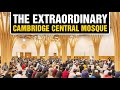

# The Extraordinary Cambridge Central Mosque (2021-10-11)

## Description

BBC News introduced Cambridge Central Mosque, nominated for the prestigious Stirling Prize for Britain's best new building, one of six buildings in the shortlist.
https://www.youtube.com/watch?v=kfcBq5VKEgU

## Summary of [The Extraordinary Cambridge Central Mosque](https://www.youtube.com/watch?v=CyOcGExNclY)

*This summary is AI generated - there may be inaccuracies. *

### [00:00:00](https://www.youtube.com/watch?v=CyOcGExNclY&t=0) - [00:05:00](https://www.youtube.com/watch?v=CyOcGExNclY&t=300)

The Extraordinary Cambridge Central Mosque is a beautiful, sustainable mosque designed by British architects Box Barfield. The mosque features geometric columns made of timber trees, which form the structural support for the roof. The mosque is used by the whole community, not just Muslims, and its design is a synthesis of British sacred architecture and Islamic traditions.

**[00:00:00](https://www.youtube.com/watch?v=CyOcGExNclY&t=0)** The Extraordinary Cambridge Central Mosque is a beautiful, sustainable mosque designed by British architects Box Barfield. The mosque features geometric columns made of timber trees, which form the structural support for the roof. When visitors enter the mosque, they feel "other" and "uplifting." The mosque is used by the whole community, not just Muslims. The mosque's design is a synthesis of British sacred architecture and Islamic traditions, and it symbolizes the "inherent interest" of Islam in bringing together different cultures and civilizations.
* **[00:05:00](https://www.youtube.com/watch?v=CyOcGExNclY&t=300)** The Extraordinary Cambridge Central Mosque is a beautiful example of how Islamic and British architecture can work together. The mosque was designed by Professor Tim Winter and the English architects who created it.

## Full transcript with timestamps

[0:00:00](https://youtu.be/CyOcGExNclY?t=0) according to the bbc one of britain's  
[0:00:03](https://youtu.be/CyOcGExNclY?t=3) best new buildings is a mosque  
[0:00:07](https://youtu.be/CyOcGExNclY?t=7) the extraordinary cambridge central  
[0:00:10](https://youtu.be/CyOcGExNclY?t=10) mosque has geometric columns these are  
[0:00:13](https://youtu.be/CyOcGExNclY?t=13) made of timber timber trees which form  
[0:00:15](https://youtu.be/CyOcGExNclY?t=15) the structural support for the roof so  
[0:00:18](https://youtu.be/CyOcGExNclY?t=18) i'm just going to share with you uh just  
[0:00:20](https://youtu.be/CyOcGExNclY?t=20) a couple of minutes of this bbc article  
[0:00:24](https://youtu.be/CyOcGExNclY?t=24) a bbc news item  
[0:00:32](https://youtu.be/CyOcGExNclY?t=32) the rebus sterling prize for britain's  
[0:00:33](https://youtu.be/CyOcGExNclY?t=33) best new building will be announced next  
[0:00:35](https://youtu.be/CyOcGExNclY?t=35) week the shortlist includes a footbridge  
[0:00:37](https://youtu.be/CyOcGExNclY?t=37) in the south west of england a boat  
[0:00:39](https://youtu.be/CyOcGExNclY?t=39) museum in the lake district and a  
[0:00:40](https://youtu.be/CyOcGExNclY?t=40) university building in southwest london  
[0:00:42](https://youtu.be/CyOcGExNclY?t=42) over the coming few days we're going to  
[0:00:43](https://youtu.be/CyOcGExNclY?t=43) look at each of the six buildings on the  
[0:00:45](https://youtu.be/CyOcGExNclY?t=45) shortlist today it's the cambridge  
[0:00:48](https://youtu.be/CyOcGExNclY?t=48) central mosque which features geometric  
[0:00:50](https://youtu.be/CyOcGExNclY?t=50) columns  
[0:00:51](https://youtu.be/CyOcGExNclY?t=51) timber trees which form the structural  
[0:00:54](https://youtu.be/CyOcGExNclY?t=54) support for the roof  
[0:00:59](https://youtu.be/CyOcGExNclY?t=59) when you enter this space it feels very  
[0:01:01](https://youtu.be/CyOcGExNclY?t=61) other and hopefully uplifting i don't  
[0:01:04](https://youtu.be/CyOcGExNclY?t=64) think as architects we can hope for  
[0:01:05](https://youtu.be/CyOcGExNclY?t=65) anything more than that really  
[0:01:08](https://youtu.be/CyOcGExNclY?t=68) my name is julia barfield i'm one of the  
[0:01:10](https://youtu.be/CyOcGExNclY?t=70) co-founders of box barfield architects  
[0:01:12](https://youtu.be/CyOcGExNclY?t=72) and we are the architects of the  
[0:01:15](https://youtu.be/CyOcGExNclY?t=75) cambridge central mosque  
[0:01:18](https://youtu.be/CyOcGExNclY?t=78) we hadn't designed a mosque before so of  
[0:01:20](https://youtu.be/CyOcGExNclY?t=80) course we did a lot of research to find  
[0:01:22](https://youtu.be/CyOcGExNclY?t=82) out about mosque design throughout the  
[0:01:24](https://youtu.be/CyOcGExNclY?t=84) world and what we discovered was that  
[0:01:27](https://youtu.be/CyOcGExNclY?t=87) historically and globally mosques  
[0:01:29](https://youtu.be/CyOcGExNclY?t=89) generally took on the character of the  
[0:01:32](https://youtu.be/CyOcGExNclY?t=92) place that they were in and the time  
[0:01:33](https://youtu.be/CyOcGExNclY?t=93) they were in so what should a british  
[0:01:35](https://youtu.be/CyOcGExNclY?t=95) mosque of the 20th century be like  
[0:01:39](https://youtu.be/CyOcGExNclY?t=99) david my partner was the one who came up  
[0:01:41](https://youtu.be/CyOcGExNclY?t=101) with this idea of the glade  
[0:01:44](https://youtu.be/CyOcGExNclY?t=104) of trees and the garden of paradise  
[0:01:48](https://youtu.be/CyOcGExNclY?t=108) trees in this glade of trees became  
[0:01:50](https://youtu.be/CyOcGExNclY?t=110) these structural trees this is an  
[0:01:52](https://youtu.be/CyOcGExNclY?t=112) entirely timber structural building  
[0:01:54](https://youtu.be/CyOcGExNclY?t=114) timber is beautiful it's very  
[0:01:56](https://youtu.be/CyOcGExNclY?t=116) sustainable but also it's got that  
[0:01:58](https://youtu.be/CyOcGExNclY?t=118) connection with nature which is in islam  
[0:02:01](https://youtu.be/CyOcGExNclY?t=121) very important that's also one of the  
[0:02:03](https://youtu.be/CyOcGExNclY?t=123) kind of features of this  
[0:02:05](https://youtu.be/CyOcGExNclY?t=125) phase is that you naturally somehow look  
[0:02:07](https://youtu.be/CyOcGExNclY?t=127) up  
[0:02:08](https://youtu.be/CyOcGExNclY?t=128) which seems appropriate for a sacred  
[0:02:11](https://youtu.be/CyOcGExNclY?t=131) space  
[0:02:12](https://youtu.be/CyOcGExNclY?t=132) it's a space that's used by the whole  
[0:02:14](https://youtu.be/CyOcGExNclY?t=134) community not just the muslim community  
[0:02:17](https://youtu.be/CyOcGExNclY?t=137) the idea is that the mosque is not just  
[0:02:19](https://youtu.be/CyOcGExNclY?t=139) a place for worship it's so lovely to  
[0:02:21](https://youtu.be/CyOcGExNclY?t=141) see there's that sense of pride and  
[0:02:23](https://youtu.be/CyOcGExNclY?t=143) ownership from not just muslims in  
[0:02:25](https://youtu.be/CyOcGExNclY?t=145) cambridge but also the wider community  
[0:02:27](https://youtu.be/CyOcGExNclY?t=147) too  
[0:02:29](https://youtu.be/CyOcGExNclY?t=149) you're sort of met with this immediate  
[0:02:30](https://youtu.be/CyOcGExNclY?t=150) calm and sense of peace and it's  
[0:02:32](https://youtu.be/CyOcGExNclY?t=152) something that visitors get to  
[0:02:33](https://youtu.be/CyOcGExNclY?t=153) experience multitasking they visit but  
[0:02:35](https://youtu.be/CyOcGExNclY?t=155) something i get to experience every day  
[0:02:36](https://youtu.be/CyOcGExNclY?t=156) so it's just phenomenal we've kept the  
[0:02:39](https://youtu.be/CyOcGExNclY?t=159) energy usage down as much as possible as  
[0:02:41](https://youtu.be/CyOcGExNclY?t=161) well as trying to address embodied  
[0:02:43](https://youtu.be/CyOcGExNclY?t=163) carbon  
[0:02:44](https://youtu.be/CyOcGExNclY?t=164) in the choice of materials all the  
[0:02:47](https://youtu.be/CyOcGExNclY?t=167) rainwater is captured  
[0:02:49](https://youtu.be/CyOcGExNclY?t=169) it's used to flush the toilets and also  
[0:02:51](https://youtu.be/CyOcGExNclY?t=171) to help water the garden  
[0:02:53](https://youtu.be/CyOcGExNclY?t=173) in a sense we were trying to  
[0:02:55](https://youtu.be/CyOcGExNclY?t=175) kind of combine the english sacred  
[0:02:58](https://youtu.be/CyOcGExNclY?t=178) architecture with islamic traditions  
[0:03:01](https://youtu.be/CyOcGExNclY?t=181) we wanted to construct something that  
[0:03:04](https://youtu.be/CyOcGExNclY?t=184) was a symbol of hope that this  
[0:03:06](https://youtu.be/CyOcGExNclY?t=186) difference is not just about problems of  
[0:03:09](https://youtu.be/CyOcGExNclY?t=189) integration but it's about the inherent  
[0:03:11](https://youtu.be/CyOcGExNclY?t=191) interests of bringing together different  
[0:03:13](https://youtu.be/CyOcGExNclY?t=193) narratives different civilizations  
[0:03:14](https://youtu.be/CyOcGExNclY?t=194) different ethnicities languages cultural  
[0:03:17](https://youtu.be/CyOcGExNclY?t=197) communities it's a kind of celebration  
[0:03:20](https://youtu.be/CyOcGExNclY?t=200) of the very central contribution that  
[0:03:22](https://youtu.be/CyOcGExNclY?t=202) islam brings to the  
[0:03:24](https://youtu.be/CyOcGExNclY?t=204) rainbow diversity that is what makes  
[0:03:27](https://youtu.be/CyOcGExNclY?t=207) modern britain so fascinating  
[0:03:28](https://youtu.be/CyOcGExNclY?t=208) muslim islamic culture has been part of  
[0:03:31](https://youtu.be/CyOcGExNclY?t=211) british culture for so long and i hope  
[0:03:32](https://youtu.be/CyOcGExNclY?t=212) this building reaffirms that it brings  
[0:03:35](https://youtu.be/CyOcGExNclY?t=215) the two together  
[0:03:36](https://youtu.be/CyOcGExNclY?t=216) [Music]  
[0:03:39](https://youtu.be/CyOcGExNclY?t=219) and one of the interesting features of  
[0:03:41](https://youtu.be/CyOcGExNclY?t=221) this uh building is the fact that the  
[0:03:44](https://youtu.be/CyOcGExNclY?t=224) architects were english architects  
[0:03:46](https://youtu.be/CyOcGExNclY?t=226) they've never built a mosque before  
[0:03:49](https://youtu.be/CyOcGExNclY?t=229) and they decided to combine the english  
[0:03:52](https://youtu.be/CyOcGExNclY?t=232) style of sacred architecture with  
[0:03:55](https://youtu.be/CyOcGExNclY?t=235) islamic traditions to produce this  
[0:03:57](https://youtu.be/CyOcGExNclY?t=237) amazing  
[0:03:58](https://youtu.be/CyOcGExNclY?t=238) synthesis and in their research for this  
[0:04:02](https://youtu.be/CyOcGExNclY?t=242) mosque they were commissioned to to  
[0:04:04](https://youtu.be/CyOcGExNclY?t=244) build they discovered an interesting  
[0:04:06](https://youtu.be/CyOcGExNclY?t=246) fact which is worth emphasizing and they  
[0:04:09](https://youtu.be/CyOcGExNclY?t=249) say quote historically and globally  
[0:04:12](https://youtu.be/CyOcGExNclY?t=252) mosques took on the character of the  
[0:04:14](https://youtu.be/CyOcGExNclY?t=254) place and time they were in  
[0:04:18](https://youtu.be/CyOcGExNclY?t=258) so moss weren't sticking out like a sore  
[0:04:20](https://youtu.be/CyOcGExNclY?t=260) thumb they blended in with their  
[0:04:22](https://youtu.be/CyOcGExNclY?t=262) environment taking on the character of  
[0:04:25](https://youtu.be/CyOcGExNclY?t=265) the buildings around them and the  
[0:04:26](https://youtu.be/CyOcGExNclY?t=266) culture what a beautiful idea  
[0:04:29](https://youtu.be/CyOcGExNclY?t=269) so one of the questions is what should a  
[0:04:31](https://youtu.be/CyOcGExNclY?t=271) 21st century british mosque look like  
[0:04:35](https://youtu.be/CyOcGExNclY?t=275) and i think this if there's going to be  
[0:04:37](https://youtu.be/CyOcGExNclY?t=277) an answer this is going to be it it's  
[0:04:39](https://youtu.be/CyOcGExNclY?t=279) such an extraordinary building  
[0:04:41](https://youtu.be/CyOcGExNclY?t=281) and the one of the key concepts the  
[0:04:43](https://youtu.be/CyOcGExNclY?t=283) architects mentioned you can see this in  
[0:04:45](https://youtu.be/CyOcGExNclY?t=285) the video is this idea of a glade of  
[0:04:48](https://youtu.be/CyOcGExNclY?t=288) trees  
[0:04:49](https://youtu.be/CyOcGExNclY?t=289) and the garden of paradise and of course  
[0:04:52](https://youtu.be/CyOcGExNclY?t=292) paradise  
[0:04:53](https://youtu.be/CyOcGExNclY?t=293) is a key  
[0:04:55](https://youtu.be/CyOcGExNclY?t=295) concept found in the quran and it is  
[0:04:58](https://youtu.be/CyOcGExNclY?t=298) like a garden in many ways and it exudes  
[0:05:01](https://youtu.be/CyOcGExNclY?t=301) calm and peace both in paradise and in  
[0:05:04](https://youtu.be/CyOcGExNclY?t=304) this mosque as the people who go there  
[0:05:07](https://youtu.be/CyOcGExNclY?t=307) will tell you  
[0:05:09](https://youtu.be/CyOcGExNclY?t=309) and um if there is a future where  
[0:05:11](https://youtu.be/CyOcGExNclY?t=311) the best of british english architecture  
[0:05:14](https://youtu.be/CyOcGExNclY?t=314) and the best of islamic architecture can  
[0:05:17](https://youtu.be/CyOcGExNclY?t=317) come together in this beautiful  
[0:05:19](https://youtu.be/CyOcGExNclY?t=319) synthesis this has got to be it so  
[0:05:22](https://youtu.be/CyOcGExNclY?t=322) all credit all kudos to the english  
[0:05:24](https://youtu.be/CyOcGExNclY?t=324) architects  
[0:05:25](https://youtu.be/CyOcGExNclY?t=325) and to professor  
[0:05:27](https://youtu.be/CyOcGExNclY?t=327) tim winter who is the genius behind this  
[0:05:30](https://youtu.be/CyOcGExNclY?t=330) project at the university of cambridge  
