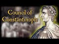

# The First Council of Constantinople - and why Jesus would have wept. (2020-12-11)

## Description

The First Council of Constantinople was a council of Christian bishops convened in Constantinople in AD 381 by the Roman Emperor Theodosius I. This second ecumenical council confirmed the Nicene Creed, expanding its teaching to produce the Niceno-Constantinopolitan Creed, and defined the Holy Spirit (along with Jesus) as a deity worthy of worship. 

I explain why Jesus - had he observed the proceedings of the council - would have wept.

## Summary of [The First Council of Constantinople - and why Jesus would have wept.](https://www.youtube.com/watch?v=Uei51koTiQU)

*This summary is AI generated - there may be inaccuracies. *

### [00:00:00](https://www.youtube.com/watch?v=Uei51koTiQU&t=0) - [00:10:00](https://www.youtube.com/watch?v=Uei51koTiQU&t=600)

The First Council of Constantinople was held in 381 AD in order to condemn the heresy of Apollinarianism. The Council expanded on the Nicene Creed, affirming that Jesus is fully God and that the Holy Spirit is also God. This doctrine was later expanded upon in the Nicene Creed. The video describes the development of the doctrine of the Trinity, which goes from monotheism to tritheism. Christianity began as a monotheistic religion, but over time it became polytheistic, with three gods worshiped alongside the Father. This was a significant change from Jesus' teachings, which centered around one God.

**[00:00:00](https://www.youtube.com/watch?v=Uei51koTiQU&t=0)** The Council of Constantinople (381 AD), which condemned Apollinarianism, expanded on the Nicene Creed. It is the creed of orthodoxy, used by all major churches in the East and West.
* **[00:05:00](https://www.youtube.com/watch?v=Uei51koTiQU&t=300)** The First Council of Constantinople affirmed that Jesus is fully God, and that the Holy Spirit is also God. This doctrine is later expanded upon in the Nicene Creed.
* **[00:10:00](https://www.youtube.com/watch?v=Uei51koTiQU&t=600)** The video describes the development of the doctrine of the Trinity, which goes from monotheism to tritheism. Christianity began as a monotheistic religion, but over time it became polytheistic, with three gods worshiped alongside the Father. This was a significant change from Jesus' teachings, which centered around one God.

<h2>Full transcript with timestamps: CLICK TO EXPAND</h2>

[0:00:01](https://youtu.be/Uei51koTiQU?t=1) well in this uh second  
[0:00:03](https://youtu.be/Uei51koTiQU?t=3) video in the series of seven about the  
[0:00:05](https://youtu.be/Uei51koTiQU?t=5) seven  
[0:00:06](https://youtu.be/Uei51koTiQU?t=6) uh ecumenical councils the church that  
[0:00:09](https://youtu.be/Uei51koTiQU?t=9) is universal councils  
[0:00:11](https://youtu.be/Uei51koTiQU?t=11) that were called um gatherings of  
[0:00:13](https://youtu.be/Uei51koTiQU?t=13) bishops usually under an emperor  
[0:00:15](https://youtu.be/Uei51koTiQU?t=15) to thrash out christian doctrine to  
[0:00:17](https://youtu.be/Uei51koTiQU?t=17) denounce heretics  
[0:00:18](https://youtu.be/Uei51koTiQU?t=18) i want to talk about the council of  
[0:00:22](https://youtu.be/Uei51koTiQU?t=22) constantinople which was called by the  
[0:00:24](https://youtu.be/Uei51koTiQU?t=24) emperor  
[0:00:25](https://youtu.be/Uei51koTiQU?t=25) theodosius in 381 a.d  
[0:00:29](https://youtu.be/Uei51koTiQU?t=29) but before i get into that i just want  
[0:00:30](https://youtu.be/Uei51koTiQU?t=30) to go back to the  
[0:00:33](https://youtu.be/Uei51koTiQU?t=33) nicene creed to the council of nicaea  
[0:00:36](https://youtu.be/Uei51koTiQU?t=36) called by the emperor constantine who  
[0:00:38](https://youtu.be/Uei51koTiQU?t=38) was the first  
[0:00:39](https://youtu.be/Uei51koTiQU?t=39) christian emperor of the roman empire  
[0:00:42](https://youtu.be/Uei51koTiQU?t=42) and  
[0:00:43](https://youtu.be/Uei51koTiQU?t=43) when he passed away and his son  
[0:00:46](https://youtu.be/Uei51koTiQU?t=46) constantine  
[0:00:47](https://youtu.be/Uei51koTiQU?t=47) uh the second uh took over and his son  
[0:00:50](https://youtu.be/Uei51koTiQU?t=50) after him  
[0:00:51](https://youtu.be/Uei51koTiQU?t=51) and they were aryan emperors in other  
[0:00:54](https://youtu.be/Uei51koTiQU?t=54) words they rejected their fathers or  
[0:00:56](https://youtu.be/Uei51koTiQU?t=56) grandfather's views about  
[0:00:58](https://youtu.be/Uei51koTiQU?t=58) uh jesus being as  
[0:01:01](https://youtu.be/Uei51koTiQU?t=61) god as divine as the father being equal  
[0:01:05](https://youtu.be/Uei51koTiQU?t=65) in deity both being of the same  
[0:01:08](https://youtu.be/Uei51koTiQU?t=68) substance of the same being  
[0:01:09](https://youtu.be/Uei51koTiQU?t=69) as each other of one being and uh  
[0:01:13](https://youtu.be/Uei51koTiQU?t=73) the the aryans rejected this uh  
[0:01:15](https://youtu.be/Uei51koTiQU?t=75) believing that  
[0:01:16](https://youtu.be/Uei51koTiQU?t=76) christ had a beginning he was created by  
[0:01:19](https://youtu.be/Uei51koTiQU?t=79) the father  
[0:01:20](https://youtu.be/Uei51koTiQU?t=80) so even though you could use divine  
[0:01:21](https://youtu.be/Uei51koTiQU?t=81) language of him uh you could call him  
[0:01:24](https://youtu.be/Uei51koTiQU?t=84) divine  
[0:01:25](https://youtu.be/Uei51koTiQU?t=85) he was not god in the ultimate sense so  
[0:01:28](https://youtu.be/Uei51koTiQU?t=88) the people who succeeded constantine his  
[0:01:30](https://youtu.be/Uei51koTiQU?t=90) son  
[0:01:30](https://youtu.be/Uei51koTiQU?t=90) uh and and his son uh were aryans  
[0:01:34](https://youtu.be/Uei51koTiQU?t=94) and also other um so-called heresies  
[0:01:38](https://youtu.be/Uei51koTiQU?t=98) came about i call them so-called because  
[0:01:40](https://youtu.be/Uei51koTiQU?t=100) obviously this is from the point of view  
[0:01:41](https://youtu.be/Uei51koTiQU?t=101) of the  
[0:01:42](https://youtu.be/Uei51koTiQU?t=102) of what became the traditional orthodox  
[0:01:44](https://youtu.be/Uei51koTiQU?t=104) catholic church  
[0:01:45](https://youtu.be/Uei51koTiQU?t=105) uh you may think the so-called heresies  
[0:01:48](https://youtu.be/Uei51koTiQU?t=108) were actually true  
[0:01:49](https://youtu.be/Uei51koTiQU?t=109) uh uh and accurate in in what in their  
[0:01:51](https://youtu.be/Uei51koTiQU?t=111) views  
[0:01:52](https://youtu.be/Uei51koTiQU?t=112) uh one of the views um was um  
[0:01:55](https://youtu.be/Uei51koTiQU?t=115) popularly uh is popularly known as  
[0:01:57](https://youtu.be/Uei51koTiQU?t=117) apollinarianism  
[0:01:58](https://youtu.be/Uei51koTiQU?t=118) and this came about by a chap called  
[0:02:00](https://youtu.be/Uei51koTiQU?t=120) apollinarius  
[0:02:02](https://youtu.be/Uei51koTiQU?t=122) um and he was a supporter of the council  
[0:02:04](https://youtu.be/Uei51koTiQU?t=124) of nicaea the nicene creed  
[0:02:06](https://youtu.be/Uei51koTiQU?t=126) but he kind of pushed it a bit too far  
[0:02:08](https://youtu.be/Uei51koTiQU?t=128) and he ended up saying  
[0:02:10](https://youtu.be/Uei51koTiQU?t=130) perhaps in spite of himself he didn't  
[0:02:12](https://youtu.be/Uei51koTiQU?t=132) want to be a heretic  
[0:02:14](https://youtu.be/Uei51koTiQU?t=134) uh because he was condemned uh he ended  
[0:02:16](https://youtu.be/Uei51koTiQU?t=136) up saying that yeah jesus had a human  
[0:02:18](https://youtu.be/Uei51koTiQU?t=138) body but his mind his soul was divine  
[0:02:21](https://youtu.be/Uei51koTiQU?t=141) so it's kind of like you know god  
[0:02:22](https://youtu.be/Uei51koTiQU?t=142) dressed in a suit of  
[0:02:24](https://youtu.be/Uei51koTiQU?t=144) human flesh if you like he wasn't fully  
[0:02:26](https://youtu.be/Uei51koTiQU?t=146) human jesus  
[0:02:28](https://youtu.be/Uei51koTiQU?t=148) and he uh he was just his uh body that  
[0:02:30](https://youtu.be/Uei51koTiQU?t=150) was obviously human  
[0:02:32](https://youtu.be/Uei51koTiQU?t=152) but his soul his mind was completely  
[0:02:35](https://youtu.be/Uei51koTiQU?t=155) divine and this was um an understanding  
[0:02:38](https://youtu.be/Uei51koTiQU?t=158) of the incarnation that was subsequently  
[0:02:40](https://youtu.be/Uei51koTiQU?t=160) condemned  
[0:02:41](https://youtu.be/Uei51koTiQU?t=161) at the council of constantinople  
[0:02:46](https://youtu.be/Uei51koTiQU?t=166) now the other really important thing  
[0:02:48](https://youtu.be/Uei51koTiQU?t=168) about the council  
[0:02:49](https://youtu.be/Uei51koTiQU?t=169) um is to do with the holy spirit which  
[0:02:52](https://youtu.be/Uei51koTiQU?t=172) had not been mentioned before  
[0:02:53](https://youtu.be/Uei51koTiQU?t=173) very much at all at the council of  
[0:02:55](https://youtu.be/Uei51koTiQU?t=175) nicaea at the council of nicaea if  
[0:02:57](https://youtu.be/Uei51koTiQU?t=177) you've not  
[0:02:58](https://youtu.be/Uei51koTiQU?t=178) come across it before um it mentions  
[0:03:01](https://youtu.be/Uei51koTiQU?t=181) very briefly the holy spirit it says  
[0:03:03](https://youtu.be/Uei51koTiQU?t=183) you know we believe in one god the  
[0:03:05](https://youtu.be/Uei51koTiQU?t=185) father almighty the maker  
[0:03:07](https://youtu.be/Uei51koTiQU?t=187) of all things we believe in jesus and it  
[0:03:08](https://youtu.be/Uei51koTiQU?t=188) talks about how jesus one being  
[0:03:11](https://youtu.be/Uei51koTiQU?t=191) um homo eusion or consubstantial with  
[0:03:14](https://youtu.be/Uei51koTiQU?t=194) god the father  
[0:03:15](https://youtu.be/Uei51koTiQU?t=195) um how jesus died and rose again and  
[0:03:18](https://youtu.be/Uei51koTiQU?t=198) then it says  
[0:03:19](https://youtu.be/Uei51koTiQU?t=199) we believe in the holy spirit full stop  
[0:03:22](https://youtu.be/Uei51koTiQU?t=202) and that's it  
[0:03:23](https://youtu.be/Uei51koTiQU?t=203) and that is all that nice here says  
[0:03:25](https://youtu.be/Uei51koTiQU?t=205) about the holy spirit so who is the holy  
[0:03:27](https://youtu.be/Uei51koTiQU?t=207) spirit  
[0:03:28](https://youtu.be/Uei51koTiQU?t=208) what's his relationship between uh to  
[0:03:30](https://youtu.be/Uei51koTiQU?t=210) the father and to the son  
[0:03:32](https://youtu.be/Uei51koTiQU?t=212) doesn't really go into that so the  
[0:03:34](https://youtu.be/Uei51koTiQU?t=214) another thing that the council  
[0:03:35](https://youtu.be/Uei51koTiQU?t=215) did was to really expand on this and  
[0:03:40](https://youtu.be/Uei51koTiQU?t=220) revise the nicene creed  
[0:03:43](https://youtu.be/Uei51koTiQU?t=223) in such a way in fact the nicene creed  
[0:03:46](https://youtu.be/Uei51koTiQU?t=226) as it's called today  
[0:03:47](https://youtu.be/Uei51koTiQU?t=227) is really the nicene constantinople  
[0:03:50](https://youtu.be/Uei51koTiQU?t=230) creed  
[0:03:51](https://youtu.be/Uei51koTiQU?t=231) that's actually the creed that's read in  
[0:03:54](https://youtu.be/Uei51koTiQU?t=234) all the major  
[0:03:55](https://youtu.be/Uei51koTiQU?t=235) churches of the east to the orthodox  
[0:03:57](https://youtu.be/Uei51koTiQU?t=237) churches and the west in  
[0:03:59](https://youtu.be/Uei51koTiQU?t=239) the catholic churches the anglican  
[0:04:00](https://youtu.be/Uei51koTiQU?t=240) church and so on is the revised nicene  
[0:04:03](https://youtu.be/Uei51koTiQU?t=243) creed that's really  
[0:04:04](https://youtu.be/Uei51koTiQU?t=244) the orthodox touchstone uh of  
[0:04:07](https://youtu.be/Uei51koTiQU?t=247) of orthodoxy and truth um  
[0:04:11](https://youtu.be/Uei51koTiQU?t=251) for christians um and why was the ho why  
[0:04:14](https://youtu.be/Uei51koTiQU?t=254) did this become an issue because  
[0:04:16](https://youtu.be/Uei51koTiQU?t=256) prominent churchmen were saying look the  
[0:04:19](https://youtu.be/Uei51koTiQU?t=259) holy spirit  
[0:04:20](https://youtu.be/Uei51koTiQU?t=260) isn't god he's not fully god only the  
[0:04:23](https://youtu.be/Uei51koTiQU?t=263) father is fully god  
[0:04:24](https://youtu.be/Uei51koTiQU?t=264) and as we saw in the first video the  
[0:04:27](https://youtu.be/Uei51koTiQU?t=267) verses in the bible  
[0:04:28](https://youtu.be/Uei51koTiQU?t=268) that say that where jesus says in in  
[0:04:31](https://youtu.be/Uei51koTiQU?t=271) john's gospel  
[0:04:33](https://youtu.be/Uei51koTiQU?t=273) um that he prays and he prays that  
[0:04:36](https://youtu.be/Uei51koTiQU?t=276) this is eternal life that they may know  
[0:04:38](https://youtu.be/Uei51koTiQU?t=278) you the only true god  
[0:04:41](https://youtu.be/Uei51koTiQU?t=281) and jesus christ whom you have sent  
[0:04:44](https://youtu.be/Uei51koTiQU?t=284) so jesus himself refers to the father  
[0:04:47](https://youtu.be/Uei51koTiQU?t=287) as the only true god he's not including  
[0:04:51](https://youtu.be/Uei51koTiQU?t=291) himself  
[0:04:52](https://youtu.be/Uei51koTiQU?t=292) in the godhead as divine at all  
[0:04:55](https://youtu.be/Uei51koTiQU?t=295) and there are other verses all over the  
[0:04:57](https://youtu.be/Uei51koTiQU?t=297) place in the bible where  
[0:04:58](https://youtu.be/Uei51koTiQU?t=298) jesus is clearly distinguished from god  
[0:05:00](https://youtu.be/Uei51koTiQU?t=300) you know jesus prays to god  
[0:05:02](https://youtu.be/Uei51koTiQU?t=302) he feels abandoned by god on the cross  
[0:05:04](https://youtu.be/Uei51koTiQU?t=304) my god my god why have you abandoned me  
[0:05:06](https://youtu.be/Uei51koTiQU?t=306) i mean it says that in mark's gospel of  
[0:05:08](https://youtu.be/Uei51koTiQU?t=308) matthew's gospel um he doesn't know  
[0:05:10](https://youtu.be/Uei51koTiQU?t=310) things  
[0:05:11](https://youtu.be/Uei51koTiQU?t=311) though he's not omniscient and and so on  
[0:05:14](https://youtu.be/Uei51koTiQU?t=314) so clearly he's not exhibiting  
[0:05:16](https://youtu.be/Uei51koTiQU?t=316) any of these uh divine characteristics  
[0:05:18](https://youtu.be/Uei51koTiQU?t=318) that we would normally expect of god  
[0:05:21](https://youtu.be/Uei51koTiQU?t=321) um so um  
[0:05:25](https://youtu.be/Uei51koTiQU?t=325) some people were denying some church  
[0:05:27](https://youtu.be/Uei51koTiQU?t=327) women denying the holy spirit was god  
[0:05:28](https://youtu.be/Uei51koTiQU?t=328) why because only if the father is god  
[0:05:31](https://youtu.be/Uei51koTiQU?t=331) if you start having other people other  
[0:05:32](https://youtu.be/Uei51koTiQU?t=332) forces other entities that are also god  
[0:05:35](https://youtu.be/Uei51koTiQU?t=335) so you've got jesus also god the holy  
[0:05:37](https://youtu.be/Uei51koTiQU?t=337) spirit is also god  
[0:05:38](https://youtu.be/Uei51koTiQU?t=338) how many gods are there um so  
[0:05:42](https://youtu.be/Uei51koTiQU?t=342) these people were after nicaea were  
[0:05:45](https://youtu.be/Uei51koTiQU?t=345) quite  
[0:05:45](https://youtu.be/Uei51koTiQU?t=345) emphatic about that now this was  
[0:05:48](https://youtu.be/Uei51koTiQU?t=348) condemned by  
[0:05:49](https://youtu.be/Uei51koTiQU?t=349) for example the pope pope damascus the  
[0:05:51](https://youtu.be/Uei51koTiQU?t=351) first at that time he said no no  
[0:05:53](https://youtu.be/Uei51koTiQU?t=353) no the holy spirit is fully god he's a  
[0:05:55](https://youtu.be/Uei51koTiQU?t=355) person  
[0:05:56](https://youtu.be/Uei51koTiQU?t=356) alongside god the father who's also a  
[0:05:58](https://youtu.be/Uei51koTiQU?t=358) person alongside jesus was also a person  
[0:06:00](https://youtu.be/Uei51koTiQU?t=360) um and theodosius the roman empire up  
[0:06:03](https://youtu.be/Uei51koTiQU?t=363) roman emperor  
[0:06:04](https://youtu.be/Uei51koTiQU?t=364) called this council the first council of  
[0:06:06](https://youtu.be/Uei51koTiQU?t=366) constantinople  
[0:06:08](https://youtu.be/Uei51koTiQU?t=368) in 381 to settle a whole bunch of these  
[0:06:10](https://youtu.be/Uei51koTiQU?t=370) issues and to reinforce to restate  
[0:06:13](https://youtu.be/Uei51koTiQU?t=373) that the truth was the council of nicaea  
[0:06:16](https://youtu.be/Uei51koTiQU?t=376) he revised it to add bits in  
[0:06:18](https://youtu.be/Uei51koTiQU?t=378) to condemn these people who were saying  
[0:06:21](https://youtu.be/Uei51koTiQU?t=381) the holy spirit  
[0:06:22](https://youtu.be/Uei51koTiQU?t=382) also wasn't god um and so he expanded it  
[0:06:26](https://youtu.be/Uei51koTiQU?t=386) and revised it  
[0:06:27](https://youtu.be/Uei51koTiQU?t=387) there were some cannons as they're  
[0:06:29](https://youtu.be/Uei51koTiQU?t=389) called that these are doctrinal  
[0:06:31](https://youtu.be/Uei51koTiQU?t=391) statements from the council that um  
[0:06:35](https://youtu.be/Uei51koTiQU?t=395) they're called cannons they are  
[0:06:38](https://youtu.be/Uei51koTiQU?t=398) doctrinal decrees  
[0:06:40](https://youtu.be/Uei51koTiQU?t=400) stating uh in this case uh that the  
[0:06:43](https://youtu.be/Uei51koTiQU?t=403) heresies were  
[0:06:44](https://youtu.be/Uei51koTiQU?t=404) outlawed so the aryans who said that  
[0:06:48](https://youtu.be/Uei51koTiQU?t=408) jesus was a created being  
[0:06:49](https://youtu.be/Uei51koTiQU?t=409) these were outlawed uh by the state  
[0:06:53](https://youtu.be/Uei51koTiQU?t=413) by this decree um the  
[0:06:56](https://youtu.be/Uei51koTiQU?t=416) the other canon of firm nicaea as the  
[0:06:59](https://youtu.be/Uei51koTiQU?t=419) truth and also the bishop of  
[0:07:00](https://youtu.be/Uei51koTiQU?t=420) constantinople  
[0:07:02](https://youtu.be/Uei51koTiQU?t=422) who was until then subordinate to the  
[0:07:04](https://youtu.be/Uei51koTiQU?t=424) pope  
[0:07:05](https://youtu.be/Uei51koTiQU?t=425) it was decided to raise his status to  
[0:07:07](https://youtu.be/Uei51koTiQU?t=427) equal to the pope  
[0:07:09](https://youtu.be/Uei51koTiQU?t=429) um so these were come  
[0:07:12](https://youtu.be/Uei51koTiQU?t=432) some of the issues but principally it  
[0:07:14](https://youtu.be/Uei51koTiQU?t=434) was to reassert  
[0:07:16](https://youtu.be/Uei51koTiQU?t=436) the truth of nicaea  
[0:07:19](https://youtu.be/Uei51koTiQU?t=439) even though theodosi is his predecessors  
[0:07:24](https://youtu.be/Uei51koTiQU?t=444) constantine won constantine too and many  
[0:07:26](https://youtu.be/Uei51koTiQU?t=446) bishops  
[0:07:27](https://youtu.be/Uei51koTiQU?t=447) had decided actually jesus was not god  
[0:07:29](https://youtu.be/Uei51koTiQU?t=449) and that he was created  
[0:07:31](https://youtu.be/Uei51koTiQU?t=451) so you had this thing you know in the  
[0:07:34](https://youtu.be/Uei51koTiQU?t=454) council of nicaea you had by majority  
[0:07:36](https://youtu.be/Uei51koTiQU?t=456) vote deciding that jesus was fully god  
[0:07:39](https://youtu.be/Uei51koTiQU?t=459) and then after that constantine dies and  
[0:07:41](https://youtu.be/Uei51koTiQU?t=461) you get kind of differing views coming  
[0:07:43](https://youtu.be/Uei51koTiQU?t=463) back saying well actually no he's not  
[0:07:44](https://youtu.be/Uei51koTiQU?t=464) really god because let me look at these  
[0:07:45](https://youtu.be/Uei51koTiQU?t=465) passages in scripture jesus says  
[0:07:47](https://youtu.be/Uei51koTiQU?t=467) the father is greater than i you know he  
[0:07:49](https://youtu.be/Uei51koTiQU?t=469) prays to god he's how can he be god  
[0:07:51](https://youtu.be/Uei51koTiQU?t=471) that there are so many pastors in the  
[0:07:52](https://youtu.be/Uei51koTiQU?t=472) bible that do not sit uh comfortably at  
[0:07:55](https://youtu.be/Uei51koTiQU?t=475) all with this idea  
[0:07:56](https://youtu.be/Uei51koTiQU?t=476) so many people were persuaded by that  
[0:07:58](https://youtu.be/Uei51koTiQU?t=478) and then theodosius comes along and he's  
[0:08:00](https://youtu.be/Uei51koTiQU?t=480) very violent actually  
[0:08:01](https://youtu.be/Uei51koTiQU?t=481) i mean his father was executed and he he  
[0:08:04](https://youtu.be/Uei51koTiQU?t=484) was very a very violent man himself  
[0:08:06](https://youtu.be/Uei51koTiQU?t=486) and he enforced this on the roman empire  
[0:08:08](https://youtu.be/Uei51koTiQU?t=488) and it became an offense  
[0:08:10](https://youtu.be/Uei51koTiQU?t=490) against the state to uh to be a heretic  
[0:08:13](https://youtu.be/Uei51koTiQU?t=493) to to disagree with what his views were  
[0:08:17](https://youtu.be/Uei51koTiQU?t=497) so um and you see here the beginnings of  
[0:08:19](https://youtu.be/Uei51koTiQU?t=499) the medieval period don't you where  
[0:08:20](https://youtu.be/Uei51koTiQU?t=500) the church really uh has a massive  
[0:08:23](https://youtu.be/Uei51koTiQU?t=503) social role  
[0:08:24](https://youtu.be/Uei51koTiQU?t=504) in enforcing uh its views on the people  
[0:08:27](https://youtu.be/Uei51koTiQU?t=507) and lower behind if you  
[0:08:28](https://youtu.be/Uei51koTiQU?t=508) disagree you will be uh you could be uh  
[0:08:31](https://youtu.be/Uei51koTiQU?t=511) punished uh even executed if you  
[0:08:33](https://youtu.be/Uei51koTiQU?t=513) publicly deny the trinity  
[0:08:36](https://youtu.be/Uei51koTiQU?t=516) so uh these are some of the issues uh  
[0:08:39](https://youtu.be/Uei51koTiQU?t=519) that  
[0:08:39](https://youtu.be/Uei51koTiQU?t=519) came about the holy spirit now uh let me  
[0:08:43](https://youtu.be/Uei51koTiQU?t=523) just get this  
[0:08:44](https://youtu.be/Uei51koTiQU?t=524) so in the first council of  
[0:08:46](https://youtu.be/Uei51koTiQU?t=526) constantinople in 381  
[0:08:50](https://youtu.be/Uei51koTiQU?t=530) whereas at nicaea you had the mention of  
[0:08:52](https://youtu.be/Uei51koTiQU?t=532) the holy spirit  
[0:08:53](https://youtu.be/Uei51koTiQU?t=533) nothing more in the constantinople creed  
[0:08:56](https://youtu.be/Uei51koTiQU?t=536) you have this  
[0:08:57](https://youtu.be/Uei51koTiQU?t=537) that we believe in one holy catholic and  
[0:08:59](https://youtu.be/Uei51koTiQU?t=539) apostolic church  
[0:09:01](https://youtu.be/Uei51koTiQU?t=541) we acknowledge one baptism for the  
[0:09:03](https://youtu.be/Uei51koTiQU?t=543) forgiveness of sins  
[0:09:04](https://youtu.be/Uei51koTiQU?t=544) we look for the resurrection of the dead  
[0:09:06](https://youtu.be/Uei51koTiQU?t=546) and the life of the world to come  
[0:09:08](https://youtu.be/Uei51koTiQU?t=548) and we believe in the holy spirit the  
[0:09:10](https://youtu.be/Uei51koTiQU?t=550) lord  
[0:09:11](https://youtu.be/Uei51koTiQU?t=551) and giver of life who proceeds from the  
[0:09:14](https://youtu.be/Uei51koTiQU?t=554) father  
[0:09:14](https://youtu.be/Uei51koTiQU?t=554) with the father and the son together is  
[0:09:17](https://youtu.be/Uei51koTiQU?t=557) worshiped and glorified  
[0:09:19](https://youtu.be/Uei51koTiQU?t=559) who spoke by the prophets now everything  
[0:09:22](https://youtu.be/Uei51koTiQU?t=562) i've just read there  
[0:09:23](https://youtu.be/Uei51koTiQU?t=563) has been added in to the nicene creed so  
[0:09:26](https://youtu.be/Uei51koTiQU?t=566) the idea for example we acknowledge one  
[0:09:29](https://youtu.be/Uei51koTiQU?t=569) baptism for the remission of sins the  
[0:09:30](https://youtu.be/Uei51koTiQU?t=570) idea that baptism as it as  
[0:09:32](https://youtu.be/Uei51koTiQU?t=572) such forgives your sins  
[0:09:37](https://youtu.be/Uei51koTiQU?t=577) is added in is that extraordinary did  
[0:09:39](https://youtu.be/Uei51koTiQU?t=579) jesus  
[0:09:40](https://youtu.be/Uei51koTiQU?t=580) preach did he go around saying you know  
[0:09:42](https://youtu.be/Uei51koTiQU?t=582) have have some baptism and you will be  
[0:09:44](https://youtu.be/Uei51koTiQU?t=584) saved  
[0:09:44](https://youtu.be/Uei51koTiQU?t=584) so baptism itself uh remits  
[0:09:47](https://youtu.be/Uei51koTiQU?t=587) sin um the what the idea the one holy  
[0:09:51](https://youtu.be/Uei51koTiQU?t=591) catholic apostolic church that's the  
[0:09:53](https://youtu.be/Uei51koTiQU?t=593) first time that's in the creed  
[0:09:55](https://youtu.be/Uei51koTiQU?t=595) and then to the holy spirit the holy  
[0:09:57](https://youtu.be/Uei51koTiQU?t=597) spirit is now the lord  
[0:09:58](https://youtu.be/Uei51koTiQU?t=598) the giver of life who proceeds from the  
[0:10:00](https://youtu.be/Uei51koTiQU?t=600) father  
[0:10:01](https://youtu.be/Uei51koTiQU?t=601) with the father and the son is worshiped  
[0:10:03](https://youtu.be/Uei51koTiQU?t=603) and glorified  
[0:10:05](https://youtu.be/Uei51koTiQU?t=605) so you have three beings now  
[0:10:08](https://youtu.be/Uei51koTiQU?t=608) who are worshiped you have the father  
[0:10:10](https://youtu.be/Uei51koTiQU?t=610) who has got his worship the son who is  
[0:10:12](https://youtu.be/Uei51koTiQU?t=612) god who's worshipped  
[0:10:13](https://youtu.be/Uei51koTiQU?t=613) and clearly the holy spirit who is also  
[0:10:17](https://youtu.be/Uei51koTiQU?t=617) worshiped so each is fully god  
[0:10:20](https://youtu.be/Uei51koTiQU?t=620) and my mass isn't great but i make that  
[0:10:23](https://youtu.be/Uei51koTiQU?t=623) three  
[0:10:24](https://youtu.be/Uei51koTiQU?t=624) beings who are fully god all of whom  
[0:10:27](https://youtu.be/Uei51koTiQU?t=627) are together it says are to be  
[0:10:29](https://youtu.be/Uei51koTiQU?t=629) worshipped and  
[0:10:30](https://youtu.be/Uei51koTiQU?t=630) all of them are to be worshipped and  
[0:10:32](https://youtu.be/Uei51koTiQU?t=632) glorified  
[0:10:34](https://youtu.be/Uei51koTiQU?t=634) wow now that wasn't in nicaea uh he was  
[0:10:36](https://youtu.be/Uei51koTiQU?t=636) added to the nicen creed  
[0:10:38](https://youtu.be/Uei51koTiQU?t=638) and so as i said before today when  
[0:10:40](https://youtu.be/Uei51koTiQU?t=640) christians uh  
[0:10:41](https://youtu.be/Uei51koTiQU?t=641) recite which they do the nice and creed  
[0:10:44](https://youtu.be/Uei51koTiQU?t=644) they mean this revised creed which  
[0:10:46](https://youtu.be/Uei51koTiQU?t=646) includes the bit about how baptism saves  
[0:10:48](https://youtu.be/Uei51koTiQU?t=648) you  
[0:10:49](https://youtu.be/Uei51koTiQU?t=649) and a bit about the three entities that  
[0:10:51](https://youtu.be/Uei51koTiQU?t=651) are now worshipped  
[0:10:52](https://youtu.be/Uei51koTiQU?t=652) together the word together is in the  
[0:10:55](https://youtu.be/Uei51koTiQU?t=655) creed  
[0:10:55](https://youtu.be/Uei51koTiQU?t=655) so you get a collective is a group of  
[0:10:58](https://youtu.be/Uei51koTiQU?t=658) group of beings group of individuals  
[0:11:00](https://youtu.be/Uei51koTiQU?t=660) who are all worshiped together  
[0:11:04](https://youtu.be/Uei51koTiQU?t=664) as god of course so although the word  
[0:11:07](https://youtu.be/Uei51koTiQU?t=667) trinity is not mentioned clearly this is  
[0:11:09](https://youtu.be/Uei51koTiQU?t=669) trinitarian trinity  
[0:11:10](https://youtu.be/Uei51koTiQU?t=670) the doctrine of the trinity as such will  
[0:11:12](https://youtu.be/Uei51koTiQU?t=672) be addressed in a later council  
[0:11:14](https://youtu.be/Uei51koTiQU?t=674) which god willing i'll make a video on  
[0:11:17](https://youtu.be/Uei51koTiQU?t=677) but you can see  
[0:11:18](https://youtu.be/Uei51koTiQU?t=678) how uh the development i mean how far we  
[0:11:21](https://youtu.be/Uei51koTiQU?t=681) have moved from  
[0:11:22](https://youtu.be/Uei51koTiQU?t=682) jesus in in uh in galilee  
[0:11:25](https://youtu.be/Uei51koTiQU?t=685) preaching god and his kingdom  
[0:11:28](https://youtu.be/Uei51koTiQU?t=688) and now we have three entities who are  
[0:11:31](https://youtu.be/Uei51koTiQU?t=691) now proclaimed and worshipped  
[0:11:33](https://youtu.be/Uei51koTiQU?t=693) as god is this trini is this tritheism  
[0:11:37](https://youtu.be/Uei51koTiQU?t=697) um i think i think it is actually  
[0:11:41](https://youtu.be/Uei51koTiQU?t=701) many people say it's not because  
[0:11:42](https://youtu.be/Uei51koTiQU?t=702) christians still profess belief in one  
[0:11:44](https://youtu.be/Uei51koTiQU?t=704) god  
[0:11:45](https://youtu.be/Uei51koTiQU?t=705) but it the the the this is stretched to  
[0:11:48](https://youtu.be/Uei51koTiQU?t=708) such an extent  
[0:11:49](https://youtu.be/Uei51koTiQU?t=709) that it breaks i think that if if each  
[0:11:52](https://youtu.be/Uei51koTiQU?t=712) of the constituent  
[0:11:54](https://youtu.be/Uei51koTiQU?t=714) deities each of which is named and  
[0:11:57](https://youtu.be/Uei51koTiQU?t=717) worshiped and glorified individually  
[0:12:00](https://youtu.be/Uei51koTiQU?t=720) uh this stretches the definition and  
[0:12:02](https://youtu.be/Uei51koTiQU?t=722) it's kind of like a polytheistic  
[0:12:04](https://youtu.be/Uei51koTiQU?t=724) monotheism as a a paradox of course  
[0:12:07](https://youtu.be/Uei51koTiQU?t=727) or monotheistic polytheism it's a  
[0:12:09](https://youtu.be/Uei51koTiQU?t=729) politic it's a monotheism that is  
[0:12:11](https://youtu.be/Uei51koTiQU?t=731) polytheistic it's kind of a  
[0:12:12](https://youtu.be/Uei51koTiQU?t=732) contradiction  
[0:12:13](https://youtu.be/Uei51koTiQU?t=733) it both affirms and denies what it  
[0:12:15](https://youtu.be/Uei51koTiQU?t=735) claims to believe  
[0:12:16](https://youtu.be/Uei51koTiQU?t=736) um so um so  
[0:12:20](https://youtu.be/Uei51koTiQU?t=740) as i say that council uh uh issued this  
[0:12:23](https://youtu.be/Uei51koTiQU?t=743) creed  
[0:12:24](https://youtu.be/Uei51koTiQU?t=744) and it was enforced with state power  
[0:12:28](https://youtu.be/Uei51koTiQU?t=748) if you disagreed with this if you're an  
[0:12:30](https://youtu.be/Uei51koTiQU?t=750) aryan if you said jesus  
[0:12:31](https://youtu.be/Uei51koTiQU?t=751) is not god you were punished it also  
[0:12:34](https://youtu.be/Uei51koTiQU?t=754) outlawed  
[0:12:35](https://youtu.be/Uei51koTiQU?t=755) uh by the by all pagan practices the  
[0:12:38](https://youtu.be/Uei51koTiQU?t=758) temples were closed they were more than  
[0:12:40](https://youtu.be/Uei51koTiQU?t=760) closed they were ransacked burnt down  
[0:12:42](https://youtu.be/Uei51koTiQU?t=762) uh violence was committed against pagans  
[0:12:45](https://youtu.be/Uei51koTiQU?t=765) this state the christian state did  
[0:12:46](https://youtu.be/Uei51koTiQU?t=766) nothing  
[0:12:47](https://youtu.be/Uei51koTiQU?t=767) took no action against the attackers  
[0:12:49](https://youtu.be/Uei51koTiQU?t=769) they were allowed to get away with it  
[0:12:52](https://youtu.be/Uei51koTiQU?t=772) and so i guess in my view you have a  
[0:12:53](https://youtu.be/Uei51koTiQU?t=773) kind of really beginning of the  
[0:12:55](https://youtu.be/Uei51koTiQU?t=775) totalitarian catholic state  
[0:12:57](https://youtu.be/Uei51koTiQU?t=777) where one particular view reigns supreme  
[0:13:00](https://youtu.be/Uei51koTiQU?t=780) and i think we lose we have now lost  
[0:13:04](https://youtu.be/Uei51koTiQU?t=784) very clearly in this uh any sense of the  
[0:13:07](https://youtu.be/Uei51koTiQU?t=787) pure monotheism the tao heed  
[0:13:10](https://youtu.be/Uei51koTiQU?t=790) which is preached by moses all the  
[0:13:13](https://youtu.be/Uei51koTiQU?t=793) prophets in the jewish bible whether it  
[0:13:15](https://youtu.be/Uei51koTiQU?t=795) be  
[0:13:15](https://youtu.be/Uei51koTiQU?t=795) isaiah isaiah jeremiah micah  
[0:13:18](https://youtu.be/Uei51koTiQU?t=798) and so on all of those who are very  
[0:13:21](https://youtu.be/Uei51koTiQU?t=801) clearly  
[0:13:22](https://youtu.be/Uei51koTiQU?t=802) monotheistic jesus himself of course who  
[0:13:25](https://youtu.be/Uei51koTiQU?t=805) prayed to god and worshiped god here we  
[0:13:27](https://youtu.be/Uei51koTiQU?t=807) have  
[0:13:28](https://youtu.be/Uei51koTiQU?t=808) a a mutation we have a bidder we have an  
[0:13:31](https://youtu.be/Uei51koTiQU?t=811) innovation where two other entities  
[0:13:34](https://youtu.be/Uei51koTiQU?t=814) are now worshiped and glorified  
[0:13:36](https://youtu.be/Uei51koTiQU?t=816) alongside  
[0:13:38](https://youtu.be/Uei51koTiQU?t=818) the father this is not something that  
[0:13:40](https://youtu.be/Uei51koTiQU?t=820) jesus knew anything about it's not  
[0:13:42](https://youtu.be/Uei51koTiQU?t=822) something you'll find  
[0:13:43](https://youtu.be/Uei51koTiQU?t=823) in the bible taught in that way at all  
[0:13:46](https://youtu.be/Uei51koTiQU?t=826) um  
[0:13:47](https://youtu.be/Uei51koTiQU?t=827) the holy spirit is not defined as fully  
[0:13:49](https://youtu.be/Uei51koTiQU?t=829) god as the son is not defined as fully  
[0:13:51](https://youtu.be/Uei51koTiQU?t=831) god  
[0:13:51](https://youtu.be/Uei51koTiQU?t=831) in a trinitarian way uh with three  
[0:13:54](https://youtu.be/Uei51koTiQU?t=834) beings in one god  
[0:13:55](https://youtu.be/Uei51koTiQU?t=835) so this is uh this is a very uh  
[0:13:59](https://youtu.be/Uei51koTiQU?t=839) innovative revolutionary development  
[0:14:02](https://youtu.be/Uei51koTiQU?t=842) um proceeding from nicaea with the holy  
[0:14:05](https://youtu.be/Uei51koTiQU?t=845) spirit added on as  
[0:14:07](https://youtu.be/Uei51koTiQU?t=847) another person who is god  
[0:14:11](https://youtu.be/Uei51koTiQU?t=851) um so there we have it i i think um  
[0:14:14](https://youtu.be/Uei51koTiQU?t=854) i think if jesus uh had attended that  
[0:14:17](https://youtu.be/Uei51koTiQU?t=857) council  
[0:14:18](https://youtu.be/Uei51koTiQU?t=858) as an observer uh he would have been  
[0:14:21](https://youtu.be/Uei51koTiQU?t=861) horrified  
[0:14:22](https://youtu.be/Uei51koTiQU?t=862) he would have looked in disbelief at the  
[0:14:25](https://youtu.be/Uei51koTiQU?t=865) piety that he had as a jewish rabbi as a  
[0:14:29](https://youtu.be/Uei51koTiQU?t=869) prophet  
[0:14:30](https://youtu.be/Uei51koTiQU?t=870) had been so distorted and undermined  
[0:14:33](https://youtu.be/Uei51koTiQU?t=873) and betrayed by  
[0:14:36](https://youtu.be/Uei51koTiQU?t=876) gentiles centuries later who thought  
[0:14:39](https://youtu.be/Uei51koTiQU?t=879) they knew the mind of god  
[0:14:42](https://youtu.be/Uei51koTiQU?t=882) but i i think jesus would have uh would  
[0:14:45](https://youtu.be/Uei51koTiQU?t=885) have  
[0:14:46](https://youtu.be/Uei51koTiQU?t=886) jesus would have wept um that's just my  
[0:14:49](https://youtu.be/Uei51koTiQU?t=889) opinion  
[0:14:49](https://youtu.be/Uei51koTiQU?t=889) so until next time um i hope that was  
[0:14:52](https://youtu.be/Uei51koTiQU?t=892) not too confusing  

