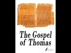

# The Gospels that did NOT make it into the Bible with Prof Dale Martin (2021-08-26)

## Description

We continue our series of talks with Professor Dale Martin, a distinguished American New Testament scholar who taught at Yale University for over 30 years. Today, we discuss the Gospels that did NOT make it into the New Testament, especially the Gospel of Thomas. There are many others of course. The Gospel of Mary, of Judas, of Peter, et al. You can read an English translation of the Gospel of Thomas here: 
https://www.marquette.edu/maqom/Gospel%20of%20Thomas%20Lambdin.pdf

## Summary of [The Gospels that did NOT make it into the Bible with Prof Dale Martin](https://www.youtube.com/watch?v=11NiLEydjjg)

*This summary is AI generated - there may be inaccuracies. *

### [00:00:00](https://www.youtube.com/watch?v=11NiLEydjjg&t=0) - [01:00:00](https://www.youtube.com/watch?v=11NiLEydjjg&t=3600)

The video discusses different Gospels that did not make it into the Bible, and argues that they are just as important as the ones that did. It also discusses how the different gospels were received as scripture and canonized.

**[00:00:00](https://www.youtube.com/watch?v=11NiLEydjjg&t=0)** The Gospel of Thomas is an apocryphal gospel which did not make it into the Bible. It was discovered in the 2nd century, and there is debate over whether it should be included in the canon. It is most commonly found in Catholic, Eastern Orthodox, and Protestant Bibles.
* **[00:05:00](https://www.youtube.com/watch?v=11NiLEydjjg&t=300)** The apocrypha, which refers to texts that did not make it into the Protestant Old Testament, were in the Catholic Old Testament but not the Protestant Old Testament. They were given the name the apocrypha because they were secondary to the canon, but always considered perfectly orthodox. The apocrypha includes the gospel of Thomas, which is called a gospel because it has a storyline, unlike the other canonical gospels.
* **[00:10:00](https://www.youtube.com/watch?v=11NiLEydjjg&t=600)** The video presents various Gospels that did not make it into the Bible, including the Gospel of Thomas. The author argues that these sayings may be older and more primitive than the canonical Gospels, which may be elaborated interpretations of the original sayings.
* **[00:15:00](https://www.youtube.com/watch?v=11NiLEydjjg&t=900)** In Thomas, the parable of the sower is told without editorializing, and it is older than the canonical version of the parable. This suggests that the historical Jesus may have said the parable. Additionally, in Thomas there are mentions of James the Just, a figure who was head of the Jerusalem church. This tells us that the parable may have been circulating among Christians in an oral tradition before it was written down.
* **[00:20:00](https://www.youtube.com/watch?v=11NiLEydjjg&t=1200)** The video discusses the discrepancy between what is found in the Gospels that made it into the Bible and what is found in the Gospel of Thomas. It argues that this discrepancy is due to the different traditions surrounding the apostles James, Peter, and John that developed after they died.
* **[00:25:00](https://www.youtube.com/watch?v=11NiLEydjjg&t=1500)** This video discusses the discrepancies between the Gospels that made it into the Bible and those that did not. It argues that these discrepancies are due to the fact that ancient ideas of androgyny were still prevalent at the time. The author also discusses the role of androgyny in Christianity, noting that it elevates women while still maintaining their masculinity.
* **[00:30:00](https://www.youtube.com/watch?v=11NiLEydjjg&t=1800)** The video discusses different Gnostic sects that belief in an "allegorical" interpretation of the crucifixion of Jesus. According to these sects, Jesus did not die on the cross, but instead left his body to ascend to heaven.
* **[00:35:00](https://www.youtube.com/watch?v=11NiLEydjjg&t=2100)** The apocryphal gospels are a more recent collection of gospels that differ from the canonical Gospels in a number of ways. One of these is that they depict Jesus as a child who engages in humorous activities and solves problems for others. Another is that they are anti-Semitic.
* **[00:40:00](https://www.youtube.com/watch?v=11NiLEydjjg&t=2400)** The Proto-Evangelium of James, Proto-Gospel of John, and the Gospel of Peter recount the lives of Mary and Jesus, and include stories of miraculous births. The Proto-Evangelium of James focuses on Mary's birth without sin, while the Gospel of John and the Gospel of Peter focus on the resurrection of Jesus.
* **[00:45:00](https://www.youtube.com/watch?v=11NiLEydjjg&t=2700)** The video discusses the different gospels that did not make it into the Bible, and how some of them are from the Bible but some are not. It also discusses the gospel of Peter and how it became popular.
* **[00:50:00](https://www.youtube.com/watch?v=11NiLEydjjg&t=3000)** The video discusses the different texts that did not make it into the Bible, and how this influenced how they were received as scripture and canonized. The text mentions the transition from scrolls to codexes, and how this helped make lists of what was acceptable to read.
* **[00:55:00](https://www.youtube.com/watch?v=11NiLEydjjg&t=3300)** The author discusses apocryphal gospels, which were once thought to be less important than canonical gospel texts. He points out that this is not always the case, and that there is still much to be discovered about the Bible.
### [01:00:00](https://www.youtube.com/watch?v=11NiLEydjjg&t=3600) - [01:00:00](https://www.youtube.com/watch?v=11NiLEydjjg&t=3600)

 Dale Martin discusses some of the Gospels that did not make it into the Bible. He notes that while there may not be anything new to be said about these texts, they are still important because they offer a different perspective on certain aspects of Christianity.

**[01:00:00](https://www.youtube.com/watch?v=11NiLEydjjg&t=3600)**  Dale Martin discusses some of the Gospels that did not make it into the Bible. He notes that while there may not be anything new to be said about these texts, they are still important because they offer a different perspective on certain aspects of Christianity. Martin also talks about his inspiration for his work as a professor, which comes from monk Monk.

<h2>Full transcript with timestamps: CLICK TO EXPAND</h2>

[0:00:01](https://youtu.be/11NiLEydjjg?t=1) good evening ladies and gentlemen and  
[0:00:03](https://youtu.be/11NiLEydjjg?t=3) welcome to blogging theology uh today we  
[0:00:07](https://youtu.be/11NiLEydjjg?t=7) continue the series of talks with  
[0:00:09](https://youtu.be/11NiLEydjjg?t=9) professor dale martin a distinguished  
[0:00:11](https://youtu.be/11NiLEydjjg?t=11) american new testament scholar who  
[0:00:14](https://youtu.be/11NiLEydjjg?t=14) taught at yale university for over 30  
[0:00:17](https://youtu.be/11NiLEydjjg?t=17) years so welcome back dale  
[0:00:19](https://youtu.be/11NiLEydjjg?t=19) thank you  
[0:00:21](https://youtu.be/11NiLEydjjg?t=21) and uh today we're going to be  
[0:00:23](https://youtu.be/11NiLEydjjg?t=23) discussing the gospels that did not make  
[0:00:26](https://youtu.be/11NiLEydjjg?t=26) it in to the new testament that  
[0:00:29](https://youtu.be/11NiLEydjjg?t=29) non-canonical gospel  
[0:00:31](https://youtu.be/11NiLEydjjg?t=31) is  
[0:00:32](https://youtu.be/11NiLEydjjg?t=32) the gospel of thomas  
[0:00:34](https://youtu.be/11NiLEydjjg?t=34) but there are others which we uh  
[0:00:36](https://youtu.be/11NiLEydjjg?t=36) hopefully will get around to discussing  
[0:00:38](https://youtu.be/11NiLEydjjg?t=38) including the gospel of peter gospel  
[0:00:40](https://youtu.be/11NiLEydjjg?t=40) mary the pros of evangelium of james but  
[0:00:43](https://youtu.be/11NiLEydjjg?t=43) we'll see how many we can or how many  
[0:00:44](https://youtu.be/11NiLEydjjg?t=44) dale can encompass in the time we have  
[0:00:48](https://youtu.be/11NiLEydjjg?t=48) and so we're going to start off by  
[0:00:49](https://youtu.be/11NiLEydjjg?t=49) looking at the famous gospel of thomas  
[0:00:54](https://youtu.be/11NiLEydjjg?t=54) and uh if you could uh dale just um tell  
[0:00:57](https://youtu.be/11NiLEydjjg?t=57) us a bit about it it's often called an  
[0:00:59](https://youtu.be/11NiLEydjjg?t=59) apocryphal gospel could you kindly  
[0:01:02](https://youtu.be/11NiLEydjjg?t=62) explain what is meant by this  
[0:01:04](https://youtu.be/11NiLEydjjg?t=64) term and say something also about when  
[0:01:06](https://youtu.be/11NiLEydjjg?t=66) it was discovered the language it was  
[0:01:08](https://youtu.be/11NiLEydjjg?t=68) written in what exactly it is is it like  
[0:01:11](https://youtu.be/11NiLEydjjg?t=71) the gospels we know with a story  
[0:01:13](https://youtu.be/11NiLEydjjg?t=73) beginning and end and the death and  
[0:01:14](https://youtu.be/11NiLEydjjg?t=74) resurrection and when do you think it  
[0:01:16](https://youtu.be/11NiLEydjjg?t=76) was likely to be written as well um so  
[0:01:20](https://youtu.be/11NiLEydjjg?t=80) quite a big menu there but uh if you  
[0:01:22](https://youtu.be/11NiLEydjjg?t=82) could take it away for stale and  
[0:01:24](https://youtu.be/11NiLEydjjg?t=84) introduce us to this fascinating subject  
[0:01:27](https://youtu.be/11NiLEydjjg?t=87) okay a lot of books are called  
[0:01:30](https://youtu.be/11NiLEydjjg?t=90) apocryphal new testament  
[0:01:32](https://youtu.be/11NiLEydjjg?t=92) or sometimes you'll find collections of  
[0:01:34](https://youtu.be/11NiLEydjjg?t=94) text published called the new testament  
[0:01:36](https://youtu.be/11NiLEydjjg?t=96) apocrypha  
[0:01:39](https://youtu.be/11NiLEydjjg?t=99) it's kind of a misnomer  
[0:01:41](https://youtu.be/11NiLEydjjg?t=101) the word apocrypha actually comes from  
[0:01:43](https://youtu.be/11NiLEydjjg?t=103) the greek for  
[0:01:44](https://youtu.be/11NiLEydjjg?t=104) oppo which means away and crouton which  
[0:01:47](https://youtu.be/11NiLEydjjg?t=107) means hidden  
[0:01:48](https://youtu.be/11NiLEydjjg?t=108) which if all you had was that word you  
[0:01:51](https://youtu.be/11NiLEydjjg?t=111) would think that it meant  
[0:01:52](https://youtu.be/11NiLEydjjg?t=112) documents that were written but hidden  
[0:01:55](https://youtu.be/11NiLEydjjg?t=115) away from most people like  
[0:01:57](https://youtu.be/11NiLEydjjg?t=117) kept in secret  
[0:01:59](https://youtu.be/11NiLEydjjg?t=119) only for a few people esoteric writings  
[0:02:02](https://youtu.be/11NiLEydjjg?t=122) but that's really not what it means when  
[0:02:04](https://youtu.be/11NiLEydjjg?t=124) it refers to these  
[0:02:06](https://youtu.be/11NiLEydjjg?t=126) documents in early christianity because  
[0:02:09](https://youtu.be/11NiLEydjjg?t=129) most of them were not um hidden away  
[0:02:12](https://youtu.be/11NiLEydjjg?t=132) they were quite readily available they  
[0:02:14](https://youtu.be/11NiLEydjjg?t=134) were  
[0:02:15](https://youtu.be/11NiLEydjjg?t=135) well known sometimes they were very  
[0:02:17](https://youtu.be/11NiLEydjjg?t=137) popular some of them were used in  
[0:02:18](https://youtu.be/11NiLEydjjg?t=138) liturgies  
[0:02:20](https://youtu.be/11NiLEydjjg?t=140) um  
[0:02:21](https://youtu.be/11NiLEydjjg?t=141) and that's why there came to be a debate  
[0:02:22](https://youtu.be/11NiLEydjjg?t=142) about whether they should be included in  
[0:02:24](https://youtu.be/11NiLEydjjg?t=144) the canon as the canon started to be  
[0:02:27](https://youtu.be/11NiLEydjjg?t=147) solidified in the third fourth fifth and  
[0:02:29](https://youtu.be/11NiLEydjjg?t=149) sixth centuries  
[0:02:30](https://youtu.be/11NiLEydjjg?t=150) um and  
[0:02:32](https://youtu.be/11NiLEydjjg?t=152) so they were not included in the canon  
[0:02:36](https://youtu.be/11NiLEydjjg?t=156) mainly because  
[0:02:37](https://youtu.be/11NiLEydjjg?t=157) uh  
[0:02:38](https://youtu.be/11NiLEydjjg?t=158) probably because they weren't as widely  
[0:02:41](https://youtu.be/11NiLEydjjg?t=161) used as matthew mark luke and john  
[0:02:43](https://youtu.be/11NiLEydjjg?t=163) matthew mark luke and john seems to have  
[0:02:44](https://youtu.be/11NiLEydjjg?t=164) been the most famous the most widely  
[0:02:46](https://youtu.be/11NiLEydjjg?t=166) used most respected  
[0:02:48](https://youtu.be/11NiLEydjjg?t=168) and people believe they were actually  
[0:02:50](https://youtu.be/11NiLEydjjg?t=170) written by matthew mark luke and john  
[0:02:52](https://youtu.be/11NiLEydjjg?t=172) we modern scholars don't believe that we  
[0:02:55](https://youtu.be/11NiLEydjjg?t=175) think these names were given to them in  
[0:02:56](https://youtu.be/11NiLEydjjg?t=176) the second century  
[0:02:59](https://youtu.be/11NiLEydjjg?t=179) but  
[0:03:00](https://youtu.be/11NiLEydjjg?t=180) they were the four that  
[0:03:02](https://youtu.be/11NiLEydjjg?t=182) became included in the bible  
[0:03:04](https://youtu.be/11NiLEydjjg?t=184) the others were simply kind of  
[0:03:06](https://youtu.be/11NiLEydjjg?t=186) they weren't included into like a  
[0:03:09](https://youtu.be/11NiLEydjjg?t=189) document like you would find them in the  
[0:03:11](https://youtu.be/11NiLEydjjg?t=191) modern period in fact the modern idea of  
[0:03:13](https://youtu.be/11NiLEydjjg?t=193) a collection called new testament  
[0:03:15](https://youtu.be/11NiLEydjjg?t=195) apocrypha  
[0:03:16](https://youtu.be/11NiLEydjjg?t=196) or apocryphal gospels that's a totally  
[0:03:20](https://youtu.be/11NiLEydjjg?t=200) modern invention that only came about in  
[0:03:23](https://youtu.be/11NiLEydjjg?t=203) the really the 20th century as  
[0:03:25](https://youtu.be/11NiLEydjjg?t=205) publishers started figuring out how to  
[0:03:27](https://youtu.be/11NiLEydjjg?t=207) market these things  
[0:03:29](https://youtu.be/11NiLEydjjg?t=209) to a general audience  
[0:03:32](https://youtu.be/11NiLEydjjg?t=212) because they were not hidden they were  
[0:03:35](https://youtu.be/11NiLEydjjg?t=215) openly written and openly circulated  
[0:03:38](https://youtu.be/11NiLEydjjg?t=218) the other thing is there's nothing sort  
[0:03:40](https://youtu.be/11NiLEydjjg?t=220) of  
[0:03:41](https://youtu.be/11NiLEydjjg?t=221) conspiratorial or nefarious sometimes  
[0:03:44](https://youtu.be/11NiLEydjjg?t=224) you get the idea  
[0:03:45](https://youtu.be/11NiLEydjjg?t=225) you know that oh these are were hidden  
[0:03:48](https://youtu.be/11NiLEydjjg?t=228) away by the church because they were  
[0:03:50](https://youtu.be/11NiLEydjjg?t=230) heretical or some well no most of them  
[0:03:52](https://youtu.be/11NiLEydjjg?t=232) are not that heretical they're you know  
[0:03:54](https://youtu.be/11NiLEydjjg?t=234) they're most of them are fairly orthodox  
[0:03:57](https://youtu.be/11NiLEydjjg?t=237) a few of them kind of seem a little bit  
[0:04:00](https://youtu.be/11NiLEydjjg?t=240) different from the orthodox you know  
[0:04:02](https://youtu.be/11NiLEydjjg?t=242) four canonical gospels but not that much  
[0:04:05](https://youtu.be/11NiLEydjjg?t=245) so apocryphal just is a modern term well  
[0:04:08](https://youtu.be/11NiLEydjjg?t=248) it's an ancient term but it's a modern  
[0:04:10](https://youtu.be/11NiLEydjjg?t=250) term we give in the new testament of  
[0:04:12](https://youtu.be/11NiLEydjjg?t=252) course  
[0:04:13](https://youtu.be/11NiLEydjjg?t=253) there's always been a reference to the  
[0:04:15](https://youtu.be/11NiLEydjjg?t=255) apocrypha  
[0:04:17](https://youtu.be/11NiLEydjjg?t=257) but those that refers to the selection  
[0:04:19](https://youtu.be/11NiLEydjjg?t=259) of documents in your bible there are  
[0:04:22](https://youtu.be/11NiLEydjjg?t=262) often in catholic bibles and  
[0:04:24](https://youtu.be/11NiLEydjjg?t=264) episcopalian bibles and eastern orthodox  
[0:04:27](https://youtu.be/11NiLEydjjg?t=267) bibles and they're often  
[0:04:29](https://youtu.be/11NiLEydjjg?t=269) either included in the old testament  
[0:04:32](https://youtu.be/11NiLEydjjg?t=272) interspersed among the other books  
[0:04:34](https://youtu.be/11NiLEydjjg?t=274) they're like  
[0:04:35](https://youtu.be/11NiLEydjjg?t=275) or they're included in an appendix  
[0:04:37](https://youtu.be/11NiLEydjjg?t=277) to the old testament  
[0:04:39](https://youtu.be/11NiLEydjjg?t=279) and labeled the apocrypha  
[0:04:42](https://youtu.be/11NiLEydjjg?t=282) those are not the same thing those are  
[0:04:44](https://youtu.be/11NiLEydjjg?t=284) jewish  
[0:04:45](https://youtu.be/11NiLEydjjg?t=285) documents written by jews  
[0:04:47](https://youtu.be/11NiLEydjjg?t=287) often in greek  
[0:04:49](https://youtu.be/11NiLEydjjg?t=289) sometimes in hebrew or aramaic  
[0:04:52](https://youtu.be/11NiLEydjjg?t=292) and then translated into other languages  
[0:04:54](https://youtu.be/11NiLEydjjg?t=294) and they they've been a part of  
[0:04:56](https://youtu.be/11NiLEydjjg?t=296) christian liturgy and tradition from the  
[0:04:58](https://youtu.be/11NiLEydjjg?t=298) very very beginning so this is  
[0:05:00](https://youtu.be/11NiLEydjjg?t=300) the apocrypha which refers to the jewish  
[0:05:04](https://youtu.be/11NiLEydjjg?t=304) uh  
[0:05:05](https://youtu.be/11NiLEydjjg?t=305) texts that didn't make it into the  
[0:05:07](https://youtu.be/11NiLEydjjg?t=307) protestant old testament they were in  
[0:05:10](https://youtu.be/11NiLEydjjg?t=310) the catholic old testament but not the  
[0:05:12](https://youtu.be/11NiLEydjjg?t=312) protestant old testament they were given  
[0:05:14](https://youtu.be/11NiLEydjjg?t=314) the name the apocrypha or the  
[0:05:16](https://youtu.be/11NiLEydjjg?t=316) pseudepigrapha or the  
[0:05:18](https://youtu.be/11NiLEydjjg?t=318) deuterocanonical deuterocanonical just  
[0:05:21](https://youtu.be/11NiLEydjjg?t=321) meaning secondary to the the canon  
[0:05:24](https://youtu.be/11NiLEydjjg?t=324) but they were always considered  
[0:05:26](https://youtu.be/11NiLEydjjg?t=326) perfectly orthodox  
[0:05:27](https://youtu.be/11NiLEydjjg?t=327) and in fact if you go to a catholic  
[0:05:29](https://youtu.be/11NiLEydjjg?t=329) church or an episcopalian church you'll  
[0:05:31](https://youtu.be/11NiLEydjjg?t=331) sometimes hear a reading  
[0:05:33](https://youtu.be/11NiLEydjjg?t=333) from  
[0:05:34](https://youtu.be/11NiLEydjjg?t=334) the maccabean literature for example or  
[0:05:36](https://youtu.be/11NiLEydjjg?t=336) judith or one of these books  
[0:05:39](https://youtu.be/11NiLEydjjg?t=339) that refers though to the jewish texts  
[0:05:42](https://youtu.be/11NiLEydjjg?t=342) that were included in english bibles  
[0:05:44](https://youtu.be/11NiLEydjjg?t=344) called the apocrypha but the new  
[0:05:46](https://youtu.be/11NiLEydjjg?t=346) testament apocrypha is a totally modern  
[0:05:49](https://youtu.be/11NiLEydjjg?t=349) invention of a category there was never  
[0:05:51](https://youtu.be/11NiLEydjjg?t=351) a collection before the 19th century  
[0:05:54](https://youtu.be/11NiLEydjjg?t=354) a cynic could conclude that uh this  
[0:05:57](https://youtu.be/11NiLEydjjg?t=357) confusion of the language was meant to  
[0:05:58](https://youtu.be/11NiLEydjjg?t=358) just to uh put off ordinary people from  
[0:06:00](https://youtu.be/11NiLEydjjg?t=360) even understanding this subject because  
[0:06:02](https://youtu.be/11NiLEydjjg?t=362) apocryphal gospels are not hidden  
[0:06:04](https://youtu.be/11NiLEydjjg?t=364) they're nothing like the the apocrypha  
[0:06:06](https://youtu.be/11NiLEydjjg?t=366) jewish writings these are just a modern  
[0:06:08](https://youtu.be/11NiLEydjjg?t=368) category invented by scholars which kind  
[0:06:10](https://youtu.be/11NiLEydjjg?t=370) of conceals more than reveals about the  
[0:06:12](https://youtu.be/11NiLEydjjg?t=372) truth of them well let me be a little  
[0:06:14](https://youtu.be/11NiLEydjjg?t=374) bit more cynical and say it was done for  
[0:06:16](https://youtu.be/11NiLEydjjg?t=376) marketing purposes i'm sure  
[0:06:19](https://youtu.be/11NiLEydjjg?t=379) uh you know it would sell more books  
[0:06:22](https://youtu.be/11NiLEydjjg?t=382) [Music]  
[0:06:24](https://youtu.be/11NiLEydjjg?t=384) it was apocryphal you know  
[0:06:27](https://youtu.be/11NiLEydjjg?t=387) which is a conspiracy and hiddenness  
[0:06:29](https://youtu.be/11NiLEydjjg?t=389) which of course is not not the case at  
[0:06:30](https://youtu.be/11NiLEydjjg?t=390) all but because  
[0:06:32](https://youtu.be/11NiLEydjjg?t=392) the ironic thing about this too though  
[0:06:33](https://youtu.be/11NiLEydjjg?t=393) is that the the one of these books which  
[0:06:36](https://youtu.be/11NiLEydjjg?t=396) actually calls itself  
[0:06:39](https://youtu.be/11NiLEydjjg?t=399) hidden  
[0:06:40](https://youtu.be/11NiLEydjjg?t=400) is the gospel  
[0:06:42](https://youtu.be/11NiLEydjjg?t=402) of thomas  
[0:06:44](https://youtu.be/11NiLEydjjg?t=404) it the very first line says these are  
[0:06:46](https://youtu.be/11NiLEydjjg?t=406) the hidden sayings yeah of jesus  
[0:06:50](https://youtu.be/11NiLEydjjg?t=410) and that's because that book did  
[0:06:53](https://youtu.be/11NiLEydjjg?t=413) set itself out as being  
[0:06:55](https://youtu.be/11NiLEydjjg?t=415) sayings that jesus  
[0:06:58](https://youtu.be/11NiLEydjjg?t=418) quietly gave to thomas  
[0:07:01](https://youtu.be/11NiLEydjjg?t=421) as his  
[0:07:02](https://youtu.be/11NiLEydjjg?t=422) main chosen apostle  
[0:07:04](https://youtu.be/11NiLEydjjg?t=424) and then thomas passed on those sayings  
[0:07:08](https://youtu.be/11NiLEydjjg?t=428) and so it's a gospel it's not a gospel  
[0:07:10](https://youtu.be/11NiLEydjjg?t=430) like the synoptic gospels matthew mark  
[0:07:12](https://youtu.be/11NiLEydjjg?t=432) and luke or john uh either and then  
[0:07:15](https://youtu.be/11NiLEydjjg?t=435) there's no narrative there's no life of  
[0:07:17](https://youtu.be/11NiLEydjjg?t=437) jesus there's no death of jesus there's  
[0:07:19](https://youtu.be/11NiLEydjjg?t=439) no resurrection of jesus it's just jesus  
[0:07:23](https://youtu.be/11NiLEydjjg?t=443) and you almost get the idea that this is  
[0:07:25](https://youtu.be/11NiLEydjjg?t=445) happening after his resurrection  
[0:07:27](https://youtu.be/11NiLEydjjg?t=447) and it's it's really part of this  
[0:07:30](https://youtu.be/11NiLEydjjg?t=450) there's a diet there's a  
[0:07:32](https://youtu.be/11NiLEydjjg?t=452) genre of books in the ancient christian  
[0:07:35](https://youtu.be/11NiLEydjjg?t=455) world there really are dialogues of the  
[0:07:38](https://youtu.be/11NiLEydjjg?t=458) savior  
[0:07:39](https://youtu.be/11NiLEydjjg?t=459) in which jesus after his resurrection  
[0:07:42](https://youtu.be/11NiLEydjjg?t=462) uh  
[0:07:43](https://youtu.be/11NiLEydjjg?t=463) speaks to his gathered disciples and he  
[0:07:45](https://youtu.be/11NiLEydjjg?t=465) gives them a lot of sayings that he  
[0:07:47](https://youtu.be/11NiLEydjjg?t=467) hadn't gotten around to giving them uh  
[0:07:50](https://youtu.be/11NiLEydjjg?t=470) while he was alive and it's like oh wow  
[0:07:52](https://youtu.be/11NiLEydjjg?t=472) wait a minute i forgot to tell you um  
[0:07:54](https://youtu.be/11NiLEydjjg?t=474) and  
[0:07:55](https://youtu.be/11NiLEydjjg?t=475) it's these dialogues of the savior kind  
[0:07:57](https://youtu.be/11NiLEydjjg?t=477) of books  
[0:07:59](https://youtu.be/11NiLEydjjg?t=479) and that's what the gospel of thomas is  
[0:08:01](https://youtu.be/11NiLEydjjg?t=481) so it doesn't look like  
[0:08:03](https://youtu.be/11NiLEydjjg?t=483) any of the canonical gospels because it  
[0:08:04](https://youtu.be/11NiLEydjjg?t=484) doesn't have a story  
[0:08:06](https://youtu.be/11NiLEydjjg?t=486) it's just a string of sayings but that's  
[0:08:08](https://youtu.be/11NiLEydjjg?t=488) not unusual we have the gospel of philip  
[0:08:11](https://youtu.be/11NiLEydjjg?t=491) we have the gospel of truth  
[0:08:13](https://youtu.be/11NiLEydjjg?t=493) uh even the gospel of mary which has a  
[0:08:15](https://youtu.be/11NiLEydjjg?t=495) little bit of dia narrative is mainly  
[0:08:18](https://youtu.be/11NiLEydjjg?t=498) mary  
[0:08:20](https://youtu.be/11NiLEydjjg?t=500) uh speaking to the disciples about  
[0:08:22](https://youtu.be/11NiLEydjjg?t=502) things that jesus told her you know  
[0:08:25](https://youtu.be/11NiLEydjjg?t=505) alone so  
[0:08:27](https://youtu.be/11NiLEydjjg?t=507) the one thing though about the gospel of  
[0:08:28](https://youtu.be/11NiLEydjjg?t=508) thomas is that it does  
[0:08:30](https://youtu.be/11NiLEydjjg?t=510) sell itself  
[0:08:31](https://youtu.be/11NiLEydjjg?t=511) as being a special  
[0:08:34](https://youtu.be/11NiLEydjjg?t=514) hidden gospel that was delivered to  
[0:08:37](https://youtu.be/11NiLEydjjg?t=517) thomas to deliver to the disciples to  
[0:08:39](https://youtu.be/11NiLEydjjg?t=519) deliver to the faithful christians  
[0:08:42](https://youtu.be/11NiLEydjjg?t=522) um  
[0:08:43](https://youtu.be/11NiLEydjjg?t=523) so  
[0:08:43](https://youtu.be/11NiLEydjjg?t=523) that's the one exception of these is  
[0:08:46](https://youtu.be/11NiLEydjjg?t=526) that thomas actually does call itself  
[0:08:48](https://youtu.be/11NiLEydjjg?t=528) apocryphal  
[0:08:49](https://youtu.be/11NiLEydjjg?t=529) in the sense of hidden but most of them  
[0:08:51](https://youtu.be/11NiLEydjjg?t=531) are not  
[0:08:53](https://youtu.be/11NiLEydjjg?t=533) so it's a it's not like the gospels  
[0:08:55](https://youtu.be/11NiLEydjjg?t=535) we're familiar with like the gospel of  
[0:08:57](https://youtu.be/11NiLEydjjg?t=537) luke which starts off with the birth of  
[0:08:58](https://youtu.be/11NiLEydjjg?t=538) jesus or the conception the birth his  
[0:09:01](https://youtu.be/11NiLEydjjg?t=541) ministry his death is resurrection this  
[0:09:03](https://youtu.be/11NiLEydjjg?t=543) is just a list of 114 sayings and you  
[0:09:06](https://youtu.be/11NiLEydjjg?t=546) can google them you can read them for  
[0:09:07](https://youtu.be/11NiLEydjjg?t=547) yourself online  
[0:09:09](https://youtu.be/11NiLEydjjg?t=549) there's no storyline it's just jesus  
[0:09:11](https://youtu.be/11NiLEydjjg?t=551) said this jesus said that jesus said the  
[0:09:13](https://youtu.be/11NiLEydjjg?t=553) other some of the saints which will come  
[0:09:15](https://youtu.be/11NiLEydjjg?t=555) to to my to my eyes were quite shocking  
[0:09:17](https://youtu.be/11NiLEydjjg?t=557) and may be shocking to other people as  
[0:09:20](https://youtu.be/11NiLEydjjg?t=560) well  
[0:09:21](https://youtu.be/11NiLEydjjg?t=561) um but so that strangely even called a  
[0:09:24](https://youtu.be/11NiLEydjjg?t=564) gospel it's just because that's  
[0:09:26](https://youtu.be/11NiLEydjjg?t=566) misleading as well they're just a list  
[0:09:27](https://youtu.be/11NiLEydjjg?t=567) of sayings but you're saying there are  
[0:09:29](https://youtu.be/11NiLEydjjg?t=569) other gospels that are similar in nature  
[0:09:31](https://youtu.be/11NiLEydjjg?t=571) in structure and form to the gospel of  
[0:09:33](https://youtu.be/11NiLEydjjg?t=573) thomas  
[0:09:34](https://youtu.be/11NiLEydjjg?t=574) yes well you have to remember that the  
[0:09:36](https://youtu.be/11NiLEydjjg?t=576) we get the word gospel from the greek  
[0:09:38](https://youtu.be/11NiLEydjjg?t=578) word juan galleon which means just the  
[0:09:41](https://youtu.be/11NiLEydjjg?t=581) good news  
[0:09:42](https://youtu.be/11NiLEydjjg?t=582) so if an ancient writer called his book  
[0:09:45](https://youtu.be/11NiLEydjjg?t=585) the euangelion the good news of jesus  
[0:09:49](https://youtu.be/11NiLEydjjg?t=589) he didn't necessarily mean the genre  
[0:09:52](https://youtu.be/11NiLEydjjg?t=592) that we take as a narrative form of the  
[0:09:55](https://youtu.be/11NiLEydjjg?t=595) life of jesus right it just meant the  
[0:09:57](https://youtu.be/11NiLEydjjg?t=597) good news of jesus  
[0:09:59](https://youtu.be/11NiLEydjjg?t=599) and so it was a generic term enough  
[0:10:03](https://youtu.be/11NiLEydjjg?t=603) that it could honestly be given um to  
[0:10:06](https://youtu.be/11NiLEydjjg?t=606) these books  
[0:10:08](https://youtu.be/11NiLEydjjg?t=608) even though the person who titled that  
[0:10:10](https://youtu.be/11NiLEydjjg?t=610) and most of the time these books weren't  
[0:10:12](https://youtu.be/11NiLEydjjg?t=612) given a title by the person who wrote  
[0:10:14](https://youtu.be/11NiLEydjjg?t=614) them they were given titles later  
[0:10:16](https://youtu.be/11NiLEydjjg?t=616) um  
[0:10:17](https://youtu.be/11NiLEydjjg?t=617) but uh you know it would it wouldn't be  
[0:10:19](https://youtu.be/11NiLEydjjg?t=619) sneaky to call these things  
[0:10:22](https://youtu.be/11NiLEydjjg?t=622) you know the good news of jesus  
[0:10:25](https://youtu.be/11NiLEydjjg?t=625) because they were  
[0:10:27](https://youtu.be/11NiLEydjjg?t=627) uh  
[0:10:28](https://youtu.be/11NiLEydjjg?t=628) good news according to the authors  
[0:10:31](https://youtu.be/11NiLEydjjg?t=631) okay  
[0:10:32](https://youtu.be/11NiLEydjjg?t=632) so what do they tell us about and this  
[0:10:35](https://youtu.be/11NiLEydjjg?t=635) is a question i'm interested in what do  
[0:10:37](https://youtu.be/11NiLEydjjg?t=637) they tell us about the historical jesus  
[0:10:39](https://youtu.be/11NiLEydjjg?t=639) are these sayings just all kind of made  
[0:10:41](https://youtu.be/11NiLEydjjg?t=641) up and really we can't as historians as  
[0:10:44](https://youtu.be/11NiLEydjjg?t=644) people today who want to understand more  
[0:10:45](https://youtu.be/11NiLEydjjg?t=645) about the historical jesus whatever we  
[0:10:46](https://youtu.be/11NiLEydjjg?t=646) mean by the term historical jesus i know  
[0:10:49](https://youtu.be/11NiLEydjjg?t=649) dale you've written a lot about  
[0:10:51](https://youtu.be/11NiLEydjjg?t=651) the nature of historiography what it  
[0:10:53](https://youtu.be/11NiLEydjjg?t=653) means to speak of the past and so on but  
[0:10:55](https://youtu.be/11NiLEydjjg?t=655) just using very loose  
[0:10:57](https://youtu.be/11NiLEydjjg?t=657) um everyday language now uh in terms of  
[0:11:00](https://youtu.be/11NiLEydjjg?t=660) the jesus as he was 2000 years ago do  
[0:11:03](https://youtu.be/11NiLEydjjg?t=663) you think do they give us any  
[0:11:05](https://youtu.be/11NiLEydjjg?t=665) information from a historical point of  
[0:11:07](https://youtu.be/11NiLEydjjg?t=667) view about who jesus really was for the  
[0:11:10](https://youtu.be/11NiLEydjjg?t=670) historian  
[0:11:11](https://youtu.be/11NiLEydjjg?t=671) i think that almost all of them don't  
[0:11:14](https://youtu.be/11NiLEydjjg?t=674) um most of them were written in the  
[0:11:16](https://youtu.be/11NiLEydjjg?t=676) second century or later  
[0:11:19](https://youtu.be/11NiLEydjjg?t=679) i think if there's any of them that may  
[0:11:22](https://youtu.be/11NiLEydjjg?t=682) be used to get to actual historical  
[0:11:25](https://youtu.be/11NiLEydjjg?t=685) sayings of jesus the gospel of thomas is  
[0:11:27](https://youtu.be/11NiLEydjjg?t=687) the only one really  
[0:11:29](https://youtu.be/11NiLEydjjg?t=689) because if you just look at certain  
[0:11:32](https://youtu.be/11NiLEydjjg?t=692) sayings in the gospel of thomas  
[0:11:34](https://youtu.be/11NiLEydjjg?t=694) now this is kind of controversial  
[0:11:36](https://youtu.be/11NiLEydjjg?t=696) because  
[0:11:37](https://youtu.be/11NiLEydjjg?t=697) some of the sayings are just bizarre  
[0:11:39](https://youtu.be/11NiLEydjjg?t=699) like if a lion eats a man then the man  
[0:11:42](https://youtu.be/11NiLEydjjg?t=702) eats the lion or the lion you know and  
[0:11:44](https://youtu.be/11NiLEydjjg?t=704) then you're going now what does that  
[0:11:45](https://youtu.be/11NiLEydjjg?t=705) mean so there are lots of sayings in the  
[0:11:47](https://youtu.be/11NiLEydjjg?t=707) gospel of thomas that are just  
[0:11:49](https://youtu.be/11NiLEydjjg?t=709) befuddling  
[0:11:51](https://youtu.be/11NiLEydjjg?t=711) and i think that that's because you have  
[0:11:53](https://youtu.be/11NiLEydjjg?t=713) to be a member of the community  
[0:11:56](https://youtu.be/11NiLEydjjg?t=716) to interpret these things properly  
[0:11:59](https://youtu.be/11NiLEydjjg?t=719) and they do express i think a lot of  
[0:12:00](https://youtu.be/11NiLEydjjg?t=720) them express a certain a certain early  
[0:12:03](https://youtu.be/11NiLEydjjg?t=723) christian sectarian gnostic view of life  
[0:12:06](https://youtu.be/11NiLEydjjg?t=726) which is uh you know not the same as  
[0:12:09](https://youtu.be/11NiLEydjjg?t=729) what came to be called  
[0:12:10](https://youtu.be/11NiLEydjjg?t=730) catholic christianity  
[0:12:12](https://youtu.be/11NiLEydjjg?t=732) um  
[0:12:14](https://youtu.be/11NiLEydjjg?t=734) so the idea that god is  
[0:12:16](https://youtu.be/11NiLEydjjg?t=736) is all of being and you are a small part  
[0:12:19](https://youtu.be/11NiLEydjjg?t=739) of being and jesus is this spark that  
[0:12:22](https://youtu.be/11NiLEydjjg?t=742) comes out of god and blows upon the  
[0:12:24](https://youtu.be/11NiLEydjjg?t=744) spark of your spark  
[0:12:26](https://youtu.be/11NiLEydjjg?t=746) uh that's your little divine spark and  
[0:12:28](https://youtu.be/11NiLEydjjg?t=748) that helps you move your spark up into  
[0:12:31](https://youtu.be/11NiLEydjjg?t=751) the spark of the almighty the god the  
[0:12:33](https://youtu.be/11NiLEydjjg?t=753) all eternity the entirety  
[0:12:35](https://youtu.be/11NiLEydjjg?t=755) so  
[0:12:36](https://youtu.be/11NiLEydjjg?t=756) the gospel of thomas has obviously been  
[0:12:38](https://youtu.be/11NiLEydjjg?t=758) influenced by that kind of theology  
[0:12:40](https://youtu.be/11NiLEydjjg?t=760) which is a highly platonic  
[0:12:43](https://youtu.be/11NiLEydjjg?t=763) um  
[0:12:44](https://youtu.be/11NiLEydjjg?t=764) kind of theology it's also influenced by  
[0:12:47](https://youtu.be/11NiLEydjjg?t=767) stoicism  
[0:12:48](https://youtu.be/11NiLEydjjg?t=768) and its philosophical idea there are  
[0:12:50](https://youtu.be/11NiLEydjjg?t=770) many gods so there are lots of gods and  
[0:12:53](https://youtu.be/11NiLEydjjg?t=773) some forms of gnosticism lots of angels  
[0:12:55](https://youtu.be/11NiLEydjjg?t=775) that have divine status  
[0:12:58](https://youtu.be/11NiLEydjjg?t=778) um and you kind of the gnostic christian  
[0:13:01](https://youtu.be/11NiLEydjjg?t=781) has to battle  
[0:13:02](https://youtu.be/11NiLEydjjg?t=782) his way through those different  
[0:13:04](https://youtu.be/11NiLEydjjg?t=784) beings to get up to the divine god  
[0:13:07](https://youtu.be/11NiLEydjjg?t=787) the fire the plarama the fullness the  
[0:13:10](https://youtu.be/11NiLEydjjg?t=790) entirety  
[0:13:12](https://youtu.be/11NiLEydjjg?t=792) so thomas clearly has been influenced  
[0:13:15](https://youtu.be/11NiLEydjjg?t=795) by that kind of those kinds of ideas  
[0:13:18](https://youtu.be/11NiLEydjjg?t=798) which is why i wouldn't say it's written  
[0:13:21](https://youtu.be/11NiLEydjjg?t=801) early in the first century um like the  
[0:13:24](https://youtu.be/11NiLEydjjg?t=804) scholar crosson  
[0:13:26](https://youtu.be/11NiLEydjjg?t=806) um you know he would like to place  
[0:13:27](https://youtu.be/11NiLEydjjg?t=807) around the year 60 or something so that  
[0:13:29](https://youtu.be/11NiLEydjjg?t=809) it  
[0:13:30](https://youtu.be/11NiLEydjjg?t=810) before the gospel is in the new  
[0:13:31](https://youtu.be/11NiLEydjjg?t=811) testament exactly  
[0:13:33](https://youtu.be/11NiLEydjjg?t=813) exactly  
[0:13:34](https://youtu.be/11NiLEydjjg?t=814) i don't think that's the case i think it  
[0:13:36](https://youtu.be/11NiLEydjjg?t=816) if you read it carefully it looks more  
[0:13:38](https://youtu.be/11NiLEydjjg?t=818) like this author  
[0:13:40](https://youtu.be/11NiLEydjjg?t=820) knew of the traditions of the gospels in  
[0:13:43](https://youtu.be/11NiLEydjjg?t=823) the bible and and echoes them and  
[0:13:46](https://youtu.be/11NiLEydjjg?t=826) sometimes quotes them but sometimes just  
[0:13:48](https://youtu.be/11NiLEydjjg?t=828) kind of gives them a different spin  
[0:13:51](https://youtu.be/11NiLEydjjg?t=831) but  
[0:13:52](https://youtu.be/11NiLEydjjg?t=832) this goes to this idea of what's more  
[0:13:54](https://youtu.be/11NiLEydjjg?t=834) primitive  
[0:13:55](https://youtu.be/11NiLEydjjg?t=835) um there are although other  
[0:13:58](https://youtu.be/11NiLEydjjg?t=838) sayings in thomas  
[0:14:00](https://youtu.be/11NiLEydjjg?t=840) that actually scholars would say you  
[0:14:02](https://youtu.be/11NiLEydjjg?t=842) know that looks older and what we mean  
[0:14:05](https://youtu.be/11NiLEydjjg?t=845) is that it looks like the historical  
[0:14:07](https://youtu.be/11NiLEydjjg?t=847) jesus could have actually said this  
[0:14:11](https://youtu.be/11NiLEydjjg?t=851) and the  
[0:14:12](https://youtu.be/11NiLEydjjg?t=852) the  
[0:14:13](https://youtu.be/11NiLEydjjg?t=853) versions that we have in our canonical  
[0:14:15](https://youtu.be/11NiLEydjjg?t=855) gospels are more elaborated christian  
[0:14:19](https://youtu.be/11NiLEydjjg?t=859) interpretations of the saying so just  
[0:14:21](https://youtu.be/11NiLEydjjg?t=861) one very good example  
[0:14:23](https://youtu.be/11NiLEydjjg?t=863) is um  
[0:14:26](https://youtu.be/11NiLEydjjg?t=866) the  
[0:14:27](https://youtu.be/11NiLEydjjg?t=867) uh  
[0:14:28](https://youtu.be/11NiLEydjjg?t=868) the parable of the seed and the sower  
[0:14:31](https://youtu.be/11NiLEydjjg?t=871) in thomas  
[0:14:33](https://youtu.be/11NiLEydjjg?t=873) uh which is in  
[0:14:35](https://youtu.be/11NiLEydjjg?t=875) uh saying nine  
[0:14:37](https://youtu.be/11NiLEydjjg?t=877) right um  
[0:14:38](https://youtu.be/11NiLEydjjg?t=878) and  
[0:14:39](https://youtu.be/11NiLEydjjg?t=879) if you read just read that it just  
[0:14:41](https://youtu.be/11NiLEydjjg?t=881) really is jesus just telling you the  
[0:14:43](https://youtu.be/11NiLEydjjg?t=883) parable  
[0:14:45](https://youtu.be/11NiLEydjjg?t=885) now take that and put it next to mark  
[0:14:47](https://youtu.be/11NiLEydjjg?t=887) which is our earliest gospel  
[0:14:50](https://youtu.be/11NiLEydjjg?t=890) mark immediately after jesus tells you  
[0:14:52](https://youtu.be/11NiLEydjjg?t=892) the parable the seed the sower went out  
[0:14:54](https://youtu.be/11NiLEydjjg?t=894) to sow seed and some of the seed fell  
[0:14:56](https://youtu.be/11NiLEydjjg?t=896) here and so the seed fell here and some  
[0:14:57](https://youtu.be/11NiLEydjjg?t=897) of these seed fell here that's it  
[0:15:00](https://youtu.be/11NiLEydjjg?t=900) yeah in thomas  
[0:15:01](https://youtu.be/11NiLEydjjg?t=901) mark says well this is what jesus later  
[0:15:04](https://youtu.be/11NiLEydjjg?t=904) took his disciples alone and they said  
[0:15:07](https://youtu.be/11NiLEydjjg?t=907) what the hell did that mean and jesus  
[0:15:09](https://youtu.be/11NiLEydjjg?t=909) explains the parable to them but his  
[0:15:11](https://youtu.be/11NiLEydjjg?t=911) explanation doesn't really fit the  
[0:15:12](https://youtu.be/11NiLEydjjg?t=912) parable it sounds more like  
[0:15:15](https://youtu.be/11NiLEydjjg?t=915) a later allegory of the parable that  
[0:15:18](https://youtu.be/11NiLEydjjg?t=918) someone later would have come up with to  
[0:15:20](https://youtu.be/11NiLEydjjg?t=920) explain the meaning of the parable  
[0:15:22](https://youtu.be/11NiLEydjjg?t=922) and so  
[0:15:23](https://youtu.be/11NiLEydjjg?t=923) that is the one situation where i  
[0:15:26](https://youtu.be/11NiLEydjjg?t=926) believe  
[0:15:27](https://youtu.be/11NiLEydjjg?t=927) thomas actually has  
[0:15:29](https://youtu.be/11NiLEydjjg?t=929) a more a primitive version of the  
[0:15:33](https://youtu.be/11NiLEydjjg?t=933) parable now i think this is useful for  
[0:15:35](https://youtu.be/11NiLEydjjg?t=935) the historical jesus for a couple of  
[0:15:36](https://youtu.be/11NiLEydjjg?t=936) reasons number one i think since thomas  
[0:15:40](https://youtu.be/11NiLEydjjg?t=940) probably knows the other gospels but  
[0:15:42](https://youtu.be/11NiLEydjjg?t=942) he's not copying them out hand by hand  
[0:15:45](https://youtu.be/11NiLEydjjg?t=945) you know matthew and luke actually had  
[0:15:46](https://youtu.be/11NiLEydjjg?t=946) mark in front of them  
[0:15:48](https://youtu.be/11NiLEydjjg?t=948) yeah  
[0:15:49](https://youtu.be/11NiLEydjjg?t=949) and they were copying mark's stuff out  
[0:15:52](https://youtu.be/11NiLEydjjg?t=952) and they were changing words here and  
[0:15:53](https://youtu.be/11NiLEydjjg?t=953) there so we could so we can look at  
[0:15:55](https://youtu.be/11NiLEydjjg?t=955) matthew and luke say well why did they  
[0:15:56](https://youtu.be/11NiLEydjjg?t=956) change this word to that word or why did  
[0:15:58](https://youtu.be/11NiLEydjjg?t=958) they and we can get an idea what matthew  
[0:16:00](https://youtu.be/11NiLEydjjg?t=960) and luke wanted to do by their  
[0:16:02](https://youtu.be/11NiLEydjjg?t=962) editorializing of mark  
[0:16:05](https://youtu.be/11NiLEydjjg?t=965) thomas doesn't seem to be editorializing  
[0:16:08](https://youtu.be/11NiLEydjjg?t=968) on the gospels he just seems to be  
[0:16:10](https://youtu.be/11NiLEydjjg?t=970) giving you sayings  
[0:16:12](https://youtu.be/11NiLEydjjg?t=972) that he's gathered maybe from the  
[0:16:15](https://youtu.be/11NiLEydjjg?t=975) gospels maybe from other sources  
[0:16:18](https://youtu.be/11NiLEydjjg?t=978) clearly some of these things of jesus  
[0:16:20](https://youtu.be/11NiLEydjjg?t=980) are from different sources than we have  
[0:16:22](https://youtu.be/11NiLEydjjg?t=982) in the canonical gospels  
[0:16:25](https://youtu.be/11NiLEydjjg?t=985) and the sa this the parable the sower is  
[0:16:27](https://youtu.be/11NiLEydjjg?t=987) one of these cases where it looks like  
[0:16:29](https://youtu.be/11NiLEydjjg?t=989) the parable as it occurs in thomas is  
[0:16:32](https://youtu.be/11NiLEydjjg?t=992) older  
[0:16:34](https://youtu.be/11NiLEydjjg?t=994) than the version of the parable in the  
[0:16:36](https://youtu.be/11NiLEydjjg?t=996) canonical gospels which tells you like i  
[0:16:39](https://youtu.be/11NiLEydjjg?t=999) said one jesus probably did say this  
[0:16:41](https://youtu.be/11NiLEydjjg?t=1001) parable  
[0:16:43](https://youtu.be/11NiLEydjjg?t=1003) it comes from lots of different places  
[0:16:45](https://youtu.be/11NiLEydjjg?t=1005) and here it's told without any  
[0:16:47](https://youtu.be/11NiLEydjjg?t=1007) editorializing it's just told so you're  
[0:16:50](https://youtu.be/11NiLEydjjg?t=1010) suggesting the the gospel of thomas has  
[0:16:52](https://youtu.be/11NiLEydjjg?t=1012) been through several different editions  
[0:16:54](https://youtu.be/11NiLEydjjg?t=1014) uh then you get a very early primitive  
[0:16:56](https://youtu.be/11NiLEydjjg?t=1016) one which seems to reflect possibly what  
[0:16:58](https://youtu.be/11NiLEydjjg?t=1018) the historical jesus might have said  
[0:17:00](https://youtu.be/11NiLEydjjg?t=1020) even predating so this is where crosston  
[0:17:02](https://youtu.be/11NiLEydjjg?t=1022) would agree with you in that sense but  
[0:17:05](https://youtu.be/11NiLEydjjg?t=1025) there's also the later gnostic uh uh  
[0:17:08](https://youtu.be/11NiLEydjjg?t=1028) gnostic type um platonizing sayings as  
[0:17:11](https://youtu.be/11NiLEydjjg?t=1031) well which are clearly later than jesus  
[0:17:13](https://youtu.be/11NiLEydjjg?t=1033) by definition because he wouldn't have  
[0:17:15](https://youtu.be/11NiLEydjjg?t=1035) said that so we're looking at something  
[0:17:17](https://youtu.be/11NiLEydjjg?t=1037) that had different layers historically  
[0:17:18](https://youtu.be/11NiLEydjjg?t=1038) is that right yes  
[0:17:20](https://youtu.be/11NiLEydjjg?t=1040) but i  
[0:17:21](https://youtu.be/11NiLEydjjg?t=1041) i hesitate to talk about them as  
[0:17:23](https://youtu.be/11NiLEydjjg?t=1043) different layers of  
[0:17:25](https://youtu.be/11NiLEydjjg?t=1045) different periods of actually written  
[0:17:27](https://youtu.be/11NiLEydjjg?t=1047) texts  
[0:17:28](https://youtu.be/11NiLEydjjg?t=1048) that kind of assumes our modern idea  
[0:17:30](https://youtu.be/11NiLEydjjg?t=1050) that anything worth  
[0:17:32](https://youtu.be/11NiLEydjjg?t=1052) saying was written  
[0:17:34](https://youtu.be/11NiLEydjjg?t=1054) right um  
[0:17:35](https://youtu.be/11NiLEydjjg?t=1055) and i i assume that it's much more  
[0:17:37](https://youtu.be/11NiLEydjjg?t=1057) likely that a lot of the things in  
[0:17:39](https://youtu.be/11NiLEydjjg?t=1059) thomas were part of oral tradition  
[0:17:41](https://youtu.be/11NiLEydjjg?t=1061) right they were sayings that would  
[0:17:44](https://youtu.be/11NiLEydjjg?t=1064) circulate among churches among  
[0:17:45](https://youtu.be/11NiLEydjjg?t=1065) christians  
[0:17:47](https://youtu.be/11NiLEydjjg?t=1067) people telling stories around a campfire  
[0:17:49](https://youtu.be/11NiLEydjjg?t=1069) saying  
[0:17:50](https://youtu.be/11NiLEydjjg?t=1070) um you know  
[0:17:51](https://youtu.be/11NiLEydjjg?t=1071) you don't assume that when  
[0:17:54](https://youtu.be/11NiLEydjjg?t=1074) you know your nephew tells the story of  
[0:17:56](https://youtu.be/11NiLEydjjg?t=1076) little red riding hood  
[0:17:58](https://youtu.be/11NiLEydjjg?t=1078) to his little bitty uh  
[0:18:00](https://youtu.be/11NiLEydjjg?t=1080) sister around a campfire that he's  
[0:18:03](https://youtu.be/11NiLEydjjg?t=1083) reading it out of something do you  
[0:18:05](https://youtu.be/11NiLEydjjg?t=1085) no  
[0:18:06](https://youtu.be/11NiLEydjjg?t=1086) and  
[0:18:07](https://youtu.be/11NiLEydjjg?t=1087) that's more the way uh  
[0:18:09](https://youtu.be/11NiLEydjjg?t=1089) literature when we think of literature  
[0:18:11](https://youtu.be/11NiLEydjjg?t=1091) that's more the way literature occurred  
[0:18:13](https://youtu.be/11NiLEydjjg?t=1093) in the ancient world  
[0:18:14](https://youtu.be/11NiLEydjjg?t=1094) so i would assume that  
[0:18:16](https://youtu.be/11NiLEydjjg?t=1096) the gospel of thomas is a collection of  
[0:18:19](https://youtu.be/11NiLEydjjg?t=1099) stories  
[0:18:20](https://youtu.be/11NiLEydjjg?t=1100) that some of which were written and he  
[0:18:23](https://youtu.be/11NiLEydjjg?t=1103) may have read them someplace but i don't  
[0:18:25](https://youtu.be/11NiLEydjjg?t=1105) have any evidence that he's copying them  
[0:18:27](https://youtu.be/11NiLEydjjg?t=1107) out hand by hand  
[0:18:30](https://youtu.be/11NiLEydjjg?t=1110) which i do think we have evidence for  
[0:18:31](https://youtu.be/11NiLEydjjg?t=1111) that for other writings in the new  
[0:18:33](https://youtu.be/11NiLEydjjg?t=1113) testament  
[0:18:34](https://youtu.be/11NiLEydjjg?t=1114) no absolutely thomas just doesn't look  
[0:18:36](https://youtu.be/11NiLEydjjg?t=1116) like that so but i do think that it  
[0:18:38](https://youtu.be/11NiLEydjjg?t=1118) shows  
[0:18:39](https://youtu.be/11NiLEydjjg?t=1119) layers of tradition  
[0:18:41](https://youtu.be/11NiLEydjjg?t=1121) layers of oral tradition  
[0:18:44](https://youtu.be/11NiLEydjjg?t=1124) and  
[0:18:45](https://youtu.be/11NiLEydjjg?t=1125) that means that there are sometimes  
[0:18:48](https://youtu.be/11NiLEydjjg?t=1128) when you can take something from thomas  
[0:18:50](https://youtu.be/11NiLEydjjg?t=1130) and i think it gives you a better  
[0:18:52](https://youtu.be/11NiLEydjjg?t=1132) example of what the historical jesus may  
[0:18:54](https://youtu.be/11NiLEydjjg?t=1134) have actually said  
[0:18:57](https://youtu.be/11NiLEydjjg?t=1137) but it's very debatable because  
[0:19:01](https://youtu.be/11NiLEydjjg?t=1141) we don't have any test  
[0:19:03](https://youtu.be/11NiLEydjjg?t=1143) except our ear you know our ear says oh  
[0:19:05](https://youtu.be/11NiLEydjjg?t=1145) god that just sounds  
[0:19:07](https://youtu.be/11NiLEydjjg?t=1147) that sounds more  
[0:19:08](https://youtu.be/11NiLEydjjg?t=1148) primitive that sounds less elaborated  
[0:19:12](https://youtu.be/11NiLEydjjg?t=1152) well that's a judgment call isn't it  
[0:19:15](https://youtu.be/11NiLEydjjg?t=1155) sure  
[0:19:16](https://youtu.be/11NiLEydjjg?t=1156) can i challenge you on that if i have  
[0:19:18](https://youtu.be/11NiLEydjjg?t=1158) the temerity to do that there's another  
[0:19:20](https://youtu.be/11NiLEydjjg?t=1160) saying uh saying number 12  
[0:19:23](https://youtu.be/11NiLEydjjg?t=1163) in my copy of the gospel of thomas that  
[0:19:25](https://youtu.be/11NiLEydjjg?t=1165) has jesus  
[0:19:27](https://youtu.be/11NiLEydjjg?t=1167) the disciples said to jesus we know that  
[0:19:29](https://youtu.be/11NiLEydjjg?t=1169) you will depart from us who is to be our  
[0:19:31](https://youtu.be/11NiLEydjjg?t=1171) leader jesus said to them wherever you  
[0:19:34](https://youtu.be/11NiLEydjjg?t=1174) are you are to go to james the righteous  
[0:19:36](https://youtu.be/11NiLEydjjg?t=1176) for whose sake heaven and earth came  
[0:19:39](https://youtu.be/11NiLEydjjg?t=1179) into being now my challenge there is in  
[0:19:42](https://youtu.be/11NiLEydjjg?t=1182) this sense this sounds to me really  
[0:19:44](https://youtu.be/11NiLEydjjg?t=1184) primitive because we know uh  
[0:19:46](https://youtu.be/11NiLEydjjg?t=1186) historically speaking that james was  
[0:19:49](https://youtu.be/11NiLEydjjg?t=1189) indeed the head of the jerusalem church  
[0:19:51](https://youtu.be/11NiLEydjjg?t=1191) it's multiply attested  
[0:19:53](https://youtu.be/11NiLEydjjg?t=1193) even in the new testament you get that  
[0:19:54](https://youtu.be/11NiLEydjjg?t=1194) sense in acts and in galatians but it's  
[0:19:57](https://youtu.be/11NiLEydjjg?t=1197) mentioned by eusebius and many other and  
[0:19:59](https://youtu.be/11NiLEydjjg?t=1199) several other writers as well that this  
[0:20:01](https://youtu.be/11NiLEydjjg?t=1201) seems to be uncannily accurate as as a  
[0:20:04](https://youtu.be/11NiLEydjjg?t=1204) description of at least james's status  
[0:20:07](https://youtu.be/11NiLEydjjg?t=1207) right at the beginning of the jerusalem  
[0:20:10](https://youtu.be/11NiLEydjjg?t=1210) church as the head or the first bishop  
[0:20:13](https://youtu.be/11NiLEydjjg?t=1213) or the first leader of the church  
[0:20:15](https://youtu.be/11NiLEydjjg?t=1215) so um would that not be a a good  
[0:20:18](https://youtu.be/11NiLEydjjg?t=1218) historical reason other than just sort  
[0:20:20](https://youtu.be/11NiLEydjjg?t=1220) of it's sounding ancient for us to give  
[0:20:22](https://youtu.be/11NiLEydjjg?t=1222) that uh pericope that lo that word um  
[0:20:25](https://youtu.be/11NiLEydjjg?t=1225) some historical credibility is an actual  
[0:20:28](https://youtu.be/11NiLEydjjg?t=1228) saying of jesus perhaps i would say i  
[0:20:31](https://youtu.be/11NiLEydjjg?t=1231) don't think it  
[0:20:32](https://youtu.be/11NiLEydjjg?t=1232) gets much merit as a saying of the  
[0:20:35](https://youtu.be/11NiLEydjjg?t=1235) historical jesus  
[0:20:37](https://youtu.be/11NiLEydjjg?t=1237) merely because we just don't have much  
[0:20:39](https://youtu.be/11NiLEydjjg?t=1239) other evidence  
[0:20:41](https://youtu.be/11NiLEydjjg?t=1241) it's definitely  
[0:20:43](https://youtu.be/11NiLEydjjg?t=1243) historical i think that jesus appointed  
[0:20:45](https://youtu.be/11NiLEydjjg?t=1245) 12 close disciples and that one of the  
[0:20:48](https://youtu.be/11NiLEydjjg?t=1248) reason he chose 12 was because this was  
[0:20:50](https://youtu.be/11NiLEydjjg?t=1250) an eschatological apocalyptic  
[0:20:53](https://youtu.be/11NiLEydjjg?t=1253) reason these are going to be the 12  
[0:20:55](https://youtu.be/11NiLEydjjg?t=1255) judges of the 12 tribes of reconstituted  
[0:20:59](https://youtu.be/11NiLEydjjg?t=1259) israel well of course there was there  
[0:21:01](https://youtu.be/11NiLEydjjg?t=1261) weren't 12 tribes of israel in jesus day  
[0:21:04](https://youtu.be/11NiLEydjjg?t=1264) so that makes perfect sense though that  
[0:21:07](https://youtu.be/11NiLEydjjg?t=1267) jesus as i think he was an apocalyptic  
[0:21:09](https://youtu.be/11NiLEydjjg?t=1269) prophet he thought the 12 tribes would  
[0:21:11](https://youtu.be/11NiLEydjjg?t=1271) be brought together again  
[0:21:13](https://youtu.be/11NiLEydjjg?t=1273) either by himself or by some messiah if  
[0:21:16](https://youtu.be/11NiLEydjjg?t=1276) he didn't think himself was the messiah  
[0:21:18](https://youtu.be/11NiLEydjjg?t=1278) and i think that's an open question  
[0:21:20](https://youtu.be/11NiLEydjjg?t=1280) so we know there were 12 we know that  
[0:21:23](https://youtu.be/11NiLEydjjg?t=1283) peter james and john  
[0:21:25](https://youtu.be/11NiLEydjjg?t=1285) were central to that 12 because they  
[0:21:27](https://youtu.be/11NiLEydjjg?t=1287) just occur in so many different contexts  
[0:21:30](https://youtu.be/11NiLEydjjg?t=1290) now peter is singled out as the main one  
[0:21:34](https://youtu.be/11NiLEydjjg?t=1294) in the gospel of mark  
[0:21:36](https://youtu.be/11NiLEydjjg?t=1296) and in matthew and luke  
[0:21:39](https://youtu.be/11NiLEydjjg?t=1299) although in matthew peter comes across  
[0:21:41](https://youtu.be/11NiLEydjjg?t=1301) as a little more embarrassed  
[0:21:43](https://youtu.be/11NiLEydjjg?t=1303) than in some of the others  
[0:21:45](https://youtu.be/11NiLEydjjg?t=1305) um  
[0:21:46](https://youtu.be/11NiLEydjjg?t=1306) in the gospel of john some people think  
[0:21:48](https://youtu.be/11NiLEydjjg?t=1308) the gospel of john was written by the  
[0:21:51](https://youtu.be/11NiLEydjjg?t=1311) apostle john well there's no evidence  
[0:21:52](https://youtu.be/11NiLEydjjg?t=1312) for that  
[0:21:53](https://youtu.be/11NiLEydjjg?t=1313) but  
[0:21:54](https://youtu.be/11NiLEydjjg?t=1314) the text says it was  
[0:21:56](https://youtu.be/11NiLEydjjg?t=1316) the given by the beloved  
[0:21:59](https://youtu.be/11NiLEydjjg?t=1319) the  
[0:22:00](https://youtu.be/11NiLEydjjg?t=1320) you know the love disciple but we don't  
[0:22:02](https://youtu.be/11NiLEydjjg?t=1322) know who that was but there is at least  
[0:22:04](https://youtu.be/11NiLEydjjg?t=1324) evidence there that there was one of the  
[0:22:06](https://youtu.be/11NiLEydjjg?t=1326) disciples that some  
[0:22:08](https://youtu.be/11NiLEydjjg?t=1328) version of early christianity  
[0:22:11](https://youtu.be/11NiLEydjjg?t=1331) honored as being especially beloved and  
[0:22:14](https://youtu.be/11NiLEydjjg?t=1334) it wasn't peter  
[0:22:16](https://youtu.be/11NiLEydjjg?t=1336) it was somebody else one of the other  
[0:22:18](https://youtu.be/11NiLEydjjg?t=1338) 12.  
[0:22:20](https://youtu.be/11NiLEydjjg?t=1340) so we've got some  
[0:22:23](https://youtu.be/11NiLEydjjg?t=1343) some  
[0:22:24](https://youtu.be/11NiLEydjjg?t=1344) traditions surrounding peter we have  
[0:22:26](https://youtu.be/11NiLEydjjg?t=1346) some traditions surrounding the beloved  
[0:22:28](https://youtu.be/11NiLEydjjg?t=1348) disciple which become traditions  
[0:22:30](https://youtu.be/11NiLEydjjg?t=1350) surrounding john  
[0:22:31](https://youtu.be/11NiLEydjjg?t=1351) yeah  
[0:22:32](https://youtu.be/11NiLEydjjg?t=1352) and then we have some traditions  
[0:22:33](https://youtu.be/11NiLEydjjg?t=1353) surrounding james  
[0:22:35](https://youtu.be/11NiLEydjjg?t=1355) when was it likely that these different  
[0:22:37](https://youtu.be/11NiLEydjjg?t=1357) traditions grew up  
[0:22:39](https://youtu.be/11NiLEydjjg?t=1359) in the early church really  
[0:22:41](https://youtu.be/11NiLEydjjg?t=1361) it's when you had  
[0:22:43](https://youtu.be/11NiLEydjjg?t=1363) uh  
[0:22:44](https://youtu.be/11NiLEydjjg?t=1364) you know circles developing around these  
[0:22:47](https://youtu.be/11NiLEydjjg?t=1367) guys  
[0:22:48](https://youtu.be/11NiLEydjjg?t=1368) and each  
[0:22:50](https://youtu.be/11NiLEydjjg?t=1370) promoting their own  
[0:22:51](https://youtu.be/11NiLEydjjg?t=1371) favorite disciple  
[0:22:53](https://youtu.be/11NiLEydjjg?t=1373) so i would say that james  
[0:22:56](https://youtu.be/11NiLEydjjg?t=1376) as the brother of jesus  
[0:22:58](https://youtu.be/11NiLEydjjg?t=1378) and you know he was supposedly  
[0:23:00](https://youtu.be/11NiLEydjjg?t=1380) not just the brother of jesus but he was  
[0:23:03](https://youtu.be/11NiLEydjjg?t=1383) supposedly the twin brother of jesus  
[0:23:06](https://youtu.be/11NiLEydjjg?t=1386) this is where we get  
[0:23:07](https://youtu.be/11NiLEydjjg?t=1387) didymus judas thomas  
[0:23:10](https://youtu.be/11NiLEydjjg?t=1390) yeah uh you know is  
[0:23:12](https://youtu.be/11NiLEydjjg?t=1392) so james is uh considered one of the  
[0:23:15](https://youtu.be/11NiLEydjjg?t=1395) brothers even maybe of jesus if you put  
[0:23:18](https://youtu.be/11NiLEydjjg?t=1398) him that close to that and so um  
[0:23:21](https://youtu.be/11NiLEydjjg?t=1401) and clearly in acts we see that james is  
[0:23:23](https://youtu.be/11NiLEydjjg?t=1403) the head of the church in jerusalem so  
[0:23:26](https://youtu.be/11NiLEydjjg?t=1406) that's a tradition and that's important  
[0:23:27](https://youtu.be/11NiLEydjjg?t=1407) because the rot the author of acts is  
[0:23:30](https://youtu.be/11NiLEydjjg?t=1410) not really out to promote james so much  
[0:23:32](https://youtu.be/11NiLEydjjg?t=1412) no  
[0:23:33](https://youtu.be/11NiLEydjjg?t=1413) his favorite is peter  
[0:23:35](https://youtu.be/11NiLEydjjg?t=1415) yeah  
[0:23:36](https://youtu.be/11NiLEydjjg?t=1416) uh which shows by the way he he makes  
[0:23:38](https://youtu.be/11NiLEydjjg?t=1418) peter the one the first one to take the  
[0:23:40](https://youtu.be/11NiLEydjjg?t=1420) gospel to gentiles  
[0:23:42](https://youtu.be/11NiLEydjjg?t=1422) with the cornelius story  
[0:23:44](https://youtu.be/11NiLEydjjg?t=1424) well if he you know james he he  
[0:23:47](https://youtu.be/11NiLEydjjg?t=1427) sticks over there in jerusalem and james  
[0:23:49](https://youtu.be/11NiLEydjjg?t=1429) has his place in jerusalem  
[0:23:52](https://youtu.be/11NiLEydjjg?t=1432) he's the head of the jerusalem church  
[0:23:54](https://youtu.be/11NiLEydjjg?t=1434) so i would say that it's that period  
[0:23:57](https://youtu.be/11NiLEydjjg?t=1437) after the death of jesus that a saying  
[0:23:59](https://youtu.be/11NiLEydjjg?t=1439) like that arises right  
[0:24:02](https://youtu.be/11NiLEydjjg?t=1442) because there's just there's not any  
[0:24:04](https://youtu.be/11NiLEydjjg?t=1444) other  
[0:24:05](https://youtu.be/11NiLEydjjg?t=1445) comparable evidence that i would say  
[0:24:07](https://youtu.be/11NiLEydjjg?t=1447) comes from  
[0:24:08](https://youtu.be/11NiLEydjjg?t=1448) the historical jesus to support  
[0:24:11](https://youtu.be/11NiLEydjjg?t=1451) designating james and especially notice  
[0:24:14](https://youtu.be/11NiLEydjjg?t=1454) james the righteous  
[0:24:17](https://youtu.be/11NiLEydjjg?t=1457) that's a title  
[0:24:19](https://youtu.be/11NiLEydjjg?t=1459) it is man  
[0:24:21](https://youtu.be/11NiLEydjjg?t=1461) you know  
[0:24:22](https://youtu.be/11NiLEydjjg?t=1462) uh who was the church father when maybe  
[0:24:24](https://youtu.be/11NiLEydjjg?t=1464) it was eusebius who told the story that  
[0:24:26](https://youtu.be/11NiLEydjjg?t=1466) james was so pious  
[0:24:29](https://youtu.be/11NiLEydjjg?t=1469) that they called him camel knees  
[0:24:32](https://youtu.be/11NiLEydjjg?t=1472) because he spent so much time on his  
[0:24:34](https://youtu.be/11NiLEydjjg?t=1474) knees in prayer that his knees developed  
[0:24:37](https://youtu.be/11NiLEydjjg?t=1477) calluses like a camel's yeah in the  
[0:24:39](https://youtu.be/11NiLEydjjg?t=1479) temple yeah yes  
[0:24:41](https://youtu.be/11NiLEydjjg?t=1481) yeah no you're right no that's a good  
[0:24:43](https://youtu.be/11NiLEydjjg?t=1483) point yeah the other saying that really  
[0:24:44](https://youtu.be/11NiLEydjjg?t=1484) struck me in the gospel of thomas is the  
[0:24:46](https://youtu.be/11NiLEydjjg?t=1486) very last one the 114th and i just read  
[0:24:49](https://youtu.be/11NiLEydjjg?t=1489) it in the translation i've got simon  
[0:24:51](https://youtu.be/11NiLEydjjg?t=1491) peter gamer back to simon peter here  
[0:24:53](https://youtu.be/11NiLEydjjg?t=1493) said to him let mary leave us for women  
[0:24:56](https://youtu.be/11NiLEydjjg?t=1496) are not worthy of life  
[0:24:58](https://youtu.be/11NiLEydjjg?t=1498) jesus said and of course you expect here  
[0:25:00](https://youtu.be/11NiLEydjjg?t=1500) to jesus to rebuke peter but no he says  
[0:25:03](https://youtu.be/11NiLEydjjg?t=1503) i myself shall lead her in order to make  
[0:25:06](https://youtu.be/11NiLEydjjg?t=1506) her male so that she too may become a  
[0:25:09](https://youtu.be/11NiLEydjjg?t=1509) living spirit resembling you males for  
[0:25:12](https://youtu.be/11NiLEydjjg?t=1512) every woman who will make herself male  
[0:25:15](https://youtu.be/11NiLEydjjg?t=1515) will enter the kingdom of heaven  
[0:25:17](https://youtu.be/11NiLEydjjg?t=1517) when i first read that i couldn't  
[0:25:19](https://youtu.be/11NiLEydjjg?t=1519) believe what i was reading um because he  
[0:25:21](https://youtu.be/11NiLEydjjg?t=1521) goes he goes against so much of the  
[0:25:23](https://youtu.be/11NiLEydjjg?t=1523) portrait of jesus we see in luke for  
[0:25:25](https://youtu.be/11NiLEydjjg?t=1525) example he was a friend of  
[0:25:27](https://youtu.be/11NiLEydjjg?t=1527) women and sinners and the outcasts and  
[0:25:29](https://youtu.be/11NiLEydjjg?t=1529) here we have someone who is the opposite  
[0:25:32](https://youtu.be/11NiLEydjjg?t=1532) really who uh it's to exterminate women  
[0:25:35](https://youtu.be/11NiLEydjjg?t=1535) they cease to be women who become men to  
[0:25:36](https://youtu.be/11NiLEydjjg?t=1536) become uh part of the king what do you  
[0:25:38](https://youtu.be/11NiLEydjjg?t=1538) make of that saying by the way i mean  
[0:25:40](https://youtu.be/11NiLEydjjg?t=1540) how on earth does someone come up with a  
[0:25:42](https://youtu.be/11NiLEydjjg?t=1542) saying like that well i think that's  
[0:25:44](https://youtu.be/11NiLEydjjg?t=1544) very common actually in fact i think  
[0:25:45](https://youtu.be/11NiLEydjjg?t=1545) your reaction to say that exterminates  
[0:25:47](https://youtu.be/11NiLEydjjg?t=1547) women is very much a modernist uh kind  
[0:25:50](https://youtu.be/11NiLEydjjg?t=1550) of reaction  
[0:25:52](https://youtu.be/11NiLEydjjg?t=1552) because in the ancient world  
[0:25:54](https://youtu.be/11NiLEydjjg?t=1554) uh the idea of uh androgyny  
[0:25:57](https://youtu.be/11NiLEydjjg?t=1557) was everywhere which is the idea that  
[0:26:00](https://youtu.be/11NiLEydjjg?t=1560) the the original atom  
[0:26:03](https://youtu.be/11NiLEydjjg?t=1563) uh contained both male and female  
[0:26:05](https://youtu.be/11NiLEydjjg?t=1565) in him  
[0:26:07](https://youtu.be/11NiLEydjjg?t=1567) and it was only when god separated out  
[0:26:09](https://youtu.be/11NiLEydjjg?t=1569) the female part that split apart  
[0:26:12](https://youtu.be/11NiLEydjjg?t=1572) the divine androgen  
[0:26:14](https://youtu.be/11NiLEydjjg?t=1574) and so  
[0:26:15](https://youtu.be/11NiLEydjjg?t=1575) you know  
[0:26:17](https://youtu.be/11NiLEydjjg?t=1577) people have interpreted the  
[0:26:19](https://youtu.be/11NiLEydjjg?t=1579) in christ there is no male and female  
[0:26:22](https://youtu.be/11NiLEydjjg?t=1582) and my very respected professor um  
[0:26:26](https://youtu.be/11NiLEydjjg?t=1586) teacher  
[0:26:27](https://youtu.be/11NiLEydjjg?t=1587) wayne meeks wrote a very famous article  
[0:26:30](https://youtu.be/11NiLEydjjg?t=1590) called the androgen  
[0:26:32](https://youtu.be/11NiLEydjjg?t=1592) um  
[0:26:33](https://youtu.be/11NiLEydjjg?t=1593) it's not the title completely but  
[0:26:35](https://youtu.be/11NiLEydjjg?t=1595) androgen is in there  
[0:26:38](https://youtu.be/11NiLEydjjg?t=1598) and he argued that this is a baptismal  
[0:26:40](https://youtu.be/11NiLEydjjg?t=1600) formula in paul's day  
[0:26:42](https://youtu.be/11NiLEydjjg?t=1602) which  
[0:26:43](https://youtu.be/11NiLEydjjg?t=1603) assumed that before the fall  
[0:26:46](https://youtu.be/11NiLEydjjg?t=1606) of humanity  
[0:26:49](https://youtu.be/11NiLEydjjg?t=1609) human beings had both male and female  
[0:26:52](https://youtu.be/11NiLEydjjg?t=1612) within them  
[0:26:53](https://youtu.be/11NiLEydjjg?t=1613) and it was only in the fall that these  
[0:26:55](https://youtu.be/11NiLEydjjg?t=1615) things came separated and in your  
[0:26:57](https://youtu.be/11NiLEydjjg?t=1617) baptism they come back together so every  
[0:27:00](https://youtu.be/11NiLEydjjg?t=1620) baptized christian is now male and  
[0:27:02](https://youtu.be/11NiLEydjjg?t=1622) female  
[0:27:04](https://youtu.be/11NiLEydjjg?t=1624) joined together as an androgynous being  
[0:27:08](https://youtu.be/11NiLEydjjg?t=1628) so it's not at all unusual for jesus to  
[0:27:11](https://youtu.be/11NiLEydjjg?t=1631) say  
[0:27:12](https://youtu.be/11NiLEydjjg?t=1632) and i do think that jesus is  
[0:27:14](https://youtu.be/11NiLEydjjg?t=1634) that's a little bit of a put down of  
[0:27:16](https://youtu.be/11NiLEydjjg?t=1636) peter  
[0:27:17](https://youtu.be/11NiLEydjjg?t=1637) in that passage in that jesus doesn't  
[0:27:20](https://youtu.be/11NiLEydjjg?t=1640) put him down necessarily he just one up  
[0:27:23](https://youtu.be/11NiLEydjjg?t=1643) some  
[0:27:24](https://youtu.be/11NiLEydjjg?t=1644) he just says well you know yeah you  
[0:27:26](https://youtu.be/11NiLEydjjg?t=1646) you're just seeing things through the  
[0:27:28](https://youtu.be/11NiLEydjjg?t=1648) lights of right now  
[0:27:30](https://youtu.be/11NiLEydjjg?t=1650) you know you're only looking at  
[0:27:32](https://youtu.be/11NiLEydjjg?t=1652) private parts but you have to see things  
[0:27:35](https://youtu.be/11NiLEydjjg?t=1655) in the light of the resurrected body  
[0:27:39](https://youtu.be/11NiLEydjjg?t=1659) which is now a fully joined body  
[0:27:43](https://youtu.be/11NiLEydjjg?t=1663) in which male and female will  
[0:27:45](https://youtu.be/11NiLEydjjg?t=1665) be brought back together in a totally  
[0:27:47](https://youtu.be/11NiLEydjjg?t=1667) unified whole  
[0:27:49](https://youtu.be/11NiLEydjjg?t=1669) human being  
[0:27:50](https://youtu.be/11NiLEydjjg?t=1670) just like god is totally unified whole  
[0:27:53](https://youtu.be/11NiLEydjjg?t=1673) human being  
[0:27:54](https://youtu.be/11NiLEydjjg?t=1674) now i also disagree though with some  
[0:27:57](https://youtu.be/11NiLEydjjg?t=1677) people who want to say that's a very  
[0:27:59](https://youtu.be/11NiLEydjjg?t=1679) egalitarian statement  
[0:28:01](https://youtu.be/11NiLEydjjg?t=1681) um  
[0:28:02](https://youtu.be/11NiLEydjjg?t=1682) because i i want to say no  
[0:28:05](https://youtu.be/11NiLEydjjg?t=1685) it doesn't  
[0:28:07](https://youtu.be/11NiLEydjjg?t=1687) it raises women  
[0:28:09](https://youtu.be/11NiLEydjjg?t=1689) to the level of men and the resurrection  
[0:28:13](https://youtu.be/11NiLEydjjg?t=1693) but it doesn't but it does so because it  
[0:28:15](https://youtu.be/11NiLEydjjg?t=1695) makes them  
[0:28:16](https://youtu.be/11NiLEydjjg?t=1696) androgynous  
[0:28:18](https://youtu.be/11NiLEydjjg?t=1698) it makes them male  
[0:28:19](https://youtu.be/11NiLEydjjg?t=1699) but male is now assumed to be  
[0:28:22](https://youtu.be/11NiLEydjjg?t=1702) to include female in it  
[0:28:25](https://youtu.be/11NiLEydjjg?t=1705) so it doesn't make feminine and  
[0:28:26](https://youtu.be/11NiLEydjjg?t=1706) masculine equal  
[0:28:29](https://youtu.be/11NiLEydjjg?t=1709) it basically and this is the way ancient  
[0:28:30](https://youtu.be/11NiLEydjjg?t=1710) androgyny works as i've tried to show  
[0:28:33](https://youtu.be/11NiLEydjjg?t=1713) it brings the feminine up into the  
[0:28:36](https://youtu.be/11NiLEydjjg?t=1716) masculine  
[0:28:37](https://youtu.be/11NiLEydjjg?t=1717) masculinity absorbs  
[0:28:40](https://youtu.be/11NiLEydjjg?t=1720) femininity into itself it's sort of like  
[0:28:43](https://youtu.be/11NiLEydjjg?t=1723) feminine the feminine and ancient ideas  
[0:28:46](https://youtu.be/11NiLEydjjg?t=1726) was simply uh  
[0:28:48](https://youtu.be/11NiLEydjjg?t=1728) a minus sign it was lack  
[0:28:51](https://youtu.be/11NiLEydjjg?t=1731) masculinity was a plus sign  
[0:28:55](https://youtu.be/11NiLEydjjg?t=1735) and when you bring femininity into  
[0:28:57](https://youtu.be/11NiLEydjjg?t=1737) masculinity  
[0:28:59](https://youtu.be/11NiLEydjjg?t=1739) you sort of just take away  
[0:29:01](https://youtu.be/11NiLEydjjg?t=1741) the  
[0:29:03](https://youtu.be/11NiLEydjjg?t=1743) imperfection that femininity represents  
[0:29:07](https://youtu.be/11NiLEydjjg?t=1747) into the perfection  
[0:29:09](https://youtu.be/11NiLEydjjg?t=1749) that masculinity represents  
[0:29:12](https://youtu.be/11NiLEydjjg?t=1752) but only masculinity as it exists in an  
[0:29:15](https://youtu.be/11NiLEydjjg?t=1755) eschatologically purified form  
[0:29:19](https://youtu.be/11NiLEydjjg?t=1759) so i think that's what's going on at  
[0:29:21](https://youtu.be/11NiLEydjjg?t=1761) that last thing and  
[0:29:24](https://youtu.be/11NiLEydjjg?t=1764) it is a bit of a put down for peter  
[0:29:27](https://youtu.be/11NiLEydjjg?t=1767) um because it just shows that peter  
[0:29:30](https://youtu.be/11NiLEydjjg?t=1770) doesn't really understand completely  
[0:29:33](https://youtu.be/11NiLEydjjg?t=1773) how things are going to work  
[0:29:35](https://youtu.be/11NiLEydjjg?t=1775) but it's certainly not  
[0:29:37](https://youtu.be/11NiLEydjjg?t=1777) raising  
[0:29:38](https://youtu.be/11NiLEydjjg?t=1778) mary as a woman  
[0:29:42](https://youtu.be/11NiLEydjjg?t=1782) it's raising mary  
[0:29:44](https://youtu.be/11NiLEydjjg?t=1784) as an androgynous being  
[0:29:48](https://youtu.be/11NiLEydjjg?t=1788) which is not necessarily super positive  
[0:29:50](https://youtu.be/11NiLEydjjg?t=1790) for  
[0:29:52](https://youtu.be/11NiLEydjjg?t=1792) any feminist movement  
[0:29:54](https://youtu.be/11NiLEydjjg?t=1794) no no it's much more ambiguous than that  
[0:29:57](https://youtu.be/11NiLEydjjg?t=1797) can i just ask finally about this gospel  
[0:29:59](https://youtu.be/11NiLEydjjg?t=1799) who is jesus for thomas the the author  
[0:30:02](https://youtu.be/11NiLEydjjg?t=1802) he doesn't strike me as a divine being  
[0:30:06](https://youtu.be/11NiLEydjjg?t=1806) or certainly not god but i'm not very  
[0:30:08](https://youtu.be/11NiLEydjjg?t=1808) clear who he is really he's some kind of  
[0:30:10](https://youtu.be/11NiLEydjjg?t=1810) sage wisdom teacher gnosticy type person  
[0:30:14](https://youtu.be/11NiLEydjjg?t=1814) or is even the messiah in  
[0:30:17](https://youtu.be/11NiLEydjjg?t=1817) in the gospel of thomas do you have any  
[0:30:19](https://youtu.be/11NiLEydjjg?t=1819) thoughts on that who jesus is  
[0:30:21](https://youtu.be/11NiLEydjjg?t=1821) i think he is um  
[0:30:24](https://youtu.be/11NiLEydjjg?t=1824) in some sense a messiah but not the sort  
[0:30:27](https://youtu.be/11NiLEydjjg?t=1827) of  
[0:30:28](https://youtu.be/11NiLEydjjg?t=1828) uh  
[0:30:29](https://youtu.be/11NiLEydjjg?t=1829) jewish messiah who  
[0:30:31](https://youtu.be/11NiLEydjjg?t=1831) saves the jews from the romans and  
[0:30:33](https://youtu.be/11NiLEydjjg?t=1833) establishes a  
[0:30:35](https://youtu.be/11NiLEydjjg?t=1835) an earthly kingdom of israel  
[0:30:38](https://youtu.be/11NiLEydjjg?t=1838) or kingdom of god  
[0:30:40](https://youtu.be/11NiLEydjjg?t=1840) he's more than anything a savior and a  
[0:30:43](https://youtu.be/11NiLEydjjg?t=1843) redeemer and a revealer  
[0:30:45](https://youtu.be/11NiLEydjjg?t=1845) so  
[0:30:46](https://youtu.be/11NiLEydjjg?t=1846) uh he is i think divine or a part of the  
[0:30:50](https://youtu.be/11NiLEydjjg?t=1850) divine but the thing about gnosticism is  
[0:30:52](https://youtu.be/11NiLEydjjg?t=1852) that the divine is everywhere  
[0:30:55](https://youtu.be/11NiLEydjjg?t=1855) so you know he jesus is  
[0:30:59](https://youtu.be/11NiLEydjjg?t=1859) the quintessential spark of the divine  
[0:31:01](https://youtu.be/11NiLEydjjg?t=1861) that reveals the nature of the divine to  
[0:31:03](https://youtu.be/11NiLEydjjg?t=1863) all other human beings  
[0:31:05](https://youtu.be/11NiLEydjjg?t=1865) in order to enlighten en enlighten their  
[0:31:08](https://youtu.be/11NiLEydjjg?t=1868) own little bit of divinity  
[0:31:10](https://youtu.be/11NiLEydjjg?t=1870) right i mean it's called gnosticism  
[0:31:13](https://youtu.be/11NiLEydjjg?t=1873) meaning knowledge  
[0:31:15](https://youtu.be/11NiLEydjjg?t=1875) for a reason it's that  
[0:31:17](https://youtu.be/11NiLEydjjg?t=1877) your salvation comes from your knowledge  
[0:31:19](https://youtu.be/11NiLEydjjg?t=1879) well what does your knowledge  
[0:31:21](https://youtu.be/11NiLEydjjg?t=1881) mean  
[0:31:22](https://youtu.be/11NiLEydjjg?t=1882) you have to in fact there's a poem in  
[0:31:24](https://youtu.be/11NiLEydjjg?t=1884) the ancient world you have to know  
[0:31:26](https://youtu.be/11NiLEydjjg?t=1886) where you came from  
[0:31:28](https://youtu.be/11NiLEydjjg?t=1888) where you are where you're going  
[0:31:31](https://youtu.be/11NiLEydjjg?t=1891) what birth is and what rebirth is  
[0:31:36](https://youtu.be/11NiLEydjjg?t=1896) or what death is  
[0:31:37](https://youtu.be/11NiLEydjjg?t=1897) where where are you you're in the mud of  
[0:31:40](https://youtu.be/11NiLEydjjg?t=1900) the earth  
[0:31:42](https://youtu.be/11NiLEydjjg?t=1902) your your corporeal body is just mud  
[0:31:46](https://youtu.be/11NiLEydjjg?t=1906) but where did you come from the real you  
[0:31:48](https://youtu.be/11NiLEydjjg?t=1908) is the spark of the divine  
[0:31:50](https://youtu.be/11NiLEydjjg?t=1910) which came down from the highest god  
[0:31:54](https://youtu.be/11NiLEydjjg?t=1914) where will you go that spark will be  
[0:31:57](https://youtu.be/11NiLEydjjg?t=1917) liberated from the mud  
[0:31:59](https://youtu.be/11NiLEydjjg?t=1919) and go back to the divine fire  
[0:32:02](https://youtu.be/11NiLEydjjg?t=1922) so what is birth birth is the casting of  
[0:32:05](https://youtu.be/11NiLEydjjg?t=1925) your spark into the mud it's not  
[0:32:07](https://youtu.be/11NiLEydjjg?t=1927) something to be celebrated  
[0:32:10](https://youtu.be/11NiLEydjjg?t=1930) we're stupid for celebrating birthdays  
[0:32:13](https://youtu.be/11NiLEydjjg?t=1933) according to the gnostics that's when we  
[0:32:15](https://youtu.be/11NiLEydjjg?t=1935) got imprisoned  
[0:32:16](https://youtu.be/11NiLEydjjg?t=1936) but what is death death will be the  
[0:32:19](https://youtu.be/11NiLEydjjg?t=1939) release of the spark to go back to the  
[0:32:21](https://youtu.be/11NiLEydjjg?t=1941) divine fire  
[0:32:23](https://youtu.be/11NiLEydjjg?t=1943) so  
[0:32:24](https://youtu.be/11NiLEydjjg?t=1944) your birth is death and your death is  
[0:32:26](https://youtu.be/11NiLEydjjg?t=1946) birth  
[0:32:28](https://youtu.be/11NiLEydjjg?t=1948) um and so  
[0:32:30](https://youtu.be/11NiLEydjjg?t=1950) so it seems that there will be no place  
[0:32:32](https://youtu.be/11NiLEydjjg?t=1952) then for the death and resurrection in  
[0:32:34](https://youtu.be/11NiLEydjjg?t=1954) the in the sense it's traditionally  
[0:32:35](https://youtu.be/11NiLEydjjg?t=1955) understood in the church then um  
[0:32:38](https://youtu.be/11NiLEydjjg?t=1958) in in that kind of world view because  
[0:32:40](https://youtu.be/11NiLEydjjg?t=1960) the the rebirth doesn't happen through  
[0:32:43](https://youtu.be/11NiLEydjjg?t=1963) physical resurrection it happens through  
[0:32:45](https://youtu.be/11NiLEydjjg?t=1965) this gnostic scheme that you described  
[0:32:48](https://youtu.be/11NiLEydjjg?t=1968) it it doesn't happen through what you're  
[0:32:50](https://youtu.be/11NiLEydjjg?t=1970) calling physical resurrection exactly  
[0:32:53](https://youtu.be/11NiLEydjjg?t=1973) but they did have ideas of death and  
[0:32:55](https://youtu.be/11NiLEydjjg?t=1975) resurrection  
[0:32:57](https://youtu.be/11NiLEydjjg?t=1977) and and different gnostics had many  
[0:33:00](https://youtu.be/11NiLEydjjg?t=1980) different ways of interpreting that they  
[0:33:02](https://youtu.be/11NiLEydjjg?t=1982) took the story of jesus  
[0:33:04](https://youtu.be/11NiLEydjjg?t=1984) you know  
[0:33:05](https://youtu.be/11NiLEydjjg?t=1985) uh seriously  
[0:33:07](https://youtu.be/11NiLEydjjg?t=1987) but they allegorized it to some extent  
[0:33:10](https://youtu.be/11NiLEydjjg?t=1990) right so some of them believed that  
[0:33:13](https://youtu.be/11NiLEydjjg?t=1993) at his death  
[0:33:15](https://youtu.be/11NiLEydjjg?t=1995) jesus the human person the human body  
[0:33:19](https://youtu.be/11NiLEydjjg?t=1999) was on the cross  
[0:33:20](https://youtu.be/11NiLEydjjg?t=2000) and christ  
[0:33:22](https://youtu.be/11NiLEydjjg?t=2002) which was the divine figure who came  
[0:33:23](https://youtu.be/11NiLEydjjg?t=2003) down and united with jesus  
[0:33:26](https://youtu.be/11NiLEydjjg?t=2006) um  
[0:33:27](https://youtu.be/11NiLEydjjg?t=2007) in order to be with the revealer to  
[0:33:29](https://youtu.be/11NiLEydjjg?t=2009) humankind  
[0:33:31](https://youtu.be/11NiLEydjjg?t=2011) the christ figure  
[0:33:33](https://youtu.be/11NiLEydjjg?t=2013) left jesus  
[0:33:35](https://youtu.be/11NiLEydjjg?t=2015) at the  
[0:33:36](https://youtu.be/11NiLEydjjg?t=2016) crucifixion and that's how they  
[0:33:38](https://youtu.be/11NiLEydjjg?t=2018) interpreted  
[0:33:39](https://youtu.be/11NiLEydjjg?t=2019) um some sayings in the gospels you know  
[0:33:46](https://youtu.be/11NiLEydjjg?t=2026) my god my god you know you've forsaken  
[0:33:48](https://youtu.be/11NiLEydjjg?t=2028) me  
[0:33:49](https://youtu.be/11NiLEydjjg?t=2029) well why would jesus say that on the  
[0:33:51](https://youtu.be/11NiLEydjjg?t=2031) cross is because the human jesus  
[0:33:53](https://youtu.be/11NiLEydjjg?t=2033) realizes that the divine jesus is  
[0:33:55](https://youtu.be/11NiLEydjjg?t=2035) leaving him  
[0:33:57](https://youtu.be/11NiLEydjjg?t=2037) [Music]  
[0:33:58](https://youtu.be/11NiLEydjjg?t=2038) or you know  
[0:34:00](https://youtu.be/11NiLEydjjg?t=2040) into your hands i commit my spirit  
[0:34:03](https://youtu.be/11NiLEydjjg?t=2043) well that shows that the divine part of  
[0:34:06](https://youtu.be/11NiLEydjjg?t=2046) jesus is going up into heaven  
[0:34:10](https://youtu.be/11NiLEydjjg?t=2050) and leaving  
[0:34:11](https://youtu.be/11NiLEydjjg?t=2051) and in fact some gospels  
[0:34:13](https://youtu.be/11NiLEydjjg?t=2053) uh again apocryphal gospels non-canon  
[0:34:16](https://youtu.be/11NiLEydjjg?t=2056) gospels  
[0:34:17](https://youtu.be/11NiLEydjjg?t=2057) have christ  
[0:34:19](https://youtu.be/11NiLEydjjg?t=2059) up in heaven laughing  
[0:34:21](https://youtu.be/11NiLEydjjg?t=2061) at the crucifixion  
[0:34:24](https://youtu.be/11NiLEydjjg?t=2064) and these are the famous stories of the  
[0:34:26](https://youtu.be/11NiLEydjjg?t=2066) laughing christ the gospel of peter is  
[0:34:29](https://youtu.be/11NiLEydjjg?t=2069) it that has that story in it  
[0:34:32](https://youtu.be/11NiLEydjjg?t=2072) um i'm  
[0:34:33](https://youtu.be/11NiLEydjjg?t=2073) [Music]  
[0:34:35](https://youtu.be/11NiLEydjjg?t=2075) i hesitate to say in case i'm  
[0:34:37](https://youtu.be/11NiLEydjjg?t=2077) misremembering but there are several  
[0:34:39](https://youtu.be/11NiLEydjjg?t=2079) occurrences in different places and  
[0:34:40](https://youtu.be/11NiLEydjjg?t=2080) maybe the gospel of peter might be one  
[0:34:42](https://youtu.be/11NiLEydjjg?t=2082) of them but um the idea is that the  
[0:34:44](https://youtu.be/11NiLEydjjg?t=2084) divine jesus  
[0:34:46](https://youtu.be/11NiLEydjjg?t=2086) uh left the human jesus because of  
[0:34:50](https://youtu.be/11NiLEydjjg?t=2090) course everyone knows god can't suffer  
[0:34:52](https://youtu.be/11NiLEydjjg?t=2092) because god suffering in the ancient  
[0:34:55](https://youtu.be/11NiLEydjjg?t=2095) greek meant change possible in latin  
[0:34:58](https://youtu.be/11NiLEydjjg?t=2098) or you know pathos in greek and  
[0:35:01](https://youtu.be/11NiLEydjjg?t=2101) that means change well god can't change  
[0:35:05](https://youtu.be/11NiLEydjjg?t=2105) so  
[0:35:06](https://youtu.be/11NiLEydjjg?t=2106) god cannot suffer  
[0:35:08](https://youtu.be/11NiLEydjjg?t=2108) so any suffering that you see  
[0:35:10](https://youtu.be/11NiLEydjjg?t=2110) in  
[0:35:11](https://youtu.be/11NiLEydjjg?t=2111) the gospels has to be reinterpreted  
[0:35:14](https://youtu.be/11NiLEydjjg?t=2114) so that it's not the divine part of  
[0:35:16](https://youtu.be/11NiLEydjjg?t=2116) jesus that's suffering it's only the  
[0:35:19](https://youtu.be/11NiLEydjjg?t=2119) human part so that  
[0:35:20](https://youtu.be/11NiLEydjjg?t=2120) gnostics had very different ways of  
[0:35:22](https://youtu.be/11NiLEydjjg?t=2122) interpreting this  
[0:35:24](https://youtu.be/11NiLEydjjg?t=2124) but they kind of  
[0:35:26](https://youtu.be/11NiLEydjjg?t=2126) um held on to the idea  
[0:35:28](https://youtu.be/11NiLEydjjg?t=2128) that uh  
[0:35:30](https://youtu.be/11NiLEydjjg?t=2130) christ couldn't die  
[0:35:34](https://youtu.be/11NiLEydjjg?t=2134) okay  
[0:35:35](https://youtu.be/11NiLEydjjg?t=2135) this is a good time to move on to uh  
[0:35:37](https://youtu.be/11NiLEydjjg?t=2137) some of the other gospels i mentioned  
[0:35:39](https://youtu.be/11NiLEydjjg?t=2139) some of them already the gospel of peter  
[0:35:41](https://youtu.be/11NiLEydjjg?t=2141) and mary but there's also the  
[0:35:42](https://youtu.be/11NiLEydjjg?t=2142) proto-evangelium of james the infancy  
[0:35:44](https://youtu.be/11NiLEydjjg?t=2144) gospel of james uh what would you want  
[0:35:47](https://youtu.be/11NiLEydjjg?t=2147) to take a pic and discuss what you think  
[0:35:49](https://youtu.be/11NiLEydjjg?t=2149) is next most significant and you have a  
[0:35:52](https://youtu.be/11NiLEydjjg?t=2152) text i understand that you're um reading  
[0:35:54](https://youtu.be/11NiLEydjjg?t=2154) from is that  
[0:35:56](https://youtu.be/11NiLEydjjg?t=2156) the book that you're looking at on the  
[0:35:58](https://youtu.be/11NiLEydjjg?t=2158) apoc for gospels  
[0:36:00](https://youtu.be/11NiLEydjjg?t=2160) well i was when i was quoting things i  
[0:36:02](https://youtu.be/11NiLEydjjg?t=2162) was quoting uh  
[0:36:04](https://youtu.be/11NiLEydjjg?t=2164) from um  
[0:36:05](https://youtu.be/11NiLEydjjg?t=2165) bart ehrmann  
[0:36:07](https://youtu.be/11NiLEydjjg?t=2167) um and  
[0:36:09](https://youtu.be/11NiLEydjjg?t=2169) paul pleasure  
[0:36:10](https://youtu.be/11NiLEydjjg?t=2170) yep thank you the apocryphal gospels  
[0:36:14](https://youtu.be/11NiLEydjjg?t=2174) it's a more recent collection and i've  
[0:36:15](https://youtu.be/11NiLEydjjg?t=2175) also used a lot just when i'm dealing  
[0:36:17](https://youtu.be/11NiLEydjjg?t=2177) with thomas  
[0:36:19](https://youtu.be/11NiLEydjjg?t=2179) or the other nog commodity coptic texts  
[0:36:22](https://youtu.be/11NiLEydjjg?t=2182) uh my former colleague bentley layton  
[0:36:26](https://youtu.be/11NiLEydjjg?t=2186) the gnostic scriptures  
[0:36:29](https://youtu.be/11NiLEydjjg?t=2189) is that the original gnostic scripture  
[0:36:30](https://youtu.be/11NiLEydjjg?t=2190) there looks as if it's being dug up from  
[0:36:32](https://youtu.be/11NiLEydjjg?t=2192) the sands of egypt yeah exactly that's  
[0:36:35](https://youtu.be/11NiLEydjjg?t=2195) from my library you know buried in my  
[0:36:38](https://youtu.be/11NiLEydjjg?t=2198) that's from 1986  
[0:36:40](https://youtu.be/11NiLEydjjg?t=2200) i think when bentley actually published  
[0:36:42](https://youtu.be/11NiLEydjjg?t=2202) it it's his own translation of  
[0:36:44](https://youtu.be/11NiLEydjjg?t=2204) uh a lot of what he considered gnostic  
[0:36:47](https://youtu.be/11NiLEydjjg?t=2207) texts  
[0:36:48](https://youtu.be/11NiLEydjjg?t=2208) including the nagamati texts and some  
[0:36:51](https://youtu.be/11NiLEydjjg?t=2211) also that survived in greek or latin or  
[0:36:53](https://youtu.be/11NiLEydjjg?t=2213) other kinds of things so  
[0:36:55](https://youtu.be/11NiLEydjjg?t=2215) um  
[0:36:55](https://youtu.be/11NiLEydjjg?t=2215) that's kind of an artificial collection  
[0:36:58](https://youtu.be/11NiLEydjjg?t=2218) because you know there was no such thing  
[0:36:59](https://youtu.be/11NiLEydjjg?t=2219) as a gnostic bible  
[0:37:01](https://youtu.be/11NiLEydjjg?t=2221) in the ancient world but bentley kind of  
[0:37:04](https://youtu.be/11NiLEydjjg?t=2224) put together  
[0:37:05](https://youtu.be/11NiLEydjjg?t=2225) uh the nog mainly the nog kamadi text  
[0:37:09](https://youtu.be/11NiLEydjjg?t=2229) which had just been discovered in the  
[0:37:10](https://youtu.be/11NiLEydjjg?t=2230) 50s  
[0:37:11](https://youtu.be/11NiLEydjjg?t=2231) in egypt and contained all these coptic  
[0:37:14](https://youtu.be/11NiLEydjjg?t=2234) writings uh many of which were early  
[0:37:17](https://youtu.be/11NiLEydjjg?t=2237) christian writings that we had we knew  
[0:37:19](https://youtu.be/11NiLEydjjg?t=2239) some of them existed  
[0:37:20](https://youtu.be/11NiLEydjjg?t=2240) but we just didn't have like the gospel  
[0:37:22](https://youtu.be/11NiLEydjjg?t=2242) of thomas it was the first time we had a  
[0:37:25](https://youtu.be/11NiLEydjjg?t=2245) complete text of the gospel of thomas  
[0:37:27](https://youtu.be/11NiLEydjjg?t=2247) but the gospel of philip the gospel of  
[0:37:29](https://youtu.be/11NiLEydjjg?t=2249) truth  
[0:37:31](https://youtu.be/11NiLEydjjg?t=2251) tons and tons of other  
[0:37:33](https://youtu.be/11NiLEydjjg?t=2253) um things that came out  
[0:37:35](https://youtu.be/11NiLEydjjg?t=2255) all kind of discovered in the tomb  
[0:37:37](https://youtu.be/11NiLEydjjg?t=2257) of an egyptian monk  
[0:37:41](https://youtu.be/11NiLEydjjg?t=2261) so  
[0:37:43](https://youtu.be/11NiLEydjjg?t=2263) so those were the things i've been i  
[0:37:45](https://youtu.be/11NiLEydjjg?t=2265) think probably the most important thing  
[0:37:47](https://youtu.be/11NiLEydjjg?t=2267) to say about the others probably just by  
[0:37:50](https://youtu.be/11NiLEydjjg?t=2270) fame  
[0:37:52](https://youtu.be/11NiLEydjjg?t=2272) is the infancy gospel of thomas  
[0:37:55](https://youtu.be/11NiLEydjjg?t=2275) because that's very different from the  
[0:37:56](https://youtu.be/11NiLEydjjg?t=2276) gospel of thomas and shouldn't be  
[0:37:58](https://youtu.be/11NiLEydjjg?t=2278) confused  
[0:37:59](https://youtu.be/11NiLEydjjg?t=2279) this is a text  
[0:38:01](https://youtu.be/11NiLEydjjg?t=2281) it's actually a series of texts that  
[0:38:03](https://youtu.be/11NiLEydjjg?t=2283) circulated in different kinds of formats  
[0:38:06](https://youtu.be/11NiLEydjjg?t=2286) and were very famous in the mid  
[0:38:08](https://youtu.be/11NiLEydjjg?t=2288) middle ages the medieval period  
[0:38:11](https://youtu.be/11NiLEydjjg?t=2291) a lot of them  
[0:38:12](https://youtu.be/11NiLEydjjg?t=2292) maybe even came about then  
[0:38:15](https://youtu.be/11NiLEydjjg?t=2295) at the earliest they were  
[0:38:17](https://youtu.be/11NiLEydjjg?t=2297) maybe some of them were written in the  
[0:38:19](https://youtu.be/11NiLEydjjg?t=2299) second century  
[0:38:21](https://youtu.be/11NiLEydjjg?t=2301) um ads so the 100s  
[0:38:24](https://youtu.be/11NiLEydjjg?t=2304) 150 175 200  
[0:38:28](https://youtu.be/11NiLEydjjg?t=2308) they're  
[0:38:29](https://youtu.be/11NiLEydjjg?t=2309) very famous because they get depicted a  
[0:38:31](https://youtu.be/11NiLEydjjg?t=2311) lot in art  
[0:38:33](https://youtu.be/11NiLEydjjg?t=2313) and the history of christianity it's  
[0:38:35](https://youtu.be/11NiLEydjjg?t=2315) basically sort of if someone is sitting  
[0:38:37](https://youtu.be/11NiLEydjjg?t=2317) and saying what was jesus like as a  
[0:38:39](https://youtu.be/11NiLEydjjg?t=2319) child  
[0:38:40](https://youtu.be/11NiLEydjjg?t=2320) um and so it's they're fun stories  
[0:38:43](https://youtu.be/11NiLEydjjg?t=2323) they're just great things you know he he  
[0:38:45](https://youtu.be/11NiLEydjjg?t=2325) makes a he's a little boy making  
[0:38:47](https://youtu.be/11NiLEydjjg?t=2327) mud pigeons in a river bank and  
[0:38:51](https://youtu.be/11NiLEydjjg?t=2331) some jew the jews are terrible in these  
[0:38:53](https://youtu.be/11NiLEydjjg?t=2333) these are very anti-semitic anti-jewish  
[0:38:56](https://youtu.be/11NiLEydjjg?t=2336) documents  
[0:38:57](https://youtu.be/11NiLEydjjg?t=2337) some jew comes along and says you  
[0:38:59](https://youtu.be/11NiLEydjjg?t=2339) shouldn't be making pigeons because it's  
[0:39:01](https://youtu.be/11NiLEydjjg?t=2341) the sabbath and you're working on the  
[0:39:03](https://youtu.be/11NiLEydjjg?t=2343) sabbath  
[0:39:04](https://youtu.be/11NiLEydjjg?t=2344) and so jesus claps his hands and the  
[0:39:07](https://youtu.be/11NiLEydjjg?t=2347) pigeons the clay pigeons all fly away  
[0:39:10](https://youtu.be/11NiLEydjjg?t=2350) um  
[0:39:11](https://youtu.be/11NiLEydjjg?t=2351) evidence is destroyed  
[0:39:13](https://youtu.be/11NiLEydjjg?t=2353) of his sin  
[0:39:15](https://youtu.be/11NiLEydjjg?t=2355) um or you know he has a teacher who says  
[0:39:18](https://youtu.be/11NiLEydjjg?t=2358) you shouldn't make an alpha like that  
[0:39:20](https://youtu.be/11NiLEydjjg?t=2360) you should make a you lean make an alpha  
[0:39:22](https://youtu.be/11NiLEydjjg?t=2362) and a beta and a gamma uh and jesus says  
[0:39:25](https://youtu.be/11NiLEydjjg?t=2365) you learn the alpha and i'll teach you  
[0:39:27](https://youtu.be/11NiLEydjjg?t=2367) the beta and strikes the teacher dead  
[0:39:32](https://youtu.be/11NiLEydjjg?t=2372) so he kills a bunch of his teachers  
[0:39:34](https://youtu.be/11NiLEydjjg?t=2374) but then usually by the end of the  
[0:39:37](https://youtu.be/11NiLEydjjg?t=2377) text  
[0:39:38](https://youtu.be/11NiLEydjjg?t=2378) somebody comes along and says jesus what  
[0:39:39](https://youtu.be/11NiLEydjjg?t=2379) are you doing you're doing and so he  
[0:39:41](https://youtu.be/11NiLEydjjg?t=2381) raises all of his teachers back up to  
[0:39:43](https://youtu.be/11NiLEydjjg?t=2383) the life again  
[0:39:44](https://youtu.be/11NiLEydjjg?t=2384) it's basically sort of like wonder jesus  
[0:39:47](https://youtu.be/11NiLEydjjg?t=2387) like what would jesus have been like as  
[0:39:49](https://youtu.be/11NiLEydjjg?t=2389) wonder boy  
[0:39:51](https://youtu.be/11NiLEydjjg?t=2391) but it's very famous and they're  
[0:39:53](https://youtu.be/11NiLEydjjg?t=2393) wonderful stories i love to teach them  
[0:39:55](https://youtu.be/11NiLEydjjg?t=2395) because it just shows how i just call it  
[0:39:58](https://youtu.be/11NiLEydjjg?t=2398) early christian popular literature  
[0:40:00](https://youtu.be/11NiLEydjjg?t=2400) how did people imagine this  
[0:40:02](https://youtu.be/11NiLEydjjg?t=2402) um  
[0:40:03](https://youtu.be/11NiLEydjjg?t=2403) but certainly uh  
[0:40:06](https://youtu.be/11NiLEydjjg?t=2406) you mentioned the  
[0:40:07](https://youtu.be/11NiLEydjjg?t=2407) uh proto-evangelium of james  
[0:40:10](https://youtu.be/11NiLEydjjg?t=2410) yeah or the pre-it's called the  
[0:40:13](https://youtu.be/11NiLEydjjg?t=2413) pre-gospel of james  
[0:40:15](https://youtu.be/11NiLEydjjg?t=2415) or sometimes it's called the  
[0:40:16](https://youtu.be/11NiLEydjjg?t=2416) proto-evangelium of the yacobi  
[0:40:18](https://youtu.be/11NiLEydjjg?t=2418) jacob or jacoby is the  
[0:40:21](https://youtu.be/11NiLEydjjg?t=2421) latinized version of james  
[0:40:24](https://youtu.be/11NiLEydjjg?t=2424) these are actually stories that were  
[0:40:26](https://youtu.be/11NiLEydjjg?t=2426) super super famous in the ancient world  
[0:40:29](https://youtu.be/11NiLEydjjg?t=2429) and the medieval world yeah and in fact  
[0:40:31](https://youtu.be/11NiLEydjjg?t=2431) you find them in art all over the place  
[0:40:34](https://youtu.be/11NiLEydjjg?t=2434) but they don't really depict  
[0:40:37](https://youtu.be/11NiLEydjjg?t=2437) uh jesus  
[0:40:39](https://youtu.be/11NiLEydjjg?t=2439) but they show  
[0:40:40](https://youtu.be/11NiLEydjjg?t=2440) mary they described mary's birth was  
[0:40:44](https://youtu.be/11NiLEydjjg?t=2444) also a miraculous birth  
[0:40:46](https://youtu.be/11NiLEydjjg?t=2446) she's not born as from a virgin her  
[0:40:48](https://youtu.be/11NiLEydjjg?t=2448) mother elizabeth  
[0:40:50](https://youtu.be/11NiLEydjjg?t=2450) has sex with her husband  
[0:40:52](https://youtu.be/11NiLEydjjg?t=2452) but um  
[0:40:53](https://youtu.be/11NiLEydjjg?t=2453) but mary is born without sin  
[0:40:56](https://youtu.be/11NiLEydjjg?t=2456) and this leads to the doctrine you know  
[0:40:58](https://youtu.be/11NiLEydjjg?t=2458) of um  
[0:41:02](https://youtu.be/11NiLEydjjg?t=2462) the immaculate conception i used to  
[0:41:05](https://youtu.be/11NiLEydjjg?t=2465) tease my students and say okay what does  
[0:41:07](https://youtu.be/11NiLEydjjg?t=2467) the immaculate conception refer to  
[0:41:10](https://youtu.be/11NiLEydjjg?t=2470) and the protestants would all think oh  
[0:41:11](https://youtu.be/11NiLEydjjg?t=2471) it refers to the  
[0:41:13](https://youtu.be/11NiLEydjjg?t=2473) yeah yeah the virgin birth and then no  
[0:41:15](https://youtu.be/11NiLEydjjg?t=2475) no no no no the catholics  
[0:41:19](https://youtu.be/11NiLEydjjg?t=2479) i met don't  
[0:41:19](https://youtu.be/11NiLEydjjg?t=2479) catholics who confused the two as well  
[0:41:21](https://youtu.be/11NiLEydjjg?t=2481) it's shocking you know yeah  
[0:41:23](https://youtu.be/11NiLEydjjg?t=2483) which is the virgin birth i'm thinking  
[0:41:25](https://youtu.be/11NiLEydjjg?t=2485) have you not paid any attention to the  
[0:41:27](https://youtu.be/11NiLEydjjg?t=2487) first infallible declaration in the 19th  
[0:41:29](https://youtu.be/11NiLEydjjg?t=2489) 19th century of anyways  
[0:41:31](https://youtu.be/11NiLEydjjg?t=2491) yeah  
[0:41:35](https://youtu.be/11NiLEydjjg?t=2495) the gospel of james um  
[0:41:38](https://youtu.be/11NiLEydjjg?t=2498) really shows sort of  
[0:41:40](https://youtu.be/11NiLEydjjg?t=2500) the miraculous birth of mary without sin  
[0:41:43](https://youtu.be/11NiLEydjjg?t=2503) which of course means that therefore she  
[0:41:45](https://youtu.be/11NiLEydjjg?t=2505) doesn't have original sin and therefore  
[0:41:47](https://youtu.be/11NiLEydjjg?t=2507) she she's available as a conduit to give  
[0:41:50](https://youtu.be/11NiLEydjjg?t=2510) birth to jesus who's born without sin so  
[0:41:53](https://youtu.be/11NiLEydjjg?t=2513) uh but it tells lots of miracle stories  
[0:41:57](https://youtu.be/11NiLEydjjg?t=2517) about mary her father  
[0:41:59](https://youtu.be/11NiLEydjjg?t=2519) uh her mother there's a famous story  
[0:42:02](https://youtu.be/11NiLEydjjg?t=2522) where salome  
[0:42:04](https://youtu.be/11NiLEydjjg?t=2524) is this jewish woman who  
[0:42:06](https://youtu.be/11NiLEydjjg?t=2526) she comes when  
[0:42:09](https://youtu.be/11NiLEydjjg?t=2529) mary gives birth to jesus  
[0:42:11](https://youtu.be/11NiLEydjjg?t=2531) and  
[0:42:13](https://youtu.be/11NiLEydjjg?t=2533) she says well  
[0:42:14](https://youtu.be/11NiLEydjjg?t=2534) they're not supposed to be married yet  
[0:42:15](https://youtu.be/11NiLEydjjg?t=2535) joseph and mary had sex and they're in  
[0:42:18](https://youtu.be/11NiLEydjjg?t=2538) the person the woman the midwife says no  
[0:42:21](https://youtu.be/11NiLEydjjg?t=2541) no no  
[0:42:22](https://youtu.be/11NiLEydjjg?t=2542) she's still a virgin  
[0:42:24](https://youtu.be/11NiLEydjjg?t=2544) and solemnly says well that's ridiculous  
[0:42:26](https://youtu.be/11NiLEydjjg?t=2546) you know  
[0:42:27](https://youtu.be/11NiLEydjjg?t=2547) and salami says i won't believe that  
[0:42:29](https://youtu.be/11NiLEydjjg?t=2549) until i test it myself and she puts her  
[0:42:31](https://youtu.be/11NiLEydjjg?t=2551) fingers into mary's womb  
[0:42:34](https://youtu.be/11NiLEydjjg?t=2554) to test  
[0:42:36](https://youtu.be/11NiLEydjjg?t=2556) whether mary is still a virgin and her  
[0:42:38](https://youtu.be/11NiLEydjjg?t=2558) whole hand shrivels up  
[0:42:41](https://youtu.be/11NiLEydjjg?t=2561) and causes her great pain  
[0:42:43](https://youtu.be/11NiLEydjjg?t=2563) and so then she confesses you know that  
[0:42:46](https://youtu.be/11NiLEydjjg?t=2566) mary was a virgin  
[0:42:48](https://youtu.be/11NiLEydjjg?t=2568) even after the birth of jesus she was a  
[0:42:50](https://youtu.be/11NiLEydjjg?t=2570) virgin and so so these are stories that  
[0:42:53](https://youtu.be/11NiLEydjjg?t=2573) become super famous  
[0:42:55](https://youtu.be/11NiLEydjjg?t=2575) so  
[0:42:56](https://youtu.be/11NiLEydjjg?t=2576) that uh the proto-evangelium or  
[0:42:59](https://youtu.be/11NiLEydjjg?t=2579) proto-gospel of james is really  
[0:43:01](https://youtu.be/11NiLEydjjg?t=2581) important and i think the gospel of  
[0:43:03](https://youtu.be/11NiLEydjjg?t=2583) peter is really important but more for  
[0:43:05](https://youtu.be/11NiLEydjjg?t=2585) the resurrection scene  
[0:43:07](https://youtu.be/11NiLEydjjg?t=2587) um  
[0:43:08](https://youtu.be/11NiLEydjjg?t=2588) yes this is where the direction of  
[0:43:10](https://youtu.be/11NiLEydjjg?t=2590) saying in peter is really  
[0:43:12](https://youtu.be/11NiLEydjjg?t=2592) blows blows your mind you've not heard  
[0:43:13](https://youtu.be/11NiLEydjjg?t=2593) about it before so what happens in  
[0:43:15](https://youtu.be/11NiLEydjjg?t=2595) peter's gospel of the resurrection of  
[0:43:18](https://youtu.be/11NiLEydjjg?t=2598) jesus well you do have that scene you  
[0:43:20](https://youtu.be/11NiLEydjjg?t=2600) were talking about where jesus and jesus  
[0:43:22](https://youtu.be/11NiLEydjjg?t=2602) and christ are kind of separated so  
[0:43:24](https://youtu.be/11NiLEydjjg?t=2604) christ doesn't really suffer  
[0:43:26](https://youtu.be/11NiLEydjjg?t=2606) in the gospel of peter um  
[0:43:29](https://youtu.be/11NiLEydjjg?t=2609) but  
[0:43:31](https://youtu.be/11NiLEydjjg?t=2611) in all the gospels as we have  
[0:43:34](https://youtu.be/11NiLEydjjg?t=2614) they have an empty tomb but they don't  
[0:43:36](https://youtu.be/11NiLEydjjg?t=2616) actually show  
[0:43:37](https://youtu.be/11NiLEydjjg?t=2617) the physical resurrection of jesus  
[0:43:40](https://youtu.be/11NiLEydjjg?t=2620) well whoever wrote the gospel of peter  
[0:43:42](https://youtu.be/11NiLEydjjg?t=2622) just said just decided well we've got to  
[0:43:44](https://youtu.be/11NiLEydjjg?t=2624) take care of that problem we can't leave  
[0:43:46](https://youtu.be/11NiLEydjjg?t=2626) that unsolved and so  
[0:43:48](https://youtu.be/11NiLEydjjg?t=2628) it has the role the stone rolled away  
[0:43:51](https://youtu.be/11NiLEydjjg?t=2631) everybody falls down you know with the  
[0:43:52](https://youtu.be/11NiLEydjjg?t=2632) angels and then out of the tomb of jesus  
[0:43:56](https://youtu.be/11NiLEydjjg?t=2636) three figures  
[0:43:58](https://youtu.be/11NiLEydjjg?t=2638) come out marching  
[0:44:00](https://youtu.be/11NiLEydjjg?t=2640) two of them whose heads reach all the  
[0:44:02](https://youtu.be/11NiLEydjjg?t=2642) way up to the heavens  
[0:44:04](https://youtu.be/11NiLEydjjg?t=2644) those are the two angels who are  
[0:44:06](https://youtu.be/11NiLEydjjg?t=2646) accompanying jesus one on each side  
[0:44:08](https://youtu.be/11NiLEydjjg?t=2648) but the head of the third person went on  
[0:44:11](https://youtu.be/11NiLEydjjg?t=2651) the other side of heaven they went above  
[0:44:14](https://youtu.be/11NiLEydjjg?t=2654) heaven now you might have to remember  
[0:44:15](https://youtu.be/11NiLEydjjg?t=2655) that in the ancient world people didn't  
[0:44:17](https://youtu.be/11NiLEydjjg?t=2657) think of the sky as  
[0:44:19](https://youtu.be/11NiLEydjjg?t=2659) unlimited they thought  
[0:44:21](https://youtu.be/11NiLEydjjg?t=2661) heaven or the sky refers to a blanket  
[0:44:25](https://youtu.be/11NiLEydjjg?t=2665) that's why we call it the firmament  
[0:44:27](https://youtu.be/11NiLEydjjg?t=2667) something firm  
[0:44:30](https://youtu.be/11NiLEydjjg?t=2670) and so  
[0:44:31](https://youtu.be/11NiLEydjjg?t=2671) jesus's head split through  
[0:44:34](https://youtu.be/11NiLEydjjg?t=2674) the firm part of the sky  
[0:44:37](https://youtu.be/11NiLEydjjg?t=2677) so that when he comes walking out  
[0:44:39](https://youtu.be/11NiLEydjjg?t=2679) of the tomb his head is even above the  
[0:44:42](https://youtu.be/11NiLEydjjg?t=2682) sky you couldn't even see his head of  
[0:44:43](https://youtu.be/11NiLEydjjg?t=2683) course it's above the sky  
[0:44:45](https://youtu.be/11NiLEydjjg?t=2685) and then as a cross comes walking out  
[0:44:47](https://youtu.be/11NiLEydjjg?t=2687) with him  
[0:44:48](https://youtu.be/11NiLEydjjg?t=2688) well this is the bit you love it's my  
[0:44:50](https://youtu.be/11NiLEydjjg?t=2690) favorite bit is when this cross comes  
[0:44:52](https://youtu.be/11NiLEydjjg?t=2692) out i mean this is i'm just begging for  
[0:44:54](https://youtu.be/11NiLEydjjg?t=2694) some kind of um i don't know hollywood  
[0:44:56](https://youtu.be/11NiLEydjjg?t=2696) depiction i think it'd be amazing it is  
[0:44:58](https://youtu.be/11NiLEydjjg?t=2698) it's great you'd like to see it done in  
[0:45:00](https://youtu.be/11NiLEydjjg?t=2700) you know like uh  
[0:45:02](https://youtu.be/11NiLEydjjg?t=2702) cinema cinema vision or something you  
[0:45:04](https://youtu.be/11NiLEydjjg?t=2704) know  
[0:45:05](https://youtu.be/11NiLEydjjg?t=2705) special effects yeah and you know it  
[0:45:06](https://youtu.be/11NiLEydjjg?t=2706) says that i think the cross says  
[0:45:09](https://youtu.be/11NiLEydjjg?t=2709) have you preached or a voice says have  
[0:45:12](https://youtu.be/11NiLEydjjg?t=2712) you preached  
[0:45:14](https://youtu.be/11NiLEydjjg?t=2714) to the souls of the dead  
[0:45:17](https://youtu.be/11NiLEydjjg?t=2717) because the referring to the tradition  
[0:45:18](https://youtu.be/11NiLEydjjg?t=2718) that  
[0:45:19](https://youtu.be/11NiLEydjjg?t=2719) between his death and his resurrection  
[0:45:21](https://youtu.be/11NiLEydjjg?t=2721) jesus went down into hades  
[0:45:24](https://youtu.be/11NiLEydjjg?t=2724) and he preached all the lost souls the  
[0:45:26](https://youtu.be/11NiLEydjjg?t=2726) people who hadn't had the chance to hear  
[0:45:27](https://youtu.be/11NiLEydjjg?t=2727) the gospel and therefore he saved people  
[0:45:31](https://youtu.be/11NiLEydjjg?t=2731) who were in hades and had not had the  
[0:45:33](https://youtu.be/11NiLEydjjg?t=2733) chance to hear the gospel and so the you  
[0:45:35](https://youtu.be/11NiLEydjjg?t=2735) know have you preached to the souls of  
[0:45:38](https://youtu.be/11NiLEydjjg?t=2738) the dead and and you know the voice yes  
[0:45:41](https://youtu.be/11NiLEydjjg?t=2741) yes yes so it's affirms that jesus  
[0:45:44](https://youtu.be/11NiLEydjjg?t=2744) has gone down and preached in hades  
[0:45:46](https://youtu.be/11NiLEydjjg?t=2746) um  
[0:45:47](https://youtu.be/11NiLEydjjg?t=2747) during his sleep um you know in the tomb  
[0:45:51](https://youtu.be/11NiLEydjjg?t=2751) so  
[0:45:52](https://youtu.be/11NiLEydjjg?t=2752) and that became the gospel of peter  
[0:45:54](https://youtu.be/11NiLEydjjg?t=2754) became um  
[0:45:56](https://youtu.be/11NiLEydjjg?t=2756) famous too there's some um  
[0:46:00](https://youtu.be/11NiLEydjjg?t=2760) there's the acts of peter also but  
[0:46:03](https://youtu.be/11NiLEydjjg?t=2763) there's some art uh there's a big  
[0:46:05](https://youtu.be/11NiLEydjjg?t=2765) painting in the yale university art  
[0:46:08](https://youtu.be/11NiLEydjjg?t=2768) gallery  
[0:46:09](https://youtu.be/11NiLEydjjg?t=2769) that has  
[0:46:10](https://youtu.be/11NiLEydjjg?t=2770) a a  
[0:46:12](https://youtu.be/11NiLEydjjg?t=2772) painting of mary and you know the child  
[0:46:15](https://youtu.be/11NiLEydjjg?t=2775) and saints  
[0:46:16](https://youtu.be/11NiLEydjjg?t=2776) it's like a bishop another thing but  
[0:46:18](https://youtu.be/11NiLEydjjg?t=2778) around the sides of the painting are  
[0:46:20](https://youtu.be/11NiLEydjjg?t=2780) these cartoon characters and cartoon  
[0:46:23](https://youtu.be/11NiLEydjjg?t=2783) squares  
[0:46:25](https://youtu.be/11NiLEydjjg?t=2785) that show  
[0:46:26](https://youtu.be/11NiLEydjjg?t=2786) uh images of the life of peter  
[0:46:30](https://youtu.be/11NiLEydjjg?t=2790) and some of them are  
[0:46:31](https://youtu.be/11NiLEydjjg?t=2791) from the bible like the angel who lets  
[0:46:34](https://youtu.be/11NiLEydjjg?t=2794) peter out of prison  
[0:46:36](https://youtu.be/11NiLEydjjg?t=2796) in the gospel in the acts  
[0:46:38](https://youtu.be/11NiLEydjjg?t=2798) but some of them are not  
[0:46:40](https://youtu.be/11NiLEydjjg?t=2800) so one of them the last one is the  
[0:46:42](https://youtu.be/11NiLEydjjg?t=2802) crucifixion  
[0:46:43](https://youtu.be/11NiLEydjjg?t=2803) of peter upside down  
[0:46:46](https://youtu.be/11NiLEydjjg?t=2806) alongside the decapitation of paul  
[0:46:49](https://youtu.be/11NiLEydjjg?t=2809) uh which of course is not in the bible  
[0:46:51](https://youtu.be/11NiLEydjjg?t=2811) but it's part of christian tradition  
[0:46:53](https://youtu.be/11NiLEydjjg?t=2813) so and there's another one that uh  
[0:46:56](https://youtu.be/11NiLEydjjg?t=2816) shows  
[0:46:57](https://youtu.be/11NiLEydjjg?t=2817) peter battling  
[0:46:59](https://youtu.be/11NiLEydjjg?t=2819) with um  
[0:47:00](https://youtu.be/11NiLEydjjg?t=2820) [Music]  
[0:47:02](https://youtu.be/11NiLEydjjg?t=2822) who's that magician  
[0:47:04](https://youtu.be/11NiLEydjjg?t=2824) um  
[0:47:07](https://youtu.be/11NiLEydjjg?t=2827) zach  
[0:47:08](https://youtu.be/11NiLEydjjg?t=2828) not simon mayes  
[0:47:10](https://youtu.be/11NiLEydjjg?t=2830) yeah simon yes it's simon migus so peter  
[0:47:14](https://youtu.be/11NiLEydjjg?t=2834) has a uh  
[0:47:15](https://youtu.be/11NiLEydjjg?t=2835) a battle like a harry potter type  
[0:47:19](https://youtu.be/11NiLEydjjg?t=2839) battle in the air  
[0:47:20](https://youtu.be/11NiLEydjjg?t=2840) with simon magus and simon magus falls  
[0:47:23](https://youtu.be/11NiLEydjjg?t=2843) to earth and breaks his legs  
[0:47:26](https://youtu.be/11NiLEydjjg?t=2846) um  
[0:47:27](https://youtu.be/11NiLEydjjg?t=2847) you know and peter is declared or peter  
[0:47:30](https://youtu.be/11NiLEydjjg?t=2850) turns  
[0:47:31](https://youtu.be/11NiLEydjjg?t=2851) so simon magus turns uh  
[0:47:35](https://youtu.be/11NiLEydjjg?t=2855) uh  
[0:47:36](https://youtu.be/11NiLEydjjg?t=2856) makes there's a smoked tuna in the  
[0:47:38](https://youtu.be/11NiLEydjjg?t=2858) marketplace  
[0:47:40](https://youtu.be/11NiLEydjjg?t=2860) and simon magus makes the smoked tuna  
[0:47:42](https://youtu.be/11NiLEydjjg?t=2862) come alive  
[0:47:44](https://youtu.be/11NiLEydjjg?t=2864) and then jesus out doesn't by making the  
[0:47:46](https://youtu.be/11NiLEydjjg?t=2866) smoked tuna jump up and swim away  
[0:47:50](https://youtu.be/11NiLEydjjg?t=2870) so  
[0:47:52](https://youtu.be/11NiLEydjjg?t=2872) there's this that painting in in uh from  
[0:47:55](https://youtu.be/11NiLEydjjg?t=2875) the middle ages  
[0:47:57](https://youtu.be/11NiLEydjjg?t=2877) depicts a bunch of these scenes of peter  
[0:47:59](https://youtu.be/11NiLEydjjg?t=2879) so which comes from the gospel of peter  
[0:48:01](https://youtu.be/11NiLEydjjg?t=2881) or the acts of peter i'm curious it  
[0:48:04](https://youtu.be/11NiLEydjjg?t=2884) wasn't gospel peter ever seen by any  
[0:48:05](https://youtu.be/11NiLEydjjg?t=2885) group of christians as canonical for  
[0:48:07](https://youtu.be/11NiLEydjjg?t=2887) them obviously it's not in our bibles  
[0:48:09](https://youtu.be/11NiLEydjjg?t=2889) was it ever seen as scripture do you  
[0:48:11](https://youtu.be/11NiLEydjjg?t=2891) think by any christians  
[0:48:12](https://youtu.be/11NiLEydjjg?t=2892) i don't know um  
[0:48:16](https://youtu.be/11NiLEydjjg?t=2896) i would if it does come from the second  
[0:48:19](https://youtu.be/11NiLEydjjg?t=2899) century which i think a lot of these do  
[0:48:23](https://youtu.be/11NiLEydjjg?t=2903) you know what actually counted this  
[0:48:25](https://youtu.be/11NiLEydjjg?t=2905) canonical was all up in the air then  
[0:48:27](https://youtu.be/11NiLEydjjg?t=2907) oh yeah yeah yeah and what what  
[0:48:30](https://youtu.be/11NiLEydjjg?t=2910) what really canada's canonical was what  
[0:48:32](https://youtu.be/11NiLEydjjg?t=2912) were you allowed to read publicly in  
[0:48:34](https://youtu.be/11NiLEydjjg?t=2914) church  
[0:48:35](https://youtu.be/11NiLEydjjg?t=2915) that is what what could you say stand up  
[0:48:37](https://youtu.be/11NiLEydjjg?t=2917) in front of the church and read as part  
[0:48:39](https://youtu.be/11NiLEydjjg?t=2919) of scripture  
[0:48:41](https://youtu.be/11NiLEydjjg?t=2921) and of course the old testament was all  
[0:48:42](https://youtu.be/11NiLEydjjg?t=2922) in no problem with that  
[0:48:44](https://youtu.be/11NiLEydjjg?t=2924) and even the old testament apocrypha you  
[0:48:46](https://youtu.be/11NiLEydjjg?t=2926) know that was all in so you could read  
[0:48:48](https://youtu.be/11NiLEydjjg?t=2928) judith or maccabees or these sorts of  
[0:48:50](https://youtu.be/11NiLEydjjg?t=2930) things  
[0:48:51](https://youtu.be/11NiLEydjjg?t=2931) but what could you read of early  
[0:48:53](https://youtu.be/11NiLEydjjg?t=2933) christian literature  
[0:48:55](https://youtu.be/11NiLEydjjg?t=2935) now we know very early that  
[0:48:57](https://youtu.be/11NiLEydjjg?t=2937) paul's letters or at least  
[0:48:59](https://youtu.be/11NiLEydjjg?t=2939) a selection of paul's letters  
[0:49:02](https://youtu.be/11NiLEydjjg?t=2942) could be read in church  
[0:49:06](https://youtu.be/11NiLEydjjg?t=2946) and i think  
[0:49:07](https://youtu.be/11NiLEydjjg?t=2947) very quickly matthew became very popular  
[0:49:10](https://youtu.be/11NiLEydjjg?t=2950) matthew seems to be in the most popular  
[0:49:12](https://youtu.be/11NiLEydjjg?t=2952) gospel and that's i think why it's first  
[0:49:14](https://youtu.be/11NiLEydjjg?t=2954) in the canon yeah  
[0:49:17](https://youtu.be/11NiLEydjjg?t=2957) but it's just popular because it was  
[0:49:18](https://youtu.be/11NiLEydjjg?t=2958) geographically popular it was popular in  
[0:49:20](https://youtu.be/11NiLEydjjg?t=2960) a lot of different places  
[0:49:22](https://youtu.be/11NiLEydjjg?t=2962) yeah but i think in the around one the  
[0:49:24](https://youtu.be/11NiLEydjjg?t=2964) year 150 i would be very surprised if  
[0:49:27](https://youtu.be/11NiLEydjjg?t=2967) you entered a church and did not hear  
[0:49:30](https://youtu.be/11NiLEydjjg?t=2970) some of these  
[0:49:32](https://youtu.be/11NiLEydjjg?t=2972) what became non-canonical texts you read  
[0:49:36](https://youtu.be/11NiLEydjjg?t=2976) i'd be very surprised if you didn't hear  
[0:49:38](https://youtu.be/11NiLEydjjg?t=2978) the  
[0:49:39](https://youtu.be/11NiLEydjjg?t=2979) parts of the gospel peter read  
[0:49:41](https://youtu.be/11NiLEydjjg?t=2981) right so it's certainly possible just as  
[0:49:43](https://youtu.be/11NiLEydjjg?t=2983) an aside this is not this is off topic  
[0:49:45](https://youtu.be/11NiLEydjjg?t=2985) but in the codex sinaiticus which is in  
[0:49:47](https://youtu.be/11NiLEydjjg?t=2987) the british library or the bulk of it in  
[0:49:49](https://youtu.be/11NiLEydjjg?t=2989) the british library in london uh you  
[0:49:51](https://youtu.be/11NiLEydjjg?t=2991) have the epistle of barnabas and the uh  
[0:49:53](https://youtu.be/11NiLEydjjg?t=2993) the shepherd of hermes as part of the  
[0:49:57](https://youtu.be/11NiLEydjjg?t=2997) that text that manuscript uh does that  
[0:50:00](https://youtu.be/11NiLEydjjg?t=3000) mean they were part of the new testament  
[0:50:02](https://youtu.be/11NiLEydjjg?t=3002) according to the compilers of that codex  
[0:50:04](https://youtu.be/11NiLEydjjg?t=3004) yes  
[0:50:05](https://youtu.be/11NiLEydjjg?t=3005) yeah yes because  
[0:50:06](https://youtu.be/11NiLEydjjg?t=3006) when you really go onto the website at  
[0:50:08](https://youtu.be/11NiLEydjjg?t=3008) the british museum and you read about  
[0:50:09](https://youtu.be/11NiLEydjjg?t=3009) that it's kind of ambiguous oh they're  
[0:50:11](https://youtu.be/11NiLEydjjg?t=3011) not in the new testament these texts  
[0:50:12](https://youtu.be/11NiLEydjjg?t=3012) right i want to know if they were in the  
[0:50:14](https://youtu.be/11NiLEydjjg?t=3014) new testament for the the compilers of  
[0:50:15](https://youtu.be/11NiLEydjjg?t=3015) that codex and that that's the question  
[0:50:18](https://youtu.be/11NiLEydjjg?t=3018) is not very clear but yeah the answer is  
[0:50:20](https://youtu.be/11NiLEydjjg?t=3020) yes yes um that  
[0:50:22](https://youtu.be/11NiLEydjjg?t=3022) you  
[0:50:24](https://youtu.be/11NiLEydjjg?t=3024) um  
[0:50:25](https://youtu.be/11NiLEydjjg?t=3025) that's why when we talk about the  
[0:50:27](https://youtu.be/11NiLEydjjg?t=3027) history  
[0:50:29](https://youtu.be/11NiLEydjjg?t=3029) of the canon  
[0:50:31](https://youtu.be/11NiLEydjjg?t=3031) you can  
[0:50:32](https://youtu.be/11NiLEydjjg?t=3032) one big piece of evidence is actually  
[0:50:36](https://youtu.be/11NiLEydjjg?t=3036) the codices the codexes  
[0:50:39](https://youtu.be/11NiLEydjjg?t=3039) what they because we have the books and  
[0:50:41](https://youtu.be/11NiLEydjjg?t=3041) they were sewn together  
[0:50:43](https://youtu.be/11NiLEydjjg?t=3043) the way i've explained this to students  
[0:50:45](https://youtu.be/11NiLEydjjg?t=3045) is that  
[0:50:46](https://youtu.be/11NiLEydjjg?t=3046) you know before you had a codex  
[0:50:49](https://youtu.be/11NiLEydjjg?t=3049) which is the book as we know it  
[0:50:51](https://youtu.be/11NiLEydjjg?t=3051) sewn together pages all you had was  
[0:50:53](https://youtu.be/11NiLEydjjg?t=3053) scrolls just like jews still have  
[0:50:56](https://youtu.be/11NiLEydjjg?t=3056) scrolls yeah by the torah yeah  
[0:50:58](https://youtu.be/11NiLEydjjg?t=3058) um  
[0:50:59](https://youtu.be/11NiLEydjjg?t=3059) so when you went  
[0:51:01](https://youtu.be/11NiLEydjjg?t=3061) to church or to the synagogue  
[0:51:03](https://youtu.be/11NiLEydjjg?t=3063) you would go to a box in fact it was  
[0:51:05](https://youtu.be/11NiLEydjjg?t=3065) called an ark  
[0:51:06](https://youtu.be/11NiLEydjjg?t=3066) and uh  
[0:51:08](https://youtu.be/11NiLEydjjg?t=3068) you would just pick out a scroll  
[0:51:11](https://youtu.be/11NiLEydjjg?t=3071) and undo the scroll it's like when jesus  
[0:51:13](https://youtu.be/11NiLEydjjg?t=3073) and luke you know  
[0:51:15](https://youtu.be/11NiLEydjjg?t=3075) jesus goes to the synagogue and they  
[0:51:17](https://youtu.be/11NiLEydjjg?t=3077) hand him the scroll of isaiah  
[0:51:19](https://youtu.be/11NiLEydjjg?t=3079) now it probably was not a scroll of all  
[0:51:21](https://youtu.be/11NiLEydjjg?t=3081) of what we think of as isaiah  
[0:51:23](https://youtu.be/11NiLEydjjg?t=3083) because all you know 60 something  
[0:51:25](https://youtu.be/11NiLEydjjg?t=3085) chapters of isaiah  
[0:51:26](https://youtu.be/11NiLEydjjg?t=3086) were more than a scroll can contain  
[0:51:29](https://youtu.be/11NiLEydjjg?t=3089) so a scroll could contain maybe  
[0:51:32](https://youtu.be/11NiLEydjjg?t=3092) 40 chapters from isaiah which is one of  
[0:51:34](https://youtu.be/11NiLEydjjg?t=3094) the reasons we have scholars will talk  
[0:51:36](https://youtu.be/11NiLEydjjg?t=3096) about first isaiah and second isaiah and  
[0:51:39](https://youtu.be/11NiLEydjjg?t=3099) third isaiah  
[0:51:40](https://youtu.be/11NiLEydjjg?t=3100) because we think that  
[0:51:42](https://youtu.be/11NiLEydjjg?t=3102) isaiah as the book we have it grew  
[0:51:45](https://youtu.be/11NiLEydjjg?t=3105) over time  
[0:51:47](https://youtu.be/11NiLEydjjg?t=3107) yeah and part of the reason is that you  
[0:51:49](https://youtu.be/11NiLEydjjg?t=3109) couldn't put  
[0:51:51](https://youtu.be/11NiLEydjjg?t=3111) all of it so that's why we also have  
[0:51:52](https://youtu.be/11NiLEydjjg?t=3112) first kings and second kings  
[0:51:55](https://youtu.be/11NiLEydjjg?t=3115) and you know in some of the greek bibles  
[0:51:57](https://youtu.be/11NiLEydjjg?t=3117) it was first second third and fourth  
[0:51:59](https://youtu.be/11NiLEydjjg?t=3119) kings  
[0:52:01](https://youtu.be/11NiLEydjjg?t=3121) and others they separated that in the  
[0:52:02](https://youtu.be/11NiLEydjjg?t=3122) first king second kings you know  
[0:52:05](https://youtu.be/11NiLEydjjg?t=3125) first chronicles satan chronicles or you  
[0:52:07](https://youtu.be/11NiLEydjjg?t=3127) know nehemiah ezra and nehemiah you know  
[0:52:10](https://youtu.be/11NiLEydjjg?t=3130) uh would be together but they would be  
[0:52:12](https://youtu.be/11NiLEydjjg?t=3132) separate because you couldn't put all of  
[0:52:14](https://youtu.be/11NiLEydjjg?t=3134) ezra and nehemiah on one  
[0:52:16](https://youtu.be/11NiLEydjjg?t=3136) scroll so  
[0:52:21](https://youtu.be/11NiLEydjjg?t=3141) what what counted as scripture was  
[0:52:23](https://youtu.be/11NiLEydjjg?t=3143) whatever happened to be in the box at  
[0:52:25](https://youtu.be/11NiLEydjjg?t=3145) your church  
[0:52:28](https://youtu.be/11NiLEydjjg?t=3148) and you go pick out a scroll  
[0:52:30](https://youtu.be/11NiLEydjjg?t=3150) and unroll it and read  
[0:52:33](https://youtu.be/11NiLEydjjg?t=3153) and it was only with the codex when they  
[0:52:35](https://youtu.be/11NiLEydjjg?t=3155) started  
[0:52:37](https://youtu.be/11NiLEydjjg?t=3157) cutting up scrolls  
[0:52:39](https://youtu.be/11NiLEydjjg?t=3159) and sewing them together  
[0:52:42](https://youtu.be/11NiLEydjjg?t=3162) and putting them between  
[0:52:43](https://youtu.be/11NiLEydjjg?t=3163) two books and a lot of these are huge  
[0:52:45](https://youtu.be/11NiLEydjjg?t=3165) you know if you've seen  
[0:52:47](https://youtu.be/11NiLEydjjg?t=3167) some of these early christian codices in  
[0:52:49](https://youtu.be/11NiLEydjjg?t=3169) the new testament they're big because  
[0:52:51](https://youtu.be/11NiLEydjjg?t=3171) they're made out of parchment that is  
[0:52:53](https://youtu.be/11NiLEydjjg?t=3173) leather  
[0:52:54](https://youtu.be/11NiLEydjjg?t=3174) and there's an animal they're made out  
[0:52:56](https://youtu.be/11NiLEydjjg?t=3176) of dead animal skin yeah  
[0:52:57](https://youtu.be/11NiLEydjjg?t=3177) that's what parchment is the way they're  
[0:53:00](https://youtu.be/11NiLEydjjg?t=3180) modern bibles are away from pages you  
[0:53:02](https://youtu.be/11NiLEydjjg?t=3182) know exactly  
[0:53:04](https://youtu.be/11NiLEydjjg?t=3184) fat animal skins  
[0:53:06](https://youtu.be/11NiLEydjjg?t=3186) and that's why these big books was that  
[0:53:08](https://youtu.be/11NiLEydjjg?t=3188) big so so what happens was  
[0:53:10](https://youtu.be/11NiLEydjjg?t=3190) uh what you decide to put between the  
[0:53:13](https://youtu.be/11NiLEydjjg?t=3193) covers of a book started becoming  
[0:53:16](https://youtu.be/11NiLEydjjg?t=3196) something like a criterion  
[0:53:18](https://youtu.be/11NiLEydjjg?t=3198) for what you considered scripture  
[0:53:21](https://youtu.be/11NiLEydjjg?t=3201) interesting  
[0:53:22](https://youtu.be/11NiLEydjjg?t=3202) and so then also they made started  
[0:53:24](https://youtu.be/11NiLEydjjg?t=3204) making canon lists  
[0:53:27](https://youtu.be/11NiLEydjjg?t=3207) uh one of the earliest is the muratorian  
[0:53:30](https://youtu.be/11NiLEydjjg?t=3210) cannon  
[0:53:31](https://youtu.be/11NiLEydjjg?t=3211) we think that there's big debate about  
[0:53:33](https://youtu.be/11NiLEydjjg?t=3213) whether it comes from 200 or 400.  
[0:53:36](https://youtu.be/11NiLEydjjg?t=3216) i like to think of it as coming from  
[0:53:37](https://youtu.be/11NiLEydjjg?t=3217) around the year 200  
[0:53:39](https://youtu.be/11NiLEydjjg?t=3219) and it includes like the shepherd of  
[0:53:41](https://youtu.be/11NiLEydjjg?t=3221) hermas and  
[0:53:44](https://youtu.be/11NiLEydjjg?t=3224) some of these other books  
[0:53:45](https://youtu.be/11NiLEydjjg?t=3225) as just part of its  
[0:53:47](https://youtu.be/11NiLEydjjg?t=3227) list  
[0:53:48](https://youtu.be/11NiLEydjjg?t=3228) and that doesn't say necessarily  
[0:53:51](https://youtu.be/11NiLEydjjg?t=3231) this is the canon of the new testament  
[0:53:55](https://youtu.be/11NiLEydjjg?t=3235) it's just implied that these are the  
[0:53:57](https://youtu.be/11NiLEydjjg?t=3237) things in fact some of these lists will  
[0:53:58](https://youtu.be/11NiLEydjjg?t=3238) say  
[0:53:59](https://youtu.be/11NiLEydjjg?t=3239) these are the things that are okay to  
[0:54:01](https://youtu.be/11NiLEydjjg?t=3241) read  
[0:54:02](https://youtu.be/11NiLEydjjg?t=3242) in church  
[0:54:04](https://youtu.be/11NiLEydjjg?t=3244) these are the things that are forbidden  
[0:54:06](https://youtu.be/11NiLEydjjg?t=3246) to read  
[0:54:08](https://youtu.be/11NiLEydjjg?t=3248) and these are the things that are okay  
[0:54:10](https://youtu.be/11NiLEydjjg?t=3250) to read for your own benefit  
[0:54:13](https://youtu.be/11NiLEydjjg?t=3253) but not necessarily in church  
[0:54:17](https://youtu.be/11NiLEydjjg?t=3257) and so  
[0:54:19](https://youtu.be/11NiLEydjjg?t=3259) you had it took centuries and centuries  
[0:54:22](https://youtu.be/11NiLEydjjg?t=3262) for this to develop but that's that's  
[0:54:24](https://youtu.be/11NiLEydjjg?t=3264) why you have different canon lists that  
[0:54:26](https://youtu.be/11NiLEydjjg?t=3266) might list barnabas  
[0:54:29](https://youtu.be/11NiLEydjjg?t=3269) or  
[0:54:30](https://youtu.be/11NiLEydjjg?t=3270) what i find interesting about what  
[0:54:31](https://youtu.be/11NiLEydjjg?t=3271) you're saying is is that the the raw  
[0:54:33](https://youtu.be/11NiLEydjjg?t=3273) technology the the physical way that  
[0:54:36](https://youtu.be/11NiLEydjjg?t=3276) these texts were preserved and accessed  
[0:54:39](https://youtu.be/11NiLEydjjg?t=3279) actually had an influence on the way  
[0:54:42](https://youtu.be/11NiLEydjjg?t=3282) that they were received as scripture and  
[0:54:44](https://youtu.be/11NiLEydjjg?t=3284) canonized you mentioned the transition  
[0:54:45](https://youtu.be/11NiLEydjjg?t=3285) from scroll to codex for example and  
[0:54:49](https://youtu.be/11NiLEydjjg?t=3289) the way the codex kind of made it more  
[0:54:51](https://youtu.be/11NiLEydjjg?t=3291) uh listable but more kind of a single  
[0:54:54](https://youtu.be/11NiLEydjjg?t=3294) point of reference and that's a list a  
[0:54:57](https://youtu.be/11NiLEydjjg?t=3297) canon which what canon means a kind of a  
[0:54:58](https://youtu.be/11NiLEydjjg?t=3298) rule became much more applicable but  
[0:55:00](https://youtu.be/11NiLEydjjg?t=3300) well if you have an arc as you call it  
[0:55:02](https://youtu.be/11NiLEydjjg?t=3302) you have well you can pop things in and  
[0:55:04](https://youtu.be/11NiLEydjjg?t=3304) out and there's more kind of fluid  
[0:55:06](https://youtu.be/11NiLEydjjg?t=3306) perhaps than a physical text uh in one  
[0:55:10](https://youtu.be/11NiLEydjjg?t=3310) form in a codex so  
[0:55:12](https://youtu.be/11NiLEydjjg?t=3312) that's especially important for i think  
[0:55:15](https://youtu.be/11NiLEydjjg?t=3315) what we would call as the kind of the  
[0:55:16](https://youtu.be/11NiLEydjjg?t=3316) fringes of the canon the things around  
[0:55:18](https://youtu.be/11NiLEydjjg?t=3318) the edges so  
[0:55:20](https://youtu.be/11NiLEydjjg?t=3320) i don't think this would be applicable  
[0:55:22](https://youtu.be/11NiLEydjjg?t=3322) to the gospels because we have people in  
[0:55:27](https://youtu.be/11NiLEydjjg?t=3327) the second century the most famous is  
[0:55:29](https://youtu.be/11NiLEydjjg?t=3329) irenaeus  
[0:55:30](https://youtu.be/11NiLEydjjg?t=3330) who's writing around the year 180.  
[0:55:33](https://youtu.be/11NiLEydjjg?t=3333) and he makes it very clear there are  
[0:55:35](https://youtu.be/11NiLEydjjg?t=3335) four gospels  
[0:55:37](https://youtu.be/11NiLEydjjg?t=3337) just four  
[0:55:39](https://youtu.be/11NiLEydjjg?t=3339) there are others you can read in your  
[0:55:40](https://youtu.be/11NiLEydjjg?t=3340) own free time  
[0:55:42](https://youtu.be/11NiLEydjjg?t=3342) but these are the four  
[0:55:44](https://youtu.be/11NiLEydjjg?t=3344) and he says why do we have four gospels  
[0:55:46](https://youtu.be/11NiLEydjjg?t=3346) because there are four corners of the  
[0:55:47](https://youtu.be/11NiLEydjjg?t=3347) earth  
[0:55:48](https://youtu.be/11NiLEydjjg?t=3348) yeah i always found that rather than  
[0:55:50](https://youtu.be/11NiLEydjjg?t=3350) persuasive but uh  
[0:55:52](https://youtu.be/11NiLEydjjg?t=3352) well irenaeus was the kind of guy who  
[0:55:55](https://youtu.be/11NiLEydjjg?t=3355) would use any argument on a sunday you  
[0:55:57](https://youtu.be/11NiLEydjjg?t=3357) know  
[0:56:00](https://youtu.be/11NiLEydjjg?t=3360) so you're right they're not persuasive  
[0:56:02](https://youtu.be/11NiLEydjjg?t=3362) but it shows that at least by the year  
[0:56:05](https://youtu.be/11NiLEydjjg?t=3365) 180 he's actually trying to exclude  
[0:56:08](https://youtu.be/11NiLEydjjg?t=3368) things like the gospel of thomas  
[0:56:11](https://youtu.be/11NiLEydjjg?t=3371) um  
[0:56:12](https://youtu.be/11NiLEydjjg?t=3372) he doesn't want all these other gospels  
[0:56:15](https://youtu.be/11NiLEydjjg?t=3375) he wants matthew mark luke and john  
[0:56:18](https://youtu.be/11NiLEydjjg?t=3378) and so  
[0:56:19](https://youtu.be/11NiLEydjjg?t=3379) the four gospels become kind of  
[0:56:22](https://youtu.be/11NiLEydjjg?t=3382) central  
[0:56:24](https://youtu.be/11NiLEydjjg?t=3384) um  
[0:56:25](https://youtu.be/11NiLEydjjg?t=3385) not not i don't mean to say that they  
[0:56:27](https://youtu.be/11NiLEydjjg?t=3387) won out that there was no disagreement  
[0:56:29](https://youtu.be/11NiLEydjjg?t=3389) there was certainly disagreement and  
[0:56:31](https://youtu.be/11NiLEydjjg?t=3391) there were certainly you know places  
[0:56:33](https://youtu.be/11NiLEydjjg?t=3393) maybe especially in syria or the east or  
[0:56:36](https://youtu.be/11NiLEydjjg?t=3396) india where the gospel of thomas was  
[0:56:39](https://youtu.be/11NiLEydjjg?t=3399) maybe the most famous gospel of all  
[0:56:41](https://youtu.be/11NiLEydjjg?t=3401) because thomas was supposed to be the  
[0:56:42](https://youtu.be/11NiLEydjjg?t=3402) apostle who took christianity to india  
[0:56:46](https://youtu.be/11NiLEydjjg?t=3406) um  
[0:56:48](https://youtu.be/11NiLEydjjg?t=3408) i mean i've had i've had students in my  
[0:56:50](https://youtu.be/11NiLEydjjg?t=3410) classes  
[0:56:51](https://youtu.be/11NiLEydjjg?t=3411) from india come up to me they were  
[0:56:53](https://youtu.be/11NiLEydjjg?t=3413) christians raised in india  
[0:56:55](https://youtu.be/11NiLEydjjg?t=3415) and they they would hear this and they'd  
[0:56:57](https://youtu.be/11NiLEydjjg?t=3417) say well but  
[0:56:59](https://youtu.be/11NiLEydjjg?t=3419) thomas founded my church  
[0:57:02](https://youtu.be/11NiLEydjjg?t=3422) wow you know i'd say well yes that's  
[0:57:05](https://youtu.be/11NiLEydjjg?t=3425) well you don't believe that  
[0:57:07](https://youtu.be/11NiLEydjjg?t=3427) well  
[0:57:08](https://youtu.be/11NiLEydjjg?t=3428) i said probably not  
[0:57:12](https://youtu.be/11NiLEydjjg?t=3432) but i said i know i know it's an  
[0:57:14](https://youtu.be/11NiLEydjjg?t=3434) important thing for the indian church  
[0:57:17](https://youtu.be/11NiLEydjjg?t=3437) yeah  
[0:57:18](https://youtu.be/11NiLEydjjg?t=3438) gosh that's extraordinary just like  
[0:57:20](https://youtu.be/11NiLEydjjg?t=3440) peter it's important for catholics that  
[0:57:22](https://youtu.be/11NiLEydjjg?t=3442) peter founded the church at rome  
[0:57:25](https://youtu.be/11NiLEydjjg?t=3445) yes yes  
[0:57:27](https://youtu.be/11NiLEydjjg?t=3447) um well we've uh we've come up to uh an  
[0:57:30](https://youtu.be/11NiLEydjjg?t=3450) hour and i'm conscious that um we could  
[0:57:32](https://youtu.be/11NiLEydjjg?t=3452) talk about this for several more days  
[0:57:35](https://youtu.be/11NiLEydjjg?t=3455) and still not get uh not exhaust the  
[0:57:38](https://youtu.be/11NiLEydjjg?t=3458) subject is there anything else you want  
[0:57:40](https://youtu.be/11NiLEydjjg?t=3460) dale you want just to say perhaps in  
[0:57:41](https://youtu.be/11NiLEydjjg?t=3461) conclusion about this and anything at  
[0:57:43](https://youtu.be/11NiLEydjjg?t=3463) all that to  
[0:57:45](https://youtu.be/11NiLEydjjg?t=3465) uh  
[0:57:45](https://youtu.be/11NiLEydjjg?t=3465) you know help us understand what's going  
[0:57:47](https://youtu.be/11NiLEydjjg?t=3467) on with these apocryphal gospels  
[0:57:50](https://youtu.be/11NiLEydjjg?t=3470) well i think the thing is that we can we  
[0:57:52](https://youtu.be/11NiLEydjjg?t=3472) can't write the end of the story and we  
[0:57:54](https://youtu.be/11NiLEydjjg?t=3474) won't be able to wrap the end of the  
[0:57:55](https://youtu.be/11NiLEydjjg?t=3475) story we didn't get around to talking  
[0:57:56](https://youtu.be/11NiLEydjjg?t=3476) for example about the gospel of mary  
[0:57:59](https://youtu.be/11NiLEydjjg?t=3479) um which really was only made public in  
[0:58:02](https://youtu.be/11NiLEydjjg?t=3482) the nine in the 1900s  
[0:58:04](https://youtu.be/11NiLEydjjg?t=3484) um it's not it it was ancient um  
[0:58:08](https://youtu.be/11NiLEydjjg?t=3488) uh but you know it wasn't discovered  
[0:58:11](https://youtu.be/11NiLEydjjg?t=3491) until later and then it was kind of  
[0:58:12](https://youtu.be/11NiLEydjjg?t=3492) hidden away in libraries  
[0:58:14](https://youtu.be/11NiLEydjjg?t=3494) and then it was kind of lost in world  
[0:58:16](https://youtu.be/11NiLEydjjg?t=3496) war one  
[0:58:18](https://youtu.be/11NiLEydjjg?t=3498) and the nazis and german scholars trying  
[0:58:21](https://youtu.be/11NiLEydjjg?t=3501) to you know  
[0:58:23](https://youtu.be/11NiLEydjjg?t=3503) edit it and publish it and it really  
[0:58:24](https://youtu.be/11NiLEydjjg?t=3504) wasn't for the middle of the 20th  
[0:58:26](https://youtu.be/11NiLEydjjg?t=3506) century that the gospel of mary became  
[0:58:30](https://youtu.be/11NiLEydjjg?t=3510) well known  
[0:58:31](https://youtu.be/11NiLEydjjg?t=3511) um now it's not a huge find it's a it's  
[0:58:34](https://youtu.be/11NiLEydjjg?t=3514) a gospel that basically like many of  
[0:58:36](https://youtu.be/11NiLEydjjg?t=3516) these sayings gospels it's like after  
[0:58:38](https://youtu.be/11NiLEydjjg?t=3518) jesus is resurrected and mary is  
[0:58:40](https://youtu.be/11NiLEydjjg?t=3520) standing around with the disciples and  
[0:58:42](https://youtu.be/11NiLEydjjg?t=3522) she tells things that jesus had taught  
[0:58:44](https://youtu.be/11NiLEydjjg?t=3524) to her and so it's again a string of  
[0:58:46](https://youtu.be/11NiLEydjjg?t=3526) sayings  
[0:58:48](https://youtu.be/11NiLEydjjg?t=3528) uh so it's like the gospel of thomas the  
[0:58:50](https://youtu.be/11NiLEydjjg?t=3530) gospel of philip  
[0:58:52](https://youtu.be/11NiLEydjjg?t=3532) uh the gospel of truth it's a it's a lot  
[0:58:54](https://youtu.be/11NiLEydjjg?t=3534) like several of these second century  
[0:58:56](https://youtu.be/11NiLEydjjg?t=3536) gospels which don't have story  
[0:58:59](https://youtu.be/11NiLEydjjg?t=3539) and narrative as much as they do just  
[0:59:01](https://youtu.be/11NiLEydjjg?t=3541) sayings of jesus  
[0:59:03](https://youtu.be/11NiLEydjjg?t=3543) but you know it's it's kind of gotten a  
[0:59:06](https://youtu.be/11NiLEydjjg?t=3546) lot of attention  
[0:59:07](https://youtu.be/11NiLEydjjg?t=3547) uh in the last few decades because it's  
[0:59:09](https://youtu.be/11NiLEydjjg?t=3549) supposed to be merry after all  
[0:59:11](https://youtu.be/11NiLEydjjg?t=3551) uh  
[0:59:13](https://youtu.be/11NiLEydjjg?t=3553) and so  
[0:59:14](https://youtu.be/11NiLEydjjg?t=3554) so there are a lot of these and the  
[0:59:16](https://youtu.be/11NiLEydjjg?t=3556) thing is you know  
[0:59:19](https://youtu.be/11NiLEydjjg?t=3559) the end of this book will not be written  
[0:59:24](https://youtu.be/11NiLEydjjg?t=3564) so it's an open story because who knows  
[0:59:26](https://youtu.be/11NiLEydjjg?t=3566) what discoveries lay literally underfoot  
[0:59:29](https://youtu.be/11NiLEydjjg?t=3569) in the coming years  
[0:59:31](https://youtu.be/11NiLEydjjg?t=3571) what uh  
[0:59:32](https://youtu.be/11NiLEydjjg?t=3572) what about the tomb of a monk may be  
[0:59:34](https://youtu.be/11NiLEydjjg?t=3574) discovered containing further gospels  
[0:59:37](https://youtu.be/11NiLEydjjg?t=3577) who knows what they will say as  
[0:59:38](https://youtu.be/11NiLEydjjg?t=3578) discoveries have been made in the last  
[0:59:39](https://youtu.be/11NiLEydjjg?t=3579) hundred years so you're absolutely right  
[0:59:41](https://youtu.be/11NiLEydjjg?t=3581) it must remain an open story we can't  
[0:59:43](https://youtu.be/11NiLEydjjg?t=3583) know that we know everything about this  
[0:59:45](https://youtu.be/11NiLEydjjg?t=3585) subject far from it yeah  
[0:59:46](https://youtu.be/11NiLEydjjg?t=3586) it's amazing that you know if you were  
[0:59:48](https://youtu.be/11NiLEydjjg?t=3588) living in 1940  
[0:59:50](https://youtu.be/11NiLEydjjg?t=3590) and you had all this great german  
[0:59:53](https://youtu.be/11NiLEydjjg?t=3593) and british scholarship on the bible and  
[0:59:55](https://youtu.be/11NiLEydjjg?t=3595) everything you would have thought oh  
[0:59:56](https://youtu.be/11NiLEydjjg?t=3596) well it's all been done  
[0:59:58](https://youtu.be/11NiLEydjjg?t=3598) yes  
[0:59:59](https://youtu.be/11NiLEydjjg?t=3599) people used to make fun of me when i say  
[1:00:01](https://youtu.be/11NiLEydjjg?t=3601) i was going to  
[1:00:02](https://youtu.be/11NiLEydjjg?t=3602) graduate school to study new testament  
[1:00:04](https://youtu.be/11NiLEydjjg?t=3604) and they'd say well that's done  
[1:00:06](https://youtu.be/11NiLEydjjg?t=3606) you know that's ridiculous there's  
[1:00:08](https://youtu.be/11NiLEydjjg?t=3608) nothing new to be said  
[1:00:10](https://youtu.be/11NiLEydjjg?t=3610) and i would say well maybe that's true  
[1:00:12](https://youtu.be/11NiLEydjjg?t=3612) but you know i'm okay  
[1:00:14](https://youtu.be/11NiLEydjjg?t=3614) um and the thing is you know but you  
[1:00:16](https://youtu.be/11NiLEydjjg?t=3616) think if you were in 1940 you wouldn't  
[1:00:18](https://youtu.be/11NiLEydjjg?t=3618) know about the dead sea scrolls  
[1:00:20](https://youtu.be/11NiLEydjjg?t=3620) discovered in the 40s you know huge you  
[1:00:24](https://youtu.be/11NiLEydjjg?t=3624) wouldn't know about the nog commodity  
[1:00:25](https://youtu.be/11NiLEydjjg?t=3625) texts which all these gnostic texts um  
[1:00:28](https://youtu.be/11NiLEydjjg?t=3628) you know you wouldn't even know about  
[1:00:30](https://youtu.be/11NiLEydjjg?t=3630) half of the stuff that i spent  
[1:00:32](https://youtu.be/11NiLEydjjg?t=3632) my time in grad school pouring over  
[1:00:35](https://youtu.be/11NiLEydjjg?t=3635) which had only been discovered since  
[1:00:37](https://youtu.be/11NiLEydjjg?t=3637) 1945 and 1950.  
[1:00:40](https://youtu.be/11NiLEydjjg?t=3640) it reminds me of a story i've got a book  
[1:00:42](https://youtu.be/11NiLEydjjg?t=3642) at home in in london published in the  
[1:00:44](https://youtu.be/11NiLEydjjg?t=3644) 1890s  
[1:00:45](https://youtu.be/11NiLEydjjg?t=3645) uh it's about physics and the the author  
[1:00:47](https://youtu.be/11NiLEydjjg?t=3647) there professor of physics somewhere in  
[1:00:49](https://youtu.be/11NiLEydjjg?t=3649) england or whatever saying confidently  
[1:00:51](https://youtu.be/11NiLEydjjg?t=3651) we now know uh based on newtonian  
[1:00:54](https://youtu.be/11NiLEydjjg?t=3654) physics basically all that we need to  
[1:00:56](https://youtu.be/11NiLEydjjg?t=3656) know about the laws of physics yeah he  
[1:00:59](https://youtu.be/11NiLEydjjg?t=3659) was writing this literally a couple of  
[1:01:01](https://youtu.be/11NiLEydjjg?t=3661) years before einstein came along i know  
[1:01:05](https://youtu.be/11NiLEydjjg?t=3665) and revolutionized the whole thing and  
[1:01:07](https://youtu.be/11NiLEydjjg?t=3667) it was just a serene confidence he was  
[1:01:09](https://youtu.be/11NiLEydjjg?t=3669) telling his readers that we now we  
[1:01:10](https://youtu.be/11NiLEydjjg?t=3670) basically got it susp we got it all  
[1:01:12](https://youtu.be/11NiLEydjjg?t=3672) mapped out how wrong can you be and it's  
[1:01:16](https://youtu.be/11NiLEydjjg?t=3676) just you know in this in your subject in  
[1:01:18](https://youtu.be/11NiLEydjjg?t=3678) your expertise and physics it's the same  
[1:01:20](https://youtu.be/11NiLEydjjg?t=3680) old story  
[1:01:21](https://youtu.be/11NiLEydjjg?t=3681) never pronounce the end of the story  
[1:01:23](https://youtu.be/11NiLEydjjg?t=3683) it's always never never never closed the  
[1:01:25](https://youtu.be/11NiLEydjjg?t=3685) book  
[1:01:27](https://youtu.be/11NiLEydjjg?t=3687) it's a it's true and uh and then you  
[1:01:30](https://youtu.be/11NiLEydjjg?t=3690) know einstein of course einstein's ideas  
[1:01:32](https://youtu.be/11NiLEydjjg?t=3692) were so radical that he didn't believe  
[1:01:33](https://youtu.be/11NiLEydjjg?t=3693) them himself he hasn't got some  
[1:01:35](https://youtu.be/11NiLEydjjg?t=3695) mechanics he thought that is coming  
[1:01:37](https://youtu.be/11NiLEydjjg?t=3697) right he said it can't be right you know  
[1:01:41](https://youtu.be/11NiLEydjjg?t=3701) and it took decades after einstein  
[1:01:43](https://youtu.be/11NiLEydjjg?t=3703) uh before einstein was proved right  
[1:01:47](https://youtu.be/11NiLEydjjg?t=3707) yes  
[1:01:48](https://youtu.be/11NiLEydjjg?t=3708) contrary to his own views  
[1:01:50](https://youtu.be/11NiLEydjjg?t=3710) he's got quite uh quite bizarre  
[1:01:52](https://youtu.be/11NiLEydjjg?t=3712) just about very finely people may be  
[1:01:54](https://youtu.be/11NiLEydjjg?t=3714) wondering about the little creature  
[1:01:55](https://youtu.be/11NiLEydjjg?t=3715) that's hanging for its dear life and the  
[1:01:57](https://youtu.be/11NiLEydjjg?t=3717) piano behind martin and i'm told that  
[1:02:00](https://youtu.be/11NiLEydjjg?t=3720) that is monk monk and he's quite okay  
[1:02:03](https://youtu.be/11NiLEydjjg?t=3723) and he's a  
[1:02:04](https://youtu.be/11NiLEydjjg?t=3724) comes from the kind of africa  
[1:02:05](https://youtu.be/11NiLEydjjg?t=3725) african-american sock puppets kind of  
[1:02:08](https://youtu.be/11NiLEydjjg?t=3728) creation but um  
[1:02:09](https://youtu.be/11NiLEydjjg?t=3729) he's been a silent witness to all of  
[1:02:11](https://youtu.be/11NiLEydjjg?t=3731) this so um  
[1:02:14](https://youtu.be/11NiLEydjjg?t=3734) he's my main inspiration  
[1:02:16](https://youtu.be/11NiLEydjjg?t=3736) right  
[1:02:18](https://youtu.be/11NiLEydjjg?t=3738) oh dear you shouldn't say that publicly  
[1:02:19](https://youtu.be/11NiLEydjjg?t=3739) people don't take your seat  
[1:02:22](https://youtu.be/11NiLEydjjg?t=3742) um no um so it's a very colorful  
[1:02:25](https://youtu.be/11NiLEydjjg?t=3745) addition to this so  
[1:02:26](https://youtu.be/11NiLEydjjg?t=3746) thank you dale i don't know if we will  
[1:02:28](https://youtu.be/11NiLEydjjg?t=3748) ever have you again to talk on about  
[1:02:29](https://youtu.be/11NiLEydjjg?t=3749) perhaps the letters of paul but i'm not  
[1:02:31](https://youtu.be/11NiLEydjjg?t=3751) going to presume this entirely we'll  
[1:02:33](https://youtu.be/11NiLEydjjg?t=3753) we'll talk about it some other time but  
[1:02:34](https://youtu.be/11NiLEydjjg?t=3754) there is more to discuss  
[1:02:36](https://youtu.be/11NiLEydjjg?t=3756) uh  
[1:02:37](https://youtu.be/11NiLEydjjg?t=3757) anyway but uh we'll leave that for now  
[1:02:40](https://youtu.be/11NiLEydjjg?t=3760) and uh thank you so much dale martin for  
[1:02:42](https://youtu.be/11NiLEydjjg?t=3762) your expertise and your time and your  
[1:02:44](https://youtu.be/11NiLEydjjg?t=3764) your humor and um  
[1:02:46](https://youtu.be/11NiLEydjjg?t=3766) and until next time thank you very much  

