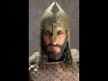

# The Greatness of Saladin (2021-07-14)

## Description

Said to his son al-Malik al-Zahir, on his return from a journey. Source: Abdul Hasan Ali Nadwi: Saviours of Islamic Spirit. Karachi: Darul Ishaat, 1994, pp. 32-33.

## Summary of [The Greatness of Saladin](https://www.youtube.com/watch?v=-I8uL3vG1hI)

*This summary is AI generated - there may be inaccuracies. *

### [00:00:00](https://www.youtube.com/watch?v=-I8uL3vG1hI&t=0) - [00:00:00](https://www.youtube.com/watch?v=-I8uL3vG1hI&t=0)

"The Greatness of Saladin", the viewer is given a glimpse into the life and mind of one of history's most impressive military leaders and humanitarians. In a letter to his son, Saladin writes about the importance of doing the will of God, gaining the hearts of one's subjects, and being prudent in one's dealings with others. He stresses that bloodshed should be avoided whenever possible and that death is something that none of us can escape. Saladin's advice is as relevant today as it was when he first wrote it, and his example is one that we would all do well to follow.

**[00:00:00](https://www.youtube.com/watch?v=-I8uL3vG1hI&t=0)** Saladin writes to his son about the importance of doing the will of God and avoiding bloodshed. He emphasizes the importance of gaining the hearts of one's subjects and stresses the importance of being prudent in one's dealings with others. Saladin concludes his letter by advising his son to be prudent in his dealings with others and to always remember that death spares none.

<h2>Full transcript with timestamps: CLICK TO EXPAND</h2>

[0:00:01](https://youtu.be/-I8uL3vG1hI?t=1) saladin was a great man  
[0:00:04](https://youtu.be/-I8uL3vG1hI?t=4) here is why he wrote the following to  
[0:00:07](https://youtu.be/-I8uL3vG1hI?t=7) his son  
[0:00:09](https://youtu.be/-I8uL3vG1hI?t=9) i commend you to god almighty  
[0:00:12](https://youtu.be/-I8uL3vG1hI?t=12) he is the source of all good do the will  
[0:00:16](https://youtu.be/-I8uL3vG1hI?t=16) of god  
[0:00:16](https://youtu.be/-I8uL3vG1hI?t=16) for that is the way of peace beware of  
[0:00:20](https://youtu.be/-I8uL3vG1hI?t=20) bloodshed  
[0:00:21](https://youtu.be/-I8uL3vG1hI?t=21) trust not in that for spilt blood never  
[0:00:25](https://youtu.be/-I8uL3vG1hI?t=25) sleeps  
[0:00:26](https://youtu.be/-I8uL3vG1hI?t=26) seek to gain the hearts of thy subjects  
[0:00:29](https://youtu.be/-I8uL3vG1hI?t=29) and watch  
[0:00:30](https://youtu.be/-I8uL3vG1hI?t=30) over all their interests for you are  
[0:00:32](https://youtu.be/-I8uL3vG1hI?t=32) only appointed by god  
[0:00:34](https://youtu.be/-I8uL3vG1hI?t=34) and by me to look after their good  
[0:00:38](https://youtu.be/-I8uL3vG1hI?t=38) endeavor to gain the hearts of your  
[0:00:41](https://youtu.be/-I8uL3vG1hI?t=41) emirs your ministers  
[0:00:42](https://youtu.be/-I8uL3vG1hI?t=42) and your nobles i have become as  
[0:00:46](https://youtu.be/-I8uL3vG1hI?t=46) great as i am because i have won the  
[0:00:49](https://youtu.be/-I8uL3vG1hI?t=49) hearts of  
[0:00:50](https://youtu.be/-I8uL3vG1hI?t=50) men by gentleness and kindness  
[0:00:54](https://youtu.be/-I8uL3vG1hI?t=54) never nourish ill feeling against any  
[0:00:57](https://youtu.be/-I8uL3vG1hI?t=57) man  
[0:00:58](https://youtu.be/-I8uL3vG1hI?t=58) for death spares none be prudent  
[0:01:02](https://youtu.be/-I8uL3vG1hI?t=62) in your dealings with other men god will  
[0:01:05](https://youtu.be/-I8uL3vG1hI?t=65) not  
[0:01:05](https://youtu.be/-I8uL3vG1hI?t=65) pardon unless they forgive you  
[0:01:08](https://youtu.be/-I8uL3vG1hI?t=68) but as to that which is between god and  
[0:01:11](https://youtu.be/-I8uL3vG1hI?t=71) yourself  
[0:01:13](https://youtu.be/-I8uL3vG1hI?t=73) he will pardon the penitent for he is  
[0:01:16](https://youtu.be/-I8uL3vG1hI?t=76) gracious  
[0:01:18](https://youtu.be/-I8uL3vG1hI?t=78) sign so  

