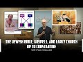

# The Jewish Bible, Gospels, and Early Church up to Constantine with Paul Williams (2022-08-05 20:09:28+00:00)

## Description

The Western Tradition Glossary:
https://bit.ly/3Ql9zYn

You Can Support My Work on Patreon:
https://www.patreon.com/Bloggingtheology

My Paypal Link: 
https://www.paypal.com/paypalme/bloggingtheology?locale.x=en_GB

## Summary of [The Jewish Bible, Gospels, and Early Church up to Constantine with Paul Williams](https://www.youtube.com/watch?v=wLLtdScZnzs)

*This is an AI generated summary. There may be inaccuracies. *

### [00:00:00](https://www.youtube.com/watch?v=wLLtdScZnzs&t=0) - [01:00:00](https://www.youtube.com/watch?v=wLLtdScZnzs&t=3600)

This video discusses the history of Judaism and Christianity, focusing on the importance of the Talmud. It touches on how the rabbinical interpretation of the Torah and Gemara contribute to the development of Islamic law.

**[00:00:00](https://www.youtube.com/watch?v=wLLtdScZnzs&t=0)** The video discusses the importance of the Judeo-Christian tradition in the West, and how Islam has been a part of that tradition for centuries. It then discusses a British king's coin from the 8th century with the shahada on it.
* **[00:05:00](https://www.youtube.com/watch?v=wLLtdScZnzs&t=300)** The Jewish Bible, Gospels, and Early Church up to Constantine with Paul Williams covers the history of Judaism and Christianity, focusing on the importance of the Talmud. The video touches on how the rabbinical interpretation of the Torah and Gemara contribute to the development of Islamic law.
* **[00:10:00](https://www.youtube.com/watch?v=wLLtdScZnzs&t=600)** The Jewish Bible, Gospels, and Early Church up to Constantine with Paul Williams discusses Judaic changes and how the portrayal of Jesus changed over time. Giza Vermes, a prominent scholar in the field, argued that Jesus was a Jew and was not white. This change in perspective led to a decrease in the guilt the West feels for misrepresenting Jesus.
* **[00:15:00](https://www.youtube.com/watch?v=wLLtdScZnzs&t=900)** The four gospels are eyewitness accounts of the life and times of Jesus Christ, written by eyewitnesses. They provide reliable historical information that does not contradict who Jesus was and what he did. The gospel of Matthew is the first gospel written, and it was written by the tax collector Matthew. The gospel of John was written by the apostle John, who knew Jesus well. The gospel of Luke was written by the companion of Paul, Luke, and the gospel of Mark was perhaps closely associated with Peter, the Prince of the Apostles.
* **[00:20:00](https://www.youtube.com/watch?v=wLLtdScZnzs&t=1200)** The first gospel to be written is the gospel of Mark, which tells the same stories as Matthew and Luke, but in parallel Greek columns. Scholars have concluded that Matthew and Luke copied Mark, changing his words in subtle ways to reflect their own theology. This is significant because it shows that early Christianity was significantly different from the later beliefs that developed.
* **[00:25:00](https://www.youtube.com/watch?v=wLLtdScZnzs&t=1500)** This video discusses differences between the Gospels of Mark, Matthew, and Luke, and points out that the later gospels, written in the first century after Jesus' death, reflect Matthean views about Jesus that were later embarrassed to be revealed.
* **[00:30:00](https://www.youtube.com/watch?v=wLLtdScZnzs&t=1800)** Paul Williams discusses the idea that the historical Jesus did not exist, and that the Jesus portrayed in the earlier gospels and in John is a highly developed account of what the author of the fourth gospel believed about Jesus. Christians have to deal with the problem that, if Jesus had gone around making these incredible claims, someone would have noticed it before the end of the first century. However, the evidence that Jesus did not actually exist is "clearly" the view of the overwhelming majority of scholars in the world.
* **[00:35:00](https://www.youtube.com/watch?v=wLLtdScZnzs&t=2100)** The video examines the Gospel of Barnabas, which is a forgery and was likely written by a Renaissance author. It also discusses the Gospel of John, which some Christians believe is the "true" gospel. The presenter notes that different interpretations of these texts can lead to disagreements.
* **[00:40:00](https://www.youtube.com/watch?v=wLLtdScZnzs&t=2400)** Paul Williams discusses the Jewish Bible, Gospels, and Early Church up to Constantine with reference to the Synoptic Gospels, Mark, and Luke. He notes that although the Gospel of Mark was the earliest gospel, it wasn't the only source used by the later gospel writers. Paul also discusses the Pauline Epistles, which were written after the Gospels, and how they reflect on Paul's understanding of Jesus.
* **[00:45:00](https://www.youtube.com/watch?v=wLLtdScZnzs&t=2700)** Paul Williams discusses the differences between the gospel of Jesus Christ as preached by Paul and the gospel of Jesus Christ as preached by Jesus' brother, James. Williams explains that Christianity becomes a gospel about Jesus rather than the actual message of Jesus, which is about Jesus' death on the cross and resurrection.
* **[00:50:00](https://www.youtube.com/watch?v=wLLtdScZnzs&t=3000)** The video discusses the differences between the religions of James the brother of Jesus and Paul of Tarsus, who founded Christianity. James was a Christian who believed in his brother as a messiah, while Paul was a Christian who believed in Jesus as a savior. However, there was a split within the early Christian movement between those who followed James and those who followed Paul, with the latter group becoming known as the Ebionites. The Council of Nicaea in 325 A.D. decided that Jesus was a deity but not the messiah, and that followers of Jesus needed to keep the Jewish law.
* **[00:55:00](https://www.youtube.com/watch?v=wLLtdScZnzs&t=3300)** The video discusses the controversy surrounding who Jesus was – whether he was equal to God or a creative being. It then goes on to discuss the first creed, which declared Jesus to be God. The video finishes by saying that if one wants to be a faithful follower of Jesus today, they must be a Muslim.
### [01:00:00](https://www.youtube.com/watch?v=wLLtdScZnzs&t=3600) - [01:15:00](https://www.youtube.com/watch?v=wLLtdScZnzs&t=4500)

This video discusses the differences between the teachings of Jesus and Paul, and how historical evidence suggests that the gospels are not eyewitness accounts. It also introduces the idea that there is a "reaction against the threat of biblical scholarship" in the form of fundamentalist Christianity.

**[01:00:00](https://www.youtube.com/watch?v=wLLtdScZnzs&t=3600)** The video discusses the differences between the teachings of Jesus and Paul, and points to evidence that suggests early Christians believed that Jesus had abolished the law.
* **[01:05:00](https://www.youtube.com/watch?v=wLLtdScZnzs&t=3900)** The video presents parallels between the teachings of Jesus in the Bible and those found in Islam. It points out, among other things, that the message of Jesus is essentially compatible with Islam.
* **[01:10:00](https://www.youtube.com/watch?v=wLLtdScZnzs&t=4200)** The Jewish Bible, Gospels, and Early Church up to Constantine with Paul Williams discusses the differences between the gospel accounts of Matthew, Mark, and Luke and how historical evidence suggests that they are not eyewitness accounts. Christianity has a fundamental contradiction between the teachings of Jesus and the law, which is addressed by Paul in his letters.
* **[01:15:00](https://www.youtube.com/watch?v=wLLtdScZnzs&t=4500)** The video introduces the idea that there is a "reaction against the threat of biblical scholarship" in the form of fundamentalist Christianity. It goes on to recommend a reading list for those interested in learning more about this topic.

## Full transcript with timestamps

[0:00:04](https://youtu.be/wLLtdScZnzs?t=4) okay salaam alaikum everyone i think we'll make a 
start um just a reminder that the last time we met    
[0:00:14](https://youtu.be/wLLtdScZnzs?t=14) um we were looking at the uh you know what is 
the the western tradition and why should we    
[0:00:19](https://youtu.be/wLLtdScZnzs?t=19) care about it basically we looked at hellenism 
alexandra the great is conquering of vast areas    
[0:00:24](https://youtu.be/wLLtdScZnzs?t=24) of the middle east right up to india the spread 
of greek civilization culture language ideas    
[0:00:30](https://youtu.be/wLLtdScZnzs?t=30) concepts we looked at plato aristotle perhaps the 
two of three socrates the three great philosophers    
[0:00:38](https://youtu.be/wLLtdScZnzs?t=38) of the ancient world and their enduring influence 
in today's world we briefly touched on judaism    
[0:00:45](https://youtu.be/wLLtdScZnzs?t=45) um but today i want to go much more into 
faith particularly christianity and judaism    
[0:00:52](https://youtu.be/wLLtdScZnzs?t=52) and the early church up to constantine 
the emperor constantine in the 4th century  
[0:01:02](https://youtu.be/wLLtdScZnzs?t=62) but before i touch on that  
[0:01:06](https://youtu.be/wLLtdScZnzs?t=66) western politicians particularly america 
for some reason but happens in britain    
[0:01:11](https://youtu.be/wLLtdScZnzs?t=71) as well like to talk about the judeo-christian 
tradition it's this great spiritual philosophical    
[0:01:19](https://youtu.be/wLLtdScZnzs?t=79) intellectual tradition that we're very 
proud of in the west the judeo-christian    
[0:01:24](https://youtu.be/wLLtdScZnzs?t=84) tradition and as i say is often mentioned by 
politicians and defending western values very    
[0:01:29](https://youtu.be/wLLtdScZnzs?t=89) important we defend western values against i'm 
not sure who against but anyway that's the idea    
[0:01:34](https://youtu.be/wLLtdScZnzs?t=94) now it's pretty obvious 
isn't it that this excludes    
[0:01:39](https://youtu.be/wLLtdScZnzs?t=99) islam and muslims even though islam has been a 
crucial part of the west for over a thousand years    
[0:01:48](https://youtu.be/wLLtdScZnzs?t=108) now we all know about islamic spain andalucia 
which i think was nearly eight centuries and    
[0:01:53](https://youtu.be/wLLtdScZnzs?t=113) it was the most advanced place in the entire 
european area in terms of culture science learning    
[0:02:00](https://youtu.be/wLLtdScZnzs?t=120) um in every way conceivable it was the most 
advanced civilization in the heart of europe    
[0:02:04](https://youtu.be/wLLtdScZnzs?t=124) you know in the iberian peninsula what we today 
call spain and portugal and indeed there there's    
[0:02:11](https://youtu.be/wLLtdScZnzs?t=131) so white muslim countries like bosnia of course 
which has a slight majority of uh european muslims    
[0:02:17](https://youtu.be/wLLtdScZnzs?t=137) and other parts of europe which have been muslims 
muslim for hundreds and hundreds of years so islam    
[0:02:23](https://youtu.be/wLLtdScZnzs?t=143) has been part of the european identity history 
civilization and uh and excellence in terms of    
[0:02:30](https://youtu.be/wLLtdScZnzs?t=150) learning for centuries but you wouldn't know that 
by this kind of trope judeo-christian so it should    
[0:02:36](https://youtu.be/wLLtdScZnzs?t=156) really be the judeo-islamic christian tradition 
that would be more accurate more fair now why    
[0:02:44](https://youtu.be/wLLtdScZnzs?t=164) am i showing you this kind does anyone recognize 
this coin by the way does anyone know what it is  
[0:02:52](https://youtu.be/wLLtdScZnzs?t=172) exactly exactly in fact um i think adnan rashid 
who's a friend of mine would love this i think    
[0:02:57](https://youtu.be/wLLtdScZnzs?t=177) he'd love to own this coin but it's unique um 
that's the front and the back so you can just    
[0:03:02](https://youtu.be/wLLtdScZnzs?t=182) about work out in latin i think offer rex rex's 
latin for king offer is the name of the king    
[0:03:10](https://youtu.be/wLLtdScZnzs?t=190) and on the back is some arabic which is not 
very easy to read because it's not a terribly    
[0:03:15](https://youtu.be/wLLtdScZnzs?t=195) accurate copy it's kind of like a mirror image 
rather than an accurate copy so why is this coin    
[0:03:21](https://youtu.be/wLLtdScZnzs?t=201) so important well as as the brother has already 
says um this was this coin was made for author    
[0:03:30](https://youtu.be/wLLtdScZnzs?t=210) he was the king of mercia and he reigned from 757 
to 796 a.d okay so just shortly after well there's    
[0:03:39](https://youtu.be/wLLtdScZnzs?t=219) a harbor actually and the design is uh copied 
directly from a dinar of office contemporary the    
[0:03:48](https://youtu.be/wLLtdScZnzs?t=228) abbasid caliph al-mansur and he reigned he was the 
caliph 136-158 after after hijra after the hijra    
[0:03:59](https://youtu.be/wLLtdScZnzs?t=239) and it's supposed to say that's 
supposed to be the shahada on the right  
[0:04:05](https://youtu.be/wLLtdScZnzs?t=245) and it's in the british library uh in england in 
london and i've seen it it's on display usually    
[0:04:12](https://youtu.be/wLLtdScZnzs?t=252) and it's gold so here we have a king of england 
if you like who was issuing currency coinage    
[0:04:20](https://youtu.be/wLLtdScZnzs?t=260) with the shahada on it in the 8th century    
[0:04:24](https://youtu.be/wLLtdScZnzs?t=264) a.d okay so what's islam got to do with 
europe well the english king was issuing coins    
[0:04:31](https://youtu.be/wLLtdScZnzs?t=271) in arabic and that's his name offer there and 
there's a wonderful um comment on the website    
[0:04:38](https://youtu.be/wLLtdScZnzs?t=278) of the british library which i recommend 
you have a look it says the choice of an    
[0:04:41](https://youtu.be/wLLtdScZnzs?t=281) islamic dinar as a model for offers gold coinage 
should not be interpreted as an indication of    
[0:04:48](https://youtu.be/wLLtdScZnzs?t=288) offers religious beliefs as other evidence leaves 
no doubt that he was a christian which is true the    
[0:04:56](https://youtu.be/wLLtdScZnzs?t=296) coin probably reflects instead the importance 
of the gold dinar in international trade    
[0:05:02](https://youtu.be/wLLtdScZnzs?t=302) it was the dominant coinage in the mediterranean 
and inspired the reintroduction of gold coinage in    
[0:05:09](https://youtu.be/wLLtdScZnzs?t=309) northern europe so you get the real sense of the 
power the commercial political power of the muslim    
[0:05:16](https://youtu.be/wLLtdScZnzs?t=316) world very early on to such an extent that england 
produced coins with the shahadaran in arabic    
[0:05:23](https://youtu.be/wLLtdScZnzs?t=323) okay and this this is the real thing there's 
a wonderful website uh dedicated uh to this    
[0:05:28](https://youtu.be/wLLtdScZnzs?t=328) on the british library you can google it lots 
of information about it i wish this was better    
[0:05:32](https://youtu.be/wLLtdScZnzs?t=332) known uh because this is a literally gold dust 
it's a gold coin so that's just to perhaps knock    
[0:05:40](https://youtu.be/wLLtdScZnzs?t=340) on the idea knock on the head on the idea that 
the judeo-christian tradition excludes islam    
[0:05:45](https://youtu.be/wLLtdScZnzs?t=345) in fact europe the west is very much uh part of 
islamic history as well i mentioned islamic spain  
[0:05:54](https://youtu.be/wLLtdScZnzs?t=354) now i want to briefly touch just change the 
subject now and go back to judaism because    
[0:05:59](https://youtu.be/wLLtdScZnzs?t=359) this is really important subject here is a rabbi 
obviously not a photograph now what's he doing    
[0:06:07](https://youtu.be/wLLtdScZnzs?t=367) he is studying the talmud now christians will 
often say jews follow the old testament yeah    
[0:06:15](https://youtu.be/wLLtdScZnzs?t=375) they follow the old testament christians follow 
the new testament muslims follow the crime that's    
[0:06:19](https://youtu.be/wLLtdScZnzs?t=379) actually not true no jews says they follow the 
old testament what their central text the central    
[0:06:24](https://youtu.be/wLLtdScZnzs?t=384) text of rabbinic judaism which i'll define in a 
second is the talmud what's the talmud well it    
[0:06:31](https://youtu.be/wLLtdScZnzs?t=391) comes in two forms a very very ancient library 
of texts and it's made up of several parts    
[0:06:38](https://youtu.be/wLLtdScZnzs?t=398) um so we have the uh the torah which is i'm 
speaking now i'm trying to understand the    
[0:06:44](https://youtu.be/wLLtdScZnzs?t=404) jewish perspective on this this is the torah 
given to moses on mount sinai of course usually    
[0:06:49](https://youtu.be/wLLtdScZnzs?t=409) identified with the first five books of the old 
testament starting with genesis in the beginning    
[0:06:56](https://youtu.be/wLLtdScZnzs?t=416) now there's a second part of the the talmud called 
the mishnah the mishnah now the mishnah is the    
[0:07:04](https://youtu.be/wLLtdScZnzs?t=424) oral torah hang on jews believe in two torahs yes 
don't believe me google it they do they believe in    
[0:07:12](https://youtu.be/wLLtdScZnzs?t=432) a written torah and an oral torah is a bit like 
the quran and the sunnah if you want to kind of    
[0:07:16](https://youtu.be/wLLtdScZnzs?t=436) see a parallel with islam if you like so they 
believe that god revealed an oral in a verbal    
[0:07:22](https://youtu.be/wLLtdScZnzs?t=442) torah to moses on mount sinai in addition to the 
written torah why would god do that according to    
[0:07:29](https://youtu.be/wLLtdScZnzs?t=449) well because is to give extra detail extra 
instructions for example it says you don't    
[0:07:34](https://youtu.be/wLLtdScZnzs?t=454) work on the sabbath it's the holy day but 
what is that what is work can i cook can i    
[0:07:40](https://youtu.be/wLLtdScZnzs?t=460) you know can i flick a light switch can i what 
does it mean not to work and the oral torah    
[0:07:45](https://youtu.be/wLLtdScZnzs?t=465) gives you all those details about what that 
really means so actually you can't cook on    
[0:07:49](https://youtu.be/wLLtdScZnzs?t=469) this you're not supposed to do labor of any kind 
orthodox jews follow this quite quite strictly so    
[0:07:55](https://youtu.be/wLLtdScZnzs?t=475) the author gives interpretation further directives 
detail how to implement the commandments of god we    
[0:08:01](https://youtu.be/wLLtdScZnzs?t=481) find in the written torah again quran and sunnah 
so we have quran statements in the quran but we    
[0:08:07](https://youtu.be/wLLtdScZnzs?t=487) need the sunnah to perhaps give further detail an 
implementation he's like well the quran says pray    
[0:08:13](https://youtu.be/wLLtdScZnzs?t=493) but how do we pray what do we pray how many were 
cows and so on well the sunnah will give you that    
[0:08:17](https://youtu.be/wLLtdScZnzs?t=497) in a similar kind of way by analogy we have 
the uh the talmud so we've got the written    
[0:08:23](https://youtu.be/wLLtdScZnzs?t=503) torah the oral torah called the mishnah and 
then we have another thing which is part of    
[0:08:28](https://youtu.be/wLLtdScZnzs?t=508) the talmud and this is the central text of 
judaism by the way if you're a devout jew    
[0:08:33](https://youtu.be/wLLtdScZnzs?t=513) today you don't study the old testament you study 
the talmud and that's what that rabbi is doing    
[0:08:38](https://youtu.be/wLLtdScZnzs?t=518) there's a wonderful app actually where millions 
of jews around the world follow a portion of    
[0:08:42](https://youtu.be/wLLtdScZnzs?t=522) the talmud every day and you can follow follow 
him doing it so another part of the talmud is    
[0:08:49](https://youtu.be/wLLtdScZnzs?t=529) something called the gemara and the gemara 
are the the rabbis the sages as they're called    
[0:08:54](https://youtu.be/wLLtdScZnzs?t=534) their discussions arguments disputes um about all 
sorts of things whether it be history philosophy    
[0:09:01](https://youtu.be/wLLtdScZnzs?t=541) the weather you know anything uh that and and this 
is and these discussions are actually recorded    
[0:09:08](https://youtu.be/wLLtdScZnzs?t=548) and now part of the talmud and this kind of 
went on to about the fifth or sixth century a.d    
[0:09:14](https://youtu.be/wLLtdScZnzs?t=554) um before the rise of of islam 
and then it kind of stopped    
[0:09:18](https://youtu.be/wLLtdScZnzs?t=558) and then it kind of codified in many many volumes 
so you've got the the written the oral torah and    
[0:09:24](https://youtu.be/wLLtdScZnzs?t=564) the the gemara which is kind of the rabbinical 
commentaries discussions um and just to make    
[0:09:32](https://youtu.be/wLLtdScZnzs?t=572) it slightly more complicated there are actually 
two talmuds there's a babylonian talmud which is    
[0:09:36](https://youtu.be/wLLtdScZnzs?t=576) the main one used today by jews around the world 
and there's also the palestinian or the jerusalem    
[0:09:43](https://youtu.be/wLLtdScZnzs?t=583) talmud which is earlier and shorter but the one 
that vast majority of jews use today is the um    
[0:09:51](https://youtu.be/wLLtdScZnzs?t=591) babylonian of course well why jews in babylon 
well we know from the exile it's all there in    
[0:09:56](https://youtu.be/wLLtdScZnzs?t=596) the old testament they got exiled in iraq 
or mesopotamia whatever you want to call it    
[0:10:01](https://youtu.be/wLLtdScZnzs?t=601) so the talmud is absolutely central to the jewish 
faith what is rabbinic judaism so i come back to    
[0:10:07](https://youtu.be/wLLtdScZnzs?t=607) that because judaism is not just one thing that's 
always been just the same since the beginning    
[0:10:12](https://youtu.be/wLLtdScZnzs?t=612) it has actually changed uh fundamentally and 
the the key historical event to mark that change    
[0:10:19](https://youtu.be/wLLtdScZnzs?t=619) is the destruction of the temple in jerusalem 
in ad70 and that changed everything and then in    
[0:10:26](https://youtu.be/wLLtdScZnzs?t=626) fact in the second century because of the ongoing 
threat the existential threat to the jewish people    
[0:10:33](https://youtu.be/wLLtdScZnzs?t=633) from the romans it was decided to write down 
the oral torah as the mishnah so now we have    
[0:10:40](https://youtu.be/wLLtdScZnzs?t=640) two written torahs but it's so called the oral 
torah because there was a real threat that um i    
[0:10:45](https://youtu.be/wLLtdScZnzs?t=645) mean it's like with the the early sahabah someone 
who were killed in battle you know who memorized    
[0:10:49](https://youtu.be/wLLtdScZnzs?t=649) the quran we need to perhaps there's a similar 
kind of dynamic at work i think so that that's um    
[0:10:56](https://youtu.be/wLLtdScZnzs?t=656) very very briefly is judaism and it's not 
quite the same as the religion of jesus or    
[0:11:01](https://youtu.be/wLLtdScZnzs?t=661) the origin of moses peace be upon them both 
and i'll explain why um as we go forward    
[0:11:08](https://youtu.be/wLLtdScZnzs?t=668) so let's have a look oh yes okay i'm just going 
to talk about um a man called jesus now who was    
[0:11:23](https://youtu.be/wLLtdScZnzs?t=683) jesus what did he look like well we all know in 
the west he was a white guy he was a caucasian    
[0:11:28](https://youtu.be/wLLtdScZnzs?t=688) of course he was there's a photograph and 
he's actually a famous hollywood actor    
[0:11:33](https://youtu.be/wLLtdScZnzs?t=693) he's a white dude how do we know 
that because you can see the movies    
[0:11:37](https://youtu.be/wLLtdScZnzs?t=697) you can see the art in churches you can see 
the statues well not that you'd want to see    
[0:11:41](https://youtu.be/wLLtdScZnzs?t=701) statues but there are lots of statues 
of jesus in your local catholic church    
[0:11:46](https://youtu.be/wLLtdScZnzs?t=706) of a white guy with a beard pretty fairly handsome 
probably his mid-thirties and his mother of course    
[0:11:52](https://youtu.be/wLLtdScZnzs?t=712) is white as well she always wears a hijab by the 
way i find which is interesting so she's a hijabi    
[0:12:00](https://youtu.be/wLLtdScZnzs?t=720) white caucasian woman in western consciousness 
western art um why is that wrong by the way    
[0:12:07](https://youtu.be/wLLtdScZnzs?t=727) because the west tells us that jesus was white 
but why why is that a problem mad of interest  
[0:12:15](https://youtu.be/wLLtdScZnzs?t=735) okay so he was from the middle east you say 
gosh okay so he wasn't from england okay  
[0:12:29](https://youtu.be/wLLtdScZnzs?t=749) this is actually a very good point perhaps in 
mitigation for the the guilt that the west have    
[0:12:33](https://youtu.be/wLLtdScZnzs?t=753) for misrepresenting jesus if you look at japanese 
and chinese iconography which you can just google    
[0:12:39](https://youtu.be/wLLtdScZnzs?t=759) it you'll see a japanese jesus or a chinese jesus 
if you look in sub-saharan african you'll see a    
[0:12:45](https://youtu.be/wLLtdScZnzs?t=765) black a somali jesus you'll see what it so 
actually everyone does it but because of the    
[0:12:49](https://youtu.be/wLLtdScZnzs?t=769) the dominance of the west in defining faith and 
images of religious leaders we tend to go with    
[0:12:56](https://youtu.be/wLLtdScZnzs?t=776) with that um so that's the first point he 
wasn't white he he was a jew he was an israelite    
[0:13:03](https://youtu.be/wLLtdScZnzs?t=783) um i'm not sure what he would have looked like 
we don't know we have no photographs of course    
[0:13:07](https://youtu.be/wLLtdScZnzs?t=787) but he certainly would have looked like 
me he would have looked um he might    
[0:13:11](https://youtu.be/wLLtdScZnzs?t=791) he would have appeared more perhaps 
of an out like an arrow perhaps  
[0:13:16](https://youtu.be/wLLtdScZnzs?t=796) now all this changed by the way in popular 
consciousness particularly in biblical scholarship    
[0:13:23](https://youtu.be/wLLtdScZnzs?t=803) with the writing of a book this one by a guy 
called giza vermesh that's how you pronounce it    
[0:13:31](https://youtu.be/wLLtdScZnzs?t=811) and he wrote a book in 1973 called 
jesus the jew jesus was a jew  
[0:13:38](https://youtu.be/wLLtdScZnzs?t=818) yes actually he was a jew and this i forget 
this guy's name he's um in one of the hollywood    
[0:13:44](https://youtu.be/wLLtdScZnzs?t=824) films portraying jesus i can't remember his 
name doesn't matter it's not important um so  
[0:13:53](https://youtu.be/wLLtdScZnzs?t=833) this guy giza varmish by the way very very 
interesting he was uh he died just a couple    
[0:13:57](https://youtu.be/wLLtdScZnzs?t=837) of years ago he was a hungarian jew by birth by 
ethnicity and in the 1930s because he he was a    
[0:14:05](https://youtu.be/wLLtdScZnzs?t=845) young man in the 1930s he uh was baptized 
as a catholic roman catholic but he became    
[0:14:11](https://youtu.be/wLLtdScZnzs?t=851) a catholic priest and he'd hoped that this would 
save him from the holocaust because obviously that    
[0:14:18](https://youtu.be/wLLtdScZnzs?t=858) was obviously extremely important threat at that 
time so he left um it didn't and he left hungary    
[0:14:26](https://youtu.be/wLLtdScZnzs?t=866) and ended up in england of all places and and he 
ended up being a professor of jewish studies at    
[0:14:33](https://youtu.be/wLLtdScZnzs?t=873) the university of oxford and in his generation he 
was probably the most distinguished jesus scholar    
[0:14:39](https://youtu.be/wLLtdScZnzs?t=879) in the world and he's actually more famous for 
being the world's expert on the dead sea scrolls    
[0:14:45](https://youtu.be/wLLtdScZnzs?t=885) so if you get the the standard critical edition 
of dead sea scrolls published by oxy university    
[0:14:49](https://youtu.be/wLLtdScZnzs?t=889) press he's the guy that edited it translated it 
from the original languages uh into english so    
[0:14:56](https://youtu.be/wLLtdScZnzs?t=896) he's the foremost expert on the destiny scots but 
he's actually a brilliant jesus scholar as it's    
[0:15:00](https://youtu.be/wLLtdScZnzs?t=900) called as well and in 1973 he published this book 
which i've read and what was really revolutionary    
[0:15:07](https://youtu.be/wLLtdScZnzs?t=907) for many people is the idea that jesus wasn't a 
gentile he didn't he wasn't a westerner he was a    
[0:15:12](https://youtu.be/wLLtdScZnzs?t=912) jew but not just a label he was a jew jesus was a 
torah observant jew you could understand jesus in    
[0:15:18](https://youtu.be/wLLtdScZnzs?t=918) his historical context using the earliest evidence 
we have written evidence and other evidence    
[0:15:24](https://youtu.be/wLLtdScZnzs?t=924) you have an understanding he develops an 
understanding of jesus it's actually quite    
[0:15:27](https://youtu.be/wLLtdScZnzs?t=927) different from the christian understanding in fact 
there's an understatement for giza varmish jesus    
[0:15:33](https://youtu.be/wLLtdScZnzs?t=933) the real historical jesus was a a jewish wise man 
he was a prophet an eschatological prophet perhaps    
[0:15:42](https://youtu.be/wLLtdScZnzs?t=942) um he certainly didn't preach that he 
was god or the trinity or the church    
[0:15:46](https://youtu.be/wLLtdScZnzs?t=946) these were later ideas he argued um and he 
has written a number of books i do recommend    
[0:15:51](https://youtu.be/wLLtdScZnzs?t=951) them all they're quite brilliant and highly 
regarded by by biblical uh biblical scholars  
[0:15:58](https://youtu.be/wLLtdScZnzs?t=958) um now i just want to introduce you to the uh 
the four gospels why is this important why are    
[0:16:06](https://youtu.be/wLLtdScZnzs?t=966) we why am i even talking about the gospels 
we're in turkey the western tradition well    
[0:16:12](https://youtu.be/wLLtdScZnzs?t=972) i would say that the bible is the single most 
important and significant book in the history    
[0:16:19](https://youtu.be/wLLtdScZnzs?t=979) of western civilization bar none it's the most 
important and within that the gospels are the    
[0:16:25](https://youtu.be/wLLtdScZnzs?t=985) most important texts within the bible bar none 
so whether or not you're a devout christian who    
[0:16:31](https://youtu.be/wLLtdScZnzs?t=991) reads these for inspiration and guidance 
or you're a historian trying to understand    
[0:16:35](https://youtu.be/wLLtdScZnzs?t=995) the nature of the texts what they're really 
saying or you're just curious these are the    
[0:16:41](https://youtu.be/wLLtdScZnzs?t=1001) at the most important i think over the last 2000 
years texts of all deforming the western mind and    
[0:16:47](https://youtu.be/wLLtdScZnzs?t=1007) particularly perceptions of other religions like 
islam as well so you know they're important and    
[0:16:52](https://youtu.be/wLLtdScZnzs?t=1012) they're worth knowing about so there are four 
gospels uh what are gospels these are basically    
[0:16:58](https://youtu.be/wLLtdScZnzs?t=1018) well i'm not going to give you very very briefly 
the standard christian view of what these gospels    
[0:17:04](https://youtu.be/wLLtdScZnzs?t=1024) are and what they say and why they're important 
and then i'll tell you what scholars have been    
[0:17:08](https://youtu.be/wLLtdScZnzs?t=1028) saying for the last two centuries and they're 
not the same quite a big difference so they're    
[0:17:14](https://youtu.be/wLLtdScZnzs?t=1034) i'm now going to act like a christian so 
i'm going to tell you what the gospels are    
[0:17:19](https://youtu.be/wLLtdScZnzs?t=1039) from a christian point of view it's not my opinion 
but i'm just going to play this role for a second    
[0:17:24](https://youtu.be/wLLtdScZnzs?t=1044) so the four gospels obviously they're the word of 
god they are eyewitness accounts of the life and    
[0:17:29](https://youtu.be/wLLtdScZnzs?t=1049) times of jesus written by eyewitnesses so matthew 
the first gospel was written by the tax collector    
[0:17:36](https://youtu.be/wLLtdScZnzs?t=1056) matthew who knew jesus the last gospel john is 
written by the apostle john who knew jesus so well    
[0:17:43](https://youtu.be/wLLtdScZnzs?t=1063) and luke was a companion of paul paul was 
another apostle and mark was perhaps uh    
[0:17:50](https://youtu.be/wLLtdScZnzs?t=1070) closely associated with peter the prince of 
the apostles so these these gospels give us    
[0:17:56](https://youtu.be/wLLtdScZnzs?t=1076) reliable accurate historical information that 
not really any contradictions about who jesus    
[0:18:01](https://youtu.be/wLLtdScZnzs?t=1081) was and jesus was god and he died for our sins 
on the cross um that's been very simplistically    
[0:18:08](https://youtu.be/wLLtdScZnzs?t=1088) put now i'm going to take off my christian 
hat and come back to what scholars are saying    
[0:18:14](https://youtu.be/wLLtdScZnzs?t=1094) please yes i should say by do ask 
questions i'm not rambling on here carry on  
[0:18:21](https://youtu.be/wLLtdScZnzs?t=1101) yes christian yes the sisters asking the    
[0:18:23](https://youtu.be/wLLtdScZnzs?t=1103) the the new testament the gospel is 
seen as the word of god absolutely  
[0:18:30](https://youtu.be/wLLtdScZnzs?t=1110) i'll come to that how can they yes i i 
come to that in a second how can they be    
[0:18:33](https://youtu.be/wLLtdScZnzs?t=1113) eyewitness accounts i'll come to that so the 
to taking off the christian hat and putting on    
[0:18:39](https://youtu.be/wLLtdScZnzs?t=1119) what scholars would say and by scholars i mean 
academics at mainstream universities oxford    
[0:18:45](https://youtu.be/wLLtdScZnzs?t=1125) cambridge harvard yale stanford you name 
it you know this is mainstream historical    
[0:18:49](https://youtu.be/wLLtdScZnzs?t=1129) research that's been conducted for a couple of 
centuries now this is not my wacky ideas or some    
[0:18:53](https://youtu.be/wLLtdScZnzs?t=1133) kind of marginal theory i'm trying to give you the 
standard narrative i'm not saying it's infallible    
[0:18:58](https://youtu.be/wLLtdScZnzs?t=1138) but i'm saying it's really worth looking at and 
and being aware of so just take a few random    
[0:19:04](https://youtu.be/wLLtdScZnzs?t=1144) examples the gospels are eyewitness testimony 
no they're not scholars don't think that anymore    
[0:19:11](https://youtu.be/wLLtdScZnzs?t=1151) matthew's gospel the first gospel is not written 
by matthew how do we know that well firstly the    
[0:19:17](https://youtu.be/wLLtdScZnzs?t=1157) gospel isn't claimed to be written by matthew 
it doesn't claim to be eyewitness testimony    
[0:19:21](https://youtu.be/wLLtdScZnzs?t=1161) and it doesn't read like a text produced by a 
disciple of jesus who will probably be illiterate    
[0:19:28](https://youtu.be/wLLtdScZnzs?t=1168) i wouldn't be writing in greek because all the 
gospels written in greek not in the language of    
[0:19:33](https://youtu.be/wLLtdScZnzs?t=1173) jesus jesus spoke aramaic which is cognate 
to arabic and hebrew actually they're quite    
[0:19:41](https://youtu.be/wLLtdScZnzs?t=1181) similar languages in many many words i'm sure 
many of you know the gospels are not written in    
[0:19:45](https://youtu.be/wLLtdScZnzs?t=1185) the language of jesus they're in greek remember 
we talk about hellenization alexandra the great    
[0:19:49](https://youtu.be/wLLtdScZnzs?t=1189) this is another fruit of that they're written 
in greek so not eyewitness they're written in    
[0:19:54](https://youtu.be/wLLtdScZnzs?t=1194) the second generation they're not the first 
generation the second generation after jesus    
[0:19:59](https://youtu.be/wLLtdScZnzs?t=1199) and then um in the handout by the way you which 
you i have copies if you want i i mentioned    
[0:20:04](https://youtu.be/wLLtdScZnzs?t=1204) something called marcan priority 
again this is what scholars say    
[0:20:08](https://youtu.be/wLLtdScZnzs?t=1208) scholars have worked out that the first 
gospel to be written is the gospel of mark    
[0:20:12](https://youtu.be/wLLtdScZnzs?t=1212) mark and priority that's what that jargon 
means this is the view that mark was the    
[0:20:17](https://youtu.be/wLLtdScZnzs?t=1217) first of the gospels to be written and was 
one of the sources used by matthew and luke    
[0:20:23](https://youtu.be/wLLtdScZnzs?t=1223) so the four gospels matthew mark luke and john the 
first was written by mark and i want to introduce    
[0:20:31](https://youtu.be/wLLtdScZnzs?t=1231) you to we don't have much time so i'm going to 
rush through this forgive me but i just want you    
[0:20:35](https://youtu.be/wLLtdScZnzs?t=1235) to i want to touch on some key ideas and you can 
we can discuss them further but something called    
[0:20:40](https://youtu.be/wLLtdScZnzs?t=1240) the synoptic gospels on the handout it i mentioned 
it there i'll just read what it says the gospels    
[0:20:45](https://youtu.be/wLLtdScZnzs?t=1245) of matthew mark and luke which narrates so many 
of the same stories that they can be placed side    
[0:20:51](https://youtu.be/wLLtdScZnzs?t=1251) by side in parallel columns in the greek and 
so can be seen together as the literal meaning    
[0:20:58](https://youtu.be/wLLtdScZnzs?t=1258) of synoptic so you get the same stories um in 
parallel greek columns you have the story in mark    
[0:21:05](https://youtu.be/wLLtdScZnzs?t=1265) then you have the the similar story in matthew 
then you have the stimulus story in luke and you    
[0:21:10](https://youtu.be/wLLtdScZnzs?t=1270) can compare the stories how they're told what 
happens who says what are there any differences    
[0:21:16](https://youtu.be/wLLtdScZnzs?t=1276) and scholars have concluded overwhelmingly that 
matthew and luke copy mark they gobble up mark    
[0:21:23](https://youtu.be/wLLtdScZnzs?t=1283) they basically edit mark they take mark and they 
change mark in subtle or not so subtle ways to    
[0:21:29](https://youtu.be/wLLtdScZnzs?t=1289) reflect their own views their own theology their 
own understanding of jesus their own understanding    
[0:21:34](https://youtu.be/wLLtdScZnzs?t=1294) of the law by which i mean the jewish law the 
torah and there's the surprising differences so  
[0:21:42](https://youtu.be/wLLtdScZnzs?t=1302) i want to give you an example of this um at 
work um there is a story in the earliest gospel    
[0:21:50](https://youtu.be/wLLtdScZnzs?t=1310) mark chapter 10 which i'm 
just going to read to you    
[0:21:54](https://youtu.be/wLLtdScZnzs?t=1314) and then explain to you how the later gospels 
change the story and why this is so significant    
[0:22:02](https://youtu.be/wLLtdScZnzs?t=1322) so mark chapter 10 verses 17 onwards i'm not going 
to read the whole thing but it goes like this i'm    
[0:22:09](https://youtu.be/wLLtdScZnzs?t=1329) looking i'm reading from the new revised standing 
version which is the standard academic translation    
[0:22:14](https://youtu.be/wLLtdScZnzs?t=1334) into english as he was setting out on a journey 
a man ran up and knelt before jesus and asked him    
[0:22:22](https://youtu.be/wLLtdScZnzs?t=1342) good teacher what must i do to inherit eternal 
life jesus said to him why do you call me good    
[0:22:31](https://youtu.be/wLLtdScZnzs?t=1351) there's no one good but god alone remember this 
is the earliest gospel there's no wonder why    
[0:22:37](https://youtu.be/wLLtdScZnzs?t=1357) are you calling me good jesus says you know the 
commandments do not murder do not commit adultery    
[0:22:43](https://youtu.be/wLLtdScZnzs?t=1363) don't steal don't bear false witness don't defraud 
honor your father and mother the man said to him    
[0:22:48](https://youtu.be/wLLtdScZnzs?t=1368) teacher i have kept all these since my youth 
jesus excuse me jesus looking at him loved him    
[0:22:55](https://youtu.be/wLLtdScZnzs?t=1375) and said you lack one thing it's the one thing 
he lacks to get eternal life go sell what you    
[0:23:04](https://youtu.be/wLLtdScZnzs?t=1384) own and give the money to the poor and you will 
have treasure in heaven and then come follow me    
[0:23:13](https://youtu.be/wLLtdScZnzs?t=1393) so this is quite a startling passage for many 
people and many scholars like dale martin at yale    
[0:23:19](https://youtu.be/wLLtdScZnzs?t=1399) one of the world's leading biblical scholars who 
i've spoken to about this you can see the video    
[0:23:23](https://youtu.be/wLLtdScZnzs?t=1403) on videos on blogging theology consider this one 
of the most reliable and authentic statements from    
[0:23:28](https://youtu.be/wLLtdScZnzs?t=1408) the historical jesus why because it's so unlike 
later beliefs about jesus here jesus apparently    
[0:23:34](https://youtu.be/wLLtdScZnzs?t=1414) is denying he's god he's not saying yeah i'm good 
thanks i'm god you know you say why do you call    
[0:23:41](https://youtu.be/wLLtdScZnzs?t=1421) me good jesus is being humble he's being a devout 
jew who says look goodness real goodness belongs    
[0:23:46](https://youtu.be/wLLtdScZnzs?t=1426) to god alone don't use that word of me that's 
how i i understand it that's the first thing    
[0:23:52](https://youtu.be/wLLtdScZnzs?t=1432) and secondly the man who comes to jesus saying 
good teacher what do i do to inherit eternal    
[0:23:59](https://youtu.be/wLLtdScZnzs?t=1439) life you know what i do to be saved how do 
i enter into paradise how do i get into the    
[0:24:02](https://youtu.be/wLLtdScZnzs?t=1442) akira and be successful in the next life jesus 
gives them an answer you obey the commandments    
[0:24:08](https://youtu.be/wLLtdScZnzs?t=1448) what's that got to do with christianity you know 
don't steal don't fraud honor your father and    
[0:24:13](https://youtu.be/wLLtdScZnzs?t=1453) mother this is the quotes from the torah and 
the man says i've done all that you know it's    
[0:24:19](https://youtu.be/wLLtdScZnzs?t=1459) not difficult not to kill people not necessarily 
difficult not to steal and so you can probably    
[0:24:23](https://youtu.be/wLLtdScZnzs?t=1463) do that jesus says you lack one thing this is the 
one thing he needs to get to eternal eternal life    
[0:24:29](https://youtu.be/wLLtdScZnzs?t=1469) go sell what you own and give your money to the 
poor and you will have treasure in heaven wow this    
[0:24:36](https://youtu.be/wLLtdScZnzs?t=1476) is christianity is it is this christianity is this 
what you hear from an evangelist in the pulpit    
[0:24:41](https://youtu.be/wLLtdScZnzs?t=1481) now that's the first thing matthew as i say quotes 
from mark he actually has this passage in front    
[0:24:49](https://youtu.be/wLLtdScZnzs?t=1489) of him this is the standard academic understanding 
and he changes the words of jesus so i'm not going    
[0:24:54](https://youtu.be/wLLtdScZnzs?t=1494) to go to matthew chapter 19 verse 16 onwards and 
we'll read the same story and see what happens  
[0:25:07](https://youtu.be/wLLtdScZnzs?t=1507) if i can find it  
[0:25:10](https://youtu.be/wLLtdScZnzs?t=1510) what was it again 1916 let's get the right passage  
[0:25:16](https://youtu.be/wLLtdScZnzs?t=1516) okay 1916. so just read what matthew says and 
then i'll um comment on it then someone came    
[0:25:23](https://youtu.be/wLLtdScZnzs?t=1523) to him this is jesus and said teacher what 
good deed must i do to have eternal life    
[0:25:30](https://youtu.be/wLLtdScZnzs?t=1530) and he said to him why do you ask me about 
what is good there is only one who is good    
[0:25:36](https://youtu.be/wLLtdScZnzs?t=1536) if you wish to enter into life keep the 
commandments it means the jewish commandments    
[0:25:42](https://youtu.be/wLLtdScZnzs?t=1542) which ones and jesus said don't 
murder don't commit adultery    
[0:25:46](https://youtu.be/wLLtdScZnzs?t=1546) the same ones um and then he says if you wish to 
be perfect because he lacks one thing again go    
[0:25:52](https://youtu.be/wLLtdScZnzs?t=1552) sell your possessions and give the money to 
the poor and you will have treasure in heaven  
[0:25:59](https://youtu.be/wLLtdScZnzs?t=1559) now attentive listeners and readers have long 
noticed that the words of jesus here are different    
[0:26:04](https://youtu.be/wLLtdScZnzs?t=1564) in mark you have jesus denying he is good in 
matthew in matthew's version jesus says instead    
[0:26:10](https://youtu.be/wLLtdScZnzs?t=1570) of saying why do you call me good jesus says 
why do you ask me about what is good there is    
[0:26:16](https://youtu.be/wLLtdScZnzs?t=1576) only one who is good huh what's going on there so 
i remember i i asked this question of john barton    
[0:26:24](https://youtu.be/wLLtdScZnzs?t=1584) is professor of the bible at oxford one of the 
world's most distinguished biblical scholars he's    
[0:26:28](https://youtu.be/wLLtdScZnzs?t=1588) an ordained church of england minister as well 
and he he says that matthew has been dishonest    
[0:26:35](https://youtu.be/wLLtdScZnzs?t=1595) his word not mine why because he's changed the 
words of jesus why has he changed the words of    
[0:26:40](https://youtu.be/wLLtdScZnzs?t=1600) jesus many scholars think that because matthew 
was embarrassed that jesus denied that he was god    
[0:26:47](https://youtu.be/wLLtdScZnzs?t=1607) in mark so he changes the words of jesus because 
it doesn't fit in with matthew's views about who    
[0:26:53](https://youtu.be/wLLtdScZnzs?t=1613) jesus was later in the first century to better 
reflect what matthew really thinks about jesus    
[0:26:59](https://youtu.be/wLLtdScZnzs?t=1619) so he he removes that embarrassment he then has 
jesus say why do you ask me about what is good    
[0:27:04](https://youtu.be/wLLtdScZnzs?t=1624) well you're the messiah it's pretty you should 
bear to ask you questions like that but anyway    
[0:27:09](https://youtu.be/wLLtdScZnzs?t=1629) and then he has uh jesus say if you wish to enter 
into life keep the commandments which is a very    
[0:27:14](https://youtu.be/wLLtdScZnzs?t=1634) jewish answer this is the jewish jesus the jew 
coming out here um so i mentioned this example    
[0:27:21](https://youtu.be/wLLtdScZnzs?t=1641) because that and there are many examples which i'm 
not going to go into of how later gospels change    
[0:27:26](https://youtu.be/wLLtdScZnzs?t=1646) alter embellish delete invent stories sayings 
about jesus to better reflect what they think    
[0:27:36](https://youtu.be/wLLtdScZnzs?t=1656) in the later centuries in the later decades of the 
first century all this is standard scholarly stuff    
[0:27:42](https://youtu.be/wLLtdScZnzs?t=1662) if you're a christian you study this at 
university which i did it's bull it's like  
[0:27:49](https://youtu.be/wLLtdScZnzs?t=1669) how can this be true but this is the historical 
understanding of the gospels now i've not    
[0:27:56](https://youtu.be/wLLtdScZnzs?t=1676) mentioned john yet there's a four the four gospels 
the last to be written was the gospel of john and    
[0:28:00](https://youtu.be/wLLtdScZnzs?t=1680) all written in the first century according to 
most scholars between ad70 and about ad95 so    
[0:28:06](https://youtu.be/wLLtdScZnzs?t=1686) marks are written about a.d 70ish about 
the time of destruction of the temple    
[0:28:10](https://youtu.be/wLLtdScZnzs?t=1690) and the last be written is the gospel of 
john no it's not an eyewitness account    
[0:28:14](https://youtu.be/wLLtdScZnzs?t=1694) it doesn't say who the author is it doesn't name 
john christians will say yes it does i say okay    
[0:28:22](https://youtu.be/wLLtdScZnzs?t=1702) show me where and there's usually several minutes 
of fumbling around in the bible until they realize    
[0:28:27](https://youtu.be/wLLtdScZnzs?t=1707) it's not actually mentioned by name remarkable 
isn't it the the titles the gospel according to    
[0:28:32](https://youtu.be/wLLtdScZnzs?t=1712) matthew mark luke and john which is found at 
the beginning these these titles or headings    
[0:28:37](https://youtu.be/wLLtdScZnzs?t=1717) were added in the late second century and 
we know this because someone called irenaeus    
[0:28:41](https://youtu.be/wLLtdScZnzs?t=1721) bishop of leon in france was the guy who first 
mentions this long after they were written    
[0:28:47](https://youtu.be/wLLtdScZnzs?t=1727) they're anonymous we don't know who wrote them 
anyway back to john john is the cinderella that's    
[0:28:52](https://youtu.be/wLLtdScZnzs?t=1732) not the right word john is the odd one out and 
this has been long noticed by scholars matthew    
[0:28:58](https://youtu.be/wLLtdScZnzs?t=1738) mark and luke you have these are synoptic gospels 
they actually are quite similar and they feel    
[0:29:02](https://youtu.be/wLLtdScZnzs?t=1742) jesus teaching is pretty much similar you go to 
john and you're in a different world here in john    
[0:29:10](https://youtu.be/wLLtdScZnzs?t=1750) jesus walks around saying i am the light of 
the world or before abraham was i am or i am    
[0:29:18](https://youtu.be/wLLtdScZnzs?t=1758) the resurrection and the life uh i i am the i am 
the light of the world it's amazing statements    
[0:29:26](https://youtu.be/wLLtdScZnzs?t=1766) they're only found in one place nowhere else in 
the entire bible are they found that only found in    
[0:29:31](https://youtu.be/wLLtdScZnzs?t=1771) the gospel of john and the way jesus speaks about 
his message uh his kerygma what he preaches is    
[0:29:37](https://youtu.be/wLLtdScZnzs?t=1777) very different in john than matthew mark and luke 
and scholars have concluded like 99 of scholars    
[0:29:43](https://youtu.be/wLLtdScZnzs?t=1783) have concluded and that's not my statistic 
that comes from um a book i recommend in the uh    
[0:29:49](https://youtu.be/wLLtdScZnzs?t=1789) recommended reading by the way by the historical 
figure of jesus on the handout by ep saunders one    
[0:29:55](https://youtu.be/wLLtdScZnzs?t=1795) of america's great biblical scholars he says 99 
of biblical scholars in the last two centuries    
[0:30:01](https://youtu.be/wLLtdScZnzs?t=1801) have concluded that the historical jesus the 
real jesus is to be found in the earlier gospels    
[0:30:07](https://youtu.be/wLLtdScZnzs?t=1807) and that john represents a highly 
interpreted developed account    
[0:30:12](https://youtu.be/wLLtdScZnzs?t=1812) of what the author of the fourth gospel 
believed about jesus and i'm reminded    
[0:30:18](https://youtu.be/wLLtdScZnzs?t=1818) some words of richard burridge his professor at 
king's college in london also ordained minister    
[0:30:23](https://youtu.be/wLLtdScZnzs?t=1823) how do christians deal with this problem he's 
basically saying that they're secondary jesus    
[0:30:26](https://youtu.be/wLLtdScZnzs?t=1826) didn't go around saying these things and how how 
do why do they conclude this if jesus had gone    
[0:30:33](https://youtu.be/wLLtdScZnzs?t=1833) around galilee downtown jerusalem in a.d 30 saying 
i am the light of the world before abraham was    
[0:30:40](https://youtu.be/wLLtdScZnzs?t=1840) i am this is the divine name the tetragrammaton 
found in exodus 15. if you'd really done that how    
[0:30:46](https://youtu.be/wLLtdScZnzs?t=1846) come matthew never mentions this how come luke 
who says in the beginning of his gospel uh you    
[0:30:51](https://youtu.be/wLLtdScZnzs?t=1851) know dear theophilus i'm i'm going to write to you 
an orderly account of everything that's happened    
[0:30:56](https://youtu.be/wLLtdScZnzs?t=1856) amongst us how can luke knows nothing about 
this teaching of jesus how come matthew knows    
[0:31:01](https://youtu.be/wLLtdScZnzs?t=1861) nothing about this teaching eugene how come no 
one knows anything about this teaching of jesus    
[0:31:05](https://youtu.be/wLLtdScZnzs?t=1865) apart from the latest gospel written the 
end of the first century so 99 of scholars    
[0:31:11](https://youtu.be/wLLtdScZnzs?t=1871) included this is not historical because if he 
had gone around making these incredible claims    
[0:31:17](https://youtu.be/wLLtdScZnzs?t=1877) then someone would have noticed it before the end 
of the first century obviously but it's left no    
[0:31:22](https://youtu.be/wLLtdScZnzs?t=1882) trace in the earlier jesus tradition in historical 
evidence at all so and to be crude it's made up    
[0:31:31](https://youtu.be/wLLtdScZnzs?t=1891) now scholars by the way don't use words like that 
they don't say always made up because that's too    
[0:31:36](https://youtu.be/wLLtdScZnzs?t=1896) crude what they say is the jargon of the trade 
they say it's secondary it's secondary material    
[0:31:42](https://youtu.be/wLLtdScZnzs?t=1902) so you've got to kind of decode this language here 
but they really mean is he didn't actually say it    
[0:31:46](https://youtu.be/wLLtdScZnzs?t=1906) and that's the view of the overwhelming 
vast majority of scholars in the world    
[0:31:50](https://youtu.be/wLLtdScZnzs?t=1910) and most scholars are christians they don't 
want to reach this conclusion that's been honest    
[0:31:56](https://youtu.be/wLLtdScZnzs?t=1916) okay so um that's my very brief uh just to go back 
to the glossary by the way which um i've got extra    
[0:32:04](https://youtu.be/wLLtdScZnzs?t=1924) copies if you want um i've got i mentioned mark 
and priority i mentioned the synoptic gospels    
[0:32:10](https://youtu.be/wLLtdScZnzs?t=1930) and i mentioned the term um son of god i'll just 
briefly touch on this because it's a bit of a    
[0:32:14](https://youtu.be/wLLtdScZnzs?t=1934) it's interesting issue what does son of 
god mean you've asked many christians well    
[0:32:18](https://youtu.be/wLLtdScZnzs?t=1938) son of god god the son it means he's 
god obviously that's what the word means    
[0:32:23](https://youtu.be/wLLtdScZnzs?t=1943) no it doesn't mean that at all it meant that 
later on in christian tradition any human being    
[0:32:29](https://youtu.be/wLLtdScZnzs?t=1949) human or angels with a close relationship with 
god and who mediates god's will on earth can be    
[0:32:36](https://youtu.be/wLLtdScZnzs?t=1956) called as son of god and it's interesting adam 
is called the son of god in the gospel of luke    
[0:32:44](https://youtu.be/wLLtdScZnzs?t=1964) chapter 3 verse 38 look it up luke calls adam the 
son of god is luke divine of course not david's    
[0:32:51](https://youtu.be/wLLtdScZnzs?t=1971) called the son of god lots of people are called 
sons of gods in the bible and in jesus as reported    
[0:32:57](https://youtu.be/wLLtdScZnzs?t=1977) have said in matthew blessed are the peacemakers 
for they should be called sons of god it didn't    
[0:33:03](https://youtu.be/wLLtdScZnzs?t=1983) mean the second person of the trinity as as i 
put in the hand out here it's anyone with a close    
[0:33:08](https://youtu.be/wLLtdScZnzs?t=1988) relationship with god who mediates god's will 
on earth so lots of people it didn't mean that    
[0:33:13](https://youtu.be/wLLtdScZnzs?t=1993) in the jewish context jesus the jew if he it was 
addressed understood to be son of god it did not    
[0:33:20](https://youtu.be/wLLtdScZnzs?t=2000) mean he was the second person of a trinity i think 
it's a pretty well established historical fact    
[0:33:26](https://youtu.be/wLLtdScZnzs?t=2006) so um moving on so any questions i'm covering 
i i'm afraid there's a lot of material here i    
[0:33:31](https://youtu.be/wLLtdScZnzs?t=2011) apologize i'm just trying to condense it into 
this short time we have together so i apologize  
[0:33:50](https://youtu.be/wLLtdScZnzs?t=2030) um i don't know if it means slave it usually 
means someone a very very dignified righteous man    
[0:33:55](https://youtu.be/wLLtdScZnzs?t=2035) who was uh the special mission from 
god i i'm sure that's the equivalent    
[0:34:02](https://youtu.be/wLLtdScZnzs?t=2042) of slaves i'm aware of sorry are we going 
to talk a little bit about uh paul yes    
[0:34:09](https://youtu.be/wLLtdScZnzs?t=2049) i just want to establish some some ground here 
before we move on to yes uh directly i'll be    
[0:34:13](https://youtu.be/wLLtdScZnzs?t=2053) dealing with that so you want the gentleman's 
asking if you want to deal with paul absolutely  
[0:34:20](https://youtu.be/wLLtdScZnzs?t=2060) mentioned people but the authors of the 
gospels we've acknowledged that none of    
[0:34:25](https://youtu.be/wLLtdScZnzs?t=2065) them has eyewitnessed jesus correct but a lot 
of christians claim that paul was an exception    
[0:34:33](https://youtu.be/wLLtdScZnzs?t=2073) we'll deal with paul just in a couple of minutes 
so that the question brother was asking about    
[0:34:37](https://youtu.be/wLLtdScZnzs?t=2077) when we're going to talk about paul because 
he was an eyewitness of jesus as well so the    
[0:34:40](https://youtu.be/wLLtdScZnzs?t=2080) claim is made that is true that is the claim and 
we'll deal with that in a second thank you yes sir  
[0:34:47](https://youtu.be/wLLtdScZnzs?t=2087) i just wanted to throw the uh you know because 
i heard about the uh gospel of saint barnabas  
[0:34:55](https://youtu.be/wLLtdScZnzs?t=2095) i wasn't but i will know you mention it yeah uh 
i i just 30 seconds because this is a brother is    
[0:35:01](https://youtu.be/wLLtdScZnzs?t=2101) asking about the gospel of barnabas um fortunately 
it's becoming less of an issue these days but    
[0:35:07](https://youtu.be/wLLtdScZnzs?t=2107) uh according to all scott i've never come 
across a scholar historian in the world    
[0:35:10](https://youtu.be/wLLtdScZnzs?t=2110) that says anything else the gospel 
of barnabas is a renaissance forgery    
[0:35:14](https://youtu.be/wLLtdScZnzs?t=2114) we're going to be touching on renaissance in 
the next session it's not it's certainly not    
[0:35:18](https://youtu.be/wLLtdScZnzs?t=2118) by the barnabas who might have been a companion 
of paul it's for it's it's a fake and the it's    
[0:35:23](https://youtu.be/wLLtdScZnzs?t=2123) full of anachronisms so it says things which 
you know wouldn't have been known about in    
[0:35:28](https://youtu.be/wLLtdScZnzs?t=2128) the first century um so unfortunately it's uh 
it's very juicy it's very interesting but uh    
[0:35:35](https://youtu.be/wLLtdScZnzs?t=2135) if you want to if we believe in reliable hadith 
if we want islands to be good then this thing has    
[0:35:40](https://youtu.be/wLLtdScZnzs?t=2140) no islands and it's a fake i wish it wasn't 
so but that's the bad news i'm afraid i'm    
[0:35:45](https://youtu.be/wLLtdScZnzs?t=2145) just being very simple yes sir so when you speak 
about the gospel of matthew yeah being dishonest    
[0:35:54](https://youtu.be/wLLtdScZnzs?t=2154) john barton said that yeah not me yeah what 
sort of categories of evidence what types of    
[0:35:59](https://youtu.be/wLLtdScZnzs?t=2159) evidence are these goals on relying upon to 
make these claims to make these statements  
[0:36:05](https://youtu.be/wLLtdScZnzs?t=2165) i know it's a bit of a question yeah so the the 
uh the brother's asking you know what kind of    
[0:36:10](https://youtu.be/wLLtdScZnzs?t=2170) criteria how do they make this judgment that 
matthew is being dishonest i mean firstly i'd    
[0:36:14](https://youtu.be/wLLtdScZnzs?t=2174) say to do watch the interview on blogging 
theology with professor john barton um just    
[0:36:19](https://youtu.be/wLLtdScZnzs?t=2179) just put his word b-a-r-t-o-n as his name on the 
youtube site and you can watch the interview and    
[0:36:26](https://youtu.be/wLLtdScZnzs?t=2186) i think there's a time time slots as well and 
he's simply reflecting a common view which is    
[0:36:33](https://youtu.be/wLLtdScZnzs?t=2193) that matthew is being i mean i can't speak for 
him it's his word but he's he's playing fast and    
[0:36:39](https://youtu.be/wLLtdScZnzs?t=2199) loose with the sayings of jesus and he's happy 
to change them not john barton i mean matthew    
[0:36:44](https://youtu.be/wLLtdScZnzs?t=2204) um to suit his own views so from a kind of a 
scholarly point of view that's dishonest you can't    
[0:36:51](https://youtu.be/wLLtdScZnzs?t=2211) change your sources like that if you don't agree 
with them you know it's not how it works so i    
[0:36:56](https://youtu.be/wLLtdScZnzs?t=2216) think that i think that's where he's coming 
from and i was quite shocked when he used that    
[0:36:59](https://youtu.be/wLLtdScZnzs?t=2219) word because i wasn't expecting such a judgmental 
word but it was quite refreshing as well because    
[0:37:04](https://youtu.be/wLLtdScZnzs?t=2224) this is just plain speaking let's move away 
from euphemisms like secondary material let's    
[0:37:09](https://youtu.be/wLLtdScZnzs?t=2229) call his spade a spade so i was quite pleased 
he did that was there anything um yes sir oh  
[0:37:20](https://youtu.be/wLLtdScZnzs?t=2240) what's similar with um the 
gospel of thomas and mary  
[0:37:26](https://youtu.be/wLLtdScZnzs?t=2246) yeah that these are um i wasn't going to cover 
them today because i simply don't have the time    
[0:37:30](https://youtu.be/wLLtdScZnzs?t=2250) and i i'm slightly concerned that we're going 
to run i don't even touch paul yet in the early    
[0:37:34](https://youtu.be/wLLtdScZnzs?t=2254) church so these are very good questions 
maybe we can talk about it afterwards    
[0:37:38](https://youtu.be/wLLtdScZnzs?t=2258) the danger is i get we we end up going down 
a different track although there's a very    
[0:37:41](https://youtu.be/wLLtdScZnzs?t=2261) very good question about the gospel of thomas 
gospel judas and his other gospels so yes sir    
[0:37:48](https://youtu.be/wLLtdScZnzs?t=2268) by the way it it seems pretty straightforward 
that you know jesus is not god and um even even    
[0:37:55](https://youtu.be/wLLtdScZnzs?t=2275) the arguments seem pretty valid so what is usually 
your response when you disagree without presenting    
[0:38:01](https://youtu.be/wLLtdScZnzs?t=2281) what's the yeah that's a very a very good point 
um often christians go instinctively to the fourth    
[0:38:07](https://youtu.be/wLLtdScZnzs?t=2287) gospel the gospel of john so when jesus says i am 
the way the truth my life or or statements that    
[0:38:13](https://youtu.be/wLLtdScZnzs?t=2293) seem to suggest that jesus is called god so thomas 
for example in uh john 20 28 addresses jesus as my    
[0:38:19](https://youtu.be/wLLtdScZnzs?t=2299) lord and my god directly but these are questions 
of interpretation it's not at all clear that    
[0:38:25](https://youtu.be/wLLtdScZnzs?t=2305) john means what christians or 
thomas means what christians believe    
[0:38:29](https://youtu.be/wLLtdScZnzs?t=2309) but i think the earlier you go back 
in history to the earlier tradition    
[0:38:34](https://youtu.be/wLLtdScZnzs?t=2314) you get a much less and less and less divine 
jesus and so if you re rewind the clock going    
[0:38:39](https://youtu.be/wLLtdScZnzs?t=2319) forward you can see a trajectory from low to 
high crystal it's called christology this is the    
[0:38:45](https://youtu.be/wLLtdScZnzs?t=2325) uh study of the the status nature of jesus you 
get this definite kind of rocketing up you know um    
[0:38:52](https://youtu.be/wLLtdScZnzs?t=2332) as you go through it's interesting that all the 
quran says about this of course to the christians    
[0:38:56](https://youtu.be/wLLtdScZnzs?t=2336) do not go to excess jesus was just a messenger 
of god the quran really laser-like theologies    
[0:39:05](https://youtu.be/wLLtdScZnzs?t=2345) goes in and say nope don't do that wrong um and 
that's one of the the extraordinary things about    
[0:39:11](https://youtu.be/wLLtdScZnzs?t=2351) the quran that he really gets to the issues 
on this and on many other subjects as well um    
[0:39:17](https://youtu.be/wLLtdScZnzs?t=2357) i better press on because i don't want to run out 
of time sorry about this um i want to um look at    
[0:39:24](https://youtu.be/wLLtdScZnzs?t=2364) paul now and james um and address um some of 
the points that were made let me just see what's    
[0:39:32](https://youtu.be/wLLtdScZnzs?t=2372) uh oh yeah this is a picture of the bible by 
the way i guess you've never seen one before    
[0:39:37](https://youtu.be/wLLtdScZnzs?t=2377) it's the holy bible the king james version this is 
the most popular english translation in the world    
[0:39:44](https://youtu.be/wLLtdScZnzs?t=2384) james didn't actually do it himself he 
employed a bunch of scholars at hampton    
[0:39:47](https://youtu.be/wLLtdScZnzs?t=2387) court in london to do it but this is the basis 
of virtually all modern translations until    
[0:39:54](https://youtu.be/wLLtdScZnzs?t=2394) the 20th century um so incredibly 
popular especially the united states    
[0:39:59](https://youtu.be/wLLtdScZnzs?t=2399) some christians think this is a perfect 
translation this is the real word of god    
[0:40:02](https://youtu.be/wLLtdScZnzs?t=2402) but it ain't because jesus didn't speak king 
james english he spoke aramaic i'm sorry    
[0:40:08](https://youtu.be/wLLtdScZnzs?t=2408) that no one in the bible spoke english it's just 
unfortunate anyway that's a rather nice copy of    
[0:40:13](https://youtu.be/wLLtdScZnzs?t=2413) the bible um i just quickly mentioned this if you 
want some jargon um this is purely academic so um    
[0:40:21](https://youtu.be/wLLtdScZnzs?t=2421) we have the synoptic gospels the earliest gospel 
as i say is mark the there's another source called    
[0:40:27](https://youtu.be/wLLtdScZnzs?t=2427) q q is the word is short for quell quell is a 
german word meaning source and scholars now say    
[0:40:34](https://youtu.be/wLLtdScZnzs?t=2434) that the later gospels of matthew and luke used 
mark the earlier gospel and another source q    
[0:40:40](https://youtu.be/wLLtdScZnzs?t=2440) in in compiling their own gospels so here 
we have luke um we have that kind of i don't    
[0:40:45](https://youtu.be/wLLtdScZnzs?t=2445) know that red color so he he takes on board 
mark gobbles it up and changes it sometimes    
[0:40:51](https://youtu.be/wLLtdScZnzs?t=2451) he's got his lucas consists of mark q and his 
own unique source material that kind of green    
[0:40:58](https://youtu.be/wLLtdScZnzs?t=2458) is material unique to luke and not found anywhere 
else like the power brother good samaritan or the    
[0:41:02](https://youtu.be/wLLtdScZnzs?t=2462) the prodigal son this is only found in luke and 
that's unique material for him and in matthew's    
[0:41:07](https://youtu.be/wLLtdScZnzs?t=2467) gospel matthew gobbles up matthew mark as we know 
he changes it embellishes it corrects mark this by    
[0:41:13](https://youtu.be/wLLtdScZnzs?t=2473) the way means that matthew did not regard mark as 
the word of god because if he did he wouldn't have    
[0:41:19](https://youtu.be/wLLtdScZnzs?t=2479) altered it would he so he changed uh and corrected 
mark he he also used gobbled up q a source    
[0:41:27](https://youtu.be/wLLtdScZnzs?t=2487) also shared by luke and matthew has his own unique 
material the sermon on the mount for example    
[0:41:32](https://youtu.be/wLLtdScZnzs?t=2492) a lot of it is unique to not all of it a lot of 
it is unique to matthew and the other stories are    
[0:41:36](https://youtu.be/wLLtdScZnzs?t=2496) unique to matthew so this is called the two source 
hypothesis and notice john is nowhere to be seen    
[0:41:42](https://youtu.be/wLLtdScZnzs?t=2502) as a separate thing in thailand it's 
so different from matthew mark and luke    
[0:41:46](https://youtu.be/wLLtdScZnzs?t=2506) um oh that's my last slide so i'll leave that 
up for the moment um you don't have to learn    
[0:41:52](https://youtu.be/wLLtdScZnzs?t=2512) this i'm just giving you a flavor of the academic 
understanding of the the gospels back to paul paul    
[0:41:59](https://youtu.be/wLLtdScZnzs?t=2519) who was paul embarrassing actually i wasn't going 
to say this in greek the word paul means small    
[0:42:06](https://youtu.be/wLLtdScZnzs?t=2526) i don't know why i mean why is that a name my 
name is paul very embarrassing now it was sword    
[0:42:10](https://youtu.be/wLLtdScZnzs?t=2530) is a hebrew word named after king saul the 
first king of israel yeah i'm just saying in    
[0:42:14](https://youtu.be/wLLtdScZnzs?t=2534) english um so yes if you're addressing 
paul as a hebrew you call him saul um    
[0:42:21](https://youtu.be/wLLtdScZnzs?t=2541) but anyway that's beside the point so who was 
paul um he was a hellenistic member hellenism    
[0:42:25](https://youtu.be/wLLtdScZnzs?t=2545) he was a hellenistic jew born in tarsus in this 
country well turkey didn't exist then of course    
[0:42:33](https://youtu.be/wLLtdScZnzs?t=2553) but in tarsus which is i think somewhere in the 
coast of turkey today um important things to know    
[0:42:39](https://youtu.be/wLLtdScZnzs?t=2559) about paul he never met jesus he really didn't he 
never met him but he did claim to have met him on    
[0:42:47](https://youtu.be/wLLtdScZnzs?t=2567) the road to damascus where according to acts this 
is a book in the bible paul says he had a vision    
[0:42:53](https://youtu.be/wLLtdScZnzs?t=2573) of jesus a vision of jesus and the story of jesus 
appearance to paul is told in three different    
[0:43:01](https://youtu.be/wLLtdScZnzs?t=2581) versions in the in acts acts as the luke's history 
of the early church in the bible and in one of the    
[0:43:08](https://youtu.be/wLLtdScZnzs?t=2588) versions of the story they differ actually the 
people with paul when he saw jesus i'm seeing    
[0:43:12](https://youtu.be/wLLtdScZnzs?t=2592) jesus people with him saw nothing at all they 
saw nothing so paul i don't have a problem with    
[0:43:18](https://youtu.be/wLLtdScZnzs?t=2598) believing paul had a vision lots of people have 
visions visions of mary visions of buddha visions    
[0:43:24](https://youtu.be/wLLtdScZnzs?t=2604) of their dead mother-in-law i don't know they 
have visions this is normal in human experience    
[0:43:28](https://youtu.be/wLLtdScZnzs?t=2608) so paul had a vision but he never met the fleshly 
the earthly the historical jesus of nazareth at    
[0:43:34](https://youtu.be/wLLtdScZnzs?t=2614) all um it was several years later probably 
that he had his his conversion experience    
[0:43:39](https://youtu.be/wLLtdScZnzs?t=2619) and because we don't have much time i'm just going 
to make a simple but perhaps controversial point    
[0:43:44](https://youtu.be/wLLtdScZnzs?t=2624) which i think goes to the heart of the matter i'm 
not being controversial for the sake of it but    
[0:43:48](https://youtu.be/wLLtdScZnzs?t=2628) i think it goes to the essence of the issue if 
you look at the earliest jesus evidence we have    
[0:43:53](https://youtu.be/wLLtdScZnzs?t=2633) like in mark or q remember these marking q are 
used by the later gospel writers when they wrote    
[0:43:59](https://youtu.be/wLLtdScZnzs?t=2639) their own gospels back in time we have q and mark 
these are our very earliest historical sources    
[0:44:05](https://youtu.be/wLLtdScZnzs?t=2645) um in the gospels if you look in the earliest 
gospels and and queue jesus is not really    
[0:44:13](https://youtu.be/wLLtdScZnzs?t=2653) preaching about himself he doesn't go around 
saying i am god i am the second per i am the    
[0:44:18](https://youtu.be/wLLtdScZnzs?t=2658) savior i am the light of the world i am divine 
i am the son of god didn't say any of this    
[0:44:24](https://youtu.be/wLLtdScZnzs?t=2664) what does he do i mean it's there in mark 
chapter one you can look it up he preaches    
[0:44:27](https://youtu.be/wLLtdScZnzs?t=2667) god in his kingdom the good news of god in fact 
that's there in mark chapter one the very first    
[0:44:34](https://youtu.be/wLLtdScZnzs?t=2674) chapter of the earliest gospel um and when people 
come to him and say good teacher what must i do to    
[0:44:39](https://youtu.be/wLLtdScZnzs?t=2679) be saved he says obey the commandments okay so we 
will recover that briefly but what does paul say    
[0:44:47](https://youtu.be/wLLtdScZnzs?t=2687) well i'll give you an example in um 
acts where's my bible gone um acts again    
[0:44:54](https://youtu.be/wLLtdScZnzs?t=2694) is the alleged history i say alleged because 
historians don't regard it as very reliable    
[0:44:58](https://youtu.be/wLLtdScZnzs?t=2698) but here we have a story of paul and what 
his preaching is about so in acts chapter 16    
[0:45:04](https://youtu.be/wLLtdScZnzs?t=2704) someone asks him what must i do ask paul 
what must i do to be saved and paul says    
[0:45:12](https://youtu.be/wLLtdScZnzs?t=2712) quote believe on the lord jesus and you 
will be saved you and your household    
[0:45:19](https://youtu.be/wLLtdScZnzs?t=2719) so to be saved for paul you've got to believe in 
jesus that sounds evangelical that's sort of thing    
[0:45:24](https://youtu.be/wLLtdScZnzs?t=2724) you'll hear a fundamentalist bible preacher in the 
united states preaching to his church believe in    
[0:45:29](https://youtu.be/wLLtdScZnzs?t=2729) jesus and you'll be saved you'll be born again 
and you'll go to paradise you'll go to heaven    
[0:45:35](https://youtu.be/wLLtdScZnzs?t=2735) hang on did jesus just preach that did jesus 
preach that i i don't think he did there's no    
[0:45:41](https://youtu.be/wLLtdScZnzs?t=2741) evidence that jesus preached any of that he didn't 
preach that so what we have here and this is my    
[0:45:47](https://youtu.be/wLLtdScZnzs?t=2747) key point i guess my takeaway point is that we 
have the we have we had originally the gospel of    
[0:45:53](https://youtu.be/wLLtdScZnzs?t=2753) jesus the injil as the quran calls of jesus this 
is the message that jesus was tasked to proclaim    
[0:45:59](https://youtu.be/wLLtdScZnzs?t=2759) it's interesting the quran and the 
earliest evidence agree on this    
[0:46:03](https://youtu.be/wLLtdScZnzs?t=2763) paul comes along and preaches a gospel about jesus  
[0:46:09](https://youtu.be/wLLtdScZnzs?t=2769) this is the fundamental difference 
this is what christianity becomes    
[0:46:12](https://youtu.be/wLLtdScZnzs?t=2772) the message the gospel of jesus becomes the 
gospel about jesus and this is what paul preaches    
[0:46:20](https://youtu.be/wLLtdScZnzs?t=2780) he doesn't preach jesus message he preaches 
jesus and not just jesus as the historical jesus    
[0:46:27](https://youtu.be/wLLtdScZnzs?t=2787) but a jesus who died on the cross and rose again 
for the sins of the world and that's the way    
[0:46:33](https://youtu.be/wLLtdScZnzs?t=2793) you'll say by believing in that you are justified 
as paul says in romans you're made right with god    
[0:46:39](https://youtu.be/wLLtdScZnzs?t=2799) do you see a huge difference isn't it is that the 
same religion i mean bart ehrman president in one    
[0:46:44](https://youtu.be/wLLtdScZnzs?t=2804) of his books says did the tradition miscarry 
that's literally a quote did the tradition    
[0:46:50](https://youtu.be/wLLtdScZnzs?t=2810) miscarry in other words did it go off 
off completely off beam yeah i said    
[0:46:55](https://youtu.be/wLLtdScZnzs?t=2815) yes because the gospel of jesus and the 
gospel of paul are completely different    
[0:47:00](https://youtu.be/wLLtdScZnzs?t=2820) and christianity is the gospel of paul it's 
believing in jesus it's not what jesus preached    
[0:47:08](https://youtu.be/wLLtdScZnzs?t=2828) and this is the fundamental for me this is the 
fundamental fact of the issue and what does the    
[0:47:15](https://youtu.be/wLLtdScZnzs?t=2835) quran do it preaches the angel of jesus and calls 
people back to the original message and rejects    
[0:47:21](https://youtu.be/wLLtdScZnzs?t=2841) the christian dogmas of the trinity and and so on 
so that's very interesting that the quran actually    
[0:47:26](https://youtu.be/wLLtdScZnzs?t=2846) calls back to the original facts about jesus um 
back to paul so um again i'm just going to um    
[0:47:34](https://youtu.be/wLLtdScZnzs?t=2854) very simplistically mention another figure 
who's really key to unlocking the secret we    
[0:47:39](https://youtu.be/wLLtdScZnzs?t=2859) want to talk about unlocking secrets the 
guy's name is james james who is james    
[0:47:46](https://youtu.be/wLLtdScZnzs?t=2866) james actually historically believe it or not 
was the brother of jesus jesus had brothers and    
[0:47:51](https://youtu.be/wLLtdScZnzs?t=2871) sisters and james has mentioned it in our earlier 
sources as the brother of jesus believe it or not    
[0:47:57](https://youtu.be/wLLtdScZnzs?t=2877) what happened to him was he a 
disciple perhaps not early on    
[0:48:01](https://youtu.be/wLLtdScZnzs?t=2881) but we know that later after jesus left the scene 
ascended into heaven who became head of the church    
[0:48:08](https://youtu.be/wLLtdScZnzs?t=2888) well peter did of course he was the first pope 
two billion catholics well not two billion anyway    
[0:48:14](https://youtu.be/wLLtdScZnzs?t=2894) a lot of catholics will tell you that forget 
their numbers these days but actually if you    
[0:48:18](https://youtu.be/wLLtdScZnzs?t=2898) look at the historical record if you look in acts 
james became the head of the church in jerusalem    
[0:48:25](https://youtu.be/wLLtdScZnzs?t=2905) it says that in acts it says in other sources 
eusebius the early church historian in the    
[0:48:30](https://youtu.be/wLLtdScZnzs?t=2910) third century second and third century 
he actually mentions that the first one    
[0:48:34](https://youtu.be/wLLtdScZnzs?t=2914) to be appointed or elected by the disciples of 
jesus himself was james the brother of jesus    
[0:48:42](https://youtu.be/wLLtdScZnzs?t=2922) why why well because well this is a good question 
it's like a dynasty or dynasty as americans call    
[0:48:48](https://youtu.be/wLLtdScZnzs?t=2928) it um it's almost be controversial a bit like 
a sheer kind of emanate you have the family of    
[0:48:55](https://youtu.be/wLLtdScZnzs?t=2935) jesus taking control so you have jesus then you 
have his brother and after that we know who came    
[0:49:01](https://youtu.be/wLLtdScZnzs?t=2941) after it was a cousin of jesus i'm not making this 
stuff up he's there in historical record there was    
[0:49:06](https://youtu.be/wLLtdScZnzs?t=2946) a succession of jesus's family members like in 
in the sheer understand i'm not saying it's the    
[0:49:10](https://youtu.be/wLLtdScZnzs?t=2950) same i'm trying to give you a a parallel um and 
this died out in the second century by the way    
[0:49:17](https://youtu.be/wLLtdScZnzs?t=2957) but there was a jewish succession line from within 
the family of jesus who ruled the church centered    
[0:49:23](https://youtu.be/wLLtdScZnzs?t=2963) in jerusalem the gentile church this is the 
non-jewish church centered on paul's teaching had    
[0:49:28](https://youtu.be/wLLtdScZnzs?t=2968) a different trajectory and we see that focused in 
rome in rome where paul died and there you do have    
[0:49:35](https://youtu.be/wLLtdScZnzs?t=2975) the idea of apostolic succession through gentile 
bishops allegedly starting from paul peter i mean    
[0:49:42](https://youtu.be/wLLtdScZnzs?t=2982) but that's disputed very much so by historians but 
you clearly have a gentile christianity emerging    
[0:49:48](https://youtu.be/wLLtdScZnzs?t=2988) and james's faith was what was james's 
what religion did james follow do you think    
[0:49:54](https://youtu.be/wLLtdScZnzs?t=2994) he's a jew he followed judaism he was a jew 
jesus was a jew he followed the same religion    
[0:50:01](https://youtu.be/wLLtdScZnzs?t=3001) of his brother did james see his brother as 
god no did he see him as a messiah probably    
[0:50:08](https://youtu.be/wLLtdScZnzs?t=3008) prophet probably um but not as god and no no 
no jews saw messiah as god he was not expected    
[0:50:17](https://youtu.be/wLLtdScZnzs?t=3017) to be divine he was expected to be a king like 
david anointed to liberate the jews from their    
[0:50:23](https://youtu.be/wLLtdScZnzs?t=3023) enemies the romans in this case so another really 
important takeaway point i want to stress here    
[0:50:30](https://youtu.be/wLLtdScZnzs?t=3030) is that we're talking about christianities there 
is no thing called christianity i mean there's    
[0:50:35](https://youtu.be/wLLtdScZnzs?t=3035) a thing called islam that islam is a different 
kind of faith where it's been preserved intact    
[0:50:41](https://youtu.be/wLLtdScZnzs?t=3041) on a purely human level if you like right from 
the crown the manuscripts the authentic hadith    
[0:50:45](https://youtu.be/wLLtdScZnzs?t=3045) right up today we know exactly how the prophet 
upon mbps prayed because we have this massively    
[0:50:50](https://youtu.be/wLLtdScZnzs?t=3050) inherited tradition you know you know all this 
but christianity is not like that we have multiple    
[0:50:55](https://youtu.be/wLLtdScZnzs?t=3055) christianities and that's the word i'm kind of 
stressing here we had the christianity of james    
[0:51:00](https://youtu.be/wLLtdScZnzs?t=3060) because james was a christian you know he believed 
his his brother was the messiah that makes him a    
[0:51:05](https://youtu.be/wLLtdScZnzs?t=3065) christian paul was a christian but their views 
were very different and and there was a many    
[0:51:11](https://youtu.be/wLLtdScZnzs?t=3071) many scholars but most of us have noted a schism a 
split right at the beginning of the jesus movement    
[0:51:17](https://youtu.be/wLLtdScZnzs?t=3077) between those who followed paul and said believe 
in jesus this dying and rising savior figure    
[0:51:23](https://youtu.be/wLLtdScZnzs?t=3083) and those who follow james the jewish christians 
centered in jerusalem who obey the law who did not    
[0:51:30](https://youtu.be/wLLtdScZnzs?t=3090) think their brother was jesus was god you saw him 
as a prophet a human being and if you quick quick    
[0:51:36](https://youtu.be/wLLtdScZnzs?t=3096) look at the uh the handout i've given you i make 
reference to i think oh yeah the ebionites it's    
[0:51:42](https://youtu.be/wLLtdScZnzs?t=3102) the fourth one down i just want to mention them 
very briefly a group of second century christians    
[0:51:47](https://youtu.be/wLLtdScZnzs?t=3107) who maintained their jewish identity and 
insisted that followers of jesus need to keep    
[0:51:53](https://youtu.be/wLLtdScZnzs?t=3113) the jewish law and the ebionites were the direct 
successors of james in jerusalem remember james    
[0:51:59](https://youtu.be/wLLtdScZnzs?t=3119) was jesus brother he was appointed or elected by 
the apostles themselves according to our earlier    
[0:52:05](https://youtu.be/wLLtdScZnzs?t=3125) sources in eusebius and other places josephus 
the jewish historian and the ebio knights    
[0:52:14](https://youtu.be/wLLtdScZnzs?t=3134) i mean this is my opinion the ebonites were very 
islamic in terms of their understanding of jesus    
[0:52:19](https://youtu.be/wLLtdScZnzs?t=3139) the law god tawheed very islamic and there 
was the sense that again this is my opinion    
[0:52:26](https://youtu.be/wLLtdScZnzs?t=3146) that the more you put jesus back into his 
jewish context his history his culture his faith    
[0:52:32](https://youtu.be/wLLtdScZnzs?t=3152) the more you islamicize jesus because in many 
many ways islam and judaism are almost twins    
[0:52:40](https://youtu.be/wLLtdScZnzs?t=3160) they're very now i'm not talking about political 
events since 1940 i don't forget about that    
[0:52:44](https://youtu.be/wLLtdScZnzs?t=3164) i'm talking about the religion here they're very 
islamic you know their understanding of the law    
[0:52:49](https://youtu.be/wLLtdScZnzs?t=3169) understanding of god the understanding of the 
messiah very very similar islamic judaism are very    
[0:52:54](https://youtu.be/wLLtdScZnzs?t=3174) similar so the more image is my personal view take 
it or leave it the more you put jesus back in his    
[0:52:59](https://youtu.be/wLLtdScZnzs?t=3179) historical context and you put the his family and 
the followers the more you're looking at a very    
[0:53:04](https://youtu.be/wLLtdScZnzs?t=3184) islamic kind of understanding of jesus why is that 
well the irony is that later christians of course    
[0:53:11](https://youtu.be/wLLtdScZnzs?t=3191) turn jesus into a savior god and there's a 
certain family if you look at the ancient near    
[0:53:17](https://youtu.be/wLLtdScZnzs?t=3197) the greco-roman world there were lots of gentile 
cults pagan cults and many of them had a family    
[0:53:24](https://youtu.be/wLLtdScZnzs?t=3204) resemblance because it was a greco-roman world the 
hellenistic world and they had certain features    
[0:53:30](https://youtu.be/wLLtdScZnzs?t=3210) which are actually quite common to the gentile 
christianity that came out of paul so there would    
[0:53:34](https://youtu.be/wLLtdScZnzs?t=3214) be a common meal in honor of the god this is not 
christianity this is the pagan cults the idea of a    
[0:53:40](https://youtu.be/wLLtdScZnzs?t=3220) dying and rising god or demigod is a common theme 
in ancient pagan religious practice and mythology    
[0:53:48](https://youtu.be/wLLtdScZnzs?t=3228) there are many family similarities 
between what developed with paul    
[0:53:52](https://youtu.be/wLLtdScZnzs?t=3232) and the pagan world conversely if you can compare 
um james and jesus religion we're looking at    
[0:54:01](https://youtu.be/wLLtdScZnzs?t=3241) something that is very similar to islam a strict 
monotheism belief in the prophets that god sent    
[0:54:06](https://youtu.be/wLLtdScZnzs?t=3246) and and so on we know that is um i don't got 
much time let me just move on quickly to um    
[0:54:16](https://youtu.be/wLLtdScZnzs?t=3256) yeah i'm just gonna mention the council of nicaea 
this is jumping about a bit we don't have much    
[0:54:21](https://youtu.be/wLLtdScZnzs?t=3261) time um is not a photograph this is um the council 
of nicaea and there are certain misconceptions and    
[0:54:31](https://youtu.be/wLLtdScZnzs?t=3271) myths about the council of nicea i just wanted to 
hit on the head if i have the opportunity to do so    
[0:54:36](https://youtu.be/wLLtdScZnzs?t=3276) counselors here matters because this took 
place in turkey well nicaea nicea is kind of    
[0:54:43](https://youtu.be/wLLtdScZnzs?t=3283) virtually extinct now there's a few ruins left 
but it's actually in this country geographically    
[0:54:48](https://youtu.be/wLLtdScZnzs?t=3288) um it was called by the emperor constantine 
a roman emperor in 325 a.d and he called the    
[0:54:56](https://youtu.be/wLLtdScZnzs?t=3296) council because he was obviously the emperor 
of the roman empire and he wanted to settle a    
[0:55:00](https://youtu.be/wLLtdScZnzs?t=3300) dispute that was splitting apart the empire the 
christian christians were arguing about who was    
[0:55:06](https://youtu.be/wLLtdScZnzs?t=3306) jesus and he really wants to settle this matter 
so he called all the bishops of the world together    
[0:55:11](https://youtu.be/wLLtdScZnzs?t=3311) uh in turkey as anachronistic of course 
turkey didn't exist but anyway in nicaea    
[0:55:16](https://youtu.be/wLLtdScZnzs?t=3316) to decide the issue and they voted as you do 
they voted um by majority vote that jesus was god    
[0:55:28](https://youtu.be/wLLtdScZnzs?t=3328) as you do you have a vote that's how decisions 
are made i see you do theology no i i don't mean    
[0:55:35](https://youtu.be/wLLtdScZnzs?t=3335) to mock but i mean they seriously they did 
have a vote and i'm not making this up and    
[0:55:40](https://youtu.be/wLLtdScZnzs?t=3340) the people who voted against it they were sent 
into exile by constantine so there was a heavy    
[0:55:45](https://youtu.be/wLLtdScZnzs?t=3345) pressure to kind of go the right way because they 
knew if they didn't they'd be exile that means    
[0:55:50](https://youtu.be/wLLtdScZnzs?t=3350) leaving your family your home your everything and 
a number of them were exiled for giving the wrong    
[0:55:56](https://youtu.be/wLLtdScZnzs?t=3356) answer to the question um the technicalities 
was is jesus uh because it was athanasius and    
[0:56:03](https://youtu.be/wLLtdScZnzs?t=3363) there was aries athanasius defending what we were 
called christianity aries doubted or said that    
[0:56:08](https://youtu.be/wLLtdScZnzs?t=3368) jesus wasn't yahweh and uh the council and uh here 
it is in all its splendor um decided that jesus    
[0:56:17](https://youtu.be/wLLtdScZnzs?t=3377) was homoseon that means of the same substance of 
the fathers and the son was the same substance as    
[0:56:22](https://youtu.be/wLLtdScZnzs?t=3382) the father as the father is god the son is god and 
the technical greek word is homozygous meaning the    
[0:56:28](https://youtu.be/wLLtdScZnzs?t=3388) same uzia is the greek word for being so jesus was 
the same being in latin it's called consubstantial    
[0:56:35](https://youtu.be/wLLtdScZnzs?t=3395) of the same substance this by the way so what what 
are the myths about this there are several myths    
[0:56:41](https://youtu.be/wLLtdScZnzs?t=3401) i just want to knock on the head this council was 
not talking about the trinity the trinity is the    
[0:56:45](https://youtu.be/wLLtdScZnzs?t=3405) father the son and the holy spirit one god three 
equal persons they didn't discuss the trinity they    
[0:56:51](https://youtu.be/wLLtdScZnzs?t=3411) discussed who was this who was jesus who was the 
son but they did proclaim him to be god secondly    
[0:56:58](https://youtu.be/wLLtdScZnzs?t=3418) um i'm going to mention the da vinci code thinking 
well i'm mentioning that uh um the da vinci code    
[0:57:05](https://youtu.be/wLLtdScZnzs?t=3425) you might i don't know dan brown's novel and 
turned into a film with um who was the guy    
[0:57:10](https://youtu.be/wLLtdScZnzs?t=3430) who played thank you thank you tom hanks um uh 
the film is based on his 2003 best bestseller    
[0:57:18](https://youtu.be/wLLtdScZnzs?t=3438) bestseller the da vinci code now this planted the 
idea in many people's minds in the ways who saw    
[0:57:24](https://youtu.be/wLLtdScZnzs?t=3444) the film or what read the book that somehow 
constantine or nicea established the bible    
[0:57:31](https://youtu.be/wLLtdScZnzs?t=3451) established which books went in the bible it 
decided which gospels went it's complete myth    
[0:57:35](https://youtu.be/wLLtdScZnzs?t=3455) no evidence whatsoever it's a made-up story 
the council was concerned with who was jesus    
[0:57:40](https://youtu.be/wLLtdScZnzs?t=3460) was he was he co-equal with god or was he a 
creative being and nothing to do with the canon    
[0:57:46](https://youtu.be/wLLtdScZnzs?t=3466) of scripture the bible and that's a myth that 
unfortunately people because of dan brown bless    
[0:57:51](https://youtu.be/wLLtdScZnzs?t=3471) him anyway um we've got to deal with that issue 
um that's wrong i say it's not to do with the    
[0:57:56](https://youtu.be/wLLtdScZnzs?t=3476) trinity it's to do with who jesus was the first 
creed i think that explicitly teaches the trinity    
[0:58:03](https://youtu.be/wLLtdScZnzs?t=3483) um the trinity of persons is the athanasian creed 
and that was in the sixth century a bit later and    
[0:58:10](https://youtu.be/wLLtdScZnzs?t=3490) there you had the idea of the explicitly says you 
must believe that the father is god and the son    
[0:58:15](https://youtu.be/wLLtdScZnzs?t=3495) is god and the holy spirit is god but they're not 
three gods there's one god that's what it says my    
[0:58:21](https://youtu.be/wLLtdScZnzs?t=3501) mass is terrible by the way anyway i tend to think 
if one if the father is god and the son is god    
[0:58:28](https://youtu.be/wLLtdScZnzs?t=3508) and the holy spirit that makes three but that 
having stated that and then he denies what is    
[0:58:33](https://youtu.be/wLLtdScZnzs?t=3513) just stated by saying no there's only one god 
anyway that's um that's the athanasian uh creed    
[0:58:38](https://youtu.be/wLLtdScZnzs?t=3518) and they're all equal of course so the nicer 
didn't do that that was a later uh creed um    
[0:58:47](https://youtu.be/wLLtdScZnzs?t=3527) right so i'm going to um i've skipped 
over so much there's so much we could say    
[0:58:51](https://youtu.be/wLLtdScZnzs?t=3531) and i just want to give you some as i say 
some summary points this is my opinion please    
[0:58:56](https://youtu.be/wLLtdScZnzs?t=3536) investigate it for yourself i've got some 
recommended reading there this fundamental    
[0:59:00](https://youtu.be/wLLtdScZnzs?t=3540) shift in my view is from the gospel of jesus the 
injure preached by the messiah the prophet of god    
[0:59:07](https://youtu.be/wLLtdScZnzs?t=3547) to a later injil where jesus himself is the 
content of the message he is the subject of    
[0:59:13](https://youtu.be/wLLtdScZnzs?t=3553) the gospel but jesus didn't go around preaching 
himself how do we know the earliest evidence is    
[0:59:17](https://youtu.be/wLLtdScZnzs?t=3557) he didn't do that so we have a religion 
that really is fundamentally changed    
[0:59:23](https://youtu.be/wLLtdScZnzs?t=3563) actually and this is if you can speak on 
a purely human level this is the genius of    
[0:59:28](https://youtu.be/wLLtdScZnzs?t=3568) islam that actually correctly diagnoses perhaps 
the problem and suggests we need to go back to    
[0:59:34](https://youtu.be/wLLtdScZnzs?t=3574) to be faithful to jesus so you could say in fact 
i do say if you want to be a faithful follower    
[0:59:40](https://youtu.be/wLLtdScZnzs?t=3580) of jesus today you've got to be a muslim because 
then you're going to follow the religion of jesus    
[0:59:46](https://youtu.be/wLLtdScZnzs?t=3586) now i didn't notice i didn't say judaism why not 
judaism rejects jesus he rejects jesus completely    
[0:59:53](https://youtu.be/wLLtdScZnzs?t=3593) and muslims don't reject jesus so if you want 
to follow jesus in fact if you want to follow    
[0:59:58](https://youtu.be/wLLtdScZnzs?t=3598) moses if you want to follow jesus and 
muhammad peace be upon him all there's    
[1:00:01](https://youtu.be/wLLtdScZnzs?t=3601) only one village in the world that will do 
that and that is islam you get all three    
[1:00:06](https://youtu.be/wLLtdScZnzs?t=3606) judaism you only get one christian you get two 
it's a great bargain you get three in islam    
[1:00:12](https://youtu.be/wLLtdScZnzs?t=3612) um if i can put it that way um so i i'll 
end it there because i'm conscious there    
[1:00:17](https://youtu.be/wLLtdScZnzs?t=3617) are so many loose ends there but if you have 
any questions or comments even please do    
[1:00:23](https://youtu.be/wLLtdScZnzs?t=3623) um just something that struck me with the you 
know going from when you mentioned about john    
[1:00:30](https://youtu.be/wLLtdScZnzs?t=3630) and the change in the bible yeah 
i was just thinking about that  
[1:00:38](https://youtu.be/wLLtdScZnzs?t=3638) topic but some of the examination of the 
formation of is that there was a beloved server    
[1:00:45](https://youtu.be/wLLtdScZnzs?t=3645) who became muslim and then preached about uh yeah  
[1:01:04](https://youtu.be/wLLtdScZnzs?t=3664) some followers of ali who ali disowned completely 
who saw ali as divine in some incarnation of it    
[1:01:11](https://youtu.be/wLLtdScZnzs?t=3671) and yeah there is the idea of dynasty the 
idea of of the faith centre around a family    
[1:01:17](https://youtu.be/wLLtdScZnzs?t=3677) i think is there an early christianity which 
with jesus and his brother and his mother and    
[1:01:22](https://youtu.be/wLLtdScZnzs?t=3682) his cousin i think it's simeon um it's it's 
there in josephus it's there and eusebius    
[1:01:28](https://youtu.be/wLLtdScZnzs?t=3688) that they kind of chronically said who came after 
james your other family members and in the in the    
[1:01:32](https://youtu.be/wLLtdScZnzs?t=3692) early second century the emperor uh apparently 
took an interest and he actually sent people to    
[1:01:37](https://youtu.be/wLLtdScZnzs?t=3697) quiz this uh family member of jesus because he 
was concerned of you know is he such is is this    
[1:01:44](https://youtu.be/wLLtdScZnzs?t=3704) person subversive are they a threat to the roman 
order uh and he's basically said he wasn't so the    
[1:01:50](https://youtu.be/wLLtdScZnzs?t=3710) family continued to exist even the second century 
jesus own family and they were seen by many jewish    
[1:01:55](https://youtu.be/wLLtdScZnzs?t=3715) christians as you know the the in a sheer way you 
know the family itself from the prophet to his    
[1:02:01](https://youtu.be/wLLtdScZnzs?t=3721) his sons and cousins and so on compared to 
paul who just completely rejects that it's    
[1:02:06](https://youtu.be/wLLtdScZnzs?t=3726) just purely faith in jesus death and resurrection 
will get you saved it's a very different message  
[1:02:13](https://youtu.be/wLLtdScZnzs?t=3733) um so i don't know he was next yeah yeah i was 
just wondering so if we look to like the earliest    
[1:02:19](https://youtu.be/wLLtdScZnzs?t=3739) sources what exactly is jesus teaching 
in relation to jesus like what what is    
[1:02:26](https://youtu.be/wLLtdScZnzs?t=3746) like does he have his own even 
if he's not claiming to be    
[1:02:29](https://youtu.be/wLLtdScZnzs?t=3749) you know the son of god yeah the the the 
view now that consensus view i think most    
[1:02:34](https://youtu.be/wLLtdScZnzs?t=3754) historians is and this is quite shocking if you're 
christian is that jesus was a torah observant jew    
[1:02:42](https://youtu.be/wLLtdScZnzs?t=3762) okay he's a torah observant jew he followed the 
law now hang on i thought jesus abolished the law    
[1:02:48](https://youtu.be/wLLtdScZnzs?t=3768) no but paul said that paul says in ephesians 
2 15 that jesus abolished the law with its    
[1:02:53](https://youtu.be/wLLtdScZnzs?t=3773) commandments and ordinances if you look at the 
earliest historical evidence say in matthew even    
[1:02:58](https://youtu.be/wLLtdScZnzs?t=3778) jesus tells people to obey the law in matthew 
chapter 5 and matthew 23 um he says obey the law    
[1:03:06](https://youtu.be/wLLtdScZnzs?t=3786) don't abandon it so he uh christians so 
take the the the issue of uh eating pork    
[1:03:12](https://youtu.be/wLLtdScZnzs?t=3792) would jesus have eaten pork absolutely not why 
because he was a jew it says you don't eat it    
[1:03:19](https://youtu.be/wLLtdScZnzs?t=3799) but paul said you could eat pork because he 
said all foods are clean i mean these are the    
[1:03:25](https://youtu.be/wLLtdScZnzs?t=3805) fundamental differences between the two religions 
so who who has greater claim on us as god-given    
[1:03:31](https://youtu.be/wLLtdScZnzs?t=3811) truth paul or jesus was a no-brainer if you're 
a muslim and i guess i was wondering is there a    
[1:03:36](https://youtu.be/wLLtdScZnzs?t=3816) feeling that like at the time is jesus accusing 
the jews of his time of losing that law or  
[1:03:46](https://youtu.be/wLLtdScZnzs?t=3826) yeah no i think the emphasis uh if 
if we can work this out the emphasis    
[1:03:50](https://youtu.be/wLLtdScZnzs?t=3830) for jesus then would not be on mere external 
obedience of the law but uh he radically    
[1:03:55](https://youtu.be/wLLtdScZnzs?t=3835) interiorizes the truth of the law so in the sermon 
on the mount he says uh you know you've heard that    
[1:04:00](https://youtu.be/wLLtdScZnzs?t=3840) it says you know don't kill don't murder i say to 
you jesus you know don't have hate in your heart    
[1:04:07](https://youtu.be/wLLtdScZnzs?t=3847) or you've heard it said don't commit adultery 
which does say that in the law but jesus says    
[1:04:13](https://youtu.be/wLLtdScZnzs?t=3853) but don't even lust in your heart you know he 
takes it a step further he makes it even more    
[1:04:17](https://youtu.be/wLLtdScZnzs?t=3857) difficult to obey in a way you know he takes the 
demands on the believer much higher so he's not    
[1:04:24](https://youtu.be/wLLtdScZnzs?t=3864) just an external legalist because he's very much 
against that he believes in a god of love and    
[1:04:29](https://youtu.be/wLLtdScZnzs?t=3869) compassion and mercy rahma that comes across very 
clearly in the earliest sources um and there's an    
[1:04:35](https://youtu.be/wLLtdScZnzs?t=3875) interesting nuance here which again come back 
to the quran the quran suggests i think that    
[1:04:39](https://youtu.be/wLLtdScZnzs?t=3879) uh that in the ministry of jesus some of the 
the laws were relaxed or changed or abolished    
[1:04:44](https://youtu.be/wLLtdScZnzs?t=3884) rather and that's exactly what we find in our 
earliest sources in the in the gospels um and    
[1:04:51](https://youtu.be/wLLtdScZnzs?t=3891) something that dr shabar ali has mentioned in his 
brilliant book on this actually um it's extremely    
[1:04:56](https://youtu.be/wLLtdScZnzs?t=3896) when you compare the earliest evidence to 
what the quran says there are some stunning    
[1:05:00](https://youtu.be/wLLtdScZnzs?t=3900) parallels that make it virtually impossible that 
a 7th century arab could have known these things    
[1:05:05](https://youtu.be/wLLtdScZnzs?t=3905) you'd have to be you know a modern 
scholar with all the the evidence and    
[1:05:09](https://youtu.be/wLLtdScZnzs?t=3909) knowledge of aramaic and jewish culture 
it just didn't exist in arabia so sorry  
[1:05:17](https://youtu.be/wLLtdScZnzs?t=3917) yes yes thank you for your presentation i'm 
just wondering um what uh can muslims learn from    
[1:05:25](https://youtu.be/wLLtdScZnzs?t=3925) the christians so that we don't end up losing 
uh hearts and minds of people as christians have    
[1:05:34](https://youtu.be/wLLtdScZnzs?t=3934) quite obviously yeah i mean that's a good question 
i mean in my own conversations of christians i    
[1:05:41](https://youtu.be/wLLtdScZnzs?t=3941) like to stress that the the actual message that 
jesus went around preaching is actually completely    
[1:05:48](https://youtu.be/wLLtdScZnzs?t=3948) compatible with islam and that's relatively 
easy to show and for example in luke's gospel    
[1:05:54](https://youtu.be/wLLtdScZnzs?t=3954) um there are lots of parables stories about jesus 
i saw how it was about god about salvation and    
[1:06:00](https://youtu.be/wLLtdScZnzs?t=3960) half of them could be hadith i mean they could 
i mean it's extraordinary i mean you really    
[1:06:04](https://youtu.be/wLLtdScZnzs?t=3964) wow you know it's very islamic and there's no 
reference there to jesus dying for your sins    
[1:06:10](https://youtu.be/wLLtdScZnzs?t=3970) um i'm going to give you one of my favorite 
examples here's luke chapter 18 uh it's a    
[1:06:15](https://youtu.be/wLLtdScZnzs?t=3975) story of two people who go up to the temple to 
pray this is jesus teaching this only found in    
[1:06:19](https://youtu.be/wLLtdScZnzs?t=3979) luke one is a tax collector and one's a pharisee 
now tax tech is a bad people because they collect    
[1:06:25](https://youtu.be/wLLtdScZnzs?t=3985) taxes on behalf of the romans the pharisee is a 
good guy because he's pious he prays and so so    
[1:06:31](https://youtu.be/wLLtdScZnzs?t=3991) these two guys go up to the temple in jerusalem 
which was destroyed in 1870 to pray and um    
[1:06:38](https://youtu.be/wLLtdScZnzs?t=3998) the fact the the tax collector the bad guy says 
um uh you know god god had mercy on me a sinner    
[1:06:46](https://youtu.be/wLLtdScZnzs?t=4006) you know he wouldn't we wouldn't even look up to 
heaven according to the parable uh because he's    
[1:06:50](https://youtu.be/wLLtdScZnzs?t=4010) so conscious of his sin but the pharisee the holy 
man says thank god i'm not like this tax collector    
[1:06:56](https://youtu.be/wLLtdScZnzs?t=4016) i fast i mean to put it in muslim language i i 
pay zakat i fast during ramadan i pray five times    
[1:07:04](https://youtu.be/wLLtdScZnzs?t=4024) a day thank god i'm not like this tax collector 
who was so humbled he wouldn't even look up to god    
[1:07:12](https://youtu.be/wLLtdScZnzs?t=4032) and jesus said that the tax collector 
went home justified before god because    
[1:07:20](https://youtu.be/wLLtdScZnzs?t=4040) and this is the punchline i guess whoever 
humbles themselves will be exalted whoever    
[1:07:25](https://youtu.be/wLLtdScZnzs?t=4045) exalts themselves will be humbled wow i 
mean that's just pure islamic spirituality    
[1:07:32](https://youtu.be/wLLtdScZnzs?t=4052) so yeah if you say i'm proud because i do this 
that's not what god wants he wants his servants    
[1:07:37](https://youtu.be/wLLtdScZnzs?t=4057) to be walk humbly with him so this i mean the 
idea being justified by the way in that passage    
[1:07:45](https://youtu.be/wLLtdScZnzs?t=4065) how do we get right with god and god is saying we 
get right with god by humbling ourselves before    
[1:07:50](https://youtu.be/wLLtdScZnzs?t=4070) our creator and that's not islam i don't know 
what is but that's it you know i mean he's not    
[1:07:56](https://youtu.be/wLLtdScZnzs?t=4076) saying well believe in my death on the cross and 
my atoning sacrifice and the shedding of my blood    
[1:08:00](https://youtu.be/wLLtdScZnzs?t=4080) and on the third day i rose again for your sins 
believe in that and you'll be right before god    
[1:08:06](https://youtu.be/wLLtdScZnzs?t=4086) it's not doesn't say that anywhere in the early 
evidence but he says that in luke and in many    
[1:08:10](https://youtu.be/wLLtdScZnzs?t=4090) other passages and parables um so basically i i 
because i'm fairly familiar with the new testament    
[1:08:16](https://youtu.be/wLLtdScZnzs?t=4096) i use all these stories from the gospels and i 
play them back to christians and then point out    
[1:08:21](https://youtu.be/wLLtdScZnzs?t=4101) the correlation the connection the similarity 
often the identity of that and islamic teaching    
[1:08:26](https://youtu.be/wLLtdScZnzs?t=4106) in the hadith in the quran and that's all i do 
you know your jesus is actually better as is not    
[1:08:34](https://youtu.be/wLLtdScZnzs?t=4114) historical the real jesus is the muslim jesus i 
would argue and i can argue that on historical    
[1:08:40](https://youtu.be/wLLtdScZnzs?t=4120) grounds let alone believing in the quran but 
that's just me sorry yeah with that just said um  
[1:09:04](https://youtu.be/wLLtdScZnzs?t=4144) dawah how do you relate to saying that that is 
the actual message of jesus or like example the    
[1:09:11](https://youtu.be/wLLtdScZnzs?t=4151) resurrection and stuff like how do we when we're 
given a doubt using the word how can we well i    
[1:09:19](https://youtu.be/wLLtdScZnzs?t=4159) focus on the message of jesus because like say 
luke's gospel lesson much less so in mark but    
[1:09:24](https://youtu.be/wLLtdScZnzs?t=4164) in matthew as well you get lots of tracks of 
teaching of jesus alleged teaching of jesus    
[1:09:30](https://youtu.be/wLLtdScZnzs?t=4170) and you know the vast majority of it is very 
islamic and i i just referenced that and it    
[1:09:35](https://youtu.be/wLLtdScZnzs?t=4175) points to how people are saved how it may 
write by god these are not trivial things    
[1:09:39](https://youtu.be/wLLtdScZnzs?t=4179) these are fundamental matters 
of spirituality and theology    
[1:09:43](https://youtu.be/wLLtdScZnzs?t=4183) and i say this parallels islam amazingly now 
bits in the gospels don't power that of course    
[1:09:48](https://youtu.be/wLLtdScZnzs?t=4188) so in in the end of matthew uh and in john there's 
the talk of the death and resurrection of jesus    
[1:09:55](https://youtu.be/wLLtdScZnzs?t=4195) um but that's a slightly different subject the 
quran has something quite nuanced on that you know    
[1:09:58](https://youtu.be/wLLtdScZnzs?t=4198) it appeared to them the jews that he was crucified 
jesus was crucified but in fact he wasn't    
[1:10:04](https://youtu.be/wLLtdScZnzs?t=4204) but the appearance was given and if you look 
at the earliest gospel the gospel of mark    
[1:10:10](https://youtu.be/wLLtdScZnzs?t=4210) there is no resurrection appearance in mark and 
the disciples when the crucifixion as described by    
[1:10:17](https://youtu.be/wLLtdScZnzs?t=4217) mark is happening all of the disciples run 
away they're not there and the women it says    
[1:10:24](https://youtu.be/wLLtdScZnzs?t=4224) saw the crucifixion at a distance that's 
literally what the nrsv says in english    
[1:10:29](https://youtu.be/wLLtdScZnzs?t=4229) so they saw what they thought disciples that just 
a few women at a distance what they thought was    
[1:10:34](https://youtu.be/wLLtdScZnzs?t=4234) jesus being crucified and that kind of you can see 
the quran is saying well the appearance was given    
[1:10:39](https://youtu.be/wLLtdScZnzs?t=4239) that he was but in fact he wasn't and i think what 
i think the quran is saying that god rescued jesus    
[1:10:45](https://youtu.be/wLLtdScZnzs?t=4245) by some kind of miracle um and indeed in 
gethsemane the day before jesus according to    
[1:10:51](https://youtu.be/wLLtdScZnzs?t=4251) the gospels anyway jesus begs god to deliver him 
from this ordeal and i think i would argue that    
[1:10:57](https://youtu.be/wLLtdScZnzs?t=4257) god answered jesus prayer and said yes i 
will rescue you from the enemies of god    
[1:11:02](https://youtu.be/wLLtdScZnzs?t=4262) and the enemies of jesus um and that's kind 
of but it the thing is the gospels are not    
[1:11:09](https://youtu.be/wLLtdScZnzs?t=4269) eyewitness testimony that's the consensus of 
historians they're second generation they're    
[1:11:15](https://youtu.be/wLLtdScZnzs?t=4275) embellished occasionally they make up stories um 
and so it's very difficult to kind of navigate    
[1:11:22](https://youtu.be/wLLtdScZnzs?t=4282) around the evidence because you're dealing with 
kind of some fiction and made up stuff as well as    
[1:11:26](https://youtu.be/wLLtdScZnzs?t=4286) some history that's why historians develop 
quite sophisticated scholarship to try and    
[1:11:31](https://youtu.be/wLLtdScZnzs?t=4291) laser like go in and find out what's original 
historical and what's secondary or made up anyway  
[1:11:41](https://youtu.be/wLLtdScZnzs?t=4301) um you know the gospel of mark that 
seems to be the most authentic one    
[1:11:45](https://youtu.be/wLLtdScZnzs?t=4305) is there any chain of narration to go to that's a 
very very very very good question short answer is    
[1:11:53](https://youtu.be/wLLtdScZnzs?t=4313) no i i mean the whole thing about is nad and 
changed narration and reliability unfortunately    
[1:12:00](https://youtu.be/wLLtdScZnzs?t=4320) doesn't exist now christians will say it does what 
do they say well matthew was a tax collector he    
[1:12:06](https://youtu.be/wLLtdScZnzs?t=4326) knew jesus he wrote that gospel you don't need a 
chain narration you've got an eye the problem is    
[1:12:11](https://youtu.be/wLLtdScZnzs?t=4331) it's not true it doesn't claim to be about matthew 
historians don't think it was by matthew of a    
[1:12:16](https://youtu.be/wLLtdScZnzs?t=4336) whole bunch of reasons if you take away the first 
person if you take away the eyewitness authorship    
[1:12:22](https://youtu.be/wLLtdScZnzs?t=4342) then you're left with an anonymous second 
generation text we don't know who wrote it    
[1:12:27](https://youtu.be/wLLtdScZnzs?t=4347) where it was written who the guy was or anything 
so we have to reconstruct from the contents of the    
[1:12:33](https://youtu.be/wLLtdScZnzs?t=4353) gospel itself to try and work out who the author 
might have been and we think in matthew's case he    
[1:12:38](https://youtu.be/wLLtdScZnzs?t=4358) would have been a jewish christian who advocated 
torah observance for christians that christians    
[1:12:44](https://youtu.be/wLLtdScZnzs?t=4364) should still obey the law and this is radically 
different from what paul said paul said you don't    
[1:12:50](https://youtu.be/wLLtdScZnzs?t=4370) have to obey the law in fact you shouldn't obey 
the law because that's the old dispensation so you    
[1:12:54](https://youtu.be/wLLtdScZnzs?t=4374) have a fundamental contradiction between matthew 
taught about jesus teaching and the law and so on    
[1:13:00](https://youtu.be/wLLtdScZnzs?t=4380) and what paul taught and again these are not 
my wacky ideas this is totally mainstream    
[1:13:05](https://youtu.be/wLLtdScZnzs?t=4385) this is standard stuff it's just oh the one one 
final issue i wanted to address i nearly forgot is  
[1:13:13](https://youtu.be/wLLtdScZnzs?t=4393) christians generally and again it's 
not just mark this is a well-known    
[1:13:18](https://youtu.be/wLLtdScZnzs?t=4398) observation don't know anything about this 
they've never heard of giza varmish they've    
[1:13:23](https://youtu.be/wLLtdScZnzs?t=4403) never heard of the synoptic problem they've never 
heard of markham priority they've never heard of    
[1:13:27](https://youtu.be/wLLtdScZnzs?t=4407) james being the head of the church and they 
don't know about this why don't they know about    
[1:13:32](https://youtu.be/wLLtdScZnzs?t=4412) it this is a this is a really fundamental 
issue and people but irma have addressed    
[1:13:37](https://youtu.be/wLLtdScZnzs?t=4417) this and others uh john barton i discussed 
it with him you can watch it on blogging    
[1:13:41](https://youtu.be/wLLtdScZnzs?t=4421) theologians professor oxford we discussed this 
and the reason is probably several fold um  
[1:13:49](https://youtu.be/wLLtdScZnzs?t=4429) christians you know who go to church are often 
intelligent people they might have a degree in    
[1:13:53](https://youtu.be/wLLtdScZnzs?t=4433) engineering they might have degree in psychology 
they might have responsible jobs when it comes    
[1:13:57](https://youtu.be/wLLtdScZnzs?t=4437) to the faith their own christian faith often 
usually that they're not very well informed    
[1:14:03](https://youtu.be/wLLtdScZnzs?t=4443) i'm not being rude i'm just saying they're 
not and they're not aware of this scholarship    
[1:14:09](https://youtu.be/wLLtdScZnzs?t=4449) why aren't they aware of it well their priests 
their ministers their pastors have been trained in    
[1:14:14](https://youtu.be/wLLtdScZnzs?t=4454) seminaries and universities like 
at oxford where giza vermice taught    
[1:14:18](https://youtu.be/wLLtdScZnzs?t=4458) they know about it so why didn't they 
tell their parishioners well okay  
[1:14:24](https://youtu.be/wLLtdScZnzs?t=4464) partly because um many people 
think because they don't want to    
[1:14:29](https://youtu.be/wLLtdScZnzs?t=4469) harm the faith of their parishioners they don't 
want to tell them you realize the gospels are not    
[1:14:33](https://youtu.be/wLLtdScZnzs?t=4473) eyewitness testimony i mean who wants to be told 
that maybe they're fearful they'll lose their jobs    
[1:14:38](https://youtu.be/wLLtdScZnzs?t=4478) maybe they're maybe they just know how how do 
you communicate all this stuff in a sermon on    
[1:14:43](https://youtu.be/wLLtdScZnzs?t=4483) a sunday morning to the congregation because 
this is not great news you know it's you know    
[1:14:49](https://youtu.be/wLLtdScZnzs?t=4489) the idea that john's gospel is a much later highly 
interpreted account that is heavily fictionalized    
[1:14:56](https://youtu.be/wLLtdScZnzs?t=4496) i mean who wants to hear that so that there is 
a colossal chasm between the the scholarship on    
[1:15:04](https://youtu.be/wLLtdScZnzs?t=4504) the one hand and the lay christian on the other 
and christians normally know nothing about this    
[1:15:10](https://youtu.be/wLLtdScZnzs?t=4510) which is why i want to share it with you because 
it is useful for daoa need i hardly need to say um    
[1:15:17](https://youtu.be/wLLtdScZnzs?t=4517) and it's useful to know about these things and i 
said i've got the recommended reading ep sanders    
[1:15:22](https://youtu.be/wLLtdScZnzs?t=4522) a book on the historical jesus which is a 
classic text if you really want to go into this    
[1:15:26](https://youtu.be/wLLtdScZnzs?t=4526) read ep sanders are there many other but 
bart ehrman's books are very good as well    
[1:15:30](https://youtu.be/wLLtdScZnzs?t=4530) actually very readable so for me this is a scandal 
it's a scandal it's as if to give a an analogy you    
[1:15:38](https://youtu.be/wLLtdScZnzs?t=4538) know the ulama knew lots of stuff about the quran 
on the hadith and they're not telling us about    
[1:15:43](https://youtu.be/wLLtdScZnzs?t=4543) it but by the way they are there's no such thing 
that's just that's made up there are no secrets    
[1:15:50](https://youtu.be/wLLtdScZnzs?t=4550) but in christianity there are and um and part of 
the reaction to biblical scholarship particularly    
[1:15:56](https://youtu.be/wLLtdScZnzs?t=4556) the united states has been a thing called 
fundamentalism fundamentalist christianity    
[1:16:02](https://youtu.be/wLLtdScZnzs?t=4562) and this is kind of a drawing in the trenches and 
saying we don't know about these scholars we're    
[1:16:07](https://youtu.be/wLLtdScZnzs?t=4567) going to say the bible is the inerrant word of 
god of course jesus is god he's born of a virgin    
[1:16:12](https://youtu.be/wLLtdScZnzs?t=4572) trinity is true the bible's perfect we don't want 
any any of this stuff it's called fundamentalism    
[1:16:17](https://youtu.be/wLLtdScZnzs?t=4577) there's a reaction against the threat of this 
so that's kind of a cultural reaction you see    
[1:16:23](https://youtu.be/wLLtdScZnzs?t=4583) in the media particularly the united states and 
the southern states um and it's a real problem    
[1:16:28](https://youtu.be/wLLtdScZnzs?t=4588) and many many missionaries you'll come across 
are fundamentalist christians uh and that's in    
[1:16:33](https://youtu.be/wLLtdScZnzs?t=4593) fact normally they are fundamental as christians 
i should say and some of them these are not fools    
[1:16:38](https://youtu.be/wLLtdScZnzs?t=4598) many of these people are very bright nice people 
but that they they've dealt with this problem    
[1:16:44](https://youtu.be/wLLtdScZnzs?t=4604) uh by putting up the shields and putting in is 
armor plating they think to protect them from this    
[1:16:52](https://youtu.be/wLLtdScZnzs?t=4612) unfortunately it's not very attractive and it's 
not very honest um yeah so uh so there is uh most    
[1:16:59](https://youtu.be/wLLtdScZnzs?t=4619) christians have no idea they perhaps don't want 
to know and their own leaders don't tell them why    
[1:17:04](https://youtu.be/wLLtdScZnzs?t=4624) they don't tell them is the question and i think 
there are multiple reasons to do with job security    
[1:17:10](https://youtu.be/wLLtdScZnzs?t=4630) not knowing how to do it not wanting to upset 
people not wanting to undermine people's faith    
[1:17:15](https://youtu.be/wLLtdScZnzs?t=4635) and all that but it's very patronizing very 
patronizing well we're not i'm not going to    
[1:17:19](https://youtu.be/wLLtdScZnzs?t=4639) tell you the truth it might upset you okay i want 
to know the truth please even if it's painful    
[1:17:25](https://youtu.be/wLLtdScZnzs?t=4645) better to know the truth um but i think some 
people are scared to share the truth and this    
[1:17:31](https://youtu.be/wLLtdScZnzs?t=4651) has been going on for two centuries now this is 
not like last week this is like old news and this    
[1:17:35](https://youtu.be/wLLtdScZnzs?t=4655) was published in 1973 jesus the jew i mean that's 
like 50 years ago or something 40 years ago anyway    
[1:17:43](https://youtu.be/wLLtdScZnzs?t=4663) yes i'll end it now uh because i've yeah 
um but thank you very much for your uh time    
[1:17:51](https://youtu.be/wLLtdScZnzs?t=4671) and um i'm sorry it's been so on the 
surface there's so much more one could say    
[1:17:55](https://youtu.be/wLLtdScZnzs?t=4675) but there's a reading list to 
follow it up thank you very much  
