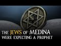

# The Jews of Medina were expecting a Prophet (2022-04-15)

## Description

You Can Support My Work on Patreon:
https://www.patreon.com/Bloggingtheology

My Paypal Link: 
https://www.paypal.com/paypalme/bloggingtheology?locale.x=en_GB

## Summary of [The Jews of Medina were expecting a Prophet](https://www.youtube.com/watch?v=Z4pm2fSYhCI)

*This summary is AI generated - there may be inaccuracies. *

### [00:00:00](https://www.youtube.com/watch?v=Z4pm2fSYhCI&t=0) - [00:05:00](https://www.youtube.com/watch?v=Z4pm2fSYhCI&t=300)

The Jews of Medina were eagerly awaiting the arrival of a new prophet, and when Muhammad visited the tribe of the Khasraj, they were very interested in hearing his message. However, one young man named Yes son of Mudda rejected the Prophet's message and died soon after. Some of those who were present at his death said that they could hear him continually testifying to the oneness of God and praising Him until the end.

**[00:00:00](https://www.youtube.com/watch?v=Z4pm2fSYhCI&t=0)** This video discusses the expectation of a prophet among the Jews living in Medina. Relations between the Jews and the Arabs were often strained, and the Jews were eager to learn more about the new prophet. One rabbi pointed to the south and said that a prophet would come who would affirm the truth of the resurrection. The youths among the Jews followed his advice and accepted the prophet despite his non-Jewish background.
* **[00:05:00](https://www.youtube.com/watch?v=Z4pm2fSYhCI&t=300)** The Prophet Muhammad was visiting the tribe of the Khasraj when they asked him if they could come and see him. The Prophet told them that he had been sent with a new religion, and when they asked what that was, he recited some of the Quran to them. A young man named Ias son of Mudda rejected the Prophet's message, and the Prophet left him. Quraish refused to help the Khasraj, and when the Prophet returned to Medina, he found that Yes had died. Some of the people who were present at Yes' death said that they could hear him continually testifying to the oneness of God and magnifying praising and glorifying Him until the end.

<h2>Full transcript with timestamps: CLICK TO EXPAND</h2>

[0:00:02](https://youtu.be/Z4pm2fSYhCI?t=2) in this episode we hear of many of the  
[0:00:06](https://youtu.be/Z4pm2fSYhCI?t=6) jews who are living in expectation of a  
[0:00:09](https://youtu.be/Z4pm2fSYhCI?t=9) prophet whose time was near and i  
[0:00:12](https://youtu.be/Z4pm2fSYhCI?t=12) continue reading from muhammad his life  
[0:00:15](https://youtu.be/Z4pm2fSYhCI?t=15) based on the earliest sources by martin  
[0:00:18](https://youtu.be/Z4pm2fSYhCI?t=18) ling's chapter 19  
[0:00:20](https://youtu.be/Z4pm2fSYhCI?t=20) owls and khasraj  
[0:00:23](https://youtu.be/Z4pm2fSYhCI?t=23) the tribes of ows and khasraj had  
[0:00:26](https://youtu.be/Z4pm2fSYhCI?t=26) alliances with some of the jewish tribes  
[0:00:29](https://youtu.be/Z4pm2fSYhCI?t=29) who lived beside them in yathrib  
[0:00:32](https://youtu.be/Z4pm2fSYhCI?t=32) but relations between them were often  
[0:00:35](https://youtu.be/Z4pm2fSYhCI?t=35) strained and fraught with ill feeling  
[0:00:38](https://youtu.be/Z4pm2fSYhCI?t=38) not least because the monotheistic jews  
[0:00:42](https://youtu.be/Z4pm2fSYhCI?t=42) conscious of being god's chosen people  
[0:00:45](https://youtu.be/Z4pm2fSYhCI?t=45) despise the polytheistic arabs while  
[0:00:49](https://youtu.be/Z4pm2fSYhCI?t=49) having to pay them a certain respect  
[0:00:51](https://youtu.be/Z4pm2fSYhCI?t=51) because of their greater strength  
[0:00:55](https://youtu.be/Z4pm2fSYhCI?t=55) in moments of acrimony and frustration  
[0:00:58](https://youtu.be/Z4pm2fSYhCI?t=58) the jews have been known to say  
[0:01:01](https://youtu.be/Z4pm2fSYhCI?t=61) the time of a prophet who is to be sent  
[0:01:04](https://youtu.be/Z4pm2fSYhCI?t=64) is now at hand  
[0:01:06](https://youtu.be/Z4pm2fSYhCI?t=66) with him we shall slay you even as ad  
[0:01:11](https://youtu.be/Z4pm2fSYhCI?t=71) imran were slain  
[0:01:13](https://youtu.be/Z4pm2fSYhCI?t=73) and martin ling's leaves a footnote  
[0:01:16](https://youtu.be/Z4pm2fSYhCI?t=76) ancient arab tribes suddenly destroyed  
[0:01:19](https://youtu.be/Z4pm2fSYhCI?t=79) for their refusal to obey the prophets  
[0:01:22](https://youtu.be/Z4pm2fSYhCI?t=82) who were sent to them  
[0:01:25](https://youtu.be/Z4pm2fSYhCI?t=85) and their rabbis and soothsayers when  
[0:01:28](https://youtu.be/Z4pm2fSYhCI?t=88) asked whence the prophet would come had  
[0:01:31](https://youtu.be/Z4pm2fSYhCI?t=91) always pointed in the direction of the  
[0:01:34](https://youtu.be/Z4pm2fSYhCI?t=94) yemen which was also for them the  
[0:01:37](https://youtu.be/Z4pm2fSYhCI?t=97) direction of mecca so when the yathrib  
[0:01:41](https://youtu.be/Z4pm2fSYhCI?t=101) arabs heard that a man in mecca had now  
[0:01:45](https://youtu.be/Z4pm2fSYhCI?t=105) in fact declared himself to be a prophet  
[0:01:49](https://youtu.be/Z4pm2fSYhCI?t=109) they opened their ears  
[0:01:52](https://youtu.be/Z4pm2fSYhCI?t=112) and they were still more interested when  
[0:01:54](https://youtu.be/Z4pm2fSYhCI?t=114) they were told something about his  
[0:01:56](https://youtu.be/Z4pm2fSYhCI?t=116) message for they were already familiar  
[0:01:59](https://youtu.be/Z4pm2fSYhCI?t=119) with many of the principles of orthodox  
[0:02:02](https://youtu.be/Z4pm2fSYhCI?t=122) religion  
[0:02:04](https://youtu.be/Z4pm2fSYhCI?t=124) in more friendly moments the jews often  
[0:02:07](https://youtu.be/Z4pm2fSYhCI?t=127) spoke to them of the oneness of god and  
[0:02:11](https://youtu.be/Z4pm2fSYhCI?t=131) of man's final ends and they would  
[0:02:15](https://youtu.be/Z4pm2fSYhCI?t=135) discuss these questions together  
[0:02:18](https://youtu.be/Z4pm2fSYhCI?t=138) the idea that they would rise from the  
[0:02:20](https://youtu.be/Z4pm2fSYhCI?t=140) dead was especially difficult for the  
[0:02:23](https://youtu.be/Z4pm2fSYhCI?t=143) polytheists to accept  
[0:02:26](https://youtu.be/Z4pm2fSYhCI?t=146) and noticing this  
[0:02:28](https://youtu.be/Z4pm2fSYhCI?t=148) one of the rabbis pointed to the south  
[0:02:31](https://youtu.be/Z4pm2fSYhCI?t=151) and said that thence a prophet was about  
[0:02:35](https://youtu.be/Z4pm2fSYhCI?t=155) to come who would affirm the truth of  
[0:02:38](https://youtu.be/Z4pm2fSYhCI?t=158) the resurrection  
[0:02:41](https://youtu.be/Z4pm2fSYhCI?t=161) but their deepest preparation for the  
[0:02:44](https://youtu.be/Z4pm2fSYhCI?t=164) news for mecca had come  
[0:02:46](https://youtu.be/Z4pm2fSYhCI?t=166) indirectly  
[0:02:48](https://youtu.be/Z4pm2fSYhCI?t=168) from a jew named al hayaban who had  
[0:02:52](https://youtu.be/Z4pm2fSYhCI?t=172) migrated from syria and who on more than  
[0:02:55](https://youtu.be/Z4pm2fSYhCI?t=175) one occasion had saved the oasis from  
[0:02:58](https://youtu.be/Z4pm2fSYhCI?t=178) drought through his prayers for rain  
[0:03:02](https://youtu.be/Z4pm2fSYhCI?t=182) this saintly man had died about the time  
[0:03:05](https://youtu.be/Z4pm2fSYhCI?t=185) that the prophet had received his first  
[0:03:09](https://youtu.be/Z4pm2fSYhCI?t=189) revelation and when he had felt himself  
[0:03:11](https://youtu.be/Z4pm2fSYhCI?t=191) at the point of death  
[0:03:13](https://youtu.be/Z4pm2fSYhCI?t=193) as ours and khazraj was subsequently  
[0:03:16](https://youtu.be/Z4pm2fSYhCI?t=196) told he had said to those about him  
[0:03:20](https://youtu.be/Z4pm2fSYhCI?t=200) oh jews  
[0:03:22](https://youtu.be/Z4pm2fSYhCI?t=202) what was it think ye that maybe leave a  
[0:03:26](https://youtu.be/Z4pm2fSYhCI?t=206) land of bread and wine for a land of  
[0:03:29](https://youtu.be/Z4pm2fSYhCI?t=209) hardship and hunger  
[0:03:32](https://youtu.be/Z4pm2fSYhCI?t=212) thou best knowest they said  
[0:03:35](https://youtu.be/Z4pm2fSYhCI?t=215) i came to this country he answered in  
[0:03:39](https://youtu.be/Z4pm2fSYhCI?t=219) expectation of the coming forth of a  
[0:03:42](https://youtu.be/Z4pm2fSYhCI?t=222) prophet  
[0:03:43](https://youtu.be/Z4pm2fSYhCI?t=223) whose time is near  
[0:03:46](https://youtu.be/Z4pm2fSYhCI?t=226) to this country he will migrate  
[0:03:50](https://youtu.be/Z4pm2fSYhCI?t=230) i had hopes that he will be sent in time  
[0:03:53](https://youtu.be/Z4pm2fSYhCI?t=233) for me to follow him  
[0:03:56](https://youtu.be/Z4pm2fSYhCI?t=236) his hour is close upon you  
[0:04:00](https://youtu.be/Z4pm2fSYhCI?t=240) these words were taken greatly to heart  
[0:04:03](https://youtu.be/Z4pm2fSYhCI?t=243) by some jewish youths who heard them and  
[0:04:07](https://youtu.be/Z4pm2fSYhCI?t=247) who were enabled by them when the time  
[0:04:10](https://youtu.be/Z4pm2fSYhCI?t=250) came to accept the prophet even though  
[0:04:13](https://youtu.be/Z4pm2fSYhCI?t=253) he was not a jew  
[0:04:17](https://youtu.be/Z4pm2fSYhCI?t=257) but generally speaking whereas the arabs  
[0:04:20](https://youtu.be/Z4pm2fSYhCI?t=260) were in favor of the man but against the  
[0:04:23](https://youtu.be/Z4pm2fSYhCI?t=263) message the jews were in favor of the  
[0:04:26](https://youtu.be/Z4pm2fSYhCI?t=266) message but against the man  
[0:04:29](https://youtu.be/Z4pm2fSYhCI?t=269) for how could god send a prophet who was  
[0:04:32](https://youtu.be/Z4pm2fSYhCI?t=272) not one of the chosen people nonetheless  
[0:04:36](https://youtu.be/Z4pm2fSYhCI?t=276) when the pilgrims brought news of a  
[0:04:38](https://youtu.be/Z4pm2fSYhCI?t=278) prophet to yathrib the jews were  
[0:04:40](https://youtu.be/Z4pm2fSYhCI?t=280) interested despite themselves and  
[0:04:43](https://youtu.be/Z4pm2fSYhCI?t=283) eagerly questioned them for more details  
[0:04:47](https://youtu.be/Z4pm2fSYhCI?t=287) and when the arabs of the oasis  
[0:04:49](https://youtu.be/Z4pm2fSYhCI?t=289) sensed this eagerness and when they saw  
[0:04:53](https://youtu.be/Z4pm2fSYhCI?t=293) how the monotheistic nature of the  
[0:04:55](https://youtu.be/Z4pm2fSYhCI?t=295) message increased their interest  
[0:04:58](https://youtu.be/Z4pm2fSYhCI?t=298) increased the interest of the rabbi's  
[0:05:01](https://youtu.be/Z4pm2fSYhCI?t=301) tenfold they could not fail to be  
[0:05:04](https://youtu.be/Z4pm2fSYhCI?t=304) impressed  
[0:05:05](https://youtu.be/Z4pm2fSYhCI?t=305) as were the bearers of the tidings  
[0:05:08](https://youtu.be/Z4pm2fSYhCI?t=308) themselves  
[0:05:11](https://youtu.be/Z4pm2fSYhCI?t=311) apart from such considerations the tribe  
[0:05:14](https://youtu.be/Z4pm2fSYhCI?t=314) of the khasraj was fully aware of its  
[0:05:18](https://youtu.be/Z4pm2fSYhCI?t=318) strong links of kinship with the very  
[0:05:21](https://youtu.be/Z4pm2fSYhCI?t=321) man who now claimed to be a prophet  
[0:05:25](https://youtu.be/Z4pm2fSYhCI?t=325) and who had visited yathrib with his  
[0:05:28](https://youtu.be/Z4pm2fSYhCI?t=328) mother as a child and since then more  
[0:05:31](https://youtu.be/Z4pm2fSYhCI?t=331) than once on his way to syria  
[0:05:35](https://youtu.be/Z4pm2fSYhCI?t=335) as to ours one of their leading men abu  
[0:05:39](https://youtu.be/Z4pm2fSYhCI?t=339) khayes had married a meccan who was the  
[0:05:43](https://youtu.be/Z4pm2fSYhCI?t=343) aunt of warakka and also of khadijah  
[0:05:48](https://youtu.be/Z4pm2fSYhCI?t=348) abu khayez had often stayed with his  
[0:05:51](https://youtu.be/Z4pm2fSYhCI?t=351) wife's family  
[0:05:52](https://youtu.be/Z4pm2fSYhCI?t=352) and he respected waraka's opinion of the  
[0:05:56](https://youtu.be/Z4pm2fSYhCI?t=356) new prophet  
[0:05:58](https://youtu.be/Z4pm2fSYhCI?t=358) all these factors  
[0:06:00](https://youtu.be/Z4pm2fSYhCI?t=360) supplemented by continuous reports of  
[0:06:03](https://youtu.be/Z4pm2fSYhCI?t=363) pilgrims and other visitors from mecca  
[0:06:07](https://youtu.be/Z4pm2fSYhCI?t=367) now began to work upon the people of the  
[0:06:10](https://youtu.be/Z4pm2fSYhCI?t=370) oasis  
[0:06:12](https://youtu.be/Z4pm2fSYhCI?t=372) but for the moment most of their  
[0:06:15](https://youtu.be/Z4pm2fSYhCI?t=375) attention was centered upon the urgent  
[0:06:17](https://youtu.be/Z4pm2fSYhCI?t=377) problems of their own internal affairs  
[0:06:21](https://youtu.be/Z4pm2fSYhCI?t=381) a quarrel ending in bloodshed between  
[0:06:25](https://youtu.be/Z4pm2fSYhCI?t=385) aosite and kazrajit had gradually  
[0:06:28](https://youtu.be/Z4pm2fSYhCI?t=388) involved more and more clans of the two  
[0:06:32](https://youtu.be/Z4pm2fSYhCI?t=392) tribes  
[0:06:33](https://youtu.be/Z4pm2fSYhCI?t=393) even the jews had taken sides  
[0:06:37](https://youtu.be/Z4pm2fSYhCI?t=397) three battles had already been fought  
[0:06:39](https://youtu.be/Z4pm2fSYhCI?t=399) but instead of being decisive these had  
[0:06:42](https://youtu.be/Z4pm2fSYhCI?t=402) inflamed the souls of men still  
[0:06:46](https://youtu.be/Z4pm2fSYhCI?t=406) further and multiplied the needs for  
[0:06:49](https://youtu.be/Z4pm2fSYhCI?t=409) revenge  
[0:06:51](https://youtu.be/Z4pm2fSYhCI?t=411) a fourth battle on a larger scale than  
[0:06:53](https://youtu.be/Z4pm2fSYhCI?t=413) the others seemed inevitable  
[0:06:56](https://youtu.be/Z4pm2fSYhCI?t=416) and it was in view of this that the  
[0:06:59](https://youtu.be/Z4pm2fSYhCI?t=419) leaders of owls had the idea of sending  
[0:07:02](https://youtu.be/Z4pm2fSYhCI?t=422) a delegation to mecca to ask quraish for  
[0:07:06](https://youtu.be/Z4pm2fSYhCI?t=426) their help against khazraj  
[0:07:10](https://youtu.be/Z4pm2fSYhCI?t=430) while they were waiting for an answer  
[0:07:13](https://youtu.be/Z4pm2fSYhCI?t=433) the prophet went to them and asked them  
[0:07:17](https://youtu.be/Z4pm2fSYhCI?t=437) if they would like something better than  
[0:07:19](https://youtu.be/Z4pm2fSYhCI?t=439) what they had come for  
[0:07:22](https://youtu.be/Z4pm2fSYhCI?t=442) they asked what that might be  
[0:07:25](https://youtu.be/Z4pm2fSYhCI?t=445) and he told them of his mission and of  
[0:07:28](https://youtu.be/Z4pm2fSYhCI?t=448) the religion he had been commanded to  
[0:07:30](https://youtu.be/Z4pm2fSYhCI?t=450) preach  
[0:07:32](https://youtu.be/Z4pm2fSYhCI?t=452) then he recited to them some of the  
[0:07:35](https://youtu.be/Z4pm2fSYhCI?t=455) quran  
[0:07:36](https://youtu.be/Z4pm2fSYhCI?t=456) and when he had finished a young man  
[0:07:39](https://youtu.be/Z4pm2fSYhCI?t=459) named ias son of mudda  
[0:07:43](https://youtu.be/Z4pm2fSYhCI?t=463) people  
[0:07:44](https://youtu.be/Z4pm2fSYhCI?t=464) by god this is better than that ye came  
[0:07:48](https://youtu.be/Z4pm2fSYhCI?t=468) for  
[0:07:51](https://youtu.be/Z4pm2fSYhCI?t=471) but the leader of the delegation took a  
[0:07:53](https://youtu.be/Z4pm2fSYhCI?t=473) handful of earth and threw it in the  
[0:07:56](https://youtu.be/Z4pm2fSYhCI?t=476) youth's face saying  
[0:07:59](https://youtu.be/Z4pm2fSYhCI?t=479) let that be all from thee by my life we  
[0:08:02](https://youtu.be/Z4pm2fSYhCI?t=482) have come for other than this  
[0:08:06](https://youtu.be/Z4pm2fSYhCI?t=486) yes relapsed into silence  
[0:08:09](https://youtu.be/Z4pm2fSYhCI?t=489) and the prophet left them  
[0:08:12](https://youtu.be/Z4pm2fSYhCI?t=492) quraish refused their request for help  
[0:08:17](https://youtu.be/Z4pm2fSYhCI?t=497) and they returned to medina  
[0:08:20](https://youtu.be/Z4pm2fSYhCI?t=500) shortly after this yes died and those  
[0:08:24](https://youtu.be/Z4pm2fSYhCI?t=504) who were present at his death  
[0:08:26](https://youtu.be/Z4pm2fSYhCI?t=506) said that they heard him continually  
[0:08:29](https://youtu.be/Z4pm2fSYhCI?t=509) testifying to the oneness of god and  
[0:08:32](https://youtu.be/Z4pm2fSYhCI?t=512) magnifying praising and glorifying him  
[0:08:36](https://youtu.be/Z4pm2fSYhCI?t=516) until the end  
[0:08:39](https://youtu.be/Z4pm2fSYhCI?t=519) he is thus counted as the first man of  
[0:08:43](https://youtu.be/Z4pm2fSYhCI?t=523) yathrib to enter islam  
[0:08:47](https://youtu.be/Z4pm2fSYhCI?t=527) and that's the end of chapter 19.  
[0:08:51](https://youtu.be/Z4pm2fSYhCI?t=531) till next time  

