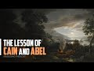

# The Lesson of Cain and Abel (2022-06-15 17:21:41+00:00)

## Description

You Can Support My Work on Patreon:
https://www.patreon.com/Bloggingtheology

My Paypal Link: 
https://www.paypal.com/paypalme/bloggingtheology?locale.x=en_GB

## Summary of [The Lesson of Cain and Abel](https://www.youtube.com/watch?v=VHcvJ_APmV4)

*This is an AI generated summary. There may be inaccuracies. *

### [00:00:00](https://www.youtube.com/watch?v=VHcvJ_APmV4&t=0) - [00:00:00](https://www.youtube.com/watch?v=VHcvJ_APmV4&t=0)

The video discusses the story of Cain and Abel and how it can be interpreted as a lesson about the value of human life. It also highlights how, even after being warned by messengers, many people still choose not to listen.

**[00:00:00](https://www.youtube.com/watch?v=VHcvJ_APmV4&t=0)** The lesson of Cain and Abel is that human life is valuable. Whoever takes a life, unless it is for a punishment like murder or mischief, is as if they killed all of humanity. Whoever saves a life is as if they saved all of humanity. However, even after the messengers came to them with clear proofs, many people still did not listen.

## Full transcript with timestamps

[0:00:00](https://youtu.be/VHcvJ_APmV4?t=0) in the quran we read the story of cain  
[0:00:03](https://youtu.be/VHcvJ_APmV4?t=3) and abel and then we read about the  
[0:00:06](https://youtu.be/VHcvJ_APmV4?t=6) value of human life  
[0:00:09](https://youtu.be/VHcvJ_APmV4?t=9) although this is addressed to the  
[0:00:11](https://youtu.be/VHcvJ_APmV4?t=11) children of israel it is applicable to  
[0:00:13](https://youtu.be/VHcvJ_APmV4?t=13) everyone at all times  
[0:00:17](https://youtu.be/VHcvJ_APmV4?t=17) that is why we ordained for the children  
[0:00:19](https://youtu.be/VHcvJ_APmV4?t=19) of israel that whoever takes a life  
[0:00:22](https://youtu.be/VHcvJ_APmV4?t=22) unless as a punishment for murder or  
[0:00:25](https://youtu.be/VHcvJ_APmV4?t=25) mischief in the land it will be as if  
[0:00:28](https://youtu.be/VHcvJ_APmV4?t=28) they killed all of humanity  
[0:00:31](https://youtu.be/VHcvJ_APmV4?t=31) and whoever saves a life it will be as  
[0:00:34](https://youtu.be/VHcvJ_APmV4?t=34) if they saved all of humanity  
[0:00:38](https://youtu.be/VHcvJ_APmV4?t=38) although our messengers already came to  
[0:00:40](https://youtu.be/VHcvJ_APmV4?t=40) them with clear proofs many of them  
[0:00:43](https://youtu.be/VHcvJ_APmV4?t=43) still transgressed afterwards through  
[0:00:46](https://youtu.be/VHcvJ_APmV4?t=46) the land  
