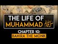

# The Life of Muhammad ﷺ Chapter 10: Bahira the Monk (2022-02-05 17:03:22+00:00)

## Description

You Can Support My Work on Patreon:
https://www.patreon.com/Bloggingtheology

My Paypal Link: 
https://www.paypal.com/paypalme/bloggingtheology?locale.x=en_GB

## Summary of [The Life of Muhammad ﷺ Chapter 10: Bahira the Monk](https://www.youtube.com/watch?v=InxNDE8FCUM)

*This is an AI generated summary. There may be inaccuracies. *

### [00:00:00](https://www.youtube.com/watch?v=InxNDE8FCUM&t=0) - [00:05:00](https://www.youtube.com/watch?v=InxNDE8FCUM&t=300)

In this chapter of the life of Muhammad, Bahira the monk tells Muhammad about a man he met who had the same mark of prophecy as Muhammad. Bahira also tells Muhammad about the dangers of the Jews, who he believes will try to harm the boy if they find out about him.

**[00:00:00](https://www.youtube.com/watch?v=InxNDE8FCUM&t=0)** This reading from Muhammad's life based on the earliest sources tells of his uncle, Abu Talib, taking him with him on his travels, and how Bahira the monk saw the caravan approach and was struck by something the like of which he had never seen before. He recognized that it was a sign from God, and that the prophet Muhammad would soon be revealed. The men left without Muhammad, and he later brought the boy to the feast. Bahira recognized Muhammad's features and body, and was able to understand the miracles he had seen.
* **[00:05:00](https://www.youtube.com/watch?v=InxNDE8FCUM&t=300)** In this chapter, Bahira the Monk tells Muhammad about a man he met who had the same mark of prophecy as Muhammad. Bahira also tells Muhammad about the dangers of the Jews, who he believes will try to harm the boy if they find out about him.

## Full transcript with timestamps

[0:00:03](https://youtu.be/InxNDE8FCUM?t=3) a reading from muhammad his life based  
[0:00:06](https://youtu.be/InxNDE8FCUM?t=6) on the earliest sources by martin lings  
[0:00:10](https://youtu.be/InxNDE8FCUM?t=10) chapter 10  
[0:00:12](https://youtu.be/InxNDE8FCUM?t=12) bahira the monk  
[0:00:14](https://youtu.be/InxNDE8FCUM?t=14) the fortunes of abdal muttalib had waned  
[0:00:18](https://youtu.be/InxNDE8FCUM?t=18) during the last part of his life and  
[0:00:20](https://youtu.be/InxNDE8FCUM?t=20) what he left at his death amounted to no  
[0:00:23](https://youtu.be/InxNDE8FCUM?t=23) more than a small legacy for each of his  
[0:00:26](https://youtu.be/InxNDE8FCUM?t=26) sons  
[0:00:27](https://youtu.be/InxNDE8FCUM?t=27) some of them especially abdal uzar who  
[0:00:30](https://youtu.be/InxNDE8FCUM?t=30) was known as abu lahab had acquired  
[0:00:33](https://youtu.be/InxNDE8FCUM?t=33) wealth of their own  
[0:00:35](https://youtu.be/InxNDE8FCUM?t=35) but abu talib was poor and his nephew  
[0:00:38](https://youtu.be/InxNDE8FCUM?t=38) felt obliged to do what he could to earn  
[0:00:41](https://youtu.be/InxNDE8FCUM?t=41) his own livelihood  
[0:00:44](https://youtu.be/InxNDE8FCUM?t=44) this he did mostly by pasturing sheep  
[0:00:47](https://youtu.be/InxNDE8FCUM?t=47) and goats and he would thus spend day  
[0:00:50](https://youtu.be/InxNDE8FCUM?t=50) after day alone in the hills of  
[0:00:52](https://youtu.be/InxNDE8FCUM?t=52) bubmecker or on the slopes of the  
[0:00:54](https://youtu.be/InxNDE8FCUM?t=54) valleys beyond  
[0:00:57](https://youtu.be/InxNDE8FCUM?t=57) but his uncle took him sometimes with  
[0:00:59](https://youtu.be/InxNDE8FCUM?t=59) him on his travels and on one occasion  
[0:01:02](https://youtu.be/InxNDE8FCUM?t=62) when muhammad was nine or according to  
[0:01:05](https://youtu.be/InxNDE8FCUM?t=65) others 12  
[0:01:06](https://youtu.be/InxNDE8FCUM?t=66) they went with a merchant caravan as far  
[0:01:09](https://youtu.be/InxNDE8FCUM?t=69) as  
[0:01:10](https://youtu.be/InxNDE8FCUM?t=70) syria at bostra near one of the halts  
[0:01:14](https://youtu.be/InxNDE8FCUM?t=74) where the meccan caravan always stopped  
[0:01:17](https://youtu.be/InxNDE8FCUM?t=77) there was a cell which had been lived in  
[0:01:19](https://youtu.be/InxNDE8FCUM?t=79) by a christian monk for generation after  
[0:01:23](https://youtu.be/InxNDE8FCUM?t=83) generation  
[0:01:24](https://youtu.be/InxNDE8FCUM?t=84) when one died another took his place and  
[0:01:27](https://youtu.be/InxNDE8FCUM?t=87) inherited all that was in the cell  
[0:01:30](https://youtu.be/InxNDE8FCUM?t=90) including some old manuscripts  
[0:01:34](https://youtu.be/InxNDE8FCUM?t=94) among these was one which contained the  
[0:01:36](https://youtu.be/InxNDE8FCUM?t=96) prediction of the coming of a prophet to  
[0:01:39](https://youtu.be/InxNDE8FCUM?t=99) the arabs  
[0:01:41](https://youtu.be/InxNDE8FCUM?t=101) and bahira the monk who now lived in the  
[0:01:43](https://youtu.be/InxNDE8FCUM?t=103) cell was well versed in the contents of  
[0:01:46](https://youtu.be/InxNDE8FCUM?t=106) this book  
[0:01:47](https://youtu.be/InxNDE8FCUM?t=107) which interested him all the more  
[0:01:49](https://youtu.be/InxNDE8FCUM?t=109) because like warika he too felt that the  
[0:01:53](https://youtu.be/InxNDE8FCUM?t=113) coming of the prophet would be in his  
[0:01:56](https://youtu.be/InxNDE8FCUM?t=116) lifetime  
[0:01:58](https://youtu.be/InxNDE8FCUM?t=118) he had often seen the meccan caravan  
[0:02:01](https://youtu.be/InxNDE8FCUM?t=121) approach and halt not far from his cell  
[0:02:05](https://youtu.be/InxNDE8FCUM?t=125) but as this one came in sight his  
[0:02:07](https://youtu.be/InxNDE8FCUM?t=127) attention was struck by something the  
[0:02:09](https://youtu.be/InxNDE8FCUM?t=129) like of which he had never seen before  
[0:02:13](https://youtu.be/InxNDE8FCUM?t=133) a small low-hanging cloud moved slowly  
[0:02:17](https://youtu.be/InxNDE8FCUM?t=137) over their heads  
[0:02:19](https://youtu.be/InxNDE8FCUM?t=139) so that it was always between the sun  
[0:02:21](https://youtu.be/InxNDE8FCUM?t=141) and one or two of the travelers  
[0:02:24](https://youtu.be/InxNDE8FCUM?t=144) with intense interest he watched them  
[0:02:26](https://youtu.be/InxNDE8FCUM?t=146) draw near  
[0:02:28](https://youtu.be/InxNDE8FCUM?t=148) but suddenly his interest changed to  
[0:02:31](https://youtu.be/InxNDE8FCUM?t=151) amazement for as soon as they halted the  
[0:02:34](https://youtu.be/InxNDE8FCUM?t=154) cloud ceased to move  
[0:02:36](https://youtu.be/InxNDE8FCUM?t=156) remaining stationary over the tree  
[0:02:38](https://youtu.be/InxNDE8FCUM?t=158) beneath which they took shelter  
[0:02:41](https://youtu.be/InxNDE8FCUM?t=161) while the tree itself lowered its  
[0:02:44](https://youtu.be/InxNDE8FCUM?t=164) branches over them  
[0:02:46](https://youtu.be/InxNDE8FCUM?t=166) so that they were doubly in the shade  
[0:02:49](https://youtu.be/InxNDE8FCUM?t=169) bahira knew that such important though  
[0:02:52](https://youtu.be/InxNDE8FCUM?t=172) unobtrusive was of high significance  
[0:02:57](https://youtu.be/InxNDE8FCUM?t=177) only some great spiritual presence could  
[0:03:00](https://youtu.be/InxNDE8FCUM?t=180) explain it and immediately he thought of  
[0:03:02](https://youtu.be/InxNDE8FCUM?t=182) the expected profit  
[0:03:05](https://youtu.be/InxNDE8FCUM?t=185) could it be that he had come at last and  
[0:03:08](https://youtu.be/InxNDE8FCUM?t=188) was amongst these travelers  
[0:03:12](https://youtu.be/InxNDE8FCUM?t=192) the cell had been recently stocked with  
[0:03:14](https://youtu.be/InxNDE8FCUM?t=194) provisions and putting together all he  
[0:03:17](https://youtu.be/InxNDE8FCUM?t=197) had he sent words to the caravan  
[0:03:20](https://youtu.be/InxNDE8FCUM?t=200) men of quraish i have prepared food for  
[0:03:23](https://youtu.be/InxNDE8FCUM?t=203) you and i would that you should come to  
[0:03:25](https://youtu.be/InxNDE8FCUM?t=205) me every one of you young and old  
[0:03:29](https://youtu.be/InxNDE8FCUM?t=209) bondman and free  
[0:03:32](https://youtu.be/InxNDE8FCUM?t=212) so they came to his cell but despite  
[0:03:34](https://youtu.be/InxNDE8FCUM?t=214) what he had said they left muhammad to  
[0:03:37](https://youtu.be/InxNDE8FCUM?t=217) look after their camels and their  
[0:03:39](https://youtu.be/InxNDE8FCUM?t=219) baggage  
[0:03:41](https://youtu.be/InxNDE8FCUM?t=221) as they approached bahira scan their  
[0:03:44](https://youtu.be/InxNDE8FCUM?t=224) faces one by one  
[0:03:46](https://youtu.be/InxNDE8FCUM?t=226) but he could see nothing that  
[0:03:48](https://youtu.be/InxNDE8FCUM?t=228) corresponded to the description in his  
[0:03:51](https://youtu.be/InxNDE8FCUM?t=231) book  
[0:03:52](https://youtu.be/InxNDE8FCUM?t=232) nor did there seem to be any man amongst  
[0:03:54](https://youtu.be/InxNDE8FCUM?t=234) them who was adequate to the greatness  
[0:03:57](https://youtu.be/InxNDE8FCUM?t=237) of the two  
[0:03:58](https://youtu.be/InxNDE8FCUM?t=238) miracles perhaps they had not all come  
[0:04:02](https://youtu.be/InxNDE8FCUM?t=242) men of quraish he said  
[0:04:04](https://youtu.be/InxNDE8FCUM?t=244) let none of you stay behind  
[0:04:07](https://youtu.be/InxNDE8FCUM?t=247) there is not one that hath been left  
[0:04:09](https://youtu.be/InxNDE8FCUM?t=249) behind there they answered save only the  
[0:04:12](https://youtu.be/InxNDE8FCUM?t=252) boy the youngest of us all  
[0:04:15](https://youtu.be/InxNDE8FCUM?t=255) treat him not so said bahira but call on  
[0:04:19](https://youtu.be/InxNDE8FCUM?t=259) him to come and let him be present with  
[0:04:22](https://youtu.be/InxNDE8FCUM?t=262) us at this meal  
[0:04:25](https://youtu.be/InxNDE8FCUM?t=265) abu talib and the others reproached  
[0:04:28](https://youtu.be/InxNDE8FCUM?t=268) themselves for their thoughtlessness  
[0:04:30](https://youtu.be/InxNDE8FCUM?t=270) we are indeed to blame said one of them  
[0:04:33](https://youtu.be/InxNDE8FCUM?t=273) that the sons of ab allah should have  
[0:04:35](https://youtu.be/InxNDE8FCUM?t=275) been left behind and not brought to  
[0:04:38](https://youtu.be/InxNDE8FCUM?t=278) share this feast with us  
[0:04:40](https://youtu.be/InxNDE8FCUM?t=280) whereupon he went to him and embraced  
[0:04:43](https://youtu.be/InxNDE8FCUM?t=283) him and brought him to sit with the  
[0:04:46](https://youtu.be/InxNDE8FCUM?t=286) people  
[0:04:48](https://youtu.be/InxNDE8FCUM?t=288) one glance at the boy's face was enough  
[0:04:51](https://youtu.be/InxNDE8FCUM?t=291) to explain the miracles to bahira  
[0:04:54](https://youtu.be/InxNDE8FCUM?t=294) and looking at him attentively  
[0:04:56](https://youtu.be/InxNDE8FCUM?t=296) throughout the meal he noticed many  
[0:04:58](https://youtu.be/InxNDE8FCUM?t=298) features of both face and body which  
[0:05:02](https://youtu.be/InxNDE8FCUM?t=302) corresponded to what was in his book  
[0:05:05](https://youtu.be/InxNDE8FCUM?t=305) so when they had finished eating the  
[0:05:08](https://youtu.be/InxNDE8FCUM?t=308) monk went to his youngest guest and  
[0:05:10](https://youtu.be/InxNDE8FCUM?t=310) asked him questions about his way of  
[0:05:13](https://youtu.be/InxNDE8FCUM?t=313) life and about his sleep and about his  
[0:05:15](https://youtu.be/InxNDE8FCUM?t=315) affairs in general  
[0:05:18](https://youtu.be/InxNDE8FCUM?t=318) muhammad readily informed him of these  
[0:05:20](https://youtu.be/InxNDE8FCUM?t=320) things for the man was venerable and the  
[0:05:23](https://youtu.be/InxNDE8FCUM?t=323) questions were courteous and benevolent  
[0:05:27](https://youtu.be/InxNDE8FCUM?t=327) nor did he hesitate to draw off his  
[0:05:29](https://youtu.be/InxNDE8FCUM?t=329) cloak when finally the monk asked if he  
[0:05:33](https://youtu.be/InxNDE8FCUM?t=333) might see his back  
[0:05:36](https://youtu.be/InxNDE8FCUM?t=336) the hera had already felt certain but  
[0:05:39](https://youtu.be/InxNDE8FCUM?t=339) now he was doubly so  
[0:05:42](https://youtu.be/InxNDE8FCUM?t=342) so for there between his shoulders was  
[0:05:45](https://youtu.be/InxNDE8FCUM?t=345) the very mark he expected to see  
[0:05:48](https://youtu.be/InxNDE8FCUM?t=348) the seal of prophethood even as it was  
[0:05:52](https://youtu.be/InxNDE8FCUM?t=352) described in his book  
[0:05:54](https://youtu.be/InxNDE8FCUM?t=354) in the self-same place  
[0:05:57](https://youtu.be/InxNDE8FCUM?t=357) he turned to abu talib what kingsman  
[0:06:00](https://youtu.be/InxNDE8FCUM?t=360) hath this boy with thee he said  
[0:06:04](https://youtu.be/InxNDE8FCUM?t=364) he is my son said abu talib  
[0:06:07](https://youtu.be/InxNDE8FCUM?t=367) he is not thy son said the monk it  
[0:06:10](https://youtu.be/InxNDE8FCUM?t=370) cannot be that this boy's father is  
[0:06:12](https://youtu.be/InxNDE8FCUM?t=372) alive  
[0:06:14](https://youtu.be/InxNDE8FCUM?t=374) he is my brother's son said abu talib  
[0:06:18](https://youtu.be/InxNDE8FCUM?t=378) then what of his father said the monk  
[0:06:22](https://youtu.be/InxNDE8FCUM?t=382) he died said the other when the boy was  
[0:06:24](https://youtu.be/InxNDE8FCUM?t=384) still in his mother's womb  
[0:06:28](https://youtu.be/InxNDE8FCUM?t=388) that is the truth said bahira  
[0:06:30](https://youtu.be/InxNDE8FCUM?t=390) take thy brother's son back to his  
[0:06:33](https://youtu.be/InxNDE8FCUM?t=393) country  
[0:06:34](https://youtu.be/InxNDE8FCUM?t=394) and guard him against the jews for by  
[0:06:37](https://youtu.be/InxNDE8FCUM?t=397) god if they see him and know of him that  
[0:06:40](https://youtu.be/InxNDE8FCUM?t=400) which i know  
[0:06:42](https://youtu.be/InxNDE8FCUM?t=402) they will contrive evil against him  
[0:06:46](https://youtu.be/InxNDE8FCUM?t=406) great things are in store for this  
[0:06:49](https://youtu.be/InxNDE8FCUM?t=409) brother's son of vine  
[0:06:54](https://youtu.be/InxNDE8FCUM?t=414) that's a reading from bahira the monk  
[0:06:56](https://youtu.be/InxNDE8FCUM?t=416) chapter 10.  
[0:06:58](https://youtu.be/InxNDE8FCUM?t=418) till next time  
