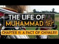

# The Life of Muhammad ﷺ Chapter 11: A Pact of Chivalry (2022-02-10 19:12:58+00:00)

## Description

You Can Support My Work on Patreon:
https://www.patreon.com/Bloggingtheology

My Paypal Link: 
https://www.paypal.com/paypalme/bloggingtheology?locale.x=en_GB

## Summary of [The Life of Muhammad ﷺ Chapter 11: A Pact of Chivalry](https://www.youtube.com/watch?v=nRCX73fSUMA)

*This is an AI generated summary. There may be inaccuracies. *

### [00:00:00](https://www.youtube.com/watch?v=nRCX73fSUMA&t=0) - [00:05:00](https://www.youtube.com/watch?v=nRCX73fSUMA&t=300)

This video discusses Muhammad's early life and how he became a skilled fighter. It also covers the story of the Pact of Chivalry, which was a treaty between the clans of Mecca to stand together against oppression.

**[00:00:00](https://www.youtube.com/watch?v=nRCX73fSUMA&t=0)** In this chapter, we learn about Muhammad's early life and how he became skilled in using weapons of war. His uncle taught him how to use a sword and a shield, and Muhammad soon became a skilled fighter. He also became skilled in archery, and was praised for his skills. In response to a merchant who was wronged, Muhammad led a large group of people in an appeal to quraish to help him get justice. quraish responded immediately and helped the merchant get his revenge.
* **[00:05:00](https://www.youtube.com/watch?v=nRCX73fSUMA&t=300)** This video covers the story of the Pact of Chivalry, which was a treaty between the clans of Mecca to stand together against oppression. One of the leaders of this pact was the wealthy chief of clan 'Abdullah ibn Juden. Another founder of the pact was Muhammad's first cousin, Abu Bakr. Abu Bakr was to become Muhammad's closest friend.

## Full transcript with timestamps

[0:00:05](https://youtu.be/nRCX73fSUMA?t=5) a reading from muhammad his life based  
[0:00:07](https://youtu.be/nRCX73fSUMA?t=7) on the earliest sources by martin ling's  
[0:00:11](https://youtu.be/nRCX73fSUMA?t=11) chapter 11 a pact of chivalry  
[0:00:15](https://youtu.be/nRCX73fSUMA?t=15) when he had finished his trading in  
[0:00:17](https://youtu.be/nRCX73fSUMA?t=17) arabia abu talib returned to mecca with  
[0:00:20](https://youtu.be/nRCX73fSUMA?t=20) his nephew who continued his solitary  
[0:00:23](https://youtu.be/nRCX73fSUMA?t=23) life as before  
[0:00:25](https://youtu.be/nRCX73fSUMA?t=25) but his uncle saw to it that he as also  
[0:00:28](https://youtu.be/nRCX73fSUMA?t=28) abbas and hamza had some training in the  
[0:00:31](https://youtu.be/nRCX73fSUMA?t=31) use of weapons of war  
[0:00:34](https://youtu.be/nRCX73fSUMA?t=34) hamza was clearly destined to be a man  
[0:00:36](https://youtu.be/nRCX73fSUMA?t=36) of mighty stature endowed with great  
[0:00:39](https://youtu.be/nRCX73fSUMA?t=39) physical strength  
[0:00:41](https://youtu.be/nRCX73fSUMA?t=41) he was already a good swordsman and a  
[0:00:44](https://youtu.be/nRCX73fSUMA?t=44) good wrestler  
[0:00:45](https://youtu.be/nRCX73fSUMA?t=45) muhammad was of average height and  
[0:00:47](https://youtu.be/nRCX73fSUMA?t=47) average strength  
[0:00:49](https://youtu.be/nRCX73fSUMA?t=49) he had a marked aptitude for archery and  
[0:00:52](https://youtu.be/nRCX73fSUMA?t=52) gave every promise of being an excellent  
[0:00:55](https://youtu.be/nRCX73fSUMA?t=55) bowman like his great ancestors abraham  
[0:00:58](https://youtu.be/nRCX73fSUMA?t=58) and ishmael  
[0:01:00](https://youtu.be/nRCX73fSUMA?t=60) a powerful asset for this lay in the  
[0:01:02](https://youtu.be/nRCX73fSUMA?t=62) strength of his eyesight he was reputed  
[0:01:05](https://youtu.be/nRCX73fSUMA?t=65) to be able to count no less than 12 of  
[0:01:08](https://youtu.be/nRCX73fSUMA?t=68) the stars of the constellation of the  
[0:01:10](https://youtu.be/nRCX73fSUMA?t=70) pleiades  
[0:01:13](https://youtu.be/nRCX73fSUMA?t=73) in those years quraysh were not involved  
[0:01:15](https://youtu.be/nRCX73fSUMA?t=75) in any fighting except for sporadic and  
[0:01:18](https://youtu.be/nRCX73fSUMA?t=78) intermittent conflict which came to be  
[0:01:21](https://youtu.be/nRCX73fSUMA?t=81) known as the sacrilegious war because it  
[0:01:24](https://youtu.be/nRCX73fSUMA?t=84) has started in one of the sacred months  
[0:01:28](https://youtu.be/nRCX73fSUMA?t=88) a profligate of kinana had treacherously  
[0:01:31](https://youtu.be/nRCX73fSUMA?t=91) murdered a man of emir one of the  
[0:01:33](https://youtu.be/nRCX73fSUMA?t=93) howards in tribes of najd and had taken  
[0:01:36](https://youtu.be/nRCX73fSUMA?t=96) refuge in the impregnable fortress  
[0:01:39](https://youtu.be/nRCX73fSUMA?t=99) township  
[0:01:40](https://youtu.be/nRCX73fSUMA?t=100) of khabar  
[0:01:42](https://youtu.be/nRCX73fSUMA?t=102) the secret of sequence of events  
[0:01:44](https://youtu.be/nRCX73fSUMA?t=104) followed the usual desert pattern  
[0:01:47](https://youtu.be/nRCX73fSUMA?t=107) honour demanded revenge so the tribe of  
[0:01:49](https://youtu.be/nRCX73fSUMA?t=109) the murdered man attacked kanana the  
[0:01:53](https://youtu.be/nRCX73fSUMA?t=113) tribe of the murderer and creature were  
[0:01:55](https://youtu.be/nRCX73fSUMA?t=115) involved somewhat in gloriously as  
[0:01:58](https://youtu.be/nRCX73fSUMA?t=118) allies of kinana  
[0:02:00](https://youtu.be/nRCX73fSUMA?t=120) the conflict dragged on for three or  
[0:02:03](https://youtu.be/nRCX73fSUMA?t=123) four years in which there were only five  
[0:02:06](https://youtu.be/nRCX73fSUMA?t=126) days of actual fighting  
[0:02:09](https://youtu.be/nRCX73fSUMA?t=129) the head of the clan of hashem was at  
[0:02:11](https://youtu.be/nRCX73fSUMA?t=131) that time zubair  
[0:02:14](https://youtu.be/nRCX73fSUMA?t=134) full brother like abu talib of  
[0:02:16](https://youtu.be/nRCX73fSUMA?t=136) muhammad's father  
[0:02:18](https://youtu.be/nRCX73fSUMA?t=138) zubair and abu talib took their nephew  
[0:02:22](https://youtu.be/nRCX73fSUMA?t=142) muhammad with them to one of the first  
[0:02:24](https://youtu.be/nRCX73fSUMA?t=144) battles  
[0:02:25](https://youtu.be/nRCX73fSUMA?t=145) but they said he was too young to fight  
[0:02:28](https://youtu.be/nRCX73fSUMA?t=148) he was nonetheless allowed to help by  
[0:02:30](https://youtu.be/nRCX73fSUMA?t=150) gathering enemy arrows that had missed  
[0:02:33](https://youtu.be/nRCX73fSUMA?t=153) their mark and handling them to handing  
[0:02:36](https://youtu.be/nRCX73fSUMA?t=156) them to his uncles so that they could be  
[0:02:39](https://youtu.be/nRCX73fSUMA?t=159) shot back with them  
[0:02:41](https://youtu.be/nRCX73fSUMA?t=161) but at one of the subsequent battles  
[0:02:43](https://youtu.be/nRCX73fSUMA?t=163) where quresh and their allies had the  
[0:02:45](https://youtu.be/nRCX73fSUMA?t=165) worst of the day he was allowed to show  
[0:02:48](https://youtu.be/nRCX73fSUMA?t=168) his skill as a bowman and was praised  
[0:02:51](https://youtu.be/nRCX73fSUMA?t=171) for his valor  
[0:02:53](https://youtu.be/nRCX73fSUMA?t=173) the war helped to fan the growing  
[0:02:55](https://youtu.be/nRCX73fSUMA?t=175) discontent which every sedentary  
[0:02:58](https://youtu.be/nRCX73fSUMA?t=178) community tends to feel with the law of  
[0:03:01](https://youtu.be/nRCX73fSUMA?t=181) the desert  
[0:03:03](https://youtu.be/nRCX73fSUMA?t=183) most of the leading men of quraish had  
[0:03:05](https://youtu.be/nRCX73fSUMA?t=185) traveled to syria and had seen for  
[0:03:07](https://youtu.be/nRCX73fSUMA?t=187) themselves the relative justice which  
[0:03:10](https://youtu.be/nRCX73fSUMA?t=190) prevailed in the roman empire  
[0:03:13](https://youtu.be/nRCX73fSUMA?t=193) it was also possible in abyssinia to  
[0:03:16](https://youtu.be/nRCX73fSUMA?t=196) have justice without recourse to  
[0:03:18](https://youtu.be/nRCX73fSUMA?t=198) fighting  
[0:03:20](https://youtu.be/nRCX73fSUMA?t=200) but in arabia there was no comparable  
[0:03:23](https://youtu.be/nRCX73fSUMA?t=203) system of law by which a victim of crime  
[0:03:26](https://youtu.be/nRCX73fSUMA?t=206) or his family might obtain redress  
[0:03:30](https://youtu.be/nRCX73fSUMA?t=210) and it was natural that the sacrilegious  
[0:03:32](https://youtu.be/nRCX73fSUMA?t=212) war like other conflicts before it  
[0:03:35](https://youtu.be/nRCX73fSUMA?t=215) should have set many minds thinking of  
[0:03:37](https://youtu.be/nRCX73fSUMA?t=217) ways and means to prevent the same thing  
[0:03:40](https://youtu.be/nRCX73fSUMA?t=220) from happening again  
[0:03:43](https://youtu.be/nRCX73fSUMA?t=223) but this time the result was more than  
[0:03:45](https://youtu.be/nRCX73fSUMA?t=225) mere thoughts and words  
[0:03:48](https://youtu.be/nRCX73fSUMA?t=228) as far as quraish were concerned there  
[0:03:50](https://youtu.be/nRCX73fSUMA?t=230) was now a widespread readiness to take  
[0:03:53](https://youtu.be/nRCX73fSUMA?t=233) action  
[0:03:54](https://youtu.be/nRCX73fSUMA?t=234) and their sense of justice was put to  
[0:03:56](https://youtu.be/nRCX73fSUMA?t=236) the test by a scandalous incident which  
[0:03:59](https://youtu.be/nRCX73fSUMA?t=239) took place in mecca in the first few  
[0:04:02](https://youtu.be/nRCX73fSUMA?t=242) weeks after the end of the fighting  
[0:04:06](https://youtu.be/nRCX73fSUMA?t=246) and here is the story a merchant from  
[0:04:08](https://youtu.be/nRCX73fSUMA?t=248) the yemeni port azabeed had sold some  
[0:04:12](https://youtu.be/nRCX73fSUMA?t=252) valuable goods to a notable of the clan  
[0:04:16](https://youtu.be/nRCX73fSUMA?t=256) of sham  
[0:04:17](https://youtu.be/nRCX73fSUMA?t=257) having taken possession of these the  
[0:04:19](https://youtu.be/nRCX73fSUMA?t=259) shamite refused to pay the promised  
[0:04:22](https://youtu.be/nRCX73fSUMA?t=262) price  
[0:04:23](https://youtu.be/nRCX73fSUMA?t=263) the wronged merchant as his wronger well  
[0:04:26](https://youtu.be/nRCX73fSUMA?t=266) knew was a stranger to mecca and had no  
[0:04:30](https://youtu.be/nRCX73fSUMA?t=270) confederate or patron in all the city to  
[0:04:33](https://youtu.be/nRCX73fSUMA?t=273) whom he might go for help  
[0:04:36](https://youtu.be/nRCX73fSUMA?t=276) but he was not to be overawed by the  
[0:04:38](https://youtu.be/nRCX73fSUMA?t=278) other man's insolent self-assurance and  
[0:04:42](https://youtu.be/nRCX73fSUMA?t=282) taking his stand on the slope of abu  
[0:04:44](https://youtu.be/nRCX73fSUMA?t=284) kubays he appealed to quraish as a whole  
[0:04:48](https://youtu.be/nRCX73fSUMA?t=288) with loud and vehement eloquence to see  
[0:04:51](https://youtu.be/nRCX73fSUMA?t=291) that justice was done  
[0:04:54](https://youtu.be/nRCX73fSUMA?t=294) an immediate response came from most of  
[0:04:56](https://youtu.be/nRCX73fSUMA?t=296) those clans which had no traditional  
[0:04:58](https://youtu.be/nRCX73fSUMA?t=298) alliance with sham  
[0:05:00](https://youtu.be/nRCX73fSUMA?t=300) quresh were bent above all on being  
[0:05:03](https://youtu.be/nRCX73fSUMA?t=303) united regardless of clan  
[0:05:07](https://youtu.be/nRCX73fSUMA?t=307) but within that union there was still an  
[0:05:09](https://youtu.be/nRCX73fSUMA?t=309) acute consciousness of the rift which  
[0:05:12](https://youtu.be/nRCX73fSUMA?t=312) had divided them over the legacy of  
[0:05:15](https://youtu.be/nRCX73fSUMA?t=315) crusade into two groups the scented ones  
[0:05:18](https://youtu.be/nRCX73fSUMA?t=318) and the confederates  
[0:05:20](https://youtu.be/nRCX73fSUMA?t=320) and sham were of the confederates  
[0:05:24](https://youtu.be/nRCX73fSUMA?t=324) one of the leaders of the other group  
[0:05:26](https://youtu.be/nRCX73fSUMA?t=326) and one of the wealthiest men of mecca  
[0:05:29](https://youtu.be/nRCX73fSUMA?t=329) at that time  
[0:05:30](https://youtu.be/nRCX73fSUMA?t=330) was the chief of tame abd allah ibn  
[0:05:34](https://youtu.be/nRCX73fSUMA?t=334) juden  
[0:05:35](https://youtu.be/nRCX73fSUMA?t=335) and he now offered his large house as a  
[0:05:38](https://youtu.be/nRCX73fSUMA?t=338) meeting place for all lovers of justice  
[0:05:42](https://youtu.be/nRCX73fSUMA?t=342) from among the centered ones only the  
[0:05:44](https://youtu.be/nRCX73fSUMA?t=344) clans of abu shams and nowfall were  
[0:05:48](https://youtu.be/nRCX73fSUMA?t=348) absent  
[0:05:49](https://youtu.be/nRCX73fSUMA?t=349) hashem muttalib zura assad tame were all  
[0:05:53](https://youtu.be/nRCX73fSUMA?t=353) well represented and they were joined by  
[0:05:56](https://youtu.be/nRCX73fSUMA?t=356) adi  
[0:05:57](https://youtu.be/nRCX73fSUMA?t=357) which had been one of the confederates  
[0:06:00](https://youtu.be/nRCX73fSUMA?t=360) having decided after an earnest  
[0:06:02](https://youtu.be/nRCX73fSUMA?t=362) discussion that it was imperative to  
[0:06:05](https://youtu.be/nRCX73fSUMA?t=365) found an order of chivalry for the  
[0:06:07](https://youtu.be/nRCX73fSUMA?t=367) furtherance of justice and the  
[0:06:09](https://youtu.be/nRCX73fSUMA?t=369) protection of the weak  
[0:06:11](https://youtu.be/nRCX73fSUMA?t=371) they went in a body to the kaaba where  
[0:06:13](https://youtu.be/nRCX73fSUMA?t=373) they poured water over the black stone  
[0:06:17](https://youtu.be/nRCX73fSUMA?t=377) letting it flow into a receptacle  
[0:06:21](https://youtu.be/nRCX73fSUMA?t=381) then each man drank of the thus hallowed  
[0:06:24](https://youtu.be/nRCX73fSUMA?t=384) water and with their right hands raised  
[0:06:27](https://youtu.be/nRCX73fSUMA?t=387) above their heads they vowed that  
[0:06:29](https://youtu.be/nRCX73fSUMA?t=389) henceforth at every act of oppression in  
[0:06:32](https://youtu.be/nRCX73fSUMA?t=392) mecca they would stand together as one  
[0:06:35](https://youtu.be/nRCX73fSUMA?t=395) man on the side of the oppressed against  
[0:06:39](https://youtu.be/nRCX73fSUMA?t=399) the oppressor until justice was done  
[0:06:42](https://youtu.be/nRCX73fSUMA?t=402) whether the oppressed were a man or  
[0:06:44](https://youtu.be/nRCX73fSUMA?t=404) quraish or one who had come from abroad  
[0:06:48](https://youtu.be/nRCX73fSUMA?t=408) the sarmite was thereupon compelled to  
[0:06:52](https://youtu.be/nRCX73fSUMA?t=412) pay his debt nor did any of those clans  
[0:06:55](https://youtu.be/nRCX73fSUMA?t=415) which had abstained from the pack offer  
[0:06:58](https://youtu.be/nRCX73fSUMA?t=418) him any of their assistance  
[0:07:01](https://youtu.be/nRCX73fSUMA?t=421) together with the chief of tame zubair  
[0:07:04](https://youtu.be/nRCX73fSUMA?t=424) of hashem was one of the founders of  
[0:07:07](https://youtu.be/nRCX73fSUMA?t=427) this order and he brought with him his  
[0:07:09](https://youtu.be/nRCX73fSUMA?t=429) nephew mohammed  
[0:07:11](https://youtu.be/nRCX73fSUMA?t=431) who took part in the oath and who said  
[0:07:14](https://youtu.be/nRCX73fSUMA?t=434) in after years  
[0:07:16](https://youtu.be/nRCX73fSUMA?t=436) i was present in the house of abdullah  
[0:07:19](https://youtu.be/nRCX73fSUMA?t=439) ibn judah at so excellent a pact that i  
[0:07:23](https://youtu.be/nRCX73fSUMA?t=443) would not exchange my part in it for a  
[0:07:26](https://youtu.be/nRCX73fSUMA?t=446) herd of red camels  
[0:07:29](https://youtu.be/nRCX73fSUMA?t=449) and if now in islam i was summoned unto  
[0:07:33](https://youtu.be/nRCX73fSUMA?t=453) it i would gladly respond  
[0:07:38](https://youtu.be/nRCX73fSUMA?t=458) another of those present was their  
[0:07:40](https://youtu.be/nRCX73fSUMA?t=460) host's first cousin abu kahafer of tame  
[0:07:44](https://youtu.be/nRCX73fSUMA?t=464) together with his cousin abu bakr  
[0:07:47](https://youtu.be/nRCX73fSUMA?t=467) abu bakr  
[0:07:49](https://youtu.be/nRCX73fSUMA?t=469) who was a year or two younger than  
[0:07:51](https://youtu.be/nRCX73fSUMA?t=471) muhammad and who was to become his  
[0:07:55](https://youtu.be/nRCX73fSUMA?t=475) closest  
[0:07:56](https://youtu.be/nRCX73fSUMA?t=476) friend it's a lovely story so that  
[0:08:00](https://youtu.be/nRCX73fSUMA?t=480) chapter 11 a pact of chivalry for  
[0:08:03](https://youtu.be/nRCX73fSUMA?t=483) muhammad his life based on the earliest  
[0:08:06](https://youtu.be/nRCX73fSUMA?t=486) sources by martin lings till next time  
