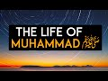

# The Life of Muhammad ﷺ Chapter 1: The House of God (2021-12-04)

## Description

You Can Support My Work on Patreon:
https://www.patreon.com/Bloggingtheology

My Paypal Link: 
https://www.paypal.com/paypalme/bloggingtheology?locale.x=en_GB

Follow me on Instagram:
https://www.instagram.com/bloggingtheology1

Follow me on TikTok:
https://www.tiktok.com/@bloggingtheology?lang=en

Follow me on Twitter:
https://twitter.com/freemonotheist

## Summary of [The Life of Muhammad ﷺ Chapter 1: The House of God](https://www.youtube.com/watch?v=nGWuZcyGIvs)

*This summary is AI generated - there may be inaccuracies. *

### [00:00:00](https://www.youtube.com/watch?v=nGWuZcyGIvs&t=0) - [00:10:00](https://www.youtube.com/watch?v=nGWuZcyGIvs&t=600)

This video discusses the life of Muhammad and how he is seen as a prophet of both the Abrahamic and Ishmaelic religious traditions. It describes the building of the Kaaba and notes that the most holy object in the Kaaba is a celestial stone brought down to earth by an angel.

**[00:00:00](https://www.youtube.com/watch?v=nGWuZcyGIvs&t=0)**  Martin Ling reads from a chapter of his book, Life of Muhammad, about the life of Muhammad. He discusses how the story of Abraham and Sarah is repeated in Muhammad's life, and how Muhammad is a prophet of God.
* **[00:05:00](https://www.youtube.com/watch?v=nGWuZcyGIvs&t=300)** This video discusses the life of Muhammad, from his birth to his ascension to heaven. It notes that there are two main religious streams in Islam: Abrahamic and Ishmaelic. Muhammad is seen as a prophet of both traditions, bridging the gap between the two. He is praised in the Psalms for his mother's faith in him.

The water at Zamzam Springs is said to have come from Muhammad's heel, and the valley soon became a stop for caravans. Muhammad is also praised for his faith in God. However, there is indirect praise of Muhammad and his mother in the Psalms.
* **[00:10:00](https://www.youtube.com/watch?v=nGWuZcyGIvs&t=600)** The video opens with an overview of the pilgrimage to Mecca, which is described in the Qur'an. It then goes on to describe the building of the Kaaba, which was a miracle caused by the angels. The most holy object in the Kaaba is a celestial stone brought down to earth by an angel. The pilgrims are instructed to make the pilgrimage seven times in order to achieve paradise.

## Full transcript with timestamps

[0:00:02](https://youtu.be/nGWuZcyGIvs?t=2) in this video i'm going to be reading a  
[0:00:04](https://youtu.be/nGWuZcyGIvs?t=4) chapter from muhammad his life based on  
[0:00:07](https://youtu.be/nGWuZcyGIvs?t=7) the earliest sources by martin lings  
[0:00:11](https://youtu.be/nGWuZcyGIvs?t=11) this is a truly extraordinary biography  
[0:00:15](https://youtu.be/nGWuZcyGIvs?t=15) and on the inside cover it says the  
[0:00:17](https://youtu.be/nGWuZcyGIvs?t=17) following and i heartily endorse these  
[0:00:19](https://youtu.be/nGWuZcyGIvs?t=19) words  
[0:00:20](https://youtu.be/nGWuZcyGIvs?t=20) martin ling's life of muhammad is unlike  
[0:00:24](https://youtu.be/nGWuZcyGIvs?t=24) any other  
[0:00:25](https://youtu.be/nGWuZcyGIvs?t=25) based on arabic sources of the 8th and  
[0:00:28](https://youtu.be/nGWuZcyGIvs?t=28) 9th centuries  
[0:00:30](https://youtu.be/nGWuZcyGIvs?t=30) it owes the freshness and directness of  
[0:00:33](https://youtu.be/nGWuZcyGIvs?t=33) its approach to the words of the men and  
[0:00:35](https://youtu.be/nGWuZcyGIvs?t=35) women who heard muhammad speak and  
[0:00:38](https://youtu.be/nGWuZcyGIvs?t=38) witness the events of his life  
[0:00:41](https://youtu.be/nGWuZcyGIvs?t=41) martin lings has an unusual gift for  
[0:00:44](https://youtu.be/nGWuZcyGIvs?t=44) narrative  
[0:00:46](https://youtu.be/nGWuZcyGIvs?t=46) he has adopted a style which is at once  
[0:00:49](https://youtu.be/nGWuZcyGIvs?t=49) extremely readable and reflects both the  
[0:00:51](https://youtu.be/nGWuZcyGIvs?t=51) beauty and the simplicity and grandeur  
[0:00:54](https://youtu.be/nGWuZcyGIvs?t=54) of the story  
[0:00:56](https://youtu.be/nGWuZcyGIvs?t=56) the result is something that can be read  
[0:00:58](https://youtu.be/nGWuZcyGIvs?t=58) with equal enjoyment by those already  
[0:01:01](https://youtu.be/nGWuZcyGIvs?t=61) familiar with muhammad's life  
[0:01:03](https://youtu.be/nGWuZcyGIvs?t=63) and those coming to it for the first  
[0:01:06](https://youtu.be/nGWuZcyGIvs?t=66) time  
[0:01:07](https://youtu.be/nGWuZcyGIvs?t=67) and the book won a number of awards when  
[0:01:10](https://youtu.be/nGWuZcyGIvs?t=70) it was first published  
[0:01:12](https://youtu.be/nGWuZcyGIvs?t=72) so in this video i'm just going to read  
[0:01:14](https://youtu.be/nGWuZcyGIvs?t=74) chapter one each of the chapters in this  
[0:01:16](https://youtu.be/nGWuZcyGIvs?t=76) book uh is conveniently quite bite-sized  
[0:01:19](https://youtu.be/nGWuZcyGIvs?t=79) someone can read a chapter in each video  
[0:01:22](https://youtu.be/nGWuZcyGIvs?t=82) and i might just do that god willing so  
[0:01:24](https://youtu.be/nGWuZcyGIvs?t=84) in chapter one entitled the house of god  
[0:01:29](https://youtu.be/nGWuZcyGIvs?t=89) muhammad assad writes  
[0:01:32](https://youtu.be/nGWuZcyGIvs?t=92) the book of genesis  
[0:01:34](https://youtu.be/nGWuZcyGIvs?t=94) tells us that that abraham was childless  
[0:01:37](https://youtu.be/nGWuZcyGIvs?t=97) without the hope of children  
[0:01:40](https://youtu.be/nGWuZcyGIvs?t=100) and that one night god summoned him out  
[0:01:43](https://youtu.be/nGWuZcyGIvs?t=103) of his tent and said to him  
[0:01:45](https://youtu.be/nGWuZcyGIvs?t=105) look now towards heaven and count the  
[0:01:48](https://youtu.be/nGWuZcyGIvs?t=108) stars if thou art able to number them  
[0:01:52](https://youtu.be/nGWuZcyGIvs?t=112) and as abraham gazed up at the stars he  
[0:01:55](https://youtu.be/nGWuZcyGIvs?t=115) heard the voice say  
[0:01:57](https://youtu.be/nGWuZcyGIvs?t=117) so shall thy seed be  
[0:02:01](https://youtu.be/nGWuZcyGIvs?t=121) abraham's wife sarah was then 76 years  
[0:02:05](https://youtu.be/nGWuZcyGIvs?t=125) old he being 85 and long past the age of  
[0:02:09](https://youtu.be/nGWuZcyGIvs?t=129) child bearing  
[0:02:11](https://youtu.be/nGWuZcyGIvs?t=131) so she gave him her handmade hagar an  
[0:02:14](https://youtu.be/nGWuZcyGIvs?t=134) egyptian  
[0:02:15](https://youtu.be/nGWuZcyGIvs?t=135) that he might take her as his second  
[0:02:18](https://youtu.be/nGWuZcyGIvs?t=138) wife  
[0:02:20](https://youtu.be/nGWuZcyGIvs?t=140) but bitterness of feeling arose between  
[0:02:22](https://youtu.be/nGWuZcyGIvs?t=142) the mistress and the handmaid and hagar  
[0:02:26](https://youtu.be/nGWuZcyGIvs?t=146) fled from the anger of sarah and cried  
[0:02:29](https://youtu.be/nGWuZcyGIvs?t=149) to god in her distress  
[0:02:33](https://youtu.be/nGWuZcyGIvs?t=153) and he sent to her an angel with the  
[0:02:35](https://youtu.be/nGWuZcyGIvs?t=155) message  
[0:02:37](https://youtu.be/nGWuZcyGIvs?t=157) i will multiply thy seed exceedingly  
[0:02:41](https://youtu.be/nGWuZcyGIvs?t=161) that it shall not be numbered for  
[0:02:43](https://youtu.be/nGWuZcyGIvs?t=163) multitude  
[0:02:45](https://youtu.be/nGWuZcyGIvs?t=165) the angel also said to her behold thou  
[0:02:48](https://youtu.be/nGWuZcyGIvs?t=168) art with child and shall bear a son and  
[0:02:52](https://youtu.be/nGWuZcyGIvs?t=172) shall call his name ishmael  
[0:02:55](https://youtu.be/nGWuZcyGIvs?t=175) because the lord hath heard thy  
[0:02:57](https://youtu.be/nGWuZcyGIvs?t=177) affliction  
[0:02:59](https://youtu.be/nGWuZcyGIvs?t=179) then hagar returned to abraham and sarah  
[0:03:02](https://youtu.be/nGWuZcyGIvs?t=182) and told them what the angel had said  
[0:03:05](https://youtu.be/nGWuZcyGIvs?t=185) and when the birth took place abraham  
[0:03:08](https://youtu.be/nGWuZcyGIvs?t=188) named his son ishmael  
[0:03:10](https://youtu.be/nGWuZcyGIvs?t=190) which means god shall hear  
[0:03:15](https://youtu.be/nGWuZcyGIvs?t=195) when abraham had reached his 100th year  
[0:03:18](https://youtu.be/nGWuZcyGIvs?t=198) and sarah was 90 years old god spoke  
[0:03:21](https://youtu.be/nGWuZcyGIvs?t=201) again to abraham and promised him that  
[0:03:24](https://youtu.be/nGWuZcyGIvs?t=204) sarah also should bear him a son  
[0:03:28](https://youtu.be/nGWuZcyGIvs?t=208) who must be called isaac  
[0:03:31](https://youtu.be/nGWuZcyGIvs?t=211) fearing that his elder son might thereby  
[0:03:33](https://youtu.be/nGWuZcyGIvs?t=213) lose favor in the sight of god  
[0:03:36](https://youtu.be/nGWuZcyGIvs?t=216) abraham prayed  
[0:03:38](https://youtu.be/nGWuZcyGIvs?t=218) o that ishmael might live before thee  
[0:03:41](https://youtu.be/nGWuZcyGIvs?t=221) and god said to him  
[0:03:44](https://youtu.be/nGWuZcyGIvs?t=224) as for ishmael i have heard thee  
[0:03:46](https://youtu.be/nGWuZcyGIvs?t=226) behold i have blessed him and i will  
[0:03:49](https://youtu.be/nGWuZcyGIvs?t=229) make him a great nation  
[0:03:52](https://youtu.be/nGWuZcyGIvs?t=232) but my covenant will i establish with  
[0:03:55](https://youtu.be/nGWuZcyGIvs?t=235) isaac  
[0:03:56](https://youtu.be/nGWuZcyGIvs?t=236) which sarah shall bear unto thee at this  
[0:03:59](https://youtu.be/nGWuZcyGIvs?t=239) set time in the next year  
[0:04:02](https://youtu.be/nGWuZcyGIvs?t=242) that's genesis chapter 17 verse 20.  
[0:04:07](https://youtu.be/nGWuZcyGIvs?t=247) sarah gave birth to isaac and it was she  
[0:04:10](https://youtu.be/nGWuZcyGIvs?t=250) herself who suckled him  
[0:04:12](https://youtu.be/nGWuZcyGIvs?t=252) and when he was weaned she told abraham  
[0:04:15](https://youtu.be/nGWuZcyGIvs?t=255) that hagar and her son must no longer  
[0:04:19](https://youtu.be/nGWuZcyGIvs?t=259) remain in their household  
[0:04:22](https://youtu.be/nGWuZcyGIvs?t=262) and abraham was deeply grieved at this  
[0:04:25](https://youtu.be/nGWuZcyGIvs?t=265) on account of his love for ishmael but  
[0:04:28](https://youtu.be/nGWuZcyGIvs?t=268) again god spoke to him and told him to  
[0:04:30](https://youtu.be/nGWuZcyGIvs?t=270) follow the council of sarah and not to  
[0:04:34](https://youtu.be/nGWuZcyGIvs?t=274) grieve  
[0:04:35](https://youtu.be/nGWuZcyGIvs?t=275) and again he promised him the ishmael  
[0:04:38](https://youtu.be/nGWuZcyGIvs?t=278) should be blessed  
[0:04:41](https://youtu.be/nGWuZcyGIvs?t=281) not one  
[0:04:42](https://youtu.be/nGWuZcyGIvs?t=282) but two great nations were to look back  
[0:04:45](https://youtu.be/nGWuZcyGIvs?t=285) to abraham as their father  
[0:04:48](https://youtu.be/nGWuZcyGIvs?t=288) two great nations that is two guided  
[0:04:52](https://youtu.be/nGWuZcyGIvs?t=292) powers two instruments to work the will  
[0:04:55](https://youtu.be/nGWuZcyGIvs?t=295) of heaven  
[0:04:57](https://youtu.be/nGWuZcyGIvs?t=297) for god does not promise as a blessing  
[0:04:59](https://youtu.be/nGWuZcyGIvs?t=299) that which is profane  
[0:05:02](https://youtu.be/nGWuZcyGIvs?t=302) nor is there any greatness before god  
[0:05:05](https://youtu.be/nGWuZcyGIvs?t=305) except greatness in the spirit  
[0:05:09](https://youtu.be/nGWuZcyGIvs?t=309) abraham was thus the fountainhead of two  
[0:05:12](https://youtu.be/nGWuZcyGIvs?t=312) spiritual streams which must not flow  
[0:05:15](https://youtu.be/nGWuZcyGIvs?t=315) together  
[0:05:17](https://youtu.be/nGWuZcyGIvs?t=317) but each in its own course  
[0:05:20](https://youtu.be/nGWuZcyGIvs?t=320) and he entrusted hagar and ishmael to  
[0:05:23](https://youtu.be/nGWuZcyGIvs?t=323) the blessing of god and the care of his  
[0:05:26](https://youtu.be/nGWuZcyGIvs?t=326) angels in the certainty that all will be  
[0:05:29](https://youtu.be/nGWuZcyGIvs?t=329) well with them  
[0:05:32](https://youtu.be/nGWuZcyGIvs?t=332) two spiritual streams two religions two  
[0:05:36](https://youtu.be/nGWuZcyGIvs?t=336) worlds for god two circles therefore two  
[0:05:40](https://youtu.be/nGWuZcyGIvs?t=340) centers  
[0:05:42](https://youtu.be/nGWuZcyGIvs?t=342) a place is never holy through the choice  
[0:05:44](https://youtu.be/nGWuZcyGIvs?t=344) of man but because it has been chosen in  
[0:05:48](https://youtu.be/nGWuZcyGIvs?t=348) heaven  
[0:05:50](https://youtu.be/nGWuZcyGIvs?t=350) there were only there were two holy  
[0:05:52](https://youtu.be/nGWuZcyGIvs?t=352) centers within the orbit of abraham one  
[0:05:55](https://youtu.be/nGWuZcyGIvs?t=355) of these was at hand the other perhaps  
[0:05:58](https://youtu.be/nGWuZcyGIvs?t=358) he did not yet know  
[0:06:00](https://youtu.be/nGWuZcyGIvs?t=360) and it was to the other that hagar and  
[0:06:03](https://youtu.be/nGWuZcyGIvs?t=363) ishmael were guided  
[0:06:05](https://youtu.be/nGWuZcyGIvs?t=365) in a barren valley of arabia  
[0:06:08](https://youtu.be/nGWuZcyGIvs?t=368) some 40 camel days  
[0:06:11](https://youtu.be/nGWuZcyGIvs?t=371) south of canaan  
[0:06:13](https://youtu.be/nGWuZcyGIvs?t=373) the valley was called becca  
[0:06:16](https://youtu.be/nGWuZcyGIvs?t=376) some say on account of its narrowness  
[0:06:19](https://youtu.be/nGWuZcyGIvs?t=379) hills surrounded on all sides except for  
[0:06:22](https://youtu.be/nGWuZcyGIvs?t=382) three passes  
[0:06:24](https://youtu.be/nGWuZcyGIvs?t=384) one to the north one to the south and  
[0:06:26](https://youtu.be/nGWuZcyGIvs?t=386) one opening towards the red sea which is  
[0:06:29](https://youtu.be/nGWuZcyGIvs?t=389) 50 miles to the west  
[0:06:32](https://youtu.be/nGWuZcyGIvs?t=392) the books do not tell us how hagar and  
[0:06:35](https://youtu.be/nGWuZcyGIvs?t=395) her son reached becca  
[0:06:38](https://youtu.be/nGWuZcyGIvs?t=398) according to the traditions of the arabs  
[0:06:40](https://youtu.be/nGWuZcyGIvs?t=400) accepted by most muslims ishmael was  
[0:06:43](https://youtu.be/nGWuZcyGIvs?t=403) still a babe in arms when hagar brought  
[0:06:46](https://youtu.be/nGWuZcyGIvs?t=406) him to the valley of becker  
[0:06:50](https://youtu.be/nGWuZcyGIvs?t=410) perhaps some travellers took care of  
[0:06:52](https://youtu.be/nGWuZcyGIvs?t=412) them for the value was one was on one of  
[0:06:55](https://youtu.be/nGWuZcyGIvs?t=415) the great caravan routes sometimes  
[0:06:58](https://youtu.be/nGWuZcyGIvs?t=418) called the incense route  
[0:07:01](https://youtu.be/nGWuZcyGIvs?t=421) because perfumes and incense and such  
[0:07:03](https://youtu.be/nGWuZcyGIvs?t=423) wares were brought that way from south  
[0:07:06](https://youtu.be/nGWuZcyGIvs?t=426) arabia to the mediterranean  
[0:07:09](https://youtu.be/nGWuZcyGIvs?t=429) and no doubt hager was guided to leave  
[0:07:11](https://youtu.be/nGWuZcyGIvs?t=431) the caravan once the place was reached  
[0:07:15](https://youtu.be/nGWuZcyGIvs?t=435) it was not long before both mother and  
[0:07:18](https://youtu.be/nGWuZcyGIvs?t=438) son were overcome by thirst  
[0:07:22](https://youtu.be/nGWuZcyGIvs?t=442) to the point that hagar feared ishmael  
[0:07:25](https://youtu.be/nGWuZcyGIvs?t=445) was dying  
[0:07:27](https://youtu.be/nGWuZcyGIvs?t=447) according to the traditions of their  
[0:07:29](https://youtu.be/nGWuZcyGIvs?t=449) descendants he cried out to god from  
[0:07:31](https://youtu.be/nGWuZcyGIvs?t=451) where he lay in the sand and his mother  
[0:07:34](https://youtu.be/nGWuZcyGIvs?t=454) stood on a rock at the foot of a nearby  
[0:07:38](https://youtu.be/nGWuZcyGIvs?t=458) eminence to see if any help was in sight  
[0:07:43](https://youtu.be/nGWuZcyGIvs?t=463) seeing no one she hastened to another  
[0:07:46](https://youtu.be/nGWuZcyGIvs?t=466) point of vantage  
[0:07:48](https://youtu.be/nGWuZcyGIvs?t=468) but from there likewise not a soul was  
[0:07:51](https://youtu.be/nGWuZcyGIvs?t=471) to be seen  
[0:07:53](https://youtu.be/nGWuZcyGIvs?t=473) half distraught she passed seven times  
[0:07:57](https://youtu.be/nGWuZcyGIvs?t=477) in all between the two points  
[0:08:00](https://youtu.be/nGWuZcyGIvs?t=480) until at the end of her seventh course  
[0:08:03](https://youtu.be/nGWuZcyGIvs?t=483) as she sat for rest on the further rock  
[0:08:07](https://youtu.be/nGWuZcyGIvs?t=487) the angel spoke to her  
[0:08:10](https://youtu.be/nGWuZcyGIvs?t=490) in the words of the book of genesis  
[0:08:14](https://youtu.be/nGWuZcyGIvs?t=494) and god heard the voice of the lad and  
[0:08:17](https://youtu.be/nGWuZcyGIvs?t=497) the angel of the lord called to hagar  
[0:08:20](https://youtu.be/nGWuZcyGIvs?t=500) out of heaven and said to her  
[0:08:23](https://youtu.be/nGWuZcyGIvs?t=503) what elith the hagar  
[0:08:25](https://youtu.be/nGWuZcyGIvs?t=505) fear not for god hath heard the voice of  
[0:08:28](https://youtu.be/nGWuZcyGIvs?t=508) the lad where he is  
[0:08:30](https://youtu.be/nGWuZcyGIvs?t=510) arise and lift up the lad and hold him  
[0:08:33](https://youtu.be/nGWuZcyGIvs?t=513) in thy hand  
[0:08:35](https://youtu.be/nGWuZcyGIvs?t=515) for i will make him a great nation  
[0:08:39](https://youtu.be/nGWuZcyGIvs?t=519) and god opened her eyes  
[0:08:41](https://youtu.be/nGWuZcyGIvs?t=521) and she saw  
[0:08:43](https://youtu.be/nGWuZcyGIvs?t=523) a well of water  
[0:08:46](https://youtu.be/nGWuZcyGIvs?t=526) that's genesis chapter 21 verses 17  
[0:08:50](https://youtu.be/nGWuZcyGIvs?t=530) onwards  
[0:08:52](https://youtu.be/nGWuZcyGIvs?t=532) the water was a spring which god caused  
[0:08:54](https://youtu.be/nGWuZcyGIvs?t=534) to well up from the sand at the touch of  
[0:08:57](https://youtu.be/nGWuZcyGIvs?t=537) ishmael's heel  
[0:08:59](https://youtu.be/nGWuZcyGIvs?t=539) and thereafter the valley soon became a  
[0:09:01](https://youtu.be/nGWuZcyGIvs?t=541) halt for caravans by reason of the  
[0:09:04](https://youtu.be/nGWuZcyGIvs?t=544) excellence and abundance of the water  
[0:09:08](https://youtu.be/nGWuZcyGIvs?t=548) and the well was named zamzam  
[0:09:13](https://youtu.be/nGWuZcyGIvs?t=553) as to genesis  
[0:09:15](https://youtu.be/nGWuZcyGIvs?t=555) it is the book of isaac and his  
[0:09:17](https://youtu.be/nGWuZcyGIvs?t=557) descendants  
[0:09:19](https://youtu.be/nGWuZcyGIvs?t=559) not of abraham's other line  
[0:09:22](https://youtu.be/nGWuZcyGIvs?t=562) of ishmael it tells us  
[0:09:25](https://youtu.be/nGWuZcyGIvs?t=565) and god was with the lad and he grew and  
[0:09:28](https://youtu.be/nGWuZcyGIvs?t=568) dwelt in the wilderness and became an  
[0:09:31](https://youtu.be/nGWuZcyGIvs?t=571) archer  
[0:09:33](https://youtu.be/nGWuZcyGIvs?t=573) that's chapter 21 verse 17 17-20  
[0:09:36](https://youtu.be/nGWuZcyGIvs?t=576) after that it barely mentions his name  
[0:09:39](https://youtu.be/nGWuZcyGIvs?t=579) except to inform us that the two  
[0:09:41](https://youtu.be/nGWuZcyGIvs?t=581) brothers isaac and ishmael together  
[0:09:44](https://youtu.be/nGWuZcyGIvs?t=584) buried their father in hebron  
[0:09:47](https://youtu.be/nGWuZcyGIvs?t=587) and that some years later esau married  
[0:09:50](https://youtu.be/nGWuZcyGIvs?t=590) his cousin  
[0:09:52](https://youtu.be/nGWuZcyGIvs?t=592) the daughter of ishmael  
[0:09:55](https://youtu.be/nGWuZcyGIvs?t=595) but there is indirect praise of ishmael  
[0:09:58](https://youtu.be/nGWuZcyGIvs?t=598) and his mother in the psalm  
[0:10:00](https://youtu.be/nGWuZcyGIvs?t=600) which opens  
[0:10:02](https://youtu.be/nGWuZcyGIvs?t=602) how amiable are thy tabernacles o lord  
[0:10:05](https://youtu.be/nGWuZcyGIvs?t=605) of hosts  
[0:10:07](https://youtu.be/nGWuZcyGIvs?t=607) and which tells of the miracle of zamzam  
[0:10:10](https://youtu.be/nGWuZcyGIvs?t=610) as having been caused by their passing  
[0:10:13](https://youtu.be/nGWuZcyGIvs?t=613) through the valley  
[0:10:15](https://youtu.be/nGWuZcyGIvs?t=615) blessed is the man whose strength is in  
[0:10:18](https://youtu.be/nGWuZcyGIvs?t=618) thee in whose heart are the ways of them  
[0:10:21](https://youtu.be/nGWuZcyGIvs?t=621) who passing through the valley of baka  
[0:10:25](https://youtu.be/nGWuZcyGIvs?t=625) make it a well  
[0:10:27](https://youtu.be/nGWuZcyGIvs?t=627) that's psalm 84 verse 5 and 6.  
[0:10:32](https://youtu.be/nGWuZcyGIvs?t=632) when hagar and ishmael reached reached  
[0:10:35](https://youtu.be/nGWuZcyGIvs?t=635) their destination  
[0:10:37](https://youtu.be/nGWuZcyGIvs?t=637) abraham had still 75 years to live  
[0:10:41](https://youtu.be/nGWuZcyGIvs?t=641) and he visited his son in that holy  
[0:10:43](https://youtu.be/nGWuZcyGIvs?t=643) place to which hagar had been guided  
[0:10:47](https://youtu.be/nGWuZcyGIvs?t=647) the quran tells us that god showed him  
[0:10:50](https://youtu.be/nGWuZcyGIvs?t=650) the exact site  
[0:10:52](https://youtu.be/nGWuZcyGIvs?t=652) near to the well of zamzam  
[0:10:55](https://youtu.be/nGWuZcyGIvs?t=655) upon which he and ishmael must build a  
[0:10:59](https://youtu.be/nGWuZcyGIvs?t=659) sanctuary  
[0:11:01](https://youtu.be/nGWuZcyGIvs?t=661) and they were told how it must be built  
[0:11:04](https://youtu.be/nGWuZcyGIvs?t=664) its name  
[0:11:05](https://youtu.be/nGWuZcyGIvs?t=665) kaaba  
[0:11:06](https://youtu.be/nGWuZcyGIvs?t=666) cube is in virtue of its shape which is  
[0:11:10](https://youtu.be/nGWuZcyGIvs?t=670) approximately cubic  
[0:11:12](https://youtu.be/nGWuZcyGIvs?t=672) its four corners are four are towards  
[0:11:15](https://youtu.be/nGWuZcyGIvs?t=675) the four points of the compass  
[0:11:18](https://youtu.be/nGWuZcyGIvs?t=678) but the most holy object in that holy  
[0:11:21](https://youtu.be/nGWuZcyGIvs?t=681) place is a celestial stone which it is  
[0:11:24](https://youtu.be/nGWuZcyGIvs?t=684) said was brought by an angel to abraham  
[0:11:28](https://youtu.be/nGWuZcyGIvs?t=688) from the nearby hill abu kubays  
[0:11:31](https://youtu.be/nGWuZcyGIvs?t=691) where it had been preserved ever since  
[0:11:34](https://youtu.be/nGWuZcyGIvs?t=694) it had reached the earth  
[0:11:37](https://youtu.be/nGWuZcyGIvs?t=697) the prophet said it descended from  
[0:11:39](https://youtu.be/nGWuZcyGIvs?t=699) paradise whiter than milk  
[0:11:42](https://youtu.be/nGWuZcyGIvs?t=702) but the sins of the sons of adam made it  
[0:11:45](https://youtu.be/nGWuZcyGIvs?t=705) black  
[0:11:47](https://youtu.be/nGWuZcyGIvs?t=707) this black stone they built into the  
[0:11:49](https://youtu.be/nGWuZcyGIvs?t=709) eastern corner of the kaaba  
[0:11:52](https://youtu.be/nGWuZcyGIvs?t=712) and when the sanctuary was completed god  
[0:11:54](https://youtu.be/nGWuZcyGIvs?t=714) spoke again to abraham and made him  
[0:11:57](https://youtu.be/nGWuZcyGIvs?t=717) institute the right of pilgrimage to  
[0:12:00](https://youtu.be/nGWuZcyGIvs?t=720) becker  
[0:12:02](https://youtu.be/nGWuZcyGIvs?t=722) or mecca as it later came to be called  
[0:12:06](https://youtu.be/nGWuZcyGIvs?t=726) purify my house for those who go the  
[0:12:09](https://youtu.be/nGWuZcyGIvs?t=729) rounds of it and who stand beside it and  
[0:12:12](https://youtu.be/nGWuZcyGIvs?t=732) bow and make prostration and proclaim  
[0:12:16](https://youtu.be/nGWuZcyGIvs?t=736) unto men the pilgrimage that they may  
[0:12:19](https://youtu.be/nGWuZcyGIvs?t=739) come unto thee on foot and on every lean  
[0:12:23](https://youtu.be/nGWuZcyGIvs?t=743) camel out of every deep ravine  
[0:12:27](https://youtu.be/nGWuZcyGIvs?t=747) that's from the crown  
[0:12:29](https://youtu.be/nGWuZcyGIvs?t=749) now hagar had told abraham of her search  
[0:12:33](https://youtu.be/nGWuZcyGIvs?t=753) for help  
[0:12:34](https://youtu.be/nGWuZcyGIvs?t=754) and he made it part of the writer  
[0:12:36](https://youtu.be/nGWuZcyGIvs?t=756) pilgrimage that the pilgrims should pass  
[0:12:39](https://youtu.be/nGWuZcyGIvs?t=759) seven times between safar and mawa  
[0:12:43](https://youtu.be/nGWuZcyGIvs?t=763) for so the two eminences between which  
[0:12:46](https://youtu.be/nGWuZcyGIvs?t=766) she had passed came to be named  
[0:12:50](https://youtu.be/nGWuZcyGIvs?t=770) and later abraham prayed perhaps in  
[0:12:53](https://youtu.be/nGWuZcyGIvs?t=773) canaan looking around him at the rich  
[0:12:56](https://youtu.be/nGWuZcyGIvs?t=776) pastures and fields of corn and wheat  
[0:13:00](https://youtu.be/nGWuZcyGIvs?t=780) verily i have settled a line of mine  
[0:13:03](https://youtu.be/nGWuZcyGIvs?t=783) offspring in a toothless valley at thine  
[0:13:07](https://youtu.be/nGWuZcyGIvs?t=787) holy house  
[0:13:09](https://youtu.be/nGWuZcyGIvs?t=789) therefore incline unto them men's hearts  
[0:13:12](https://youtu.be/nGWuZcyGIvs?t=792) and sustain them with fruits that they  
[0:13:16](https://youtu.be/nGWuZcyGIvs?t=796) may be  
[0:13:16](https://youtu.be/nGWuZcyGIvs?t=796) thankful  
[0:13:18](https://youtu.be/nGWuZcyGIvs?t=798) that's the quran chapter 14  
[0:13:21](https://youtu.be/nGWuZcyGIvs?t=801) verse 37.  
[0:13:24](https://youtu.be/nGWuZcyGIvs?t=804) so this is a beautifully written book  
[0:13:26](https://youtu.be/nGWuZcyGIvs?t=806) martin ling's um as an englishman  
[0:13:29](https://youtu.be/nGWuZcyGIvs?t=809) himself a revert to islam  
[0:13:33](https://youtu.be/nGWuZcyGIvs?t=813) god willing i will read a chapter of  
[0:13:36](https://youtu.be/nGWuZcyGIvs?t=816) this in each succeeding video over the  
[0:13:39](https://youtu.be/nGWuZcyGIvs?t=819) coming weeks and maybe months  
[0:13:42](https://youtu.be/nGWuZcyGIvs?t=822) until next time  
