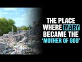

# The Place where Mary became the ‘Mother of God’ #shorts (2021-10-31 16:32:58+00:00)

## Description

The place where Mary became the ‘Mother of God’ #shorts.
Read about the Council of Ephesus: https://en.wikipedia.org/wiki/Council_of_Ephesus

## Full transcript with timestamps

[0:00:00](https://youtu.be/FQmfCM4xswk?t=0) here i am in ephesus at the site of the  
[0:00:04](https://youtu.be/FQmfCM4xswk?t=4) council of ephesus  
[0:00:06](https://youtu.be/FQmfCM4xswk?t=6) in 431 a.d and this was where the  
[0:00:10](https://youtu.be/FQmfCM4xswk?t=10) church met the ecumenical council met to  
[0:00:12](https://youtu.be/FQmfCM4xswk?t=12) proclaim that mary the mother of jesus  
[0:00:15](https://youtu.be/FQmfCM4xswk?t=15) was also the mother of god himself  
[0:00:19](https://youtu.be/FQmfCM4xswk?t=19) and uh this is where they actually met  
[0:00:21](https://youtu.be/FQmfCM4xswk?t=21) and church church is now in ruins of  
[0:00:23](https://youtu.be/FQmfCM4xswk?t=23) course the church of mary as it's now  
[0:00:26](https://youtu.be/FQmfCM4xswk?t=26) called um but this is the  
[0:00:28](https://youtu.be/FQmfCM4xswk?t=28) site where mary was elevated to the  
[0:00:30](https://youtu.be/FQmfCM4xswk?t=30) status of mother of god theotokos in  
[0:00:34](https://youtu.be/FQmfCM4xswk?t=34) greek meaning god bearer  
