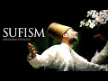

# The Prophet Muhammad ﷺ and Sufism (2022-02-23)

## Description

You Can Support My Work on Patreon:
https://www.patreon.com/Bloggingtheology

My Paypal Link: 
https://www.paypal.com/paypalme/bloggingtheology?locale.x=en_GB

## Summary of [The Prophet Muhammad ﷺ and Sufism](https://www.youtube.com/watch?v=yHQfbRii2pI)

*This summary is AI generated - there may be inaccuracies. *

### [00:00:00](https://www.youtube.com/watch?v=yHQfbRii2pI&t=0) - [00:10:00](https://www.youtube.com/watch?v=yHQfbRii2pI&t=600)

This video discusses the Islamic mystical tradition of Sufism. It explains how Sufis view the world and how they believe humans can connect with God. The video also discusses the Islamic prohibition on tobacco and the Muslim celebration of Muhammad's birthday.

**[00:00:00](https://www.youtube.com/watch?v=yHQfbRii2pI&t=0)** This video looks at the Islamic mystical tradition of Sufism and its view of creation. Sufism stresses the importance of understanding God's beauty in the world, and of achieving a state of perfect understanding of God. It also stresses the importance of human connection to God, and the importance of humans being the perfect reflection of God.
* **[00:05:00](https://www.youtube.com/watch?v=yHQfbRii2pI&t=300)** Sufism is the Islamic tradition of mystical contemplation and practice. Ibn Arabi, one of the most famous sufi thinkers, believes that Muhammad, the perfect human, is the encapsulation of the divine. According to this theory, when someone experiences a mystical encounter with Muhammad in a dream, it is as if they have seen him in a waking state. This concept is widespread among Muslims and is often used to justify dream encounters with religious prophets.
* **[00:10:00](https://www.youtube.com/watch?v=yHQfbRii2pI&t=600)** This video discusses the Islamic prohibition on tobacco, and how some scholars believe that one can see the Prophet Muhammad in waking hours. It also discusses the muslim celebration of Muhammad's birthday.

<h2>Full transcript with timestamps: CLICK TO EXPAND</h2>

[0:00:00](https://youtu.be/yHQfbRii2pI?t=0) in this video i want to look at muhammad  
[0:00:03](https://youtu.be/yHQfbRii2pI?t=3) upon hinbi peace and the mystical quest  
[0:00:06](https://youtu.be/yHQfbRii2pI?t=6) otherwise known as sufism  
[0:00:14](https://youtu.be/yHQfbRii2pI?t=14) and for our guide i want to read a few  
[0:00:16](https://youtu.be/yHQfbRii2pI?t=16) words from this excellent little book  
[0:00:19](https://youtu.be/yHQfbRii2pI?t=19) called muhammad a very short  
[0:00:21](https://youtu.be/yHQfbRii2pI?t=21) introduction by professor jonathan a.c  
[0:00:24](https://youtu.be/yHQfbRii2pI?t=24) brown who had the immense privilege of  
[0:00:26](https://youtu.be/yHQfbRii2pI?t=26) talking to just a few days ago on  
[0:00:28](https://youtu.be/yHQfbRii2pI?t=28) blogging theology and as i'm sure you  
[0:00:30](https://youtu.be/yHQfbRii2pI?t=30) know he's a professor of islamic studies  
[0:00:33](https://youtu.be/yHQfbRii2pI?t=33) at georgetown university in washington  
[0:00:36](https://youtu.be/yHQfbRii2pI?t=36) dc and now bowie this book published by  
[0:00:39](https://youtu.be/yHQfbRii2pI?t=39) oxford university press is a great  
[0:00:41](https://youtu.be/yHQfbRii2pI?t=41) present a great gift to non-muslims who  
[0:00:44](https://youtu.be/yHQfbRii2pI?t=44) might want to know more about the  
[0:00:45](https://youtu.be/yHQfbRii2pI?t=45) religion of islam its history how it's  
[0:00:48](https://youtu.be/yHQfbRii2pI?t=48) understood by muslims and by western  
[0:00:50](https://youtu.be/yHQfbRii2pI?t=50) scholars very fair-minded objective  
[0:00:53](https://youtu.be/yHQfbRii2pI?t=53) account i think of the whole subject so  
[0:00:55](https://youtu.be/yHQfbRii2pI?t=55) i do recommend it for that too  
[0:00:57](https://youtu.be/yHQfbRii2pI?t=57) now i want to look at a brief section  
[0:00:59](https://youtu.be/yHQfbRii2pI?t=59) that he has written called muhammad and  
[0:01:01](https://youtu.be/yHQfbRii2pI?t=61) the mystical quest which is very very  
[0:01:04](https://youtu.be/yHQfbRii2pI?t=64) interesting and also just a few  
[0:01:05](https://youtu.be/yHQfbRii2pI?t=65) paragraphs encountering muhammad in  
[0:01:08](https://youtu.be/yHQfbRii2pI?t=68) dreams which i think is very interesting  
[0:01:11](https://youtu.be/yHQfbRii2pI?t=71) so um professor jonathan brown writes  
[0:01:15](https://youtu.be/yHQfbRii2pI?t=75) islam has always possessed a strong  
[0:01:18](https://youtu.be/yHQfbRii2pI?t=78) mystical dimension that underscores the  
[0:01:21](https://youtu.be/yHQfbRii2pI?t=81) absolute contrast between the ultimate  
[0:01:24](https://youtu.be/yHQfbRii2pI?t=84) reality of god and the transients of his  
[0:01:29](https://youtu.be/yHQfbRii2pI?t=89) creation  
[0:01:30](https://youtu.be/yHQfbRii2pI?t=90) as the quran says  
[0:01:32](https://youtu.be/yHQfbRii2pI?t=92) all things perish except the face of god  
[0:01:37](https://youtu.be/yHQfbRii2pI?t=97) that's quran 28 68.  
[0:01:40](https://youtu.be/yHQfbRii2pI?t=100) sufism the islamic mystic mystical  
[0:01:43](https://youtu.be/yHQfbRii2pI?t=103) tradition  
[0:01:44](https://youtu.be/yHQfbRii2pI?t=104) has affirmed that creation is nothing  
[0:01:46](https://youtu.be/yHQfbRii2pI?t=106) more than an ephemeral reflection of  
[0:01:50](https://youtu.be/yHQfbRii2pI?t=110) god's magnificence ephemeral meaning  
[0:01:53](https://youtu.be/yHQfbRii2pI?t=113) it's just passing just a shadow just a  
[0:01:55](https://youtu.be/yHQfbRii2pI?t=115) reflection of god's magnificence his  
[0:01:58](https://youtu.be/yHQfbRii2pI?t=118) glory  
[0:01:59](https://youtu.be/yHQfbRii2pI?t=119) man's greatest accomplishment is to  
[0:02:02](https://youtu.be/yHQfbRii2pI?t=122) penetrate the veil of this world and  
[0:02:05](https://youtu.be/yHQfbRii2pI?t=125) become annihilated in god in this life  
[0:02:09](https://youtu.be/yHQfbRii2pI?t=129) as sufis often say to die before you die  
[0:02:15](https://youtu.be/yHQfbRii2pI?t=135) for muslim mystics true piety and god  
[0:02:19](https://youtu.be/yHQfbRii2pI?t=139) consciousness taqwa means seeing god's  
[0:02:22](https://youtu.be/yHQfbRii2pI?t=142) beauty revealed in every object in this  
[0:02:26](https://youtu.be/yHQfbRii2pI?t=146) world  
[0:02:27](https://youtu.be/yHQfbRii2pI?t=147) the pinnacle of human awareness is to  
[0:02:30](https://youtu.be/yHQfbRii2pI?t=150) know god more and more intimately  
[0:02:33](https://youtu.be/yHQfbRii2pI?t=153) through his signs and perfectly reflect  
[0:02:36](https://youtu.be/yHQfbRii2pI?t=156) his attributes  
[0:02:38](https://youtu.be/yHQfbRii2pI?t=158) to achieve this profound understanding  
[0:02:40](https://youtu.be/yHQfbRii2pI?t=160) is to be is to completely reconnect with  
[0:02:44](https://youtu.be/yHQfbRii2pI?t=164) the source of all existence and fulfill  
[0:02:47](https://youtu.be/yHQfbRii2pI?t=167) the deepest yearnings of the soul  
[0:02:50](https://youtu.be/yHQfbRii2pI?t=170) so brown here is talking about superzoom  
[0:02:53](https://youtu.be/yHQfbRii2pI?t=173) this is the motivation and the  
[0:02:55](https://youtu.be/yHQfbRii2pI?t=175) trajectory of sufism moving towards god  
[0:02:58](https://youtu.be/yHQfbRii2pI?t=178) and the annihilation of the soul  
[0:03:01](https://youtu.be/yHQfbRii2pI?t=181) he continues this mystical worldview was  
[0:03:04](https://youtu.be/yHQfbRii2pI?t=184) first organized into a systematic  
[0:03:07](https://youtu.be/yHQfbRii2pI?t=187) cosmology or view of the universe by the  
[0:03:10](https://youtu.be/yHQfbRii2pI?t=190) seminal sufi ibn arabi very famous  
[0:03:14](https://youtu.be/yHQfbRii2pI?t=194) muslim  
[0:03:15](https://youtu.be/yHQfbRii2pI?t=195) writer and intellectual he died in 1240  
[0:03:18](https://youtu.be/yHQfbRii2pI?t=198) of the christian era  
[0:03:20](https://youtu.be/yHQfbRii2pI?t=200) who devised the conception of creation  
[0:03:23](https://youtu.be/yHQfbRii2pI?t=203) as a reflection of god's attributes now  
[0:03:26](https://youtu.be/yHQfbRii2pI?t=206) by the way i've read i tried to read  
[0:03:28](https://youtu.be/yHQfbRii2pI?t=208) around this subject in other books and  
[0:03:30](https://youtu.be/yHQfbRii2pI?t=210) this summary by brown is actually some  
[0:03:33](https://youtu.be/yHQfbRii2pI?t=213) of the best and clearest  
[0:03:35](https://youtu.be/yHQfbRii2pI?t=215) uh summaries i've read of ib and  
[0:03:37](https://youtu.be/yHQfbRii2pI?t=217) arabie's thought which i found  
[0:03:38](https://youtu.be/yHQfbRii2pI?t=218) particularly difficult to grasp so  
[0:03:41](https://youtu.be/yHQfbRii2pI?t=221) all credit to brown here for giving a  
[0:03:44](https://youtu.be/yHQfbRii2pI?t=224) quite a lucid summary i think although  
[0:03:46](https://youtu.be/yHQfbRii2pI?t=226) very brief of araby's thought  
[0:03:49](https://youtu.be/yHQfbRii2pI?t=229) and arabic cites he says a hadith in  
[0:03:52](https://youtu.be/yHQfbRii2pI?t=232) which the prophet supposedly quoted  
[0:03:55](https://youtu.be/yHQfbRii2pI?t=235) himself i think brown said supposedly  
[0:03:57](https://youtu.be/yHQfbRii2pI?t=237) because i know from another book that  
[0:03:59](https://youtu.be/yHQfbRii2pI?t=239) brown wrote on hadith that this hadith  
[0:04:02](https://youtu.be/yHQfbRii2pI?t=242) is actually unreliable anyway  
[0:04:04](https://youtu.be/yHQfbRii2pI?t=244) arabi ibn arabi quotes this hadith i was  
[0:04:08](https://youtu.be/yHQfbRii2pI?t=248) a hidden treasure and i wanted to be  
[0:04:11](https://youtu.be/yHQfbRii2pI?t=251) known  
[0:04:12](https://youtu.be/yHQfbRii2pI?t=252) so i created the world and it knew me  
[0:04:18](https://youtu.be/yHQfbRii2pI?t=258) brown continues every component of the  
[0:04:20](https://youtu.be/yHQfbRii2pI?t=260) cosmos and the natural world mirrors  
[0:04:23](https://youtu.be/yHQfbRii2pI?t=263) god's endless beauty order and creative  
[0:04:26](https://youtu.be/yHQfbRii2pI?t=266) capacity  
[0:04:28](https://youtu.be/yHQfbRii2pI?t=268) the capstone of creation is mankind  
[0:04:32](https://youtu.be/yHQfbRii2pI?t=272) which alone is capable of reflecting  
[0:04:34](https://youtu.be/yHQfbRii2pI?t=274) god's most essential attribute  
[0:04:37](https://youtu.be/yHQfbRii2pI?t=277) his unity  
[0:04:39](https://youtu.be/yHQfbRii2pI?t=279) the human soul embodies the multiplicity  
[0:04:42](https://youtu.be/yHQfbRii2pI?t=282) of the cosmos but can also bring them  
[0:04:45](https://youtu.be/yHQfbRii2pI?t=285) into balance and proper proportion  
[0:04:48](https://youtu.be/yHQfbRii2pI?t=288) a person who has achieved this state is  
[0:04:51](https://youtu.be/yHQfbRii2pI?t=291) the consummate reflection of god's  
[0:04:54](https://youtu.be/yHQfbRii2pI?t=294) perfection  
[0:04:55](https://youtu.be/yHQfbRii2pI?t=295) this is the perfect human  
[0:04:58](https://youtu.be/yHQfbRii2pI?t=298) uh the ultimate knower of god  
[0:05:01](https://youtu.be/yHQfbRii2pI?t=301) for who for which god created the  
[0:05:04](https://youtu.be/yHQfbRii2pI?t=304) universe itself  
[0:05:06](https://youtu.be/yHQfbRii2pI?t=306) so brown here is summarizing ibn arabi's  
[0:05:08](https://youtu.be/yHQfbRii2pI?t=308) philosophy  
[0:05:10](https://youtu.be/yHQfbRii2pI?t=310) similarly each of the great prophets  
[0:05:13](https://youtu.be/yHQfbRii2pI?t=313) sent throughout history reflected one of  
[0:05:16](https://youtu.be/yHQfbRii2pI?t=316) god's attributes such as his power  
[0:05:19](https://youtu.be/yHQfbRii2pI?t=319) creativity or mercy  
[0:05:22](https://youtu.be/yHQfbRii2pI?t=322) they culminated in muhammad whom the  
[0:05:25](https://youtu.be/yHQfbRii2pI?t=325) quran calls the seal of the prophets  
[0:05:29](https://youtu.be/yHQfbRii2pI?t=329) he was the perfect human par excellence  
[0:05:32](https://youtu.be/yHQfbRii2pI?t=332) in other words exceedingly so the  
[0:05:34](https://youtu.be/yHQfbRii2pI?t=334) greatest the most excellent human the  
[0:05:37](https://youtu.be/yHQfbRii2pI?t=337) flawless reflection of god who  
[0:05:40](https://youtu.be/yHQfbRii2pI?t=340) represented the goal sought by all  
[0:05:43](https://youtu.be/yHQfbRii2pI?t=343) mystical seekers of truth  
[0:05:47](https://youtu.be/yHQfbRii2pI?t=347) his timeless essence this is muhammad's  
[0:05:50](https://youtu.be/yHQfbRii2pI?t=350) timeless essence which iban arabi called  
[0:05:53](https://youtu.be/yHQfbRii2pI?t=353) the muhammadan reality and this phrase  
[0:05:56](https://youtu.be/yHQfbRii2pI?t=356) muhammadan reality is a a key term in  
[0:05:59](https://youtu.be/yHQfbRii2pI?t=359) ibn arabi's thought  
[0:06:02](https://youtu.be/yHQfbRii2pI?t=362) this timeless essence was the eternal  
[0:06:05](https://youtu.be/yHQfbRii2pI?t=365) reality of the perfect human  
[0:06:08](https://youtu.be/yHQfbRii2pI?t=368) in the world and the whole purpose of  
[0:06:11](https://youtu.be/yHQfbRii2pI?t=371) creation  
[0:06:12](https://youtu.be/yHQfbRii2pI?t=372) see very exalted status here given to  
[0:06:15](https://youtu.be/yHQfbRii2pI?t=375) muhammad upon him be peace in sufism  
[0:06:18](https://youtu.be/yHQfbRii2pI?t=378) then brown writes mohammed ceases to be  
[0:06:21](https://youtu.be/yHQfbRii2pI?t=381) a mere mortal it's worth repeating  
[0:06:25](https://youtu.be/yHQfbRii2pI?t=385) according to professor jonathan brown in  
[0:06:27](https://youtu.be/yHQfbRii2pI?t=387) sufism then muhammad ceases to be a mere  
[0:06:31](https://youtu.be/yHQfbRii2pI?t=391) mortal  
[0:06:32](https://youtu.be/yHQfbRii2pI?t=392) behind and above muhammad the man  
[0:06:36](https://youtu.be/yHQfbRii2pI?t=396) is muhammad the cosmic reality the  
[0:06:39](https://youtu.be/yHQfbRii2pI?t=399) cosmic reality  
[0:06:41](https://youtu.be/yHQfbRii2pI?t=401) practitioners of sufism phrased this  
[0:06:43](https://youtu.be/yHQfbRii2pI?t=403) belief in several hadith attributed  
[0:06:47](https://youtu.be/yHQfbRii2pI?t=407) falsely says professor brown to muhammad  
[0:06:51](https://youtu.be/yHQfbRii2pI?t=411) such as the prophet's words to his  
[0:06:53](https://youtu.be/yHQfbRii2pI?t=413) companion jabir  
[0:06:56](https://youtu.be/yHQfbRii2pI?t=416) the first thing that god created was the  
[0:06:58](https://youtu.be/yHQfbRii2pI?t=418) light of your prophet o jabir  
[0:07:02](https://youtu.be/yHQfbRii2pI?t=422) another admittedly unreliable hadith  
[0:07:05](https://youtu.be/yHQfbRii2pI?t=425) quotes the prophet as telling that he  
[0:07:08](https://youtu.be/yHQfbRii2pI?t=428) existed as light 2 000 years before adam  
[0:07:12](https://youtu.be/yHQfbRii2pI?t=432) was even  
[0:07:14](https://youtu.be/yHQfbRii2pI?t=434) created the timelessness of the  
[0:07:17](https://youtu.be/yHQfbRii2pI?t=437) muhammadan reality that phrase again  
[0:07:20](https://youtu.be/yHQfbRii2pI?t=440) is demonstrated as the prophet explains  
[0:07:23](https://youtu.be/yHQfbRii2pI?t=443) that another quote  
[0:07:25](https://youtu.be/yHQfbRii2pI?t=445) god sent me down to the earth in the  
[0:07:28](https://youtu.be/yHQfbRii2pI?t=448) loins of adam and made me of the lines  
[0:07:31](https://youtu.be/yHQfbRii2pI?t=451) of lot of noah placing me in the loins  
[0:07:34](https://youtu.be/yHQfbRii2pI?t=454) of abraham and god did not cease moving  
[0:07:38](https://youtu.be/yHQfbRii2pI?t=458) me through the noble and pure wombs  
[0:07:41](https://youtu.be/yHQfbRii2pI?t=461) until he brought me forth from my  
[0:07:44](https://youtu.be/yHQfbRii2pI?t=464) parents  
[0:07:46](https://youtu.be/yHQfbRii2pI?t=466) so muhammad himself his this muhammadan  
[0:07:48](https://youtu.be/yHQfbRii2pI?t=468) reality went through all of the prophets  
[0:07:51](https://youtu.be/yHQfbRii2pI?t=471) um sent down to earth and through adam  
[0:07:54](https://youtu.be/yHQfbRii2pI?t=474) until he  
[0:07:56](https://youtu.be/yHQfbRii2pI?t=476) came forth from the loins of his parents  
[0:08:01](https://youtu.be/yHQfbRii2pI?t=481) the prophet's ascension to heaven has  
[0:08:03](https://youtu.be/yHQfbRii2pI?t=483) provided a compelling model for sufi  
[0:08:06](https://youtu.be/yHQfbRii2pI?t=486) mystical experiences  
[0:08:08](https://youtu.be/yHQfbRii2pI?t=488) reflecting the prophetic example  
[0:08:11](https://youtu.be/yHQfbRii2pI?t=491) several prominent muslim mystics  
[0:08:13](https://youtu.be/yHQfbRii2pI?t=493) experienced ascensions to heaven in a  
[0:08:16](https://youtu.be/yHQfbRii2pI?t=496) dream state  
[0:08:18](https://youtu.be/yHQfbRii2pI?t=498) the famous iranian mystic al bistarmi  
[0:08:22](https://youtu.be/yHQfbRii2pI?t=502) died  
[0:08:23](https://youtu.be/yHQfbRii2pI?t=503) 874 of the christian era dreamt that he  
[0:08:26](https://youtu.be/yHQfbRii2pI?t=506) was elevated up through the seven  
[0:08:29](https://youtu.be/yHQfbRii2pI?t=509) heavens encountering the temptations of  
[0:08:31](https://youtu.be/yHQfbRii2pI?t=511) bliss in paradise at every stage  
[0:08:36](https://youtu.be/yHQfbRii2pI?t=516) like the earthly challenge of  
[0:08:38](https://youtu.be/yHQfbRii2pI?t=518) continually purifying one's behavior and  
[0:08:41](https://youtu.be/yHQfbRii2pI?t=521) spirit as one progresses along the sufi  
[0:08:44](https://youtu.be/yHQfbRii2pI?t=524) path  
[0:08:45](https://youtu.be/yHQfbRii2pI?t=525) however al-bistami realized that he must  
[0:08:48](https://youtu.be/yHQfbRii2pI?t=528) forgo these luxuries to move closer to  
[0:08:51](https://youtu.be/yHQfbRii2pI?t=531) god  
[0:08:52](https://youtu.be/yHQfbRii2pI?t=532) eventually al-bist army arrives at the  
[0:08:55](https://youtu.be/yHQfbRii2pI?t=535) highest heaven and encounters the spirit  
[0:08:58](https://youtu.be/yHQfbRii2pI?t=538) of muhammad  
[0:09:00](https://youtu.be/yHQfbRii2pI?t=540) and the mystical presence of god  
[0:09:03](https://youtu.be/yHQfbRii2pI?t=543) so that ends the section in this book on  
[0:09:08](https://youtu.be/yHQfbRii2pI?t=548) uh sufism basically muhammad and the  
[0:09:10](https://youtu.be/yHQfbRii2pI?t=550) mystical quest this is a very short  
[0:09:13](https://youtu.be/yHQfbRii2pI?t=553) further section  
[0:09:14](https://youtu.be/yHQfbRii2pI?t=554) entitled encountering muhammad in dreams  
[0:09:18](https://youtu.be/yHQfbRii2pI?t=558) which is fascinating  
[0:09:20](https://youtu.be/yHQfbRii2pI?t=560) and professor jonathan baum writes in a  
[0:09:23](https://youtu.be/yHQfbRii2pI?t=563) famous hadith muhammad is reported to  
[0:09:26](https://youtu.be/yHQfbRii2pI?t=566) have said  
[0:09:27](https://youtu.be/yHQfbRii2pI?t=567) whoever sees me in a dream it is as if  
[0:09:31](https://youtu.be/yHQfbRii2pI?t=571) they had seen me while awake  
[0:09:35](https://youtu.be/yHQfbRii2pI?t=575) based on this report muslim scholars  
[0:09:38](https://youtu.be/yHQfbRii2pI?t=578) acknowledge the reality of dream  
[0:09:40](https://youtu.be/yHQfbRii2pI?t=580) encounters with the prophet  
[0:09:43](https://youtu.be/yHQfbRii2pI?t=583) visions of him in dreams of muslim  
[0:09:45](https://youtu.be/yHQfbRii2pI?t=585) scholars and laymen alike remain common  
[0:09:48](https://youtu.be/yHQfbRii2pI?t=588) today  
[0:09:50](https://youtu.be/yHQfbRii2pI?t=590) as we saw with al-bistami for mystics  
[0:09:54](https://youtu.be/yHQfbRii2pI?t=594) encountering muhammad in a dream is a  
[0:09:56](https://youtu.be/yHQfbRii2pI?t=596) means for gaining mystical understanding  
[0:10:00](https://youtu.be/yHQfbRii2pI?t=600) it could also influence muslim scholars  
[0:10:03](https://youtu.be/yHQfbRii2pI?t=603) in their writings and legal rulings  
[0:10:06](https://youtu.be/yHQfbRii2pI?t=606) in the 18th century a muslim scholar  
[0:10:09](https://youtu.be/yHQfbRii2pI?t=609) ruled and this is very interesting that  
[0:10:11](https://youtu.be/yHQfbRii2pI?t=611) smoking tobacco should be discouraged  
[0:10:14](https://youtu.be/yHQfbRii2pI?t=614) after the prophet appeared to him in a  
[0:10:16](https://youtu.be/yHQfbRii2pI?t=616) dream  
[0:10:17](https://youtu.be/yHQfbRii2pI?t=617) and told him that he did not like how  
[0:10:20](https://youtu.be/yHQfbRii2pI?t=620) aisha was one of the wise of the prophet  
[0:10:22](https://youtu.be/yHQfbRii2pI?t=622) smelled when she smoked  
[0:10:25](https://youtu.be/yHQfbRii2pI?t=625) and brown riley comments of course  
[0:10:28](https://youtu.be/yHQfbRii2pI?t=628) tobacco did not appear in the near east  
[0:10:30](https://youtu.be/yHQfbRii2pI?t=630) until nine centuries after the prophet's  
[0:10:33](https://youtu.be/yHQfbRii2pI?t=633) death  
[0:10:35](https://youtu.be/yHQfbRii2pI?t=635) during the crusade a muslim prisoner who  
[0:10:38](https://youtu.be/yHQfbRii2pI?t=638) had escaped from his frankish captors  
[0:10:40](https://youtu.be/yHQfbRii2pI?t=640) that's the region in france  
[0:10:43](https://youtu.be/yHQfbRii2pI?t=643) told how his chains have been loosened  
[0:10:45](https://youtu.be/yHQfbRii2pI?t=645) by the prophet in a dream  
[0:10:48](https://youtu.be/yHQfbRii2pI?t=648) some muslim scholars believe that one  
[0:10:50](https://youtu.be/yHQfbRii2pI?t=650) can even see the prophet during waking  
[0:10:53](https://youtu.be/yHQfbRii2pI?t=653) hours  
[0:10:54](https://youtu.be/yHQfbRii2pI?t=654) although as the great egyptian scholar  
[0:10:56](https://youtu.be/yHQfbRii2pI?t=656) ibn al-hajj died 1336 said  
[0:11:00](https://youtu.be/yHQfbRii2pI?t=660) this is a narrow door  
[0:11:04](https://youtu.be/yHQfbRii2pI?t=664) strict laws of obligation or prohibition  
[0:11:07](https://youtu.be/yHQfbRii2pI?t=667) however cannot be based on dreams  
[0:11:10](https://youtu.be/yHQfbRii2pI?t=670) according to islamic legal theory that's  
[0:11:14](https://youtu.be/yHQfbRii2pI?t=674) the end of that quote now there is a  
[0:11:17](https://youtu.be/yHQfbRii2pI?t=677) further fascinating section uh called  
[0:11:20](https://youtu.be/yHQfbRii2pI?t=680) muhammad in popular islamic religion  
[0:11:23](https://youtu.be/yHQfbRii2pI?t=683) which is actually worth looking at and  
[0:11:25](https://youtu.be/yHQfbRii2pI?t=685) also a section on mao maulid celebrating  
[0:11:28](https://youtu.be/yHQfbRii2pI?t=688) muhammad's birthday now perhaps i'll  
[0:11:31](https://youtu.be/yHQfbRii2pI?t=691) leave that till another time but uh i do  
[0:11:33](https://youtu.be/yHQfbRii2pI?t=693) recommend this book as i say as a as a  
[0:11:36](https://youtu.be/yHQfbRii2pI?t=696) gift or present to non-muslims seeking  
[0:11:38](https://youtu.be/yHQfbRii2pI?t=698) to have a really good academic scholarly  
[0:11:41](https://youtu.be/yHQfbRii2pI?t=701) understanding of islam and the prophet  
[0:11:44](https://youtu.be/yHQfbRii2pI?t=704) of islam muhammad upon whom be peace  
[0:11:48](https://youtu.be/yHQfbRii2pI?t=708) until next time  

