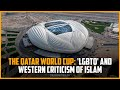

# The Qatar World Cup: 'LGBTQ' and Western criticism of Islam (2022-11-10)

## Description

Qatar World Cup ambassador calls homosexuality ‘damage in the mind’ https://www.thetimes.co.uk/article/qatari-world-cup-ambassador-calls-homosexuality-damage-in-the-mind-hlv7q8ttm?spot_im_highlight_immediate=true&spot_im_reply_id=sp_nNNHCgsN_b413c2a2-5f52-11ed-80da-2c56e60527b0_c_2HH13VRNWYkFAEruPW17JubXrrz_r_2HH2ntcT4rfW43b2WMJOrMGyRfM&utm_source=spoitm&utm_medium=spotim_conversation&spot_im_redirect_source=email

You Can Support My Work on Patreon:
https://www.patreon.com/Bloggingtheology

My Paypal Link: 
https://www.paypal.com/paypalme/bloggingtheology?locale.x=en_GB

## Summary of [The Qatar World Cup: 'LGBTQ' and Western criticism of Islam](https://www.youtube.com/watch?v=BGBKp6fNb18)

*This summary is AI generated - there may be inaccuracies. *

### [00:00:00](https://www.youtube.com/watch?v=BGBKp6fNb18&t=0) - [00:10:00](https://www.youtube.com/watch?v=BGBKp6fNb18&t=600)

The video discusses the Qatar World Cup controversy, Western criticism of Islam, and how there is an asymmetry of power between the West and Muslim countries. It also suggests that Islamophobia is an example of this irrational fear.

**[00:00:00](https://www.youtube.com/watch?v=BGBKp6fNb18&t=0)** The Qatar World Cup is being criticized for its views on LGBTQ rights, with retired Qatari football star Khalid Salman emphasizing that "many things will come into this country in the course of the World Cup, let us talk about gay people." This points to the asymmetry of power in the world, where the West does not respect Islamic morality.
* **[00:05:00](https://www.youtube.com/watch?v=BGBKp6fNb18&t=300)** The video discusses the Sharia, specifically the Hadideh punishment of "warding off the Hadoop by ambiguities." It points out that this punishment is virtually impossible to apply in Islamic law, and that there is a great disrespect for Islam in the Western media. It also mentions how the West for example, when it hosts the World Cup, is not taken to task for its foreign policy.
* **[00:10:00](https://www.youtube.com/watch?v=BGBKp6fNb18&t=600)** The Qatar World Cup has sparked controversy due to Western criticism of Islam, with some alleging that the Gulf country is not upholding the same high moral standards as other Western countries. While it is unclear who would enforce such rules, the video suggests that there is an asymmetry of power between the West and Muslim countries. Meanwhile, Islamophobia is discussed as an example of this irrational fear.

<h2>Full transcript with timestamps: CLICK TO EXPAND</h2>

[0:00:03](https://youtu.be/BGBKp6fNb18?t=3) I notice from media reports that there's a growing 
chorus of voices in the west criticizing Qatar    
[0:00:11](https://youtu.be/BGBKp6fNb18?t=11) which is hosting the World Cup which is due to 
take place very shortly for example the London    
[0:00:17](https://youtu.be/BGBKp6fNb18?t=17) Times reports and I quote an official Ambassador 
for the football World Cup in Qatar has described    
[0:00:25](https://youtu.be/BGBKp6fNb18?t=25) homosexuality as a form of quote damage in the 
mind during a German television interview before    
[0:00:33](https://youtu.be/BGBKp6fNb18?t=33) he was swiftly cut off by a media advisor the 
Arab state where homosexuality is punishable    
[0:00:41](https://youtu.be/BGBKp6fNb18?t=41) by up to three years in prison has struggled to 
fend off criticism of its record on LGBTQ rights    
[0:00:50](https://youtu.be/BGBKp6fNb18?t=50) Khalid Salman a retired Qatari football star who 
is one of the ambassadors for the World Cup has    
[0:00:57](https://youtu.be/BGBKp6fNb18?t=57) underscored this tension with his remarks on 
gay rights in an interview with ZDF a German    
[0:01:05](https://youtu.be/BGBKp6fNb18?t=65) public broadcaster Salman 60 acknowledged 
that quote many things will come into this    
[0:01:12](https://youtu.be/BGBKp6fNb18?t=72) country in the course of the World Cup let 
us talk about gay people for example he said    
[0:01:19](https://youtu.be/BGBKp6fNb18?t=79) the most important thing is that everyone accepts 
they are coming here and they would have to accept    
[0:01:26](https://youtu.be/BGBKp6fNb18?t=86) our rules unquote and the times continues he added 
that he was worried Qatari children might see gay    
[0:01:35](https://youtu.be/BGBKp6fNb18?t=95) men and learn quote something that is not good 
unquote asked why homosexuality was banned in his    
[0:01:43](https://youtu.be/BGBKp6fNb18?t=103) country Salman said it was Haram an Arabic term 
meaning forbidden under Islamic law now this is    
[0:01:52](https://youtu.be/BGBKp6fNb18?t=112) very interesting and there's been a whole rash 
of Articles BBC Guardian the Times and many    
[0:01:58](https://youtu.be/BGBKp6fNb18?t=118) other media platforms criticizing Qatar for 
its views on so-called LGBTQ rights and this    
[0:02:08](https://youtu.be/BGBKp6fNb18?t=128) struck me as particularly significant what does 
it tell us about what's going on in the world well    
[0:02:14](https://youtu.be/BGBKp6fNb18?t=134) firstly it tells us that the West believes it's 
right and Superior in the secular liberal value    
[0:02:22](https://youtu.be/BGBKp6fNb18?t=142) system that it has and that everywhere else in the 
world especially Muslim countries must follow the    
[0:02:29](https://youtu.be/BGBKp6fNb18?t=149) West and do as the West does in its ever changing 
ever evolving value system could never stays    
[0:02:36](https://youtu.be/BGBKp6fNb18?t=156) still for long there's always a new moral code 
and new attitudes and no new mores that we in    
[0:02:42](https://youtu.be/BGBKp6fNb18?t=162) the west are expected to adopt and everywhere else 
by extension must also accept and this this    
[0:02:49](https://youtu.be/BGBKp6fNb18?t=169) points to the asymmetry of power in the world 
of course but more seriously than that it suggests    
[0:02:56](https://youtu.be/BGBKp6fNb18?t=176) that the West does not respect Islamic morality it 
has completely ignored this I noticed this that    
[0:03:03](https://youtu.be/BGBKp6fNb18?t=183) in the media reports the word Islam rarely appears 
but the teaching of Islam is directly contradicted    
[0:03:10](https://youtu.be/BGBKp6fNb18?t=190) and condemned repeatedly but what is this teaching 
and I notice in the media at least as far as I    
[0:03:16](https://youtu.be/BGBKp6fNb18?t=196) see it I rarely see an informed discussion of 
exactly what Islamic law teaches on this subject    
[0:03:22](https://youtu.be/BGBKp6fNb18?t=202) of homosexuality but just to scratch the surface 
it's easy to find out there's plenty of resources    
[0:03:29](https://youtu.be/BGBKp6fNb18?t=209) online and books that teach the truth about this 
the first thing that's not seems to that people    
[0:03:34](https://youtu.be/BGBKp6fNb18?t=214) in the west don't seem to realize that is there 
is no agreed upon punishment for homosexual acts    
[0:03:42](https://youtu.be/BGBKp6fNb18?t=222) for example the Hanafi school traditionally  has said that there is no capital punishment    
[0:03:47](https://youtu.be/BGBKp6fNb18?t=227) for homosexual acts the often it's left 
to the discretion of the judge the Qadi    
[0:03:53](https://youtu.be/BGBKp6fNb18?t=233) for example the other scores that the hand 
belief do mandate the death penalty for    
[0:03:59](https://youtu.be/BGBKp6fNb18?t=239) homosexual acts this is true but the the the most 
commonly followed score the hanafi score does not    
[0:04:06](https://youtu.be/BGBKp6fNb18?t=246) but what are we talking about him sorry to get 
a bit explicit and there's an explicit warning    
[0:04:12](https://youtu.be/BGBKp6fNb18?t=252) here what are we talking about when we're 
talking about homosexuality precisely well the    
[0:04:17](https://youtu.be/BGBKp6fNb18?t=257) Sharia seems to be concerned in the main with 
something in Arabic called you can look it up    
[0:04:25](https://youtu.be/BGBKp6fNb18?t=265) what does it mean well an English equivalent a 
translation will be sodomy that's what it's    
[0:04:31](https://youtu.be/BGBKp6fNb18?t=271) concerned about this particular act now the Sharia 
is concerned with public behavior and indeed    
[0:04:39](https://youtu.be/BGBKp6fNb18?t=279) Salman himself said that the most important thing 
is that everyone except they are coming here and    
[0:04:44](https://youtu.be/BGBKp6fNb18?t=284) that they have to accept our rules and these 
rules are public rules to do a behavior not    
[0:04:52](https://youtu.be/BGBKp6fNb18?t=292) with private behavior this is a quite important 
distinction that's explicitly recognized in Sharia    
[0:04:59](https://youtu.be/BGBKp6fNb18?t=299) so to be a crime in an Islamic context Qatar 
being an Islamic society in this in the sense that    
[0:05:06](https://youtu.be/BGBKp6fNb18?t=306) it follows many aspects of the Sharia a particular 
act has to be done in public this is when    
[0:05:13](https://youtu.be/BGBKp6fNb18?t=313) it becomes a crime and be witnessed by four people 
four upstanding witnesses so they can't themselves    
[0:05:20](https://youtu.be/BGBKp6fNb18?t=320) have a criminal record or be a dubious character 
and then they have to go to court and testify in    
[0:05:27](https://youtu.be/BGBKp6fNb18?t=327) front of a judge that they witness said alleged 
behavior taking place and the behavior itself the    
[0:05:34](https://youtu.be/BGBKp6fNb18?t=334) act of penetration is what they have to see they 
can't just see two people vaguely doing whatever    
[0:05:38](https://youtu.be/BGBKp6fNb18?t=338) they have to witness the act itself in a court and 
as I say there's no agreed punishment uh for this    
[0:05:48](https://youtu.be/BGBKp6fNb18?t=348) now what is uh this is called uh the hadude 
punishments and there's more to be said about    
[0:05:54](https://youtu.be/BGBKp6fNb18?t=354) them and they apply to adultery uh homosexual 
acts and and a cut just like one or two other    
[0:06:00](https://youtu.be/BGBKp6fNb18?t=360) categories which we won't go into uh now but the 
central principle in the application of hadude    
[0:06:06](https://youtu.be/BGBKp6fNb18?t=366) punishments as they're called is maximizing Mercy 
Mercy is the heart of this and this was clearly    
[0:06:15](https://youtu.be/BGBKp6fNb18?t=375) formula it's not just a a modernist liberal kind 
of humanitarian idea this was clearly formulated    
[0:06:22](https://youtu.be/BGBKp6fNb18?t=382) in a Hadith this is a saying of the Prophet 
Muhammad upon whom be peace and it was also    
[0:06:29](https://youtu.be/BGBKp6fNb18?t=389) echoed by prominent companions among them his 
wife Aisha and the calebs Umar and Ali and the    
[0:06:37](https://youtu.be/BGBKp6fNb18?t=397) best attested version of this Hadith because there 
are several versions is as follows in English ward    
[0:06:43](https://youtu.be/BGBKp6fNb18?t=403) off the hadude from the Muslims as much as you all 
can and if you find a way out for the person then    
[0:06:52](https://youtu.be/BGBKp6fNb18?t=412) let them go for it is better for the authority 
to ER in Mercy than to uh in punishment end    
[0:07:00](https://youtu.be/BGBKp6fNb18?t=420) quote and within A Century Of The Prophet's death 
Muslim Scholars have digested this Hadith into a    
[0:07:08](https://youtu.be/BGBKp6fNb18?t=428) crucial legal Maxim or legal principle which is 
as follows ward off the Hadoop by ambiguities    
[0:07:15](https://youtu.be/BGBKp6fNb18?t=435) ward off the Hadoop by ambiguities so on the con 
in so different from the Western perception of the    
[0:07:23](https://youtu.be/BGBKp6fNb18?t=443) enthusiastic application of her dude laws you're 
not supposed to you're supposed to find a way not    
[0:07:29](https://youtu.be/BGBKp6fNb18?t=449) to implement them uh if possible to get people 
off using whatever strategy can be employed so    
[0:07:36](https://youtu.be/BGBKp6fNb18?t=456) as I say there is no agreed upon punishment it's 
the act is supposed to take place in public there    
[0:07:42](https://youtu.be/BGBKp6fNb18?t=462) have to be four witnesses and they have to testify 
in court not three not two not one but four and    
[0:07:50](https://youtu.be/BGBKp6fNb18?t=470) if there's just any three doesn't matter it cannot 
cannot be brought to court so that is the first    
[0:07:56](https://youtu.be/BGBKp6fNb18?t=476) thing I want to establish is actually virtually 
impossible to implement Hudood punishments    
[0:08:01](https://youtu.be/BGBKp6fNb18?t=481) in Islamic law given these quite strict criteria 
and the bias in the law towards mercy rather than    
[0:08:08](https://youtu.be/BGBKp6fNb18?t=488) severity I think that's an important point to 
grasp and secondly I just want to also mention    
[0:08:17](https://youtu.be/BGBKp6fNb18?t=497) how can I put this politely that there seems 
to be a great disrespect towards Islam in the    
[0:08:22](https://youtu.be/BGBKp6fNb18?t=502) Western media whether it be the conservative 
media or the liberals secular media that there    
[0:08:27](https://youtu.be/BGBKp6fNb18?t=507) seems to be a disinclination to accept that 
other countries non-western countries like    
[0:08:33](https://youtu.be/BGBKp6fNb18?t=513) Qatar and other Muslim majority countries have a 
different value system the West perhaps needs to    
[0:08:41](https://youtu.be/BGBKp6fNb18?t=521) realize that Muslims have very different views 
on sexual morality especially homosexuality    
[0:08:49](https://youtu.be/BGBKp6fNb18?t=529) and as a Muslim Khalid Salman this chap from Qatar 
is is surely entitled to express his sincerely    
[0:08:57](https://youtu.be/BGBKp6fNb18?t=537) held views and this is not a position that is 
usually taken in the west uh we simply dismiss    
[0:09:04](https://youtu.be/BGBKp6fNb18?t=544) Muslims and their faith whenever it contradicts uh 
the latest secular liberal values and the problem    
[0:09:12](https://youtu.be/BGBKp6fNb18?t=552) with these values is they're constantly changing 
they seem to every 10 years or so or even more    
[0:09:18](https://youtu.be/BGBKp6fNb18?t=558) quickly you'll get a new set of ideas and mores 
and values uh that the West suddenly Embraces and    
[0:09:26](https://youtu.be/BGBKp6fNb18?t=566) then it expects the rest of the world especially 
Muslim countries to also accept these values and    
[0:09:33](https://youtu.be/BGBKp6fNb18?t=573) if they don't accept them they can be punished 
they can be threats and people are calling in the    
[0:09:38](https://youtu.be/BGBKp6fNb18?t=578) West for a Qatar no longer to host the cup or that 
it was a mistake to ever give them this because of    
[0:09:45](https://youtu.be/BGBKp6fNb18?t=585) their so-called stance on lgbtq right rights but 
other countries are not treated like this the West    
[0:09:52](https://youtu.be/BGBKp6fNb18?t=592) for example when it hosts the World Cup are they 
taken to task for their foreign policy for their    
[0:09:58](https://youtu.be/BGBKp6fNb18?t=598) invasion of Muslim countries for the numerous 
casualties and deaths resulting from these    
[0:10:03](https://youtu.be/BGBKp6fNb18?t=603) invasions and wars that Western countries like 
America Britain France Etc have been involved in    
[0:10:11](https://youtu.be/BGBKp6fNb18?t=611) numerous Wars in recent years resulting in the 
in the deaths of Untold numbers the very least    
[0:10:18](https://youtu.be/BGBKp6fNb18?t=618) hundreds of thousands of Muslims have died that's 
not mentioned Guantanamo Bay I mean the list is    
[0:10:24](https://youtu.be/BGBKp6fNb18?t=624) rather long unfortunately are these countries held 
to vary the highest moral standards when it comes    
[0:10:30](https://youtu.be/BGBKp6fNb18?t=630) to awarding them uh you know the World Cup or any 
other sporting event tennis or whatever they're    
[0:10:36](https://youtu.be/BGBKp6fNb18?t=636) not are they and who would enforce it anyway 
who would enforce uh these rules on America for    
[0:10:42](https://youtu.be/BGBKp6fNb18?t=642) example or Britain it wouldn't be possible I would 
imagine so uh this whole episode uh reeks suggests    
[0:10:52](https://youtu.be/BGBKp6fNb18?t=652) um an asymmetry of power that the West being 
at the moment at the moment the hegemonic uh    
[0:10:59](https://youtu.be/BGBKp6fNb18?t=659) Power uh the center of gravity when it comes to 
political cultural and economic power calls the    
[0:11:06](https://youtu.be/BGBKp6fNb18?t=666) shots and it universalizes its morality it 
says well we now believe in this latest uh    
[0:11:13](https://youtu.be/BGBKp6fNb18?t=673) um alternative lifestyle as a human right and 
therefore you Muslim countries and everyone else    
[0:11:19](https://youtu.be/BGBKp6fNb18?t=679) must also accept it and if you don't accept it we 
will punish you we will take away your rights to    
[0:11:25](https://youtu.be/BGBKp6fNb18?t=685) act host sports or we will withdraw foreign 
aid or we will sanction you or we'll apply    
[0:11:30](https://youtu.be/BGBKp6fNb18?t=690) unofficial pressure on you which certain Western 
governments it has been disclosed do do they they    
[0:11:37](https://youtu.be/BGBKp6fNb18?t=697) do unofficially uh put very economic pressure 
on people and political pressure on governments    
[0:11:43](https://youtu.be/BGBKp6fNb18?t=703) to come into line with the laces Western View 
so this whole issue of Qatar hosting the World    
[0:11:50](https://youtu.be/BGBKp6fNb18?t=710) Cup has opened up this can of worms unfortunately 
uh and the unwritten text the subtext seems to me    
[0:11:58](https://youtu.be/BGBKp6fNb18?t=718) to be that Muslims can't be Muslims unless they 
agree with the West's uh secular liberal ideology    
[0:12:08](https://youtu.be/BGBKp6fNb18?t=728) we're also told at the same time that politics 
and religion have nothing to do with sports no    
[0:12:14](https://youtu.be/BGBKp6fNb18?t=734) no no no we must get no religion and faith and 
these have nothing to do with sports which of    
[0:12:19](https://youtu.be/BGBKp6fNb18?t=739) course is not true if the religion in question 
is Islam and then the West comes in and starts    
[0:12:27](https://youtu.be/BGBKp6fNb18?t=747) pointing fingers and making accusations and 
this strikes me as very unfair and unbalanced    
[0:12:33](https://youtu.be/BGBKp6fNb18?t=753) and discriminatory and dare I say using the words 
often derided but nevertheless seems really really    
[0:12:40](https://youtu.be/BGBKp6fNb18?t=760) opposite in this context the word is simple it 
is islamophobia it's this kind of irrational    
[0:12:46](https://youtu.be/BGBKp6fNb18?t=766) fear of Islam not really understanding what is 
um actually teaches uh in detail and certainly    
[0:12:53](https://youtu.be/BGBKp6fNb18?t=773) not respecting one of the great faiths of the 
world and the fastest growing religion in the    
[0:12:59](https://youtu.be/BGBKp6fNb18?t=779) world as well the religion of Islam anyway that's 
my rant take it I'll leave it till next time  

