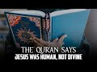

# The Qur'an says Jesus was Human, not Divine (2022-08-22)

## Description

You Can Support My Work on Patreon:
https://www.patreon.com/Bloggingtheology

My Paypal Link: 
https://www.paypal.com/paypalme/bloggingtheology?locale.x=en_GB

## Summary of [The Qur'an says Jesus was Human, not Divine](https://www.youtube.com/watch?v=VC203oe7q5c)

*This summary is AI generated - there may be inaccuracies. *

### [00:00:00](https://www.youtube.com/watch?v=VC203oe7q5c&t=0) - [00:00:00](https://www.youtube.com/watch?v=VC203oe7q5c&t=0)

 the narrator explains how the Qur'an tells us that Jesus was human, not divine. They go on to explain how many messengers have come before him, and how his mother was a woman of truth. The narrator encourages people to stay within the bounds of the truth and to avoid going too far off course.

**[00:00:00](https://www.youtube.com/watch?v=VC203oe7q5c&t=0)** points out that the Qur'an tells us that Jesus was human, not divine. They go on to explain how many messengers have come before him, and how his mother was a woman of truth. They also point out that despite these clear signs, many people are still misguided and have gone astray. The narrator encourages people to stay within the bounds of the truth and to avoid going too far off course.

## Full transcript with timestamps

[0:00:00](https://youtu.be/VC203oe7q5c?t=0) the quran tells us that jesus was human  
[0:00:03](https://youtu.be/VC203oe7q5c?t=3) not divine  
[0:00:05](https://youtu.be/VC203oe7q5c?t=5) the messiah son of mary was no more than  
[0:00:08](https://youtu.be/VC203oe7q5c?t=8) a messenger many messengers have come  
[0:00:10](https://youtu.be/VC203oe7q5c?t=10) and gone before him his mother was a  
[0:00:13](https://youtu.be/VC203oe7q5c?t=13) woman of truth they both at food see how  
[0:00:16](https://youtu.be/VC203oe7q5c?t=16) we make the signs clear to them yet see  
[0:00:19](https://youtu.be/VC203oe7q5c?t=19) how they are deluded from the truth  
[0:00:22](https://youtu.be/VC203oe7q5c?t=22) say o prophet how can you worship  
[0:00:25](https://youtu.be/VC203oe7q5c?t=25) besides god those who can neither harm  
[0:00:28](https://youtu.be/VC203oe7q5c?t=28) nor benefit you and god alone is the  
[0:00:31](https://youtu.be/VC203oe7q5c?t=31) all-hearing all-knowing  
[0:00:34](https://youtu.be/VC203oe7q5c?t=34) say o people of the book do not go to  
[0:00:36](https://youtu.be/VC203oe7q5c?t=36) extremes in your faith beyond the truth  
[0:00:39](https://youtu.be/VC203oe7q5c?t=39) nor follow the vain desires of those who  
[0:00:42](https://youtu.be/VC203oe7q5c?t=42) went astray before you  
[0:00:44](https://youtu.be/VC203oe7q5c?t=44) they misled many and strayed from the  
[0:00:47](https://youtu.be/VC203oe7q5c?t=47) right way  
