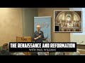

# The Renaissance and Reformation with Paul Williams (2022-08-07 21:09:17+00:00)

## Description

The Western Tradition Glossary:
https://bit.ly/3Ql9zYn

You Can Support My Work on Patreon:
https://www.patreon.com/Bloggingtheology

My Paypal Link: 
https://www.paypal.com/paypalme/bloggingtheology?locale.x=en_GB

## Summary of [The Renaissance and Reformation with Paul Williams](https://www.youtube.com/watch?v=gezns0xCCrg)

*This is an AI generated summary. There may be inaccuracies. *

### [00:00:00](https://www.youtube.com/watch?v=gezns0xCCrg&t=0) - [01:00:00](https://www.youtube.com/watch?v=gezns0xCCrg&t=3600)

The Renaissance and Reformation were two of the most influential periods in Western history. The Renaissance was a time where people rediscovered the classical Greek and Roman civilizations and began to write and paint in a more beautiful and innovative way. The Reformation was a time when Martin Luther and other reformers challenged the authority of the Catholic Church and led to the separation of church and state. The video discusses the importance of the Renaissance and Reformation in the development of Christianity and the modern world.

**[00:00:00](https://www.youtube.com/watch?v=gezns0xCCrg&t=0)** The Renaissance and Reformation are two of the most influential periods in Western history. The Renaissance was a time where people rediscovered the classical Greek and Roman civilizations and began to write and paint in a more beautiful and innovative way. The Reformation was a time when Martin Luther and other reformers challenged the authority of the Catholic Church and led to the separation of church and state.
* **[00:05:00](https://www.youtube.com/watch?v=gezns0xCCrg&t=300)** Erasmus was a Renaissance scholar who published the first critical edition of the Greek New Testament without the verse referring to the Trinity. This caused a kerfuffle within the Catholic Church and they eventually produced a greek manuscript with the verse included.
* **[00:10:00](https://www.youtube.com/watch?v=gezns0xCCrg&t=600)** The video showcases the importance of Renaissance scholarship in the development of the Protestant Reformation. It discusses the Donation of Constantine, a forged Roman imperial decree that supposedly transferred all of the emperor's authority to the Pope. A Renaissance scholar, by demonstrating that the document was a forgery, destroyed the Catholic Church's justification for its rule over the Roman Empire.
* **[00:15:00](https://www.youtube.com/watch?v=gezns0xCCrg&t=900)** The Protestant Reformation is a time in history when people began to break away from the Catholic Church. Martin Luther, a German priest, argued that salvation was only by faith in Jesus Christ, and that the pope, who was the leader of the Catholic Church, was the Antichrist. This led to his excommunication from the Catholic Church, and the risk of death if he were to continue his protests. Luther also believed in the individual before God, and the beginning of individualism in Europe.
* **[00:20:00](https://www.youtube.com/watch?v=gezns0xCCrg&t=1200)** Martin Luther criticized the selling of indulgences by the Catholic Church, saying that it was haraam ( unlawful ). The Reformations--the Protestant Reformation and the Counter Reformation--were a reaction to his criticism.
* **[00:25:00](https://www.youtube.com/watch?v=gezns0xCCrg&t=1500)** Paul Williams discusses the relationship between the Christian world and the Muslim world during the Renaissance and Reformation. He points out that there was interaction between the two groups, both on a commercial level and in terms of conversions. Luther, in particular, was very influential in articulating his idea of justification by faith alone. Many of his ideas about Mary (the mother of God) were controversial, and he called for a spiritual transformation instead of a military one when faced with a crisis.
* **[00:30:00](https://www.youtube.com/watch?v=gezns0xCCrg&t=1800)** The Catholic Church supported the execution of John Calvin for his teachings on the Trinity, which he felt contradicted the teachings of Mohammed and Jews. Calvin's ideas on the Trinity have had a significant impact on Christian theology, and unitarian Christians look to him as a great inspiration.
* **[00:35:00](https://www.youtube.com/watch?v=gezns0xCCrg&t=2100)** The video discusses how the Roman Empire, beginning with Emperor Theodosius II, persecuted those who denied the Trinity, leading to the development of medieval society. The Reformers, who left the Catholic Church in protest of these doctrines, still believed in the Trinity. The Inquisition, a French and Spanish institution, was responsible for the systematic extermination of those who did not adhere to Catholicism.
* **[00:40:00](https://www.youtube.com/watch?v=gezns0xCCrg&t=2400)** The video discusses the history of the Reformation, focusing on John Calvin and the Magisterial Reformation. It discusses the radical reformers and how they were persecuted by Lutherans and Calvinists.
* **[00:45:00](https://www.youtube.com/watch?v=gezns0xCCrg&t=2700)** The Reformation was a time of change in Christianity, as Martin Luther and Calvin challenged the Catholic Church. In doing so, they opened the door to the acceptance of Muhammad as a prophet of God. The Protestant work ethic, which emphasized the sanctity of the ordinary man, was also born out of the Reformation.
* **[00:50:00](https://www.youtube.com/watch?v=gezns0xCCrg&t=3000)** The Reformation led to the breakup of Christendom and the beginning of nation states. The individual conscience before God, apart from the church, led to the wars in the 30 years war. The Protestant ethic of individualism led to the rise of the American Revolution.
* **[00:55:00](https://www.youtube.com/watch?v=gezns0xCCrg&t=3300)** The video discusses the importance of the Renaissance and Reformation, which led to the spread of Christianity throughout Europe. The Catholic king of England, Henry VIII, was not allowed to divorce, a practice which is still not permitted in the Catholic Church. The split between the Catholic West and Orthodox East is still not healed, contributing to the spread of Christianity throughout the world but with different denominations.
### [01:00:00](https://www.youtube.com/watch?v=gezns0xCCrg&t=3600) - [01:00:00](https://www.youtube.com/watch?v=gezns0xCCrg&t=3600)

Paul Williams discusses the differences between the orthodox churches in the east and the catholic church, mentioning the pope's elevated status within the Catholic Church. He argues that the divisions between the two faiths will never be healed, and that the Quran speaks of this reality.

**[01:00:00](https://www.youtube.com/watch?v=gezns0xCCrg&t=3600)** Paul Williams discusses the differences between the orthodox churches in the east and the catholic church, mentioning the pope's elevated status within the Catholic Church. He argues that the divisions between the two faiths will never be healed, and that the Quran speaks of this reality.

## Full transcript with timestamps

[0:00:03](https://youtu.be/gezns0xCCrg?t=3) okay folks um perhaps we'll make a start um 
today i'm just gonna give a very brief uh    
[0:00:10](https://youtu.be/gezns0xCCrg?t=10) overview of where we've come from and where 
we are today and what we're gonna look at    
[0:00:14](https://youtu.be/gezns0xCCrg?t=14) so this course is an introduction to the 
western tradition and uh we've already looked    
[0:00:20](https://youtu.be/gezns0xCCrg?t=20) at um hellenism the spread of greek culture and 
civilization by alexandra the great militarily    
[0:00:27](https://youtu.be/gezns0xCCrg?t=27) this great man as he's called in the west as a 
military conqueror we looked at plato aristotle    
[0:00:34](https://youtu.be/gezns0xCCrg?t=34) who was alexander's teacher and we looked at 
some aspects of judaism that was on tuesday and    
[0:00:40](https://youtu.be/gezns0xCCrg?t=40) thursday we looked at the jewish bible and the 
uh the talmud the mishnah and the uh the gemara    
[0:00:47](https://youtu.be/gezns0xCCrg?t=47) we looked at the four gospels and the historical 
jesus and we looked at the uh the early church    
[0:00:54](https://youtu.be/gezns0xCCrg?t=54) up to the emperor constantine and i stress my view 
that christianity is a religion about jesus the    
[0:01:00](https://youtu.be/gezns0xCCrg?t=60) gospel about jesus whereas the historical jesus 
preached an injury which is not about himself    
[0:01:07](https://youtu.be/gezns0xCCrg?t=67) really but about god and other things so there's 
a change from the gospel about jesus to the gospel    
[0:01:13](https://youtu.be/gezns0xCCrg?t=73) of jesus um so the gospel of jesus to the 
gospel about jesus in the later church    
[0:01:19](https://youtu.be/gezns0xCCrg?t=79) and today we're we're going to look at the 
renaissance and indeed you have a right    
[0:01:27](https://youtu.be/gezns0xCCrg?t=87) how timely and uh the reformation and why 
the renaissance and reformation are are such    
[0:01:34](https://youtu.be/gezns0xCCrg?t=94) influential forces in the world today we're going 
to look at some examples of the difference the    
[0:01:39](https://youtu.be/gezns0xCCrg?t=99) renaissance made to our understanding of the world 
and we're going to be looking at a guy called    
[0:01:44](https://youtu.be/gezns0xCCrg?t=104) erasmus you might have heard of actually there's 
the erasmus programme in europe for students    
[0:01:49](https://youtu.be/gezns0xCCrg?t=109) martin luther who is a pioneer or the initiator 
or the instigator of the reformation calvin john    
[0:01:56](https://youtu.be/gezns0xCCrg?t=116) calvin and a poor man called michael servitus 
who was burnt at the stake for his crimes and    
[0:02:01](https://youtu.be/gezns0xCCrg?t=121) we'll come to that at the end so today is 
about the renaissance and the reformation    
[0:02:08](https://youtu.be/gezns0xCCrg?t=128) now i showed you this picture i think right 
at the beginning of our conversation and it is    
[0:02:14](https://youtu.be/gezns0xCCrg?t=134) officially called the school of athens and this 
is a fresco as it's called and it's painted on    
[0:02:20](https://youtu.be/gezns0xCCrg?t=140) a wall in the vatican in rome and the 
reason i'm showing it to you again is this    
[0:02:25](https://youtu.be/gezns0xCCrg?t=145) painting um is often seen to summarize the 
very best in renaissance ideals the renaissance    
[0:02:32](https://youtu.be/gezns0xCCrg?t=152) um concept and as i said before at the the 
very center the epicenter of this huge picture    
[0:02:38](https://youtu.be/gezns0xCCrg?t=158) which by the way is vast it's much much 
bigger reality is plato and uh aristotle    
[0:02:45](https://youtu.be/gezns0xCCrg?t=165) plato is looking up you just about make out his 
hand pointing to the transcendent and aristotle    
[0:02:52](https://youtu.be/gezns0xCCrg?t=172) has his hand out here looking at the world because 
he founded basically zoology biology and all these    
[0:02:57](https://youtu.be/gezns0xCCrg?t=177) terrestrial sciences and here you have many 
other famous figures in the ancient uh world    
[0:03:03](https://youtu.be/gezns0xCCrg?t=183) including ibn rushd i think i misled you before 
i said it was ibn sinha it's actually ibn rushd    
[0:03:08](https://youtu.be/gezns0xCCrg?t=188) um who is featured here i think that 
might be him there actually with a turban    
[0:03:13](https://youtu.be/gezns0xCCrg?t=193) and um plato is modeled on leonardo da vinci 
from life so this is actually what he looked like    
[0:03:18](https://youtu.be/gezns0xCCrg?t=198) so that this uh was painted in about 1509 
by raphael the great renaissance painter    
[0:03:25](https://youtu.be/gezns0xCCrg?t=205) and as i say it sums up what the renaissance 
is actually about so what is the renaissance    
[0:03:30](https://youtu.be/gezns0xCCrg?t=210) about so the renaissance i'll give you my summary 
here by the way if you've got the glossary i'll    
[0:03:35](https://youtu.be/gezns0xCCrg?t=215) give a brief definition under the word renaissance 
of what the renaissance is and all i'm going to    
[0:03:42](https://youtu.be/gezns0xCCrg?t=222) say by the way is very simple it's simplistic it's 
a summary just scratching the surface there's no    
[0:03:46](https://youtu.be/gezns0xCCrg?t=226) way is this a an in-depth analysis really so i 
say the renaissance is the literary and artistic    
[0:03:54](https://youtu.be/gezns0xCCrg?t=234) revival which took place in italy during the 14th 
and 15th centuries it's spread all over europe to    
[0:04:01](https://youtu.be/gezns0xCCrg?t=241) germany france even england and it's basically a 
return to the classical glories of ancient greece    
[0:04:09](https://youtu.be/gezns0xCCrg?t=249) and rome the glories in in writings in people 
like cicero and uh and the uh the great uh greek    
[0:04:16](https://youtu.be/gezns0xCCrg?t=256) writers like plato and aristotle hence there in 
the center there and the slogan uh one of the    
[0:04:23](https://youtu.be/gezns0xCCrg?t=263) big slogans of the renaissance in latin is ad 
fontes which means back to the original sources    
[0:04:30](https://youtu.be/gezns0xCCrg?t=270) that's a good summary i think of the movement's 
aims so what does adventist mean well it means you    
[0:04:37](https://youtu.be/gezns0xCCrg?t=277) know cutting through all this medieval stuff and 
and and scholasticism which doesn't make any sense    
[0:04:44](https://youtu.be/gezns0xCCrg?t=284) going back to the glories of the the people 
of ancient greece and rome who brought us such    
[0:04:50](https://youtu.be/gezns0xCCrg?t=290) enlightenment and uh learning so 
it was cutting through centuries    
[0:04:54](https://youtu.be/gezns0xCCrg?t=294) of church tradition and back to the glories of 
the ancient world now i want to tell you a story    
[0:05:02](https://youtu.be/gezns0xCCrg?t=302) of this guy he's erasmus of course i like his he's 
got very nice tasting cloves actually very very    
[0:05:10](https://youtu.be/gezns0xCCrg?t=310) very nicely dressed out um and he's a dutch he was 
the dutch renaissance scholar erasmus born in 1466    
[0:05:20](https://youtu.be/gezns0xCCrg?t=320) and he was probably the greatest european 
renaissance scholar arguably of his day    
[0:05:27](https://youtu.be/gezns0xCCrg?t=327) and he did many things i want to focus on one 
thing that he did that made a big difference    
[0:05:33](https://youtu.be/gezns0xCCrg?t=333) and he published he was the first to publish 
an edition of the greek new testament in 1515    
[0:05:41](https://youtu.be/gezns0xCCrg?t=341) and all english translations of the bible 
have been based on his greek translation up    
[0:05:47](https://youtu.be/gezns0xCCrg?t=347) to probably the 20th century hugely influential 
but there's an interesting story about him    
[0:05:53](https://youtu.be/gezns0xCCrg?t=353) um i want to share with you 
the story about these verses    
[0:05:58](https://youtu.be/gezns0xCCrg?t=358) so this is from the bible the king james bible 
obviously it's an english translation and this is    
[0:06:03](https://youtu.be/gezns0xCCrg?t=363) from the the first letter of john chapter 5 verse 
7 to 8 and it reads for there are three that bear    
[0:06:10](https://youtu.be/gezns0xCCrg?t=370) witness that bear record in heaven the father 
the word and the holy ghost or the holy spirit    
[0:06:16](https://youtu.be/gezns0xCCrg?t=376) these three are one and these are three that 
bear witness in earth the spirit and the water    
[0:06:24](https://youtu.be/gezns0xCCrg?t=384) and so it goes on now the point about this is 
this is the trinity verse clearly states in    
[0:06:30](https://youtu.be/gezns0xCCrg?t=390) the bible christian theologians that in one john 
we have the doctrine of the trinity amazing but    
[0:06:39](https://youtu.be/gezns0xCCrg?t=399) the big but back to erasmus because he was a 
renaissance scholar he wants to cut through church    
[0:06:45](https://youtu.be/gezns0xCCrg?t=405) tradition and go back to the original sources the 
greek manuscripts of the bible the new testament    
[0:06:51](https://youtu.be/gezns0xCCrg?t=411) so um in in in holland he gathered together the 
best new testament manuscripts he could find in    
[0:06:56](https://youtu.be/gezns0xCCrg?t=416) greek not the latin ones produced by you know the 
vulgate the vulgate translation produced by jerome    
[0:07:03](https://youtu.be/gezns0xCCrg?t=423) but as far as he could the oldest greek 
manuscripts because the new testament    
[0:07:06](https://youtu.be/gezns0xCCrg?t=426) was written in greek wasn't written in 
latin or in english or anything else    
[0:07:11](https://youtu.be/gezns0xCCrg?t=431) so and he produced as i say the first critical 
edition in in a scholarly sense with careful    
[0:07:16](https://youtu.be/gezns0xCCrg?t=436) attention to the exact wording the original 
wording as far as we could ascertain but there    
[0:07:21](https://youtu.be/gezns0xCCrg?t=441) was a problem the problem is he couldn't find 
any greek manuscripts with this verse in it    
[0:07:27](https://youtu.be/gezns0xCCrg?t=447) where was the trinity verse it's missing and 
indeed it is missing it's not in any of our    
[0:07:35](https://youtu.be/gezns0xCCrg?t=455) early manuscripts for example there's the famous 
codex sinaiticus in the british library in london    
[0:07:41](https://youtu.be/gezns0xCCrg?t=461) and that's probably the mid fourth century 
the earliest complete copy in the world    
[0:07:45](https://youtu.be/gezns0xCCrg?t=465) there's also the codex vaticanus in the vatican 
similar kind of date they don't have that on in    
[0:07:51](https://youtu.be/gezns0xCCrg?t=471) there no early father no early churchman 
quotes this verse as being in the bible    
[0:07:57](https://youtu.be/gezns0xCCrg?t=477) so there's a problem so so erasmus bless him as 
a good scholar a relational scholar produced his    
[0:08:02](https://youtu.be/gezns0xCCrg?t=482) critical edition of the greek new testament minus 
this verse there was an outcry the catholic church    
[0:08:09](https://youtu.be/gezns0xCCrg?t=489) went ballistic how could you take out the only 
clear trinity verse in the bible i mean this is    
[0:08:16](https://youtu.be/gezns0xCCrg?t=496) serious serious it's like you know sir i have 
fatiho is not i mean there's no comparison    
[0:08:22](https://youtu.be/gezns0xCCrg?t=502) so what he said was and i'm not making this 
up you can look at he said to these the church    
[0:08:28](https://youtu.be/gezns0xCCrg?t=508) okay it's not in my greek manuscripts if you 
could produce for me a greek manuscript give    
[0:08:32](https://youtu.be/gezns0xCCrg?t=512) me a greek manuscript with this verse in 
i'll pop it back in to my critical edition    
[0:08:38](https://youtu.be/gezns0xCCrg?t=518) and lo and behold the church produced 
a greek manuscript with that version    
[0:08:43](https://youtu.be/gezns0xCCrg?t=523) they literally made a greek manuscript with that 
verse in and true to his word he put it back in    
[0:08:51](https://youtu.be/gezns0xCCrg?t=531) now the church manufactured a greek manuscript 
they didn't actually find one this is the point so    
[0:08:57](https://youtu.be/gezns0xCCrg?t=537) he put it back in and that's why even in the king 
james version centuries later it's in the bible    
[0:09:05](https://youtu.be/gezns0xCCrg?t=545) not because anyone thinks it was in the original 
that because erasmus agreed to pop it back in    
[0:09:11](https://youtu.be/gezns0xCCrg?t=551) if the church could give them a greek manuscript 
which they which they did so it was only really    
[0:09:16](https://youtu.be/gezns0xCCrg?t=556) in the beginning of the 20th century when 
biblical scholars moved away from erasmus    
[0:09:23](https://youtu.be/gezns0xCCrg?t=563) critical text and they went back to far far 
earlier manuscripts than erasmus ever knew    
[0:09:28](https://youtu.be/gezns0xCCrg?t=568) about he didn't know about the codex sinaiticus by 
the way that modern translations nearly all modern    
[0:09:35](https://youtu.be/gezns0xCCrg?t=575) translations don't include this verse because 
it's not original the question is where does it    
[0:09:39](https://youtu.be/gezns0xCCrg?t=579) come from well um the idea it appears i i'm told 
to have originated as a comment in the margins    
[0:09:48](https://youtu.be/gezns0xCCrg?t=588) of a latin manuscript around the end of 
the fourth century what's called a gloss    
[0:09:53](https://youtu.be/gezns0xCCrg?t=593) so someone in the fourth century in the latin 
translation added these words in like a comment or    
[0:09:59](https://youtu.be/gezns0xCCrg?t=599) an explanation or a bit of detail and then later 
people when they copied that manuscript decided it    
[0:10:05](https://youtu.be/gezns0xCCrg?t=605) belonged in the bible and that seems to be how it 
snuck in but so but king james version people in    
[0:10:12](https://youtu.be/gezns0xCCrg?t=612) the particular united states is a big movement 
they love the king james version it's a very    
[0:10:16](https://youtu.be/gezns0xCCrg?t=616) popular translation they still keep that in there 
even though virtually all scholars in the world    
[0:10:20](https://youtu.be/gezns0xCCrg?t=620) now know that it's not original even i'm told the 
niv which is the most one of the most popular the    
[0:10:26](https://youtu.be/gezns0xCCrg?t=626) new international version evangelical translations 
when they have the bible put in hotel rooms and    
[0:10:32](https://youtu.be/gezns0xCCrg?t=632) bed and breakfast they actually keep that verse 
in as well but not all the other translations    
[0:10:38](https://youtu.be/gezns0xCCrg?t=638) don't have it in so this is in a sense a fruit 
of um renaissance scholarship going back to    
[0:10:44](https://youtu.be/gezns0xCCrg?t=644) the sources checking them out is later tradition 
accurate sometimes it's not and the most important    
[0:10:52](https://youtu.be/gezns0xCCrg?t=652) trinity verse in the whole bible is a casualty of 
that and gets removed because it's not original    
[0:10:59](https://youtu.be/gezns0xCCrg?t=659) now i want to show you another example of the 
fruit what i'm calling the fruit of renaissance    
[0:11:07](https://youtu.be/gezns0xCCrg?t=667) scholarship and this is called the donation of 
constantine i'll explain what this means in a sec    
[0:11:14](https://youtu.be/gezns0xCCrg?t=674) so the donation of constantine is a forged roman 
imperial decree by which the fourth century    
[0:11:22](https://youtu.be/gezns0xCCrg?t=682) emperor constantine the great supposedly 
transferred all his authority over the roman    
[0:11:28](https://youtu.be/gezns0xCCrg?t=688) empire to the pope he basically said pope pope 
sylvester in this case the first have all my    
[0:11:35](https://youtu.be/gezns0xCCrg?t=695) authority can you imagine the roman emperor saying 
that now what happened was a renaissance scholar    
[0:11:43](https://youtu.be/gezns0xCCrg?t=703) happened to be a catholic priest funnily enough 
demonstrated that this donation is a document    
[0:11:49](https://youtu.be/gezns0xCCrg?t=709) by the way called the donation of constantine 
and throughout the medieval period particularly    
[0:11:52](https://youtu.be/gezns0xCCrg?t=712) in the 13th century popes used to refer to it 
and tell tell their opponents particularly in    
[0:11:57](https://youtu.be/gezns0xCCrg?t=717) the east the orthodox church look constantine 
the great emperor gave us gave us the papacy    
[0:12:04](https://youtu.be/gezns0xCCrg?t=724) authority over everything in the roman empire 
can you imagine and it was quoted by many popes    
[0:12:10](https://youtu.be/gezns0xCCrg?t=730) to to justify legitimize their authority so 
it's really serious but there were doubts    
[0:12:17](https://youtu.be/gezns0xCCrg?t=737) about its authenticity and a renaissance scholar 
demonstrated that it was a fake it's a forgery    
[0:12:25](https://youtu.be/gezns0xCCrg?t=745) how did he do this well he used renaissance 
scholarship so he detected that the style    
[0:12:30](https://youtu.be/gezns0xCCrg?t=750) of writing in this alleged donation of 
constantine was dated to the 8th century    
[0:12:36](https://youtu.be/gezns0xCCrg?t=756) and also that constantine couldn't have 
legally given pope sylvester the powers anyway    
[0:12:41](https://youtu.be/gezns0xCCrg?t=761) that the donation claimed and also the document 
has numerous anachronisms so this is a fruit of    
[0:12:48](https://youtu.be/gezns0xCCrg?t=768) renaissance scholarship and here we have uh the 
pope uh here we have pope sylvester actually    
[0:12:54](https://youtu.be/gezns0xCCrg?t=774) allegedly and constantine bowing down and giving 
him uh all his authority a caesar to the church    
[0:13:02](https://youtu.be/gezns0xCCrg?t=782) and the church took this very seriously for what a 
thousand years or more to justify their rule over    
[0:13:09](https://youtu.be/gezns0xCCrg?t=789) over the roman empire can you believe it so that's 
another example of um renaissance scholarship    
[0:13:16](https://youtu.be/gezns0xCCrg?t=796) making a huge difference to the catholic church's 
authority now i'm going to move on oh by the    
[0:13:22](https://youtu.be/gezns0xCCrg?t=802) way if you've got any questions by the way any 
comments please interrupt me because i don't yes  
[0:13:29](https://youtu.be/gezns0xCCrg?t=809) yes yes  
[0:13:32](https://youtu.be/gezns0xCCrg?t=812) are now brothers and yes those who live in the 
walls of the fortifications of constantinople    
[0:13:37](https://youtu.be/gezns0xCCrg?t=817) well there we go thank you very much very much for 
that and there's actually a little bit of a story    
[0:13:41](https://youtu.be/gezns0xCCrg?t=821) why why was constantine so grateful to the 
pope anyway was a story there that sylvester    
[0:13:46](https://youtu.be/gezns0xCCrg?t=826) cured him of leprosy or something 
by some miracle and he's so grateful    
[0:13:50](https://youtu.be/gezns0xCCrg?t=830) constantine is so grateful have my kingdom 
have the roman empire as you do you know when    
[0:13:55](https://youtu.be/gezns0xCCrg?t=835) you're grateful so that's apparently what's 
happening there but it's all fake i'm afraid  
[0:14:11](https://youtu.be/gezns0xCCrg?t=851) what was the reason yeah the reason 
yes the question is the reason why did    
[0:14:15](https://youtu.be/gezns0xCCrg?t=855) erasmus allow the trinity verse to go into his 
critical edition of the new testament as i say    
[0:14:22](https://youtu.be/gezns0xCCrg?t=862) it's a very sad story actually because he he was 
heavily criticized by the church of his day for    
[0:14:27](https://youtu.be/gezns0xCCrg?t=867) removing this precious trinity verse because it's 
the catholic faith so he said look give me a greek    
[0:14:34](https://youtu.be/gezns0xCCrg?t=874) manuscript because he's a relation scholar back 
to the original languages back to the original    
[0:14:39](https://youtu.be/gezns0xCCrg?t=879) give me a greek manuscript that has it in and 
i'll put it back in again and the church actually    
[0:14:43](https://youtu.be/gezns0xCCrg?t=883) produced one and gave it to him and he was good as 
his word and he put it in he put it back in that's    
[0:14:50](https://youtu.be/gezns0xCCrg?t=890) the story and if you read it this is actually 
true this is what happened um whether or not he    
[0:14:55](https://youtu.be/gezns0xCCrg?t=895) believed it was genuine who knows but he said he 
would put it back in if he was given the evidence    
[0:15:01](https://youtu.be/gezns0xCCrg?t=901) the evidence was manufactured in that day 
it wasn't an ancient manuscript very sad  
[0:15:08](https://youtu.be/gezns0xCCrg?t=908) i don't know i don't know actually it's a good 
question whether he knew that it was fake or not    
[0:15:12](https://youtu.be/gezns0xCCrg?t=912) or just manufactured on the spot i don't know i i 
would i would suspect that he knew in those days    
[0:15:18](https://youtu.be/gezns0xCCrg?t=918) you could be executed if you were cause trouble 
by the way this is not like just an academic thing    
[0:15:22](https://youtu.be/gezns0xCCrg?t=922) you could suffer great pain and we'll come to an 
example of someone who did challenge the church    
[0:15:27](https://youtu.be/gezns0xCCrg?t=927) michael service in a minute who was burnt at 
the stake for challenging the church so it was    
[0:15:32](https://youtu.be/gezns0xCCrg?t=932) seriously high stakes it wasn't just an academic 
thing so did you have um um yeah i'm just gonna    
[0:15:38](https://youtu.be/gezns0xCCrg?t=938) just clarify so my understanding is because it 
makes us a lot um just because you're here like    
[0:15:44](https://youtu.be/gezns0xCCrg?t=944) very similar um it was basically uh the kind of 
europe was kind of tired of christianity and they    
[0:15:50](https://youtu.be/gezns0xCCrg?t=950) felt it was keeping them down and stopping it from 
progressing so they kind of wanted to move back    
[0:15:56](https://youtu.be/gezns0xCCrg?t=956) to like sort of the glory days of greek rule which 
is their only like their major western ancestry um  
[0:16:08](https://youtu.be/gezns0xCCrg?t=968) okay um yeah yeah this is some truth in that um 
in answer to that i want to come to and it is it    
[0:16:15](https://youtu.be/gezns0xCCrg?t=975) relates to what you're saying to this this guy 
um here and we're just going to move on again    
[0:16:20](https://youtu.be/gezns0xCCrg?t=980) we're skirting over so many issues here we don't 
have time to go into the merry depth but this    
[0:16:24](https://youtu.be/gezns0xCCrg?t=984) man is a colossal guy on the stage of western of 
europe and now the world his name is martin luther    
[0:16:32](https://youtu.be/gezns0xCCrg?t=992) you've probably heard of martin luther king the 
civil rights leader in the 60s not the same guy    
[0:16:37](https://youtu.be/gezns0xCCrg?t=997) but martin luther king was named after him in 
the end of the word king on the end anyway so    
[0:16:42](https://youtu.be/gezns0xCCrg?t=1002) this guy was a german of course martin luther 
and he was um he's famous i was born in 1483    
[0:16:51](https://youtu.be/gezns0xCCrg?t=1011) 1483 so roughly the same time as erasmus 
and we're going to look at the reformation    
[0:16:57](https://youtu.be/gezns0xCCrg?t=1017) the protestant reformation why it came 
about and why it's so important today    
[0:17:02](https://youtu.be/gezns0xCCrg?t=1022) so martin luther started his career and this is 
the younger martin luther um this is a picture    
[0:17:10](https://youtu.be/gezns0xCCrg?t=1030) of him posting his 95 theses on the church 
door in wittenberg in germany this is in 1571.    
[0:17:20](https://youtu.be/gezns0xCCrg?t=1040) and this is a key moment in european history 
uh many would say well virtually everyone    
[0:17:26](https://youtu.be/gezns0xCCrg?t=1046) says that this symbolically this act 
symbolically started the reformation    
[0:17:32](https://youtu.be/gezns0xCCrg?t=1052) now what is the reformation now martin luther as 
all the reformers were like john calvin others    
[0:17:38](https://youtu.be/gezns0xCCrg?t=1058) were all catholics they were good roman catholic 
people priests monks but they left the church or    
[0:17:44](https://youtu.be/gezns0xCCrg?t=1064) were forced out the church because they disagreed 
with the catholic church in the medieval period    
[0:17:49](https://youtu.be/gezns0xCCrg?t=1069) they argued for martin luther argued for a return 
to the bible alone as authoritative for christians    
[0:17:57](https://youtu.be/gezns0xCCrg?t=1077) he argued for justification by faith alone 
and i'll define what these mean in a second    
[0:18:05](https://youtu.be/gezns0xCCrg?t=1085) he argued for the rejection of the pope for nuns 
and monks he called the pope the antichrist he was    
[0:18:11](https://youtu.be/gezns0xCCrg?t=1091) so anti-pope he actually called him the antichrist 
and the pope returned the compliment and kicked    
[0:18:17](https://youtu.be/gezns0xCCrg?t=1097) him out the church he excommunicated him which at 
that time was a risk meant his life was at risk    
[0:18:23](https://youtu.be/gezns0xCCrg?t=1103) they also reformers like martin luther believed 
in the individual before god we see in the    
[0:18:28](https://youtu.be/gezns0xCCrg?t=1108) renaissance in many ways the beginning of 
individualism in europe this is why it's    
[0:18:32](https://youtu.be/gezns0xCCrg?t=1112) so important before the medieval period you had 
a much more organic collectivist understanding    
[0:18:37](https://youtu.be/gezns0xCCrg?t=1117) of faith you're a member of the church the body 
of christ the catholic church on earth it's not    
[0:18:42](https://youtu.be/gezns0xCCrg?t=1122) really you as an individual that matters so much 
it's the church the communion of saints the papacy    
[0:18:48](https://youtu.be/gezns0xCCrg?t=1128) but with martin luther you see the beginning 
of this idea of the individual person before    
[0:18:53](https://youtu.be/gezns0xCCrg?t=1133) god unmediated by the church by priests or 
saints so you stand directly before what's    
[0:18:59](https://youtu.be/gezns0xCCrg?t=1139) that what religion does that remind you of 
it's quite quite similar to islam of course    
[0:19:05](https://youtu.be/gezns0xCCrg?t=1145) he was against purgatory and the selling of 
indulgences so let me unpack that a little bit    
[0:19:12](https://youtu.be/gezns0xCCrg?t=1152) so the idea of justification by faith alone is the 
idea that we are made right before god how how are    
[0:19:18](https://youtu.be/gezns0xCCrg?t=1158) we as sinners because we're terrible sinners as 
martin luther how can god accept how can a holy    
[0:19:24](https://youtu.be/gezns0xCCrg?t=1164) god accept us so he argued and that's based on 
some of the writings of paul in the new testament    
[0:19:29](https://youtu.be/gezns0xCCrg?t=1169) that simply by having faith in christ that we are 
made right with god not through good works not by    
[0:19:37](https://youtu.be/gezns0xCCrg?t=1177) behaving well this is a really important point 
justification by faith alone this is called    
[0:19:42](https://youtu.be/gezns0xCCrg?t=1182) solafide in latin that's the slogan that was used 
this was very much against catholic teaching which    
[0:19:48](https://youtu.be/gezns0xCCrg?t=1188) emphasized faith and works islam does the same i 
think faith and works he said no no works don't    
[0:19:55](https://youtu.be/gezns0xCCrg?t=1195) count at all worth works are like filthy rags he 
said it's faith alone that justifies that makes    
[0:20:00](https://youtu.be/gezns0xCCrg?t=1200) you right with god he said so he rejected the pope 
and nuns and mung and nuns and monks why because    
[0:20:08](https://youtu.be/gezns0xCCrg?t=1208) where does it mention in the bible anything about 
the pope or about nuns or monks so out with them    
[0:20:15](https://youtu.be/gezns0xCCrg?t=1215) he ended up marrying a nun by the way well an 
ex-nun she left the church obviously she left    
[0:20:19](https://youtu.be/gezns0xCCrg?t=1219) the convent they got married um purgatory the 
idea that um in the medieval period anyway that    
[0:20:27](https://youtu.be/gezns0xCCrg?t=1227) unless you were really super duper saint you 
went to purgatory where you were purged of    
[0:20:32](https://youtu.be/gezns0xCCrg?t=1232) your sins usually quite painfully for a long time 
he said where is that in the bible kick that out    
[0:20:38](https://youtu.be/gezns0xCCrg?t=1238) and the most famous thing of all is the 
sale of indulgences and this is really    
[0:20:43](https://youtu.be/gezns0xCCrg?t=1243) what upset martin luther because there were 
people in from the catholic church who went    
[0:20:47](https://youtu.be/gezns0xCCrg?t=1247) around selling indulgences the idea 
you get time off in purgatory uh if you    
[0:20:54](https://youtu.be/gezns0xCCrg?t=1254) bought these indulgences and say these prayers you 
actually give money and this caused huge scandal    
[0:21:01](https://youtu.be/gezns0xCCrg?t=1261) and martin luther one of the 195 thesis 
says indulgences are haraam shall we say    
[0:21:07](https://youtu.be/gezns0xCCrg?t=1267) completely wrong and indeed later the church did 
reform its practices in the counter reformation    
[0:21:12](https://youtu.be/gezns0xCCrg?t=1272) at the council of trent it did actually take some 
of his criticisms on board not many and tried to    
[0:21:18](https://youtu.be/gezns0xCCrg?t=1278) reform itself in reaction to the reformation 
so the word reformation is reform reformation    
[0:21:25](https://youtu.be/gezns0xCCrg?t=1285) he tried to reform the church failed got kicked 
out the church and the protestant movement began    
[0:21:32](https://youtu.be/gezns0xCCrg?t=1292) protestant is the word for protest if you protest 
against something you're a protestant a protestant    
[0:21:40](https://youtu.be/gezns0xCCrg?t=1300) and so many churches today are directly descended 
from that protest evangelicals for example are all    
[0:21:48](https://youtu.be/gezns0xCCrg?t=1308) protestants even the church of england is supposed 
to be protestant that's a different story but    
[0:21:54](https://youtu.be/gezns0xCCrg?t=1314) pentecostalists are protestants jehovah's 
witnesses are protestants in fact anyone who's    
[0:21:58](https://youtu.be/gezns0xCCrg?t=1318) not a catholic is a protestant basically um and 
he started the uh the reformation interestingly    
[0:22:05](https://youtu.be/gezns0xCCrg?t=1325) actually i came across this quote on a website an 
academic website about his views martin luther's    
[0:22:10](https://youtu.be/gezns0xCCrg?t=1330) views when it came to muslims and islam i 
just want to share with you what he said now    
[0:22:16](https://youtu.be/gezns0xCCrg?t=1336) he lived at the time when the ottoman empire 
hey was at its well arguably at its zenith    
[0:22:23](https://youtu.be/gezns0xCCrg?t=1343) so what did he have to say about that and muslims 
and islam because maybe he hated the pope as the    
[0:22:30](https://youtu.be/gezns0xCCrg?t=1350) antichrist and maybe he say something even worse 
about muslims surely and he said this and i quote    
[0:22:38](https://youtu.be/gezns0xCCrg?t=1358) we see that the religion of the turks i muslims 
is far more splendid in ceremonies and i might    
[0:22:45](https://youtu.be/gezns0xCCrg?t=1365) almost say in customs than ours even including 
that of the religious that's monks and nuns    
[0:22:52](https://youtu.be/gezns0xCCrg?t=1372) and or all the clerics the modesty and simplicity 
of their food clothing dwellings and everything    
[0:23:00](https://youtu.be/gezns0xCCrg?t=1380) else as well as the fasts prayers and the common 
gatherings of the people that this book reveals    
[0:23:06](https://youtu.be/gezns0xCCrg?t=1386) that's his book that he wrote are nowhere seen 
among us or rather it is impossible for our people    
[0:23:14](https://youtu.be/gezns0xCCrg?t=1394) to be persuaded to them in other words no 
matter how much luther exhorts people to    
[0:23:18](https://youtu.be/gezns0xCCrg?t=1398) be more like this can't do it furthermore he 
writes which of our monks be it a carthusian    
[0:23:26](https://youtu.be/gezns0xCCrg?t=1406) they who wish to appear the best or a benedictine 
is not put to shame by the miraculous and wondrous    
[0:23:33](https://youtu.be/gezns0xCCrg?t=1413) abstinence and discipline discipline among their 
religious our religions are mere shadows when    
[0:23:41](https://youtu.be/gezns0xCCrg?t=1421) compared to them and our people clearly profane 
when compared to theirs not even true christians    
[0:23:50](https://youtu.be/gezns0xCCrg?t=1430) not christ himself nor the apostles or 
prophets ever exhibited so great a display    
[0:23:58](https://youtu.be/gezns0xCCrg?t=1438) now i think he's being ambiguous here there's 
an ambiguous compliment there's a little bit    
[0:24:05](https://youtu.be/gezns0xCCrg?t=1445) of an element of tongue-in-cheek because if you 
know luther he didn't like ostentatious display    
[0:24:10](https://youtu.be/gezns0xCCrg?t=1450) the gospels were against that he didn't 
like abstinence for the sake of abstinence    
[0:24:15](https://youtu.be/gezns0xCCrg?t=1455) so he's being is an ambiguous compliment but 
nevertheless i'll just read the rest of it    
[0:24:21](https://youtu.be/gezns0xCCrg?t=1461) this is the reason he writes rewrites why many 
persons so easily depart from faith in christ    
[0:24:27](https://youtu.be/gezns0xCCrg?t=1467) for mohammedanism as he calls it and adhere 
to it so tenaciously i sincerely believe    
[0:24:34](https://youtu.be/gezns0xCCrg?t=1474) he says that no papist monk cleric or their equal 
in faith would be able to remain in their faith if    
[0:24:42](https://youtu.be/gezns0xCCrg?t=1482) they should spend three days among the turks just 
three days amongst muslims in in um the ottoman    
[0:24:49](https://youtu.be/gezns0xCCrg?t=1489) empire here i mean those who seriously desire the 
faith of the pope and who are the best among them    
[0:24:56](https://youtu.be/gezns0xCCrg?t=1496) now i think i think i'd say there are various 
levels of sincerity in what he's saying here but    
[0:25:02](https://youtu.be/gezns0xCCrg?t=1502) but even so he's clearly impressed he's clearly 
impressed by the ottoman the turks as he calls as    
[0:25:09](https://youtu.be/gezns0xCCrg?t=1509) he calls them he doesn't call them the antichrist 
he doesn't call them of the devil sorry there is    
[0:25:14](https://youtu.be/gezns0xCCrg?t=1514) a line there that that's interesting for us as 
converts which is where he talks about um which    
[0:25:22](https://youtu.be/gezns0xCCrg?t=1522) is what which is sorry sorry he says it's really 
easy for uh so many of the christians to convert    
[0:25:30](https://youtu.be/gezns0xCCrg?t=1530) to mohammedism which means that in his time they 
must have been seeing a lot of conversions yes    
[0:25:35](https://youtu.be/gezns0xCCrg?t=1535) exactly right i think there's a really good point 
clearly it's a problem this clearly is a problem    
[0:25:40](https://youtu.be/gezns0xCCrg?t=1540) that western christians catholics are becoming 
muslims and in those days of course you couldn't    
[0:25:45](https://youtu.be/gezns0xCCrg?t=1545) just become a muslim like in london and just carry 
on living you had to leave because you'd have been    
[0:25:49](https://youtu.be/gezns0xCCrg?t=1549) killed uh that there was no tolerance for muslims 
in the christian world unlike in the muslim world    
[0:25:55](https://youtu.be/gezns0xCCrg?t=1555) where of course the sharia requires you requires 
us to show respect for christians so they can    
[0:26:01](https://youtu.be/gezns0xCCrg?t=1561) practice their faith very differently in 
medieval europe and renaissance europe    
[0:26:05](https://youtu.be/gezns0xCCrg?t=1565) she's a very good point here here 
we see not only i think is slight    
[0:26:09](https://youtu.be/gezns0xCCrg?t=1569) ambiguous complement but also his anxiety 
about uh western christians converting to islam    
[0:26:16](https://youtu.be/gezns0xCCrg?t=1576) because in many ways it's a superior faith 
and he bears witness to that ironically  
[0:26:33](https://youtu.be/gezns0xCCrg?t=1593) so how did the western christians and what 
countries were they converting i think that's a    
[0:26:38](https://youtu.be/gezns0xCCrg?t=1598) good a really good question so the gentleman's 
asking you know what kind of interaction was    
[0:26:42](https://youtu.be/gezns0xCCrg?t=1602) there in this world uh in that world between uh 
the christian world and the muslim world and i    
[0:26:47](https://youtu.be/gezns0xCCrg?t=1607) think part of the answer may be found in in the 
coins i shared a couple of days ago i don't have    
[0:26:53](https://youtu.be/gezns0xCCrg?t=1613) them with me king offer in the seventh the eighth 
century england the king of england or the king of    
[0:27:00](https://youtu.be/gezns0xCCrg?t=1620) mercer to be technical a christian king issued 
gold coinage with the shahada on it in arabic    
[0:27:07](https://youtu.be/gezns0xCCrg?t=1627) okay with king offer on it why did he 
do that well historians say is because    
[0:27:12](https://youtu.be/gezns0xCCrg?t=1632) of the the dominance of uh the dinar the islamic 
currency in the medieval world and so england    
[0:27:19](https://youtu.be/gezns0xCCrg?t=1639) was getting in on the act producing coinage that 
could be used in international trade in the media    
[0:27:25](https://youtu.be/gezns0xCCrg?t=1645) in the mediterranean world because the 
center of gravity then wasn't england    
[0:27:29](https://youtu.be/gezns0xCCrg?t=1649) or northern europe it was the muslim world 
so i think there was a great deal of trade    
[0:27:35](https://youtu.be/gezns0xCCrg?t=1655) a great deal of connection between traders and 
people and travelers and businessmen and others    
[0:27:39](https://youtu.be/gezns0xCCrg?t=1659) itinerant whatever between these civilizations 
and and also of course um the crusades happened    
[0:27:46](https://youtu.be/gezns0xCCrg?t=1666) as well a lot of the um you know the pope sent 
armies uh into the middle east but often they    
[0:27:52](https://youtu.be/gezns0xCCrg?t=1672) came with their families and other people 
there must have been conversions there too    
[0:27:55](https://youtu.be/gezns0xCCrg?t=1675) i would think so there was interaction i think 
between the uh particularly on the commercial    
[0:28:00](https://youtu.be/gezns0xCCrg?t=1680) level between the two civilizations um and also 
for luther i'm not quoting him here but the    
[0:28:07](https://youtu.be/gezns0xCCrg?t=1687) turks interestingly were the rod of god's anger 
towards the lukewarm christianity uh propagated    
[0:28:15](https://youtu.be/gezns0xCCrg?t=1695) by the catholic church based in rome so he saw 
the turk the turks as the rod of god's anger    
[0:28:23](https://youtu.be/gezns0xCCrg?t=1703) and he argued that fighting against the turks 
would be the same as fighting against god's    
[0:28:28](https://youtu.be/gezns0xCCrg?t=1708) judgment for their sins okay i'm not making this 
stuff up it's rather controversial rather than    
[0:28:35](https://youtu.be/gezns0xCCrg?t=1715) fight with swords luther called for spiritual 
transformation through repentance and prayer    
[0:28:41](https://youtu.be/gezns0xCCrg?t=1721) sounds very anglican isn't it when you've 
got a crisis then you no i shouldn't say that    
[0:28:45](https://youtu.be/gezns0xCCrg?t=1725) no if so it's a very kind of spiritual reaction 
rather than a military one or a competitive one    
[0:28:51](https://youtu.be/gezns0xCCrg?t=1731) fascinating and he even accuses the popes of 
perpetuating the problem with the turks by    
[0:28:58](https://youtu.be/gezns0xCCrg?t=1738) choosing to crusade against them instead when 
they should have been sending missionaries with    
[0:29:04](https://youtu.be/gezns0xCCrg?t=1744) the gospel instead so he's saying don't fight the 
turks they've been used by god to judge us but to    
[0:29:12](https://youtu.be/gezns0xCCrg?t=1752) send missionaries convert the the muslims but he's 
kind of already conceded that doesn't work anyway    
[0:29:18](https://youtu.be/gezns0xCCrg?t=1758) because they tend to get converted to islam 
so i'm not sure that was a great strategy    
[0:29:23](https://youtu.be/gezns0xCCrg?t=1763) um so that's martin luther but so he's 
very very influential today his ideas about    
[0:29:28](https://youtu.be/gezns0xCCrg?t=1768) justification by faith uh reformed christianity 
moving away from the the alleged kind of    
[0:29:34](https://youtu.be/gezns0xCCrg?t=1774) um uh uh accretions to the christian faith 
that the catholic church brought in worship    
[0:29:40](https://youtu.be/gezns0xCCrg?t=1780) of saints the role of mary very controversial 
you know mary is the mother of god theotokos    
[0:29:46](https://youtu.be/gezns0xCCrg?t=1786) was rejected by many of the reformers and back to 
what they saw as the early christianity of the new    
[0:29:53](https://youtu.be/gezns0xCCrg?t=1793) testament that's the faith advantage remember the 
renaissance slogan so it's kind of the same idea    
[0:29:59](https://youtu.be/gezns0xCCrg?t=1799) about going back to the original sources purifying 
the faith moving away from the catholic tradition    
[0:30:04](https://youtu.be/gezns0xCCrg?t=1804) which had added so many man-made doctrines to the 
faith they argued so that's kind of that beating    
[0:30:10](https://youtu.be/gezns0xCCrg?t=1810) heart you see all over the internet there are lots 
of websites now still by evangelicals in america    
[0:30:15](https://youtu.be/gezns0xCCrg?t=1815) particularly they're criticizing the catholic 
church even today for the same reasons that martin    
[0:30:20](https://youtu.be/gezns0xCCrg?t=1820) martin luther did but this but also i think on a 
more general way this emphasis on the individual    
[0:30:26](https://youtu.be/gezns0xCCrg?t=1826) standing before god without any mediation by the 
church mary saints pope priests whatever this is a    
[0:30:33](https://youtu.be/gezns0xCCrg?t=1833) you can see this modern idea the 
individual me i stand before god    
[0:30:40](https://youtu.be/gezns0xCCrg?t=1840) without any kind of corporate catholic 
institution so yeah it's a familiar idea there  
[0:30:48](https://youtu.be/gezns0xCCrg?t=1848) before we come to that last one i just 
want to introduce briefly another guy    
[0:30:52](https://youtu.be/gezns0xCCrg?t=1852) called john calvin um who came a little bit after 
martin luther he was a french guy jean calvin a    
[0:31:02](https://youtu.be/gezns0xCCrg?t=1862) catholic priest initially uh he left the church he 
wrote a very famous book called the institutes of    
[0:31:10](https://youtu.be/gezns0xCCrg?t=1870) christian religion which are hugely influential 
in terms of christian theology but the reason    
[0:31:16](https://youtu.be/gezns0xCCrg?t=1876) i mention him is not only because he's almost if 
not as equal in influence as martin luther today    
[0:31:24](https://youtu.be/gezns0xCCrg?t=1884) is there's an interesting story about him which i 
wanted to share with you and it concerns this chap    
[0:31:31](https://youtu.be/gezns0xCCrg?t=1891) michael service very interesting man um john 
calvin was a very influential theologian he    
[0:31:40](https://youtu.be/gezns0xCCrg?t=1900) ended up in geneva he had to leave france he was 
persecuted france was catholic of course before    
[0:31:45](https://youtu.be/gezns0xCCrg?t=1905) the french revolution so he ended up in geneva 
which is in switzerland and he and others formed a    
[0:31:53](https://youtu.be/gezns0xCCrg?t=1913) i suppose you could call it a theocracy basically 
a city-state ruled by his ideas by what he would    
[0:32:00](https://youtu.be/gezns0xCCrg?t=1920) say was the bible it was actually illegal to 
commit adultery it was illegal to to commit to all    
[0:32:06](https://youtu.be/gezns0xCCrg?t=1926) sorts of christian sins it was like a an iranian 
theocracy but in geneva it was like you know and    
[0:32:13](https://youtu.be/gezns0xCCrg?t=1933) very rigid and quite harsh and i mentioned this 
because it attracted a lot of attention and this    
[0:32:21](https://youtu.be/gezns0xCCrg?t=1941) guy michael servitus was a polymath he was like a 
brilliant man who uh was a doctor he was a scholar    
[0:32:28](https://youtu.be/gezns0xCCrg?t=1948) a biblical scholar spoke many languages he'd 
met muslims in spain uh he'd met jews and he    
[0:32:36](https://youtu.be/gezns0xCCrg?t=1956) he was just a brilliant man and his own learning 
led him to question some doctrines particularly    
[0:32:43](https://youtu.be/gezns0xCCrg?t=1963) the doctrine of the trinity which he felt actually 
because he felt that he felt the not the ridicule    
[0:32:49](https://youtu.be/gezns0xCCrg?t=1969) but the scorn the polemics of muslims particularly 
and jews he said look how can you believe god is    
[0:32:54](https://youtu.be/gezns0xCCrg?t=1974) three god is one how can you believe jesus is 
god and he came up with these points he's a    
[0:33:00](https://youtu.be/gezns0xCCrg?t=1980) christian by the way he's not a muslim but you 
could see the influence of islam he met muslims    
[0:33:06](https://youtu.be/gezns0xCCrg?t=1986) um and he was an outspoken guy as well i mean that 
was his downfall he was outspoken um so he he went    
[0:33:13](https://youtu.be/gezns0xCCrg?t=1993) to geneva to meet calvin he said look i want 
to talk to you we didn't quite put it that way    
[0:33:18](https://youtu.be/gezns0xCCrg?t=1998) he wrote to him and he he actually physically went 
to geneva and of course what did john calvin do he    
[0:33:23](https://youtu.be/gezns0xCCrg?t=2003) had him arrested and it was agreed by the council 
with calvin's support that he should be executed    
[0:33:32](https://youtu.be/gezns0xCCrg?t=2012) why well because he didn't agree with the 
trinity i mean seriously that was his crime    
[0:33:38](https://youtu.be/gezns0xCCrg?t=2018) and the poor guy was burnt to death for his crime 
and there's a whole bit of detail which i'll just    
[0:33:44](https://youtu.be/gezns0xCCrg?t=2024) quickly mention because it kind of is real usually 
when you burn people to death in in that time    
[0:33:50](https://youtu.be/gezns0xCCrg?t=2030) you kind of strangle them first as a kind of 
humane thing he wasn't strangled he was burnt    
[0:33:55](https://youtu.be/gezns0xCCrg?t=2035) to death literally and at the top left you can 
see this little representation of him being a    
[0:34:01](https://youtu.be/gezns0xCCrg?t=2041) martyr in a way and many unitarian christians 
those who believe that god is one in the    
[0:34:06](https://youtu.be/gezns0xCCrg?t=2046) tau heed sense still look to him as a great 
inspiration and what's sad is other not just    
[0:34:15](https://youtu.be/gezns0xCCrg?t=2055) calvinists people who follow john calvin but 
martin luther agreed with this execution and    
[0:34:19](https://youtu.be/gezns0xCCrg?t=2059) did the catholic church all of christian 
europe officially supported his execution    
[0:34:26](https://youtu.be/gezns0xCCrg?t=2066) no one was against him so he was executed 
purely because of his ideas on the trinity  
[0:34:36](https://youtu.be/gezns0xCCrg?t=2076) there's something that it's really hard for 
us to get hold on why was the catholic church    
[0:34:42](https://youtu.be/gezns0xCCrg?t=2082) so committed to this invention of the trinity 
what did it give to their church and what what    
[0:34:49](https://youtu.be/gezns0xCCrg?t=2089) would not having it have taken away why do you 
have any thoughts or overview or knowledge on    
[0:34:56](https://youtu.be/gezns0xCCrg?t=2096) how would the catholic church have 
been different had it been monotheist    
[0:35:01](https://youtu.be/gezns0xCCrg?t=2101) that's a good question very good question i 
think one historical answer is if we wind the    
[0:35:07](https://youtu.be/gezns0xCCrg?t=2107) clock back um so i think it's the fifth century 
there was a an emperor who succeeded constantine    
[0:35:13](https://youtu.be/gezns0xCCrg?t=2113) called theodosius i think it was theodosius 
ii uh he was a christian and what he did was    
[0:35:21](https://youtu.be/gezns0xCCrg?t=2121) um which constantine didn't do theodosius made it 
he banned all non-christian faith but he made it a    
[0:35:29](https://youtu.be/gezns0xCCrg?t=2129) crime a capital crime to deny the trinity publicly 
i mean you know just to deny it if you were known    
[0:35:36](https://youtu.be/gezns0xCCrg?t=2136) to deny the trinity you could be executed it 
was a capital offense in the roman empire and    
[0:35:41](https://youtu.be/gezns0xCCrg?t=2141) i think then we see the beginning arguably of 
a medieval world where there was a totalitarian    
[0:35:48](https://youtu.be/gezns0xCCrg?t=2148) rigid one-dimensional understanding any plurality 
we see much plurality in the early church    
[0:35:53](https://youtu.be/gezns0xCCrg?t=2153) we see arius and athanasius we see people who 
say well jesus isn't god in that sense that the    
[0:35:59](https://youtu.be/gezns0xCCrg?t=2159) father is he he's he might be a divine figure 
but he's not really god in that absolute set    
[0:36:04](https://youtu.be/gezns0xCCrg?t=2164) you see much more nuance and debate and exchange 
of ideas for many centuries but beginning i think    
[0:36:11](https://youtu.be/gezns0xCCrg?t=2171) with theodosius you see what we would call a 
medieval world when all that was shut down by    
[0:36:16](https://youtu.be/gezns0xCCrg?t=2176) edict of rome by the roman emperor and the pope 
and so for a thousand years or more there was    
[0:36:21](https://youtu.be/gezns0xCCrg?t=2181) no debate you couldn't have a debate because you 
would have been killed you would have been killed    
[0:36:27](https://youtu.be/gezns0xCCrg?t=2187) and even the reformers who left the catholic 
church because of its you know man-made doctrines    
[0:36:32](https://youtu.be/gezns0xCCrg?t=2192) about purgatory and saints and all that jazz 
they still believed in the trinity they didn't    
[0:36:37](https://youtu.be/gezns0xCCrg?t=2197) go i would argue they didn't go back far enough 
ad fontes go back to the sources if you look at    
[0:36:42](https://youtu.be/gezns0xCCrg?t=2202) the early gospels you don't see the trinity tour 
anywhere jesus says apparently in mark chapter 10    
[0:36:48](https://youtu.be/gezns0xCCrg?t=2208) a man comes to jesus i said the other day good 
teacher what must i do to inherit eternal life    
[0:36:54](https://youtu.be/gezns0xCCrg?t=2214) jesus says why do you call me good there's no one 
good but god alone i said yes says that in mark's    
[0:37:00](https://youtu.be/gezns0xCCrg?t=2220) gospel the earliest gospel chapter 10 verse 17 
18 and 19. how does that fit into trinitarianism    
[0:37:08](https://youtu.be/gezns0xCCrg?t=2228) you tell me it's not there but later church 
tradition obviously uh i mean that's another    
[0:37:14](https://youtu.be/gezns0xCCrg?t=2234) long story how trinitarianism evolved it took 
many centuries but ultimately it was backed up    
[0:37:21](https://youtu.be/gezns0xCCrg?t=2241) with military state power and it was enforced on 
people for over a thousand years and when people    
[0:37:27](https://youtu.be/gezns0xCCrg?t=2247) started to protest because the renaissance back 
to the sources they were initially persecuted    
[0:37:33](https://youtu.be/gezns0xCCrg?t=2253) and even executed um so that's that that's 
that's the the real politic of it unfortunately  
[0:37:43](https://youtu.be/gezns0xCCrg?t=2263) actually happened yeah i just want to add 
that most of the crusades actually happened    
[0:37:49](https://youtu.be/gezns0xCCrg?t=2269) in europe and a lot of them towards other 
fellow christians true oh this is very true  
[0:37:56](https://youtu.be/gezns0xCCrg?t=2276) at the inquisition uh the the 
inquisition in france and spain  
[0:38:01](https://youtu.be/gezns0xCCrg?t=2281) yes oh this is very true no this is very 
true yeah this is a good point actually in    
[0:38:10](https://youtu.be/gezns0xCCrg?t=2290) uh in in this in southern france um there were 
a group of they call the cathars a group of    
[0:38:17](https://youtu.be/gezns0xCCrg?t=2297) christians um who were very popular particularly 
in south west france where i kind of live as well    
[0:38:23](https://youtu.be/gezns0xCCrg?t=2303) and um and they were i say christians and they 
were systematically exterminated or persecuted    
[0:38:29](https://youtu.be/gezns0xCCrg?t=2309) and exterminated by the catholic church in the 
inquisition it's not just a spanish inquisition    
[0:38:33](https://youtu.be/gezns0xCCrg?t=2313) there was a french inquisition and 
there are conditions all over the place    
[0:38:36](https://youtu.be/gezns0xCCrg?t=2316) and there are stories of them you know 
whole families being holed up in their    
[0:38:39](https://youtu.be/gezns0xCCrg?t=2319) churches and burnt alive and so i mean it's 
really happened so there was systematic    
[0:38:45](https://youtu.be/gezns0xCCrg?t=2325) use modern latitude use our own language today 
the church was involved in systematic terrorism    
[0:38:51](https://youtu.be/gezns0xCCrg?t=2331) which sought to exterminate through terrorism and 
this is a modern language uh its opponents and it    
[0:38:57](https://youtu.be/gezns0xCCrg?t=2337) did so ruthlessly without any sense of the rule 
of law and this was the norm and you compare that    
[0:39:03](https://youtu.be/gezns0xCCrg?t=2343) with the the ottoman ethos which some people know 
much better than i do of of tolerance of civility    
[0:39:13](https://youtu.be/gezns0xCCrg?t=2353) of letting differences you know exist between 
people letting christians be christians and    
[0:39:18](https://youtu.be/gezns0xCCrg?t=2358) jews be jews within the islamic world it's 
a completely different planet i can't stress    
[0:39:23](https://youtu.be/gezns0xCCrg?t=2363) how different that was and if you were a jew in 
europe you know uh you know martin luther not him    
[0:39:30](https://youtu.be/gezns0xCCrg?t=2370) the other guy uh was so rabidly anti-jewish that 
his works were quoted by the nazis in the 1930s    
[0:39:38](https://youtu.be/gezns0xCCrg?t=2378) um to justify their doctrines and and 
during the nuremberg trials i forget the    
[0:39:42](https://youtu.be/gezns0xCCrg?t=2382) name of the guy who's the editor of the most 
notorious nazi newspaper his defense was i was    
[0:39:49](https://youtu.be/gezns0xCCrg?t=2389) just quoting martin luther these ideas are 
german they go back to this great reformer    
[0:39:55](https://youtu.be/gezns0xCCrg?t=2395) because many of the nazis the rhetoric uh that 
that martin luther and interesting compare that    
[0:40:01](https://youtu.be/gezns0xCCrg?t=2401) with the turks some region didn't like the jews 
but he um was very extreme and i say picked up by    
[0:40:06](https://youtu.be/gezns0xCCrg?t=2406) the national socialists in germany so they 
were part of a long anti-semitic tradition    
[0:40:12](https://youtu.be/gezns0xCCrg?t=2412) the german german nazis it wasn't just hitler 
who's invented all this sadly he had a history    
[0:40:18](https://youtu.be/gezns0xCCrg?t=2418) that went back many many centuries um and that's a 
legacy that uh coming back to calvin by the way so    
[0:40:26](https://youtu.be/gezns0xCCrg?t=2426) what i find interesting about calvin the modern 
followers of calvin are called calvinists    
[0:40:31](https://youtu.be/gezns0xCCrg?t=2431) um and they're very very popular particularly in 
the united states they're called evangelicals i    
[0:40:35](https://youtu.be/gezns0xCCrg?t=2435) mean most evangelicals i think are calvinists 
they look to not him but to calvin as um    
[0:40:41](https://youtu.be/gezns0xCCrg?t=2441) for their inspiration i mentioned his great 
work the institutes of christian religion    
[0:40:46](https://youtu.be/gezns0xCCrg?t=2446) and so he's a very respected figure this noble 
uh reformer from geneva who brought god's word    
[0:40:53](https://youtu.be/gezns0xCCrg?t=2453) back you know a fresh a 
fresh preaching of god's word    
[0:40:57](https://youtu.be/gezns0xCCrg?t=2457) to europe after centuries of catholic darkness 
but i mention this is because you know imagine    
[0:41:05](https://youtu.be/gezns0xCCrg?t=2465) muhammad upon him be peace had burnt to death his 
opponents i mean how that would have been used by    
[0:41:11](https://youtu.be/gezns0xCCrg?t=2471) by his opponents and christians to rubbish him 
and criticize him and damn him but calvin had    
[0:41:17](https://youtu.be/gezns0xCCrg?t=2477) a man burnt to death and yet where is the program 
about him where uh how could you support a man who    
[0:41:26](https://youtu.be/gezns0xCCrg?t=2486) did such terrible things do people 
just disagree with him on theology  
[0:41:32](https://youtu.be/gezns0xCCrg?t=2492) exactly exactly the rhetoric would be yeah 
yeah the accusations as a sister was saying    
[0:41:37](https://youtu.be/gezns0xCCrg?t=2497) the accusations would be made to calculus do you 
believe a you know you you can really poke them    
[0:41:42](https://youtu.be/gezns0xCCrg?t=2502) and say do you believe in burning people that say 
well you're john calvin this is your religion how    
[0:41:46](https://youtu.be/gezns0xCCrg?t=2506) can you support a religion that terrorized other 
people and had them burnt to death you see what    
[0:41:52](https://youtu.be/gezns0xCCrg?t=2512) i mean but it doesn't happen and i think it's 
odd isn't it that you get this double standard    
[0:41:56](https://youtu.be/gezns0xCCrg?t=2516) this inconsistency where this is kind of impact is 
overlooked let's just overlook this embarrassing    
[0:42:01](https://youtu.be/gezns0xCCrg?t=2521) episode but it was a fruit of his mindset of 
his theology of his outlook it was totally    
[0:42:07](https://youtu.be/gezns0xCCrg?t=2527) intolerant that's putting it mildly and yet he is 
a very respected figure amongst any evangelical    
[0:42:14](https://youtu.be/gezns0xCCrg?t=2534) circles so that's the the the sad story of uh 
michael services so do you anyone have yes sister  
[0:42:29](https://youtu.be/gezns0xCCrg?t=2549) no absolutely not that's a good point um just to 
give a little bit of more academic or scholarly    
[0:42:35](https://youtu.be/gezns0xCCrg?t=2555) depth to it then um what scholars scholars today 
when they look at the reformation they talk about    
[0:42:40](https://youtu.be/gezns0xCCrg?t=2560) the magisterial reformation the reformation 
including calvin luther zwingli and others    
[0:42:46](https://youtu.be/gezns0xCCrg?t=2566) and then was called the radical reformation which 
also existed at the time the radical reformers    
[0:42:52](https://youtu.be/gezns0xCCrg?t=2572) didn't like luther or calvin know that 
they rejected them because many of the    
[0:42:57](https://youtu.be/gezns0xCCrg?t=2577) reformers believed in infant baptism for example 
that babies could be baptized the radical said no    
[0:43:03](https://youtu.be/gezns0xCCrg?t=2583) you don't baptize babies it's believers baptism so 
you get the baptists who come from that tradition    
[0:43:08](https://youtu.be/gezns0xCCrg?t=2588) the quakers associated with people like george fox 
the famous american quaker had a much more um they    
[0:43:17](https://youtu.be/gezns0xCCrg?t=2597) believed it in the inner light so it's much less 
fundamentalist and based on bible in a very strict    
[0:43:23](https://youtu.be/gezns0xCCrg?t=2603) way it was more interior more spiritual the inner 
light and they were called quakers not they didn't    
[0:43:29](https://youtu.be/gezns0xCCrg?t=2609) call themselves quakers but it's because they used 
to quake in their meetings they used to kind of    
[0:43:34](https://youtu.be/gezns0xCCrg?t=2614) shake and their enemies called them quakers um but 
they were persecuted um the radical reformers by    
[0:43:42](https://youtu.be/gezns0xCCrg?t=2622) the lutherans and the calvin uh the calvinists 
not surprisingly that's kind of what they did    
[0:43:47](https://youtu.be/gezns0xCCrg?t=2627) so in germany those stories in munster 
i think it is of the radical reformers    
[0:43:51](https://youtu.be/gezns0xCCrg?t=2631) taking over the city basically and 
the lutherans and others going in and    
[0:43:57](https://youtu.be/gezns0xCCrg?t=2637) suppressing their radical reform faith and they 
drowned they executed by drowning in the river    
[0:44:04](https://youtu.be/gezns0xCCrg?t=2644) many of their leaders for their reform their 
radical reformed ideas so um the radical    
[0:44:11](https://youtu.be/gezns0xCCrg?t=2651) reformation today you'll find it as i mentioned 
in baptists quakers but these ideas are kind of    
[0:44:18](https://youtu.be/gezns0xCCrg?t=2658) i don't know that they're that they're not 
that divisive anymore in the modern world    
[0:44:23](https://youtu.be/gezns0xCCrg?t=2663) i mean people may disagree with that but i 
don't think lutherans are persecuting the    
[0:44:27](https://youtu.be/gezns0xCCrg?t=2667) radical reformers anymore and i i i think that's 
kind of ye old idea not so much to say sorry  
[0:44:41](https://youtu.be/gezns0xCCrg?t=2681) um most i don't think most i've heard of him 
it's a bit it's a bit of a white-washed history    
[0:44:47](https://youtu.be/gezns0xCCrg?t=2687) those that have um and i've read a couple of i've 
read a couple of responses from calvinists and    
[0:44:54](https://youtu.be/gezns0xCCrg?t=2694) they will they tend to major on the idea oh well 
that was that's what they did in those days at    
[0:45:00](https://youtu.be/gezns0xCCrg?t=2700) that time you look in the historical context 
that's how people behaved you know everyone    
[0:45:04](https://youtu.be/gezns0xCCrg?t=2704) burnt everyone else you know so as you do um 
so it's kind of but they don't see any organic    
[0:45:10](https://youtu.be/gezns0xCCrg?t=2710) intrinsic link with the mentality of calvin and 
what he did it wasn't just calvin butler i'd only    
[0:45:15](https://youtu.be/gezns0xCCrg?t=2715) kind of stigmatized him exclusively because 
all christians agree people like him agreed    
[0:45:21](https://youtu.be/gezns0xCCrg?t=2721) so um i think they make their excuses and 
they say well that was that that was time but    
[0:45:26](https://youtu.be/gezns0xCCrg?t=2726) his ideas are you know about the gospel and 
what matter so they'll make excuses basically    
[0:45:32](https://youtu.be/gezns0xCCrg?t=2732) but most cubs have no idea about michael 
services i'm sure any other questions yes  
[0:45:57](https://youtu.be/gezns0xCCrg?t=2757) you mentioned the historical reason but maybe 
one of the political reasons would be that    
[0:46:02](https://youtu.be/gezns0xCCrg?t=2762) if the trinity was dropped out of 
the picture it would open the door to  
[0:46:12](https://youtu.be/gezns0xCCrg?t=2772) the easiness okay or the ease and converting 
to accepting muhammad because if you're    
[0:46:20](https://youtu.be/gezns0xCCrg?t=2780) a christian unitarian your clothes are one 
step to accepting them and this would entail    
[0:46:29](https://youtu.be/gezns0xCCrg?t=2789) that you know politically you'd have to if the 
public would accept the majority of the public    
[0:46:35](https://youtu.be/gezns0xCCrg?t=2795) would accept muhammad's message and perhaps this 
is going to change the demographics yeah yeah and    
[0:46:43](https://youtu.be/gezns0xCCrg?t=2803) the brothers are saying yes if we acknowledge the 
truth about the trinity then it might have led to    
[0:46:48](https://youtu.be/gezns0xCCrg?t=2808) a closer engagement understanding with islam the 
muslim yeah i can see that you know i mean the    
[0:46:55](https://youtu.be/gezns0xCCrg?t=2815) medieval ideas about islam were completely 
bizarre and wrong i mean uh muslims are    
[0:47:00](https://youtu.be/gezns0xCCrg?t=2820) often regarded as polytheists i i know it 
you wouldn't believe what was said about    
[0:47:06](https://youtu.be/gezns0xCCrg?t=2826) muslims just complete inventions there was 
no real understanding of what was going on    
[0:47:11](https://youtu.be/gezns0xCCrg?t=2831) amongst like 99 percent of people you think today 
is bad it was much worse then um sorry sister    
[0:47:18](https://youtu.be/gezns0xCCrg?t=2838) so it's just a comment on sister 
lawrence so do you want to query  
[0:47:37](https://youtu.be/gezns0xCCrg?t=2857) and um in a way that that's what we're trying 
to do but also they have like mediators    
[0:47:44](https://youtu.be/gezns0xCCrg?t=2864) to like take away your sins or absolve yourselves 
or sins and if you don't have the mediators um the    
[0:47:51](https://youtu.be/gezns0xCCrg?t=2871) mediators were like had the power and if um and 
through through that you had power land wealth    
[0:47:58](https://youtu.be/gezns0xCCrg?t=2878) wherever because you were a mediator in that and 
um obviously the royal catholic church was quite    
[0:48:04](https://youtu.be/gezns0xCCrg?t=2884) well known for that as i believe and obviously if 
you had to give up the trinity you'd have to give    
[0:48:09](https://youtu.be/gezns0xCCrg?t=2889) up the mediators aspect of it and so you'd have 
to give up their power and it will like undermine    
[0:48:15](https://youtu.be/gezns0xCCrg?t=2895) the power of wealth and what have you yeah i think 
that's no i think that's that's that's very true    
[0:48:20](https://youtu.be/gezns0xCCrg?t=2900) and and also i want to stress that the idea of the 
individual before god the individual conscience    
[0:48:26](https://youtu.be/gezns0xCCrg?t=2906) um deciding but just reading the bible alone this 
feeds into a very kind of individualist mentality    
[0:48:33](https://youtu.be/gezns0xCCrg?t=2913) that rose in europe and we still see that today 
particularly in america um as opposed to the    
[0:48:38](https://youtu.be/gezns0xCCrg?t=2918) more corporate idea of you know we're part of a 
collective the church and others mediate our own    
[0:48:44](https://youtu.be/gezns0xCCrg?t=2924) faith priests the papacy so um this led to and 
also it led to what's called the protestant    
[0:48:51](https://youtu.be/gezns0xCCrg?t=2931) work ethic as well the idea that in in the 
medieval world if you really want to be holy    
[0:48:57](https://youtu.be/gezns0xCCrg?t=2937) you become a um a monk or a nun you give 
up worldly life and you become celibate    
[0:49:04](https://youtu.be/gezns0xCCrg?t=2944) and you live in a monastery or a convent 
if you if you saw what i mean or a priest    
[0:49:08](https://youtu.be/gezns0xCCrg?t=2948) but with with the reformers martin luther and 
calvin again it was some of it was quite good the    
[0:49:14](https://youtu.be/gezns0xCCrg?t=2954) reformation was an emphasis on the the sanctity 
of work the ordinary man the ploughman for example    
[0:49:20](https://youtu.be/gezns0xCCrg?t=2960) who could read his the bible for himself without 
the church and his work is holy and sanctified    
[0:49:28](https://youtu.be/gezns0xCCrg?t=2968) because work has dignity before god and you can 
do something for the glory of god you can do your    
[0:49:33](https://youtu.be/gezns0xCCrg?t=2973) work for the glory of god so this sense of the 
sanctity of the the laborer of the of a common man    
[0:49:39](https://youtu.be/gezns0xCCrg?t=2979) was a really important theme i think in the 
reformation going against the catholic idea    
[0:49:44](https://youtu.be/gezns0xCCrg?t=2984) of you you're a super holy you become a 
nun that you are okay um a a come come    
[0:49:50](https://youtu.be/gezns0xCCrg?t=2990) a more otherworldly understanding of holiness so 
the reformation brought and you get this sense of    
[0:49:57](https://youtu.be/gezns0xCCrg?t=2997) um again in certain parts of europe and the united 
states that making a lot of money like making a    
[0:50:03](https://youtu.be/gezns0xCCrg?t=3003) lot of wealth is good because god's blessing 
you yeah if you're if you're prosperous that    
[0:50:09](https://youtu.be/gezns0xCCrg?t=3009) means god likes you he's blessing you giving 
you lots of wealth and there are passages in    
[0:50:14](https://youtu.be/gezns0xCCrg?t=3014) the bible particularly in the jewish bible which 
kind of suggests that is true if you believe that    
[0:50:20](https://youtu.be/gezns0xCCrg?t=3020) not in so much in jesus teaching of course 
so that's another another long-term impact    
[0:50:27](https://youtu.be/gezns0xCCrg?t=3027) of the reformation the sanctity of work 
the individual conscience before god    
[0:50:32](https://youtu.be/gezns0xCCrg?t=3032) apart from the church um the dignity of the 
individual um but it led to wars in the 30 years    
[0:50:40](https://youtu.be/gezns0xCCrg?t=3040) war i mean for a long long time catholics and 
protestants fought this out militarily in europe    
[0:50:46](https://youtu.be/gezns0xCCrg?t=3046) and millions of people died um before we had the 
treaty of westphalia which was a famous treaty    
[0:50:52](https://youtu.be/gezns0xCCrg?t=3052) in the 16th century which basically said if 
you've got a catholic prince a catholic king    
[0:50:58](https://youtu.be/gezns0xCCrg?t=3058) that's what the religion would be of that country 
if you've got a protestant ruler that would be his    
[0:51:03](https://youtu.be/gezns0xCCrg?t=3063) religion and each one can have his own faith in 
his own dominion but this was the breakdown the    
[0:51:09](https://youtu.be/gezns0xCCrg?t=3069) destruction of christendom the idea of one faith 
one people you know throughout entire europe    
[0:51:15](https://youtu.be/gezns0xCCrg?t=3075) wherever you were you were catholic basically 
um and that completely was destroyed with the    
[0:51:22](https://youtu.be/gezns0xCCrg?t=3082) reformation and europe broke up and that you get 
the beginning of nation states in the beginning    
[0:51:27](https://youtu.be/gezns0xCCrg?t=3087) of britain for example or england i should say um 
where you have the birth of the church of england    
[0:51:32](https://youtu.be/gezns0xCCrg?t=3092) so you have henry viii uh in england in the early 
16th century who famously wanted a divorce once a    
[0:51:38](https://youtu.be/gezns0xCCrg?t=3098) divorce catherine of aragon wouldn't give him any 
children poor love and she was spanish arrogant    
[0:51:44](https://youtu.be/gezns0xCCrg?t=3104) and uh the pope said no you can't divorce goes 
against teaching of the church so um henry viii    
[0:51:51](https://youtu.be/gezns0xCCrg?t=3111) who really really really wanted an heir because 
it mattered then by the way he wasn't just being    
[0:51:55](https://youtu.be/gezns0xCCrg?t=3115) equal to he needed an heir to ensure stability 
and continuity of the country um he basically    
[0:52:01](https://youtu.be/gezns0xCCrg?t=3121) declared himself henry head of the church in 
england he was still a catholic by the way people    
[0:52:07](https://youtu.be/gezns0xCCrg?t=3127) often get this wrong you think oh he rejected he 
didn't reject catholicism he rejected the pope    
[0:52:12](https://youtu.be/gezns0xCCrg?t=3132) and you know he still believed in the seven 
sacraments of the church and all the rest of it    
[0:52:16](https://youtu.be/gezns0xCCrg?t=3136) initially um so he declared himself henry 
viii as head of the church and still today    
[0:52:21](https://youtu.be/gezns0xCCrg?t=3141) queen elizabeth ii is the head of the church she's 
not we don't live in a secular society officially    
[0:52:26](https://youtu.be/gezns0xCCrg?t=3146) in england um so this was again a reforming and 
sorry because of that he um gave more space in    
[0:52:36](https://youtu.be/gezns0xCCrg?t=3156) england for more reformed ideas so you see the 
reformation happening in england particularly with    
[0:52:40](https://youtu.be/gezns0xCCrg?t=3160) elizabeth his daughter when she succeeded and uh 
and others uh edward vi i think it was you see a    
[0:52:48](https://youtu.be/gezns0xCCrg?t=3168) much stronger protestant religion being introduced 
into england and the catholic church was banned    
[0:52:55](https://youtu.be/gezns0xCCrg?t=3175) uh funnily enough and uh england who had been 
catholic being catholic became protestant    
[0:53:02](https://youtu.be/gezns0xCCrg?t=3182) um and you know we see similar developments 
in germany and in the scandinavian countries    
[0:53:07](https://youtu.be/gezns0xCCrg?t=3187) particularly the northern europe which became 
more or less protestant and southern europe remain    
[0:53:12](https://youtu.be/gezns0xCCrg?t=3192) more or less catholic you know italy spain 
portugal and so on so it was a geopolitical    
[0:53:20](https://youtu.be/gezns0xCCrg?t=3200) massive disruption it affected uh millions and 
millions of people and if you are part of a    
[0:53:27](https://youtu.be/gezns0xCCrg?t=3207) minority like in england if you were the wrong 
sect you could be persecuted under elizabeth    
[0:53:32](https://youtu.be/gezns0xCCrg?t=3212) and some of these guys left england and they 
went to a place called america on the mayflower    
[0:53:40](https://youtu.be/gezns0xCCrg?t=3220) and these were refugees from you know religious 
refugees and they were protestants seriously    
[0:53:46](https://youtu.be/gezns0xCCrg?t=3226) committed protestants many of them were calvinists 
cowardice so they went to america which of course    
[0:53:52](https://youtu.be/gezns0xCCrg?t=3232) was not inhabited by any other oh hang on it was 
it was already inhabited by many other nations    
[0:53:58](https://youtu.be/gezns0xCCrg?t=3238) uh the indigenous uh what we call the indigenous 
uh americans so anyway so that was the beginning    
[0:54:04](https://youtu.be/gezns0xCCrg?t=3244) of famously the mayflower which americans 
all know about a bunch of english people    
[0:54:08](https://youtu.be/gezns0xCCrg?t=3248) left plymouth which is a city in southern 
england a seaport went off to america and    
[0:54:14](https://youtu.be/gezns0xCCrg?t=3254) the rest is history as they say so america became 
a protestant country um if officially a republic    
[0:54:22](https://youtu.be/gezns0xCCrg?t=3262) but nevertheless it was predominantly and then 
they persecuted catholics when the italians went    
[0:54:27](https://youtu.be/gezns0xCCrg?t=3267) to new york wherever they were persecuted by the 
protestants of course because that's what you do    
[0:54:33](https://youtu.be/gezns0xCCrg?t=3273) so but you get this sense of i would argue the 
protestant individualism uh the sanctity of making    
[0:54:39](https://youtu.be/gezns0xCCrg?t=3279) a lot of money you see these and the sectarianism 
there's a kind of binary worldview that calvinists    
[0:54:45](https://youtu.be/gezns0xCCrg?t=3285) have you know good and evil you know we're good 
bad you know you get a sense of the othering the    
[0:54:51](https://youtu.be/gezns0xCCrg?t=3291) demonization of the other in calvinism i think you 
still see that psychology operating politically in    
[0:54:57](https://youtu.be/gezns0xCCrg?t=3297) places like the us it's much more complicated than 
that but i think there is an element of that in    
[0:55:01](https://youtu.be/gezns0xCCrg?t=3301) america and it has its roots in the reformation 
i think so is this relevant today you bet it is    
[0:55:09](https://youtu.be/gezns0xCCrg?t=3309) and in america millions and millions of americans 
are passionately christian and most of them    
[0:55:15](https://youtu.be/gezns0xCCrg?t=3315) support calvin or luther and their ideas matter 
because they end up influencing the globe through    
[0:55:23](https://youtu.be/gezns0xCCrg?t=3323) the hegemony of the west these days that's all 
my opinion by the way feel free to disagree do    
[0:55:30](https://youtu.be/gezns0xCCrg?t=3330) you want to have any comments he wants to make 
about that more questions no just one quick yeah    
[0:55:36](https://youtu.be/gezns0xCCrg?t=3336) i think i should probably know this but just 
clarify so uh being a catholic king in england  
[0:55:45](https://youtu.be/gezns0xCCrg?t=3345) and you weren't allowed to divorce that's 
right divorce was completely yeah no a    
[0:55:51](https://youtu.be/gezns0xCCrg?t=3351) young individual no you couldn't do a divorce is 
still not permitted in the catholic church today    
[0:55:58](https://youtu.be/gezns0xCCrg?t=3358) you can get an annulment which is something 
slightly different basically says there never    
[0:56:01](https://youtu.be/gezns0xCCrg?t=3361) was a marriage in the first place really and you 
have to get a judge from the catholic church to    
[0:56:06](https://youtu.be/gezns0xCCrg?t=3366) make that ruling um like in worm from in london 
the westminster have a tribunal of catholic    
[0:56:12](https://youtu.be/gezns0xCCrg?t=3372) priests and you if i'm a catholic i'm married and 
i believe the marriage is just not working i say    
[0:56:17](https://youtu.be/gezns0xCCrg?t=3377) oh i don't really the reasons why the marriage 
doesn't never really exist in the first place    
[0:56:21](https://youtu.be/gezns0xCCrg?t=3381) and they can let you off that way 
but there's no divorce for catholics    
[0:56:26](https://youtu.be/gezns0xCCrg?t=3386) officially absolutely not what's the difference 
between orthodox christianity catholicism  
[0:56:35](https://youtu.be/gezns0xCCrg?t=3395) no i mean it's extremely i've ignored the 
orthodox because it's like a whole other    
[0:56:38](https://youtu.be/gezns0xCCrg?t=3398) uh subject no but it's a very good point 
uh the the the roman empire as we know    
[0:56:44](https://youtu.be/gezns0xCCrg?t=3404) covered most of the all of the mediterranean 
area went to the east uh what we call syria    
[0:56:49](https://youtu.be/gezns0xCCrg?t=3409) far as you know it covered a massive area of of 
the west and when um the roman empire in the west    
[0:56:58](https://youtu.be/gezns0xCCrg?t=3418) in the fourth fifth and sixth centuries came under 
a lot of attack from the visigoths and others from    
[0:57:04](https://youtu.be/gezns0xCCrg?t=3424) the north the western part of the roman empire 
basically collapsed but the eastern part of the    
[0:57:09](https://youtu.be/gezns0xCCrg?t=3429) roman empire continued uh for a thousand years 
or more and that was called came to be called    
[0:57:15](https://youtu.be/gezns0xCCrg?t=3435) byzantium and constantine as some people here 
know far better than i founded the new romes    
[0:57:21](https://youtu.be/gezns0xCCrg?t=3441) you've got the old rome in italy the new rome was 
called um constantinople where we're literally    
[0:57:27](https://youtu.be/gezns0xCCrg?t=3447) standing now in istanbul so um the eastern part 
of the roman empire continued uh with its center    
[0:57:35](https://youtu.be/gezns0xCCrg?t=3455) of gravity uh in constantinople and there 
was a big split i mean there'd been a split    
[0:57:42](https://youtu.be/gezns0xCCrg?t=3462) unofficially for a long long time before the 10th 
century but in the 10th century i forget the exact    
[0:57:47](https://youtu.be/gezns0xCCrg?t=3467) date 10 something the 11th century there was an 
official split between the catholic west and the    
[0:57:52](https://youtu.be/gezns0xCCrg?t=3472) orthodox east and that schism that split has never 
been healed ever since and one of the contributors    
[0:57:59](https://youtu.be/gezns0xCCrg?t=3479) to that was the donation of constantine which i 
mentioned earlier because the papacy would say    
[0:58:04](https://youtu.be/gezns0xCCrg?t=3484) look constantine gave us rulership for this why 
you're not submitting you orthodox and they're    
[0:58:10](https://youtu.be/gezns0xCCrg?t=3490) saying it's a fake well it is a fake um so that 
contributed to this split between east and west    
[0:58:16](https://youtu.be/gezns0xCCrg?t=3496) so now we have lots of orthodox churches and 
just one you get the orthodox church in greece    
[0:58:21](https://youtu.be/gezns0xCCrg?t=3501) the orthodox church in egypt the coptic 
church in russia the russian orthodox    
[0:58:25](https://youtu.be/gezns0xCCrg?t=3505) church and so on and so on and then many kind 
of splinters off from that um and many of them    
[0:58:31](https://youtu.be/gezns0xCCrg?t=3511) have their own popes they're actually called 
popes there's a pope in egypt for example    
[0:58:36](https://youtu.be/gezns0xCCrg?t=3516) just a quick comment about that schism it's okay 
uh that schism was that um before the muslims    
[0:58:43](https://youtu.be/gezns0xCCrg?t=3523) came in of the 1450s and conquered constantinople 
there had been crusades against the eastern church    
[0:58:52](https://youtu.be/gezns0xCCrg?t=3532) that had almost completely destroyed where higher 
sophia so when the muslims came and you know    
[0:59:00](https://youtu.be/gezns0xCCrg?t=3540) rahim allah came to constantinople higher sophia 
was in a state of disrepair so actually it was the    
[0:59:08](https://youtu.be/gezns0xCCrg?t=3548) muslims who saved higher sophia otherwise arguably 
and this is the greek orthodox church today    
[0:59:14](https://youtu.be/gezns0xCCrg?t=3554) even they admit that without the muslims 
caring fire sofia it would have gone uh    
[0:59:21](https://youtu.be/gezns0xCCrg?t=3561) now this is very true and there's another story 
which i've not mentioned um is is the story of    
[0:59:26](https://youtu.be/gezns0xCCrg?t=3566) the jews in in west in western europe um there's 
a famous article by an american historian jewish    
[0:59:32](https://youtu.be/gezns0xCCrg?t=3572) historian saying that islam saved jewry islam 
saved jury if you google that expression you'll    
[0:59:38](https://youtu.be/gezns0xCCrg?t=3578) be able to read the article it's in the jerusalem 
chronicle it was originally a lecture given at    
[0:59:43](https://youtu.be/gezns0xCCrg?t=3583) psoas in london and and he said literally islam 
saved the jews if it hadn't been for the jews    
[0:59:49](https://youtu.be/gezns0xCCrg?t=3589) islam or muslims jews would be 
would have been wiped out because    
[0:59:54](https://youtu.be/gezns0xCCrg?t=3594) when for example the muslims entered into 
the iberian peninsula in the 8th century    
[0:59:59](https://youtu.be/gezns0xCCrg?t=3599) the jews were about to be exterminated there the 
children were taken away from jewish parents and    
[1:00:04](https://youtu.be/gezns0xCCrg?t=3604) forced to be christian and it was it was horrible 
horrible but when muslims entered into that    
[1:00:10](https://youtu.be/gezns0xCCrg?t=3610) area that they jews were allowed to in fact 
the argument is that many jews allow muslims in    
[1:00:16](https://youtu.be/gezns0xCCrg?t=3616) through the back door because they knew they 
would be given rights that we didn't have    
[1:00:20](https://youtu.be/gezns0xCCrg?t=3620) under christian rule um so many uh because of 
persecution in the west many jews went to muslim    
[1:00:28](https://youtu.be/gezns0xCCrg?t=3628) lands where they thrived commercially culturally 
you saw their own renaissance of learning    
[1:00:35](https://youtu.be/gezns0xCCrg?t=3635) and you also see that in baghdad where you had    
[1:00:38](https://youtu.be/gezns0xCCrg?t=3638) the translation movement in the eighth and ninth 
centuries where jews christians and muslims    
[1:00:44](https://youtu.be/gezns0xCCrg?t=3644) uh translated a lot of greek works into arabic and 
you saw this incredible civilization developing    
[1:00:51](https://youtu.be/gezns0xCCrg?t=3651) also in andalusia as well in muslim spain but 
um if it hadn't been for the muslim world uh    
[1:00:57](https://youtu.be/gezns0xCCrg?t=3657) he argued uh jews would have been uh exterminated 
basically um and that's often an embarrassing    
[1:01:04](https://youtu.be/gezns0xCCrg?t=3664) fact for people in the west they don't want to 
acknowledge that because it doesn't fit into    
[1:01:08](https://youtu.be/gezns0xCCrg?t=3668) their narrative so much and he says this in the 
article which i recommend it's called what uh    
[1:01:14](https://youtu.be/gezns0xCCrg?t=3674) islam saved jury j-e-w-r-y if you just google 
that article it's freely available online he's    
[1:01:20](https://youtu.be/gezns0xCCrg?t=3680) a very distinguished american professor of 
islamic history and it's quite an eye-opener    
[1:01:27](https://youtu.be/gezns0xCCrg?t=3687) actually that the facts are often very different 
from what we've been told so oh yeah brother  
[1:01:44](https://youtu.be/gezns0xCCrg?t=3704) oh yes good point yeah the brother's asking about    
[1:01:45](https://youtu.be/gezns0xCCrg?t=3705) the theological differences between 
the orthodox churches in the east    
[1:01:50](https://youtu.be/gezns0xCCrg?t=3710) and the catholic church i guess the biggest one 
would have to be the papacy the role of the pope    
[1:01:55](https://youtu.be/gezns0xCCrg?t=3715) uh the the um the orthodox church have always said 
look the bishop of rome who is the pope yeah he's    
[1:02:02](https://youtu.be/gezns0xCCrg?t=3722) the first amongst equals he's maybe has the first 
place because if you look at the gospels peter    
[1:02:08](https://youtu.be/gezns0xCCrg?t=3728) is the first of the apostles but there are 
other apostles but yeah he has first rank    
[1:02:14](https://youtu.be/gezns0xCCrg?t=3734) but we don't accord the pope the the title the 
vicar of christ which he had in the west we still    
[1:02:19](https://youtu.be/gezns0xCCrg?t=3739) call that now the idea that he is supremo over the 
whole of the church he has universal jurisdiction    
[1:02:26](https://youtu.be/gezns0xCCrg?t=3746) that he has an immediate relationship with every 
catholic spiritually i mean his role his status    
[1:02:32](https://youtu.be/gezns0xCCrg?t=3752) is so exalted in the catholic church mainly 
because of developments in the medieval world    
[1:02:37](https://youtu.be/gezns0xCCrg?t=3757) that this is totally unacceptable to the orthodox 
they were willing to give the the bishop of rome    
[1:02:42](https://youtu.be/gezns0xCCrg?t=3762) some seniority or the first place but 
not the exalted role that he came to have    
[1:02:48](https://youtu.be/gezns0xCCrg?t=3768) i mean example he can issue infallible statements 
called ex-cathedra statements and he has the popes    
[1:02:54](https://youtu.be/gezns0xCCrg?t=3774) have done so um about mary for example and the 
authors say the pope can't do that this is not    
[1:03:01](https://youtu.be/gezns0xCCrg?t=3781) the pope's you know no way can a man do that 
so they have this big problem with the papacy    
[1:03:06](https://youtu.be/gezns0xCCrg?t=3786) i mean our current pontiff um francis pope francis 
in rome has tried to reach out has reached out to    
[1:03:13](https://youtu.be/gezns0xCCrg?t=3793) many orthodox church leaders with some success 
but many orthodox just don't recognize him they    
[1:03:19](https://youtu.be/gezns0xCCrg?t=3799) just think he's not a good dude not because 
he's francis but because he's the pope you know    
[1:03:24](https://youtu.be/gezns0xCCrg?t=3804) so there is a fundamental fracture in christendom 
i don't see it ever splitting up and either quran    
[1:03:29](https://youtu.be/gezns0xCCrg?t=3809) speaks about this actually doesn't it talks about 
how the divisions amongst christians will last    
[1:03:35](https://youtu.be/gezns0xCCrg?t=3815) until the day of judgment this is this is almost 
like the judgment of god it's it's part of the    
[1:03:41](https://youtu.be/gezns0xCCrg?t=3821) the reality of the christian world is 
fractured and deeply divided and it will    
[1:03:46](https://youtu.be/gezns0xCCrg?t=3826) always be like that until the end um do you 
know i don't if you know the ayah in the quran    
[1:03:52](https://youtu.be/gezns0xCCrg?t=3832) i'm kind of paraphrasing it off top of my head  
[1:04:10](https://youtu.be/gezns0xCCrg?t=3850) so i think that's uh that's it and we're supposed 
to finish at quarter past there's half an hour's    
[1:04:15](https://youtu.be/gezns0xCCrg?t=3855) uh break before hamza thoughtsis 
uh continues so thank you very much  
