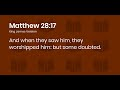

# The Resurrection of Jesus Christ: 'but some doubted' (2021-02-18 22:11:11+00:00)

## Description

I read from 'Jesus of Nazareth: An independent historian's account of his life and teaching'
by Professor Maurice Casey https://www.amazon.co.uk/Jesus-Nazareth-Maurice-Casey/dp/0567645177

## Full transcript with timestamps

[0:00:01](https://youtu.be/S67ZSfOk6bk?t=1) the story of the death and resurrection of Jesus 
and his appearance to the disciples is arguably    
[0:00:08](https://youtu.be/S67ZSfOk6bk?t=8) the central message of the new testament .
one of the accounts of this is found in the    
[0:00:15](https://youtu.be/S67ZSfOk6bk?t=15) gospel of matthew chapter 28 where it says , in the 
bible : now the 11 disciples went to Galilee , to the    
[0:00:23](https://youtu.be/S67ZSfOk6bk?t=23) mountain to which Jesus had directed them . when 
they saw him they worshipped him but some doubted .  
[0:00:30](https://youtu.be/S67ZSfOk6bk?t=30) and Jesus came and said to them : 'all authority 
in heaven and on earth has been given to me .  
[0:00:36](https://youtu.be/S67ZSfOk6bk?t=36) therefore go and make disciples of all nations ,
baptising them in the name of the father  
[0:00:41](https://youtu.be/S67ZSfOk6bk?t=41) and of the son and of the holy spirit , and teaching 
them to obey everything that i have commanded you .  
[0:00:48](https://youtu.be/S67ZSfOk6bk?t=48) and remember i am with you always to the end 
of the age' . now i want to share with you some    
[0:00:55](https://youtu.be/S67ZSfOk6bk?t=55) scholarly commentary on this passage by the author 
of this book "Jesus of Nazareth: An independent   
[0:01:03](https://youtu.be/S67ZSfOk6bk?t=63) historian's account of his life and teaching" by 
Maurice Casey , who's an interesting guy happens to    
[0:01:11](https://youtu.be/S67ZSfOk6bk?t=71) be not only a Professor of New Testament languages 
and literature at the University of Nottingham    
[0:01:16](https://youtu.be/S67ZSfOk6bk?t=76) in the United Kingdom , but he's one of a handful of scholars 
worldwide who are fluent in Aramaic (the language    
[0:01:23](https://youtu.be/S67ZSfOk6bk?t=83) that Jesus himself spoke) . and a lot of this book is 
taken up with his translation of some of these    
[0:01:32](https://youtu.be/S67ZSfOk6bk?t=92) Greek sayings in the new testament back into 
Aramaic , and he really discloses the fact that    
[0:01:38](https://youtu.be/S67ZSfOk6bk?t=98) a lot of these statements are quite different 
in Aramaic , they have a different meaning . but i'm  
[0:01:42](https://youtu.be/S67ZSfOk6bk?t=102) not going to go into that in this video .
i want to share with you his comments    
[0:01:48](https://youtu.be/S67ZSfOk6bk?t=108) on the passage i've just read in matthew 28. now 
this book is written by a scholar for students of    
[0:01:54](https://youtu.be/S67ZSfOk6bk?t=114) the new testament , it's not meant really for 
a lay audience . so i'll try and unpack some of    
[0:02:00](https://youtu.be/S67ZSfOk6bk?t=120) what he says as i go along but please bear that 
in mind . so he writes on page 279 : Matthew concludes    
[0:02:08](https://youtu.be/S67ZSfOk6bk?t=128) (the passage we've just read) with one major 
resurrection appearance to the 11 in Galilee . apart    
[0:02:16](https://youtu.be/S67ZSfOk6bk?t=136) from an appearance to ensure that the women told 
the disciples where to go earlier in Matthew 28 ,  
[0:02:22](https://youtu.be/S67ZSfOk6bk?t=142) an untrue story because it contradicts the gospel 
of Mark , our oldest narrative source Matthew 28    
[0:02:30](https://youtu.be/S67ZSfOk6bk?t=150) is the earliest written narrative of a 
resurrection appearance . moreover unlike most    
[0:02:35](https://youtu.be/S67ZSfOk6bk?t=155) of the narratives of resurrection appearances ,
this one may be thought to agree up to a point    
[0:02:42](https://youtu.be/S67ZSfOk6bk?t=162) with one of the appearances recorded in a very 
old tradition passed on by the apostle Paul .  
[0:02:49](https://youtu.be/S67ZSfOk6bk?t=169) this begins its record of appearances .
now he quotes 1 Corinthians 15. this    
[0:02:55](https://youtu.be/S67ZSfOk6bk?t=175) is a letter by Paul written in the early A.D 
50s . Matthew is usually thought to be written    
[0:03:02](https://youtu.be/S67ZSfOk6bk?t=182) A.D 85 1995 so quite a bit later . so he's 
about to read an account in one Corinthians which    
[0:03:10](https://youtu.be/S67ZSfOk6bk?t=190) is our earliest account in the new testament or 
earliest mention of the resurrection appearances .  
[0:03:16](https://youtu.be/S67ZSfOk6bk?t=196) this begins its record of 
appearances , he appeared to Cephas  
[0:03:21](https://youtu.be/S67ZSfOk6bk?t=201) then to the 12 . 1 corinthians 15 5. he appeared 
to 'Cephas' which is another word for Peter    
[0:03:28](https://youtu.be/S67ZSfOk6bk?t=208) and then to the 12 (the 12 disciples) . the question 
as to how much truth is to be found in this story  
[0:03:35](https://youtu.be/S67ZSfOk6bk?t=215) is accordingly important ? this story refers to 
the story of Matthew . Tom wright comments : the  
[0:03:42](https://youtu.be/S67ZSfOk6bk?t=222) strongest mark of authenticity in this paragraph 
is the jarring note "but some doubted" in verse 17.  
[0:03:50](https://youtu.be/S67ZSfOk6bk?t=230) you may not even notice when i read that passage 
out in Matthew's gospel , it actually says that    
[0:03:55](https://youtu.be/S67ZSfOk6bk?t=235) some of the disciples doubted even after seeing 
the resurrected Jesus . this strange comment   
[0:04:03](https://youtu.be/S67ZSfOk6bk?t=243) (says Tom Wright) would not have occurred to 
someone telling the story as a pure fiction .  
[0:04:08](https://youtu.be/S67ZSfOk6bk?t=248) end quote . so Tom Wright who's been quoted here is 
saying that the very fact that Matthew included    
[0:04:15](https://youtu.be/S67ZSfOk6bk?t=255) this statement that some of the disciples doubted 
is an indicator of authenticity of the passage .  
[0:04:22](https://youtu.be/S67ZSfOk6bk?t=262) Maurice Casey then continues :
this is true as far as it goes ,  
[0:04:27](https://youtu.be/S67ZSfOk6bk?t=267) it means that some of the 11 disciples were 
not convinced by an experience which others   
[0:04:33](https://youtu.be/S67ZSfOk6bk?t=273) interpreted as an experience of Jesus . it's very 
interesting isn't it ? so he's saying some thought    
[0:04:39](https://youtu.be/S67ZSfOk6bk?t=279) it was a resurrection appearance , some didn't .
so not all of the disciples were convinced    
[0:04:44](https://youtu.be/S67ZSfOk6bk?t=284) that Jesus rose from the dead you would see . this 
is another piece of evidence that  
[0:04:51](https://youtu.be/S67ZSfOk6bk?t=291) we must view the early list of appearances in 
1 corinthians 15 with a degree of Skepticism ,  
[0:05:00](https://youtu.be/S67ZSfOk6bk?t=300) because in Paul's account there is no mention of 
the disciples doubting what they had seen .  
[0:05:06](https://youtu.be/S67ZSfOk6bk?t=306) the sole appearance of which we have a    
[0:05:12](https://youtu.be/S67ZSfOk6bk?t=312) narrative account was not as straightforward 
as we might have believed from reading Paul's    
[0:05:18](https://youtu.be/S67ZSfOk6bk?t=318) list . Paul's list is straightforward we appear 
to so and so so and so and so and so . but in  
[0:05:23](https://youtu.be/S67ZSfOk6bk?t=323) Matthew's later version , it said that some of them 
doubted and that's missing from Paul's account .  
[0:05:30](https://youtu.be/S67ZSfOk6bk?t=330) secondly , this raises the question as to how 
many of the 11 disciples obeyed the ringing    
[0:05:36](https://youtu.be/S67ZSfOk6bk?t=336) commands of matthew 28 19 . the most important is :
go therefore and make disciples of all nations . you    
[0:05:44](https://youtu.be/S67ZSfOk6bk?t=344) might remember Jesus said : go therefore into all 
the nations and making disciples and baptizing in    
[0:05:50](https://youtu.be/S67ZSfOk6bk?t=350) the name of the father and the son and the holy 
spirit . did the 11 disciples do this ? he says : no ,  
[0:05:59](https://youtu.be/S67ZSfOk6bk?t=359) only Peter is even known to have traveled in the 
Diaspora (that's outside of Israel into the jewish    
[0:06:07](https://youtu.be/S67ZSfOk6bk?t=367) communities around the Greco-Roman world ) and when 
Paul met the inner group of three : James , Cephas    
[0:06:14](https://youtu.be/S67ZSfOk6bk?t=374) and John in Jerusalem , they agreed that : we to the 
nations but they to the circumcision . that means    
[0:06:24](https://youtu.be/S67ZSfOk6bk?t=384) that even the inner group of three did not go and 
make disciples of all the nations , they stayed in    
[0:06:29](https://youtu.be/S67ZSfOk6bk?t=389) Jerusalem . moreover the rest of the eleven are 
unheard of thereafter . interesting . accordingly    
[0:06:38](https://youtu.be/S67ZSfOk6bk?t=398) whatever happened when Jesus appeared to the 
eleven in Galilee , it was not a clear speech to all    
[0:06:44](https://youtu.be/S67ZSfOk6bk?t=404) of them at once in which Jesus commanded them to 
carry out the gentile mission . Matthew has written    
[0:06:51](https://youtu.be/S67ZSfOk6bk?t=411) this into Jesus speech because it was of central 
importance to the churches when he wrote . now some  
[0:06:58](https://youtu.be/S67ZSfOk6bk?t=418) christians may complain or some people hearing 
this may think : hang on , don't we have letters  
[0:07:02](https://youtu.be/S67ZSfOk6bk?t=422) by Peter for example , one and two Peter . well , not 
really . two Peter (for example) is probably the    
[0:07:10](https://youtu.be/S67ZSfOk6bk?t=430) clearest example in the whole of the new testament 
of what's called "a pseudopigrapher" which is a    
[0:07:16](https://youtu.be/S67ZSfOk6bk?t=436) scholarly way of saying 'a forgery' pseudo means 
false as in you sued , you fake . epigrapher comes    
[0:07:24](https://youtu.be/S67ZSfOk6bk?t=444) from the word 'writing' means fake writing . virtually 
all new testament scholars in the world (and you    
[0:07:30](https://youtu.be/S67ZSfOk6bk?t=450) can look this up for yourself) have concluded that 
2 peter is not by Peter , there is a forgery written    
[0:07:37](https://youtu.be/S67ZSfOk6bk?t=457) sometime in the 2nd century , we don't actually 
have anything by any of Jesus original disciples .  
[0:07:43](https://youtu.be/S67ZSfOk6bk?t=463) Paul of course we do have letters by him but he's 
not a person who ever met Jesus in the flesh . so  
[0:07:49](https://youtu.be/S67ZSfOk6bk?t=469) continuing : what then of baptizing 
them in the name of the father and of the son and    
[0:07:56](https://youtu.be/S67ZSfOk6bk?t=476) the holy spirit in Matthew 28 19. is this what 
we find the eleven doing in the book of acts ?  
[0:08:03](https://youtu.be/S67ZSfOk6bk?t=483) book of acts of course is the earliest 
history of the early church we have .  
[0:08:07](https://youtu.be/S67ZSfOk6bk?t=487) No, (says Maurice Casey) distinctive christian 
baptism is first mentioned in acts 2 38 where    
[0:08:15](https://youtu.be/S67ZSfOk6bk?t=495) Peter urges people to be baptized in the name of 
Jesus Christ . and people were baptized accordingly .  
[0:08:22](https://youtu.be/S67ZSfOk6bk?t=502) it turns out that none of them in the whole of 
acts , no one is baptized in the name of the father    
[0:08:29](https://youtu.be/S67ZSfOk6bk?t=509) and of the son and the holy spirit . Peter is the 
only one in the level to stay in the story    
[0:08:35](https://youtu.be/S67ZSfOk6bk?t=515) for any length of time as the gospel is spread to 
the gentiles and after a while he disappears too .  
[0:08:43](https://youtu.be/S67ZSfOk6bk?t=523) so this command allegedly made by Jesus 
in Matthew 28 is not evidenced in the  
[0:08:49](https://youtu.be/S67ZSfOk6bk?t=529) activity of the disciples at all , they didn't 
do it (which is peculiar to put it mildly) .  
[0:08:55](https://youtu.be/S67ZSfOk6bk?t=535) we must conclude that the second major instruction 
in Matthew's account of this appearance    
[0:09:00](https://youtu.be/S67ZSfOk6bk?t=540) was not clearly delivered by the risen Jesus .
and i would say that's putting it mildly . by now   
[0:09:07](https://youtu.be/S67ZSfOk6bk?t=547) the nature of Matthew's account is beginning 
to become a little clearer . at first sight , it  
[0:09:12](https://youtu.be/S67ZSfOk6bk?t=552) appears to be the same appearance as was known 
to Paul's earlier tradition in 1 Corinthians .  
[0:09:19](https://youtu.be/S67ZSfOk6bk?t=559) on close examination however , the most important 
quality of these traditions is that they have    
[0:09:24](https://youtu.be/S67ZSfOk6bk?t=564) both been rewritten . we have seen this with the 
poor line tradition already (he discusses this    
[0:09:30](https://youtu.be/S67ZSfOk6bk?t=570) earlier in the chapter) nevertheless or nonetheless 
the fact that its list of appearances begins with    
[0:09:37](https://youtu.be/S67ZSfOk6bk?t=577) an appearance to Cephas is plausible . next it says 
that Jesus appeared to the twelve , it does not say :  
[0:09:45](https://youtu.be/S67ZSfOk6bk?t=585) at once as it does in the next appearance of over 
500 brethren at once (which is in 1 corinthians 15.) .  
[0:09:54](https://youtu.be/S67ZSfOk6bk?t=594) Matthew however has clearly interpreted this or 
a similar tradition obvious interpreted this as a    
[0:10:01](https://youtu.be/S67ZSfOk6bk?t=601) single simultaneous appearance to the eleven 
disciples . those left of the twelve (obviously   
[0:10:08](https://youtu.be/S67ZSfOk6bk?t=608) Jesus Iscariot had left at that point) . moreover 
unlike the earlier Pauline tradition , Matthew    
[0:10:14](https://youtu.be/S67ZSfOk6bk?t=614) has placed this supposedly single appearance 
in galilee . the most important point is however :  
[0:10:22](https://youtu.be/S67ZSfOk6bk?t=622) the comment that "when Jesus appeared some doubted"
that's Matthew 28 17 again . this is a point which    
[0:10:30](https://youtu.be/S67ZSfOk6bk?t=630) we would never have guessed if we had only to 
rely on the early tradition transmitted by Paul  
[0:10:37](https://youtu.be/S67ZSfOk6bk?t=637) and it must be true for two reasons (he says) : one , is 
that most of the eleven disciples do not turn up    
[0:10:45](https://youtu.be/S67ZSfOk6bk?t=645) in the early church at all . so what happened to 
Barnabas ? what happened to Andrew ?  
[0:10:50](https://youtu.be/S67ZSfOk6bk?t=650) i mean you think of the list of the thaddeus ,
what happened to these people ? we don't know .  
[0:10:55](https://youtu.be/S67ZSfOk6bk?t=655) that is why Matthew could not leave 
this point out . the second reason follows    
[0:11:00](https://youtu.be/S67ZSfOk6bk?t=660) ineluctably , this is not something which the 
early church would make up out of nothing ,  
[0:11:06](https://youtu.be/S67ZSfOk6bk?t=666) it must reflect the lack of faith in the 
resurrection by at least some of the 11 disciples .  
[0:11:15](https://youtu.be/S67ZSfOk6bk?t=675) what is even more devastating is that 
this is the point at which the whole    
[0:11:19](https://youtu.be/S67ZSfOk6bk?t=679) tradition of appearances  
of the risen Jesus begins to fall apart .  
[0:11:26](https://youtu.be/S67ZSfOk6bk?t=686) why do we not have accurate narrative accounts 
of genuine appearances of the risen Jesus ?  
[0:11:33](https://youtu.be/S67ZSfOk6bk?t=693) why are we not told what happened when Jesus 
appeared to Cephas over 500 brethren and then    
[0:11:39](https://youtu.be/S67ZSfOk6bk?t=699) James and all the apostles as narrated in 
1 corinthians 15. Matthew has supplied us    
[0:11:46](https://youtu.be/S67ZSfOk6bk?t=706) with two points which enable us to understand 
this . first again ,  some doubted matthew 28 17 .  
[0:11:54](https://youtu.be/S67ZSfOk6bk?t=714) too much concentration on that would not make 
for the successful preaching of good news .  
[0:12:01](https://youtu.be/S67ZSfOk6bk?t=721) Matthew can have transmitted it only if it was 
desperately unforgettable . Secondly , the eleven did    
[0:12:08](https://youtu.be/S67ZSfOk6bk?t=728) not obey two major commands which Matthew has the 
risen Jesus give them in his rather short speech .  
[0:12:17](https://youtu.be/S67ZSfOk6bk?t=737) the only way of understanding this is that Matthew 
has rewritten the tradition of this appearance    
[0:12:21](https://youtu.be/S67ZSfOk6bk?t=741) which he received or has invented Jesus speech 
because the tradition did not tell him that Jesus   
[0:12:28](https://youtu.be/S67ZSfOk6bk?t=748) made a speech and perhaps did not tell him that 
he appeared to the eleven all at once , we must take    
[0:12:34](https://youtu.be/S67ZSfOk6bk?t=754) these two points together : first , some of the eleven 
did not believe in Jesus resurrection and did not    
[0:12:41](https://youtu.be/S67ZSfOk6bk?t=761) play any significant role in the early church as 
Jesus was supposed to have commanded . this is what  
[0:12:48](https://youtu.be/S67ZSfOk6bk?t=768) made some doubted unforgettable . Secondly , we do not 
have accurate accounts of genuine appearances   
[0:12:56](https://youtu.be/S67ZSfOk6bk?t=776) of the risen Jesus because these were not 
helpful enough for the needs of the early churches .  
[0:13:04](https://youtu.be/S67ZSfOk6bk?t=784) that is a strong argument against the genuineness 
of the resurrection narratives in the gospels . and  
[0:13:12](https://youtu.be/S67ZSfOk6bk?t=792) i'll end that there . i think 
professor Maurice Casey raises some very important    
[0:13:19](https://youtu.be/S67ZSfOk6bk?t=799) points here that most of the disciples who are 
listed in our earlier sources we know nothing    
[0:13:25](https://youtu.be/S67ZSfOk6bk?t=805) about what happened to them after Jesus was raised 
to heaven , they simply disappear from the pages of    
[0:13:31](https://youtu.be/S67ZSfOk6bk?t=811) history . we know from Matthew that some maybe 
many , what half of them ? we don't know what    
[0:13:37](https://youtu.be/S67ZSfOk6bk?t=817) some means , it could be half the disciples simply 
didn't believe that Jesus rose from the dead , even    
[0:13:44](https://youtu.be/S67ZSfOk6bk?t=824) after they were present at what other disciples 
thought was appearances of the risen Jesus .  
[0:13:52](https://youtu.be/S67ZSfOk6bk?t=832) so the disciples weren't agreed then , they weren't 
unanimous at all that Jesus rose from the dead    
[0:13:58](https://youtu.be/S67ZSfOk6bk?t=838) and appeared to people . this is a belief of some of 
them it seems , but primarily it's the belief of the    
[0:14:05](https://youtu.be/S67ZSfOk6bk?t=845) apostle Paul who i personally have no doubt had 
a vision , he even caused a division in acts on the    
[0:14:11](https://youtu.be/S67ZSfOk6bk?t=851) road to Damascus of a light which he understood 
to be the risen Jesus himself . and paul is the    
[0:14:18](https://youtu.be/S67ZSfOk6bk?t=858) main dynamo , the main power behind the gospel to 
the gentiles that converted so many people .  
[0:14:26](https://youtu.be/S67ZSfOk6bk?t=866) but he never knew Jesus , he never met him . Jesus 
ascended into heaven at least several years    
[0:14:33](https://youtu.be/S67ZSfOk6bk?t=873) before Paul even became a christian . so i think 
this is very interesting , i know it's quite heavy    
[0:14:39](https://youtu.be/S67ZSfOk6bk?t=879) but to give you a flavor of how scholars 
interact with the text and the piercing    
[0:14:44](https://youtu.be/S67ZSfOk6bk?t=884) intellectual insight i think that they 
bring to the subject . until next time  
