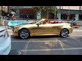

# The World and its Wealth #shorts (2021-06-12 20:13:58+00:00)

## Description

Hadith in Ahmad and Bayhaqi

## Full transcript with timestamps

[0:00:01](https://youtu.be/h7r0tM6_8gI?t=1) aisha related that the messenger of god  
[0:00:03](https://youtu.be/h7r0tM6_8gI?t=3) upon whom be peace said the world is the  
[0:00:07](https://youtu.be/h7r0tM6_8gI?t=7) home  
[0:00:07](https://youtu.be/h7r0tM6_8gI?t=7) of the one who has no real home  
[0:00:10](https://youtu.be/h7r0tM6_8gI?t=10) and it is the wealth of the one who has  
[0:00:13](https://youtu.be/h7r0tM6_8gI?t=13) no  
[0:00:13](https://youtu.be/h7r0tM6_8gI?t=13) real wealth and for its sake those who  
[0:00:17](https://youtu.be/h7r0tM6_8gI?t=17) lack  
[0:00:17](https://youtu.be/h7r0tM6_8gI?t=17) real understanding devote all of their  
[0:00:21](https://youtu.be/h7r0tM6_8gI?t=21) efforts  
