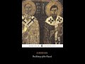

# The beliefs of the earliest Christians about Jesus (2021-01-25)

## Description

I read from 'The History of the Church' by Eusebius 
https://www.penguinrandomhouse.com/books/260984/the-history-of-the-church-by-eusebius/

## Summary of [The beliefs of the earliest Christians about Jesus](https://www.youtube.com/watch?v=K51AcZBWS68)

*This summary is AI generated - there may be inaccuracies. *

### [00:00:00](https://www.youtube.com/watch?v=K51AcZBWS68&t=0) - [00:05:00](https://www.youtube.com/watch?v=K51AcZBWS68&t=300)

The earliest Christians believed that Jesus was a great prophet of God and a messiah, and that he was born of the virgin Mary without involvement of Joseph. This belief was later rejected by mainstream Christianity.

**[00:00:00](https://www.youtube.com/watch?v=K51AcZBWS68&t=0)** The Ebionites were a Jewish Christian sect that believed in Jesus as a prophet but did not believe in the virgin birth. This sect was eventually rejected by mainstream Christianity.
* **[00:05:00](https://www.youtube.com/watch?v=K51AcZBWS68&t=300)** The beliefs of the earliest Christians about Jesus were that he was a great prophet of God and a messiah, and that he was born of the virgin Mary without involvement of Joseph.

## Full transcript with timestamps

[0:00:00](https://youtu.be/K51AcZBWS68?t=0) i just wanted to make a brief video in response 
to some claims by prominent christian apologists    
[0:00:07](https://youtu.be/K51AcZBWS68?t=7) and polemicists online that the early jewish 
christian sects the ebionites as they're called uh    
[0:00:16](https://youtu.be/K51AcZBWS68?t=16) did not believe in the virgin birth 
now why does this matter because    
[0:00:20](https://youtu.be/K51AcZBWS68?t=20) the early the earliest christians were jewish 
christians and they had beliefs about jesus    
[0:00:26](https://youtu.be/K51AcZBWS68?t=26) and about the jewish law and so on which are 
quite different from later christian orthodoxy    
[0:00:32](https://youtu.be/K51AcZBWS68?t=32) certainly different from paul's ideas which became 
dominant in the second century onwards up to today    
[0:00:39](https://youtu.be/K51AcZBWS68?t=39) and the accusation is that the ebionites as 
they're called these jewish christians did not    
[0:00:44](https://youtu.be/K51AcZBWS68?t=44) believe in the virgin birth so their faith was 
suspect they were heretics anyway so why are we    
[0:00:51](https://youtu.be/K51AcZBWS68?t=51) putting so much store by what they believe they 
didn't quite get their beliefs right now this    
[0:00:56](https://youtu.be/K51AcZBWS68?t=56) is a half truth at best and i want to show why 
uh this is a half-truth uh by referring to the    
[0:01:03](https://youtu.be/K51AcZBWS68?t=63) uh well-known book by eusebius the history of the 
church who is eusebius on the back cover it says    
[0:01:11](https://youtu.be/K51AcZBWS68?t=71) eusebius's account is the only surviving 
historical account of the church during    
[0:01:16](https://youtu.be/K51AcZBWS68?t=76) its crucial first 300 years bishop eusebius 
who was born in ad260 so it's really early    
[0:01:24](https://youtu.be/K51AcZBWS68?t=84) a learned scholar who lived most of his life 
in caesarea in palestine broke new ground in    
[0:01:30](https://youtu.be/K51AcZBWS68?t=90) writing the history and provided a model for all 
later ecclesiastical historians church historians    
[0:01:37](https://youtu.be/K51AcZBWS68?t=97) so uh this book by the way is edited by uh andrew 
luth who's a professor of patristic studies    
[0:01:44](https://youtu.be/K51AcZBWS68?t=104) at the university of durham and at the very back 
he has a glossary of the who's who of eusebius and    
[0:01:51](https://youtu.be/K51AcZBWS68?t=111) he helpfully tells us about the ebionites the word 
is derived from a hebrew word meaning the poor    
[0:01:58](https://youtu.be/K51AcZBWS68?t=118) this may indicate that the original ebionites were 
materially poor or that they thought of themselves    
[0:02:05](https://youtu.be/K51AcZBWS68?t=125) as the poor ones who depend utterly on the grace 
of god and then he goes on they seem to have been    
[0:02:12](https://youtu.be/K51AcZBWS68?t=132) jewish christians who respected christ but 
could not conceive of his relationship to    
[0:02:18](https://youtu.be/K51AcZBWS68?t=138) god as anything other than that of a man 
inspired by god like one of the prophets    
[0:02:24](https://youtu.be/K51AcZBWS68?t=144) eusebius is scornful of jewish christianity this 
is the original faith of the disciples by the way    
[0:02:31](https://youtu.be/K51AcZBWS68?t=151) and knows little about it anyway obviously it 
seems to have been much more important in the    
[0:02:36](https://youtu.be/K51AcZBWS68?t=156) early centuries of christianity than appears 
from the history of the church end quote    
[0:02:42](https://youtu.be/K51AcZBWS68?t=162) now we know there's some for much much scholarship 
in the last 40 50 years that the original    
[0:02:47](https://youtu.be/K51AcZBWS68?t=167) disciples and followers of those 
people like james the brother of jesus    
[0:02:52](https://youtu.be/K51AcZBWS68?t=172) were jewish christians who believe very different 
things than paul believed in the emerging    
[0:02:56](https://youtu.be/K51AcZBWS68?t=176) great church in the second century the 
catholic church and evangelicals today    
[0:03:01](https://youtu.be/K51AcZBWS68?t=181) so the point is what why is this matter what 
they believed about the virgin birth because    
[0:03:06](https://youtu.be/K51AcZBWS68?t=186) if it can be shown they didn't believe in the 
virgin birth that discredits them in the eyes of    
[0:03:11](https://youtu.be/K51AcZBWS68?t=191) many people look muslims believe he he was born of 
a virgin the gospels say he was born of a virgin    
[0:03:17](https://youtu.be/K51AcZBWS68?t=197) these people were just heretics why should we take 
what they say seriously so this is i think the    
[0:03:23](https://youtu.be/K51AcZBWS68?t=203) the agenda behind some uh quite well very well 
known christian apologists who i will not name    
[0:03:28](https://youtu.be/K51AcZBWS68?t=208) because i don't want to get into a tit for tat ad 
hominem with people so what does eusebius tell us    
[0:03:36](https://youtu.be/K51AcZBWS68?t=216) well he tells us something very interesting 
uh and on page 90 of this book this is the    
[0:03:43](https://youtu.be/K51AcZBWS68?t=223) uh the third chapter of eusebius he 
writes this there are two ebionite sects    
[0:03:51](https://youtu.be/K51AcZBWS68?t=231) the first one um says they regard him as him jesus 
as plain and ordinary a man esteemed as righteous    
[0:04:01](https://youtu.be/K51AcZBWS68?t=241) through growth of character and nothing more the 
child of a normal union between a man and mary    
[0:04:08](https://youtu.be/K51AcZBWS68?t=248) and they held that that they must observe every 
detail of the law these are jews basically who    
[0:04:15](https://youtu.be/K51AcZBWS68?t=255) believe in jesus as the messiah as the prophet 
but they believe that he was not born of a virgin    
[0:04:21](https://youtu.be/K51AcZBWS68?t=261) and then you see this goes on a second group went 
by the same name ebia ebionites but escapes the    
[0:04:28](https://youtu.be/K51AcZBWS68?t=268) outrageous absurdity of the first they did 
not deny that the lord was born of a virgin    
[0:04:35](https://youtu.be/K51AcZBWS68?t=275) and the holy spirit but nevertheless shared 
their refusal to acknowledge his pre-existence    
[0:04:40](https://youtu.be/K51AcZBWS68?t=280) as god the word and wisdom thus the impious 
doctrine of the others was their undoing also    
[0:04:47](https://youtu.be/K51AcZBWS68?t=287) especially as they placed equal emphasis 
on the outward observance of the law    
[0:04:52](https://youtu.be/K51AcZBWS68?t=292) they held that the epistles of the apostle 
that means paul of course ought to be rejected    
[0:04:57](https://youtu.be/K51AcZBWS68?t=297) all together calling him a renegade from the 
law and using only the gospel of the hebrews    
[0:05:05](https://youtu.be/K51AcZBWS68?t=305) they treated the the rest with scant respect like 
the others they observe the sabbath and the whole    
[0:05:12](https://youtu.be/K51AcZBWS68?t=312) jewish system so he is very scathing of these 
people but of course they represent the original    
[0:05:18](https://youtu.be/K51AcZBWS68?t=318) uh faith of the disciples who are torah 
observant jews we can see this in the    
[0:05:22](https://youtu.be/K51AcZBWS68?t=322) book of acts it's it states they were and we 
can see uh also that this second group of the    
[0:05:28](https://youtu.be/K51AcZBWS68?t=328) ebonites believed in the virgin birth so there 
seemed to be split between them and i'm not sure    
[0:05:34](https://youtu.be/K51AcZBWS68?t=334) how they split and did they co-mingle or were 
they separate denominations but clearly there    
[0:05:40](https://youtu.be/K51AcZBWS68?t=340) was a group of ebionites who did believe in the 
virgin birth who were jewish christians and some    
[0:05:46](https://youtu.be/K51AcZBWS68?t=346) who didn't believe in the virgin birth so this 
story that the ebio knights didn't believe in the    
[0:05:51](https://youtu.be/K51AcZBWS68?t=351) virgin mary in the virgin birth is wrong it's a 
half-truth uh some were quite orthodox by islamic    
[0:05:58](https://youtu.be/K51AcZBWS68?t=358) standards shall we say that they believed that 
jesus was born of the virgin mary without any    
[0:06:04](https://youtu.be/K51AcZBWS68?t=364) involvement of joseph but also they observe the 
law uh observe they view jesus as just a man a    
[0:06:11](https://youtu.be/K51AcZBWS68?t=371) great prophet of god a messiah which of course is 
exactly what the quran teaches as well so that's a    
[0:06:19](https://youtu.be/K51AcZBWS68?t=379) an amazing coincidence you may say so um i just 
wanted to uh just touch on this point because it's    
[0:06:26](https://youtu.be/K51AcZBWS68?t=386) used against uh to discredit the jewish christians 
this whole thing of the virgin birth and um it's    
[0:06:32](https://youtu.be/K51AcZBWS68?t=392) a distortion of the facts and i just want to get 
that on record for what it's worth till next time  
