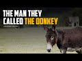

# The man they called the Donkey #shorts (2022-11-15 21:17:31+00:00)

## Description

You Can Support My Work on Patreon:
https://www.patreon.com/Bloggingtheology

My Paypal Link: 
https://www.paypal.com/paypalme/bloggingtheology?locale.x=en_GB

## Summary of [The man they called the Donkey #shorts](https://www.youtube.com/watch?v=I_o2SAGnlOs)

*This is an AI generated summary. There may be inaccuracies. *

### [00:00:00](https://www.youtube.com/watch?v=I_o2SAGnlOs&t=0) - [00:00:00](https://www.youtube.com/watch?v=I_o2SAGnlOs&t=0)

 is about a man named Abdullah who was known as the Donkey. Abdullah was used to make the prophet laugh, but the prophet had to order him whipped several times for drunkenness. One day, Abdullah was brought before the prophet drunk and he ordered him whipped yet again. Someone asked the prophet why he did that, and the prophet replied that Abdullah loved God and His messenger.

**[00:00:00](https://www.youtube.com/watch?v=I_o2SAGnlOs&t=0)**  follows a man named Abdullah, who was known as the Donkey. Abdullah was used to make the prophet laugh, but the prophet had to order him whipped several times for drunkenness. One day, Abdullah was brought before the prophet drunk and he ordered him whipped yet again. Someone asked the prophet why he did that, and the prophet replied that Abdullah loved God and His messenger.

## Full transcript with timestamps

[0:00:03](https://youtu.be/I_o2SAGnlOs?t=3) related that there was a man named  
[0:00:05](https://youtu.be/I_o2SAGnlOs?t=5) Abdullah whom they used to call the  
[0:00:08](https://youtu.be/I_o2SAGnlOs?t=8) Donkey  
[0:00:09](https://youtu.be/I_o2SAGnlOs?t=9) he used to make the prophet laugh a lot  
[0:00:12](https://youtu.be/I_o2SAGnlOs?t=12) but the prophet had to order him whipped  
[0:00:15](https://youtu.be/I_o2SAGnlOs?t=15) several times for drunkenness  
[0:00:18](https://youtu.be/I_o2SAGnlOs?t=18) one day he was brought before the  
[0:00:21](https://youtu.be/I_o2SAGnlOs?t=21) prophet drunk and he ordered him whipped  
[0:00:24](https://youtu.be/I_o2SAGnlOs?t=24) yet again which prompted someone to say  
[0:00:27](https://youtu.be/I_o2SAGnlOs?t=27) may God curse him how frequently he  
[0:00:31](https://youtu.be/I_o2SAGnlOs?t=31) commits this offense  
[0:00:33](https://youtu.be/I_o2SAGnlOs?t=33) to which the prophet replied do not  
[0:00:36](https://youtu.be/I_o2SAGnlOs?t=36) curse him for by God do you not know  
[0:00:40](https://youtu.be/I_o2SAGnlOs?t=40) that he loves God and His messenger  
[0:00:44](https://youtu.be/I_o2SAGnlOs?t=44) Hadith from bukhari  
