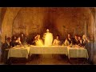

# The most powerful objection to my views on the Gospel of Jesus considered (2020-12-31)

## Description

I read from 'Unity and Diversity: An Inquiry Into the Character of Earliest Christianity' by Professor James D.G. Dunn.

The institution of the Lord’s Supper in 1 Corinthians 11 (NRSV):

'For I received *from the Lord* what I also handed on to you, that the Lord Jesus on the night when he was betrayed took a loaf of bread, 24 and when he had given thanks, he broke it and said, “This is my body that is for you. Do this in remembrance of me.” 25 In the same way he took the cup also, after supper, saying, “This cup is the new covenant in my blood. Do this, as often as you drink it, in remembrance of me.” 26 For as often as you eat this bread and drink the cup, you proclaim the Lord’s death until he comes.'

## Summary of [The most powerful objection to my views on the Gospel of Jesus considered](https://www.youtube.com/watch?v=lNeVDnS7eoQ)

*This summary is AI generated - there may be inaccuracies. *

### [00:00:00](https://www.youtube.com/watch?v=lNeVDnS7eoQ&t=0) - [00:10:00](https://www.youtube.com/watch?v=lNeVDnS7eoQ&t=600)

of the YouTube video argues that the Christian belief in a sacrificial death on the cross is not based on historical evidence, but instead is based on a mystical revelation from an external power. He goes on to say that this belief has created a different religion from the religion of Jesus Christ in many ways.

**[00:00:00](https://www.youtube.com/watch?v=lNeVDnS7eoQ&t=0)** The most powerful objection to the views that the speaker holds on the gospel of Jesus is that it is not the Christian gospel. This objection is based on the passage in 1 Corinthians 11:23-27, in which Paul says that the Lord Jesus took a loaf of bread and when he had given thanks, he broke it and said this is my body, which is for you. He also took the cup after supper and said this is the cup of the new covenant in my blood, which is for you. Paul also says that this is to be done as often as you drink it in remembrance of me. This means that the Lord's supper is an instituted event that is based on the sacrifice of Jesus on the cross.
* **[00:05:00](https://www.youtube.com/watch?v=lNeVDnS7eoQ&t=300)** argues that Paul created the tradition of the Last Supper, which he received from a mystical encounter with the exalted Jesus. This tradition was not passed down through the disciples, but from Paul himself. Furthermore, the author argues that 1 Corinthians 11:2-13 is evidence that these practices served to commend the new Christian groups to the societies in which they lived.
* **[00:10:00](https://www.youtube.com/watch?v=lNeVDnS7eoQ&t=600)** of the YouTube video argues that the Christian belief in a sacrificial death on the cross is not based on historical evidence, but instead is based on a mystical revelation from an external power. He goes on to say that this belief has created a different religion from the religion of Jesus Christ in many ways.

<h2>Full transcript with timestamps: CLICK TO EXPAND</h2>

[0:00:01](https://youtu.be/lNeVDnS7eoQ?t=1) hello and in this uh episode  
[0:00:03](https://youtu.be/lNeVDnS7eoQ?t=3) on new year's eve i want to talk about  
[0:00:05](https://youtu.be/lNeVDnS7eoQ?t=5) what may be the most powerful  
[0:00:07](https://youtu.be/lNeVDnS7eoQ?t=7) single objection to the views that i  
[0:00:10](https://youtu.be/lNeVDnS7eoQ?t=10) commonly articulate in my conversations  
[0:00:13](https://youtu.be/lNeVDnS7eoQ?t=13) and debates with christians and in my  
[0:00:15](https://youtu.be/lNeVDnS7eoQ?t=15) own understanding of  
[0:00:16](https://youtu.be/lNeVDnS7eoQ?t=16) what jesus ministry was about i think  
[0:00:19](https://youtu.be/lNeVDnS7eoQ?t=19) that  
[0:00:20](https://youtu.be/lNeVDnS7eoQ?t=20) the message that jesus preached wasn't  
[0:00:22](https://youtu.be/lNeVDnS7eoQ?t=22) uh the christian gospel  
[0:00:24](https://youtu.be/lNeVDnS7eoQ?t=24) but it was quite different it was based  
[0:00:26](https://youtu.be/lNeVDnS7eoQ?t=26) around the uh devotion to the one  
[0:00:28](https://youtu.be/lNeVDnS7eoQ?t=28) the one god with an emphasis on mercy  
[0:00:31](https://youtu.be/lNeVDnS7eoQ?t=31) and love and forgiveness against  
[0:00:32](https://youtu.be/lNeVDnS7eoQ?t=32) hypocrisy  
[0:00:34](https://youtu.be/lNeVDnS7eoQ?t=34) uh an emphasis on interior sincerity  
[0:00:37](https://youtu.be/lNeVDnS7eoQ?t=37) uh rather mere externality and uh  
[0:00:40](https://youtu.be/lNeVDnS7eoQ?t=40) there is no mention in in my  
[0:00:42](https://youtu.be/lNeVDnS7eoQ?t=42) understanding of jesus death  
[0:00:45](https://youtu.be/lNeVDnS7eoQ?t=45) being required for salvation to enter  
[0:00:48](https://youtu.be/lNeVDnS7eoQ?t=48) into the kingdom  
[0:00:48](https://youtu.be/lNeVDnS7eoQ?t=48) for forgiveness of sins because people  
[0:00:51](https://youtu.be/lNeVDnS7eoQ?t=51) were entering into the kingdom  
[0:00:52](https://youtu.be/lNeVDnS7eoQ?t=52) of god um the prostitutes and the tax  
[0:00:55](https://youtu.be/lNeVDnS7eoQ?t=55) collectors and the poor and so on as  
[0:00:57](https://youtu.be/lNeVDnS7eoQ?t=57) luke mentions long before uh this  
[0:01:00](https://youtu.be/lNeVDnS7eoQ?t=60) sacrificial death on the cross but uh  
[0:01:03](https://youtu.be/lNeVDnS7eoQ?t=63) the objection is made  
[0:01:04](https://youtu.be/lNeVDnS7eoQ?t=64) that if one looks at the gospels  
[0:01:06](https://youtu.be/lNeVDnS7eoQ?t=66) particularly the end of jesus's life  
[0:01:09](https://youtu.be/lNeVDnS7eoQ?t=69) on the night that he was betrayed we  
[0:01:12](https://youtu.be/lNeVDnS7eoQ?t=72) come across something called the last  
[0:01:14](https://youtu.be/lNeVDnS7eoQ?t=74) supper and this is  
[0:01:16](https://youtu.be/lNeVDnS7eoQ?t=76) commemorated in today's churches it's  
[0:01:18](https://youtu.be/lNeVDnS7eoQ?t=78) called the mass or the eucharist  
[0:01:21](https://youtu.be/lNeVDnS7eoQ?t=81) or holy communion or the last supper  
[0:01:24](https://youtu.be/lNeVDnS7eoQ?t=84) basically looking back uh to this event  
[0:01:28](https://youtu.be/lNeVDnS7eoQ?t=88) that uh the bible records apparently  
[0:01:32](https://youtu.be/lNeVDnS7eoQ?t=92) and our earliest recollection of that  
[0:01:34](https://youtu.be/lNeVDnS7eoQ?t=94) the earliest uh narration of that is in  
[0:01:36](https://youtu.be/lNeVDnS7eoQ?t=96) paul's letters  
[0:01:37](https://youtu.be/lNeVDnS7eoQ?t=97) and i just wanted to read to you what it  
[0:01:40](https://youtu.be/lNeVDnS7eoQ?t=100) says  
[0:01:41](https://youtu.be/lNeVDnS7eoQ?t=101) in 1 corinthians chapter 11  
[0:01:44](https://youtu.be/lNeVDnS7eoQ?t=104) verse 23 onwards it says for i received  
[0:01:48](https://youtu.be/lNeVDnS7eoQ?t=108) from the lord but i also handed on to  
[0:01:50](https://youtu.be/lNeVDnS7eoQ?t=110) you  
[0:01:50](https://youtu.be/lNeVDnS7eoQ?t=110) that the lord jesus on the night that he  
[0:01:53](https://youtu.be/lNeVDnS7eoQ?t=113) was betrayed  
[0:01:54](https://youtu.be/lNeVDnS7eoQ?t=114) took a loaf of bread and when he had  
[0:01:56](https://youtu.be/lNeVDnS7eoQ?t=116) given thanks  
[0:01:57](https://youtu.be/lNeVDnS7eoQ?t=117) he broke it and said this is my body  
[0:02:00](https://youtu.be/lNeVDnS7eoQ?t=120) that is for you  
[0:02:01](https://youtu.be/lNeVDnS7eoQ?t=121) do this in remembrance of me  
[0:02:05](https://youtu.be/lNeVDnS7eoQ?t=125) in the same way he took the cup also  
[0:02:07](https://youtu.be/lNeVDnS7eoQ?t=127) after supper saying  
[0:02:09](https://youtu.be/lNeVDnS7eoQ?t=129) this is the cup of the new covenant in  
[0:02:11](https://youtu.be/lNeVDnS7eoQ?t=131) my blood  
[0:02:13](https://youtu.be/lNeVDnS7eoQ?t=133) do this as often as you drink it in  
[0:02:15](https://youtu.be/lNeVDnS7eoQ?t=135) remembrance  
[0:02:16](https://youtu.be/lNeVDnS7eoQ?t=136) of me for as often as you eat  
[0:02:20](https://youtu.be/lNeVDnS7eoQ?t=140) this bread and drink this cup you  
[0:02:22](https://youtu.be/lNeVDnS7eoQ?t=142) proclaim  
[0:02:23](https://youtu.be/lNeVDnS7eoQ?t=143) the lord's death until he comes  
[0:02:27](https://youtu.be/lNeVDnS7eoQ?t=147) so this is commonly understood to be the  
[0:02:29](https://youtu.be/lNeVDnS7eoQ?t=149) institution  
[0:02:30](https://youtu.be/lNeVDnS7eoQ?t=150) of the lord's supper and clearly  
[0:02:32](https://youtu.be/lNeVDnS7eoQ?t=152) portraying jesus death  
[0:02:34](https://youtu.be/lNeVDnS7eoQ?t=154) as sacrificial as inaugurating a new  
[0:02:37](https://youtu.be/lNeVDnS7eoQ?t=157) covenant  
[0:02:39](https://youtu.be/lNeVDnS7eoQ?t=159) and as being absolutely key for  
[0:02:41](https://youtu.be/lNeVDnS7eoQ?t=161) salvation and the forgiveness of sins  
[0:02:43](https://youtu.be/lNeVDnS7eoQ?t=163) so this is seen as this passage is seen  
[0:02:46](https://youtu.be/lNeVDnS7eoQ?t=166) as a decisive  
[0:02:47](https://youtu.be/lNeVDnS7eoQ?t=167) objection to the my own understanding of  
[0:02:50](https://youtu.be/lNeVDnS7eoQ?t=170) the gospel of jesus  
[0:02:51](https://youtu.be/lNeVDnS7eoQ?t=171) which i've just mentioned so there are  
[0:02:54](https://youtu.be/lNeVDnS7eoQ?t=174) one or two  
[0:02:55](https://youtu.be/lNeVDnS7eoQ?t=175) possible ways of responding to this  
[0:02:57](https://youtu.be/lNeVDnS7eoQ?t=177) objection  
[0:02:58](https://youtu.be/lNeVDnS7eoQ?t=178) and um i want to share with you  
[0:03:02](https://youtu.be/lNeVDnS7eoQ?t=182) uh some comments in this book which i  
[0:03:04](https://youtu.be/lNeVDnS7eoQ?t=184) mentioned in a previous video  
[0:03:06](https://youtu.be/lNeVDnS7eoQ?t=186) unity and diversity in the new testament  
[0:03:08](https://youtu.be/lNeVDnS7eoQ?t=188) an inquiry into  
[0:03:10](https://youtu.be/lNeVDnS7eoQ?t=190) the character of earliest christianity  
[0:03:12](https://youtu.be/lNeVDnS7eoQ?t=192) by  
[0:03:13](https://youtu.be/lNeVDnS7eoQ?t=193) professor jimmy dunn of durham  
[0:03:15](https://youtu.be/lNeVDnS7eoQ?t=195) university  
[0:03:17](https://youtu.be/lNeVDnS7eoQ?t=197) and he has a paragraph directly  
[0:03:19](https://youtu.be/lNeVDnS7eoQ?t=199) commenting on the nature of  
[0:03:21](https://youtu.be/lNeVDnS7eoQ?t=201) paul's comments in one corinthians which  
[0:03:23](https://youtu.be/lNeVDnS7eoQ?t=203) i think throw  
[0:03:24](https://youtu.be/lNeVDnS7eoQ?t=204) a completely different light on the  
[0:03:26](https://youtu.be/lNeVDnS7eoQ?t=206) whole  
[0:03:27](https://youtu.be/lNeVDnS7eoQ?t=207) argument and um and i'll just read it  
[0:03:30](https://youtu.be/lNeVDnS7eoQ?t=210) and then make some comments  
[0:03:32](https://youtu.be/lNeVDnS7eoQ?t=212) so on page 72 of dunn's book he writes  
[0:03:36](https://youtu.be/lNeVDnS7eoQ?t=216) here is a tradition of jesus's words  
[0:03:38](https://youtu.be/lNeVDnS7eoQ?t=218) which peter clearly believes  
[0:03:40](https://youtu.be/lNeVDnS7eoQ?t=220) should govern the common meals of the  
[0:03:42](https://youtu.be/lNeVDnS7eoQ?t=222) corinthians  
[0:03:44](https://youtu.be/lNeVDnS7eoQ?t=224) at the same time he has no compunction  
[0:03:47](https://youtu.be/lNeVDnS7eoQ?t=227) about adding what appears to be his own  
[0:03:49](https://youtu.be/lNeVDnS7eoQ?t=229) interpretation to the received formula  
[0:03:52](https://youtu.be/lNeVDnS7eoQ?t=232) quote  
[0:03:53](https://youtu.be/lNeVDnS7eoQ?t=233) for as often as you eat this bread and  
[0:03:55](https://youtu.be/lNeVDnS7eoQ?t=235) drink this cup  
[0:03:56](https://youtu.be/lNeVDnS7eoQ?t=236) you proclaim the lord's death until he  
[0:03:58](https://youtu.be/lNeVDnS7eoQ?t=238) comes  
[0:04:00](https://youtu.be/lNeVDnS7eoQ?t=240) that's 1126 moreover  
[0:04:03](https://youtu.be/lNeVDnS7eoQ?t=243) he specifically designates the source of  
[0:04:05](https://youtu.be/lNeVDnS7eoQ?t=245) the last supper tradition as  
[0:04:07](https://youtu.be/lNeVDnS7eoQ?t=247) the lord this seems to mean not so much  
[0:04:10](https://youtu.be/lNeVDnS7eoQ?t=250) that the earthly jesus was the original  
[0:04:12](https://youtu.be/lNeVDnS7eoQ?t=252) source  
[0:04:13](https://youtu.be/lNeVDnS7eoQ?t=253) of the tradition but rather that paul  
[0:04:16](https://youtu.be/lNeVDnS7eoQ?t=256) understood the present  
[0:04:17](https://youtu.be/lNeVDnS7eoQ?t=257) exalted jesus to be the immediate source  
[0:04:20](https://youtu.be/lNeVDnS7eoQ?t=260) of the historical formula that is to say  
[0:04:24](https://youtu.be/lNeVDnS7eoQ?t=264) that it was authoritative not because it  
[0:04:26](https://youtu.be/lNeVDnS7eoQ?t=266) was a tradition  
[0:04:28](https://youtu.be/lNeVDnS7eoQ?t=268) but because it was received and accepted  
[0:04:30](https://youtu.be/lNeVDnS7eoQ?t=270) on the direct authority  
[0:04:32](https://youtu.be/lNeVDnS7eoQ?t=272) of the exalted one compare and note the  
[0:04:35](https://youtu.be/lNeVDnS7eoQ?t=275) present tense in 1 corinthians  
[0:04:37](https://youtu.be/lNeVDnS7eoQ?t=277) 7 10. here again  
[0:04:41](https://youtu.be/lNeVDnS7eoQ?t=281) evidently we are back with the idea of  
[0:04:43](https://youtu.be/lNeVDnS7eoQ?t=283) pneumatic tradition  
[0:04:45](https://youtu.be/lNeVDnS7eoQ?t=285) tradition which is authoritative because  
[0:04:47](https://youtu.be/lNeVDnS7eoQ?t=287) of its immediate inspiration  
[0:04:49](https://youtu.be/lNeVDnS7eoQ?t=289) and its direct relevance end quote  
[0:04:54](https://youtu.be/lNeVDnS7eoQ?t=294) so i think in simpler language what um  
[0:04:58](https://youtu.be/lNeVDnS7eoQ?t=298) don is saying is that this story the  
[0:05:01](https://youtu.be/lNeVDnS7eoQ?t=301) last supper  
[0:05:02](https://youtu.be/lNeVDnS7eoQ?t=302) according to paul and i think done is  
[0:05:05](https://youtu.be/lNeVDnS7eoQ?t=305) right to stress  
[0:05:06](https://youtu.be/lNeVDnS7eoQ?t=306) verse 23 for i received from the lord  
[0:05:10](https://youtu.be/lNeVDnS7eoQ?t=310) what i also handed on to you that the  
[0:05:12](https://youtu.be/lNeVDnS7eoQ?t=312) lord jesus on the night that he was  
[0:05:14](https://youtu.be/lNeVDnS7eoQ?t=314) betrayed  
[0:05:14](https://youtu.be/lNeVDnS7eoQ?t=314) took a loaf of bread etc so  
[0:05:17](https://youtu.be/lNeVDnS7eoQ?t=317) paul it seems received this uh  
[0:05:20](https://youtu.be/lNeVDnS7eoQ?t=320) institution of the last supper  
[0:05:22](https://youtu.be/lNeVDnS7eoQ?t=322) directly from the exalted christ  
[0:05:26](https://youtu.be/lNeVDnS7eoQ?t=326) he did not receive it from peter james  
[0:05:30](https://youtu.be/lNeVDnS7eoQ?t=330) uh john or any of the the actual  
[0:05:32](https://youtu.be/lNeVDnS7eoQ?t=332) disciples of jesus  
[0:05:33](https://youtu.be/lNeVDnS7eoQ?t=333) and indeed elsewhere paul is very clear  
[0:05:36](https://youtu.be/lNeVDnS7eoQ?t=336) that the gospel himself  
[0:05:38](https://youtu.be/lNeVDnS7eoQ?t=338) that he preaches is uh he had not  
[0:05:40](https://youtu.be/lNeVDnS7eoQ?t=340) received from any human being  
[0:05:42](https://youtu.be/lNeVDnS7eoQ?t=342) and in galatians um he makes that very  
[0:05:45](https://youtu.be/lNeVDnS7eoQ?t=345) clear in galatians chapter 1  
[0:05:47](https://youtu.be/lNeVDnS7eoQ?t=347) where he says about the gospel that he  
[0:05:49](https://youtu.be/lNeVDnS7eoQ?t=349) preaches verse 11  
[0:05:51](https://youtu.be/lNeVDnS7eoQ?t=351) i want you to know that the gospel that  
[0:05:54](https://youtu.be/lNeVDnS7eoQ?t=354) was proclaimed by me  
[0:05:56](https://youtu.be/lNeVDnS7eoQ?t=356) is not of human origin for i did not  
[0:05:58](https://youtu.be/lNeVDnS7eoQ?t=358) receive it from a human source  
[0:06:00](https://youtu.be/lNeVDnS7eoQ?t=360) nor was i taught it but i received it  
[0:06:04](https://youtu.be/lNeVDnS7eoQ?t=364) through a revelation  
[0:06:05](https://youtu.be/lNeVDnS7eoQ?t=365) of jesus christ so these ideas that paul  
[0:06:08](https://youtu.be/lNeVDnS7eoQ?t=368) is preaching  
[0:06:09](https://youtu.be/lNeVDnS7eoQ?t=369) um which uh he has also passes on to  
[0:06:13](https://youtu.be/lNeVDnS7eoQ?t=373) the corinthians to the thessalonians to  
[0:06:16](https://youtu.be/lNeVDnS7eoQ?t=376) the people in the church in colossia  
[0:06:19](https://youtu.be/lNeVDnS7eoQ?t=379) to wherever he founded a church  
[0:06:22](https://youtu.be/lNeVDnS7eoQ?t=382) this is what he taught them was the  
[0:06:24](https://youtu.be/lNeVDnS7eoQ?t=384) christian faith this is what he taught  
[0:06:25](https://youtu.be/lNeVDnS7eoQ?t=385) them as the gospel  
[0:06:26](https://youtu.be/lNeVDnS7eoQ?t=386) he didn't receive that from any of jesus  
[0:06:28](https://youtu.be/lNeVDnS7eoQ?t=388) disciples  
[0:06:29](https://youtu.be/lNeVDnS7eoQ?t=389) he received it from a mystical encounter  
[0:06:32](https://youtu.be/lNeVDnS7eoQ?t=392) with the exalted jesus  
[0:06:34](https://youtu.be/lNeVDnS7eoQ?t=394) now there are three accounts in the book  
[0:06:37](https://youtu.be/lNeVDnS7eoQ?t=397) of acts  
[0:06:38](https://youtu.be/lNeVDnS7eoQ?t=398) written by luke of uh  
[0:06:42](https://youtu.be/lNeVDnS7eoQ?t=402) paul's claim that on the road to  
[0:06:44](https://youtu.be/lNeVDnS7eoQ?t=404) damascus  
[0:06:45](https://youtu.be/lNeVDnS7eoQ?t=405) he had this incredible encounter with  
[0:06:47](https://youtu.be/lNeVDnS7eoQ?t=407) jesus with the written cr  
[0:06:49](https://youtu.be/lNeVDnS7eoQ?t=409) isn't christ and these he calls  
[0:06:52](https://youtu.be/lNeVDnS7eoQ?t=412) visions this is not my word uh if you  
[0:06:55](https://youtu.be/lNeVDnS7eoQ?t=415) look at  
[0:06:56](https://youtu.be/lNeVDnS7eoQ?t=416) acts chapter 26  
[0:06:59](https://youtu.be/lNeVDnS7eoQ?t=419) there are three accounts as i say of  
[0:07:01](https://youtu.be/lNeVDnS7eoQ?t=421) this story in acts  
[0:07:02](https://youtu.be/lNeVDnS7eoQ?t=422) in the last account acts 26 verse 19  
[0:07:06](https://youtu.be/lNeVDnS7eoQ?t=426) he tells this story to king agrippa and  
[0:07:09](https://youtu.be/lNeVDnS7eoQ?t=429) he says i was not  
[0:07:10](https://youtu.be/lNeVDnS7eoQ?t=430) disobedient to the heavenly vision this  
[0:07:13](https://youtu.be/lNeVDnS7eoQ?t=433) refers to the story of his encounter  
[0:07:16](https://youtu.be/lNeVDnS7eoQ?t=436) on the road to damascus he has just  
[0:07:17](https://youtu.be/lNeVDnS7eoQ?t=437) described in the preceding  
[0:07:19](https://youtu.be/lNeVDnS7eoQ?t=439) verses and uh  
[0:07:23](https://youtu.be/lNeVDnS7eoQ?t=443) agrippa says you are out of your mind  
[0:07:24](https://youtu.be/lNeVDnS7eoQ?t=444) paul too much learning has drived you  
[0:07:27](https://youtu.be/lNeVDnS7eoQ?t=447) insane  
[0:07:27](https://youtu.be/lNeVDnS7eoQ?t=447) that's um the king's uh perhaps  
[0:07:30](https://youtu.be/lNeVDnS7eoQ?t=450) insightful  
[0:07:31](https://youtu.be/lNeVDnS7eoQ?t=451) response so paul gets his teaching not  
[0:07:35](https://youtu.be/lNeVDnS7eoQ?t=455) from  
[0:07:36](https://youtu.be/lNeVDnS7eoQ?t=456) uh jesus uh the historical jesus who he  
[0:07:39](https://youtu.be/lNeVDnS7eoQ?t=459) never met  
[0:07:39](https://youtu.be/lNeVDnS7eoQ?t=459) he doesn't get it from his disciples who  
[0:07:42](https://youtu.be/lNeVDnS7eoQ?t=462) he doesn't  
[0:07:42](https://youtu.be/lNeVDnS7eoQ?t=462) he absolutely clear he doesn't get that  
[0:07:44](https://youtu.be/lNeVDnS7eoQ?t=464) teaching from them he gets it from a  
[0:07:46](https://youtu.be/lNeVDnS7eoQ?t=466) vision  
[0:07:47](https://youtu.be/lNeVDnS7eoQ?t=467) and then he founds his churches in the  
[0:07:49](https://youtu.be/lNeVDnS7eoQ?t=469) gentile world who then pass it on to  
[0:07:52](https://youtu.be/lNeVDnS7eoQ?t=472) uh their succeeding uh generations  
[0:07:55](https://youtu.be/lNeVDnS7eoQ?t=475) now what about the gospels well  
[0:07:58](https://youtu.be/lNeVDnS7eoQ?t=478) if you look at the the wording uh in 1  
[0:08:01](https://youtu.be/lNeVDnS7eoQ?t=481) corinthians 11  
[0:08:03](https://youtu.be/lNeVDnS7eoQ?t=483) it is pretty much the same as we found  
[0:08:05](https://youtu.be/lNeVDnS7eoQ?t=485) in matthew mark and luke  
[0:08:06](https://youtu.be/lNeVDnS7eoQ?t=486) with some very slight differences it  
[0:08:08](https://youtu.be/lNeVDnS7eoQ?t=488) looks as if they have taken this  
[0:08:09](https://youtu.be/lNeVDnS7eoQ?t=489) tradition  
[0:08:11](https://youtu.be/lNeVDnS7eoQ?t=491) uh that has been passed on by paul to  
[0:08:13](https://youtu.be/lNeVDnS7eoQ?t=493) his churches  
[0:08:15](https://youtu.be/lNeVDnS7eoQ?t=495) they've taken this tradition which was  
[0:08:17](https://youtu.be/lNeVDnS7eoQ?t=497) uh came about  
[0:08:18](https://youtu.be/lNeVDnS7eoQ?t=498) some years earlier in the 1950s early 19  
[0:08:22](https://youtu.be/lNeVDnS7eoQ?t=502) early a.d 50 when the letter was written  
[0:08:26](https://youtu.be/lNeVDnS7eoQ?t=506) uh one corinthians and they've  
[0:08:27](https://youtu.be/lNeVDnS7eoQ?t=507) incorporated that story into  
[0:08:30](https://youtu.be/lNeVDnS7eoQ?t=510) their telling of the gospel because the  
[0:08:32](https://youtu.be/lNeVDnS7eoQ?t=512) gospels are not written by eyewitnesses  
[0:08:34](https://youtu.be/lNeVDnS7eoQ?t=514) as is now universally acknowledged by  
[0:08:37](https://youtu.be/lNeVDnS7eoQ?t=517) new testament scholars  
[0:08:38](https://youtu.be/lNeVDnS7eoQ?t=518) their second generation um creations and  
[0:08:41](https://youtu.be/lNeVDnS7eoQ?t=521) they're not written by  
[0:08:42](https://youtu.be/lNeVDnS7eoQ?t=522) disciples or eyewitnesses so  
[0:08:45](https://youtu.be/lNeVDnS7eoQ?t=525) the origin of this last supper story  
[0:08:47](https://youtu.be/lNeVDnS7eoQ?t=527) seems to be uh  
[0:08:49](https://youtu.be/lNeVDnS7eoQ?t=529) paul's vision that he had of jesus  
[0:08:52](https://youtu.be/lNeVDnS7eoQ?t=532) not the historical jesus and that's what  
[0:08:55](https://youtu.be/lNeVDnS7eoQ?t=535) dun says  
[0:08:56](https://youtu.be/lNeVDnS7eoQ?t=536) now this is quite uh explosive it's  
[0:08:59](https://youtu.be/lNeVDnS7eoQ?t=539) a huge game changer in terms of the  
[0:09:03](https://youtu.be/lNeVDnS7eoQ?t=543) debate about  
[0:09:03](https://youtu.be/lNeVDnS7eoQ?t=543) jesus own message jimmy dunn continues  
[0:09:08](https://youtu.be/lNeVDnS7eoQ?t=548) um just to drive the point home i guess  
[0:09:11](https://youtu.be/lNeVDnS7eoQ?t=551) paul  
[0:09:12](https://youtu.be/lNeVDnS7eoQ?t=552) also appeals on several occasions in one  
[0:09:14](https://youtu.be/lNeVDnS7eoQ?t=554) corinthians  
[0:09:15](https://youtu.be/lNeVDnS7eoQ?t=555) to the practices of other churches in  
[0:09:17](https://youtu.be/lNeVDnS7eoQ?t=557) the gentile mission and he quotes a  
[0:09:19](https://youtu.be/lNeVDnS7eoQ?t=559) bunch of texts  
[0:09:20](https://youtu.be/lNeVDnS7eoQ?t=560) here evidently a former church tradition  
[0:09:22](https://youtu.be/lNeVDnS7eoQ?t=562) was growing up which could be appealed  
[0:09:24](https://youtu.be/lNeVDnS7eoQ?t=564) to  
[0:09:25](https://youtu.be/lNeVDnS7eoQ?t=565) as some sort of unifying bond but  
[0:09:28](https://youtu.be/lNeVDnS7eoQ?t=568) if uh 1 corinthians 11 is any guide  
[0:09:32](https://youtu.be/lNeVDnS7eoQ?t=572) these were practices which served to  
[0:09:34](https://youtu.be/lNeVDnS7eoQ?t=574) commend the new christian groups to the  
[0:09:36](https://youtu.be/lNeVDnS7eoQ?t=576) societies in which they lived  
[0:09:38](https://youtu.be/lNeVDnS7eoQ?t=578) a bit oblique what dumb means by that  
[0:09:40](https://youtu.be/lNeVDnS7eoQ?t=580) and then he says and paul  
[0:09:42](https://youtu.be/lNeVDnS7eoQ?t=582) as the creator of that tradition  
[0:09:44](https://youtu.be/lNeVDnS7eoQ?t=584) certainly did not regard it as having an  
[0:09:46](https://youtu.be/lNeVDnS7eoQ?t=586) independent authority  
[0:09:47](https://youtu.be/lNeVDnS7eoQ?t=587) so paul is the creator of the tradition  
[0:09:50](https://youtu.be/lNeVDnS7eoQ?t=590) of the last supper  
[0:09:52](https://youtu.be/lNeVDnS7eoQ?t=592) he didn't get it from jesus the  
[0:09:53](https://youtu.be/lNeVDnS7eoQ?t=593) historical jesus didn't get it from  
[0:09:55](https://youtu.be/lNeVDnS7eoQ?t=595) peter from james from paul  
[0:09:56](https://youtu.be/lNeVDnS7eoQ?t=596) he created it and ultimately many years  
[0:10:00](https://youtu.be/lNeVDnS7eoQ?t=600) later  
[0:10:00](https://youtu.be/lNeVDnS7eoQ?t=600) in the second generation when whoever  
[0:10:03](https://youtu.be/lNeVDnS7eoQ?t=603) wrote matthew mark and luke came along  
[0:10:05](https://youtu.be/lNeVDnS7eoQ?t=605) it was the common practice of many many  
[0:10:07](https://youtu.be/lNeVDnS7eoQ?t=607) churches that paul had founded  
[0:10:09](https://youtu.be/lNeVDnS7eoQ?t=609) to believe that the death of jesus uh  
[0:10:12](https://youtu.be/lNeVDnS7eoQ?t=612) was sacrificial  
[0:10:13](https://youtu.be/lNeVDnS7eoQ?t=613) and that supplanted and took the place  
[0:10:16](https://youtu.be/lNeVDnS7eoQ?t=616) of the gospel of jesus  
[0:10:17](https://youtu.be/lNeVDnS7eoQ?t=617) which had a very different focus and a  
[0:10:19](https://youtu.be/lNeVDnS7eoQ?t=619) very different  
[0:10:20](https://youtu.be/lNeVDnS7eoQ?t=620) um soteriology and very different  
[0:10:23](https://youtu.be/lNeVDnS7eoQ?t=623) theology  
[0:10:24](https://youtu.be/lNeVDnS7eoQ?t=624) what about the gospel of john well as is  
[0:10:27](https://youtu.be/lNeVDnS7eoQ?t=627) well known  
[0:10:27](https://youtu.be/lNeVDnS7eoQ?t=627) um the gospel of john doesn't contain  
[0:10:31](https://youtu.be/lNeVDnS7eoQ?t=631) a last supper clearly it comes from a  
[0:10:33](https://youtu.be/lNeVDnS7eoQ?t=633) different tradition  
[0:10:34](https://youtu.be/lNeVDnS7eoQ?t=634) uh because the synoptic gospels as as we  
[0:10:36](https://youtu.be/lNeVDnS7eoQ?t=636) know matthew  
[0:10:38](https://youtu.be/lNeVDnS7eoQ?t=638) and luke use mark the earlier gospel  
[0:10:40](https://youtu.be/lNeVDnS7eoQ?t=640) written in the 70s a.d  
[0:10:42](https://youtu.be/lNeVDnS7eoQ?t=642) so it's a good 20 years later after paul  
[0:10:45](https://youtu.be/lNeVDnS7eoQ?t=645) um  
[0:10:46](https://youtu.be/lNeVDnS7eoQ?t=646) handed on that tradition to the  
[0:10:48](https://youtu.be/lNeVDnS7eoQ?t=648) corinthians um  
[0:10:50](https://youtu.be/lNeVDnS7eoQ?t=650) and matthew as i say matthew and luke  
[0:10:52](https://youtu.be/lNeVDnS7eoQ?t=652) used mark so really just one source  
[0:10:54](https://youtu.be/lNeVDnS7eoQ?t=654) which is  
[0:10:55](https://youtu.be/lNeVDnS7eoQ?t=655) mark so probably mark got this story  
[0:10:58](https://youtu.be/lNeVDnS7eoQ?t=658) from paul's churches  
[0:11:01](https://youtu.be/lNeVDnS7eoQ?t=661) and then luke and matthew incorporated  
[0:11:03](https://youtu.be/lNeVDnS7eoQ?t=663) that story into their own telling  
[0:11:05](https://youtu.be/lNeVDnS7eoQ?t=665) of the gospel john however  
[0:11:09](https://youtu.be/lNeVDnS7eoQ?t=669) is a separate tradition knows nothing of  
[0:11:12](https://youtu.be/lNeVDnS7eoQ?t=672) the  
[0:11:12](https://youtu.be/lNeVDnS7eoQ?t=672) last supper story although some do say  
[0:11:15](https://youtu.be/lNeVDnS7eoQ?t=675) particularly catholics that john chapter  
[0:11:17](https://youtu.be/lNeVDnS7eoQ?t=677) six  
[0:11:18](https://youtu.be/lNeVDnS7eoQ?t=678) is a reference to um the eucharist but  
[0:11:21](https://youtu.be/lNeVDnS7eoQ?t=681) it doesn't talk about allah suburb and  
[0:11:23](https://youtu.be/lNeVDnS7eoQ?t=683) that's a scholarly issue but i'm not  
[0:11:24](https://youtu.be/lNeVDnS7eoQ?t=684) going to get into  
[0:11:27](https://youtu.be/lNeVDnS7eoQ?t=687) so this powerful objection to  
[0:11:30](https://youtu.be/lNeVDnS7eoQ?t=690) my uh the most powerful objection i  
[0:11:32](https://youtu.be/lNeVDnS7eoQ?t=692) think to my presentation of what jesus  
[0:11:34](https://youtu.be/lNeVDnS7eoQ?t=694) preached  
[0:11:35](https://youtu.be/lNeVDnS7eoQ?t=695) i nothing to do with a sacrificial death  
[0:11:38](https://youtu.be/lNeVDnS7eoQ?t=698) on the cross  
[0:11:39](https://youtu.be/lNeVDnS7eoQ?t=699) um actually evaporates if jimmy dunn  
[0:11:42](https://youtu.be/lNeVDnS7eoQ?t=702) who is a christian who believes in the  
[0:11:44](https://youtu.be/lNeVDnS7eoQ?t=704) trinity is right and i think he has a  
[0:11:46](https://youtu.be/lNeVDnS7eoQ?t=706) good argument  
[0:11:47](https://youtu.be/lNeVDnS7eoQ?t=707) because paul in 1 corinthians 11 says he  
[0:11:50](https://youtu.be/lNeVDnS7eoQ?t=710) received this  
[0:11:51](https://youtu.be/lNeVDnS7eoQ?t=711) from the lord and he didn't and he says  
[0:11:53](https://youtu.be/lNeVDnS7eoQ?t=713) in corinthians he doesn't get this  
[0:11:54](https://youtu.be/lNeVDnS7eoQ?t=714) in galatians i mean he doesn't get this  
[0:11:56](https://youtu.be/lNeVDnS7eoQ?t=716) from any historical source any human  
[0:11:59](https://youtu.be/lNeVDnS7eoQ?t=719) being  
[0:12:00](https://youtu.be/lNeVDnS7eoQ?t=720) this is a mystical revelation  
[0:12:03](https://youtu.be/lNeVDnS7eoQ?t=723) and he has a vision he says on the road  
[0:12:05](https://youtu.be/lNeVDnS7eoQ?t=725) to damascus so here's a man given to  
[0:12:07](https://youtu.be/lNeVDnS7eoQ?t=727) um visions and appearances  
[0:12:11](https://youtu.be/lNeVDnS7eoQ?t=731) and words from another external power  
[0:12:15](https://youtu.be/lNeVDnS7eoQ?t=735) and then he passes that on as historical  
[0:12:18](https://youtu.be/lNeVDnS7eoQ?t=738) information about the historical jesus  
[0:12:20](https://youtu.be/lNeVDnS7eoQ?t=740) and because of his powerful personality  
[0:12:22](https://youtu.be/lNeVDnS7eoQ?t=742) and his brilliance  
[0:12:23](https://youtu.be/lNeVDnS7eoQ?t=743) and what other and whatever other unseen  
[0:12:26](https://youtu.be/lNeVDnS7eoQ?t=746) elements  
[0:12:27](https://youtu.be/lNeVDnS7eoQ?t=747) are at work in his ministry  
[0:12:30](https://youtu.be/lNeVDnS7eoQ?t=750) we have created what is called  
[0:12:33](https://youtu.be/lNeVDnS7eoQ?t=753) christianity that we understand it today  
[0:12:37](https://youtu.be/lNeVDnS7eoQ?t=757) and that seems to me a different  
[0:12:39](https://youtu.be/lNeVDnS7eoQ?t=759) religion  
[0:12:40](https://youtu.be/lNeVDnS7eoQ?t=760) from the religion of jesus in many many  
[0:12:42](https://youtu.be/lNeVDnS7eoQ?t=762) ways yes there are some similarities  
[0:12:44](https://youtu.be/lNeVDnS7eoQ?t=764) they both believe in moses they believe  
[0:12:46](https://youtu.be/lNeVDnS7eoQ?t=766) in the god of israel  
[0:12:47](https://youtu.be/lNeVDnS7eoQ?t=767) but the whole thrust of salvation and  
[0:12:49](https://youtu.be/lNeVDnS7eoQ?t=769) the focus uh  
[0:12:50](https://youtu.be/lNeVDnS7eoQ?t=770) is very different in jesus ministry it's  
[0:12:52](https://youtu.be/lNeVDnS7eoQ?t=772) focused on god  
[0:12:53](https://youtu.be/lNeVDnS7eoQ?t=773) in paul's ministry it's focused on jesus  
[0:12:56](https://youtu.be/lNeVDnS7eoQ?t=776) death and resurrection  
[0:12:58](https://youtu.be/lNeVDnS7eoQ?t=778) so i think the objection to my argument  
[0:13:00](https://youtu.be/lNeVDnS7eoQ?t=780) um has been  
[0:13:01](https://youtu.be/lNeVDnS7eoQ?t=781) uh pretty uh competently refuted by  
[0:13:05](https://youtu.be/lNeVDnS7eoQ?t=785) a leading christian new testament  
[0:13:06](https://youtu.be/lNeVDnS7eoQ?t=786) scholar  
[0:13:08](https://youtu.be/lNeVDnS7eoQ?t=788) that is not historical in the sense that  
[0:13:11](https://youtu.be/lNeVDnS7eoQ?t=791) it actually happened with the historical  
[0:13:12](https://youtu.be/lNeVDnS7eoQ?t=792) jesus  
[0:13:13](https://youtu.be/lNeVDnS7eoQ?t=793) paul believed maybe it was historical he  
[0:13:15](https://youtu.be/lNeVDnS7eoQ?t=795) had a vision he didn't get it from any  
[0:13:17](https://youtu.be/lNeVDnS7eoQ?t=797) historical or human source  
[0:13:19](https://youtu.be/lNeVDnS7eoQ?t=799) the source comes from some um occult  
[0:13:23](https://youtu.be/lNeVDnS7eoQ?t=803) uh source that we may never know really  
[0:13:26](https://youtu.be/lNeVDnS7eoQ?t=806) what happened there  
[0:13:27](https://youtu.be/lNeVDnS7eoQ?t=807) so i think that that's quite an  
[0:13:28](https://youtu.be/lNeVDnS7eoQ?t=808) interesting insight and thank you to  
[0:13:29](https://youtu.be/lNeVDnS7eoQ?t=809) jimmy dunn for providing  
[0:13:31](https://youtu.be/lNeVDnS7eoQ?t=811) a powerful rebuttal to i think the most  
[0:13:35](https://youtu.be/lNeVDnS7eoQ?t=815) persuasive compelling objection  
[0:13:38](https://youtu.be/lNeVDnS7eoQ?t=818) to the reconstruction and arguments that  
[0:13:41](https://youtu.be/lNeVDnS7eoQ?t=821) i presented  
[0:13:43](https://youtu.be/lNeVDnS7eoQ?t=823) till next time  

