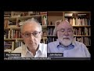

# The scandal of 'forgeries' in the Bible (2021-05-31)

## Description

Dr John Barton is a British Anglican priest and biblical scholar and Professor of the Interpretation of Holy Scripture at the University of Oxford.
Please consider supporting my work on Patreon: https://www.patreon.com/Bloggingtheology?fan_landing=true

## Summary of [The scandal of 'forgeries' in the Bible](https://www.youtube.com/watch?v=DY7V9Ch7Q5k)

*This summary is AI generated - there may be inaccuracies. *

### [00:00:00](https://www.youtube.com/watch?v=DY7V9Ch7Q5k&t=0) - [00:10:00](https://www.youtube.com/watch?v=DY7V9Ch7Q5k&t=600)

 "The scandal of 'forgeries' in the Bible" discusses how some scholars believe that some of the letters in the New Testament were not actually written by the apostles, but were instead forgeries. This is a controversial topic, as it challenges the authority of the Bible. The video goes on to discuss how the canonization process has led to some texts being considered more authoritative than others.

**[00:00:00](https://www.youtube.com/watch?v=DY7V9Ch7Q5k&t=0)** Scholars have come to the conclusion that some of the letters in the New Testament were not written by the apostles themselves, but were instead forgeries. This is a controversial topic, as Christians are supposed to trust the Bible as the word of God. However, if the letters in the New Testament are forgeries, this makes it difficult to trust anything else in the Bible.
* **[00:05:00](https://www.youtube.com/watch?v=DY7V9Ch7Q5k&t=300)** discusses the scandal of forgeries in the Bible, pointing out that some books, such as Second Peter, which are difficult to reconcile with other books in the New Testament, are still considered authoritative by Christians.
* **[00:10:00](https://www.youtube.com/watch?v=DY7V9Ch7Q5k&t=600)** The video discusses how forgeries have been found in the Bible, and how the canonization process has led to some texts being considered canonical while others are still considered dubious.

## Full transcript with timestamps

[0:00:00](https://youtu.be/DY7V9Ch7Q5k?t=0) now some of the conclusions pivotal  
[0:00:01](https://youtu.be/DY7V9Ch7Q5k?t=1) scholars come to  
[0:00:03](https://youtu.be/DY7V9Ch7Q5k?t=3) are not controversial and they're not  
[0:00:04](https://youtu.be/DY7V9Ch7Q5k?t=4) startling and shocking and so on  
[0:00:07](https://youtu.be/DY7V9Ch7Q5k?t=7) at all where the gospels are concerned i  
[0:00:09](https://youtu.be/DY7V9Ch7Q5k?t=9) think some of it is fairly  
[0:00:11](https://youtu.be/DY7V9Ch7Q5k?t=11) dynamite  
[0:00:15](https://youtu.be/DY7V9Ch7Q5k?t=15) i completely agree but can i suggest  
[0:00:17](https://youtu.be/DY7V9Ch7Q5k?t=17) there's actually an even more  
[0:00:18](https://youtu.be/DY7V9Ch7Q5k?t=18) controversial  
[0:00:19](https://youtu.be/DY7V9Ch7Q5k?t=19) subject um sort of hard point about the  
[0:00:20](https://youtu.be/DY7V9Ch7Q5k?t=20) controversies but these are the things  
[0:00:22](https://youtu.be/DY7V9Ch7Q5k?t=22) that perhaps really will surprise  
[0:00:24](https://youtu.be/DY7V9Ch7Q5k?t=24) us and viewers um and that is to do  
[0:00:27](https://youtu.be/DY7V9Ch7Q5k?t=27) with uh paul's letters  
[0:00:31](https://youtu.be/DY7V9Ch7Q5k?t=31) and it  
[0:00:34](https://youtu.be/DY7V9Ch7Q5k?t=34) is uh very widely accepted amongst new  
[0:00:37](https://youtu.be/DY7V9Ch7Q5k?t=37) testament scholars  
[0:00:38](https://youtu.be/DY7V9Ch7Q5k?t=38) outside of very conservative circles  
[0:00:40](https://youtu.be/DY7V9Ch7Q5k?t=40) perhaps in the united states and  
[0:00:42](https://youtu.be/DY7V9Ch7Q5k?t=42) one or two places elsewhere that the new  
[0:00:44](https://youtu.be/DY7V9Ch7Q5k?t=44) testament contains  
[0:00:45](https://youtu.be/DY7V9Ch7Q5k?t=45) letters which state that they are by  
[0:00:49](https://youtu.be/DY7V9Ch7Q5k?t=49) the apostle paul like the first letter  
[0:00:51](https://youtu.be/DY7V9Ch7Q5k?t=51) of timothy his second letter to timothy  
[0:00:53](https://youtu.be/DY7V9Ch7Q5k?t=53) and  
[0:00:53](https://youtu.be/DY7V9Ch7Q5k?t=53) letter of titus but nevertheless are not  
[0:00:56](https://youtu.be/DY7V9Ch7Q5k?t=56) usually seen  
[0:00:57](https://youtu.be/DY7V9Ch7Q5k?t=57) as uh by paul but are for variety of  
[0:01:00](https://youtu.be/DY7V9Ch7Q5k?t=60) reasons but seen as  
[0:01:02](https://youtu.be/DY7V9Ch7Q5k?t=62) uh much later works now  
[0:01:05](https://youtu.be/DY7V9Ch7Q5k?t=65) that in itself um as you say on page 185  
[0:01:10](https://youtu.be/DY7V9Ch7Q5k?t=70) scholars it was it has been common you  
[0:01:13](https://youtu.be/DY7V9Ch7Q5k?t=73) say  
[0:01:14](https://youtu.be/DY7V9Ch7Q5k?t=74) for new testament scholars to say that  
[0:01:15](https://youtu.be/DY7V9Ch7Q5k?t=75) the attribution of texts to people who  
[0:01:17](https://youtu.be/DY7V9Ch7Q5k?t=77) were not their actual  
[0:01:19](https://youtu.be/DY7V9Ch7Q5k?t=79) authors was a matter of convention in  
[0:01:22](https://youtu.be/DY7V9Ch7Q5k?t=82) the  
[0:01:22](https://youtu.be/DY7V9Ch7Q5k?t=82) ancient world and in the case of the  
[0:01:25](https://youtu.be/DY7V9Ch7Q5k?t=85) bible you know it's  
[0:01:26](https://youtu.be/DY7V9Ch7Q5k?t=86) often said well look um moses is is  
[0:01:29](https://youtu.be/DY7V9Ch7Q5k?t=89) given the honor of having author the  
[0:01:30](https://youtu.be/DY7V9Ch7Q5k?t=90) pentateuch and david all of the psalms  
[0:01:32](https://youtu.be/DY7V9Ch7Q5k?t=92) and  
[0:01:33](https://youtu.be/DY7V9Ch7Q5k?t=93) king solomon the actual proverbs  
[0:01:35](https://youtu.be/DY7V9Ch7Q5k?t=95) attributed  
[0:01:36](https://youtu.be/DY7V9Ch7Q5k?t=96) uh you know to him but you say that this  
[0:01:39](https://youtu.be/DY7V9Ch7Q5k?t=99) is  
[0:01:40](https://youtu.be/DY7V9Ch7Q5k?t=100) um you're not persuaded by that because  
[0:01:42](https://youtu.be/DY7V9Ch7Q5k?t=102) the letters in the new testament  
[0:01:44](https://youtu.be/DY7V9Ch7Q5k?t=104) uh are are the authentic ones uh  
[0:01:48](https://youtu.be/DY7V9Ch7Q5k?t=108) and the answer the lessons in the new  
[0:01:49](https://youtu.be/DY7V9Ch7Q5k?t=109) testament attributed to paul  
[0:01:52](https://youtu.be/DY7V9Ch7Q5k?t=112) within the text themselves claim to be  
[0:01:56](https://youtu.be/DY7V9Ch7Q5k?t=116) by paul so  
[0:01:57](https://youtu.be/DY7V9Ch7Q5k?t=117) nowhere in the pentateuch does it say i  
[0:01:59](https://youtu.be/DY7V9Ch7Q5k?t=119) moses wrote this he's not in the first  
[0:02:00](https://youtu.be/DY7V9Ch7Q5k?t=120) person  
[0:02:01](https://youtu.be/DY7V9Ch7Q5k?t=121) ditto for the proverbs um for the psalms  
[0:02:05](https://youtu.be/DY7V9Ch7Q5k?t=125) but paul's letter say to uh one timothy  
[0:02:08](https://youtu.be/DY7V9Ch7Q5k?t=128) actually claims to be by  
[0:02:09](https://youtu.be/DY7V9Ch7Q5k?t=129) paul and you argue uh persuasively  
[0:02:13](https://youtu.be/DY7V9Ch7Q5k?t=133) and in the light also by ehrman's uh  
[0:02:15](https://youtu.be/DY7V9Ch7Q5k?t=135) recent work  
[0:02:16](https://youtu.be/DY7V9Ch7Q5k?t=136) on uh his academic work called forgery  
[0:02:19](https://youtu.be/DY7V9Ch7Q5k?t=139) and counter forgery the big thick  
[0:02:21](https://youtu.be/DY7V9Ch7Q5k?t=141) scholarly tone which i i i've read  
[0:02:25](https://youtu.be/DY7V9Ch7Q5k?t=145) um he says that this common scholarly  
[0:02:28](https://youtu.be/DY7V9Ch7Q5k?t=148) idea that this um attribution of  
[0:02:31](https://youtu.be/DY7V9Ch7Q5k?t=151) false authorship was an accepted  
[0:02:33](https://youtu.be/DY7V9Ch7Q5k?t=153) convention in the ancient world  
[0:02:35](https://youtu.be/DY7V9Ch7Q5k?t=155) he argues and you do that absolutely no  
[0:02:38](https://youtu.be/DY7V9Ch7Q5k?t=158) evidence for this this is a  
[0:02:39](https://youtu.be/DY7V9Ch7Q5k?t=159) almost like an urban myth that scholars  
[0:02:41](https://youtu.be/DY7V9Ch7Q5k?t=161) have recycled and recycled over the  
[0:02:43](https://youtu.be/DY7V9Ch7Q5k?t=163) years  
[0:02:44](https://youtu.be/DY7V9Ch7Q5k?t=164) and in fact even in paul's letters uh  
[0:02:46](https://youtu.be/DY7V9Ch7Q5k?t=166) well i'm going to pause it but the point  
[0:02:48](https://youtu.be/DY7V9Ch7Q5k?t=168) is this that  
[0:02:50](https://youtu.be/DY7V9Ch7Q5k?t=170) the shocking thing here is that it is a  
[0:02:52](https://youtu.be/DY7V9Ch7Q5k?t=172) commonplace of new testament scholarship  
[0:02:54](https://youtu.be/DY7V9Ch7Q5k?t=174) that there are  
[0:02:55](https://youtu.be/DY7V9Ch7Q5k?t=175) forgeries actual forgeries in the new  
[0:02:58](https://youtu.be/DY7V9Ch7Q5k?t=178) testament  
[0:02:59](https://youtu.be/DY7V9Ch7Q5k?t=179) before being a letter that was written  
[0:03:03](https://youtu.be/DY7V9Ch7Q5k?t=183) with the intention to deceive its  
[0:03:05](https://youtu.be/DY7V9Ch7Q5k?t=185) readership  
[0:03:06](https://youtu.be/DY7V9Ch7Q5k?t=186) about the the true author of the text  
[0:03:10](https://youtu.be/DY7V9Ch7Q5k?t=190) and the author the pretend author being  
[0:03:12](https://youtu.be/DY7V9Ch7Q5k?t=192) someone famous  
[0:03:13](https://youtu.be/DY7V9Ch7Q5k?t=193) like peter or paul or or whoever  
[0:03:17](https://youtu.be/DY7V9Ch7Q5k?t=197) and and and this in the early church was  
[0:03:19](https://youtu.be/DY7V9Ch7Q5k?t=199) not an accepted  
[0:03:20](https://youtu.be/DY7V9Ch7Q5k?t=200) uh practice at all it scandalized  
[0:03:24](https://youtu.be/DY7V9Ch7Q5k?t=204) as you say that they abhorred it as we  
[0:03:26](https://youtu.be/DY7V9Ch7Q5k?t=206) can see in two thessalonians itself  
[0:03:28](https://youtu.be/DY7V9Ch7Q5k?t=208) where paul cheekily uh tells his readers  
[0:03:31](https://youtu.be/DY7V9Ch7Q5k?t=211) not to take  
[0:03:32](https://youtu.be/DY7V9Ch7Q5k?t=212) any notice of letters fraudulently  
[0:03:34](https://youtu.be/DY7V9Ch7Q5k?t=214) ascribed to him  
[0:03:35](https://youtu.be/DY7V9Ch7Q5k?t=215) as 2 thessalonians 2 2. the irony being  
[0:03:38](https://youtu.be/DY7V9Ch7Q5k?t=218) of course is that letter is probably a  
[0:03:39](https://youtu.be/DY7V9Ch7Q5k?t=219) forgery itself  
[0:03:41](https://youtu.be/DY7V9Ch7Q5k?t=221) so he's playing a game of double bluff  
[0:03:43](https://youtu.be/DY7V9Ch7Q5k?t=223) or something you know  
[0:03:44](https://youtu.be/DY7V9Ch7Q5k?t=224) a clever but and you discuss here  
[0:03:48](https://youtu.be/DY7V9Ch7Q5k?t=228) how christians are supposed to deal with  
[0:03:50](https://youtu.be/DY7V9Ch7Q5k?t=230) this if the new testament contains  
[0:03:52](https://youtu.be/DY7V9Ch7Q5k?t=232) works who whose authors intended to  
[0:03:55](https://youtu.be/DY7V9Ch7Q5k?t=235) deceive their readership  
[0:03:57](https://youtu.be/DY7V9Ch7Q5k?t=237) about the authorship of the text itself  
[0:04:01](https://youtu.be/DY7V9Ch7Q5k?t=241) how can we trust it just to to tell us  
[0:04:04](https://youtu.be/DY7V9Ch7Q5k?t=244) the god the god-given truth the gospel  
[0:04:06](https://youtu.be/DY7V9Ch7Q5k?t=246) truth about anything else  
[0:04:08](https://youtu.be/DY7V9Ch7Q5k?t=248) and can we and can these texts be used  
[0:04:10](https://youtu.be/DY7V9Ch7Q5k?t=250) in in churches  
[0:04:12](https://youtu.be/DY7V9Ch7Q5k?t=252) to proclaim the inspired word of god  
[0:04:15](https://youtu.be/DY7V9Ch7Q5k?t=255) if if that is the the nature of these  
[0:04:17](https://youtu.be/DY7V9Ch7Q5k?t=257) texts  
[0:04:19](https://youtu.be/DY7V9Ch7Q5k?t=259) so there's a lot there but i was just  
[0:04:20](https://youtu.be/DY7V9Ch7Q5k?t=260) trying  
[0:04:22](https://youtu.be/DY7V9Ch7Q5k?t=262) now i think i i mean what's happened is  
[0:04:25](https://youtu.be/DY7V9Ch7Q5k?t=265) that as you  
[0:04:26](https://youtu.be/DY7V9Ch7Q5k?t=266) quite rightly say um people have drawn  
[0:04:29](https://youtu.be/DY7V9Ch7Q5k?t=269) an analogy with  
[0:04:30](https://youtu.be/DY7V9Ch7Q5k?t=270) books in the old testament like proverbs  
[0:04:32](https://youtu.be/DY7V9Ch7Q5k?t=272) subscribe to solomon and so on  
[0:04:34](https://youtu.be/DY7V9Ch7Q5k?t=274) that's a matter of saying these works  
[0:04:36](https://youtu.be/DY7V9Ch7Q5k?t=276) are kind of under the aegis of somebody  
[0:04:38](https://youtu.be/DY7V9Ch7Q5k?t=278) you know they are solomonic  
[0:04:40](https://youtu.be/DY7V9Ch7Q5k?t=280) in flavor and and as you write again  
[0:04:44](https://youtu.be/DY7V9Ch7Q5k?t=284) right he said with the pentateuch he  
[0:04:45](https://youtu.be/DY7V9Ch7Q5k?t=285) doesn't even say it's by moses  
[0:04:47](https://youtu.be/DY7V9Ch7Q5k?t=287) that's an ancient tradition it's my  
[0:04:49](https://youtu.be/DY7V9Ch7Q5k?t=289) moses whereas  
[0:04:51](https://youtu.be/DY7V9Ch7Q5k?t=291) what one timothy says starts paul and  
[0:04:53](https://youtu.be/DY7V9Ch7Q5k?t=293) the apostle of jesus christ is on and  
[0:04:55](https://youtu.be/DY7V9Ch7Q5k?t=295) actually  
[0:04:56](https://youtu.be/DY7V9Ch7Q5k?t=296) identifies the author as paul and even  
[0:04:58](https://youtu.be/DY7V9Ch7Q5k?t=298) refers to  
[0:05:00](https://youtu.be/DY7V9Ch7Q5k?t=300) incidents happening in paul's life  
[0:05:03](https://youtu.be/DY7V9Ch7Q5k?t=303) and people he's working with now  
[0:05:06](https://youtu.be/DY7V9Ch7Q5k?t=306) perhaps these letters are genuinely by  
[0:05:09](https://youtu.be/DY7V9Ch7Q5k?t=309) paul  
[0:05:10](https://youtu.be/DY7V9Ch7Q5k?t=310) there are arguments that try to show  
[0:05:13](https://youtu.be/DY7V9Ch7Q5k?t=313) that they  
[0:05:13](https://youtu.be/DY7V9Ch7Q5k?t=313) are which are not nonsensical arguments  
[0:05:18](https://youtu.be/DY7V9Ch7Q5k?t=318) but the majority of biblical soldiers as  
[0:05:20](https://youtu.be/DY7V9Ch7Q5k?t=320) you say  
[0:05:21](https://youtu.be/DY7V9Ch7Q5k?t=321) are agreed that they're not genuinely  
[0:05:23](https://youtu.be/DY7V9Ch7Q5k?t=323) paul now whether one uses the words  
[0:05:25](https://youtu.be/DY7V9Ch7Q5k?t=325) forgery or not because it's partly a  
[0:05:27](https://youtu.be/DY7V9Ch7Q5k?t=327) matter of  
[0:05:29](https://youtu.be/DY7V9Ch7Q5k?t=329) um taste you know i can bart airman  
[0:05:32](https://youtu.be/DY7V9Ch7Q5k?t=332) likes using that kind of language  
[0:05:36](https://youtu.be/DY7V9Ch7Q5k?t=336) but it seems to me that it's not a bad  
[0:05:38](https://youtu.be/DY7V9Ch7Q5k?t=338) word to use  
[0:05:39](https://youtu.be/DY7V9Ch7Q5k?t=339) of a book which says it's by somebody  
[0:05:42](https://youtu.be/DY7V9Ch7Q5k?t=342) that  
[0:05:42](https://youtu.be/DY7V9Ch7Q5k?t=342) manifests is not by the question then is  
[0:05:46](https://youtu.be/DY7V9Ch7Q5k?t=346) can something which is  
[0:05:48](https://youtu.be/DY7V9Ch7Q5k?t=348) in that sense of forgery be of religious  
[0:05:51](https://youtu.be/DY7V9Ch7Q5k?t=351) and spiritual value  
[0:05:52](https://youtu.be/DY7V9Ch7Q5k?t=352) exactly and um i think we probably can  
[0:05:57](https://youtu.be/DY7V9Ch7Q5k?t=357) um i don't think there was a convention  
[0:05:59](https://youtu.be/DY7V9Ch7Q5k?t=359) that you could do this and you you point  
[0:06:01](https://youtu.be/DY7V9Ch7Q5k?t=361) out that  
[0:06:02](https://youtu.be/DY7V9Ch7Q5k?t=362) um to thessalonians is actually contains  
[0:06:05](https://youtu.be/DY7V9Ch7Q5k?t=365) a  
[0:06:06](https://youtu.be/DY7V9Ch7Q5k?t=366) denunciation of falsely inscribed  
[0:06:08](https://youtu.be/DY7V9Ch7Q5k?t=368) letters even though problems one itself  
[0:06:11](https://youtu.be/DY7V9Ch7Q5k?t=371) um but uh  
[0:06:14](https://youtu.be/DY7V9Ch7Q5k?t=374) nevertheless works that were thought not  
[0:06:18](https://youtu.be/DY7V9Ch7Q5k?t=378) to be genuine were sometimes read in the  
[0:06:20](https://youtu.be/DY7V9Ch7Q5k?t=380) early church  
[0:06:21](https://youtu.be/DY7V9Ch7Q5k?t=381) but mostly when they read and took  
[0:06:23](https://youtu.be/DY7V9Ch7Q5k?t=383) seriously documents  
[0:06:25](https://youtu.be/DY7V9Ch7Q5k?t=385) out with a claim to leave a particular  
[0:06:27](https://youtu.be/DY7V9Ch7Q5k?t=387) author they did believe that person was  
[0:06:29](https://youtu.be/DY7V9Ch7Q5k?t=389) the author  
[0:06:30](https://youtu.be/DY7V9Ch7Q5k?t=390) and the idea of that you would reject a  
[0:06:32](https://youtu.be/DY7V9Ch7Q5k?t=392) forgery was certainly  
[0:06:34](https://youtu.be/DY7V9Ch7Q5k?t=394) current in the greek and roman world and  
[0:06:36](https://youtu.be/DY7V9Ch7Q5k?t=396) in the role of the new testament  
[0:06:38](https://youtu.be/DY7V9Ch7Q5k?t=398) so i i'm inclined to think forgery is  
[0:06:41](https://youtu.be/DY7V9Ch7Q5k?t=401) not an unfair word to use  
[0:06:44](https://youtu.be/DY7V9Ch7Q5k?t=404) and that does raise the problem you you  
[0:06:47](https://youtu.be/DY7V9Ch7Q5k?t=407) brought out  
[0:06:48](https://youtu.be/DY7V9Ch7Q5k?t=408) what does it do what do you do i mean  
[0:06:51](https://youtu.be/DY7V9Ch7Q5k?t=411) another example  
[0:06:52](https://youtu.be/DY7V9Ch7Q5k?t=412) uh that's an even more prominent example  
[0:06:54](https://youtu.be/DY7V9Ch7Q5k?t=414) in the world of scholarship is the  
[0:06:55](https://youtu.be/DY7V9Ch7Q5k?t=415) second letter of peter  
[0:06:57](https://youtu.be/DY7V9Ch7Q5k?t=417) which is adversely seen as probably the  
[0:07:00](https://youtu.be/DY7V9Ch7Q5k?t=420) the most um the most certain or the most  
[0:07:02](https://youtu.be/DY7V9Ch7Q5k?t=422) highly probable example of  
[0:07:04](https://youtu.be/DY7V9Ch7Q5k?t=424) pseudopicrophar  
[0:07:05](https://youtu.be/DY7V9Ch7Q5k?t=425) or forgery in the entire new testament  
[0:07:09](https://youtu.be/DY7V9Ch7Q5k?t=429) and interesting i find about that um it  
[0:07:11](https://youtu.be/DY7V9Ch7Q5k?t=431) is usually dated to perhaps the middle  
[0:07:13](https://youtu.be/DY7V9Ch7Q5k?t=433) of the second century even as late as  
[0:07:14](https://youtu.be/DY7V9Ch7Q5k?t=434) that  
[0:07:15](https://youtu.be/DY7V9Ch7Q5k?t=435) is that in the letter itself uh which  
[0:07:18](https://youtu.be/DY7V9Ch7Q5k?t=438) claims to be by the apostle peter of  
[0:07:20](https://youtu.be/DY7V9Ch7Q5k?t=440) course  
[0:07:21](https://youtu.be/DY7V9Ch7Q5k?t=441) it claims to be eyewitness testimony the  
[0:07:23](https://youtu.be/DY7V9Ch7Q5k?t=443) author it was an eyewitness to  
[0:07:25](https://youtu.be/DY7V9Ch7Q5k?t=445) jesus own ministry its own life and i  
[0:07:28](https://youtu.be/DY7V9Ch7Q5k?t=448) think it alludes to the transfiguration  
[0:07:30](https://youtu.be/DY7V9Ch7Q5k?t=450) the event  
[0:07:31](https://youtu.be/DY7V9Ch7Q5k?t=451) mentioned in these public gospels now to  
[0:07:34](https://youtu.be/DY7V9Ch7Q5k?t=454) say this is a forgery  
[0:07:35](https://youtu.be/DY7V9Ch7Q5k?t=455) is really really serious because here we  
[0:07:38](https://youtu.be/DY7V9Ch7Q5k?t=458) have  
[0:07:39](https://youtu.be/DY7V9Ch7Q5k?t=459) fake testimony if i can be blunt to  
[0:07:42](https://youtu.be/DY7V9Ch7Q5k?t=462) alleged events in jesus  
[0:07:44](https://youtu.be/DY7V9Ch7Q5k?t=464) life which are made up or at least uh  
[0:07:46](https://youtu.be/DY7V9Ch7Q5k?t=466) the person who wrote it was not there  
[0:07:49](https://youtu.be/DY7V9Ch7Q5k?t=469) and he is passing off that information  
[0:07:51](https://youtu.be/DY7V9Ch7Q5k?t=471) as if it was eyewitness  
[0:07:52](https://youtu.be/DY7V9Ch7Q5k?t=472) if that happened in a court of law today  
[0:07:54](https://youtu.be/DY7V9Ch7Q5k?t=474) you'd be  
[0:07:56](https://youtu.be/DY7V9Ch7Q5k?t=476) uh prosecuted for perjury you know you  
[0:07:58](https://youtu.be/DY7V9Ch7Q5k?t=478) there will be consequences  
[0:08:00](https://youtu.be/DY7V9Ch7Q5k?t=480) um and and yet because because  
[0:08:03](https://youtu.be/DY7V9Ch7Q5k?t=483) i mentioned to peter because it seems to  
[0:08:05](https://youtu.be/DY7V9Ch7Q5k?t=485) me that the most um  
[0:08:07](https://youtu.be/DY7V9Ch7Q5k?t=487) widely accepted instance of  
[0:08:10](https://youtu.be/DY7V9Ch7Q5k?t=490) pseudo-pigofer in the new testament  
[0:08:12](https://youtu.be/DY7V9Ch7Q5k?t=492) um and yet it this very fact  
[0:08:15](https://youtu.be/DY7V9Ch7Q5k?t=495) is it seems to not be known by  
[0:08:18](https://youtu.be/DY7V9Ch7Q5k?t=498) the church uh at large the laity use  
[0:08:22](https://youtu.be/DY7V9Ch7Q5k?t=502) that let alone the general  
[0:08:23](https://youtu.be/DY7V9Ch7Q5k?t=503) public who just carry on using this as  
[0:08:26](https://youtu.be/DY7V9Ch7Q5k?t=506) as if it was  
[0:08:27](https://youtu.be/DY7V9Ch7Q5k?t=507) actual eyewitness testimony and some  
[0:08:30](https://youtu.be/DY7V9Ch7Q5k?t=510) people would see that as a bit  
[0:08:31](https://youtu.be/DY7V9Ch7Q5k?t=511) scandalous  
[0:08:32](https://youtu.be/DY7V9Ch7Q5k?t=512) given that what we know now what we now  
[0:08:34](https://youtu.be/DY7V9Ch7Q5k?t=514) know about that text and how it is still  
[0:08:36](https://youtu.be/DY7V9Ch7Q5k?t=516) used  
[0:08:36](https://youtu.be/DY7V9Ch7Q5k?t=516) petrine testimony from the apostle the  
[0:08:39](https://youtu.be/DY7V9Ch7Q5k?t=519) prince of the apostles  
[0:08:40](https://youtu.be/DY7V9Ch7Q5k?t=520) himself chosen by jesus to uh to head up  
[0:08:44](https://youtu.be/DY7V9Ch7Q5k?t=524) the college of the apostles  
[0:08:46](https://youtu.be/DY7V9Ch7Q5k?t=526) to his catholic language and yet it was  
[0:08:48](https://youtu.be/DY7V9Ch7Q5k?t=528) in fact  
[0:08:49](https://youtu.be/DY7V9Ch7Q5k?t=529) such of such origin is that not a bit a  
[0:08:52](https://youtu.be/DY7V9Ch7Q5k?t=532) bit of a scandal  
[0:08:53](https://youtu.be/DY7V9Ch7Q5k?t=533) perhaps well i think perhaps it is yes i  
[0:08:55](https://youtu.be/DY7V9Ch7Q5k?t=535) mean it's  
[0:08:56](https://youtu.be/DY7V9Ch7Q5k?t=536) um it depends  
[0:08:59](https://youtu.be/DY7V9Ch7Q5k?t=539) a little bit depends on the the question  
[0:09:02](https://youtu.be/DY7V9Ch7Q5k?t=542) are these books  
[0:09:03](https://youtu.be/DY7V9Ch7Q5k?t=543) authoritative for christians because  
[0:09:05](https://youtu.be/DY7V9Ch7Q5k?t=545) they're by apostles why are they  
[0:09:08](https://youtu.be/DY7V9Ch7Q5k?t=548) authority for christians because they're  
[0:09:09](https://youtu.be/DY7V9Ch7Q5k?t=549) in the new testament  
[0:09:12](https://youtu.be/DY7V9Ch7Q5k?t=552) so for example with paul if  
[0:09:15](https://youtu.be/DY7V9Ch7Q5k?t=555) two thessalonians is difficult to  
[0:09:17](https://youtu.be/DY7V9Ch7Q5k?t=557) reconcile with one thessalonians  
[0:09:19](https://youtu.be/DY7V9Ch7Q5k?t=559) do we say yes but they're both scripture  
[0:09:22](https://youtu.be/DY7V9Ch7Q5k?t=562) or do we say well what did paul  
[0:09:23](https://youtu.be/DY7V9Ch7Q5k?t=563) actually teach what he talks in first  
[0:09:25](https://youtu.be/DY7V9Ch7Q5k?t=565) sessions and not what's in second  
[0:09:27](https://youtu.be/DY7V9Ch7Q5k?t=567) thessalonians  
[0:09:28](https://youtu.be/DY7V9Ch7Q5k?t=568) and so if we're describing paul's  
[0:09:30](https://youtu.be/DY7V9Ch7Q5k?t=570) teaching we should we should remove  
[0:09:32](https://youtu.be/DY7V9Ch7Q5k?t=572) two thessalonians from the picture  
[0:09:35](https://youtu.be/DY7V9Ch7Q5k?t=575) that seems to me to be the way we should  
[0:09:37](https://youtu.be/DY7V9Ch7Q5k?t=577) proceed but for other people  
[0:09:39](https://youtu.be/DY7V9Ch7Q5k?t=579) because the books are scriptural books  
[0:09:42](https://youtu.be/DY7V9Ch7Q5k?t=582) they have an authority which overrides  
[0:09:44](https://youtu.be/DY7V9Ch7Q5k?t=584) the fact that they're probably forgeries  
[0:09:48](https://youtu.be/DY7V9Ch7Q5k?t=588) for me they don't i mean i have i have  
[0:09:50](https://youtu.be/DY7V9Ch7Q5k?t=590) to say i have a sort of um  
[0:09:53](https://youtu.be/DY7V9Ch7Q5k?t=593) sieve you know through which only  
[0:09:56](https://youtu.be/DY7V9Ch7Q5k?t=596) certain books  
[0:09:57](https://youtu.be/DY7V9Ch7Q5k?t=597) fall as it were um but  
[0:10:00](https://youtu.be/DY7V9Ch7Q5k?t=600) um for some people the pseudo  
[0:10:02](https://youtu.be/DY7V9Ch7Q5k?t=602) pseudo-epigraphy doesn't matter very  
[0:10:04](https://youtu.be/DY7V9Ch7Q5k?t=604) much  
[0:10:05](https://youtu.be/DY7V9Ch7Q5k?t=605) because the books are after all  
[0:10:07](https://youtu.be/DY7V9Ch7Q5k?t=607) canonical scripture  
[0:10:09](https://youtu.be/DY7V9Ch7Q5k?t=609) so i suppose if you have a more catholic  
[0:10:11](https://youtu.be/DY7V9Ch7Q5k?t=611) either roman catholic or  
[0:10:13](https://youtu.be/DY7V9Ch7Q5k?t=613) anglo-catholic a higher ecclesiology  
[0:10:16](https://youtu.be/DY7V9Ch7Q5k?t=616) then you know the church uh which is  
[0:10:18](https://youtu.be/DY7V9Ch7Q5k?t=618) founded by christ  
[0:10:19](https://youtu.be/DY7V9Ch7Q5k?t=619) is led by the holy spirit has canonized  
[0:10:22](https://youtu.be/DY7V9Ch7Q5k?t=622) this set of texts and no others  
[0:10:25](https://youtu.be/DY7V9Ch7Q5k?t=625) yeah and therefore that is the kind of  
[0:10:27](https://youtu.be/DY7V9Ch7Q5k?t=627) guarantor of their  
[0:10:29](https://youtu.be/DY7V9Ch7Q5k?t=629) uh not authenticity but at least they're  
[0:10:31](https://youtu.be/DY7V9Ch7Q5k?t=631) fitting this  
[0:10:32](https://youtu.be/DY7V9Ch7Q5k?t=632) and and uh for use in christian worship  
[0:10:35](https://youtu.be/DY7V9Ch7Q5k?t=635) and teaching  
[0:10:35](https://youtu.be/DY7V9Ch7Q5k?t=635) i suppose they might get around it that  
[0:10:37](https://youtu.be/DY7V9Ch7Q5k?t=637) way but it's still the niggling problem  
[0:10:39](https://youtu.be/DY7V9Ch7Q5k?t=639) is it not that  
[0:10:40](https://youtu.be/DY7V9Ch7Q5k?t=640) it's still a forgery you know you know  
[0:10:41](https://youtu.be/DY7V9Ch7Q5k?t=641) you know i'm sorry i think it is a  
[0:10:43](https://youtu.be/DY7V9Ch7Q5k?t=643) niggling problem  
[0:10:44](https://youtu.be/DY7V9Ch7Q5k?t=644) won't totally go away i mean it raises  
[0:10:48](https://youtu.be/DY7V9Ch7Q5k?t=648) across this the whole question of the  
[0:10:49](https://youtu.be/DY7V9Ch7Q5k?t=649) canon  
[0:10:50](https://youtu.be/DY7V9Ch7Q5k?t=650) which i've got a lot of material on in  
[0:10:51](https://youtu.be/DY7V9Ch7Q5k?t=651) the book and  
[0:10:53](https://youtu.be/DY7V9Ch7Q5k?t=653) um my argument is that the canon is  
[0:10:56](https://youtu.be/DY7V9Ch7Q5k?t=656) fuzzy at the edges  
[0:10:57](https://youtu.be/DY7V9Ch7Q5k?t=657) yes but in the early church there was a  
[0:11:00](https://youtu.be/DY7V9Ch7Q5k?t=660) core of books  
[0:11:01](https://youtu.be/DY7V9Ch7Q5k?t=661) which includes the synoptic gospels and  
[0:11:03](https://youtu.be/DY7V9Ch7Q5k?t=663) john and the major letters of paul  
[0:11:06](https://youtu.be/DY7V9Ch7Q5k?t=666) which everybody agreed on and then there  
[0:11:08](https://youtu.be/DY7V9Ch7Q5k?t=668) are other letters that people knew were  
[0:11:10](https://youtu.be/DY7V9Ch7Q5k?t=670) a bit dubious  
[0:11:11](https://youtu.be/DY7V9Ch7Q5k?t=671) so even in the fourth century when we  
[0:11:14](https://youtu.be/DY7V9Ch7Q5k?t=674) find some athanasius  
[0:11:16](https://youtu.be/DY7V9Ch7Q5k?t=676) laying down what's in the little cannon  
[0:11:18](https://youtu.be/DY7V9Ch7Q5k?t=678) he says well the letters of two and  
[0:11:20](https://youtu.be/DY7V9Ch7Q5k?t=680) three  
[0:11:21](https://youtu.be/DY7V9Ch7Q5k?t=681) john second and third letters of john  
[0:11:24](https://youtu.be/DY7V9Ch7Q5k?t=684) are regarded by some of spurious  
[0:11:28](https://youtu.be/DY7V9Ch7Q5k?t=688) um on the same sorts of grounds as you  
[0:11:30](https://youtu.be/DY7V9Ch7Q5k?t=690) were mentoring for two peter  
[0:11:32](https://youtu.be/DY7V9Ch7Q5k?t=692) and it was known that some of the  
[0:11:34](https://youtu.be/DY7V9Ch7Q5k?t=694) lessons were dubious  
[0:11:36](https://youtu.be/DY7V9Ch7Q5k?t=696) and what's happened over time is that  
[0:11:38](https://youtu.be/DY7V9Ch7Q5k?t=698) the canon has  
[0:11:40](https://youtu.be/DY7V9Ch7Q5k?t=700) solidified into something where  
[0:11:42](https://youtu.be/DY7V9Ch7Q5k?t=702) everything is of equal  
[0:11:43](https://youtu.be/DY7V9Ch7Q5k?t=703) stature whereas in the early church  
[0:11:46](https://youtu.be/DY7V9Ch7Q5k?t=706) there were definitely  
[0:11:46](https://youtu.be/DY7V9Ch7Q5k?t=706) gradations of canonicity and of  
[0:11:49](https://youtu.be/DY7V9Ch7Q5k?t=709) authority  
[0:11:51](https://youtu.be/DY7V9Ch7Q5k?t=711) because eusebius in his uh famous  
[0:11:53](https://youtu.be/DY7V9Ch7Q5k?t=713) ecclesiastical history he discusses  
[0:11:56](https://youtu.be/DY7V9Ch7Q5k?t=716) the books that are you know are in and  
[0:11:58](https://youtu.be/DY7V9Ch7Q5k?t=718) those that are doubtful and those  
[0:11:59](https://youtu.be/DY7V9Ch7Q5k?t=719) are definitely out you know the new  
[0:12:01](https://youtu.be/DY7V9Ch7Q5k?t=721) testament kind of  
[0:12:02](https://youtu.be/DY7V9Ch7Q5k?t=722) is in both those first two categories  
[0:12:04](https://youtu.be/DY7V9Ch7Q5k?t=724) anyway there's some doubtful  
[0:12:06](https://youtu.be/DY7V9Ch7Q5k?t=726) texts or considered doubtful by many and  
[0:12:08](https://youtu.be/DY7V9Ch7Q5k?t=728) two peter is  
[0:12:09](https://youtu.be/DY7V9Ch7Q5k?t=729) i think one of them and other texas yes  
[0:12:11](https://youtu.be/DY7V9Ch7Q5k?t=731) that's right  
[0:12:13](https://youtu.be/DY7V9Ch7Q5k?t=733) yes there's a there are there are three  
[0:12:15](https://youtu.be/DY7V9Ch7Q5k?t=735) levels  
[0:12:16](https://youtu.be/DY7V9Ch7Q5k?t=736) there's definitely indefinitely out and  
[0:12:18](https://youtu.be/DY7V9Ch7Q5k?t=738) dubious  
[0:12:20](https://youtu.be/DY7V9Ch7Q5k?t=740) yes uh in the middle and um that was the  
[0:12:23](https://youtu.be/DY7V9Ch7Q5k?t=743) position for  
[0:12:24](https://youtu.be/DY7V9Ch7Q5k?t=744) most of the early fathers for the first  
[0:12:26](https://youtu.be/DY7V9Ch7Q5k?t=746) three or four centuries  
[0:12:28](https://youtu.be/DY7V9Ch7Q5k?t=748) in christianity rather than either the  
[0:12:31](https://youtu.be/DY7V9Ch7Q5k?t=751) thing is a canonical text or it isn't  
[0:12:33](https://youtu.be/DY7V9Ch7Q5k?t=753) there was a middle category  
