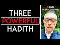

# Three POWERFUL Hadith | #shorts by Paul Williams (2021-09-30 19:24:14+00:00)

## Description

Three POWERFUL Hadith | #shorts by Paul Williams

## Summary of [Three POWERFUL Hadith | #shorts by Paul Williams](https://www.youtube.com/watch?v=SShHyz5VOtU)

*This is an AI generated summary. There may be inaccuracies. *

### [00:00:00](https://www.youtube.com/watch?v=SShHyz5VOtU&t=0) - [00:00:00](https://www.youtube.com/watch?v=SShHyz5VOtU&t=0)

This YouTube video discusses three powerful hadith, or sayings of the Prophet Muhammad. The first is that acts of kindness are charity, the second is that one can avoid being burned in the afterlife by repenting and doing good deeds, and the third is that one can protect oneself from the fire by seeking refuge in Allah.

**[00:00:00](https://www.youtube.com/watch?v=SShHyz5VOtU&t=0)** The three powerful hadith discussed in this video are about how acts of kindness are charity, how to avoid being burned in the afterlife, and how to protect oneself from the fire.

## Full transcript with timestamps

[0:00:00](https://youtu.be/SShHyz5VOtU?t=0) the prophet muhammad upon whom the peace  
[0:00:03](https://youtu.be/SShHyz5VOtU?t=3) said the following preserved in three  
[0:00:05](https://youtu.be/SShHyz5VOtU?t=5) authentic hadiths  
[0:00:07](https://youtu.be/SShHyz5VOtU?t=7) every act of kindness is a charity  
[0:00:11](https://youtu.be/SShHyz5VOtU?t=11) bukhari 1621  
[0:00:14](https://youtu.be/SShHyz5VOtU?t=14) do not regard any act of kindness as  
[0:00:17](https://youtu.be/SShHyz5VOtU?t=17) insignificant even meeting your brother  
[0:00:19](https://youtu.be/SShHyz5VOtU?t=19) with a cheerful countenance  
[0:00:22](https://youtu.be/SShHyz5VOtU?t=22) muslim 26 26  
[0:00:26](https://youtu.be/SShHyz5VOtU?t=26) protect yourselves from the fire even  
[0:00:28](https://youtu.be/SShHyz5VOtU?t=28) with half a date bukhari 14 17.  
